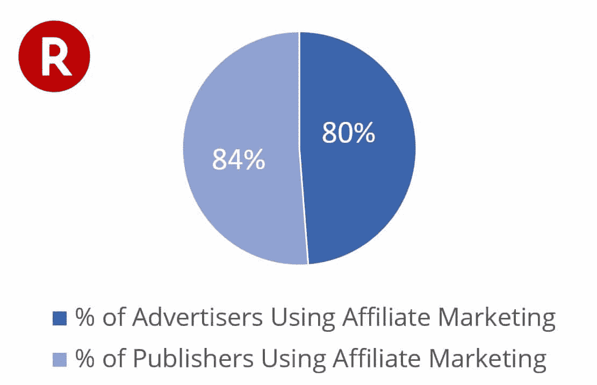
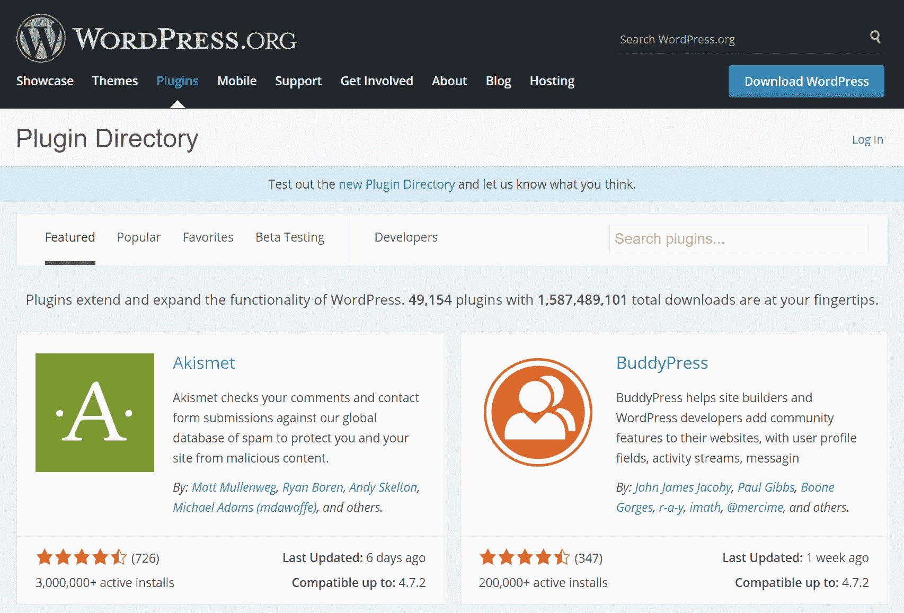
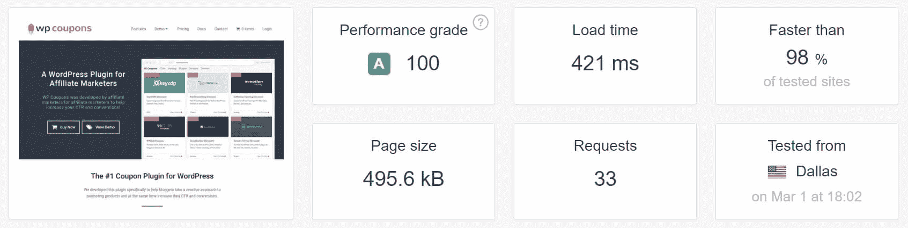
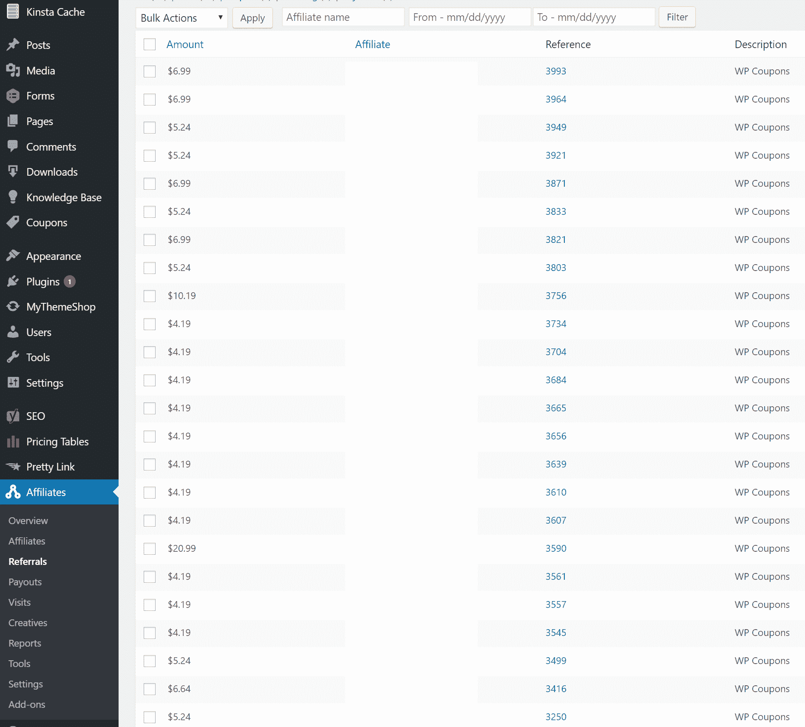
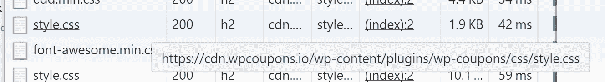
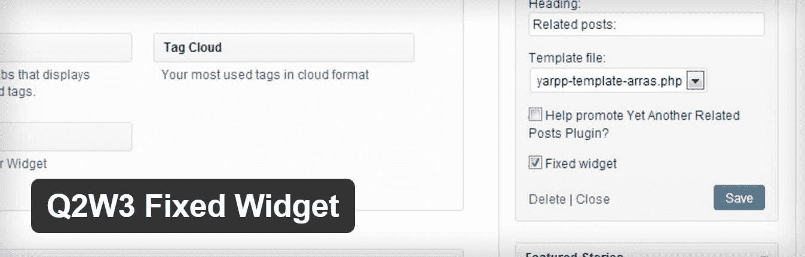

# 推出高级 WordPress 优惠券插件(幕后)

> 原文：<https://kinsta.com/blog/wordpress-coupon-plugin/>

联盟营销空间正在蓬勃发展，并已成长为推动销售的一个非常重要和有效的渠道。很大程度上要感谢 WordPress，许多网络营销人员现在在家工作，通过他们的网站谋生。如今，当消费者考虑购买新商品时，通常会在网上查看评论。虽然这可能被视为一个好或坏，互联网营销商就在那里，等待利用这种流量。除了在 Kinsta 全职工作，我还开发和支持一个高级 WordPress 优惠券插件，专门针对[联盟营销商](https://kinsta.com/affiliate-academy/how-to-become-an-affiliate-marketer/)。今天我将带你了解一些幕后的事情，看看它是如何发生的，以及**第一次推出插件时面临的一些挑战**。

*   [联盟营销增长](#affiliate-marketing-growth)
*   [构建一个 WordPress 优惠券插件](#building-wordpress-coupon-plugin)

## 联盟营销增长

根据 2016 年乐天联盟网络研究报告，2015 年至 2020 年间，美国联盟营销支出将以 10.1%的复合年增长率增长，预计将达到 68 亿美元。从这个角度来看，2016 年《纽约时报》的[平面广告下降了 16%](https://www.nytimes.com/2017/02/02/business/media/new-york-times-q4-earnings.html) 。随着万维网的持续发展，大量的广告正在转移到代销商领域。口碑仍然是公司创造销售的最佳方式之一，而联盟营销可以被视为一种简单发生在网上的口碑营销。我们刚刚在金斯塔推出了我们自己的[加盟计划](https://kinsta.com/affiliates/)。请务必立即注册，充分利用定期佣金！

Forrester survey of 150 advertising companies (min $200 million revenue) and 150 publishers ranking top 5,000 by traffic volume.

由于这个市场的大规模增长，现在很难在网上辨别谁在说真话。例如，如果你在谷歌上搜索“[最佳 WordPress 主机](https://kinsta.com/blog/managed-wordpress-hosting/)”，你会突然被数百个博主狂轰滥炸，他们都声称知道谁是最佳主机。通常会有两种不同的人群。**那些通常喜欢通过分享他们个人使用的解决方案来帮助他人的人**，以及**那些仅仅为了佣金而帮助推销产品或服务的人**。不幸的是，很大一部分人属于后一类人。所以我们总是建议在网上做研究时要小心。

> 联盟营销是一种高价值、低风险的策略，已被证明可以推动品牌的销售和认知度，增加出版商的收入……如果做得好，它可以在品牌和出版商之间，以及出版商和他们的受众之间培养互利和真实的关系。–乐天联盟网络总经理兼高级副总裁 Adam Weiss。

话虽如此，仍有许多诚实的联盟营销者，有时他们可能需要一点帮助或推动，让他们的建议被看到。

## 构建一个 WordPress 优惠券插件

我大部分的空闲时间(如果那是真的话)都花在我的营销博客上，从 2000 年初开始，我就是一名代销商，也是一名重度 WordPress 用户。我想我属于前面提到的那一类人。就像我们在金斯塔这里做的一样，我试图只回顾我个人每天使用的高质量服务和产品，这些服务和产品实际上会为游客提供价值。不幸的是**提供真正的价值意味着我必须比一般的代销商更加努力。因此，在 2015 年初，我开始尝试其他方法来增加 woorkup 上的转化率，这就是 WP 优惠券插件的诞生。**

[T2】](https://wpcoupons.io/)

在启动它之前，我四处寻找不同的当前解决方案，这些方案将为我提供我需要做的事情。以下是我最初试图完成的事情清单:

*   在我的 WordPress 工具条上显示优惠券(随机和基于帖子的特定优惠券)
*   在他们自己的页面上显示一个漂亮的优惠券列表
*   有一个短码插入优惠券的页面，帖子，我需要他们的地方
*   看起来是当前的和现代的，或者至少提供一种用 CSS 修改设计的简单方法
*   加载速度快，不依赖一堆第三方脚本或大量使用 JavaScript

[Sometimes the best #WordPress plugins are born out of need.Click to Tweet](https://twitter.com/intent/tweet?url=https%3A%2F%2Fkinsta.com%2Fblog%2Fwordpress-coupon-plugin%2F&via=kinsta&text=Sometimes+the+best+%23WordPress+plugins+are+born+out+of+need.)

我觉得这不应该太复杂，对吧？嗯，有一些插件做了我需要的一些事情，但大多数都过时了，并不具备所有功能。所以我决定自己来建造它，这里是我一路走来学到的一些有价值的经验。很多人没有意识到实际构建、开发和销售 WordPress 插件的所有细节。这不是一夜之间发生的。

### 1.我需要建立一个 WordPress 插件，但我不是开发人员

虽然有些人认为我是 WordPress 开发者，但我不是。我离它还远着呢。我了解 PHP 和 CSS，但是当实际构建自己的函数和循环时，我的大脑就不是那样了。所以我必须克服的第一个问题是，我如何开发这个插件？

幸运的是，对其他人来说，这比想象的要简单一些。原来我哥哥是全职 WordPress 开发者。所以我问他是否会编码所有的东西。到第二周，我们已经有了一些东西，并在 woorkup 上运行。现在，很明显，不是每个人都有一个家庭成员是 WP 开发者。我在那里很幸运。因此，如果你需要找一个有信誉的 WordPress 开发者，在简单外包之前，先联系社区并询问一下。**找到一个合作伙伴，而不仅仅是一个开发者，可能是你以后最大的财富之一**。

外面有很多很棒的资源。首先，你可能想看看我们在[上的博客文章，在那里可以找到并雇佣 WordPress 开发者](https://kinsta.com/blog/hire-wordpress-developer/)。大卫也有一个很棒的帖子，关于如何[找到最好的 WordPress 开发者](https://www.collectiveray.com/wordpress/wordpress-tips-and-tricks/wordpress-developers-for-hire.html)。不要忘记 [WordPress 脸书群组](https://www.facebook.com/search/groups/?q=advanced%20wordpress)，在那里你可以寻求一些快速推荐，甚至找到一个潜在的合作伙伴。

### 2.需求变成了产品

大约 6 个月过去了，我们在 woorkup 上运行自己开发的插件。我们立即看到点击量、注册量和代销商销售额全面增长。将优惠券指向一个特定的帖子，然后让它随着用户滚动，这种能力一夜之间增加了代销商的销售额。在这 6 个月里，我注意到我不断收到人们的询问，询问我在我的网站上用来展示优惠券的插件，以及他们可以在哪里购买。很长一段时间，我只是回答说这是我们定制的东西，不出售。

当我们第一次构建这个插件时，我们从来没有打算出售它。但我们最终意识到，随着博客作者的电子邮件源源不断地涌入，我们错过了一个机会。所以我最终和我的兄弟 50/50 合作，把我们自己开发的项目变成了一个优质的 WordPress 插件。这也是为什么我之前提到你应该找一个值得信赖和可靠的合作伙伴的原因。如果你想更上一层楼，你已经做了一些艰苦的工作。

[Play it safe developing a new #WordPress plugin, let the market set the demand, then scale.Click to Tweet](https://twitter.com/intent/tweet?url=https%3A%2F%2Fkinsta.com%2Fblog%2Fwordpress-coupon-plugin%2F&via=kinsta&text=Play+it+safe+developing+a+new+%23WordPress+plugin%2C+let+the+market+set+the+demand%2C+then+scale.)

另一个警告是也要谨慎行事。即使你可能会收到很多关于某样东西的电子邮件，也不一定意味着有足够的需求来保证花时间开发和销售一个插件。我和我哥哥决定稳扎稳打，慢慢来，**根据用户反馈和一段时间内的销售情况来决定。
T3】**

### 3.决定品牌和域名

我对网络上已经使用的商标和品牌名称做了一些快速调查。我们想让事情变得简单，并且[找到一个合适的域名](https://kinsta.com/blog/choose-domain-name/)，所以我们最终选定了 WP 优惠券。也许不是世界上最有创意的名字，但它完成了任务。我们也知道我们不能在名称中使用“WordPress ”,因为这是对 Automattic 的商标侵权。正如我们几年前看到的 [WordPress 助手](https://wptavern.com/the-wordpress-foundation-sues-jeff-yablon-for-trademark-infringement)，他们确实对这类事情采取了行动。

我个人是[的超级粉丝。io domains](https://kinsta.com/knowledgebase/what-is-io/) ，这也是我们品牌的一部分，因为我们希望这个名字与我们的域名 wpcoupons.io 相匹配。com 只是一个破损的网页，没有被使用。我试着联系了失主，但是没有任何回音。就商标而言，[在域名](https://www.shoutmeloud.com/using-wordpress-in-domain-name.html)中使用 WordPress 也是如此。为你的 WordPress 插件选择品牌时要非常小心。

### 4.选择平台、电子商务解决方案和托管

现在我们必须销售插件，我们需要一个网站和平台来分发它。当然，**我们选择了 WordPress** ，因为我们认为它是[最好的网页内容管理系统](https://kinsta.com/blog/why-use-wordpress/)！然后，我们必须选择是否要走免费增值模式。许多开发插件的开发者在 WordPress 知识库上有一个免费版本，在他们自己的网站上有一个高级版本。这里的全部目标是利用来自存储库的流量向人们追加销售高级版本。我们选择不走这条路。

WordPress repository

在 WordPress 社区工作了一段时间后，我已经看到了很多关于知识库的恐怖故事。你还记得不久前 Zerif 主题发生了什么，当时它被 WordPress.org 暂停。像这样的每个案例都有它自己的情况，虽然我对 WordPress 核心管理员非常尊重，但我决定我不想为此争论。即使这意味着更少的流量和更少的销售！为了留在存储库中，您还必须跨越其他耗时的障碍。也就是说，你应该**仔细考虑你是否想加入 WordPress 知识库**。

## 注册订阅时事通讯

### 想知道我们是怎么让流量增长超过 1000%的吗？

加入 20，000 多名获得我们每周时事通讯和内部消息的人的行列吧！

[Subscribe Now](#newsletter)

我们还需要一个电子商务解决方案来分发我们的插件。我对 WooCommerce 已经很熟悉了，但也听说过关于 T2 简易数字下载的伟大事迹。皮聘创造的一切似乎都变成了金子。虽然 WooCommerce 可以用来分发数字文件，但 EDD 似乎是更好的选择。回顾过去，我们很高兴我们走上了这条路，因为我们从来没有遇到过任何问题。 **EDD 非常简单**，将它连接到支付处理器并推出新的插件更新轻而易举。

最后但同样重要的是，我们必须为我们的 WordPress 站点选择主机。信不信由你，我实际上是金斯塔的第一批顾客之一。当我第一次看到马克在做什么时，我通过 Skype 与他联系。这是入队前的几年。我亲自尝试了世界上所有的 WordPress 主机，其性能简直无与伦比。将 EDD 和 Kinsta 结合起来，你会得到一个超级快速加载的电子商务网站。

Easy Digital Downloads load time

### 5.加盟计划

由于我和我哥哥都有全职工作，我们知道我们需要走联盟计划这条路。我们没有时间每天推广这个插件，我们希望依靠 WordPress 社区来传播这个消息。此外，作为一个联盟营销者，我知道如果人们知道他们可以从帮助销售插件中获得佣金会发生什么。

我们必须做出的下一个重大决定是，**如果其他人帮助销售插件，我们愿意给他们多少佣金？我们所做的是，我们实际上从较低的水平开始，在获得一些用户反馈后，最终达到了 20%的水平。**

为了让一切正常工作，我们最终选择了 [AffiliateWP](https://affiliatewp.com/) ，它也是由 Pippin 创建的。我们很高兴我们做到了！设置很容易，我们在几分钟内就启动并运行了。如果你想为你的 WordPress 插件或服务推出一个联盟项目，那么 AffiliateWP 是最棒的！联盟计划现在每月负责大约 50%的销售额。

Affiliate sales plugin

### 6.发展

我们还必须弄清楚我们将如何进行插件的持续开发。在本地开发固然很好，但当涉及到与他人分享时(在这种情况下，是我的兄弟与我分享)，就行不通了。这实际上是 Kinsta 的[登台环境](https://kinsta.com/help/staging-environment/)派上用场的地方。

当插件准备生产时，我们要做的第一件事是用不同的 WordPress 主题测试它，以确保兼容性。我们简单地创建了一个新的暂存环境，并开始安装数百个 WordPress 主题。以下是我们测试插件时使用的一些流行主题:

*   WordPress
*   212 年
*   二十一三
*   WordPress
*   二十点十五分
*   WordPress
*   阿巴达
*   泰晤士河
*   红利
*   茁壮成长主题
*   活力
*   (计划或理论的)纲要
*   报纸
*   单词
*   额外的
*   悉尼
*   activelle
*   零一点
*   雅典娜(智慧与技艺的女神)
*   奥尔卡
*   总数
*   但丁
*   优越的
*   彩色地图
*   广阔的
*   波塞冬
*   发展
*   尼萨尔格
*   托尔图加
*   葛藤碱

staging 的美妙之处在于，当我们完成主题测试时，我们简单地删除了我们的 staging 环境。然后，我们重新创建了一个全新的暂存环境，专门用于测试插件更新。暂存环境可以通过它们自己的 URL 公开访问，因此我的兄弟能够在其中编写新特性，然后我可以在我们将代码更改推向生产之前立即测试它们。

Struggling with downtime and WordPress problems? Kinsta is the hosting solution designed to save you time! [Check out our features](https://kinsta.com/features/)

如果一个阶段环境对您来说还不够，Kinsta 还提供了添加多达五个[高级阶段环境](https://kinsta.com/help/premium-staging-environments/)的选项，让您可以灵活地同时测试多个迭代。

如果你正在开发一个 WordPress 插件，有一个简单的工作流程是非常重要的，尤其是在与多人打交道的时候。**你不应该在你的网站上做开发工作**！

### 7.性能至关重要

这场演出从一开始就对我们非常重要。我对 WordPress 开发者最大的不满之一是有些人不在乎。即使在像这样的小插件上，它仍然很重要。性能必须从某处开始。目前，我们的插件不使用任何 JavaScript，后端低于 40 KB，前端低于 2KB。一切都是独立的，不依赖第三方。

WP Coupons performance

我们 woorkup 网站的一个功能是将优惠券指向特定的帖子，然后与用户一起滚动，这一功能一夜之间增加了代销商的销售额。因此，对于滚动功能，我们实际上利用了已经很棒的免费 [Q2W3 固定小部件](https://wordpress.org/plugins/q2w3-fixed-widget/)插件，而不是在我们自己内部构建这个集成。

Scrolling WordPress widget

如果它没坏，就不要修理它！这样做的好处是，对于那些不想要滚动功能的人来说，我们可以把 JavaScript 从插件中去掉。我建议开发者在给你的插件增加额外的权重之前，看看你所有的选项。我们可以自己添加这个功能，并使滚动功能可选，但这又要取决于时间。

### 8.根据用户的反馈采取行动，并保留变更日志

如果让我猜的话，我可能会说我们增加的 90%的功能都来自用户反馈。其中许多是我们自己从来没有想到过的聪明想法。例如，前几天 Colin 发了一条推文，问我们关于在自定义帖子类型上添加 forge widget 选项的问题。这实际上是一件非常简单的事情，事实上，我们刚刚在最近的更新中推出了它。

> 嘿[@ brianlejackson](https://twitter.com/brianleejackson?ref_src=twsrc%5Etfw),[@ wpcouponsio](https://twitter.com/wpcouponsio?ref_src=twsrc%5Etfw)“强制窗口小部件”选项是否也适用于自定义帖子类型？慢慢地建造这个网站
> 
> —科林新人(@ ColinNewcomer)[2017 年 2 月 15 日](https://twitter.com/ColinNewcomer/status/831807394149593088?ref_src=twsrc%5Etfw)