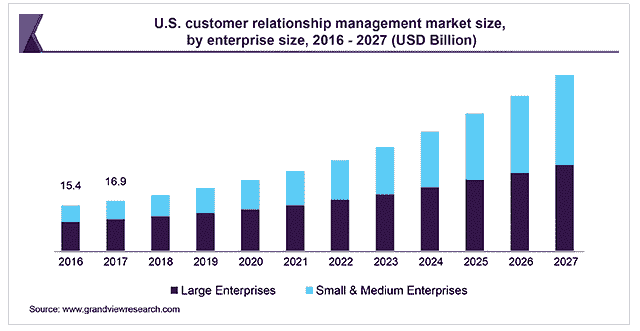
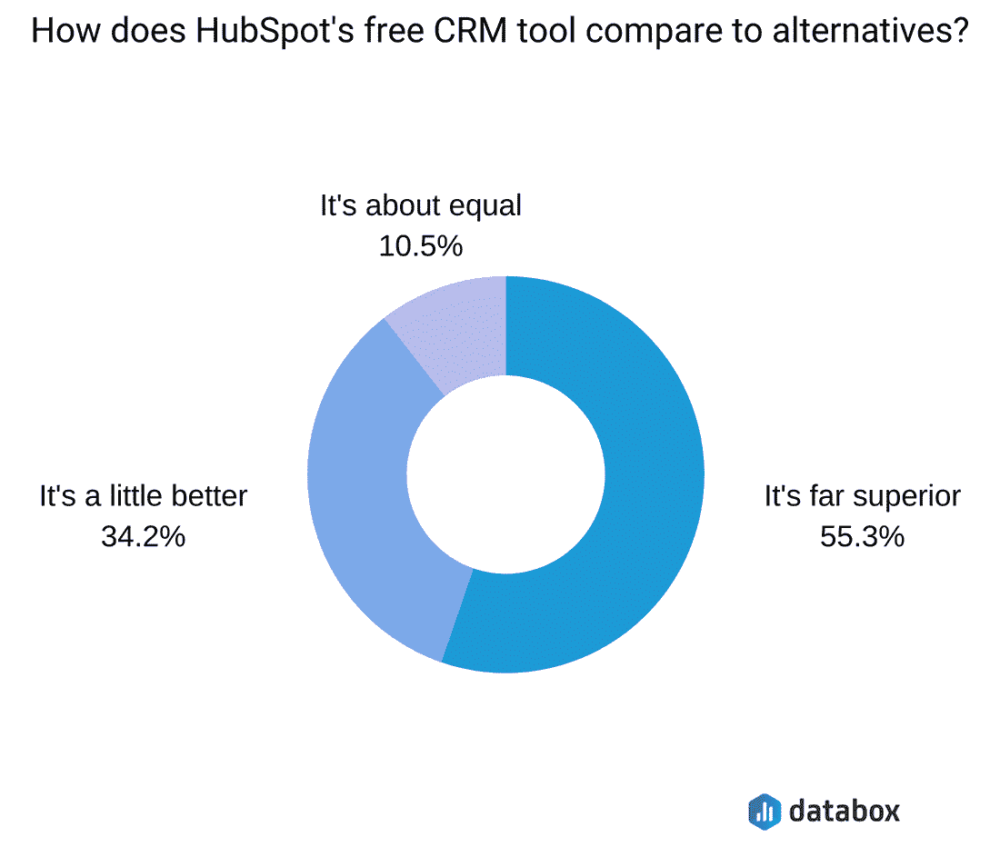
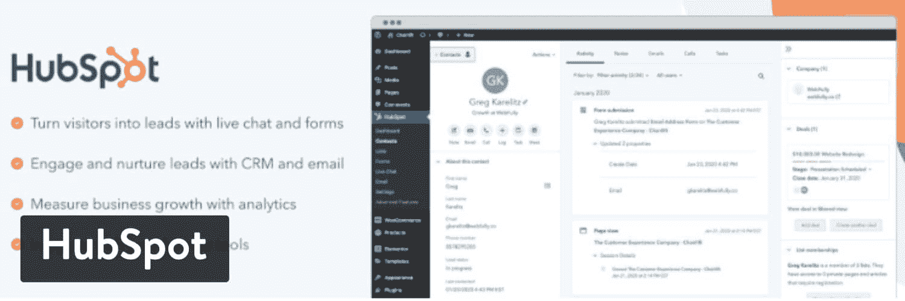
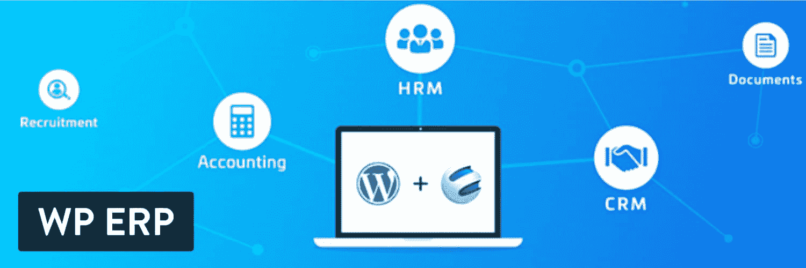
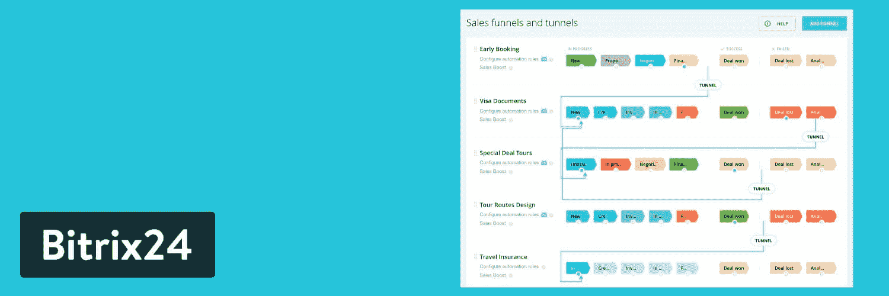
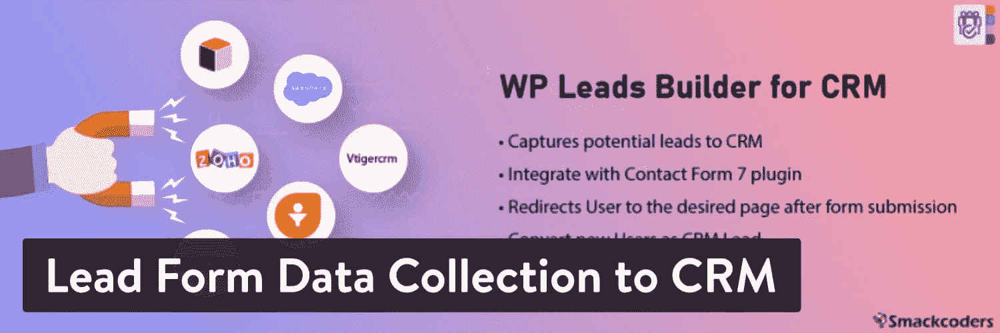
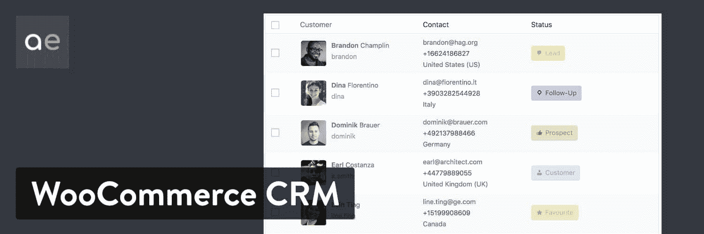
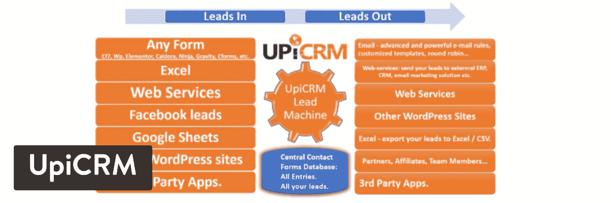
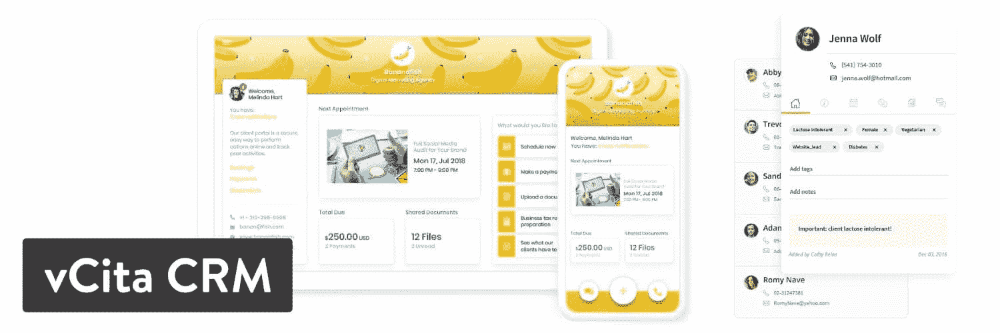

# 14 个 WordPress CRM 插件将在 2022 年提升你的业务

> 原文：<https://kinsta.com/blog/wordpress-crm/>

真正的客户关系管理(CRM)软件可以帮助您了解您的客户，并在整个客户生命周期中与他们互动。

这是通过收集和分析大量数据来完成的。从潜在客户到营销再到客户服务，收集和分析客户数据可以发现问题领域并揭示隐藏的机会。

CRM software market size

CRM 行业一直被视为一个不断增长的市场。然而，由于企业已经看到的盈利结果，它实际上已经成为世界上最大的软件市场。[预计到 2027 年，CRM 销售额将以 14.2%](https://www.grandviewresearch.com/industry-analysis/customer-relationship-management-crm-market) 的复合年增长率增长。

这就是 WordPress CRM 插件发挥作用的地方。

## 如何选择最好的 WordPress CRM 插件

WordPress CRM 插件是每个公司最终都会得到的工具之一。然而，有些企业只需要最低限度的需求，而其他企业则需要高级的现场定制和强大的集成。

有相当多的 CRM 插件可供选择，但我们希望在完成您对 CRM 的研究时，重点介绍一些必备的功能。以下是要寻找的内容:

*   一个完整的联系人捕获系统，带有表单生成器和将这些表单放在您的网站上的选项。这应该尽可能简单。要寻找的一些东西包括[拖放构建器](https://kinsta.com/blog/wordpress-page-builders/)、小部件和短代码。
*   [多个数据库](https://kinsta.com/blog/wordpress-database-plugin/)用于存储您的客户信息和使用自定义字段，使数据库适合您独特的业务需求。
*   带有图表和可打印报告的报告模块。我们希望看到共享和打印的元素，因为你通常不只是自己看报告。
*   可视化管道管理，让您的客户进入客户生命周期，并了解如何一次又一次地转化他们。
*   用于向管理员和客户端发送通知的消息工具。这可以与日程安排软件集成，甚至用于实时聊天。
*   面向管理员和客户的简洁界面。我们喜欢看到像社交网络简介一样简单的简介。当客户可以通过他们的个人资料和上传文档与管理员交流时，这也很好。
*   很高兴看到 WooCommerce 的整合。到许多其他插件的链接，像[联系人表单插件](https://kinsta.com/blog/wordpress-contact-form-plugins/)，也是有益的。
*   发票工具，用于从客户处收款，并有可能创造一个[经常性收入流](https://kinsta.com/blog/recurring-revenue-model/)。
*   [任务调度器](https://kinsta.com/blog/wordpress-project-management-plugins/)帮助您的员工按部就班，并安排与客户的会面。
*   活动日志和笔记，以便您可以回头查看与客户讨论的内容。
*   标签、过滤和搜索栏，可轻松找到您需要的客户和组。
*   应用程序和扩展，或者某种用于链接到其他 CRM、插件和网站平台的集成工具。

[CRM 销售额预计到 2027 年将增长 14.2%😱这使得选择最好的 WordPress CRM 插件成为发展你的业务的重要部分📈 点击推文](https://twitter.com/intent/tweet?url=https%3A%2F%2Fkinsta.com%2Fblog%2Fwordpress-crm%2F&via=kinsta&text=CRM+sales+are+expected+to+expand+14.2%25+by+2027+%F0%9F%98%B1-+which+makes+choosing+the+best+WordPress+CRM+plugin+an+essential+part+of+growing+your+business+%F0%9F%93%88&hashtags=CRM%2Csales)

> 需要在这里大声喊出来。Kinsta 太神奇了，我用它做我的个人网站。支持是迅速和杰出的，他们的服务器是 WordPress 最快的。
> 
> <footer class="wp-block-kinsta-client-quote__footer">
> 
> 
> 
> <cite class="wp-block-kinsta-client-quote__cite">Phillip Stemann</cite></footer>

[View plans](https://kinsta.com/plans/)

## 2022 年最佳 WordPress CRM 插件

为了帮助你筛选所有可用的选项，这里有值得一看的顶级 WordPress CRM 插件(排名不分先后)。

### 1.轮毂点

HubSpot 的 WordPress 插件允许你将你的 WordPress 网站连接到免费的 HubSpot CRM，这样你就可以组织、跟踪和培养你的潜在客户和客户。这个插件不仅仅是一个 CRM，它有一整套功能，可以制作表格，在你的网站上运行实时聊天，并提供[分析](https://kinsta.com/blog/google-analytics-alternatives/)。甚至还有一个电子邮件营销工具，可以自动发送电子邮件和[时事通讯](https://kinsta.com/newsletter)。

这一切都集中在一个漂亮的包中，以吸引游客，并建立一个美丽的客户管理平台。[根据 Databox 报告](https://databox.com/track-sales-activity-with-hubspot-crm) , **53.3%** 的受访者认为 HubSpot 的免费 CRM 工具远远优于竞争对手。

HubSpot’s free CRM tool is considered superior by many (Source: Databox)

HubSpot 以其强大的营销工具而闻名，因此这是一个利用市场上一些最先进的客户关系工具的绝佳机会。

如前所述，CRM 是完全免费的，它有一个 WordPress 插件来整合你当前的网站。只需几分钟即可配置您的 CRM online。然后，一个交互式演示将带您浏览带有图表和报告的漂亮仪表板。

HubSpot WordPress plugin

CRM 插件附带了一个免费的[表单生成器](https://kinsta.com/blog/wordpress-forms/)，它将捕获你的访问者提交的内容，并自动与 CRM 同步。即使你使用不同的表单工具，如[重力表单](https://kinsta.com/blog/wordpress-contact-form-plugins/#gravity-forms)或[忍者表单](https://kinsta.com/blog/wordpress-contact-form-plugins/#ninja-forms)，这些线索也会自动添加到你的联系人列表中。

表单生成器非常适合创建弹出窗口、横幅和[嵌入式表单](https://kinsta.com/blog/embed-google-form/)。除了有价值的 CRM，你还可以使用[实时聊天](https://kinsta.com/blog/wordpress-live-chat-plugin/)和聊天机器人与你的潜在客户联系，大规模个性化你的对话。所有聊天都会自动记录在 CRM 中。

我们还喜欢内置的丰富数据分析。该插件自动用来自网络的公共信息丰富联系人的个人资料，如职位和社交资料。

*   价格:免费(HubSpot 提供了大量其他工具，你可以选择付费。)
*   **点评:** 4.5 分满分 5 颗星(WordPress.org)
*   **活跃安装:** 100，000 以上
*   **PHP 版本:** 5.6 以上

#### 使它成为一个伟大的 WordPress CRM 插件的特性

*   CRM 系统内置了一个联系人管理平台，可以轻松建立和划分名单。
*   所有与客户的互动都记录在 HubSpot 中，告诉你用户在你的网站上做了什么，以及你是否与他们有过任何交流。
*   每个联系人的互动和交流都是实时更新的。这样，您不必一直手动更改客户资料。
*   作为客户支持选项，可以进行实时聊天对话。不仅如此，你所有的实时聊天都记录在 CRM 中。
*   每个联系人都有其页面浏览量标记，供您查看，并了解他们如何与您的网站互动。
*   表单生成器非常适合构建符合您品牌的设计。表单生成器也有几个弹出窗口和其他营销策略的选项。
*   为每个客户提供一个统一的时间表，解释每个人在客户生命周期中的位置，以及您是否应该联系他们。
*   电子邮件营销工具具有出色的设计功能，它允许您每月免费发送多达 2000 封电子邮件。
*   所有的设计都是在拖放生成器的帮助下完成的。这样，你不必是一个有经验的开发人员或编码人员来完成这项工作。
*   当用户使用你的品牌时，自动发送电子邮件。这包括用于列表注册的[电子邮件](https://kinsta.com/blog/how-to-build-an-email-list/)和您配置的其他触发器。
*   插件附带了几个预先设计好的电子邮件模板。
*   有一个页面概述了您的报告和分析，提供了关于您的生命周期如何以及电子邮件是否有效的深入信息。
*   您可以选择在哪些页面上显示您的弹出窗口、实时聊天机器人和其他客户交流项目。
*   该插件提供了 300 多个无缝集成，其中一些包括 WooCommerce、 [Stripe](https://kinsta.com/blog/stripe-for-wordpress/) 和 Gravity Forms。你还可以将 HubSpot 链接到 [Zapier](https://kinsta.com/blog/woocommerce-zapier/) ，从而开启更多的集成。

#### 谁应该考虑这个 WordPress CRM？

HubSpot 的 WordPress 插件是一个有趣的 WordPress CRM 解决方案，因为它提供免费工具，但对于那些超越限制的人来说，它变得昂贵。例如，对于小型企业来说，超过每月 2000 封电子邮件的上限并不罕见。然而，在那之后，随着 HubSpot 之外的更便宜的电子邮件营销解决方案，价格急剧上升。

尽管如此，一些公司实际上发现，如果他们使用 HubSpot 套件中的所有 CRM 和营销工具，这是一个更便宜的选择。简而言之，HubSpot 对小企业来说是一笔不小的开支，但拥有稳定现金流的快速增长的公司会将其视为一个强大的盟友。

### 2.WP ERP

WP ERP 是一个免费插件，它将小型和大型企业与 CRM、HRM 和会计解决方案结合在一起。它目前有超过 10，000 个活跃安装，评级良好。

这个 WordPress CRM 插件由不同的模块组成，一个用于 CRM 功能，另一个用于人力资源管理和会计解决方案。它们没有任何限制，所以您可以在所有模块中创建任意多的条目。

WP ERP WordPress plugin

你不需要支付任何费用就可以开始使用 [WP ERP 插件](https://wordpress.org/plugins/erp/)。免费版有最重要的工具来帮助您的企业与客户保持联系，并记录这些互动。一些免费元素包括公司信息管理、定位工具和假日日历。您还可以创建联系人组，并在客户档案中做笔记。

并非所有企业都需要高级版本，但它确实提供了高级支持、大量扩展以及支付网关和薪资工具等元素。这些计划的起价为每年 112 美元，对于大型企业和机构，最高可达每年 714 美元。

*   **价格:**核心插件免费。更高级的计划从每年 112 美元开始。
*   **点评:** 4.4 分满分 5 颗星(WordPress.org)
*   **活跃安装:** 10，000 以上
*   **PHP 版本:** 5.6 以上

#### 使它成为一个伟大的 WordPress CRM 插件的特性

*   超过 40 种货币支持[从世界各地的客户](https://kinsta.com/blog/stripe-vs-paypal/)和顾客处收款。
*   美丽的通知电子邮件发送给客户和管理员，有几个模板可供选择。
*   你可以用白色标签创建一个完整的公司简介
*   人力资源经理被打包到 WP ERP 插件中，具有管理位置、处理员工福利和共享全公司公告的功能。
*   客户管理在 CRM 中工作得很好，有处理客户生命周期和创建联系组的选项。
*   你可以为所有顾客做笔记。
*   [活动日志](https://kinsta.com/blog/wordpress-activity-log/)就在那里，这样你就可以查看客户，看看你之前谈了什么。
*   您可以在属性和关键字的帮助下过滤您的客户数据库。
*   如果您有代理，该插件允许您将某些联系人分配给组织中的特定人员。
*   CRM 活动报告非常有助于了解您的公司如何发展，以及您的服务是否有助于客户。
*   CRM 提供了一个令人难以置信的会计系统，为非会计人员提供了工具。一些功能包括资产负债表、收入跟踪和报告。
*   相当多的扩展可供你付费使用，比如考勤模块、人力资源前端和 WooCommerce 集成。

#### 谁应该考虑这个 WordPress CRM？

CRM 的大部分功能都是免费的，所以我们再次表示，这是为有成本意识的公司提供的解决方案。如果您计划进行大量集成，这也是一个非常好的工具。例如，它集成了几个电子邮件活动管理器、会计工具和支付网关。

最后，你也许可以用 WP ERP 插件完全摆脱你的会计软件，看看它是如何内置的。

### 3.WordPress CRM 插件

WordPress CRM 插件提供了一个全功能的 CRM，可以放在你的 WordPress 仪表盘上。它可以免费下载并在你的网站上使用，还可以选择使用付费插件，如 Zapier、WooCommerce 和 Invoicing extensions。

一个[高级版本](https://www.wp-crm.com/)也可以以每年 99 美元的价格获得，这可以让你获得高级支持和一个扩展包。这完全取决于您需要的功能，因此您可能最终不得不为某些东西付费。

使用标准的核心插件，您可以在数据库中存储无限数量的联系人。该插件拥有管理项目、跟踪营销和为员工设置个人任务的工具。你可以随时导出或导入你的记录，这也很好。

WordPress CRM WordPress plugin

如前所述，WordPress CRM 插件有一个不错的插件列表可供选择。一些公司可能会发现核心插件已经足够了，但很高兴看到你可以在这些扩展的帮助下链接到 Dropbox，Slack，Ninja Forms，以及其他许多插件。

*   **价格:**免费，有几个你可以付费购买的附加服务。
*   **点评:** 4.4 分满分 5 颗星(WordPress.org)
*   **活动安装:** 500 个以上
*   **PHP 版本:**未列出

#### 使它成为一个伟大的 WordPress CRM 插件的特性

*   WordPress CRM 插件提供简单的联系人管理，对你的数据库中有多少没有限制。
*   您可以使用自定义字段为您的品牌调整 CRM 日志记录系统。
*   [项目管理](https://kinsta.com/blog/wordpress-project-management-plugins/)基本要素被打包到插件中，不再需要做同样事情的二级插件。
*   如果您想从一个 CRM 迁移到另一个 CRM，您可以导入和导出大型 CSV 文件。
*   这份报告非常全面，可以看到公司业绩、即将到来的截止日期，以及你如何对待客户的整体情况。
*   该插件集成了大量的高级插件，可以选择链接到 [Slack](https://kinsta.com/blog/how-to-use-slack/) ，Gravity Forms 等等。
*   有一个点击功能，可以在几秒钟内建立联系。它并不能最终确定你的联系日志，但它可以在销售电话中获得重要信息。
*   支持少数几种语言，所以说英语以外语言的人可以享受这个插件。
*   这个特定的 CRM 不在开发者的服务器上托管。因此，您不需要为服务付费，并且您可以完全控制和拥有您的数据。
*   客户区插件非常适合与您的客户共享信息，如发票、任务和活动。
*   通知是针对项目和任务之类的事情发出的。这些是在仪表板中配置的。
*   该插件是开发人员友好的，允许您制作自己的自定义报告、字段等。

#### 谁应该考虑这个 WordPress CRM？

WordPress CRM 插件有一个免费版本，有很多功能。因此，它看起来像是品牌预算的守护者。这也是我们测试过的最简单的界面之一，对于那些厌倦了市场上沉闷的 CRM 的人来说是理想的。

我们也向需要灵活性和可扩展性的公司推荐这个 CRM 插件。插件是负担得起的，并且总是在那里等着你去激活。从 Zendesk 连接到用于链接到 [MailChimp](https://kinsta.com/blog/how-to-use-mailchimp/) 的附加组件，这些附加组件一定会帮助您的业务。最好的部分是你不必为你不需要的物品付钱。

### 4.Salesforce 的在线销售线索

Salesforce 可能是最广为人知的 CRM 解决方案。无论大小企业都使用它，它是一个强大的选项，设计精巧，功能强大。

Salesforce 的主要优势之一是一切都存储在云中，因此您可以通过 web 或移动设备访问它。他们现在有一个针对 Salesforce 的 [Web-to-Lead 插件。](https://wordpress.org/plugins/salesforce-wordpress-to-lead/)

Brilliant Web-to-Lead for Salesforce WordPress plugin

这个 CRM 插件允许你通过你的 WordPress 站点收集销售线索，然后[将它们直接发送到你的 Salesforce 账户。以前，用户必须忍受从一个程序向另一个程序复制和粘贴信息的艰巨任务。](https://kinsta.com/blog/wordpress-rss-feed/)

这里的主要缺点是，你需要使用两个工具来进行 CRM。直接在 WordPress 中保存和管理客户信息是最理想的，但这同时也是很好的第一步。

该插件本身是免费的，但是，它需要一个高级 Salesforce 帐户才能进行集成。

*   **价格:**该插件是免费的，但您需要为 Salesforce 帐户付费。该计划起价为每个用户每月 25 美元。Salesforce 有几十种不同价格的产品和套件。
*   **点评:** 4.4 分满分 5 颗星(WordPress.org)
*   **活跃安装:** 7，000 个以上
*   **PHP 版本:**未列出

#### 使它成为一个伟大的 WordPress CRM 插件的特性

*   该插件链接到市场上最强大的 CRM 解决方案之一，减少了从 WordPress 向 Salesforce 导出和导入客户数据的需求。
*   这个插件提供了一个联系表格，可以放在你的 WordPress 站点的任何地方。
*   有一个[小工具](https://kinsta.com/blog/wordpress-widgets/)可以让你在线插入表格时更加灵活。
*   表单生成器位于 [WordPress 仪表盘](https://kinsta.com/knowledgebase/wordpress-admin/)中，可以选择大量的联系信息字段。
*   帐户和联系人管理元素提供客户沟通、内部讨论以及与社交媒体网站的联系。
*   Salesforce 中有一个名为 opportunity management 的区域，该区域对产品进行分类，分析竞争情况，并让您发出报价。
*   Salesforce 提供了线索管理选项，用于以最有效的方式跟踪您的线索。
*   从方便的 Salesforce 仪表板检查您的销售数据。
*   Salesforce 通过提供可视化工作流和文件同步(仅举几个功能为例)提高了工作效率。
*   Salesforce 提供了相当多的营销工具。其中一些包括电子邮件工作室、旅程构建器和社交工作室。它们都直接集成到 Salesforce CRM 中。

#### 谁应该考虑这个 WordPress CRM？

Salesforce 有一个学习曲线，价格适中。但是，如果您正确实施，它会很快获得回报。不管你的企业有多大，Salesforce 都可以将各种销售和客户关系工具整合到你的企业中。总的来说，我们喜欢 CRM 作为一个一体化的解决方案，帮助可行的企业快速扩展。

如果你是一个没有太多现金流的小企业，一些免费插件是你更好的选择。此外，请记住，除非您有 Salesforce 计划，否则 Salesforce WordPress 插件不会做任何事情。

### 5.完成 x24 CRM

免费的 [Bitrix24 CRM 工具](https://www.bitrix24.com/)也是另一个不错的 WordPress CRM 解决方案。这在技术上不是一个插件，而是一个专门为 WordPress 设计的集成。

它将联系人存储在你的 WordPress 用户数据库中，你可以手动添加联系人，或者通过你网站上的[线索生成表](https://kinsta.com/blog/wordpress-lead-generation/)自动获取联系人。如果您对您的潜在客户和客户被指定为用户的想法感到不舒服，您可以放心一点，因为您知道您可以指定分配给他们的默认角色。

高级选项还允许您指定哪些字段是必填的。使用 Bitrix24 CRM，你可以在你的 WordPress admin 中方便地编辑表格和管理联系人。每个联系人记录可以按联系人类型分类，并有一个通信线程，所以你可以跟踪每一个互动。该工具的一大优势是支持选项。开发者在他们的网站和博客上有一个强大的支持区域。

Bitrix24 CRM for WordPress

我们建议您测试一下 Bitrix24 CRM，看看它是否适合您的组织。根据在线评论，一些用户喜欢它，而另一些人则喜欢其他选择。主要的好处包括它是完全免费的，所有的工具都整合到了 WordPress 仪表盘中。因此，您不必转移到另一个平台来管理您的客户。

相当多的应用程序也可以与 Bitrix24 CRM 配合使用。有些是免费的，有些则需要付费。我们注意到的一些应用包括活动日历、点击发送短信和呼叫机器人 24 应用。许多应用程序似乎与客户管理密切相关，它们旨在帮助销售人员提高工作效率或分析客户数据。

*   价格:对无限用户免费，但功能有限，如果按年付费，可以选择升级到 16.80 美元起的高级计划。
*   **评论:**未列出
*   **活动安装:**未列出
*   **PHP 版本:**未列出

#### 使它成为一个伟大的 WordPress CRM 插件的特性

*   Bitrix24 CRM 提供了创建联系表单的简单工具，与其他插件直接集成，用于发送电子邮件和管理这些客户。
*   在[短码](https://kinsta.com/blog/wordpress-shortcodes/)的帮助下，联系方式可以放在你网站的任何地方。
*   获得使用自定义属性和分类来组织用户的选项。
*   使用列表过滤器查找特定的人。这对于大型联系人列表尤其有用。
*   您能够跟踪与客户的所有通信。这意味着能够记录消息和写下你自己关于你的用户的笔记。
*   为调整数据库的组织方式，提供了单独编辑和批量编辑。
*   通知管理区域用于确定在发生特定操作时，哪些客户和员工会收到消息。例如，您可能希望向客户发送一封电子邮件来跟进销售。您还可以向管理员发送提醒。
*   借助 CSV 导入和导出工具，批量导入成为可能。
*   动态图表显示在仪表板上，用于量化您的数据并了解您与客户的互动方式。
*   这个插件有一个发送短信通知的插件。如果你计划向你的客户关系管理中的联系人进行营销，这是非常好的。
*   当你所有的发票都发出去的时候，一些集成是非常好的。您可以记录已付款的发票，并为尚未付款的客户重新登记。
*   CRM 有自定义字段，包括一些独特的字段，如客户的最佳联系时间、过去的销售和所需的服务。
*   [设置用户角色](https://kinsta.com/blog/wordpress-user-roles/)以确保需要访问 CRM 的人确实拥有它。这也有助于保护您的数据不被不该访问它的人访问。
*   虽然定制主要是为表单和字段保留的，但插件也提供了一些颜色选项，以使您的界面尽可能舒适，并有可能匹配您的品牌。

#### 谁应该考虑这个 WordPress CRM？

对于那些想要免费 CRM 的人来说，Bitrix24 CRM 看起来是一个可靠的选择。除了应用程序之外，没有太多的追加销售，所以大多数功能都内置在核心插件中。更不用说，许多应用程序都是免费下载的。对于那些对第二个 CRM 仪表板没有任何兴趣的人来说，这也很棒。这是一个在你的 WordPress 仪表盘上做所有工作的插件，创造一个人们习惯的界面。

最后，Bitrix24 CRM 中的报告非常强大。您可以创建无限的记录和自定义字段，同时为您的利益相关者生成复杂的报告，在共享文档时没有任何问题。您还可以访问发票和电子邮件营销功能，使其成为一个完整的 CRM 和营销套件，而不仅仅是一个 CRM。

### 6.联系方式 7 Zoho

[Zoho CRM](https://www.zoho.com/crm/) 没有官方的 WordPress 插件，但是有几个第三方的 WordPress 插件可以帮助你与价格实惠且功能强大的 Zoho CRM 工具集成。Zoho 以其全面的营销和商业管理产品而闻名。它类似于[谷歌工作区](https://kinsta.com/blog/google-workspace/)，因为它提供电子邮件账户、客户关系管理、发票、文档存储等等。

这是一个评级很高的 WordPress 插件，它将 [Zoho CRM 套件链接到你的 Contact Form 7 插件](https://wordpress.org/plugins/cf7-zoho/)，将你的 Contact Form 提交与 CRM 同步。简而言之，您可以像往常一样使用[联系表单 7](https://kinsta.com/blog/contact-form-7/) 创建一个联系表单，但是与简单的联系表单相比，关注潜在客户开发更有意义。然后，一个提交的表单被直接发送到 Zoho，所有的信息都被记录并保存下来以备后用。

Contact Form 7 Zoho WordPress plugin

WordPress 插件库中列出的核心插件是免费的。但是，您可以选择升级以获得特优支持和附加功能。[高级版](https://www.crmperks.com/plugins/contact-form-plugins/contact-form-zoho-plugin/?utm_source=wordpress&utm_medium=directory&utm_campaign=zoho_readme)的价格从 59 美元起，25 个网站的价格涨到 149 美元。设置很简单，特别是对于目前的 Zoho 用户。很高兴看到有大量的自定义字段和过滤器用于创建您的联系人表单和过滤列表。

*   **价格:**核心插件免费。高级网站许可证起价 59 美元。Zoho CRM 也有自己的定价。
*   **点评:** 5 颗星中的 5 颗(WordPress.org)
*   **活跃安装:**2000 个以上
*   **PHP 版本:** 5.3 以上

#### 使它成为一个伟大的 WordPress CRM 插件的特性

*   一个先进的搜索工具可以根据快速电话号码和电子邮件搜索来轻松筛选和识别联系人。
*   你可以[将插件连接与谷歌分析](https://kinsta.com/blog/google-analytics-wordpress/)集成。这对于将你的网站统计数据和潜在客户生成统计数据结合起来是至关重要的。
*   该插件包括一个地理定位功能，用于即时获取位置信息。可能不完全正确，但你至少可以找到客户所在的城市。
*   为 Zoho CRM 创建自定义模块，并允许所有联系人的附件和标签。
*   你可以在 WordPress 中创建联系人，也可以在 Zoho 中创建联系人。联系人是在哪里创建的并不重要，因为它会在程序之间来回同步。
*   你为你的联系表单创建的字段数量没有限制，它在插件和 Zoho 中都是可定制的。
*   可以过滤您发送到 Zoho CRM 的所有[联系表 7](https://kinsta.com/blog/wordpress-contact-form-plugins/#contact-form-7) 提交。这使得事情变得更容易，因为您不必在两个系统中创建独特的过滤器。
*   从你的 WordPress 仪表盘手动发送你选择的任何数据。例如，任何来自表单的联系信息都可以由您选择并发送给 Zoho。这对于阻止发送某些数据也很有用。
*   Zoho CRM 记录你与客户的所有互动，让你很容易了解客户与你沟通时的想法。
*   每个客户都有一个出现在 WordPress 和 Zoho 上的个人资料。Zoho 版本要深入得多，但是 WordPress 的简介对于引用联系人和使用一个销售渠道和沟通的界面来说是很棒的。
*   数据可以作为对象注释发送。

#### 谁应该考虑这个 WordPress CRM？

很容易决定谁应该考虑 Contact Form 7 Zoho 插件。如果你已经在使用 Zoho 的一个产品，考虑一下你的 CRM 插件。如果你已经在你的 WordPress 网站上使用了 Contact Form 7 插件，这看起来也是显而易见的。

Zoho CRM 有几个计划。就高级 CRM 选项而言，Zoho 是迄今为止最便宜的。它将一系列令人难以置信的功能打包到 CRM 中，您将获得顶级的客户支持。

### 7.将表单数据收集导入 CRM

成百上千的 CRM 软件可用于收集联系人、管理他们以及了解他们在客户生命周期中的位置。然而，最大的问题往往是为你的网站找到一个整合点，无论是 WordPress 还是其他网站建设者。

[Lead Form Data Collection to CRM](https://wordpress.org/plugins/wp-leads-builder-any-crm/)插件为市场上和 WordPress 网站上一些最流行的 CRM 解决了这个问题。这并不意味着世界上的每一个 CRM 都可以链接到这个插件，但是有一个很好的机会，你可以让它工作，这取决于 CRM。

Lead Form Data Collection to CRM WordPress plugin

例如，这个插件支持像 Vtiger、Freshsales、SugarCRM、Salesforce 和 Zoho 这样的选项。我们已经在此列表中突出显示了 Salesforce 和 Zoho，但如果您使用这些 CRM，这是另一个要考虑的选项。

更重要的是，如果你想将这个插件与另一个 CRM 集成，你可以访问这个 API。

关于这个插件有趣的是，它基本上只是 WordPress 和 CRM 之间的一个连接。然而，从数据收集到客户关系管理插件的引导接受了这个简单的任务，并且做得很好。

## 注册订阅时事通讯

### 想知道我们是怎么让流量增长超过 1000%的吗？

加入 20，000 多名获得我们每周时事通讯和内部消息的人的行列吧！

[Subscribe Now](#newsletter)

*   价格:有免费版和 99 美元的高级版。
*   **点评:** 3.9 满分 5 星(WordPress.org)。
*   **活动安装:** 800+
*   **PHP 版本:**未列出。

#### 使它成为一个伟大的 WordPress CRM 插件的特性

*   该插件适用于大多数联系人表单，因此您可以决定您最喜欢的插件，并将其连接到该插件。
*   该插件还集成了许多流行的 CRM，包括 Salesforce、SugarCRM 和 Freshsales。开发者工具提供给你来集成插件网站上没有正式列出的 CRM。
*   你可以通过插件创建无限数量的表单。
*   您网站上收集的所有联系信息都会被转换为正确的格式，并作为销售线索推送到您的 CRM。
*   该插件利用短代码使这成为一个无缝的过程，可以选择将短代码放在帖子、页面和小部件等区域。
*   有一个名为“工作流”的功能，可以将你所有的 WordPress 联系人与 CRM 同步，本质上是合并你的联系人列表，并允许你从一个仪表板上访问该列表。
*   不需要使用[第三方联系人表单插件](https://kinsta.com/blog/wordpress-forms/)。如果你不想再添加一个插件，这个插件提供了制作一个简单的联系表单所需的工具。
*   您可以在所有新联系人提交联系信息后将他们重定向到另一个页面。
*   当人们注册名单时，管理员会自动收到电子邮件。您还可以选择向用户发送电子邮件。
*   该插件有一个可选的 [WooCommerce](https://kinsta.com/blog/woocommerce-tutorial/) 插件，可以从收银台找到线索和联系信息，并将它们发送到你的 CRM。
*   你可以从 [MemberPress](https://kinsta.com/blog/wordpress-membership-plugins/#memberpress) 等地方同步某些字段。所以，运行一个[会员网站](https://kinsta.com/blog/wordpress-membership-plugins/)要容易得多，看看这个插件如何在 CRM 中组织你的会员数据。
*   无论是新用户还是注册了很长时间的用户，都可以在 CRM 和 WordPress 之间同步用户。
*   当插件遇到重复的联系人时，一些设置是可用的。您可以选择是否要跳过该联系人，更新它，或创建一个副本。
*   谷歌验证码功能对于阻挡不必要的访客和机器人非常有用。
*   WooCommerce 功能还允许您立即将[废弃购物车](https://kinsta.com/blog/abandoned-cart-email/)的客户信息发送到您的 CRM。

#### 谁应该考虑这个 WordPress CRM？

从数据收集到 CRM 插件的引导对于那些使用强大的 CRM 但是没有直接连接到 WordPress 网站的品牌来说是非常重要的。这是一个对那些已经在使用像 SugarCRM 或 Zoho CRM 这样的 CRM 的人有意义的插件。

至于价格，这不应该吓走任何人，因为核心插件是免费的，高级版本是负担得起的。总的来说，我们向那些需要表单来收集数据并将其发送到第三方 CRM 的人推荐这个插件。它看起来也像是需要在 WooCommerce 中获取数据的公司的守护者，尤其是被遗弃的购物车。

### 8.WooCommerce 客户关系经理

如果你使用 [WooCommerce 从你的 WordPress 网站销售任何东西](https://kinsta.com/blog/woocommerce-subscriptions/)，你会想看看高级 [WooCommerce CRM(客户关系管理器)插件](http://codecanyon.net/item/woocommerce-customer-relationship-manager/5712695)。

除了有一个通常的联系管理信息的地方，这个插件可以让你跟踪订单，添加客户注释，发送电子邮件，甚至从 WordPress admin 打电话。

是的，你没看错。您可以调出一个联系人，向他们的文件中添加新的呼叫任务，并从联系人记录中发出呼叫。如果你想分析你的通话数据，它甚至有一个通话计时器。

WooCommerce Customer Relationship Manager WordPress plugin

因为这个插件旨在与 WooCommerce 整合，所以它不能作为一个独立的解决方案。你目前不能通过网络表单将客户信息输入数据库。但值得一提的是，WooCommerce 是免费下载的。所以，如果你真的在网上销售产品[，这可能值得一查。](https://kinsta.com/blog/woocommerce-extensions/)

为了在 WooCommerce 中管理你的客户的更棒的插件，看看我们的另一个指南，关于高效 WordPress 商店的最佳 WooCommerce CRM 选项

*   **价格:**90 美元
*   **点评:** 3.88 满分 5 颗星(CodeCanyon.net)
*   **活跃安装:**3900 个以上
*   **PHP 版本:**未列出

#### 使它成为一个伟大的 WordPress CRM 插件的特性

*   这是一个高级插件，在你的 WordPress 站点的仪表板上提供完整的 CRM 体验。无需到其他地方登录您的 CRM，您可以完全控制数据库字段的自定义。
*   您可以包括客人客户，以便更好地了解这些客户是谁。
*   当您在 CRM 中为客户创建个人资料时，可以自动向他们发送电子邮件。
*   每个客户档案都有一个区域来记录一个人在你公司花了多少钱。这是根据他们的 WooCommerce 销售额自动记录的，但你也可以手动添加一些销售额。
*   有几个[搜索参数](https://kinsta.com/blog/wordpress-search/)和过滤器来帮助您在数据库中找到您想要的客户。
*   创建客户群来识别数据库的某些部分，并且只向他们发送通信。这对于过滤和[电子邮件营销细分](https://kinsta.com/blog/saas-marketing/#email-list-segmentation)也非常有用。
*   客户笔记对于跟踪你的客户在你的网站上做什么和记录你与那些客户的任何互动是非常有用的。
*   这个插件有一个独特的能力，可以让你直接从 WordPress 仪表盘给你的客户打电话。您只需要一个电话号码或 Skype 用户名，就可以进行通话，既可以听到他们的声音，也可以看到他们的脸，同时听到他们的声音。这对销售人员来说太棒了，他们不需要摆弄桌上的拨号盘和电话。
*   该插件包括品牌电子邮件，当您有订单的重要信息时，可以发送给客户。这与 WooCommerce 自动生成的电子邮件是分开的。
*   从其他程序中导入和导出客户信息是可能的。
*   您可以查看客户档案，了解购买的商品、客户记录和电子邮件等信息。实际上，某人在你的网站上做的每一件事都会被记录下来，同时还有一个区域供你输入你自己关于客户的注释。
*   客户列表包含标记销售线索状态的选项。你只需转到状态部分，标记这个人是客户、潜在客户、跟进客户，还是你决定的任何标签。
*   每个客户都有自己的帐户资料页面，链接到您的 CRM。他们可以更改一些信息，甚至将文档上传到他们的个人资料中供您查看。
*   快速行动为销售人员提供了记录信息和快速完成销售的工具。
*   客户资料有谷歌地图集成，所以你可以看到这个人来自哪里的地图，并得到方向。
*   您可以将代理委派给每个客户或组。
*   客户群通常是手动创建的，但是有一个额外的选项可以根据您自己的标签和指标动态地创建它们。

#### 谁应该考虑这个 WordPress CRM？

WooCommerce 客户关系管理器并不是这个列表中最便宜的，但它的售价是一次性的。有些选择需要每月付款，所以你至少可以摆脱这种负担。这是 WooCommerce 的高级[插件，所以如果你预算紧张，就跳过这个插件。如果你不使用 WooCommerce，就没有必要获取这个插件。](https://kinsta.com/blog/woocommerce-plugins/)

然而，如果你想要一个高质量的 CRM，你经营着一个 WooCommerce 网站，并且你有 90 美元的闲钱，我们强烈建议你考虑 WooCommerce 客户关系经理。对于 WordPress 用户来说，这是一个时尚、全面的解决方案。这个插件包含了比免费插件更多的功能。

### 9.UpiCRM

UpiCRM 是一个完全免费的 WordPress CRM 和线索管理解决方案。这是一个相当新的插件，但它已经变得非常受欢迎，拥有可观的收视率和几千个安装。

它也很有用，因为如果你最终决定升级到高级 CRM，UpiCRM WordPress 插件提供了批量导出功能，可以将你的所有联系人转移到另一个系统中。

主要功能包括创建联系表格和[收集线索并输入数据库](https://kinsta.com/learn/content-marketing/)。我们真正喜欢这个插件的原因之一是因为它自动链接到几个网站，从多个来源收集数据。你还会注意到集成选项优于竞争对手，可以连接到其他 CRM、 [WordPress 插件](https://kinsta.com/best-wordpress-plugins/)和 Google Drive。

UPiCRM WordPress plugin

UpiCRM 兼容你现有的[联系形态插件](https://kinsta.com/blog/wordpress-contact-form-plugins/)，比如联系形态 7，重力形态，忍者形态。UpiCRM 有一个导入过程，映射您现有的数据库/表格字段，以便在您的 WordPress 仪表盘中创建一个新的、集中的、统一的数据库，包含您所有的潜在客户。一些附加功能包括:

*   **价格:**免费
*   **点评:** 4.6 分满分 5 颗星(WordPress.org)
*   **活跃安装:**2000 个以上
*   **PHP 版本:**未列出

#### 使它成为一个伟大的 WordPress CRM 插件的特性

*   该插件可帮助您在成交过程中追踪线索和来源。
*   通过自动化流程或手动方式将您的销售线索分配给团队中的任何成员。
*   您能够跟踪潜在客户的流量来源，包括自定义 UTM 参数
*   该插件有漂亮的仪表板和 KPI，所以需要的报告更少。
*   您可以在一个地方集中管理您的所有联系人。这些控件在你的 WordPress 仪表盘中提供，所以你可以在一个地方调整你的网站设计，写一篇博客文章，然后查看你需要处理的潜在客户。
*   该插件集成了一长串外部软件和程序，如果您偶然发现 CRM 中缺少的功能，它会变得更容易。例如，您可以将 UpiCRM 与其他 CRM、Google Drive 和 web 服务相链接。
*   仪表板界面优雅且无干扰，为所有用户带来了美好的体验。对初学者和开发者来说都很棒。
*   从其他 CRM 或数据库导入列表。
*   你的客户生命周期被记录在你的 WordPress 仪表盘中，供你随时访问。
*   [报告和分析](https://kinsta.com/blog/how-to-use-google-analytics/)足够清晰，每个人都可以理解，但与一些竞争对手相比，它们也相当强大。
*   这个插件减少了对复杂的电子表格和手动报告的需求。
*   有设置用户角色和访问数据库的层次结构的功能。创建具有多个层级的多用户组织。
*   有一个特殊的 URL 标记功能，用于跟踪您最重要的流量来源。
*   一个 [URL](https://kinsta.com/knowledgebase/what-is-a-url/) 构建器被合并用于进一步跟踪和缩短你的 URL(查看如何[改变你网站的 URL](https://kinsta.com/knowledgebase/wordpress-change-url/) )。
*   移动界面简洁且可定制，允许您在移动设备上包含联系人表单和线索捕获模块。
*   捕捉到销售线索后，会自动向管理员发送通知。您还拥有一些向客户发送通知的工具。

#### 谁应该考虑这个 WordPress CRM？

称之为准系统 CRM 是一种保守的说法。这是一个简单的工具，用于收集线索信息并将这些信息放入数据库。移动支持是强大的，但你不应该期望任何先进的设计开始。

对于那些不想为 WordPress CRM 解决方案付费的人，我们喜欢 UpiCRM 插件。对于那些不需要更高级的 CRM 的所有功能的人来说，这也很好。

最后，[开发者](https://kinsta.com/blog/hire-wordpress-developer/)可能会发现这个插件很有用，因为你可以定制表单和数据库的每一个元素。

使用正确的 CRM 插件来增强您的业务，该插件由我们闪电般的服务器和 WordPress 专家全天候提供的世界级支持提供支持。查看我们的计划。

### 10.压力点

[Presspoint](https://presspointcrm.com/) 前身为 PauPress，2014 年 10 月更名为 Presspoint CRM，是一款在自己网站上销售的高级 WordPress 插件。话虽如此，它是一个 100%原生和健壮的 WordPress CRM 解决方案。

Presspoint 让您可以做更多的事情，而不仅仅是捕捉和存储客户数据。它还集成了[电子商务](https://kinsta.com/blog/wordpress-ecommerce-plugins/)、[会员资格](https://kinsta.com/blog/wordpress-membership-plugins/)、电子邮件营销等等，所有这些都在 WordPress admin 中。该插件不仅功能丰富，还支持复杂的查询和报告。

您可以使用报告来简单地挖掘数据或执行批量操作，如编辑或邮寄。该界面与 WordPress 无缝融合，因此使用和导航应该很直观。

Presspoint WordPress plugin

至于定价，插件以 SaaS 的形式出售，销售团队会带你进行演示并给你定价。这是一种老派的做事方式，但是我们确实喜欢这个软件，所以对你来说可能是值得的。请记住，Presspoint 是面向有现金流的严肃企业的 CRM。经历一次免费演示后，预计每年要支付 500 多美元。

没有任何月计划可供选择，你不应该指望从这个 CRM 中得到任何免费的东西。总的来说，它是一个高级 CRM，套件中包含了令人难以置信的大量功能，类似于 SalesForce。从高级客户资料到内容限制，以及电子邮件到用户目录，Presspoint 插件是您可以选择的功能最丰富的 CRM 之一。

*   **价格:**未上市。演示是必需的，你可能会得到一个自定义报价。预计每年 500 多美元。
*   **点评:**未列出。
*   **活动安装:**未列出。
*   **PHP 版本:**未列出。

#### 使它成为一个伟大的 WordPress CRM 插件的特性

*   Presspoint 是一个直接通过开发者网站销售的高级插件。尽管这意味着你必须支付额外的费用，但是与 WordPress 知识库中的免费插件相比，这种设置通常可以提供更好的客户支持和资源。
*   该插件包括建立客户档案的选项。这些档案被组合在一起进行分析，让您全面了解客户对产品和服务的需求。
*   您将获得在整个客户生命周期中管理联系人的工具。你可以从最初的接触开始，一直到最后的成交点来管理销售。
*   内容限制是 Presspoint 的一个独特功能，允许您基于用户角色限制删除一些内容。您还可以决定最活跃的用户或 VIP 用户接收最好的内容。
*   它可以与自动回复器和电子邮件发送平台集成，如 [MailChimp](https://kinsta.com/blog/how-to-use-mailchimp/) 。没有必要复制和粘贴您的整个联系人列表或使用太多的窗口。
*   用户目录对于用动态规则更新你的列表和在过滤器和搜索栏的帮助下进行搜索是非常有用的。总的来说，在你的列表中寻找联系人应该是一个无缝的过程。
*   活动区非常适合销售您的门票和举办活动，这一切都是通过与您的联系人联系，并直接通过您的 CRM 管理所有约会和活动门票销售。
*   智能搜索为您提供了您可能会想到的用户的建议，并在需要时通过多层查询找到您的联系人。
*   Presspoint 具有销售实物和虚拟物品的电子商务功能。这一切都是通过一个单页模块完成的，允许你[接受联系人](https://kinsta.com/blog/wordpress-donation-plugins/)的付款和捐款。这与事件管理工具很好地集成在一起。
*   所有用户帐户都会显示给您的联系人，这意味着这些人会更新他们的联系信息。这减少了你自己的数据输入，把工作留给你的客户。通过这种方式，您的联系信息也有可能保持最新。

#### 谁应该考虑这个 WordPress CRM？

Presspoint WordPress 插件是为需要高性能、简单用户管理的合法企业设计的。如果你正在寻找市场上最便宜的 CRM，跳过 Presspoint。快速扩张的企业会喜欢 Presspoint，因为它有一个合适的价格点，而且工具非常适合快速联系管理。

例如，智能搜索和过滤工具在瞬间找到联系人时会产生奇迹。我们也喜欢那些想通过 CRM 销售商品和活动的人。它有点像集电子商务工具和客户管理工具于一身。

### 11.WP 智能 CRM 和发票免费

有了一个切中要害的名字， [WP 智能 CRM &免费发票](https://wordpress.org/plugins/wp-smart-crm-invoices-free/) WordPress 插件是在你的 WordPress 仪表盘上运行 CRM 时一个不太受欢迎但值得尊敬的选择。该插件覆盖的不仅仅是你的标准 CRM，还有一系列令人印象深刻的办公和商业管理工具。其中包括客户档案网格、通知系统和一个漂亮的模块，用于组织您的联系人以便将来发送消息。

该插件还可以作为待办事项列表和发票系统，允许公司从同一个仪表板上完成多项任务，而无需花费一分钱。

是的，核心的 WP smart CRM & Invoices 插件是免费的，但也有一个每年售价略高于 100 美元的 [Pro 版本](https://softrade.it/en/)。该费用包括高级客户支持、多页发票、文件上传、整页布局，以及满足您的 CRM 和发票需求的更多内容。

WP smart CRM & Invoices FREE WordPress plugin

开发者在 WordPress 知识库页面上提供了一个完全免费的演示。值得注意的是，专业版支持多种货币，包括美元、GPB 和欧元。这对于向 CRM 中的联系人发送发票非常有用，无论您在哪里经营业务。

该开发商的一些其他插件可以很好地与 CRM 和发票插件集成。例如，你可以选择 WooCommerce 的其他插件或客户服务代理选项。

*   **价格:**核心版免费。高级版每年 110 美元起。
*   **点评:** 4.7 满分 5 星(WordPress.org)。
*   **活动安装:** 300 个以上
*   **PHP 版本:** 5.6 以上

#### 使它成为一个伟大的 WordPress CRM 插件的特性

*   WP smart CRM & Invoices WordPress 插件是作为一个客户档案网格构建的，为所有用户提供一个干净的、可管理的 CRM 系统。
*   您可以借助 CSV 导入按钮导入联系人列表。
*   通知规则可用于向用户发送消息。例如，您可能决定某些通知应该发送给某些组，而其他人不应该收到消息。
*   您还可以向个人或团体发送直接消息。
*   CRM 中提供了一个待办事项列表来指导您的组织，并让您知道接下来需要完成哪些任务。
*   使用带注释的时间表检查您和客户之间发生了哪些互动。
*   发票模块允许自定义签名和品牌。
*   发票通知会被发送出去，比如如果有人迟付发票。
*   通过 Stripe 和 [PayPal](https://kinsta.com/blog/working-remotely/#payment-paypal) 等流行的支付网关收取您的付款。
*   您可以通过[可下载的 pdf 文件](https://kinsta.com/blog/wordpress-pdf-viewer-plugins/)发送发票。
*   基于用户角色和客户动态创建发票。每个发票模板都为您提供了多行，以包括所提供的服务。
*   专业版提供了一个更容易的客户管理和发票组织的全页布局。
*   您可以制作多页发票，并在前端接受客户上传的文件。
*   自定义字段对表单和发票都有效。
*   您会收到用于直接从其他插件导入联系人的工具。这在使用 WooCommerce 时很有帮助，因为你不需要从一个插件中导出一个文件，然后再导入到同一个 WordPress 仪表盘中。
*   一个高级调度程序可用于设置您的发票在未来发出，这一切都基于您使用 CRM 实施的自定义标签。
*   仪表板界面真的很好，因为它提供了一个简单的菜单，可以在一个地方访问从客户到发票和未来议程的所有内容。

#### 谁应该考虑这个 WordPress CRM？

核心的 CRM 是免费的，所以在决定是否下载和安装 WP 智能 CRM &发票插件时会考虑到这一点。你使用一个不像竞争对手那样经过现场测试的插件是在冒险，但目前的评论是积极的，这个界面是不想让仪表板太杂乱的人的梦想。

至于直接推荐，如果你在你的 WordPress 仪表盘上既需要 CRM 又需要发票工具，WP smart CRM & Invoices 插件似乎是最好的解决方案。这些功能不一定比列表中的其他选项更好，但是 CRM 简单、干净，并且它提供了发票模块的额外功能。

### 12.WP 融合

WP Fusion 是一个优质的 WordPress 插件，它将你网站上发生的事情连接到你的 CRM。您可以使用 WP Fusion 建立会员网站，保持客户信息同步，捕捉新线索，记录电子商务交易。有一个[精简版](https://wordpress.org/plugins/wp-fusion-lite/)可以免费下载。这个版本在你的 WordPress 站点和你选择的第三方 CRM 之间同步你的联系人和用户管理项目。

因此，它并不是一个完整的 CRM 系统，而是一个链接到你的 WordPress 站点和你想要的 CRM 的链接。然而，这个插件确实包含了一些基本的 CRM 功能，比如自动创建联系人和对你的网站和数据库的访问限制。

WP Fusion WordPress plugin

本文中的一些 CRM 可以很好地与 WP Fusion 插件集成。WP Fusion 支持的 CRM 列表包括以下内容:

*   AWeber。
*   敏捷 CRM。
*   要点。
*   GetResponse。
*   Groundhogg。
*   轮毂点。
*   MailerLite。
*   佐贺。
*   销售力量。
*   更多。

正如你所看到的，普通消费者并不认为上面列表中的所有服务和插件都是 CRM。例如，AWeber 更像是一个带有联系数据库的电子邮件营销工具。然而，WP Fusion 团队只是指出该插件集成了广泛的联系人管理工具。

*   价格:有一个免费的 Lite 插件。高级版起价 247 美元/年。
*   **点评:** 5 颗星中的 5 颗(WordPress.org)
*   **活跃安装:**1000 个以上
*   **PHP 版本:** 5.6 以上

#### 使它成为一个伟大的 WordPress CRM 插件的特性

*   WP Fusion 插件提供了与一长串 CRM 解决方案的紧密集成。它非常适合在你的 WordPress 站点上添加一些基本的 CRM 工具。之后，您连接一个更强大的 CRM 来完成系统。
*   它使用 CRM 中的标签来锁定 WordPress 中的页面，创建简单易用的会员网站。
*   您可以获得与 WooCommerce 的集成和轻松的数字下载。这两者对于在网上销售数字和实体产品都是必不可少的，所有这些都与您的客户列表相集成。
*   WP Fusion 的特点是与 LifterLMS 和 LearnDash 等[学习管理系统](https://kinsta.com/wordpress-lms-hosting/)集成。
*   你可以链接到像 MailerLite 和 MailChimp 这样的电子邮件营销程序。
*   客户数据同步工具收集扩展的用户数据，并在 WordPress 和 CRM 之间进行同步，所有数据都更新了生命周期值，并在您的多个站点之间同步了用户帐户。
*   有几个插件可以用来跟踪废弃的购物车、[下载](https://kinsta.com/blog/wordpress-download-manager/)、增强的电子商务和媒体工具。
*   内容限制是在用户标记的帮助下完成的。本质上，它允许你标记某些用户，这样他们就不会看到你网站上的所有内容。
*   支持自定义字段，尤其是在与其他 CRM 中创建的自定义字段同步时。
*   当用户在您的网站上注册时，标签可以自动添加到用户个人资料中。
*   导入和导出功能可以与您可能集成的其他 CRM 无缝协作。
*   你的网站上有一个小工具，可以重定向用户并阻止用户查看某些内容。
*   该插件链接到 Zapier，用于添加 webhooks 和自动化您的网站和 CRM 上的许多任务。
*   WP Fusion 插件为 WordPress CRM 提供了一些最好的客户支持。从其他免费提供的插件中找到专门的支持和社区并不常见。

#### 谁应该考虑这个 WordPress CRM？

对于想要最简单的 CRM 的公司来说，这是一个有趣的选择。您可以创建联系人，向这些联系人添加标签，以及构建带有自定义字段的表单。如果那是你所需要的，考虑 WP Fusion 作为你的 CRM。

你注册 WP Fusion 的主要原因是，如果你已经在使用 CRM，并且想要无缝连接到你的 WordPress 站点。这就是 WP 融合的主要目的。

所以，如果你使用的 CRM 不能很好地与 WordPress 兼容，这是必须的。请记住，WP Fusion 插件是一个更昂贵的工具，所以我们只推荐你愿意支付更高的一次性费用。

### 13.vCita CRM

vCita CRM 拥有一个强大的功能列表，它几乎适用于你想要的任何网站平台。它还提供了一个 WordPress 集成，这让那些目前正在使用 WordPress 站点的人特别兴奋。请记住，vCita CRM 仅作为高级解决方案销售。是的，您可以获得 14 天的免费试用，但在此之后，定价从每月 19 美元开始。每月 45 美元的计划实际上包括了最好的 CRM 功能。

CRM 为您提供了将所有联系人存储在一个地方的工具，通过对每个客户的深入了解，您可以了解他们想要什么以及他们如何购物。vCita CRM 还提供了一个移动界面，用于在旅途中运行您的业务，并在客户需要您的帮助时进行登记。

vCita CRM WordPress plugin

可以准确地说，vCita CRM 是一个完整的发电站。它提供了提高团队工作效率所需的工具，同时还保持了现代化和直观性，可以快速向个人资料添加注释和修改客户模块。您甚至会收到一个客户门户，这样您的所有客户都可以访问您的网站来更改他们的个人资料，向您的公司付款，并在需要时共享文档。

客户跟进对一些企业来说非常有用，尤其是如果你管理一个销售团队或者你预约了时间。例如，医生办公室可能会使用 vCita CRM 为[运行他们的约会日程](https://kinsta.com/blog/wordpress-booking-plugins/)。如果你需要一个运行软件演示或类似的东西的时间表，也可以这么说。

*   **价格:**14 天免费试用后，最便宜的方案是每月 19 美元。最强的 CRM 功能是每月 45 美元的选项。
*   **点评:**未列出。
*   **活动安装:**未列出。
*   **PHP 版本:**未列出。

#### 使它成为一个伟大的 WordPress CRM 插件的特性

*   CRM 拥有我们偶然发现的最好的界面之一。它模仿了一个有广告和杂物的社交网络。客户可以访问他们自己的个人资料，公司分析用户行为也很容易。
*   自定义跟进可用于向需要提醒的人发送消息。这方面的一个例子是关于事件、发票或约会的提醒。
*   CRM 附带了一个令人惊叹的[客户端门户](https://kinsta.com/blog/wordpress-user-registration-plugins/)。该门户允许您的客户创建用户信息、管理他们的个人资料和安排付款。您还可以与客户共享文档。
*   团队协作包含在 vCita CRM 中。这很有意义，因为您已经将您的员工置于联系系统中。为什么不用同一个插件给他们发送消息和分享文档呢？
*   vCita CRM 附带了一个用户友好的移动应用程序，用于在移动中更改您的客户资料。我们也喜欢用它来检查预定的约会和消息。
*   仪表板上显示了您客户的鸟瞰图，使用有关支付和消息的信息来查看您未来如何改进您的业务。编辑的其他一些信息包括发票、约会和整个客户历史。
*   所有联系人都存储在 vCita CRM 中并贴上标签，不会对其安全性产生任何疑问。这是一个完全集中的中心，可以连接到 WordPress，并允许你管理为你赚钱的线索。
*   有一个潜在客户生成工具，你可以把它放在你网站的任何地方。
*   vCita CRM 包含多项营销活动。这有助于通过短信和电子邮件发送营销信息。

#### 谁应该考虑这个 WordPress CRM？

如果您正在寻找更多一体化办公管理解决方案，请考虑 vCita CRM。是的，CRM 对于想要漂亮界面的人来说很棒。但是，该套件的多个其他部分都集成到了 CRM 核心中。因此，您可以使用同一个工具安排约会、收集线索和发送营销信息。

这绝不是一个预算 CRM，但它处于免费 WordPress 插件的中间，没有太多的功能和大型企业使用的极其复杂的 CRM。因此，如果您想要在 CRM 中打包几个解决方案，vCita CRM 是最佳选择。

### 14.ground hogg——WordPress 的营销自动化和 CRM

Groundhogg 是一个自托管的 CRM 和营销自动化插件，旨在为使用 WordPress 的[企业简化、整合和自动化销售和营销。得益于这款 CRM，您可以通过漏斗、电子邮件营销、CRM 等方式自动引导您的客户通过销售渠道。](https://kinsta.com/blog/wordpress-site-examples/)

Groundhogg WordPress plugin

Groundhogg 的[免费版可以让你建立表格，写个性化的电子邮件，建立定时滴漏，分割你的联系人，并使用全功能的 CRM 来帮助你跟踪你的客户。](https://wordpress.org/plugins/groundhogg/)

这是一种免费的商业模式，意味着你可以免费开始，并在你想要更多功能时升级到付费计划。你可以下载他们 40 多个扩展中的一些，这将允许你集成最流行的 WordPress 插件和服务，以及添加额外的功能，如收款和条件漏斗逻辑。

*   **价格:**免费核心插件。高级插件每月 20 美元起，代理计划每月 80 美元。
*   **点评:** 4.9 满分 5 星(WordPress.org)。
*   **活跃安装:**1000 个以上
*   **PHP 版本:** 5.6 以上。

#### 使它成为一个伟大的 WordPress CRM 插件的特性

*   你可以集成很多 [WordPress 插件](https://kinsta.com/best-wordpress-plugins/)比如 WooCommerce，Gravity Forms，还有 [LMS 插件](https://kinsta.com/blog/wordpress-lms-plugins/)比如 LifterLMS。
*   超过 16 个扩展侧重于转换和[潜在客户生成](https://kinsta.com/blog/b2b-lead-generation/)，如支付、社交证明和预约预订。
*   该插件是完全自托管的。这意味着，从您捕获数据的那一刻起，到您想要从系统中导出数据的时候，您拥有所有的数据。
*   清晰的报告使您能够做出数据驱动的决策。其中一些报告包括高级图表，以及发送给所有利益相关方的共享工具。
*   Groundhogg WordPress 插件提供了一个先进的电子邮件系统，可以自动或手动向你的联系人发送信息。它还提供无限的电子邮件，所以你永远不用担心运行低。
*   数据库列表也是无限的，支持大的联系人列表。
*   为您的联系人表单和数据库提供了无限的自定义字段。尽可能使表单适合您的业务。
*   拖放式电子邮件生成器非常适合设计专业外观的电子邮件，不需要编码或高级开发技能。
*   该插件带有一个漏斗构建器，您可以在其中选择您希望在销售漏斗中实施的步骤。我们为您提供了一些建议和模板，供您开始使用。
*   进口和出口是不受限制的，这意味着你可以进口和出口任何你想要的东西。这是 Groundhogg 独有的，因为许多数据库程序都试图使导出数据或维护列表所有权变得困难。
*   Groundhogg 是一个兼容 WordPress 多站点的插件。你可以将你的漏斗设计推广到其他网站。假设你运行一个多站点 WordPress 网络。在你的主站点上制作一个漏斗，然后将它发送到网络中的所有其他站点。
*   这是一个学习曲线很短的开源解决方案。本质上，每个人都可以利用这些工具，而不必训练太长时间。

#### 谁应该考虑这个 WordPress CRM？

Groundhogg 对所有用户来说都是一个有趣的 CRM，因为它是开源的，有一个很大的社区，并且高级功能由一个专门的团队支持。不仅如此，您还会收到一长串可供选择的集成。

Groundhogg 并不是这个榜单上最便宜的 CRM。但是，您支付的是专业客户支持、社区访问以及定期测试和改进的功能。如果这能让你放心，我们强烈推荐 Groundhogg CRM。

[Get the data you need to grow your business with these WordPress CRM plugins 🚀Click to Tweet](https://twitter.com/intent/tweet?url=https%3A%2F%2Fkinsta.com%2Fblog%2Fwordpress-crm%2F&via=kinsta&text=Get+the+data+you+need+to+grow+your+business+with+these+WordPress+CRM+plugins+%F0%9F%9A%80&hashtags=CRM%2Ccustomerdata)

## 摘要

一旦你开始用你的网站建立客户群，关键是要有一个 WordPress CRM 解决方案，它可以[帮助你建立未来业务](https://kinsta.com/blog/bootstrapping-startup/)。你越了解你的客户，你就越有能力提供他们需要的产品、服务和客户支持。

CRM 解决方案对于突出表现不佳的客户群和增长机会也是非常宝贵的。我们只讨论了上面的几个选项。

市场上还有其他解决方案，每天都在开发新的解决方案。我们很想知道您使用什么来管理客户信息和参与度。在下面的评论中分享你的经历吧！

* * *

让你所有的[应用程序](https://kinsta.com/application-hosting/)、[数据库](https://kinsta.com/database-hosting/)和 [WordPress 网站](https://kinsta.com/wordpress-hosting/)在线并在一个屋檐下。我们功能丰富的高性能云平台包括:

*   在 MyKinsta 仪表盘中轻松设置和管理
*   24/7 专家支持
*   最好的谷歌云平台硬件和网络，由 Kubernetes 提供最大的可扩展性
*   面向速度和安全性的企业级 Cloudflare 集成
*   全球受众覆盖全球多达 35 个数据中心和 275 多个 pop

在第一个月使用托管的[应用程序或托管](https://kinsta.com/application-hosting/)的[数据库，您可以享受 20 美元的优惠，亲自测试一下。探索我们的](https://kinsta.com/database-hosting/)[计划](https://kinsta.com/plans/)或[与销售人员交谈](https://kinsta.com/contact-us/)以找到最适合您的方式。