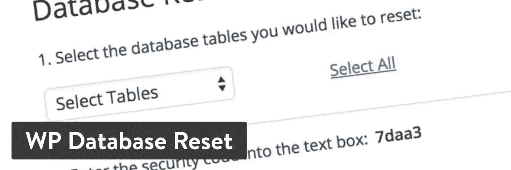
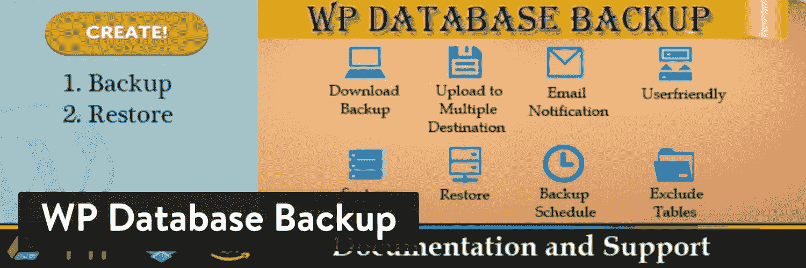
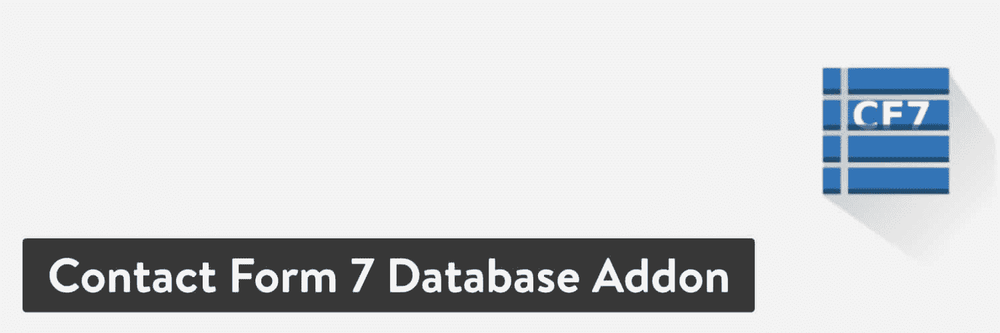
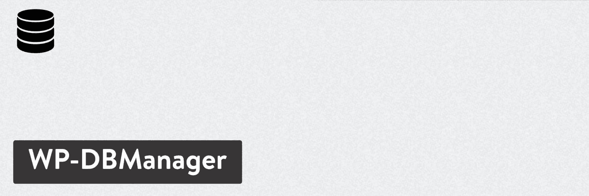
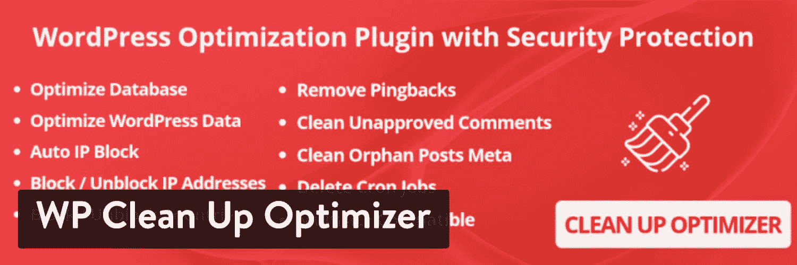
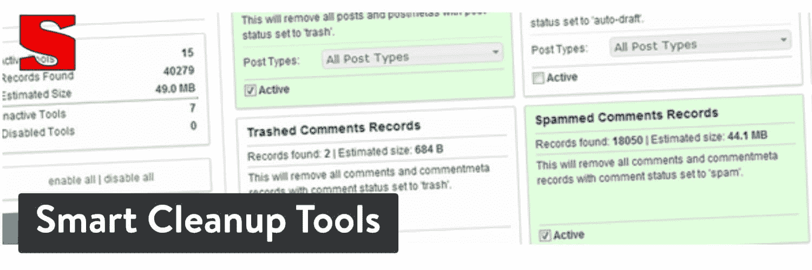
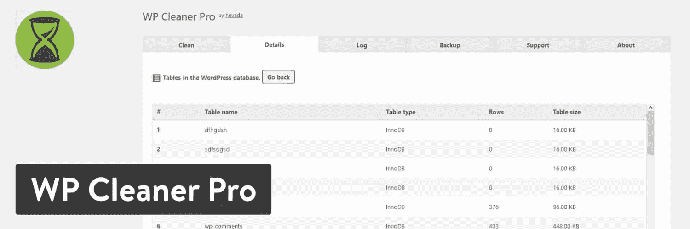

# 14 个最佳 WordPress 数据库插件(清理和优化你的数据库)

> 原文：<https://kinsta.com/blog/wordpress-database-plugin/>

一个网站的好坏取决于它的数据库。从评论、帖子、用户信息到垃圾邮件的一切都[存储在你的 WordPress 数据库](https://kinsta.com/knowledgebase/wordpress-database/)中。其中一些元素对你的网站运行至关重要，所以删除这些元素可能会使你的网站崩溃或失灵。

其他的，像旧草稿、坏表格和垃圾评论只会拖累你的数据库，降低你的网站速度。这就是为什么你可能需要一个 WordPress 数据库插件！

数据库插件有多种形式。有些严格意义上是在进行更改之前备份数据库，如迁移。其他人每周或每月清理数据库中的垃圾文件。

因此，您要么清理数据库，要么保存它，以防以后需要恢复内容。这些插件的全部意义在于优化，努力获得更快的速度、更干净的数据和更好的整体性能。

## 为什么拥有一个快速的 WordPress 数据库很重要？

一个[快速数据库](https://kinsta.com/blog/mariadb-vs-mysql/)有几个好处:

*   你要确保[你的网站快速运行](https://kinsta.com/learn/speed-up-wordpress/)。
*   这有助于为客户提供更高效的用户体验。
*   这增加了你在搜索引擎上排名更高的机会。
*   快速的数据库通常意味着您只使用必要的数据，因此对服务器的压力较小。

有时备份或迁移数据库也是必要的。这样，如果[你的服务器被黑了](https://kinsta.com/blog/wordpress-hacked/)或者出了问题，你已经准备好了备份文件。

> Kinsta 把我宠坏了，所以我现在要求每个供应商都提供这样的服务。我们还试图通过我们的 SaaS 工具支持达到这一水平。
> 
> <footer class="wp-block-kinsta-client-quote__footer">
> 
> 
> 
> <cite class="wp-block-kinsta-client-quote__cite">Suganthan Mohanadasan from @Suganthanmn</cite></footer>

[View plans](https://kinsta.com/plans/)

不管情况如何，一个成功的 WordPress 网站需要一个健康的数据库。尤其是如果你运行一个数据库使用率很高的网站。

## 从你的主人开始

数据库优化插件是伟大的，但你最好的赌注是开始改善你的数据库与优越的主机。

例如，Kinsta 提供[每周自动数据库优化](https://kinsta.com/feature-updates/auto-db-optimize/#automatic-mysql-database-optimizations)和[备份](https://kinsta.com/help/wordpress-backups/)。这样，一开始你就不需要大多数数据库插件。此外，[托管与 Kinsta](https://kinsta.com/blog/managed-wordpress-hosting/) 消除了你需要检查备份和管理优化。都为你做好了。

### 重要的

如果你是 Kinsta 的客户，在安装数据库优化插件之前，请参考我们的[禁用插件列表](https://kinsta.com/knowledgebase/banned-plugins/#performance-plugins)。我们的基础架构配置内置了自动化数据库优化，并且可能与第三方数据库优化插件不完全兼容。

## 在 WordPress 数据库插件中寻找什么

所有的数据库插件都是不同的，但下面是您应该经历的步骤和需要寻找的特性:

*   从[注册一个拥有数据库备份和优化的主机](https://kinsta.com/plans/)开始。
*   查看一些最好的 WordPress 数据库插件(如下所列),获得你的主机可能没有的附加功能。例如，有些人可能希望将备份存储在 Google Drive 或 Dropbox 中。
*   利用[数据库迁移插件](https://kinsta.com/blog/wordpress-migration-plugins/)将你的网站迁移到另一台服务器上。你也可以跟你的主机客户支持。
*   考虑安装一个数据库清理插件，这样你的数据库会一直保持更新。
*   大多数数据库插件都是免费升级的。除了你的主人提供的，坚持你需要的。如果一个必备功能需要付费，那就去做吧。大多数高级插件都非常便宜。

## 2022 年最好的 WordPress 数据库插件选项

继续阅读，了解更多关于我们最喜欢的数据库插件。其中一些非常适合迁移，而另一些则更适合备份或清理数据库。我们将讨论主要特性、定价以及谁应该考虑安装每个插件。

### 1.WP 数据库重置

WP 数据库重置插件给你一次点击就能重置你的 [WordPress 数据库](https://kinsta.com/knowledgebase/wordpress-database/)的每一部分的能力。作为替代，它还提供了在数据库中选择一个或两个要清除的表的设置。这是一个简单、安全的方法，可以让您回到数据库不那么混乱的时间点。

整个过程只需点击一下。所有的设置都在一个页面上配置，在这里你输入你想要删除的表，以及一个安全码以确保是你。建议您在运行此插件之前备份您的数据库。

WP Database Reset WordPress plugin

#### 定价

免费。

#### 使 WP 数据库重置成为最佳选择的特性

*   该插件是轻量级和安全的，允许你点击一个按钮来完成一个相当复杂的任务。
*   你可以选择清空你的整个 WordPress 数据库，或者只删除一些表格。
*   有一个选项可以通过使用[命令行](https://kinsta.com/blog/ssh-commands/)来重置数据库。
*   插件提供了[安全措施](https://kinsta.com/blog/wordpress-security/)，这样你就不会不小心按下重置按钮。

#### 谁应该为 WordPress 数据库插件考虑这个？

这里有一个插件，看起来很吸引那些想在测试某些产品后彻底清理数据库的插件和主题开发者。您还可能希望将此作为恢复到干净数据库的一次性解决方案。

### 2.WP 数据库备份

WP 数据库备份插件最好与清理数据库的插件搭配使用。有时候这是一个很棒的安全的[插件，但是有时候你只是想在清理所有东西之前对你的数据](https://kinsta.com/blog/wordpress-security-plugins/)做一个[备份。](https://kinsta.com/help/wordpress-backups/)

该插件提供了两个基本功能，一个是备份你的数据，另一个是用于[恢复](https://kinsta.com/blog/restore-wordpress-from-backup/)。您可以下载备份，并在备份完成时自动发送电子邮件通知。我们喜欢它的用户友好性，尤其是考虑到你可以设置一个备份时间表，留待将来使用。

WP Database Backup WordPress plugin

#### 定价

核心插件可以免费下载。您可以购买高级版本，每个许可证的起价为 22 美元。

#### 使 WP 数据库备份成为最佳选择的特性

*   该插件有一个一键式[数据库备份](https://kinsta.com/knowledgebase/mysql-backup-database/)按钮，供您在完成数据库清理之前保存所有数据。
*   自动备份对于保护您的站点免受攻击或文件问题非常有用。
*   您可以将备份文件下载到您的计算机上。
*   有几个存储目的地可供选择，包括 Dropbox 和 Google Drive。
*   随意从数据库备份中排除一个表。
*   这个插件有搜索数据库的工具。
*   报告会通过电子邮件发送到您的收件箱，以确保您了解后端发生的事情。

#### 谁应该为 WordPress 数据库插件考虑这个？

每个网站都需要数据库的备份。 [Kinsta hosting 已经提供了备份](https://kinsta.com/help/wordpress-backups/#wordpress-backups)，但是作为二级备份或者如果您有一台不提供该功能的主机，这可以派上用场。
T3】

### 3.联系表 7 数据库插件

[联系表 7 数据库插件](https://wordpress.org/plugins/contact-form-cfdb7/)非常适合那些想自动将所有[联系表](https://kinsta.com/blog/wordpress-contact-form-plugins/)提交信息记录到一个数据库中的人。这样，就没有必要希望你的电子邮箱会为你保存所有的东西。

此外，您可以在该数据库中搜索邮件。没有配置，但是你必须使用[联系表单 7 插件](https://kinsta.com/blog/wordpress-contact-form-plugins/#contact-form-7)来完成这项工作。一些功能包括导入和导出消息、删除过去的消息等等。

Contact Form 7 Database Addon WordPress plugin

#### 定价

Contact Form 7 数据库插件可以免费下载。你可以选择其他高级插件，比如弹出消息或者导出 PDF 文件。

#### 功能，使接触形式 7 数据库插件的一个伟大的选择

*   它直接与[联系表 7](https://kinsta.com/blog/contact-form-7/) 插件集成，便于安装。
*   您不必配置任何设置。自动创建一个数据库，开始记录通过表单发送的所有消息。
*   您可以选择显示通过表单创建的所有消息。
*   导出所有邮件，并将其放入不同的程序中。
*   你可以集成一些其他强大的插件，如拖放文件上传工具和数据库切换器。
*   这是一个非常轻量级的插件，它不会引起任何问题，也不会降低你的网站速度。

#### 谁应该为 WordPress 数据库插件考虑这个？

不是每个人都需要保存来自在线联系人表格的信息。然而，这比希望你能在收件箱里找到旧邮件要容易得多。所以，如果你记不住联系人，或者找不到过去的电子邮件，这可能是一个很好的工具。

### 4.WP-优化

WP-Optimize 通过清理、压缩和缓存你的 WordPress 数据库来工作。这个一体化的插件确保你不需要安装额外的工具来优化你的数据库。缓存是一个很好的额外功能，因为你可以[加速你的网站](https://kinsta.com/learn/speed-up-wordpress/)并优化数据库，而无需考虑它。

你的整个 WordPress 数据库会定期清理，你甚至可以在 WP-Optimize 插件的帮助下[压缩图片](https://kinsta.com/blog/optimize-images-for-web/)。至于数据库优化，WP-Optimize 删除所有不必要的文件，同时完成压缩表和保留备份等任务。

WP-Optimize WordPress plugin

#### 定价

有一个免费版本。高级版本包括以下计划:

*   入门——一到两个站点每年 39 美元。
*   商业——五个站点每年 59 美元。
*   无限制——无限制站点每年 149 美元。

#### 使 WP 优化成为最佳选择的特性

*   免费版本可以安装在你想安装的网站上。它为[站点缓存](https://kinsta.com/blog/wordpress-caching-plugins/)、[数据库清理](https://kinsta.com/knowledgebase/wordpress-repair-database/)、[图像压缩](https://kinsta.com/blog/lossy-compression/)提供了一些优秀的工具。
*   该插件在日历的帮助下自动优化你的数据库。
*   在插件中查看数据库优化统计。
*   几周的数据库备份保存在插件中。
*   您可以选择[多站点支持](https://kinsta.com/blog/wordpress-multisite/)。
*   这个插件可以让你删除不想要的图片，优化你想保留的图片。
*   您可以优化单个表，而不是整个数据库。
*   WP-Optimize 提供了[多语言集成](https://kinsta.com/blog/wordpress-multilingual/)。

#### 谁应该为 WordPress 数据库插件考虑这个？

如果您希望您的数据库优化工具完成以下三个功能，请使用 WP-Optimize:清理数据库、压缩图像和缓存页面。

像这种为你压缩图像和缓存页面的数据库插件并不多。

### 信息

Kinsta 不允许 WP 优化插件在我们的平台上使用。我们已经针对高性能、可靠性和安全性优化了我们的平台。如果一个插件被禁止，那是因为我们的系统管理员团队发现了它的性能或功能问题。

### 5.WP-数据库管理器

WP-DBManager 是最简单的 WordPress 数据库插件之一。它允许从一开始就优化您的数据库，使用额外的功能来备份和恢复文件。大部分工作都是在安装时为您完成的，因为管理模块只有几页设置供您配置。

WP-DBManager 有助于删除空表和运行选定的查询。您还可以修复损坏的文件或表格，只需简单地点击一个按钮。有些人可能会觉得插件设置有点混乱，但你通常只需要设置它，然后忘记它。

WP-DBManager WordPress plugin

#### 定价

免费。开发者在捐款的帮助下管理插件。

#### 使 WP-DBManager 成为最佳选择的特性

*   这是一个简单的插件，用于优化你的数据库，并确保额外的插件不会拖累你的网站。
*   主要目的是自动备份数据库和记录文件。
*   您可以检查数据库中的表，并决定是否保留它们。
*   管理数据库信息显示在仪表板上，以便您查看数据库可能出现的问题。
*   您的所有数据库备份都存储在一个列表中，供您管理并在受到攻击或服务器出现问题时使用。
*   您可以选择优化哪些表和文件。
*   运行[数据库修复](https://kinsta.com/knowledgebase/wordpress-repair-database/#how-to-repair-the-wordpress-database)只需点击一个按钮。

#### 谁应该为 WordPress 数据库插件考虑这个？

对于那些想要一个简单、整洁的工具来清理和备份数据库的人来说，WP-DBManager 插件看起来是一个赢家。一些初学者可能会觉得这些设置令人困惑，但通常情况下，您不必更改任何默认设置。

### 6.参与者数据库

[参与者数据库](https://wordpress.org/plugins/participants-database/)插件为你的网站建立了一个独立的部分，生成一个数据库，包含[联系人](https://kinsta.com/blog/wordpress-crm/)、[访问者](https://kinsta.com/blog/how-to-drive-traffic-to-your-website/)，或者你可能需要的任何用户列表。您可以选择单独输入联系人，或者用 CSV 文件导入联系人。

这个插件的伟大之处在于，任何类型的信息都可以存储在数据库中，并且它提供了一个光滑的、独立的界面，供你在 [WordPress 仪表盘](https://kinsta.com/knowledgebase/wordpress-admin/)上管理。您也可以使用[短码](https://kinsta.com/blog/wordpress-shortcodes/)在您的网站上显示联系人列表。

对于这样一个简单的工具，它实际上包括了一长串的功能，这些功能对于在你的 WordPress 站点数据库之外运行一个数据库是很方便的。

Participants Database WordPress plugin

#### 定价

该插件是免费的，可以选择付费插件进行升级。

#### 使参与者数据库成为最佳选择的特性

*   免费的！
*   “参与者数据库”在安装后加载到您的仪表板上。它为姓名和地址等标准项目提供了预填充字段。
*   您可以在仪表板上管理大量信息。
*   导入外部数据库是通过 CSV 完成的。
*   该插件允许您为字段设置验证规则。
*   使用短代码在你的网站上加入注册表格，并在你的数据库中列出这些人。虽然我想不出很多显示个人信息是个好主意的例子。
*   给你一个注册表单模板开始设计。
*   用户可以从你的网站前端编辑他们的记录。
*   管理员也可以在后端编辑记录。
*   该插件有一个不断增长的翻译列表。
*   有几个付费的附加组件可用，如目录工具、会员付费和位置地图。

#### 谁应该为 WordPress 数据库插件考虑这个？

参与者数据库不是你的 WordPress 数据库的典型备份和优化工具。相反，如果你计划生成一个联系人列表，并希望将它们放在你的 WordPress 仪表盘中，这是一个很好的解决方案。

它的工作方式类似于电子邮件营销服务，如 [Mailchimp](https://kinsta.com/blog/how-to-use-mailchimp/) ，除了没有[发送电子邮件](https://kinsta.com/blog/email-marketing-best-practices/)的功能。

### 7.高级数据库清理程序

[高级数据库清理器](https://wordpress.org/plugins/advanced-database-cleaner/)专注于删除数据库中不必要的或者在服务器上引起问题的项目。例如，它[删除不再需要的旧版本](https://kinsta.com/blog/wordpress-revisions/#how-to-delete-wordpress-revisions)。该插件还会删除诸如引用通告、待定的[评论](https://kinsta.com/blog/wordpress-comment-plugins/)和旧草稿等项目。

大多数网站所有者通常不会考虑数据库中积累的所有垃圾，所以这就是为什么拥有高级数据库清理器是如此有益。该工具还提供了一个基本的设置模块，用于设置清理数据库的频率以及是否要从清理中排除任何文件。

Advanced Database Cleaner WordPress plugin

#### 定价

核心插件是免费的。如果您需要额外的站点许可证，请选择一个高级计划:

## 注册订阅时事通讯

### 想知道我们是怎么让流量增长超过 1000%的吗？

加入 20，000 多名获得我们每周时事通讯和内部消息的人的行列吧！

[Subscribe Now](#newsletter)

*   入门——一到两个网站 39 美元。
*   商务——五个站点 59 美元。
*   无限制——149 美元无限制网站。

#### 使高级数据库清理器成为最佳选择的功能

*   该插件通过在后台清除不需要的数据库项目来节省您的时间。
*   它定期清理你的数据库，使网站运行更快，数据库更简洁。
*   有一个长长的清理选项列表，有机会清理 pingbacks、孤立数据、旧的自动草稿等等。
*   您可以安排希望自动清洗发生的时间。
*   在做出任何决定之前，查看屏幕上的数据库信息。
*   这个插件有自动清理表格的工具。
*   您可以修复损坏的表格。
*   有多站点支持。

#### 谁应该为 WordPress 数据库插件考虑这个？

下面给大家一个插件。人们经常忘记[清理你的数据库是如此重要](https://kinsta.com/feature-updates/auto-db-optimize/)，但是一旦你安装了高级数据库清理器，它就变成了一个简单的过程。你应该注意到不同之处。

### 8.WP 复位

WP 重置进入你的 WordPress 数据库，删除你认为无用的内容。有时候，如果你试图[清理整个网站并从头开始](https://kinsta.com/blog/reset-wordpress/#complete-reset)，这些插件是有意义的。其他时候，我们看到它被用来清理演示帖子和媒体。

不管你的需求是什么，WP Reset 插件都会扫描表格、帖子、评论和其他数据库细节。在那之后，你就可以完全控制你想删除哪一个了。请记住，这是一个永久的解决方案，完全摆脱你的网站的某些部分。

WP Reset WordPress plugin

#### 定价

免费。

#### 使 WP Reset 成为最佳选择的特性

*   WP Reset 是一个方便的开发工具，非开发者也可以使用。
*   完全免费。
*   它允许你恢复你的 WordPress 环境，并且只需点击一下就可以清空你的数据库。
*   从帖子到页面，从媒体条目到用户，一切都可以删除。
*   你可以删除整个 WordPress 数据库表。
*   WP 重置具有从删除中移除特定项目的设置。例如，您可能不想删除所有图像。
*   选择保持你所有的主题和插件文件不变。
*   所有基本的站点设置，比如你的 WordPress 地址和站点标题都保持原样。
*   如果删除出现问题，您可以创建站点的快照来备份和恢复数据库。

#### 谁应该为 WordPress 数据库插件考虑这个？

WP 重置插件有一些真实的用途。首先，你可能在测试主题，插件，或者不同的数据库元素。在这种情况下，WP Reset 对于删除新安装的数据库内容很方便。

这个插件看起来对于挑选你的数据库中要删除的部分也很有用，比如如果你发现你的大多数博客文章都是演示内容，你可以删除它们。

### 9.更好的搜索替换

更好的搜索替代为 T2 的公司提供了将网站迁移到新服务器的需求。你不会一直在你的网站上安装这个插件。然而，它在[帮助迁移](https://kinsta.com/knowledgebase/wordpress-migrations/)方面做得很好，因为在这个过程中你的数据库通常需要经历一些修改。

例如，您的链接和媒体项目可能没有正确的地址。另外，你可能会发现你的一些桌子需要修理。不管是什么情况，更好的搜索替换插件都可以帮上忙。

Better Search Replace WordPress plugin

#### 定价

主插件是免费的。你可以升级到 59 美元起的专业版。

#### 使更好的搜索取代一个伟大的选择的功能

*   该插件在迁移之前分析所有数据库表，并让您选择想要修改的表。
*   您可以在迁移前更新表中的字段。
*   更好的搜索替换包括一个在实际运行程序之前完成“试运行”或测试的特性。
*   它支持多站点安装。
*   点击一个按钮即可完成[搜索和替换](https://kinsta.com/knowledgebase/wordpress-search-and-replace/)操作。之后，只需要几秒钟就能完成。
*   该插件支持少数几种语言。
*   高级版有优先支持，也没那么贵。
*   您可以在运行搜索和替换工具时备份数据库。
*   也可以导入数据库。
*   它允许您保存搜索和替换配置文件，以防将来您想要运行完全相同的过程。

#### 谁应该为 WordPress 数据库插件考虑这个？

大多数[搜索和替换](https://kinsta.com/knowledgebase/wordpress-search-and-replace/)是由有经验的开发人员完成的。因此，我们不建议像这样破坏您的数据库，除非您有所需的经验。

除此之外，更好的搜索和替换插件对于那些想在迁移之前批量替换数据库不同部分的开发人员来说是极好的。

### 信息

如果你是 Kinsta 的客户，你可以利用 MyKinsta 中的[“搜索和替换”工具。](https://kinsta.com/knowledgebase/wordpress-search-and-replace/#kinsta-search-replace-tool)

### 10.WP-扫描

WP-Sweep 是另一个数据库清理插件，用于清理评论、帖子元数据和修订等区域。正如前面所讨论的，你的数据库积累了各种各样的垃圾，要么被记录为档案，要么被简单地丢弃，因为 WordPress 数据库没有官方的垃圾工具。

厌倦了你的 WordPress 站点缓慢的主机？我们提供超快的服务器和来自 WordPress 专家的 24/7 世界级支持。[查看我们的计划](https://kinsta.com/plans/?in-article-cta)

简而言之，没有理由不每月清理一次数据库，你可以在 WP-Sweep 插件的帮助下完成所有工作。从未使用的术语到已删除的注释，您都可以清除它们以提高性能并减轻服务器的压力。

这就是这个插件所做的一切，所以它是一个轻量级的、有效的清理混乱的方法。

WP-Sweep WordPress plugin

#### 定价

免费。

#### 使 WP-Sweep 成为最佳选择的特性

*   没有任何附加物或特价。都是免费的。
*   这是一个简洁的插件，只有一个功能。你可以设置插件清理的内容。没有其他复杂的设置需要担心。
*   该插件清除评论项目，如垃圾邮件，删除和未经批准的评论。
*   去掉元数据，比如评论、术语和用户数据。
*   该插件在查找重复内容和数据方面做得很好。然后，它会消除重复项。
*   使用 WordPress delete 函数代替 MySQL 查询，这可能会导致性能问题。

#### 谁应该为 WordPress 数据库插件考虑这个？

如果你对清理数据库中不必要的部分感兴趣，可以使用 WP-Sweep 插件。这种清洁应该每月进行一次。最棒的是，你不用一直安装这个插件。仅在需要时安装。

### 11.删除修订后优化数据库

[删除修订后优化数据库](https://wordpress.org/plugins/rvg-optimize-database/)是另一个可靠的 WordPress 数据库插件，用于清除数据库中积累的垃圾。例如，您可能想要删除未使用的[标签](https://kinsta.com/knowledgebase/wordpress-tags/)、[垃圾评论](https://kinsta.com/blog/wordpress-spam-comments/)或垃圾桶帖子。

这里有一个插件，只需简单地点击一个按钮就可以完成所有的工作。其他一些类似的插件需要你完成更复杂的程序，但是删除修订后优化数据库插件只有一个按钮。

运行分析很简单，并且您可以随时在那里预先排除某些元素。

Optimize Database after Deleting Revisions WordPress plugin

#### 定价

免费。

#### 使删除修订后优化数据库成为最佳选择的特性

*   该插件发现并删除一些更顽固的数据库垃圾，如 OEMBED 缓存、数据库表和过期的瞬态。
*   它处理常见的混乱，比如帖子和页面。
*   所有存档和垃圾内容都会被丢弃。
*   该插件非常简单，只需点击一个按钮，安装插件时只需进行一些设置。
*   您可以计划每小时、每天或每周进行数据库优化。
*   将插件链接到您的多站点网络。
*   所有数据库优化都被记录到一个列表中，供以后参考。

#### 谁应该为 WordPress 数据库插件考虑这个？

大多数网站只是偶尔需要这种类型的数据库清理，所以你可能不需要安装这个插件。然而，它确实有一个自动清洁时间表，可能会证明是有用的。

总的来说，像这样的数据库清理插件有时是所有类型的网站都需要的。

### 重要的

如果您是 Kinsta 的客户，[请在安装此插件之前联系支持](https://kinsta.com/kinsta-support/)，因为它可能会导致性能问题，并与我们内置的数据库优化功能相冲突。

### 12.WP 清理优化器

[WP 清理优化器](https://wordpress.org/plugins/wp-clean-up-optimizer/)可以提升你的站点的[速度，清理掉不用的数据，优化整个数据库。所有这些对于提高性能都很重要。要删除的一些项目包括过时的记录、损坏的表和未使用的空间。](https://kinsta.com/learn/page-speed/)

孤儿数据也是一个持续的问题，这使得 WP 清理优化器插件如此重要，即使看起来你的数据库没有任何问题。

这个数据库清理插件列举了所有潜在的地方，你可以清理空间，加快你的网站。应用一个动作只需一个按钮，但在这种情况下，您可以单独删除项目。

WP Clean Up Optimizer WordPress plugin

#### 定价

有一个免费版本，以及保费计划:

*   专业——每年 29.99 欧元(34 美元)。
*   开发者——每年 69.99 欧元(78 美元)。
*   代理——每年 99.99 欧元(112 美元)。

每个计划都增加了一些功能。所有这些都允许无限数量的网站。

#### 使 wp 清理优化器成为最佳选择的特性

*   清理优化程序通过识别不再需要的项目来清理数据库。
*   它缩小媒体和数据，以确保您的网站加载速度快。
*   你可以摆脱诸如 pingbacks，修订和垃圾评论。
*   独特的删除是可能的，具有清除 oEmbed 缓存、未使用的术语和孤立术语关系的选项。
*   它允许您手动清理数据库或设置自动化工具。
*   该插件的所有版本都可以在多种语言中使用。
*   它会根据清理过程的进展情况发送电子邮件通知。
*   您可以在一个位置查看所有清洁工作。
*   提供了登录安全性，以及最大登录尝试次数。
*   这个插件有一个在清理之前预览表格的功能。这样，你就不会犯任何错误。

#### 谁应该为 WordPress 数据库插件考虑这个？

当试图清理数据库时，WP 清理优化器看起来是一个可靠的选择，同时也有一些用于登录的安全工具。这对于缩小你的数据也是很棒的，这通常不包括在数据库优化插件中。

也就是说， [Kinsta 客户](https://kinsta.com/plans/?plan=visits-business1&interval=month)可以通过使用 [MyKinsta 仪表板](https://kinsta.com/mykinsta/)内置的[代码缩减功能](https://kinsta.com/help/kinsta-cdn-code-minification/)来快速简便地缩减代码。此功能允许客户只需点击一下鼠标，即可实现 CSS 和 JavaScript 的自动缩小。

### 13.智能清理工具

和许多 WordPress 插件一样，你会发现最好安装包含多种功能的选项。例如，我们在本文中讨论的许多插件不仅仅是清理数据库。同样的道理也适用于[智能清理工具](https://codecanyon.net/item/smart-cleanup-tools/3714047)插件，它更像是一套数据库优化工具，而不是一个“单一任务奇迹”

这个插件是一个简单的工具，可以用近 40 种设置来清理你的数据库。简而言之，插件会删除数据库中不需要的项目。有时这是通过一次单击完全清理来完成的，但其他时候您可能想要决定要删除的表和数据项。

Smart Cleanup Tools WordPress plugin

#### 定价

30 美元的一次性费用。如果需要，升级以获得更多支持。

#### 使智能清理工具成为最佳选择的功能

*   清理插件集成了许多其他插件来优化您的数据库。
*   每当清理工作完成时，它都会收集大量的统计数据。
*   您可以计划清除或让它们按默认计划运行。
*   有些工具只能逐个删除项目。
*   一个快速访问菜单显示在 WordPress 仪表板上，这样你就不会忘记你的清洗。
*   提供了几个重置工具用于[移除侧边栏](https://kinsta.com/knowledgebase/remove-sidebar-wordpress/)、规则和插件数据。
*   从未经批准的评论到草稿和帖子记录，一长串删除工具一应俱全。
*   您可以浏览数据库清理工具的完整列表，如删除孤立数据的选项、WooCommerce 会话等。

#### 谁应该为 WordPress 数据库插件考虑这个？

智能清理工具插件似乎涵盖了其他类似插件提供的所有清理任务。因此，如果你喜欢只支付一次性费用的想法，但仍然喜欢数据库优化的高级支持和优秀功能，请考虑这个插件。

### 14.WP 清洁剂专业版

WP Cleaner Pro 是一款经济实惠的即时清洁解决方案，配有调度工具和整个数据库的备份。超过 25 种类型的数据项可以被清理，你可以优化你的数据库，以确保它不会[拖慢你的网站](https://kinsta.com/blog/third-party-performance/)。

大多数优化都在后台进行，所以你所要做的就是安装插件，然后忘掉它。您还可以过滤数据库项目，并决定要清理的项目。

除了干净的界面和大量的文档，WP Cleaner Pro 插件看起来是许多类型企业的正确选择。

WP Cleaner Pro WordPress plugin

#### 定价

这个插件需要一次性支付 19 美元，并提供升级客户支持的选项。

#### 使 WP Cleaner Pro 成为最佳选择的功能

*   这是最便宜的高级数据库插件之一。
*   安装插件后，您的数据库会立即得到优化和清理。
*   该插件还备份您的数据库，以确保您可以在出现任何问题时恢复您的文件。
*   您可以选择在将来安排所有的清理。该插件针对速度进行了优化，所以它不会拖累你的网站，所有完成的任务都会加速你的网站。
*   它特别针对孤立数据，这些数据通常对网站的功能毫无用处。
*   一些即时清理是针对 pingbacks、不良评论、孤立数据和重复内容的。

#### 谁应该为 WordPress 数据库插件考虑这个？

如果你喜欢定期的数据库清理，众多的过滤器，以及低廉的价格(对于高端产品来说)，WP Cleaner Pro 插件可能适合你。我们特别向初学者推荐它，因为它非常容易配置。

事实上，没有理由改变任何设置。所有的优化和清理都是在你安装并激活插件之后完成的。

[A website is only as good as its database... which is why you may need these plugins to clean up your DB 🧼 and optimize site performance ⚡️Click to Tweet](https://twitter.com/intent/tweet?url=https%3A%2F%2Fbit.ly%2F2NSUSgA&via=kinsta&text=A+website+is+only+as+good+as+its+database...+which+is+why+you+may+need+these+plugins+to+clean+up+your+DB+%F0%9F%A7%BC++and+optimize+site+performance+%E2%9A%A1%EF%B8%8F&hashtags=webdev%2Csitespeed)

## 哪个是最适合你的 WordPress 数据库插件？

当你选择高质量的托管 WordPress 主机时，应该提供数据库备份和优化。

然而，在某些情况下，你仍然需要一个 WordPress 数据库插件。例如，我们建议考虑一个定期的数据库清理插件来清除服务器上堆积的垃圾数据。

如果你正在从一个服务器到另一个服务器迁移一个网站的[过程中，你也可以考虑使用](https://kinsta.com/blog/migrate-wordpress-site/)[高级迁移](https://kinsta.com/blog/wordpress-migration-plugins/)或[搜索和替换工具](https://kinsta.com/knowledgebase/wordpress-search-and-replace/)。

总的来说，从一个好的主机开始，然后测试这些推荐的最好的 WordPress 数据库插件选项。

* * *

让你所有的[应用程序](https://kinsta.com/application-hosting/)、[数据库](https://kinsta.com/database-hosting/)和 [WordPress 网站](https://kinsta.com/wordpress-hosting/)在线并在一个屋檐下。我们功能丰富的高性能云平台包括:

*   在 MyKinsta 仪表盘中轻松设置和管理
*   24/7 专家支持
*   最好的谷歌云平台硬件和网络，由 Kubernetes 提供最大的可扩展性
*   面向速度和安全性的企业级 Cloudflare 集成
*   全球受众覆盖全球多达 35 个数据中心和 275 多个 pop

在第一个月使用托管的[应用程序或托管](https://kinsta.com/application-hosting/)的[数据库，您可以享受 20 美元的优惠，亲自测试一下。探索我们的](https://kinsta.com/database-hosting/)[计划](https://kinsta.com/plans/)或[与销售人员交谈](https://kinsta.com/contact-us/)以找到最适合您的方式。