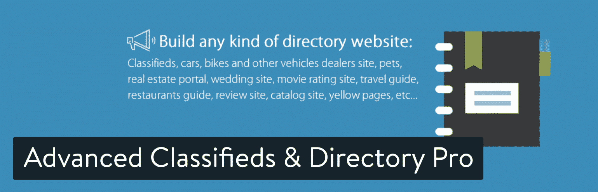
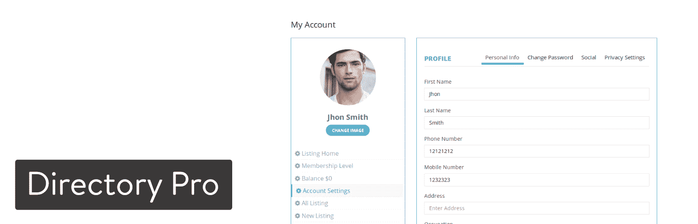
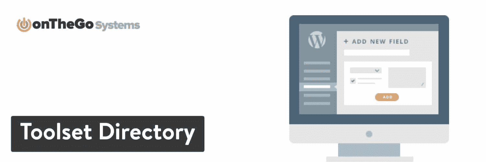

# 11 个最好的 WordPress 目录插件来组织你的列表

> 原文：<https://kinsta.com/blog/wordpress-directory-plugins/>

目录是一个模糊的术语，基于它们的使用方式。然而，所有在线目录通常具有相同的功能，根据位置或类别提供商业或个人信息。

Yelp 是最受欢迎的在线目录之一，它根据用户的位置提供本地商业信息。Angie 的列表也被认为是一个目录，但它将人们与承包商和专业人士联系起来，完成像管道和屋顶这样的任务。

要制作像这样的目录，需要一个 WordPress 目录插件。我们就如何创建自己的目录网站编写了详细的指南:

用 WordPress 创建目录网站的终极分步指南

你不需要一个计划来超越 Yelp 或创建你的企业目录的企业。许多公司将在线目录用于内部或外部目的。一家房地产公司可能会在它的网站上共享一个目录，上面有所有代理人的名单以及他们覆盖的区域。一家律师事务所可能有一份员工名录，或者可能有一份关键业务合作伙伴的名单。

目录作为用户友好的数据库，提供搜索栏、图片、位置信息和联系方式。你经常会看到地图，比如百思买或塔吉特百货有公共目录，让顾客可以找到所有商店的位置。甚至谷歌( [My Business](https://kinsta.com/blog/wordpress-directory-plugins/) )和脸书也为那些寻找优质产品和服务的人提供商业目录工具。

## 在一个伟大的 WordPress 目录插件中寻找什么

这个决定很大程度上取决于您想要启动的目录类型。是通过向当地商家收取广告费来赚钱吗？然后，您将需要一些收集这些付款的功能。该目录是否被用于披露个人信息而非企业信息？你会希望找到一个有个人和联系信息的字段。

然而，所有最好的 WordPress 目录插件都有几个共同点。以下是你在搜索过程中应该寻找的内容:

*   添加新列表和调整旧列表的选项。
*   希望分享业务信息的商家的后端工具。
*   如果你对刊登物品收费，可以使用收款功能。
*   评级和审查系统。
*   媒体支持。
*   书签工具。
*   基于位置的地图搜索模块。
*   前端提交选项。
*   用于在网站上任何地方添加列表的短代码和小部件。
*   用于调整提交的高度可定制的表单域。

## 2022 年可供选择的最佳 WordPress 目录插件

T3】

> Kinsta 把我宠坏了，所以我现在要求每个供应商都提供这样的服务。我们还试图通过我们的 SaaS 工具支持达到这一水平。
> 
> <footer class="wp-block-kinsta-client-quote__footer">
> 
> 
> 
> <cite class="wp-block-kinsta-client-quote__cite">Suganthan Mohanadasan from @Suganthanmn</cite></footer>

[View plans](https://kinsta.com/plans/)

请随意使用这个列表来测试一下，并亲自体验一下每个插件。我们也推荐进一步阅读，因为我们分解了每一个 WordPress 目录插件来寻找最好的特性和理由。

### 1.分类广告和商业目录

分类列表专业版是一个优秀的插件，具有所有分类列表和商业目录的功能。它提供了许多创收途径，包括会员套餐和广告促销。用户可以选择广告推广选项，如顶部、特色和提升广告。分类列表专业版带有实时聊天功能，买家和卖家可以通过它轻松沟通。买家和用户可以通过多个网关进行支付，包括 PayPal、Stripe、离线支付、Razorpay (addon)、Authorize.net 和 [WooCommerce](https://kinsta.com/knowledgebase/how-to-add-products-in-woocommerce/) 。

如果你想在广告列表上展示地图，这个插件可以让你选择使用[谷歌地图](https://kinsta.com/blog/wordpress-google-maps/)和 OpenStreetMap。当使用分类列表专业搜索功能时，您的选项包括搜索弹出窗口、谷歌位置、Radius 搜索(用户附近的广告)、AJAX 自动完成和自动建议以及数据库位置。该插件可以让你建立无限的自定义字段，并将它们分配到类别中。

Classified Ads and Business Directory

您可以使用插件提供的 7+ [元素或插件](https://kinsta.com/blog/best-elementor-addons/)定制您的布局和归档页面，包括列表和网格列表视图。如果你喜欢用[古腾堡积木搭建器](https://kinsta.com/blog/gutenberg-blocks/)来搭建你的网站和列表，同样数量的古腾堡积木也是可用的。分类列表专业版也支持评级和评论，因此客户可以更容易地对列表做出决定。谷歌 reCAPTCHA 服务通过区分机器人和人类用户，使维护无垃圾邮件列表变得容易。

#### 我们喜欢这个 WordPress 目录插件的主要原因:

*   营业时间功能使用户能够为您的商店页面设置营业时间，以提供更好的客户服务。
*   用户可以通过社交分享功能在社交媒体平台上分享不同的房源，有效提高收视率和转化率。
*   每当相关广告列表上发生活动时，插件的电子邮件通知会通过电子邮件向您的用户发出 apt 警报。
*   它是翻译就绪，并支持从右到左的语言。
*   它是 SEO 友好的，完全支持 [Yoast SEO](https://kinsta.com/blog/yoast-seo/) 。
*   它附带了一个商店和会员插件，这使得向用户收取套餐费用变得很容易。

### 2.商业目录插件

[商业目录插件](https://wordpress.org/plugins/business-directory-plugin/)包括所有核心目录特性，如完全可定制的表单域、图像支持和支付接受。当你下载主插件时，这些核心功能都是免费的，但你也可以选择以高价下载一些附加功能。包含所有附加组件的套装售价为 199.99 美元(一次性费用)，而单个模块的起价为 69.99 美元。

Business Directory Plugin for WordPress

一些额外的模块包括:

*   折扣代码。
*   特色关卡。
*   文件附件。
*   [谷歌地图](https://kinsta.com/blog/wordpress-map-plugin/)。
*   2 检查网关模块。
*   索赔列表按钮。
*   评级功能。
*   更多。

如你所见，要把你的目录变成像 Yelp 一样强大的东西，你必须为一些附加组件付费。例如，评级模块[将花费你](https://kinsta.com/blog/wordpress-website-cost/)额外的 69.99 美元，或者压缩搜索工具也将花费你。

没有任何附加组件，您仍然有一个坚实的目录。它甚至为 Authorize.net 提供支持，如果你愿意接受商业列表的付款。我们喜欢商业目录插件，为那些想要一个功能齐全的目录而不需要支付任何费用的人服务。评论和评级相当可观，插件是轻量级的，可以放在你的网站上。这也很好，因为你可以只为你需要的功能购买一些附加物。

#### 我们喜欢这个 WordPress 目录插件的主要原因:

*   核心插件是免费的，其中的大部分功能应该给公司他们所需要的。如果没有，有一个大的附加目录用于升级您的特性集。
*   支付支持包含在核心插件中。因此，如果你想创建多个计划或只是一个接一个地收费，这是可行的。
*   表单域是可定制的，允许您尽可能地使您的目录提交表单独一无二。
*   如果您的目录中已经有大量企业，您可以上传 CSV。
*   这个插件有高于平均水平的图像选项，包括改变缩略图大小的工具，调整图像顺序的工具，以及将图像拖放到页面中的区域。
*   一个 [reCAPTCHA](https://kinsta.com/blog/wordpress-captcha/) 工具是内置的，可以阻止你经常在目录上看到的所有垃圾邮件。
*   前端提交是可用的，那些提交列表的人可以修改内容，而不用登录到 WordPress 的后端。

### 3.地理目录

地理目录允许你将任何 WordPress 主题转变成一个强大、快速的目录。该插件更侧重于生成一个全球商业目录，但你可以将它分成世界上的某些部分，或者只迎合你的邻居。这是一个 [WordPress 多站点兼容插件](https://kinsta.com/blog/wordpress-multisite-plugins/)，这使得它非常适合建立一个目录网络或者安装在多个客户站点上。大部分插件都是免费提供给你的，但是有几个[插件出售](https://wpgeodirectory.com/downloads/category/addons/)，用于添加活动、多地点、定价、评论和 BuddyPress 集成。这些附件通常起价 19 美元。

## 注册订阅时事通讯

### 想知道我们是怎么让流量增长超过 1000%的吗？

加入 20，000 多名获得我们每周时事通讯和内部消息的人的行列吧！

[Subscribe Now](#newsletter)

GeoDirectory WordPress plugin

我们喜欢 GeoDirectory 的一个主要原因是它漂亮的搜索界面。该插件为普通用户和想要添加列表的商家提供了一个前端表单。商业页面按照与用户的接近程度排列，左边是大的、可点击的缩略图，旁边是漂亮的谷歌地图。当有人点击一家企业时，他们可以直接从你的网站上搜索方向。甚至还有一个 CSV 导入和导出工具，可以一次填充多个列表或将它们移动到另一个网站。

凭借 GeoDirectory 的轻量级、可扩展接口，它是为数不多的对大规模增长和大量流量有用的免费目录插件之一。如果你是从零开始创建一个网站，开发者也会出售目录主题。

使用合适的插件和高性能主机启用您的网站目录。[免费试用 kin sta](https://hubs.ly/H0pklC_0)。

#### 我们喜欢这个 WordPress 目录插件的主要原因:

*   GeoDirectory 有一个前端表单，供人们提交列表并使用拖放编辑器编辑这些列表。
*   有 13 种字段类型用于构建您的自定义表单，并使它们适合您的网站。
*   插件提供了超过 15 个部件和 12 个部件区域。您还可以获得一些短代码选项。
*   谷歌分析信息显示为商家与物品。这样，他们可以看到你的网站对他们的业务有多大的帮助。
*   插件内置了几个表单，它们主要用于用户评论、业务查询和向朋友发送信息。
*   [多站点兼容。](https://kinsta.com/wordpress-multisite-hosting/)
*   该插件是免费的，但你有几十个负担得起的功能插件，如自定义谷歌地图、AffiliateWP 集成、列表管理、社交导入等。

### 4.高级分类广告和目录专业版

如果你想让你的 WordPress 目录插件更加灵活，那么[高级分类广告&目录专业插件](https://wordpress.org/plugins/advanced-classifieds-and-directory-pro/)正适合你。这是一个强大的解决方案，可以集成到任何现有的网站中，并支持任何类型的目录，如电影评级网站、分类广告平台或旅游指南。与我们已经讨论过的其他两个插件一样，高级分类广告目录专业版可以免费下载。开发商还出售几款[高级附加软件用于升级](https://pluginsware.com/add-ons/)。一些附加软件提供了 WooCommerce 支持、PayPal、Stripe 支付和一个[列表滑块](https://kinsta.com/blog/wordpress-slider/)的工具。每个附加组件的起价约为 19.99 美元。

正如你可能注意到的，高级分类广告插件的附加库比竞争对手的要小得多。然而，这主要是因为大部分特性已经打包到核心插件中了。事实上，你唯一需要支付的是某种支付处理工具。

Advanced Classifieds & Directory Pro WordPress plugin

高级分类广告插件中无限的自定义字段足以让我们建议至少试用该插件。你可以添加任何东西，从单选按钮到输入框，它还允许你为你的每个列表分配类别。用户功能也非常令人印象深刻，有一个完整的区域供企业管理他们的列表、更新列表、查看支付历史等。包括离线支付功能。因此，如果你想通过邮件或当地企业接受支票，这是一种可能性，而不必支付任何额外费用。

#### 我们喜欢这个 WordPress 目录插件的主要原因:

*   大部分功能都是免费的。你需要支付的唯一附加组件是 Stripe 或 PayPal 支付插件。
*   当某些事件发生时，会发送电子邮件通知。例如，当物品过期或收到付款时，商家会收到电子邮件。
*   高级分类广告插件具有强大的收入功能，可以向用户收费和设置免费计划。
*   该插件有一个高级搜索小部件，可以通过关键词、类别、位置等选项进行搜索。
*   所有的列表页面都支持上传图片和视频。
*   该插件提供了无限的位置，有能力磨练在某些社区和城市。
*   您可以获得无限数量的自定义字段，以适应您在目录中列出的任何类型的企业。

### 5.连接业务目录

[Connections Business Directory](https://wordpress.org/plugins/connections/)插件结合了简单性和独特的功能，允许你创建任何东西，从一个小的联系簿到拥有数千个全球企业名录的帝国。WordPress 目录插件被构建成尽可能兼容和可配置的，使其成为列表中最灵活的解决方案之一。来自开发者的支持也是突出的。

Connections Business Directory WordPress plugin

这个插件的商业模式包括免费提供核心插件。然后，你可以使用几个免费的插件，其中一些包括工具栏、登录和生日电子邮件的功能。开发者还销售高级扩展，价格不等，但单个网站的价格不会超过 75 美元。事实上，一些更简单的扩展标价 5 美元。至于高级扩展，您会发现一个不错的选项列表，如 CSV 导入工具、更高级表单的选项和小部件包。

我们也很高兴插件开发者有几个高级模板。这样，您就不必自己定制和设计目录了。你可能想要做一个小的职员目录或者一个完整的商业目录。这两者都可以通过模板实现。Connections Business Directory 也为开发者提供了出色的支持，在 [Github](https://kinsta.com/knowledgebase/what-is-github/) 上正在进行开放开发，有超过 180 个动作钩子和 300 个过滤器。API 对设置、电子邮件和片段缓存等东西是开放的——因此这个插件的定制和扩展机会似乎是无穷无尽的。

#### 我们喜欢这个 WordPress 目录插件的主要原因:

*   核心插件可以免费下载，你需要的大部分高级插件售价为 5 美元或 10 美元。
*   这个插件对于那些想要集成到特殊系统或者定制一个完全独特的目录的开发者来说特别有用。API 是开放给你玩的。
*   一些高级模板被出售用于构建一个独特的目录，它不一定看起来像一个常规的开箱即用的目录。
*   一些自定义字段比其他目录插件更独特。例如，该插件提供了语言、爱好、教育水平、设施、当地时间和营业时间等自定义字段。
*   为地址、电话号码、电子邮件和其他选项显示可重复的字段。这意味着您可以根据需要为您的企业名录添加尽可能多的信息。
*   周年纪念日和生日保存在目录中。因此，您的组织可以保留一个数据库，在员工生日到来时提醒他们。
*   该插件对用户目录有很好的支持，用户信息存储在传统的商业目录中。它甚至有一个区域可以输入每个人的传记信息。

### 6.萨拜目录

关于[萨拜目录](https://codecanyon.net/item/sabai-directory-plugin-for-wordpress/4505485?)插件的好消息是它只卖 29 美元。这可以让你从开发商那里获得六个月的支持。这种一次性付款也提供了插件中的所有功能，所以没有必要为额外的目录插件付费。萨拜通过 CodeCanyon 市场出售，评论和评级都是正面的。这个插件为商业、餐馆和商店创建一个目录站点结构。它还带有多个地图，可以使用谷歌地图进行切换。

在我们审查插件之后，我们开始意识到 Sabai 是接近 Yelp 或 Google Places 这样的平台的最佳选择之一。您可以调整列表是否显示在网格或地图上，并插入搜索栏以键入关键字、类别和位置。

Sabai Directory WordPress plugin

使用可视化表单编辑器创建和管理自定义字段。没有拖拽编辑器那么圆滑，不过懂 WordPress 的应该没问题。完全交互式地图是一个值得关注的功能。通过悬停和点击动画以及可拖动区域，用户很容易找到他们想要的企业。考虑到所有功能都包含在基本价格中，您可以期待更高级的工具，如评论、评级、多位置支持、投票、页面标记、电子邮件通知和媒体上传。

你甚至可以设置它通过 Stripe 或 PayPal 收取定期付款。

#### 我们喜欢这个 WordPress 目录插件的主要原因:

*   所有的高级功能都打包到一个插件中，所以你只需花 29 美元就能得到所有的功能。这也给了你六个月的客户支持，这对于一个目录插件来说很方便。
*   交互式列表搜索时尚且易于使用，具有智能搜索、联系信息和带有有趣图标的地图。
*   该插件提供交互式过滤器，用于根据评级、价格、位置或日期限制搜索。
*   您可以插入一个多标准评级系统，用户可以选择质量或价格等内容，并对单个业务或产品的每个类别进行评级。
*   用户可以生成自己的内容并上传到评论中。这类似于亚马逊让客户在撰写评论时上传图片。
*   使用可视化编辑器实现自定义字段。该插件还提供了您需要的所有自定义字段，如数字、HTML、图像和分节符。
*   你可以创建付费列表。
*   这个插件有一个很棒的功能，可以从 16 种自定义的谷歌地图风格中进行选择。其中一些有不同的颜色和覆盖，而另一些则以更有趣的图标为特色。

### 7.Web 2.0 目录插件

Web 2.0 目录插件是通过 CodeCanyon 市场找到的另一个很好的解决方案。它比 SabaiDirectory 插件贵一点，但是 34 美元，你不能抱怨。这种替代方案很大程度上以谷歌地图为特色，用地图和标记图标来展示你目录中的企业。所有的搜索都是在目录主页上完成的，有可定制的搜索选项和一个工具，可以在用户的范围内进行搜索。

Web 2.0 Directory WordPress plugin

Web 2.0 目录连接了一些支付模块，如 [PayPal 和 WooCommerce](https://kinsta.com/blog/woocommerce-payment-gateways/) ，你甚至可以将它与 YouTube 链接起来，当然，还有谷歌地图。由于这种 YouTube 集成，您可以将视频和图像放在您的目录列表中。

Web 2.0 目录插件的一个突出特点是包含了向商家收钱的不同方式。通常，这些插件坚持使用[循环模式](https://kinsta.com/blog/recurring-revenue-model/)或者一次性付费来发布列表。Web 2.0 目录将它带到了一个新的水平，为列表激活、续订、升级、降级和列表声明支付费用。你也可以为可能需要多个页面的公司出售列表包。正如你所看到的，Web 2.0 目录插件似乎非常注重销售你的目录页面。

#### 我们喜欢这个 WordPress 目录插件的主要原因:

*   只需一次性支付 34 美元，你就可以获得该插件的所有功能以及六个月的支持。
*   该插件链接到 WooComerce 的在线商店功能，以及 PayPal 的简单支付。也支持条带化。
*   它为用户提供了一个完整的评级系统，让用户可以对他们最喜欢(或最不喜欢)的业务进行评级，然后输入一些关于他们体验的话。
*   你有机会出售列表包，并几乎接受你的目录上的任何类型的行动的钱。
*   YouTube 和 Vimeo 视频都可以在列表中共享。
*   有一个工具可以让访问者打印或获取所有列表的 pdf 文件。
*   搜索和谷歌地图界面完美地结合在一起，创造了这个列表中最美丽的用户体验之一。

使用合适的插件和高性能主机启用您的网站目录。[免费试用 kin sta](https://hubs.ly/H0pklC_0)。

### 8.名称目录

[Name Directory](https://wordpress.org/plugins/name-directory/) 采用了一种替代通常的“商业索引”插件的方法。它更像一个词汇表，管理员生成一个名称或术语的列表，并在页面上共享它们，供内部或外部使用。当你真的需要制作一个在线术语表时，或者当你的公司想要列出员工的个人信息时，这似乎是最有意义的。名称目录插件是**完全免费的**，但是除了 WordPress 论坛区，你不会得到任何支持。

Name Directory WordPress plugin

创建目录列表后，插件会显示一个短代码，你可以把它放在你站点的任何地方，无论是小工具、帖子还是页面。这使得实现目录变得很容易，并且您不必从一个全新的网站开始就能使它工作。还有一个批量导入功能，当你有一个很大的人员、术语或企业列表，而不想花那么多时间自己输入的时候。

#### 我们喜欢这个 WordPress 目录插件的主要原因:

*   Name Directory 在这个列表中是独一无二的，因为它更像是一个词汇表，而不是基于地图的目录。如果你有兴趣创建一个人员或术语的列表，以及相关信息，这可能是适合你的插件。
*   你可以用插件创建多个目录，每个目录都可以在方便的短代码的帮助下遍布你的网站。
*   大部分的设计已经为你完成了，所以这是把目录放到你的网站上的最快的方法之一。
*   提供了一些配置选项，比如显示或隐藏标题、建议表单或搜索功能。

### 9.LDD 目录精简版

对于那些想在 WordPress 网站上找到目录的人来说，LDD 目录精简版插件是一个易于安装的免费解决方案。这个插件也可以从 [LDD 网页设计网站](https://plugins.lddwebdesign.com/)下载，还有各种[的其他扩展](https://plugins.lddwebdesign.com/downloads/)，比如社交分享、社交登录、导入、导出和评论。如前所述，核心插件没有价格标签，但扩展插件的价格各不相同。例如，目录社交共享扩展被列为 9.99 美元，目录社交登录选项为 19.99 美元。网站上只列出了五个扩展，所以你可以假设你得到了核心插件的大部分特性。更不用说，10 到 20 美元的延期是非常合理的。

LDD Directory Lite WordPress plugin

与 LDD 目录建兴你采取一个短码，并将其添加到任何网页或张贴在您的网站上。这将自动生成目录，成为这个页面上更轻量级、但功能更强大的解决方案之一。你可以随意定制 WordPress 目录插件的外观和感觉，并连接到谷歌地图和社交媒体网站。

WordPress 目录插件有一个干净的有点现代的设计，它主要是为那些不想弄乱太多功能的人准备的。它完成了工作，不会拖累你的网站。

#### 我们喜欢这个 WordPress 目录插件的主要原因:

*   大部分目录工具在核心插件中是完全免费的。
*   这五个扩展很容易放在钱包里，甚至有可能你都不需要它们。
*   目录是在短码的帮助下立即创建的。在前端，您的用户可以查看目录列表，并点击通过没有任何混乱。
*   WordPress 目录插件集成了一些社交工具和谷歌地图。
*   您可以自定义所有的电子邮件通知，并从后端维护列表。
*   网站用户能够从前端定制自己的列表。

### 10.目录专业版

如果你对一个几乎好玩而又专业的设计感兴趣，可以考虑一下 [Directory Pro](https://codecanyon.net/item/directory-pro/12488012?) 插件，它有一个接受出价和其他有趣支付方式的高级支付系统。这是一个 WordPress 目录插件，通过 CodeCanyon 市场出售。因此，您支付 34 美元作为一次性费用，然后您可以用 11.25 美元将您的支持期限升级到 12 个月。列表插件似乎最适合本地或全球商业布局，有一个漂亮的列表页面和一个公司管理其在线形象的地方。

Directory Pro WordPress plugin

突出的特点包括你如何用插件赚钱。基本上，你可以通过各种方式对你的列表收费，包括通过竞价系统或当人们预约时。你也可以在人们预订、查看列表、认领列表，甚至只是访问网站时向他们收费。竞价模块的工作原理是要求公司提供他们愿意支付的一定数量，以便在目录中被看到。

#### 我们喜欢这个 WordPress 目录插件的主要原因:

*   该插件价格合理，提供了丰富多彩的界面和强大的功能。
*   它有一些新列表的徽章，以及保存人们感兴趣的收藏夹和项目的按钮。
*   你可以通过几种方法赚钱。其中之一是投标制度。
*   为你网站上列出的公司进行无限数量的订阅。
*   该插件与 Visual Composer 插件集成在一起，因此您不必了解太多的编码知识。
*   Directory Pro 还与 PayPal、Stripe、WooCommerce 和 [MailChimp](https://kinsta.com/blog/how-to-use-mailchimp/) 等工具结合得很好。

### 11.工具集目录

工具集目录允许你[建立目录网站](https://kinsta.com/blog/directory-website-wordpress/)而不需要任何 PHP 编码。事实上，这个插件对于第一次构建自己的网站的编程新手或者需要快速构建网站的有经验的程序员来说都是一个很好的选择。工具集目录完美地集成了一些最流行的插件，包括 Elementor、WPML 和 [WooCommerce](https://kinsta.com/blog/woocommerce-tutorial/) 以及所有主要的主题。

Toolset Directory WordPress plugin

[工具集目录](https://toolset.com/home/toolset-directory/)第一年售价 149 美元，续费 111 美元。这个插件为你提供了不同的可能性来建立任何类型的网站，如电子商务，会员和宣传册网站。

#### 我们喜欢这个 WordPress 目录插件的主要原因:

*   支持自定义文章类型、字段和分类法。
*   特色和相关列表。
*   类别树。
*   支付网关集成。
*   以基于网格的布局、列表和许多其他不同的方式显示结果。
*   多过滤器和 AJAX 更新的强大搜索

## 哪个 WordPress 目录插件适合你？

在这个列表中，我们有很多可行的 WordPress 目录插件。希望我们已经削减了你的列表，但是你可能仍然想知道哪一个是你网站的完美解决方案。

*   **最便宜的 WordPress 目录插件**——大部分都自带免费的核心插件，那么你就要为扩展付费。如果你不打算购买扩展，选择免费的解决方案。否则，CodeCanyon 上出售的目录插件会给你最好的回报。
*   **最佳值**–萨拜目录。
*   **对于多种收款方式**–Web 2.0 目录插件。
*   **让你的目录像 Yelp** 一样强大——商业目录插件或萨拜目录。
*   **提供最佳本地目录**–地理目录。
*   **如果你想做更多的词汇表**–命名目录。
*   **对于一个超级轻量级目录**–LDD 目录建兴。

就是这样！如果你对最好的 WordPress 目录插件有任何其他问题，或者你想分享你自己的经验，请在评论中告诉我们。

* * *

让你所有的[应用程序](https://kinsta.com/application-hosting/)、[数据库](https://kinsta.com/database-hosting/)和 [WordPress 网站](https://kinsta.com/wordpress-hosting/)在线并在一个屋檐下。我们功能丰富的高性能云平台包括:

*   在 MyKinsta 仪表盘中轻松设置和管理
*   24/7 专家支持
*   最好的谷歌云平台硬件和网络，由 Kubernetes 提供最大的可扩展性
*   面向速度和安全性的企业级 Cloudflare 集成
*   全球受众覆盖全球多达 35 个数据中心和 275 多个 pop

在第一个月使用托管的[应用程序或托管](https://kinsta.com/application-hosting/)的[数据库，您可以享受 20 美元的优惠，亲自测试一下。探索我们的](https://kinsta.com/database-hosting/)[计划](https://kinsta.com/plans/)或[与销售人员交谈](https://kinsta.com/contact-us/)以找到最适合您的方式。