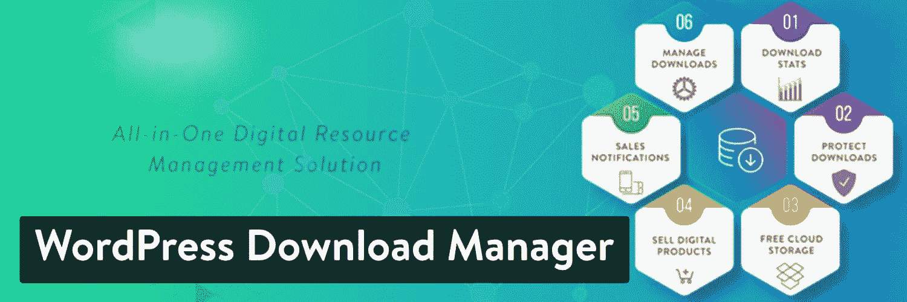
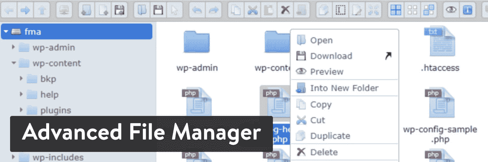
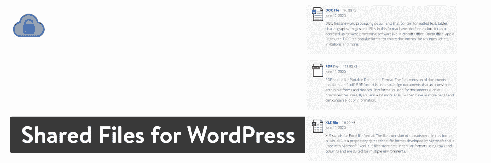
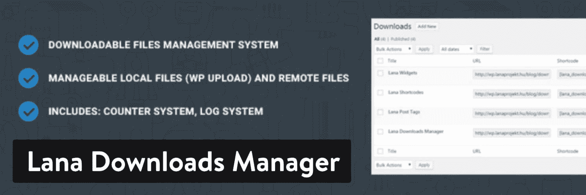
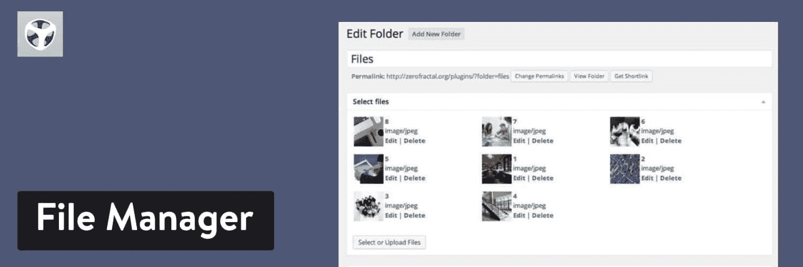
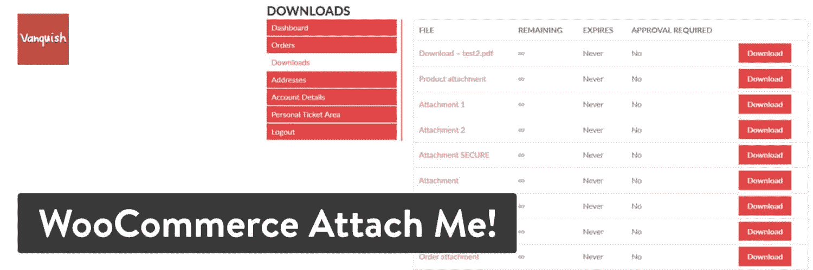
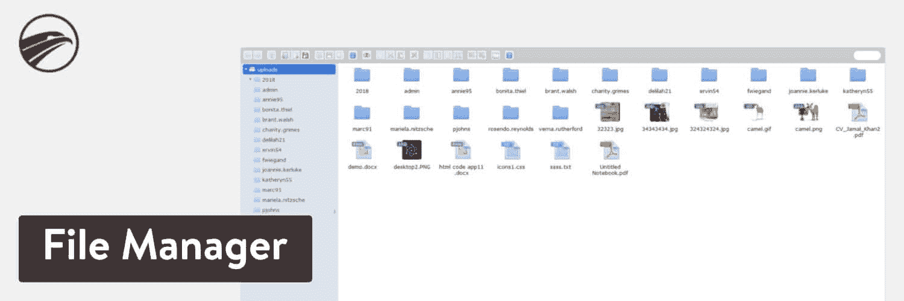
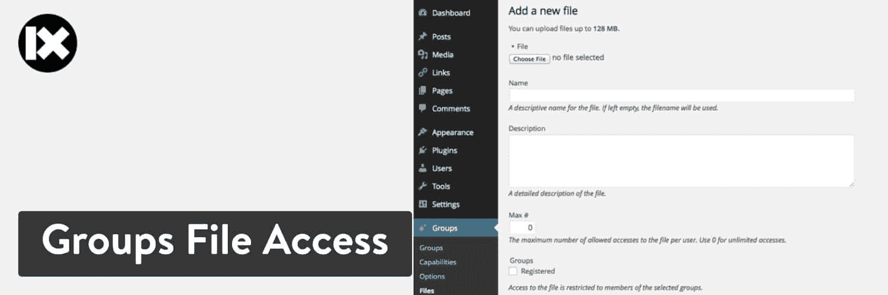
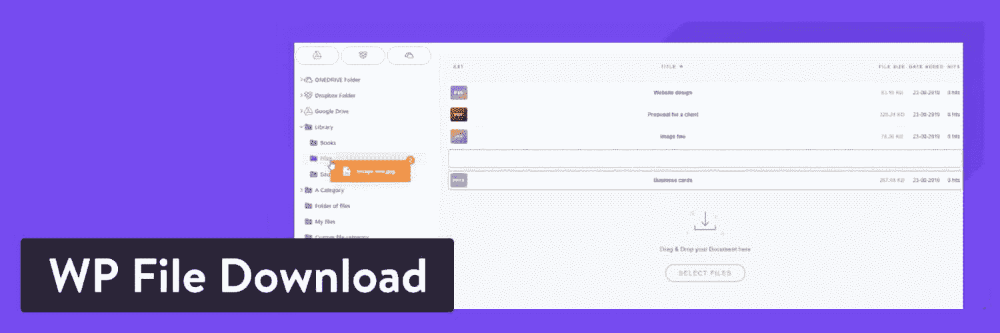
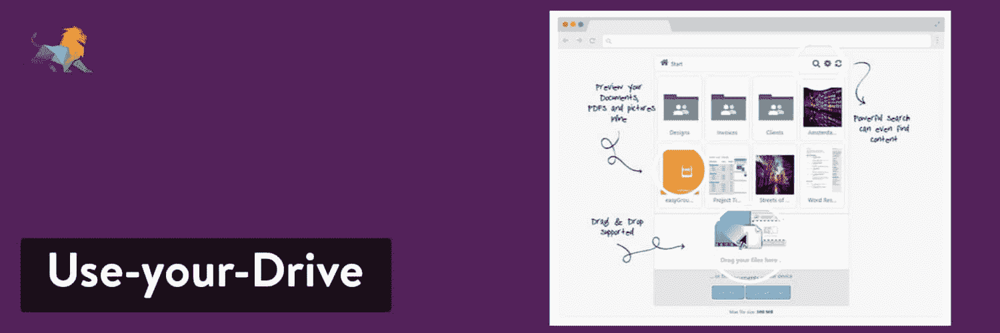

# 15 个简单易用但功能强大的 WordPress 下载管理器插件

> 原文：<https://kinsta.com/blog/wordpress-download-manager/>

WordPress 是一个优秀的写博客或托管网站的平台。然而，它已经演变成远远不止这些。这是一个强大的[内容管理系统](https://kinsta.com/knowledgebase/content-management-system/)，覆盖了 [37%的网页](https://kinsta.com/wordpress-market-share/)，由于一些 WordPress 下载管理器插件，它可以处理各种不同的文件下载需求。

原生 WordPress 用户界面确实有管理文件下载的能力，尽管这不是管理文件的最简单也不是最有效的方式。此外，原生功能还没有现在许多新的和流行的 WordPress 下载管理器插件的一半功能来帮助你处理文件。

在这篇文章中，我们将看看最好的下载管理器插件，帮助你增强 WordPress 的内置文件管理功能。

准备好了吗？我们走吧！

[These download manager plugins are the superheroes of any #WordPress site. 🦸‍♂️ Click to see all 14 👇Click to Tweet](https://twitter.com/intent/tweet?url=https%3A%2F%2Fkinsta.com%2Fblog%2Fwordpress-download-manager%2F&via=kinsta&text=These+download+manager+plugins+are+the+superheroes+of+any+%23WordPress+site.+%F0%9F%A6%B8%E2%80%8D%E2%99%82%EF%B8%8F+Click+to+see+all+14+%F0%9F%91%87&hashtags=WordPressTips%2CWordPressPlugins)

## WordPress 下载管理插件索引

根据你的具体目标和需求，有各种免费和付费的 WordPress 插件可以处理任何文件下载管理需求。

### 1.WordPress 下载管理器(免费)

WordPress Download Manager plugin

免费版的 WordPress 下载管理器包括密码保护、有限浏览和多域支持。密码保护包允许用户通过使用密码来保护整个文件包或包中的每个特定文件。这是一个简单易用的下载管理器。它也是更新最活跃的 WordPress 下载管理器插件之一。

> Kinsta 把我宠坏了，所以我现在要求每个供应商都提供这样的服务。我们还试图通过我们的 SaaS 工具支持达到这一水平。
> 
> <footer class="wp-block-kinsta-client-quote__footer">
> 
> 
> 
> <cite class="wp-block-kinsta-client-quote__cite">Suganthan Mohanadasan from @Suganthanmn</cite></footer>

[View plans](https://kinsta.com/plans/)

WordPress 下载管理器插件有免费版和付费版。高级解决方案通过整合更多功能和为您提供更好的客户支持来增加价值。起价为 59 美元，但对于需要更多许可证的开发者来说价格会上涨。

还有几十个附加组件需要考虑。如果你打算扩展核心插件，这些就派上用场了。您还可以挑选您想要使用的功能，而不是选择整个高级包。例如，一些插件包括下载限制、链接产品和私人信息。有些插件是免费的，但其他的从 49 美元到 100 美元不等。

#### 这个 WordPress 下载管理器的主要特性

*   WordPress 下载管理器插件的构建使得添加一个下载和创建一个新的 WordPress 文章是一样的。
*   该插件有一个拖放上传模块，你可以立即从你的电脑中抓取项目，并把它们放到你的网站文件管理器中。
*   你可以选择覆盖 WordPress 设置的上传上限。
*   所有上传到 WordPress 下载管理器插件的文件都受到保护。
*   将插件连接到广泛的第三方存储系统，如 Google Drive 和 Dropbox。
*   更改控件，使一些用户能够查看和下载文件，而其他用户则受到限制。
*   您可以更改下载按钮的链接图标。
*   在短代码和小工具的帮助下，在你的网站上放置下载模块。
*   文件管理器支持多种文件类型，包括 MP4 视频。
*   您可以访问数字资产管理器，直观地创建和编辑文件。这包括对预览视频和音频的支持。
*   相当多的插件出售给你升级到不同的功能。
*   该插件具有创建数字店面的高级选项，包括 PayPal 集成工具、单击销售和优惠券管理。
*   您可以访问移动应用来查看用户下载和安装您的文件时的通知。
*   免费的主题被提供给出售或托管在线文件的博客或网站。

#### 复习

五星中的 4.1 分(WordPress.org)

#### 活动安装

100,000+

#### PHP 版本

未列出

### 2。高级文件管理器(免费)

[高级文件管理器](https://wordpress.org/plugins/file-manager-advanced/)插件消除了对 FTP 和 cPanel 工作的需要，为编辑和添加您自己的站点文件提供了一个用户友好和强大的解决方案。根目录路径是完全可编辑的。此外，这个插件允许你添加一个短代码到你的站点，以允许一些用户访问完整的文件管理功能。

可以通过根目录和整个站点中的其他文件来访问文件。可以完成[上传](https://kinsta.com/knowledgebase/bulk-upload-files-wordpress-media-library-ftp/)，创建文件，重命名，存档等很多动作。PDF 预览也是可用的，这样你就不必单独打开所有的文件。

Advanced File Manager WordPress plugin

轻巧优雅的用户界面对初学者来说非常方便，视频和音频预览有助于快速检查目录中的文件。文件搜索功能在[提高您的工作效率](https://kinsta.com/blog/gmail-add-ons/)方面也发挥了巨大作用。从键盘[快捷键](https://kinsta.com/blog/wordpress-keyboard-shortcuts/)到多选工具，高级文件管理器插件为那些想要高效处理文件移动、上传和删除的人提供了坚实的基础设施。

#### 这个 WordPress 下载管理器的主要特性

*   一个高级文件管理器[短代码](https://kinsta.com/blog/wordpress-shortcodes/)被提供给你选择的登录用户。
*   短代码还提供了用户角色限制、私有文件夹路径和主题。
*   您可以将文件直接上传到目录中的任何文件夹。
*   浏览历史被储存起来，供你回顾以前做过的事情。
*   文件管理器适用于所有移动设备。
*   显示所有文件的缩略图和预览，以便您了解正在存储的内容。
*   这是一个高性能的插件，它不会延迟或者拖累你的网站。
*   该插件提供了一个文件搜索模块，可以在几秒钟内找到项目。
*   你可以通过点击一个按钮来计算文件目录的大小。
*   图像编辑可以从插件中完成。
*   您可以将任何文件移到废纸篓。
*   所有根目录文件都是完全可编辑的。
*   该插件模仿并取代了 FTP 连接的功能。

#### 复习

五星中的 4.8 分(WordPress.org)

#### 活动安装

30,000+

#### PHP 版本

5.0.0 或更高

### 3。WordPress 的共享文件(免费和高级)

WordPress 的共享文件是一个免费的插件，用于在 WordPress 网站上列出和管理文件。你的网站上共享的所有文件都可以被你授权的任何人下载和使用。它的工作原理是向你的 [WordPress admin](https://kinsta.com/knowledgebase/wordpress-admin/) 添加文件，然后在你网站的某个地方放置一个短代码，供人们下载该文件。

更重要的是，你可以组织人们将要下载的文件。创建列表或按类别对文件进行分组，以便于用户使用。高级版本售价 19.99 美元，它提供了额外的功能，如带宽使用限制，文件排序和布局选项。

Shared Files for WordPress plugin

同样值得一提的是，高级插件为您提供优先客户支持和[密码保护](https://kinsta.com/blog/password-protect-wordpress-site/)。这样，你总是知道你的文件是安全的，如果有什么不对劲的地方，你可以找人谈谈。

总的来说，该插件为所有用户提供了一个干净简单的界面，大多数设置都是开箱即用的，这意味着你通常不需要做任何改变就可以开始工作。

#### 这个 WordPress 下载管理器的主要特性

*   上传电子表格和 pdf 文件到你的 WordPress admin。
*   组织这些文件，以便用户可以找到他们想要下载的文件。
*   这个插件提供了一个短代码，让你在网站的某个地方放置一个下载按钮。
*   所有的共享文件都记录在你的 WordPress 网站的后端，让你可以轻松地管理它们。
*   对于大多数插件用户来说，默认设置就够了。
*   这个插件可以让你在任何 WordPress 站点页面上列出你所有的下载。
*   你可以分享来自第三方存储源的文件，比如谷歌驱动和 T2 下拉框。
*   你可以选择在 WordPress 文章中包含一个单独的文件。这是用短码完成的。
*   下载文件时会向管理员发送通知。
*   该插件跟踪下载的数量，让你看看哪些是表现最好的。
*   专业版整合了其他几个高级功能，如文件排序和文件加载计数器。
*   有一个搜索栏选项，用于查找特定的名称和描述。
*   当你接近你的带宽限制时，插件会进行估计。
*   该插件的专业版有在人们下载文件之前对文件进行密码保护的工具。
*   您还可以设置到期日期。
*   限制用户可以下载每个文件的次数。

#### 复习

5 颗星中的 5 颗(WordPress.org)

#### 活动安装

100+

#### PHP 版本

未列出

### 4。文件管理器(免费+高级)

[文件管理器](https://wordpress.org/plugins/wp-file-manager/)是一个高效、灵活、多功能的集成平台，可以帮助简化您的工作流程，支持直接从 WordPress 后端编辑、删除、复制、粘贴、上传、下载和压缩您的文件和文件夹版本。

这个插件会节省你的时间，这样你就不用再为 SFTP 而烦恼了。

File Manager WordPress plugin

文件管理器插件有一个完全免费的核心版本。你也可以选择花 25 美元升级到[高级版](https://filemanagerpro.io/product/file-manager/?utm_source=Wordpress.org&utm_medium=Website&utm_campaign=File%20Manager%20Pro)。这为[用户权限](https://kinsta.com/blog/wordpress-user-roles/)、[最大文件上传大小](https://kinsta.com/blog/increase-max-upload-size-wordpress/)和短代码生成提供了各种功能。

这个插件的伟大之处在于，免费版本对于大多数企业来说是理想的，因为它允许存档、文件移动和复制。甚至还有一个[代码编辑器](https://kinsta.com/blog/free-html-editor/)和语法检查器，供那些对使用更高级工具感兴趣的人使用。除了 PDF 预览和自动调整文件大小，文件管理器插件以相当低的成本完成了这个任务。

#### 这个 WordPress 下载管理器的主要特性

*   该插件为未登录用户提供了一个短代码，这样你就可以让公众访问者从你的网站下载文件。
*   可以对远程服务器上的文件和文件夹执行各种操作。
*   管理员可以创建、存档和提取文件(zip、rar、tar、gzip)。
*   该插件包括一个多文件部分。管理员可以通过简单的拖放来复制/移动文件。
*   控制可以上传或下载的文件类型。
*   在保存文件之前检查代码，确保您的站点在更新代码时不会关闭。
*   删除的文件可以被移到垃圾桶。
*   通过编辑根路径目录来访问 WordPress 内外的文件。
*   很容易预览常见的文件类型，包括媒体。(视频、音频、mp3、PDF、缩略图等。)
*   如果你正在寻找 SFTP(T1)或 T2(T3)的替代品，这可能行得通。
*   该插件允许您备份和恢复项目，如主题文件和媒体元素。
*   可以直接上传到媒体库。
*   提供了拖放上传功能。
*   插件附带了几个键盘快捷键。这使得查找文件、完成快速任务和加快工作流程变得容易。
*   您可以选择计算目录的大小。
*   您的整个浏览历史可用于检查过去做过什么。

#### 复习

五星中的 4.8 分(WordPress.org)

#### 活动安装

600,000+

#### PHP 版本

5.2.4 或更高版本

### 5.下载监视器

[下载监视器](https://www.download-monitor.com/)是 WordPress 的一个易于使用的数字下载管理器插件，旨在帮助你增加受众，跟踪下载性能，并将流量转化为销售额。

Download Monitor 是一个[免费提供的插件](https://wordpress.org/plugins/download-monitor/),它可以很好地与所有 WordPress 主题一起工作，并给你开始在你的 WordPress 站点上销售和分发数字文件所需的一切。

Download Monitor

此外，下载监视器带有高级报告功能。有了它，您可以查看任何时间段的下载，即时查看您的热门下载(包括您商店最受欢迎的下载)，分析您的日平均下载次数，等等。

通过以优惠的价格购买其所有高级扩展作为完整捆绑包的一部分，您可以解锁以下所有功能以及更多功能。

#### 这个 WordPress 下载管理器的主要特性

*   通过几个简单的步骤销售和分发您的数字文件。
*   轻松上传、分类、标记和管理所有类型的数字文件(pdf、软件包、音轨、视频文件、数字艺术等)及其版本。
*   将多个文件版本添加到您的下载中，每个版本都有自己的数据集，如下载计数和文件链接。
*   自动下载文件跟踪——您不必费心在 [Google Analytics](https://kinsta.com/blog/google-analytics-wordpress/) 中创建事件来跟踪您的各种文件及其各种版本的下载次数。
*   支持 [PayPal](https://kinsta.com/blog/stripe-vs-paypal/) 和[其他支付网关](https://kinsta.com/blog/paypal-alternative/)(即将推出)。
*   将你的文件放在 Google Drive 或亚马逊 S3 上，这样你甚至可以提供自动过期的链接，并从高速文件传输网络中受益。
*   只需轻轻一点，即可将所有下载内容(包括类别、标签和文件版本)导出和导入到一个 CSV 文件中。
*   内容锁定扩展，如用 tweet 支付、在能够下载文件之前填写表格、电子邮件锁定等等。
*   创建美观、可定制的下载体验。
*   要求用户在下载你的文件之前完成 Google reCAPTCHA，以阻止机器人注册你的电子邮件锁定下载并获得受保护文件的访问权限。
*   它是 Gutenberg-ready，所以你可以使用新的[块编辑器](https://kinsta.com/blog/gutenberg-wordpress-editor/)从任何地方添加下载。

#### 复习

5 颗星中的 4.4 颗(WordPress.org)

#### 活动安装

100,000+

#### PHP 版本

5.6 或更高

### 6 。轻松数字下载(免费)

Easy Digital Downloads WordPress plugin

[Easy Digital Downloads](https://wordpress.org/plugins/easy-digital-downloads/) 主要是一个[电子商务解决方案](https://kinsta.com/blog/ecommerce-platforms/)，适用于任何类型的数字下载，但它也可以管理每个下载产品的多个文件下载。

如果您有不同的产品价格或捆绑产品，这是一个很好的选择。它的默认支付选项是 PayPal 和手动支付，但也可以付费添加其他选项。如果你想了解更多关于简易数字下载的信息，这里有[的综合指南](https://kinsta.com/blog/easy-digital-downloads/ "A Comprehensive Overview of Easy Digital Downloads")。

核心插件将工具集成到 WordPress 中，向任何决定访问你网站的人出售数字产品。简而言之，你可以将这些文件上传到你的网站，将它们列为电子商务产品，然后在人们决定购买时，自动在电子邮件中发送下载链接。您可以上传各种文件类型，如软件、文档和图形。

[支付网关](https://kinsta.com/blog/woocommerce-payment-gateways/)与插件集成，开箱即可支持 PayPal 标准和亚马逊支付。免费版本足以开始销售你的数字产品并组织它们，以便人们可以找到正确的文件。

之后，你必须升级到高级版本或者选择付费插件。例如，大多数支付网关需要高级扩展。

#### 这个 WordPress 下载管理器的主要特性

*   轻松数字下载(EDD)为几十种文件类型提供文件管理和下载功能，如图形、[歌曲](https://kinsta.com/blog/wordpress-audio-players/)和[电子书](https://kinsta.com/ebooks/)。
*   [本地化](https://kinsta.com/blog/wordpress-multilingual/)用于将插件翻译成除英语之外的其他语言。
*   支付网关要么通过核心插件提供，要么通过升级其中一个扩展来提供。
*   阻止部分用户下载项目。
*   为您的产品提供无限数量的文件下载。
*   客户可以创建他们自己的帐户页面来回顾下载并获取他们过去购买的项目。
*   通过管理仪表板跟踪所有下载活动。
*   使用 [REST API](https://kinsta.com/blog/wordpress-rest-api/) 与外部应用程序集成。
*   该插件提供完整的报告数据，以了解你的下载销售情况，并与簿记应用程序联系起来。
*   你可以将 EDD 与 MailChimp、Stripe 和 [Zapier](https://kinsta.com/blog/woocommerce-zapier/) 等大量其他应用程序集成在一起。
*   在产品页面上列出您上传的所有文件。
*   完整的购物车是一个很好的解决方案，可以快速处理付款，并为您的客户提供下载链接。
*   自动化是 EDD 界面的一个重要组成部分，就像当购买和下载完成时，电子邮件是如何发送给你和客户的一样。
*   高级订阅提供高级工具，如电子邮件营销功能和销售下载订阅的能力。
*   EDD 为会计、分析和网关等领域提供了一个扩展库。

#### 复习

5 颗星中的 4.7 颗(WordPress.org)

#### 活动安装

60,000+

#### PHP 版本

5.3 或更高

### 7 。WooCommerce(免费)

[WooCommerce plugin](https://kinsta.com/blog/woocommerce-plugins/)

WooCommerce 是一个免费的电子商务插件，允许你通过你的 WordPress 网站出售任何东西。WooCommerce 与 WordPress 无缝集成，是世界上最受欢迎的电子商务解决方案之一，让店主和开发者完全控制。

请务必查看我们的深度 [WooCommerce 教程](https://kinsta.com/blog/woocommerce-tutorial/)。

它是如何作为下载管理器插件的？它类似于简单的数字下载，你可以上传所有的数字文件，并组织它们在网上销售。如果你不打算出售物品，就没有理由考虑 WooCommerce。

WooCommerce 既是一个文件管理器，也是一个电子商务平台。因此，如果您需要这两种功能，这是最有意义的。

至于文件下载管理，WooCommerce 包括对数字商品的支持，比如当你想出售你的电子书或音乐曲目时。该插件支持大多数主要的文件类型，所以它通常取决于你能上传到 WordPress 的内容。之后，WooCommerce 会给你提供选项，让你可以向客户提供即时下载，并发送带有下载链接的电子邮件。

将这个链接到你的支付网关，找到一个好的 [WooCommerce 主题](https://kinsta.com/blog/woocommerce-themes/)，你就可以组织和销售你的数字文件了。

#### 这个 WordPress 下载管理器的主要特性

*   WooCommerce 的功能是下载管理器和完整的电子商务商店和购物车。
*   该插件提供了上传数码产品并将其标记为可下载的设置。
*   您可以立即将这些文件作为格式精美的产品页面放在您的网站上。
*   中央仪表盘提供关键指标，如产品下载量。
*   选择为购物者提供即时下载，并考虑免费赠送你的文件。你也可以列出它们的价格，并将插件连接到支付网关。
*   两个支付网关已经免费提供。其他几十个是作为扩展提供的[。](https://kinsta.com/blog/woocommerce-extensions/)
*   您可以为所有下载设置用户限制，减少每个项目的下载次数，或者完全阻止某些用户。
*   在你的网站上，你可以上传和提供下载的文件类型没有什么限制。例如，许多商店出售 pdf、MP3 或 WAV 文件。
*   WooCommerce 提供了独特的能力来组织你的数字下载作为电子商务收藏。在你的主页上突出显示这些内容，并对它们进行组织，以便客户可以轻松找到它们。

#### 复习

5 颗星中的 4.6 颗(WordPress.org)

#### 活动安装

500 多万

#### PHP 版本

7.0 或更高版本

### 8 。多元宇宙(高级版)

Multiverso 实现了前端文件管理和加密下载。如果你想给你的下载管理器增加一些安全性，并可能阻止某些用户的下载，这是最好的解决方案之一。

这是一个高级插件，在 CodeCanyon 上售价 30 美元。您还可以选择延长价格的高级支持时间。

除了低成本之外，Multiverso 插件还有许多其他好处，如高级主题兼容性、本地化和短代码支持。例如，这允许你直接上传文件到你的网站，在页面上放一个短代码，然后让你的客户把这些文件下载到他们自己的电脑上。

Multiverso WordPress plugin

您还可以访问六个[小工具](https://kinsta.com/blog/wordpress-widgets/)。这对于在边栏和页脚等地方添加下载按钮非常有用。

其他一些值得期待的功能包括前端上传功能。有了这个，你可以把控制权交给你的用户，显示前端的上传按钮，甚至一些文件管理工具。如果您不在电脑上，远程上传选项也很有用。

考虑 Multiverso 插件的另一个原因是，它有限制文件上传大小和访问管理的选项。加密也是插件的一个重要部分。

举例来说，您可能希望确保客户下载时下载内容受到保护。或者，也许你想完全阻止某些文件的下载。不管怎样，通常有可能[侵入那些文件](https://kinsta.com/blog/wordpress-hacked/)的传输。加密增加了一定程度的安全性，以减少您的担忧。

#### 这个 WordPress 下载管理器的主要特性

*   Multiverso 插件结合了前端和后端的文件上传和下载管理，管理员和客户都可以使用。
*   文件上传和下载被加密以增强安全性。
*   您可以选择将直接链接附加到您的文件。这样，就不需要实际上传文件了。
*   更改您的访问规则，以便只有部分用户可以上传和下载文件。
*   该插件包括改变文件上传限制和最大文件大小的设置。
*   上传一个文件并包含该文件的下载链接类似于创建一个 WordPress 帖子。
*   插件附带了几个短代码，用于共享列表和文件集合。
*   六个小工具可以用来在你的网站上添加下载按钮。
*   为[开发者](https://kinsta.com/blog/hire-wordpress-developer/)提供高级功能，将插件与第三方应用程序链接，并进行自己的定制。

#### 复习

5 颗星中的 4 颗(CodeCanyon.net)

## 注册订阅时事通讯

### 想知道我们是怎么让流量增长超过 1000%的吗？

加入 20，000 多名获得我们每周时事通讯和内部消息的人的行列吧！

[Subscribe Now](#newsletter)

#### 活动安装

1,200+

#### PHP 版本

未列出

### 9 。拉娜下载管理器(免费)

拉娜下载管理器插件超级简单和免费。它允许通过 WP 上传和远程文件管理本地文件。如果你正在寻找一些基本和轻量级的东西，这很好。

一些基本功能包括计数器系统和日志系统。这些配对很好地统计了系统中下载和文件的数量。它还可以方便地测量文件大小，以防达到服务器的极限。

Lana Downloads Manager plugin

在你[将插件安装到你的 WordPress 站点](https://kinsta.com/knowledgebase/how-to-install-wordpress-plugins/)之后，插件就准备好了。它要求你上传数字内容给你的管理员。您可以从一长串支持的文件中进行选择，从音频剪辑到视频和图像。

上传文件后，所有文件都整理在一个页面上。您可以给文件命名，并指定您是否希望用户下载它们。

所有上传到 Lana 下载管理器插件的文件都有一个分配给它们的 [URL](https://kinsta.com/knowledgebase/what-is-a-url/) 和短代码。通过这种方式，你可以直接与客户分享下载链接，或者将短代码插入到你选择的任何页面或帖子中。每个文件旁边甚至有一个下载计数器，让你可以查看每个项目的受欢迎程度。

#### 这个 WordPress 下载管理器的主要特性

*   Lana 下载管理器插件是一个轻量级的下载管理器，不会与你的主题或其他插件产生任何冲突。它也很容易导航和移动您的下载链接到您网站的其他部分。
*   所有文件都被组织到您的管理的一个部分。
*   你可以利用短码在你网站的任何地方放置下载按钮。例如，您可以考虑在博客文章中放置一个短代码，供人们下载音频文件。
*   日志系统可以让你回顾上传和下载的历史。
*   下载计数显示在所有文件的旁边。
*   插件设置已经准备好了，不需要做任何修改，这对于简单的配置和初学者来说是非常理想的。
*   所有下载都被命名和分类以便于搜索。
*   您可以复制下载的网址并与任何人分享。
*   该插件提供了管理和上传本地和远程设备文件的选项。
*   同一个开发者提供了相当多的其他免费插件，包括添加小部件的选项、进行搜索引擎优化的选项和提高安全性的选项。所有这些都集成了 Lana 下载管理器插件。

#### 复习

5 颗星中的 5 颗(WordPress.org)

#### 活动安装

2,000+

#### PHP 版本

未列出

### 10 。文件管理器(高级版)

文件管理器有一个通用的名字，但是它在这样一个小插件中包含了相当多的功能。首先，文件管理器在 CodeCanyon 上的售价为 20 美元，对于那些对强大的下载管理解决方案感兴趣的人来说，这是一个负担得起的选择。

该插件包括一个小部件，用于从多个位置管理您的文件。还有一个直接的[登录工具，让用户访问下载](https://kinsta.com/blog/wordpress-user-registration-plugins/)。公共和私人文件夹是选项，以及对 WordPress 上通常不允许的文件的支持。

下载计数器值得研究，受保护的下载 URL 安全肯定会减轻对数字下载是否完全安全的担忧。

File Manager WordPress plugin

除此之外，文件管理器插件提供了一个拖放文件上传器，把这个过程变成了一个简单的拖放动作。您还可以控制谁有权访问正在下载的文件。为了让您了解这是如何工作的，假设您的组织希望内部员工为客户下载媒体文件。你显然不希望任何一个随机的人这么做，所以设置用户限制是有意义的。

要寻找的一些其他元素包括自定义图标图像链接和[文件类型图标支持](https://kinsta.com/blog/wordpress-icon-fonts/)。这给你长长的文件列表增加了更多的视觉体验。除此之外，你还可以使用一个[搜索](https://kinsta.com/blog/wordpress-search/)和分类选项，在这里你可以键入一个关键词，在几秒钟内找到一个文件。

#### 这个 WordPress 下载管理器的主要特性

*   文件管理器插件有下载链接标签来清理混乱的 URL。
*   搜索和排序对于加快你的工作流程非常有用。
*   文件图标和自定义图像可以根据[图像](https://kinsta.com/blog/free-images-for-wordpress/)更容易地识别文件。
*   管理员可以决定哪些用户类型能够下载和查看某些文件。
*   您可以创建和管理子文件夹和文件夹，以便更好地组织。
*   该插件具有拖放功能，所以你所需要做的就是将文件从你的电脑移动到在线上传工具。
*   提供了一个文件管理器小部件，用于在网站的其他部分放置下载和上传功能。
*   您可以选择是公开还是私下发布文件夹。
*   WordPress 并不支持每一种文件类型，但是文件管理器插件增加了你可以上传到服务器的文件数量。
*   这个插件有一个下载计数器来了解你的下载有多受欢迎。
*   选择根据哪些人下载了哪些内容来创建用户组。
*   该插件是一个轻量级的现代界面。学习如何浏览文件和文件夹也很容易。

#### 复习

5 颗星中的 4 颗(CodeCanyon.net)

#### 活动安装

870+

#### PHP 版本

未列出

### 11。WooCommerce 附我！(溢价)

[WooCommerce 附我！](https://codecanyon.net/item/woocommerce-attach-me/11975229)并不适合所有人，但它确实是 WooCommerce 网站的一个完整的文件下载管理器。它不仅提供了一个向购买物品的[客户发送下载链接的系统，还提供了独特的工具来组织这些文件，并在下载前将它们分类。](https://kinsta.com/blog/recurring-revenue-model/)

一个很好的例子是，当有人从您的公司购买软件时，在收据上添加 PDF 文件下载。这可能是一个手册，视频，或额外的照片，给人们一个如何使用该软件的想法。

与宕机和 WordPress 问题做斗争？Kinsta 是一款考虑到性能和安全性的托管解决方案！[查看我们的计划](https://kinsta.com/plans/?in-article-cta)

数码产品和实体产品都可以下载文件，您的客户甚至可以访问他们自己的文件上传按钮。

WooCommerce Attach Me! plugin

所有的文件链接都受到插件的保护，你的用户只有在收到自动发送的邮件后才会收到下载链接。

总的来说，您有两种方法来组织文件并与用户共享文件。其中之一是链接到产品页面上的下载。没有必要为这些下载付费，因为它更多的是添加到页面的链接。另一个选项是将下载链接添加到[您的订单电子邮件](https://kinsta.com/help/transactional-email/)中。

该插件还有一个干净的管理模块，用于移动文件并识别哪些文件下载最多。

请记住，这个插件没有免费版本可以下载。话虽如此，code canyon 22 美元的价格还是很合理的。

#### 这个 WordPress 下载管理器的主要特性

*   使用此插件，您可以将附件文件上传到产品页面并订购电子邮件。
*   文件管理器支持多种文件类型，如 pdf、Word 文档和 MP3。
*   管理员和客户都可以访问下载选项卡。这样，用户可以返回查看他们已经获得的所有下载。
*   自动发送电子邮件进行订购，并带有添加数字下载链接的模板。
*   你可以在你的 WordPress admin 上批量上传和删除文件。
*   短码可用于在您网站的任何地方放置下载链接。
*   这个插件可以让你预览下载的文件，这样你就不用打开每一个文件就可以组织它们。
*   客户能够在前端从他们自己的帐户下载所有的文件。
*   为您的一些文件添加文件到期日期。
*   所有文件链接都是安全的，只有该链接的所有者才能下载文件。
*   您可以设置它，以便您的商店根据产品型号自动将某些下载内容附加到订单上。
*   这是管理补充产品文档的一种更简单的方式，而不是试图链接到产品描述或其他地方的那些项目。

#### 复习

五星中的 4.99 分(CodeCanyon.net)

#### 活动安装

1,100+

#### PHP 版本

未列出

### 12。WordPress(高级版)的文件管理器插件

WordPress 的[文件管理器插件非常强大，有一个很棒的用户界面。这个插件在 CodeCanyon 上只卖 19 美元，这使得它成为管理 WordPress 网站上可下载文件的又一个便宜的选择。](https://codecanyon.net/item/file-manager-plugin-for-wordpress/2640424)

文件管理器插件有几个突出的元素，包括所有的上传都是通过拖放系统完成的。这加快了过程，并确保所有技能水平都可以使用该工具。

还有前端访问，如果你打算让客户或员工上传他们自己的文件或下载管理员提供的文件，这很重要。

File Manager plugin

购买 WordPress 插件的文件管理器插件时，会附带多个主题。尽管这对于一个有效的下载管理器来说并不重要，但它扩展了这样一个事实，有时颜色和按钮位置决定了人们是否愿意使用一个界面。

有了这个插件，你可以定制平台，这样你就可以完全适应它的外观了。

通过该插件可以实现文件夹共享，以及上传较大文件和文件夹的快捷工具。一些更独特的功能包括内置的文本和图像编辑器，这两者都取代了对完成相同任务的第三方工具的需求。

还值得一提的是，提供了 PSD/PDF 编辑器，进一步扩展了工具的数量，使您可以编辑或查看文件，而不必通过 [FTP 连接](https://kinsta.com/blog/best-ftp-clients/)或在您的本地计算机上访问它们。

#### 这个 WordPress 下载管理器的主要特性

*   提供图像和文档编辑，用于在插件中更改文件。这些是相当高级的编辑器。例如，图像编辑器是基于 Photoshop 的，在不实际需要 Photoshop 的情况下创造了一种美丽的体验。
*   您可以通过确定哪些用户可以查看和下载某些文件夹来调整用户访问权限。
*   [在插件中搜索文件时会出现图像缩略图](https://kinsta.com/blog/regenerate-thumbnails/)。
*   该插件有一个短代码生成器，所以你可以提供前端访问你的文件下载功能。
*   多个主题有助于使下载和文件区域更容易导航。如果有的话，他们允许用户对界面感到舒适，并根据自己的愿望进行定制。
*   当有人下载文件时，会发送电子邮件通知。这些被发送给管理员和下载的用户。
*   谷歌文档浏览器非常适合链接到你存储在系统中的文档。
*   该插件提供了创建用户组和在这些组中共享特定文件的工具。例如，您可能需要与几个员工共享一份合同，并且只与这些员工共享。
*   自动文件夹创建减少了生成全新文件所需的时间。
*   如果未经授权的用户试图下载文件，或者如果你最终与曾经有权访问的同事分道扬镳，你可以禁止访问。
*   大多数文件类型显示缩略图图像，以增加一些视觉效果，并使文件识别速度更快。

#### 复习

5 颗星中的 4.5 颗(CodeCanyon.net)

#### 活动安装

3,500+

#### PHP 版本

未列出

### 13。群组文件访问 WordPress 插件(高级版)

[组文件访问](https://codecanyon.net/item/groups-file-access-wordpress-plugin/2228793) WordPress 插件只为授权用户提供文件下载链接。根据用户的[组成员身份](https://kinsta.com/blog/wordpress-membership-plugins/)，其他所有对文件的访问都受到限制。

这个列表上的许多其他 WordPress 下载管理器选项都有这个功能，但是这个选项更侧重于限制内容和保护你网站上的文件。这就是为什么如果[安全性是您的首要任务](https://kinsta.com/secure-wordpress-hosting/)，我们建议将文件访问分组。

没有免费的插件，但你可以在 CodeCanyon 上花 29 美元获得团体文件访问的高级版本。

Groups File Access WordPress plugin

安装了这个插件后，你的 WordPress 站点就变成了一个生成专属群组的中心，在这里你可以共享文件，并且只与你选择的人联系。

[视频](https://kinsta.com/blog/video-hosting/)、文档和图像均受支持，并可随时配置限制设置。此外，该插件嵌入了受保护的流媒体，因此没有人会窃取您的内容。

多站点支持是一个有趣的特性，考虑到你可能不得不在多个 WordPress 站点的[网络上共享文件。我们也很高兴团体文件访问插件包括一个漂亮的文件管理区来移动文件夹，删除一些，增加更多。](https://kinsta.com/blog/wordpress-multisite/)

导入仍然通过 FTP 完成，但值得注意的是允许批量导入。

#### 这个 WordPress 下载管理器的主要特性

*   该插件允许您限制授权用户组对下载的访问。这意味着每次公开文件时，您都必须设置限制。
*   选择限制每个用户的下载次数。你也有机会设置无限下载，但是如果你不想让用户一遍又一遍地下载文件，这是一个很好的特性。
*   该插件支持完全的 [WordPress 多站点](https://kinsta.com/wordpress-multisite-hosting/)文件共享，接入几个 WordPress 站点，这样所有的站点都可以上传和下载文件到插件。
*   在 WordPress 中，文件管理区域被整合到一个模块中。它足够现代，而且对所有用户来说都很容易理解。
*   如果您打算在服务器上存储大量文件，您可以通过 FTP 上传文件和批量导入。
*   这个插件通过增加文件访问限制和用户授权来提高 WordPress 文件的安全性。
*   如果某人被授予对一组文件的访问权限，就会发出自动通知。这些通知会在下载完成时发出。
*   灵活的短代码自动生成，通常用于提供前端下载区和文件访问中心。
*   在嵌入式保护支持的帮助下，您网站上呈现的所有流媒体都受到保护。
*   WordPress 支持的所有媒体类型在通过这个插件上传和管理时也是允许的。
*   在决定要将哪些文件大容量导入到服务器之前，您可以选择扫描计算机上的文件。

#### 复习

5 颗星中的 4.3 颗(CodeCanyon.net)

#### 活动安装

1,400+

#### PHP 版本

未列出

### 14.WP 文件下载(高级版)

WP 文件下载插件只是一个高级扩展，但是需要注意的是这个插件每个月都会更新。如果你正在寻找一个开发者支持的插件，这是你应该考虑的。它也有不同的语言版本。

该插件的起价为 29 美元。这将为您提供六个月的特优支持，并提供每六个月升级一次的选项。如果你想支持更多的插件和站点许可，你还可以找到一些其他的定价方案。

WP File Download plugin

四个主题被打包到插件中，打开你的创造力，让你对系统的外观有一点发言权。文件管理器功能强大，但易于理解，具有拖放功能、漂亮的缩略图和干净的界面，大多数人应该能够掌握。

您可以限制文件下载访问，甚至可以更改谁可以在您的网站上查看文件。

你可能也注意到了这个列表中的大多数下载管理器没有任何[古腾堡功能](https://kinsta.com/blog/gutenberg-wordpress-editor/)。这并不意味着他们将打破古腾堡系统，而是他们没有任何集成的拖放工具。WP 文件下载插件就不是这样了。它为在前端加载 WordPress 文件提供了两个专用块。

很高兴知道这个插件集成了流行的文件存储服务，如 Google Drive 和 Dropbox。

#### 这个 WordPress 下载管理器的主要特性

*   该插件有一个最光滑的文件组织模块，包括缩略图、明亮的颜色和拖放功能。它看起来与大多数苹果软件相似。
*   您可以上传任意数量的文件，添加的文件类型无关紧要。
*   定义哪些用户能够下载您提供的文件。您可以授予对整个文件夹的访问权限，或者只决定将单个文件分配给某些人。
*   该插件提供了两个古腾堡模块，这样你的下载按钮可以很容易地放在你网站的任何地方。这完全消除了对窗口小部件和短代码的需求，这是大多数竞争对手所缺乏的功能。
*   将您的网站链接到云文件存储和共享服务，如 Google Drive 和 OneDrive。Dropbox 也是一种可能。
*   颜色和定制设置似乎比竞争对手更先进。使用这些设置来匹配插件设计到你的主题。您甚至可以让上传和下载模块看起来像是专为您的公司打造的。
*   文件搜索引擎引入了各种强大的搜索工具。其中一些包括全文搜索、类别过滤和基于日期或文件类型的文件排序。还有标签过滤、文件预览，以及兼容原生 WordPress 搜索栏的能力。
*   包括新文件上传和文件删除在内的多项任务都会发送电子邮件通知。你可以决定哪些邮件发给用户，哪些邮件留给管理员。
*   只需点击一个按钮，就可以完成文件更新和版本控制。
*   download manager stats 提供了简单和复杂的图表，以了解您的下载执行得如何，以及将来是否需要更改。
*   浏览目录时，您可以预览所有文件。还有一个在旅途中远程下载文件的选项。

#### 复习

未列出

#### 活动安装

未列出

#### PHP 版本

未列出

### 15.使用你的驱动器(高级)

尽管这个名字听起来不像 WordPress 下载管理器，但这正是 [Use-your-Drive](https://codecanyon.net/item/useyourdrive-google-drive-plugin-for-wordpress/6219776?) 插件所做的。事实上，该插件提供了一个相当独特的功能，这在其他插件中偶尔会发现，但并不完善。

使用你的驱动插件将你的 WordPress 网站链接到你的 Google Drive 账户。通过这个链接，你可以将所有类型的文件上传到你的 Google Drive，并在你的网站上显示，或者提供下载按钮。

想象一下你的公司销售软件。您的产品开发团队经常共享图片、文档甚至音频文件。“使用你的驱动”插件将那些团队成员引导到 WordPress 网站，而不是进入第三方工具。他们可以查看和编辑他们有权访问的所有文件。

最棒的是，这些文件是从 Google Drive 中提取的，所以您也有一个很好的位置来管理和上传这些文件。

Use-your-Drive WordPress plugin

上传是通过 Google Drive 或者 WordPress 完成的。用户可以在线预览文档和图像，同时还可以利用强大的搜索工具找到正确的文件夹。独特的功能包括在画廊中展示照片或展示所有文件夹的缩略图。

您的所有内容也可以从网站上流式传输。因此，如果你想[拥有一个图库](https://kinsta.com/blog/wordpress-photo-gallery-plugins/)或一个视频列表，只需将你的 Google Drive 帐户链接到包含这些视频的文件夹。

总的来说,“使用你的驱动器”插件做的事情和列表中的其他下载管理器完全一样。主要区别在于，所有文件都存储在 Google Drive 中。因此，如果你已经在使用免费版本，或者为 Google Drive 的高级版本付费，这个插件对你的下载管理是有意义的。

#### 这个 WordPress 下载管理器的主要特性

*   该插件具有一个有组织的管理面板，可以一键链接到 Google Drive 并管理您的文件。
*   报告面板有历史日志和图表来检查下载。
*   您可以在网站前端列出您的文档、图像和视频。
*   选择与特定群组或个人共享某些文件夹。
*   创建共享链接，这样您的文件是安全的，但您可以继续将文件分发给合适的人。
*   该插件提供了在线预览或流媒体内容的选项。
*   文件搜索是在过滤器和强大的搜索栏的帮助下完成的。
*   这个插件包括一个短代码生成器，可以在你网站的其他地方显示一些你可以下载的文件。
*   你可以从你的 WordPress 仪表盘直接上传到 Google Drive cloud。

#### 复习

5 颗星中的 5 颗(CodeCanyon.net)

#### 活动安装

6,100+

#### 古腾堡兼容？

不

#### PHP 版本

未列出

## 选择正确的 WordPress 下载管理器插件

根据你的具体需求，每个场景都有一个 WordPress 下载管理器插件。通过小组协作、下载跟踪甚至简单的文件组织等功能，您可以确信您会找到适合您的文件管理插件。

[Make managing files a breeze 💨 with these 15 great download manager plugins 🚀Click to Tweet](https://twitter.com/intent/tweet?url=https%3A%2F%2Fkinsta.com%2Fblog%2Fwordpress-download-manager%2F&via=kinsta&text=Make+managing+files+a+breeze+%F0%9F%92%A8++with+these+15+great+download+manager+plugins+%F0%9F%9A%80&hashtags=WordPressPlugins%2CCMS)

需要记住的一点是，下载管理器来来去去。当我们浏览整个列表时，没有明显的赢家。其中一些已经存在了很长时间，但是对于那些久负盛名的下载管理器来说，过一段时间就消失或者失去开发支持也并不罕见。

因此，我们建议您选择对您的公司最有意义的产品，并进行测试，直到您找到完美的匹配。希望这个 WordPress 下载管理器插件列表能帮助你缩小搜索范围。

我们错过了任何重要的 WordPress 下载管理器插件吗？如果是这样，请在下面的评论中告诉我们。另外，如果你已经测试过这些插件，请分享你的想法，并向其他用户推荐或不推荐它们。

* * *

让你所有的[应用程序](https://kinsta.com/application-hosting/)、[数据库](https://kinsta.com/database-hosting/)和 [WordPress 网站](https://kinsta.com/wordpress-hosting/)在线并在一个屋檐下。我们功能丰富的高性能云平台包括:

*   在 MyKinsta 仪表盘中轻松设置和管理
*   24/7 专家支持
*   最好的谷歌云平台硬件和网络，由 Kubernetes 提供最大的可扩展性
*   面向速度和安全性的企业级 Cloudflare 集成
*   全球受众覆盖全球多达 35 个数据中心和 275 多个 pop

在第一个月使用托管的[应用程序或托管](https://kinsta.com/application-hosting/)的[数据库，您可以享受 20 美元的优惠，亲自测试一下。探索我们的](https://kinsta.com/database-hosting/)[计划](https://kinsta.com/plans/)或[与销售人员交谈](https://kinsta.com/contact-us/)以找到最适合您的方式。