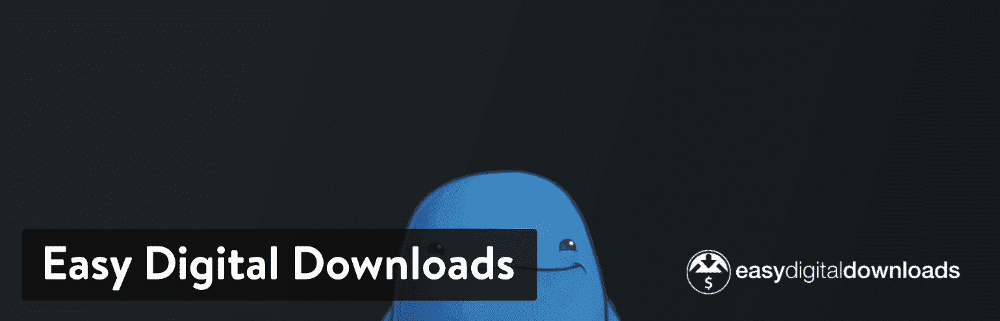
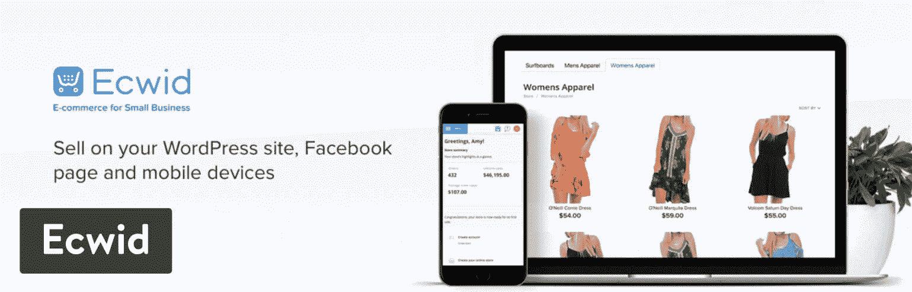
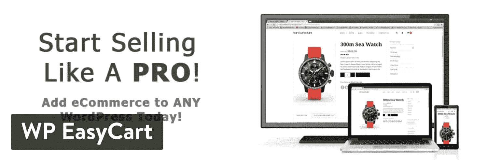

# 2022 年你的商店的 6 个最佳 WordPress 电子商务插件

> 原文：<https://kinsta.com/blog/wordpress-ecommerce-plugins/>

建立网上商店的选择似乎越来越多。你有 SaaS(软件即服务)平台，如 [Shopify](https://kinsta.com/blog/woocommerce-vs-shopify/) 和 [BigCommerce](https://kinsta.com/blog/woocommerce-alternative-bigcommerce/) ，以及同样强大的 WordPress 电子商务插件。两者都有优势，但是没有什么比把你当前的 WordPress 网站变成一个功能齐全的在线商店更好的了。有一天你可能会写博客并增加追随者，第二天你就可以推出一个包含电子书和商品的产品展示区。

销售自己的产品确实是网上赚钱的最好方式之一，并且可以通过一个方便的插件来完成。

关于这些 WordPress 电子商务插件的好消息是，它们提供了与 [SaaS 产品](https://kinsta.com/blog/saas-products/)相同的功能和好处，并且你可以获得优秀的支持资源、繁荣的开发社区，以及与世界上最简单的[内容管理系统](https://kinsta.com/knowledgebase/content-management-system/)的集成。因此，无论您销售的是甜甜圈还是数字下载，您都可以在几分钟内启动并运行。

我们将在下面概述的插件是最好的。不过其中有些是迎合不同的用户，有些则更适合[销售特定产品](https://kinsta.com/blog/ecommerce-strategies/)。例如，你可能只需要在你的网站上销售视频内容。如果是这样的话，你只有几个好的选择。无论你是想成为一个大的数字零售商，还是你想投资你的时间在一个实体产品商店，我们将缩小哪个 WordPress 电子商务插件最适合你的组织。

## 最佳 WordPress 电子商务插件列表

我认为大多数严肃的企业计划测试和比较电子商务插件，直到他们找到合适的。我们对下面每个最好的 WordPress 电子商务插件进行了全面的评估。也就是说，如果你很着急，或者想自己开始测试电子商务插件，这里有一个快速的最佳选择列表。

1.  [WooCommerce](#woocommerce)
2.  [轻松数字下载](#easy-digital-downloads) (EDD)
3.  [Cart66 云](#cart66-cloud)
4.  [Ecwid 电子商务购物车](#ecwid-ecommerce-shopping-cart)
5.  [WP EasyCart 购物车和电子商务商店](#wp-easycart)
6.  [BigCommerce WordPress 插件](#bigcommerce)

## 2022 年最佳 WordPress 电子商务插件回顾

当看一看 WordPress 电子商务插件时，我们想了解最重要的特性是什么，如上所述。之后，找出是什么让这些插件相对于其他插件脱颖而出是很重要的。你会发现一些电子商务插件有更多的一般功能，而其他更适合简单，干净的商店。另一方面，你会看到有一些利基电子商务插件来完成特定的任务，如在线销售数字下载。

在对每个 WordPress 电子商务插件进行单独分析后，我们会给你一个完整的建议，根据你的具体情况，你应该选择哪些插件。也就是说，继续阅读，了解市场上的顶级 WordPress 电子商务插件。

> 需要在这里大声喊出来。Kinsta 太神奇了，我用它做我的个人网站。支持是迅速和杰出的，他们的服务器是 WordPress 最快的。
> 
> <footer class="wp-block-kinsta-client-quote__footer">
> 
> 
> 
> <cite class="wp-block-kinsta-client-quote__cite">Phillip Stemann</cite></footer>

[View plans](https://kinsta.com/plans/)

### 1.伍尔科贸易公司

如果你没听说过 [WooCommerce](https://wordpress.org/plugins/woocommerce/) ，让我给你介绍一下 WordPress 电子商务插件之王。WooCommerce 这个名字意味着立即将你的 WordPress 博客变成一个功能齐全的电子商务商店，这绝对是最受欢迎的解决方案。关于 WooCommerce 的历史有趣的是，它最初是在 2011 年作为 Jigoshop 的一个分支创建的。

自从 woo themes(WooCommerce 的创始人)在 2015 年被 Automattic 收购后，woo commerce 的受欢迎程度急剧上升，现在以支持所有电子商务网站中的 8%和排名前 100 万的网站中的 21%而闻名。

WooCommerce ecommerce plugin

WooCommerce 持续增长的另一个原因是，它最终被运营 WordPress 的 Automattic 收购。

当你试图快速建立和扩大网上商店时，WooCommerce 通常被认为是最佳解决方案之一。您可以为您的博客创建一个包含五种产品的商店，或者包含数千种产品的大集合。插件的价格总是一样的:免费。这为无限的产品和访客提供了支持，只要你的[主机和基础设施能够处理它](https://kinsta.com/woocommerce-hosting/)。

除了托管，许多公司仍然为某些与 WooCommerce 整合的元素付费。例如，许多优质的 WordPress 主题可以与 WooCommerce 完美结合——包括购物车和漂亮的产品展示区。您还可能决定需要一两个扩展功能，以改善商店的功能。WooCommerce 有自己的扩展商店，你可以找到大量为 WooCommerce 创建[扩展的第三方开发者。至于你要花多少钱，那取决于你需要什么。例如，](https://kinsta.com/blog/woocommerce-extensions/) [WooCommerce 预订扩展](https://kinsta.com/blog/wordpress-booking-plugins/#woocommerce-bookings)售价 249 美元，但 Authorize.net 扩展仅售 79 美元。

#### 为什么这是最好的 WordPress 电子商务插件之一？

*   一般的小店不需要花一分钱就能获得 WooCommerce。即使是主题和插件也不贵，所以 WooCommerce 是开网店的一种经济方式。
*   WooCommerce 是最受欢迎的 WordPress 电子商务插件。凭借其与 Automattic 和庞大的开发人员社区的联系，它不会有任何发展，未来你会有大量的更新。
*   许多开发人员创建扩展来解决店主可能遇到的问题。这些扩展允许您添加更高级的电子商务功能，而无需任何自定义编码。例如，一个简单的插件可以让你开始一个成熟的会员业务。
*   WooCommerce 允许你出售几乎任何你想要的东西。这包括数字商品、[订阅](https://kinsta.com/blog/woocommerce-subscriptions/)和约会。
*   您会收到一些顶级网关的内置支付，以及大多数主要支付网关的扩展。
*   大多数为 WordPress 设计的电子商务主题都是围绕 WooCommerce 建立的。这意味着您应该希望在集成方面没有任何问题。
*   初学者和高级用户都可以轻松学习和使用 WooCommerce。对于新手来说，界面足够简单，而 REST API、文档和开放开发意味着高级开发人员可以进行任何定制。

查看我们关于如何[安装和配置 WooCommerce](https://kinsta.com/blog/woocommerce-tutorial/) 的深度指南。

### 2.轻松数字下载(EDD)

轻松数字下载(Easy Digital Downloads)(通常被称为 EDD)提供了一个简单、直观的插件，用于在 WordPress 上管理和销售数字产品。是的，WooCommerce 有这种支持，但 EDD 有更多专注于数字销售的功能，界面也干净得多。所以，如果你只卖电子书、PDF 文件或音频剪辑(没有实物)，你应该认真考虑 EDD，而不是其他任何 WordPress 电子商务插件。EDD 成功的原因之一是因为核心插件是免费的。你把它安装在你的网站上，马上就有了一个数字销售平台，具有折扣代码、文件访问控制和活动跟踪等功能。

## 注册订阅时事通讯

### 想知道我们是怎么让流量增长超过 1000%的吗？

加入 20，000 多名获得我们每周时事通讯和内部消息的人的行列吧！

[Subscribe Now](#newsletter)

Easy Digital Downloads ecommerce plugin

你可以制作画廊并选择 EDD 主题。一旦有人从你的网站上购买产品，[系统会给他们发送一封带有下载链接的电子邮件](https://kinsta.com/help/transactional-email/)。请记住，EDD 提供了一个完整的购物车，所以你在你的网站上处理付款，并尽量减少所需的点击次数。

以闪电般的速度提升在线商店的收入、SEO、ROI 和用户体验。[免费试用 kin sta](https://hubs.ly/H0pklC_0)。

如上所述，EDD 核心插件是免费的。但是，您也可以选择升级到年度订阅。订阅费从每年 199 美元开始，一直到每年 899 美元的全通道通行证。所有计划都包括全面的客户支持、站点许可和更新。您还将获得一些扩展和独特的集成，如电子邮件营销和支付网关。

如果您不需要客户支持，并且您对单独购买扩展更感兴趣，那么[扩展库](https://easydigitaldownloads.com/downloads/)是您查找大量解决方案的地方。与 WooCommerce 类似，所有这些扩展都有不同的价格标签。一个网站的经常性支付插件标价为 199 美元。MailChimp 附加软件售价 49 美元。图书馆还提供几个免费的附加软件。

#### 为什么这是最好的 WordPress 电子商务插件之一？

*   它最适合销售数字下载，因为它清除了实体产品的功能，并为电子书和音乐等内容提供了更先进的解决方案。
*   扩展库充满了许多附加组件。因此，您可以创建一个更高级的数字商店，比如允许前端提交或包含软件许可。
*   选择自己的支付网关也有很多选择。
*   主要插件是完全免费的。一般的小企业或艺术家将不会有问题，实现这一点，使销售过程顺利进行。
*   高级开发人员也使用 EDD。他们可以利用 RESTful API 来完全控制定制。
*   Easy Digital Downloads 拥有一个由博客作者、开发人员和爱好者组成的庞大而活跃的社区。这意味着你永远不会远离一篇博客文章来解决你的问题，或者一个可能帮助你的商店的很酷的新扩展。
*   主要功能包括完整的购物车、客户管理、折扣代码和数据报告。您还可以获得退款跟踪工具、附属系统、邮件列表等。

查看我们关于如何[安装和配置简易数字下载](https://kinsta.com/blog/easy-digital-downloads/)的深入指南。

### 3.Cart66 云

Cart66 Cloud 将其插件构建为面向各类人群的智能平台。它已经采取了一种方法来最小化插件顺利工作所需的附加组件的数量，因为让你的站点与一组附加组件和扩展一起工作通常是很棘手的。因此，Cart66 Cloud 提供了一个 WordPress 电子商务插件，内置了它的大部分功能。配置简单，用户的评价大多是正面的。在电子商务领域，很难与 WooCommerce 抗衡，但 Cart66 Cloud 拥有稳固的利基市场。我们最喜欢的是那些不想乱搞附加组件的人。事实上，Cart66 Cloud 可能更适合不认为自己是开发人员的普通人。

**更新:Cart66 目前不接受新账户。**

Cart66 Cloud ecommerce plugin

Cart66 Cloud 的另一个有趣的部分是，该公司提供了自己的供应商市场。虽然我个人并不认为这是一个巨大的优势(因为一般人不会通过 Cart66 Marketplace 网上购物)，但这仍然是另一种宣传你业务的方式。

总体而言，Cart66 将自己视为普通人的电子商务平台。在与 WooCommerce 进行比较时，Cart66 表示，WooCommerce 更适合希望构建复杂电子商务系统的开发者。虽然这并不完全准确，但 Cart66 的所有功能都是内置的，这绝对是一个优势。

至于价格，Cart66 确实有一个免费的核心插件，但最好的功能是每月 49 美元的高级版本(免费试用 14 天)。需要记住的一点是，Cart66 对其客户支持好评如潮。所以，如果你对一个复杂的系统感到紧张，希望有人站在你这边指导你，Cart66 看起来是一个很好的解决方案。

#### 为什么这是最好的 WordPress 电子商务插件之一？

*   客户支持团队是业内公认的最佳团队之一。
*   你可以选择免费和高级电子商务功能。
*   所有的功能都内置在插件中，所以没有必要到处搜索和配置插件。你也不必雇佣开发人员或者学习如何自己编码。
*   许多开发工作都是由 Cart66 团队在幕后完成的。再一次，这是新手考虑 Cart66 而不是 WooCommerce 的一个强有力的理由。
*   Cart66 的电子邮件营销比一些竞争对手更强。例如，你会收到用于列表细分、点滴活动和定时跟进邮件的工具——所有这些都来自你的 WordPress 仪表盘。
*   Cart66 既支持实体产品，也支持数字产品。所以，如果你想同时卖一些电子书和鞋子，这是可能的。
*   该插件提供了超过 100 个内置的支付网关，而不是大多数其他电子商务插件，需要你安装插件。
*   内容限制、定期支付和订阅都打包在 Cart66 插件中。同样，这些功能通常需要你支付额外的插件费用，比如 WooCommerce。

### 4.Ecwid 电子商务购物车

Ecwid 电子商务购物车拥有出色的评分和设置，看起来像 WooCommerce，但实际上很不一样。一个主要的区别是 Ecwid 可以在你喜欢的任何网站上使用。如果您有一个 Drupal 站点，您可以使用 Ecwid 来启动一个在线商店。Tumblr、脸书、WordPress 等等也是如此。或者，WooCommerce 只是一个 WordPress 插件。这是一个很好的，但你局限于一个内容管理系统。我还认为，Ecwid 最终可能会比 WooCommerce 和其他 WordPress 电子商务插件便宜，因为它坚持合理的每月付款计划。不仅如此，核心插件是完全免费的，与附加组件库相比，你可以获得更多的内置特性。

出于这个原因，我们认为如果寻找更多的内置工具，许多用户会更喜欢 Ecwid。它类似于 Cart66，其中的特性已经存在，而不是分散在一个库中或来自第三方开发人员。就一般的网上商店而言，免费计划是强大的。您将获得一个移动响应购物车，支持多达 10 种产品，并能够在多个网站上销售。

Ecwid Ecommerce Shopping Cart plugin

很明显，10 个产品限制会把一些用户拒之门外，但这只是免费计划。之后，您将获得每月 15 美元的 100 个产品支持，每月 35 美元的 2，500 个产品支持，或每月 99 美元的无限制产品支持。乍一看，你可能会认为 Ecwid 显然比 WooCommerce 贵。但是我经常反过来看，看你的店了。WooCommerce 需要为许多在线商店提供一些昂贵的附加软件。见鬼，许多主要的支付网关都有价格标签。然而，网上商品少于 100 种的电子商务商店每月只需支付 15 美元，就可以获得以下一些功能:

*   一家脸书商店。
*   流动销售点。
*   一个免费的入门网站。
*   折扣券。
*   [弃车保护者](https://kinsta.com/blog/abandoned-cart-email/)。
*   社交媒体工具。
*   脸书像素。
*   自动计税。
*   谷歌购物支持。

你可能会说，即使是 99 美元的无限套餐也可能会帮你省钱——这取决于你打算在 WooCommerce 附加服务上花多少钱。但总的来说，Ecwid 有着令人难以置信的干净界面和流畅的设置过程。你可以测试免费的插件，看看额外的月费是否值得。总的来说，我认为如果你打算在 WooCommerce 插件上花太多钱，或者如果你想要多种销售渠道(比如市场、易贝和脸书), Ecwid 看起来就像一个高质量的插件。

以闪电般的速度提升在线商店的收入、SEO、ROI 和用户体验。[免费试用 kin sta](https://hubs.ly/H0pklC_0)。

#### 为什么这是最好的 WordPress 电子商务插件之一？

*   Ecwid 为多达 10 种产品提供免费计划。之后，它提供了一个美丽的安装过程，界面和功能集，每月收费合理。
*   虽然这是一篇基于 WordPress 的文章，但 Ecwid 以能够集成大多数网站构建者和内容管理系统而闻名。这包括从 WordPress 到 Squarespace 和 Adobe Muse 到 T2 Wix 和 T3 的所有东西。
*   有些计划提供电话和聊天支持，有些计划还提供免费定制和优先支持。
*   所有插件升级都是通过 Ecwid 自动进行的，而大多数其他 WordPress 插件需要手动升级。
*   Ecwid 托管商店，因此它通过了 PCI-DCC 认证，完全安全，可以在您的网关和银行之间进行交易。对于列表中的大多数其他插件，你必须从你的主机提供商那里获得 PCI 兼容性。
*   Ecwid 非常注重帮助您从多个销售渠道即时销售。例如，一些定价方案为你创造了脸书商店。还有移动销售点、在线市场、常规销售点、易贝和谷歌购物的选项。
*   当你在一个网站上安装 Ecwid 时，所有的商店数据可以转移到另一个网站并同步，这样销售可以在多个方面进行。

### 5.WP EasyCart 购物车和电子商务商店

WP EasyCart 购物车和电子商务商店是 WordPress 电子商务插件中的一个，你不会在类似的博客文章中听到太多。然而，它开始获得关注——这是有充分理由的。有时候，即使是像 WooCommerce、Cart66 或 Easy Digital Downloads 这样的基本插件似乎也不适合小企业主。他们绝对有知识去学习那些电子商务工具，但是有时间去做是另一回事。WP EasyCart 是为那些想创建一个漂亮的在线商店而完全不需要培训的小企业主而设计的。该商店仍将在 WordPress 上运行，但它提供了令人震惊的快速配置过程和易懂的工具，只对那些非开发人员有用。

WP EasyCart 开发人员知道小型企业已经在使用其他软件，因此可以轻松地与 Quickbooks 同步，并为 MailChimp 集成电子邮件营销。TaxCloud 和 ShipStation 也集成到 WP EasyCart 系统中，实现了小企业主的梦想。更重要的是，你可以出售任何东西，从经典的零售商品到下载，以及礼品卡的订阅。你还可以选择发送发票、出售视频内容、发布电子书，以及[请求捐赠](https://kinsta.com/blog/paypal-donate-button-wordpress/)。

WP EasyCart plugin

WP EasyCart 更像一个 SaaS 电子商务平台，如 [Squarespace 或 Wix](https://kinsta.com/blog/wix-to-wordpress/) 。所有简单的工具都为你准备好了。唯一的区别是，你可以完全控制你的 WordPress 网站和你自己的主机。免费版的特性出人意料地先进，支持无限产品、实时运输计算器和高级产品变体。之后，您可以选择每年 69 美元的计划，以避免免费套餐带来的任何交易费用。最高的计划每年花费 99 美元，包括销售订阅、Quickbooks 集成、Stamps.com、AffiliateWP 等优秀功能。

优惠券、促销、B2B 和订阅等基本功能足以让 WP EasyCart 看起来像一个可行的 WooCommerce 竞争对手。再加上各种常见的小型企业集成，您就拥有了一个面向企业家和小型零售商的强大电子商务插件。该计划从 14 天免费试用开始，所以你可以预先测试 WP EasyCart。此外，免费的客户支持是通过支持中心、在线文档、视频教程、论坛等提供的。付费客户支持也是可用的。

#### 为什么这是最好的 WordPress 电子商务插件之一？

*   一个免费的计划可以提供无限的产品和一些工具，如税收，产品变体和销售视频。
*   保费计划为小型企业提供了相当多的优惠，而且不会超出你的预算。99 美元一年的计划并不算过分，因为所有的扩展都是为小企业策划的。
*   每个扩展显然是为小型企业。你可以选择 AffiliateWP、 [MailChimp](https://kinsta.com/blog/how-to-use-mailchimp/) 、Quickbooks、Stamps.com 和 Groupon Importer。
*   这是我从这些插件中看到的最好的免费客户支持。你不应该指望通过电话或电子邮件与人免费交谈，但论坛是活跃的，视频教程是有帮助的。
*   WP EasyCart 支持几种独特产品的销售，如捐赠、发票、电子书和视频内容。
*   与 WP EasyCart 每年 69 美元或 99 美元的计划相比，WooCommerce 的许多高级附加服务都非常昂贵。
*   WP EasyCart 有一个最简单的界面，适合那些想要启动网站并花更多时间处理日常事务的小企业主。

### 6.BigCommerce WordPress 插件

BigCommerce 已经运行自己的电子商务平台有一段时间了，所以它提供了自己的内容管理系统和主机。然而，BigCommerce 现在正试图进入 WordPress 领域，推出其开发者测试版的早期版本。现在，你必须申请才能进入，但这在不久的将来可能会改变。BigCommerce 的主要目标是吸引那些在 WordPress 上建立网站的公司。很有可能一个受欢迎的博主终于想开始卖产品了。唯一的问题是他们可能会发现 BigCommerce 系统比一些 WordPress 插件更有优势。在这个 BigCommerce 插件之前，结合 WordPress 和 BigCommerce 是不可能的。你必须做出选择。

BigCommerce WordPress plugin

现在，BigCommerce 正致力于将 WordPress 内容的力量与 BigCommerce 卓越的销售影响力结合起来。它实际上类似于 Ecwid，在 Ecwid 中，您可以将 BigCommerce 模块放在多个站点上，并且不会有任何同步问题。

您所有的库存和销售都在一个仪表板上进行管理。BigCommerce 也有一个叫做 headless commerce 的东西，WordPress 资源在前端处理，以释放空间，加速后端的支付和目录管理。

现在，你需要被这个项目接受，但如果你一直喜欢 BigCommerce 的大量功能，但你也想要一个 WordPress 网站，这是值得一试的。请务必阅读我们关于盖茨比的[指南，以了解更多关于无头 WordPress](https://kinsta.com/blog/gatsby-wordpress/) 的信息。

#### 为什么这是最好的 WordPress 电子商务插件之一？

*   你可以将游戏中最好的内容管理系统与顶级电子商务平台相结合。
*   BigCommerce 与许多处理公司合作，并经常为其用户获得更好的信用卡处理率。
*   网站的电子商务部分在后台运行，而内容在前台管理——有效地加快了网站的速度，并有可能为您节省托管成本。
*   所有 PCI 合规性都由 BigCommerce 处理。使用像 WooCommerce 这样的插件，你必须与你的主机进行安全对话。
*   您可以在多个站点上运行 BigCommerce 系统。

推荐进一步阅读:[一个新的 WooCommerce 替代方案——Hello big commerce](https://kinsta.com/blog/woocommerce-alternative-bigcommerce/)和[电子商务欺诈防范](https://kinsta.com/blog/ecommerce-fraud-prevention/)。

## 摘要

虽然 WooCommerce 和 Easy Digital Downloads 是我们看到用户选择的典型电子商务插件，但这并不总是意味着它们是正确的选择。这就是 WordPress 的厉害之处，你有不同的选择。那么哪个最适合你的企业呢？

*   如果你是一个需要大量定制工具的开发人员，考虑一下 T2 的 WooCommerce 或者简单的数字下载。如果你准备投身于新事物，大商业也是一个不错的选择。
*   如果你是电子商务的初学者，考虑 Cart66 或 WP EasyCart。很多人也能处理 WooCommerce。
*   如果你想为小企业策划大量的功能-考虑 WP EasyCart。
*   如果你正在寻找一个免费的核心电子商务插件——考虑 WooCommerce。
*   **如果你想通过更少的附加组件来降低成本**——考虑 Cart66 Cloud 或 WP EasyCart。
*   如果你喜欢附加产品的想法，考虑一下 WooCommerce。
*   **如果你只是销售数字产品**——考虑简单的数字下载。
*   **如果你想在多个渠道销售**-考虑 Ecwid。
*   如果你喜欢将强大的 BigCommerce 与 WordPress 结合起来的想法，考虑一下 BigCommerce 测试版。

你有它！这些是顶级的 WordPress 电子商务插件，用于启动、管理和开发你的在线商店。希望这能帮助你区分众多选项，并尽你所能为客户提供服务。如果你对最好的 WordPress 电子商务插件有任何疑问，请在下面的评论中给我们留言。

* * *

让你所有的[应用程序](https://kinsta.com/application-hosting/)、[数据库](https://kinsta.com/database-hosting/)和 [WordPress 网站](https://kinsta.com/wordpress-hosting/)在线并在一个屋檐下。我们功能丰富的高性能云平台包括:

*   在 MyKinsta 仪表盘中轻松设置和管理
*   24/7 专家支持
*   最好的谷歌云平台硬件和网络，由 Kubernetes 提供最大的可扩展性
*   面向速度和安全性的企业级 Cloudflare 集成
*   全球受众覆盖全球多达 35 个数据中心和 275 多个 pop

在第一个月使用托管的[应用程序或托管](https://kinsta.com/application-hosting/)的[数据库，您可以享受 20 美元的优惠，亲自测试一下。探索我们的](https://kinsta.com/database-hosting/)[计划](https://kinsta.com/plans/)或[与销售人员交谈](https://kinsta.com/contact-us/)以找到最适合您的方式。