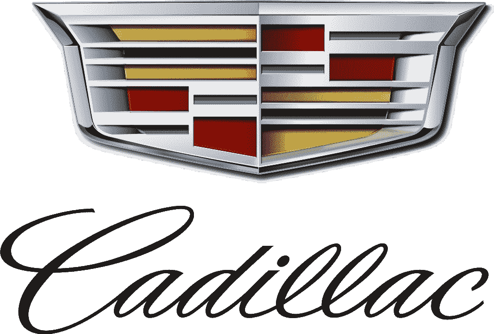
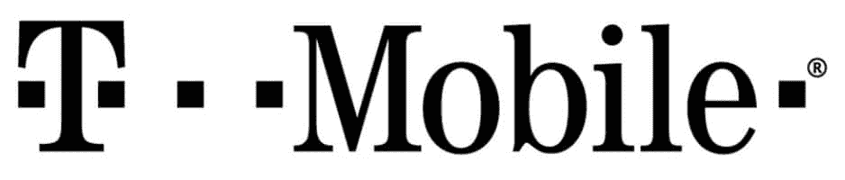
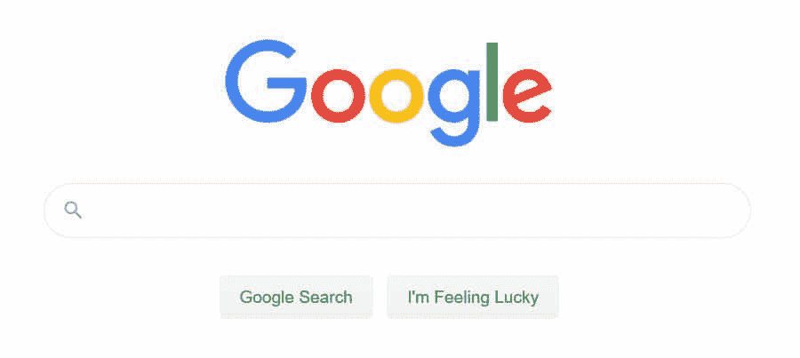
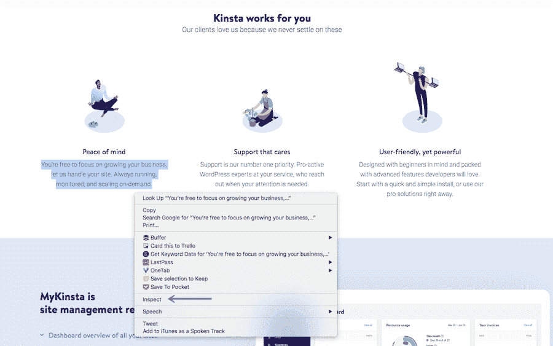
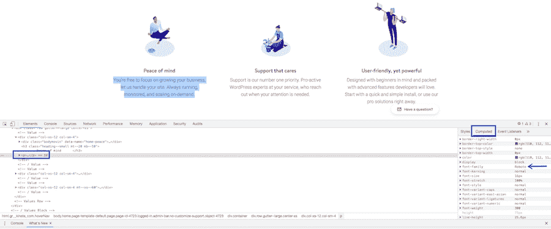
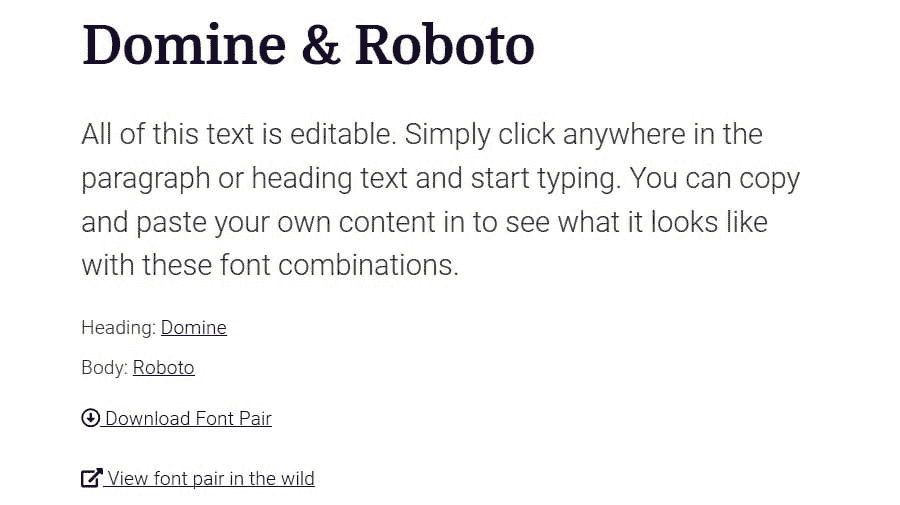
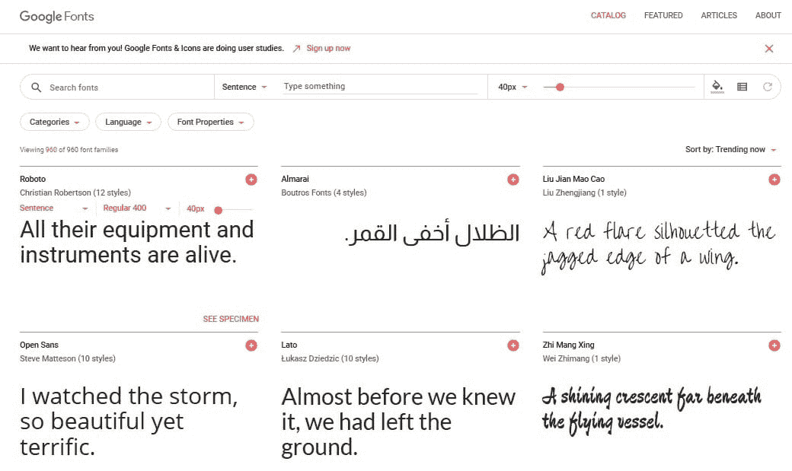
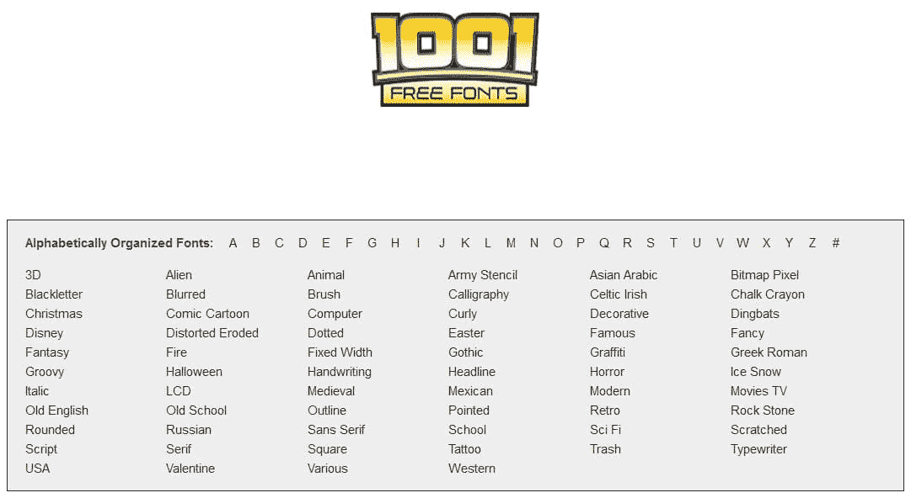
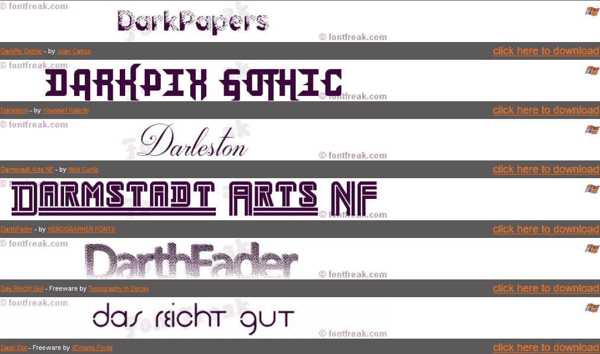
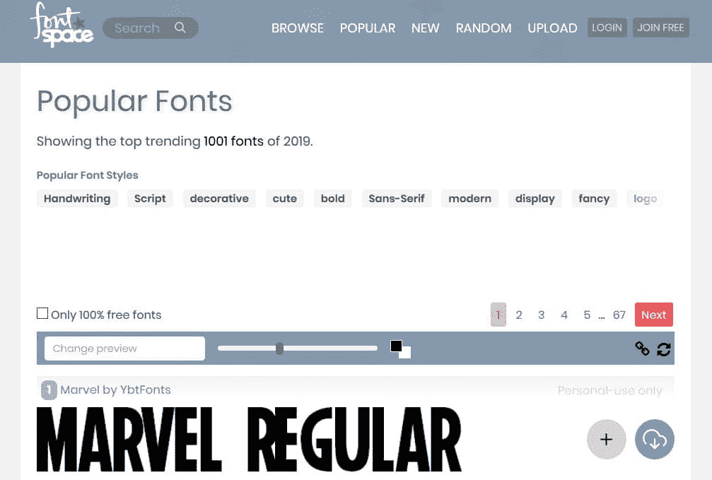

# WordPress 字体:2022 年你需要知道的一切

> 原文：<https://kinsta.com/blog/wordpress-fonts/>

WordPress 字体可能看起来是一个无关紧要的细节。毕竟，还有 [WordPress 主题](https://kinsta.com/blog/how-to-install-a-wordpress-theme/)、[配色方案](https://kinsta.com/blog/website-color-schemes/)、背景图片和博客布局要考虑。

> 谁有时间研究字体样式？T3】

虽然设计一个网站可能需要很长时间，但事实是，所有网站所有者都应该注意他们网站的文字所使用的 WordPress 字体。字体风格是一个重要的网页设计细节，会影响你的网站的可读性。

更不用说，使用正确的字体搭配可以帮助你在竞争中脱颖而出，[提高转化率](https://kinsta.com/blog/conversion-rate-optimization-tips/)，甚至增加品牌认知度。

但前提是你做得对。今天我们将深入探讨什么是 WordPress 字体，以及如何为你的 WordPress 网站找到最好的字体。

## 最常见的字体样式

你在你的 WordPress 网站上使用的 HTML 字体表明了你的品牌，不管你愿不愿意。甚至 WordPress 字体最微小的变化也会改变网站访问者对你公司的整体印象。

当然，解释 typeface 背后的历史和心理学需要它自己的博客文章。但是为了给你一个思路，这里有五种主要的字体风格:
:

> Kinsta 把我宠坏了，所以我现在要求每个供应商都提供这样的服务。我们还试图通过我们的 SaaS 工具支持达到这一水平。
> 
> <footer class="wp-block-kinsta-client-quote__footer">
> 
> 
> 
> <cite class="wp-block-kinsta-client-quote__cite">Suganthan Mohanadasan from @Suganthanmn</cite></footer>

[View plans](https://kinsta.com/plans/)

### 1.脚本

Script font example (Image source: [Cadillac](https://www.cadillac.com/))

楷书字体花哨弯曲，很像[草书字体](https://kinsta.com/blog/cursive-fonts/)。然而，它们分为两类:正式的和非正式的。

正式脚本是其中最奇特的。它们模仿了 17 和 18 世纪书法大师的优美作品。最值得注意的是，字体样式带有超出每个字符末尾的顶部花体或卷曲和华丽。

休闲字体看起来更像现代书法字体，比正式字体更易读，它们是常青树，意味着它们永远不会过时。它们最适合用在大字体的标志上，因为大量使用时很难阅读。

### 2.显示

Display font example (Image source: [Disney](https://www.disney.com/))

显示字体是创造性的，古怪的，有时看起来很时髦。它们散发着个性，用来立刻抓住人们的注意力。

它们在 19 世纪流行起来，经常出现在老式广告牌、海报和小册子上。你会注意到许多显示字体，如 Rockwell，都带有所谓的平板衬线。换句话说，延伸到角色末端之外的嗖嗖声是块状的和厚的。

这种风格最适合用在标题或主要公告上，因为它们没有最好的可读性，尤其是在网上。

### 3.现代的

Modern font example (Image source: [Vogue](https://www.vogue.com/))

现代字体风格非常结构化。他们看起来很专业，通常给人一种冷漠严肃的感觉。

许多现代字体都有细长的衬线，超出了每个字符的两端。

此外，[现代字体](https://kinsta.com/blog/modern-fonts/)在字母中没有倾斜，因为它们倾向于强调垂直位置。您还会注意到，许多字体样式在每个字母中都有不同的粗细，这在不破坏用户体验的情况下增加了一些样式。

现代字体最适合用于标题和其他大字号正文。

### 4.衬线

Serif font example (Image source: [T-Mobile](https://www.t-mobile.com/content/t-mobile/corporate/news/media-library/details/image.html/content/dam/t-mobile/corporate/media-library/public/pictures/logos/T-Mobile%20logo%20black%20on%20white.jpg?a=b))

衬线字体是最传统的一种。它们带有简单的标记，称为衬线，延伸到每个字符的末尾。这种做法可以追溯到罗马时代，当时带喇叭的手写信件很常见。

这种字体是我们列表中最保守的。它也是最值得信赖的字体样式之一。

你会看到常见的衬线字体，比如 [Times New Roman](https://kinsta.com/blog/local-fonts/#web-fonts) ，主要出现在印刷材料中。虽然有些人选择这种字体风格作为他们网站的正文，但不推荐使用，因为当有大量文本时，衬线很难阅读。然而，它对大标题和徽标很有用。

### 5.无衬线字体

Sans serif font example (Image source: [Google](https://www.google.com/))

无衬线字体在网上最常见。它们干净、现代，没有超出每个字符末端的衬线。事实上，缺少衬线是这种字体在网上看起来如此吸引眼球的原因。

这种字体风格在二三十年代开始流行，当时一切都变得浮华时尚。有些人甚至认为这种字体风格只应该在广告中使用，因为他们认为它不适合其他材料。

然而现在，像 Helvetica 这样的无衬线字体随处可见。

## 为什么 WordPress 字体选择很重要

完美的排版包含很多因素。例如，视觉层次、网格、对比度、行距、空白和大小都很重要。但是如果你没有从一开始就选择正确的字体风格，那么其他的事情都没有意义。

看看字体风格对你的 WordPress 网站的成功至关重要的一些最有说服力的原因:

*   在[你网站的网页设计](https://kinsta.com/blog/web-design-best-practices/)中扮演一个角色，关系到用户体验。
*   提高品牌知名度和认知度，同时给你一个展现个性的机会。
*   确保您的网站及其内容的可读性和[可用性。](https://kinsta.com/blog/website-usability-testing/)
*   在站点内容中建立[层次结构，尤其是博客文章。](https://kinsta.com/blog/google-sitelinks/#4-use-a-clear-website-structure-and-navigation)
*   强化网站访问者所寻求的一致性。
*   专业地展示你的品牌或业务。
*   轻松引导网站访问者浏览您的内容。

如你所见，字体风格不仅仅是好看。它会对你作为网站所有者的成功产生重大影响，并从整体上塑造他人对你品牌的看法。

## 如何为你的 WordPress 网站收集灵感

为你的 WordPress 网站选择合适的字体会让人不知所措，因为有太多的选择了。这就是为什么知道如何寻找灵感如此重要。

如果你发现一个网站正在使用你喜欢的字体，并想把它添加到你自己的网站上，有一个简单的小技巧可以帮你找到他们使用的字体。

## 注册订阅时事通讯

### 想知道我们是怎么让流量增长超过 1000%的吗？

加入 20，000 多名获得我们每周时事通讯和内部消息的人的行列吧！

[Subscribe Now](#newsletter)

你所要做的就是突出显示你喜欢的字体，然后右击它。然后选择 [**检查元素**](https://kinsta.com/blog/inspect-element/) 。

Selecting Inspect Element

接下来，在**计算的**部分，向下滚动找到字体系列和其他字体信息。

Selecting Font Family

如果你碰巧在一个你喜欢的网站上找到了一种很棒的字体，但是需要一点帮助来搭配一种互补的字体风格，请查看[字体对](https://fontpair.co/)。

Font Pair

这个免费的在线资源可以帮助你将完美的字体搭配在一起，让你的网站看起来天衣无缝。在这里，您可以查看字体对，下载字体对，甚至在野外看到字体对。这将会给你一个很好的想法，你感兴趣的字体配对是否适合你的网站。

## 为什么在 WordPress 中使用自定义字体

字体设计会对你的网站访问者产生强大的影响。每个网站所有者的目标是给所有网站访问者留下持久的印象。毕竟，这是你建立品牌认知度和[转化更多线索和销售](https://kinsta.com/blog/conversion-rate-optimization-tips/)的方式。

不相信这是真的？让研究为自己说话:

由两名研究人员进行的一项研究发现，当给出一组指令，一组是简单字体，另一组是复杂字体时，使用简单字体的一组人在 **8.2 分钟**内完成了任务。另一组用了 **15.1 分钟完成同样的任务**。换句话说，简单字体给人的印象是这项任务比复杂字体的任务要容易。

这些研究人员进行了另一项研究，他们给一组人一份简单字体的菜单，给另一组人一份花哨字体的菜单。研究人员发现，使用花式字体菜单的那组人认为，与使用简单字体菜单准备食物的厨师相比，厨师拥有更高级的技能。

另一个实验确定了人们更倾向于或更倾向于相信一个陈述是真实的，这取决于所使用的字体类型。

人们被告知“黄金的原子序数为 79”，字体如下:

*   巴斯卡比尔
*   漫画无
*   现代计算机
*   格鲁吉亚
*   Helvetica
*   投石机

最后，大多数人都同意了这句在巴斯克维尔写下的话。作为列表中最正式和最学术的字体风格，巴斯克维尔在说服人们一个真实的陈述确实是真实的方面做得最好。

厌倦了 WordPress 的问题和缓慢的主机？我们提供世界一流的支持，由 WordPress 专家提供 24/7 服务和超快的服务器。[查看我们的计划](https://kinsta.com/plans/?in-article-cta)

> 你会问，这一切意味着什么？

这意味着你对字体风格的选择可以决定[网站访问者是否会停留在](https://kinsta.com/blog/how-to-reduce-bounce-rate/)周围，看看你能提供什么。更重要的是，你网站的字体将有助于(*或伤害*)让人们相信你是一个值得与你做生意的[值得信赖的品牌](https://kinsta.com/clients/)。

因此，尽管选择一种定制的 WordPress 字体来让你在竞争中脱颖而出是很好的，但是如果你明白[字体的选择不仅仅是网页设计和视觉吸引力](https://kinsta.com/blog/how-to-change-font-in-wordpress/#finding-the-best-web-fonts-for-your-site)的话，那就更好了。
T3】

## 哪里可以找到自定义的 WordPress 字体

个人定制的 WordPress 字体曾经非常昂贵。所以，改变你的字体风格不是一件容易的事情，除非你有很多钱。

然而，现在高级字体更加实惠了。最重要的是，有[吨真正时尚的网络字体](https://kinsta.com/blog/how-to-change-font-in-wordpress/#webfonts)你可以在你的网站和营销材料上使用。

让我们来看看在哪里可以找到**最好的 WordPress 自定义字体**:

### 谷歌字体

Google Fonts

[谷歌字体](https://fonts.google.com/)是免费寻找和定制你自己的字体风格的最好地方！一旦上了网站，你可以在句子、段落或数字中测试你喜欢的字体，感受一下它在你的网站上会是什么样子。

另外，你可以改变像素大小，自定义字体为粗体，斜体，轻/中等，等等。，甚至在谷歌字体平台上改变颜色。然后，当你决定一种字体时，你所要做的就是通过复制一个简单的代码将它嵌入到你的网站中。这里是我们关于如何在 WordPress 中改变字体的[深度指南。](https://kinsta.com/blog/how-to-change-font-in-wordpress/)

### 1001 种免费字体

1001 Free Fonts

[1001 种免费字体](https://www.1001freefonts.com/)实际上拥有令人印象深刻的 10，000 种免费字体，这些字体按字母顺序分类，让寻找完美字体变得轻而易举。例如，你可以点击花式、书法、点状或笔刷类别来缩小搜索范围。

一旦你找到一种你喜欢的字体，你可以免费下载，或者向设计者捐赠，这样你就可以将这种字体用于商业用途。

### 字体怪胎

Font Freak

字体怪胎有超过 9000 种免费字体和数千种高级字体，所以找到一种适合你的 WordPress 网站的应该不成问题。400 多名设计师向字体怪胎提交他们的创意作品，因此总是有新鲜的新字体发布。

字体怪胎最棒的一点是它有 PC 和 Mac 两个版本。最后，你可以使用字体怪胎的字体编辑器和管理软件来构建和编辑你自己的字体。

### 字体空间

Fontspace 拥有超过 61，000 种免费字体，可用于所有项目。它们被组织成流行的类别或字体样式，因此找到您需要的确切字体类型是很容易的。

来自世界各地的设计师向 Fontspace 投稿，并将他们的作品标记为可供商业或个人使用。为了帮助您做出明智的决定，Fontspace 还包括字体评级和设计师及其作品的链接，因此您可以进一步缩小您对完美字体的搜索范围。

请记住，使用这些第三方字体服务是很棒的，但是在 WordPress 中托管本地字体也有一些[优势。当您在本地托管字体时，您将它们存储在自己的服务器上，而不是链接到外部资源。](https://kinsta.com/blog/local-fonts/)

这样做的一个最大好处是，你永远不必依赖第三方字体服务的服务器来保持正常运行。毕竟，如果他们的服务器宕机，你网站的字体很有可能会受到影响。

[The perfect fonts make your brand stand out, improve readability, and much more! Check out where you can find the best fonts for your #WordPress site! 🔠🖍Click to Tweet](https://twitter.com/intent/tweet?url=https%3A%2F%2Fkinsta.com%2Fblog%2Fwordpress-fonts%2F&via=kinsta&text=The+perfect+fonts+make+your+brand+stand+out%2C+improve+readability%2C+and+much+more%21+Check+out+where+you+can+find+the+best+fonts+for+your+%23WordPress+site%21+%F0%9F%94%A0%F0%9F%96%8D&hashtags=webdesign%2Cfonts)

## 摘要

不管你喜不喜欢，字体风格是你的 WordPress 网站设计的核心部分。你使用的字体会向网站访问者传达某种信息，并最终影响他们是否停留，阅读你的内容，甚至转换。

幸运的是，有很多地方可以为你的品牌找到完美的独一无二的字体。所以，出去找一个你喜欢的自定义字体，把它添加到你的 WordPress 网站上。

需要一个简单的方法给你的 WordPress 站点添加图标字体吗？查看这篇关于如何正确使用 WordPress 图标字体的详细文章，并开始为你的网站添加高分辨率的图标，这些图标易于缩放并且会受到网站访问者的喜爱。

* * *

让你所有的[应用程序](https://kinsta.com/application-hosting/)、[数据库](https://kinsta.com/database-hosting/)和 [WordPress 网站](https://kinsta.com/wordpress-hosting/)在线并在一个屋檐下。我们功能丰富的高性能云平台包括:

*   在 MyKinsta 仪表盘中轻松设置和管理
*   24/7 专家支持
*   最好的谷歌云平台硬件和网络，由 Kubernetes 提供最大的可扩展性
*   面向速度和安全性的企业级 Cloudflare 集成
*   全球受众覆盖全球多达 35 个数据中心和 275 多个 pop

在第一个月使用托管的[应用程序或托管](https://kinsta.com/application-hosting/)的[数据库，您可以享受 20 美元的优惠，亲自测试一下。探索我们的](https://kinsta.com/database-hosting/)[计划](https://kinsta.com/plans/)或[与销售人员交谈](https://kinsta.com/contact-us/)以找到最适合您的方式。