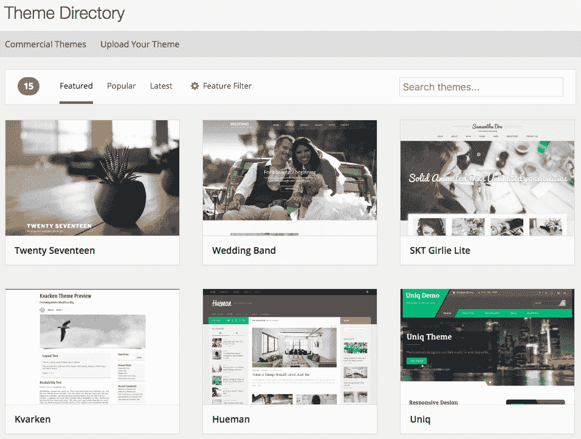
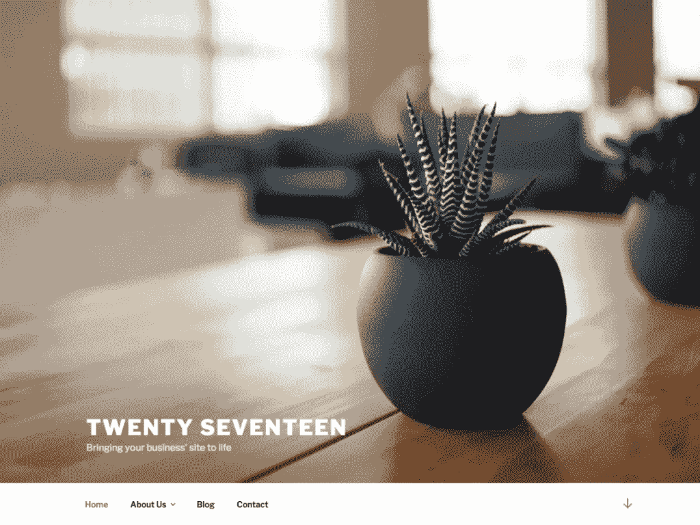
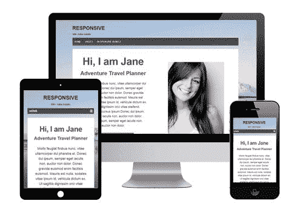
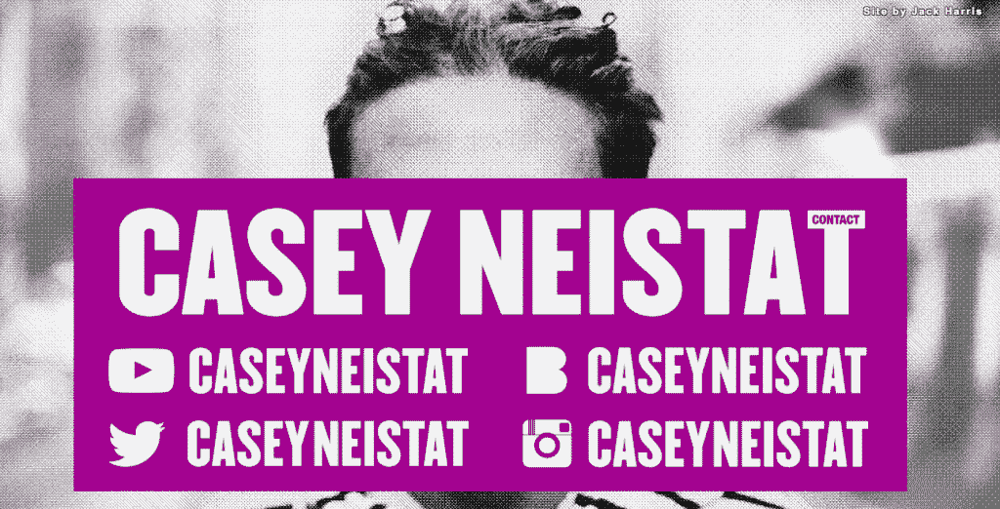
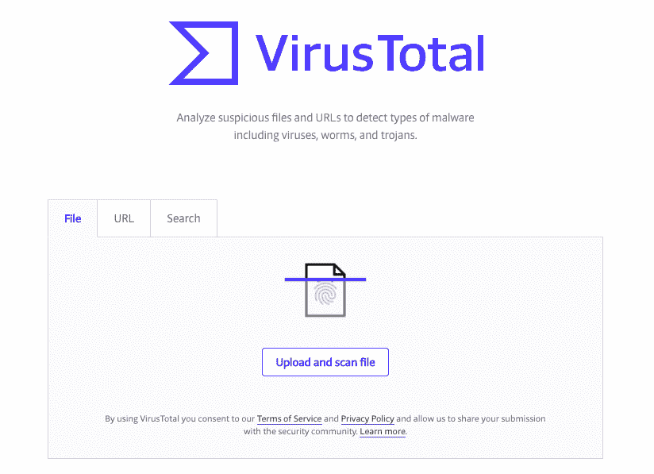
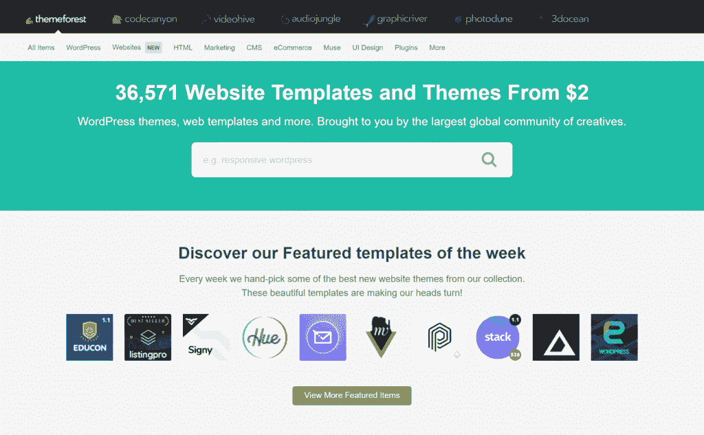

# 免费主题和付费主题:哪个适合你的下一个项目？

> 原文：<https://kinsta.com/blog/wordpress-free-vs-paid-themes/>

WordPress 社区的发展部分归功于对该平台惊人的可定制性的热爱。虽然高水平的可定制性通常被认为是积极的，但这并不意味着它不能成为压倒性的概念。对于那些刚刚接触 WordPress 的人来说，一个最紧迫的问题是使用免费主题和付费主题的区别。

事情是这样的:

对于许多刚刚开始使用 WordPress 的人来说，关于使用 WordPress 免费版还是付费版的思考过程(至少就主题而言)可能会围绕这样一个事实:如果有一个免费版可以完美运行，为什么有人会为一个付费版付费呢？这种心态符合一般的创业建议，即希望开设新博客或网站的人保持低成本，以免有借口妨碍启动。

当然，这个建议是有道理的，但是它不一定反映战略性的*长期*思维。投资高级 WordPress 主题有很多好处。当然，如果没有很多人愿意购买和使用它们，就不会有市场。

许多问题仍然存在:

*   你真的需要一个优质的主题来拥有一个漂亮的网站吗？
*   高级主题能保证你的网站运行得更快吗？
*   坚持一个免费主题的缺点是什么？
*   免费/高级 WordPress 主题？对于任何给定的项目，哪一个是正确的？

幸运的是，你会在下面找到所有这些问题的答案。在我们看一看免费和付费主题之间的主要区别之前，请记住，你可以使用我们的[主题检测工具](https://kinsta.com/tools/what-is-my-ip/wordpress-theme-detector/)来识别任何 WordPress 站点的主题——如果你遇到一个你喜欢的站点，并且想知道它使用了什么主题，这是非常有用的！
T3】

## 免费 WordPress 主题

很容易找到免费的 WordPress 主题——在你选择的[网络主机](https://kinsta.com/features/)上安装一个新的 WordPress 实例后，你可以在这里看看我们的[关于最佳 WordPress 主题的指南。通过从 WordPress 仪表盘导航到**外观>主题>添加新主题**，你会在](https://kinsta.com/best-wordpress-themes/) [WordPress 官方主题目录](http://wordpress.org/themes/)中找到选项(这里是我们关于[如何安装 WordPress 主题](https://kinsta.com/blog/how-to-install-a-wordpress-theme/)的指南)。

> Kinsta 把我宠坏了，所以我现在要求每个供应商都提供这样的服务。我们还试图通过我们的 SaaS 工具支持达到这一水平。
> 
> <footer class="wp-block-kinsta-client-quote__footer">
> 
> 
> 
> <cite class="wp-block-kinsta-client-quote__cite">Suganthan Mohanadasan from @Suganthanmn</cite></footer>

[View plans](https://kinsta.com/plans/)

请注意，这当然不是唯一一个找到免费 WordPress 主题的地方——互联网上还有成千上万的其他免费主题可供选择(稍后会有更多)。

WordPress.org theme directory

也就是说，从 WordPress 主题目录中选择主题的真正好处是它们是**官方批准的**，意味着任何提交到官方主题目录的主题都是经过严格审核的。

主题审查过程从一个自动化的 WordPress 插件开始，该插件根据 WordPress 严格的[编码标准](https://kinsta.com/blog/web-design-best-practices/#coding-standards)审查主题。如果被批准，提交的主题将由 WordPress 主题开发者手动审核。只有在这两个步骤成功通过之后，一个主题才可以在官方主题目录上对公众开放。

## 免费主题:使用的好处

为什么有人会选择使用免费的 WordPress 主题？原因很多:

*   免费对新网站所有者来说是一件好事，对那些不断尝试的 T4 人来说是理想的选择。WordPress premium 主题需要付费，而且很多都不便宜！事实上，根据 CodeinWP 的数据，一个高级主题的平均价格是 57.54 美元。一些主题卖家不接受退货，所以如果你不喜欢你买的主题，或者它与你的[必备插件](https://kinsta.com/blog/wordpress-social-media-plugins/)不兼容，你可能会被一些你不能使用的东西卡住。
*   至少对于官方主题目录上列出的选项来说，免费主题是通过 WordPress 上的多步流程**官方批准**的。
*   免费主题倾向于极简设计，因为它们没有很多高级功能和插件。如果你的网站没有使用很多插件，这可能会让你的网站**(这会提高你的技术搜索引擎优化)。**
***   免费主题通常是为初学者设计的，因此简单易用。在批准一个主题之前，WordPress 开发者确保主题库中的主题可以被初学者作为他们测试过程的一部分使用。这些免费主题通常与大多数 WordPress 插件兼容。*   除了官方 WordPress 主题目录，我们推荐我们策划的[高质量免费 WordPress 主题列表](https://kinsta.com/best-wordpress-themes/)。**

 **

Twenty Seventeen theme

二十个二十个 *是直接由 WordPress 开发者提供的一系列免费主题中的最新一个。看看这个[开发者对 2020 主题](https://kinsta.com/blog/twenty-twenty-theme/)的介绍。*

 T2】

## 免费主题:缺点

因为没有免费的午餐，所以当使用免费的 WordPress 主题时，有一些阻碍需要考虑:

*   一个免费的主题有**有限的功能**并且没有额外的功能，这是许多更大更专业的网站所需要的。
*   一些免费的主题有超过 100 万的下载量！与高级主题**相比，免费主题**并不独特**。由于任何人都可以下载它们，没有付费的障碍，许多类似类型的网站将使用相同的主题。由于免费主题的定制选项没有高级主题多，所以差异可以忽略不计，用户可能会开始注意到这些主题的重复特征(建议阅读:[如何定制你的 WordPress 主题](https://kinsta.com/blog/how-to-customize-wordpress-theme/))。**
*   WordPress 知识库网站上相当一部分主题**很少更新，**这可能会使它们与 [WordPress CMS](https://kinsta.com/blog/why-use-wordpress/) 的频繁版本更新不兼容。
*   如果有问题，免费主题不提供支持。免费主题的贡献者如此之多，以至于 WordPress 无法追踪主题作者或开发者是谁。你必须依靠第三方的帮助( [WordPress 论坛](https://wordpress.org/support/)、脸书集团、LinkedIn 集团、付费给一个网络开发者)，如果你不付费给别人帮助你，也不能保证你会得到快速回复(或任何回复)。
*   官方主题仓库中找不到的免费主题可能编码糟糕，这也可能使你的网站容易受到安全问题的影响。
*   给聪明人一句话:**不是所有的免费主题都是平等的**(有不同的 WordPress 许可证)，所以当你下载一个主题时，最好知道你可以合法地用它做什么。

free WordPress theme

[*CyberChimps*](https://cyberchimps.com/responsive-theme/) *是一个商业主题，下载量超过 100 万次，活跃安装次数超过 80，000 次。*

### 为什么公司创建免费的 WordPress 主题

WordPress 主题当然不好做，那为什么还有人免费提供呢？

一种情况可能是免费主题是针对个人或公司的**作品[作品集](https://kinsta.com/blog/wordpress-portfolio-plugins/)** 。其他人创建免费的主题来提高他们的技能和改善他们使用 WordPress 平台的体验。

其他人创建免费的 WordPress 主题来宣传他们的名字，做广告，或者增加品牌曝光度。免费主题在页脚中使用链接，将主题的实例连接到原始开发者的网站。每个下载并使用这个主题的人都向他们的观众展示了这个链接，为开发者的网站带来了更多的流量(并为 SEO 创建了[反向链接)。](https://backlinko.com/17-untapped-backlink-sources)

Sharing fame

虽然技术上不在页脚(常见的网页设计启发法)中，但开发者杰克·哈里斯通过在 Youtuber 和他自己之间建立联系，分享了凯斯·奈斯塔特的部分名气。

## 注册订阅时事通讯

### 想知道我们是怎么让流量增长超过 1000%的吗？

加入 20，000 多名获得我们每周时事通讯和内部消息的人的行列吧！

[Subscribe Now](#newsletter)

人们免费开发 WordPress 主题的另一个原因是**追加销售**的可能性。WordPress 主题免费增值模式包括开发者提供一个免费的主题，用户可以试用，但是提供的功能有限，因此需要更多的人必须购买相同主题的高级版本。这实际上是一个很好的无风险销售主题高级版本的方式，因为它为用户提供了在完全承诺购买之前进行测试的能力。

尽管你永远不愿意相信人们最坏的一面，但人们开发免费主题的另一个原因是，他们可以利用它们作为一个机会，将他们的**恶意代码**放到其他人的网站上。

## 如何找到你完美的高功能免费 WordPress 主题

在一个免费主题进入 WordPress 知识库之前，它已经被全面的检查了一些问题，即:

*   易接近
*   密码
*   核心功能和特性
*   演示和功能
*   证明文件
*   语言
*   批准
*   命名
*   选项和设置
*   插件
*   截屏
*   隐私
*   销售、积分和链接
*   样式表和脚本
*   模板

对于你在 WordPress 知识库之外找到的免费主题，比你仅仅购买一个高级主题有更大的恶意代码风险。以下是一些检查你的免费主题是否好得不真实的方法:

*   进行谷歌搜索。键入网站或主题名称的查询，看看网上是否有关于它的负面推特。
*   扫描主题文件中的病毒。 [VirusTotal](https://www.virustotal.com/) 是一款免费的在线工具，你可以免费使用。
*   如果你有耐心和时间，你可以手动浏览主题文件。在一个主题上发现垃圾反向链接最常见的位置是 **css** 和**footer.php**文件。
*   **检查主题真实性。你可以使用几个 WordPress 插件来做到这一点，比如[主题真实性检查器](https://wordpress.org/plugins/tac/)、[漏洞扫描器](https://wordpress.org/plugins/exploit-scanner/)和[主题检查器](https://wordpress.org/plugins/theme-check/)。**
*   如果你已经将主题上传到你的 WordPress 网站，使用**谷歌安全浏览**对网站进行全面扫描。在这个网址的末尾加上你的域名:【http://www.google.com/safebrowsing/diagnostic?site=[或者使用](http://www.google.com/safebrowsing/diagnostic?site=) [**Sucuri**](https://sucuri.net/) ，这是一家提供免费网站扫描的安全公司。

VirusTotal

VirusTool 只是你用来扫描免费 WordPress 主题的一个工具。

## 什么时候使用免费的 WordPress 主题和高级的 WordPress 主题

主题选择不仅仅是挑选一个“看起来不错”的选项；这也是关于选择一些**对你的内容和网站目标**有效的东西。

Struggling with downtime and WordPress problems? Kinsta is the hosting solution designed to save you time! [Check out our features](https://kinsta.com/features/)

简而言之，如果你:

*   想开一个个人博客
*   不要在意你的网站看起来是否和大多数网站一样
*   只追求基本的功能
*   几乎不需要支持就可以完成(如果您主要将它用于简单的博客功能，这是理想的选择)

或者，使用**高级 WordPress 主题**，如果你:

*   你打算将 WordPress 用于一个商业网站(或者正在考虑扩展你的 WordPress 网站，以包括将来的电子商务等复杂功能)
*   想让你的网站看起来独一无二
*   希望你的网站能够支持许多不同的功能
*   不知道如何解决问题，需要专门的支持团队

许多高级主题和插件都可以在网上免费获得。但是我们强烈建议你不要使用这些来源的产品。以下是最主要的原因:[为什么你应该停止使用被清空的 WordPress 插件和主题](https://kinsta.com/blog/nulled-wordpress-plugins-themes/)

为了帮助你更容易做出决定，你必须首先定义你的网站是关于什么的。如果你正在寻找特定的功能，比如[摄影网站](https://kinsta.com/blog/photography-website/)、[美食博客](https://kinsta.com/blog/how-to-start-a-food-blog/)或[电子商务网站](https://kinsta.com/blog/ecommerce-strategies/)，你需要选择一个 WordPress 主题来为这次购买服务。要知道，你的网站在预期功能方面越先进，运行和管理[就越复杂。使用一个免费的 WordPress 主题会让这个很难做好。](https://kinsta.com/blog/hire-wordpress-developer/)

## 高级 WordPress 主题会给你带来什么

正如[高级主机](https://kinsta.com/plans/)一样，你应该从你的商业投资的角度考虑高级 WordPress 主题。毕竟，高级主题有高级价格是有原因的——它们也提供高级功能！

想象一个优质的 WordPress 主题，比如一个好的男朋友/女朋友/伴侣。

当你找到完美的选项时，你不仅可以访问一个功能齐全的主题——你还可以获得**支持**、**频繁更新、更多自由**(就定制选项而言)**、**和**安全**(更少的病毒和第三方威胁)。最棒的是，一个优质的 WordPress 主题比一个免费的 WordPress 主题更加独特。

这里有一些在高级 WordPress 主题中寻找的定义元素:

*   **符合标准**:最新版本的 WordPress、 [PHP](https://kinsta.com/blog/php-versions/) 、CSS 和 HTML
*   响应迅速的:一个响应迅速的 WordPress 网站正变得越来越必要，因为谷歌把移动响应作为一个重要的[排名因素](https://webmasters.googleblog.com/2015/04/rolling-out-mobile-friendly-update.html)
*   **兼容不同的浏览器**
*   **可定制**
*   **与其他插件配合良好**

你想知道最畅销的主题是什么吗？看看 WPNewsify 的这篇[详细帖子，他们向 28 家领先公司询问了最受欢迎的主题。](https://wpnewsify.com/blog/best-selling-wordpress-theme-2017)

## 顶级主题的 18 个最佳来源

不知道从哪里开始寻找完美的 WordPress 主题？以下[主题提供商](https://kinsta.com/blog/themeforest-pros-cons/)都是 Kinsta 认可的:

*   [神话之父](https://mythemeshop.com/)
*   [网络芯片主题](https://cyberchimps.com/product-category/themes/)
*   [优雅的主题](https://www.elegantthemes.com/)
*   [MH 主题](https://arrayinternet.com/wordpress/)
*   [Artbees 主题](https://themes.artbees.net/pages/)
*   [千变万化主题](https://www.proteusthemes.com/)
*   [原型设计](https://prothemedesign.com/)
*   [主题森林市场](https://themeforest.net/category/wordpress)
*   [像素等级](https://pixelgrade.com/)
*   [WPZOOM](https://www.wpzoom.com/)
*   [小岛](https://themeisle.com/)
*   [访问新闻主题](https://accesspressthemes.com/)
*   [子午线主题](https://meridianthemes.net/)
*   [大男子主义主题](https://www.machothemes.com/wordpress-themes/)
*   [预编码](https://premiumcoding.com/premiumcoding-wordpress-themes/)
*   [原始设计](https://www.anarieldesign.com/)
*   [TemplateMonster](https://www.templatemonster.com/wordpress-themes.php)
*   [SKT 主题](https://www.sktthemes.org/themes/)

Themeforest

## 免费主题和付费主题

免费或付费的 WordPress 主题各有利弊，但是选择安装哪一个最终取决于你网站的需求以及网站所有者的预算和审美偏好。要知道，从一个免费的 WordPress 主题开始，并在需要的时候升级是完全可以的。这是你的世界，我们只是生活在其中。

关于 WordPress 免费 vs 付费主题你还有什么疑问？发推文 [@Kinsta](https://twitter.com/kinsta) ，我们帮你做决定！

* * *

让你所有的[应用程序](https://kinsta.com/application-hosting/)、[数据库](https://kinsta.com/database-hosting/)和 [WordPress 网站](https://kinsta.com/wordpress-hosting/)在线并在一个屋檐下。我们功能丰富的高性能云平台包括:

*   在 MyKinsta 仪表盘中轻松设置和管理
*   24/7 专家支持
*   最好的谷歌云平台硬件和网络，由 Kubernetes 提供最大的可扩展性
*   面向速度和安全性的企业级 Cloudflare 集成
*   全球受众覆盖全球多达 35 个数据中心和 275 多个 pop

在第一个月使用托管的[应用程序或托管](https://kinsta.com/application-hosting/)的[数据库，您可以享受 20 美元的优惠，亲自测试一下。探索我们的](https://kinsta.com/database-hosting/)[计划](https://kinsta.com/plans/)或[与销售人员交谈](https://kinsta.com/contact-us/)以找到最适合您的方式。**