# WordPress Hooks Bootcamp:如何使用动作、过滤器和自定义钩子

> 原文：<https://kinsta.com/blog/wordpress-hooks/>

WordPress 钩子是 WordPress 开发者的军火库中最重要的工具之一。它们是 WordPress 插件和主题开发的基础。你可以使用 WordPress 的许多内置钩子，用你的自定义代码‘钩入’WordPress 核心，并由**做**或**修改**什么的。

WordPress 钩子有两种类型:**动作**和**过滤器**。钩子如此普遍，以至于 WordPress Core 本身也广泛使用它们。WordPress 还提供了一种定义你自己的**定制钩子**的方法，这样其他开发者就可以钩入你的代码。

学习如何操作、过滤和定制挂钩是掌握 WordPress 开发的关键。

本文的前半部分涵盖了 WordPress 钩子的基础知识，并解释了它们如何与多个例子一起工作。在第二部分，你将学习如何使用钩子来定制 WordPress，创建你自己的定制钩子，并使用它们来构建你自己的可扩展插件。

听起来很刺激？让我们开始吧！

## 什么是 WordPress 挂钩？

一个 [WordPress 页面](https://kinsta.com/knowledgebase/duplicate-page-post-wordpress/)由大量函数和数据库查询组装而成。WordPress 核心、插件和主题一起输出页面元素，如文本、[图片、](https://kinsta.com/blog/jpg-vs-jpeg/)，脚本和样式。一旦完全组装好，浏览器就会将它们放在一起并呈现页面。

WordPress 钩子允许你在某些点“挂钩”这个构建过程，并运行你的定制代码。钩子的主要功能是允许你在不接触[核心文件](https://kinsta.com/knowledgebase/wordpress-core/#what-is-wordpress-core)的情况下修改或者添加 WordPress 的特性。


> Kinsta 把我宠坏了，所以我现在要求每个供应商都提供这样的服务。我们还试图通过我们的 SaaS 工具支持达到这一水平。
> 
> <footer class="wp-block-kinsta-client-quote__footer">
> 
> 
> 
> <cite class="wp-block-kinsta-client-quote__cite">Suganthan Mohanadasan from @Suganthanmn</cite></footer>

[View plans](https://kinsta.com/plans/)

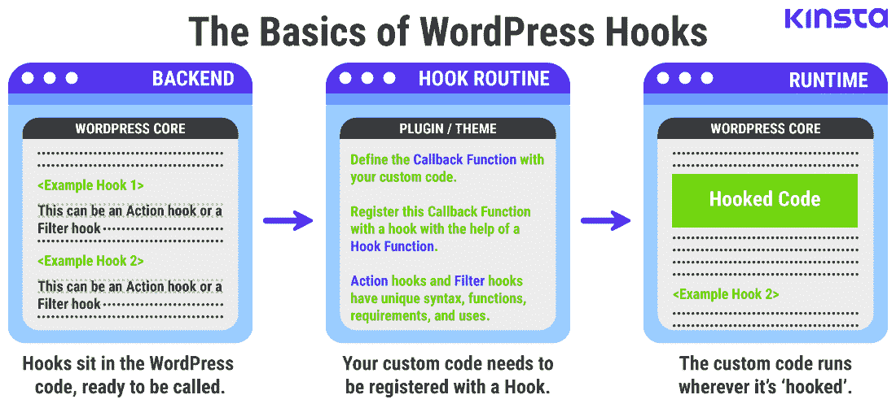

Hooks will help you extend WordPress with your own code


WordPress 插件 API 增强了 WordPress 钩子的功能。在 WordPress 运行时的特定情况下，你可以通过调用某些叫做**钩子函数**的 WordPress 函数来使用钩子。

使用钩子函数，你可以将你的定制代码捆绑在一个回调函数中，并用任何钩子注册它。一旦注册，这个回调将在钩子所在的地方运行，允许你增加或替换默认的 WordPress 特性。

钩子在代码执行过程中的位置是一个重要的因素。在接下来的章节中，您将了解到更多关于它的重要性。

### 两种类型的 WordPress 钩子:动作和过滤器

WordPress 包括两种类型的钩子，叫做**动作**和**过滤器**。动作让你**在 WordPress 运行时的某些预定义点做**一些事情，而过滤器让你**修改**WordPress 处理的任何数据并`**return**`它。

在 WordPress 代码中动作被定义为:

```
do_action( 'action_name', [optional_arguments] );
```

**`action_name`** 字符串是动作的名称。您可以指定 **`[optional_arguments]`** 变量来将附加参数传递给回调函数。如果未指定该字段，则其默认值将为空。

**举例:****`do_action( 'wp_head' )`**动作可以在每次 WordPress 处理[站点标题](https://kinsta.com/knowledgebase/add-code-wordpress-header-footer/)时被挂接运行自定义代码。此操作没有任何其他参数。

过滤器在 WordPress 代码中被定义为:

```
apply_filters( 'filter_name', 'value_to_be_filtered', [optional_arguments] );
```

`**filter_name**`字符串是过滤器的名称，`**value_to_be_filtered**`变量是需要过滤并返回的值，`**[optional_arguments]**`变量可以传递额外的参数，就像操作一样。

**示例:**`**apply_filters( 'admin_footer_text' , string $text )**`过滤器可以用来修改管理页脚中显示的文本。从 WordPress 5.4 开始，它的默认值将在管理区页脚显示句子`*Thank you for creating with* [*WordPress*](https://wordpress.org)*.*`。

稍后，你将从 WordPress 核心的许多例子中学习如何挂钩到动作和过滤器。

一旦上钩，你就可以指导你的代码去**做**或者**定制**你网站上的东西。例如，你可以使用钩子在发布一篇文章后发送一封[自动电子邮件](https://kinsta.com/blog/email-marketing-best-practices/#email-marketing-platform)，或者加载[定制样式表](https://kinsta.com/blog/wordpress-child-theme/#the-files-in-a-wordpress-child-theme)来改变你的站点的外观。

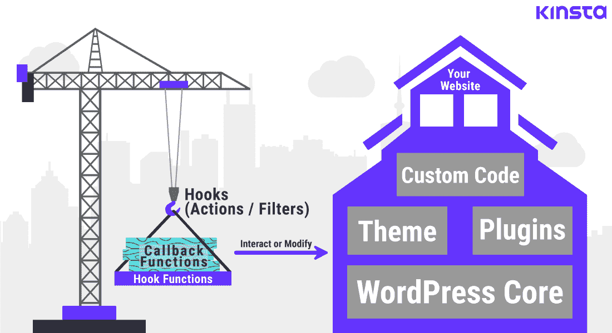

WordPress hooks help you interact with or modify your website


理解 hooks 最简单的方法就是把你的 [WordPress 网站](https://kinsta.com/blog/wordpress-site-examples/)想象成一栋房子。

吊钩类似于使用起重机来来回回地移动建筑项目。被传输的项目是**回调函数**，其中包含您的[自定义代码](https://kinsta.com/knowledgebase/edit-wordpress-code/)。这些项目(或功能)可以帮助你建造或修改房子。

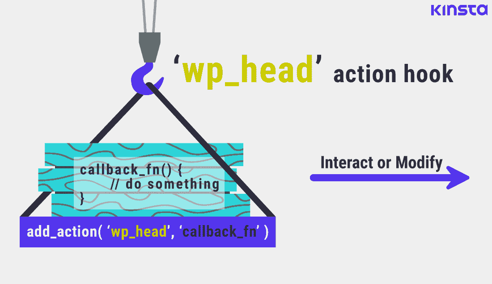

Example of hooking into the ‘wp_head’ action in WordPress


回调函数可以是常规的 PHP 函数，默认的 WordPress 函数，或者你定义的自定义函数。

我们只能将某些物品放在与特定挂钩相连的特定托架上。因此，动作只能与**动作功能挂钩。**同样，滤镜只能与**滤镜功能**挂钩。

虽然更换起重机上的吊钩和托架很繁琐，但 WordPress 通过包含超过 2200 种默认吊钩的[使其变得超级简单。](https://adambrown.info/p/wp_hooks)

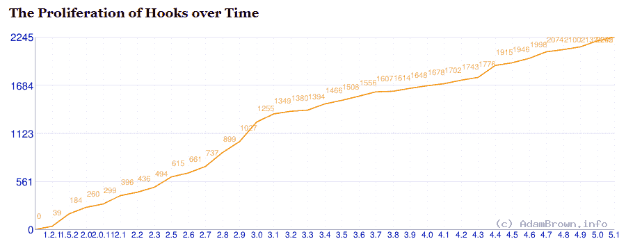

WordPress 5.1 has 2200+ native hooks (Source: Adam Brown)


你可以找到遍布 WordPress 核心的钩子，允许你进入你想要挂钩的确切位置并运行你的定制代码。

WordPress 钩子允许你“钩入”页面构建过程...让你对自己创造的东西有更多的控制权。⚡️ 点击推文


## 钩子 vs 动作 vs 过滤器

根据 [WordPress 插件手册](https://developer.wordpress.org/plugins/hooks/):

> 挂钩是一段代码与另一段代码交互/修改的一种方式……挂钩有两种类型:动作和过滤器。

关于如何使用术语**挂钩**、**动作**和**过滤器**，存在广泛的不一致。一些教程和指南将它们与相关联的功能混在一起。这种混乱存在的一个主要原因是钩子工作方式的复杂性。

甚至当你仔细观察 WordPress 核心内部时，你会发现添加动作和过滤器并没有太大的区别。下面是来自`**wp-includes/plugin.php**`文件的 add_action()函数的[源代码:](https://core.trac.wordpress.org/browser/tags/5.4/src/wp-includes/plugin.php#L403)

```
function add_action( $tag, $function_to_add, $priority = 10, $accepted_args = 1 ) {      
    return add_filter( $tag, $function_to_add, $priority, $accepted_args );
}
```

`**add_action()**`函数只是调用`**add_filter()**`函数并返回它的值。为什么？因为除了一点不同，它们的工作方式基本相同。

`**apply_filters()**`函数返回一个可以改变现有数据类型的值，而`**do_action()**` 函数不返回任何东西(PHP 中的 [NULL 值](https://www.php.net/manual/en/functions.returning-values.php))。

如果你仍然困惑，不要烦恼！一旦你读完了本文的前半部分，一切就都清楚了。我们将坚持官方的 WordPress Codex 术语，因为它清晰、精确、通用。

现在，请熟悉下面显示的钩子子程。

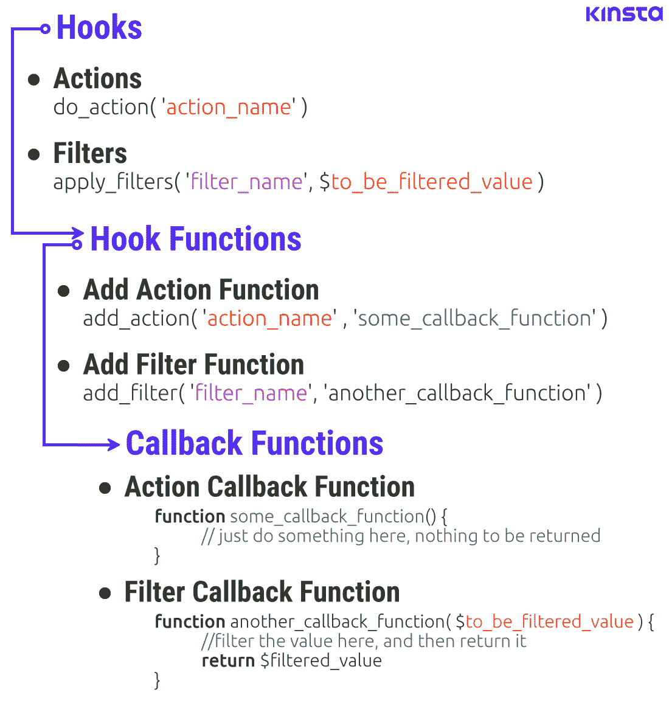

The Hook Routine: Hooks, Hook Functions and Callback Functions


我们来分解一下动作和钩子的区别。

| **WordPress 钩子** |
| **动作** | **过滤器** |
| 动作用于在 WordPress 核心执行期间的特定点运行自定义功能。 | 过滤器用于修改或自定义其他功能使用的数据。 |
| WordPress 代码中的函数`**do_action( ‘action_name’ )**`定义/创建动作。 | 过滤器由 WordPress 代码中的函数`**apply_filters( ‘filter_name’, ‘value_to_be_filtered’ )**`定义/创建。 |
| 动作也被称为**动作钩子**。 | 滤镜也叫**滤镜挂钩**。 |
| 动作只能与动作函数挂钩。如`**add_action()**`、`**remove_action()**`。 | 过滤器只能与过滤器功能挂钩。如`**add_filter()**`、`**remove_filter()**`。 |
| 动作函数不需要向它们的回调函数传递任何参数。 | 过滤函数需要至少传递一个参数给它们的回调函数。 |
| 动作功能可以执行任何类型的任务，包括改变 WordPress 的工作方式。 | 过滤函数的存在只是为了修改过滤器传递给它们的数据。 |
| 动作功能应该`**return**`什么都没有。然而，他们可以`**echo**`输出或者与数据库交互。 | 过滤函数必须将它们的变化作为输出。即使一个过滤函数什么都不改变，它仍然必须`**return**`未修改的输入。 |
| 动作可以执行几乎任何东西，只要代码是有效的。 | 过滤器应该以隔离的方式工作，这样它们就不会有任何意想不到的副作用。 |
| **总结:**一个动作中断常规的代码执行过程，用它接收到的信息做一些事情，但是没有返回任何东西，然后退出。 | **总结:**一个过滤器修改它接收到的信息，返回给调用钩子函数，其他函数可以使用它返回的值。 |

有时，您可以使用操作或过滤器来实现相同的目标。例如，如果你想修改一篇文章中的文本，你可以用 [publish_post](https://codex.wordpress.org/Plugin_API/Action_Reference/publish_post) 动作注册一个回调函数，并在文章保存到[数据库](https://kinsta.com/knowledgebase/wordpress-database/)时修改文章内容。

```
// define the callback function to change the text
function change_text_callback() { 
    // add the code to change text here
}

// hook in to the 'publish_post' action with the add_action() function
add_action( 'publish_post', 'change_text_callback' );
```

或者，您可以注册另一个回调函数，使用 _content 过滤器在文章内容显示在浏览器之前对其进行修改。

```
// define the callback function to modify the text
function change_text_another_callback( $content ) { 
    // add the code to change text here and then return it 
    return $filtered_content;
}

// hook in to 'the_content' filter with the add_filter() function
add_filter( 'the_content', 'change_text_another_callback');
```

结果相同的两种不同方法。知道何时使用其中一个是成为一个好的 WordPress 开发者的关键。

## WordPress 钩子是如何工作的？

house 的例子很简单，足以理解钩子的基本功能，但是它没有抓住它们如何工作的复杂性。最重要的是钩子位置和特异性的概念。

一个更好的例子是把处理一个 WordPress 网页想象成组装一辆汽车。不像制造汽车需要时间，组装一个网页几乎是瞬间完成的。

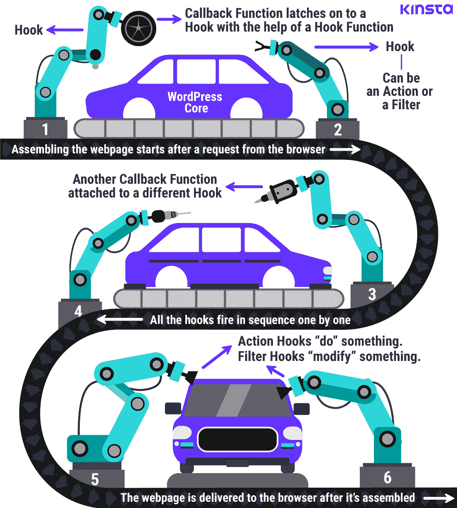

Assembling a webpage is like assembling a car


就像一辆汽车在现代装配线上被一个零件一个零件地组装起来一样，WordPress 网页是由服务器和客户端一个零件一个零件地组装起来的。

WordPress 核心就像汽车引擎、底盘和其他必需品，为网站的“核心”功能提供动力。

你可以拥有一个只有 WordPress 核心的功能性网站，但是这有什么意思呢？你需要给网站添加令人兴奋的功能。这就是 [WordPress 插件](https://kinsta.com/best-wordpress-plugins/)和[主题](https://kinsta.com/best-wordpress-themes/)介入的地方，它们都广泛使用了钩子。

在上面的例子中，每个编号的站点就像 WordPress 核心里面的一个钩子。有两种站，像动作和过滤器。每个工作站包括一个特定类型的插槽，只接受某些工具，类似于动作功能和过滤功能。

为了模块性和效率，所有的站以频繁的间隔放置。

根据特定位置的要求，我们可以为该特定位置的工作附加(或挂钩)最合适的工具。这些工具就像用来与 WordPress 交互或修改它的回调函数。

一些工具可以显著改变汽车的工作，就像注册到动作的回调一样。其他工具仅用于定制汽车的外观，如注册到过滤器的回调。

在正确的工位使用正确的工具对于制造顶级汽车至关重要。同样，钩子帮助我们根据自己的独特需求定制 WordPress。

如果你扩展这个类比，插件就像是增加了一些有用的汽车功能，如安全气囊、娱乐控制台、遥控无钥匙系统等(就像这些来增强 WooCommerce 的功能一样)。主题类似于定制汽车的视觉部分，如整体设计、油漆工作、轮圈等。(以下是如何[定制你的 WordPress 主题](https://kinsta.com/blog/how-to-customize-wordpress-theme/))。


## 在哪里注册钩子及其功能？

在 WordPress 中添加钩子有两种推荐的方法:

*   **插件:**制作你自己的插件，并在其中添加你所有的自定义代码。
*   **子主题:**在你的[子主题的 **`functions.php`** 文件](https://kinsta.com/blog/wordpress-child-theme/)中注册钩子和回调函数。

对于本教程，让我们从创建一个插件开始。为此，在您的`**/wp-content/plugins/**`目录中创建一个新文件夹。

我将我的插件命名为`**salhooks**`，但是你可以随意命名。根据 WordPress 指南，您需要在您的插件目录中创建一个同名的 PHP 文件(`**salhooks.php**`)。

将以下标题字段添加到你的插件文件中，并注册到 WordPress。你可以在 WordPress Codex 中了解更多关于[插件头要求](https://developer.wordpress.org/plugins/plugin-basics/header-requirements/)的信息。

```
<?php

/*
Plugin Name:  Salhooks
Version    :  1.0
Description:  Demonstrating WordPress Hooks (Actions and Filters) with multiple examples.
Author     :  Salman Ravoof
Author URI :  https://www.salmanravoof.com/
License    :  GPLv2 or later
License URI:  https://www.gnu.org/licenses/gpl-2.0.html
Text Domain:  salhooks
*/

//=================================================
// Security: Abort if this file is called directly
//=================================================
if ( !defined('ABSPATH') ) { 
    die;
}
```

保存这个文件，然后在你的 [WordPress 仪表盘](https://kinsta.com/knowledgebase/wordpress-admin/)中激活插件。我将在[本地 WordPress 安装](https://kinsta.com/blog/install-wordpress-locally/)中使用这个插件来演示钩子是如何工作的。

顺便提一下，你也可以直接编辑 WordPress 核心文件来注册钩子。然而，不建议这样做，因为每次[更新 WordPress](https://kinsta.com/blog/wordpress-automatic-updates/) 时，你所有的自定义代码都会被覆盖。出于同样的原因，你不应该在你的父主题中添加钩子。

## 使用 WordPress 挂钩

WordPress 钩子本身什么都不做。它只是呆在代码中，等待一些钩子函数来激活它。要使用钩子，你需要调用至少两个其他函数。

首先，需要用钩子函数注册钩子，并在其中引用回调函数。然后你需要定义之前在钩子函数中提到的回调函数。每当钩子被触发时，WordPress 都会运行这个回调函数。

定义这些函数的顺序并不重要，但是最好将它们放在一起。

动作和过滤器有不同的钩子函数。从现在开始，让我们称它们为**动作函数**和**过滤函数**。正如您将看到的，它们有自己的语法和参数要求。

### 挂钩行动

在 WordPress 核心、插件或主题的执行过程中，动作提供了一种在特定点运行自定义代码的方式。

#### add_action()动作函数

您可以通过以下步骤用操作注册回调函数:

1.  用自定义代码定义一个回调函数。这个回调函数将在它注册的任何动作在 WordPress 代码执行期间被触发时运行。
2.  用`**add_action()**`函数将你的回调函数与你想要的动作挂钩。根据 WordPress Codex， [add_action()](https://developer.wordpress.org/reference/functions/add_action/) 函数需要传递至少两个参数:
3.  `**add_action()**`函数还接受两个可选参数来设置`**priority**`和`**number of arguments**`。我们稍后将讨论这两个问题。

将回调函数参数命名为尽可能接近钩子函数传递的参数是一个好习惯。

让我们看一个使用`**add_action()**`函数的例子。

```
// define the callback function, the arguments are optional
function example_callback( $arg1, $arg2 ) {
    // make your code do something with the arguments
}

// hook the callback function to the 'example_action'
add_action( 'example_action', 'example_callback', [priority], [no_of_args] );

// 'priority' and 'number of arguments' are optional parameters
```

#### 挂钩操作的示例

WordPress 包含一个名为 [init](https://developer.wordpress.org/reference/hooks/init/) 的内置动作，该动作在 WordPress 完成加载并验证用户身份之后、发送任何标题之前触发。许多插件使用这个钩子作为实例化它们代码的起点，因为当 WordPress 运行这个动作时，几乎所有主要的 WordPress 特性都已经完成了加载。

WordPress 有一个类似的动作叫做 [admin_init](https://developer.wordpress.org/reference/hooks/admin_init/) 。它在管理屏幕初始化时触发，而`**init**`动作只有在 WordPress 完成加载后才触发。

让我们运行一个定制代码来在执行`**init**`动作期间`**echo**`一个简单的消息。以下是如何做到这一点:

```
function custom_callback_function(){
    // add your custom code here to do something
    echo 'I will be fired on WordPress initialization';
}
add_action( 'init', 'custom_callback_function' );
```

你可以在我的[本地 WordPress 安装](https://kinsta.com/blog/install-wordpress-locally/)的左上角看到这个消息。

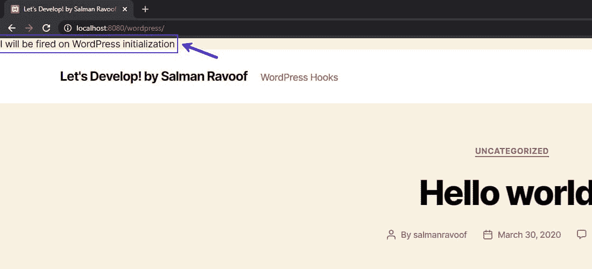

Not that pretty, but it’s a great start!


#### 查找 WordPress 支持的动作

WordPress 在每次做事情的时候都会包含动作，比如一个[用户登录](https://kinsta.com/blog/wordpress-login-url/)或者[发布一个新帖子](https://kinsta.com/knowledgebase/wordpress-missed-schedule/)。你可以在[插件 API/动作参考](https://codex.wordpress.org/Plugin_API/Action_Reference)页面找到 WordPress 运行的所有动作的完整列表。

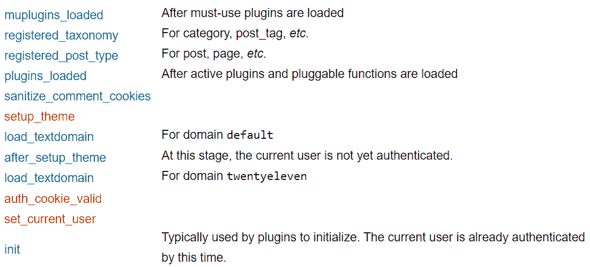

There’s an action for almost every use


Codex 已经将这里列出的所有行为分成了不同的类别，并按照 WordPress 的执行顺序从头到尾进行了排列。

在大多数情况下，这些行为不会做任何事情，因为没有任何东西与它们挂钩。但是如果你需要他们，他们就在那里等着你。

对所有的行动感到有点不知所措？这是自然的。随着你获得更多的经验和浏览 WordPress 核心源代码，找到满足你需求的完美钩子会变得更加容易。只需搜索“ **do_action** ”这个词，你就会发现大量你可以参与的活动。

#### add_action()的附加参数

`**add_action()**`函数可以再接受两个参数:一个用于设置`**priority**`，另一个用于设置`**number of arguments**`。虽然它们是可选的，但如果使用正确，它们会非常有用。

##### 优先

`**add_action()**`功能支持的第一个附加参数设置了`**priority**`。此参数只能是正整数。优先级越低，函数运行得越早。如果不指定，它的默认值是 10。

为了了解它是如何工作的，让我们向`**init**`动作注册三个回调函数，但是每个函数都有不同的优先级。

```
// priority is set to 9, which is lower than 10, hence it ranks higher
add_action( 'init', 'i_am_high_priority', 9 );

// if no priority is set, the default value of 10 will be used
add_action( 'init', 'i_am_default_priority');

// priority is set to 11, which is higher than 11, hence it ranks lower
add_action( 'init', 'i_am_low_priority', 11 );
```

在上面的例子中，优先级最低的回调函数将首先运行，优先级最高的回调函数将最后运行。如果它们的优先级相同，那么它们将按照您注册它们的顺序运行。

当一个钩子可以注册多个回调函数时，优先级起着重要的作用。为了避免意外的结果，您可以为每个回调函数设置一个优先级，以便它们按照您希望的顺序触发。

##### 参数数量

默认情况下，任何通过`**add_action()**`函数注册的回调函数将只接收一个参数。但是，有时您可能需要将额外的数据传递给回调函数。

因此，`**add_action()**`函数接受一个可选参数来设置参数的数量。

展示这一点的一个很好的例子是[评论 _ 帖子](https://developer.wordpress.org/reference/hooks/comment_post/)行动。这个动作在 [WordPress 向数据库](https://kinsta.com/blog/wordpress-comment-plugins/)添加评论后立即运行。如果不设置`**number of arguments**`参数，它将只传递一个值给回调函数，在本例中就是`**comment_ID**`。

```
// register the hook with 'priority' and 'number of arguments' parameters
add_action( 'comment_post', 'show_message_function', 10, 3 );

// define the callback function
function show_message_function( $comment_ID, $comment_approved, $commentdata ) {
    // check whether a comment is approved with the second parameter
    if( 1 === $comment_approved ){
        // runs the code only if the comment is approved
    }
}
```

如果像上面的例子一样将**参数个数**设置为 **3** ，那么动作函数将传递三个值:`**comment_ID**`、`**comment_approved**`和`**commentdata**`。

WordPress 将`**comment_approved**`值设置为 **1** ，如果未被批准，则设置为 **0** ，如果[评论被标记为垃圾评论](https://kinsta.com/blog/wordpress-spam-comments/)，则设置为“**垃圾评论**”。

`**commentdata**`变量是一个包含所有评论数据的数组，比如评论作者的姓名、电子邮件地址、网站以及评论本身的内容。您可以查看 WordPress Codex 来查找“commentdata”数组中包含的所有[键-值对。](https://developer.wordpress.org/reference/functions/wp_new_comment/#parameters)

您可以拥有任意数量的参数，但是回调函数和`**add_action()**`函数需要指定相同数量的参数。

通过向回调函数传递额外的参数，您可以用代码做更多的事情。例如，你可以检查一个评论是否被批准，如果被批准了，就自动将评论文本通过电子邮件发送给管理员。如果不指定额外的参数，这是不可能的，因为你的回调函数不能访问`**comment_content**`数据。

如果不想设置优先级，只想改变参数个数，还是需要设置优先级。只需使用其默认值(即 10)。

#### WordPress 核心如何使用动作

WordPress 核心本身使用它的许多内置动作来执行各种功能。

以 [wp_head](https://developer.wordpress.org/reference/hooks/wp_head/) 动作为例。它在 WordPress 输出网页的标题部分时被触发(代码在`**<head>**`和`**</head>**`之间)。

你可以在`**wp-includes/default-filters.php**`文件中找到与`**wp_head**`钩子相关的大部分 WordPress Core 的动作函数。我[检查了代码](https://github.com/WordPress/WordPress/blob/master/wp-includes/default-filters.php)，并编译了一个调用`**wp_head**`动作的所有`**add_action()**`函数的列表。

```
add_action( 'wp_head', 'rest_output_link_wp_head', 10, 0 );
add_action( 'wp_head', '_wp_render_title_tag', 1 );
add_action( 'wp_head', 'wp_enqueue_scripts', 1 );
add_action( 'wp_head', 'wp_resource_hints', 2 );
add_action( 'wp_head', 'feed_links', 2 );
add_action( 'wp_head', 'feed_links_extra', 3 );
add_action( 'wp_head', 'rsd_link' );
add_action( 'wp_head', 'wlwmanifest_link' );
add_action( 'wp_head', 'adjacent_posts_rel_link_wp_head', 10, 0 );
add_action( 'wp_head', 'locale_stylesheet' );
add_action( 'wp_head', 'noindex', 1 );
add_action( 'wp_head', 'print_emoji_detection_script', 7 );
add_action( 'wp_head', 'wp_print_styles', 8 );
add_action( 'wp_head', 'wp_print_head_scripts', 9 );
add_action( 'wp_head', 'wp_generator' );
add_action( 'wp_head', 'rel_canonical' );
add_action( 'wp_head', 'wp_shortlink_wp_head', 10, 0 );
add_action( 'wp_head', 'wp_custom_css_cb', 101 );
add_action( 'wp_head', 'wp_site_icon', 99 );
add_action( 'wp_head', 'wp_no_robots' );
```

许多回调函数都与一个动作挂钩。在这里设置`**priority**`对于确保最重要的挂钩函数首先运行是至关重要的。

在上面的例子中，用`**wp_enqueue_scripts()**`回调函数加载脚本(优先级= 1)比用`**wp_site_icon()**`回调函数加载站点图标元标签(优先级= 99)更重要。


### 信息

上面例子中使用的所有回调函数都是 WordPress 函数。您也可以在任何代码中使用它们。更多信息请访问 WordPress Codex 上的[函数参考页面。](https://codex.wordpress.org/Function_Reference)


#### 其他动作功能

虽然`**add_action()**`是最常用的动作功能，但还有许多其他功能同样有用。让我们看看它们都是如何工作的。

*   [has_action()](https://codex.wordpress.org/Function_Reference/has_action)

这个动作函数检查一个动作是否被钩住。它接受两个参数。第一个是动作的名称。第二个参数是可选的，是回调函数的名称。

```
has_action( 'action_name', 'function_to_check' );
```

如果您只指定第一个参数，那么如果*的任何*函数都与`**action_name**`参数挂钩，它将返回`**true**`。

但是如果你也指定了第二个参数，如果指定的回调函数没有注册到提到的动作，它将返回`**false**`。

如果它发现回调函数附加到操作钩子上，它将返回这个操作钩子上为该函数设置的`**priority**`(一个整数)。

*   [do_action()](https://developer.wordpress.org/reference/functions/do_action/)

我们以前遇到过这个动作函数。WordPress 用它来定义所有的默认动作，使其他功能也能挂钩到它们。就像 WordPress 一样，您也可以使用`**do_action()**`函数通过指定一个新的动作名称作为参数来创建一个新的自定义动作。

```
do_action( 'action_name', [argument1], [argument2] );
```

仅仅声明这个函数本身不会做任何事情。但是它会留在代码中，等待其他动作函数来激活它。传递任何额外的参数都是可选的，但是如果您希望回调函数使用它们，这是很重要的。

*   [do_action_ref_array()](https://codex.wordpress.org/Function_Reference/do_action_ref_array)

该动作功能与`**do_action()**`相同，除了一点不同。通过它传递的任何参数都必须是数组。当你有很多参数要传递或者你的参数已经在一个数组中时，这个函数非常有用。

```
// here's an example array
$arguments_array = array( 'arg_1', 'foo', true, 'arg_4' );

do_action_ref_array( 'example_action', $arguments_array );
```

因为 PHP 数组是一个有序的映射，所以要确保你传递的参数顺序正确。

这个动作函数用法的一个例子是 [admin_bar_menu](https://developer.wordpress.org/reference/hooks/admin_bar_menu/) 动作。它可以用来添加、操作或删除各种管理栏项目。所有的管理栏项目都被定义为一个数组的元素。

*   [did_action()](https://codex.wordpress.org/Function_Reference/did_action)

如果你想计算任何动作被触发的次数，你可以调用这个动作函数。

```
did_action( 'action_name' );
```

该函数返回一个整数值。

当你想只在一个动作第一次运行时运行一个回调函数，并且以后不再运行时，`**did_action()**`函数是非常方便的。

```
function example_callback_function() {
    if( did_action( 'example_action' ) === 1 ) {
    // checks if the 'example_action' hook is fired once, and only runs then, and never again!
    }
}
add_action('example_action', 'example_callback_function');
```

*   [remove_action()](https://codex.wordpress.org/Function_Reference/remove_action)

这个动作函数删除一个与指定动作挂钩的回调函数。例如，你可以使用这个功能来移除与内置动作挂钩的默认 WordPress 功能，并用你自己的功能来替换它们。

```
remove_action( 'action_name', 'function_to_be_removed', [priority] );
```

调用`**remove_action()**`函数有几个先决条件:

1.  `**function_to_be_removed**`和`**priority**`参数必须与最初在`**add_action()**`功能中使用的参数相同。
2.  您不能直接调用`**remove_action()**`函数。您需要从另一个函数内部调用它。
3.  如果回调函数是从一个*类*注册的，那么移除它还有其他要求。你可以查看 WordPress Codex 文档以获得更多细节。
4.  在回调函数注册之前或运行之后，都不能删除它。

这里有一个例子，说明了 [WooCommerce](https://kinsta.com/blog/woocommerce-tutorial/) 如何使用这个动作函数来删除主商店页面上的默认产品缩略图。

```
remove_action( 'woocommerce_before_shop_loop_item_title', 'woocommerce_template_loop_product_thumbnail', 10 );
```

*   [remove_all_actions()](https://codex.wordpress.org/Function_Reference/remove_all_actions)

这个动作函数删除所有与动作相关的东西。priority 参数是可选的。

```
remove_all_actions( 'action_name', [priority] );
```

请记住，这个函数不能从您想要取消注册回调函数的操作中调用。这将导致无限循环。您可以挂钩到之前触发的一个操作来运行该函数，而不会出现任何错误。

*   [doing_action()](https://developer.wordpress.org/reference/functions/doing_action/)

这个动作函数检查指定的动作是否正在运行。它返回一个布尔值(`**true**`或`**false**`)。

```
// check whether the 'action_name' action is being executed
if ( doing_action( 'action_name' ) ) {
    // execute your code here
}
```

您可以将`**action_name**`参数留空，以检查*是否正在执行任何*动作。每次触发任何动作时，它都会返回 **`true`** 。

```
// check if any action is running and do something
if ( doing_action() ) {
    // the code here is run when any action is fired
}
```

#### 操作示例 1:向站点访问者显示维护消息

有时候，最好让你的网站离线，在维护页面下贴一个[。谢天谢地，WordPress 提供了一个简单的方法来做到这一点。](https://kinsta.com/blog/wordpress-maintenance-mode/)

```
// show a maintenance message for all your site visitors
add_action( 'get_header', 'maintenance_message' );
function maintenance_message() {
    if (current_user_can( 'edit_posts' )) return;
    wp_die( '<h1>Stay Pawsitive!</h1><br>Sorry, we\'re temporarily down for maintenance right meow.' );
}
```

让我们分解代码并完成每个步骤:

*   [get_header](https://developer.wordpress.org/reference/hooks/get_header/) 是站点头模板文件加载前触发的动作。如果您想中断主站点的加载，这是一个完美的操作。
*   使用带有`**maintenance_message()**`回调函数的`**add_action()**`函数挂钩到`**get_header**`动作。
*   定义`**maintenance_message()**`回调函数。
*   `**current_user_can( 'edit_posts' )**`是[用户能力测试功能](https://developer.wordpress.org/reference/functions/current_user_can/)，检查当前用户是否登录，[是否可以编辑帖子](https://wordpress.org/support/article/roles-and-capabilities/#edit_posts)。在 WordPress 网站注册的每一个用户，除了订阅者角色的用户，都有编辑文章的能力。还有其他健壮的方法来执行这种检查，但是这里我们将坚持使用这个简单的方法。
*   使用默认的 [wp_die()](https://developer.wordpress.org/reference/functions/wp_die/) 函数优雅地终止 WordPress 的执行，并显示一个带有错误消息的 HTML 页面。您可以在错误消息参数中使用 HTML 语法来格式化它。

在我的自定义插件中保存代码后，我在私人浏览模式下加载了我的本地 WordPress 安装。正在维护的页面**成功！**

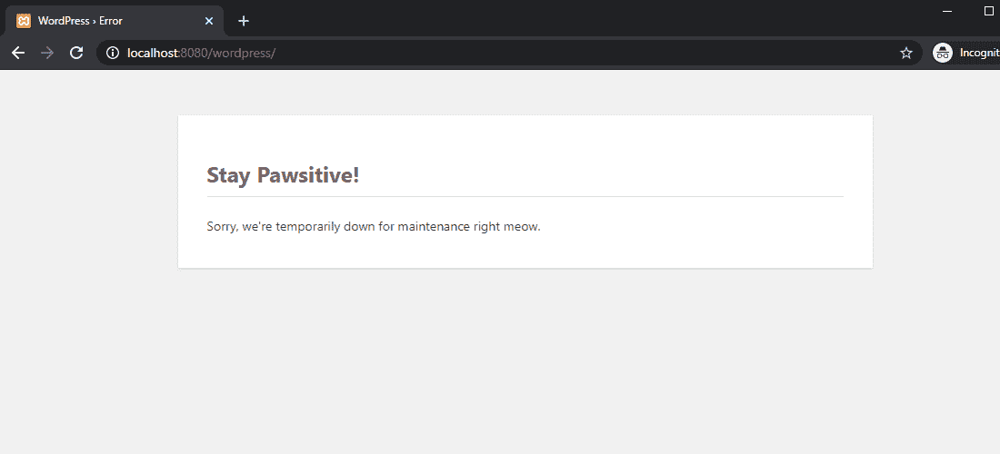

Showing an error message to site visitors


如果我在通过用户能力测试时登录，这个网站就能成功加载。你现在可以继续努力修复你的网站，而它显示定期访问者这一页。

#### 操作示例 2:对非管理员用户隐藏仪表板菜单项

如果你在运行一个多作者博客或者[为你的客户](https://kinsta.com/blog/wordpress-maintenance/)管理一个网站，那么你可能需要对非管理员用户隐藏 [WordPress 仪表盘](https://kinsta.com/knowledgebase/wordpress-admin/)中的某些管理员菜单。你可以通过挂钩到`**admin_menu**`动作来实现。

```
// remove specific dashboard menus for non-admin users
add_action( 'admin_menu', 'hide_admin_menus' );
function hide_admin_menus() {
    if (current_user_can( 'create_users' )) return;
    if (wp_get_current_user()->display_name == "Salman") return; 
    remove_menu_page( 'plugins.php' ); 
    remove_menu_page( 'themes.php' ); 
    remove_menu_page( 'tools.php' ); 
    remove_menu_page( 'users.php' ); 
    remove_menu_page( 'edit.php?post_type=page' ); 
    remove_menu_page( 'options-general.php' );
}
```

下面是上面代码片段的逐步演示:

*   [admin_menu](https://developer.wordpress.org/reference/hooks/admin_menu/) 是在管理菜单加载到 WordPress 仪表板区域之前触发的动作。
*   使用`**hide_admin_menus()**`回调函数通过`**add_action()**`函数挂钩到`**admin_menu**`动作。
*   `**hide_admin_menus()**`回调函数定义代码的逻辑。它在每次`**admin_menu**`动作触发时运行。
*   在回调函数中，`**current_user_can( 'create_users' )**`函数检查登录的用户是否是管理员。因为只有站点管理员拥有`**create_user**`功能，如果用户是管理员，该功能将以`**return**`语句结束。
*   函数的作用是:获取当前用户对象。通过该功能，我们可以检查登录用户是否有特定的`**display_name**`设置。这是一个可选行，以防您希望忽略某些非管理员用户由于这个回调函数而被锁定。
*   函数的作用是删除顶级的管理菜单。在上面的代码示例中，我删除了以下管理菜单:插件、主题、工具、用户、页面和选项。

保存插件文件后，这里有一个管理员登录的 WordPress 仪表盘的快照。

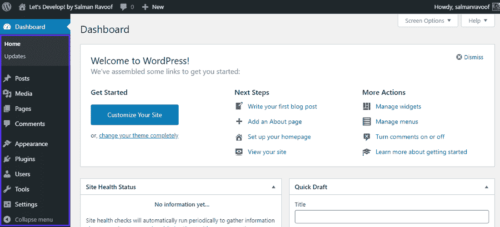

The default WordPress admin dashboard


这是一个非管理员用户登录的 WordPress 仪表盘的截图。

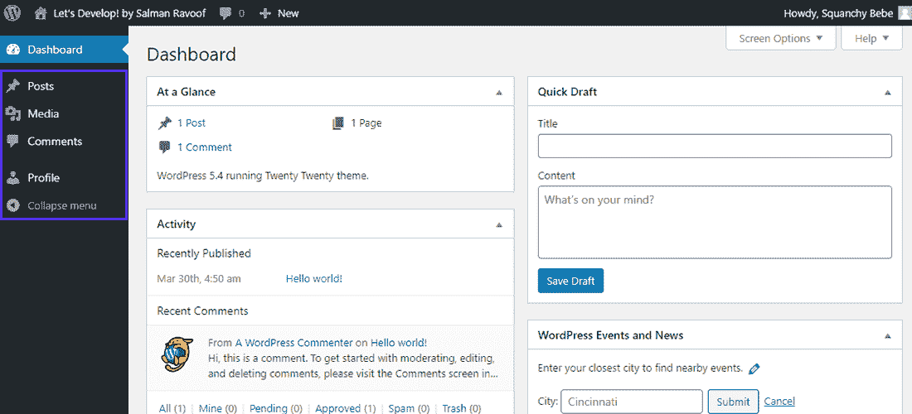

Hiding sensitive admin menu items from non-admin users


这个解决方案只是隐藏了指定的管理菜单项，使其不会出现在 WordPress 仪表盘上。所有用户仍然可以通过在浏览器中输入菜单 URL 来访问它们。

要禁止某些[用户角色](https://kinsta.com/blog/wordpress-user-roles/)访问特定菜单，您需要编辑他们的能力。

### 钩住过滤器

过滤器为你的自定义代码提供了一种方式来修改其他 WordPress 函数使用的数据。与操作不同，与过滤器挂钩的函数需要返回值。

#### add_filter()过滤函数

您可以通过以下步骤将回调函数与过滤器挂钩:

1.  定义一个在 WordPress 触发过滤器时运行的回调函数。过滤器的回调函数需要至少指定一个参数，因为所有的过滤器都至少传递一个值给它们的回调函数。
2.  用`**add_filter()**`函数向过滤器注册回调函数。过滤器将负责调用回调函数。根据 WordPress Codex， [add_filter()](https://developer.wordpress.org/reference/functions/add_filter/) 函数需要传递至少两个参数:
    *   要挂钩到的筛选器的名称。
    *   过滤器触发时将运行的回调函数的名称。
3.  `**add_filter()**`函数还接受两个额外的可选参数，用于设置`**priority**`和`**number of arguments**`。这些参数的工作方式与`**add_action()**`功能相同。

下面是一个如何使用`**add_filter()**`函数将回调函数与过滤器挂钩的例子。

```
// define the filter callback function with at least one argument passed
// the number of arguments that you can pass depends on how the filter is defined
function filter_callback_function( $arg1, $arg2 ) {
    // make your code do something with the arguments and return something
    return $something;
}

// now hook the callback function to the 'example_filter'
add_filter( 'example_filter', 'filter_callback_function', [priority], [no_of_args] );

// '10' is the default priority set for the callback function
// and '1' is the default number of arguments passed
```

#### 挂钩过滤器的示例

WordPress 提供了一个名为 [login_message](https://codex.wordpress.org/Plugin_API/Filter_Reference/login_message) 的过滤器来过滤显示在登录表单上方的登录页面上的消息。这个过滤器返回的值可以有 [HTML 标记](https://kinsta.com/blog/free-html-editor/)。

让我们连接到`**login_message**`过滤器，修改登录屏幕上显示的消息。

```
// show a custom login message above the login form
function custom_login_message( $message ) {
    if ( empty( $message ) ) {
        return "<h2>Welcome to Let's Develop by Salman Ravoof! Please log in to start learning.</h2>";
    } 
    else {
        return $message;
    }
}
add_filter( 'login_message', 'custom_login_message' );
```

回调函数中的`**if-else**`语句检查登录消息是否已经被设置，大部分是由另一个插件或主题设置的。在这种情况下，回调函数返回原始值，不做任何更改。这是避免与其他插件或主题冲突的一种方式。

你可以在 [WordPress 登录页面](https://kinsta.com/blog/wordpress-login-url/)的登录表单上方看到显示的消息。

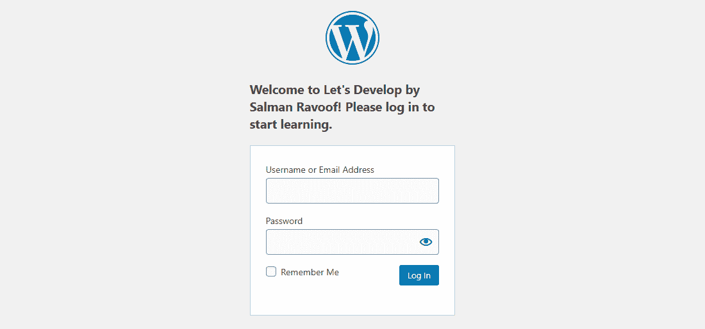

Showing a custom login message above the login form


您可以通过将自定义样式表排队来设置登录页面上所有元素的样式。这样做将允许你完全定制你的默认 WordPress 登录页面。

你将学习如何使用“用钩子定制 WordPress 登录页面”一节中的动作来加载定制的样式表。

#### 查找 WordPress 支持的过滤器

在 WordPress 处理或修改数据的任何地方，你几乎都可以找到一个过滤器来连接和修改它。把过滤器想象成一个在数据库和浏览器之间的接口。

你可以在[插件 API/过滤器参考](https://codex.wordpress.org/Plugin_API/Filter_Reference)页面找到 WordPress 支持的所有过滤器的详尽列表。

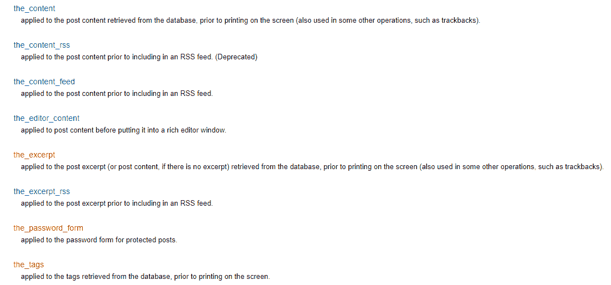

WordPress provides a variety of filters to hook into


这里列出的所有过滤器被分成多个类别，并按照 WordPress 执行顺序从上到下排列。

如果你想在 WordPress 源代码中找到过滤器，搜索“ **apply_filters** ”这个词，你会得到大量的结果。 [WordPress 代码参考](https://developer.wordpress.org/reference/)也是搜索 WordPress 中包含的所有内容的好地方，包括动作和过滤器。

#### WordPress 核心如何使用过滤器

WordPress Core 本身使用了很多内置的过滤器来修改各种函数使用的数据。

以 [the_content](https://developer.wordpress.org/reference/hooks/the_content/) 过滤器为例。它在文章内容从数据库中检索出来之后、显示在浏览器上之前对其进行过滤。

就像 actions 一样，你可以在`**wp-includes/default-filters.php**`文件中找到大多数 WordPress Core 的与`**the_content**`钩子相关的过滤函数。

这里列出了所有与`**the_content**`过滤器挂钩的核心`**add_filter()**`函数:

## 注册订阅时事通讯


### 想知道我们是怎么让流量增长超过 1000%的吗？

加入 20，000 多名获得我们每周时事通讯和内部消息的人的行列吧！

[Subscribe Now](#newsletter)

```
add_filter( 'the_content', 'do_blocks', 9 );
add_filter( 'the_content', 'wptexturize' );
add_filter( 'the_content', 'convert_smilies', 20 );
add_filter( 'the_content', 'wpautop' );
add_filter( 'the_content', 'shortcode_unautop' );
add_filter( 'the_content', 'prepend_attachment' );
add_filter( 'the_content', 'wp_make_content_images_responsive' );
add_filter( 'the_content', 'do_shortcode', 11 ); // AFTER wpautop(). 
```

注意为某些回调函数指定的优先级。

例如， [do_blocks()](https://developer.wordpress.org/reference/functions/do_blocks/) 函数解析帖子内容中的任何动态块，并重新呈现它们以兼容 [WordPress 的新块编辑器](https://kinsta.com/blog/gutenberg-wordpress-editor/)。它被指定了比缺省值(10)更高的优先级，以确保在其他函数运行之前内容是块就绪的。

函数 [convert_smilies()](https://developer.wordpress.org/reference/functions/convert_smilies/) 被设置为以较低的优先级运行，因为它的任务是将文本表情符号转换为图像精灵。在过滤了所有帖子内容之后，让它最终运行是有意义的。

有趣的事实:短码是过滤器的子集。它们接收来自短代码的输入，对其进行处理，然后将输出返回给它。在这个[终极 WordPress 短代码指南](https://kinsta.com/blog/wordpress-shortcodes/)中了解更多关于短代码的信息。

#### 其他过滤功能

虽然`**add_filter()**`是最常用的过滤函数，但还有许多其他有用的过滤函数。我们来深入讨论一下。

*   [has_filter()](https://codex.wordpress.org/Function_Reference/has_filter)

这个函数检查指定的过滤器是否被任何函数钩住。它接受两个参数。第一个参数用于输入过滤器名称。第二个参数是可选的，用于输入回调函数的名称。

```
has_filter( 'filter_name', 'function_to_check' );
```

如果你只指定第一个参数，如果`**filter_name**`被*的任何*函数钩住，它将返回`**true**`。

然而，如果您指定了这两个参数，那么如果提到的回调函数没有在给定的过滤器中注册，它将返回`**false**`。如果它发现用过滤器注册的回调函数，那么它将返回这个过滤器上为该函数设置的`**priority**`(一个整数)。

`**has_filter()**`函数的一个可能的应用是检查任何过滤器是否已经被挂钩，并基于此继续执行代码。

```
// check to see if 'the_content' filter has been hooked
if ( ! has_filter( 'the_content' ) {
    // hook the filter if and only if it hasn't been hooked before
    add_filter( 'the_content', 'modify_the_content' );
}
```

*   [apply_filters()](https://developer.wordpress.org/reference/functions/apply_filters/)

该过滤功能类似于`**do_action()**`动作功能。任何挂钩到这个过滤器的回调函数都将在这个函数在 WordPress 代码中的任何地方运行。

您还可以使用此函数通过将过滤器名称和过滤器值指定为参数来创建新的自定义过滤器。

```
apply_filters( 'filter_name', 'value_to_filter', [argument1], [argument2] );
```

如果你想把它们传递给你的回调函数，不要忘记指定任何额外的参数。大多数过滤器只使用一个参数，所以很容易错过定义其他参数。

*   [应用 _ 过滤器 _ 引用 _ 数组()](https://codex.wordpress.org/Function_Reference/apply_filters_ref_array)

这个函数类似于`**apply_filters()**`函数，除了它接受的所有参数都被打包成一个数组。

```
// an example array
$arguments_array = array( 'some_value', 'foo', false, 'another_value' );

apply_filters_ref_array( 'example_filter', $arguments_array );
```

当您有许多参数要传递或者所有参数都已经在一个数组中时，这个过滤函数会很方便。确保数组中的参数顺序正确。

*   [current_filter()](https://codex.wordpress.org/Function_Reference/current_filter)

这个 filter 函数检索当前正在运行的过滤器或操作的名称。您不需要指定任何参数，因为它在回调函数中运行。

下面是它的用法示例:

```
function example_callback() {
    echo current_filter(); // 'the_title' will be echoed
    return
}
add_filter( 'the_title', 'example_callback' );
```

不管它的名字，这个函数可以检索动作和过滤器的名称。

*   [remove_filter()](https://developer.wordpress.org/reference/functions/remove_filter/)

此过滤器函数移除附加到指定过滤器的回调函数。它的工作原理与`**remove_action()**`函数完全一样。你可以用它来删除注册了特定过滤器的默认 WordPress 函数，如果有必要，用你自己的函数替换它们。

```
remove_filter( 'filter_name', 'function_to_be_removed', [priority] );
```

要取消挂钩到过滤器的回调函数，`**function_to_be_removed**`和`**priority**`参数必须与挂钩回调函数时使用的参数相同。

如果过滤器是从一个类中添加的，这通常是插件添加的情况，那么你需要[访问类变量来移除过滤器](https://developer.wordpress.org/reference/functions/remove_filter/#comment-613)。

```
// access the class variable first, and then remove the filter through it
global $some_class;

remove_filter( 'the_content', array($some_class, 'class_filter_callback') );
```

让我们来看看`**remove_filter()**`的一个很好的例子。

[WooCommerce 插件](https://kinsta.com/blog/wordpress-ecommerce-plugins/#woocommerce)使用 [wc_lostpassword_url()](https://docs.woocommerce.com/wc-apidocs/source-function-wc_lostpassword_url.html#13-39) 调用函数挂钩到其 [lostpassword_url](https://docs.woocommerce.com/wc-apidocs/source-function-wc_lostpassword_url.html#41) 过滤器来重定向"*丢失密码？*“用户的尝试。

它需要任何用户点击链接到带有 URL `**/my-account/lost-password**`的自定义前端页面。如果没有这个过滤器，它会在`**/wp-login.php**`把他们带到标准的 WordPress 登录 URL。

假设您想要重置该功能，并将您的用户发送到[默认密码检索页面](https://kinsta.com/blog/change-wordpress-password/)或一个单独的页面。您可以像这样删除这个回调函数:

```
remove_filter( 'lostpassword_url', 'wc_lostpassword_url', 10 ); 
```

*   [移除所有过滤器()](https://codex.wordpress.org/Function_Reference/remove_all_filters)

这个过滤器函数删除所有注册到过滤器的回调函数。

```
remove_all_filters( 'filter_name', [priority] );
```

类似于`**remove_all_actions()**`函数。

流行的[高级摘录插件](https://github.com/KimcoBlogSC/Blog/blob/master/wp-content/plugins/advanced-excerpt/functions/functions.php)使用这个函数移除所有与`**the_excerpt**`和`**get_the_excerpt**`过滤器挂钩的默认函数。之后，它将自己的回调函数挂接到过滤器上。

```
// Ensure our filter is hooked, regardless of the page type 
if ( ! has_filter( 'get_the_excerpt', array( $advanced_excerpt, 'filter_excerpt' ) ) ) {
    remove_all_filters( 'get_the_excerpt' ); 
    remove_all_filters( 'the_excerpt' ); 
    add_filter( 'get_the_excerpt', array( $advanced_excerpt, 'filter_excerpt' ) );
}
```

*   [doing_filter()](https://developer.wordpress.org/reference/functions/doing_filter/)

这个过滤器函数检查指定的过滤器是否正在被执行。

```
if ( doing_filter( 'save_post' ) ) {
    // run your code here
}
```

它返回一个布尔值(`**true**`或`**false**`)。

您应该注意这个函数和`**current_filter()**`函数之间的区别，后者返回正在运行的过滤器或动作的名称(一个字符串)。

#### 过滤器示例 1:为注释添加亵渎性过滤器

管理你的 WordPress 网站上的所有[评论可能是一个麻烦的过程。](https://kinsta.com/blog/wordpress-comment-plugins/) [comment_text](https://developer.wordpress.org/reference/hooks/comment_text/) 过滤器允许您设置规则，以便在将注释打印到显示屏上之前对其进行修改。

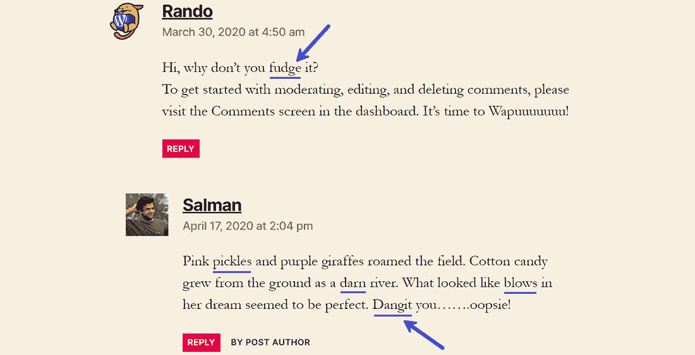

Unfiltered comments with dummy profanities marked


你可以指示 WordPress 在向你的网站访问者显示脏话之前自动删除它们。我们开始吧。

```
// hook into the 'comment_text' filter with the callback function
add_filter( 'comment_text', 'the_profanity_filter' );

// define a callback function to filter profanities in comments 
function the_profanity_filter( $comment_text ) {
    // define an array of profane words and count how many are there 
    $profaneWords = array('fudge', 'darn', 'pickles', 'blows', 'dangit');
    $profaneWordsCount = sizeof($profaneWords);

    // loop through the profanities in $comment_text and replace them with '*'
    for($i=0; $i < $profaneWordsCount; $i++) {
        $comment_text = str_ireplace( $profaneWords[$i], str_repeat('*', strlen( $profaneWords[$i]) ), $comment_text );
    } 

    return $comment_text;
}
```

下面是代码的逐行分解:

*   [comment_text](https://developer.wordpress.org/reference/hooks/comment_text/) 是一个过滤挂钩，允许你在浏览器显示评论之前修改评论的文本。您可以向它注册您的回调函数来过滤它的输出。
*   `**add_filter()**`函数让您挂钩到`**comment_text**`过滤器，并为其附加一个回调函数。
*   `**the_profanity_filter()**`是回调函数的名称。它只接受一个参数，即包含注释文本的字符串。用适当的代码逻辑定义这个自定义函数。
*   将所有亵渎的单词存储在一个名为`**profaneWords**`的 PHP 数组中。您可以向该数组中添加任意数量的单词。借助于 [sizeof() PHP 函数](https://www.php.net/manual/en/function.sizeof.php)，我将这个数组的大小存储在`**profaneWordsCount**`变量中。
*   遍历所有亵渎的单词，使用 PHP 默认的 [str_ireplace()函数](https://www.php.net/manual/en/function.str-ireplace.php)用`*****`符号替换任何匹配的亵渎的单词。由于这是一个不区分大小写的字符串替换函数，所以不必担心大小写问题。检查执行[搜索和替换](https://kinsta.com/knowledgebase/wordpress-search-and-replace/)的不同方法。
*   使用`**return**`输出过滤后的注释文本。

将更改保存到您的自定义插件文件，并重新加载任何带有评论的帖子。你在`**profaneWords**`数组中包含的所有单词现在应该被替换为“***”**符号。

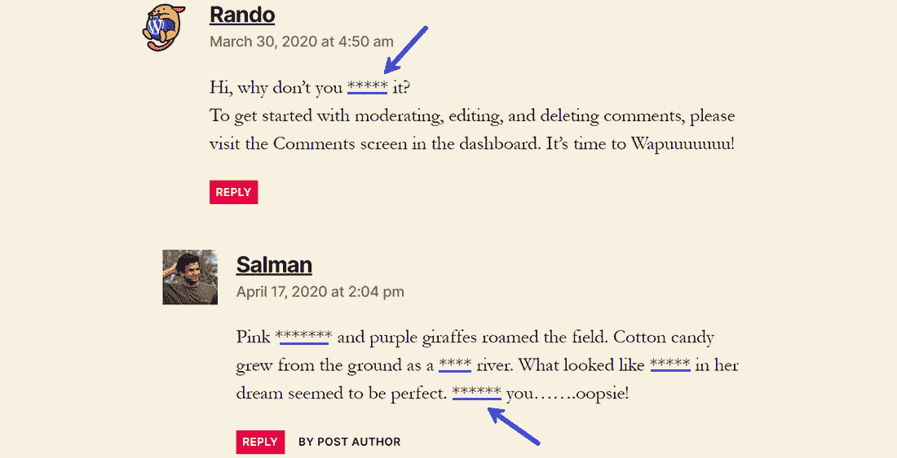

Censoring profanity in comments with ‘*’ symbols


数据库中的原始注释仍然可用。这个过滤器只在注释文本输出到前端之前修改它。


The original comment on the site backend


一旦你连接到正确的过滤器，你可以用它做很多很酷的事情。

例如，你也可以使用`**comment_text**`过滤器从所有评论中删除任何 URL(确保阅读这篇关于[如何在 WordPress](https://kinsta.com/blog/wordpress-spam-comments/) 阻止垃圾评论的深度指南)。

或者，您可以连接到 [pre_comment_approved](https://developer.wordpress.org/reference/hooks/pre_comment_approved/) 过滤器，根据预定义的标准将评论标记为已批准、垃圾邮件或过滤。

#### 过滤器示例 2:在帖子后插入内容

你已经看到了 WordPress 如何使用`**the_content**`过滤器来修改文章或页面内容。让我们使用相同的过滤器在每个帖子的末尾添加一些内容。

```
// hook into 'the_content' filter with a callback function
add_filter( 'the_content', 'insert_content_below' );

// define the callback function to insert something below the post
function insert_content_below( $content ) {
    // check to see if we're inside the main loop in a single post
    if ( is_single() && in_the_loop() && is_main_query() ) {
        return $content . "<h3 style=\"text-align: center;\">Let me insert myself here</h3><p style=\"text-align: center;border: 3px solid #5333ed;\">I'll appear after the post. You can insert anything here. Even HTML. Headers, links, images, scripts, I'll take them all and append it to the end of the post content. You can also give me a class, so you can style me easily with CSS style sheets.</p>" ;
    } 

    return $content;
}
```

理解上面示例中的代码逻辑:

*   `**the_content**` filter hook 帮助你抓取当前帖子的内容，并进行定制。
*   使用`**add_filter()**`函数通过`**insert_content_below()**`回调函数挂接`**the_content**`过滤器。
*   通过将当前帖子的内容作为参数传递来定义回调函数(`**$content**`)。
*   在回调函数中，检查您是否只过滤了主查询中的内容，在本例中是 post 内容。如果不验证这一点，有时代码会无意中过滤掉侧栏和页脚等其他地方的内容。
*   [is_main_query()](https://developer.wordpress.org/reference/functions/is_main_query/) 和 [in_the_loop()](https://developer.wordpress.org/reference/functions/in_the_loop/#comment-1364) 条件句确定查询是否是一个主查询并且发生在 WordPress 主循环内。
*   [is_single()](https://developer.wordpress.org/reference/functions/is_single/) 条件检查查询是否针对单个帖子。
*   使用 PHP 的[字符串连接操作符](https://www.php.net/manual/en/language.operators.string.php) ( `**$content . “your additions”**`)向页面内容添加额外的内容。
*   如果上述所有条件都满足，则过滤后的注释。如果没有，那么就返回没有修改的内容。

保存你的插件文件，加载你网站上的任何帖子，滚动到最后。

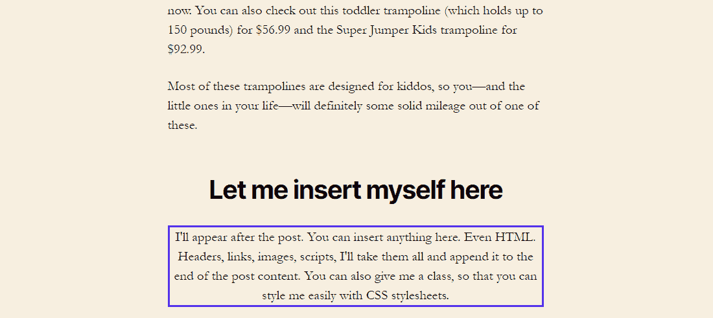

Inserting something at the end of the post content


您可以使用相同的逻辑，通过颠倒字符串连接参数(`**“your additions” . $content**`)的位置，将任何内容添加到所有帖子的开头。

需要为您的客户站点提供一个非常快速、安全且对开发人员友好的托管服务吗？Kinsta 是为 WordPress 开发者设计的，提供了大量的工具和强大的仪表板。[查看我们的计划](https://kinsta.com/plans/?in-article-cta)

### 用钩子定制 WordPress 登录页面

让我们使用动作和过滤器来定制默认的 WordPress 登录页面。我将创建一个名为 **Sal 自定义登录页面**的新插件来完成这项工作。您可以在本节末尾找到这个插件的完整源代码。

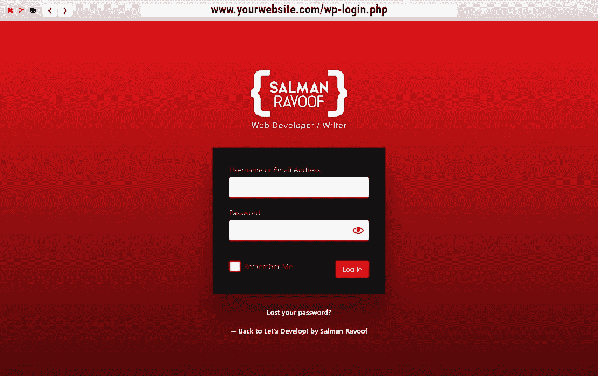

The final customized WordPress login screen


让我们从添加标准插件标题字段并注册到 WordPress 开始。

```
<?php

/*
Plugin Name:  Sal Custom Login Page
Version:  1.0
Description:  Demonstrating WordPress Hooks (Actions and Filters) by customizing the WordPress login page.
Author:  Salman Ravoof
Author URI:  https://www.salmanravoof.com/License: GPLv2 or later
License URI: https://www.gnu.org/licenses/gpl-2.0.html
Text Domain:  sal-custom-login-page
*/

// enqueueing the custom style sheet on WordPress login page
add_action( 'login_enqueue_scripts', 'salhooks_login_stylesheet');
function salhooks_login_stylesheet() {
    // Load the style sheet from the plugin folder
    wp_enqueue_style( 'sal-custom-login-page', plugin_dir_url( __FILE__ ).'sal-custom-login-page-styles.css' );
}
```

首先，挂钩到[log in _ enquee _ scripts](https://developer.wordpress.org/reference/hooks/login_enqueue_scripts/)动作，将您的定制样式表排队。您在此处加入的任何脚本或样式都包含在登录页面的标题部分中。

如果你想在网站的前端加载定制脚本和样式表(而不是在管理后端或登录区)，那么你需要挂钩到`**wp_enqueue_scripts**`动作。你可以在 [WordPress Codex](https://developer.wordpress.org/reference/hooks/wp_enqueue_scripts/) 和 [Kinsta 关于如何使用 wp_enqueue_scripts](https://kinsta.com/blog/wp-enqueue-scripts/) 的文章中读到更多。

在`**salhooks_login_stylesheet()**`回调函数中，使用 [wp_enqueue_style()](https://developer.wordpress.org/reference/functions/wp_enqueue_style/) 函数加载放置在同一个插件目录中的自定义样式表(`**sal-custom-login-page-styles.css**`)。WordPress 的内置 [plugin_dir_url( __FILE__ )](https://developer.wordpress.org/reference/functions/plugin_dir_url/) 函数可以很容易地获得当前插件目录的 url 路径(带有一个尾随斜杠)。

我不会解释这里应用的 [CSS 样式](https://kinsta.com/blog/wordpress-css/#wordpress-and-css)，但是你可以在本节末尾链接的源代码中找到它们。

```
// Custom login ERROR message to keep the site more secure
add_filter( 'login_errors', 'salhooks_remove_login_errors', 10 );
function salhooks_remove_login_errors() {
    return 'Incorrect credentials. Please try again!';
}
```

接下来，挂钩到 [login_errors](https://developer.wordpress.org/reference/hooks/login_errors/) 过滤器，以更改当有人输入不正确的凭证时显示的错误消息。过滤错误消息将阻止攻击者轻易猜测您的用户名。

```
// Remove the login form box shake animation for incorrect credentials
add_action( 'login_head', 'remove_login_error_shake' );
function remove_login_error_shake() {
    remove_action( 'login_head', 'wp_shake_js', 12 );
}
```

每当有人输入不正确的登录凭证时，登录表单框就会剧烈抖动。这是一个可选的步骤，但是我包含它是为了说明您也可以从登录页面中删除某些功能。

在本文的最后一节，您将了解更多关于`**remove_action()**`和`**remove_filter()**`函数的内容。

```
// Change the logo and header link above the login form
add_filter( 'login_headerurl', 'salhooks_login_headerurl');
function salhooks_login_headerurl( $url ) {
    $url = 'https://salmanravoof.com';
    return $url;
}

add_filter( 'login_headertext', 'salhooks_login_headertext');
function salhooks_login_headertext( $text ) {
    $text = 'Salman Ravoof';
    return $text;
}
```

最后一步是更改登录标题的 URL 和文本。你可以连接到[登录 _ 标题和](https://developer.wordpress.org/reference/hooks/login_headerurl/)T2 登录 _ 标题和过滤器来修改它们。

如果你想构建这个插件并做进一步的实验，你可以[下载插件的源代码](https://github.com/SalmanRavoof/sal-custom-login-page)并开始。

## WordPress 挂钩列表和资源

很难记住 WordPress 拥有的所有不同的钩子。有数以千计的内置动作和过滤器可以挂钩。因此，找到一个合适的钩子有时就像寻宝游戏。

幸运的是，有各种各样的资源可以让你找到满足你需求的完美钩子。

*   WordPress 插件手册——钩子

熟悉钩子的第一个地方是 WordPress Codex，尤其是插件手册中的钩子部分。在这里，您可以找到关于钩子的基本信息，以及关于所有动作和过滤器的完整文档的链接。

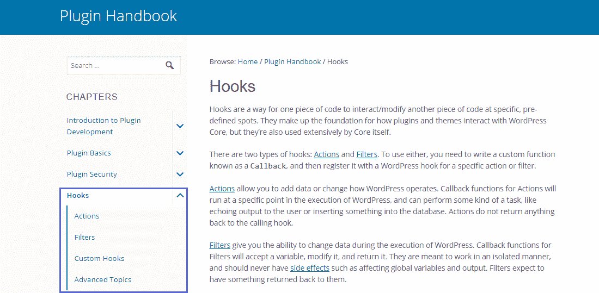

Start learning Hooks with the WordPress Plugin Handbook


将插件手册中的这些有用链接加入书签，以加快搜索速度:

*   [插件 API —钩子函数引用](https://codex.wordpress.org/Plugin_API#Function_Reference)
*   [插件 API —动作参考](https://codex.wordpress.org/Plugin_API/Action_Reference)
*   [插件 API —过滤器参考](https://codex.wordpress.org/Plugin_API/Filter_Reference)

action reference 和 filter reference 页面都会给你一个列表，列出在一个特定的 WordPress 请求中运行的所有钩子。

例如，当您访问管理页面时，当您处理帖子页面附件时，或者当您处理[类别](https://kinsta.com/knowledgebase/what-is-taxonomy/)时，您可以找到所有触发的钩子。

*   [WordPress 代码参考](https://developer.wordpress.org/reference/)

WordPress Codex 还包括一个方便的搜索工具，可以找到它所有的函数、钩子、方法和类。这个页面还列出了 WordPress 最新版本中新增和更新的组件。如果你想知道 WordPress 内部发生了什么，首先到这里。

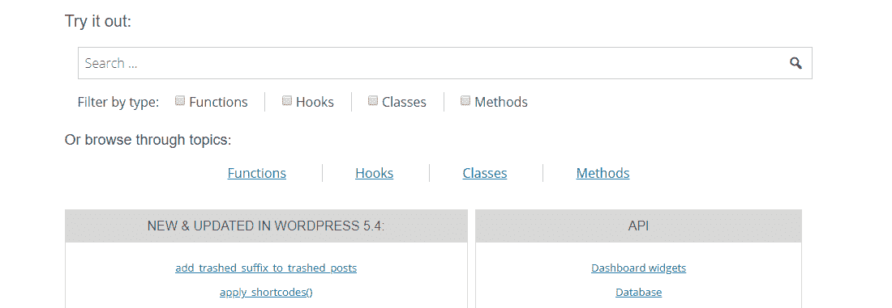

Search for anything inside WordPress here


*   [亚当·布朗的 WordPress Hooks 索引](https://adambrown.info/p/wp_hooks/hook)

WordPress 钩子的这个索引按照类型、它们首次出现的 WordPress 版本以及它们是否被弃用对所有钩子进行了排序。

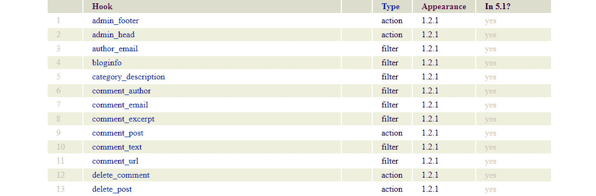

Adam R Brown’s WordPress Hooks Index


按照钩子的外观排序，你会发现最老的钩子仍然是最常用的。如果你是 WordPress 开发的新手，熟悉这些流行的操作和过滤器是最快的方法。

虽然这个索引从 WordPress 5.1 开始就没有更新过，但是浏览一下所有主要的链接还是很有帮助的。

仍然很难找到你想要的钩子吗？用正确的关键词进行网上搜索总是一个好的开始。如果其他的都失败了，你可以一直钻研 WordPress 代码。

## 寻找注册在 WordPress 页面上的钩子

正如我们所看到的，WordPress 有大量的钩子可用，但不是每个钩子都能在每个页面上触发。如果你能找到在某个特定页面上可以使用的操作和过滤器，那么你就已经成功了一半。

虽然你可以使用高级的 PHP 调试工具如 [xdebug](https://xdebug.org/) 和 [PHPCS](https://github.com/squizlabs/PHP_CodeSniffer) 来帮助解决这个问题，但是还有一些更简单的开发工具如 Debug Bar 和 Query Monitor 可以在 WordPress 中运行。

### 带有动作和过滤器插件的调试栏

调试栏是一个官方的 WordPress 插件，可以在你的管理栏中添加一个**调试**菜单。它显示 PHP 警告和通知、缓存请求、 [MySQL 查询](https://kinsta.com/knowledgebase/what-is-mysql/)和[其他有用的调试信息](https://kinsta.com/blog/wordpress-debug/)。


### 信息

这个插件最近没有更新，也没有用 WordPress 的最新主要版本测试过。我们把它作为一个方便的插件来学习更多关于 WordPress 钩子的知识。在[暂存环境](https://kinsta.com/help/staging-environment/)上使用它。


[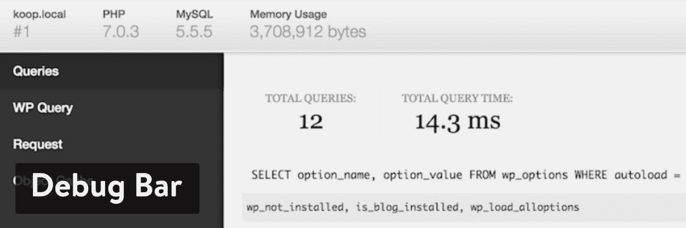](https://kinsta.com/wp-content/uploads/2020/05/WordPress-Debug-Bar-plugin.jpg)

The WordPress Debug Bar WordPress plugin


安装插件后，您需要将下面的代码片段添加到您站点的`**wp-config.php**`文件中，以启用其调试功能。

```
define( 'WP_DEBUG', true ); // tracks PHP Warnings and Notices
define( 'SAVEQUERIES', true ); // tracks and displays MySQL queries
```

现在，您应该看到 **Debug** 菜单选项出现在您的管理栏中。点击它将带您到它的仪表板，在那里您可以看到各种查询和缓存附加到您访问它的页面。

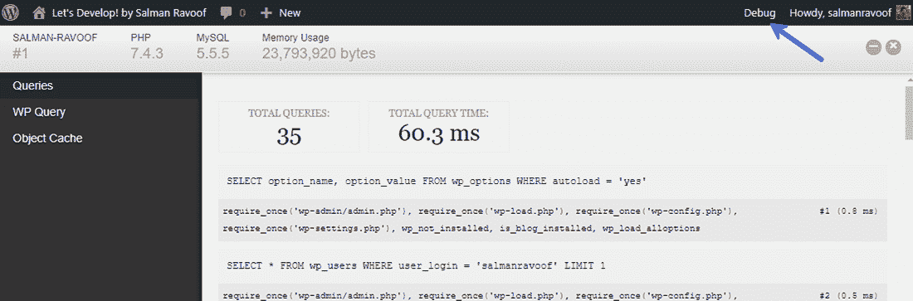

The ‘Debug’ menu in the WordPress admin bar


接下来，你需要安装[调试栏动作和过滤器插件](https://wordpress.org/plugins/debug-bar-actions-and-filters-addon/)。这是一个方便的扩展，可以在你的调试栏面板上增加两个标签来显示当前请求触发的动作和过滤器。


Actions listed in their loading order for the current page


它还会列出所有与它们相关联的函数及其优先级。

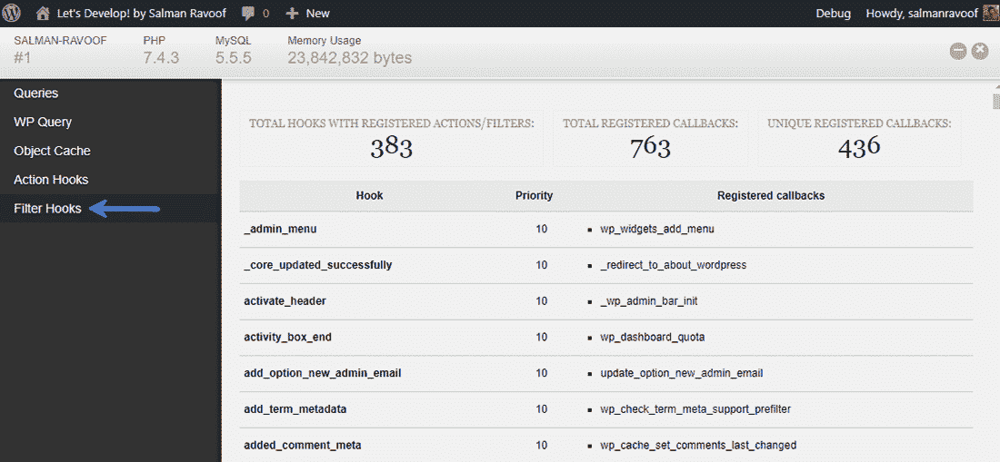

Filters listed with their priority and registered callback functions


你可以在你站点的任何页面上点击 **Debug** 菜单，了解你可以在那个页面上挂接的所有动作和过滤器。

### 查询监视器

查询监视器是 WordPress 的一个强大的开发者工具面板。您可以使用它来深入了解页面上可用的挂钩及其加载顺序。

[](https://kinsta.com/wp-content/uploads/2020/05/Query-Monitor-plugin.jpg)

Query Monitor WordPress plugin


不像 Debug Bar，你不需要安装任何插件就可以看到某个页面触发的动作和过滤器。

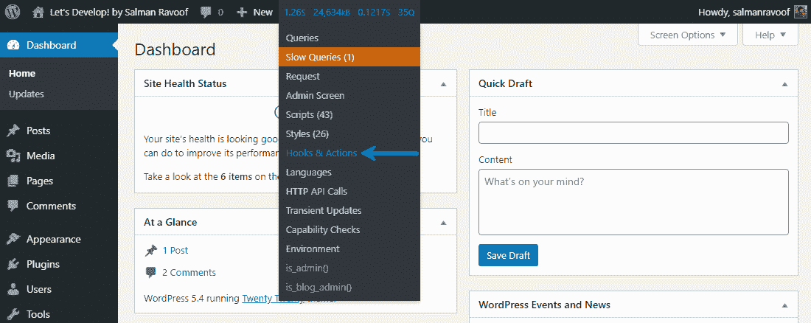

You can access Query Monitor from the admin bar


Query Monitor 还提供了更多关于钩子从哪里发出的信息。

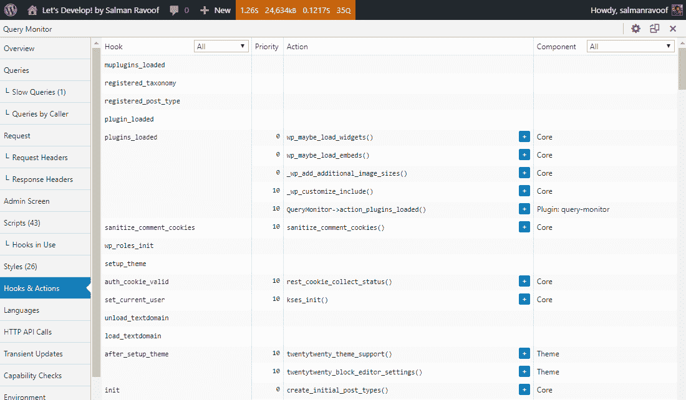

The Hooks & Actions panel in Query Monitor


在 component 列中，您可以看到大多数钩子都是从核心注册的。但是一些钩子是从一个主题或者插件注册的。几个挂钩可以从多个组件注册。

您可以使用挂钩和组件[下拉菜单](https://kinsta.com/knowledgebase/wordpress-dropdown-menu/)仅查看您需要的挂钩。

**注意:**查询监视器使用“钩子”作为动作和过滤器的统称，但是它调用注册的回调函数作为“动作”从技术上讲，这是一个错误的定义，可能会让你感到困惑，所以请记住这一点。

使用查询监视器，您可以做的不仅仅是检查所有的查询和请求。还包括列表样式、脚本、[语言](https://kinsta.com/blog/wordpress-multilingual/)、 [Ajax 调用](https://kinsta.com/blog/admin-ajax-php/)、用户能力检查、 [REST API 调用](https://kinsta.com/blog/wordpress-rest-api/)等高级功能。

## “全部”挂钩

WordPress 有一个名为“all”的特殊钩子,你可以挂入这个钩子为每个钩子运行一个回调函数，不管它是否注册了所有的钩子。这对于[调试页面崩溃](https://kinsta.com/blog/wordpress-debug/)或者如果你想知道某个特定事件何时发生很有用。

例如，你可以使用下面例子中的`**all**`钩子来`**echo**`所有正在运行的动作。

```
// echo all the actions being run
function debug_helper_function(){
    echo '<p>' . current_action() . '</p>';
}
add_action( 'all', 'debug_helper_function' );
```

上面定义的`**debug_helper_function()**`将在任何动作触发时运行。知道最后一次运行操作是什么将会让你更好地了解你需要在哪里寻找。

## WordPress 钩子存放在哪里？

WordPress 使用 [WP_Hook](https://developer.wordpress.org/reference/classes/wp_hook/) 类来实现钩子如何工作。这个核心类用于处理所有内置的 WordPress 动作和过滤器。你可以在[WP-includes/class-WP-hook . PHP](https://core.trac.wordpress.org/browser/tags/5.4/src/wp-includes/class-wp-hook.php)文件中找到几乎所有与这个类相关的代码。

从技术上讲，`**WP_Hook**`类是一个对象数组，包含回调、迭代、当前优先级、嵌套级别和执行操作等属性。它还定义了许多有用的钩子函数，可以使用 [WP_Hook 方法](https://developer.wordpress.org/reference/files/wp-includes/class-wp-hook.php/)调用这些函数。

大多数 WordPress 开发者不需要太担心 WordPress 在哪里存储钩子，只要他们坚持插件 API 指南。

[There are two types of WordPress hooks: actions and filters, and this guide breaks down exactly when (and how!) to use each one 💥Click to Tweet](https://twitter.com/intent/tweet?url=https%3A%2F%2Fkinsta.com%2Fblog%2Fwordpress-hooks%2F&via=kinsta&text=There+are+two+types+of+WordPress+hooks%3A+actions+and+filters%2C+and+this+guide+breaks+down+exactly+when+%28and+how%21%29+to+use+each+one+%F0%9F%92%A5&hashtags=WordPress%2Cdevlife)

## 如何创建你的自定义 WordPress 挂钩

你已经看到了 WordPress 通过其插件 API 提供的各种钩子。您还看到了如何使用默认钩子将您自己的代码注入 WordPress 运行时。

如果你是一个[插件或主题开发者](https://kinsta.com/blog/wordpress-developer-salary/)，给其他开发者提供一种以同样方式与你的代码交互的方式是一个好的实践。定制挂钩让你做到这一点。它们允许其他开发者扩展和修改你的插件和主题的功能。

创建自己的动作和过滤器相当简单。你使用 WordPress Core 用来创建钩子的相同函数。我们来看几个例子。

### 如何在 WordPress 中创建自定义动作

使用`**do_action()**`功能创建一个自定义动作挂钩。你可以这样做:

```
// the position where you insert your action is where it'll run when called
do_action( ' my_unique_custom_action' );
// continue with the rest of your code
```

现在，其他开发者可以在不修改源代码的情况下挂接你的插件或主题。他们所要做的就是使用`**add_action()**`函数将他们的回调函数注册到你的插件的自定义动作中。

```
add_action( 'my_unique_custom_action', 'some_callback_function' );

// define the callback function you mentioned in the above action function
some_callback_function() {
     // this code will run wherever your custom action hook is 
}
```

确保**完整地记录**您的定制钩子，详细解释它们的作用。毕竟，创建定制钩子的主要用途是帮助[其他开发者](https://kinsta.com/blog/web-developer-salary/)与你的代码交互。

### 如何在 WordPress 中创建自定义过滤器

使用`**apply_filters()**`功能创建一个自定义过滤器挂钩。你可以这样做:

```
$value_to_filter = "I'm a string, but this can be any PHP data type";

// filters modify a value and are typically tied to a predefined variable
apply_filters( 'my_custom_filter', $value_to_filter );
```

您的自定义过滤器的参数应该包括一个唯一的标识符和一个要过滤的值。其他开发人员可以使用`**add_filter()**`函数连接到您的定制过滤器，并修改传递的值。

```
add_filter( 'my_custom_filter', 'some_callback_function' );

// define the callback function you mentioned in the above filter function
function some_callback_function( $value_to_filter ) {
    // modify the passed value (or not) 
    return $value_to_filter; // returning a value is a must for filters
}
```

当您定义您的自定义筛选器时，请确保它没有被定位在它应该筛选的值被定义之前。如果没有正确放置过滤器，过滤后的值将被默认值覆盖。

### 自定义挂钩命名约定

为你所有的定制钩子选择一个唯一的名字是很重要的。由于任何插件或主题都可以有自己的定制钩子，拥有相同的钩子名称会导致代码冲突，产生意想不到的结果。

例如，如果您将您的操作命名为`**send_email**`，其他插件开发者很可能也会选择相同的术语，因为它不够独特。如果任何网站同时安装了你和其他开发者的插件，它会[导致难以追踪的错误](https://kinsta.com/blog/wordpress-errors/)。

您可以用一个公共标识符作为所有自定义挂钩的前缀，使它们既简单又独特。所以，不用`**send_email**`，可以命名为`**plugin_name_send_email**` ( **plugin_name_** 是这里唯一的前缀)。

### 带有可扩展插件的定制钩子演示

让我们创建一个可扩展插件(或可插拔插件),它将允许其他开发人员使用它的定制钩子与它交互。

我将这个插件命名为**自定义钩子演示** *。*它的主要功能是在你插入短码的地方输出一个报价框。它将在适当的位置包含自定义动作和过滤器，使其他开发人员可以修改或扩展它的功能。

你可以参考我的 [WordPress 短码指南](https://kinsta.com/blog/wordpress-shortcodes/)来了解更多关于短码是如何工作的。

让我们从可扩展插件开始。

```
<?php

/*
Plugin Name :  Custom Hooks Demo
Description :  Demonstrating how to create an extensible WordPress plugin using custom hooks.
Author      :  Salman Ravoof
Author URI  :  https://salmanravoof.com/
License     :  GPLv2 or later
License URI :  https://www.gnu.org/licenses/gpl-2.0.html
Text Domain :  custom-hooks-demo
*/

/** 
 * the [custom_hooks_demo] shortcode returns the HTML code for a quote box.
 * @return string HTML code for a quote box
*/
add_shortcode( 'custom_hooks_demo', 'my_shortcode_callback' );

function my_shortcode_callback ( $arguments ) {
    ob_start(); // start object buffering to collect all output before sending it to the browser

    // set an action hook to run before you output anything
    do_action( 'the_topmost_custom_action' );

    // define your variables which you want to allow to be filtered
    $quote_content = "Z.E.R.O. That's the number of people who'd like to have any website autoplay music on their browsers.";
    $quote_author = "John Doenuts";

    // create your custom filters after you've set the variables
    $quote_content = apply_filters( 'custom_quote_content', $quote_content );
    $quote_author = apply_filters( 'custom_quote_author', $quote_author );

    // build the shortcode output template
    echo "<div style=\"border:3px solid #5333ed;\"><blockquote style=\"margin:20px;border-color:#5333ed;\">";
    echo $quote_content;
    echo "<br><br>";
    echo "― <strong>" . $quote_author . "</strong>";
    echo "</blockquote></div>";

    // set an action hook to run after you output everything
    do_action( 'the_ending_custom_action' );

    return ob_get_clean(); // get buffer contents, delete the buffer, and then stop buffering
}
```

*   `**add_shortcode()**`函数用于创建自定义短代码。然后用这个插件的所有功能来定义 shortcode 的回调函数。
*   ob_start() 是一个启用输出缓冲的 PHP 函数。这是一个非常方便的特性，它指示 PHP 将任何输出保存在服务器的缓冲存储器中，而不是立即输出。您可以使用它在 PHP 中构建复杂的、可读的 HTML 代码。
*   `**do_action( 'the_topmost_custom_action' )**`定义您的第一个自定义动作。为了使它有用，你需要在插件输出任何东西之前定义它。其他开发人员可以在这个自定义短代码打印出任何内容之前，挂钩到这个自定义操作来运行他们的代码。
*   创建要过滤的变量。在这个插件中，这些变量是`**$quote_content**`和`**$quote_author**`。在本例中，它们都是字符串，但是您可以将它们设置为任何 PHP 数据类型(例如，integer、boolean、array)。
*   使用`**apply_filters()**`功能创建您的自定义过滤器。因为所有过滤器都返回值，所以您可以将先前定义的变量分配给该过滤器的返回值。其他开发人员现在可以使用这个过滤器来修改预定义变量的默认值。
*   使用`**echo**`语句逐行构建你的短代码的输出。因为我们已经启用了输出缓冲，所以没有输出会立即到达浏览器。
*   `**do_action( 'the_ending_custom_action' )**`定义您最后的自定义操作。您需要在最后定义它，但是在返回所有缓冲区内容之前。
*   [ob_get_clean()](https://www.php.net/manual/en/function.ob-get-clean.php) 是一个默认的三合一 PHP 函数。它将检索缓冲区内容，清除所有缓冲区数据，然后停止输出缓冲。它将收集的缓冲区内容作为一个单独的连接字符串。

一旦保存并激活，添加`**[custom_hooks_demo]**`短代码到你的文章内容将会输出一个带有默认值的报价框。

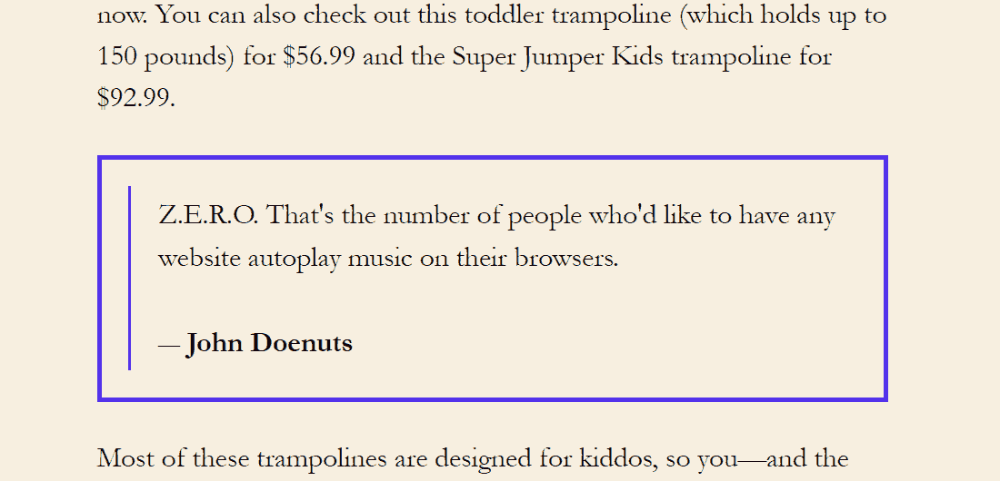

The original quotation box using the Custom Hooks Demo plugin


现在，让我们创建另一个名为**自定义钩子演示扩展**的插件。它将挂钩到由之前插件创建的所有自定义挂钩，并做或修改一些东西。

```
<?php

/*
Plugin Name :  Custom Hooks Demo Extension
Description :  Demonstrating how you can extend WordPress plugin functionality with its custom hooks.
Author      :  Salman Ravoof
Author URI  :  https://salmanravoof.com/
License     :  GPLv2 or later
License URI :  https://www.gnu.org/licenses/gpl-2.0.html
Text Domain :  custom-hooks-demo-extension
*/

/**
 * replace the quote content by hooking into the 'custom_quote_content' filter
*/
add_filter( 'custom_quote_content', 'new_quote_content_callback' );
function new_quote_content_callback( $content ) {
    $content = "There are no bugs in programming. Only unexpected features.";
    return $content;
}

/**
 * replace the quote author by hooking into the 'custom_quote_author'
*/
add_filter( 'custom_quote_author', 'new_quote_author_callback' );
function new_quote_author_callback( $author ) {
    $author = "Jane Doodle";
    return $author;
}

/**
 * add an image to the top of the shortcode output by hooking into the 'the_topmost_custom_action'
*/
add_action( 'the_topmost_custom_action', 'quote_image_callback' );
function quote_image_callback() {
    $url = "https://upload.wikimedia.org/wikipedia/commons/thumb/f/f9/Quote-right-cs.svg/75px-Quote-right-cs.svg.png";
    echo '<div></div>';
}

/**
 * add a button below the shortcut output by hooking into the 'the_ending_custom_action'
*/
add_action( 'the_ending_custom_action', 'add_button_callback' );
function add_button_callback() {
    echo '<div style="text-align:center;"><button name="nice">Nice Quote!</button></div>';
}
```

正如你所看到的，这个扩展插件只包含动作和过滤功能，在正确的地方挂钩到原始插件进行修改。

它使用`**add_action()**`和`**add_filter()**`函数向原始插件创建的自定义动作和过滤器注册其回调函数(例如`**the_topmost_custom_action**`、`**custom_quote_author**`)。

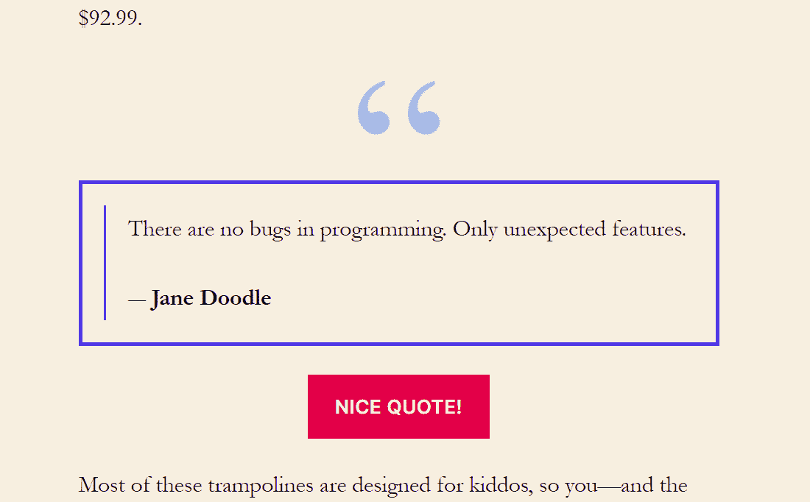

The extension plugin modifies the original quotation box


自定义动作挂钩允许你在原始插件中的正确间隔插入代码，并运行你自己的脚本。在这里，我们在顶部添加了一个图片，在底部添加了一个按钮。

同样，定制过滤器挂钩允许您修改报价内容及其作者姓名的值。最终的结果是一个任何人都可以完全扩展的插件，而不需要修改它的源代码。

### 使用来自第三方开发者的定制钩子

定制钩子使得单个的 WordPress 插件和 T2 主题拥有丰富的可扩展插件生态系统。考虑一下 WooCommerce 插件。它给 WordPress 增加了电子商务功能，但它也在代码中包含了[大量的钩子。](https://docs.woocommerce.com/wc-apidocs/hook-docs.html)

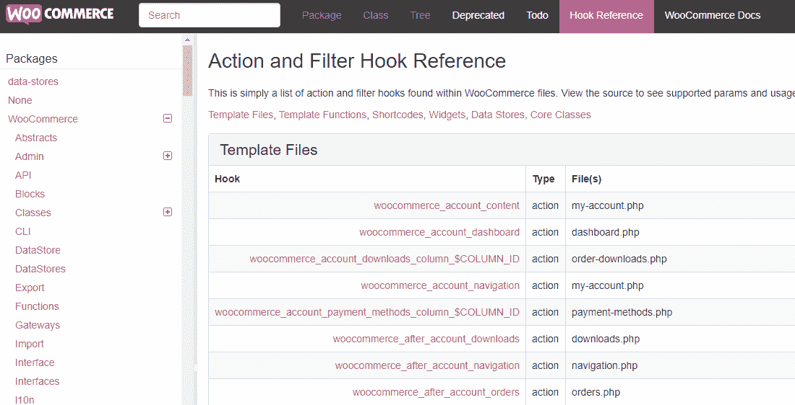

WooCommerce Action and Filter Hook Reference


WooCommerce 有数百个扩展和[插件](https://kinsta.com/blog/woocommerce-plugins/)，它们使用它的钩子来构建它的核心功能，并使它变得更好。

您可以使用这些扩展将 WooCommerce 与 Stripe、MailChimp、Salesforce、Zapier 等等集成在一起。


Extensions extend WooCommerce’s functionality


一个好的做法是查看流行的 WordPress 插件的文档部分，看看它们是如何实现定制钩子的。我的几个主要建议是[简易数字下载](https://docs.easydigitaldownloads.com/article/559-developers-intro-to-easy-digital-downloads)、 [BuddyPress](https://codex.buddypress.org/developer/buddypress-hooks-actions-filters/) 、[测验和调查大师](https://quizandsurveymaster.com/docs/developer/hooks-and-filters/)和[重力表格](https://docs.gravityforms.com/category/developers/hooks/)。

### 何时使用定制挂钩？

根据你正在创建的的[主题](https://kinsta.com/blog/themeforest-pros-cons/)或[插件，以及它的目标用户，你可能想知道你是否需要添加任何自定义挂钩。](https://kinsta.com/blog/publish-plugin-wordpress-plugin-directory/)

在决定是否添加自定义挂钩时，一个很好的经验法则是检查它们是否为其他开发人员提供了任何可扩展性好处。如果没有，那么最好等到其他开发人员要求您添加时再添加。

你需要非常确定在你的插件或者主题中加入定制的钩子。一旦发布，如果其他开发人员已经使用了它，你就不能在不破坏向后兼容性的情况下修改它。

## 从 WordPress 钩子中移除回调函数

您已经看到了如何删除注册到某些钩子的回调函数的例子。这些回调可以被插件，主题，甚至是 WordPress 核心本身注册。让我们用更多的例子来看看移除挂钩的回调函数。

要从钩子中移除回调函数，取决于它是注册到一个动作还是一个过滤器，您需要使用`**remove_action()**`或`**remove_filter()**`函数。

有一点需要注意的是，您需要使用与注册回调函数相同的参数来调用这些函数。基本上，从它们的`**add_action()**`或`**add_filter()**`函数复制粘贴参数。

此外，您只能在注册回调函数后删除它们。如果您试图在注册之前删除它们，删除过程将会失败。你需要得到钩子的正确执行顺序。

假设你想删除一个主题注册的回调函数，这个函数会增加你站点的臃肿([你想要一个快速的站点](https://kinsta.com/learn/speed-up-wordpress/)，不是吗？).

```
function wp_bloated_callback_function() {    
// some code that adds a lot of bloat to the site
}
add_action( 'template_redirect', 'wp_bloated_callback_function', 5 );
```

例如，上面的回调函数可能会加载许多不必要的脚本和样式表。移除它会给你的网站带来巨大的性能提升。

然而，你需要确保`**remove_action()**`函数只在[模板重定向](https://developer.wordpress.org/reference/hooks/template_redirect/)动作之后运行。一种方法是挂钩到 [after_setup_theme](https://developer.wordpress.org/reference/hooks/after_setup_theme/) 动作，因为它在`**template_redirect**`动作之后被触发。

```
function wp_remove_bloat() {
    // ensure all parameters are identical to the original add_action() function
    remove_action( 'template_redirect', 'wp_bloated_callback_function', 5 );
}

// ensure that remove_action() is called only after add_action()
add_action( 'after_setup_theme', 'wp_remove_bloat' );
```

`**wp_bloated_callback_function()**`现在将从`**template_redirect**`动作中脱离。

### 移除回调函数的特殊情况

移除回调函数不仅仅是完全禁用它们。有时您可能需要临时移除它们，运行您的代码，然后再次添加它们。

例如，每次调用`**wp_insert_post()**`和`**wp_publish_post()**`函数时，都会触发 [save_post](https://developer.wordpress.org/reference/hooks/save_post/) 动作。你可以在`**wp-includes/post.php**`文件中[找到它们的定义](https://core.trac.wordpress.org/browser/tags/5.4/src/wp-includes/post.php#L4135)。

因此，如果你有一个与`**save_post**`动作相关联的回调函数，并且如果你在回调函数中调用了`**wp_insert_post()**`或`**wp_publish_post()**`函数，那么`**save_post**`动作将被多次触发。

```
function some_callback_function( $post_id, $post ) {
    // do something here
    wp_insert_post( [some_array] ); // this function also calls the 'save_post' action
    // maybe do something more
}
add_action( 'save_post', 'some_callback_function', 10, 2 );
```

调用动作的函数也会调用它，这可能会产生意想不到的结果。解决这个问题的一个方法是在调用`**wp_insert_post()**`之前，在回调函数中使用`**remove_action()**`函数。

```
function some_callback_function( $post_id, $post ) {
    // do something here

    // remove the callback function from the ‘save_post’ action
    remove_action( 'save_post', 'some_callback_function', 10, 2 );

    // now run the wp_insert_post() function
    wp_insert_post( [some_array] );

    // add the callback function back to the ‘save_post’ action
    add_action( 'save_post', 'some_callback_function', 10, 2 );

    // maybe do something more
}
add_action( 'save_post', 'some_callback_function', 10, 2 );
```

这是`**remove_action()**`或`**remove_filter()**`函数的另一个实际用途。深入挖掘 WordPress 核心将帮助你理解如何更好地避免这些情况。

## 奖励 WordPress 挂钩教程

*   [手动添加代码到 WordPress 页眉和页脚](https://kinsta.com/knowledgebase/add-code-wordpress-header-footer/#how-to-manually-add-code-to-wordpress-header-and-footer)
*   [WordPress 媒体库的完整指南](https://kinsta.com/blog/wordpress-media-library/)
*   [如何创建和修改 WordPress Cron 作业](https://kinsta.com/knowledgebase/wordpress-cron-job/)
*   [如何创建 WordPress 子主题](https://kinsta.com/blog/wordpress-child-theme/#create)
*   [禁止 WordPress 插件加载到特定的页面和帖子上](https://kinsta.com/blog/disable-wordpress-plugins-loading/)
*   [禁用 WordPress 中的表情符号，代码为](https://kinsta.com/knowledgebase/disable-emojis-wordpress/#2-disable-emojis-in-wordpress-with-code)

[WordPress Hooks are one of the most important tools to have in a WordPress developer’s arsenal. 💪 Learn the difference between actions and filters (and how to use them) in this guide!Click to Tweet](https://twitter.com/intent/tweet?url=https%3A%2F%2Fkinsta.com%2Fblog%2Fwordpress-hooks%2F&via=kinsta&text=WordPress+Hooks+are+one+of+the+most+important+tools+to+have+in+a+WordPress+developer%E2%80%99s+arsenal.+%F0%9F%92%AA++Learn+the+difference+between+actions+and+filters+%28and+how+to+use+them%29+in+this+guide%21&hashtags=webdev%2Cdevelopment)

## 摘要

如果你是一个 [WordPress 开发者](https://kinsta.com/blog/hire-wordpress-developer/)，使用 WordPress 钩子有很多好处。

钩子不仅允许你修改或扩展 WordPress 的核心功能，你还可以用它们来修改插件、主题，让其他开发者与你的插件或主题交互。

是时候迷上 WordPress 钩子了！

* * *

让你所有的[应用程序](https://kinsta.com/application-hosting/)、[数据库](https://kinsta.com/database-hosting/)和 [WordPress 网站](https://kinsta.com/wordpress-hosting/)在线并在一个屋檐下。我们功能丰富的高性能云平台包括:

*   在 MyKinsta 仪表盘中轻松设置和管理
*   24/7 专家支持
*   最好的谷歌云平台硬件和网络，由 Kubernetes 提供最大的可扩展性
*   面向速度和安全性的企业级 Cloudflare 集成
*   全球受众覆盖全球多达 35 个数据中心和 275 多个 pop

在第一个月使用托管的[应用程序或托管](https://kinsta.com/application-hosting/)的[数据库，您可以享受 20 美元的优惠，亲自测试一下。探索我们的](https://kinsta.com/database-hosting/)[计划](https://kinsta.com/plans/)或[与销售人员交谈](https://kinsta.com/contact-us/)以找到最适合您的方式。