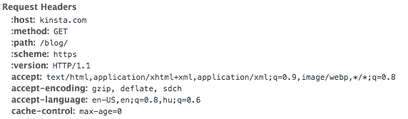

# 使用 WordPress HTTP API

> 原文：<https://kinsta.com/blog/wordpress-http-api/>

HTTP API 由一堆函数组成，这些函数将帮助你更容易地进行 HTTP 调用。不再需要摆弄 file_get_contents 或 cURL，只需要一个统一的界面。这对于与第三方 API 的交互来说是非常棒的，尤其是像 Twitter、脸书、MailChimp 等 REST-full API。

*   [HTTP 的基础知识](#basics-of-http)
*   [关于 Restful API](#restful-apis)
*   [使用 WordPress HTTP API](#wordpress-http-api)

## HTTP 的基础知识

我们以前都见过 HTTP 的运行。事实上，如果这是你有史以来第一次上网，并且这是你正在阅读的第一件东西，你已经看到了 HTTP 的神奇之处。HTTP 是一种网络协议，用于通过互联网传送所有文件和数据(资源)。

这个等式基本上有两个部分:HTTP 请求和 T2 HTTP 响应，或者说事务。请求和响应在结构上非常相似，它们都有四个部分:

*   第一行
*   零个或多个标题行
*   空行
*   可选的正文内容

### 初始线

请求使用初始行发送三条信息:方法名、路径和 HTTP 版本。例如，当查看 Kinsta 博客主页时，您会在请求的第一行看到这一点。

```
GET /blog/ HTTP/1.1
```

响应也提供了三条信息，尽管有些不同:HTTP 版本、响应代码和响应描述。当向 Kinsta 主博客发出请求时，它将发送一个 HTTP 响应，初始行如下:


> 需要在这里大声喊出来。Kinsta 太神奇了，我用它做我的个人网站。支持是迅速和杰出的，他们的服务器是 WordPress 最快的。
> 
> <footer class="wp-block-kinsta-client-quote__footer">
> 
> 
> 
> <cite class="wp-block-kinsta-client-quote__cite">Phillip Stemann</cite></footer>

[View plans](https://kinsta.com/plans/)

```
HTTP/1.0 200 OK
```

### 头球

标头包含关于请求或响应的各种信息。HTTP 1.1 定义了 46 种类型的报头，但只有一种是必需的(仅对于请求)，“主机”报头。请看一下我的 Chrome 开发者工具的截图，它显示了一些随请求一起发送到 Kinsta 主博客的标题:

[T2】](https://kinsta.com/wp-content/uploads/2015/07/Screen-Shot-2015-07-22-at-13.48.11.png)

### 身体

正文通常包含关于所请求资源的数据。如果您向 Kinsta 主博客发送 GET 请求，您应该会收到在正文内容中呈现页面(资源)所需的 HTML。

### 更多信息

这就是你现在需要知道的关于 HTTP 的全部内容。我们将主要关注方法名(GET、POST 等)、头和主体。如果你想了解更多，我推荐[詹姆斯·马歇尔对 HTTP](http://www.jmarshall.com/easy/http/) 的解释，这是一本非常好的满足你 HTTP 需求的入门书。

## 关于 Restful APIs

Restful APIs，或 REST 方法论，旨在提供一种简单和标准的方式来与应用程序交互(在这里你可以了解更多关于 WordPress REST API 的[基础知识)。它通常与 HTTP 结合使用，以创建一个非常容易理解的交互系统。它基于**路径**和 **HTTP 动词**](https://kinsta.com/blog/wordpress-rest-api/)

HTTP 动词和我们前面看到的方法名一样，最常见的有:GET、POST、PUT、DELETE。我认为 PUT 是这里唯一有歧义的，把它当成一个更新命令。当这些动词和路径一起使用时，我们可以构建一个有意义的系统:

`GET /post/1/`将用于检索 ID 为 1 的帖子。`DELETE /post/1/`会被用来删除同一个帖子。我们也可以使用`PUT /post/1/`来更新它，在请求体和头中提供相关信息。

我确信你可以看到，仅仅通过在上面的代码中添加一个 HTTP 版本，我们实际上就有了一个 HTTP 事务的初始行，这只是这个系统如此强大的一个原因。


## 使用 WordPress HTTP API

有了这些知识，我们可以很容易地理解 WordPress HTTP API 是如何工作的。用于发出请求和拦截响应的四种方法是:

*   `wp_remote_get()`
*   `wp_remote_post()`
*   `wp_remote_head()`
*   `wp_remote_request()`

前两个函数是不言自明的，它们在请求中分别使用 GET 和 POST 方法。第三个函数使用了 HEAD 方法，这个我们还没讲过。此方法用于仅检索响应的标头。如果我们只需要一些关于资源的元数据，这可以节省很多开销。最后一个函数是一个通用函数，您可以在函数的参数中指定您想要使用的方法。

我们可以使用另外五个函数来检索响应的特定部分。这些基本上是浏览我们收到的大量数据的捷径:

*   `wp_remote_retrieve_body()`
*   `wp_remote_retrieve_header()`
*   `wp_remote_retrieve_headers()`
*   `wp_remote_retrieve_response_code()`
*   `wp_remote_retrieve_response_message()`

### 我们的第一个 HTTP 请求

让我们通过从 Kinsta 博客中检索标题信息来做一个快速测试。你可以在一个插件或主题中的任何地方这样做，但是你显然应该在一个测试环境中，以确保你不会在一个活动的站点上输出不想要的文本。

## 注册订阅时事通讯


### 想知道我们是怎么让流量增长超过 1000%的吗？

加入 20，000 多名获得我们每周时事通讯和内部消息的人的行列吧！

[Subscribe Now](#newsletter)

```
$response = wp_remote_head( 'https://kinsta.com/blog/' );
var_dump( $response )
```

正如您从下面得到的响应中看到的，body 部分是空的(因为我们使用了 HEAD 方法),并且显示了所有的标题。为了只获取头部而不获取所有其他数组成员，我们可以使用`wp_remote_retrieve_headers()`函数。

```
array (size=5)
  'headers' => 
    array (size=13)
      'server' => string 'nginx' (length=5)
      'date' => string 'Wed, 22 Jul 2015 14:22:07 GMT' (length=29)
      'content-type' => string 'text/html; charset=UTF-8' (length=24)
      'connection' => string 'close' (length=5)
      'vary' => string 'Accept-Encoding' (length=15)
      'x-pingback' => string 'https://kinsta.com/xmlrpc.php' (length=29)
      'x-powered-by' => string 'HHVM/3.8.0' (length=10)
      'link' => string '; rel="https://github.com/WP-API/WP-API"' (length=68)
      'x-frame-options' => string 'DENY' (length=4)
      'x-content-type-options' => string 'nosniff' (length=7)
      'strict-transport-security' => string 'max-age=31536000' (length=16)
      'x-kinsta-cache' => string 'HIT' (length=3)
      'content-encoding' => string 'gzip' (length=4)
  'body' => string '' (length=0)
  'response' => 
    array (size=2)
      'code' => int 200
      'message' => string 'OK' (length=2)
  'cookies' => 
    array (size=0)
      empty
  'filename' => null
```

### 理解 API

[T2】](https://kinsta.com/wp-content/uploads/2015/07/twitter-wordpress-api.png)

我认为开发人员面临的最大障碍是他们需要投入大量的新东西来使 API 调用正常工作。您需要了解 HTTP，如何发出请求，以及如何正确地进行身份验证，否则每个调用都会失败。让我们通过 Twitter API 看一个例子，因为他们有很好的文档。

我们将关注[仅应用认证](https://dev.twitter.com/oauth/application-only)(这是一个更简单的流程)，我将经历 Twitter 建议的相同步骤。在我们开始之前，请确保[创建了一个 Twitter 应用](https://apps.twitter.com/)。

你应该可以把下面的代码添加到一个主题或者插件中，但是，像以前一样，确保使用一个测试站点！

#### 步骤 1:对消费者密钥和秘密进行编码

一旦你创建了一个应用程序，你应该手头有一个消费者密钥和秘密。为了使事情变得简单，让我们创建为我们保存这些信息的常量。

```
define( 'TWITTER_CONSUMER_KEY', '12disnir382jeqwdasd23wdasi' );
define( 'TWITTER_CONSUMER_SECRET', '23wdajskduhtrq2c32cuq9r8uhuf' )
```

文档中列出了创建编码版本的三个步骤:

Struggling with downtime and WordPress problems? Kinsta is the hosting solution designed to save you time! [Check out our features](https://kinsta.com/features/)

*   URL 编码消费者密钥和消费者秘密
*   用冒号将它们连接起来
*   Base64 编码整个字符串

在 PHP 中，这很容易做到，开始吧！

```
 $key = urlencode( TWITTER_CONSUMER_KEY );
$secret = urlencode( TWITTER_CONSUMER_SECRET );
$concatenated = $key . ':' . $secret;
$encoded = base64_encode( $concatenated ); 
```

#### 步骤 2:获取不记名令牌

您不用使用实际的密码，而是向 Twitter 发送您的编码字符串(它使用您的 API 凭证),然后您会收到一个在一定时间内有效的临时通行证。为此，我们将发出一个 HTTP 请求，下面是 Twitter 要说的:

*   该请求必须是 HTTP POST 请求。
*   该请求必须包含值为 Basic 的授权头。
*   该请求必须包含值为 application/x-www-form-urlencoded 的 Content-Type 标头；字符集=UTF-8。
*   请求的正文必须是 grant_type=client_credentials。

让我们从基础开始。我们知道我们需要一个 POST 请求，所以我们将使用`wp_remote_post()`。该函数采用参数；第一个是 URL，第二个包含可选参数。URL 将是`https://api.twitter.com/oauth2/token`，我们将使用第二个参数来处理所有其他需求。

```
$args = array(
    'headers' => array(
        'Authorization' => 'Basic ' . $encoded,
        'Content-Type' => 'application/x-www-form-urlencoded;charset=UTF-8'
    ),
    'body' => 'grant_type=client_credentials'
);
$response = wp_remote_post( 'https://api.twitter.com/oauth2/token', $args ); 
```

标头需要作为数组添加，标头类型是键，值是数组成员的值；正文应该是一个字符串。如果成功，您应该会看到类似下面的响应。

```
array (size=5)
  'headers' => 
    array (size=23)
      'cache-control' => string 'no-cache, no-store, must-revalidate, pre-check=0, post-check=0' (length=62)
      'content-disposition' => string 'attachment; filename=json.json' (length=30)
      'content-encoding' => string 'deflate' (length=7)
      'content-length' => string '142' (length=3)
      'content-type' => string 'application/json;charset=utf-8' (length=30)
      'date' => string 'Wed, 22 Jul 2015 14:47:37 GMT' (length=29)
      'expires' => string 'Tue, 31 Mar 1981 05:00:00 GMT' (length=29)
      'last-modified' => string 'Wed, 22 Jul 2015 14:47:37 GMT' (length=29)
      'ml' => string 'A' (length=1)
      'pragma' => string 'no-cache' (length=8)
      'server' => string 'tsa_b' (length=5)
      'set-cookie' => string 'guest_id=v1%3A14375720938219946; Domain=.twitter.com; Path=/; Expires=Fri, 21-Jul-2017 14:47:37 UTC' (length=100)
      'status' => string '200 OK' (length=6)
      'strict-transport-security' => string 'max-age=631138519' (length=17)
      'x-connection-hash' => string 'd8b10926f99dwef93rd7edbe5a71a97a' (length=32)
      'x-content-type-options' => string 'nosniff' (length=7)
      'x-frame-options' => string 'SAMEORIGIN' (length=10)
      'x-response-time' => string '34' (length=2)
      'x-transaction' => string 'ef0ebwefweece62ef' (length=16)
      'x-tsa-request-body-time' => string '0' (length=1)
      'x-twitter-response-tags' => string 'BouncerCompliant' (length=16)
      'x-ua-compatible' => string 'IE=edge,chrome=1' (length=16)
      'x-xss-protection' => string '1; mode=block' (length=13)
  'body' => string '{"token_type":"bearer","access_token":"AAAAAAAAAAAAAAAAAAAAAFoafQAAAAAAqg%2BxmuH83hjsod6crH5bKTUX9Arc%3D5dWpp0XCTDjyiXxMC7LDLg8JbzPdGlCsJi2R1qjY1FMksTAFyG"}' (length=155)
  'response' => 
    array (size=2)
      'code' => int 200
      'message' => string 'OK' (length=2)
  'cookies' => 
    array (size=1)
      0 => 
        object(WP_Http_Cookie)[303]
          public 'name' => string 'guest_id' (length=8)
          public 'value' => string 'v1:143757645770219946' (length=21)
          public 'expires' => int 1500648457
          public 'path' => string '/' (length=1)
          public 'domain' => string '.twitter.com' (length=12)
  'filename' => null
```

所有这些的主要亮点是可以在响应主体中找到的访问令牌。现在让我们用我们方便的 WordPress 函数来检索它。继续我们之前的示例，我们可以使用以下代码获取访问令牌:

```
$body = wp_remote_retrieve_body( $response );
$body = json_decode( $body, true );
$access_token = $body['access_token'];
```

#### 步骤 3:使用不记名令牌

最后一步就是在所有其他 API 调用中使用这个不记名令牌。我们需要将它添加为一个“授权”头，值为:`Bearer [bearer_token]`。让我们做一个简单的 API 调用，使用 [user_timeline](https://dev.twitter.com/rest/reference/get/statuses/user_timeline) 路径检索用户的最新推文。

```
$url = 'https://api.twitter.com/1.1/statuses/user_timeline.json?screen_name=danielpataki&count=3';
$args = array(
    'headers' => array(
        'Authorization' => 'Bearer ' . $access_token,
    ),
);

$response = wp_remote_get( $url, $args );
$tweets = json_decode( wp_remote_retrieve_body($response), true ) 
```

最后，`$tweets`变量将包含一个 tweets 数组。您可以使用这个数组的各种属性来显示 tweet 或操作数据。

## 结论

如你所见，使用 WordPress HTTP API 连接外部服务并不困难。今天的许多现代 API 都是围绕相同的 REST 原则构建的——一旦你学会了一个，你就会很快掌握其他 API 的窍门。

请记住，每当文档要求您使用正文时，就使用正文，当它需要标题时，就根据需要添加多个标题。然后，看响应，转换成数组，抓取你需要的数据并使用，就这么简单。

如果有人以前用过特别好或特别差的 API，或者你有一些使用 WordPress HTTP API 的技巧，请在评论中告诉我们！

* * *

让你所有的[应用程序](https://kinsta.com/application-hosting/)、[数据库](https://kinsta.com/database-hosting/)和 [WordPress 网站](https://kinsta.com/wordpress-hosting/)在线并在一个屋檐下。我们功能丰富的高性能云平台包括:

*   在 MyKinsta 仪表盘中轻松设置和管理
*   24/7 专家支持
*   最好的谷歌云平台硬件和网络，由 Kubernetes 提供最大的可扩展性
*   面向速度和安全性的企业级 Cloudflare 集成
*   全球受众覆盖全球多达 35 个数据中心和 275 多个 pop

在第一个月使用托管的[应用程序或托管](https://kinsta.com/application-hosting/)的[数据库，您可以享受 20 美元的优惠，亲自测试一下。探索我们的](https://kinsta.com/database-hosting/)[计划](https://kinsta.com/plans/)或[与销售人员交谈](https://kinsta.com/contact-us/)以找到最适合您的方式。