# 如何修复 WordPress HTTP 错误(上传图片到媒体库)

> 原文：<https://kinsta.com/blog/wordpress-http-error/>

与任何平台一样，总有一些恼人的错误或问题需要您学习如何解决。相信我们，我们几乎都看过了！从[白屏死亡](https://kinsta.com/blog/wordpress-white-screen-of-death/)到[数据库连接错误](https://kinsta.com/blog/error-establishing-a-database-connection/)，WordPress 绝对有它的怪癖。😉但是我们还是爱它！今天我们将深入探讨一个更常见的错误，即 **HTTP 错误**。当用户试图上传图片或视频到 WordPress 媒体库时，通常会遇到这种情况。

虽然 HTTP 错误通常很容易修复，但它可能相当令人沮丧，因为它通常会中断您的工作流。没有什么比花 20 分钟试图为你的博客帖子找到完美的图片更糟糕的了，你去上传它，然后砰，你突然遇到一个非常模糊的错误。

下面我们将探讨为什么会出现这个错误，以及如何快速解决这个问题，以便您可以继续上传您的媒体。

## 什么是 WordPress HTTP 错误？

当试图使用内置媒体库工具上传图片或视频时出错，就会出现 WordPress HTTP 错误。不幸的是，与我们通常可以引用一个 [HTTP 状态码](https://kinsta.com/blog/http-status-codes/)的浏览器错误不同，WordPress 错误有时更难解决(特别是如果你不知道[如何启用 WordPress 调试模式](https://kinsta.com/blog/wordpress-debug/))。

非常模糊的“HTTP 错误”肯定不能帮助您确定什么可能是错误的，甚至不能帮助您确定从哪里开始查找。但这是因为失败可能有几个原因，WordPress 只是不知道为什么，所以它抛出一个一般的错误信息(如下所示)。

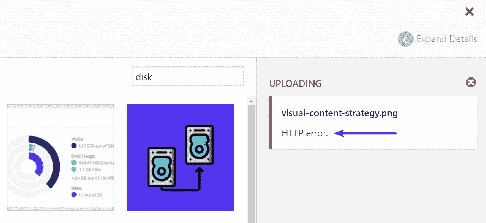

WordPress HTTP error when uploading images


## 如何修复 WordPress HTTP 错误

根据我们的经验，WordPress HTTP 错误通常源于两件事:第一件是**客户端或用户错误**(你的登录会话，文件名中的错误字符，等等。)，第二个是你的 WordPress 主机上的**问题或者设置(服务器问题，内存列表，第三方插件，共享主机节流资源等。).因此，我们将深入了解这两者。**

以下是一些建议和需要检查以修复错误的事项(按我们看到的最常见原因排序):

1.  [刷新页面](#refresh-page)
2.  [缩小或调整文件大小](#shrink-resize-file)
3.  [重命名图像文件](#rename-file)
4.  [暂时停用插件和主题](#disable-plugins-theme)
5.  [询问你的 WordPress 主机](#ask-wordpress-host)
6.  [增加 PHP 内存限制](#increase-php-memory-limit)
7.  [检查上传文件夹权限](#uploads-folder-permissions)
8.  [移动到 PHP 的最新版本](#latest-php-version)
9.  [修复 Imagick 和共享主机的性能问题](#performance-imagick-shared-hosts)
10.  [删除自定义媒体库路径](#remove-custom-media-library-path)
11.  [禁用 mod_security](#disable-mod-security)
12.  [安装添加到服务器插件](#add-to-server-plugin)

### 1.刷新页面

当遇到 WordPress HTTP 错误时，你应该做的第一件事就是简单地刷新浏览器中的页面。听起来太简单了，对吗？😉事实上，这是我们见过的最常见的修复方法。原因如下:

首先，不管什么原因，你的浏览器**可能暂时失去了与 WordPress 的连接**,这个过程无法完成。这可能是由于你的 ISP，你的 WordPress 主机暂时出现问题，等等。如果您刷新页面并尝试再次上传，错误有时会自行解决。

第二，我们也看到有时候在刷新页面后，或者从另一个标签页回到 WordPress 编辑器，它会突然把你踢出去。这很可能表明你的 WordPress **登录会话已经过期**。您应该会看到以下消息:

> 您的会话已过期。请登录，从您离开的地方继续。

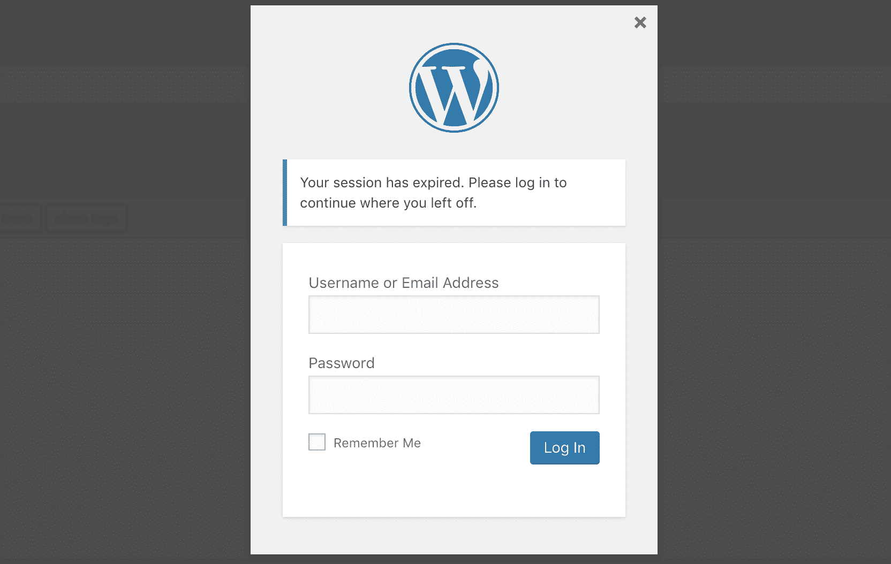

Your session has expired


因此，很自然地，您重新登录并尝试再次上传您的媒体。但是，会出现 HTTP 错误。这是 WordPress 的一个怪癖。一旦你重新登录，你实际上需要**手动刷新你所在的页面**。然后再上传媒体就可以了。

### 2.缩小或调整文件大小

你可能需要编辑你的图像文件，这可能需要**减小文件大小** (KB 或 MB)或者**减小宽度/高度**(像素)。我们建议查看我们关于如何[优化网页图片](https://kinsta.com/blog/optimize-images-for-web/)的深度文章。当你的图片上传到媒体库时，有很多第三方的图片优化插件可以自动为你做这件事(缩小和调整大小)。

我们已经在我们的 Kinsta 网站上使用了 [Imagify](https://wordpress.org/plugins/imagify/) 多年，从未出现过任何问题。但是也有很多其他伟大的人。只要确保无论你使用哪个插件，他们都是在他们自己的服务器上优化图像，而不是在本地。如果你在本地批量优化图片，这会严重影响你网站的性能。

[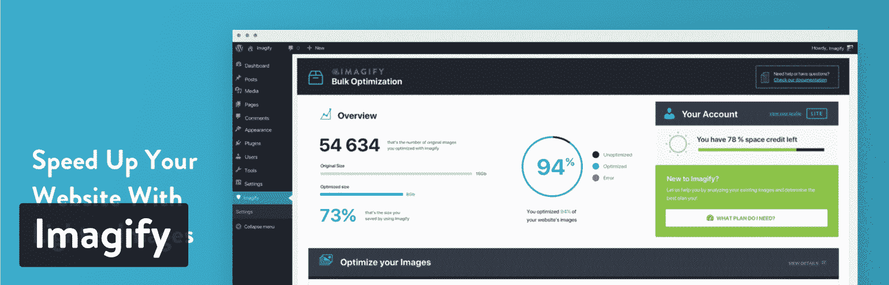](https://wordpress.org/plugins/imagify/)

Imagify WordPress plugin


上传高分辨率图像是可以的，因为 WordPress 支持开箱即用的响应图像。事实上，你可能想让图像在视网膜显示器上看起来清晰。但是，除非你是一个需要高分辨率图像的摄影师或企业，否则一个好的经验法则是将最终图像大小保持在 100 KB 以下，并且不超过网站内容 div 宽度的两倍。

此外，您可能必须处理 PNG 和 JPG 文件类型。有时一个可能比另一个大得多，这取决于它是什么类型的图像。

根据你的 WordPress 主机的配置，你可能也想考虑增加 WordPress 最大上传文件大小。

### 3.重命名图像文件

尝试重命名[图像文件](https://kinsta.com/blog/image-file-types/)不会有什么坏处。如果你试图上传一个重复的文件名，WordPress 会自动在末尾添加一个数字，但是如果这不起作用，请尝试重命名你的文件。不幸的是，WordPress 不允许你重命名已经上传的图片文件，所以你需要在本地重命名并重新上传。

当我们上传已经存在的图像时，我们通常会在末尾添加-1 或-2(例如:image-file-1.png，image-file-2.png)。一定要加上破折号，否则谷歌会把它当成一个单词来读，这会伤害到你的搜索引擎优化。

此外，为了安全起见，不要上传文件名包含特殊字符的图像。这包括国际语言符号和字符，如撇号。破折号可以。在下面这个例子中，你可以看到在 Kinsta 日语网站上，我们使用英语作为文件名，而不是特殊字符。虽然 WordPress 在技术上可以支持这些，但是还有很多其他的问题可能会出现。

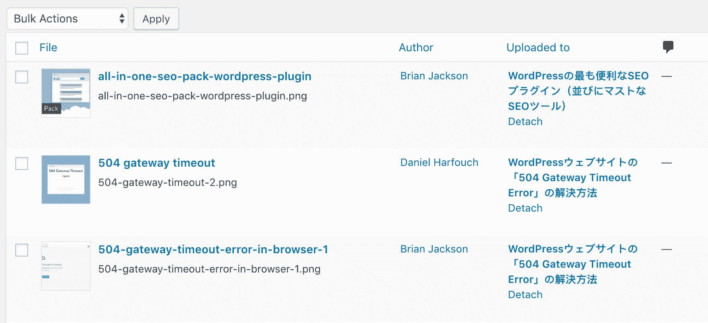

Rename image file with no special characters


### 4.暂时停用插件和主题

如果你有 HTTP 错误，试着**停用你的插件**，甚至[将你的 WordPress 主题切换到默认的](https://kinsta.com/blog/reset-wordpress/)，看看这是否能解决问题，这总是一个好主意。一些典型的插件包括图像优化插件(它们直接绑定到媒体库)和安全插件，如 WordFence(这些插件有时限制太多)。或者你可以简单地[删除你的主题](https://kinsta.com/blog/wordpress-delete-theme/)。

如果您不想影响您的实时站点，只需将您的实时站点克隆到一个[临时环境](https://kinsta.com/help/staging-environment/)。如果 WordPress HTTP 错误也发生在 staging 上，那么你可以迅速[关闭你所有的插件](https://kinsta.com/knowledgebase/disable-wordpress-plugins/)开始缩小范围。

请记住，如果你只是简单地停用一个插件，你不会丢失任何数据。如果您仍然可以访问您的管理员，一个快速的方法是浏览到“插件”,并从批量操作菜单中选择“停用”。这将禁用您的所有插件。


Deactivate all plugins


如果这解决了问题，你需要找到罪魁祸首。开始逐个激活它们，并尝试在媒体库中再次上传图像。当您看到 HTTP 错误返回时，您已经找到了行为不端的插件。然后你可以向插件开发者寻求帮助，或者在 WordPress 知识库中发布一张支持票。

如果你[不能访问 WordPress admin](https://kinsta.com/blog/locked-out-of-wordpress-admin/) ，你可以通过 FTP 进入你的服务器，将你的插件文件夹重命名为类似于`plugins_old`的名字。然后再次检查您的网站。如果成功了，那么你需要一个接一个的测试每个插件。将你的插件文件夹重新命名为`plugins`，然后一个接一个地重新命名它里面的每个插件文件夹，直到你找到它。你也可以试着先在[的集结地](https://kinsta.com/help/staging-environment/)复制这个。


Rename plugin folder


这同样适用于你的 WordPress 主题。通常主题不会绑定到媒体库，但是我们已经看到了一些奇怪的设置。试着将你的主题切换到默认的 T2 主题，看看是否能修复它。就像插件一样，你不必担心丢失当前的主题设置。所有这些都存储在 [WordPress 数据库](https://kinsta.com/knowledgebase/wordpress-database/)中。

### 5.询问你的 WordPress 主机

如果你已经尝试了上面的步骤，仍然得到 WordPress HTTP 错误，我们建议**在继续之前向你的 WordPress 主机**寻求帮助。许多额外的故障诊断步骤稍微高级一些，很多时候你可以让你的主机为你做或检查。

Kinsta 的支持团队可从 MyKinsta 仪表盘的右下角全天候为您服务。

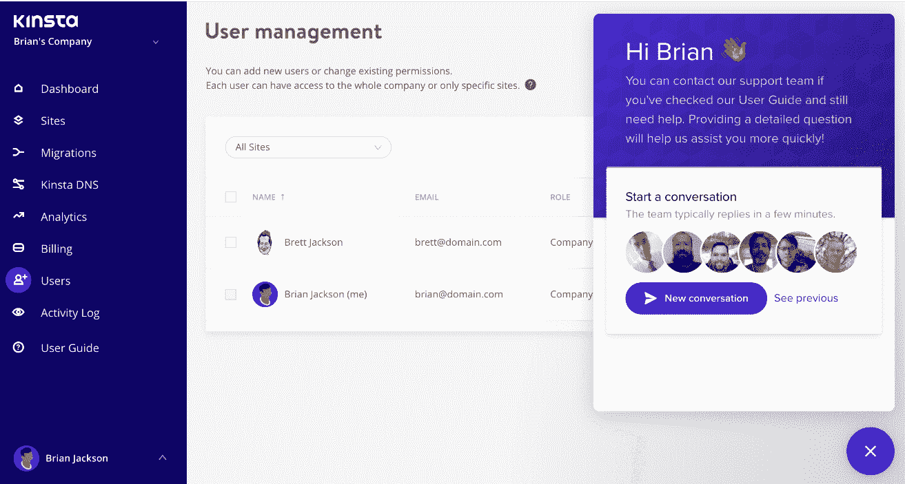

Kinsta WordPress hosting support


### 6.增加 PHP 内存限制

WordPress HTTP 错误的另一个原因是您的**服务器缺少后台上传过程成功完成的可用内存**。这是共享 WordPress 主机的一个常见问题。要解决这个问题，你需要增加 PHP 可以使用的内存量。**推荐 256 MB。**

Kinsta 客户端的默认内存限制已经设置为 256 MB。如果你把你的 WordPress 站点放在 Kinsta，你应该不会有内存不足的问题。👍

**用 wp-config.php 增加 PHP 内存限制**

您可以通过向您的`wp-config.php`文件添加以下代码来[增加 PHP 内存限制](https://kinsta.com/knowledgebase/wordpress-memory-limit/)。注意:这可能会被你的 WordPress 主机的服务器级规则覆盖。

```
define( 'WP_MEMORY_LIMIT', '256M' );
```

**增加 cPanel 中的 PHP 内存限制**

如果您的主机使用 cPanel，您可以在两个不同的区域增加 [PHP 内存限制](https://kinsta.com/knowledgebase/php-memory-limit/)。

第一个是在软件部分。点击“选择 PHP 版本”点击“切换到 PHP 选项”然后，您可以单击“memory_limit”来更改其值。

第二个区域也在软件部分下。单击“MultiPHP INI 编辑器”工具。这允许您修改`php.ini`文件。只需向下滚动到显示“memory_limit”的位置，然后输入一个更大的值。

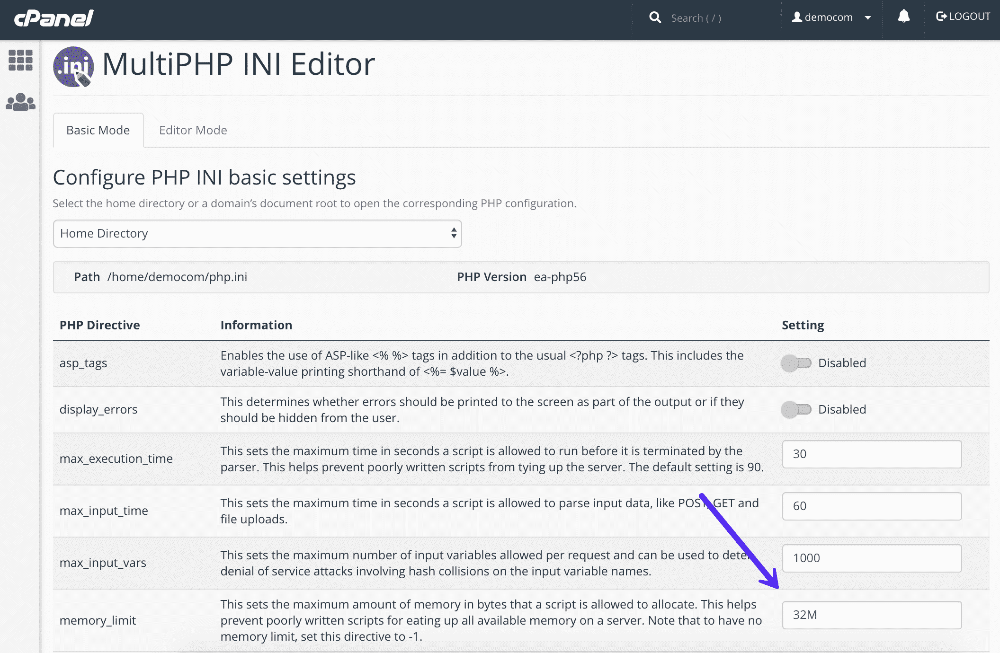

Increase PHP memory limit in cPanel


**用 php.ini 增加 PHP 内存限制**

## 注册订阅时事通讯


### 想知道我们是怎么让流量增长超过 1000%的吗？

加入 20，000 多名获得我们每周时事通讯和内部消息的人的行列吧！

[Subscribe Now](#newsletter)

如果您没有使用 cPanel，如果您有权限，也可以直接编辑`php.ini`文件。为此，[通过 FTP](https://kinsta.com/knowledgebase/how-to-use-sftp/) 或 [SSH](https://kinsta.com/blog/how-to-use-ssh/) 登录到你的站点，转到你站点的根目录，打开或创建一个`php.ini`文件。

不能通过 SSH 连接？了解如何修复 SSH“连接被拒绝”错误。

如果文件已经存在，搜索“memory_limit”设置，并根据需要进行修改。

一些共享主机可能还要求您在您的`.htaccess`文件中添加 suPHP 指令[，以使上面的`php.ini`文件设置生效。为此，编辑您的`.htaccess`文件，也位于您的站点的根目录下，并在文件顶部添加以下代码:](https://kinsta.com/knowledgebase/wordpress-htaccess-file/)

```
<IfModule mod_suphp.c> 
suPHP_ConfigPath /home/yourusername/public_html
</IfModule>
```

增加 PHP 内存限制。htaccess

`.htaccess`文件是一个特殊的[隐藏文件](https://kinsta.com/blog/show-hidden-files/)，它包含各种可以用来修改服务器行为的设置，一直到特定的目录级别。如果您没有访问`php.ini`的权限，我们建议您接下来试试这个。首先，[通过 FTP](https://kinsta.com/knowledgebase/how-to-use-sftp/) 或 SSH 登录你的网站，看看你的根目录，看看那里是否有一个`.htaccess`文件。

如果有，您可以编辑该文件并修改“php_value memory_limit”值。

### 7.检查上传文件夹权限

通常当有一个文件夹权限错误时，你会在 WordPress 中得到一个消息，告诉你它不能写入目录。然而，情况可能并不总是如此。如果一个 WordPress 网站被黑客攻击或者感染了恶意软件，可能会有很多权限问题。


> 这里需要给一个大喊。Kinsta 太神奇了，我用它做我的个人网站。支持是迅速和杰出的，他们的服务器是 WordPress 最快的。
> 
> <footer class="wp-block-kinsta-client-quote__footer">
> 
> 
> 
> <cite class="wp-block-kinsta-client-quote__cite">菲利普·斯坦曼</cite></footer>

[查看计划](https://kinsta.com/plans/)

提示: **Kinsta 为所有客户提供免费的黑客补丁**。😄

您关心的主文件夹是您的`/wp-content/uploads`文件夹，因为这是通过媒体库上传文件时存储文件的地方。

根据 [WordPress Codex](https://codex.wordpress.org/Changing_File_Permissions) ，所有的**目录应该都是 755** (drwxr-xr-x)或者 750。

你可以用一个 [FTP 客户端](https://kinsta.com/blog/best-ftp-clients/)轻松查看你的文件夹权限(如下图所示)。你也可以联系你的 WordPress 主机支持团队，让他们快速检查你的文件夹和文件的权限，以确保设置正确。

如果手动更新此文件夹的权限，请确保选中“递归到子目录”选项和“仅应用于目录”

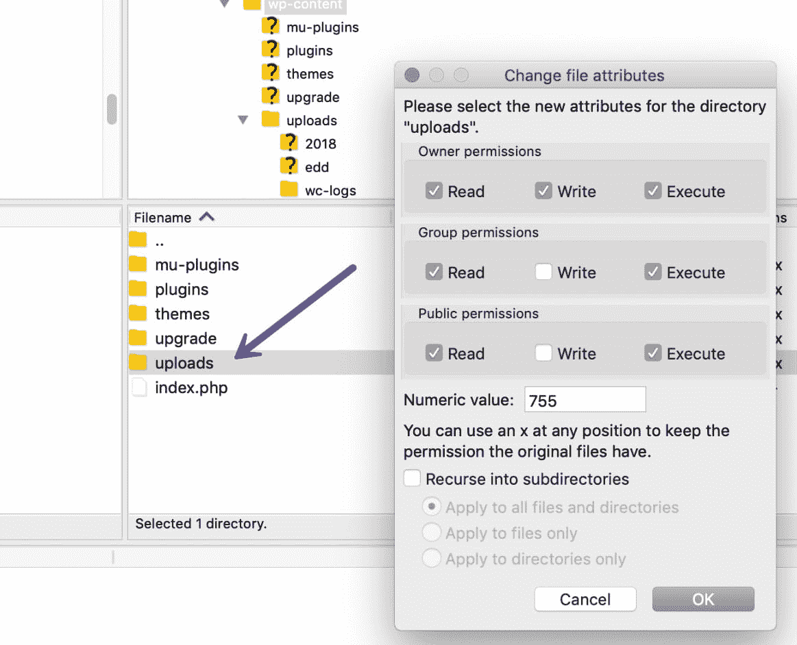

WordPress uploads directory permissions


### 8.移动到 PHP 的最新版本

WordPress 官方[推荐 PHP 7.3 以上](https://wordpress.org/about/requirements/)。如果你没有在上面运行，你就低于 CMS 开发者设定的最低要求。😮

Struggling with downtime and WordPress problems? Kinsta is the hosting solution designed to save you time! [Check out our features](https://kinsta.com/features/)

我们总是建议运行 PHP 的最新版本和[支持的版本，因为它为**提供了更好的安全性和性能**，包括错误修复和需要废弃的功能。](https://kinsta.com/blog/php-versions/)

我们已经看到旧版本的 PHP 导致了各种各样的错误，包括臭名昭著的 WordPress HTTP 错误。在 Kinsta，只需在 MyKinsta 仪表板上点击一下，就可以轻松地[切换到 PHP 8.1](https://kinsta.com/feature-updates/php-8-1/) 。

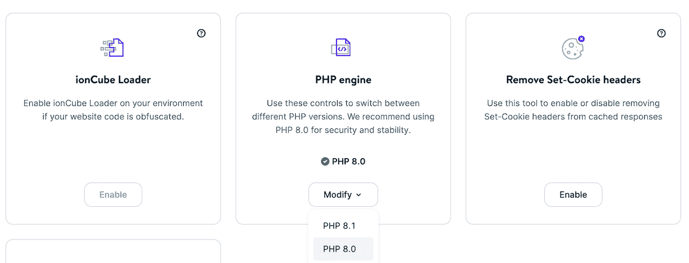

Change to PHP 8.1


如果您的主机使用 cPanel，他们可能已经为您提供了更改 PHP 版本的选项。只需登录 cPanel，在“软件”类别下点击“选择 PHP 版本”

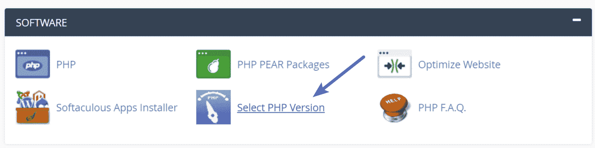

Select PHP version


然后，您可以选择您的主机支持的可用 PHP 版本。


PHP 7 in cPanel


### 9.修复 Imagick 和共享主机的性能问题

WordPress 用于图像处理的 PHP 模块有两种:GD 库和 Imagick (ImageMagick)。取决于你的服务器上安装了什么，WordPress 可能使用任何一种。

问题是**共享 WordPress 主机在幕后有很多隐藏的资源节流**。这是他们在同一台机器上容纳如此多用户的唯一方法。人们遇到的一个常见问题是分配给 Imagick (ImageMagick)的资源太少。主机将限制使用多线程的能力，从而导致 WordPress HTTP 错误。

您可以将以下代码添加到您的`.htaccess file`的顶部，将线程限制值更改为更高的值。

```
MAGICK_THREAD_LIMIT 1
```

另一个选择是告诉 WordPress 使用 GD 库而不是 Imagick。你可以通过简单地将下面的代码添加到你的主题的`functions.php`文件中来实现。

```
function wpb_image_editor_default_to_gd( $editors ) {
$gd_editor = ‘WP_Image_Editor_GD’;
$editors = array_diff( $editors, array( $gd_editor ) );
array_unshift( $editors, $gd_editor );
return $editors;
}
add_filter( ‘wp_image_editors’, ‘wpb_image_editor_default_to_gd’ );
```

我们就直说了。如果你不得不像这样调整事情**，是时候转移到一个新的 WordPress 主机**了。Kinsta 没有像这样疯狂的限制，在大多数情况下，你只会受到 [PHP 工作人员](https://kinsta.com/blog/php-workers/)的限制。作为网站所有者，你不应该担心这些类型的事情。

我们利用 LXD 托管主机，并为每个站点编排 LXC 软件容器。这意味着每一个 WordPress 站点都被放置在它自己的独立容器中，容器中有运行它所需的所有软件资源(Linux，Nginx，PHP，MySQL)。这些资源是 100%私有的，不会在任何人之间共享，甚至不会在你自己的网站上共享。

阅读更多关于[Kinsta 如何不同于](https://kinsta.com/why-us/)你尝试过的任何其他主机。

### 10.删除自定义媒体库路径

很可能是您的媒体库路径设置不正确。当用户将他们的本地开发站点迁移到生产时，我们通常会看到这种情况。如果你在 WordPress 仪表盘的“设置”下的“媒体”中找到一个列出的文件路径值，继续删除它并点击“保存更改”您希望您的媒体存储在默认的`/wp-content/uploads`文件夹中。

下面是它通常的样子。如果你没有看到一个图书馆路径，那么你在这里都很好。


WordPress media settings


### 11.禁用模块安全性

Mod_security 是一个开源防火墙，有时可能会导致 WordPress HTTP 错误发生。您可以通过将以下代码添加到您的`.htaccess`文件的顶部来禁用 mod_security。

```
<IfModule mod_security.c>
SecFilterEngine Off
SecFilterScanPOST Off
</IfModule>
```

如果你正在使用 cPanel，你也可以通过点击“安全”部分的“ModSecurity”来禁用它。

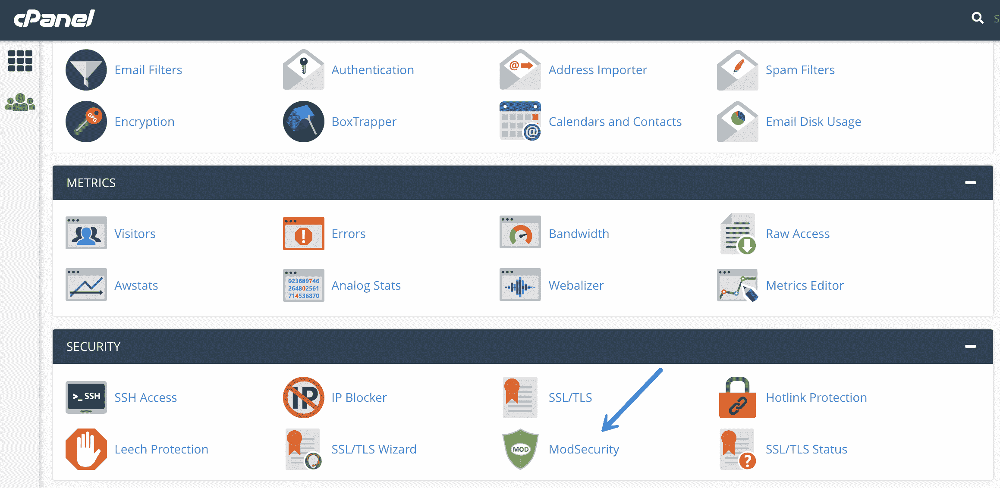

cPanel ModSecurity


然后在您要禁用的域旁边将状态从“开”切换到“关”。

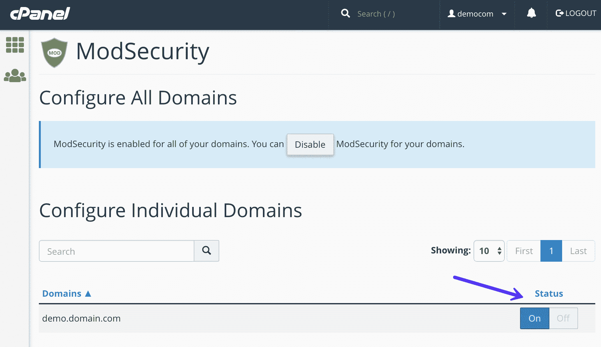

Disable mod_security


我们总是建议使用企业级且价格合理的 WAF，如 [Sucuri](https://kinsta.com/blog/sucuri-firewall/) 或 [Cloudflare](https://kinsta.com/knowledgebase/install-cloudflare/) 来代替。你可以在这里阅读我们对[最佳晶圆设置的推荐](https://kinsta.com/blog/cloudflare-settings-wordpress/#firewall)。

### 12.安装从服务器添加插件

最后但并非最不重要的是，如果你真的陷入困境，并且其他东西似乎都不起作用，你可以安装免费的 [Add From Server](https://wordpress.org/plugins/add-from-server/) 插件。也许你正在等待你的 WordPress 主机或者开发者关于如何解决 WordPress HTTP 错误的回复。

[](https://wordpress.org/plugins/add-from-server/)

Add From Server WordPress plugin


添加到服务器插件通常会让你绕过错误，并可能是一个很好的临时修复，特别是如果你正处于重要的事情当中。它最初是为了让你通过 SFTP 添加非常大的文件而开发的。**重要提示:**不再维护或支持该插件。使用风险自担。

## 摘要

正如你所看到的，有很多不同的方法来修复 WordPress HTTP 错误。希望上面的一个解决方案对你有用，你已经回到正轨并上传你的媒体了。如果你继续一次又一次地收到这个错误，可能是时候考虑升级到更好的 WordPress 主机了。以上很多解决方案都是你在 Kinsta 不用担心的事情。

如果你找到了一个不在我们列表中的解决方案，请在下面留下评论，我们会将其添加到列表中。

* * *

让你所有的[应用程序](https://kinsta.com/application-hosting/)、[数据库](https://kinsta.com/database-hosting/)和 [WordPress 网站](https://kinsta.com/wordpress-hosting/)在线并在一个屋檐下。我们功能丰富的高性能云平台包括:

*   在 MyKinsta 仪表盘中轻松设置和管理
*   24/7 专家支持
*   最好的谷歌云平台硬件和网络，由 Kubernetes 提供最大的可扩展性
*   面向速度和安全性的企业级 Cloudflare 集成
*   全球受众覆盖全球多达 35 个数据中心和 275 多个 pop

在第一个月使用托管的[应用程序或托管](https://kinsta.com/application-hosting/)的[数据库，您可以享受 20 美元的优惠，亲自测试一下。探索我们的](https://kinsta.com/database-hosting/)[计划](https://kinsta.com/plans/)或[与销售人员交谈](https://kinsta.com/contact-us/)以找到最适合您的方式。