# 如何正确使用 WordPress 图标字体(更好的性能)

> 原文：<https://kinsta.com/blog/wordpress-icon-fonts/>

在早期，图标很容易获得，但是在 WordPress 中有效地实现它们有点困难。你可以绕过精灵的一些问题，但它们并不总是一个好的前进方式，随着视网膜屏幕开始出现，这个问题被放大了(相当字面上)。

解决这个问题最常见的方法之一是使用图标字体。图标是网络字体或矢量，所以你可以无限地缩放它们，一个文件可以容纳很多图标，大大减少你的请求数量。这允许你使用几乎任何你能想到的图标。然而，随之而来的还有一些性能方面的考虑。

在这篇文章中，我们将向你展示使用 WordPress 图标字体的几种不同的方法，从哪里获得它们，以及哪种方法最适合你的网站。

*   [在哪里可以找到图标字体](#find-icon-fonts)
*   [快速简单地使用图标字体](#easy-way-font-icons)
*   [图标字体需要考虑的性能问题](#performance-icon-fonts)
*   [本地托管图标字体(仅您需要的字体)](#host-icon-fonts-locally)
*   [图标字体无障碍问题](#icon-fonts-accessiblity-concerns)

## 在哪里可以找到图标字体

现在有很多好地方可以为你的 WordPress 站点找到图标字体。只要在谷歌上输入“图标字体”就会给你带来一些很棒的结果。其中最流行最广泛使用的就是[字体牛逼](https://fontawesome.com/)。写这篇文章时，它有 1400+的免费图标，以及 4500+的专业版图标。它包括几乎所有的图标，从界面，到社交，箭头和许多其他类型的图标。

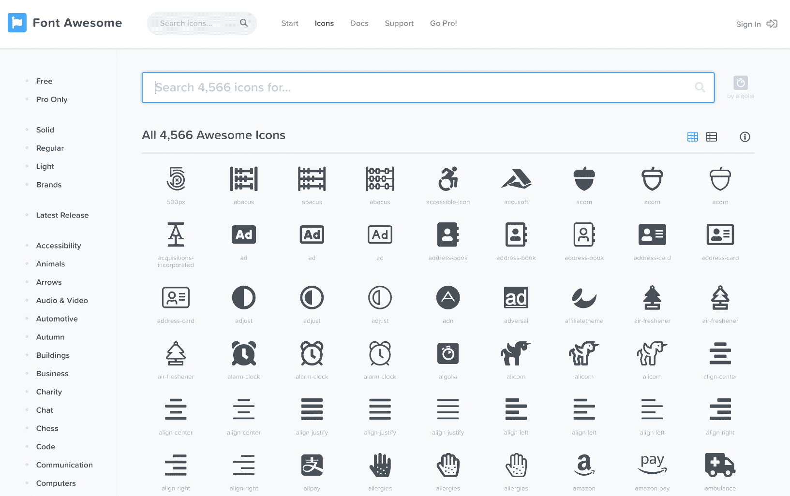

Font Awesome icons


以下是一些其他的例子:

*   IcoMoon 是另一个受欢迎的服务，有 5500 多个免费矢量图标和 4000 多个高级图标。事实上，我们将在下面进一步使用他们的图标字体生成器工具。
*   [Fontello](http://fontello.com/) 是另一项帮助你发现和构建图标字体的伟大服务。
*   如果你正在寻找一个超级轻量级的图标集，一定要看看[字节大小](https://danklammer.com/bytesize-icons/)。所有 84 个图标的尺寸都缩小到 9KB(SVGZ 或 Gzipped 为 2 KB)。
*   如果你想简单地手动使用 SVG 图标，你不会找到比 [iconmonstr](https://iconmonstr.com/) 更好的免费库或者比 [Iconfinder](https://www.iconfinder.com/) 更好的高级库。

## 快速简单地使用 WordPress 字体图标

首先，我们将深入一些使用 WordPress 字体图标的快速简单的方法。公平的警告，并不是所有这些都是最好的性能。为此，我们建议直接跳到关于[最佳方法](#host-icon-fonts-locally)的部分。


### 选项 1-使用 WordPress 插件

使用 WordPress 字体图标最快的方法就是使用第三方插件。免费的 [Font Awesome 集成插件](https://wordpress.org/plugins/font-awesome-integration/)包含最新的 Font Awesome 5 图标库。安装并激活它后，只需一个简单的短代码就可以插入一个图标。他们现在甚至有了一个 WordPress 图标！相当酷。

你可以查看字体 Awesome 5 的[基本使用图](https://fontawesome.com/how-to-use/on-the-web/referencing-icons/basic-use)，了解更多使用和定制它的方法，以及它们的图标库。例如，下面我们在一个[古腾堡](https://kinsta.com/blog/gutenberg-wordpress-editor/)短代码块中插入了 WordPress 字体牛逼图标，并添加了`fa-3x`使其变大三倍。

```
[fawesome iclass="fab fa-wordpress fa-3x"]
```

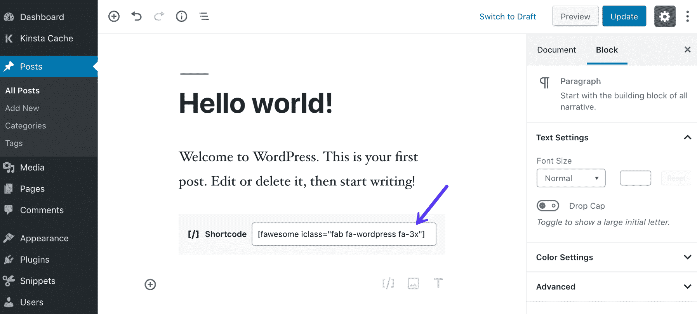

Font Awesome shortcode in Gutenberg


这是它在前端的样子。很简单，对吧？几分钟之内，我们的网站上就出现了一个字体很棒的图标。

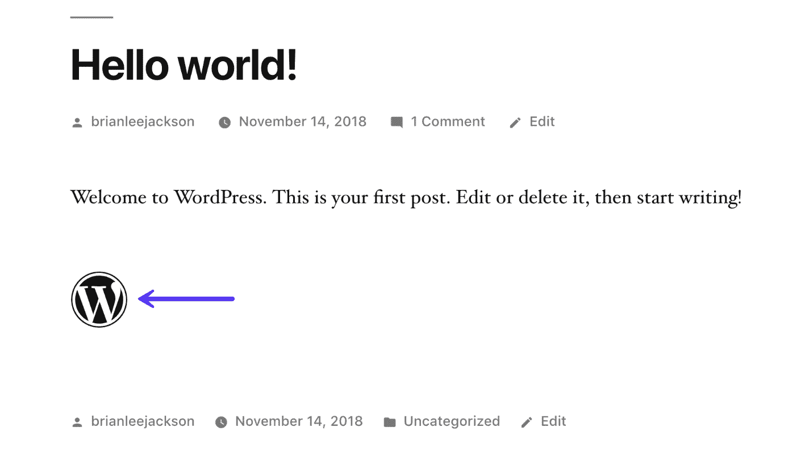

Font Awesome example in WordPress 5.0


如果你想要很多易于使用的短代码，你可能也想看看[短代码终极插件](https://wordpress.org/plugins/shortcodes-ultimate/)。他们有一个高级图标插件，你可以使用。

如果你想让你的客户在文章或页面上添加图标，以上是一个很好的解决方案，但是如果你想在你的主题或插件中使用这些元素，最好自己将它们排队(将在下面深入讨论)。

### 选项 2–使用内置的大图标

dashicon 是一组默认包含的字体图标，因为 WordPress 在后台使用它。你需要将它放在前端，但是你需要的只是脚本的名字，这个文件已经可以被 WordPress 使用了。

你可以将以下内容添加到你的`functions.php`文件中，或者我们建议你使用一个免费插件，比如[代码片段](https://wordpress.org/plugins/code-snippets/)。这最小化了破坏你的主题的风险，并且在主题更新的过程中这些改变也是持久的。

```
function my_theme_styles() {
wp_enqueue_style( 'dashicons' );
}
```

然后你可以进入[dashicon 网站](https://developer.wordpress.org/resource/dashicons/)，选择一个图标，点击“复制 HTML”链接，它会给你显示图标所需的代码。他们没有太多的选择，但是他们仍然工作的很好，并且非常轻便。

```
<span class="dashicons dashicons-admin-post"></span>
```

例如，下面我们在一个 [Gutenberg](https://kinsta.com/blog/gutenberg-wordpress-editor/) HTML 块中插入了仪表板图标。

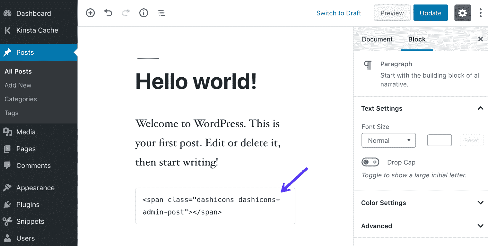

Dashicons in Gutenberg HTML block


这是它在前端的样子。

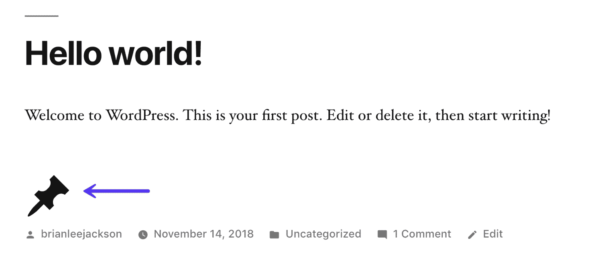

Example of Dashicons in WordPress 5.0


Dashicons 没有任何现成的很酷的短代码，但是你可以用 [CSS](https://kinsta.com/blog/wordpress-css/) 定制图标的大小。这是一个在标题前插入图标的例子。

```
<h2 class="dashicons-before dashicons-smiley">My Cool Headline</h2>
```

### 选项 3–手动链接到外部托管的图标字体

第三种选择是手动链接到外部托管的图标字体。这就是上面选项 1 中的插件在幕后所做的事情。

对于字体牛逼，你可以从他们的[起始页](https://fontawesome.com/start)抓取代码，然后按照下面的步骤操作。他们在 [CDN](https://kinsta.com/blog/wordpress-cdn/) 上为你免费托管他们所有的字体。它看起来会像这样:

```

```

**第一步**

将代码复制到你的 WordPress 站点上想要使用字体 Awesome 的每个模板或页面的`<head>`中。你可以编辑你的主题的`header.php`文件，或者更好的是，跟随我们关于[如何添加代码到你的头](https://kinsta.com/knowledgebase/add-code-wordpress-header-footer/)的简单教程。

**第二步**

然后，您可以开始在 HTML 的`<body>`中放置图标。[找到合适的图标](https://fontawesome.com/icons?d=gallery)并学习如何[将它添加到你的页面](https://fontawesome.com/how-to-use/on-the-web/referencing-icons/basic-use)。

## 使用图标字体时要考虑的性能问题

虽然使用上述方法之一在你的网站上添加图标字体并没有错，但从技术上来说，这并不是最好的方法。为什么？这一切都归结于**性能问题**。

### 你可能不需要所有这些图标

首先，当你使用一个图标字体插件或者链接到一个外部图标字体库时，它会加载整个库中的所有图标。如果你在整个网站上只使用 20 个左右的图标，这可以用一种更好的方式来处理。

[Do you really need all those icons? Probably not. 😉 So don't load all of them on your WordPress site.Click to Tweet](https://twitter.com/intent/tweet?url=https%3A%2F%2Fkinsta.com%2Fblog%2Fwordpress-icon-fonts%2F&via=kinsta&text=Do+you+really+need+all+those+icons%3F+Probably+not.+%F0%9F%98%89+So+don%27t+load+all+of+them+on+your+WordPress+site.&hashtags=webperf%2Cdesign)

例如，我们在我们的网站上包含了字体 Awesome 5 库，虽然它的 CSS 文件很小，但字体文件本身有 108 KB。虽然这看起来没那么大，但是当我们只选择我们实际使用的 [HTML 字体](https://kinsta.com/blog/html-fonts/)时，你会在下面看到文件实际上变得有多小。

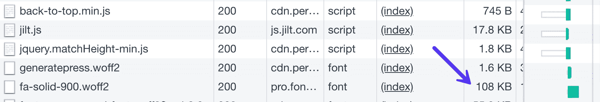

Large Font Awesome library


### 从一个 CDN 加载通常更快

第二，从不同的 cdn 加载脚本没有错。但是，如果您可以选择从一个 CDN 加载它，这通常会更快。为什么？因为它可以利用单个 [HTTP/2](https://kinsta.com/learn/what-is-http2/) 连接，并减少额外的 [DNS 查找](https://kinsta.com/blog/reduce-dns-lookups/)。只要保证你的主 CDN 是好的就行了！

## 本地托管图标字体(仅您需要的字体)

由于上面提到的性能原因，我们将向您介绍如何在本地托管图标字体，以及只使用您需要的字体。我们所说的本地是指从你的 WordPress 主机服务器或者你自己的 CDN 上加载它们。

通过只选择你需要的图标字体，这可以将文件大小从 100 KB 降低到几千字节，非常方便！更好的是:你甚至可以混合搭配不同字体的图标。

### 基础——它是如何工作的

使用字体图标包括托管字体文件(WOFF，WOFF 2 等。)，然后[使用 CSS](https://kinsta.com/blog/wordpress-css/) 加载字体，然后创建一些标记将图标添加到正确的位置。

虽然您的站点将加载单个文件，但实际上，由于一些浏览器使用不同的格式，因此每种字体都有多种文件格式。字体真棒有 6 种不同的文件格式包括:EOT，SVG，TTF，WOFF，WOFF 2 和 OTF。然而，基于浏览器支持，你真的只需要 WOFF 或 WOFF 2。

提示:93%以上的现代浏览器都支持 WOFF。然而，WOFF 2 压缩程度更高，但只有 83%以上的现代浏览器支持 T2。我们建议选择一个或另一个或两者都选。浏览器将根据您的代码决定将哪一个交付给客户端。

你的第一个任务是使用工具只选择你想要的图标。然后，您可以将这些文件添加到项目目录中的某个位置，通常在 fonts 目录中。

接下来，将字体 Awesome CSS 文件添加到项目中，并使用常规的旧 link 元素将其添加到网站中。

## 注册订阅时事通讯


### 想知道我们是怎么让流量增长超过 1000%的吗？

加入 20，000 多名获得我们每周时事通讯和内部消息的人的行列吧！

[Subscribe Now](#newsletter)

```

```

你也可以将 CSS 文件入队，或者如果它很小，简单地使用它内联。

如果你查看 CSS 文件，你可以看到后台发生了什么。加载字体文件，定义类为`.fa`的基本元素(以及其他一些元素)，最后定义每个命名图标(例如:。fa-book)。

你唯一需要注意的是字体文件的路径。默认情况下，它们是从`../fonts`加载的，这将是字体目录，比当前 CSS 文件高一个文件夹。您可能需要对此进行更改，以适应您自己的目录结构。

现在你对它的工作原理有了更好的了解，我们将一步一步地教你如何去做。在这个例子中，我们使用一个生产电子商务网站。

### 第一步

首先，你应该确定你想要使用的字体图标库。我们在本文开头分享了几个我们喜欢的。在本例中，我们将使用 Font Awesome 和 [IcoMoon](https://icomoon.io/) 字体生成器。如果你想从 IcoMoon 获得 WOFF 2 的文件，你必须一次性支付 9 美元才能进入他们的高级图书馆。

你可以免费手动下载你想要的字体图标，但你需要使用类似于 [FontForge](http://fontforge.github.io/en-US/) 的工具来手动编辑他们的 WOFF 或 WOFF 2 文件。我们都很容易，所以我们使用发电机。

### 第二步

前往 [IcoMoon 发电机](https://icomoon.io/app/#/select/library)。我们在字体牛逼库上点击“添加”。

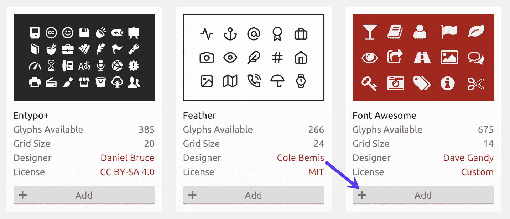

IcoMoon Font Awesome library


### 第三步

接下来，你需要选择你想在你的 WordPress 站点上使用的图标。如果你已经在使用字体牛逼，只是简单地转移到本地托管的版本，浏览并制定一个简短的列表，然后从库中选择它们。

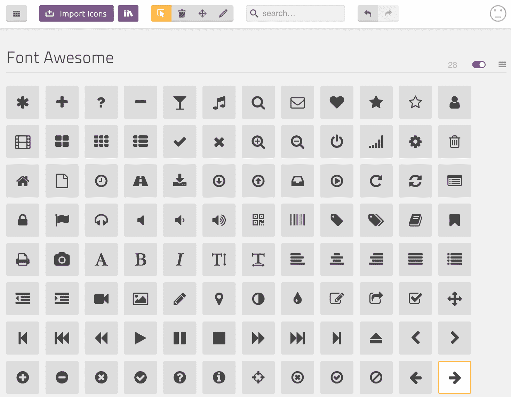

Choose Font Awesome icons


在这个例子中，我们选择了一个 WordPress 电子商务网站 [perfmatters.io](https://perfmatters.io) 的图标，这个网站提供简单的数字下载。

### 第四步

一旦你选择了所有的图标，选择底部的“生成字体”。对于这个网站，我们最终需要 20 个图标。

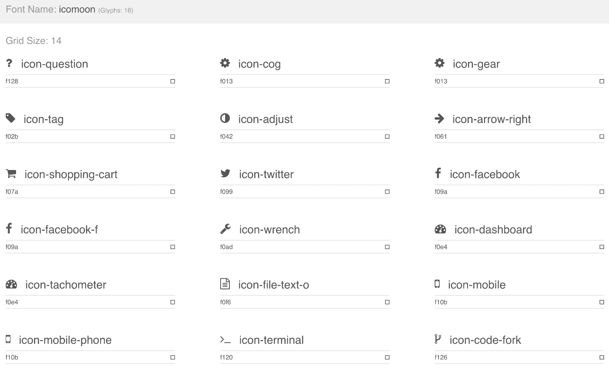

Font Awesome icons from IcoMoon export


您将得到类似这样的文件。你需要的最重要的是`style.css`文件和字体文件(WOFF，WOFF 2)。

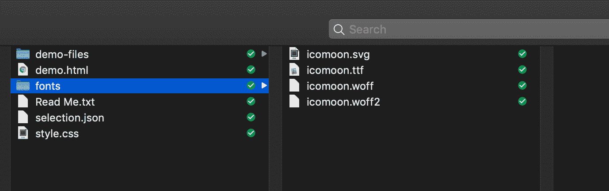

Icon font files


### 第五步

接下来，建议您在上传/复制到您的站点之前，在`style.css`中执行查找和替换。这是原来的样子。

Struggling with downtime and WordPress problems? Kinsta is the hosting solution designed to save you time! [Check out our features](https://kinsta.com/features/)


IcoMoon CSS file


对于那些已经在使用字体牛逼的人来说，这只是让他们更容易将类转换成字体牛逼类，这样如果你的 WordPress 站点上已经有一些用它编码的东西，它会自动开始使用图标。

因此，查找“icon ”,并用“fa”替换所有出现的内容。你应该能够用 Sublime 这样的[文本编辑器进行快速查找和替换。](https://kinsta.com/blog/best-text-editors/#sublime-text)

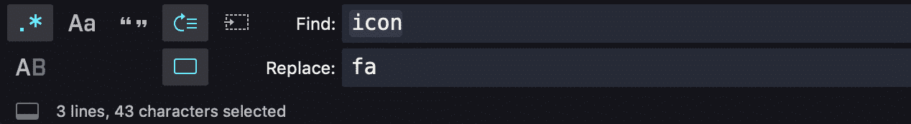

Find and replace in Sublime


这就用`[class^="fa-"], [class*=" fa-"]`代替了`[class^="icon-"], [class*=" icon-"]`。它还修复了每个图标，所以他们现在不是从`.icon-`开始，而是从`.fa-`开始。

您可能还需要根据您在步骤 7 中上传字体文件的位置来更改源 URL。**我们建议将 URL 更改为您的 CDN。**

### 第六步

接下来，您需要将 CSS 添加到您的站点中。有几种方法可以做到这一点。

**选项 1**

因为 CSS 的数量很少，你可以复制所有文件的 CSS 并粘贴到 WordPress 定制器中。不要对大文件这样做，但这是相对少量的 CSS。这意味着它将内联加载到您的网站上。

**选项 2**

你可以手动链接到你的样式表，把它放在你的 WordPress 站点的标题中。提示:在你自己的 CDN 上链接到它以获得更快的性能。

```

```

**选项 3**

你也可以在 WordPress 中给 CSS 文件排队。其过程与手工方式非常相似。将以下内容添加到你的主题的`functions.php`文件中，或者使用免费的[代码片段插件](https://wordpress.org/plugins/code-snippets/)。您可能需要根据上传位置更改目录。

```
function my_theme_styles() {
wp_enqueue_style( 'FontAwesome', get_template_directory_uri() . '/css/style.css' );
}

add_action( 'wp_enqueue_scripts', 'my_theme_styles' );
```

### 第七步

现在你已经将 CSS 添加到了你的站点中，是时候上传字体文件了。你可以把字体放在任何地方，一个名为“fonts”的文件夹直接放在你的/public 就可以了。但是请记住，您的`style.css`文件中的源文件夹需要匹配。

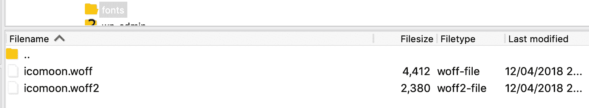

Icon font files SFTP


### 第八步

现在你的 WordPress 站点应该可以访问 CSS 和字体文件了。所以接下来，你可以添加一些标记到你的网站。这只是一个添加齿轮图标的例子。

```
<i class="fa fa-cog"></i>
```

你可以在 [perfmatters.io](https://perfmatters.io) 看到一个活生生的例子。请记住，您可以使用任何元素，而不仅仅是`i`。除了向自定义类添加 CSS 之外，您还可以使用常规的`span`元素。

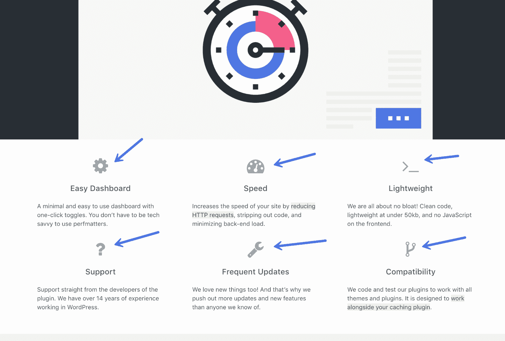

Font Awesome example on Perfmatters


真正的区别是当你看一看大小的差异。记住，当我们链接到 Font Awesome 外部库时，字体文件的总大小是 108 KB。在我们使用了字体生成器并只选择了我们网站需要的字体图标后，它将字体文件压缩到了 2.6 KB。我们的字体文件大幅缩减了 97.59%！

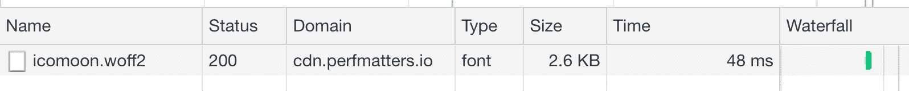

Size of WOFF 2 Font Awesome file


不仅如此，它现在还从我们的 CDN 加载，这意味着没有额外的 DNS 查询到 fontawesome.com。

[We decreased the size of our icon fonts file by a whopping 97.59% using a font generator. 🚀Click to Tweet](https://twitter.com/intent/tweet?url=https%3A%2F%2Fkinsta.com%2Fblog%2Fwordpress-icon-fonts%2F&via=kinsta&text=We+decreased+the+size+of+our+icon+fonts+file+by+a+whopping+97.59%25+using+a+font+generator.+%F0%9F%9A%80&hashtags=webperf%2Cperfmatters)

您也可以对 SVG 图标使用同样的方法，只是略有不同。

## 图标字体可访问性问题

图标字体的一个缺点是它们可怕的易访问性。屏幕阅读器可能会跳过它们，或者更糟的是，阅读 unicode 或字符本身。这将导致视力受损的人在查看您的收藏夹菜单项时听到“黄星收藏夹”,这并不理想。你还应该考虑如果字体不能加载会发生什么。

理想情况下，你会希望装饰图标在未加载时消失，如果出现问题，关键图标会被替换为文本。

可访问性问题很容易解决，只需使用`aria-hidden="true"`参数和值来指示屏幕阅读器应该丢弃我们的元素。

```
<span class="icon icon-star" aria-hidden="true"></span> My Favourites
```

在更完整的实现中，您还可以使用 Modernizr 来测试字体支持。你需要稍微修改 CSS，参见优秀的[防弹字体图标](https://www.filamentgroup.com/lab/bulletproof_icon_fonts.html)文章以获得更深入的信息。

关于创建带有文本回退的关键图标的信息，我们也推荐阅读上面的文章，他们已经尽可能好地解释和解决了这个问题，但是实现它有点超出了本文的范围。

## 摘要

这就是图标字体的全部内容。现在你知道了在你的 WordPress 站点上获得图标字体的几种不同方法，以及实现它们的最佳方式。

我们总是建议使用一个字体生成器来构建一个图标字体，只包含你所使用的图标。这将使你的主题更加流畅！如果您有我们没有提到的最喜欢的库或生成器，请告诉我们。外面有很多好的！另外，确保阅读我们关于 [WordPress 字体](https://kinsta.com/blog/wordpress-fonts/)的深入指南。

* * *

让你所有的[应用程序](https://kinsta.com/application-hosting/)、[数据库](https://kinsta.com/database-hosting/)和 [WordPress 网站](https://kinsta.com/wordpress-hosting/)在线并在一个屋檐下。我们功能丰富的高性能云平台包括:

*   在 MyKinsta 仪表盘中轻松设置和管理
*   24/7 专家支持
*   最好的谷歌云平台硬件和网络，由 Kubernetes 提供最大的可扩展性
*   面向速度和安全性的企业级 Cloudflare 集成
*   全球受众覆盖全球多达 35 个数据中心和 275 多个 pop

在第一个月使用托管的[应用程序或托管](https://kinsta.com/application-hosting/)的[数据库，您可以享受 20 美元的优惠，亲自测试一下。探索我们的](https://kinsta.com/database-hosting/)[计划](https://kinsta.com/plans/)或[与销售人员交谈](https://kinsta.com/contact-us/)以找到最适合您的方式。