# 如何使用 WordPress IFTTT 食谱来自动化你的工作流程

> 原文：<https://kinsta.com/blog/wordpress-ifttt-recipes/>

[IFTTT](https://ifttt.com/)(**if this then than**)是一种允许用户在两个或更多第三方服务之间建立连接的 web 服务。IFTTT 支持超过 [500 个 web 服务](https://ifttt.com/search/services)，并提供了一个[库](https://ifttt.com/search)，其中有数百个现成的小程序，您可以使用它们来自动化日常工作中的大量任务。“if this than that”范式意味着，如果在某个地方检测到某个事件，则在其他地方执行某个动作。

对于 WordPress 用户来说，IFTTT 意味着更少的插件安装，更多的大量网络服务连接，更高的在线活动自动化和生产力。在本帖中，我们将探讨 IFTTT 向 WordPress 用户透露的机会。首先我将向你介绍网络服务，然后我将重点介绍一些流行的 WordPress IFTTT 菜谱，最后我将向你展示如何构建一个基本的 applet 来连接 Flickr 和 WordPress。

但是在深入研究 web 服务之前，我应该提供一些常用 IFTTT 术语的定义。

## IFTTT 术语

小程序(也称为**菜谱**)是遵循**范例的自动化服务间交互的应用程序。**

**触发器**是 IFTTT 可以通过运行 applet 来响应的事件源。触发器类似于“你在一张照片中被标记了”或者“你在你的 WordPress 公共博客上发表了一篇新文章”。每个触发器要么属于第三方服务，比如 WordPress、Twitter、脸书，要么属于特定于 IFTTT 的服务。许多触发器都有触发器字段，这些字段是可以由 applet 或用户配置的参数。
WordPress 服务有两个触发器:

*   每当用户在博客上发布新帖子时，任何新帖子都会触发。
*   **带有标签或类别的新帖子**每当用户发布带有特定标签或类别的新帖子时就会触发。

**动作**是 IFTTT 作为 applet 执行的结果而执行的任务。一个动作可以是“在你的 WordPress 站点上创建一个新的草稿”或者“在 Evernote 上创建一个笔记”。像触发器一样，动作属于第三方服务或特定于 IFTTT 的服务。操作字段确定操作运行时会发生什么。
WordPress 有两个动作:

*   **创建帖子**
*   **创建照片帖子**

**成分**是小程序运行时触发器提供的特定数据。以下是 WordPress“任何新帖子”触发器的组成部分:

> Kinsta 把我宠坏了，所以我现在要求每个供应商都提供这样的服务。我们还试图通过我们的 SaaS 工具支持达到这一水平。
> 
> <footer class="wp-block-kinsta-client-quote__footer">
> 
> 
> 
> <cite class="wp-block-kinsta-client-quote__cite">Suganthan Mohanadasan from @Suganthanmn</cite></footer>

[View plans](https://kinsta.com/plans/)

*   帖子标题
*   PostUrl
*   后置内容
*   PostImageUrl
*   标签和类别
*   后期出版

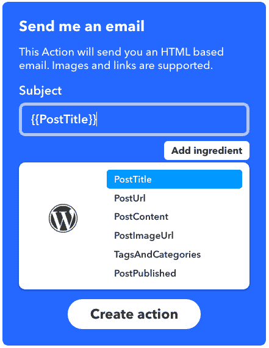

Ingredients coming back from the WordPress **“Any new post”** trigger

## IFTTT 小程序

IFTTT 允许你将你的任何社交账户和网络服务互相连接。在[网站图书馆](https://ifttt.com/search)中，你会找到健康、生产力、教育、家庭自动化等方面的食谱。但是 applet 实际上是如何工作的呢？

每个 applet 都有一个触发器和至少一个动作。触发器是小程序执行一个或多个动作的信号。以[国际空间站通知小程序](https://ifttt.com/applets/YfkYtQB2-get-a-notification-when-the-international-space-station-passes-over-your-house?s=era2)为例:每当 IIS 经过用户的位置时，它都会向任何安装了 IFTTT 应用程序的 Android 或 IOS 设备发送通知。

此小程序使用以下服务:

*   [太空](https://ifttt.com/space)，由 NASA 等提供动力。
*   IFTTT 发出的[通知](https://ifttt.com/if_notifications)

IIS 通过指定位置是触发器，“发送通知”是动作。

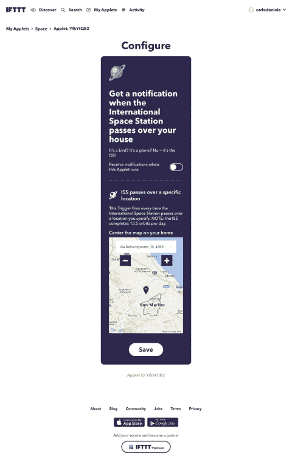

现在，打开小程序，在小程序的配置面板中设置你的位置，然后等待空间站。同时，让我们来看看 WordPress 食谱。

## IFTTT WordPress 服务

WordPress 只是 IFTTT 上众多可用网络服务中的一个，但它有很好的代表性。WordPress 部分提供了大量的小程序，你可以从中选择来自动化和加速你的博客活动，如内容创建、协作、内容共享等。以下是有用的 WordPress 小程序的简短列表:

**内容创建配方**

*   当我在 Blogger 上发帖时，在 WordPress 上发帖
*   当你在笔记本上添加新笔记时，在 WordPress 中创建一篇草稿文章

**协作配方**

*   自动分享新帖子到空闲频道
*   当你在论坛上添加新的 Trello 卡时，发表一篇博客文章

**内容分享食谱**

*   [自动分享新帖子到脸书页面](https://ifttt.com/applets/cmkT9PcQ-automatically-share-new-posts-to-a-facebook-page)(WordPress)——推荐阅读:[如何创建脸书页面](https://kinsta.com/blog/how-to-create-a-facebook-page)
*   自动在脸书上发布你的新博客
*   自动发布你的新博客文章
*   从 WordPress 自动交叉发布到 Tumblr

**生产力配方**

## 注册订阅时事通讯

### 想知道我们是怎么让流量增长超过 1000%的吗？

加入 20，000 多名获得我们每周时事通讯和内部消息的人的行列吧！

[Subscribe Now](#newsletter)

*   把新帖子存档到 Evernote 笔记本上
*   将 WordPress 的新帖子备份到 Google Drive

这是很多好东西，不是吗？此外，如果你找不到你想要的食谱，你甚至可以免费创建自己的食谱，并与社区分享。在下一段中，我将向你展示如何创建一个 applet，每当用户上传一张带有特定标签的公开照片到 Flickr 时，它就在你的 WordPress 站点上发布一份草稿。

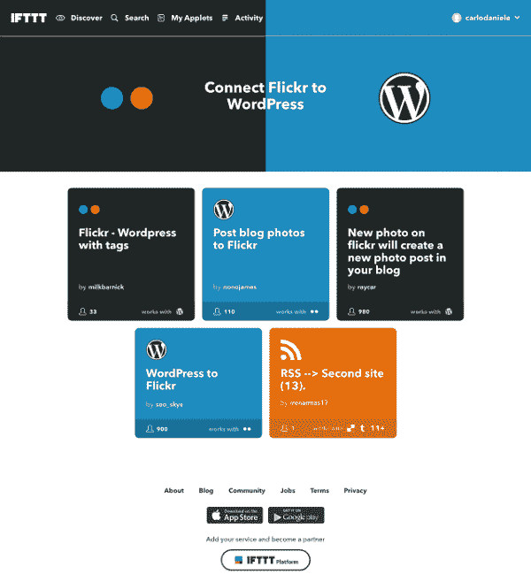

[Connect Flickr to WordPress page](https://ifttt.com/connect/flickr/wordpress)

## 规划您的第一个 IFTTT 小程序

如果你的目标是构建一个 IFTTT 小程序，你必须将你的档案从普通用户升级为[制作者](https://platform.ifttt.com/maker/)。下一步是通过回答以下问题来规划 applet:

*   哪些服务应该互相连接？
*   小程序应该响应哪个触发器？
*   应该执行哪些操作？

现在假设您想在 Flickr 和 WordPress 之间创建一个连接，这样当您上传一张公开的照片到 Flickr 时，applet 会将它发布到 WordPress，并通过 IFTTT 通知服务通知用户。我们可以对前面的问题回答如下:

*   我们必须将 Flickr 连接到 WordPress 和 IFTTT 通知服务。
*   该小程序应该响应“任何新的公共照片标签”触发器
*   applet 应该运行 Flickr 的“创建照片帖子”和“从 IFTTT 应用程序发送通知”操作

也就是说，让我们将我们的 [Flickr](https://ifttt.com/flickr) 和 [WordPress](https://ifttt.com/wordpress) 账户连接到 IFTTT web 服务。

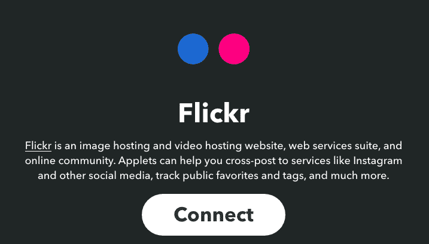

最后，我们准备构建 applet。

Struggling with downtime and WordPress problems? Kinsta is the hosting solution designed to save you time! [Check out our features](https://kinsta.com/features/)

## 构建小程序

打开您的[制造商的个人资料页面](https://platform.ifttt.com/maker/)，点击新建小程序按钮。

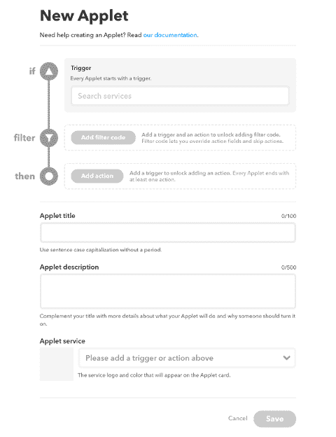

The New Applet page interface allows building any applet with no hassle

在 **New Applet** 页面的第一部分，我们将设置触发器、可选过滤器和一个或多个动作。首先，我们将输入服务名称( **Flickr** )和服务触发器(**任何标记为**的新公开照片)。
**“任何标记的新公共照片”**触发器需要一个标签，该标签可以对 applet 用户隐藏或由 applet 用户选择。在我们的示例 applet 中，我们将检查**“由用户选择”**。

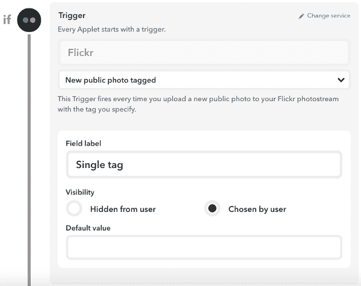

The IF section of the applet config page

> 注意:当你启用**“任何新的公共照片标签”**触发器时，只有带有指定标签的公共图片会被发布到 WordPress

接下来，我们必须添加至少一个动作，如下图所示。

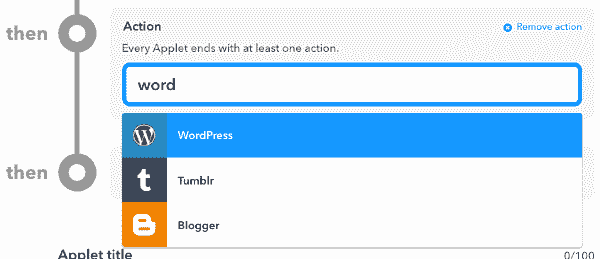

WordPress **“创建照片帖子”**动作从给定的图片 URL 在 WordPress 上创建照片帖子，并带有以下动作字段:

*   标题
*   图片 URL
*   标题
*   种类
*   标签
*   发布状态

如果您选中**“对用户隐藏”**选项，您将被允许从可用的配料中设置默认字段值。相反，如果您选中了**“由用户选择”**选项，您将不被允许向字段值添加配料。

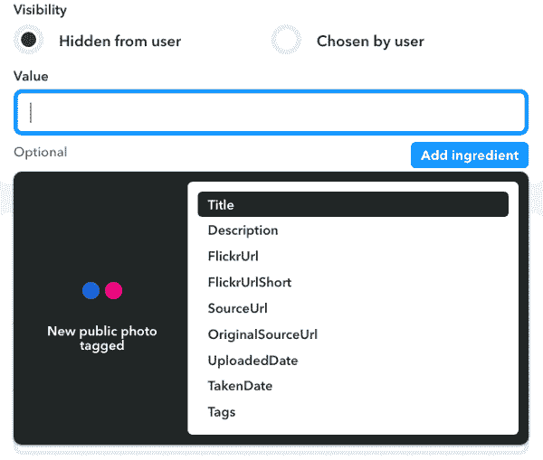

Flickr ingredients

当你完成了 WordPress 字段的设置，你可以添加更多的动作来在小程序运行时执行。因此，再次点击 **Add action** 按钮，添加通知服务。

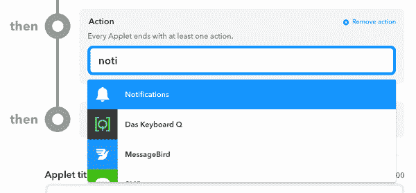

保存数据，看看**发布的小程序**页面。这个小程序目前是私有的，所以我们可以安全地检查它是否正常工作。启用小程序并配置选项。

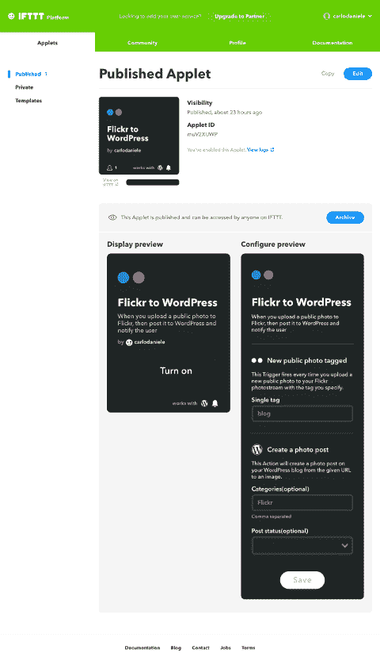

The Published Applet page shows the applet’s previews

完成后，用 applet 的**单标签**选项字段中指定的相同标签向 Flickr 添加一张新照片。最后，打开 WordPress 文章页面，寻找一个标题相同的新草稿。

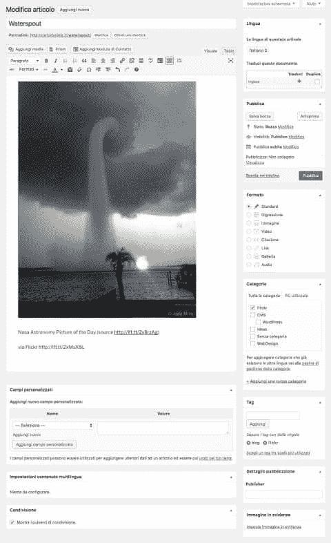

This draft has been automatically created by Flickr to WordPress

## 包扎

IFTTT 允许 WordPress 用户减少已安装插件的数量，增加与第三方网络服务的连接数量，提高博客活动的自动化和效率。你用 IFTTT 来支持你的工作吗？你曾经创建过自定义的 WordPress 食谱吗？请在评论中与我们分享你的经历。

* * *

让你所有的[应用程序](https://kinsta.com/application-hosting/)、[数据库](https://kinsta.com/database-hosting/)和 [WordPress 网站](https://kinsta.com/wordpress-hosting/)在线并在一个屋檐下。我们功能丰富的高性能云平台包括:

*   在 MyKinsta 仪表盘中轻松设置和管理
*   24/7 专家支持
*   最好的谷歌云平台硬件和网络，由 Kubernetes 提供最大的可扩展性
*   面向速度和安全性的企业级 Cloudflare 集成
*   全球受众覆盖全球多达 35 个数据中心和 275 多个 pop

在第一个月使用托管的[应用程序或托管](https://kinsta.com/application-hosting/)的[数据库，您可以享受 20 美元的优惠，亲自测试一下。探索我们的](https://kinsta.com/database-hosting/)[计划](https://kinsta.com/plans/)或[与销售人员交谈](https://kinsta.com/contact-us/)以找到最适合您的方式。