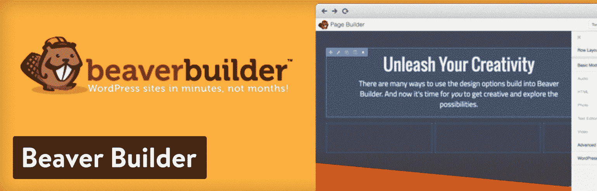
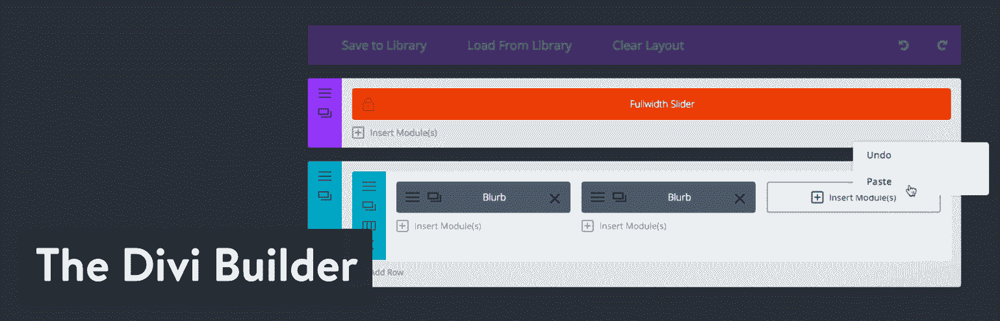
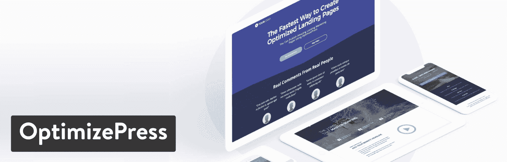
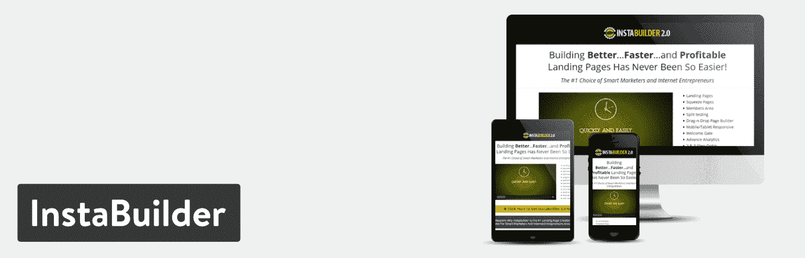
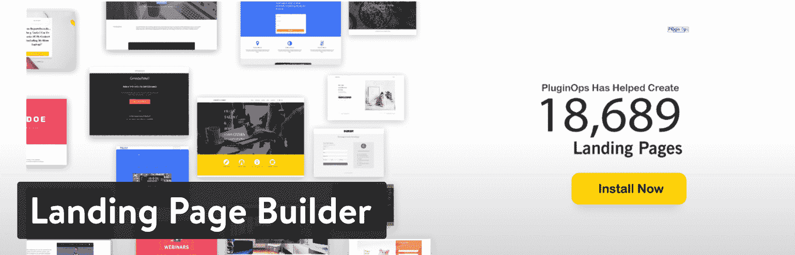
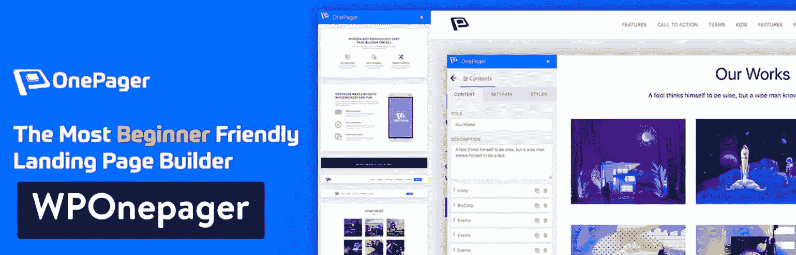

# 11 个高转化率的 WordPress 登录页面插件来增加销量

> 原文：<https://kinsta.com/blog/wordpress-landing-page-plugins/>

你的社交和谷歌广告链接到哪里？你的[电子邮件营销活动](https://kinsta.com/blog/email-marketing-best-practices/)怎么样？如果答案总是你网站的主页，或者甚至是产品页面，那么是时候停下来学习登陆页面的力量了。这些特定类型的页面清除了常规网站的混乱，旨在显著提高转化率。他们这样做是因为他们在整个销售漏斗中具有高度针对性，从广告内容到页面内容。

幸运的是，制作一个高质量的插件并不需要太多的工作或金钱，只要你使用的是一个开发良好的插件。当然，有了 WordPress，你有很多很好的选择。

*   [你为什么需要一个 WordPress 登陆页面插件？](#why-wordpress-landing-page-plugin)
*   [在登陆页面插件中寻找的特性](#features-landing-page-plugin)
*   [最佳 WordPress 登陆页面插件](#best-wordpress-landing-page-plugins)

[Quickly create targeted pages all the way down your conversion funnel. 💡 Check out these WordPress landing page plugins!Click to Tweet](https://twitter.com/intent/tweet?url=https%3A%2F%2Fkinsta.com%2Fblog%2Fwordpress-landing-page-plugins%2F&via=kinsta&text=Quickly+create+targeted+pages+all+the+way+down+your+conversion+funnel.+%F0%9F%92%A1+Check+out+these+WordPress+landing+page+plugins%21&hashtags=CRO%2Cmarketing)

## 为什么你需要一个 WordPress 登陆页面插件？

在我们深入你的登陆页面插件选项之前，让我们来看看为什么你可能想要或者需要一个。

### 1.为了提高转化率

由于登录页面旨在向访问者展示有针对性的内容，他们更有可能转化。这些类型的转换各不相同，但它们可能涉及注册一个表格，购买一个产品，或参加一个网上研讨会。无论如何，这些类型的插件可以帮助你的 CRO。

### 2.为了匹配广告中的信息

登陆页面经常会被链接到在线广告。这样做的原因是因为直接链接到您的网站主页会给客户留下关于下一步该去哪里的有限信息。然而，登陆页面准确地反映了你在广告中创建的相同信息，最大限度地减少了用户的困惑。

### 3.为了获得更多的线索

[销售线索是通过电子邮件、社交媒体和搜索流量等方式产生的](https://kinsta.com/blog/wordpress-lead-generation/)。你可以打赌，当直接发送到你的网站时，很大比例的这些线索会丢失。因此，这些链接应该被交换出来，导致一个着陆页。

### 4.提升你的搜索引擎优化

有不同类型的登录页面。其中一些可能只是 PPC，但另一些可能是为了 SEO 的目的而创建的(有时甚至两者都是)。只要你的登陆页面是关键词优化的，用户友好的，响应迅速的，他们的 T2 会帮助你的搜索引擎优化。毕竟，你发布的登陆页面越多，你在谷歌首页找到你的网站的机会就越大。然后你就可以利用有机交通的高转化率登陆页面。

### 5.收集潜在客户的信息

登陆页面的目标是捕捉潜在客户并[将其转化为转化率](https://kinsta.com/blog/conversion-tracking/)。提高转化率的一个好处是，这是客户提交数据的地方。您可以了解他们访问的页面，无论他们是在移动设备上还是在桌面上访问，等等。这样，你就可以[在未来用更好的广告、电子邮件和登陆页面重新锁定客户](https://kinsta.com/blog/ad-retargeting/)。

这里的一个警告是要小心 GDPR。如果您正在收集关于用户的任何类型的信息或像素数据，您需要始终首先征求同意。

### 6.以令人满意的方式展示营销产品

营销优惠经常与网站上的其他内容混在一起，降低了它们的整体效果。登录页面通常专注于一个或两个产品，没有任何额外的混乱。再加上营销优惠，这是刺激销售的好方法。

## 在登录页面插件中查找的功能

在你搜索完美的登陆页面插件时，你会注意到大多数最好的解决方案都有相似的特性。然而，我们也将概述特定于某些插件的工具。不管你想付多少钱，有些功能是不应该忘记的。其中一些包括:

*   **拖放元素**–有一个拖放编辑器真好。如果没有，您至少需要与登录页面相关的构建器元素。例如，计时器很棒。你还需要电子邮件订阅表格、文本、媒体和证明。
*   **预建登录页面模板**–目标是为所有产品和服务提供登录页面。正如我们所了解的，你拥有的登陆页面质量越高，你的搜索引擎优化就越好，转化率就越高。因此，您会希望借助预构建的模板来加快部署速度。然后，您可以快速调整模板以匹配您公司的品牌。
*   **A/B 测试**——没有 [A/B 测试](https://kinsta.com/blog/wordpress-ab-testing-tools/)你的整个登陆页面设计就是一个大猜谜游戏。你的按钮颜色会让人不太愿意点击吗？一个有评价的页面是有助于转化还是只会让界面变得混乱？没有 A/B 测试，你不能确定地学习。
*   **电子邮件整合**–转换和销售线索需要数据捕捉，以便将来向这些用户销售。这就是[你如何建立你的电子邮件列表](https://kinsta.com/blog/how-to-build-an-email-list/)。因此，最好的 WordPress 登录页面插件提供了与 MailChimp 和 CampaignMonitor 等电子邮件营销服务的集成。
*   **定价表**–定价表可能是拖放元素的一部分，但你不会想花钱买一个登录页面插件，然后发现你必须自己设计。
*   **媒体支持**–从视频到图像，从文档到音频，媒体项目不仅能展示更多关于您产品的信息，还能帮助那些犹豫不决的客户进行转换。

## 2019 年最佳 WordPress 登陆页面插件

我们已经研究、测试并分解了每一个值得尊敬的登录页面插件，以展示最好的功能，以及可能让你倾向于一个而不是另一个的项目。现在是时候投入进去了！

1.  [元素或](#elementor)
2.  [海狸建造者](#beaver-builder)
3.  [Divi 构建器](#the-divi-builder)
4.  [Qards](#qards)
5.  安装
6.  [优化选项](#optimizepress)
7.  [首页](#leadpages)
8.  [茁壮成长的建筑师](#thrive-architect)
9.  [InstaBuilder](#instabuilder)
10.  [登陆页面构建器](#landing-page-builder)
11.  [WPOnepager](#wponepager)

## 1.元素者

Elementor 与其他登陆页面创建者相比有一个明显的优势，那就是它的核心插件是免费下载的。现在，你可能会想，我们介绍的其他选项也有免费下载，但是 Elementor 有点不同。事实上，主拖放编辑器没有受到任何削弱。超过 100 万的活跃安装和 5 星评级，WordPress 社区喜欢这个插件！

您可以下载 Elementor builder 并开始构建登录页面，而无需使用任何代码。它适用于几乎所有的主题和插件，Elementor 的免费版本中实际上包含了几个预制的模板。

总的来说，Elementor 是启动登录页面最快的工具之一。拖放编辑器甚至可能比 Beaver Builder 更好，有很多企业会对免费插件下载提供的内容感到满意。不仅如此，溢价定价从一个网站 49 美元开始，到三个网站 99 美元，无限网站 199 美元。所以，如果你想作为一个网站所有者省钱，Elementor 比 Beaver Builder 更有意义。但是 Beaver Builder 支持 99 美元的无限站点，所以它可能更适合代理和开发者。

Elementor landing page plugin

至于主要功能，Elementor 提供了超过 24 个专业部件和 75 个专业模板。它集成了 Zapier、社交媒体渠道和电子邮件营销服务，同时还提供 WooCommerce 和表单选项。

### 是什么让这个 WordPress 登陆页面插件成为赢家？

*   Elementor 的免费版本具有无限的设计潜力，因为它是一个完整的拖放编辑器，具有流体运动和固体设计模块。您还可以获得一些模板，这样您就不必从头开始制作您的登录页面。
*   高级版起价 49 美元。它只限于一个网站，但这有助于小企业和博客保持低成本。较大的机构和开发商总是可以升级。
*   在 premium 版本中，您会收到重要的内容模块，如倒计时器、价格表、动画标题、分享按钮和表格。
*   您可以将您的小部件或完整设计保存为全局小部件。这样，您可以将小部件移动到站点的不同区域或新网站。
*   实时自定义 CSS 就在您眼前反映您的更改。对于高级开发人员来说，这也是让登录页面看起来更好的一个好方法。
*   WooCommerce 集成让您可以直接从登录页面销售产品。搭配一些专业设计的模板，你可以在几分钟内开始销售。

## 2.海狸建造者

Beaver Builder 是[页面生成器世界](https://kinsta.com/blog/wordpress-page-builders/)中最受欢迎的插件之一，不仅用于登陆页面，也用于完整的网站。您可以创建令人惊叹的布局和登录页面，加载速度快，不需要花几个小时来配置。Beaver Builder 有一个带有几个内容模块的免费版本，其中许多模块非常适合登录页面。这些内容模块包括视频、音频、文本编辑、照片、侧边栏和 HTML 选项。你也可以创建那些令人垂涎的非常有用的全宽登录页面。许多小公司用免费版制作登陆页面应该没问题，但是[高级 Beaver Builder 模块](https://www.wpbeaverbuilder.com/)也很诱人。

Beaver Builder WordPress landing page plugin

无限量网站的一年期许可费起价为 99 美元。因为它覆盖了你网络中的所有网站，大多数公司不需要升级。客户支持、页面生成器插件、高级登录页面模块和模板都打包到 99 美元的定价计划中。你唯一错过的项目包括[多站点](https://kinsta.com/blog/wordpress-multisite/)功能和 Beaver Builder 网站主题。对于这些功能，你将不得不支付 199 美元，或者如果你想要一个代理的全白标签[，则每年支付 399 美元。](https://kinsta.com/blog/wordpress-agency/)

### 是什么让这个 WordPress 登陆页面插件成为赢家？

*   Beaver Builder 努力使登陆页面尽可能简单。它提供了一个充满模板的文件，这些模板是为快速、专业的登录页面而制作的。一些登录页面模板是为像律师事务所、电子书销售网站和网络研讨会这样的利基网站制作的。
*   在免费版本中，您会收到一些不错的模板和内容模块。如果你需要更多，99 美元的升级对于你获得的功能数量来说还是可以承受的。
*   用户体验远远优于市场上大多数其他拖放编辑器。大多数内容模块可以放在任何地方，一个完全的初学者用模板和模块制作一个登陆页面应该没有问题。
*   Beaver Builder 允许您构建自己的定制模块，如果您需要的东西与提供的略有不同。
*   您可以保存、导出和重用完整的页面、布局、行和模块，以备后用。

## 3.Divi 生成器

众所周知，Divi Builder 是一个可以使用大多数 WordPress 模板的构建器。它是一个完整的网站构建器和一个优秀的 WordPress 登陆页面插件。优雅主题出售 Divi Builder，所以你需要注册一个优雅主题的会员资格，如果你想访问。这个会员资格对于那些不仅仅想要一个登陆页面插件的开发者来说是理想的。每年 89 美元的会员资格提供了对优雅主题的所有主题和插件的访问。这些是你能找到的最漂亮的主题，插件提供了从社交媒体分享到电子邮件选择的一切。

The Divi Builder plugin

优雅主题会员(和 Divi 构建器)的一个优点是，您可以获得在无限数量的站点上使用构建器(和所有其他主题和插件)的许可。因此，每年 89 美元的会员费非常便宜，尤其是对于那些拥有多个网站或客户的人。但是请记住，Divi Builder 没有免费插件。

当查看登录页面功能时，您会发现时尚而强大的拖放构建器。Divi 还提供了大约 46 个内容模块，从音频播放器到行动呼吁，从社交媒体按钮到价格表。你还会得到联系表格和电子邮件营销表格，这些表格在登陆页面游戏中非常珍贵。

### 是什么让这个 WordPress 登陆页面插件成为赢家？

*   Divi 没有免费版本，但它通过提供几十个附加插件和主题的低年费击败了大多数优质竞争对手。
*   在本文发表时，Divi 提供了 46 个内容模块，这个数字通常会随着优雅主题的不断发展而增加。
*   您可以[添加自定义 CSS](https://kinsta.com/blog/wordpress-css/) 来应用自定义样式和调整不太适合您品牌的单个模块。
*   几秒钟内复制任何元素或设计。然后将其转移到另一个网站或页面，以便在其他地方轻松开始。
*   你永远不会没有合适的登陆页面功能，主要是因为优雅的主题插件。这些选项包括电子邮件营销、电子邮件选择、社交分享等等。

## 4.Qards

Qards 是一个鲜为人知的 WordPress 登录页面插件，但是它允许你在没有任何编码技能的情况下创建令人惊叹的登录页面。Qards 的全部目的是让网站管理员能够顺利地输出登录页面。它运行在一个拖放界面上，卡片可以上下移动。每种设计都是完全响应的，许多卡都是为了简单和灵活而预先设计的。你也可以链接到你的 MailChimp 账户，把线索放入你的电子邮件数据库。

Qards landing page plugin

我们如此喜欢 Qards 的一个主要原因是因为它的无缝媒体支持。它允许 YouTube 在线和背景视频，你可以在任何你想放的地方放图片和音频剪辑。定制的 CSS 和 HTML 区域非常适合更高级的设计者，而当您试图不用任何代码来组织内容时，网格样式就派上了用场。

Qards 确实有一个针对一个领域的免费版本。这些卡和功能是有限的，但您仍然可以获得 MailChimp 集成、定制工具、预先设计的块和 Google 字体。第一个高级计划的价格为 99 美元，可以让您获得所有专业功能。

一个缺点是 Qards 似乎没有任何预构建的模板来加速您的设计过程。

### 是什么让这个 WordPress 登陆页面插件成为赢家？

*   电子邮件订阅工具和一些高质量的设计模块提供了一个免费插件。
*   一个网站 99 美元的定价还是比较合理的。
*   Qards 确实是最简单的可视化登录页面生成器之一。您不会被太多复杂的控件淹没，因为大多数设计都围绕着上下拖动项目。
*   包括几个预先设计的模块，如页脚、封面、图像、网格和菜单。
*   Qards 与 MailChimp 直接集成，为电子邮件订阅制作的模块非常漂亮。

## 5.Instapage

Instapage 的目标是将广告收入转化为转化率。它的主要产品是构建登陆页面，但也有一个完整的协作工具、页面生成器和[优化引擎](https://kinsta.com/blog/conversion-rate-optimization-tips/)。你可能已经注意到，在 A/B 测试方面，前面提到的 WordPress 登录页面插件并不多。如果这就是你想要的，Instapage 是你的最佳选择。

## 注册订阅时事通讯

### 想知道我们是怎么让流量增长超过 1000%的吗？

加入 20，000 多名获得我们每周时事通讯和内部消息的人的行列吧！

[Subscribe Now](#newsletter)

Instapage 是一整套工具，具有出色的 A/B 测试，可以看出哪些元素效果最好。您还可以获得热图来查看人们点击的位置，以及根据谁在您的网站上点击而进行的动态文本替换。

Instapage plugin

页面生成器为 CTA 按钮、视频等项目提供拖放小部件。协作工具非常适合为设计提供即时反馈，并进行实时编辑，以供组织中的其他人查看。所有的共享模块都是完全安全的，你也可以在登录页面编辑项目的同时与其他人聊天。总的来说，Instapage 拥有最令人印象深刻的功能，但它会让你付出代价。

Instapage 的核心计划起价为每月 69 美元，从实时协作到 20 个集成，你可以得到一切。在每月 99 美元的优化计划中，您将看到 A/B 测试和热图。如果你需要的话，Instapage 还出售代理和企业计划。

### 是什么让这个 WordPress 登陆页面插件成为赢家？

*   Instapage 不仅提供登录页面，还提供一整套协作、优化、报告和页面构建工具。
*   页面生成器有一个模板来满足各种需求。因此，如果你想要一个网上研讨会的登陆页面，有很多选择。如果你想卖一本电子书，它也有。事实上，Instapage 提供了超过 200 个可定制的模板，这是我们能找到的最大的库。
*   您可以访问 Bigstock 图像库，该库拥有超过 3300 万张股票图像。
*   协作工具对于那些与多人一起制作登录页面的人来说非常棒。您可以发送即时反馈并生成安全链接。我也喜欢创作者看到即时编辑。

## 6.优化抑郁

OptimizePress 是另一个登陆页面套件，类似于 Instapage。它是为那些不仅仅想要一个简单的登录页面生成器的营销人员而设计的。事实上，你可以创建登陆页面、销售页面、会员门户、发布渠道和权威博客网站。如果你不需要所有这些，跳过它。然而，97 美元的一次性费用是值得考虑的。

起初，我不太相信 OptimizePress 以这样的价格提供了如此多的功能，但该公司在提供廉价构建无限页面的选项方面做得很好。如果你对使用 A/B 分割测试更感兴趣，并获得视频背景和高级设计元素，197 美元的价格点更符合你的胃口。

OptimizePress landing page plugin

OptimizePress 脱颖而出的另一个原因是，WordPress 登录页面插件不会在每次更新期(一年)后停止工作。你唯一可以选择每年付费的是支持和更新。

当 OptimizePress 与其他一些 WordPress 登录页面插件竞争时，我最喜欢它，因为那些需要 A/B 测试但不想在 Instapage 上支付高价的人。支持团队也非常友好，所以这也是一个额外的收获。

### 是什么让这个 WordPress 登陆页面插件成为赢家？

*   97 美元的一次性费用为您提供了大多数登录页面构建功能，以及对潜在客户和流量的无限支持。
*   虽然这是最小计划的价格上涨，但 197 美元的一次性费用对于 A/B 测试和其他一些很酷的功能如页面参与动作和视频背景来说并不坏。
*   登录页面模板已经过优化，可以转换尽可能多的用户。
*   OptimizePress 为制作会员门户网站、销售页面、权威博客和发布渠道提供了额外的选项。

## 7.前导页

[LeadPages](https://www.leadpages.net/) 登录页面插件，或真正的服务，带有 130 多个基于行业的模板和简单的设计模块，用于登录页面上的弹出表单、社交媒体和联系表单等项目。LeadPages 可用于制作各种销售和登录页面，但当看到它如何与竞争对手相抗衡时，一些更独特的功能就会发挥作用。例如，LeadPages 有一个脸书广告功能，可以立即与您的广告结合，为这些社交客户制作完美的登录页面。它还提供了内置的支付功能，当你想在页面上进行销售的时候。

Leadpages

无需任何编码即可完成拖放定制，因此您可以在整个过程中创建、复制和克隆任何页面。LeadPages 定价有一个年度计划，你可以有两个月没有任何账单。最便宜的计划叫做标准计划，每月 31 美元。如果你试图通过脸书广告收取费用和增加流量，并获得一些其他优质功能，价格会飙升至每月 66 美元。

Struggling with downtime and WordPress problems? Kinsta is the hosting solution designed to save you time! [Check out our features](https://kinsta.com/features/)

一个缺点是 Leadpages 与 WordPress 的整合不如其他一些替代产品紧密。

### 是什么让这个 WordPress 登陆页面插件成为赢家？

*   拖放构建器和模板集合令人印象深刻。然而，LeadPages 更适合那些需要一些独特功能的公司，如脸书广告集成。
*   您可以直接付款，并直接从您的登录页面让客户通过结账流程。
*   LeadPages 提供每周一次的指导电话，这是任何其他 WordPress 登录页面插件都找不到的。
*   超过 160 个免费登录页面模板被打包到 LeadPages 中，使其成为较大的库之一。
*   其中一个计划有 A/B 测试。

## 8.茁壮成长建筑师

如果你熟悉 Thrive 主题，你就会知道它强大的高级插件和主题。从标题优化器到 Thrive 测验生成器，该公司知道客户想要什么，并制造出令人印象深刻的产品来满足这些需求。[茁壮成长建筑师](https://thrivethemes.com/architect/)也不例外。Thrive Architect 产品是 WordPress 的可视化编辑器和页面生成器，它的主要优点是制作登录页面的过程简单。即时拖放消除了您可能在其他页面构建器上遇到的大多数障碍，我的测试显示，很少有小故障或我无法定制元素的情况。

Thrive Architect 包含 200 多个登录页面模板，所有这些模板都经过优化，以提高您的转化率，无论您销售的是什么。销售和选择页面已全面覆盖，您甚至可以找到一些更具体的行业登录页面，用于在线研讨会和其他类似的选项。所有的设计元素都是预先构建的，包括像推荐书、倒计时器和电子邮件营销表格这样的项目。

Thrive Architect landing page plugin

与其他 WordPress 登录页面插件相比，单一站点许可证处于中间位置，所有 Thrive Architect 功能、无限制更新和一年支持的费用为 67 美元。提供了另外两种定价方案，但它们都具有相同的功能。唯一的区别是，你要花更多的钱在多个网站上使用这个插件。因此，一个包含五个许可证的包需要 97 美元，而一个包含 15 个许可证的包需要 147 美元。

Thrive Architect 的一个有趣的部分是，它试图消除网站上运行的插件数量。这样，你可以加快网站的速度，忘记管理这么多插件。例如，以下插件不再需要，因为 Thrive Architect 已经涵盖了:

*   点击以发布分享插件。
*   动画插件。
*   表格生成器插件。
*   字体图标插件。
*   自定义字体管理器插件。
*   布局的短代码插件。

Thrive Architect 有一套强大的集成，所以我认为对于那些不需要 Instapage 和 OptimizePress 等强大套件的人来说，它是一个合理的 WordPress 登录页面插件。

### 是什么让这个 WordPress 登陆页面插件成为赢家？

*   Thrive Architect 起价为 67 美元，因此您不需要像其他高级登录页面插件那样付费，但您仍然可以获得一些优秀的内容模块和集成。
*   一些整合包括电子邮件营销工具，如 MailChimp、Webinarjam、WordPress、Mad Mimi 和 Twitter。
*   专注于转换的内容模块仅用于登录页面。其中包括行动号召按钮、推荐、动画倒计时器和内容框。
*   Thrive Architect 提供动画和悬停效果，无需复杂的编码或设置更改。
*   高转化率的登录页面模板是我们见过的最漂亮的，你有一个巨大的图书馆来筛选。

## 9.安装构建器

InstaBuilder 在一个华丽的登陆页面上出售，所以你有机会立即查看你自己的登陆页面。单一许可证售价为 47 美元，无限许可证售价为 77 美元。与其他解决方案相比，这是一个相当不错的价格，尤其是对于那些想要在多个网站上使用登录页面的开发者或网络所有者。关于 InstaBuilder，需要记住的一点是，它完全以构建登陆页面为中心。这不像我们上面讨论的一些解决方案那样是一个网站拖放构建器。它旨在快速推出登录页面——为你的公司转化和获取潜在客户的页面。

首先，InstaBuilder 提供了 70 多个高质量的登录页面模板。这些基本上是通过 InstaBuilder 提供的内容模块的组合，它们对于一般和利基营销页面来说看起来很棒。使用 InstaBuilder 添加图形非常容易，因为您只需指向并单击即可插入按钮、项目符号和图像等项目。我还注意到它支持一些不太知名的媒体格式，比如 EZS3 和 EVP。

InstaBuilder plugin

InstaBuilder 是另一个 WordPress 登录页面插件，具有罕见的功能，适用于试图在营销方面发挥创意的公司。例如，你可以制作一个登陆页面，在页面中嵌入社交媒体评论。还有一种叫做病毒下载锁的东西，它会锁定你登陆页面上的任何内容，直到用户把它分享到脸书或 Twitter 上。虽然社交网络对这种类型的营销有不同的看法，但当试图建立社交网络时，这是一个很酷的功能。

### 是什么让这个 WordPress 登陆页面插件成为赢家？

*   InstaBuilder 插件售价适中，你不必每年都更新。
*   InstaBuilder 插件包含 70 多个高转化率登录页面模板。
*   您可以嵌入各种各样的媒体文件，其中一些并不常见。
*   你可以设置延时内容，比如当顾客向下滚动到页面底部时才显示购买按钮。
*   InstaBuilder 有一个病毒下载锁，基本上是一个内容拦截器，直到这个人在脸书和 Twitter 等地方分享。
*   电子邮件营销系统相当完美，有一个智能选择系统和一个简单的自动回复器来管理所有注册的人。
*   人们可以使用他们的脸书帐户选择加入您的电子邮件列表。简化的 A/B 分割测试为您运行测试，而不是强迫您猜测登录页面上的哪些元素需要测试。
*   你可以插入社交媒体评论系统和分享按钮，以获得最佳曝光率。

## 10.登录页面生成器

如果你正在寻找的是免费的登陆页面模板，那么[登陆页面生成器](https://wordpress.org/plugins/page-builder-add/)插件可能有你需要的。它们不是最花哨的模板，但我已经设法用它们所能提供的东西设计了简单、现代的登录页面。这才是重点。你不用付一分钱，所以你得到了开始的基础，这可能成为你生意中有价值的一部分。你可以建立一个电子邮件订阅表格，谈论你的公司或产品。页面背景可以互换，登陆页面的创建类似于你创建一个常规的 WordPress 页面或帖子。

Landing Page Builder plugin

这些登陆页面不是用拖放编辑器制作的，而是 WordPress 自带的可视化编辑器。例如，您可以选择一个带有表单和一些图像和文本的模板。之后，您可以进入并格式化文本，然后放入您自己的图像。背景图片和颜色调整在同一页面上，还有字体和字体大小(建议阅读:[如何在 WordPress](https://kinsta.com/blog/how-to-change-font-in-wordpress/) 中改变字体)。如果你想从免费插件中毕业，有一个[高级版本](https://pluginops.com/ultimate-landing-page/)。然而，我认为这个插件为小企业和初创公司的博客提供了一个机会，可以节省一点钱，但仍然有能力制作一个体面的登录页面。

使免费版本非常有用的最后一个领域是与 MailChimp 和 GetResponse 等电子邮件营销服务的集成。所有需要的是一个 API 键或 ID，然后登录页面开始接受客户的电子邮件地址。

### 是什么让这个 WordPress 登陆页面插件成为赢家？

*   它免费提供了一套高质量的登录页面模板。虽然这需要一些额外的设计工作，你有机会降低成本，但仍然会把人们带到一个转换的登陆页面。
*   登录页面插件连接到 MailChimp 等电子邮件营销软件，将电子邮件地址直接放入您的列表中。
*   登陆页面清除了你在其他 WordPress 登陆页面插件上发现的大部分高级功能。这对于只想要模板而不需要更多的小型企业来说非常好。
*   登录页面是使用可视化的 WordPress 编辑器构建的，这意味着大多数 WordPress 用户应该熟悉这种格式。这也让你可以完全控制如何设计你的页面，而你经常会被其他登陆页面插件提供的内容模块所困扰。

## 11.WPOnepager

WPOnepager 是最简单的 WordPress 登陆页面构建器之一。事实上，这个生成器的主要目的是创建登录页面。这个页面生成器与其他页面生成器相比绝对是独一无二的，因为它带有现成的块和极简的设置。WPOnepager 的开发团队构建了这个工具，这样任何人都可以轻松快速地创建一个登录页面。

WPOnepager plugin

现在你可能会问有多快？开发团队说大概需要 10 分钟，我很确定这足够了。你不需要拖动任何元素或经历任何复杂的设置。WPOnepager 提供现成的块和模板，你所要做的就是‘插入和更改内容’。就这么简单。

用 WPOnepager 创建登陆页面不仅比其他一些更快，而且你真的可以创建漂亮的页面。其流畅，华丽的动画将赢得你的心。WPOnepager 附带一个免费版本，但如果您升级到专业版，您将获得他们所有的专业功能和功能块。WPOnepager 的定价是 1 个站点 39 美元起，5 个站点 99 美元起，无限站点每年 199 美元起。如果你正在寻找一个可以创建更快、更流畅、更漂亮页面的登陆页面生成器，WPOnepager 是一个不错的选择。

### 是什么让这个 WordPress 登陆页面插件成为赢家？

*   WPOnepager 免费版附带了一个巨大的宏伟的块和模板集合。它有可能创建任何类型的登陆页面以及所有类型的页面。
*   这不是一个笑话，你真的可以在几分钟内创建你的登陆页面和所有其他页面，而不是几个小时。
*   WPOnepager 中的每个登录页面都针对网络进行了高度优化，并且[完全响应](https://kinsta.com/blog/responsive-web-design/)。你的网站将运行更快，没有延迟。
*   集成您最喜欢的扩展，无缝工作。如果你喜欢销售，集成 WooCommerce，用 WPOnepager 开始你的在线业务。
*   自定义块或模板，然后稍后在 WPOnepager 中重用它。您甚至可以在不同站点上使用它们。

## 哪个 WordPress 登陆页插件最适合你？

和所有关于 WordPress 插件的决定一样，你需要考虑你实际上要使用的特性。你对免费模板还是便宜的高级插件更感兴趣？你想要一个完整的带有转换和交流工具的登录页面套件，还是一个更快的界面更合你的胃口？

为了使你的选择过程更加容易，我们根据某些情况对我们最喜欢的 WordPress 登录页面插件进行了分类:

*   **价值最好的登陆页插件**——element or 或者 Beaver Builder。
*   **功能最多的登陆页插件**——insta page 或 OptimizePress。
*   **快速构建登陆页面的最佳选择**——element or 或 WPOnepager。
*   **带有最佳模板的登陆页面插件**——insta page(荣誉奖:Beaver Builder 和 Thrive Architect)
*   **最便宜的 WordPress 登陆页插件**——登陆页构建器。
*   **代理商或开发者的最佳登陆页面插件**–Divi。
*   **需要 A/B 测试的正确选择**–optimize press。

这就是我们要说的关于 WordPress 登录页面插件的全部内容！如果您对此列表有任何疑问，或者您想分享自己使用这些产品的经验，下面的部分欢迎您发表评论。

* * *

让你所有的[应用程序](https://kinsta.com/application-hosting/)、[数据库](https://kinsta.com/database-hosting/)和 [WordPress 网站](https://kinsta.com/wordpress-hosting/)在线并在一个屋檐下。我们功能丰富的高性能云平台包括:

*   在 MyKinsta 仪表盘中轻松设置和管理
*   24/7 专家支持
*   最好的谷歌云平台硬件和网络，由 Kubernetes 提供最大的可扩展性
*   面向速度和安全性的企业级 Cloudflare 集成
*   全球受众覆盖全球多达 35 个数据中心和 275 多个 pop

在第一个月使用托管的[应用程序或托管](https://kinsta.com/application-hosting/)的[数据库，您可以享受 20 美元的优惠，亲自测试一下。探索我们的](https://kinsta.com/database-hosting/)[计划](https://kinsta.com/plans/)或[与销售人员交谈](https://kinsta.com/contact-us/)以找到最适合您的方式。