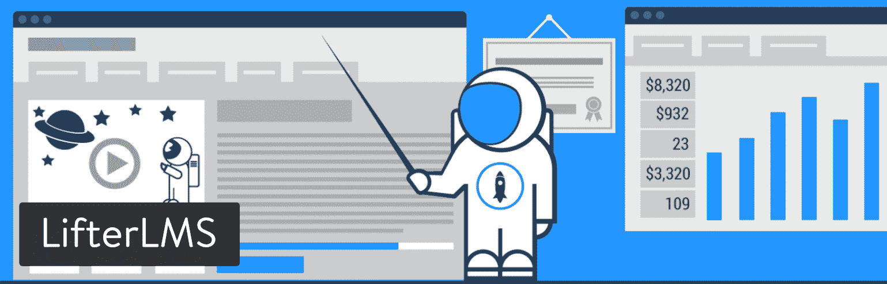
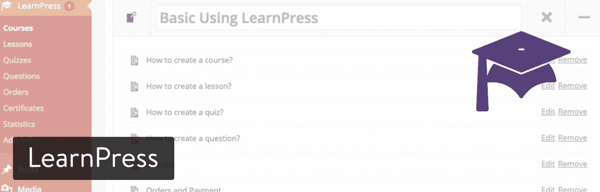
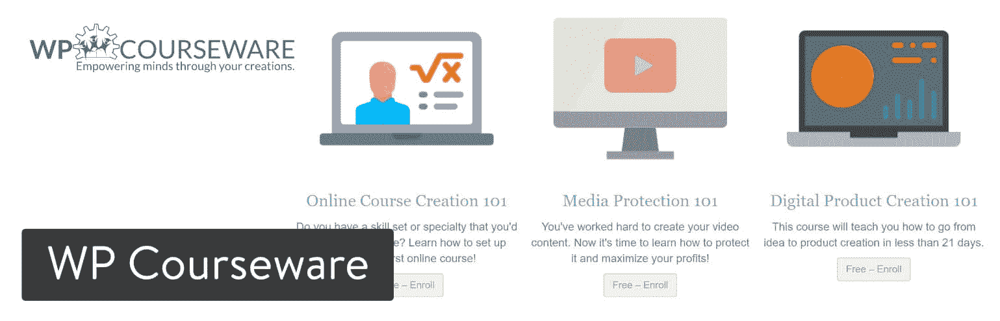
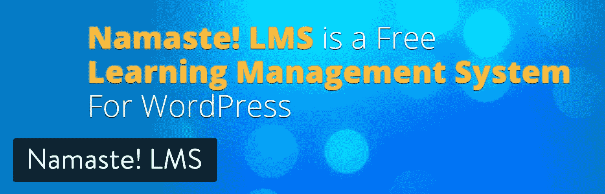
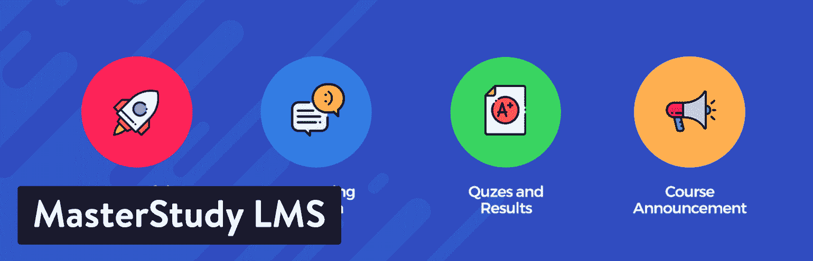

# 创建和销售在线课程的 10 个最佳 WordPress LMS 插件

> 原文：<https://kinsta.com/blog/wordpress-lms-plugins/>

无论是学习如何正确地挥动高尔夫球杆，还是将你的网页设计技能提升到一个新的水平，在线课程已经成为人们在生活和职业生涯中不用花太多钱就能进步的一种流行方式。此外，在线学习可以让你坐在家里做一些很酷的事情，比如投资加密货币或学习德语。

众所周知，这些视频课程网站能赚到相当多的钱，尤其是专注于一个利基市场的时候。如果你有兴趣把自己的知识放到网上，以在线课程的形式，你最好的选择是从一个流行的 WordPress LMS 插件中选择。

LMS，或称**学习管理系统**，结合了广泛的功能来呈现课堂设置，而无需学生进入物理教室。这完全取决于你使用的 WordPress LMS 插件，但是一般来说，这些工具允许你创建班级，共享课程，注册学生，以及用测验评估学生。

我们喜欢面向学校和大学的 WordPress LMS 插件，以及那些希望教客户如何完成任务或获得某个主题的更多知识的盈利组织。例如，WP101 是一个受欢迎的在线教室，用来教授人们 WordPress 的基础知识。Lynda.com 和 Udemy 以其广泛的主题而闻名，而你也可以找到只专注于一两个主题的网站。

更重要的是，如果你开始[销售你的视频课程和材料](https://kinsta.com/blog/website-ideas/)，你也许可以将它们推向市场，供公司用作培训材料。我们之前的 WP101 例子有一个很棒的初学者视频包，开发者可以和新手用户分享。

## 你在这些 WordPress LMS 插件中寻找什么？

我们已经谈了一些关于学习管理系统的内容，但是在研究插件时，你应该关注哪些特性呢？

让我们探讨一些基本要求，以及让您的学习网站变得与众不同的附加条件:

*   **课程建设**，带有上传不同文件类型的工具，如视频、pdf、链接和其他内容。重要的是[有一个坚实的课程页面生成器](https://kinsta.com/blog/wordpress-page-builders/)。这样，您可以将课程内容插入到模板中，然后点击“发布”按钮。
*   **课程进度信息**向您的学生展示他们做得有多好。这对于保持用户的积极性和作为一点奖励是很重要的。
*   **学生注册和管理**查看有多少人参加了您的课程，并根据会员资格收取费用。
*   **内容点滴**随着学生的进步，慢慢展示一些课程材料。
*   让学生评估他们吸收了多少材料的测验和测试。许多学校用测验来决定谁有资格上课，但这也是一个很好的方式来建立下一部分内容何时进入课程的基准。
*   **BuddyPress 和 bbPress 集成**供用户生成学生档案，并通过聊天和论坛与其他学生和教师互动。
*   **金融营销工具**——这些工具以联盟计划、佣金制度和优惠券的形式出现。目标是通过给予奖励和建立口碑来说服更多的人注册你的课程。
*   **自动化电子邮件**通过给学生一种更切实的方式来看到他们的进步，从而增强激励。
*   **出色的支付网关支持**为您的研究过程增加灵活性。你经常[发现某个支付网关](https://kinsta.com/blog/woocommerce-payment-gateways/)可能收费较低，或者在你所在的地区可能不提供。
*   **游戏化和证书**——每当某项活动完成或某门课程结束时，这些奖励就会出现。徽章和证书通常比电子邮件确认好得多，因为人们可以打印出来，或者只是在解锁时自我感觉良好。
*   **作业选项**简化提交和评分流程。在大多数平台上发送作业并没有那么难，但是学生能够毫无问题地发回作业吗？

## 2022 年最好的 WordPress LMS 插件

仔细阅读我们上面列出的功能列表，并记下对你的新课程网站最重要的元素是明智的。如果你不需要其中的一些，也许你可以通过选择一个更简单的 WordPress LMS 插件而不是一个完整的套件来节省一些钱。另一方面，一旦你开始接受注册，你不想缺少合适的工具。

> Kinsta 把我宠坏了，所以我现在要求每个供应商都提供这样的服务。我们还试图通过我们的 SaaS 工具支持达到这一水平。
> 
> <footer class="wp-block-kinsta-client-quote__footer">
> 
> 
> 
> <cite class="wp-block-kinsta-client-quote__cite">Suganthan Mohanadasan from @Suganthanmn</cite></footer>

[View plans](https://kinsta.com/plans/)

至于最好的 WordPress LMS 插件，这里有一个快速的列表让你开始使用:

 请随意点击这些链接，了解每一个链接。然而，我们强烈建议进一步阅读，探索每个 WordPress LMS 插件的用途，以及哪些功能最突出。

### 1.导师 LMS

Tutor LMS 是 WordPress LMS 插件世界中最受欢迎的插件之一。在很短的时间内，他们聚集了一支超过 50，000 名电子学习爱好者的大军。它配备了独特的功能，如前端课程生成器、拖放式课程创建器、证书生成器以及来自母公司的持续开发支持。

Tutor LMS

核心插件是免费的，而高级计划的单站点许可证起价为 149 美元。有了它，您可以访问多个高级插件，如证书，课程预览，多讲师，前端课程生成器，内容滴等等。您还可以使用与 Google Classroom 的集成来实现强大的通信，Zoom 用于直播视频课程，Elementor 用于完全定制的课程建设体验。

Tutor LMS 还拥有一个具有顶级安全性和编码实践的安全平台。它与[电子商务插件](https://kinsta.com/blog/wordpress-ecommerce-plugins/)、页面生成器插件以及 GamiPress、BuddyPress 等其他流行插件的集成列表越来越多。

#### 这个 WordPress LMS 插件的主要特点

*   使用专业版，您可以访问前端课程生成器。这使得 WordPress 用户的新手能够忽略后端的课程生成器，直接从网站的前端创建课程。
*   为学生、教师和管理员提供单独的前端仪表板。每个控制面板根据不同的角色类型显示不同的设置。
*   Tutor LMS 附带一个拖放式证书生成器，允许您创建证书来奖励您的学生。
*   涵盖所有类型的课程内容媒体，支持纯文本内容、音频课程、视频和具有缩放集成的直播课程。
*   测验生成器中有 10 多种问题类型，用于创造性和有见地的测验。
*   每门课程都有问答和学生论坛，以促进交流。
*   启用/禁用完全可自定义的触发式电子邮件，以便在导师 LMS 网站上发生事件时发送给您的学生和导师。您也可以使用内置的电子邮件模板编辑器编辑电子邮件。
*   Tutor LMS 通知附加组件允许您发送基于您的 LMS 站点的事件的站点范围通知。
*   涵盖所有支持电子商务插件的货币化计划，如 [WooCommerce](https://kinsta.com/blog/woocommerce-tutorial/) 、EDD、Restrict Content Pro 和付费会员 Pro。
*   完全可定制的网站建设体验，支持像 Oxygen 和[elements 或](https://kinsta.com/blog/best-elementor-themes/)这样的页面构建器。
*   管理和教师仪表板都将有助于跟踪和监控收入，概述他们的 LMS 分析，课程细节，收入，报表等。
*   附带有用的附件，如证书，作业和高级版本的成绩册。
*   如果你打算转换平台，Tutor LMS 还提供一键迁移工具。他们目前支持 LearnDash 和 LearnPress，但他们表示支持的平台列表将稳步增长。
*   Tutor LMS 提供 27 种以上的语言版本。因此，如果你是为全球用户开发，它是一个真正的多语言支持工具。
*   事件日历提供了所有正在发生的事件的概述，并帮助用户进行必要的准备。

### 2.LearnDash

许多财富 500 强公司和主要大学都使用 LearnDash ，因为它的整体速度、功能集和令人印象深刻的在线课程设计。LearnDash 涵盖了我们之前在本文中讨论的大多数必备功能，因此我认为这是一个完整的套件，其中包含用于内容下载、销售课程、奖励学习者和基于操作激活触发器的工具。

价格是按年设定的，所以在短期内还是相当实惠的。例如，你第一年支付 159 美元来支持一个拥有 LearnDash 所有功能的网站。10 个站点的许可价格跃升至每年 189 美元，25 个站点的支持价格为 329 美元。LearnDash 的一个缺点是没有免费试用。然而，好消息是，如果你不喜欢它，你可以在 30 天内取消。

LearnDash WordPress LMS plugin

我们将在下面讨论关键特性，但它们被分为四类:课程、货币化、管理和技术。同样值得注意的是，LearnDash 与移动设备兼容，适合在旅途中学习。此外，客户支持由行业领先的专家通过复杂的票务系统提供。

#### 这个 WordPress LMS 插件的主要特点

*   包括创建多层课程的选项，您可以将课程分成更高级的体验。例如，你可能希望在这个过程中有小测验和不同的课程。
*   提供基于时间表的内容点播工具。您还可以添加课程计时器，以确保每个人在每节课上都花一定的时间。
*   没有必要集成论坛插件，因为动态论坛已经内置在 LearnDash 中。
*   learn-每当用户完成课程的某一部分时，就会向您的学生显示一本成绩册以及课程点数。这与证书和徽章很相配。
*   利用购物车、会员资格、订阅、课程捆绑包和课程许可证等多种货币化工具来推广您的课程。
*   LearnDash 实现了电子邮件通知和详细报告的自动化。
*   允许用户配置文件和组管理-这是完美的任何小组工作，你想分配。
*   LearnDash 支持大多数媒体类型，如视频、音频、图像、Adobe Captivate 文件和 Google 文档。
*   它也是[多站点](https://kinsta.com/blog/wordpress-multisite/)启用的，以防你想在网络上运行 LearnDash。
*   让用户在你的 WordPress 网站上使用 premium [前端课程创建插件](https://www.learndash.com/add-on/front-end-course-creation/)创建他们自己的课程。

### 3.马斯特里约

革命性的 WordPress LMS 插件 Masteriyo 是为那些想要创建和销售在线课程的人提供的一站式解决方案。凭借其用户友好和直观的课程生成器，即使非技术专家也可以毫不费力地添加课程、课程和测验。好消息是，你可以根据自己的需要添加无限的课程、课时和测验。

## 注册订阅时事通讯

### 想知道我们是怎么让流量增长超过 1000%的吗？

加入 20，000 多名获得我们每周时事通讯和内部消息的人的行列吧！

[Subscribe Now](#newsletter)

Masteriyo

这个 WordPress LMS 插件提供免费和高级版本。除了免费版本，Masteriyo 还有三种不同的保费计划。对于 1 个站点许可证，您需要支付 199 美元/年。如果你想要 5 个站点的许可证，每年需要 299 美元。类似地，99 个站点的许可费是每年 499 美元。此外，所有保费计划都提供 75%的特别介绍折扣。

此外，所有高级计划都包括通过实时聊天和电子邮件提供的高级支持、1 年更新、[条纹集成](https://kinsta.com/blog/stripe-for-wordpress/)、 [WooCommerce 集成](https://kinsta.com/blog/woocommerce-extensions/)、下载资料、证书以及更多功能。除此之外，Masteriyo 完全兼容任何遵循 WordPress 主题标准创建的主题。下面我们提到了这个插件提供的所有令人惊奇的特性。

#### 这个 WordPress LMS 插件的主要特点

*   该插件提供了一个简单的拖放课程生成器。WordPress 后端的课程生成器是建立在 React 之上的，因此它的加载速度非常快。
*   包括高级测验生成器。您可以创建是非题测验，以及包含单项和多项选择题的测验。
*   它有一个课程导航选项，这样学习者可以清楚地知道他们目前在哪个部分。
*   Masteriyo 的问答系统允许学生和教师之间的互动。
*   右上角有一个进度条，向学生显示他们在课程中取得了多少进展。
*   Masteriyo 包括的另一个伟大功能是内置订单系统。该系统有一个购物车以及一个结帐表单。你可以毫不费力地出售课程并接受安全支付。目前，Masteriyo 提供离线支付、WooCommerce 集成和支付网关 [PayPal 和 Stripe](https://kinsta.com/blog/stripe-vs-paypal/) (premium)。
*   该插件是高度可定制的。因此，你可以完全定制它来匹配你的网站的氛围。
*   您创建的课程在手机、iPhones、iPads 和其他小型手持设备上看起来都很棒。
*   Masteriyo 还提供了一个电子学习 LMS 主题，以便轻松创建和销售在线课程。只需点击一下就可以导入主题演示。
*   该插件不仅为高级用户，也为免费插件用户提供专门的支持团队。

### 4.升降机 LMS

Lifter LMS 是 LearnDash 的一个不错的替代产品，但是完整的 LMS 包的价格是每年 299 美元起。然而，如果你想单独购买插件，你可能会节省一些钱，因为它们每个售价为 99 美元。我真的看不出这有什么意义，因为三个插件已经让你达到了 299 美元的价格，其中包括几十个相同价格的模块。

以闪电般的加载速度提升在线课程的用户体验。[免费试用 kin sta](https://hubs.ly/H0pklC_0)。

然而，我们喜欢 Lifter LMS 与 WooCommerce 、 [MailChimp](https://kinsta.com/blog/how-to-use-mailchimp/) 和 AffiliateWP[的独特集成。如果您已经在使用许多 Lifter LMS 集成中的一两个，那么考虑 Lifter LMS 而不是 LearnDash 可能是有意义的。此外，还提供了 1，30 美元的免费试用，因此在支付全价之前，有更多的动力来测试 Lifter LMS。](https://kinsta.com/learn/woocommerce-guide/)

LifterLMS WordPress plugin

Lifter LMS 也因其服务而闻名，在这里你可以支付一个捆绑包，里面有一些项目，比如课程样本、测验样本、证书和一个完整配置的网站。对于那些不太懂技术，但已经准备好发布内容的人来说，这可能会发挥作用。

这些功能与 LearnDash 或多或少是相同的，但也有一些显著的区别。例如，Lifter LMS 包括一个带有背景和其他设计元素的图形包。您还可以收集客户评价，以帮助您将来销售课程。对于初学者来说，Lifter LMS 插件看起来有趣的另一个原因是它与 Divi 和 Beaver Builder 的集成。这些拖放编辑器消除了弄乱代码的需要，并且它们提供了更加可视化的设计体验。

#### 这个 WordPress LMS 插件的主要特点

*   Lifter LMS 提供了一个[直接的 WooCommerce 集成](https://kinsta.com/blog/woocommerce-tutorial/)，用于单独或捆绑销售您的课程。
*   拖放式课程构建工具和集成必定会吸引初学者和那些想要尽可能简单的设计体验的人。
*   主要的插件是免费的，所以从技术上来说，你不用花一毛钱就可以建立一个简单的在线课程网站。你唯一需要支付的附加服务是其中一个支付网关。
*   客户支持包括技术支持、实时办公时间和大量免费培训课程。
*   Lifter LMS 课程生成器为所有类型的多媒体、漂亮的课程生成器、点滴内容和测验提供选项。
*   移动平台是一件轻而易举的事，因为 Lifter LMS 提供了一个课程导入和导出工具。
*   为您的学生创建讨论区和社交档案，以便他们相互交流并与老师交流。
*   你可以获得各种各样的营销和赚钱工具，如循环支付、多重网关、无限定价模式和优惠券。
*   你可以实现一个叫做“社会学习”的工具，它释放了脸书喜欢改善学生如何看待你的课程和互动的力量。

升降机 LMS even team [为](https://lifterlms.com/recommended-resources/) [LMS 主办](https://kinsta.com/wordpress-lms-hosting/)推荐 Kinsta 。👍

### 5.学习出版社

在 WordPress LMS 插件世界中，LearnPress 是最简单、最干净的选择。该插件完全免费使用，但你很可能需要为一个 [LearnPress 兼容主题](https://themeforest.net/item/education-wordpress-theme-education-wp/14058034)付费。主要的缺点是客户支持不像高级 LMS 那样专注。也就是说，大多数基本的 LearnPress 插件都是免费的，电子邮件支持代表会在 24 小时内回复您。你也可以选择支付额外费用来购买证书、合作讲师支持和 WooCommerce 支持。

LearnPress WordPress plugin

每个 LearnPress 课程都可以在学生学习课程的过程中创建测验和课程。你可能需要激活几个附加组件，这取决于你制作在线课程网站所需的高级程度。例如，有 bbPress、BuddyPress、课程评论、愿望列表、导入/导出和课程先决条件的插件。

#### 这个 WordPress LMS 插件的主要特点

*   LearnPress 包括一个登录页面模板，用于链接广告和讨论课程描述、课程表等。
*   你可以创建一个漂亮的页面，向那些想成为教师的人推销。
*   LearnPress 支持大量支付网关，包括 2Checkout、Authorize.net 和 Stripe。
*   核心的 LMS 插件是免费的，所以你有机会做一个简单而深入的在线课程。你可能会在一个主题上花费 50 美元左右，在一个支付网关集成上花费 30 美元左右。这样做的好处是，你不必支付每年重复的费用。
*   LearnPress 允许多名教师，由两到三名教师管理一门课程。
*   徽章和积分系统可以让你的课程游戏化。
*   除了随机测验、付费会员资格和 WooCommerce 附加服务之外，还提供内容下载。

### 6.老师

唤醒是 WooCommerce 的一个扩展，所以它是一个希望包括在线视频和课程的电子商务商店的实用补充。基本前提很简单:您创建课程、编写课程和添加测验。用户注册也包括在内，当在课程中添加其他 WooCommerce 元素(如实物产品)时，这是一个简单的过程。

Sensei LMS WooCommerce plugin

价格从 129 美元开始，根据你想在多少网站上实现它，价格会涨到 279 美元。这个价格只有一年的有效期，所以需要每年升级。无缝的 WooCommerce 集成是 Sensei 的面包和黄油，特别是因为它可以与所有 WooCommerce 主题一起工作。总的来说，Sensei 是围绕 WordPress 的直观性而建立的，所以初学者应该不会有任何问题，就像他们制作一个普通的 WordPress 帖子一样。

你还应该考虑这样一个事实，唤醒不需要一个 WooCommerce 主题来正常运行。大多数良好编码的 WordPress 主题与 Sensei 结合得很好，所以这只是你希望你的电子商务功能有多先进的问题。

#### 这个 WordPress LMS 插件的主要特点

*   该扩展与 WooCommerce 和 WordPress 融合得很好，用户体验与制作 WordPress 页面或帖子没有太大区别。
*   市场上的大多数 WordPress 主题都很好地集成了 Sensei。
*   用户注册是通过 WordPress 完成的，所以再一次，熟悉 WordPress 的人应该会发现 Sensei 很容易学。
*   WooCommerce 集成允许您立即对课程收费，无论是订阅课程还是个人课程。
*   简单的课程分析提供了关于评分、课程完成和注册学生的信息。
*   当涉及到设计时，测验并没有什么特别的，但是提供了几个模板，比如对/错、单行、文件上传和多行测试。
*   唤醒显示随机测验的基础上，银行的问题，你设置之前发射。
*   测验评分可以设置为自动或手动。

### 7.WP 课件

[WP 课件](https://flyplugins.com/wp-courseware/)是比较有前途的 WordPress LMS 插件之一，有几个原因。首先，定价远没有一些竞争对手复杂。事实上，对于最便宜的包，您会得到一个两站点许可的奖励，起始价格为每年 99 美元。现场演示是最接近免费试用的东西，但它是一个充满实际课程内容的美丽设计，可以激发您的创造力。

更重要的是，世界上一些顶尖的大学都在使用 WP 课件，比如伊利诺伊大学，威斯康星大学麦迪逊分校。你也可以在企业培训网站上找到 WP 课件工具，比如如果你要为 CNN 或 Sheraton 工作。

WP Courseware plugin

很明显，WP 课件有一套令人印象深刻的特性，这一切都始于拖放编辑器。您可以轻松创建课程，甚至保护这些课程不被窃取。WP 课件的一个突出元素是你可以从中选择的大量集成。WooCommerce 就是其中之一，还有很多其他选项，比如 OptimizePress、BuddyPress 和 Visual Composer。

#### 这个 WordPress LMS 插件的主要特点

*   最实惠的价格包允许两个站点，每年 99 美元。所以，如果你计划制作两个在线课程网站，WP 课件会比 LifterLMS 和 LearnDash 更实惠。
*   会员门户网站提供了一个很好的优势，因为你可以和那些制作在线课程的活跃用户交流。
*   可视化设计器使用拖放元素，它提供了基本的工具，如课程保护、滴流内容和电子邮件通知。
*   可以查看和导出成绩册来管理学生的表现。
*   通过与您最喜欢的电子商务插件集成的 WP 课件进行销售。你不仅仅局限于 WooCommerce 或单一支付网关。
*   您可以运行多教师系统，在该系统中，您为教师分配创建和管理他们所教课程的角色。
*   测验提供多种问题类型和问题标签。此外，如果您想在整个课程中随机生成测验，题库是可选的。

### 8.良好的 LMS

好的 LMS 售价 31 美元，是 CodeCanyon 市场上唯一可行的 WordPress LMS 插件。有趣的是，事实就是如此，因为你可以找到几十个适合其他 WordPress 类别的插件。也就是说，31 美元的费用只能让你获得一年的支持和更新，但一次性付款仍然保持你对插件功能的控制。因此，它是这个列表中最便宜的高级插件。

以闪电般的加载速度提升在线课程的用户体验。[免费试用 kin sta](https://hubs.ly/H0pklC_0)。

和大多数好的 WordPress LMS 插件一样，好的 LMS 有创建课程、销售课程、实施测验和证书的功能。CodeCanyon 页面包括几个演示(学生后端、教师后端、交易后端),让您全面了解将要发生的事情。

Good LMS WordPress plugin

设计过程的管理很像一篇常规的 WordPress 博客文章，你可以直接从 WordPress 仪表板上创建测验、课程和证书。课程进程表提供了学生成绩的漂亮外观，为讲师设置佣金率允许您管理团队成员。课程评级也是可用的，所以好的 LMS 对于那些想要创建课程市场的人来说似乎是一个明智的选择。

#### 这个 WordPress LMS 插件的主要特点

*   好的 LMS 可以让你创建一个简单的课程市场(像 Udemy 一样)，提供课程评级和教师佣金设置。
*   WordPress LMS 插件的价格远低于一些高级套件。
*   修改测验设置，以便所有学生都有多次机会参加测验。
*   课程徽章和证书显示在学生后端，用户也可以访问进度报告。
*   一个简单的优惠券代码创建器帮助你制作和分享代码，以获得更多的学生。
*   好的 LMS 非常依赖 WordPress 界面，所以一个普通的 WordPress 用户不需要学习新的设计技术。

### 9.合十礼！地方管理学校

虽然不如本文前面七个 WordPress LMS 插件受欢迎， [Namaste！LMS](https://wordpress.org/plugins/namaste-lms/) 不容忽视。你可以免费下载核心插件，设计一个体面的在线课程，而不需要花很多钱。然而，合十礼！高级主题最有可能被用于设计，起价为 47 美元。另外，合十礼！Pro module 包含许多附加组件和全年的高级支持。

举个例子，合十礼！Pro 提供奖励和徽章选项，以及文件和课程保护。您还可以为高级课程启用购物车，并与 WooCommerce 或 WP Simple Cart 插件连接。

Namaste! LMS WordPress plugin

我喜欢核心插件的简单性，但这对大多数在线课程网站管理员来说还不够。毕竟，除非你支付额外费用，否则你无法获得延迟课程材料或教师分配等基本功能。

然而，价格仍然合理，所以如果你正在寻找 LearnDash 这样的大狗的替代品，这不是什么大不了的事情。

#### 这个 WordPress LMS 插件的主要特点

*   这些整合加强了课程网站的整体功能，同时也迎合了利基市场。例如，Watu 集成满足了测验和考试的需求，而 MoolaMojo 连接在分发分数和让学生用获得的分数购买更多课程方面创造了奇迹。
*   创建和编辑一个课程的工作类似于制作一个标准的 WordPress 帖子。对于初学者来说，它足够简单和直观，但是您仍然可以访问更高级的定制选项。
*   您可以启用购物车来收钱和管理单个视频或包的订阅。
*   有一种工具可以保护你的文件免受不必要的入侵。
*   你可以颁发徽章，创造一个游戏化的氛围来促使用户更加努力地学习课程。

### 10.硕士学习 LMS

最后但同样重要的是，我们有 [MasterStudy LMS](https://wordpress.org/plugins/masterstudy-lms-learning-management-system/) 插件。这是我们列表中最新的 LMS 插件，但是它有很多特性！它让你的在线[教育 WordPress 网站](https://kinsta.com/wordpress-hosting-for-education/)的构建、定制和管理变得简单而没有麻烦。你可以免费下载这个插件，它可以和任何 WordPress 主题一起使用。然而，如果你想节省一些时间，他们也有他们的 [MasterStudy premium WordPress 主题](http://masterstudy.stylemixthemes.com/)，可以立即将这个插件提升到一个新的水平！该主题起价仅为 25 美元。

MasterStudy LMS WordPress plugin

MasterStudy LMS 插件可以让你用视频、图表、幻灯片和几乎任何你能想到的东西来创建精彩的课程。所有这些都由 WYSIWYG 编辑器提供支持，使创建和管理变得轻而易举。

MasterStudy LMS 的一个独特之处在于，所有的关键元素都是用 [Vue.js](https://kinsta.com/blog/vue-js/) 构建的，这让您可以快速加载页面和平滑页面过渡。

#### 这个 WordPress LMS 插件的主要特点

*   有一个漂亮且易于使用的用户界面。
*   通过 PayPal 和 Stripe 集成，轻松设置定期订阅的付款方式。
*   有一个留言板，为学生创造一个社交网络类型的环境，从课程创建者那里获得答案和帮助。
*   使用测验、实时问答和倒计时器。
*   内置课程评级。
*   为已完成课程的学生生成认证。

## 替代 WordPress LMS 插件

虽然我们不能涵盖所有的 WordPress LMS 解决方案，但这里有几个额外的解决方案值得一提。

*   [附带地](https://accessally.com/)
*   [第二天](http://www.edivently.com/)

## 哪些 WordPress LMS 插件适合你？

关于 WordPress LMS 市场的好消息是，这九个插件确实是唯一可行的选择。我们经常看到有 20 或 30 个插件可供选择，这使得购物空间变得混乱。

所以，你可以坚持这些解决方案，从第一条建议开始。或者，您可以根据自己的特定需求来选择:

*   **最超值最有特色的 WordPress LMS 插件:** LearnDash、Lifter LMS、WP 课件。
*   **最便宜的 WordPress LMS 插件:** LearnPress，Good LMS，MasterStudy LMS。
*   理想的 WordPress LMS 适合初学者(也适合制作一个基本的在线学习网站): Lifter LMS。
*   制作像 Udemy 这样的在线课程市场的最好的 WordPress LMS 插件:好的 LMS。

这个列表中的任何 WordPress LMS 插件都不会出错，所以它更多的是关于你希望在你的在线课堂上看到的确切功能。之后，考虑价格——但不要太难，因为一个高质量的学习网站可以轻松弥补每月的费用。

另外，不要忘记阅读我们关于托管会员网站的挑战的深度指南:[托管 WordPress 会员网站的注意事项](https://kinsta.com/blog/hosting-wordpress-membership-sites/)

这就是我们为你准备的一切！你有喜欢的 WordPress LMS 插件吗？我们很想听听下面的内容。

* * *

让你所有的[应用程序](https://kinsta.com/application-hosting/)、[数据库](https://kinsta.com/database-hosting/)和 [WordPress 网站](https://kinsta.com/wordpress-hosting/)在线并在一个屋檐下。我们功能丰富的高性能云平台包括:

*   在 MyKinsta 仪表盘中轻松设置和管理
*   24/7 专家支持
*   最好的谷歌云平台硬件和网络，由 Kubernetes 提供最大的可扩展性
*   面向速度和安全性的企业级 Cloudflare 集成
*   全球受众覆盖全球多达 35 个数据中心和 275 多个 pop

在第一个月使用托管的[应用程序或托管](https://kinsta.com/application-hosting/)的[数据库，您可以享受 20 美元的优惠，亲自测试一下。探索我们的](https://kinsta.com/database-hosting/)[计划](https://kinsta.com/plans/)或[与销售人员交谈](https://kinsta.com/contact-us/)以找到最适合您的方式。