# 如何找到你的 WordPress 登录网址(改变它，锁定它)

> 原文：<https://kinsta.com/blog/wordpress-login-url/>

与 WordPress 互动的新手用户在登录他们的账户时会经历一段艰难的时间。在这篇文章中，我将解释如何找到你的 WordPress 登录网址，以及其他一些关于登录过程需要强调的重要事情。

让我们从头开始。

### **更喜欢看[视频版](https://www.youtube.com/watch?v=Urv4TSKCKtc)？**

## WordPress 登录的重要性

在[安装完 WordPress](https://kinsta.com/blog/reinstall-wordpress/) 后，你将可以访问你的[网站的管理面板](https://kinsta.com/knowledgebase/wordpress-admin/)，在那里你有机会根据需要设置你的网站并做一些改变。

如果你没有访问管理页面的权限，这是不可能的。登录页面阻止你和其他人访问你的 WordPress 站点的管理“端”。

如果你不能进入管理区，几乎不可能完全控制你的站点/博客。


但是这个 WordPress 登录页面在哪里呢？


## 如何找到你的 WordPress 登录网址:

在你网站的网址末尾添加/ **登录** /、/ **管理** /、或/**wp-login.php**就可以到达 WordPress 登录页面。

如果你在子目录(www.yoursite.com/wordpress/)或子域(blog.yoursite.com/)上安装了 WordPress，在你的 URL 的最末端添加三个路径中的一个，比如:www.yoursite.com/wordpress/**wp-login.php**或 blog.yoursite.com/**wp-login.php**

Support
## 如何找到 WordPress 登录网址

找到 WordPress 登录页面可能比你想象的更简单。在新安装的 WordPress 上，在你网站的[网址](https://kinsta.com/knowledgebase/what-is-a-url/)的末尾添加`**/admin/**`(例如:`www.yourawesomesite.com/admin/`)或`**/login/**`(例如:`www.yourawesomesite.com/login/`)会将你重定向到登录页面。

通常，这两个应该直接带你到你的 WordPress 登录页面。如果这种情况没有发生，有一种额外的方法可以到达您的登录页面:您可以在 URL 的末尾添加`**/wp-login.php**`，就像这个例子中的:`www.awesomesite.com/wp-login.php`。

### 如何在子目录或子域中找到 WordPress 登录 URL

所有这些都适用于标准的和新的 WordPress 安装。但是有可能你已经把 WordPress 安装在了你域名的子目录中，比如`www.yourawesomesite.com/wordpress/`或者一个[的 WordPress 子域名](https://kinsta.com/blog/wordpress-subdomain/)，比如`blog.yourawesomesite.com/`。

如果是这种情况，您需要在子目录或子域的结束斜杠后添加上述路径之一，即`**/**`符号，以获得如下内容:

*   `www.awesomesite.com/wordpress/login/`或者
*   `www.awesomesite.com/wordpress/wp-login.php`

无论你使用哪一个，任何一个都会把你带到你的 WordPress 登录页面。如果你不想忘记它，把你喜欢的[网址](https://kinsta.com/knowledgebase/what-is-a-url/)加入书签。

或者，在 WordPress 登录表单中有一个“记住我”选项，它将允许你保持登录状态，并在几天内到达管理仪表板，而不需要再次登录(基于你的 cookies 是如何设置的):

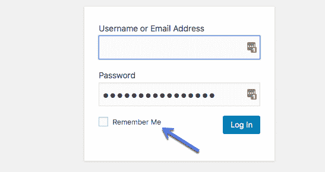

The “remember me” option on the WordPress login form


通过 WordPress 登录页面登录是一项重要而简单的任务。如果您的网站上没有发生任何错误和/或恶意行为，您将需要您的电子邮件地址/用户名和密码。

仅此而已。不幸的是，坏人无处不在，你的网站可能成为目标。

那么，你能做些什么来阻止他们呢？

至少让我们移动登录页面吧！

## 如何改变 WordPress 登录页面

您的登录页面不应该被黑客和恶意攻击者(也就是坏人)访问，因为他们可能会访问您站点的管理页面并开始搞砸事情。相信我，这可不是什么好经历！

虽然使用一个强有力的、唯一的、长的密码确实有利于防止未经授权的人访问你的网站，但当安全受到威胁时，你可以做的事情永远都不够。

将坏人拒之门外的一个快速有效的方法是**将 WordPress 登录页面移动到一个新的唯一 URL** 。改变你和你的用户可以访问你的 WordPress 站点的登录 URL，在对抗随机攻击、黑客和暴力攻击时会有很大帮助。

关于暴力攻击的一个词:暴力攻击是黑客攻击的尝试，恶意主体试图反复猜测你的用户名和密码，利用网上泄露的常用用户名和密码列表。他们所做的是尝试数千种组合，利用脚本自动完成所有的尝试。

在当今世界，你的 WordPress 密码或用户名很有可能在这些泄露的列表中。如果你补充说 WordPress 登录标准 URL 对这个场景来说是众所周知的，那么，你会发现黑客和恶意攻击者访问你的 WordPress 站点是多么容易。

这就是为什么移动 WordPress 登录页面到一个不同的路径可以帮助你。

### 用插件改变你的 WordPress 登录页面

改变你的 WordPress 登录 URL 页面最常见也可能是最简单的方法是使用一个免费的插件，比如 [WPS Hide Login](https://wordpress.org/plugins/wps-hide-login/) ，有超过 80 万用户在积极使用这个插件。

该插件非常轻量级，更重要的是，它不改变核心中的任何文件或添加重写规则。它只是拦截请求。它还兼容 BuddyPress、 [bbPress](https://kinsta.com/knowledgebase/bbpress/) ，限制登录尝试，以及用户切换插件。

[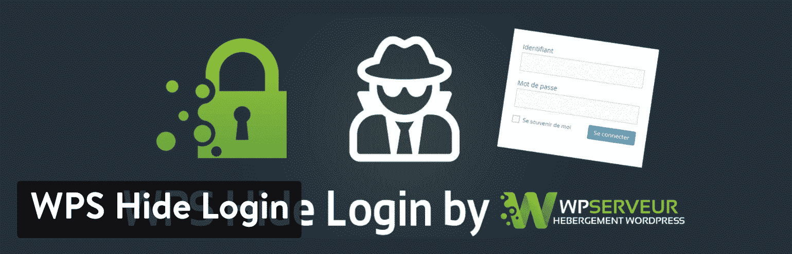](https://wordpress.org/plugins/wps-hide-login/)

WPS Hide Login plugin


下载并激活后，您需要做的就是:

1.  在右侧边栏的**设置**选项卡中点击 **WPS 隐藏登录**。
2.  在**登录 URL** 字段中添加新的登录 URL 路径。
3.  在**重定向 URL** 中添加一个特定的重定向 URL。当有人试图在未登录的情况下访问标准的 wp-login.php 页面和 wp-admin 目录时，将触发此页面。
4.  点击**保存更改**。

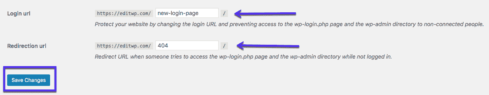

WPS Hide Login plugin


### 重要的

一旦您点击**保存更改**按钮，您的新登录页面将生效。因此，您的旧登录网址将不再工作！你会想要更新你的书签。如果你有任何问题，你可以随时恢复正常删除插件通过 SFTP 在您的网络服务器上。


你可以用来改变你的登录网址的另一个高级插件是由 Kinsta 的一个团队成员开发的[perfmates](https://perfmatters.io/)。

由于改变你的 WordPress 登录网址可以帮助阻止肤浅的攻击者访问你的网站，我想在这里澄清一下:专家和专业黑客仍然有可能做出额外的努力，找出你的登录页面。

那么，你为什么要在乎呢？嗯，安全是一个多层游戏，其中[你的主机质量起着关键作用](https://kinsta.com/secure-wordpress-hosting/)。你有越多的工具、技巧和壁垒，坏人就越难闯入你的网站并获得控制权。

更改你的登录网址也有助于防止常见的 WordPress 错误，比如“ [429 太多请求](https://kinsta.com/knowledgebase/429-too-many-requests/)当用户在给定的时间内发送了太多的请求时(速率限制)，这通常是由服务器生成的。这可能是由于僵尸程序或脚本访问了您的登录 URL。最终用户很少会导致这种错误。


429 too many requests


### 修改你的 WordPress 登录页面。htaccess 文件

其他改变或隐藏 WordPress 登录页面 URL 的技术方法是编辑你的`.htaccess`文件。

[通常与 cPanel 主机](https://kinsta.com/knowledgebase/wordpress-htaccess-file/)一起使用，`.htaccess`文件的主要作用是配置规则和设置系统范围的设置。既然我们在讨论隐藏登录页面，`.htaccess`可以用两种特定的方式来处理。

第一个是关于[密码保护](https://kinsta.com/blog/password-protect-wordpress-site/)你的登录页面[用一个. htpasswd](https://kinsta.com/blog/wordpress-security/#how-to-add-basic-http-authentication-htpasswd-protection) 这样任何进入你的登录页面的人在进入登录页面之前都需要输入密码。如果你是 Kinsta 客户，我们使用 [Nginx](https://kinsta.com/knowledgebase/what-is-nginx/) ，因此没有`.htaccess`文件。

您可以使用我们的 [htpasswd 工具](https://kinsta.com/help/htpasswd/)对您的整个网站进行密码保护。或者联系我们的支持团队来锁定您的登录页面。

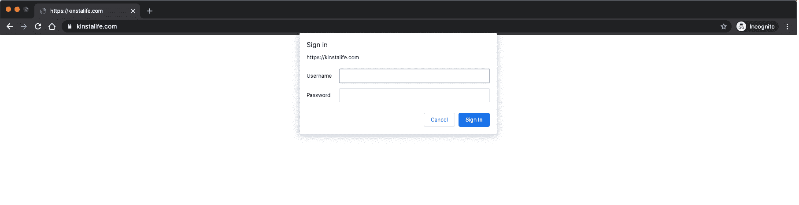

.htpasswd authentication prompt


第二个选项是根据可信 IP 地址列表启用对登录页面的访问。

### 限制登录尝试

另一种有效的安全方法是限制登录尝试的次数。如果你是 Kinsta 客户，我们会自动禁止一分钟内超过 6 次失败登录尝试的 IP。

或者你可以下载一个免费的插件，如[限制登录尝试重载](https://wordpress.org/plugins/limit-login-attempts-reloaded/)。

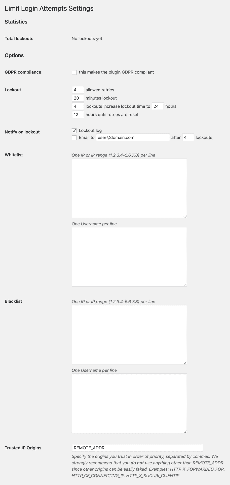

Limit login attempts reloaded


插件中的选项非常简单。

## 注册订阅时事通讯


### 想知道我们是怎么让流量增长超过 1000%的吗？

加入 20，000 多名获得我们每周时事通讯和内部消息的人的行列吧！

[Subscribe Now](#newsletter)

*   **锁定总数**:给你试图闯入但失败的黑客数量。
*   **允许的重试次数:**IP 地址在被锁定之前允许尝试的次数。

介于 4 和 6 之间的某个值可能是最受欢迎的重试次数。它允许应该有权访问的真实人类犯错误(因为，毕竟，我们在输入密码时都会犯错误)，意识到他们输入了错误的密码，并修复他们的错误。

将它设置为以上两点是很重要的，特别是如果你经常有客座博主或者几个负责管理你的网站的贡献人员。

*   **分钟锁定:**IP 地址将被锁定多长时间。

你可能想把它设置为“永远”，但是这对那些真的犯了真正错误的人没有帮助——你希望那些人最终能够让自己回来。20-30 分钟就差不多了。

*   **锁定增加:**因为如果是暴力攻击，很可能会卷土重来。

这个函数基本上是说“看”，我之前已经看到你把自己锁在外面好几次了，所以现在我要把你锁在外面更久。“一天是一个很好的一天。

*   **重试前的小时数:**多长时间后，它会重置所有内容并让用户重试。

该插件还可以让您管理您的白名单，黑名单，和信任的 IP。

## 如何解决最常见的 WordPress 登录问题

登录你的 WordPress 站点是一项快速简单的任务。然而有些用户——你呢？—可能在尝试访问他们的 WordPress 网站时遇到了一些问题。此类问题通常属于以下情况之一:

*   与密码相关的问题
*   与 cookies 相关的问题

让我们来看看这两个问题，看看如何解决它们！


### 登录:密码丢失/忘记

如果您无法登录，您的登录凭据可能有问题。

所以，你要做的第一件事就是检查你输入的用户名和密码是否正确。这是我们大多数人都会犯的错误，尽管很少。

成功了吗？如果没有，你可能想在尝试别的之前[改变你的 WordPress 密码](https://kinsta.com/blog/change-wordpress-password/)。为此，点击**输了密码？**登录表单正下方的链接:

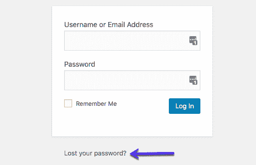

“Lost your password” link


您将被重定向到一个页面，在该页面上，您将被要求输入用户名/电子邮件，并且新密码将发送给您:

厌倦了体验你的 WordPress 网站的问题？通过 Kinsta 获得最好、最快的主机支持！[查看我们的计划](https://kinsta.com/plans/?in-article-cta)

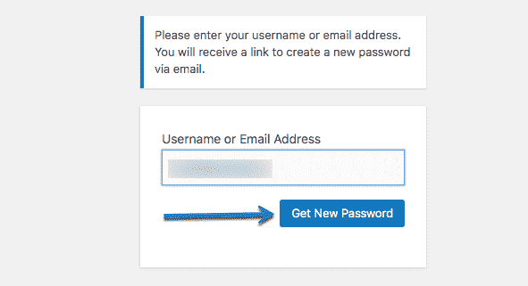

How to get a new WordPress password


### 用 phpMyAdmin 手动重置 WordPress 密码

如果这不起作用，事情会变得有点复杂，因为你需要进行手动密码重置。如果你对使用数据库文件感到不舒服，请不要这样做。

手动重置你的 WordPress 登录密码可以通过编辑你的[数据库](https://kinsta.com/knowledgebase/wordpress-database/)上的密码文件来完成。如果您可以在您的主机中访问 [phpMyAdmin](https://kinsta.com/help/wordpress-phpmyadmin/) ，这应该不难。

在对数据库文件做任何编辑之前，总是要备份你的站点，以防出错。

完成了吗？太好了！

#### 第一步

现在，登录 phpMyAdmin。如果您是一个 Kinsta 客户机，您可以在 MyKinsta 仪表板中找到 phpMyAdmin 的登录链接。

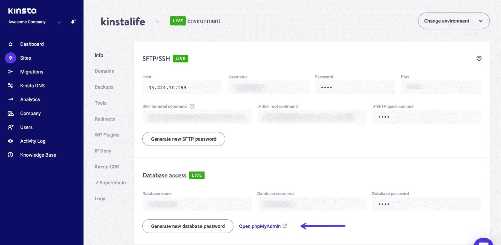

Login to phpMyAdmin


#### 第二步

在左侧，单击您的数据库。然后点击名为`wp_users`的表格。然后单击您需要重置的用户登录旁边的“编辑”。

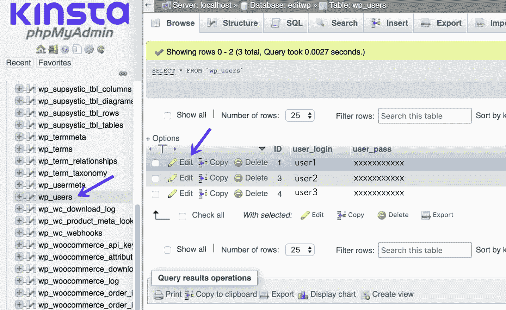

Edit user in phpMyAdmin


#### 第三步

在`user_pass`栏中，输入新密码(区分大小写)。在函数下拉菜单中，选择 MD5。然后点击“开始”

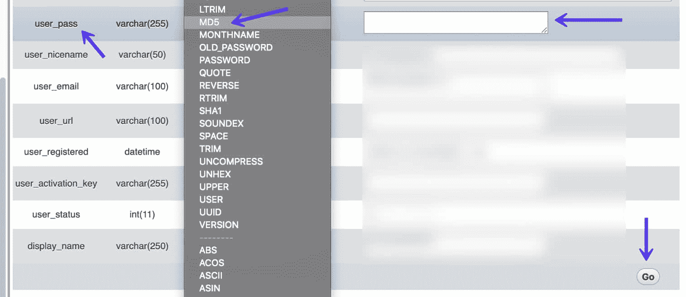

Reset password in phpMyAdmin


#### 第四步

在您的登录屏幕上测试新密码。

### 用 WP-CLI 手动重置 WordPress 密码

另一种重置你的 WordPress 密码的方法是使用 WP-CLI 。WP-CLI 是一个命令行工具，供开发人员管理 WordPress 安装的常见任务(不太常见)。

#### 第一步

首先，使用下面的命令列出 WordPress 安装中的所有当前用户。

```
$ wp user list
```

#### 第二步

然后使用以下命令、用户 ID 和新的所需密码更新用户密码。

```
$ wp user update 1 --user_pass=strongpasswordgoeshere
```

#### 第三步

在您的登录屏幕上测试新密码。

### WordPress 登录:Cookies

在某些情况下，由于与 cookies 相关的问题，您可能无法登录。如果是这样，您通常会遇到以下错误:

> 错误:浏览器阻止或不支持 Cookies。你必须启用 [cookies](https://codex.wordpress.org/Cookies) 来使用 WordPress。

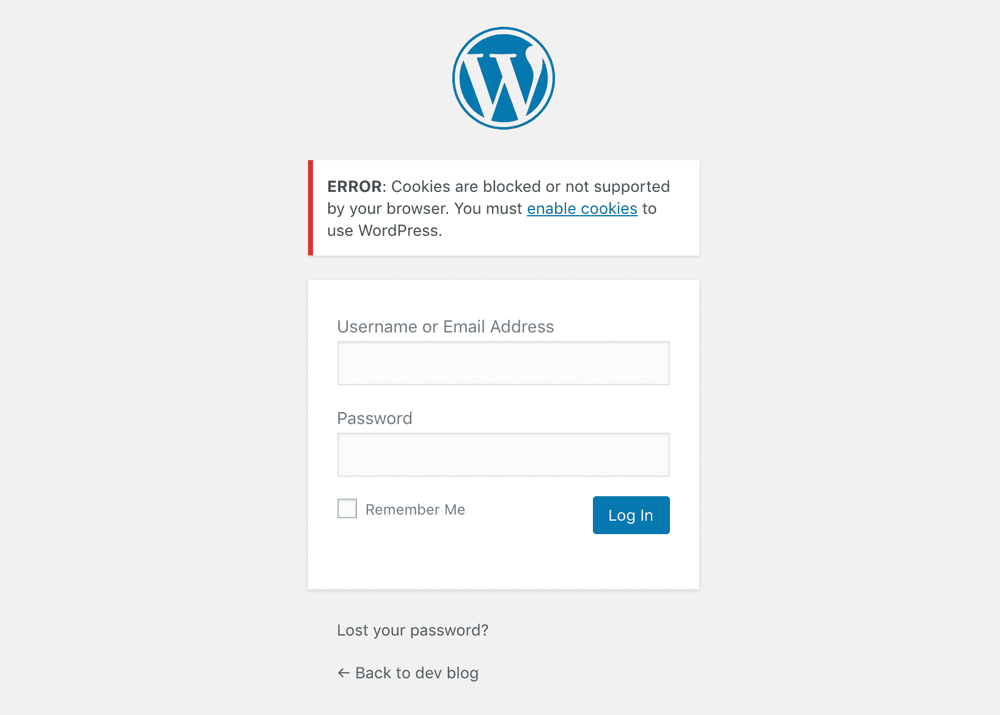

Cookies are blocked or not supported error


WordPress 登录依赖 cookies 工作。如果它们被禁用或不能正常工作，您可能会在登录页面上遇到问题。首先要检查的是浏览器中是否启用了 cookies:

*   [谷歌浏览器中的 Cookies】](https://support.google.com/chrome/answer/95647)
*   Mozilla Firefox 中的 Cookies】
*   [Internet Explorer 中的 Cookies】](https://support.microsoft.com/en-us/help/17442/windows-internet-explorer-delete-manage-cookies)
*   [Safari 中的 Cookies】](https://support.apple.com/guide/safari/manage-cookies-and-website-data-sfri11471/mac)

我们经常在最近迁移的 WordPress 站点和 WordPress 多站点站点上看到这种情况。有时简单地刷新你的浏览器并尝试再次登录实际上会让你越过这个错误。你也可以尝试[清空你的浏览器缓存](https://kinsta.com/knowledgebase/how-to-clear-browser-cache/)或者在匿名模式下打开一个不同的浏览器。

如果以上都不起作用，你可以试着把下面一行添加到你的[wp-config.php 文件](https://kinsta.com/blog/wp-config-php/)，就在`/* That's all, stop editing!...*/`之前

```
define('COOKIE_DOMAIN', false);
```

如果是一个 [WordPress 多站点设置](https://kinsta.com/wordpress-multisite-hosting/)，你可能想要检查并查看在`/wp-content/`文件夹中是否有一个`sunrise.php`文件，并将其重命名为`sunrise.php.disabled`。这是一个由旧的域映射方法使用的文件。

从 WordPress 4.5 开始，WordPress Multisite [不再需要插件](https://codex.wordpress.org/WordPress_Multisite_Domain_Mapping)来映射域名。如果您是 Kinsta 的客户，对此不确定，请联系我们的支持团队寻求帮助。

## 摘要

你的 WordPress 登录页面是授权你访问你的站点的入口。如果你不能成功登录，你只是一个网站访问者。

这就是为什么你应该学习如何到达这个关键页面，这样你就不会在每次需要登录你的 WordPress 站点时浪费很多时间。

想提高你的安全性吗？将标准的 WordPress 登录网址更改为你选择的自定义网址，并且只与可信的人共享该网址！此外，如果 [WordPress 一直让你退出](https://kinsta.com/knowledgebase/wordpress-keeps-logging-me-out/)，请务必查看本指南。

(建议阅读:[如何更改你的 WordPress 网址](https://kinsta.com/knowledgebase/wordpress-change-url/))

* * *

让你所有的[应用程序](https://kinsta.com/application-hosting/)、[数据库](https://kinsta.com/database-hosting/)和 [WordPress 网站](https://kinsta.com/wordpress-hosting/)在线并在一个屋檐下。我们功能丰富的高性能云平台包括:

*   在 MyKinsta 仪表盘中轻松设置和管理
*   24/7 专家支持
*   最好的谷歌云平台硬件和网络，由 Kubernetes 提供最大的可扩展性
*   面向速度和安全性的企业级 Cloudflare 集成
*   全球受众覆盖全球多达 35 个数据中心和 275 多个 pop

在第一个月使用托管的[应用程序或托管](https://kinsta.com/application-hosting/)的[数据库，您可以享受 20 美元的优惠，亲自测试一下。探索我们的](https://kinsta.com/database-hosting/)[计划](https://kinsta.com/plans/)或[与销售人员交谈](https://kinsta.com/contact-us/)以找到最适合您的方式。