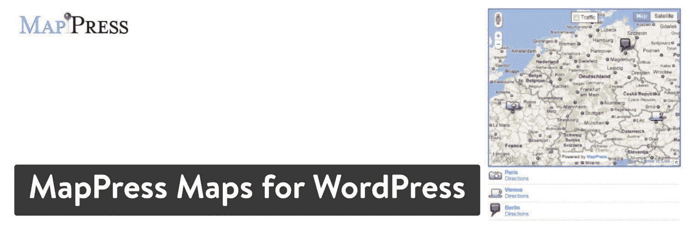
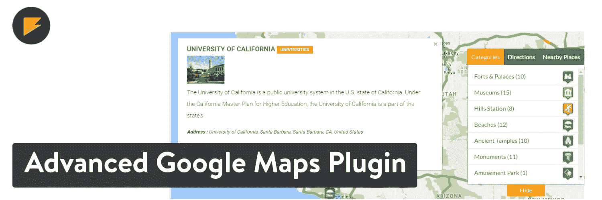
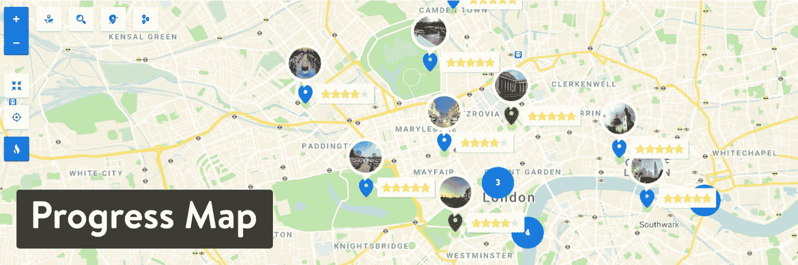
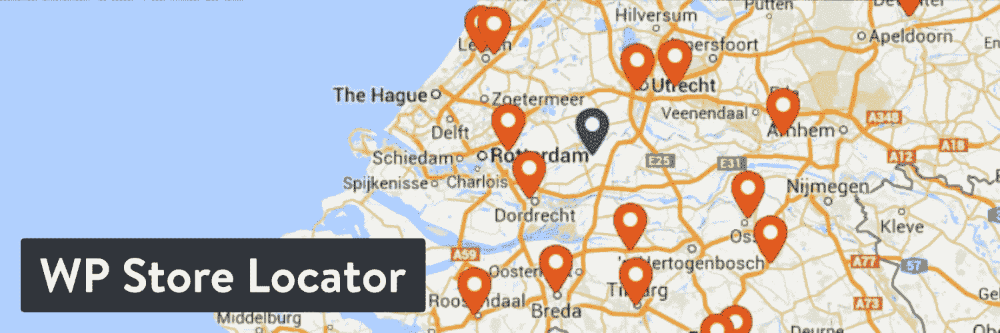
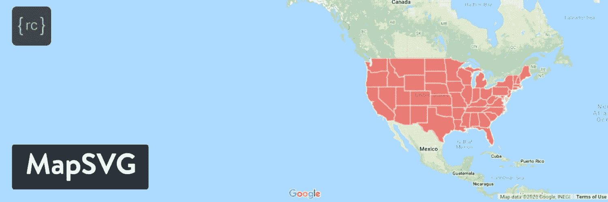

# 2022 年有 11 个方便的 WordPress 地图插件可供选择(免费+高级)

> 原文：<https://kinsta.com/blog/wordpress-map-plugin/>

从[列出地点](https://kinsta.com/blog/wordpress-directory-plugins/)到展示只与你的品牌相关的独一无二的产品地图，在线地图行业继续其令人印象深刻的发展。作为一个 [WordPress 用户](https://kinsta.com/knowledgebase/what-is-wordpress/)，你可能想找一个 WordPress 地图插件来显示公路旅行的路线，或者确保你的网站上提到你的家具连锁店的零售点。

许多 [WordPress 插件类别](https://kinsta.com/best-wordpress-plugins/)缺乏受欢迎程度，以至于开发者不会花时间去创建具有可观特性集的适当插件。地图插件就不是这样了，因为很多公司都需要这种功能。因此，成百上千的 WordPress 地图插件充斥着互联网。

这既是好的也是坏的。

我们知道存在大量优秀的解决方案，但我们必须在混乱中找出最佳方案。

[Searching for the perfect WordPress map plugin? 🗺 Look no further. This list has the top picks to keep your online map right on course.📍Click to Tweet](https://twitter.com/intent/tweet?url=https%3A%2F%2Fkinsta.com%2Fblog%2Fwordpress-map-plugin%2F&via=kinsta&text=Searching+for+the+perfect+WordPress+map+plugin%3F+%F0%9F%97%BA++Look+no+further.+This+list+has+the+top+picks+to+keep+your+online+map+right+on+course.%F0%9F%93%8D&hashtags=WPPlugin%2CWPTips) ## 在 WordPress 地图插件中寻找的特征

鉴于一个简单的[谷歌搜索](https://kinsta.com/blog/alternative-search-engines/)，或者在 CodeCanyon 或 WordPress 仓库上浏览，提供了太多的 WordPress 地图插件选项，我们整理了一份理想功能的列表，供你在完成自己的搜索时参考。

> Kinsta 把我宠坏了，所以我现在要求每个供应商都提供这样的服务。我们还试图通过我们的 SaaS 工具支持达到这一水平。
> 
> <footer class="wp-block-kinsta-client-quote__footer">
> 
> 
> 
> <cite class="wp-block-kinsta-client-quote__cite">Suganthan Mohanadasan from @Suganthanmn</cite></footer>

[View plans](https://kinsta.com/plans/)

我们使用这些功能指南编辑了一份市场上顶级 WordPress 插件的列表，基于功能、评分、[评论](https://kinsta.com/blog/best-wordpress-review-plugins/)和用户界面对它们进行了比较。

那么，在编译你自己的地图插件时，你应该关注哪些特性呢？

*   一个标准的地理地图构建器，具有可视元素和选项来调整颜色、标签和位置。
*   构建独特地图的潜在工具，如商场、餐馆、身体部位或产品展示区的地图。
*   使地图在所有设备上都看起来像样的响应式构建模块。
*   可定制的基本地图标记，用于标注地图上的内容，并增加演示的交互性。
*   改善设计过程并确保没有人必须从头开始创建的地图主题。我们享受来自流行国家、州和城市的预建地理地图。
*   支持使用坐标或地址的快速地理搜索。制作地图时不应该要求有一个地方的精确坐标，因为没有人知道这些，而且在网上找到它们需要一段时间。地图制作擅长快速地址搜索工具。
*   将地图放置在页面之外的其他位置的选项。我们喜欢看到侧边栏、帖子和页脚的[短代码](https://kinsta.com/blog/wordpress-shortcodes/)和[小部件](https://kinsta.com/blog/wordpress-widgets/)。
*   虽然不是每个人都需要这个功能，但是商店定位器功能是地图插件中最常见的需求之一。
*   绘图、书写和动画选项，用于共享有关路线的信息或向地图添加视觉效果。我们喜欢用这些来绘制公路旅行地图或在地图上添加地标图片。
*   谷歌地图翻译经常从谷歌或必应地图等地方获取信息，并调整样式或使其看起来更好。
*   完全互动，具有点击获取路线和查看更多信息(如电话号码和商店营业时间)的功能。
*   上传用于添加您自己的标记和其他地图元素的工具。例如，您可能希望添加一个汉堡图标来标识地图上的餐馆。
*   快速翻译工具，使每个人都可以使用地图插件，无论你使用什么语言或你住在哪里。
*   选项来绘制自己的自定义形状，如矩形或三角形或路线。
*   FontAwesome 支持，这样你就不必总是上传自己的图标。

我们可以继续列出 WordPress 地图插件的重要特性，但是现在是时候评估最佳选项了。

请继续阅读，我们将重点介绍定价、使用案例和功能等优点和缺点。

有数百个 WordPress 地图插件...但是你的站点只需要一个。🗺使用这个顶级选项列表在混乱中导航。👇 点击推文

## 2022 年热门 WordPress 地图插件

使用此列表跳到不同的地图插件。

### 1.WP 谷歌地图

WP Google Maps 在发布地图和制作地图时实现了简单和简洁，不需要任何代码。开发者明白 [iframes](https://kinsta.com/blog/wordpress-iframe/) 对于地图来说已经是过去的事情了，所以你主要接收主题、快速设置和简单的发布工具来在你的网站上查看地图。

例如，你可以生成一个带有地图的[联系页面](https://kinsta.com/blog/wordpress-contact-form-plugins/)，或者为你的[旅游博客](https://kinsta.com/blog/how-to-start-a-travel-blog/)在地图上添加路线。送货区为餐馆创造了奇迹，形状生成器也为你的地图增添了乐趣和创造力。

作为一个高评级的免费地图插件，WP 谷歌地图解决方案是我们的首选之一，至少可以测试并看看它是否能为您的组织带来成功。该插件不仅允许你在 30 秒内制作一张地图，而且它[包括一个谷歌地图](https://kinsta.com/blog/wordpress-google-maps/)和 OpenLayers API，用于最终的定制和可扩展性。

WP Google Maps

WP 谷歌地图拥有诸多优势，如[本地化](https://kinsta.com/blog/localization-strategy/)，多种地图类型，多种主题可供选择。至于地图类型，您会发现一个选项列表，如地形、卫星视图和道路地图。

考虑到您还可以激活商店定位器来指示零售店的方向。一个高级版本在开发者网站上出售，可以选择制作无限地图，导出 CSV 文件，甚至将几个地图合并为一个。

WP Google Maps 改进了大多数地图插件所提供的基本商店定位器，并且它将这些优势更进一步，增加了无数其他功能。

#### 定价

核心插件是免费的。 [Pro 版](https://www.wpgmaps.com/purchase-professional-version/)有三种计划，第一种是 39.99 美元(一次性支付)，第二种是 99.99 美元，第三种是 199.99 美元的无限许可。

#### 哪些特性使它成为顶级的 WordPress 地图插件？

*   WP Google Maps 插件包括一个地理地图构建器，带有可视化设置，可以在发布前查看您的地图。
*   自定义包括高度、宽度、对齐和颜色选项。您可以根据地址搜索而不是坐标来选择标记。
*   从诸如商店定位器、方向地图和带有标记等级的地图等模板中进行选择。
*   从 Google Maps 和 OpenLayers 等服务中获取方向图。该插件利用[搜索引擎](https://kinsta.com/blog/alternative-search-engines/)获取尽可能详细的地图信息。
*   使用图标和基于文本的描述来设置标记列表的样式。
*   与 [WooCommerce](https://kinsta.com/blog/woocommerce-tutorial/) 集成，在地图上放置产品或用标记识别产品特征。
*   添加可视化元素，如热图、[视频](https://kinsta.com/blog/video-hosting/)和[自定义字段](https://kinsta.com/blog/advanced-custom-fields/)，所有这些都随该插件的高级版本一起提供。
*   使用定制数据源，如 JSON、XML 和 CSV 文件。你甚至可以选择安排这些导入来保持地图更新。
*   利用多边形和折线来分隔地图的各个部分，并识别地区或州等地点。将这些图标与图标搭配起来，专注于客户应该关注的地方。
*   整合方向路标以显示方向，例如长途旅行或设想城市旅游路线。
*   过滤器为用户提供了类别、字段和标签等选项，以便根据地图上的标记进行过滤。
*   所有的地图都[响应](https://kinsta.com/blog/responsive-web-design/)，以便在移动设备上进行出色的查看。
*   这个插件有几十种翻译，可以在世界各地使用。一些语言包括克罗地亚语、土耳其语和巴西语。
*   在站点的几个区域放置地图，例如边栏和页脚。这是在快速代码和部件的帮助下完成的。

#### 谁应该考虑这个地图插件？

WP Google Maps 对于寻找简单方法将地图添加到 WordPress 站点的普通公司来说是有意义的。这是一个全方位的解决方案，包括定位工具、标记、主题，甚至导入。

WP 谷歌地图满足了大部分地理地图需求。除非你在寻找一个独一无二的地图构建者，比如房地产或医药，WP 谷歌地图就能胜任。

### 2.用于 WordPress 的地图

MapPress Maps for WordPress ，或简称 MapPress，通过使用交互式谷歌和传单地图，为您的地图添加了一点高功能设计。这个插件提供了在你的 WordPress 网站上获取地图的最快方法之一，尽管它的设计并不现代。

说了这么多，这些图的重点是看起来专业，切中要害。如果你的主要目的是让你的旅游博客显得可爱和古怪，那你就没有安装 MapPress 插件。

MapPress Maps for WordPress

至于关键功能，预计将有一系列受支持的视图和方向设置，以及对多个地图、实时交通报告和自定义文本的支持。我们喜欢在你的网站上快速放置地图的短码功能。看到在帖子或页面中放置地图需要几秒钟也很好。

#### 定价

核心插件是免费的。 [MapPress Pro](https://mappresspro.com/mappress) 有一个 49.95 美元的基础授权。一个开发者许可证标价 79.95 美元。这些是年度价格。

#### 哪些特性使它成为顶级的 WordPress 地图插件？

*   该插件允许在所有 WordPress 页面和帖子上创建地图。
*   你得到了一个基本的、专业的地图设计，清除了任何干扰地图主要目的(导航)的额外元素。
*   有一个一键式方向按钮，可以在所有设备上将用户直接发送到谷歌地图。
*   短码可以方便地将地图放在网站的独特区域，比如博客文章的中间或小部件中。
*   创建几个地图，并把它们都放在一个页面上。如果你想在一页上有 50 张地图，这是可能的。
*   模板标签有助于将来组织和查找正确的地图模板。
*   用地址或者经纬度坐标做一个地图。这为添加快速地址提供了可能性，但也为类似国家公园路径地图的东西标记非地址位置。
*   使用自定义设计元素制作自定义标记。全面的 HTML 支持增加了你的选择，扩展了 T2 高级开发人员的工作能力。
*   超过 100 个标记图标将您的地图变成充满活力的视觉体验。
*   这个插件允许你混搭地图，你可以把两三张地图组合成一个交互工具。
*   您还可以混搭其他元素，比如分类法、类别和标签。
*   该插件与 TurboCSV 集成，帮助您导入 CSV 数据，就像您在一个文档中有一个城市或地址列表一样。
*   您可以根据自定义字段制作地图。
*   显示目录信息和地图键。这是在标记列表的帮助下完成的，标记列表在地图上插入标记并标识每个标记在地图上的含义。
*   接收用于在侧栏和页脚区域放置单一地图和混搭的小部件。
*   在指定地图上显示[实时交通](https://kinsta.com/blog/how-to-drive-traffic-to-your-website/)信息。

#### 谁应该考虑这个地图插件？

MapPress 的设计类似于[在线目录](https://kinsta.com/blog/directory-website-wordpress/)或位置查找器，这正是它在这些用途上创造奇迹的原因。

由于有些“简单”的外观，我们不推荐 MapPress 用于创造性的博客/网站，而是用于那些需要快速获得位置信息的用户。因此，它看起来像是在线目录、零售商店和研究公司的赢家。

### 3.WordPress 的高级谷歌地图插件

WordPress 的高级谷歌地图插件从多个来源导入，并在 WordPress 上为地图提供街道视图和自定义图标。这些听起来都很标准，但是这个插件如此受欢迎的原因是所有的功能都工作得很好，你得到了高质量的客户支持，并且开发者尽可能地让这个插件更现代。

Advanced Google Maps plugin

该插件拥有 WordPress 地图插件中最高的五星评论数。我们期待这个恶名的部分原因是因为可视化构建器和地图制作者可用的各种标签和标记。

这包括三角形、正方形和其他形状，以及有趣和相关的图标，以影响人们应该去哪里，并告诉他们应该期待什么。[调整所有地图的颜色](https://kinsta.com/blog/website-color-schemes/)，包括地址和坐标等信息。

没有必要输入某个位置的坐标，但对于令人困惑的位置或隐藏在树林中的位置，该选项仍然有效。除此之外，只需输入一个地址，并使用自动完成功能。

考虑高级谷歌地图插件的另一个原因是路线生成器，在那里你选择一个开始和结束的位置，然后你不用做任何工作就可以画出路线。您还可以批量完成类似的任务，创建一个完整的路线或图标列表来添加到地图中。

#### 定价

作为一个高级插件，高级谷歌地图插件售价 59 美元，它没有免费版本。六个月后可获得额外的特优支持。

#### 哪些特性使它成为顶级的 WordPress 地图插件？

*   为旅游公司和度假套餐添加客户路线。它与内置图标、路线和其他元素相结合，为所有用户提供卓越的地图。
*   从 JSON 和其他文件导入数据，在几秒钟内将信息填入地图。
*   先进的谷歌地图插件标配了几个集成，其中一些包括 [BuddyPress](https://kinsta.com/blog/wordpress-forum-plugins/#buddypress) 、[重力形式](https://kinsta.com/blog/wordpress-contact-form-plugins/#gravity-forms)和 [AirTable](https://kinsta.com/blog/trello-alternative/#2-airtable) 。
*   前端提交非常适合链接到房地产列表和接受特定房屋的联系方式。
*   在几秒钟内将 Excel 表格或 MySQL 数据库转变成谷歌地图。
*   各种皮肤颜色和视点定制将您的地图变成彩色指南。
*   在所有地图上显示多个过滤器，以确保用户在合理的时间内找到信息。
*   在谷歌地图上显示与位置相关的 WordPress 帖子。我们最喜欢零售商店或旅游博客，在那里你可能想扩展位置对你的业务意味着什么。
*   基于起点和终点在地图上插入路线。每张地图都允许多条路线，所以你可以发挥创意。
*   在您的地图上提供按钮，以便用户获取路线和查看有关位置的高级信息。
*   该插件根据位置和文章列表的类型提供了多种显示皮肤。
*   使用绘图工具快速创建形状并添加颜色。高亮显示地图的部分，然后调整大小以高亮显示区域。
*   通过将标记聚类放在一个标记下来合并它们。这显示了当用户缩小地图时伞状标记下的标记数量。
*   使用 CSV 文件导入和导出数据。
*   这些地图带有各种皮肤和现成的配色方案。您还可以添加无限数量的额外字段，并向每个地图添加多语言控件。
*   街景视图将用户发送到谷歌街景视图，以放大项目和位置，如店面和纪念碑。

#### 谁应该考虑这个地图插件？

先进的谷歌地图插件吸引了那些有独特需求的人。各种不同寻常的功能和插件确保利基功能得到涵盖。例如，您可以为房地产列表、餐馆或用户位置制作地图。

我们喜欢的另一个集成是 BuddyPress，你可以从你的数据库中添加用户信息，并显示你的用户居住在哪里。

### 4.image Map Pro for WordPress–SVG 地图生成器

Image Map Pro for WordPress 通过其选项将清晰度提升到一个新的水平，以开发任何你可以想象的地图。这里我们指的是任何东西。

你对指出肌肉或痛点的身体生物地图有想法吗？那是完全可能的。您是否愿意通过用地图标注每个物理特征来展示[新产品](https://kinsta.com/blog/how-to-price-a-product-wordpress/)或发明？[上传那些产品的图片](https://kinsta.com/blog/wordpress-media-library/)和设计原型都是插件的一部分。

您还会喜欢令人印象深刻的平面图工具和大量预建的地理位置地图。

Image Map Pro plugin

作为总结，Image Map Pro 插件包括图像映射和地理交互式地图。因此，您可以生成一张零售店位置地图，或者拿一个全新的家，然后上传勾勒出地图轮廓的图像。

关于 Image Map Pro 的伟大部分是自定义图像映射、SVG 形状和大头针的选择。变得有创造性是这个插件的全部意义。

#### 定价

没有免费版本。CodeCanyon 上的高级版本售价为 39 美元，扩展客户支持需要额外收费。

#### 哪些特性使它成为顶级的 WordPress 地图插件？

*   您可以为各种项目制作基于图像的地图，例如建筑物、产品，甚至是人体。
*   样式控制包括多边形形状、动画和图像背景的选项。
*   使用 JavaScript 和 HTML API 来扩展内置特性。
*   FontAwesome 图标和自定义操作为地图的视觉特性添加了新的元素。
*   您可以导入图像和数据，在几分钟内构建一个地图。
*   每张地图都可以在移动设备上使用，反应非常灵敏。
*   你会收到来自世界各地的 50 多张预先制作好的地图。例如，您可能想要使用欧洲国家地图或美国所有州的地图。
*   在拖放编辑器的帮助下，您可以完全控制您的地图。
*   使用精确工具绘制自定义形状，以突出显示地图的特定部分，并更改形状的尺寸和颜色。
*   使用 [FontAwesome 图标](https://kinsta.com/blog/wordpress-icon-fonts/)改善地图视觉效果。

#### 谁应该考虑这个地图插件？

Image Map Pro 插件对于像室内平面图和人体图这样的“特殊”地图来说是一个简单的工具。我们最喜欢那些想要上传图片并制作地图的人，尤其是在识别新产品的特征或规格时。

该插件还可以处理地理地图，考虑到你可以访问几十个预建的地图，这些地图已经预先定义了区域。另外，你可以在地图上画画，这是一个非常可靠的选择。

### 5.进度图 WordPress 插件

进度地图插件专注于显示路线进度的地图。这是一个位置地图构建器，用于插入物理地图位置，然后使用道路图引导用户到各个地点。简而言之，进度地图插件将人们送到目的地。

他们可以查看最高效的旅程是什么样的，完全不需要打开谷歌地图等辅助应用程序来获取方向。当然，方向搜索也是进度地图插件的标准配置，允许路径的简要概述和逐圈导航。

这些列表以标记的形式显示在一个转盘中，这样用户就可以在不同的位置之间切换，查看更多的信息，而无需选择任何一个位置。

该插件利用[文章类型](https://kinsta.com/blog/wordpress-custom-post-types/#difference)和标准的 WordPress 格式技术在你的地图上添加列表和标记。这使得有经验的 WordPress 用户可以很容易地以我们熟悉的格式组合大部分功能。

Progress Map plugin

总的来说，这些地图非常漂亮，设计优雅，界面友好，并定期添加功能，以帮助扩展已经密集的功能集合。我喜欢这个插件的主要原因是它的视觉图标和星级。

考虑到您可以显示目的地的小圆形图片图标，并在地图上移动时查看用户评级，这些地图非常适合目录和位置查找器。

#### 定价

这个插件没有免费版本。高级插件售价 59 美元。这是一次性成本，但您可以通过收取额外费用来延长客户支持。

#### 哪些特性使它成为顶级的 WordPress 地图插件？

*   进度地图插件的特点是可定制的元素，用于识别位置和展示这些位置的图片。
*   您将获得一个搜索和过滤工具来评估位置描述和标记之间的距离。
*   使用形状和线条添加路线，链接列表，并显示驾车或步行的最佳选项。
*   从 70 多种地图主题和样式中进行选择，其中大多数看起来都很现代且用户友好。
*   用信息转盘补充地图。地图连接到旋转木马，所以你可以包括一个更大的图片，比如说，一个教堂，然后陈述教堂的名称及其意义。用户通过点击标记或滚动转盘来滚动查看详细信息。
*   当您在一个小区域内有多个位置列表时，制作您自己的自定标记并添加标记簇。
*   当有人点击列表时弹出的用户评论的链接。
*   设置独特的设计元素，如地面覆盖、图像标签和图像不透明度。
*   该插件具有自动完成功能，可以在用户输入时显示地址。该功能的另一部分包括将搜索限制在特定位置，如国家或随机边界。
*   绝大多数的设计区域都包括 [CSS 模块](https://kinsta.com/blog/wordpress-css/)，用于扩展内置功能和添加新的独特设计。
*   传送带包括一长串自定义设置，如滚轮、环绕传送带、动画和自动滚动。当用户选择转盘上的项目时，您还可以允许自动缩放地图。
*   从内置标记图标中选择或上传您自己的图像用作图标。甚至还有不寻常的图标选项，如热图和附近的地方。

#### 谁应该考虑这个地图插件？

进度地图插件提供位置地图，所以它最适合在地图上放置地标和商店等项目。我们最喜欢它，因为它创建了一个现代的、以列表为中心的、具有高度交互性的地图。突出功能允许您将形状添加到地图上，以便向用户演示路线。

例如，该插件对酒店列表、房地产、连锁餐厅或在线目录有意义。如果你想显示过去旅行的路线，它也可以很好地用于旅游网站。
T3】

### 6.谷歌地图的地图小部件

[Google Maps 的地图小部件](https://wordpress.org/plugins/google-maps-widget/)在标题中有很多描述，告诉我们你可以为 WordPress 创建一个地图并把它放在一个小部件中。这不仅使得在你的网站[页脚、页眉](https://kinsta.com/knowledgebase/add-code-wordpress-header-footer/)或侧边栏中加入地图变得容易，而且地图小部件的轻量级特性确保了你在加载地图时不会看到任何延迟。

地图插件提供了您创建的地图的缩略图。点击缩略图后，一个 lightbox 版本会显示出来，以进行进一步的交互。

另一个让地图插件如此受欢迎的组件是 Gutenberg 块。因此，如果您喜欢使用 [Gutenberg 编辑器](https://kinsta.com/blog/gutenberg-wordpress-editor/)，您可以选择将小部件放置在拖放构建器中。或者，你可以坚持使用许多人习惯使用 WordPress 的基本小部件。

## 注册订阅时事通讯

### 想知道我们是怎么让流量增长超过 1000%的吗？

加入 20，000 多名获得我们每周时事通讯和内部消息的人的行列吧！

[Subscribe Now](#newsletter)

Maps Widget for Google Maps plugin

简单似乎是这些开发人员的一种趋势，因为功能列表很短，但它仍然是一个强大的插件，有足够的功能来突出显示您需要的地图。

还值得一提的是，有几个地图演示可以让创意源源不断，还有一个高级版本可以为您的地图构建过程添加更多功能。

#### 定价

核心版本的价格为 0 美元。除了更多的功能和高级支持， [Pro 版](https://www.gmapswidget.com/)售价为每年 18.99 美元。

终身个人许可证的售价为 39 美元，而代理版本的售价为 79 美元。这两项都是一次性费用，因此与年度费用相比，终身服务更具吸引力。

#### 哪些特性使它成为顶级的 WordPress 地图插件？

*   地图微件插件是最容易使用的选项之一，具有快速安装、快速设计设置、简单的微件和古腾堡模块。
*   您可以添加无限数量的地图，并在每个地图上粘贴任意数量的图钉。你在一篇文章或[侧边栏](https://kinsta.com/knowledgebase/remove-sidebar-wordpress/)中拥有的地图数量没有限制。
*   至于位置，地图插件可以让你在网站上的任何地方插入地图，从侧边栏到[菜单](https://kinsta.com/blog/website-navigation/)和页面到帖子。这是一个通用的解决方案，考虑到许多竞争对手缺乏这样的小部件。
*   定制设置允许根据[颜色、尺寸和字体](https://kinsta.com/blog/how-to-change-font-in-wordpress/)来匹配你的网站设计。
*   每个地图都提供了一个响应设计，可在所有设备上查看。
*   几个选项改进了地图浏览，如方向按钮、街道视图等。
*   从几个地图示例和主题中进行选择，例如纽约和伦敦等城市。
*   该插件限制了服务器使用的资源，减少了 API 调用，这是众所周知的产生缓慢加载地图和潜在的页面问题。
*   如果 Gutenberg 模块或小部件不适合您，可以考虑在页面和帖子等区域插入短代码。
*   该插件包括大约十几种语言的翻译，包括荷兰语、英语和瑞典语。
*   在您的地图上插入大头针，并在一个区域整合多个列表的特征集群。使用 CSV 或其他文件从地图中导出或导入数据。
*   链接到 [Google Analytics](https://kinsta.com/blog/how-to-use-google-analytics/) 了解更多关于谁在访问您的地图以及他们如何访问地图的信息。
*   利用各种谷歌地图选项，如地图级别缩放，标题文本和灯箱皮肤。
*   为了消除复杂性，地图微件只有两个字段，一个用于地图标题，另一个用于实际地址。这就是你需要知道的，以便在几秒钟内启动地图。

#### 谁应该考虑这个地图插件？

对于那些除了插入地图的常规代码之外还渴望小部件的人来说，地图小部件插件增强了地图制作过程。还有一个古腾堡模块，所以我们相信地图插件对于那些寻找插件或古腾堡区块的人来说是一个可靠的解决方案。

作为一个准系统地图插件，它也是值得尊敬的，因为它移除了你会从其他竞争对手那里发现的许多复杂功能。这提高了潜在的站点速度，有助于快速发布地图，并加快每个单独地图的加载时间。

### 7.WP 商店定位器

WP 商店定位器插件致力于列出商店位置的大部分功能，无论是零售商店，房地产位置，还是像律师事务所这样的服务型企业。

从表面上看，WP Store Locator 插件提供了一个基本的位置管理系统，带有用于在地图上添加地图和列表的定制工具。

然而，当你看到这个插件的整体美观和简单时，它的优势就开始显现了，它允许你在几分钟内发布地图和位置细节。

自定义标注以及地图外观调整都是可能的。您可以添加搜索栏来显示基于特定半径限制的结果。更不用说，地图上所有地点都有行车路线。

WP Store Locator plugin

您制作的每个商店定位器都提供了一个交互式地图，一个用于定位企业和查看方向的详细信息模块，以及几个搜索字段，如邮政编码和您希望看到多少结果。

当点击方向按钮时，方向就会弹出，所以没有重定向到另一个页面。有趣的是，在 WordPress 后端，每个设置都被编译成一个长长的页面。这使得查找设置和调整元素(如搜索栏首选项、地图起点和地图尺寸)变得容易。

#### 定价

核心插件的大部分主要特性都是免费的。开发者用几个插件赚钱，从 19 美元到 99 美元不等。

这些插件包括:

*   搜索小工具。
*   CSV 经理。
*   统计学。
*   位置目录。

#### 哪些特性使它成为顶级的 WordPress 地图插件？

*   选项生成无限数量的商店定位地图与引脚和搜索功能。
*   您可以添加每个列表的其他详细信息，如联系信息、描述和开放时间。
*   自定义地图样式改善了当前 WordPress 设计的地图外观。改变一切，从颜色到尺寸和字体。
*   视网膜就绪标记图标提供了突出显示不同业务类型的图形。从插件中的九个图标中选择。
*   短码允许添加空白地图和其他额外的设计，如带有单一标记的地图。
*   您可以将插件链接到多语言插件，以便在不同的语言中使用它。
*   搜索结果显示在侧边或底部，这取决于您的设置。这些结果对于显示公司位置信息和图片非常有用。
*   过滤选项包括类别和半径搜索等元素。
*   一个独特的功能是从用户那里获取地理位置数据，以展示他们所在地区的商店。
*   创建标记聚类以合并包含多个列表的区域。
*   开发者可以在过滤器和自定义帖子类型的帮助下改变商店定位器的外观。
*   使用 Google Maps API 键、区域选择或简单地输入城市来选择地图起始区域。
*   该插件有一个预览工具，可以在发布给所有人之前查看你的设计到底是什么样子。
*   激活缩放和街景设置，使您的地图尽可能与[谷歌地图](https://kinsta.com/blog/wordpress-google-maps/)相似。
*   访问付费插件，如搜索工具、CSV 管理器和统计模块。

#### 谁应该考虑这个地图插件？

作为一个商店定位器，WP 商店定位器插件为拥有多个商店的公司提供了一个美妙的体验。这是一个轻量级插件，有多种实现工具。

总的来说，我们推荐这个插件给那些想要一个简单的商店定位器的人，没有太多使事情变得混乱的功能。

### 8.地图 SVG

当谈到高级地图插件时，顶级解决方案往往会提供你通常在免费插件中找不到的额外功能。MapSVG 顺应这一趋势，推出了矢量地图、图片上传和独特标记等产品，这些产品与我们在其他地图插件中看到的典型谷歌地图功能相结合。

有了图像和[矢量地图](https://kinsta.com/blog/what-is-an-svg-file/)，你可以完全控制你制作的地图类型，因为可能性是无限的。例如，您可能想要上传新产品的图像或以原型或房地产为特色的绘图。不管图像是什么，MapSVG 都可以让您将它转换成带有标记的地图。

MapSVG 有四种主要的地图类型:矢量地图、谷歌地图、图像地图和目录。向量更多的是地理的，交互式的解决方案，谷歌地图，嗯，谷歌地图。

需要一个给你带来竞争优势的托管解决方案吗？Kinsta 为您提供了令人难以置信的速度、一流的安全性和自动伸缩功能。[查看我们的计划](https://kinsta.com/plans/?in-article-cta)

影像地图提供了您用图片制作任何东西所需的创造性杠杆，而目录工具非常适合记录组织中的人员并为他们标记位置。所有这四个都可以通过 MapSVG 实现，使它成为一个适应你的地图需求的多维插件。

MapSVG plugin

您还可以在大多数地图上添加交互式覆盖图，例如从 Adobe Illustrator 中获取一个交互式机场设计，并将其放在常规的谷歌地图上。通过这种方式，用户可以在常规地图上移动，然后有机会在机场的房间里看到航站楼。

谷歌地图上没有类似的东西。街景确实可以看到建筑物的外部，但现在你有机会在此基础上扩展，制作室内区域和其他物体的惊人地图。

视觉设计器看起来有点像你在玩一个视频游戏，用拖放元素和逼真的设计组件来制作城镇和原型之类的东西。有了所有这些以及更多的东西，MapSVG 的灵活性和价格是无可匹敌的。

#### 定价

代码峡谷 49 美元。没有免费版本。延长客户支持需要额外费用。

#### 哪些特性使它成为顶级的 WordPress 地图插件？

*   您可以将任何矢量文件转换成带有交互式元素的地图。举例来说，你所要做的就是画一张美国地图，或者一张平面布置图。之后，该插件允许你分解单个的矢量项目并专注于它们，比如点击美国地图上的一个特定的州或者平面图上的一个房间。
*   把谷歌地图和矢量结合起来。这可以通过 SnazzyMaps 地图样式或生成您自己的矢量叠加来完成。
*   将交互式地图设计放在 JPEG 或 PNG 图像上。这对于房地产地图非常有用，你可以给一个街区拍一张照片，然后在照片上画出形状和高光。然后，使形状可点击。
*   您可以访问大型自定义字段库。一些字段包括位置、事件和人员。我们喜欢你可以导入大型数据集，并使用 [CSS 编辑器](https://kinsta.com/knowledgebase/edit-wordpress-code/)将每个地图作为一个单独的实体来管理。
*   这个插件可以让你用大头针显示位置，并在位置上附加特殊的物体。对象可以是文本块、图像或联系信息。
*   在几秒钟内制作一个虚拟的交互式商店定位器。商店定位器包括列表、搜索栏和过滤器。
*   开发可视化数据的地图。在热图颜色和条形图的帮助下完成此操作。
*   利用从操作到过滤器和数据库选择的高级地图编辑工具。
*   这个插件附带了一些模板，它允许保存你自己的模板。

#### 谁应该考虑这个地图插件？

凭借全面的图像映射功能，MapSVG 插件为那些需要模糊地图的人创造了奇迹。上传任何类型的图像都会产生一个潜在的地图，而使用矢量可以进一步扩展这种可能性。

因此，如果你有房地产、[电子商务](https://kinsta.com/blog/ecommerce-hosting/)、医疗或零售客户，他们都可以使用这种类型的地图产品。这肯定需要开发人员或图形设计师来进行高级编辑，并用矢量图像构建地图，所以请记住这一点。

### 9.谷歌地图简易版

当涉及到插件时，开发人员通常会寻找最简单的选择。如果你的项目是这样的话， [Google Maps Easy](https://wordpress.org/plugins/google-maps-easy/) 插件提供了有前途的和负担得起的产品来设计定制的 WordPress 地图，并在这些地图上放置标记描述。

该插件来自于 [Supsystic](https://supsystic.com/) 的开发者，这是一个在他们的投资组合中有几个插件的团队(像[照片图库](https://kinsta.com/blog/wordpress-photo-gallery-plugins/#photo-gallery-supsystic)和[数据表生成器](https://kinsta.com/blog/wordpress-table-plugins/#pricing-table)插件)。

至于 Google Maps Easy 插件，这个插件鼓励开发者制作无限的地图，并在 WordPress 页面上传播它们，而不需要花费太多时间。您在地图上放置的每个标记都提供了媒体描述、视频、电子邮件、电话号码字段和图像，如果不需要，您可以关闭所有这些内容。

这是一个完全响应的地图构建器，用短代码和 PHP 代码在 WordPress 上插入地图。将其与自定义主题和热点图图层相结合，以更好地介绍基于位置的地图构建。

Google Maps Easy plugin

Google Maps Easy 的设计具有非凡的天赋，它使用彩色的皮肤和生动的图片来定义地图上的每个位置。也有一些工具可以为谷歌地图添加覆盖图，无论是标记区域、突出显示某个区域的统计数据，还是显示人口密度。

总的来说，Google Maps Easy map 将实用、优雅和有趣的设计结合到一个出色的插件中。

#### 定价

核心插件是免费的。Supsystic 列出了高级版本的三种定价方案:

*   单一许可证——39 美元。
*   开发许可证——69 美元。
*   无限许可证——149 美元。

如果您需要更新和支持，这些似乎是每年更新的价格。

#### 哪些特性使它成为顶级的 WordPress 地图插件？

*   Google Maps Easy 反应灵敏，因此在较小的设备上查看地图时，地图会迅速就位。
*   制作无限的地图和标记。
*   使用前端编辑工具调整看起来不合适的地图元素。如果您希望您的用户编辑地图，这可能也会派上用场。这里想到了一个用户目录，企业或个人可以在其中填写自己的联系信息。
*   从各种地图样式中进行选择。基本的谷歌地图主题是一个很好的起点，但卫星、地形和道路地图的替代品会给你的地图增添一丝趣味。
*   使用多边形和线来标记路线和画出边界。视觉设计过程有助于在您调整颜色和形状等项目时看到变化。
*   实时预览所有正在进行的地图，以可视化用户所看到的。
*   利用按钮选择路线和方向，引导用户找到正确的导航元素。
*   KML 导入工具允许您利用点、形状和线，并根据自己的大小和形状进行调整。然后，将它们放在一个活动的谷歌地图上，以实现交互性和实时地图结果的结合。
*   您可以选择显示地图的不同图层。一个很好的例子是显示街道上的交通颜色，但也包括公交或自行车路线。
*   聚集大量大头针集合以确保地图不会太杂乱。当用户单击集群图标本身时，他们只能看到集群中的个体。
*   在考虑地图设计时，您可以访问 300 多个主题作为一个直接的起点。

#### 谁应该考虑这个地图插件？

我们对 Google Maps Easy 的称赞源于它漂亮的地图和流畅的交互性。它允许丰富多彩和生动的地图。更不用说，你可以[上传自己好玩的图标](https://kinsta.com/knowledgebase/bulk-upload-files-wordpress-media-library-ftp/)并生成集群、[滑块](https://kinsta.com/blog/wordpress-slider/)，甚至藏宝图。

这就是为什么我们坚持分析的“有趣”方面。这些地图有着古怪的外观，所以我们最喜欢这个插件给[博主](https://kinsta.com/learn/blogging-tips/)和那些把娱乐作为品牌形象一部分的组织。尽管制作专业地图是可能的，但我通常会向律师或医生等客户推荐竞争对手。

### 10.Mapplic

CodeCanyon 上的高级地图插件 Mapplic ，拥有很高的评级和令人印象深刻的销售历史。交互式地图制作解决方案是将矢量和图像文件上传到叠加地图标记和图钉的另一种选择。

这个插件不像其他基于矢量的地图插件那样灵活，但是它专注于两个领域:地理地图和平面布置图。

强大的 WordPress 插件可以在所有设备上运行，并且为开发用于原型和房地产目的的漂亮、详细的平面图设立了一个标准。我们也可能看到类似 Mapplic 的东西用于购物中心或活动网站，其中必须突出建筑物的几个房间。

地理地图包括几个内置的世界和国家地图，所有这些地图都有地标和独特的 pin，可以将用户发送到正确的地方。

Mapplic plugin

响应式设计和触摸优化地图为创建面向滚动的地图提供了独特的机会。我想象这些地图出现在平板电脑上，用于会议或贸易展览，向游客展示去哪里以及每个地区的特色企业。您还可以在平面图版本中添加多个楼层，向我们展示 Mapplic 是满足这些需求的一体化解决方案。

开发者表示，谷歌地图插件并不总是削减它。对于不寻常的地图来说，这是典型的情况，它们不仅仅关注谷歌给我们的东西。你甚至可以找到像营地、滑雪场和帆船这样的东西的地图，这可能为某些开发人员提供他们完成工作所需的工具。

#### 定价

Mapplic 插件在 CodeCanyon 上的售价为 46 美元。不存在免费的替代品。和大多数 CodeCanyon 插件一样，额外的客户支持需要另外付费。

#### 哪些特性使它成为顶级的 WordPress 地图插件？

*   Mapplic 插件提供响应性和交互式地图，以制作平面图和地理指南。
*   其他一些地图功能也可用于机场、医院和游轮。该插件支持任何类型的地图，你可以上传为矢量或图像。然而，它最适合用作平面图或国家地图生成器。
*   反应灵敏的触摸屏功能有助于放大、在地图上移动以及查看每个设计的复杂细节。
*   您可以访问内置的模板库，包括来自各大洲和国家的交互式地图。开发人员不断添加来自全球各地的新地图。
*   定制工具包括地图的大头针、图标和地标。深度链接也提供了一个有价值的优势，允许在所有引脚上引用 [URL](https://kinsta.com/knowledgebase/what-is-a-url/) 。

#### 谁应该考虑这个地图插件？

Mapplic 为这个列表中的各种矢量地图插件提供了一个基本的替代方案。由于简化的图片上传方法，从用户体验的角度来看更流畅。因此，我们将 Mapplic 归类为一个功能强大的图像映射器，它清楚地说明了如何制作地图。

杂乱的东西被清理掉了，但是你仍然获得了无与伦比的地图所需要的东西，特别是当我们谈论像船、节日和购物中心这样的特殊设计时。开发者甚至推荐 Mapplic 用于视频游戏地图和角色扮演游戏。

### 11.英雄地图高级版

[Hero Maps Premium](https://codecanyon.net/item/hero-maps-premium-responsive-google-maps-plugin/12577151) 整合了一个拖放构建器，一个完全响应的设计，以及一个没有太多花里胡哨的漂亮设计工具的免费标记包。付费的 WordPress 地图插件作为谷歌地图解决方案运行，具有制作专业网站地图的简单直观的设置。

标记地理混搭功能可将所有标记聚合到一个地方。我们的意思是，你创建或导入一长串标记(城市、商店或人)，然后将它们全部发送到一个大地图上进行发布。

仪表板和可视化构建器携手合作，提供广泛的配置选项，如标记、颜色和主题。大多数设计使用拖放编辑器，但是您也可以使用 WYSIWYG 构建器。

Hero Maps Premium plugin

自定义选项在 Hero Maps Premium 中非常突出，有各种各样的颜色和标记。这些标记标识特定的位置，如机场、餐馆和住宿。您也可以根据页面大小决定在全屏或固定地图之间切换。

形状也会派上用场，带来一种创造力和导向感。您可以手绘形状来制作飞行路线、区域边界等。考虑到功能就像铅笔一样，选项是无穷无尽的。

#### 定价

该插件售价 20 美元。开发者不提供免费版本。

#### 哪些特性使它成为顶级的 WordPress 地图插件？

*   英雄地图高级版提供了一个拖放编辑器和一个所见即所得编辑器，给你多种配置选项。
*   这些标记成束出现，有不同的颜色和图标，如加油站或机场标记。
*   用户在所有地图上接收过滤器，将标记组合在一起，或者只看到某些元素，比如他们想查看镇上的餐馆。
*   选项卡式过滤[看起来像一个对快速点击做出反应的文件夹](https://kinsta.com/blog/wordpress-portfolio-plugins/)。
*   当你想在地图上做一个特定的标记时，形状就起作用了。画正方形、三角形、直线和其他形状来模拟路线和指定区域。
*   飞行轨迹形状提供了一个自动化的曲线，就像你在真实的飞行轨迹雷达上看到的一样。
*   插件附带了许多颜色皮肤，包括黑白、蓝色、彩色等等。
*   从[谷歌字体](https://kinsta.com/blog/best-google-fonts/)中选择，以匹配网站上的排版。
*   如有必要，您可以选择上传自己的标记。这打开了几种可能性，看起来你可能有一个有趣的或有创意的标记与一个位置。
*   它具有完全响应的设计，将设计项目移动到适当的位置，以便在移动设备上完美观看。
*   插件的开发者标签提供了 [CSS 类](https://kinsta.com/blog/wordpress-css/#what-is-css-editing)和 JavaScript 回调事件。
*   您可以导入和导出完整地图或单个标记以在其他地方使用。
*   将类别分配给标记。你在后台管理这些类别，让你的用户在前台过滤标记。
*   将动画添加到地图，范围从拖放延迟到动画计时器，并单击缩放以加载缩放。
*   显示一个按钮，供人们从您的地图获取路线。这不会重定向到谷歌地图之类的东西。相反，它让用户留在你的网站上。

#### 谁应该考虑这个地图插件？

对于需要在地图上勾勒区域和路线的开发人员来说，地图绘制非常有意义。没有太多其他的 WordPress 地图插件有绘图选项。

总的来说，我们最喜欢英雄地图高级插件的标记和形状。地图提供了漂亮的界面，但是使用这个插件的真正动机来自明亮的以图标为中心的标记和形状绘制选项。

## 哪个 WordPress 地图插件对你的组织最有意义？

有数百个在线选项可供选择，哪个 WordPress 地图插件适合你的企业或客户？

我们缩小了范围，但你可能还有疑问。如果是这样的话，看看我们下面的最终建议:

*   WP 谷歌地图——把这个插件当作一个全方位的地图解决方案。它主要用于地理地图。
*   mappres Maps for WordPress——我们喜欢这个更专业的外观，特别是如果你正在制作一个位置查找器或在线目录。
*   WordPress 的高级 Google Maps 插件——想想这个插件在独特地图上的应用，比如房地产列表或用户位置数据库。主要特点是数据库。
*   image Map Pro for WordPress–SVG Map Builder–如果您正在为人体或产品设计平面布置图或基于图像的地图，我们喜欢这个。
*   进度地图插件——使用进度地图插件在地图上插入形状。
*   Google Maps 的地图小部件——把这个插件看作是一个带有小部件的轻量级选项。
*   WP 商店定位器——使用这个解决方案的主要原因是为了制作一个快速的商店定位器。
*   MapSVG–这是一个面向矢量和图像的地图构建器。它几乎适用于任何事情，只要你对它有一个形象。
*   Google Maps Easy–生成链接到 Google Maps 的有趣地图。
*   mapplic——使用这样的插件上传你自己的矢量图像，并把它们变成地图。作为另一个基于矢量的地图制作工具，Mapplic 插件可以开发任何东西。
*   英雄地图高级版——这是迄今为止最好的绘制形状和路线的地图插件。

如果你对最好的 WordPress 地图插件选项有任何疑问，请在下面的评论区给我们留言！此外，分享你对列表中没有的地图插件的想法。

(查看[2022 年将使用的 13 个 WordPress 项目管理插件和工具](https://kinsta.com/blog/wordpress-project-management-plugins/))。

* * *

让你所有的[应用程序](https://kinsta.com/application-hosting/)、[数据库](https://kinsta.com/database-hosting/)和 [WordPress 网站](https://kinsta.com/wordpress-hosting/)在线并在一个屋檐下。我们功能丰富的高性能云平台包括:

*   在 MyKinsta 仪表盘中轻松设置和管理
*   24/7 专家支持
*   最好的谷歌云平台硬件和网络，由 Kubernetes 提供最大的可扩展性
*   面向速度和安全性的企业级 Cloudflare 集成
*   全球受众覆盖全球多达 35 个数据中心和 275 多个 pop

在第一个月使用托管的[应用程序或托管](https://kinsta.com/application-hosting/)的[数据库，您可以享受 20 美元的优惠，亲自测试一下。探索我们的](https://kinsta.com/database-hosting/)[计划](https://kinsta.com/plans/)或[与销售人员交谈](https://kinsta.com/contact-us/)以找到最适合您的方式。