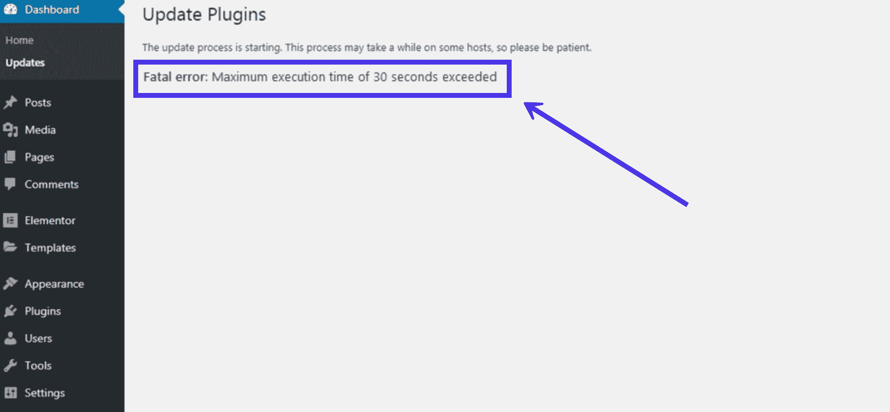
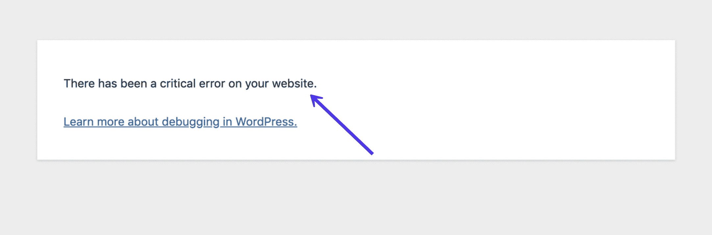
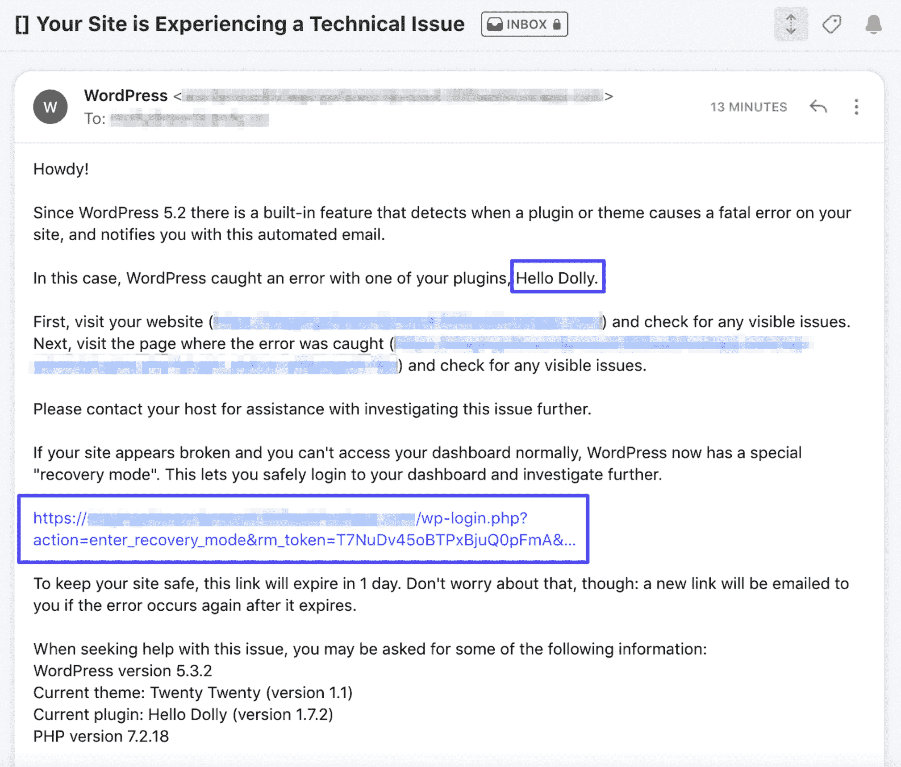
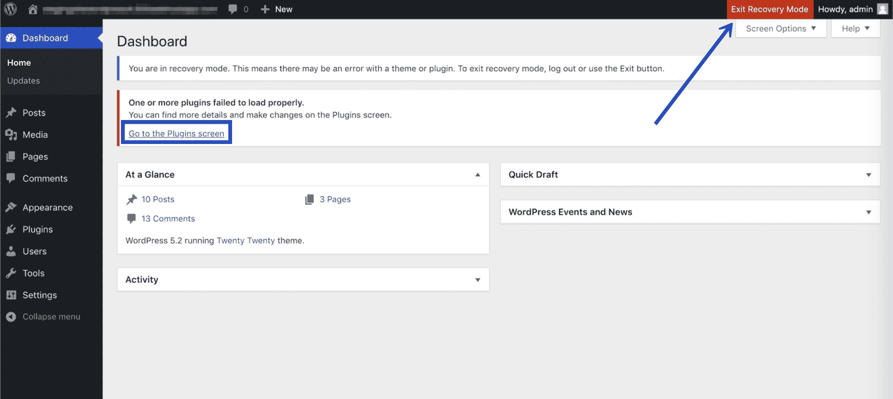
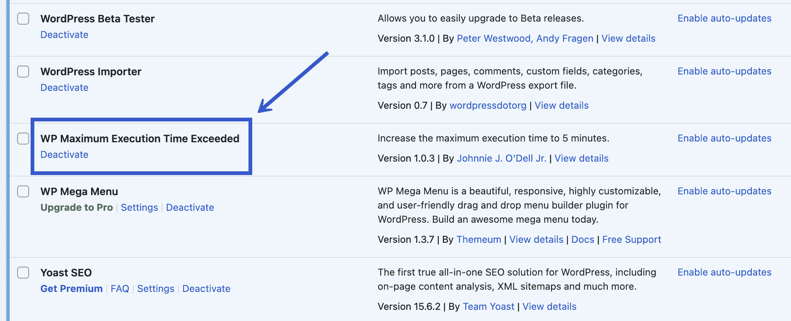
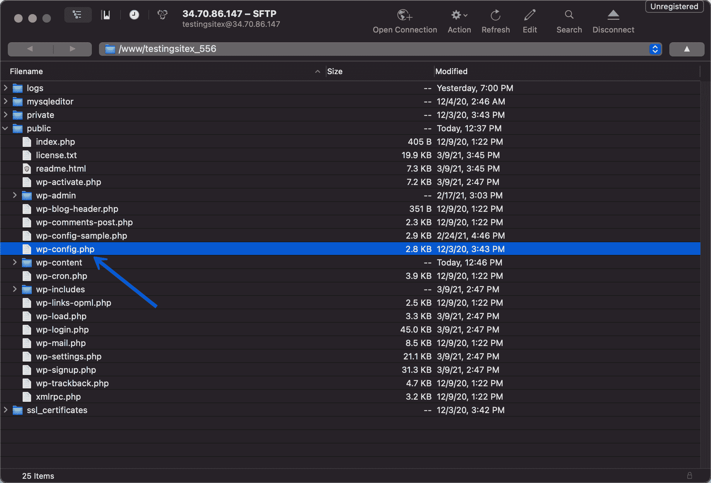
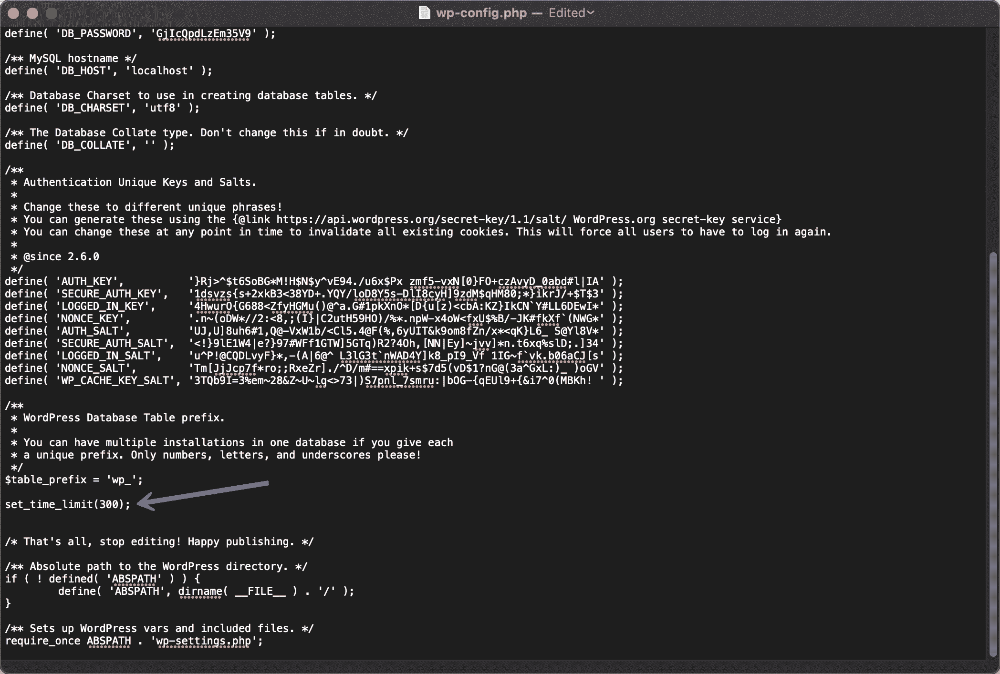
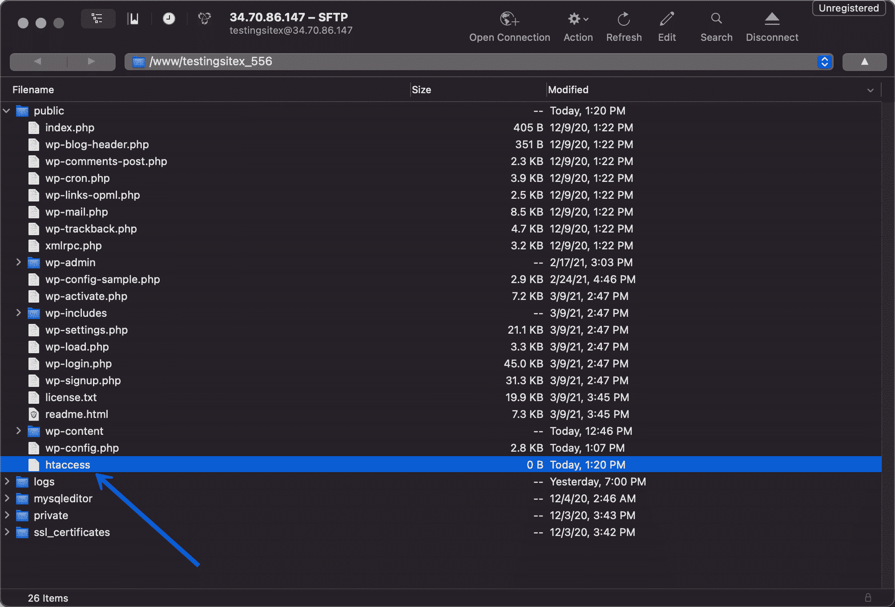
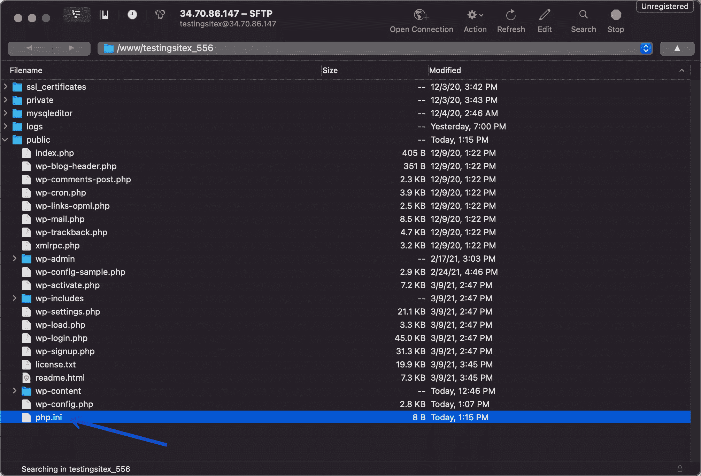

# 如何修复 WordPress max_execution_time 致命错误

> 原文：<https://kinsta.com/blog/wordpress-max-execution-time/>

你偶尔会在 WordPress 中遇到[错误或警告。你可能遇到的这些错误之一是致命错误。](https://kinsta.com/blog/wordpress-errors/)

遇到这样的错误可能会让你失去平衡。这是一个好消息，因为这是一个常见错误。这种情况不常发生，但一旦发生，有几种快速解决方法。

让我们开始吧！

### 更喜欢看[视频版](https://www.youtube.com/watch?v=S-n-xrvWmco)？


## WordPress max_execution_time 错误是什么？

WordPress**max _ execution _ time**致命错误在你的 WordPress 管理仪表板上看起来是这样的:



The maximum execution time error in the dashboard


整个错误消息如下所示:


> Kinsta 把我宠坏了，所以我现在要求每个供应商都提供这样的服务。我们还试图通过我们的 SaaS 工具支持达到这一水平。
> 
> <footer class="wp-block-kinsta-client-quote__footer">
> 
> 
> 
> <cite class="wp-block-kinsta-client-quote__cite">Suganthan Mohanadasan from @Suganthanmn</cite></footer>

[View plans](https://kinsta.com/plans/)

```
"**Fatal Error:** Maximum execution time of 30 seconds exceeded"
```

**30 秒**值可以是任何数字。通常在 30 到 60 秒之间。这个错误很容易在安装或更新主题、插件或 WordPress 核心时弹出。

## 为什么会出现 max_execution_time 错误？

每个 WordPress 站点都有处理服务器请求的最大执行时间限制。这意味着最小化服务器滥用。这个限制查看在你的站点上运行的所有 PHP 脚本，并阻止那些超过时间限制的脚本。

因为 WordPress 站点文件主要使用 PHP，所以关注 PHP 脚本以查看它们是否运行了太长时间并消耗了太多的服务器资源是非常必要的。恶意攻击利用永无止境的 PHP 脚本来抓取网站并不罕见。

此外，一些插件、主题或其他 WordPress 元素如果运行时间过长，会导致服务器资源紧张。插件似乎比其他元素更容易触发这个错误信息——可能是因为 WordPress 用户安装插件比他们修改代码或安装主题更频繁。此外，插件来自各种各样的开发人员，因此很难找出由可靠代码和频繁更新支持的好插件。

不管是什么原因，没有多少理由让 PHP 脚本运行很长时间；因此，存在最大执行时间限制。你的主机公司通常在服务器级别设置这个限制。

### 标准的最大执行时间限制是多少？

大多数托管公司强制执行的最大执行时间在 30 到 60 秒之间。这个范围给你的 PHP 脚本足够的时间来完成它们的工作，即使它们需要一些时间来执行。

一般来说，对于高质量的 PHP 脚本来说，30 秒的时间限制应该很好。但是，您可能需要将限制增加到 60 秒，这取决于您的代码和服务器响应。一些开发人员可能会选择 300 秒的最大值，但是超过这个值就不是一个明智的决定。

你可能会想:有没有可能有一个网站，PHP 脚本需要更长的时间，但它们不会对服务器造成任何损害？

是的——一些资源密集型网站不得不延长执行时间。然而，在得出不同的、不那么令人愉快的结论之前，最好假设可能是插件、主题或其他集成导致了这个问题。也有可能你的网站需要一个更强大的服务器，特别是如果你目前使用共享主机设置。

有时，托管公司可能会为您的网站设置太低的最大执行时间。这是很常见的情况，你可以通过联系你的主机提供商来解决。

### 但是上面写着“致命错误”:这听起来很糟糕

“致命错误”文本听起来很紧急，但是你的网站并没有永远不能工作的风险。最大执行时间错误是 WordPress 中最常见的警告之一。

然而，你可能会在你的网站前端发现一条消息，告诉用户网站遇到了技术问题。

这是一个问题——如果警告信息阻止了您的内容，并且在任意长的时间内保持活跃，您可能会失去销售额、潜在客户或读者。

### 如何判断 WordPress max_execution_time 错误是否发生

查看你是否已经超过最大执行时间的主要方法是在上传插件、主题或 WordPress 更新时检查你的仪表板中的消息。

安装或更新页面呈现有关更改的信息，并向您提供“成功”或“失败”的消息。“致命错误”消息也是一个选项。


Fatal error message inside the dashboard


另一种识别最大执行错误的方法是查看给用户的前端消息，上面写着，“站点遇到技术困难。”


Frontend message about technical difficulties


此消息还有其他变体，其中一些讨论了关键错误，并包含一个了解调试的链接。



Alternative frontend message on newer WordPress versions


最后，WordPress 通常会给网站管理员发一封电子邮件，解释某个插件或主题导致了致命错误。邮件还会提供一个链接，帮助你找到问题的解决方案，通常是删除有问题的插件或主题，或者增加你的最大执行时间限制。



An email from WordPress on how to fix the max execution error


对于所有导致“技术困难”消息的错误，请务必[阅读我们关于解决这些问题的指南](https://kinsta.com/knowledgebase/the-site-is-experiencing-technical-difficulties/)。但是，要特别关注修复最大执行时间错误，请继续阅读。
T3】

## 如何修复 max_execution_time WordPress 错误

如上所述，**max _ execution _ time**WordPress 错误出现在插件、主题或 WordPress 更新花费太长时间来运行 PHP 脚本之后。

您会在几个地方看到错误通知。如果你访问你的网站有困难，你收到的致命错误邮件有一个链接，可以在恢复模式下启动你的 WordPress 实例。



Recovery Mode allows you to access the dashboard and remove problems like plugins.


有几种方法可以修复**max _ execution _ time**WordPress 错误:

*   首先识别并卸载导致错误的插件、主题或其他资源。这是在恢复模式或通过 FTP 删除插件。
*   通过插件增加 WordPress 仪表盘的最大执行时间。
*   修改**wp-config.php**中的最大执行时间。
*   增加**中的最大执行时间。htaccess** 文件。
*   更改 **php.ini** 文件中的最大执行时间。
*   要求您的主机提供商增加最大执行时间。

卸载一个插件或主题通常是最快的方法，但是我们将在下面讨论所有的选项。

### 卸载问题项目

这个解决方案消除了最大执行错误，但是没有增加最大执行时间。因此，只有当你决定愿意为这个令人不快的插件或主题寻找替代品时，这才是一个合适的选择。

如果你想增加最大执行时间来为插件或主题腾出空间，那么请继续下面的章节。

那些对移除问题项目(例如，主题或插件)感兴趣的人，遵循下面的指示。

首先，用以下方法尽最大努力找出问题所在:

*   卸载最近安装的项目，特别是如果错误发生在安装插件、主题或者更新到 WordPress 最新版本的[之后。](https://kinsta.com/knowledgebase/check-wordpress-version/)
*   检查你的邮箱，看看 WordPress 是否给你发了一封关于这个致命错误的邮件。有时，它们会包含哪个插件首先导致问题的信息。
*   如果您不知道是哪个项目导致了错误，我们建议停用每个插件，然后一个接一个地重新激活它们，每次刷新以捕捉哪个插件导致了错误。

在你发现问题条目后，你应该从你的 WordPress 站点卸载它。

要完成这个过程，请阅读我们关于卸载 WordPress 插件的文章。该指南强调了如何使用仪表板、FTP 客户端等移除插件。

## 注册订阅时事通讯


### 想知道我们是怎么让流量增长超过 1000%的吗？

加入 20，000 多名获得我们每周时事通讯和内部消息的人的行列吧！

[Subscribe Now](#newsletter)

通过 dashboard 卸载对于快速移除来说是最有意义的，但是如果你不能访问 WordPress dashboard，通过 FTP 卸载插件或者主题也是很方便的。您还可以选择使用恢复模式进入控制面板。WordPress 会在你收到的邮件中包含一个恢复模式的链接。

最后，你可能会发现最近的 WordPress 版本升级导致了这个错误。使用我们的指南[如何降级 WordPress 版本](https://kinsta.com/blog/downgrade-wordpress/)来解决这个问题。一般来说，WordPress 版本不应该是根本原因——它通常是一个插件或主题，与新的 WordPress 版本不兼容。

### 如何增加 WordPress 的最大执行时间(使用插件)

另一个选择是增加最大执行时间，让你的插件和主题中的 PHP 脚本有更多的时间工作。

同样，最大执行时间是为了你的站点和服务器的安全，所以最好不要为了适应一个糟糕的插件或主题而增加它。然而，你可能会发现你的托管公司设置的执行时间很短，或者你可能需要一点额外的时间。

在这些情况下，增加最大执行时间来消除错误并减少将来再次出现错误的机会是可以接受的。

改变最大执行时间的一个方法是通过你的仪表板安装一个插件，它可以改变配置文件，而不需要你进入 WordPress 文件。我们喜欢为那些不习惯使用 FTP 客户端的人提供这个选项，但前提是你必须能够访问网站的仪表板。

一些安全和优化插件，如 [Google PageSpeed Insights](https://wordpress.org/plugins/google-pagespeed-insights/) ，有增加最大执行时间的选项。

另一个专门关注最大执行时间的插件叫做 [WP 最大执行时间超过](https://wordpress.org/plugins/wp-maximum-execution-time-exceeded/)。我们建议试试这个，因为它会自动重写**。htaccess** 文件来增加最大限制。


WP Maximum Execution Time Exceeded plugin.


你这边没事可做；安装并激活插件，使其工作。



You only need to install and activate the plugin—nothing more


默认情况下，插件提供了 300 秒的延迟，而不是你一开始就有的，这应该给你的站点主题和插件足够的时间来运行它们的 PHP 脚本。

最后，如果你想删除增加的时间限制，卸载插件。


### 如何增加 wp-config.php 的最大执行时间

下面的每一种方法都会挖掘你的核心 WordPress 文件。我们建议通过 FTP/SFTP 访问你的 [WordPress 站点文件](https://kinsta.com/knowledgebase/wordpress-files/)并修改其中的内容。

关于处理 WordPress**max _ execution _ time**错误，解决问题的一个方法是你打开【wp-config.php】的 文件。

打开一个到你的 WordPress 文件的 FTP 连接。找到并打开根文件夹(通常以你的站点命名)，点击`/public`文件夹。

文件夹包含了大量的核心文件，包括 wp-config.php 和 T2。

需要一个给你带来竞争优势的托管解决方案吗？Kinsta 为您提供了令人难以置信的速度、一流的安全性和自动伸缩功能。[查看我们的计划](https://kinsta.com/plans/?in-article-cta)

点击**wp-config.php**直接在 FTP 客户端编辑或者保存到你的电脑进行编辑。



Find the wp-config file.


将以下代码放入**wp-congfig.php**文件中:

```
set_time_limit(300);
```

通常，只要不修改文件中已经存在的任何内容，将代码放在哪里并不重要。我们建议找到“停止编辑”之前的最后一个区域，并将代码放在那里。



Set a new max execution time in wp-config


之后，保存并通过 FTP 上传新的**wp-config.php**文件到你的站点。本例中新的最大执行时间是 300 秒，但是您可以根据需要修改这个数字。

为了确保它能正常工作，回到 WordPress 看看现在是否一切正常。如果当你尝试上传一个插件或主题时错误没有出现，你已经成功了。

### 如何增加中的最大执行时间？htaccess

Kinsta 没有提供**。htaccess** 文件，因为我们使用性能更友好的 Nginx 服务器，不需要**。htaccess** 文件。在[的这篇文章](https://kinsta.com/knowledgebase/wordpress-htaccess-file/#kinsta)中，你可以了解到 Kinsta 对此的所有推理，以及 Nginx 的好处。

许多其他主机——主要是共享主机提供商——仍然使用 Apache 服务器，因此提供了一个**。你的 WordPress 根文件夹中的 htaccess** 文件。

你可以找到那个文件，就像你找到**wp-config.php**文件一样:通过 FTP 连接到你的站点，在 **/public** 文件夹下查找。

同样，如果你在 Kinsta 上托管你的站点，你将找不到它。我们建议所有 Kinsta 用户使用**wp-config.php**方法。



Find and click .htaccess


备份你的**是必不可少的。htaccess** 文件，然后再编辑它。[阅读这篇关于如何备份你的 WordPress 文件的教程](https://kinsta.com/help/external-backups/)。

备份后，打开**。htaccess** 文件进行编辑。

将这一行添加到文件中:

```
php_value max_execution_time 300
```

您可以随意将这个数字更改为您想要的最大执行时间。请保存文件并上传回 FTP 客户端的`/public`文件夹。最后，回到你的网站，看看问题是否已经解决。

### 如何增加 php.ini 中的最大执行时间

另一个不常见的文件叫做 **php.ini** 。这是另一个提高你执行能力的选择，但是通常情况下，使用 wp-config.php 方法会让你过得更轻松。

然而，如果你确定一个 **php.ini** 文件存在于你的根文件夹中，而其他方法由于某种原因无法工作，考虑转而使用 **php.ini** 文件。

与其他方法非常相似，您通常可以在`/public`文件夹中找到 **php.ini** 文件。通过 FTP 客户端访问该文件。

打开该文件进行编辑。



Locate the php.ini file


添加这一行以增加最大执行时间:

```
max_execution_time = 300
```

像往常一样，更改数字以满足您自己的需要，并记住通过重新上传问题项目来测试它是否工作，并检查是否所有的错误消息都消失了。

### 联系您的主机提供商，请求增加最大执行时间

在专用服务器上运行 WordPress 站点意味着你可以完全控制最大执行时间。所以之前的方法应该管用。您可能还会发现，您可以手动更改其他类型托管(如托管或 VPS 托管)的最大执行时间。

许多共享主机公司限制您修改最大执行时间限制的能力，以保护与许多其他应用程序和网站共享的整体服务器。

如果你不想弄乱它，或者你在增加最大执行时间方面有困难，你必须联系你的主机提供商，请求他们为你增加最大执行时间。

联系你的主机支持团队，告诉他们你看到了错误。然后，问问你目前的最大执行时间是多少。最后，请求他们增加你的限制，最好是在 60 到 300 之间。请记住，你应该删除任何插件或主题需要更长的时间。

[看过这个错误的请举手🙋‍♀️在这篇文章的帮助下学会如何快速修复它✅ 点击推特](https://twitter.com/intent/tweet?url=https%3A%2F%2Fkinsta.com%2Fblog%2Fwordpress-max-execution-time%2F&via=kinsta&text=Raise+your+hand+if+you%27ve+ever+seen+this+error+%F0%9F%99%8B%E2%80%8D%E2%99%80%EF%B8%8F+Learn+how+to+fix+it+quickly+with+help+from+this+post+%E2%9C%85&hashtags=WPTips%2CWordPress)

## 摘要

WordPress**max _ execution _ time**错误是由于缓慢的 PHP 脚本造成的，通常出现在插件、主题和偶尔的 WordPress 版本更新中。

你可能会在 WordPress 仪表盘中看到这个错误，在前端会有一个潜在的“技术困难”消息，以及一封来自 WordPress 的关于这个情况的邮件。

这是一个超级常见的错误。按照我们在这里介绍的步骤，您可以在几分钟内让您的站点重新正常运行。

* * *

让你所有的[应用程序](https://kinsta.com/application-hosting/)、[数据库](https://kinsta.com/database-hosting/)和 [WordPress 网站](https://kinsta.com/wordpress-hosting/)在线并在一个屋檐下。我们功能丰富的高性能云平台包括:

*   在 MyKinsta 仪表盘中轻松设置和管理
*   24/7 专家支持
*   最好的谷歌云平台硬件和网络，由 Kubernetes 提供最大的可扩展性
*   面向速度和安全性的企业级 Cloudflare 集成
*   全球受众覆盖全球多达 35 个数据中心和 275 多个 pop

在第一个月使用托管的[应用程序或托管](https://kinsta.com/application-hosting/)的[数据库，您可以享受 20 美元的优惠，亲自测试一下。探索我们的](https://kinsta.com/database-hosting/)[计划](https://kinsta.com/plans/)或[与销售人员交谈](https://kinsta.com/contact-us/)以找到最适合您的方式。