# 16 个 WordPress 会员主题来美化你的社区驱动的业务

> 原文：<https://kinsta.com/blog/wordpress-membership-theme/>

想想你目前有多少会员。从健身房到网飞，会员资格是支付产品和服务的现代方式。见鬼，甚至亚马逊也让顾客注册定期会员资格来定期购买产品。

那么，如果你想建立自己的会员社区呢？找到适合你情况的 WordPress 会员主题是很重要的。

这就是为什么我们在网上搜索并整理了你能找到的最好的 WordPress 会员主题列表。

准备好了吗？让我们开始吧！

## 在 WordPress 成员主题中寻找什么

让我们从这里的场景开始:你不一定要寻找一个专门为会员网站设计的主题。这样做的原因是因为你通常[必须利用一个 WordPress 会员插件](https://kinsta.com/blog/wordpress-membership-plugins/)来给你的网站提供它需要的功能。

因此，我们将讨论实际上带有一些成员特征的主题。但总的来说，我们的目标是找到拥有令人敬畏的界面的主题，提供漂亮的用户资料，并与你建立和发展会员网站所需的[插件](https://kinsta.com/best-wordpress-plugins/)很好地集成。如果你遇到一个有你喜欢的 WordPress 会员主题的网站，用我们的[主题检测工具](https://kinsta.com/tools/what-is-my-ip/wordpress-theme-detector/)找出它使用了什么主题。

至于在 WordPress 成员主题中寻找什么，这里有一些要点:

> 需要在这里大声喊出来。Kinsta 太神奇了，我用它做我的个人网站。支持是迅速和杰出的，他们的服务器是 WordPress 最快的。
> 
> <footer class="wp-block-kinsta-client-quote__footer">
> 
> 
> 
> <cite class="wp-block-kinsta-client-quote__cite">Phillip Stemann</cite></footer>

[View plans](https://kinsta.com/plans/)

### 速度

你的[主题需要快](https://kinsta.com/blog/fastest-wordpress-theme/)。没有什么比一个缓慢加载的网站更能让你的新会员失去兴趣了。人们希望进入你的网站，与他人互动，避免仅仅因为技术缺陷而浪费时间。不仅如此，T2 更快的网站对 SEO 来说也很关键。

对于会员网站管理者来说，这个指南是必读的:[托管 WordPress 会员网站的注意事项](https://kinsta.com/blog/hosting-wordpress-membership-sites/)。

### 安全性

许多会员网站都有电子商务工具和付费内容。例如，你可能想[出售关于园艺的教育材料](https://kinsta.com/blog/wordpress-lms-plugins/)。重要的是要保证内容的安全，不要从你的网站上下载并免费赠送。此外，您要确保所有[客户支付信息的安全](https://kinsta.com/secure-wordpress-hosting/)。

### 更新

[更新](https://kinsta.com/blog/how-to-update-wordpress-theme/)确保您的安全，并添加更多功能。如果你的社区看到整个[网站因为缺乏更新而被黑](https://kinsta.com/blog/wordpress-hacked/)或崩溃，那可就不妙了。

### 客户支持

管理一个社区需要花费大量的时间和精力。即使是经验丰富的开发人员也需要帮助。这就是我们强烈推荐拥有声誉良好的客户支持团队的[高级主题](https://kinsta.com/blog/wordpress-free-vs-paid-themes/)的原因。当成百上千的用户试图访问你的网站时，你不希望等待回复。

## Kinsta 如何帮助您的会员网站

Kinsta 为会员网站提供托管[服务。这样，这是另一个领域，你不必担心当运行您的会员网站。](https://kinsta.com/wordpress-membership-website-hosting/)

Kinsta 不仅提供了由 SLA 支持的 99.9%正常运行时间保证。，但这些服务器既快又安全，确保您所有的信息和交易都是安全的。

最后，Kinsta 提供了自动备份和更新。这样，你不用做任何工作，而且你知道你将来不会有严重的问题。如果你正在考虑将你的会员网站迁移到一个新的主机上，你应该利用我们的[功能，毫无问题地迁移会员网站](https://kinsta.com/knowledgebase/migrating-dynamic-wordpress-sites/)。

## 16 个最佳 WordPress 会员主题

现在…是时候来点主题了！

[What do workouts 🏋️‍♀️, Netflix 🎥, and wine 🍷 have in common? They're all things you can get through a subscription service. Start your own with the best #WordPress membership themes here!Click to Tweet](https://twitter.com/intent/tweet?url=https%3A%2F%2Fkinsta.com%2Fblog%2Fwordpress-membership-theme%2F&via=kinsta&text=What+do+workouts+%F0%9F%8F%8B%EF%B8%8F%E2%80%8D%E2%99%80%EF%B8%8F%2C+Netflix+%F0%9F%8E%A5%2C+and+wine+%F0%9F%8D%B7+have+in+common%3F+They%27re+all+things+you+can+get+through+a+subscription+service.+Start+your+own+with+the+best+%23WordPress+membership+themes+here%21&hashtags=makemoneyonline%2CWordPressThemes)

### 1.食蚁兽

[Aardvark](https://themeforest.net/item/aardvark-buddypress-membership-community-theme/21281062) 提供终极会员界面，将[博客系统](https://kinsta.com/learn/blogging-tips/)的多功能性与干净的会员和社区配置相结合。你可以包含一个商店、电子学习页面和一个完整的会员页面，而不必[处理任何复杂的编码](https://kinsta.com/knowledgebase/edit-wordpress-code/)或设置调整。付费会员网站是可能的，博客非常适合向会员提供内容。

这是一个杂志风格的网站，根据登录网站的[用户的类型，使用工具来限制某些内容。你也可以把你的网站变成一个](https://kinsta.com/blog/wordpress-user-registration-plugins/)[评级和评论中心](https://kinsta.com/blog/best-wordpress-review-plugins/)，让它对会员用户更有吸引力。

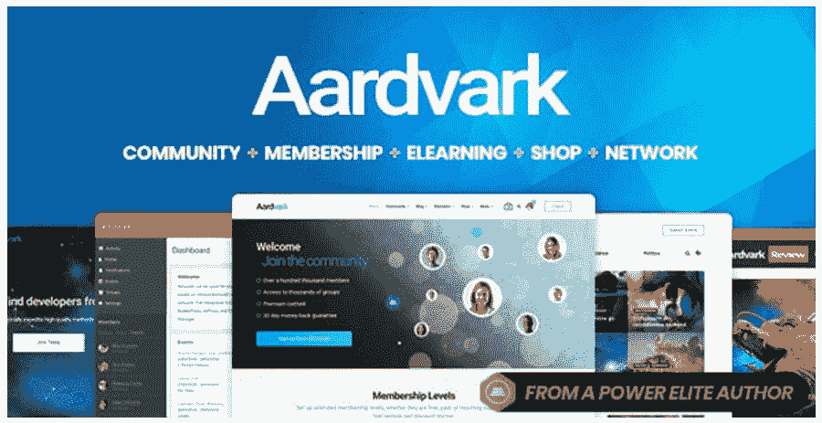

Aardvark

#### 定价

65 美元购买 ThemeForest，并可选择升级以获得更长时间的客户支持。

#### 为什么这是最好的 WordPress 会员主题选项之一？

*   这是一个美丽的主题，有几十个预建的演示供您设计。
*   主题集成了 [BuddyPress](https://kinsta.com/knowledgebase/bbpress/) 和许多其他[会员插件](https://kinsta.com/blog/wordpress-membership-plugins/)。
*   付费会员插件和主题一起出现。
*   为您的客户创建无限数量的会员级别。
*   [直接通过主题收款](https://kinsta.com/blog/woocommerce-payment-gateways/)。
*   该主题还提供了一个令人惊叹的电子学习界面，有测验和课程选项。
*   页面生成器非常适合构建会员网站，完全不需要雇佣开发者。
*   你可以用演示和与 WooCommerce 的整合创建一个在线商店。
*   有些演示是专为会员网站制作的，比如约会或课程。

### 2.超主题化

Ultra 是 Themify 中最强有力的主题之一。它提供了一个在 WordPress 上快速设计你的会员网站的界面，带有响应式元素，完全控制你的页脚和页眉，以及初学者和开发者必备的编码和设计[项目](https://kinsta.com/knowledgebase/php-workers-ecommerce/)。

Ultra 主题附带了几个预制的皮肤，因此您可以从不同的类别中进行选择，如餐厅、婚礼和健身。例如，你可能想为你的健身房开发一个会员网站。在这种情况下，健身皮肤会工作得很好。也有许多构建插件可以轻松构建你的网站。

总的来说，这是一个高质量的主题，智能布局选项非常适合在线社区。事实上，你很可能永远也不会用到 Ultra 中的所有特性，但是为了以防万一，知道你有这些特性还是很好的。

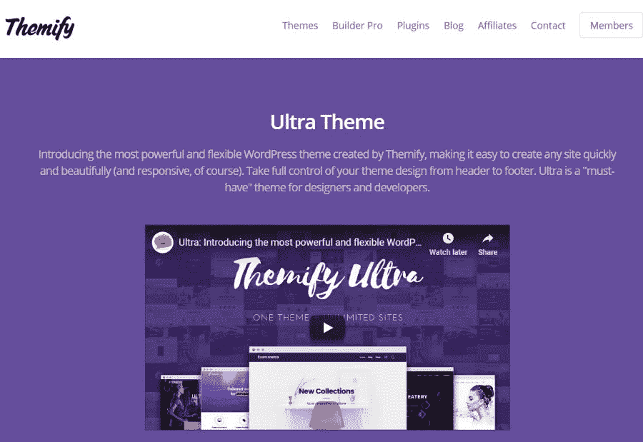

Ultra

#### 定价

Ultra 有三种方案可供选择:

*   标准——59 美元。
*   大师俱乐部——89 美元。
*   终身俱乐部——249 美元。

每次升级都包括一些额外的东西，比如插件和插件。

#### 为什么这是最好的 WordPress 会员主题选项之一？

*   不管你的经验水平如何，标准的主题功能对于建立你的网站来说都是很棒的。其中包括一个[拖放构建器](https://kinsta.com/blog/wordpress-page-builders/)、演示导入和一个定制面板。
*   该主题与 WooCommerce 完美结合，使会员收费变得简单。
*   图像过滤器提供了独特的外观。
*   动画和不同的颜色是为了给你的会员网站添加一些“流行”元素，让人们觉得这个社区更有趣。
*   包含的[大菜单](https://kinsta.com/blog/wordpress-menu-plugins/)意味着你可以在菜单中插入大量的链接和页面。
*   Ultra 提供不同的文章布局和 17 种页面风格
*   几个奖金建设者插件来与超。其中一些包括一个计数器、进度条和一个音频模块。
*   几十个皮肤允许你开始一个美丽的会员网站，如水疗，电子商务，游戏等类别。

### 3.红利

Divi 是市场上最受欢迎的主题之一，这是有道理的。首先， [Divi 主题有一个任何人都可以习惯的拖放构建器](https://kinsta.com/blog/wordpress-page-builders/#divi)。不仅如此，Divi 的订阅提供了一些你在购买主题时可以要求的最好的支持。

用 Divi 建立的网站是快速、轻量级和现代化的，如果有很多成员访问你的网站，这正是你想要的。Divi builder 有看似无穷无尽的设计元素，比如计数器、图像等等。

我们也喜欢高级代码编辑、WooCommerce 集成和用户档案构建，为您未来的成员构建理想的基础设施。

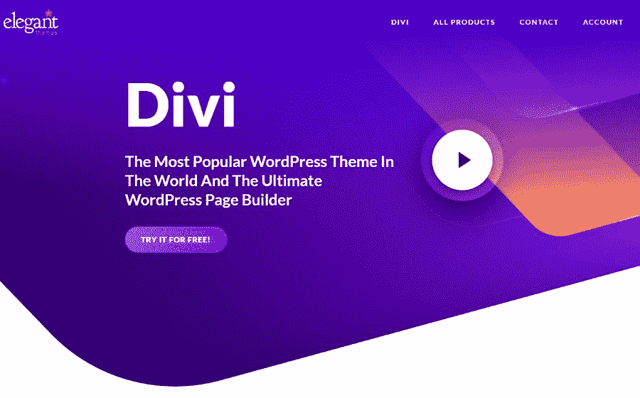

Divi

#### 定价

Divi 本身就是作为会员出售的。这意味着你会收到所有优雅的主题插件和主题，以及全面的支持。以下是计划:

*   89 美元/年-用于年度访问。
*   249 美元-终身访问的一次性付款。

#### 为什么这是最好的 WordPress 会员主题选项之一？

*   年度和终身定价是一项可承受的投资。
*   优雅的主题有令人难以置信的会员客户支持。
*   会员还可以访问 Bloom 和 Monarch 等插件，以及数百个网站设计包。
*   一切都是在 Divi 上可视化构建的，也可以访问编码字段。这对所有的经验水平都很好。
*   所有设计项目都[响应](https://kinsta.com/blog/web-design-best-practices/#mobile-responsiveness)。
*   Divi 提供了几十个拖放模块，包括动作调用、[滑块](https://kinsta.com/blog/wordpress-slider/)和[表单](https://kinsta.com/blog/wordpress-forms/)。
*   几乎所有你能想到的定制工具都包括在内，比如文本阴影、动画和背景图片。
*   为电子商务、[潜在客户生成](https://kinsta.com/blog/wordpress-lead-generation/)、[分割测试](https://kinsta.com/blog/wordpress-ab-testing-tools/)和[转化](https://kinsta.com/blog/conversion-tracking/)洞察提供营销工具。
*   电子邮件选择加入功能链接到所有流行的电子邮件服务，如 T2 的 MailChimp 和 ActiveCampaign。

### 4.阿斯特拉

Astra 是一个制作 WordPress 会员网站的绝佳选择，因为它不需要任何代码就能提供预建的网站和定制功能。Astra 是为了与最好的页面构建者合作而设计的，它[拥有超快的性能](https://kinsta.com/blog/fastest-wordpress-theme/#astra)以确保成员们能保持互动。

一些可以利用的定制包括[颜色](https://kinsta.com/blog/how-to-change-font-in-wordpress/)、博客区域和标题。与 WooCommerce 和 Elementor 的无缝集成确保您能够快速设计并在需要时销售会员资格。

有了预建的设计、高质量的支持和一个大的社区来激发想法，Astra 主题对大多数会员网站来说都是成功的。

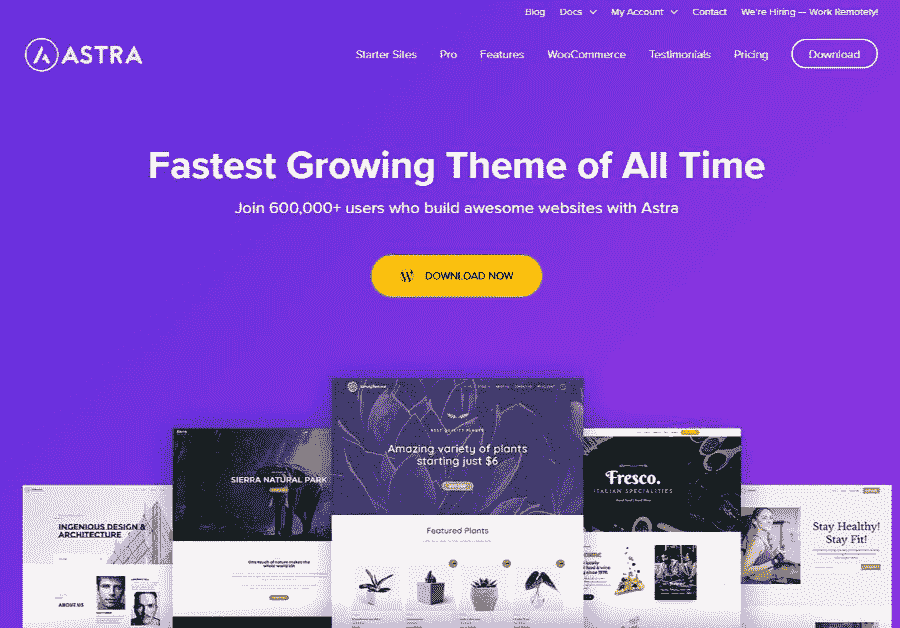

Astra

#### 定价

该主题以三种包装出售:

*   阿斯特拉 Pro——49 美元。
*   基本套装——169 美元。
*   增长套餐——249 美元。

Astra Pro 套装具备大部分所需功能。升级提供了更多的入门网站和页面生成器插件。

#### 为什么这是最好的 WordPress 会员主题选项之一？

*   它以实惠的包装出售，包括许多其他插件，使它值得。
*   这个主题集成了像 [BeaverBuilder](https://kinsta.com/blog/wordpress-page-builders/#beaver-builder) 和 [Elementor](https://kinsta.com/blog/wordpress-page-builders/#elementor) 这样的多功能页面生成器。
*   可以[直接通过 WooCommerce](https://kinsta.com/blog/woocommerce-subscriptions/#how-to-use-woocommerce-subscriptions-with-woocommerce-memberships) 销售会员资格，并与会员插件整合。
*   主题以超快著称。
*   预构建的演示充当皮肤，这些皮肤来自广泛的行业，用于健身房、治疗师等等。
*   将您的社区扩展到世界其他地区的[翻译就绪](https://kinsta.com/blog/wordpress-multilingual/)。

### 5.OceanWP

ocean WP WordPress 主题有 T2 的免费和付费版本，其中的设计项目非常适合开发者和爱好者。这一切都始于通过 OceanWP 提供的许多演示中的一个，有健身房、鞋店、巧克力零售商等选项。

所有这些演示都可以在几分钟内安装，你甚至可以利用几个扩展，让你的会员网站尽可能的先进或简单。

考虑将 OceanWP 作为你的会员网站的一些主要原因是因为它完全[响应](https://kinsta.com/blog/responsive-web-design/)、[快速](https://kinsta.com/blog/fastest-wordpress-theme/#oceanwp)，并且电子商务就绪。我们还喜欢它有翻译工具，可以将你的影响扩展到世界的其他地方。

至于 WooCommerce 集成，这是我们最喜欢的成员之一，因为你可以定制任何东西，从浮动的购物车栏到本地的购物车弹出窗口。

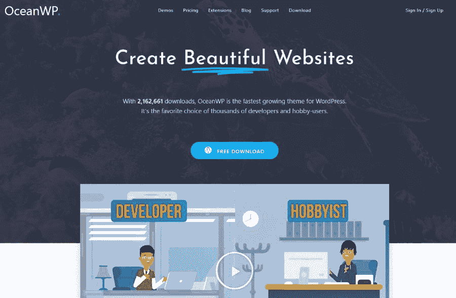

OceanWP

#### 定价

OceanWP 有三种定价方案:

*   个人——一个网站 59 美元。
*   商务——在三个网站上使用只需 79 美元。
*   代理——在 25 个网站上使用 129 美元。

#### 为什么这是最好的 WordPress 会员主题选项之一？

*   建立一个会员网站可能会很贵，所以这个主题的合理定价是一个很好的起点。
*   提供了一组演示供您从培训、博客和旅游等类别中进行选择。
*   OceanWP 与 WooCommerce 整合，打造一个可靠的电子商务网站。
*   快速加载时间确保你的成员不会因为等待你的页面出现而沮丧。
*   购物车和电子商务功能是高度可定制的，这使得构建独特的会员销售体验变得非常容易。
*   该主题包括几个扩展，如全屏扩展、弹出登录、 [Instagram](https://kinsta.com/blog/wordpress-instagram-plugin/) 和白色标签功能。
*   几乎所有的顶级页面生成器都可以和 OceanWP 一起使用。这些构建者包括 BeaverBuilder、King Composer 和 SiteOrigin。

### 6.寻点器

[PointFinder](https://themeforest.net/item/point-finder-directory-wordpress-theme/10298703) 只在 ThemeForest 上出售。它实际上是作为一个[目录和列表](https://kinsta.com/blog/directory-website-wordpress/)会员网站而设计的。您可以要求用户按帖子付费，或者根据不同的会员级别收取费用。

它与 WooCommerce 配合得很好，集成了 PayPal 和 Stripe 等支付网关。您还可以获得语言工具支持，将您的影响力扩展到其他国家。强大而灵活的主题主要用于目录和评论系统，但大多数这类网站在某种程度上侧重于会员资格。

因此，我们向那些希望建立这样一个网站的公司和个人推荐它。

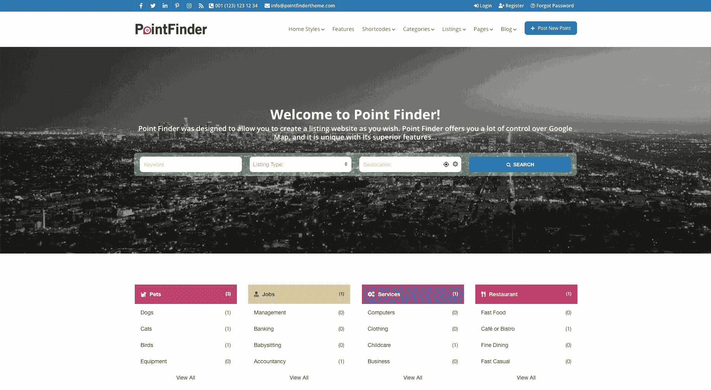

PointFinder

#### 定价

PointFinder 在 ThemeForest 上售价 69 美元。可以购买扩展支持。

#### 为什么这是最好的 WordPress 会员主题选项之一？

*   PointFinder 主题提供了一个会员和付费发布系统，允许你创建一个会员程序而不需要第三方插件。
*   你可以整合顶级支付网关，如 Stripe 和 PayPal。
*   你会收到几个免费的插件，比如 Visual Composer、Slider Revolution 和 Ultimate Addons。
*   会员系统是内置在主题中的，具有很好的功能，如用户会员状态、多个会员包和升级。试验计划也是可能的。
*   前端上传系统生成一个环境，用户可以在其中贡献您的内容。
*   可定制的字段项目对于构建配置文件非常有用。
*   审查系统是为了大型社区审查从餐馆到电影院的一切。
*   该主题为翻译提供了 WPML 和本地化。
*   您会收到一个[社交登录系统](https://kinsta.com/blog/wordpress-user-registration-plugins/)，这样您的会员就不必为您的网站创建新的登录资料。

### 7.赫斯缇雅专业

赫斯缇雅专业版是一个来自 ThemeIsle 的主题，为一个更简约的会员网站提供了一个单页布局。高性能主题很好地结合了[的快速加载](https://kinsta.com/learn/speed-up-wordpress/)，灵活的设计元素，以及与其他页面构建器的兼容性。

## 注册订阅时事通讯

### 想知道我们是怎么让流量增长超过 1000%的吗？

加入 20，000 多名获得我们每周时事通讯和内部消息的人的行列吧！

[Subscribe Now](#newsletter)

所有的设计都是在 [WordPress 定制器](https://kinsta.com/blog/how-to-customize-wordpress-theme/#customizing-your-theme-via-the-customizer)中完成的，但是你可以选择用你选择的页面生成器连接你的网站。此外，WooCommerce 插件与赫斯缇雅专业版主题配合得很好。

更重要的是，为商业、电子商务、单页和最小化主题等类别提供了一组入门网站或演示。

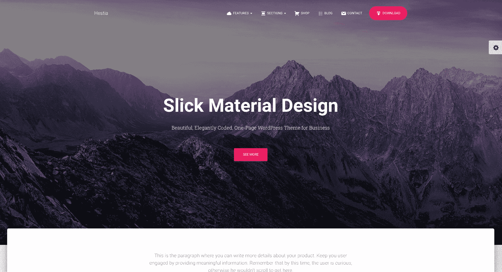

Hestia Pro

#### 定价

从以下赫斯缇雅专业版的定价方案中进行选择:

*   个人——一个网站 69 美元。
*   商务——三个网站 99 美元。
*   代理——无限量网站 199 美元。

#### 为什么这是最好的 WordPress 会员主题选项之一？

*   它来自 ThemeIsle 的人们，这是一个声誉良好的开发团队，拥有高质量的客户支持和许多在线资源。
*   您将获得翻译支持。
*   在 WordPress 定制器的帮助下，主页和你的会员网站的其他部分都是完全可定制的。
*   高级[博客选项](https://kinsta.com/blog/best-blogging-platform/)可用于调整布局宽度和画廊模块等元素。
*   合并一个滑块和视频标题，向你的网站介绍新成员。
*   有一个[价格表](https://kinsta.com/blog/wordpress-pricing-table-plugins/)来告诉用户他们希望为他们的会员资格支付多少钱。
*   该主题集成了一些最流行和有用的页面生成器，如 Elementor 和 BeaverBuilder。

### 8.专业活页夹

Binder PRO 是一个出版主题，它有可能创造出令人惊叹的文章，并通过会员资格建立起坚实的追随者。该模板为初学者和开发人员引入了一种时尚的设计，以类似网格的格式呈现您的文章，并带有各种各样的其他小部件，以您想要的方式组织您的杂志。

横幅、评论和社交媒体按钮都融入了设计，还有最新的帖子推荐和作者信息。

至于对会员网站有帮助的功能，我们喜欢你可以从几种演示格式中选择，所有这些主要集中在制作一个漂亮的博客界面上。从本质上讲，这个主题最适合那些最终可能希望收取会员费的出版商。

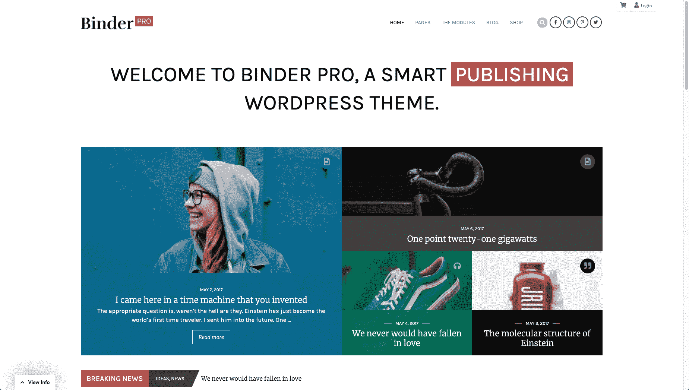

Binder Pro

#### 定价

活页夹专业版主题提供三种方案:

*   主题套餐——129 美元。
*   豪华套餐——389 美元。

#### 为什么这是最好的 WordPress 会员主题选项之一？

*   许多页面生成器模块都带有 Binder PRO 主题，其中一些包括显示作者、博客文章和行动号召的项目。
*   前端编辑器很有帮助， [Gutenberg 支持](https://kinsta.com/blog/gutenberg-wordpress-editor/)意味着每个人都可以利用拖放构建器。
*   包括多语言功能，用于与讲其他语言的用户联系。
*   [图标字体](https://kinsta.com/blog/wordpress-icon-fonts/)整合确保您可以为您的会员网站添加一些视觉效果。
*   该主题已准备好用于移动设计。
*   所有第三方页面生成器都能很好地处理 Binder PRO 主题。

### 9\. Gwangi

在 ThemeForest 上出售的 [Gwangi](https://themeforest.net/item/gwangi-dating-community-theme/21115855) 主题面向小型和大型会员网站。您还可以创建社区和[社交网络](https://kinsta.com/blog/wordpress-social-media-plugins/)，使用大型功能集合和页面生成器支持。社区的范围可以从类似 Yelp 的目录到完整的社交网络或约会网站。

不管你的愿望是什么，Gwangi 都提供会员地理定位服务和个人资料创建。会员可以相互交流，并向您支付订阅费。你可能还想提供免费功能，目的是最终向人们推销付费功能。广告也可以通过 Gwangi 发布，你可以创建一个包含商店、论坛和活动的完整的电子学习社区。

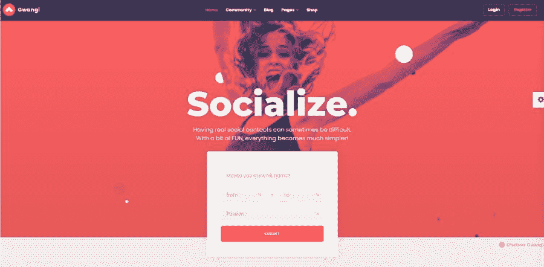

Gwangi

#### 定价

在森林里，光吉的主要价格是 59 美元。额外支持需要额外付费。

#### 为什么这是最好的 WordPress 会员主题选项之一？

*   集成强大的会员制插件，如 [BuddyPress](https://kinsta.com/blog/wordpress-forum-plugins/#buddypress) ，bbPress，和 WooCommerce。
*   你可以翻译你的整个网站，这样世界各地的人都可以访问你的内容。
*   这个主题是移动友好的，便于用户在多种设备上使用你的会员网站。
*   布局选项包括社交网络、约会网站和目录的选项。
*   AJAX 全球搜索可以快速找到社区成员、团体和活动。
*   会员交换是可用的，类似于你在 Tinder 上找到的。
*   创建包含论坛和个人资料的社区。
*   创建任何类型的会员网站，包括电子学习社区、商店、论坛、活动和教练网站。

### 10.CBKit

CBKit 作为一个学习管理系统和会员仪表盘，提供一个简单易用的界面，向你自己的在线学校出售会员资格。该主题是许多 [LMS 插件](https://kinsta.com/blog/wordpress-lms-plugins/)的替代品，使用与 WooCommerce 和几个支付处理器的集成。

这个 WordPress 成员主题可以让你自定义从颜色到课程格式的所有东西。运行广告是一种可能，同时还有[社交网络元素](https://kinsta.com/blog/social-media-image-sizes/)，如个人资料、信息和公开发布。对于那些不想用代码构建网站的人来说，我们喜欢拖放编辑器。

您还可以为您的学校生成一个完全[独特的设计，并让您的用户免费或收费注册课程。从课程公告到高级测验，你对标准 LMS 的所有期望在这个成员主题中都可以得到。这意味着你不必为第三方 LMS 支付月费。](https://kinsta.com/learn/wordpress-education/)

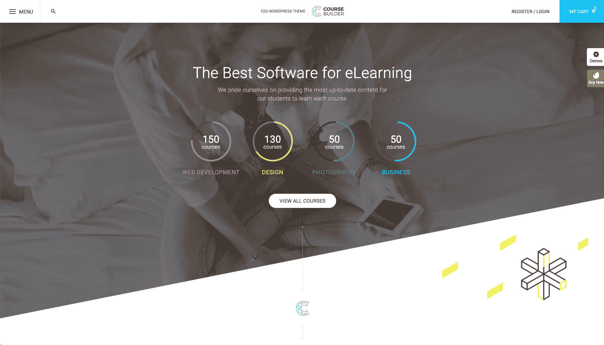

CBKit

#### 定价

这个主题只在 ThemeForest 上出售，售价 64 美元。

厌倦了你的会员网站的问题？通过 Kinsta 获得最佳和最快的托管服务！[查看我们的计划](https://kinsta.com/plans/?in-article-cta)

#### 为什么这是最好的 WordPress 会员主题选项之一？

*   这是一个负担得起的解决方案，如果您选择传统的 LMS，通常会花费数百或数千美元。
*   课程生成器可以在你购买主题后立即使用，包括视频、课程描述、支付等功能。
*   将主题连接到一群支付处理器，包括 Stripe 和 PayPal。
*   享受无限数量的会员。
*   当用户完成你的课程时，给他们发证书。
*   课程内容组织得很好，便于您的成员按照自己的进度完成课程。
*   这个主题包含了几个演示，其中大部分集中在某种学习系统上。有些更多的是针对认证学校，有些则是针对个别导师。
*   直接通过网站销售会员活动的门票。
*   写博客文章，可以阻止非成员。
*   组织在线网络研讨会。这些对于带领大家成为会员都是必不可少的。这也很好，你不必为这个功能购买第三方插件。

### 11.好朋友

Buddy 是一个多用途的主题，有工具可以很好地集成和使用 BuddyPress 插件。这意味着您可以创建一个包含消息传递、个人资料创建和群组的社交网络。

这是一个轻量级的主题，可以快速加载页面，并包含一个漂亮的响应布局，供成员在移动设备上相互交互。主题也和 bbPress 整合，更多是为了[做论坛](https://kinsta.com/blog/wordpress-forum-plugins/)，而不是社交网络。

不管怎样，这是一个 WordPress 会员主题，是为以会员为中心的网站建设而设计的。这是一个昂贵的解决方案，但大多数第三方插件需要定期支付，而 Buddy 只需要一次性支付。

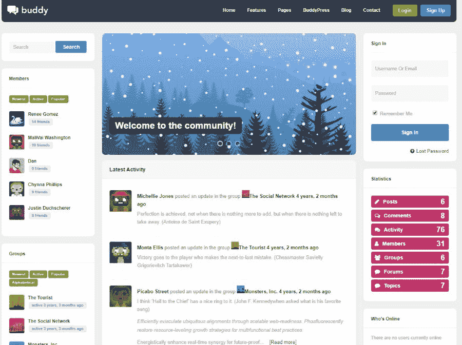

Buddy

#### 定价

这是 ThemeForest 上较贵的主题之一，但主要是因为它包含了相当多的功能。售价 199 美元。

#### 为什么这是最好的 WordPress 会员主题选项之一？

*   它有一个完整的社会和论坛界面，一键安装，让您从一开始就有一个高质量的会员网站。
*   该主题旨在与 bbPress 和 BuddyPress 合作，这两家公司都是制作社交网络和论坛的顶级免费选项。
*   该主题的翻译就绪性质意味着来自其他国家的人可以开始上你的课。
*   这是一个轻量级的主题，肯定不会扰乱[搜索引擎](https://kinsta.com/blog/alternative-search-engines/)，并将为[提供更高的转化率](https://kinsta.com/blog/conversion-rate-optimization-tips/)。
*   你可以为杂志和作品集制作网站，然后整合会员功能，让 T2 为你的作品收钱。

### 12.奥林波斯山

Olympus 凭借对 BuddyPress WordPress 插件的支持，脱颖而出成为一个优秀的社交网络主题。你可以在 Youzer integration 的帮助下建立自己的社区，Youzer integration 是一个 WordPress 插件，用于创建会员网站和社交社区。

提供了许多演示供您玩，您可以通过友谊、私人消息和通知等选项生成完整的脸书式体验。群组和成员目录也是可能的，这使得 Olympus 主题成为那些对创建一个具有持续用户交互的站点感兴趣的人的基本解决方案。

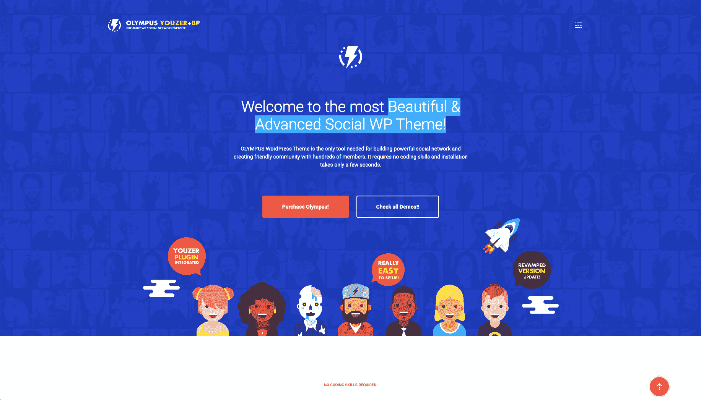

Olympus

#### 定价

售价 59 美元，奥林巴斯主题一如既往地是一个可靠的选择，随着 ThemeForest 市场，额外的客户支持可作为升级。

#### 为什么这是最好的 WordPress 会员主题选项之一？

*   它与 Youzer 和其他一些社交网络插件很好地结合在一起，这样你就可以快速启动会员计划。其他一些插件包括 bbPress 和 BuddyPress。
*   主题是 WooCommerce 兼容，这意味着你可以出售会员资格。
*   奥林巴斯支持多种语言。
*   将你的主题链接到你选择的页面生成器。特别有助于这一主题的是 WP Bakery。
*   博客的特色是发表情感，扩展你的社区的可视化。
*   徽章是可选的，有点游戏化。
*   改进后的导航向会员显示从个人资料到账户信息的所有内容。
*   有八种类型的文章可供选择。其中一些包括幻灯片、引用、文件和视频。
*   其他一些很棒的社交功能包括评论、活动流、群组和论坛。

### 13.发散

并不是所有最好的 WordPress 成员主题选项都是为了提供长长的功能列表。事实上，很多时候，最大限度地减少干扰，专注于内容和简单的用户体验是最有意义的。[呼气](https://themehybrid.com/themes/exhale)用一个基本的设计和三个博客演示完成这个任务，这些演示在咖啡馆、代理和应用销售中脱颖而出。

因此，如果你想围绕你的应用管理一个社区，或者你想培养一个咖啡爱好者社区，呼气主题是一个很好的起点。

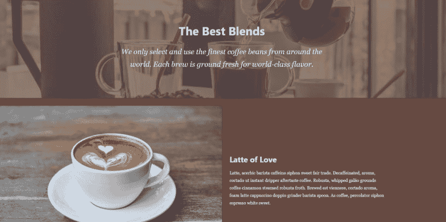

Exhale

#### 定价

呼出主题提供了两种合理的定价方案:

*   呼出专业版——每年 49.99 美元，用于访问呼出主题和客户支持。
*   全访问包——89.99 美元用于访问主题、插件和客户支持。

#### 为什么这是最好的 WordPress 会员主题选项之一？

*   提供了三个演示，这样你就不必从头开始定制[主题](https://kinsta.com/blog/how-to-customize-wordpress-theme/)。其中包括一个应用销售页面、咖啡馆菜单页面和[一个代理登陆页面](https://kinsta.com/blog/wordpress-agency/)。
*   这些演示都很适合特色内容，有漂亮的主页和博客帖子，所有这些都可以放在会员付费墙后面。
*   还提供了几个子主题，其中大多数[关注博客](https://kinsta.com/blog/how-to-monetize-a-blog/)。
*   该主题是为移动界面设计的，为移动设备和平板电脑提供了一个令人难以置信的界面。
*   只需点击一个按钮，即可调整默认颜色和字体等对象。
*   当谈到速度和舒适度时，呼气主题是无与伦比的。

### 14.Yumblog

美食博客通常有一些社区，围绕着分享食谱、谈论新的美食节目以及寻找特定地区最好的餐馆。 [Yumblog](https://upthemes.com/themes/yumblog-theme/) ，正如你可能已经想到的，是一个美食博客主题，具有发布食谱、[收集电子邮件地址](https://kinsta.com/blog/how-to-build-an-email-list/)和格式化你的博客帖子的功能，无需任何编码知识。

作为 WordPress 的会员主题，它也能创造奇迹，看看你如何能与 BuddyPress 或 bbPress 整合，以创造更多的社交或论坛环境。这不是你能在网上找到的最便宜的主题，但我们知道客户支持是可靠的，功能会定期改进。

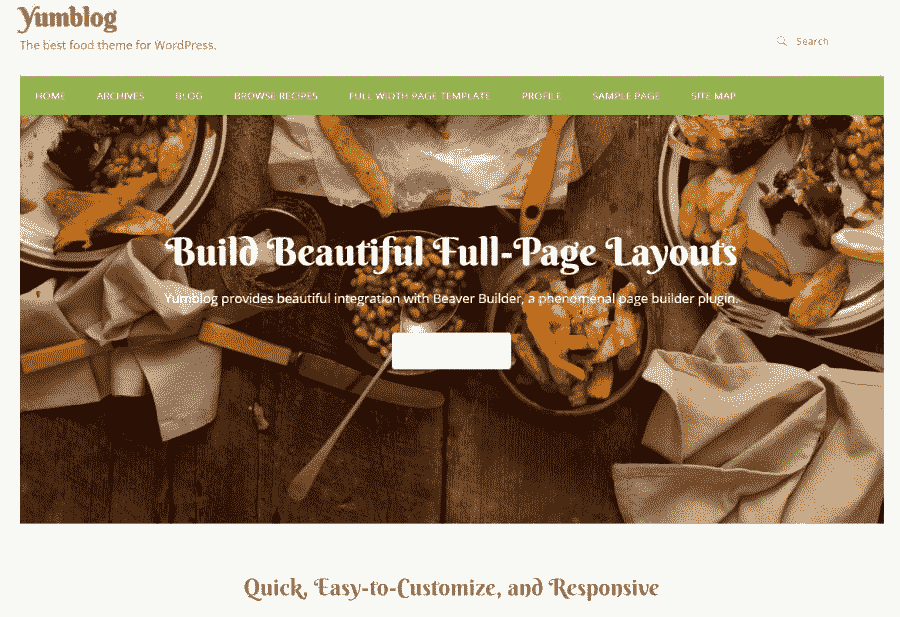

Yumblog

#### 定价

购买一个域名许可需要 125 美元。

#### 为什么这是最好的 WordPress 会员主题选项之一？

*   对于同样想要一个社区的美食博主来说，这是一个很好的起点。
*   在 [Beaver Builder 拖放编辑器](https://kinsta.com/blog/wordpress-page-builders/#beaver-builder)的帮助下，设计过程非常简单。
*   烹饪食谱插件免费提供主题。这是一个插件，可以生成一个包含前端提交、食谱查看器等等的社区。
*   主题是响应性的、现代的，并且对不知道如何编码的人有用。
*   UpThemes 的客户支持是一流的。

### 15.真实的

[REAL](https://themeforest.net/item/real-responsive-blog-wordpress-theme/9615071) 作为一个极简主义的博客主题，有能力扩展成一个会员平台。这些功能保持在最低限度，这正是一些会员网站所有者所寻求的。

我们喜欢这个社区主题，因为它支持[广告](https://kinsta.com/blog/banner-ad-sizes/)、WooCommerce 和会员插件，如 bbPress 和 BuddyPress。付费会员 Pro 也集成得很好。

REAL

#### 定价

主题森林的定价是 44 美元。与往常一样，扩展客户支持作为升级提供。

#### 为什么这是最好的 WordPress 会员主题选项之一？

*   这是一个现代的，完全响应的主题，支持大量的会员插件。
*   有一个页面生成器，所以你不必担心编码。
*   无限的颜色和[谷歌字体](https://kinsta.com/blog/best-google-fonts/)提供更多的定制。
*   多语言功能使您能够接触到其他国家的新的潜在成员。
*   这个主题在所有博客帖子上都有几个广告区。这通常是会员网站赚钱的关键。
*   付费会员插件与主题相结合，这样你就可以从你所有的社区建设工作中获得报酬。

### 16.爱情故事

如果没有至少一个约会选项，WordPress 会员主题列表是不完整的。如果你打算为寻找爱情的人建立一个会员网站，LoveStory 是最合适的选择。这是一个漂亮的设计，具有收取会员费、发送私人信息和允许[脸书登录](https://kinsta.com/blog/wordpress-facebook-plugins/)的功能。虚拟礼物是独一无二的，内置的[实时聊天](https://kinsta.com/blog/wordpress-live-chat-plugin/)一定会让你的会员们聊个不停。

关于 LoveStory 主题的伟大之处在于配置文件是干净的并且易于控制。用户可以上传照片，围绕自己的兴趣进行更改，并与有相似兴趣的人即时联系。这显然不是一个容易进入的空间，但仍有大量的利基市场可供约会网站使用！

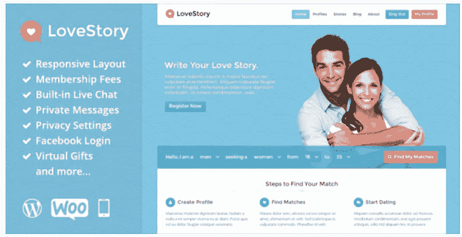

LoveStory

#### 定价

这个主题在 ThemeForest 上标价 49 美元。额外的客户支持也可以付费。

#### 为什么这是最好的 WordPress 会员主题选项之一？

*   LoveStory 主题提供了一个开箱即用的完整约会网站。
*   一些配置文件功能包括配置文件编辑器、成员设置和收藏夹配置文件。
*   您可以通过实时通知、消息缓存和过滤器获得对聊天消息的支持。
*   WooCommerce 整合使得收取会员费变得容易。
*   内置的小工具包括在内，如个人资料搜索和广告横幅。
*   主页滑块对于描述你的网站是非常有用的。
*   该主题带有无限的短代码和滑块。
*   虚拟礼物是吸引会员的独特方式。

[How many membership services do you subscribe to? 3? 5? Too many to count? 😉 If you're looking to start your own subscription service, this list of the best #WordPress membership themes will set you up for success. 💰Click to Tweet](https://twitter.com/intent/tweet?url=https%3A%2F%2Fkinsta.com%2Fblog%2Fwordpress-membership-theme%2F&via=kinsta&text=How+many+membership+services+do+you+subscribe+to%3F+3%3F+5%3F+Too+many+to+count%3F+%F0%9F%98%89+If+you%27re+looking+to+start+your+own+subscription+service%2C+this+list+of+the+best+%23WordPress+membership+themes+will+set+you+up+for+succes...&hashtags=wpthemes%2Conlinebusiness)

## 哪个 WordPress 会员主题最适合你？

如前所述，几乎任何 WordPress 主题都可以用于会员网站。你所要做的就是安装一个[会员插件](https://kinsta.com/blog/wordpress-membership-plugins/)让它工作。

然而，不做研究就抓住一个主题并不是最好的主意。因此，我们建议采取以下步骤:

1.  浏览上面的主题列表。
2.  选择一些与你的行业焦点相匹配的主题。
3.  决定你是否喜欢在主题中内置会员工具，或者你是否不介意使用插件。
4.  确定一个尽可能接近你想要的设计的主题。
5.  找到一个适合拖放页面生成器的主题。

在所有这些之后，你应该能够缩小列表并找到完美的 WordPress 成员主题！

你最喜欢哪一个？请在下面的评论中告诉我们！

* * *

让你所有的[应用程序](https://kinsta.com/application-hosting/)、[数据库](https://kinsta.com/database-hosting/)和 [WordPress 网站](https://kinsta.com/wordpress-hosting/)在线并在一个屋檐下。我们功能丰富的高性能云平台包括:

*   在 MyKinsta 仪表盘中轻松设置和管理
*   24/7 专家支持
*   最好的谷歌云平台硬件和网络，由 Kubernetes 提供最大的可扩展性
*   面向速度和安全性的企业级 Cloudflare 集成
*   全球受众覆盖全球多达 35 个数据中心和 275 多个 pop

在第一个月使用托管的[应用程序或托管](https://kinsta.com/application-hosting/)的[数据库，您可以享受 20 美元的优惠，亲自测试一下。探索我们的](https://kinsta.com/database-hosting/)[计划](https://kinsta.com/plans/)或[与销售人员交谈](https://kinsta.com/contact-us/)以找到最适合您的方式。