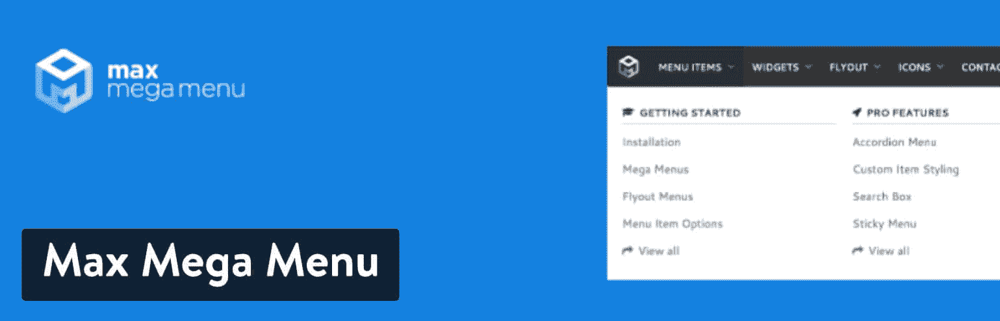
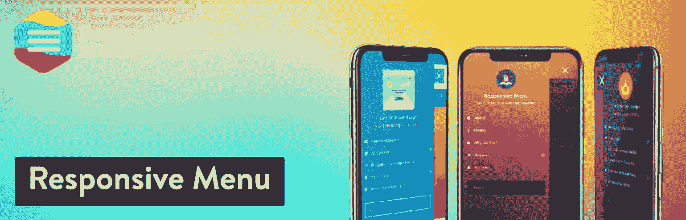
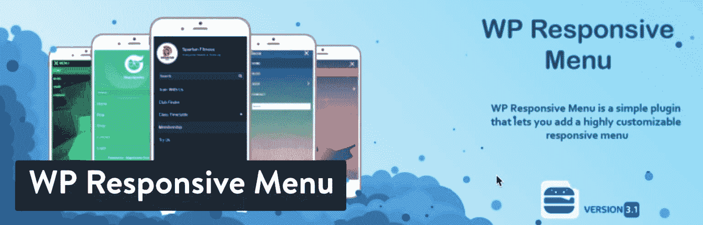
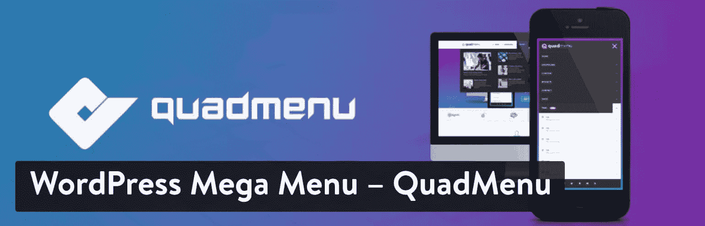
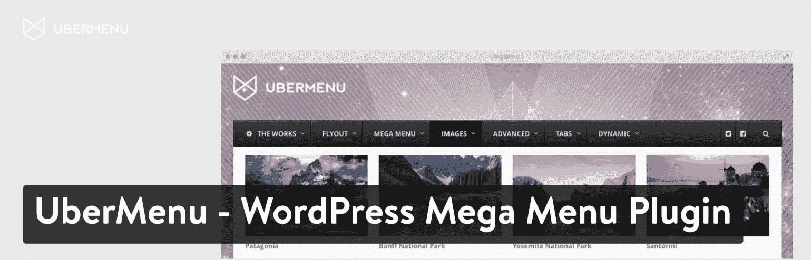
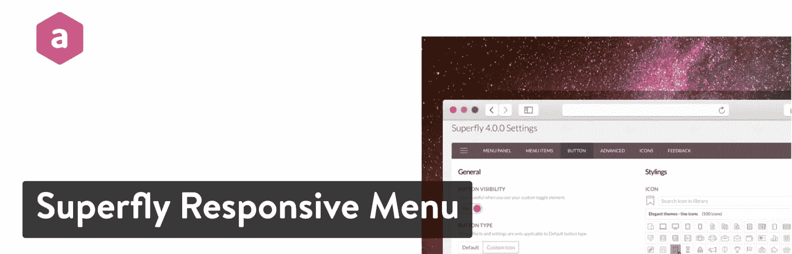
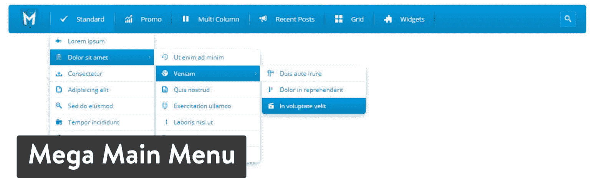
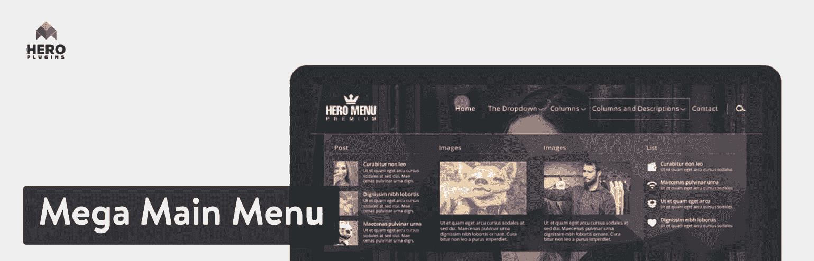
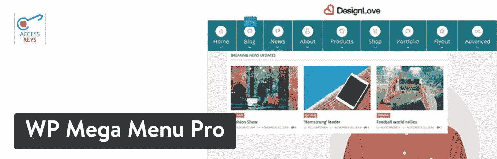
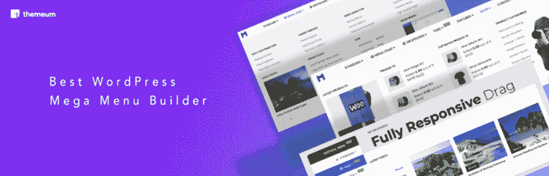

# 扩展 WordPress 内置菜单功能的 11 个最佳 WordPress 菜单插件

> 原文：<https://kinsta.com/blog/wordpress-menu-plugins/>

从巨大的菜单到漂亮的标签和动画，在 WordPress 中有很多方法来格式化你的菜单。你可能会发现你需要把成千上万的产品分类放进菜单里，或者你只是想让它看起来更加丰富多彩。这就是为什么我们想突出市场上一些最好的 WordPress 菜单插件。

## WordPress 已经有菜单了——为什么我还需要一个额外的插件？

很棒的问题！有几个答案，其中很多都是围绕着 WordPress 菜单多少有些局限性的事实:

*   你不能用默认的 WordPress 菜单制作更大的巨型菜单[。](https://kinsta.com/blog/wordpress-custom-menu/)
*   许多 WordPress 主题和默认菜单没有媒体支持，比如产品图片。
*   有时你会发现你的 WordPress 菜单没有响应，或者在移动设备上看起来不太好。
*   标准的 WordPress 菜单只有一种布局，而许多插件提供了几种模板。
*   你不会得到太多的 WordPress 菜单的技术支持，但是付费购买一个高级的 WordPress 菜单插件就可以了。
*   默认情况下，WordPress 菜单中有过渡效果和动画。
*   在 WordPress 中构建菜单有些乏味。你最好找一个带有拖放或可视化构建器的插件。

## 在研究 WordPress 菜单插件时，你应该寻找什么样的特性？

当看到优势时，很明显，拥有一个插件为你的菜单打开了更多的可能性——特别是当运行一个电子商务网站时。同样棒的是，许多 WordPress 菜单插件要么非常便宜，要么免费。

那么，在完成研究的同时，你应该寻找哪些特征呢？

> Kinsta 把我宠坏了，所以我现在要求每个供应商都提供这样的服务。我们还试图通过我们的 SaaS 工具支持达到这一水平。
> 
> <footer class="wp-block-kinsta-client-quote__footer">
> 
> 
> 
> <cite class="wp-block-kinsta-client-quote__cite">Suganthan Mohanadasan from @Suganthanmn</cite></footer>

[View plans](https://kinsta.com/plans/)

*   在智能手机和平板电脑上总是很好看的响应式菜单设计。
*   几个模板让你开始构建你的菜单。
*   选择建立更大的，广泛的巨型菜单。
*   媒体和图标支持，使您的菜单更加直观。
*   拖放或者可视化设计器，这样你就不用在 WordPress 的后端自己可视化菜单了。
*   无缝集成所有 WordPress 主题和 WooCommerce。
*   用于定制菜单每个元素的工具，包括字体、颜色和大小。有粘性菜单的选项也不错。
*   独特的菜单风格，如垂直或标签格式。

## 最好的 WordPress 菜单插件

既然你已经确切地了解了在一个伟大的菜单插件中应该寻找什么，那么继续读下去，找出我们最喜欢的，以及你为什么会认为它们优于其他插件的原因。

### 1.最大超大菜单

如果您对包含一些优秀功能的免费大型菜单感兴趣，Max Mega Menu 插件是您的首选。为了获得一些更高级的工具，你必须升级，但是一般的网站用免费版应该没问题。

Max Mega Menu plugin

这个插件有一些优秀的启动特性，比如配置几个菜单位置的能力和一个非常漂亮的拖放编辑器。它实际上和默认的 WordPress 菜单编辑器一起工作，但是它增加了一些其他的元素，使得处理更大的菜单更加容易。

如上所述，免费版本可以立即下载，但你也可以考虑将[升级到 Pro 或商业许可](https://www.megamenu.com/upgrade/)。这将提供更多的功能，如粘性菜单、自定义项目样式和菜单徽标。这从每年 29 美元开始。

#### 最佳功能

*   事实上，该插件是免费的，并提供了该价格的工具清单。
*   它利用了常规的 WordPress 菜单区域，所以那些熟悉的用户可以更容易地创建。
*   你可以在菜单中放置 [WordPress widgets](https://kinsta.com/blog/wordpress-widgets/) 来显示图片和其他链接。
*   巨型菜单有几种格式，如弹出菜单、子菜单、选项卡式菜单和垂直格式。
*   免费版支持图标。
*   为淡入淡出、幻灯片等动作提供了几个动画。
*   WooCommerce 和 Easy Digital Downloads 支持来自高级版本。
*   高级插件有很好的视觉效果，如粘性菜单、自定义项目样式和图标。

#### 你为什么会考虑 Max Mega Menu？

我喜欢 Max Mega Menu 插件，它适合那些不想为一个精彩的 Mega Menu 解决方案付费的人。标准功能应该适用于大多数中小型企业，如果您需要像标签式大菜单这样的东西，升级价格一点也不差。

### 2.响应菜单

对于许多这样的插件，你会发现它们的名字相当简单，并告诉你它们到底是做什么的。响应式菜单插件就是其中之一，看看它如何把你当前的菜单变成一个漂亮的、手机友好的菜单。如果你碰巧买了一个 WordPress 主题，并且意识到移动菜单并不是很好，那么像这样的插件将会被使用。

另一方面，你可能正在使用一个更老的主题，它从一开始就没有一个响应菜单。

Responsive Menu plugin

响应式菜单插件消除了你在设计中可能遇到的任何问题，因为构建器是可视化的，不需要使用代码或[雇佣开发人员](https://kinsta.com/blog/hire-wordpress-developer/)。它有一个免费的版本，有基本的功能，比如菜单动画和子菜单。

对于更高级的工具，[升级到高级版本](https://responsive.menu/pricing/)，每年 19.99 美元起。

#### 最佳功能

*   一个响应式菜单的美丽起点，有超过 150 个可定制的选项。
*   您可以自定义许多项目，如文本、边框颜色和背景。
*   上传图像用作背景照片。
*   您可以创建自己的自定义菜单触发器。
*   可以上传其他视觉效果，如徽标和图标。
*   高级版本支持动画显示每个单独的菜单项。
*   颜色不透明度是可定制的。
*   包括公告或销售的标题栏。

#### 你为什么会考虑响应式菜单？

如果你对当前菜单的移动视图不满意，你可以考虑响应式菜单插件。许多主题开发者声称他们的主题是响应式的，但我见过很多菜单在手机或平板电脑上看起来很糟糕。这个插件是给你的菜单一个全面检查的负担得起的方法。

### 3.WP 响应菜单

WP 响应菜单插件与我们上面概述的响应菜单插件非常相似。如果你想更换你当前的菜单，并确保它有一个很好的响应外观，这两个都值得测试。这也可以归结为个人偏好，因为这个插件有不同的动画、图标和其他元素，你可能会比响应菜单插件更喜欢。

WP Responsive Menu plugin

总的来说，WP 响应式菜单插件有一个相当不错的免费版本，拥有漂亮的响应式模板和支持添加你的徽标等功能。

升级到专业版将花费你 25 美元购买一个网站，但它提供了几个很棒的功能，如 WooCommerce 集成、社交媒体图标显示和谷歌字体支持。

#### 最佳功能

*   这个插件将你当前的菜单转换成一个漂亮的滑动菜单，不需要做太多的工作。只需要几分钟。所有的菜单都有响应。
*   它有一些免费的视觉选项，如添加一些图标以及您的徽标的能力。
*   当菜单进入响应模式时，您可以隐藏任何不想要的或杂乱的元素。
*   打开和关闭你的菜单是通过简单的滑动来完成的，而不是点击更小的按钮。
*   您可以升级以获得对菜单上社交媒体按钮的支持。
*   在你的菜单上包括一个搜索栏。
*   将菜单链接到 WooCommerce，显示你的产品和类别。

#### 你为什么会考虑 WP 响应式菜单？

WP 响应式菜单插件是一个很好的解决方案，对于那些想要一个很棒的手机友好的菜单，而不需要花太多时间设计的人来说。它也有一些免费的视觉功能，如标志和图标。

### 4.WP 手机菜单

有了 [WP 手机菜单](https://wordpress.org/plugins/mobile-menu/)，我们又有了另一个选择，把你的常规 WordPress 菜单变成一个更好看的移动界面解决方案。再次，测试所有的“移动菜单”插件，以确保你找到你最喜欢的。

WP Mobile Menu plugin

尤其是这一款，具有一些有趣的高级功能，比如滑动菜单、版权部分和标题横幅。您甚至可以导入或导出菜单，以便在其他地方使用。

免费版没那么糟糕，但我们认为[高级版](https://www.magnigenie.com/wp-responsive-menu-pro/)才是真正的价值所在。不幸的是，这是一个每月 4.99 美元的经常性成本，但对于一些需要在每页上提供替代菜单的公司来说，这是值得的。你也可以选择每月 7.99 美元的 WooCommerce 计划来购买一些令人敬畏的电子商务菜单。

#### 最佳功能

*   一个升级插件的选项，包括各种各样的 WooCommere 工具，如滑动购物车中的帐户链接，移动产品过滤器和菜单购物车图标。
*   菜单的背景图片。
*   当显示在移动界面上时，用于隐藏某些菜单项的选项。
*   用于添加页脚菜单、标题横幅和 2000 多个图标的高级工具。
*   从其他网站导入和导出菜单的工具。

#### 你为什么会考虑 WP 手机菜单？

如果你想要一个新的、反应灵敏的菜单，有一些电子商务的独特功能和视觉效果，可以考虑 WP 手机菜单插件。

### 5.WordPress 大菜单–四菜单

四菜单插件创建了一个巨大的菜单，并很容易将其集成到你当前的主题中。有几种类型的菜单可用，包括大菜单、转盘和带选项卡的菜单。

WordPress Mega Menu – QuadMenu plugin

视觉定制是这个插件的关键，因为你可以调整颜色，字体和菜单项的设置，同时看到你面前的变化。这个可视化编辑器比常规的 WordPress 菜单面板甚至这个列表中的其他插件都要高级。

免费版本有一个不错的特性列表，其中一些包括多个菜单位置、对子主题的支持以及图标和购物车菜单。要添加一些额外的菜单——如标签、登录和社交菜单——一次性支付 15 美元，升级到 [Pro 版本](https://quadmenu.com/)。如果你需要更多网站上的插件，你可以选择一些价格更高的计划。

#### 最佳功能

*   菜单集成既可以手动完成，也可以由插件自动完成。
*   把你的菜单放在网站的不同区域。
*   该插件允许的不仅仅是大菜单，包括图标、搜索、购物车、标签、登录、社交和注册菜单。
*   为你的网站创建无限数量的菜单主题。
*   提供了许多可供选择的格式，如粘性菜单或画布外巨型菜单。
*   你可以利用谷歌字体或下拉动画给你的菜单增加一些乐趣。
*   所有最常见的菜单布局都已经开发出来了，因此它允许与您当前的主题快速集成。
*   拖放编辑器比常规的 WordPress 菜单区域更容易使用。
*   所有的菜单在移动设备上看起来都很棒。

#### 你为什么会考虑 WordPress Mega Menu–quad Menu？

如果你想要多种多样的菜单选项，四菜单插件是最有意义的。这不仅仅是为了大型菜单，所以如果你计划制作一些其他的菜单——比如旋转木马或者社交菜单——考虑这是你最好的解决方案。此外，您还可以终身享受高级版本。

## 注册订阅时事通讯

### 想知道我们是怎么让流量增长超过 1000%的吗？

加入 20，000 多名获得我们每周时事通讯和内部消息的人的行列吧！

[Subscribe Now](#newsletter)

### 6.Uber Menu——WordPress 巨型菜单插件

一些菜单插件只在购买时提供。这有利也有弊。坏的一面是你不能用免费版本测试它，一些公司可能不需要所有的高级功能。然而，这也通常意味着获得插件的一次性费用很低，你不能抱怨。(哦，是的，你通常会得到更好的客户支持)。

UberMenu – WordPress Mega Menu plugin

[UberMenu](https://codecanyon.net/item/ubermenu-wordpress-mega-menu-plugin/154703) 是一款评价极高的解决方案，为所有类型的设备提供了令人惊叹的巨型菜单。这些菜单可以显示大图片、产品和类别列表。灵活的布局可以用来创建任何东西，从选项卡式菜单到更直观的东西。UberMenu 的伟大之处在于它包含了先进的内容和功能，但并不需要天才就能搞清楚。

该插件在 CodeCanyon marketplace 上售价 21 美元，这是一次性费用，除非你继续为客户支持付费。

#### 最佳功能

*   您可以通过从您的特色图像中提取或从您的计算机上传图像，快速轻松地将图像添加到您的菜单中。
*   借助可视化、基于网格的系统，设计高级、漂亮的菜单。
*   该插件支持一些非常高级的内容，如地图、搜索栏和联系方式。您甚至可以实现自己的自定义代码来显示您想要的任何内容。
*   可视化定制器有超过 50 个样式设置要调整，包括标题和间距。
*   动态菜单生成器通过提取帖子和页面等内容为您创建整个菜单。
*   AJAX 保存确保您永远不会丢失您的工作。
*   您可以轻松地在选项卡中组织大量菜单项。

#### 你为什么会考虑 Uber Menu-WordPress Mega Menu 插件？

UberMenu 对于那些对制作一份极其独特的菜单感兴趣的人来说相当有用。自定义 HTML、短代码和小部件都有助于添加从地图到联系人表单的任何内容。你可以诚实地把任何东西放进你的菜单里。

我们也喜欢为那些想自动生成菜单项的人提供的插件——比如从你的博客文章中。

### 7.WordPress 菜单插件—越智志帆乐队响应菜单

越智志帆乐队响应菜单插件在 CodeCanyon 上售价 26 美元。再一次，我们继续看到菜单插件并不贵，但是它们有可能把你的导航变成真正特别的东西。

Superfly Responsive Menu plugin

是什么让越智志帆乐队与众不同？是专门用来做垂直菜单的。它们很漂亮。

一些侧菜单有更独特、倾斜的设计来帮助你的公司脱颖而出。你可以添加社交媒体按钮和图片等项目，同时还提供全屏模式，当有人请求时可能会弹出。很多触发器可以在后台修改，所以你可以让你的菜单完成很多动作，比如推送内容、滚动等等。

#### 最佳功能

*   你可以把你主题上的任何无聊的菜单直接切换成有趣的、有创意的垂直菜单。
*   在菜单中添加图像背景，同时仍然允许菜单按钮显示。
*   建立一个图标栏，更像一个小的，不显眼的应用程序菜单。
*   让你的用户访问全屏菜单，这样你就不会失去他们的注意力。
*   使用内置的图标库为菜单添加一些视觉元素。
*   包括了相当多的菜单模式，例如滑入、静态、紧凑和倾斜菜单。
*   内容区域可以借助自定义编码或短码进行调整。
*   对于那些需要一直在视图中导航的单页网站，包含了平滑滚动功能。
*   该插件附带的动画由 CSS3 驱动，与我们测试过的其他一些动画相比，它们看起来真的很不错。

#### 你为什么会考虑 WordPress 菜单插件——越智志帆乐队响应菜单？

越智志帆乐队插件是为那些喜欢垂直菜单的企业主准备的。如果这是你的风格，这是最简单的方法之一。如果您当前的主题不支持这一点，这将非常有用。

我倾向于认为垂直菜单更有趣，更有创意，所以我最有可能向这些类型的公司或个人推荐它。

### 8.巨型主菜单

CodeCanyon 上列出的[巨型主菜单插件](https://codecanyon.net/item/mega-main-menu-wordpress-menu-plugin/6135125)售价为 16 美元，是该列表中最便宜的高级选项之一。这是我们最喜欢的菜单插件之一，因为它能够从你的下拉菜单中添加多种类型的视觉效果。你也有无限的颜色可供选择，这意味着你可以用当前的网站来标记你的菜单。

厌倦了 WordPress 的问题和缓慢的主机？我们提供世界一流的支持，由 WordPress 专家提供 24/7 服务和超快的服务器。[查看我们的计划](https://kinsta.com/plans/?in-article-cta)

Mega Main Menu plugin

我喜欢这个插件的一个原因是开发者为你提供了一个演示仪表板来测试，看看你是否喜欢这个界面。改变图标定位，测试不同的颜色，并上传您自己的品牌形象。你真的可以根据演示制作自己的菜单，看看它是否适合你的公司。

#### 最佳功能

*   点击按钮创建粘性菜单。
*   生成一些漂亮的[下拉菜单](https://kinsta.com/knowledgebase/wordpress-dropdown-menu/)而不必花费太多时间。
*   您可以添加图像、徽标和图标。
*   从十种不同的下拉格式中选择，如链接、小部件或短代码。
*   谷歌字体的无限颜色和集合允许最终的定制。
*   你甚至可以访问超过 1600 个矢量图标。

#### 你为什么会考虑特大主菜单？

这个插件看起来像是那些想要一个高级插件，但想节省一点钱的人的一个很好的选择。

如果你计划在你的菜单上使用图片和图标这样的视觉效果，它也能很好地工作。

### 9.英雄菜单

英雄菜单(Hero Menu)售价 20 美元，它可以让你使用一个漂亮的拖放构建器、完全响应的菜单模板和相当简单的工具来构建一个大型菜单。该插件旨在构建最简单的菜单和最大的巨型菜单。最棒的是，你不应该花太多的时间来完成。

Hero Menu plugin

WooCommerce 还可以与 Hero Menu 集成，使其在推广您的产品和类别时更加灵活。直观的用户界面设置为可视化构建器，帮助您添加新菜单或菜单项，并在一个位置提供所有设置。它也是一个拖放构建器，使事情变得更容易。

#### 最佳功能

*   英雄菜单直接链接到 WooCommerce，展示任何在线商店的一些更重要的元素(如购物车)。
*   在你的菜单上包括各种各样的项目，比如社交媒体按钮和产品图片。
*   从 60 种颜色预设和各种字体中进行选择，让您的菜单看起来更完美。
*   大型菜单生成器运行在拖放界面上，有大量的设置供您测试。
*   将您的菜单放在网站的任何地方。还支持垂直菜单。
*   这个插件反应灵敏，如果你需要的话，它有一个粘性菜单选项。
*   有一个很大的图标库。

#### 你为什么会考虑英雄菜单？

如果你喜欢拖放构建器，这个插件提供了这个列表中最好的一个。它对 WooCommerce 用户来说也很棒，因为你可以在菜单中包含像购物车这样的项目。

### 10.WP Mega Menu Pro

这里还有另一个解决方案，它有很好的评论，大量的销售，和一个看起来很棒的功能列表。目前定价为 19 美元，并可选择延长客户支持。

界面和菜单构建过程是干净的，但我认为它不如竞争对手那么直观。这个插件的伟大之处在于，它附带了一组小部件，可以添加联系信息、产品列表等模块。

WP Mega Menu Pro plugin

该菜单还与默认的菜单仪表板协同工作，因此您可以获得可视化构建器的优势以及您可能已经习惯的功能。同样酷的是，WP Mega Menu Pro 为您提供了 10 个模板，其中许多只需要一点点工作就可以推出像完整的 Mega Menu 这样漂亮的东西。

#### 最佳功能

*   十个预设模板允许你构建任何东西，从新闻列表到产品菜单，从商店到[作品集](https://kinsta.com/blog/wordpress-portfolio-plugins/)。
*   该插件提供水平和垂直菜单，甚至垂直菜单也支持一些大型菜单功能。
*   自定义你的颜色，图标和字体，以确保一切都符合你的网站设计。
*   给你的菜单添加标签，把更多的信息和页面塞进你的菜单。
*   您会收到 100 多个定制选项。
*   当用户向下移动页面时，粘性的大菜单会滚动。并不是所有的大型菜单插件都有粘性菜单。
*   给你的菜单添加一些独特的功能，比如注册按钮或者搜索栏。该插件甚至包括 WooCommerce 的选项和自定义标志。

#### 你为什么会考虑 WP Mega Menu Pro？

WP Mega Menu Pro 插件拥有最长的特性和定制工具列表。此外，模板是市场上最漂亮的一些。

我们向那些想把所有东西都打包进他们的菜单插件的人推荐这个。您可以以合理的价格获得图标、模板、字体、皮肤、背景等等。

### 11.WP 大菜单

WP Mega Menu 提供了一个直观的拖放系统来创建交互式导航菜单。您可以使用不同的小部件图标、图像和标签来创建您的个性化菜单，并且由于自定义颜色、字体和属性，您可以轻松创建不同的样式。

这个插件有助于创建一个菜单，通过它的选项来吸引访问者，在菜单中加入各种媒体内容，如画廊、音频、视频、图标。

WP Mega Menu plugin

WP Mega Menu 是一个功能丰富的响应性 Mega Menu 插件，有一个免费的 mium 版本。免费版本可以在 WordPress 插件目录中找到，而 [WP Mega Menu pro 版本](https://www.themeum.com/product/wp-megamenu/)则带有基于许可的价格计划，单个站点许可从 29 美元起。

#### 最佳功能

*   灵活的拖放工具。
*   组成菜单的行列结构。将行和预定义列添加到
    创建菜单布局。
*   在您的菜单上添加产品的可能性，以吸引消费者和促进销售线索的生成。
*   无限数量的菜单项，并为您的网站提供时尚、交互式的多层
    导航。
*   用作菜单项的预定义功能部件。
*   动画效果。
*   通过定义断点完全控制响应。

#### 你为什么会考虑 WP Mega Menu？

如果你想创建和管理多层巨型菜单，你应该试试 WP 巨型菜单插件。如果您对基本功能满意，首先使用免费版，如果您需要高级功能，则升级到专业版。WP Mega Menu 还兼容市场上大多数流行的主题，所以你不应该太担心这一点。

[Need to implement a custom menu on your site? Check out this list of the very best WordPress Menu Plugins and pick the right one for you! 🔖💪Click to Tweet](https://twitter.com/intent/tweet?url=https%3A%2F%2Fkinsta.com%2Fblog%2Fwordpress-menu-plugins%2F&via=kinsta&text=Need+to+implement+a+custom+menu+on+your+site%3F+Check+out+this+list+of+the+very+best+WordPress+Menu+Plugins+and+pick+the+right+one+for+you%21+%F0%9F%94%96%F0%9F%92%AA&hashtags=wpplugins%2Cwordpress)

## 哪个最好的 WordPress 菜单插件适合你？

有些插件对你的网站没有用。然而，我们涵盖了广泛的菜单插件，以便每个人都有机会使他们的菜单在所有设备上看起来很漂亮。

以下是一些最终建议:

*   最大超大菜单–如果你想要一个稳定的免费菜单插件，可以考虑这个。
*   **响应式菜单**–如果你不喜欢当前的手机菜单，就用这个插件吧。
*   WP 响应式菜单——这也适用于移动菜单设计，但这是一个更快的构建过程。
*   WP 手机菜单-这也是一个手机菜单插件，但它最适合电子商务。
*   如果你想要多种菜单设计，而不仅仅是大菜单，考虑这个插件。
*   Uber Menu–WordPress Mega Menu 插件–我们喜欢这个插件来制作自动菜单，比如你当前的博客文章。
*   WordPress 菜单插件——越智志帆乐队响应菜单——如果你喜欢垂直菜单，就用这个插件。
*   **大型主菜单**–这对于大型菜单的廉价高级版本来说非常好。
*   **英雄菜单**–如果你想要最好的拖放构建器，就使用这个插件。
*   WP Mega Menu Pro–如果你想在一个包中包含所有的东西，可以考虑这款。有人可能会认为这个插件是最有价值的。

仅此而已！如果你对最好的 WordPress 菜单插件有任何问题和/或评论，请告诉我们。

* * *

让你所有的[应用程序](https://kinsta.com/application-hosting/)、[数据库](https://kinsta.com/database-hosting/)和 [WordPress 网站](https://kinsta.com/wordpress-hosting/)在线并在一个屋檐下。我们功能丰富的高性能云平台包括:

*   在 MyKinsta 仪表盘中轻松设置和管理
*   24/7 专家支持
*   最好的谷歌云平台硬件和网络，由 Kubernetes 提供最大的可扩展性
*   面向速度和安全性的企业级 Cloudflare 集成
*   全球受众覆盖全球多达 35 个数据中心和 275 多个 pop

在第一个月使用托管的[应用程序或托管](https://kinsta.com/application-hosting/)的[数据库，您可以享受 20 美元的优惠，亲自测试一下。探索我们的](https://kinsta.com/database-hosting/)[计划](https://kinsta.com/plans/)或[与销售人员交谈](https://kinsta.com/contact-us/)以找到最适合您的方式。