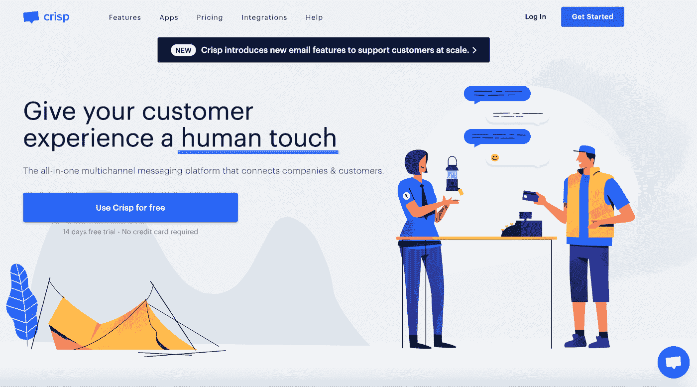
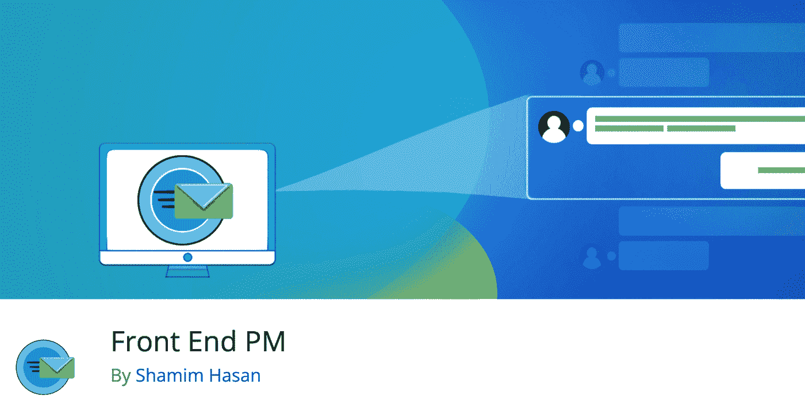
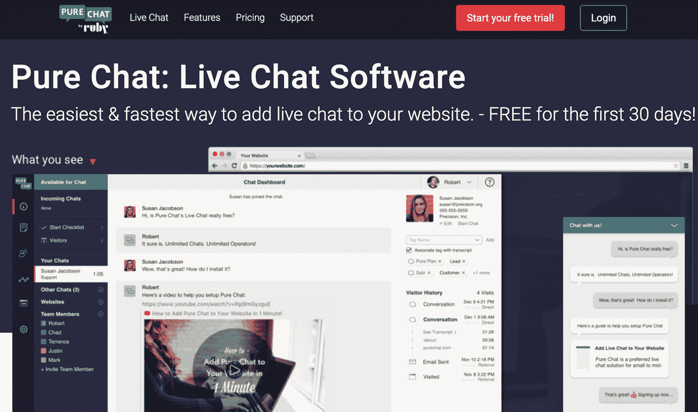
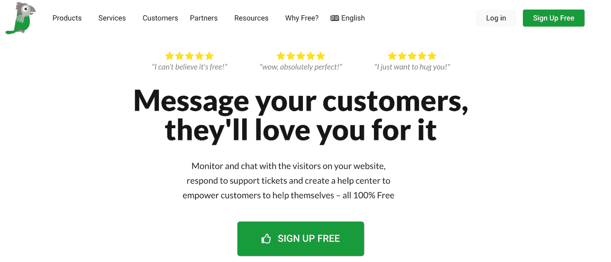
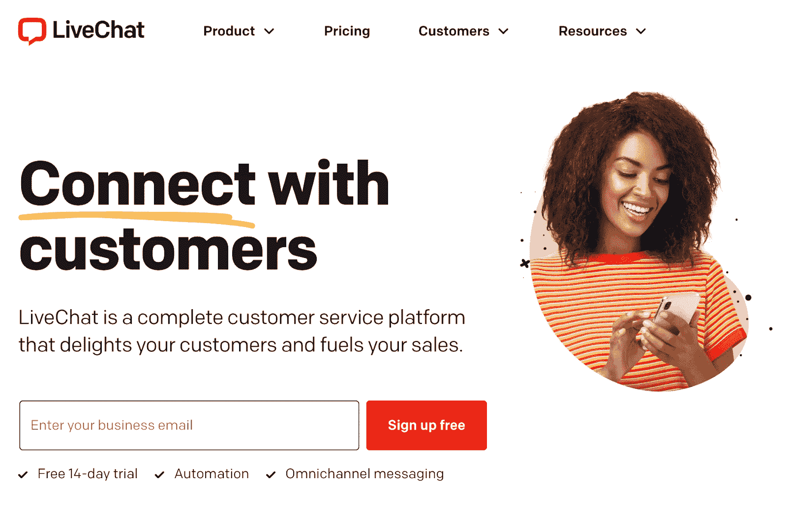
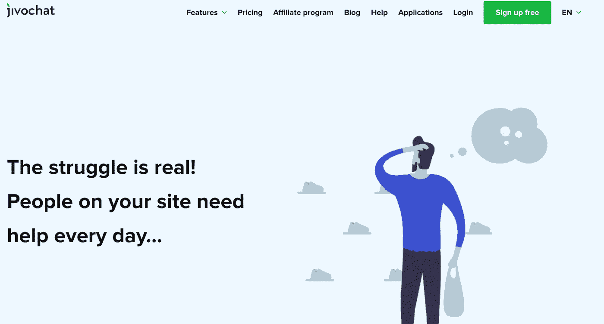
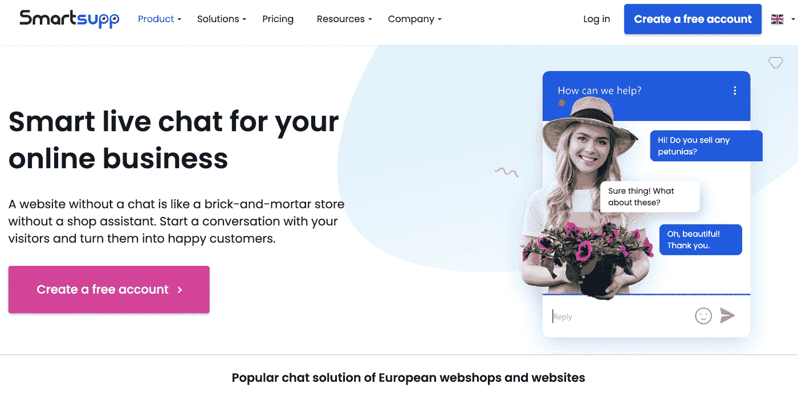
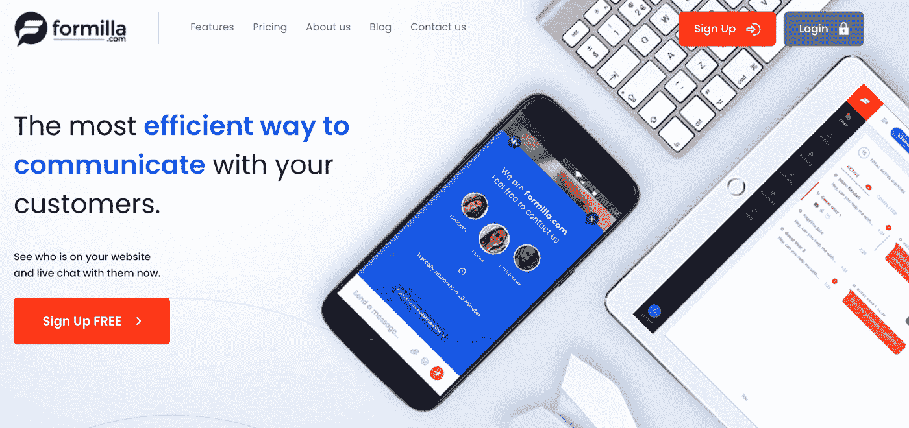

# 2022 年 10 大最佳 WordPress 消息插件

> 原文：<https://kinsta.com/blog/wordpress-messaging-plugin/>

无论你经营的是[博客](https://kinsta.com/blog/best-blogging-platform/)还是[在线业务](https://kinsta.com/blog/best-tools-for-freelancers/)，与用户交流是增加受众参与度的最佳方式之一。如果你的网站不能提供一种有效和及时的方式与你联系，潜在的客户可能会离开去找一个能做到的网站。

幸运的是，消息插件可以作为你和网站访问者之间的桥梁。通过直接信息交流可以促进与观众的实时互动。消息插件允许你个性化你的访问者的用户体验(UX ),而不增加你的额外工作。

### 查看我们的[最佳消息插件视频指南](https://www.youtube.com/watch?v=whCFmAWpQjc)

在这篇文章中，我们将解释什么是消息插件，以及你的网站如何从中受益。然后我们将介绍我们的十大 WordPress 消息插件。让我们开始吧！

## WordPress 消息插件简介

WordPress 消息插件是一个允许你与你的用户、读者或顾客实时交流的工具:

> 需要在这里大声喊出来。Kinsta 太神奇了，我用它做我的个人网站。支持是迅速和杰出的，他们的服务器是 WordPress 最快的。
> 
> <footer class="wp-block-kinsta-client-quote__footer">
> 
> 
> 
> <cite class="wp-block-kinsta-client-quote__cite">Phillip Stemann</cite></footer>

[View plans](https://kinsta.com/plans/)

与电话或电子邮件联系方式不同，即时消息系统让用户能够直接和供应商、网站所有者或博客作者对话。除了在你和潜在的潜在客户之间提供一条直线之外，消息插件允许对话体验直接与你的网站整合。

在你网站的前端，这个工具通常以弹出[聊天框](https://kinsta.com/blog/wordpress-live-chat-plugin/)的形式出现。然后，用户可以通过输入问题来提问。

消息插件用于为[客户](https://kinsta.com/blog/customer-retention/)提供支持，安排约会，并回答用户可能提出的关于产品或价格的任何问题。此外，一些工具可以为您自己的团队成员提供一种交流的方式。

具体访问什么取决于您选择的特定工具。许多选项可以定制，以整合到您的网站。消息插件的其他常见功能包括聊天框小部件、附加图像和视频的能力以及自动回复。

[Personalize your visitors’ user experience... without adding extra work on your end 😅, thanks to these plugins ✅Click to Tweet](https://twitter.com/intent/tweet?url=https%3A%2F%2Fkinsta.com%2Fblog%2Fwordpress-messaging-plugin%2F&via=kinsta&text=Personalize+your+visitors%E2%80%99+user+experience...+without+adding+extra+work+on+your+end+%F0%9F%98%85%2C+thanks+to+these+plugins+%E2%9C%85&hashtags=UX%2CCustomerCare)

## 你的 WordPress 站点如何从消息插件中获益

消息工具可以使你的 WordPress 站点受益，允许你个性化你和你的访问者或客户之间的互动。有大量数据支持这种方法的有效性。例如:

1.  普华永道的一项研究发现，75%的消费者更喜欢人工互动而不是自动回复。
2.  2020 年，Statista 研究部门对美国的营销人员进行了调查。根据他们的分析，[63%的参与者](https://www.statista.com/statistics/809002/personalization-website-in-app-benefits-worldwide/)看到了个性化带来的转化率增加。
3.  根据 Wunderkind 的调查，[72%的消费者](https://www.wunderkind.co/uk/blog/article/revenge-shopping/)表示他们只关注个性化的信息。

另一方面，Zendesk 进行的一项调查发现，难以联系到人工服务提供商的自动化系统是客户 UX 最令人沮丧的方面之一。这种数据表明，在客户服务方面，消费者更喜欢个性化。

虽然不是所有的交互都是定制的，但消息插件可以帮助提供更人性化和更具响应性的接触。更重要的是，它们通常带有让您自动完成关键任务的工具。这让你可以把一些重要的工作从你的盘子上拿下来，这样你就可以专注于你的网站和业务的其他方面。

WordPress 消息插件还有很多其他的好处，比如:

*   降低客户服务成本(如电话费和员工培训)
*   与潜在客户和顾客的实时互动
*   同时与多个用户通信的能力

在你选择一个消息插件之前，你也要确保你的网站能够有效地运行。这个性能监控工具可以识别任何网站效率问题，因此您的访问者可以在您的页面上获得最流畅的体验。

## 2022 年 10 大最佳 WordPress 消息插件

有大量的 WordPress 消息插件可供选择。预算、功能和设计都会发挥作用，其中一个会脱颖而出，成为你网站的最佳选择。我们收集了十个最佳选项供您选择，让我们开始吧！

### 1.脆的

Crisp

首先， [Crisp](https://wordpress.org/plugins/crisp/) 是一个将你的客户支持、销售和[营销](https://kinsta.com/blog/newsletter-examples/)整合在一起的插件。实时聊天、Twitter DM、Facebook Messenger 和电子邮件都集中在一个收件箱中。

Crisp 还拥有[客户关系管理器(CRM)](https://kinsta.com/blog/wordpress-crm/) 软件，可以帮助您自动完成某些任务，因此您可以将精力集中在回答客户的问题上。

**主要特性:**

*   构建自助服务支持的知识库软件
*   有助于组织和优化客户服务的票务系统
*   提醒您任何问题的状态页面

如果你只是需要一个简单的聊天框，Crisp 有一个免费的基本选项。它的高级版起价[，每个收件箱每月 25 美元](https://crisp.chat/en/pricing/)。

### 2.蒂迪奥

Tidio

[Tidio](https://wordpress.org/plugins/tidio-live-chat/) 插件旨在帮助您增加销售并优化客户体验。该工具易于设置，使您能够实时回复访问者，以便快速回答他们的问题。它还可以让你看到谁在你的网站上，监控结果并自动与人工智能聊天，并查看你的访问者的位置。

**主要特性:**

*   现场访问者列表
*   轻松集成 Instagram 和 [Facebook Messenger](https://kinsta.com/blog/wordpress-facebook-plugins/)
*   团队中每个成员的共享收件箱

**定价:**ti dio 实时聊天插件有免费选项和高级等级[，起价每月 19 美元](https://www.tidio.com/pricing/)。

### 3.3CX 实时聊天

3CX Live Chat

如果你正在寻找一个完全免费的工具，3CX Live Chat 可能符合你的要求。它有一个快速和无麻烦的[安装过程](https://kinsta.com/knowledgebase/how-to-install-wordpress-plugins/)，你可以添加用户，定制你的聊天框，修改聊天功能的不同方面没有困难。有了 Superchat 选项，网站访问者可以选择直接从聊天框发送消息或打电话，这使得与你的观众联系更加容易。

**主要特性:**

*   能够将代理分配到群聊
*   可定制的元素，包括文本、颜色和响应
*   添加[语音和视频聊天功能](https://kinsta.com/blog/slack-vs-discord/)

**定价:** 3CX 的实时聊天功能免费使用。

### 4.前端 PM

Front End PM

前端 PM 是一个工具，它允许你和你的用户从网站的前端发送信息，而不是通过仪表板。使用这个插件，您可以在聊天中包含多个附件。[管理员](https://kinsta.com/knowledgebase/wordpress-admin/)可以限制用户在聊天框中保留的信息，这有助于最小化数据库大小。

## 注册订阅时事通讯

### 想知道我们是怎么让流量增长超过 1000%的吗？

加入 20，000 多名获得我们每周时事通讯和内部消息的人的行列吧！

[Subscribe Now](#newsletter)

**主要特性:**

*   能够在你的消息中嵌入 WordPress TV、Youtube、Flickr 和其他媒体
*   [桌面通知](https://kinsta.com/blog/turn-off-push-notifications/)在您收到新消息时提醒您
*   用户之间的私人消息传递

**定价:**前端 PM 有免费选项。保费计划[每年 39 美元起](https://www.shamimsplugins.com/products/front-end-pm-pro/)。

### 5.纯聊天

Pure Chat

如果你需要一个功能丰富的工具， [Pure Chat](https://wordpress.org/plugins/pure-chat/) 是一个实时聊天插件，具有聊天小部件定制、抄本历史等功能。Pro 选项，你可以试用 30 天，让你能够使用实时分析和跟踪你的访问者浏览你的网站。

**主要特性:**

*   桌面和移动设备上的可定制小部件功能
*   用户友好且安装快捷
*   提供联系历史

**定价:**开发者提供一个免费层和一个高级版本[，起价每月 49 美元](https://purechat.com/pricing)(如果按年付费，每月 39 美元)。

### 6.陶。进行实时聊天

Tawk.To Live Chat

下一个，Tawk。实时聊天是免费的，非常容易设置。你可以洞察你网站的访问者，并使用可修改的聊天框直接回答问题。该工具还可以让您个性化您的问候信息和分享促销活动。另外，你可以配对 Tawk。与我们的 [WordPress hosting](https://kinsta.com/wordpress-hosting/) 进行实时聊天，以最大化您网站的性能和您客户的 UX。

**主要特性:**

*   超过 45 种语言可供选择
*   适用于 iOS 和 Android 的移动聊天应用
*   通过[知识库](https://kinsta.com/knowledgebase/)自动回答常见问题

**定价:**此插件免费使用。

Struggling with downtime and WordPress problems? Kinsta is the hosting solution designed to save you time! [Check out our features](https://kinsta.com/features/)

### 7.实时通讯

LiveChat

LiveChat 是一个工具，它可以帮助 T2 在客户进入你的网站时与他们建立联系。您可以根据访问者的行为发送定制的消息。消息预览功能可以让您确切地看到用户正在键入什么，这样您就可以准备好您的响应。它还有一个点击保存选项，可以让你保存对常见问题的回答，这有助于节省你的时间。

**主要特性:**

*   允许您对客户遇到的特定问题进行分类的聊天标签
*   能够将文件拖放到您的聊天中，例如[截图](https://kinsta.com/blog/how-to-screenshot-on-mac/)和优惠
*   如果你没有时间立即回复，一个要求发送电子邮件的功能可以吸引访问者

**定价** : LiveChat 提供免费的 WordPress 插件，以及收费计划[，起价每月 50 美元](https://www.livechat.com/pricing/)。

### 8.JivoChat 实时聊天

JivoChat Live Chat

如果你想最大化你的团队的沟通和效率，你可能想看看 [JivoChat 实时聊天](https://wordpress.org/plugins/jivochat/)。它为您的网站提供了一个专用的小部件，并且可以在任何移动或桌面设备上响应。JivoChat 让你知道你的访问者的位置、来源和语言。你也可以用它的颜色编码系统来组织聊天。

**主要特性:**

*   能够同时与多个客户通话
*   允许您根据常见问题发送自动消息的预设响应
*   针对移动设备优化

**定价:**基础计划对您团队的前五名代理免费。之后，专业选项[的起价是每个代理每月 19 美元](https://www.jivochat.com/pricing/)。

### 9.智能支持

Smartsupp

Smartsupp 的目标是帮助你与你网站的访问者建立即时联系。当访问者一进入你的网站，自动聊天机器人就通过向他们发送信息来直接吸引他们。多通道功能非常适合在一个地方回复电子邮件和聊天。Smartsupp 在欧洲特别受欢迎，因为它符合[通用数据保护条例(GDPR)](https://kinsta.com/blog/wordpress-gdpr-compliance/) 的规定。

**主要特性:**

*   帮助您了解访问者在您网站上的位置的视频记录
*   让您随时随地回答客户问题的移动应用程序
*   一个多语言聊天机器人，为来自世界各地的客户提供服务

**定价:**免费选项是自由职业者和个人网站的理想选择，而高级计划[每月 19.50 美元起](https://www.smartsupp.com/pricing)。

### 10.福米拉的实时聊天

Live Chat by Formilla

最后但同样重要的是，Formilla 的[Live Chat](https://wordpress.org/plugins/formilla-live-chat/)旨在通过电子邮件和应用内消息来提高你的转化率。这个插件具有桌面通知功能，当你收到一条消息时会让你知道，并且兼容 Chrome、Firefox 和 Safari。

它既有自定义聊天机器人，也有人工智能聊天机器人。聊天转移功能允许您在团队成员之间传递消息，为客户提供最全面的响应。

**主要特性:**

*   根据国家、语言、首次访问和再次访问来选择目标访问者
*   能够定制您的小部件以匹配您的网站，包括颜色、横幅和主题
*   实时访客监控

**定价:**开发者提供免费版本，以及每月 17.49 美元起的高级版本。

[Take your customer communication to the next level with these messaging plugins 🚀Click to Tweet](https://twitter.com/intent/tweet?url=https%3A%2F%2Fkinsta.com%2Fblog%2Fwordpress-messaging-plugin%2F&via=kinsta&text=Take+your+customer+communication+to+the+next+level+with+these+messaging+plugins+%F0%9F%9A%80&hashtags=UX%2CCustomerCare) ## 摘要

直接与你的 [WordPress 网站的](https://kinsta.com/blog/wordpress-staging-site/)访问者通信——无论是回复他们的问题还是帮助他们解决问题——可以让你加深与潜在客户或订户的联系。一个消息传递[插件](https://kinsta.com/best-wordpress-plugins/)通过使你的品牌人性化和改善 UX 来推进这一过程，这反过来可以帮助你获得转化，并允许你的[公司发展](https://kinsta.com/blog/saas-products/)。

概括来说，以下是我们的十大 WordPress 消息插件以及它们的亮点:

1.  Crisp 是一个集客户支持、销售和营销于一体的插件。
2.  Tidio 很容易安装，并能让你实时看到你的访客。
3.  3CX Live Chat 是一个免费的消息传递插件，可以让您定制您的聊天框小工具，并允许您的客户请求电话。
4.  前端下午省略了仪表板，并允许您和您的用户在网站的前端聊天。
5.  纯聊天让你能够在访问者浏览你的网站时实时观察他们。
6.  陶。实时聊天不需要任何费用，只需几分钟就可以在您的网站上完成。
7.  LiveChat 通过其省时功能优化了 UX。这些功能包括让您看到访问者正在键入的内容，以及组织主题类别的聊天标签。
8.  JivoChat 实时聊天允许您保存常见问题的答案，以便您可以快速响应用户的问题。
9.  如果您在欧洲和其他地方有客户或分支机构，Smartsupp 是理想的选择，因为它符合 GDPR 标准并提供多种语言选项。
10.  Formilla 的实时聊天功能可以定制小部件，并允许您在代理之间传递用户消息。

关于如何为你的网站选择合适的消息插件，你有什么问题吗？在下面的评论区问我们吧！

* * *

让你所有的[应用程序](https://kinsta.com/application-hosting/)、[数据库](https://kinsta.com/database-hosting/)和 [WordPress 网站](https://kinsta.com/wordpress-hosting/)在线并在一个屋檐下。我们功能丰富的高性能云平台包括:

*   在 MyKinsta 仪表盘中轻松设置和管理
*   24/7 专家支持
*   最好的谷歌云平台硬件和网络，由 Kubernetes 提供最大的可扩展性
*   针对速度和安全性的企业级 Cloudflare 集成
*   全球受众覆盖全球多达 35 个数据中心和 275 多个 pop

在第一个月使用托管的[应用程序或托管](https://kinsta.com/application-hosting/)的[数据库，您可以享受 20 美元的优惠，亲自测试一下。探索我们的](https://kinsta.com/database-hosting/)[计划](https://kinsta.com/plans/)或[与销售人员交谈](https://kinsta.com/contact-us/)以找到最适合您的方式。