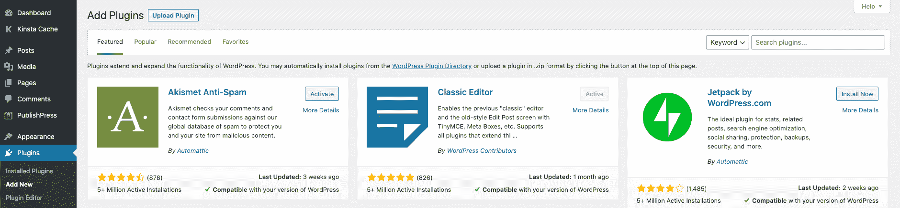
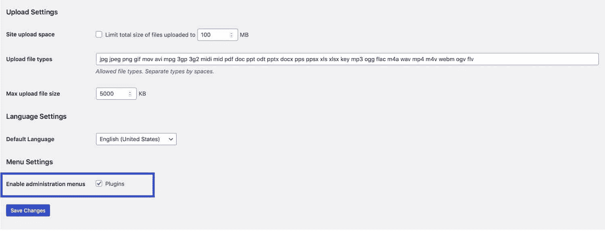
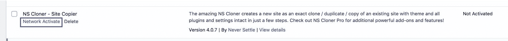
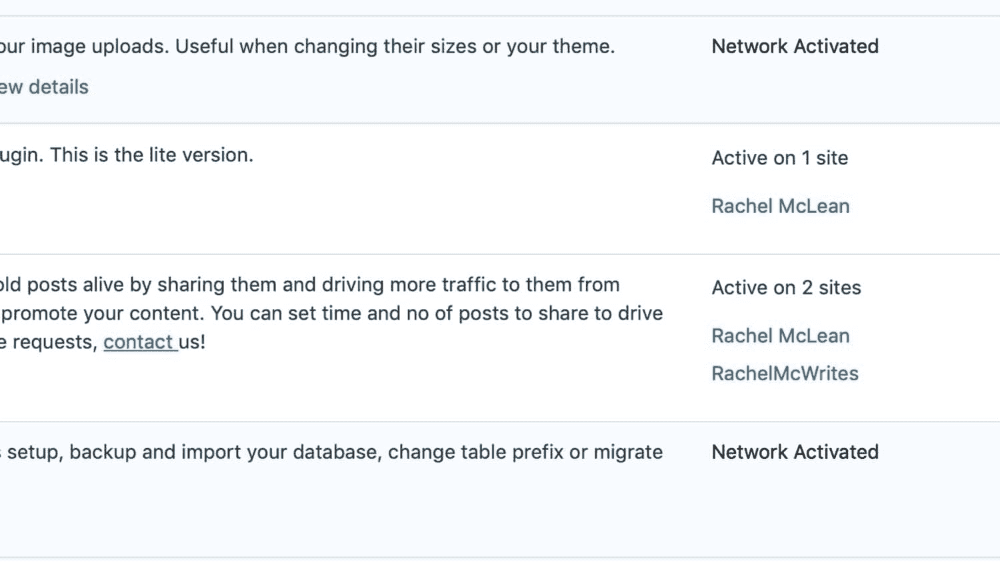
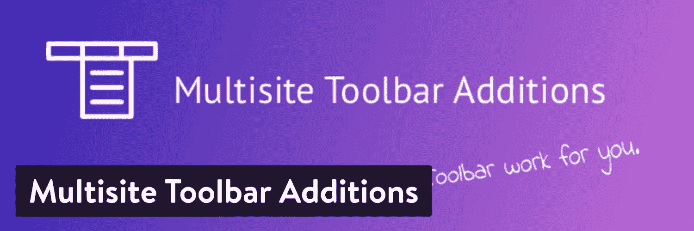
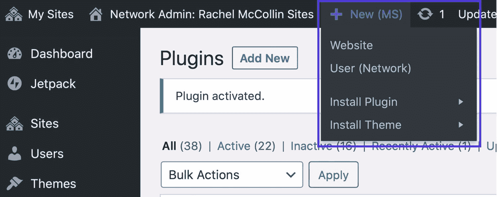
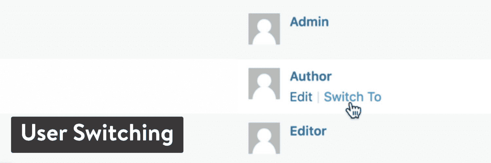
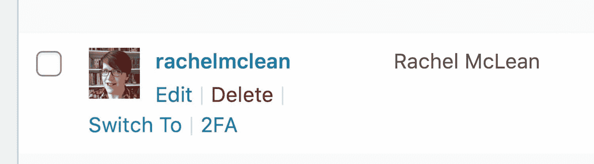
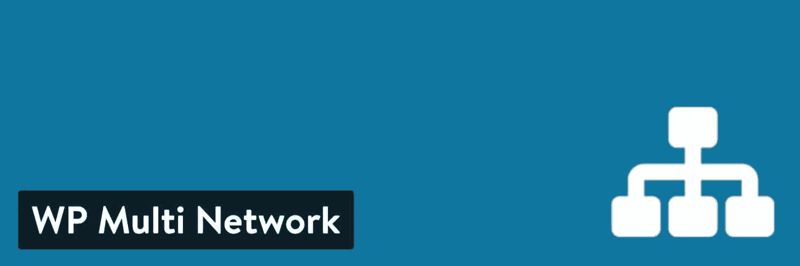
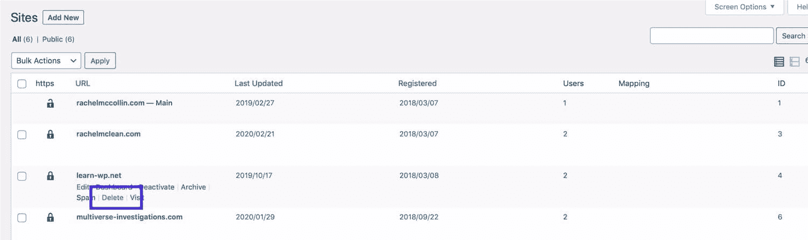

# 推荐的 WordPress 多站点插件(网络管理、迁移和备份)

> 原文：<https://kinsta.com/blog/wordpress-multisite-plugins/>

如今，用基本的 WordPress 站点执行备份和迁移非常简单。网上有成千上万的分步指南和插件，可以自动完成整个过程，使之变得快速而轻松。

然而，当涉及到一个 [WordPress 多站点设置](https://kinsta.com/wordpress-multisite-hosting/)时，像备份和迁移这样的任务就有点复杂了。

这主要是因为多站点设置共享相同的 [WordPress 数据库](https://kinsta.com/knowledgebase/wordpress-database/)和安装。因此，除非您要迁移或备份整个多站点，否则您必须将作业细分到子站点级别。

或者更糟，也许你想把一个子网站恢复成普通的 WordPress 安装。

今天我们将与你分享几个我们推荐的 WordPress multisite 插件。

准备好了吗？让我们开始吧！

## 备份和迁移 WordPress 多站点网络的挑战

备份和迁移[多站点网络](https://kinsta.com/blog/wordpress-multisite/)因几个因素而变得复杂:

> Kinsta 把我宠坏了，所以我现在要求每个供应商都提供这样的服务。我们还试图通过我们的 SaaS 工具支持达到这一水平。
> 
> <footer class="wp-block-kinsta-client-quote__footer">
> 
> 
> 
> <cite class="wp-block-kinsta-client-quote__cite">Suganthan Mohanadasan from @Suganthanmn</cite></footer>

[View plans](https://kinsta.com/plans/)

*   如果您想要对单个子站点进行单独备份，您将无法使用与备份独立站点的[相同的方法。](https://kinsta.com/help/wordpress-backups/)
*   您可以将子站点迁移到多站点网络中或从多站点网络中迁移出来，但这不像迁移独立站点那样简单。
*   您可能还会发现您想要在您的网络中复制站点，在对其进行更改之前，有效地将一个站点迁移到另一个[子域](https://kinsta.com/blog/wordpress-subdomain/)或子目录。
*   备份单个子网站意味着分别为每个子网站设置和存储备份。大部分[备份插件](https://kinsta.com/blog/wordpress-backup-plugins/)不这么做。你需要使用一个专门兼容 WordPress multisite 的插件。

备份和迁移整个网络与[备份和迁移单个站点](https://kinsta.com/blog/migrate-wordpress-site/)是一样的:流程没有什么不同。但是在网络中备份和迁移子站点变得更加复杂，因为子站点的文件和数据的存储方式并不简单:

*   每个站点都有自己的一组数据库表，但是所有站点都将它们的用户存储在整个网络的 wp-users 和 wp-usermeta 表中。这使得网络上的用户可以被添加到另一个站点，而不必建立新的帐户。但是这意味着[导出用户](https://kinsta.com/knowledgebase/wordpress-export-users/)不像其他表那么容易。
*   在 wp-content/uploads 中，网站将它们的上传文件分别存储在每个子网站的专用目录中。这使得从子网站迁移文件或将文件迁移到子网站变得更加容易。
*   [插件](https://kinsta.com/best-wordpress-plugins)和[主题](https://kinsta.com/best-wordpress-themes/)为网络存储一次，但为个别站点激活。如果你想迁移或备份插件，你需要确定每个单独的站点使用哪些插件。

那么，在多站点网络中备份和迁移子站点是不可能的吗？当然不是！有许多高级插件可以用来做这件事，还有一些免费的方法。

在本文中，我们将向您展示所有这些，以便您可以自己备份和迁移子网站。

## 在你的 WordPress 网络上安装和激活 WordPress 多站点插件

在进入使用插件来备份或迁移运行你的网络的子站点的细节之前，你需要知道插件在 WordPress multisite 中是如何工作的。

每个插件只在你的网络上安装一次，只有网络管理员可以这样做。

要安装插件，进入**网络管理>插件>添加新插件**，安装插件，就像管理普通网站一样。

Installing a plugin in Multisite

区别在于[你如何激活那些插件](https://kinsta.com/blog/wordpress-multisite/#installing-and-activating-plugins)。插件可以是网络激活的，因此它们在网络中的每个站点上都是活动的，或者它们可以为单个站点激活。

只有网络管理员才能激活插件。网站管理员可以在他们自己的网站上激活单独的插件，但是只有在网络管理员允许的情况下。

作为网络管理员，要编辑插件激活权限，请前往**网络管理>网络设置**。向下滚动到屏幕底部，选中或取消选中**启用管理菜单**旁边的**插件**框。

Enable plugins for site admins

如果为站点管理员激活了插件，他们可以在管理员的插件界面中激活任何他们需要的插件。你只能关闭所有插件，而不是少数插件(不像主题)。

如果你想为网络中的每个站点激活一个插件，那么你需要从网络管理界面激活它。

进入**网络管理>插件**。找到你想要激活的插件，点击**网络激活**链接。

Network activating a plugin

[迁移和备份插件](https://kinsta.com/blog/wordpress-migration-plugins/)，通常在网络级而不是站点级工作，是需要为整个网络激活的插件的完美例子，因为它们的功能适用于网络而不是单个站点。

要停用插件，只需点击**网络激活**链接所在的**网络停用**链接。这只有在您激活了整个网络的插件时才可用。如果插件是为单个站点激活的，网络管理员或站点管理员可以从该站点的站点管理屏幕中为每个站点停用它。

[Juggling multiple sites over a network? 🤹‍♂️ These plugins will make your life so much easier 😅Click to Tweet](https://twitter.com/intent/tweet?url=https%3A%2F%2Fkinsta.com%2Fblog%2Fwordpress-multisite-plugins%2F&via=kinsta&text=Juggling+multiple+sites+over+a+network%3F+%F0%9F%A4%B9%E2%80%8D%E2%99%82%EF%B8%8F+These+plugins+will+make+your+life+so+much+easier+%F0%9F%98%85&hashtags=multisite%2CWordPress)

## 用于管理 WordPress 多站点网络的插件

有一些插件将帮助您管理您的多站点网络，并更有效地使用它。他们有时会为您提供一些信息，使备份或迁移子网站的过程变得更加容易。

请注意，所有这些插件都需要网络激活，因为它们在网络级工作。

### 多站点增强

Multisite Enhancements WordPress plugin

[多站点增强功能](https://wordpress.org/plugins/multisite-enhancements/)插件为您提供更多关于多站点网络的信息和更多可用工具。一个特别有用的特性是能够看到网络中哪个站点上哪个插件或主题是活跃的。

这意味着，如果你想备份或迁移一个单独的网站，你会知道哪些插件和主题是激活的。它对测试也很有用——如果一个插件[在你的网络中的一个站点上引起问题](https://kinsta.com/blog/wordpress-errors/),你知道你需要测试哪些其他站点。

Multisite enhancements – plugins screen

### 多站点工具栏添加

Multisite Toolbar Additions WordPress plugin

多站点工具栏添加插件为网络管理员添加了一些快捷方式到 WordPress 工具栏。

如果你需要管理插件和主题以及配置设置，而不需要点击很多次，这可以节省时间。

Extra toolbar items

### 用户切换

User Switching WordPress plugin

[用户切换](https://wordpress.org/plugins/user-switching/)插件不仅适用于多站点，而且在多站点网络上特别有用，因为它们有更多的[用户角色](https://kinsta.com/blog/wordpress-user-roles/)。如果您管理一个网络，并想对您的站点管理员遇到的问题进行故障排除，它允许您像使用他们的登录一样访问网络。

User Switching – interface

只需转到用户屏幕，将鼠标悬停在用户上，然后单击**切换到**链接。它可以节省大量的登录和注销时间，并让您更好地支持您的网络用户。

### WP 多重网络

WP Multi Network WordPress plugin

如果你想知道是否有可能在一个多站点网络中创建一个多站点网络，那么 [WP 多网络](https://wordpress.org/plugins/wp-multi-network/)插件可以给你答案。

安装并激活网络后，它会在管理菜单中添加一个 **My Networks** 菜单，让你将多站点网络中的任何站点变成一个完全属于自己的网络，这意味着你可以拥有两层 WordPress 多站点。

对于为部门或子公司运行多站点网络的企业来说，这尤其有用，这样他们就能够创建自己的网络。

### 重要的

这个插件还没有在最新的主要版本中测试过。我们强烈建议首先在[试运行环境](https://kinsta.com/help/staging-environment/)中测试它。

### 多站点语言切换器

Multisite Language Switcher WordPress plugin

如果你使用 WordPress multisite 来管理一个不同语言的网站网络，那么[Multisite Language Switcher](https://wordpress.org/plugins/multisite-language-switcher/)插件会让它变得更容易。

## 注册订阅时事通讯

### 想知道我们是怎么让流量增长超过 1000%的吗？

加入 20，000 多名获得我们每周时事通讯和内部消息的人的行列吧！

[Subscribe Now](#newsletter)

它为您的整个网络添加了多语言支持，包括子域和子目录，并允许翻译所有内容类型，包括页面、帖子、[自定义帖子类型](https://kinsta.com/blog/wordpress-custom-post-types/)和[分类](https://kinsta.com/knowledgebase/what-is-taxonomy/)。

## 备份或迁移一个完整的 WordPress 多站点网络

如果你遇到的问题影响到整个 WordPress 的安装，而不仅仅是一个单独的站点，备份整个网络将会很有用。如果您的网络上有许多站点，您可能不想逐个恢复每个站点，因为恢复整个网络会更容易。

如果您计划迁移网络中的单个站点，首先备份整个网络是有意义的，以防出现问题。

备份一个 WordPress 多站点网络和备份或迁移一个普通的 WordPress 安装没有什么不同。

如果您使用 Kinsta，我们的[自动备份](https://kinsta.com/help/wordpress-backups/)将让您放心，因为您的整个网络每天都会自动备份。

要在 [MyKinsta](https://kinsta.com/MyKinsta) 中访问您的备份，请前往**站点**，点击您的站点，然后点击菜单中的**备份**。

Backups in MyKinsta.

从这里，您可以访问您最近的快照备份，并从这些中的一个[恢复您的站点。您还可以运行手动备份，这是在开始将任何站点迁移到网络中或从网络中迁移出之前的一个好主意。](https://kinsta.com/help/restore-wordpress-backup-staging/)

如果你喜欢备份你的 WordPress 多站点网络到一个非现场的位置，我们提供两个方便的选择。

1.  你可以点击“下载”标签，然后[生成一个包含你的 WordPress 数据库和文件的可下载的 ZIP 文件](https://kinsta.com/help/wordpress-backups/#downloadable-backups)。
2.  你可以点击“外部”标签，配置每周或每月自动备份到亚马逊 S3 或谷歌云存储桶。

如果你没有使用 Kinsta，你需要使用备份插件来设置备份。按照我们的[指南来使用 WordPress 备份插件](https://kinsta.com/blog/wordpress-backup-plugins/)来让它工作。

## 备份或迁移多站点子站点

迁移或备份单个子站点不同于迁移或备份整个多站点网络，因为您只需处理适用于该特定站点的数据和文件。

这意味着迁移或备份以下内容:

*   与该站点相关的数据库表。
*   该网站上正在使用的主题和插件，将与整个网络的主题和插件一起存储。
*   该网站的上传，将存储在自己的 wp-content/uploads 文件夹中。
*   该站点的用户数据将存储在网络的主 wp-users 和 wp-usermeta 表中。

这是一个复杂的过程，所以如果你想通过管理界面用插件来做，你必须支付额外的费用。

但是，如果您准备使用命令行或遵循更长的过程，有几种方法可以免费进行迁移。

## 3 种备份和迁移多站点子站点的方法

有三种方法可以用来免费迁移子网站。这些是:

您的多站点网络需要一流、快速、安全的主机吗？Kinsta 提供超快的服务器和来自 WordPress 专家的 24/7 世界级支持。[查看我们的计划](https://kinsta.com/plans/?in-article-cta)

1.  [手动迁移相关的数据库表和文件](https://kinsta.com/blog/migrate-wordpress-site/#migrating-a-wordpress-site-manually)。
2.  [使用免费插件](https://kinsta.com/blog/migrate-wordpress-site/#migrating-a-site-into-or-out-of-wordpress-multisite-with-plugins)的变通方法。
3.  用 [MU-Migration 插件](https://github.com/10up/MU-Migration)从[命令行](https://kinsta.com/blog/wp-cli/)运行迁移。

请注意，这些方法不能用于备份:你必须使用一个高级插件。

先来看看前两个！

### 1.手动迁移子网站

若要手动迁移子网站，您需要:

1.  仅导出该子网站的数据库表。当您将它们导入到新站点时，您需要编辑 SQL 文件中的前缀，以反映新位置中数据库表的名称。
2.  导出上传文件，您可以在 wp-content/uploads/sites/X 中找到这些文件，其中 X 是子站点的 ID。
3.  导出该子网站中使用的任何主题和插件文件。

这种方式不容易迁移用户记录，如果子网站上有很多用户，不推荐使用这种方式。

### 2.用于迁移或备份子网站的 WordPress 多网站插件

使用与 multisite 兼容的专用备份或迁移插件将大大加快这一过程。下面是最适合做这件事的插件。

#### WP 迁移 DB Pro(和 WP 迁移 DB Pro 多站点工具)

WP Migrate DB Pro 插件声称可以帮助你“轻松地推/拉你的 WordPress 站点”。如果您将它与**WP Migrate DB Pro Multisite Tools**插件结合使用，您可以使用它将子网站迁移到多站点网络或从多站点网络中迁移出来。

它允许您以(几乎)任何可能需要的排列方式迁移子站点:

*   将子网站(包括媒体)推送到单个网站安装。
*   将单个站点安装(包括媒体)拉入子站点。
*   将单站点安装(数据库和媒体)作为子站点推入多站点安装
*   将单站点安装(数据库和媒体)作为子站点纳入多站点安装
*   将子网站的数据导出为 SQL 文件，以便导入到单个网站安装中。

它现在不能做的一件事是将一个子站点从一个多站点网络迁移到另一个多站点网络作为子站点。但是，您可以使用一个[解决方法](https://deliciousbrains.com/wp-migrate-db-pro/doc/multisite-tools-addon/#migrate-subsite-between-multisites)。

因此，无论您的网络中有一个子站点需要转移到它自己的安装中，还是您有一个外部站点需要作为一个新的子站点引入，这个插件都会支持您。

#### 专业复印机

Duplicator Pro 插件旨在帮助你复制和迁移 WordPress 站点，但是它也可以用于多站点网络的子站点。

使用插件将子站点迁移到单站点安装中有五个步骤:

1.  使用插件在您的源机器上创建一个包，就像您在标准的单个站点上一样。
2.  将安装程序/归档文件复制到新位置，并创建您的数据库和用户。
3.  转到安装程序。
4.  您将看到一个下拉列表，其中包含该包中的所有子网站。选择一个并继续安装。
5.  在步骤 4 中选择的子网站将作为新的独立网站安装。

#### WP 生动备份专业版

高级 [WPvivid Backup Pro](https://wpvivid.com/) 插件是另一个与 multisite 兼容的插件。

该插件允许您使用手动迁移、自动迁移或通过远程存储迁移来备份或迁移站点。使用高级版本，您可以备份和迁移多站点网络中的子站点。

### 信息

WPvivid 插件的免费版本[与 Kinsta 主机](https://kinsta.com/knowledgebase/banned-plugins/#backup-plugins)不兼容，因为它运行非增量备份。

#### 管理工作

[ManageWP](https://managewp.com/features) 插件不仅限于备份和迁移。它包括一系列工具，旨在帮助您管理您的网站并保持最新。

高级版本带有工具来帮助你快速迁移 WordPress 站点，包括多站点网络中的子站点。免费版和高级版都包括备份工具，但您需要高级版来单独备份子网站。

在对子网站使用 ManageWP 时，您需要注意以下注意事项，这些在[插件文档](https://managewp.com/blog/multisite-websites-in-managewp)中有详细说明:

*   备份子站点时，会备份整个多站点网络。但是你只为那个子网站付费。
*   如果要备份子网站，不必备份父网站。
*   如果您将备份迁移到外部目的地，您将上传整个多站点网络。但是该插件有三个恢复选项，包括只恢复所选子站点的能力。插件和主题不会被恢复，因为它们在多站点网络级别。

### 迁移后清理

一旦您将子网站迁移到多网站网络中或从多网站网络中迁移出来，您可能需要做一些清理工作。

如果您已经将网站从网络中迁移出来，并且不再需要它，请确保将其从您的网站中删除。

前往**网络管理>站点**并找到您已迁移的站点。点击站点名称下的**删除**链接。

Deleting a site in a WordPress Multisite Network

如果您的子网站使用了未在网络中任何其他网站上激活的主题或插件，您也应该删除它们。从你的 WordPress 安装中移除任何没有被使用的软件总是明智的。

在迁移之前，不要忘记检查网站的新版本是否在您迁移到的位置上工作！(你可能想先做个备份，以防万一。)

## 克隆网络中的站点

有时，您希望在网络内迁移子网站，而不是将子网站从多网站网络中迁移出来。换句话说，您想要[克隆站点](https://kinsta.com/knowledgebase/clone-wordpress-site/)。

这可以帮助您使用一个网站作为另一个网站的模板，或者使用克隆的网站重新开发一个网站，然后在它准备好之后指向任何域名。

[When it's time to back up or migrate your multisite network, there's no need to stress 😌 These plugins were designed to make your life easier!Click to Tweet](https://twitter.com/intent/tweet?url=https%3A%2F%2Fkinsta.com%2Fblog%2Fwordpress-multisite-plugins%2F&via=kinsta&text=When+it%27s+time+to+back+up+or+migrate+your+multisite+network%2C+there%27s+no+need+to+stress+%F0%9F%98%8C++These+plugins+were+designed+to+make+your+life+easier%21&hashtags=webdev%2Cwordpresshelp)

## 摘要

备份 WordPress 多站点网络中的单个子站点，或者将它们迁移到多站点或者从多站点迁移出来，并不像[备份](https://kinsta.com/help/wordpress-backups/)或者[迁移单个站点安装](https://kinsta.com/blog/wordpress-migration-plugins/)那么简单。

要备份或迁移您网络中的子网站，您可以[手动迁移相关的数据库表和文件](https://kinsta.com/knowledgebase/mysql-backup-database/)，使用需要三个免费插件的变通方法，或者最快捷的方法，使用与 WordPress Multisite 兼容的高级插件。

* * *

让你所有的[应用程序](https://kinsta.com/application-hosting/)、[数据库](https://kinsta.com/database-hosting/)和 [WordPress 网站](https://kinsta.com/wordpress-hosting/)在线并在一个屋檐下。我们功能丰富的高性能云平台包括:

*   在 MyKinsta 仪表盘中轻松设置和管理
*   24/7 专家支持
*   最好的谷歌云平台硬件和网络，由 Kubernetes 提供最大的可扩展性
*   面向速度和安全性的企业级 Cloudflare 集成
*   全球受众覆盖全球多达 35 个数据中心和 275 多个 pop

在第一个月使用托管的[应用程序或托管](https://kinsta.com/application-hosting/)的[数据库，您可以享受 20 美元的优惠，亲自测试一下。探索我们的](https://kinsta.com/database-hosting/)[计划](https://kinsta.com/plans/)或[与销售人员交谈](https://kinsta.com/contact-us/)以找到最适合您的方式。