# 使用 WordPress 永久链接的终极指南

> 原文：<https://kinsta.com/blog/wordpress-permalinks/>

永久链接是用来访问网站上特定内容的链接。

例如，金斯塔的主页在 https://kinsta.com/,，我们的博客在 https://kinsta.com/blog/，单个帖子使用类似 https://kinsta.com/blog/wordpress-widgets/.的链接

永久链接也用于存档页面、[静态页面](https://kinsta.com/blog/gatsby-wordpress/)，以及你网站上任何需要自己 URL 的内容。

在这篇文章中，我们将向您展示永久链接是如何工作的，如何为您的站点优化它们，以及如何通过您的设置屏幕和编写一些代码来配置它们。

## 什么是 WordPress 永久链接？

根据官方的定义:

> WordPress 永久链接是你个人博客帖子的永久 URL，以及博客帖子的类别和其他列表

你的站点中的每个页面(包括文章、页面、存档页面和其他页面，如 404 页面)都有自己的永久链接。


> 需要在这里大声喊出来。Kinsta 太神奇了，我用它做我的个人网站。支持是迅速和杰出的，他们的服务器是 WordPress 最快的。
> 
> <footer class="wp-block-kinsta-client-quote__footer">
> 
> 
> 
> <cite class="wp-block-kinsta-client-quote__cite">Phillip Stemann</cite></footer>

[View plans](https://kinsta.com/plans/)

例如，你的主页会在 yoursite.com，而你的博客在 yoursite.com/blog。

如果你的博客中有一个“特色”类别，它可能位于以下网址之一:

*   yoursite.com/category/featured
*   yoursite.com/blog/featured 或者只是
*   yoursite.com/featured.

每个帖子也有自己的永久链接。在你的[主题模板文件](https://kinsta.com/blog/how-to-customize-wordpress-theme/)中，模板标签 [the_permalink()](https://developer.wordpress.org/reference/functions/the_permalink/) 将用于获取一篇文章的 URL，并从中创建一个可点击的链接。

WordPress 使用它来获取单个帖子的唯一永久链接，并将其输出到一个

使用这个模板标签的好处在于，你只需要使用一段代码就可以获得你网站上任何帖子的链接，而且你不需要把任何链接硬编码到你的主题中。

### 永久链接、Slugs 和链接之间的区别

在本帖中，我们将详细关注永久链接，但我们也会关注 [slugs](https://kinsta.com/knowledgebase/what-is-a-wordpress-slug/) 。那么它们之间有什么区别呢？

永久链接是一篇文章的完整链接。所以，我之前给的一个关于小部件的 Kinsta 帖子的链接是[https://kinsta.com/blog/wordpress-widgets/](https://kinsta.com/blog/wordpress-widgets/)。

slug 是永久链接的最后一部分，它是该帖子的唯一部分。在这个例子中，它是 wordpress-widgets。

这个 slug 是根据文章的标题自动生成的。如果你想为一篇文章手动创建一个 slug，你可以。在这篇文章的后面，我会告诉你怎么做(以及为什么你可能想这么做)。

[永久链接，slug，链接，URL...这些都是什么？了解 WordPress permalinks 的来龙去脉⛓ 点击推文](https://twitter.com/intent/tweet?url=https%3A%2F%2Fkinsta.com%2Fblog%2Fwordpress-permalinks%2F&via=kinsta&text=Permalinks%2C+slug%2C+links%2C+URL...+what%27s+all+of+this%3F+Learn+the+ins+and+outs+of+WordPress+permalinks+%E2%9B%93&hashtags=Permalinks%2CRedirects)


## WordPress 永久链接是如何创建的

在静态网站中，URL 通过资源的名称和目录路径来标识资源，如以下示例所示:

```
https://example.com/path/to/resource/wordpress-permalinks.html
```

为了拥有结构良好的 URL，我们只需要一个结构良好的文件系统和正确命名的资源。

但是网络是动态的，我们习惯于使用[数据库驱动的 CMSs](https://kinsta.com/blog/mariadb-vs-mysql/) 来管理网站，这意味着 URL 将包含许多参数，这些参数的值决定了针对数据库运行的查询。

考虑下面的例子:

```
https://example.com/?key1=val1&key2=val2
```

在这个 URL 中，您会注意到一个分隔符(问号)和一组键/值对(由&符号分隔)，它们组成了查询字符串。该网址不符合可用性和可访问性的要求，应该转换成一个更有意义的和对 SEO 友好的永久链接。

这些“丑陋”的网址被转换成优化的永久链接的方式取决于你的网络服务器。如果你是一个 [Apache 用户](https://kinsta.com/knowledgebase/what-is-apache/)，你将被要求添加一组重写指令到根文件夹的[中。htaccess 文件](https://kinsta.com/knowledgebase/wordpress-htaccess-file/)。如果你是一个 [Nginx 用户](https://kinsta.com/knowledgebase/what-is-nginx/)，你可以在主配置文件中添加一个 try_files 指令。

但是不用担心！大多数情况下，你不需要一行一行地配置网络服务器，因为 WordPress 会为你做的。

作为管理员用户，您可以从管理面板快速轻松地设置自定义重写规则。由于 WordPress Rewrite API，[提供的函数和钩子](https://kinsta.com/blog/wordpress-hooks/)将 permalink 定制带到了一个更高的水平，高级用户和[开发者](https://kinsta.com/blog/hire-wordpress-developer/)可以获得更多。

### WordPress 查询概述

出于构建查询、执行查询并存储来自 [WordPress 数据库](https://kinsta.com/knowledgebase/wordpress-database/)的结果的特定目的，WordPress 提供了 [WP_Query](https://codex.wordpress.org/Class_Reference/WP_Query) [类](https://codex.wordpress.org/Class_Reference/WP_Query)。多亏了这个类，我们不需要关心查询，因为 WP _ query 会自动处理请求、构建查询并执行它。然后，根据[模板层次](https://kinsta.com/blog/wordpress-child-theme/#how-wordpress-chooses-template-files)，WordPress 将返回请求的资源。

开箱即用，WordPress 允许对单个帖子、页面、帖子类型以及按类别、标签、日期、作者等排序的大量档案的请求。

此外，如果默认功能还不够，开发人员可以通过创建 WP_Query 类(Query 对象)的新实例，或者在执行之前将特定参数传递给查询的现有实例，来构建自定义查询。

查询参数命名为**查询变量**，分为三组。

#### 公共查询变量

这些变量是公共的，因为它们可用于公共请求(即 URL)。由于这些变量，我们可以要求作者发布帖子:

```
?author=12?
author_name=mickey
```

按类别或标签:

```
?cat=4,5,6
?category_name=CMS
?tag=wordpress
```

按日期和时间:

```
?monthnum=201601
?year=2015?w=13
?day=31
```

通过邮件或页面:

```
?p=123
?name=hello-world
?page_id=234
```

还有更多。

#### 私有查询变量

这些变量并不是要添加到 URL 查询字符串中。它们可以用来影响脚本(插件或主题的 functions.php 文件)中的查询。

以下查询字符串不会返回预期的结果:

```
?meta_key=city&meta_value=London
```

**元关键字**和**元值**是私有查询变量，不在查询字符串中定义。它们应该被传递给查询对象的一个实例，稍后我将向您展示。

参见法典中的[公共和私有查询变量](https://codex.wordpress.org/WordPress_Query_Vars)的完整列表。

#### 自定义查询变量

这些用户定义的变量可以通过 URL 查询字符串传递，就像公共查询变量一样。公共变量和定制变量的主要区别在于 WordPress 不会自己处理定制变量，我们应该从插件中获取它们的值来定制查询。

话虽如此，让我们回到永久链接。

### 丑陋的 WordPress 永久链接和查询变量

难看的永久链接显示查询字符串，即 URL 中包含一组查询变量(查询字符串)的部分，这些变量将决定返回的资源。

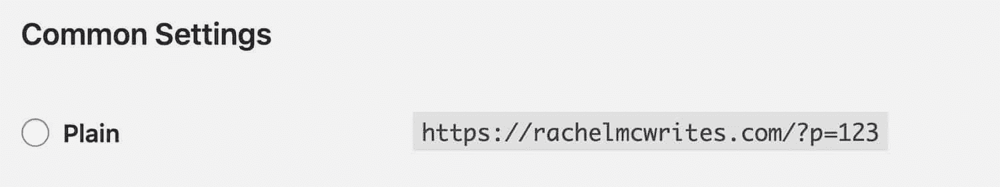

Plain setting in Permalinks settings screen


例如，考虑以下 URL:

```
https://example.com/?cat=5
https://example.com/?cat=5,7,9
```

作为对这些 URL 的响应，WordPress 会返回属于指定类别的文章的存档。

我们不局限于每个 URL 只有一个参数。在以下示例中，我们正在构建更复杂的查询:

```
?author_name=lucy&category_name=WebDev?tag=wordpress&m=201606
```

在第一个查询字符串中，author_name 和 category_name 将要求 WebDev 类别中指定作者的所有帖子。在第二个查询字符串中，tag 和 m 将要求所有标记为“wordpress”并在 2016 年 6 月发布的帖子。

如你所见，我们可以设置不止一个查询变量，并强制 WordPress 运行高级查询，只需在查询字符串中添加适当的 key=value 对。

### 漂亮的永久链接:更好的选择

通过启用漂亮的永久链接，我们建立了一个可用的、可访问的、SEO 友好的 URL 结构。让我们比较以下网址:

```
https://example.com/?p=123
https://example.com/wordpress-permalinks/
```

在这个例子中，丑陋的 permalink 显示 p 变量及其值(post ID)，而漂亮的 URL 显示 post slug。

WordPress 提供了四种漂亮的永久链接格式，我们可以在永久链接设置界面中选择，如下图所示。

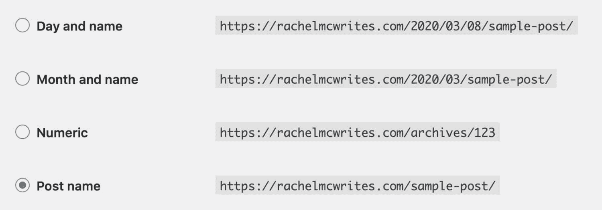

Pretty permalinks in Permalinks settings


但是你并不局限于默认格式，因为 WordPress 允许你通过设置一个或多个结构标签来定制漂亮的永久链接格式。

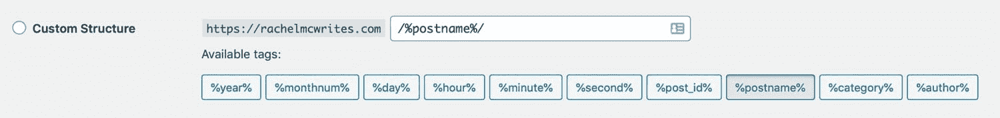

Custom structure option


我将在这篇文章的后面向你详细展示这些。

#### 为什么漂亮的永久链接很重要？

为你的 WordPress 站点使用漂亮的永久链接有两个好处: [SEO](https://kinsta.com/blog/wordpress-seo/) 和用户体验。

为什么会这样？搜索引擎使用你的网址作为帖子内容的指示。如果永久链接的内容与你的帖子内容相关，这将有助于搜索引擎确定你的帖子是关于什么的，以及它是关于它所声称的内容的。

对 UX 来说，漂亮的永久链接更好，因为它们让用户更容易记住和使用你网站上的 URL。如果你的[联系页面](https://kinsta.com/contact-us/)是 yoursite.com/?p=456**的话，没人会记得它的网址。但是他们会记住 yoursite.com/contact 的 T4。
**

## 永久链接、Slugs 和 SEO

帖子段是帖子 URL 的最后一部分。如果你已经配置了 WordPress 永久链接设置，使用了文章名称，那么一篇名为“如何创建漂亮的永久链接”的文章将自动生成为**yoursite.com/how-to-create-pretty-permalinks/**。

这是一个体面的鼻涕虫。它告诉用户帖子是关于什么的，对于搜索引擎来说，它包含“漂亮的永久链接”，这可能是你的目标关键词。

但是它可以被改进。

你的 slugs 应该足够长，以包含你的目标关键词，但也要足够短，以使用户容易记住，并且不会用许多不必要的词来混淆搜索引擎(下面是如何在 WordPress 中创建 [SEO 友好的永久链接)。](https://kinsta.com/blog/wordpress-seo/#13-use-short-urls)

因此，一个名为“如何创建漂亮永久链接”的帖子最好加上一段漂亮永久链接，给你 yoursite.com/pretty-permalinks/的 T2。或者，如果你在 pretty permalinks 上有多个帖子，并想给这个帖子一个与实际操作指南相关的具体信息，你可以使用**create-pretty-permanlinks**，给你**yoursite.com/create-pretty-permalinks**。

或者更进一步，你可以通过加入“WordPress”:**example.com/create-wordpress-pretty-permalinks**来进一步改善 SEO。

当人们在搜索结果中查看你的链接时，你也不希望搜索结果太长以至于不能全部被阅读。下面是我在谷歌上搜索“wordpress 永久链接”时从 Kinsta 博客上得到的两个结果。

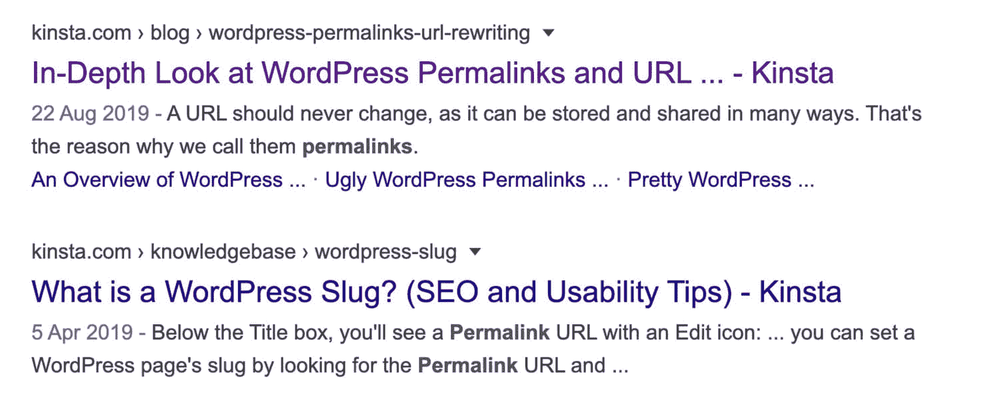

Google result – WordPress permalinks


这两种都有优化良好的鼻涕虫。第一个是 WordPress-prema links-URL-rewriting，表明它针对的是那些关键词，第二个是 wordpress-slug，更有针对性。

这些鼻涕虫不浪费任何词语。他们告诉搜索引擎这个帖子是关于什么的，除此之外别无其他。

你可以通过在永久链接设置界面选择**帖子名称**，然后在你写帖子的时候通过[手动编辑每个帖子](https://kinsta.com/blog/wordpress-seo/#step-1-find-the-permalink-setting)的 slug 来优化你的 SEO slug。

## 永久链接，蛞蝓和 UX

使用漂亮的永久链接和短而难忘的 slugs 也会给你带来 UX 的好处。

根据 Jacob Nielsen 1999 年的一篇文章，一个可用的网站需要:

*   一个好记易拼的域名。
*   短网址。
*   易于键入的 URL。
*   [可视化网站结构的 URLs】。](https://kinsta.com/blog/wordpress-breadcrumbs/)
*   URL 是“可黑客攻击的”,允许用户通过攻击 URL 的末尾来移动到更高层次的信息架构。
*   不会改变的持久 URL。

URL 不应该改变，因为它可以以多种方式存储和共享。这就是我们称之为永久链接的原因。此外，[URL 应该是语义上的](https://en.wikipedia.org/wiki/Clean_URL)，对于非专业用户来说，它具有直接和直观的意义。

因此，虽然你可以在发布后更改帖子的永久链接，但这不是一个好主意。这是因为原始的永久链接可能已经被共享了。如果你需要改变它，确保遵循 [WordPress 重定向最佳实践](https://kinsta.com/blog/wordpress-redirect/)。
T3】

## 如何更改 WordPress 中的永久链接设置

在 WordPress 中，你可以用多种方式改变永久链接:

*   你可以编辑永久链接设置屏幕来打开漂亮的永久链接——这是你建立网站后应该做的事情。
*   您可以在永久链接屏幕中编辑[标签和类别](https://kinsta.com/knowledgebase/what-is-taxonomy/)的永久链接结构。
*   您可以在创建和编辑帖子时编辑单个帖子的 slugs。
*   当你注册时，你可以指定链接到[自定义文章类型](https://kinsta.com/blog/wordpress-custom-post-types/)的结构，选择使用缺省值或否决它。
*   你可以写一个插件来修改永久链接的结构。
*   你可以使用[重定向](https://kinsta.com/blog/wordpress-redirect/)来获得一个指向新链接的过期永久链接。

让我们来看看每一个。

### 编辑整体 Permalink 设置

永久链接设置屏幕是配置永久链接的第一步。通过**设置>永久链接**访问。

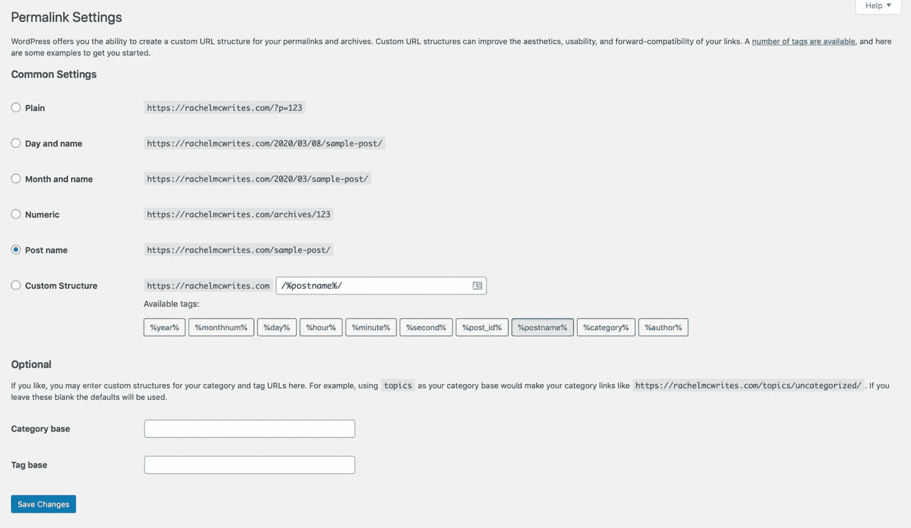

Permalink settings screen


#### 通用设置

第一部分处理单个帖子的设置。这些选项包括:

*   Plain:这使用链接的文章 ID。它对浏览器有意义，但对人类或搜索引擎意义不大。看起来是这样的:**example.com/?p=123**。
*   日期和名称:这包括文章发表的完整日期以及它的名称(或者更准确地说是它的标题)。看起来是这样的:**example.com/2020/06/01/my-post/.**
*   月份和名称:这是日期和名称的简短版本，只有月份和年份，没有日期:**example.com/2020/06/my-post/.**
*   Numeric:和 plain 选项一样，它使用文章 ID，对用户不太友好。**example.com/archives/123.**
*   帖子名称:该选项不包含任何日期或帖子 id，只使用了一个字符:**example.com/my-post/.**
*   自定义结构:您可以在这里创建自己的自定义结构。使用标签获取基于文章数据的信息，使用静态文本添加在文章之间不会改变的内容。

这些标签是包含在%字符中的特定关键字。WordPress 提供了以下标签:

*   **%**
*   **% month num %**–发布的月份(两位数)。
*   **% day %**–发布的日期(两位数)。
*   **% hour %**–发布的时间(两位数)。
*   **% minute %**–发布的分钟(两位数)。
*   **%秒%**–发布的秒(两位数)。
*   **% post _ id %**–帖子唯一 ID(整数)。
*   **%**
*   **%**
*   **% author %**–作者鼻涕虫。

尝试检查**自定义结构**单选按钮，并将以下字符串之一添加到文本字段中:

*   **/%作者%/%后名%/**
*   **/%年%/%后名%/**
*   **/%类别%/%后缀%/**

这些字符串中的任何一个都会生成具有特定语义值的不同的 pretty permalink，如下所示:

```
example.com/rachelmccollin/wordpress-permalinks/
example.com/2020/wordpress-permalinks/
example.com/CMS/wordpress-permalinks/
```

在第一个例子中，产生的 URL 突出显示了帖子的作者[。另外两种格式分别告诉我们出版年份和文章类别。选择最适合自己的格式就看你自己了。](https://kinsta.com/knowledgebase/how-to-change-author-in-wordpress/)

一旦你选择了你想要的选项，要么进入可选部分，要么点击**保存更改**保存你的设置。

#### 可选的永久链接设置

除了为你的单篇文章设置之外，永久链接设置界面还允许你为你的类别和标签档案设置一个自定义的结构。

如果不这样做，默认是在永久链接的末尾包含 **/category/category-slug/** 。因此，如果你有一个“特色”类别，它的档案页面将在 yoursite.com/category/featured 的**。**

 **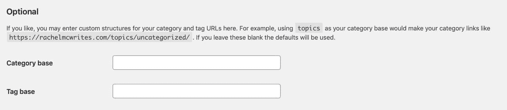

Optional permalink settings


您可以在永久链接设置页面的可选部分对此进行修改。因此，如果你想让**yoursite.com/blog/featured/**作为该类别档案的永久链接，你可以在**类别库**字段中输入**博客**。您不必插入反斜杠或使用标签。

### 如何更改单个帖子和页面的永久链接和 Slugs

一旦你在你的 WordPress 网站上激活了漂亮的永久链接，是时候为单独的帖子和页面优化 slug 了。

最好在[创建内容](https://kinsta.com/learn/content-marketing/)的时候这样做。如果你改变了一篇文章的 slug，那么你就改变了它所使用的 URL，你或你的访问者过去共享的任何链接都将不再有效。

要编辑帖子的 slug，您需要在该帖子的帖子编辑屏幕中工作。转到**帖子**并选择您想要编辑的帖子。(如果你正在创建文章，你已经在右边的屏幕上了。)

在文章编辑界面中，选择右侧的**文档**窗格，并转到**永久链接**部分。如果它尚未打开，请单击它右边的箭头。

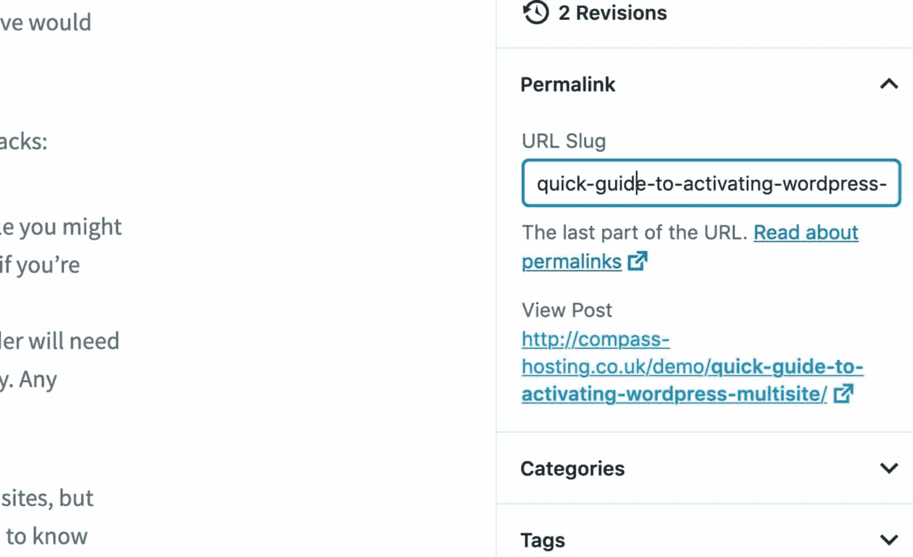

Permalink editing in post editing screen


自动生成的 slug 将显示在 **URL Slug** 字段中。您可以对此进行编辑，以使 slug 更短、更集中。

在你编辑它之前，把旧的 slug 拷贝到某个地方，这样你就可以在需要[设置重定向](https://kinsta.com/blog/wordpress-redirect/)的时候使用它(这只适用于以前发布的帖子)。

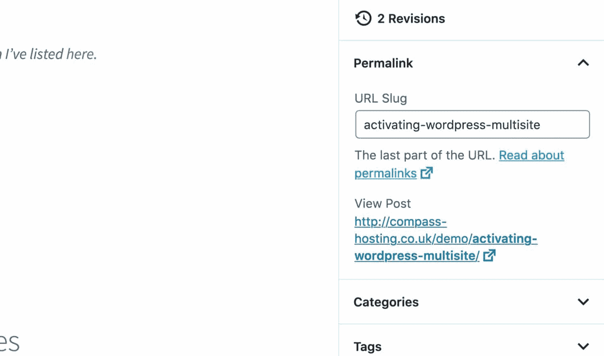

Slug edited


现在点击**发布**或**更新**按钮保存您的更改。

不要忘记:如果你已经编辑了一个现有帖子的 slug，你可能会给拥有原始链接并应该使用重定向的人带来问题。

### 如何更改存档页面的永久链接设置

要更改单个存档页面的永久链接设置，您可以在永久链接设置屏幕中编辑“类别”或“标签”基础的设置。您还可以更改单个类别、标签或自定义分类的 slug。

让我们来看看如何做到这一点，然后继续编辑定制分类法的永久链接和注册后的文章类型。

#### 更改类别和标签的 Slugs

为此，请转到**帖子>类别**(或**帖子>标签**)。

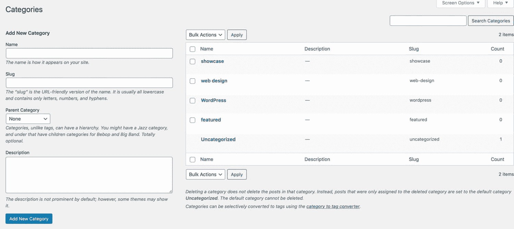

Categories editing screen


找到您想要编辑其 slug 的类别或标签，然后单击其名称。

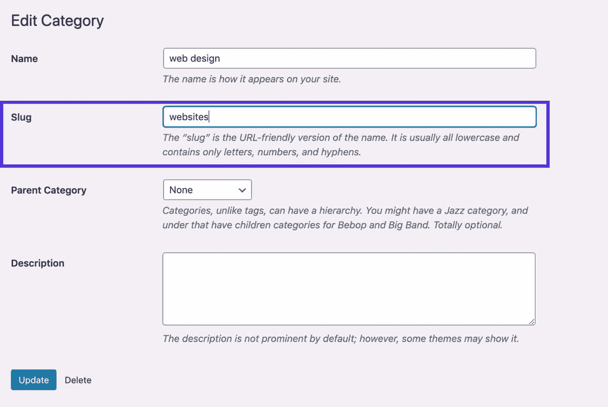

Editing a category slug


然后，您可以为类别或标签键入一个 slug。WordPress 会根据类别或标签的名称自动生成一个，但你不必保留这个。与文章一样，在设置类别或标签时这样做是明智的。如果您稍后再做，您将需要设置一个重定向。

如果你建立了一个定制的分类法，或者有一个是由插件创建的[，你可以用完全相同的方式编辑那个分类法中的单个术语的 slugs。但是如果您想要编辑分类法本身的 slug，您将需要编辑一些代码。](https://kinsta.com/best-wordpress-plugins/)

#### 为自定义分类更改 Slugs

当您注册一个自定义分类时，该分类的归档页面将自动拥有一个 URL**yoursite.com/taxonomy/term**，其中**分类**是分类 ID，**术语**是术语 slug。

让我们想象一下，你用 ID**kinsta _ language**为[语言](https://kinsta.com/blog/wordpress-multilingual/)注册了一个定制分类法，它使用一个前缀来确保它与其他插件注册的任何其他分类法不同。然后你可以用一段**法语**创造一个术语。

该分类术语存档的 URL 将是**yoursite.com/kinsta_language/french**。

但是，如果你想改变它，使它不包括前缀，更方便用户呢？在注册分类法时，可以使用 rewrite 参数来实现这一点。

下面是您将用来注册分类的代码，包括 rewrite 参数。

```
function kinsta_register_taxonomy() {                

 // languages
 $labels = array(
  'name'=> __( 'Languages' ),
  'singular_name' => __( 'Language' ),
  'search_items' => __( 'Search Languages' ),
  'all_items' => __( 'All Languages' ),
  'edit_item' => __( 'Edit Languages' ),
  'update_item' => __( 'Update Languages' ),
  'add_new_item' => __( 'Add New Language' ),
  'new_item_name' => __( 'New Language Name' ),
  'menu_name' => __( 'Languages' ),
 );

 $args = array(
  'labels' => $labels,
  'hierarchical' => true,
  'sort' => true,
  'args' => array( 'orderby' => 'term_order' ),
  'rewrite' => array( 'slug' => 'language' ),
  'show_admin_column' => true,
  'show_in_rest' => true
 );

 register_taxonomy( ‘kinsta_language', array( 'post', ‘attachment' ), $args);   

}

add_action( 'init', 'kinsta_register_taxonomy' );
```

代码中重要一行是这样的:

```
'rewrite' => array( 'slug' => 'language' ),
```

这将那个 slug 从**kinsta _ language**(ID)重写为**语言**(新值)。所以你的新网址应该是 yoursite.com/language/french 的**。更加用户友好！**

 **### 如何更改自定义帖子类型的 Slugs

[定制文章类型](https://kinsta.com/blog/wordpress-custom-post-types/)的工作方式与注册时的定制分类相同，因此它们会有一个包含定制文章类型 ID 的 URL。

## 注册订阅时事通讯


### 想知道我们是怎么让流量增长超过 1000%的吗？

加入 20，000 多名获得我们每周时事通讯和内部消息的人的行列吧！

[Subscribe Now](#newsletter)

让我们想象一下，你注册了一个名为 **kinsta_book** 的自定义帖子类型，然后你创建了一个名为“哈克贝利·费恩”的帖子，并添加了一段**哈克贝利·费恩**。

这个网址应该是 yoursite.com/kinsta_book/huckleberry-finn 的。用于 post 类型档案的 slug 将是 yoursite.com/kinsta_book 的**。**

 **同样，您可以在注册自定义 post 类型时使用 rewrite 参数来更改这一点。同样，这是包含该参数的代码:

```
function kinsta_register_post_type() {

 // books
 $labels = array(
  'name' => __( 'Books' ),
  'singular_name' => __( 'Book' ),
  'add_new' => __( 'New Book' ),
  'add_new_item' => __( 'Add New Book' ),
  'edit_item' => __( 'Edit Book' ),
  'new_item' => __( 'New Book' ),
  'view_item' => __( 'View Book' ),
  'search_items' => __( 'Search Books' ),
  'not_found' =>  __( 'No Books Found' ),
  'not_found_in_trash' => __( 'No Books found in Trash' ),
 );

 $args = array(
  'labels' => $labels,
  'has_archive' => true,
  'public' => true,
  'hierarchical' => false,
  'supports' => array(
   'title',
   'editor',
   'excerpt',
   'custom-fields',
   'thumbnail',
   'page-attributes'
  ),
  'taxonomies' => array( ‘kinsta_language', 'category'),
  'rewrite'   => array( 'slug' => 'book' )
 );

 register_post_type( ‘kinsta_book', $args );

}

add_action( 'init', 'kinsta_register_post_type' );
```

对于蛞蝓来说，重要的一行是这样的:

```
'rewrite'   => array( 'slug' => 'book' )
```

因此，现在单本书的网址将是**yoursite.com/book/huckleberry-finn**，而档案馆的网址将是**yoursite.com/book**。


### 信息

说到书…你已经看过金斯塔的电子书区了吗？它们可以免费下载，并且充满了可行的技巧！


#### 使用自定义字段编辑永久链接

除了公共和私有查询变量，WordPress 允许开发者和高级用户定义他们自己的定制查询变量。注册后，这些变量可以添加到查询字符串中，就像公共查询变量一样，它们的值也可以用来影响查询。

下面是如何利用定制查询变量构建定制元查询(即通过定制字段检索文章的查询)。

为了实现这个目标，我们将[开发一个插件](https://kinsta.com/blog/publish-plugin-wordpress-plugin-directory/)，我们将从这个插件中注册自定义变量，获取它们的值，并相应地更改查询。

以下是如何…

在你的 wp-content/plugins 目录下创建一个插件。添加一个函数来注册查询变量:

```
/**
 * Register custom query vars
 *
 * @param array $vars The array of available query variables
 */

function myplugin_register_query_vars( $vars ) {

 $vars[] = 'city';
 return $vars;

}

add_filter( 'query_vars', 'myplugin_register_query_vars' );
```

[query_vars](https://codex.wordpress.org/Plugin_API/Filter_Reference/query_vars) [过滤器](https://codex.wordpress.org/Plugin_API/Filter_Reference/query_vars)允许您在执行查询之前添加、删除或更改公共查询变量。示例中的回调函数将一个可用变量数组存储为参数，添加一个新变量并返回同一个数组。

接下来，添加这个函数，它使用变量值来更改查询:

```
/**
 * Build a custom query
 *
 * @param $query obj The WP_Query instance (passed by reference)
 *
 */

function myplugin_pre_get_posts( $query ) {

 // check if the user is requesting an admin page
 // or current query is not the main query
 if ( is_admin() || ! $query->is_main_query() ){
  return;
 }

 $city = get_query_var( 'city' );

 // add meta_query elements
 if( !empty( $city ) ){
  $query->set( 'meta_key', 'city' );
  $query->set( 'meta_value', $city );
  $query->set( 'meta_compare', 'LIKE' );
 }

}

add_action( 'pre_get_posts', 'myplugin_pre_get_posts', 1 );
```

在查询创建之后但执行之前， [pre_get_posts](https://codex.wordpress.org/Plugin_API/Action_Reference/pre_get_posts) [操作钩子](https://codex.wordpress.org/Plugin_API/Action_Reference/pre_get_posts)被触发。因此，我们可以将一个回调函数与该操作挂钩，以便在查询运行之前对其进行更改。事情就是这样:

*   回调函数保留$query 对象的一个实例，该实例通过引用传递，而不是通过值传递。这意味着对查询对象的任何更改都会影响原始查询，而不是它的副本。因此，我们必须确定将要执行哪个查询(主查询)。
*   稍后，我们通过[get _ query _ var](https://codex.wordpress.org/Function_Reference/get_query_var)[函数](https://codex.wordpress.org/Function_Reference/get_query_var)从当前查询字符串中获取城市值。
*   最后，如果$city 不为空，我们可以设置元查询元素 meta_key、meta_value 和 meta_compare。后者是私有查询变量，不能用于公共请求。它们的值只能在脚本中设置。

现在激活插件，将城市自定义字段添加到一些帖子中。去设置>永久链接刷新永久链接，你其实什么都不用做；光是逛屏幕就够了。

现在检查如下 URL:

```
https://example.com/?city=London
```

为了响应这个请求，WordPress 将返回所有**城市**字段值为**伦敦**的帖子。

我们最后的任务是将上面例子中丑陋的 URL 转换成一个漂亮的永久链接结构。让我们将以下函数添加到我们的插件中:

```
/**
* Add rewrite tags and rules
*/

function myplugin_rewrite_tag_rule() {

 add_rewrite_tag( '%city%', '([^&]+)' );
 add_rewrite_rule( '^city/([^/]*)/?', 'index.php?city=$matches[1]','top' );

}

add_action('init', 'myplugin_rewrite_tag_rule', 10, 0);
```

[add_rewrite_tag](https://codex.wordpress.org/Rewrite_API/add_rewrite_tag) 和 [add_rewrite_rule](https://codex.wordpress.org/Rewrite_API/add_rewrite_rule) 函数是重写 API 的一部分。add_rewrite_tag 让 WordPress 知道城市查询 var，而 add_rewrite_rule 指定一个新的重写规则。这两个函数都应该与 init 操作挂钩。由于新的标签和规则，我们可以使用以下 URL:

```
https://example.com/city/London/
```

WordPress 将返回城市自定义字段值为伦敦的文章档案。

注意:任何时候添加新的重写规则，WordPress 永久链接必须从设置管理菜单下的永久链接屏幕刷新。

## 如何改变 WooCommerce 中的永久链接

WooCommerce 创建自定义的文章类型和分类，所有这些都有插件定义的默认永久链接。

您可以编辑所有这些的永久链接设置和 slugs。

### 更改产品类别、标签和属性永久链接

编辑产品类别、标签和属性的永久链接有两个方面:结构和 slug。这些工作方式类似于常规的类别和标签。

要编辑永久链接结构，进入**设置>永久链接**并找到**可选**部分，WooCommerce 将在那里添加一些额外的字段。

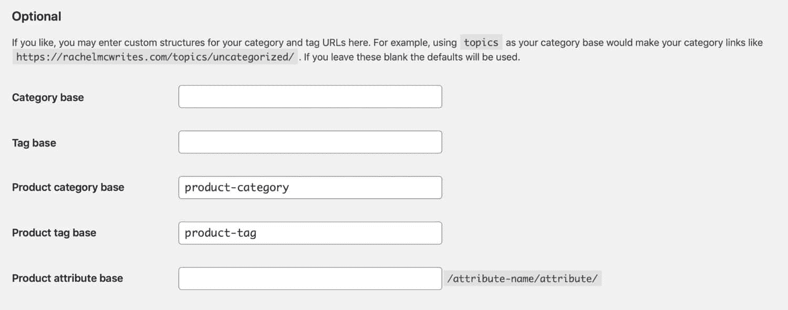

Optional permalinks settings with WooCommerce installed


在这里，您可以编辑 WooCommerce 添加的三个自定义分类的永久链接设置:

*   产品类别:默认为 **/product-category/** ，但如果你在商店中使用不同的术语，你可以修改。请确保您的更改不会与常规类别的设置冲突，因为它们不是一回事。
*   产品标签:默认为 **/product-tag/** ，可以随意更改。确保避免与常规文章标签冲突。
*   产品属性:它们的工作方式不同于其他两种分类法，并且具有不同的结构。无论您在此添加什么，后面总是会跟有单个属性名称(如大小)和属性本身(术语，如大)的字符。

如果您想编辑单个类别或标签的 slug，请转到**产品>类别**(或**产品>标签**)并以发布标签和类别的相同方式编辑它们。

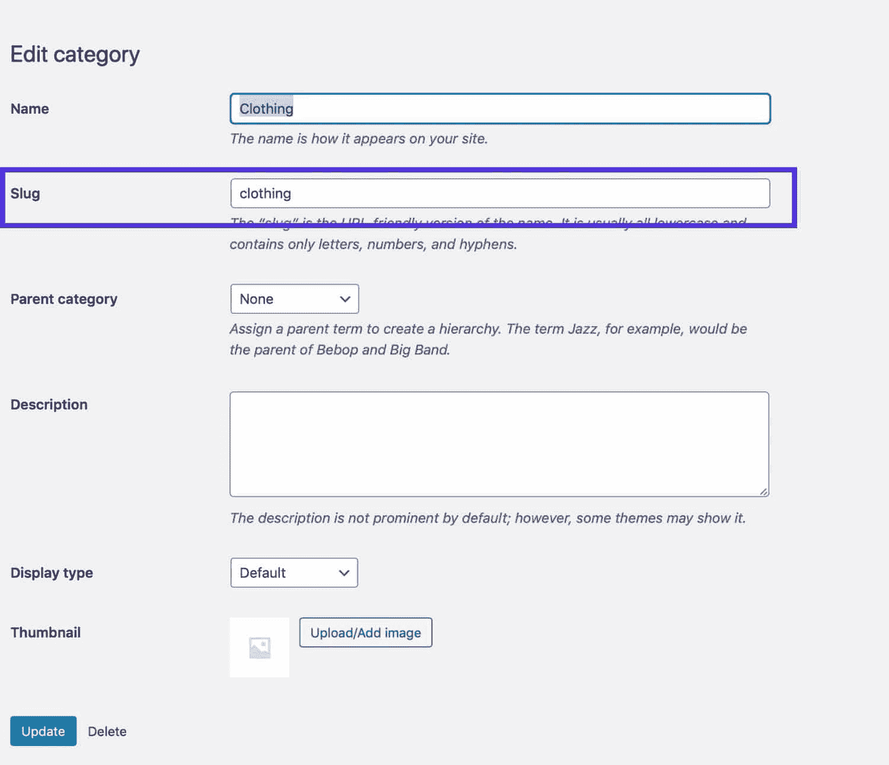

Product category slug editing


编辑属性是不同的，因为您不仅拥有属性本身，还拥有属性术语。

首先转到**产品>属性**。

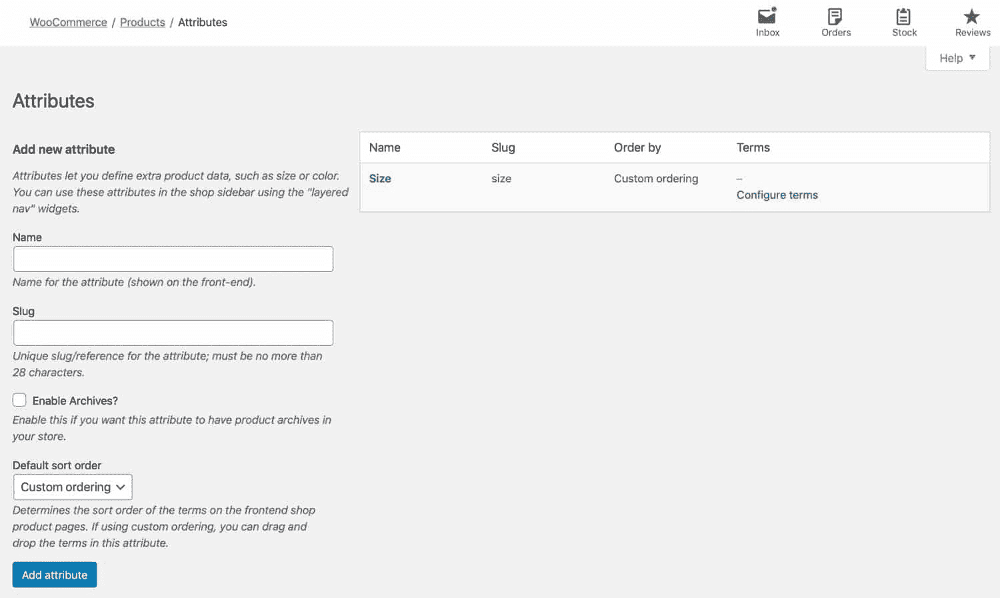

Product attributes screen


当创建一个新属性时，使用 **slug** 域来设置 Slug，就像你为标签或类别设置 Slug 一样。或者，要编辑现有属性的 slug，点击右边列表中该属性下方的**编辑**链接。

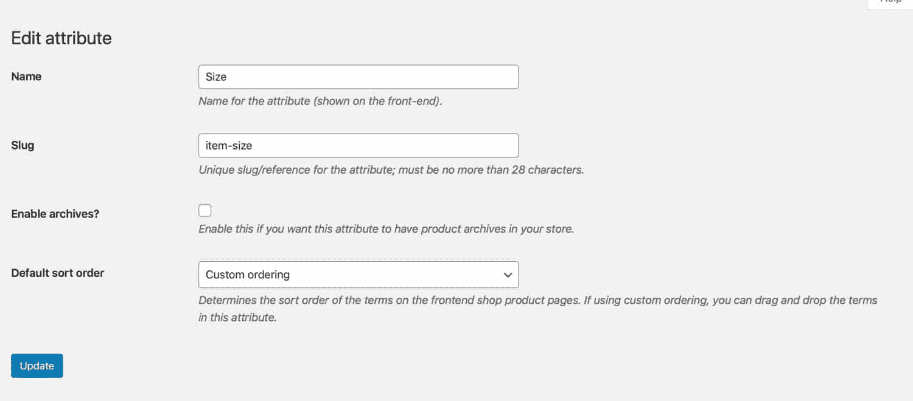

Editing product attribute slugs


点击**更新**保存您的更改。

要编辑属性术语 slugs，转到属性屏幕，点击属性旁边的**配置术语**链接。这将带您到该属性的术语列表。

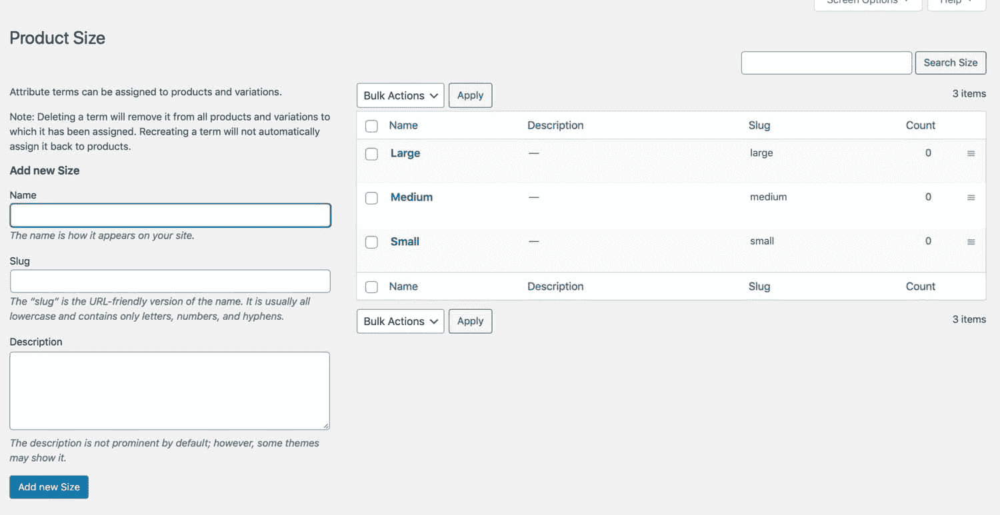

Product attribute terms listing


现在编辑该术语的 slug，就像编辑类别或标签一样。然后，这将被添加到具有该术语的产品的存档的 URL 中。

你的新网站需要一个超快的、可靠的、完全安全的主机吗？Kinsta 提供所有这些以及 WordPress 专家提供的 24/7 世界级支持。[查看我们的计划](https://kinsta.com/plans/?in-article-cta)

### 更改产品永久链接

你可以通过**设置>永久链接**来编辑产品永久链接。向下滚动到**产品永久链接**部分。

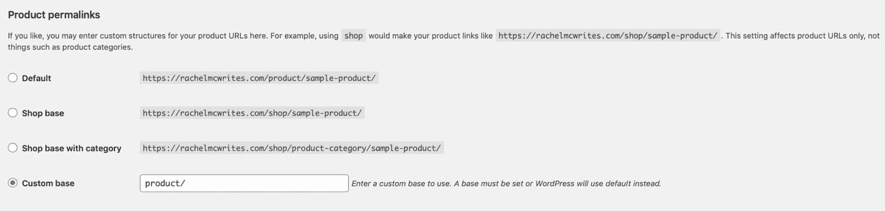

Product permalinks settings


在这里，您可以为您的产品选择四种永久链接设置:

*   **默认**:如果你已经激活了 pretty permalinks，这将使用每个产品的 slug 与/product/ base。
*   **店铺基数**:你的店铺不用/product/，会用/shop/。
*   **类别为**的店铺:将当前商品的类别插入到 URL 中。如果你的产品类别反映了这些关键词，这可能会添加你想要的关键词，但不会帮助你的 UX，因为它会创建很长的 URL。
*   **自定义库**:使用适用于您商店的文字创建您自己的 URL 结构。你不能完全去掉底座，你必须使用一些东西。

一旦你选择了你想要的选项，点击**保存更改**按钮保存你的选择。

您也可以在产品编辑屏幕中编辑单个产品的标题，就像编辑文章或页面一样。

## 如何用插件改变 WordPress 永久链接

除了默认的 WordPress 永久链接设置界面允许你做的以外，你可以使用第三方插件来修改你的永久链接设置。

[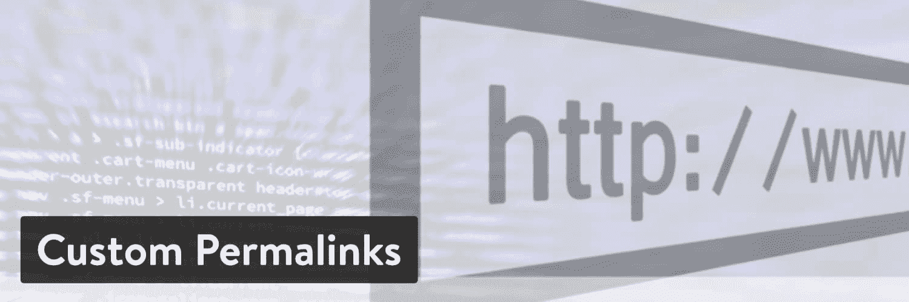](https://kinsta.com/wp-content/uploads/2020/06/Custom-Permalinks-plugin.jpg)

Custom Permalinks WordPres plugin


*   自定义永久链接插件可以让你设置任何文章类别或标签的 URL。它还设置重定向，使旧的网址仍然有效。
*   在专业版中， [Permalink Manager Lite](https://wordpress.org/plugins/permalink-manager/) 插件支持自定义文章类型以及自定义分类法。它还包括重定向和第三方插件，如 WooCommerce 和 [Yoast](https://kinsta.com/blog/yoast-seo/) 。

## 如何在 phpMyAdmin 中更改 WordPress 永久链接

如果你知道你在做什么，并且确定你不会破坏任何东西，你也可以在 [phpMyAdmin](https://kinsta.com/help/wordpress-phpmyadmin/) 中编辑永久链接。

如果你因为任何原因无法进入永久链接设置界面，你可能需要这样做。

从[备份数据库](https://kinsta.com/knowledgebase/mysql-backup-database/)开始。你将直接编辑它，所以备份以防出错是很重要的。

访问 phpMyAdmin。

如果你是 Kinsta 的客户，你可以登录到 [MyKinsta](https://kinsta.com/mykinsta) ，然后选择你想合作的网站。

在信息屏幕中向下滚动并点击**打开 phpMyAdmin** 按钮。

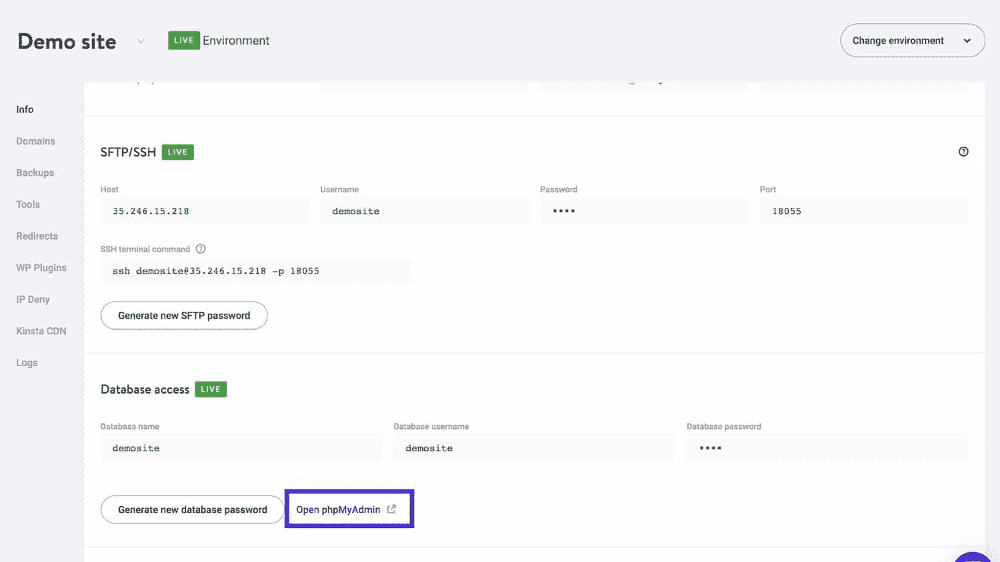

Open phpMyAdmin in MyKinsta


输入您的数据库用户名和密码来访问 phpMyAdmin。您可以从信息屏幕中检索这些信息。

点击顶部的**数据库**选项卡，然后选择您想要使用的数据库。

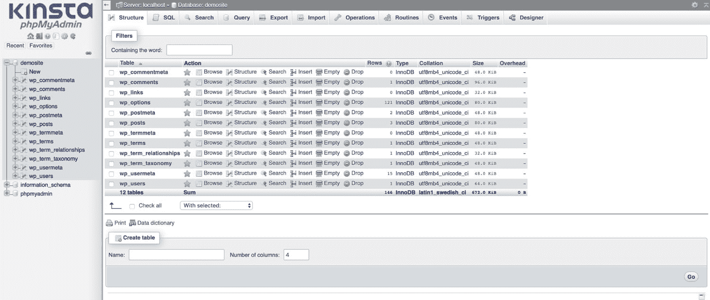

Database structure in phpMyAdmin


选择 **wp_options** 表，在 **option_name** 列中找到 **permalink_structure** 条目。您可能需要导航到条目的第一页之外。

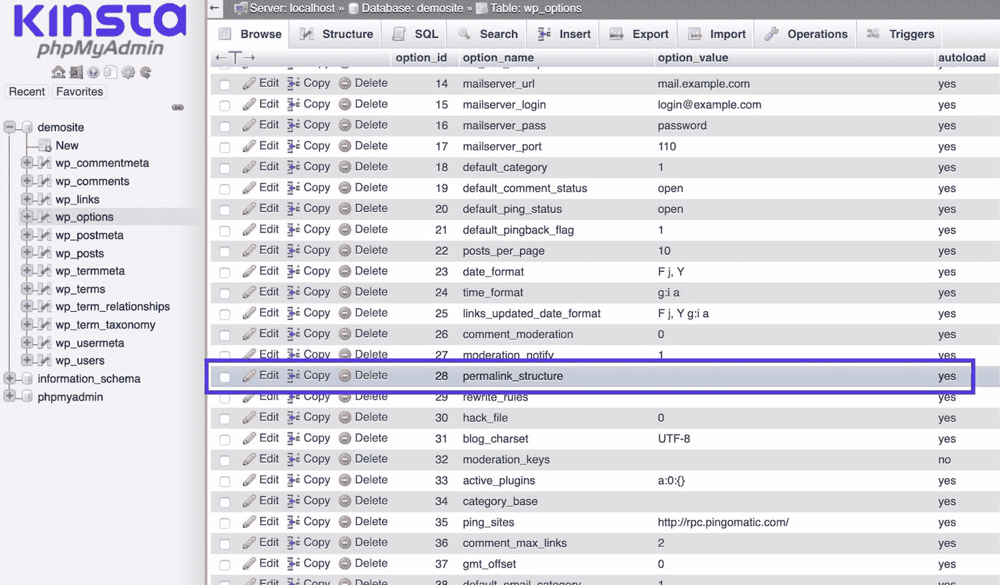

Finding the permalink_structure entry


单击该条目左侧的**编辑**链接，然后在**选项 _ 值**字段下，添加您想要使用的永久链接结构。使用我们之前在永久链接设置屏幕中确定的标签。

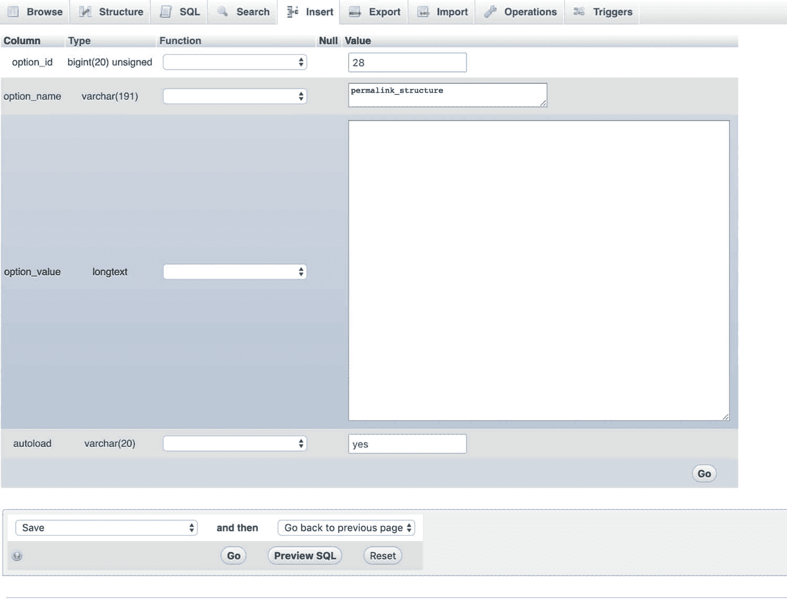

Editing the permalink structure


点击**进入**。现在你的永久链接将被更新。

如需进一步阅读，请查看我们的文章:[如何更改你的 WordPress URL](https://kinsta.com/knowledgebase/wordpress-change-url/) 或视频:


## 使用图像永久链接

[图片都有自己的永久链接](https://kinsta.com/blog/wordpress-media-library/)，你上传到你网站的每个[图片或媒体文件都会有一些链接:](https://kinsta.com/knowledgebase/bulk-upload-files-wordpress-media-library-ftp/)

*   您上传的图片链接-原始图片。
*   使用您通过**设置>介质**设置的介质尺寸生成的新图像的链接。

### 原始图像的链接

上传图像时，会创建一个唯一的链接，链接指向存储在服务器上的文件。这将包括保存它的路径，即 wp-content/uploads。

它还将包括您上传图像的日期。这意味着，如果你下个月(或明年)上传另一个具有相同文件名的图像，这些图像不会混淆，因为它们将具有唯一的文件路径。

如果你在 2020 年 4 月 1 日上传一张名为**funnycat.jpg**的图片，它的链接将会是【yoursite.com/wp-content/uploads/04/funnycat.jpg】T2。 **04** 表示文件上传于 4 月。WordPress 在上传目录中为每个月创建一个编号文件夹。

如果你上传了一个不是图片的文件，URL 也会以同样的方式工作:**yoursite.com/wp-content/uploads/04/document.pdf**。

如果你在一个月内上传了不止一个同名文件，WordPress 会在文件名后面加上一个数字。因此，如果我上传另一张名为**funnycat.jpg**的图片，它会称之为【funnycat-1.jpg】T2。

如果您需要链接到原始图像或找到它以检查它是否正常工作，这是您找到链接的方法。

您也可以通过进入**媒体>库**并点击文件来找到附件文件的链接。将显示该文件的编辑屏幕，您可以在右侧的**文件 URL** 字段中找到其 URL。

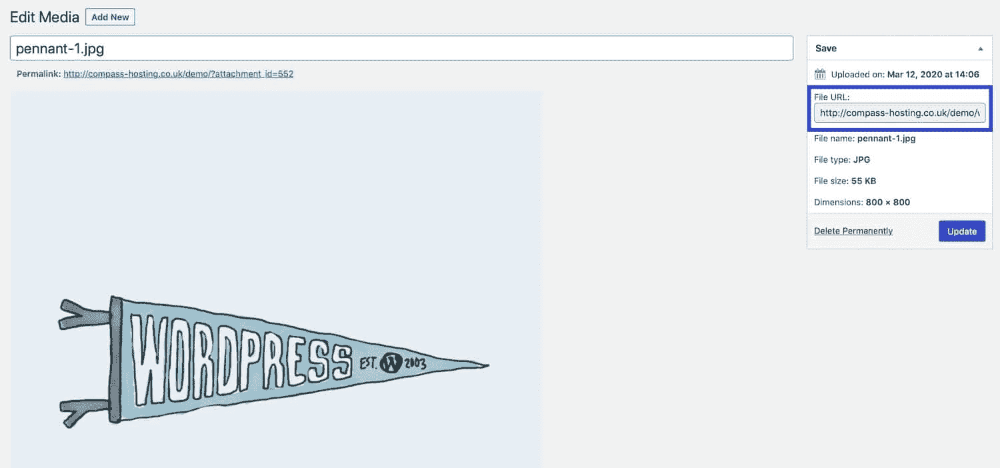

Original image link


也可以使用 WordPress 提供的[WP _ get _ attachment _ image()](https://developer.wordpress.org/reference/functions/wp_get_attachment_image/)函数链接到文件。这是一种更好的做法，因为这意味着如果将来移动附件，链接也不会改变。这是一个在插件或主题模板文件中使用的函数，它使用附件文件的唯一 ID。

在我的**funnycat.jpg**图像的情况下，ID 是 **4995** 。我可以通过转到图像编辑屏幕并点击浏览器窗口顶部该屏幕的 URL 来获得此信息。最后的数字将是 ID。

要在模板文件或插件中获取该图像，我会使用以下代码:

```
<?php wp_get_attachment image( ‘4995’ ); ?>
```

这将获取全尺寸图像。如果我想输出它，我会添加 echo:

```
<?php echo wp_get_attachment image( ‘4995’ ); ?>
```

### 不同大小图像的永久链接

WordPress 还将使用为您的网站配置的文件大小设置来创建图像。你可以通过进入**设置>媒体**来完成。

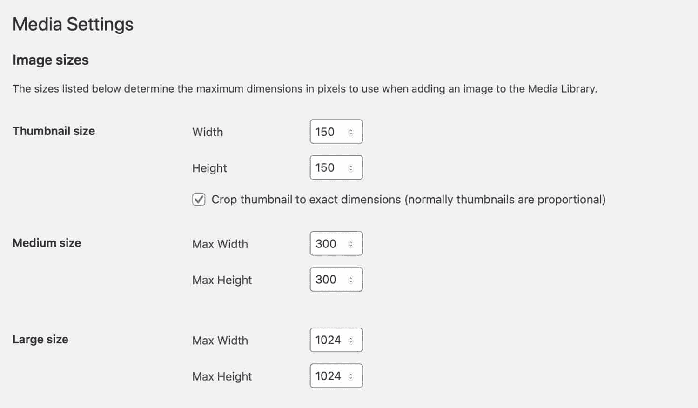

Media settings screen


因此，如果您的图像已经大于大设置，它将创建三个图像-大，中和缩略图。

它没有使用这些约定来命名它们，因为将来您可能会更改它们的设置。相反，它使用文件名中文件的尺寸，并将它们保存到与原始图像相同的位置，即 wp-content/uploads 中的 month 文件夹中。

找到链接最简单的方法是查看你的 [FTP 客户端](https://kinsta.com/blog/best-ftp-clients/)，找到某个月上传的所有图片。

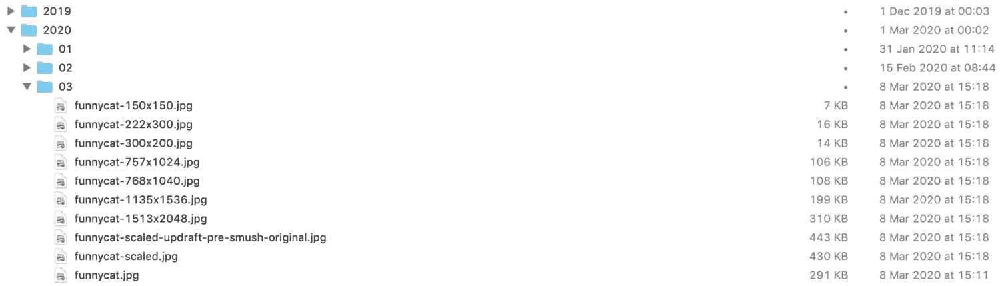

Uploaded images in FTP client


让我们看看我上传到我的网站 funnycat.jpg 的图片。你可以在上面的截图中看到。

WordPress 还使用我的网站的文件大小设置创建了额外的文件:

*   funnycat-150×150.jpg
*   funnycat-222×300.jpg
*   funnycat-300×200.jpg
*   funnycat-757×1024.jpg
*   funnycat-768×1040.jpg
*   funnycat-1135×1536.jpg
*   funnycat-1513×2048.jpg

这里有比标准尺寸更多的尺寸，因为我使用了插件，这些插件利用了额外的图像尺寸，并且为我在主题中的一个页面模板设置了额外的自定义尺寸。但是如果你想的话，你可以使用这些链接作为一个硬链接。

然而，如果您想要链接到图像，更好的选择是使用我们已经看过的 wp_get_attachment_image()函数，并为图像大小添加一个额外的参数。

因此，要输出中等大小的图像，您可以使用:

```
<?php echo wp_get_attachment image( ‘4995’, ‘medium’ ); ?>
```

这是一种比在代码中创建硬链接更健壮的获取图像的方式。

## 如何重定向不同内容类型的永久链接

如果您以前使用旧链接共享过帖子，则编辑现有帖子的 slug 或整体更改永久链接设置可能会导致问题。如果有人点击这些链接，他们将被带到 404 页面。

您可以通过创建从旧链接到新链接的重定向来解决这个问题。

### 重定向单个帖子和页面

要将旧的文章重定向到新的文章，您需要为这两个 URL 设置一个重定向规则。

如果你和 Kinsta 在一起，你可以在 [MyKinsta 仪表板](https://my.kinsta.com/)中[创建重定向规则](https://kinsta.com/help/redirect-rules/)。

找到你的站点，然后点击菜单中的**重定向**选项。

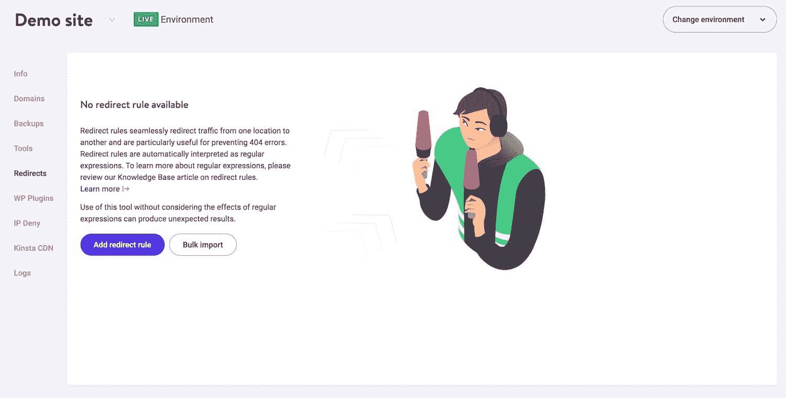

Redirects in MyKinsta


点击**添加重定向规则**按钮，打开重定向规则弹出窗口。

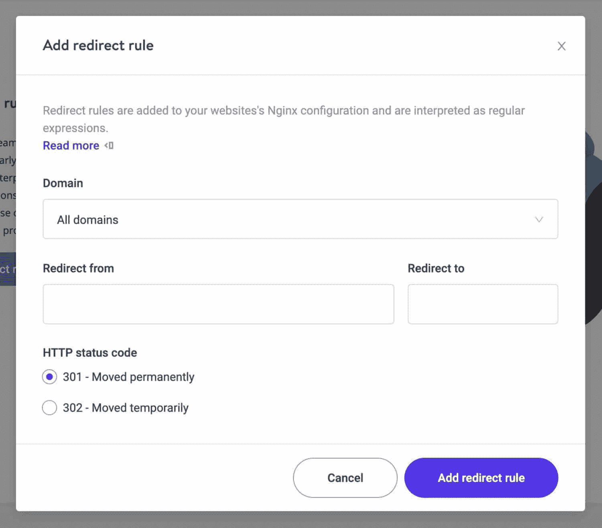

MyKinsta add redirect rule


要添加您的重定向，请选择 **301 重定向**，然后键入旧的 slug 作为从重定向的**值，并键入新的 slug 作为**重定向到**的值。**

点击**添加重定向规则**按钮，您的重定向将被设置。

如果你没有使用 Kinsta，你可以使用一个[重定向插件](https://kinsta.com/blog/wordpress-redirect/)来设置重定向。[重定向](https://wordpress.org/plugins/redirection/)插件是最受欢迎的。它可以让你手动设置重定向，也可以监控你的 slugs 的变化，并自动为你设置重定向。小心避免重定向循环，因为这会导致“[太多重定向](https://kinsta.com/blog/err_too_many_redirects/)”错误，阻止页面加载。

下面你可以看到我已经为我的一篇文章修改了 slug，插件已经捕获了它并设置了一个重定向规则。

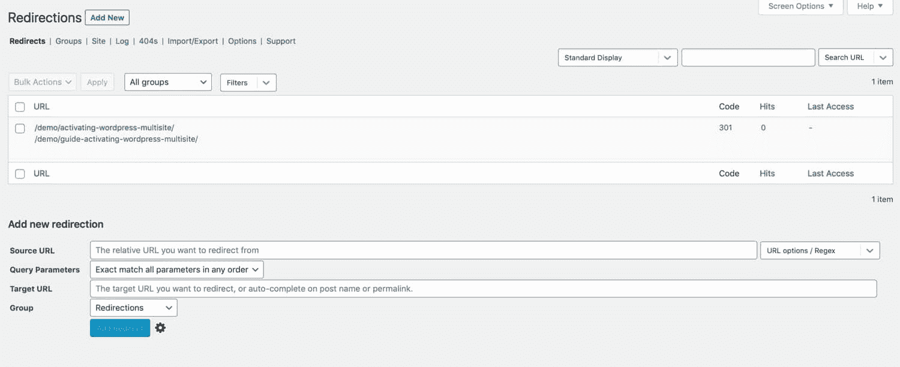

Redirection plugin redirect rule set up


### 重定向存档页面

如果您使用永久链接设置页面中的可选部分更改您的存档页面的结构，任何使用旧类别存档链接的人都将被带到您的 404 页面。所以您需要设置一个通配符重定向。

在 MyKinsta 中，[创建一个重定向规则](https://kinsta.com/blog/wordpress-redirect/#redirect-rules-in-mykinsta),它使用您以前使用的基础结构和现在使用的基础结构，后面用星号表示通配符。

在**重定向自**字段中，键入类别的旧路径，并使用通配符。它需要采用 **/oldslug/(。*)$** 。**重定向到**的条目需要采用 **/newslug/$1** 的形式。

所以如果你已经改变了你的类别 URL 结构，在类别名称前使用了**博客**，而不是默认的**类别**，你应该输入**/类别/(。*)$** 在**重定向自**字段， **/blog/$1** 在**重定向至**字段。

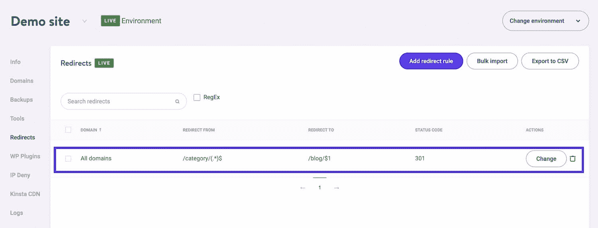

Adding a wildcard redirect in MyKinsta


如果您使用的是[重定向插件](https://kinsta.com/blog/wordpress-redirect/#creating-a-wordpress-redirect-with-a-plugin)，您需要首先启用正则表达式函数，因为通配符星号是一个正则表达式函数。

转到**工具>重定向**并转到屏幕的**添加新重定向**部分。

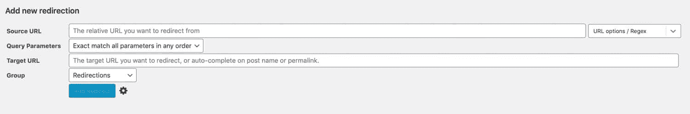

Creating a new redirect rule with the redirection plugin


点击 **URL 选项/正则表达式**下拉菜单并勾选**正则表达式**框。

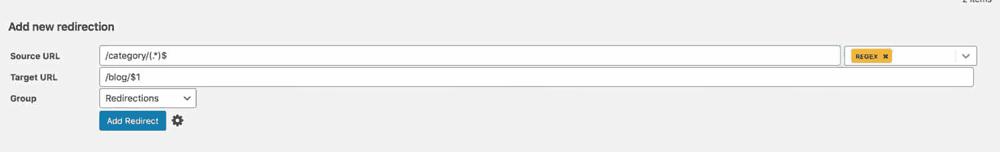

Setting up a wildcard redirect with the Redirection plugin


在**源 URL** 字段中，键入类别的旧路径，并使用通配符。它需要采用 **/oldslug/(。*)$** 。**目标 URL** 的条目需要带 source **/newslug/$1** 。这与 MyKinsta 中的工作方式完全相同。

**查看我们的 WordPress 重定向最佳实践视频指南:**


## WordPress 永久链接疑难解答

偶尔你会发现永久链接并不像你期望的那样工作。如果发生这种情况，应该这么做。

### 注册帖子类型后永久链接不起作用

有时你注册了一个新的文章类型或分类，链接到相关的存档页面或文章类型的文章，不要担心。

不要慌！这仅仅是因为 WordPress 不知道自定义文章类型或分类意味着永久链接设置的改变。只需进入**设置>永久链接**刷新设置。你甚至不需要做任何更改或点击**保存更改**按钮——只需打开屏幕就足够了。

### 永久链接没有按照您希望的方式运行

如果你的永久链接没有按你期望的方式工作，这不是因为你刚刚注册了一个自定义的文章类型或分类，试试这些提示。

*   检查您在浏览器中键入的 URL 是否正确。
*   前往**设置>永久链接**并检查设置。标签正确吗？确保您没有遗漏任何内容或使用错误的语法。
*   如果你使用的是[缓存插件](https://kinsta.com/blog/wordpress-caching-plugins/)，清空你网站的缓存。缓存会干扰对链接的更改。
*   如果您更改了永久链接设置，您的网站内容正文中的链接可能已经过期。编辑它们或设置重定向。
*   检查您是否手动更改了任何帖子的 slug，以及这些帖子是否需要编辑。
*   检查您是否安装了重定向插件或包含重定向的插件。如果是这样，请检查您在设置中添加了哪些重定向。
*   如果你有任何影响文章类型或链接的插件，试着停用它们，看看是否能解决问题。
*   如果您无法访问永久链接设置屏幕，请使用前面详述的方法通过 [phpMyAdmin](https://kinsta.com/knowledgebase/how-to-restore-mysql-database-using-phpmyadmin/) 编辑永久链接。

遵循这些建议，你应该能够让你的永久链接正常工作。

[Permalinks are the building blocks of any WordPress site. Learn what they are, how they work, and how to optimize them for better SEO traffic 💥Click to Tweet](https://twitter.com/intent/tweet?url=https%3A%2F%2Fkinsta.com%2Fblog%2Fwordpress-permalinks%2F&via=kinsta&text=Permalinks+are+the+building+blocks+of+any+WordPress+site.+Learn+what+they+are%2C+how+they+work%2C+and+how+to+optimize+them+for+better+SEO+traffic+%F0%9F%92%A5&hashtags=webdev%2Cwordpresstips)

## 摘要

永久链接是 WordPress 的一个非常有用的功能。你可以用它们来提升用户体验，提升你在搜索引擎中的排名。

如果你按照上面的指南，你会有优化的永久链接。对于所有的文章类型、分类法和定制的 slugs，你可以配置它们，使它们完全按照你需要的方式工作。

现在，轮到你了:你如何管理你的永久链接？我们有没有忘记介绍任何关于 WordPress 永久链接的内容？请在下面的评论中告诉我们！

* * *

让你所有的[应用程序](https://kinsta.com/application-hosting/)、[数据库](https://kinsta.com/database-hosting/)和 [WordPress 网站](https://kinsta.com/wordpress-hosting/)在线并在一个屋檐下。我们功能丰富的高性能云平台包括:

*   在 MyKinsta 仪表盘中轻松设置和管理
*   24/7 专家支持
*   最好的谷歌云平台硬件和网络，由 Kubernetes 提供最大的可扩展性
*   面向速度和安全性的企业级 Cloudflare 集成
*   全球受众覆盖全球多达 35 个数据中心和 275 多个 pop

在第一个月使用托管的[应用程序或托管](https://kinsta.com/application-hosting/)的[数据库，您可以享受 20 美元的优惠，亲自测试一下。探索我们的](https://kinsta.com/database-hosting/)[计划](https://kinsta.com/plans/)或[与销售人员交谈](https://kinsta.com/contact-us/)以找到最适合您的方式。******