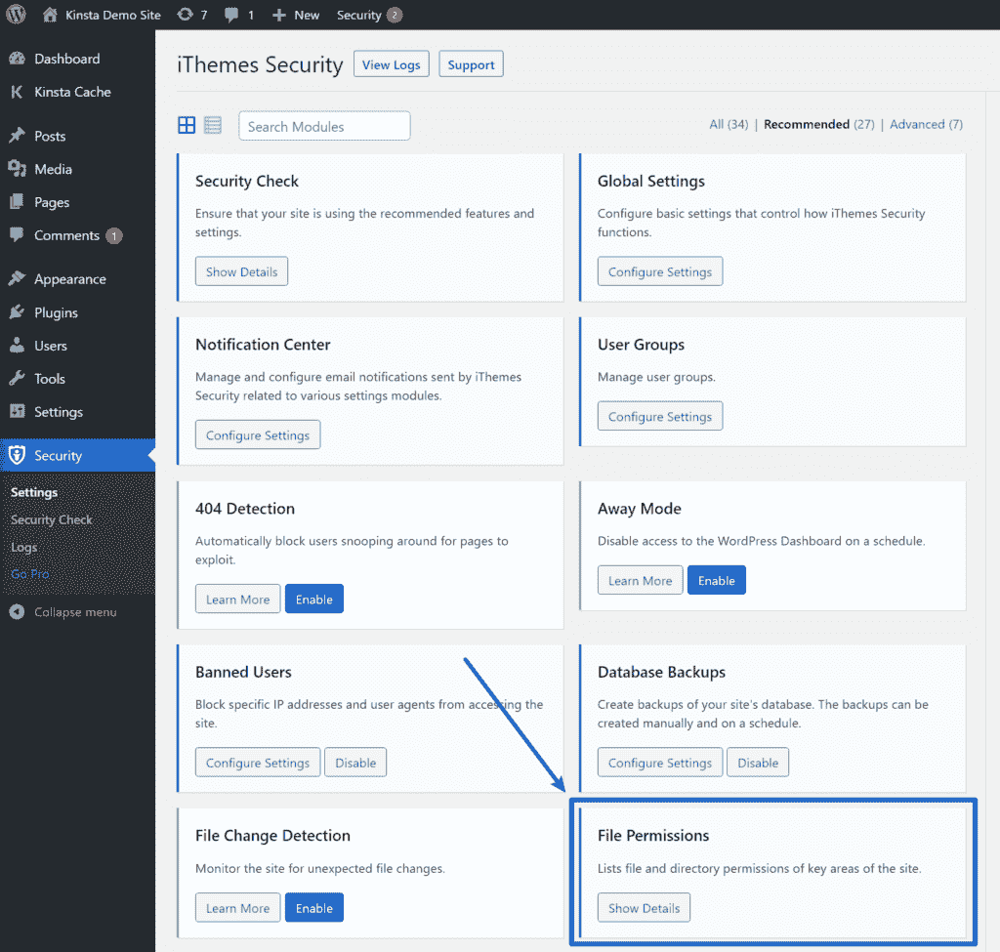
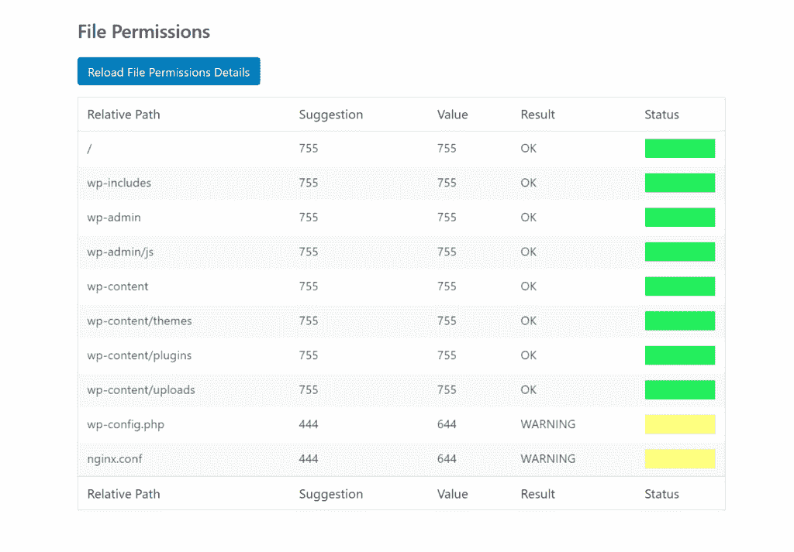
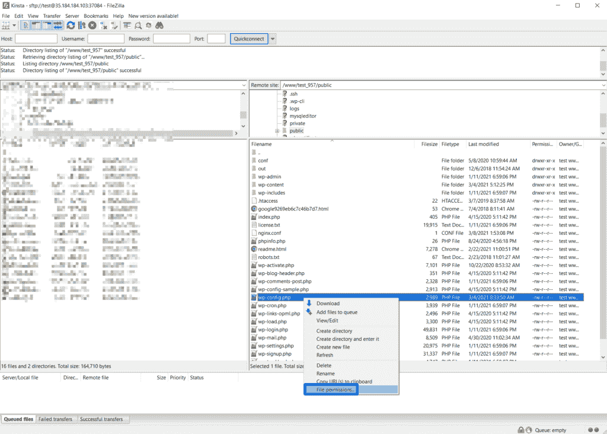
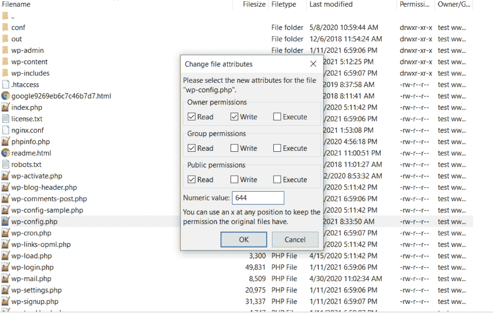
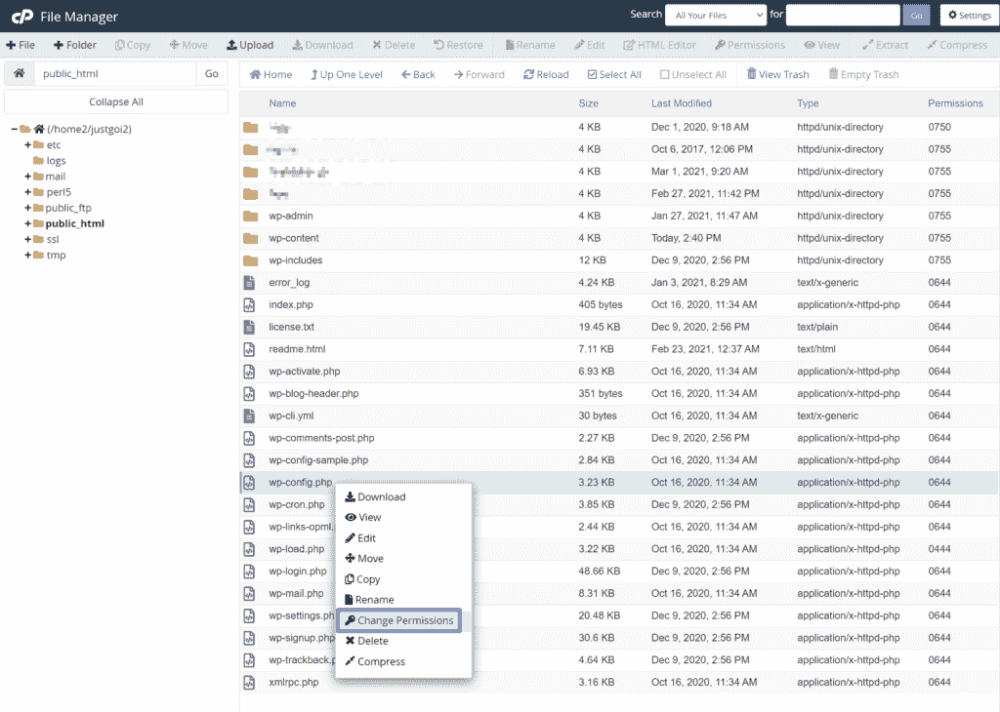
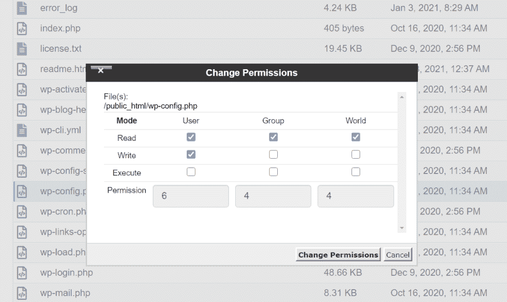

# WordPress 权限:了解它们是什么以及它们的最佳设置

> 原文：<https://kinsta.com/blog/wordpress-permissions/>

你正试图找出文件和文件夹的正确的 WordPress 权限吗？还是你一开始就对 WordPress 权限的整个概念感到困惑？

WordPress 文件权限对于你的网站的安全和功能是至关重要的，所以你必须了解它们。如果你使用的是 WordPress hosting ，你的主机几乎肯定已经为你配置好了，但是如果你遇到任何问题，理解这些概念仍然是有帮助的。

所以，不管你是否从未听说过文件权限，或者你只是在为 WordPress 寻找正确的文件权限，我们都可以在这篇文章中找到你。如果你已经熟悉文件权限，你可以点击第二个链接直接跳到 WordPress 的最佳文件权限。

 

### 信息

这篇文章 100%关注 WordPress 文件权限以及如何使用它们来保护你的站点。如果你对控制 WordPress 用户权限更感兴趣，请查看我们的 [WordPress 用户角色和能力](https://kinsta.com/blog/wordpress-user-roles/)文章。

### 更喜欢看[视频版](https://www.youtube.com/watch?v=neU8O2U-Oak)？

## 什么是文件权限？

简而言之，文件权限控制不同的用户如何与你的 WordPress 站点服务器上的文件交互。更具体地说，文件权限控制谁可以**读**、**写**、**执行**文件:

> 需要在这里大声喊出来。Kinsta 太神奇了，我用它做我的个人网站。支持是迅速和杰出的，他们的服务器是 WordPress 最快的。
> 
> <footer class="wp-block-kinsta-client-quote__footer">
> 
> 
> 
> <cite class="wp-block-kinsta-client-quote__cite">Phillip Stemann</cite></footer>

[View plans](https://kinsta.com/plans/)

*   **读取:**读取文件内容的能力。
*   写:修改文件的能力。
*   **执行:**“使用”文件的能力(例如执行脚本)。

### 什么是用户？

有三种不同“类型”的用户:

*   **所有者:**文件或目录的指定所有者。
*   **组:**拥有文件或直接拥有文件的组的成员。
*   **Public:** 除文件所有者或组成员之外的所有用户。

每个文件或文件夹都归特定用户或特定组所有。每个用户可以是多个组的成员，但他们只能有一个主要组。

例如，当您[通过 SFTP](https://kinsta.com/knowledgebase/how-to-use-sftp/) 连接到您的站点时，您在您的服务器上使用一个用户帐户，该用户帐户属于一个或多个组，这取决于您的服务器是如何配置的。

**注意:**大多数人不需要掌握“用户”的概念，因为你的主机已经为你配置好了所有这些。但是，了解文件权限的功能是至关重要的。如果您对这一部分感到有些困惑，那么您应该知道，在大多数情况下，您的主机已经为您的服务器环境适当地设置了用户。

通过文件权限，您可以控制每种类型的用户(所有者、组、公共)可以对服务器上的文件和文件夹执行的操作(读取、写入、执行)。

一般来说，文件的所有者应该拥有最多的权限；属于同一组的用户将拥有相同或更少的权限；公共用户将拥有与组相同或更少的权限:

**业主>集团>公众**

文件权限的想法与 [WordPress 角色和功能](https://kinsta.com/blog/wordpress-user-roles/)系统非常相似。如果你是网站的管理员，你比编辑有更多的控制权。例如，管理员可以安装新的插件，但编辑不能。

类似地，编辑比匿名访问者拥有更多的控制权，即使编辑没有完全管理员的权力。例如，编辑可以编辑其他人的博客文章并发布新的博客文章，但编辑不能安装新的插件。

[试图找出文件的正确 WordPress 权限&文件夹？🗂还是只是对权限的总体想法感到困惑？😅这篇文章是给你的👇 点击推文](https://twitter.com/intent/tweet?url=https%3A%2F%2Fkinsta.com%2Fblog%2Fwordpress-permissions%2F&via=kinsta&text=Trying+to+figure+out+the+right+WordPress+permissions+for+files+%26amp%3B+folders%3F+%F0%9F%97%82+Or+just+confused+about+the+whole+idea+of+permissions+in+general%3F+%F0%9F%98%85+This+post+is+for+you+%F0%9F%91%87&hashtags=WPTips%2CWordPress)

### 文件权限中的数字是什么意思？

文件权限由一个三位数表示，称为**权限模式**(如 **777** 、 **440** )。

数字中的每个数字对应于特定用户可以做的事情:

*   **第一个数字:**控制一个**所有者**可以做什么。
*   **第二位:**控制用户的**组**中的用户账户可以做什么。
*   **第三位:**控制其他人能做什么(**公开**)。

权限模式中的每个数字是分配给每个操作的数字的总和:

*   **阅读:** 4
*   **写:** 2
*   执行: 1

如果您不想授予任何权限，请使用数字 **0** 。

同样，您在权限模式中看到的数字是一个实体拥有的所有权限的总和。例如，如果**的所有者**可以**读** (4)，而**写** (2)，那么权限模式就是 **6** (4+2)。

或者，如果一个所有者拥有所有三个权限，那么它将是 **7** (4+2+1)。

因此， **777** 是最允许的配置。这意味着:

*   ****第一位数字——7——主人**** 可以 ****读****(4)****写****(2)****执行**** (1)
*   **第二位–7–组**可以**读**(4)**写**(2)**执行** (1)
*   **第三位-7-Public**can**Read**(4)**Write**(2)**Execute**(1)

出于这个原因，你绝不会想要在你的 WordPress 站点上给 **777** 设置任何权限。我们将在下面详细讨论这一点。

如果你想试试这个想法，你可以使用 chmod 计算器工具来看看当你给不同的用户分配不同的权限时，数字是如何变化的。

### 文件权限中的字母是什么意思？

虽然您可能最常遇到数字格式，但有时也会看到用字母和破折号表示的文件权限。

例如:

`**rwxr--r--**`

这种格式是这样工作的:

*   **r** =读取权限
*   **w** =写权限
*   **x** =执行权限
*   **–**(连字符)=没有权限

总共有九个字符—前三个适用于所有者，接下来的三个适用于团体，最后三个适用于公众。

在这种格式中， **777** 的等价物将是`**rwxrwxrwx**`。

### 为什么 WordPress 文件权限很重要？

因为文件权限控制着不同的用户可以对你的服务器上的文件做什么，所以它们在 WordPress 安全性中扮演着关键的角色。

想象一下，如果你把你站点的所有文件和文件夹都设置为 **777** 。这意味着任何人都可以创建新文件、修改现有文件、删除现有文件、执行脚本等等。人们可以在你的网站上添加恶意脚本并执行它们，这将很快导致各种各样的问题。那将是一场噩梦！

然而，文件权限是一个平衡的行为，如果你限制太多，你的网站也会停止工作。

例如，如果你设置你的权限为 **000** ，你的 WordPress 站点将完全停止运行，因为你的站点甚至不能读取你服务器上的任何文件。

出于这个原因，WordPress 的最佳文件权限总是在 **000** (没有人有任何权限)和 **777** (每个人都有所有权限)之间。

不过，文件权限也很棘手，因为即使在更现实的场景中，您仍然可能会遇到问题。例如， **444** 对于你网站的**来说是一个非常安全的设置。htaccess** 文件。

然而，如果你这样设置，你可能会遇到一些插件的问题，这些插件需要能够写入你的站点的**。htaccess** 文件(比如[缓存插件](https://kinsta.com/blog/wordpress-caching-plugins/)像 [WP 火箭](https://kinsta.com/blog/wp-rocket/)和 [W3 总缓存](https://kinsta.com/blog/w3-total-cache/))。

因此，如果你正在使用那些需要写访问的插件，你可能需要切换到稍微宽松一些的 **644** 甚至 **666** ，这取决于你的 web 服务器是如何配置的。

### 为什么需要更改 WordPress 文件权限？

简而言之就是**大多数人不需要手动更改文件权限**。

如果你用你的主机的自动安装程序安装了 WordPress，任何一个好的主机都会自动为你设置最佳的文件权限，作为设置过程的一部分。例如，如果你在 Kinsta 使用 WordPress 安装程序，你可以确信我们设置了正确的文件权限——这是我们作为托管 WordPress 主机所做的一部分，以使你的生活更轻松。

## 注册订阅时事通讯

### 想知道我们是怎么让流量增长超过 1000%的吗？

加入 20，000 多名获得我们每周时事通讯和内部消息的人的行列吧！

[Subscribe Now](#newsletter)

因此，如果你使用主机的自动安装程序，并且你的 WordPress 站点运行良好，你可能不需要修改你站点的文件权限。

然而，如果你自己手动安装 WordPress，可能会出现问题。在插件安装和使用过程中，你也可能会遇到文件权限的问题，就像上一节的缓存插件例子一样。

## WordPress 的正确文件权限

在这一部分，我们将讨论 WordPress 的正确文件权限。然后，如果你需要帮助，我们将在下一节告诉你如何改变它们。

首先，需要注意的是，最佳的文件权限部分取决于你的主机环境是如何配置的。对一个环境来说最佳和安全的不一定对其他环境也是如此；对于使用 **suEXEC** 的共享主机来说尤其如此。

一般来说，说明这一点的一个好的经验法则是从最低许可的配置开始，只在需要时添加权限以使事情正常工作。例如，当谈到`**wp-config.php**`文件时，您会看到从 **400** 到 **644** 的任何值。如果您不确定从哪里开始，您可以从 **400** 开始，只要您认识到这种设置可能会导致您的服务器配置出现问题，并且如果您遇到问题，您可能需要使其更加宽松。

无论如何，你都不应该将任何东西的权限设置为 777(除非你是专家，并且有充分的理由这么做)。

### 大多数 WordPress 文件/文件夹的默认文件权限

一般来说，WordPress 的正确文件权限应该如下:

*   **档案:** 644
*   **文件夹:** 755

但是，有几个特定的例外情况值得注意:

*   **wp-config.php**文件
*   **。htaccess** 文件
*   **engine . conf**文件

### wp-config.php 权限

[您站点的 wp-config.php 文件](https://kinsta.com/blog/wp-config-php/)是一个超级敏感文件，包含您站点的数据库凭证和一系列其他重要信息。

**wp-config.php**文件的一个很好的起点是 **644** ，这是我们在 Kinsta 使用的。然而，你会在这里找到很多其他的推荐，包括 **640** 和 **600** 。为了更加锁定，有些人甚至使用 **444。**

然而，如果你使用 **444** ，你可能会引起问题，因为许多 WordPress 插件依赖于对 wp-config.php 文件**的写访问。**

### 。htaccess 权限

您的站点是**。htaccess** 文件是另一个值得特别注意的重要配置文件。

一个很好的起点。htaccess 权限是 **644** ，也就是 WordPress Codex 推荐的 **的[。](https://wordpress.org/support/article/changing-file-permissions/#htaccess-permissions)**也有开发者推荐 **444** 。然而，如果你使用 **444** ，它可能会限制需要写入**的插件。htaccess** 文件(比如大部分缓存插件)。

**注意**:如果你和金斯塔一起主持，你就不会有**。htaccess** 文件，因为我们使用 [Nginx webserver](https://kinsta.com/knowledgebase/what-is-nginx/) 来提高性能。**。htaccess** 文件只是 [Apache webservers](https://kinsta.com/knowledgebase/what-is-apache/) 的一个特性。

在一个方便的位置找到管理网站所需的所有工具(错误等)。[免费试用我们的 MyKinsta 仪表盘](https://hubs.ly/H0pklC_0)。

你不用担心**。htaccess** 权限，如果你在 Kinsta 托管，因为没有**。首先 htaccess** 文件。

### nginx.conf 权限

同样的**。htaccess** 文件权限也适用于 **nginx.conf** ，如果你的主机使用 Nginx webserver(就像 Kinsta 一样)，这是主要的配置文件。

在 Kinsta 这里，我们对这个 **nginx.conf** 文件使用 **644** 。也有开发者推荐 **444** 。

## 如何快速检查 WordPress 文件权限

如果你想快速、非技术性地检查你网站的文件权限，看看你是否有任何问题，你可以使用 WordPress.org 的免费 [iThemes 安全插件。](https://wordpress.org/plugins/better-wp-security/)

你也可以使用 FTP 或 cPanel 文件管理器，我们将在下一节向你展示——我们首先只是分享这个插件作为一种快速检测潜在问题的方法。

激活插件后，进入**安全→设置**，点击**文件权限**下的**显示详情**按钮:

Location of file permissions tool in WordPress

在这里，你可以找到你当前的 WordPress 文件权限，以及它们与 iThemes Security 推荐的文件权限的比较。可以看到 iThemes 为【wp-config.php】文件**和 **nginx.conf** 或**推荐了 **444** 。htaccess** 文件(Kinsta 使用 Nginx，这就是为什么你会看到 **nginx.conf** ，但是你会看到**。htaccess** 如果您的主机使用 Apache)。**

但是请记住， **444** 会导致与一些插件的冲突，所以你可能要避免使用它。

An iThemes Security feature in WordPress comparing existing file permissions with suggested permissions settings

如果你不想在安装后继续使用这个插件，我们建议你删除它。

## 如何编辑 WordPress 文件权限

现在，让我们谈谈如果需要的话，你如何改变你的 WordPress 站点的文件权限。有几种不同的方法可供您使用，我们将向您展示三种方法:

*   文件传送协议
*   cPanel 文件管理器
*   SSH/终端

### FTP/SFTP

如果你知道如何使用 FTP/SFTP 连接到你的服务器，任何 T2 质量的 FTP 客户端都能让你快速改变文件权限。

我们将使用广受欢迎的免费开源客户端 [FileZilla](https://kinsta.com/blog/best-ftp-clients/#Filezilla) 向您展示它是如何工作的。

一旦你使用 SFTP 连接到你的服务器，右击你想要编辑的文件/文件夹，选择**文件权限**:

How to change file permissions using FTP in FileZilla

然后，您可以使用复选框或直接输入号码:

How to enter new file permissions using FileZilla

### cPanel 文件管理器

如果你的主机提供了 [cPanel](https://kinsta.com/knowledgebase/what-is-cpanel/) ，你可以使用 cPanel 的**文件管理器**工具来编辑 WordPress 文件权限。

在 cPanel 文件管理器中，右键单击要编辑的文件或文件夹，然后选择**更改权限**:

How to change file permissions using cPanel File Manager

然后，选中相关的框来分配权限。这样做时，您会在底部看到总数的变化:

How to enter new file permissions using cPanel

设置正确的权限，您就可以开始了！

### 命令行

如果您觉得从命令行工作很舒服，您也可以使用`chmod`更改您站点的文件权限。我们喜欢使用这个 chmod 计算器来快速获得适当的权限。

[需要为你的 WordPress 站点找到最佳的文件权限吗？🗂找到了所有这些+关于如何检查它们的提示，在这篇文章中点击推文](https://twitter.com/intent/tweet?url=https%3A%2F%2Fkinsta.com%2Fblog%2Fwordpress-permissions%2F&via=kinsta&text=Need+to+find+the+optimal+file+permissions+for+your+WordPress+site%3F+%F0%9F%97%82+Find+them+all+%2B+tips+on+how+to+check+them%2C+in+this+post+%E2%9C%85&hashtags=WordPress%2CWPTips)

## 摘要

正确的 WordPress 文件权限是创建一个安全、功能良好的网站的重要部分。但是您不需要太担心文件权限，因为如果您使用主机的自动安装工具，大多数主机都会正确配置一切。在 Kinsta 也是如此。

然而，如果你手动安装 WordPress，或者如果你的站点的原始文件权限被破坏了，你可能需要编辑你的站点的文件权限。

一般来说，WordPress 目录权限应该是 **755** ，WordPress 文件权限应该是 **644** 。一些重要的例外包括你站点的 wp-config.php 文件和你服务器的**文件。htaccess** 或 **nginx.conf** 文件，您可以使其稍微宽松一些。

无论如何，确保你永远不要在一个实时网站上设置文件权限给 **777** (即使你知道你在做什么)。这样做会让你的网站和服务器暴露在巨大的安全漏洞下。

关于 WordPress 文件权限，你还有什么问题吗？在评论里问我们！

* * *

让你所有的[应用程序](https://kinsta.com/application-hosting/)、[数据库](https://kinsta.com/database-hosting/)和 [WordPress 网站](https://kinsta.com/wordpress-hosting/)在线并在一个屋檐下。我们功能丰富的高性能云平台包括:

*   在 MyKinsta 仪表盘中轻松设置和管理
*   24/7 专家支持
*   最好的谷歌云平台硬件和网络，由 Kubernetes 提供最大的可扩展性
*   面向速度和安全性的企业级 Cloudflare 集成
*   全球受众覆盖全球多达 35 个数据中心和 275 多个 pop

在第一个月使用托管的[应用程序或托管](https://kinsta.com/application-hosting/)的[数据库，您可以享受 20 美元的优惠，亲自测试一下。探索我们的](https://kinsta.com/database-hosting/)[计划](https://kinsta.com/plans/)或[与销售人员交谈](https://kinsta.com/contact-us/)以找到最适合您的方式。