# 使用 WordPress 创建播客所需的一切(并扩大你的影响范围)

> 原文：<https://kinsta.com/blog/wordpress-podcast/>

行业广告收入预计到 2021 年将超过 1B 美元，估计每周有 6200 万人在 T2 收听播客，现在是开始你的 WordPress 播客的好时机。

将 WordPress 的可定制功能与可靠的播客托管插件相结合，是专业播客用户节省时间和扩大品牌的秘密武器。

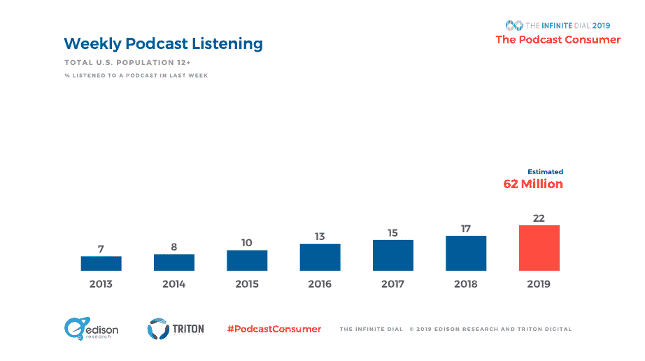

Weekly podcast listening stats

随着[“搜索互联网”](https://www.edisonresearch.com/the-podcast-consumer-2019/)成为听众发现新播客的首选方式，如果没有网站，几乎不可能被包括在这些搜索结果中。

在今天的博客文章中，我们有插件推荐、设置教程等等，可以让你立刻开始使用你的 WordPress 播客。

准备好了吗？开始吧！

## 如何在 WordPress 上开始播客

如何开始一个[播客](https://kinsta.com/blog/what-is-a-podcast/)感觉就像一个黑匣子。每周都有新节目推出，但是复杂的内部运作是如何结合在一起的，这需要一些前期教育。

> Kinsta 把我宠坏了，所以我现在要求每个供应商都提供这样的服务。我们还试图通过我们的 SaaS 工具支持达到这一水平。
> 
> <footer class="wp-block-kinsta-client-quote__footer">
> 
> 
> 
> <cite class="wp-block-kinsta-client-quote__cite">Suganthan Mohanadasan from @Suganthanmn</cite></footer>

[View plans](https://kinsta.com/plans/)

幸运的是，播客并不像人们想象的那么难。事实上，将播客从想法变为现实只需要五个步骤，所有细节都在这里。

如果你正在寻找一个新的播客来添加到你的图书馆，请查看[逆向工程](https://kinsta.com/podcast/)-我们的新播客，在这里你将获得成功企业家和行业专家的宝贵商业见解。

### 第一步:确定一个概念并选择一种格式

如果你无话可说，你就不能开始播客，所以开始一个节目的第一步是弄清楚主题。消费者对各种主题感兴趣，音乐、新闻和信息、娱乐和名人角度赢得了大多数听众。

然而，我们警告说，如果你对某个话题缺乏兴趣，就不要开始一个关于最热门话题的播客。取而代之的是，列出一系列你感兴趣的事情的想法。毕竟，你会花几个小时谈论这个话题。

确定一个主题后，就该决定哪种播客格式是向听众传达信息的最佳结构了。主要风格包括:

*   采访形式:问答形式，主持人每周邀请一位独特的嘉宾。
*   独唱形式:主持人是节目中唯一的声音，通常会分享他们的专业知识或故事。
*   共同主持形式:两个或两个以上的主持人就一个话题进行对话式讨论。
*   小组形式:主持人使用对话开场白或问答设置来主持一大群客人。

采访一位专家，依靠两位主持人之间诙谐的戏谑，或者一个人的独白，会让听众更加投入吗？

首先考虑哪种播客格式是就你的主题教育观众的最佳方式。

最后，是想出播客的名字。每个主持人选择播客标题的过程是不同的。

有些人喜欢探索有创意的名字，包括双关语或暗示节目内容的文字游戏。对于有固定观众的主持人来说，在标题上加上自己的名字是常见的第一步。对其他人来说，这是在描述性和机智之间寻找中间地带。

无论采用哪种方式，在给播客命名时，都有三个关键的考虑因素需要考虑:

1.  确认该名称尚未被使用:进行谷歌搜索，浏览播客目录，并确保[网站域名](https://kinsta.com/blog/choose-domain-name/)和社交账号可供您使用。
2.  SEO 友好:你希望你的播客出现在搜索结果中，所以[考虑一下潜在听众在搜索与你的主题相关的信息时会使用的关键词](https://kinsta.com/blog/keyword-research/)。
3.  大声说出来:这一步经常被忽略，但却很重要。你会说你的播客的名字成千上万次，所以大声说出来。它应该从你的舌头上滚下来，便于别人发音。

### 第二步:购买设备和软件

当播客的基础稳固时，是时候考虑如何捕捉高质量的音频以获得专业的声音了。

Podcasting setup (Image source: [Unsplash.com](https://unsplash.com/photos/KVlcVi-Ulgo))

要做到这一点，特定的设备和软件是必要的。

设备设置可以从 DIY 家庭工作室到隔音录音棚，但无论如何你都需要两件基本物品:一个麦克风和一副耳机。

市场上有很多播客麦克风，如果你刚刚开始使用，我们建议你从更实惠的选择开始。我们最喜欢的是[音频技术 ATR2100](https://www.audio-technica.com/cms/wired_mics/b8dd84773f83092c/index.html) 。它能容忍不完美的录音环境，而且不会让你倾家荡产。

对于耳机，你可以使用几乎任何东西，但许多主持人更喜欢覆盖耳朵的东西。无论选择哪种方式，参与录音的每个人都应该有自己的麦克风和耳机设置，以捕捉更清晰的声音。

购买必要的设备后，你需要一个录制和编辑软件来捕捉和提炼每一集。

在做决定之前，想想你的录音需求。你和你的嘉宾或主持人会在同一个房间录音吗？或者您会定期邀请位于世界两端的客人或共同主持人吗？

这个问题很重要，因为它决定了你是需要本地录音软件，每个人都在同一个房间，还是需要远程录音软件，每个人都单独录音。

*   Audacity :对于本地录音，我们推荐 Audacity。它是免费的，拥有入门所需的所有基本功能，并且没有很长的准备时间来学习所有的附加功能。首先，请查看[这个视频教程](https://www.youtube.com/watch?v=xl-WDjWrTtk)，学习在 Audacity 中录制、编辑和混合音频的基础知识。
*   Zencastr :对于远程录制，我们喜欢 Zencastr。它捕捉录音室质量的远程录音，并允许您为每个声音录制单独的轨道，这将在编辑过程中派上用场。在[视频教程](https://www.youtube.com/watch?v=U_-J-9s-76Y)中学习如何使用该工具进行远程录制。

录制好原始音频文件后，下一步是选择一个编辑软件来润色和完成每一集。

对于简化的工作流，我们再次推荐 Audacity。如果你用他们的软件录制，很容易在同一个界面中立即开始编辑过程。节省您的时间和不必要的额外步骤，您可以专注于完善最终产品。

### 第三步:录制你的第一集

第一次坐在麦克风后面可能会感到害怕，但经过一点准备和练习，你会发现录制你的第一集并不困难。

从写一个脚本开始，或者写一个你将在这一集里谈论的内容的大纲。

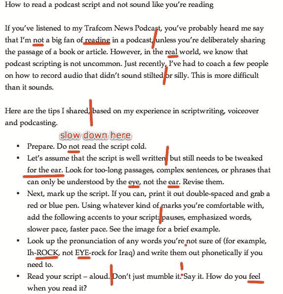

Script template example (Image source: castos.com)

如果是面试，调查你的客人，准备一份问题清单。一定要和客人分享这份清单，让他们在面试前计划好谈话要点。

当这一集的内容最终确定后，开始练习一些话筒技巧:

*   专注于与麦克风保持 3 指宽的距离，以获得一致的声音。
*   录音时坐直或站着，选择你能舒服地说几个小时的位置。
*   浏览脚本，熟悉谈话要点，完善每一部分的语调。
*   练习时观察音量指示器，确保你正常说话的声音没有超过 0dB，也就是说没有超过指示器的红色部分。这将导致音频文件失真，因此请务必在点击录音前调整音量。
*   记得放松，玩得开心。录制播客不像发表演讲，你可以随时重新录制。

### 步骤 4:将剧集上传到播客托管服务

不建议将播客文件上传到托管服务。Podcast 专题节目包含大量数据，导致文件很大。网站托管服务旨在轻松存储较小的文本、图像和短视频文件，但播客剧集会产生大得多的文件。

你[冒着触及服务存储限制](https://kinsta.com/blog/disk-usage-wordpress/)的风险，潜在地招致来自提供商的高额费用。此外，网站托管服务无法快速传输大型音频文件。

这意味着当用户试图播放播客时，他们必须等待播放器加载剧集，并遇到缓冲问题。较低的带宽速度会造成糟糕的聆听体验，可能会让你失去追随者。相反，上传专为高效存储和传输大型音频文件而设计的剧集播客托管服务。在这一步，只需将最后一集上传到您的首选服务，并包括相关的剧集细节，如名称、描述和元数据。

#### 什么是播客托管服务？

播客托管服务是你和你的观众之间的中间人。当你上传播客剧集到你的账户时，该服务会生成一个 RSS 源。

然后你可以使用这个 RSS 链接将你的节目连接到你的 WordPress 网站或者播客目录，比如 Spotify。当有人试图播放一集时，该平台会 pings 你的播客托管服务，并通过 RSS 提要接收该集的音频文件。从最基本的角度来说，没有这种连接和 RSS 链接，就没有播客。

用 WordPress 发布播客时，一定要选择提供 WordPress 插件的托管服务。这种整合允许一个更简化的过程，允许主持人直接将他们的剧集上传到 WordPress，而不是在多个平台之间切换(稍后将详细介绍)。

另一个选择是[创建自己的 RSS 提要](https://kinsta.com/blog/wordpress-rss-feed/)。使用 XML 编码语言，高级播客可以将必要的标签和结构放在一起，组成一个标准的 RSS 提要。

[苹果播客的 RSS 指南](https://help.apple.com/itc/podcasts_connect/#/itcb54353390)分解了你的 DIY feed 需要被每个播客目录正确阅读的必要组件。但是，有一个错误，RSS 提要将会无效，并且无法在你的 WordPress 网站和播客目录中访问。这就是**我们警告新播客使用这种策略**的原因，因为有很多出错的机会。

### 第五步:将剧集整合到你的 WordPress 网站和播客目录中

用 WordPress 创建一个播客可以很容易地在你的网站上直接展示剧集。虽然你的一些观众会从那里收听，但在 Spotify、Apple Podcasts 和 Google Play 等最受欢迎的播客目录中整合每一集也很重要。

辛迪加剧集意味着将内容提供给每个目录，这样用户最终可以收听。

要在每个平台上整合一个播客，先在每个平台上建立一个账户，然后提交节目的 RSS 源来建立最初的联系。然后，每次一个新的专题节目被上传到播客托管服务，它将自动分发到你连接的每个目录。

最好的部分是，在初始设置最终确定后，您可以设置它并忘记它。

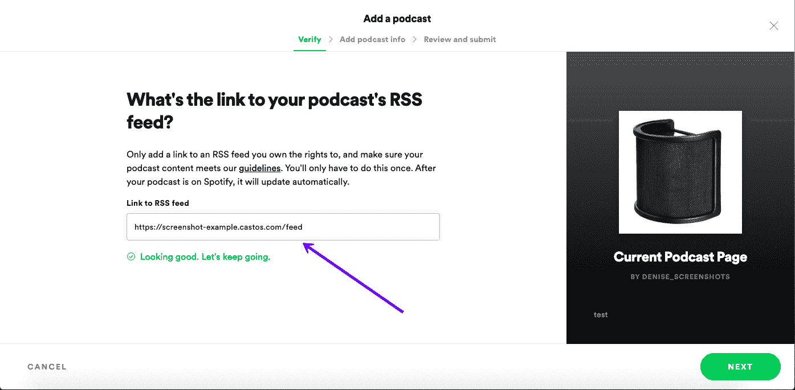

Submit a podcast to Spotify vis RSS feed

## 如何用 WordPress 发布播客

用 WordPress 制作播客的最大好处是节省了管理一个新节目的时间。

跟上播客需要承诺，经验丰富的主持人知道高效的工作流程如何有助于持续制作引人入胜的内容。你可能想长期从事播客，所以这里有一个关于如何用 WordPress 播客的**五步指南。**

### 创建一个 WordPress 网站

首先，你需要建立一个 WordPress 网站。为此，请前往[Wordpress.org](http://wordpress.org)，按照他们的下载说明进行操作。最重要的是，WordPress 是一个免费的工具，所以你不用掏钱就可以创建一个功能齐全的网站。

WordPress 设置完成后，你需要选择一个 [WordPress 托管服务](https://kinsta.com/wordpress-hosting/)来存储你网站的文件并设置一个域名。

### 1.安装一个播客特有的 WordPress 主题

博客和[电子商务商店](https://kinsta.com/blog/wordpress-ecommerce-plugins/)的建立是为了实现不同的结果。许多人选择特定的 [WordPress 主题](https://kinsta.com/best-wordpress-themes/)来帮助实现这些目标。播客网站也不例外。

为了增强听众的体验，[安装一个专为播客设计的 WordPress 主题](https://kinsta.com/blog/how-to-install-a-wordpress-theme/)。它应该以您的媒体为特色，支持音频和视频资产，并具有移动响应能力。

挑选出最佳主题后，进入外观>主题，然后点击“添加新主题”和“上传主题”。然后安装主题文件并开始定制你的网站。

### 2.安装播客插件

为了从 WordPress 的播客中获益，你需要安装一个播客插件。这应该有两个重要特征:

*   该插件与播客托管服务相关联，因此音频文件存储在一个安全可靠的空间，而不会减慢您的网站。
*   该插件允许你直接从你的 WordPress 仪表盘上传剧集和查看分析，这样你就可以通过一个中央平台管理节目。

许多播客插件还具有可定制的播放器，这是一个额外的奖励。

随着新剧集被上传到 WordPress 并存储在播客托管服务中，听众可以很容易地直接从你的网站上播放内容。许多还允许你改变球员的背景颜色和风格的抛光外观。

### 3.用插件链接你的播客托管服务

安装完一个播客插件后，是时候将它与相关的播客托管服务链接起来了。

在你上传播客到 WordPress 之前，首先需要建立插件和托管服务之间的链接。集成说明是特定于每个插件/服务组合的，所以请查阅相关的设置文档来创建连接。

#### 为什么我需要播客托管服务？

拥有一个网站托管服务和一个播客托管服务似乎是多余的，但是两者都拥有是很重要的。

拥有专门的播客托管服务可以减轻网站主机的压力，从而带来更快、更可靠的网站体验。反过来，这为您的听众创造了更流畅的流媒体和下载体验。

通常，安装过程包括与 WordPress 共享你的播客托管服务的 API 密钥，RSS feed 会自动连接到 WordPress 仪表盘。

连接完成后，你可以直接上传播客内容到 [WordPress 的仪表盘](https://kinsta.com/knowledgebase/wordpress-admin/)上。

### 4.使用播客插件将你的剧集上传到 WordPress

当你有了最后一集播客，准备与你的观众分享时，使用播客插件将它直接上传到你的 WordPress 网站。每个插件的过程都是不同的，所以一定要检查插件的文档以获得正确的说明。

当新内容被添加到 WordPress 时，插件将向播客托管服务提供信息，以正确存储更大的音频文件。播客的信息应该在插件和托管服务的界面中更新，这样信息在两个平台上都匹配。

由于音频文件是直接上传到 WordPress 的，插件通常会向播客托管服务提供更新的信息，而不是相反。换个方式说，插件更新主机但是主机*不能*更新插件。当你开始长期管理你的播客时，记住这一点很重要。

### 5.直接从 WordPress 仪表盘管理你的播客

随着你继续制作更多的内容和上传新的剧集，你将可以直接从 WordPress 的仪表盘上管理一切。这就是使用 WordPress 进行播客时效率优势真正显现的地方。

没有必要在多个平台之间切换，两次执行相同的操作，或者手动将您的播客整合到您的网站。一切都在一个简化的流程中完成。

许多播客插件还具有深度分析功能，如界面中的听众数量和设备故障。通过这些功能，您可以评估哪些剧集表现良好，并不断制作内容来吸引观众。

使用 WordPress 的播客是一种流行的设置，很容易理解为什么。简化的工作流程、集中的管理和大量可定制的功能，WordPress 提供了一种更好的播客方式。

## 最佳播客主题

有了 WordPress 播客的好处，你很可能渴望开始建立自己的网站。完成初始设置后，是时候开始将新网站与您的播客及其品牌相匹配了。

为了[改变网站的审美](https://kinsta.com/blog/change-wordpress-theme/)，WordPress 提供了一手标准的主题模板。虽然使用这些选项完全没问题，**我们不建议使用**，因为它们不是为播客设计的。

相反，考虑一个以音频和视频内容为特色的主题，你的播客可以成为节目的明星。

我们喜欢的主题允许主持人定制播放列表，为单个剧集创建帖子，并支持多种媒体格式。每一个都有响应，所以你的听众可以在他们喜欢的设备上收听，你可以定制颜色，按照你喜欢的方式排列[小工具](https://kinsta.com/blog/wordpress-widgets/)。

最佳播客主题将使你的网站与众不同，并帮助增加你的受众。

这里是一些我们推荐的播客主题。

### 逃学

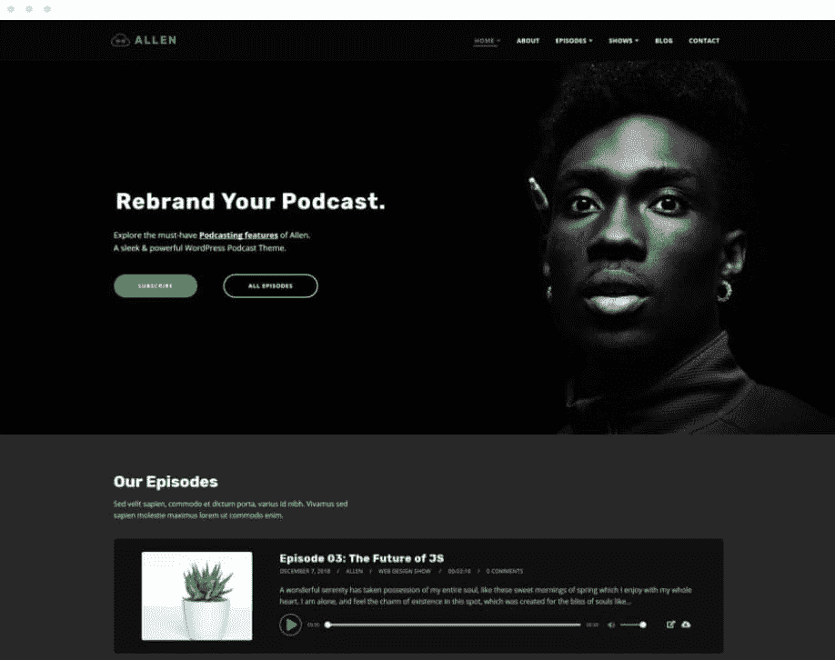

Tusant WordPress theme

SecondLine 的 Tusant 是一个时髦的主题，专门为播客、音乐和视频流而设计。它支持多个音频源，允许播客剧集轻松嵌入。

该主题允许无限数量的条目，因此您可以为每一集、系列或博客文章创建新页面，而不必担心达到最大数量。它还能让您完全控制内容布局，让您的播客完全按照您想要的方式呈现。最重要的是，Tusant 支持所有主要的播客插件，比如非常简单的播客和 PodLove。

## 注册订阅时事通讯

### 想知道我们是怎么让流量增长超过 1000%的吗？

加入 20，000 多名获得我们每周时事通讯和内部消息的人的行列吧！

[Subscribe Now](#newsletter)

### 奈玛

Nayma WordPress theme

来自 Artisan Themes 的 Nayma 是一个功能性的 WordPress 主题，它利用[拖放模块来设计每个页面](https://kinsta.com/blog/wordpress-page-builders/)。对于那些没有编码技能的人来说，构建新布局的简易性对于任何一个刚开始创建网站的人来说都是完美的。

该主题有多个标题选项，并且是电子商务就绪，非常适合[销售你的播客的商品或相关产品](https://kinsta.com/blog/website-ideas/)。Nayma 完全兼容许多播客插件，包括大量的模块类型，如画廊和视频嵌入。

### 播客

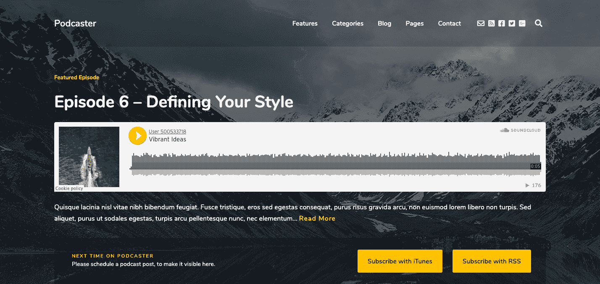

Podcaster WordPress theme

主题站的播客全力以赴为播客建立一个定制主题。自定义主页，使其具有嵌入式音频播放器和播放列表，以便访问者能够立即听到您的最新内容。

通过提供无限的剧集存档页面和独特的订阅按钮，主持人可以创建无限数量的新帖子，并从一个网站管理多个播客。该主题简洁、灵活、响应迅速，并且经过优化，可以与非常简单的播客和 BluBrry PowerPress 播客插件进行最佳集成。

### autonics

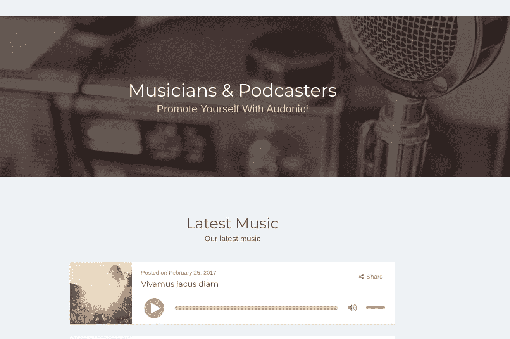

Audonic WordPress theme

mixamedia 的 Audonic 提供额外的插件优化，以建立一个支持你的播客的网站，并且[管理事件](https://kinsta.com/blog/wordpress-events-plugin/)、[社交源](https://kinsta.com/blog/wordpress-social-media-plugins/)和博客帖子。

自定义小工具兼容多种媒体类型，并允许您上传音频帖子的特色封面图像。该主题有深色和浅色的布局，并采用移动优先的设计，以提供精致的移动体验。

## 最佳 WordPress 播客插件

你的 WordPress 网站是你播客的大本营。但是你需要一个播客插件来让听众收听最新的内容并管理你的节目！

我们挑选的每一个都有几个我们认为在 WordPress 上托管播客时必须具备的关键特征。最重要的是响应性，这意味着播放器在桌面和移动设备上都是功能性的和视觉上有吸引力的。

设计网站时很容易忘记移动体验，但根据爱迪生研究公司的调查，播客听众花了 42%的时间在他们的智能手机上收看新的剧集。

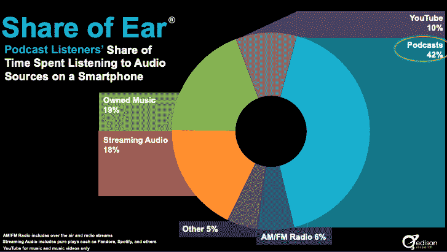

Time spent listening to audio sources on smartphone

如果你的 WordPress podcast 插件不能在移动设备上运行，你就错过了一个巨大的发展机会。

为了开始你对最好的 WordPress podcast 插件的研究，我们为你的网站收集了三个最佳选择。您可以放心，每一个都设置为在每一个设备上正常工作。

### 非常简单的播客

Castos 的简单播客是一个易于使用和可定制的播客插件。直观的界面使得这个插件对于初学者来说非常完美，可以在几分钟内发布他们的播客，而不必离开 WordPress 仪表盘。

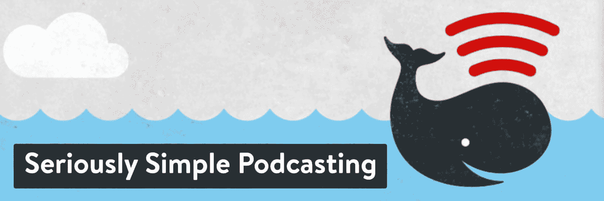

Seriously Simple Podcasting WordPress plugin

对于资深主持人来说，非常简单的播客支持音频和视频文件，并允许用户从同一个网站运行多个播客，每个播客都有自己独特的 RSS 提要。

该插件有一套有用的功能，如可定制的媒体播放器，显示播放列表的小部件，以及全面的听众分析。

### 播客发布者

pod love Podcast Publisherpod love 是一款播客插件，具有强大的分析功能，可以帮助主持人找出哪些剧集获得了最多的参与度，以及观众在哪些平台上收听。

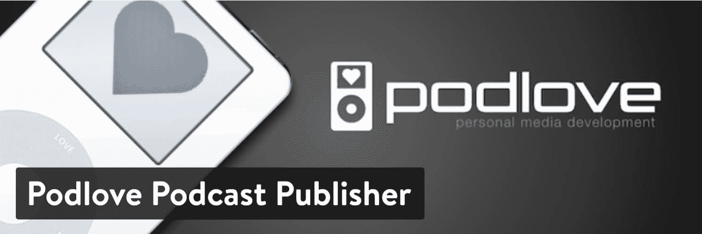

Podlove Podcast Publisher WordPress plugin

该插件还拥有一个灵活的模板结构，让用户可以完全控制剧集的显示方式，这样你的内容就可以按照你想要的方式组织起来。

Podlove Podcast Publisher 带有一个集成的网络播放器和单独的订阅按钮，允许听众通过他们喜欢的应用程序关注您的播客。

### powerxpress

Blubrry 的 PowerPress 具有简单和高级的模式来满足每个播客的需求。像许多播客插件一样，它包括跨主要播客目录的分发，如 Apple Podcasts、Google Play、Stitcher 和 TuneIn，使从一个地方提交和管理您的节目变得容易。

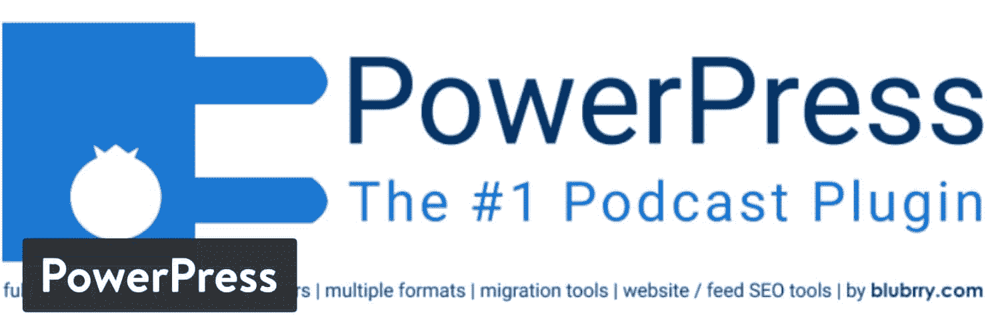

PowerPress WordPress plugin

像播客 SEO 设置这样的高级功能允许用户设置不同的剧集标题，以改善你的播客在谷歌和苹果播客目录等搜索引擎上的发现。

PowerPress 带有基本的分析功能，可以选择以每月 5 美元的价格升级到更强大的洞察功能。

厌倦了低于 1 级的 WordPress 托管支持而没有答案？试试我们世界一流的支持团队！[查看我们的计划](https://kinsta.com/plans/?in-article-cta)

## 最佳 WordPress 播客播放器

使用 WordPress 的播客意味着有多种选择来展示一个节目。虽然我们更喜欢使用带有内置媒体播放器插件的播客托管服务，但这不是唯一的选择。

更高级的程序员可能更喜欢[托管他们自己的播客 RSS 提要](https://hackernoon.com/how-to-host-your-own-podcast-rss-feed-6d1j38k0)并将他们的文件存储在一个独立的服务器上。这个备选选项需要额外的设置时间，但是对提要中的数据提供了更多的控制。

但是对于新手播客来说，有一点需要注意:如果你不精通这种编码语言，自制的 RSS 提要更容易出错。不幸的是，一个小小的错误将会使你的播客内容在每个播客目录和你的网站上都无法访问。对于那些刚刚起步的人，我们仍然强烈建议使用播客托管服务来确保你的 RSS 源设置正确。

不管你选择哪种方法，WordPress 播客的一个主要好处是允许听众发现你的最新内容。但是为了做到这一点，剧集需要能够很容易地直接从网站上获取。

对于那些采用 DIY 方法并且有自己制作的 RSS 订阅源的主机来说，下一步就是在 WordPress 上展示内容。这就是专门的播客播放器派上用场的地方。

我们已经推出了前两个推荐，为播客提供了高级功能，如响应播放器、分享按钮和搜索功能。

### 播客播放器

播客播放器是 WordPress 的一个相对较新的插件，但是正在获得 DIY 播客的支持。

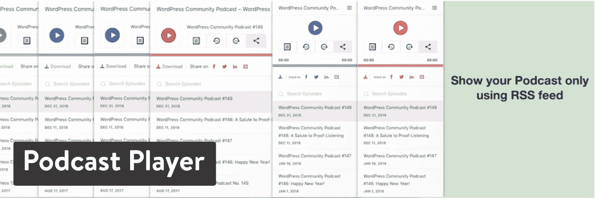

Podcast Player WordPress plugin

主要功能包括只需输入播客的 RSS 提要 URL 即可显示响应播放器，允许听众将内容分享到他们的网络的按钮，以及排序和过滤选项以创建自定义播放列表。

设置很容易，你需要做的就是将播客的源 URL 添加到 widget 块中。完全可定制的风格适合每一个 WordPress 网站和额外的高级设置功能，这个插件适合每一个主机的需求。

### 智能播客播放器

智能播客播放器由 Pat Flynn 创建，他主持关于企业家精神的流行播客。弗林想要一个播放器，让他的听众在他的网站上，所以他设计了自己的插件，使 WordPress 的播客更好。

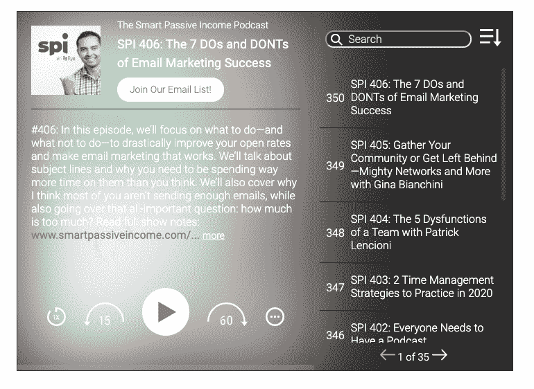

Smart Podcast Player

该插件提供了一套强大的功能，旨在增强每个听众的体验。有多种播放器显示选项，主持人可以展示他们的完整存档以供尽情聆听，如果有特定的片段或剧集值得关注，还可以使用智能轨道播放器。

通过额外的选项，让玩家停留在网站的顶部或底部，用户将能够从他们登陆的任何页面点击播放。Smart Podcast Player 还自诩为唯一一个包含电子邮件订阅按钮的插件，用于增加参与听众的简讯列表。然而，提供这些高级功能是有代价的，每月 12 美元，如果按年付费，则每月 8 美元。

## 你应该在哪些播客目录上展示你的播客？

我们已经详细讨论了如何在 WordPress 上展示一个播客，但是在其他很多地方，联合你的节目也很重要。

像苹果播客或 Spotify 这样的平台可能是人们的首选，但它们不是唯一的。

常见的经验法则是将播客分发给大大小小的每个平台，以增加受众并吸引新的听众。

幸运的是，跨主目录的播客辛迪加都遵循相似的设置说明。为了让你开始，我们已经强调了列出你的播客的六个基本平台，此外还有几个鲜为人知的目录。

### 苹果播客

截至 2018 年 3 月，苹果播客超过了[500 亿集的下载量和播放量](https://www.fastcompany.com/40563318/apples-podcasts-just-topped-50-billion-all-time-downloads-and-streams)！相比 2014 年的 70 亿总流量，仅四年时间就增加了 7 倍。

为了参与其中，首先将你的节目提交给[苹果播客](https://apps.apple.com/us/app/apple-podcasts/id525463029)。

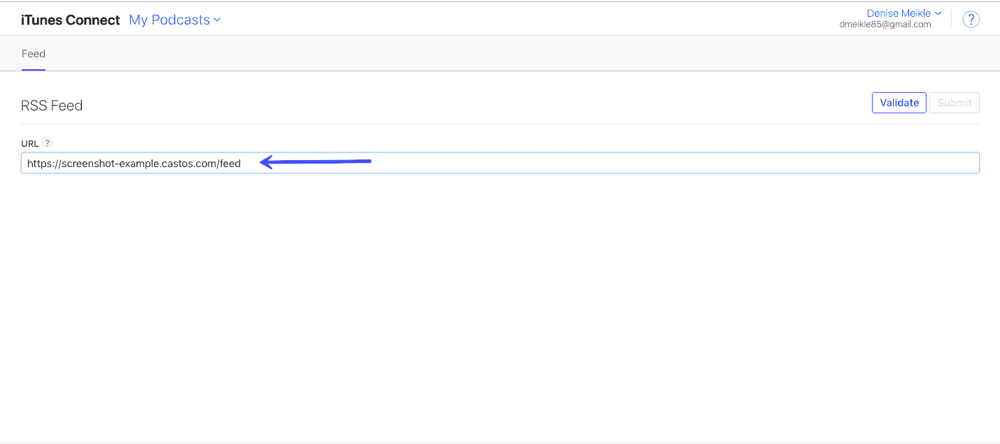

Submitting your podcast to Apple Podcasts

提交过程非常简单，播客通常会在几个工作日内获得批准。

首先，使用 [iTunes Connect](https://itunesconnect.apple.com/login?module=PodcastsConnect&hostname=podcastsconnect.apple.com&cf=1&targetUrl=%2F&authResult=FAILED) 创建一个帐户，然后添加播客的 RSS 提要 URL 进行验证。

查看信息，包括节目名称、特色类别和剧集列表，以确保一切正确，然后点击提交。24-48 小时后，苹果播客将发送一封电子邮件，其中包含该节目列表的链接，就这样！

使用批准的链接将听众引导到您的 podcast 的 Apple Podcasts 列表，以便他们可以直接在平台上订阅。

### Spotify

Spotify 最近成为第二大最受欢迎的播客流媒体平台，[是大多数 12-24 岁的人在过去一个月里收听](https://www.edisonresearch.com/edison-researchs-top-ten-findings-from-2019-so-far/)的平台。

通过最近对 Anchor.fm 的收购，他们展示了他们对播客行业成功的承诺和投资。

Submitting your podcast to Spotify via RSS feed

[让你的播客在 Spotify 上上市](https://podcasters.spotify.com/faq#how-do-i-get-my-podcast-on-spotify)遵循与苹果播客相似的流程。首先，你需要一个帐户，然后添加你的播客的 RSS 源。

在那里，Spotify 的团队会验证你的账户，并在几个工作日内批准该节目。

### Google Play 和 Google 播客

对于我们当中的 Android 用户来说，Google Play 和 Google Podcasts 是首选的流媒体平台。两者有什么区别？谷歌播客于 2016 年 6 月推出，旨在与谷歌助理产品紧密结合，表明用户希望通过语音助理技术收听播客。作为额外的奖励，谷歌播客上的节目也会出现在谷歌的搜索结果中，这为潜在听众寻找与你的主题相关的信息提供了巨大的发现机会。

简而言之，播客内容可以通过 Google Play 和 Google Podcasts 访问，因此将您的节目提交到这两个平台非常重要。从 [Google Play](https://support.google.com/googleplay/podcasts/answer/6260333?hl=en) 开始，你将再次需要一个谷歌账户。

如果您已经使用 Gmail ，您可以使用该帐户将播客添加到他们的门户网站。接下来，提交您的 RSS 提要，验证您拥有该内容，然后等待大约五个工作日获得批准。

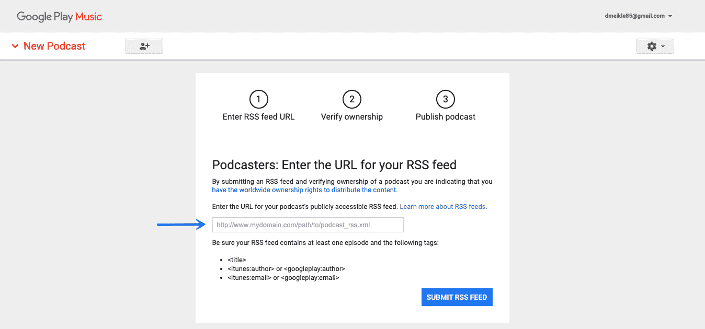

Submitting your podcast to Google Play

谷歌播客的过程略有不同，因为如果它识别出网站上的有效 RSS 提要，该工具会自动索引每个播客。

首先，前往[谷歌播客发布工具](https://search.google.com/devtools/podcast/preview)并检查谷歌的机器人是否已经找到该节目。

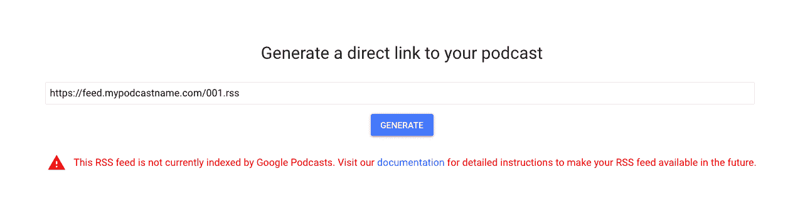

Submitting your podcast to Google Podcasts

如果你收到错误信息“这个 RSS feed 目前没有被谷歌播客索引”，你需要验证你的 WordPress 网站符合他们的[指南](https://developers.google.com/search/docs/guides/podcast-guidelines)。

如果谷歌播客已经识别出你的节目，你就可以开始了！

### 钉书机

Stitcher 是一款免费的流媒体应用，适用于苹果和安卓设备，专注于语音音频内容。该平台仅包括广播和播客内容，成为热爱发现新节目的狂热听众的首选平台。

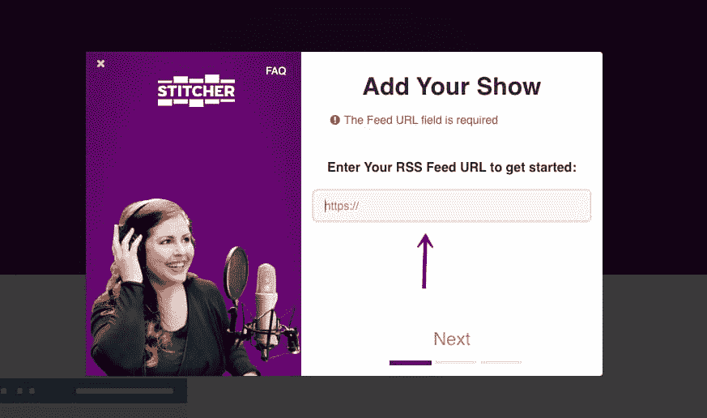

Submitting your podcast to Stitcher

它拥有超过 100K+播客，并独特地与 50 多种汽车模型集成，允许用户在通勤期间播放剧集。

Stitcher 让[提交过程](https://www.stitcher.com/partners)变得简单，只需要三个步骤就可以开始。首先创建一个帐户，添加您的 RSS 源 URL，然后等待批准。

主持人也可以在一个内容提供商帐户下提交多个节目，因此很容易一次性提交播客列表。

### 播客

Podchaser 是一个广泛的播客数据库，具有高级搜索和列表功能。它们允许用户发现、分享和跟踪他们喜欢的播客和剧集。用户可以通过过滤集数、最近发布日期、类别和趋势节目来找到喜欢的新播客。

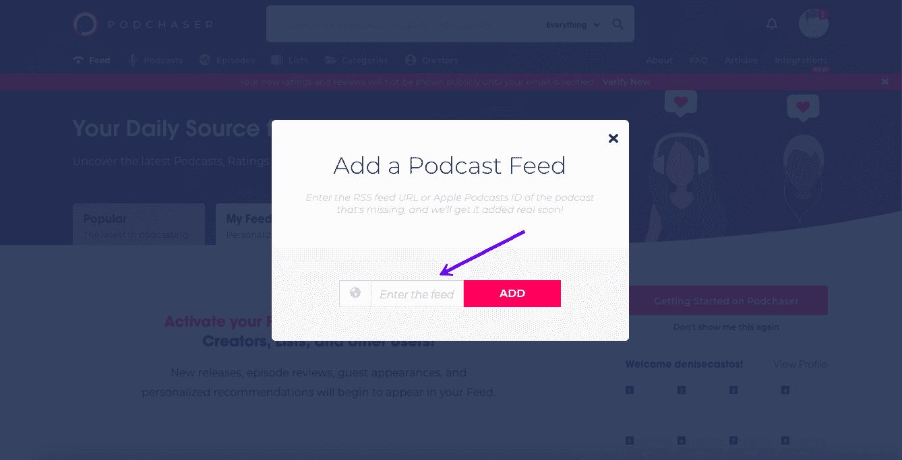

Submitting your podcast to Podchaser

该平台最近发布了个性化订阅功能，根据用户的收听习惯推荐新的播客。有这么多的机会让人们发现你的播客，在播客上创建一个列表是显而易见的。

提交再直接不过了。你所需要做的就是把你的 RSS 链接或者苹果播客 ID 添加到他们的[“添加播客”](https://www.podchaser.com/myfeed)入口。Podchaser 团队将核实信息，并将节目添加到平台中。

### 铸造箱

拥有 2000 万用户的 [Castbox](https://castbox.fm/) 是另一款免费流媒体应用，可以在 Android、苹果、语音助手技术、Carplay 和桌面设备上使用，允许听众从任何地方访问播客。

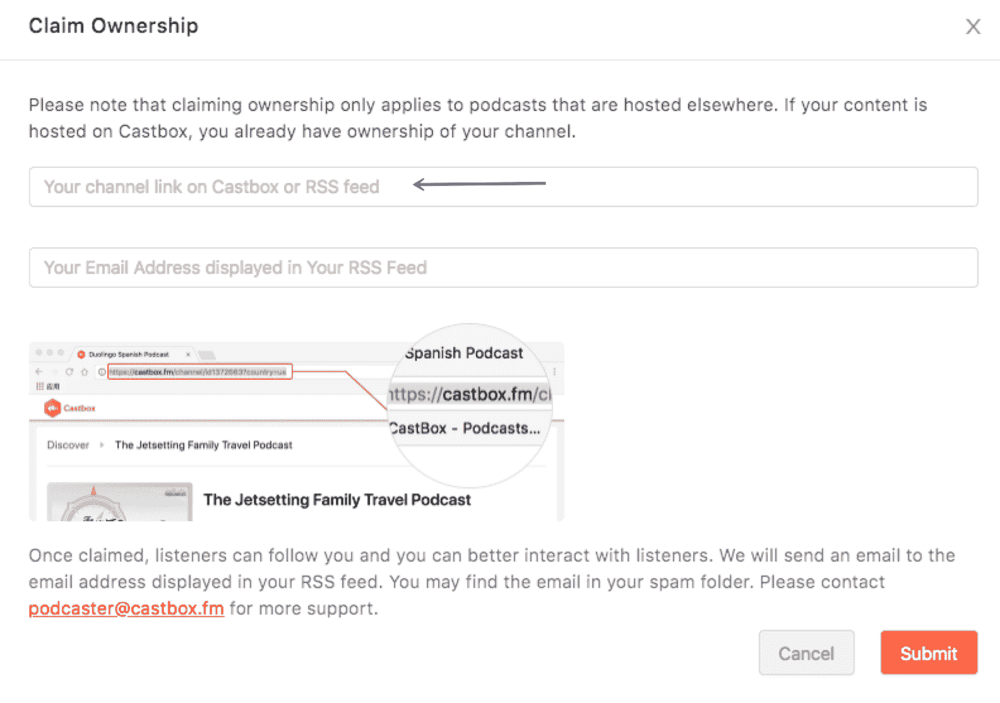

Submitting your podcast to Castbox

Castbox 是一个独特的播客目录，因为他们也提供托管服务和流媒体服务。若要设置帐户，请添加您的 RSS 源和电子邮件地址，然后等待列表获得批准时的通知。

[62 million people listen to podcasts every week 🎧 That's a huge opportunity to reach a new audience, so... Check out this full guide on launching a podcast with WordPress! 🎙🗣Click to Tweet](https://twitter.com/intent/tweet?url=https%3A%2F%2Fkinsta.com%2Fblog%2Fwordpress-podcast%2F&via=kinsta&text=62+million+people+listen+to+podcasts+every+week+%F0%9F%8E%A7+That%27s+a+huge+opportunity+to+reach+a+new+audience%2C+so...+Check+out+this+full+guide+on+launching+a+podcast+with+WordPress%21+%F0%9F%8E%99%F0%9F%97%A3&hashtags=podcast%2Cwpplugins)

## 摘要

用 WordPress 制作播客是成功发布新播客最简单的方法之一。

在开始时，我们建议使用一个专门的播客托管提供商来消除创建自己的 RSS 提要的猜测游戏。从长远来看，选择一个集成了 WordPress 插件的提供商可以节省时间和金钱——这是制作播客时你永远想要的两样东西！

一旦网站建立起来，你可以轻松管理 WordPress 中的一切，不要忘记在主要的和不太知名的播客目录中整合你的节目。

这是最简单、最具成本效益的方式，可以在潜在观众已经在消费内容的每个地方增加观众来展示你的节目。不要切断自己被发现的机会！

现在轮到你了:你经营播客吗？如果是，你最喜欢播客的什么？如果没有，有没有考虑过？在评论中分享你的经验吧！

* * *

让你所有的[应用程序](https://kinsta.com/application-hosting/)、[数据库](https://kinsta.com/database-hosting/)和 [WordPress 网站](https://kinsta.com/wordpress-hosting/)在线并在一个屋檐下。我们功能丰富的高性能云平台包括:

*   在 MyKinsta 仪表盘中轻松设置和管理
*   24/7 专家支持
*   最好的谷歌云平台硬件和网络，由 Kubernetes 提供最大的可扩展性
*   面向速度和安全性的企业级 Cloudflare 集成
*   全球受众覆盖全球多达 35 个数据中心和 275 多个 pop

在第一个月使用托管的[应用程序或托管](https://kinsta.com/application-hosting/)的[数据库，您可以享受 20 美元的优惠，亲自测试一下。探索我们的](https://kinsta.com/database-hosting/)[计划](https://kinsta.com/plans/)或[与销售人员交谈](https://kinsta.com/contact-us/)以找到最适合您的方式。