# 如何设置免费的 WordPress 推送通知并获得每月 2500+的访问者

> 原文：<https://kinsta.com/blog/wordpress-push-notifications/>

推送通知，也称为[网络推送通知](https://developers.google.com/web/fundamentals/engage-and-retain/push-notifications/)，在过去几年中已经在在线企业和营销人员中获得了很大的流行。这些提供了另一种方式来抓住你的观众，增加回头客，并且在大多数情况下显示出比你典型的时事通讯注册更高的点击率和参与度。今天我们将深入探讨什么是 WordPress 推送通知，它们如何帮助你扩大网站的覆盖范围，以及如何快速将它们添加到你的网站中。典型的设置不到 10 分钟！

> 推送通知技术正从简单的消息传递系统迅速发展成丰富的交互式媒体。–一个信号

我们在 Kinsta 使用推送通知已经有几年了，平均每月有 2500 多名访客访问我们的 WordPress 网站(如下图所示)。这只是从这个单一的参考来源。更好的是，其中一小部分还会定期转化为付费客户。多棒啊。

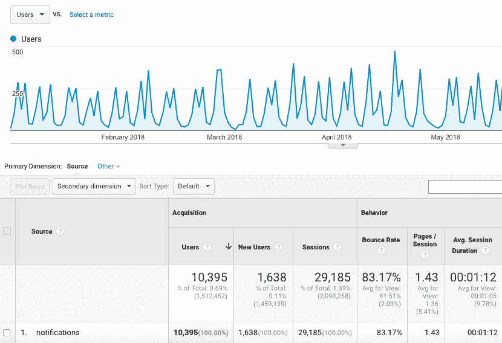

Push notification traffic


*   什么是推送通知？
*   [WordPress 推送通知的好处](#benefits-of-push-notifications)
*   [如何设置 WordPress 推送通知](#set-up-wordpress-push-notifications)
*   [OneSignal 附加注释和选项](#onesignal-notes)

## 推送通知

首先，什么是推送通知？WordPress 推送通知**允许你在你的网站上发布新内容**时自动通知你的观众。或者您可以随时发送预定义的消息。这可以是手机上的通知，也可以是通过浏览器(如 Chrome、Firefox 或 Safari)发出的通知。推送通知最初是在 2009 年为 Android 和 iOS 设备推出的，此后一直蔓延到其他平台。如果我们看看 2014 年到今天的谷歌趋势，我们可以看到，围绕“网络推送通知”的兴趣一直在稳步增长。

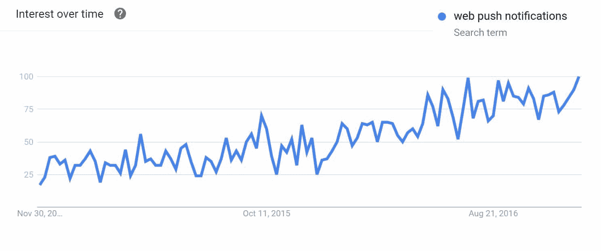

Web push notifications trends


下面是一个推送通知注册请求的例子，你可能以前见过。通过点击“允许”,网站可以通过您的浏览器向您发送通知。对网站所有者来说，美妙之处在于访问者不一定要在你的网站上才能收到你的通知，他们只需要让浏览器运行就可以了。

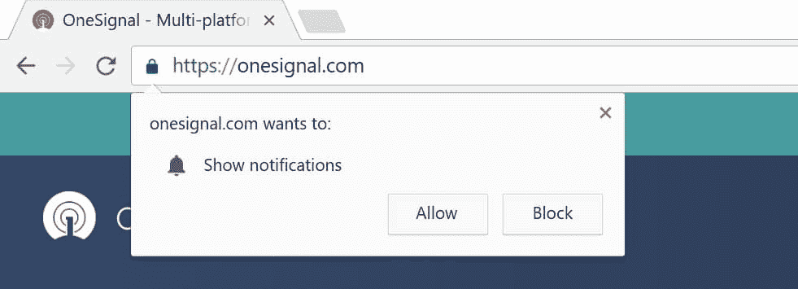

Push notification example


据[can use](http://caniuse.com/#feat=notifications)称，全球对网页推送通知的支持度在 45%左右。Safari 是第一个提供网页推送的，其次是 Chrome，然后是 2016 年的 Firefox。微软 Edge 和 Opera 也支持推送。谷歌 Chrome 浏览器目前在 T2 占有大约 77%的浏览器市场份额，这意味着仅仅在 Chrome 浏览器中启用推送通知就能吸引大量用户。Android 移动设备 Chrome 上的推送通知也可以开箱即用。下面是来自 Android 设备和推送通知请求的屏幕截图。然而，iOS 目前还不支持它们，尽管他们希望很快得到支持。


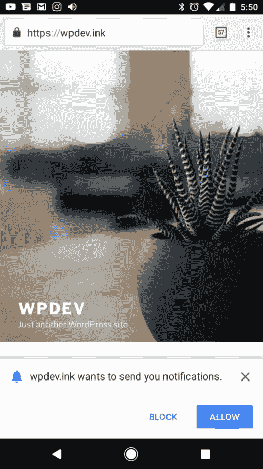

Android push notification


## WordPress 推送通知的好处

推送通知的主要好处是，它们为你的 WordPress 站点提供了另一种沟通方式。如今，许多人浏览电子邮件，或者干脆不看。推送通知可以帮助**把你的信息放在客户和访问者的面前，从而把他们带回你的网站。如果您对推送通知的效果有疑问，请查看以下案例研究:**

*   YouNow 通过网页推送通知将留存率提高了 19%。–[信号源](https://onesignal.com/blog/web-push-notification-improves-user-retention-for-younow/)
*   通过网络推送通知，United eXtra Electronics 的电子商务销售额增长了 100%。–[信号源](https://developers.google.com/web/showcase/2016/extra#tldr)
*   A+E Networks 通过推送通知实现了 200%的用户参与度增长。–[信号源](http://info.localytics.com/hubfs/Case-Studies/AE-Networks-Case-Study.pdf)

这些只是一对夫妇。还有许多其他公司的案例研究，这些公司在推送通知方面取得了巨大成功。无论你经营的是 WooCommerce 商店还是信息博客，推送通知绝对是你应该尝试的营销策略的一部分。

推送通知适用于所有人吗？肯定不是。有些人可能觉得他们太伤害用户体验了。无论如何，记住不要过度使用它们，因为这可能会让人讨厌。

## 如何设置 WordPress 推送通知

当设置 WordPress 推送通知时，你现在有很多很好的选择。下面是几个流行的和积极更新的。注意:这些包括免费和高级解决方案。他们中的许多人有免费计划，直到一定数量的用户。

*   [一个信号](https://onesignal.com/)
*   [发出脉冲](https://sendpulse.com/features/webpush)
*   [VWO 订婚](https://vwo.com/engage/)
*   [俯卧撑](https://pushupnotifications.com/)
*   [推送](https://pushify.com/)
*   [Pushprime](https://pushprime.com/)
*   [栖息](https://goroost.com/)
*   [吻手](https://pushassist.com/)
*   [iZooto](https://wordpress.org/plugins/izooto-web-push/)
*   [桌面&移动推送通知系统](https://codecanyon.net/item/desktop-mobile-push-notification-system-wordpress-plugin/6548533)

由于上述所有解决方案都有不同的浏览器和移动支持，我们建议查看你的谷歌分析数据，看看你的 WordPress 网站有什么类型的流量。如果你点击进入“观众>技术>浏览器和操作系统”，你可以看到哪些浏览器是你网站上的访问者最常用的。在下面的例子中，你可以看到启用 Chrome 网页推送通知对我们最有利，因为超过 70%的桌面流量来自 Google Chrome。

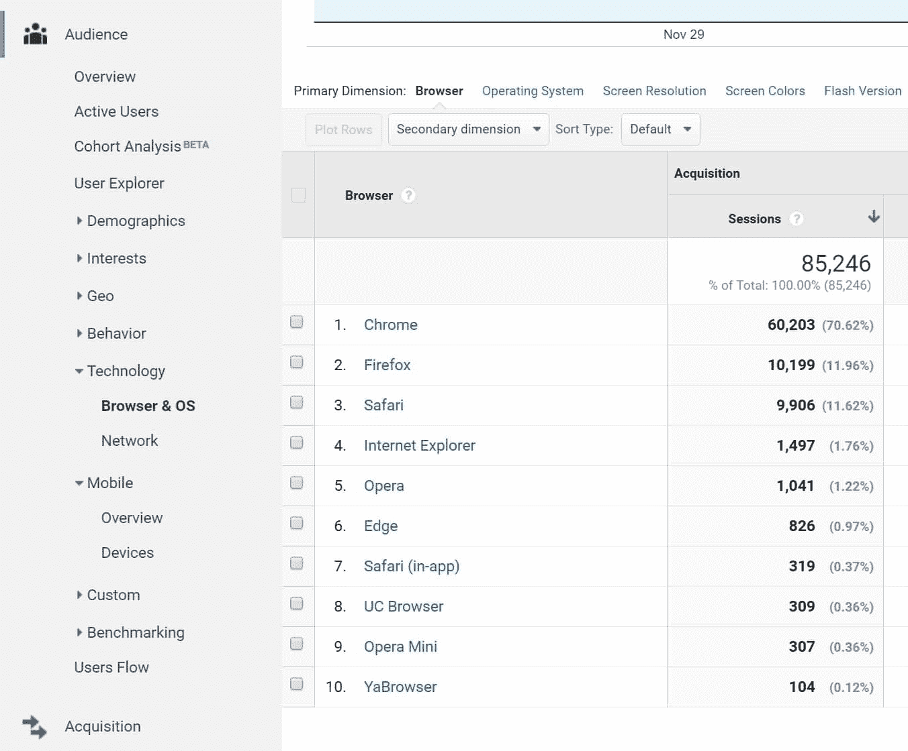

Analytics – Browser & OS


在本教程中，我们将使用来自 [OneSignal](https://wordpress.org/plugins/onesignal-free-web-push-notifications/) 的插件，这是一个用于 WordPress 推送通知的**完全免费的解决方案**。写这篇文章的时候，它已经有超过 50，000 个活跃安装，评级为 4.7(5 颗星)。

[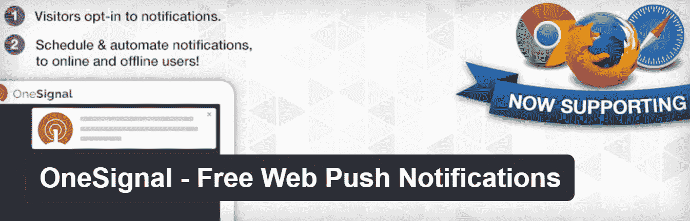](https://wordpress.org/plugins/onesignal-free-web-push-notifications/)

OneSignal WordPress plugin


根据他们的网站，他们被超过 100，000 个开发者使用，包括像 Adobe，优步，和汤姆的硬件这样的大牌。它们的一些功能包括:

*   100%免费使用
*   无限制的 WordPress 推送通知
*   无限设备
*   交付自动化
*   本地化
*   完整 API
*   无限分段
*   A/B 测试
*   交付计划
*   能够导入和导出您的数据

听起来好得难以置信？有一点要记住。他们一点也不隐瞒这个事实，并且在他们的网站上非常公开。他们赚钱的方式是利用他们收集的数据来改善网络和移动体验。因此，如果这对你来说是一个问题，你可以随时升级到他们的企业版，在这种情况下，他们不能访问你的数据。价格从每月 40 美元开始，用户数量可达 50 万。

OneSignal 的一个优势是，他们允许你设置任意多的 WordPress 站点(应用程序)。因此，你可以登录 OneSignal 的仪表盘，拥有 10 多个不同的 WordPress 网站，它们都有各自独立的推送通知应用和数据。如果你管理着多个 WordPress 站点，并且想要在所有的站点上实现推送通知，那么 OneSignal 将是一个很好的方式来轻松管理它们。另外它是免费的！

使用 OneSignal，web 推送通知的工作方式与原生移动推送完全一样。因此，您不必创建一个移动应用程序来获得移动原生推送通知的好处。以下是目前支持的浏览器。

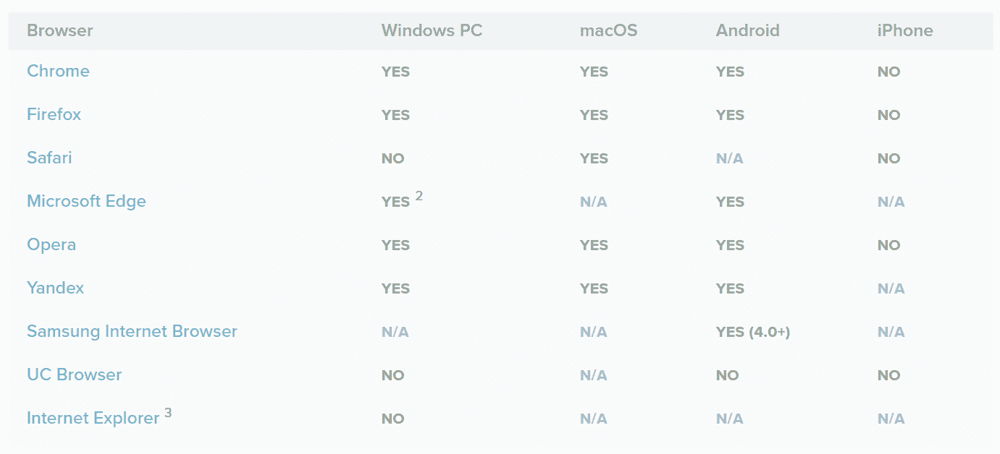

OneSignal browser support


遵循以下步骤，只需几分钟即可使用 OneSignal 开始工作。虽然 OneSignal 有 HTTP 和 HTTPS 站点的配置，但我们强烈建议[在您的域](https://kinsta.com/blog/http-to-https/)上使用 HTTPS，因为 web 推送权限和订阅是由域/协议分开的。无法在以后转移您的推送通知。Kinsta 向所有用户提供[免费 SSL](https://kinsta.com/blog/free-ssl-certificate/) ，或者 [Cloudflare](https://support.cloudflare.com/hc/en-us/articles/200170516-How-do-I-add-SSL-to-my-site-) 也是一个不错的选择。

### 第一步

下载并[安装](https://kinsta.com/knowledgebase/how-to-install-wordpress-plugins/)免费的 [OneSignal 插件](https://wordpress.org/plugins/onesignal-free-web-push-notifications/)。你可以从 WordPress 知识库下载它，或者在你的 WordPress 仪表盘的“添加新插件”下搜索它。

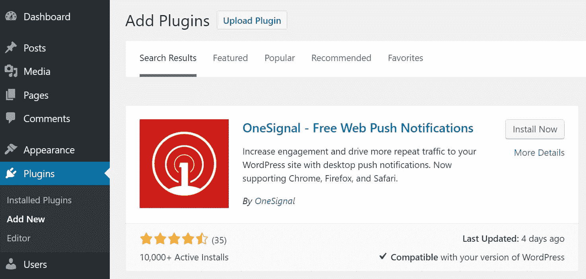

Install OneSignal web push notifications


### 第二步

接下来，前往 [OneSignal](https://onesignal.com/) 创建一个免费账户。

### 第三步

点击“添加新应用”,为你的应用命名。在我们的例子中，我们只是使用我们的 WordPress 站点的名称。然后点击“创建”

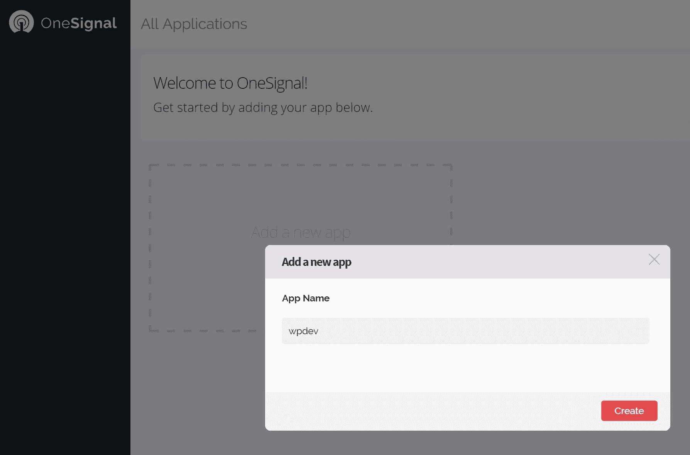

Add new app in OneSignal


### 第四步

选择“网站推送”并点击“下一步”


Website push


### 第五步

我们首先要安装谷歌浏览器和火狐浏览器。我们以后会去狩猎。然后点击“下一步”

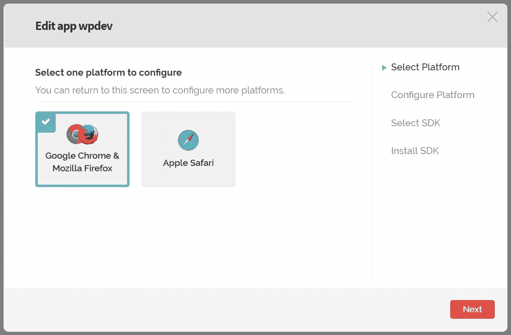

Google Chrome & Mozilla Firefox


### 第六步

输入你的 WordPress 站点 URL。确保使用正确的协议，HTTP 或 HTTPS，这取决于您在站点上运行的内容。在我们的例子中，我们的网站使用 HTTPS。然后输入您的通知图标 URL 的位置。根据 OneSignal 的说法，图标尺寸应该是 192 x 192 或更大，才能在高像素密度设备上显示良好。你可以上传一个到你的 WordPress 媒体库并复制 URL。如果您没有选择，将使用默认的一个信号通知图标。然后点击“保存”


Push notification URL


注意:如果你的网站运行在 HTTP 上，他们会让你在 onesignal.com 上创建一个子域，允许应用程序在 HTTPS 上运行。例如，https://yoursite.onesignal.com。

### 第七步

在下一个屏幕上，你需要选择你的目标 SDK，在这个例子中，我们选择“WordPress”并点击“next”

## 注册订阅时事通讯


### 想知道我们是怎么让流量增长超过 1000%的吗？

加入 20，000 多名获得我们每周时事通讯和内部消息的人的行列吧！

[Subscribe Now](#newsletter)

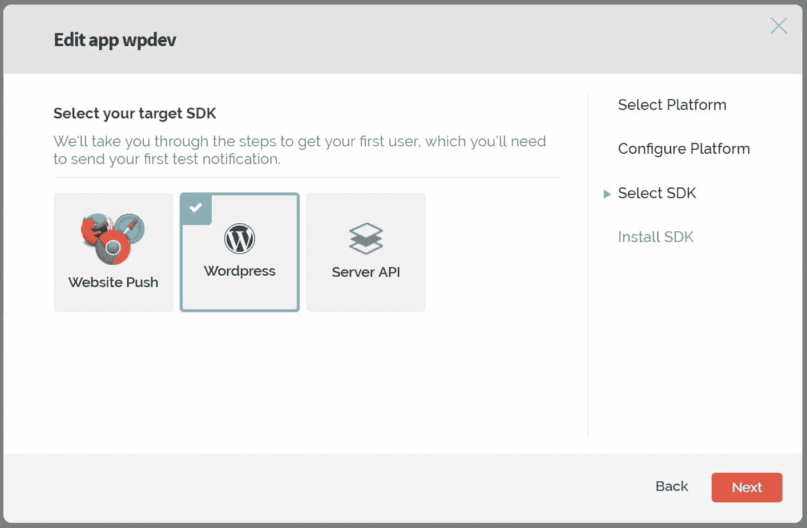

OneSignal WordPress SDK


### 第八步

在下一个屏幕上，你需要复制你的 Rest API 密钥和应用 ID，因为你需要将这些信息输入到 WordPress 插件的设置中。让这扇窗户开着，因为你以后会回到这里。

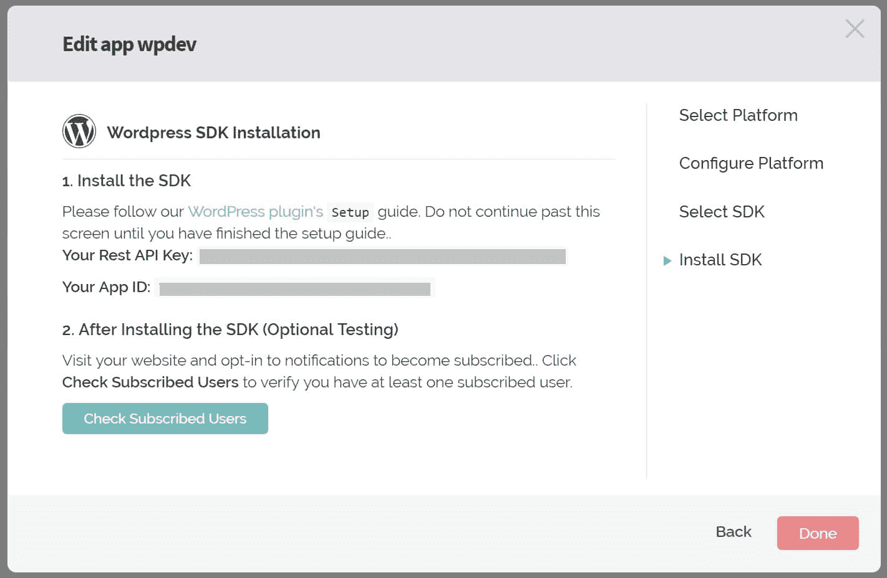

OneSignal API key and App ID


### 第九步

回到你的 WordPress 网站，点击进入 OneSignal Push 设置的“配置”标签。输入您的应用 ID 和 REST API 密钥。现在，您可以将其他所有内容保留为默认设置。向下滚动到底部，然后单击“保存”

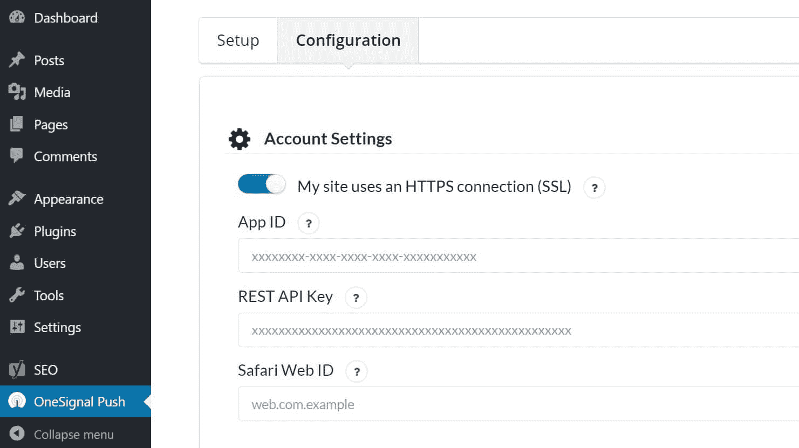

OneSignal app ID


### 第十步

然后，您将希望浏览到您的网站并订阅通知，以测试一切都正常工作。点击右下角的“红色”符号，然后点击“允许”您可以稍后在显示设置中更改这些选项。(注意:如果您正在运行广告拦截器，您可能需要将其禁用)

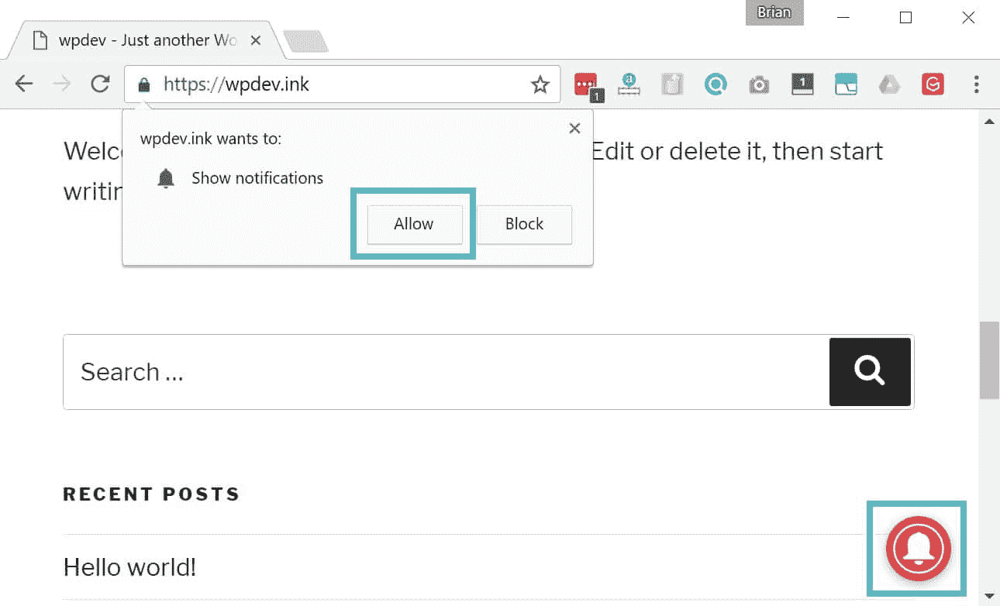

Subscribe to push notifications


您将看到一条确认信息，稍后您还可以更改其中的措辞。

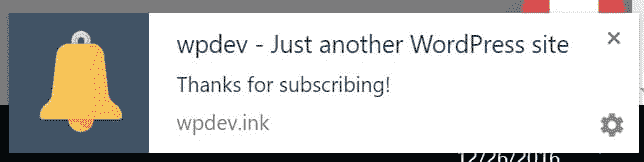

Subscribe notification


### 步骤 11

然后回到 OneSignal 网站，点击“检查订阅用户”按钮，然后点击“完成”

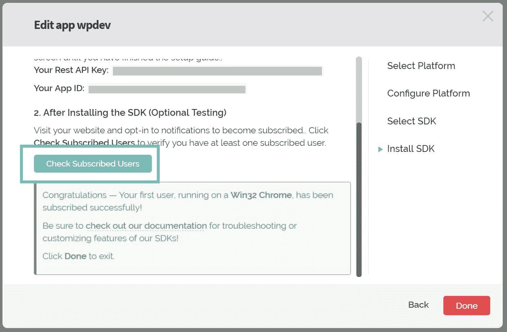

Check subscribed users


### 步骤 12

现在是时候设置 Safari 推送通知了。点击进入“应用设置”，点击 Apple Safari (macOS)旁边的“配置”。

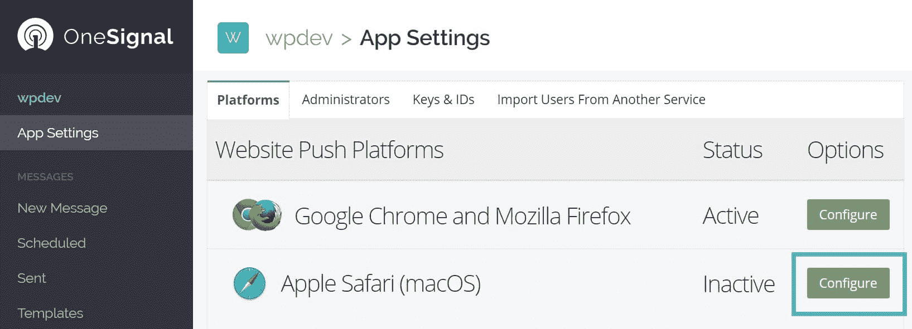

Apple Safari push notification setup


### 第十三步

输入您的站点名称(显示在通知中)和您的站点 URL。然后，您可以上传您的通知图标(包括 16 × 16、32×32、64×64、128×128 和 256×256)。这些直接上传到 OneSignal，而不是你的 WordPress 媒体库。如果您不上传它们，将使用默认的单信号通知图标。然后点击“保存”

Struggling with downtime and WordPress problems? Kinsta is the hosting solution designed to save you time! [Check out our features](https://kinsta.com/features/)

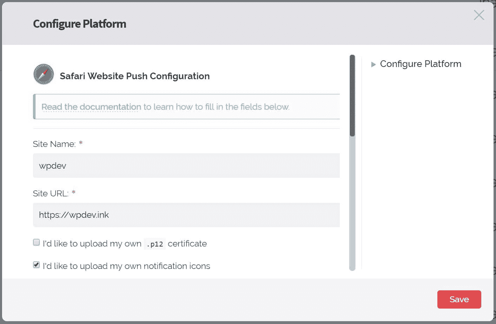

Configure Safari push


### 步骤 14

然后，它会显示您的网络 ID，您将想要复制到您的剪贴板。


Apple Safari web ID


然后将其粘贴到 OneSignal 配置设置的 Safari Web ID 栏中。向下滚动并点击“保存”

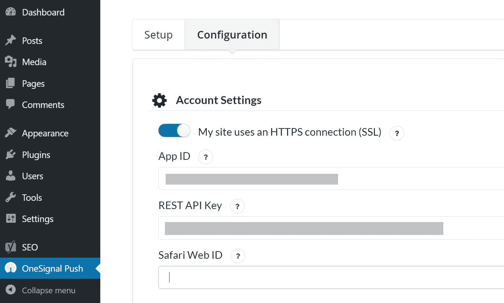

OneSignal Safari web ID


就是这样！现在你已经有了 WordPress 推送通知，并且正在运行。

## 一个信号附加说明和选项

你可以在插件中配置许多设置，其中一些我们将在下面介绍。如果你对 OneSignal 的性能感兴趣，这个插件是相当轻量级的，只使用了一个不到 100 KB 的脚本。这是他们的 CDN 合作伙伴 Cloudflare 提供的。在我们的测试中，OneSignal 丝毫没有降低我们网站的速度。

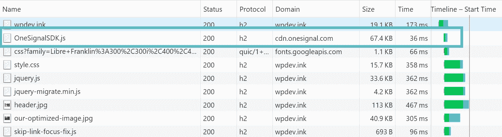

OneSignal load times


不过有一点需要注意，那就是他们的插件与第三方 CDN 提供商插件不兼容。在我们的例子中，我们使用免费的 CDN 插件 [CDN Enabler](https://wordpress.org/plugins/cdn-enabler/) ，它要求我们在设置中添加以下排除，以便 OneSignal 正确工作。如果你正在使用另一个插件或 CDN 提供商，你可以查看他们关于 CDN 故障排除的[附加文档](https://documentation.onesignal.com/docs/troubleshooting-web-push#section-wordpress-cdn-support)。

```
.php,.xml, onesignal-free-web-push-notifications
```

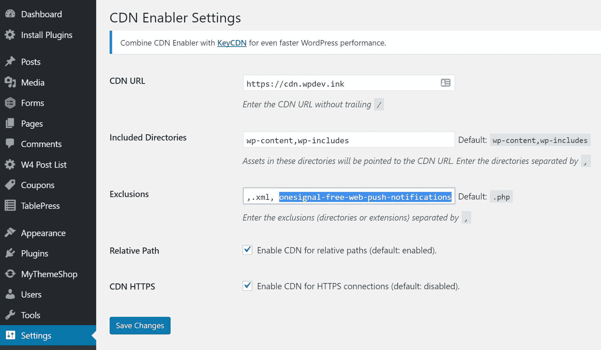

OneSignal CDN support


此外，如果你在你的网站上使用免费的[缓存使能器](https://wordpress.org/plugins/cache-enabler/)插件，你将需要禁用 JavaScript 缩小。

如果你是 [Kinsta 的客户](https://kinsta.com/plans/?plan=visits-business1&interval=month)，并且你正在使用 [MyKinsta 仪表板](https://kinsta.com/mykinsta/)中内置的[代码缩减功能](https://kinsta.com/help/kinsta-cdn-code-minification/)来启用自动 CSS 和 JavaScript 缩减以有效加速你的网站，这也是需要考虑的事情。

### 自动推送通知

当你安装 OneSignal WordPress 插件时，默认情况下会自动启用“发布后发送通知”选项(如下所示)。如果你正在发布一个你不想被推送的帖子，你可以很容易地取消勾选。

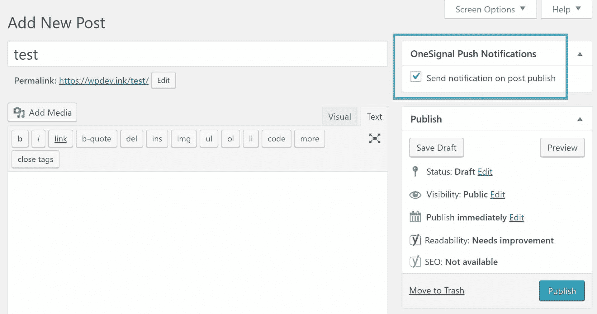

Send push notifications


你也可以通过进入 OneSignal Push 插件设置，关闭“当我从 WordPress 编辑器创建一篇文章时，自动发送推送通知”选项，禁止自动检查上述内容。当你想推送它的时候，你可以简单地从 WordPress 编辑器中手工检查它。这可能是更安全的路线。

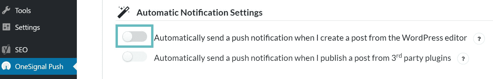

Disable automatic push notifications


### 自动提示用户

如果你想要新的访问者被自动提示订阅，你可以在插件设置中启用它。你也可以禁用“红色”浮动图标，如果你认为它对访问者来说太显眼的话。

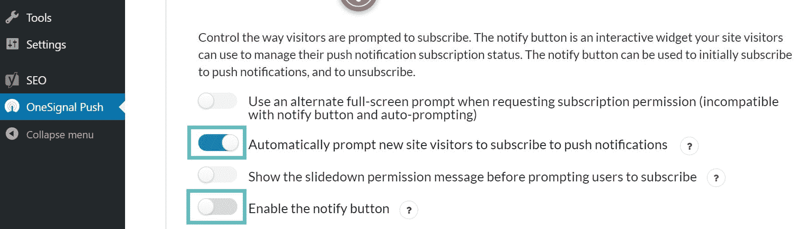

Automatically prompt users


您可以更改许多其他选项，例如:

*   添加附加 UTM 跟踪参数
*   创建其他自定义帖子类型
*   更改“感谢您订阅”选项的措辞
*   更改弹出窗口的措辞
*   更改小部件的外观以及与站点访问者的交互方式
*   使用帖子的特色图片作为通知图标
*   大约 20 秒后关闭通知

然后，您可以从 OneSignal 仪表盘控制一切。我们甚至对这些数据感到惊讶。在我们添加它的一个网站上，我们在不到 48 小时内有**超过 140 个推送通知订阅者(见下文)。请记住，即使你没有亲自订阅通知，这并不意味着这就是你的访客的想法。**永远不要想当然地认为营销你的 WordPress 网站时，测试是获得具体数据的最佳方式。****

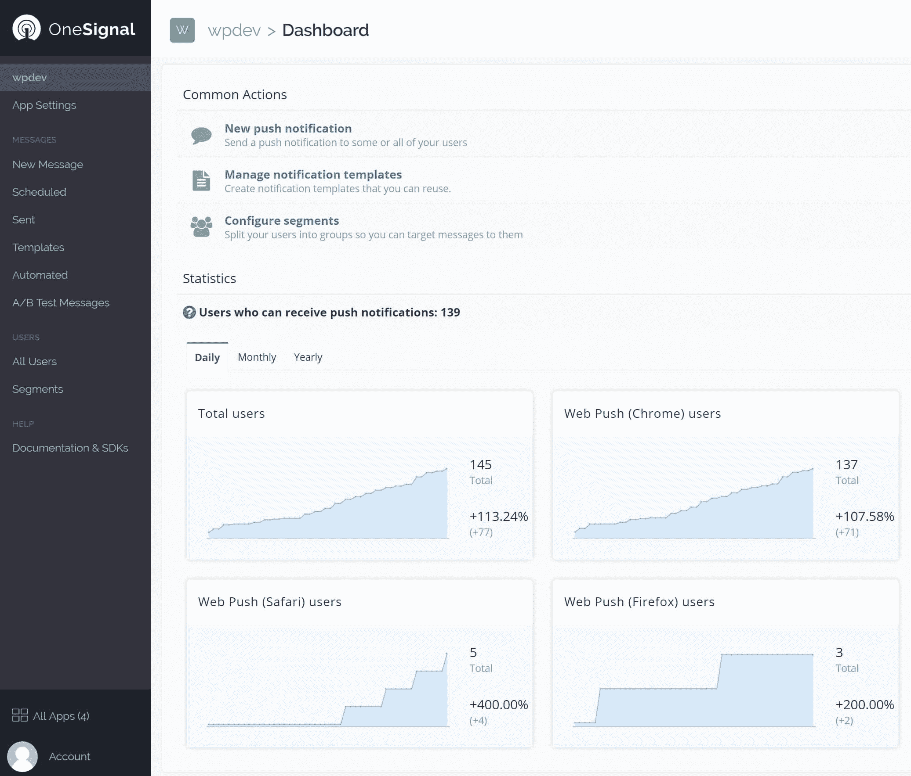

OneSignal dashboard


请务必查看我们的官方[one signal](https://onesignal.com/case-studies/kinsta)案例研究。在使用 OneSignal 不到 3 个月的时间里，它已经是我们第 3 高的有机流量来源！如果您直接从 OneSignal 仪表板推送通知，请确保添加一个 UTM 参数，以便您可以对流量进行分段和跟踪。下面是我们在每个 URL 上使用的一个例子。

```
https://yourdomain.com/?utm_medium=push&utm_source=notifications
```

### 取消订阅推送通知

如果你的网站流量很大，肯定会有一些访问者会不小心订阅你网站的推送通知。因此，在你的网站上有一个关于如何取消订阅推送通知的链接是很好的。它因浏览器而异，所以通常最好让用户查看他们的官方文档。

## 摘要

如你所见，WordPress 推送通知非常容易设置！这可能看起来像是几个步骤，但实际上它可以在大约 5 分钟内完成。如果您正在寻找与您的访客或客户联系的其他途径，我们建议您尝试一下。真的没有任何风险。如果不喜欢，可以直接卸载插件，取消服务，恢复正常。推送通知是一种很好的方式，可以让你的内容吸引更多的眼球，并让访问者再次访问你的 WordPress 网站。

你尝试过 WordPress 推送通知吗？如果是这样的话，我们很乐意在下面听到你的经历或意见。

* * *

让你所有的[应用程序](https://kinsta.com/application-hosting/)、[数据库](https://kinsta.com/database-hosting/)和 [WordPress 网站](https://kinsta.com/wordpress-hosting/)在线并在一个屋檐下。我们功能丰富的高性能云平台包括:

*   在 MyKinsta 仪表盘中轻松设置和管理
*   24/7 专家支持
*   最好的谷歌云平台硬件和网络，由 Kubernetes 提供最大的可扩展性
*   面向速度和安全性的企业级 Cloudflare 集成
*   全球受众覆盖全球多达 35 个数据中心和 275 多个 pop

在第一个月使用托管的[应用程序或托管](https://kinsta.com/application-hosting/)的[数据库，您可以享受 20 美元的优惠，亲自测试一下。探索我们的](https://kinsta.com/database-hosting/)[计划](https://kinsta.com/plans/)或[与销售人员交谈](https://kinsta.com/contact-us/)以找到最适合您的方式。