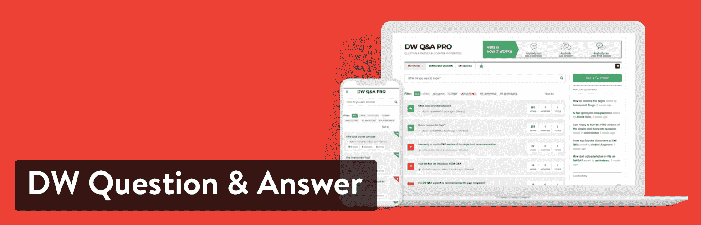
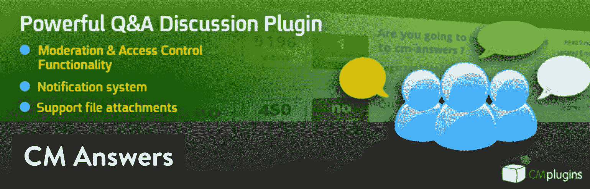
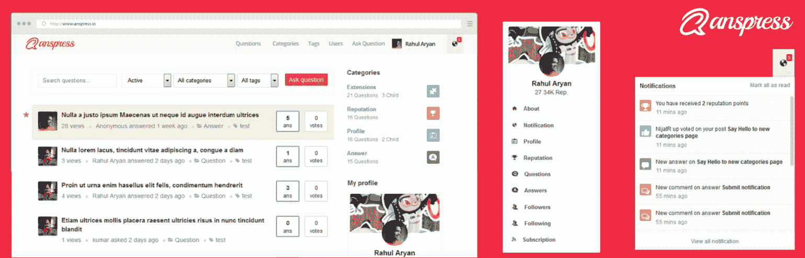
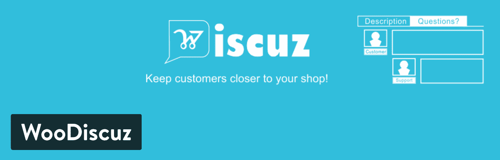
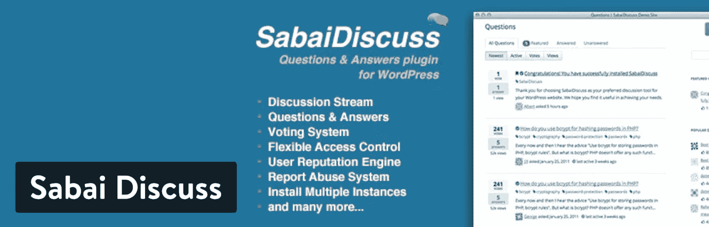
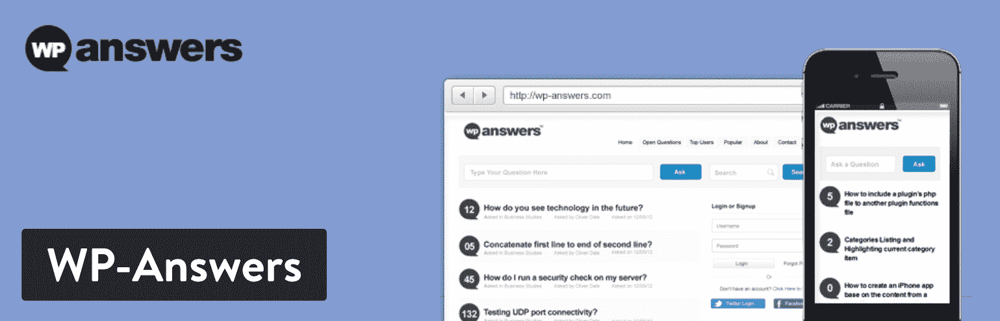

# 挑起对话的最佳 WordPress 问答插件

> 原文：<https://kinsta.com/blog/wordpress-qa-plugin/>

像雅虎这样的问答网站 Answers、Quora、Reddit 和 Stack Exchange 都非常适合提问或浏览世界各地的人们提出的答案。从关于谁真正赢得了二战的假设，到特定行业的问题，如“什么是最具成本效益的网站建设者？”这些问答网站是知识和社区的金矿。

此外，问答网站还包含其他功能，如投票、个人资料和徽章，以确保用户度过愉快的时光，并能够在合理的时间内找到他们需要的信息。如果你想用问答的形式开发你自己的社区，你所需要的就是最好的 WordPress 问答插件选项之一！

[Trying to create a site like Quora or Reddit? 🙋‍♂️ Check out these plugins which turn your WordPress site into a 'Question and Answer' powerhouse.Click to Tweet](https://twitter.com/intent/tweet?url=https%3A%2F%2Fkinsta.com%2Fblog%2Fwordpress-qa-plugin%2F&via=kinsta&text=Trying+to+create+a+site+like+Quora+or+Reddit%3F+%F0%9F%99%8B%E2%80%8D%E2%99%82%EF%B8%8F+Check+out+these+plugins+which+turn+your+WordPress+site+into+a+%27Question+and+Answer%27+powerhouse.&hashtags=WordPress%2CQA)

## 是什么造就了一个伟大的 WordPress 问答插件？

鉴于每个现有的问答网站都是不同的，研究一下使每个网站独特和用户友好的功能是很好的。例如，Quora 以审查回答问题的人而闻名，这样你就能从真正的专家那里得到真正的答案。Stack Exchange 尽量避免民意调查，在广泛的话题中争取客观的答案。

所以，你完全可以决定做一个有很多主题的问答网站，但是它需要以某种方式脱颖而出。另一方面，你可以考虑专注于一个特定的领域来链接到你的论坛或博客，让人们讨论与旅游、园艺或网络开发相关的特定问题。

至于最好的 WordPress 问答插件解决方案，你应该寻找哪些特性？

*   一个清晰的按钮和字段，供用户为其他用户输入问题(或者，您可能希望这仅限于制作 [FAQ 页面](https://kinsta.com/blog/wordpress-faq-plugins/)的管理员)。
*   用户和管理员可以选择添加丰富的内容和媒体，如粗体文本、链接和图像。
*   品牌化和风格化你的问答部分或网站的工具。
*   供用户回答问题的模块。
*   选项创建个人资料，使答案看起来更可信，并建立自己的用户群。
*   关注某些问题的按钮。电子邮件通知也不错。
*   分类和搜索工具，帮助人们找到他们需要的信息。
*   将最佳答案发送到页面顶部的投票。

## 最佳 WordPress 问答插件

我们建议你测试一下大多数最好的 WordPress 问答插件，看看哪些最适合你。在这篇文章中，我们将看看八种不同的解决方案，你可以用它们在你的 WordPress 站点上安装一个问答插件，只需几分钟。

> 需要在这里大声喊出来。Kinsta 太神奇了，我用它做我的个人网站。支持是迅速和杰出的，他们的服务器是 WordPress 最快的。
> 
> <footer class="wp-block-kinsta-client-quote__footer">
> 
> 
> 
> <cite class="wp-block-kinsta-client-quote__cite">Phillip Stemann</cite></footer>

[View plans](https://kinsta.com/plans/)

1.  [英雄 WordPress 常见问题解答](#heroic-wordpress-faqs)
2.  [DW 提问&回答](#dw-question-answer)
3.  [CM 回答](#cm-answers)
4.  [ans press–问答](#anspress-question-answer)
5.  [YITH WooCommerce 问答](#yith-woocommerce-questions-answers)
6.  [WooDiscuz–woo commerce 评论](#woodiscuz)
7.  [萨白讨论](#sabai-discuss)
8.  [WP-Answers](#wp-answers)

### 1.英雄 WordPress 常见问题

虽然许多人在制作问答网站时可能会想到 Quora 和 Reddit 这样的网站，但我们也想介绍一个为博客、电子商务网站以及任何类型的在线存在制作常见问题的插件。英雄 WordPress FAQs 插件就是这么做的，它是你能找到的最干净、最容易使用的 FAQ 选项之一。这个插件不允许用户张贴他们的问题和写答案，而是帮助你从客户那里得到所有常见的问题，并把它们张贴在你的网站上。

这样，你就不必一直通过电子邮件、电话或聊天来回答问题。简而言之，它可以减少你的客户支持工时。

Heroic WordPress FAQs plugin

英雄 WordPress FAQs 的伟大之处在于它提供了一个漂亮的拖放界面。您可以通过对问题和答案进行重新排序，同时将它们组织成组。所有问题都以手风琴式的格式放在一个页面上，允许用户点击并查看他们认为最紧迫的问题。支持丰富的内容，并且所有的 FAQ 表单在移动设备上都很好看。

在价格方面，没有免费的英雄版。然而，你可以在一个网站上以每年 49 美元的价格获得完全的访问权限。三个站点的价格是每年 69 美元，10 个站点的价格则跃升至每年 149 美元。

#### 为什么我们喜欢这个 WordPress 问答插件

*   漂亮的插件。hero themes 制作的一切永远都是像素完美。
*   它为在你的网站上快速建立 FAQ 页面提供了一个极好的界面。
*   拖放编辑器允许您轻松地移动问题。
*   你可以将常见问题按类别分组，以便于阅读。
*   切换和手风琴式的问题可用于更干净的巩固和更容易的阅读。
*   图标可以使您的问题和答案更加直观。
*   你可以上传图片和视频到你的 FAQ 来提供更多的信息。
*   列表、块引用和图像等项目也支持丰富内容。
*   价格是合理的。

#### 谁应该考虑这个 WordPress 问答插件？

我们喜欢英雄的 WordPress FAQs 插件，它适合那些想要快速为商业网站开发干净的品牌 FAQ 的人。

### 2.DW 问答

DW 问题&答案插件声明它使用表格、过滤器、问题和答案在你的网站上创建一个类似 Quora 的区域。主要功能对所有用户完全免费，你甚至可以免费获得一些很棒的图标来搭配你的 Q & A 线程。甚至所有的附加软件都是免费的，包括:

*   一个用于嵌入问题和社交分享的插件。
*   减价的附加物。
*   在你的问答部分创建排行榜的附加组件。
*   一个附加的安全验证码。

DW Question & Answer plugin

你可能会考虑使用 DW 问答的一个主要原因是因为它强大的语言支持。在撰写本文时，该插件支持 22 种语言，包括印地语、捷克语和西班牙语。此外，该插件的前端外观提供了一个现代、干净的外观，带有一个搜索栏和“提问”按钮，向用户显示确切的位置。

后台设置很好理解，而问题和答案都是那一区的缓和。我们特别喜欢问题页面，管理员可以定制所有的字段，用户可以填写问题、状态、类别和标签等信息。

#### 为什么我们喜欢这个 WordPress 问答插件

*   插件的每个方面(包括附加组件)都是完全免费的。
*   开发者定期更新插件。
*   由于更新，你会得到一个相当现代的界面，有漂亮的表单和有用的后端功能。
*   提交、过滤、排序和删除问题工具中的所有内容都很容易找到。
*   有一个投票系统，让人们选择最佳答案，并将这些答案发送到线程的顶部。
*   用户在订阅特定问题后会收到电子邮件通知。
*   你可以把一些问题保密，一些问题公开。
*   短码用于将问答模块放置在您网站的不同位置。

#### 谁应该考虑这个 WordPress 问答插件？

DW 问答插件非常适合那些想要类似 Quora 和 Stack Exchange 功能的人。该功能包括用户提问和回答、投票以及后续问题。

### 3.CM 回答

[CM Answers](https://wordpress.org/plugins/cm-answers/) 插件是一个免费的基础插件，或者你可以选择升级到[高级版](https://www.cminds.com/cm-answer-store-page-content/#features)，每个网站的起价为 39 美元。开发商还出售一些附加软件和扩展软件，其中大多数网站起价约为 50 美元。一些更有趣的附加组件包括:

*   小额支付。
*   匿名用户发帖。
*   付款。
*   请教专家。
*   创意模拟器。
*   进出口。

如您所见，您可以选择继续使用免费版本或升级到高级版本。premium 附带的一些功能包括移动响应、私人回答和多个附件。这些高级特性中的一些最终会成为组织的需求，所以幸运的是高级定价不是很高。

CM Answers WordPress plugin

至于免费的核心插件，预计将有一个格式良好的问答部分，其中包含投票、浏览量和每个问题的答案数量。用户可以根据问题、类别和目前表现良好的问题进行筛选。您也可以搜索特定的关键字来找到您需要的问题。“问一个问题”字段可能需要一些工作，并移动到页面的顶部，但它看起来像问答底部的常规评论框一样

对于第一次使用的用户来说，设置有点复杂，但很高兴知道你可以调整一些事情，比如谁可以发布答案，表格在你的网站上显示在哪里，以及是否显示[导航菜单](https://kinsta.com/blog/wordpress-menu-plugins/)。

#### 为什么我们喜欢这个 WordPress 问答插件

*   CM Answers 插件提供了一系列令人印象深刻的免费功能。
*   对于利基网站和那些想要收费的网站来说，高级版本和附加软件应该足够了。
*   界面很干净，可以进行定制了。
*   用户可以查看答案、浏览量、投票数等。
*   支持一些语言，如西班牙语、德语和波兰语。
*   如果用户回答或发布问题，他们可以选择在收到更多回复时接收电子邮件通知。
*   发布问题和答案时，管理员会收到电子邮件通知。如果你发现有些东西跑题了或者不合适，就直接从网站上删除。

#### 谁应该考虑这个 WordPress 问答插件？

CM Answers 插件服务于那些想创建一个类似 Reddit 的问答网站的人。如果你计划升级到更高级的特性也不错——因为附加库相当大。

### 4.AnsPress 问答

AnsPress 插件在功能上类似于 CM Answers，除了你可以免费获得核心插件和所有附加组件。T2 的 AnsPress 开发者 T3 似乎通过销售 WordPress 主题来赚钱。但是如果你不需要一个主题，而想在你当前的网站上加入一个 Q & A 模块，AnsPress 会给你所有需要的功能，同时通过它的网站提供免费的客户支持。

AnsPress 也是一个开源项目，这意味着您应该能够期待未来的定期更新和修复。

AnsPress WordPress plugin

虽然 AnsPress 的主要用途是创建一个问答网站，但它也具有内部问答板、bug 跟踪和支持票等功能。你甚至可以用 AnsPress 插件创建 FAQ 页面。

## 注册订阅时事通讯

### 想知道我们是怎么让流量增长超过 1000%的吗？

加入 20，000 多名获得我们每周时事通讯和内部消息的人的行列吧！

[Subscribe Now](#newsletter)

一些主要功能包括投票、回答问题和提交新问题的选项。BuddyPress 集成对于那些想围绕问答网站建立社交网络的人来说是必不可少的。例如，BuddyPress 非常适合建立更好的用户档案，还可以让你的用户参与到信息传递中来。

正如我之前提到的，AnsPress 的所有插件都是完全免费的。你可以在 AnsPress 网站上找到一些。我最喜欢的包括:

*   过滤不良词语的附加软件。
*   建立用户声誉的附加软件。
*   用于发送电子邮件通知的附加组件。
*   为问题添加标签和类别的附加组件。
*   一个用 reCaptcha 防止垃圾邮件的附加软件。
*   一个制作动态文本头像的附件。

#### 为什么我们喜欢这个 WordPress 问答插件

*   AnsPress 插件是免费的，包括它所有的附件。
*   前端界面干净而现代，提供了类似于 Reddit 或 Quora 的设置。
*   你能做的不仅仅是一个问答网站。例如，一些公司用它来回答常见问题或支持票务。
*   短码可用于将问答部分放在网站的任何地方。
*   它有一个 BuddyPress 集成，可以围绕这个插件建立一个社交网络。
*   用户可以提交和过滤问题，而管理员可以选择编辑和删除问题。
*   每个问题都有回答和评论按钮。
*   用户可以对他们最喜欢的答案进行投票，将最受欢迎的回复发送到页面顶部。
*   该插件支持超过 10 种语言。
*   您可以将一些问题设为私有，这对于运行公司常见问题解答或留言板来说很方便。

#### 谁应该考虑这个 WordPress 问答插件？

任何预算有限的人都应该考虑 AnsPress 的问答需求。插件或附加组件不收取任何费用。这是一个很漂亮的界面，可以制作像 Reddit 或 Quora 这样的东西，我也喜欢它，因为公司可能需要一些 FAQ、票务系统或内部问答板。

### 5.YITH WooCommerce 问答

接下来的两个 WordPress 问答插件选项迎合了那些运行 WooCommerce 网站的用户。第一个叫做 [YITH WooCommerce](https://wordpress.org/plugins/yith-woocommerce-questions-and-answers/) ，在你的产品页面上展示一个 Q &部分。你可能在亚马逊上对此很熟悉，顾客可以提问，然后商家或其他顾客用他们知道的信息回复。这些问题和答案会留在产品页面上，供未来的客户在购买您的产品时阅读。

核心插件是免费使用的，但是 YITH 也出售一个每年 69.99 美元起的高级版本。这个免费插件的主要功能包括用户在产品页面上提问和回答问题的区域。管理员还可以创建 FAQ 以保持更多的控制，或者选择最常见的问题，并将其永久保留在产品页面上。

YITH WooCommerce Questions and Answers plugin

YITH WooCommerce 插件的高级版本为你的问题区增加了更多的灵活性。例如，您可以设置页面上显示的问题数量，并在发布新问题或答案时向管理员发送电子邮件。付费版本也可以投票，这意味着你可以将最佳答案推至顶部，而不是强迫客户搜索顶部的答案。随着滥用报告选项，隐姓埋名模式，和 reCaptcha，高级版本看起来像一个伟大的交易。

#### 为什么我们喜欢这个 WordPress 问答插件

*   这是促进销售和让客户安心的绝佳方式。这基本上就像众包你的产品信息，因为用户正在为你的产品生成答案。管理员也可以回答问题。
*   你可以向任何人开放问题和答案，或者将插件设置为 FAQ 模式，这样只有管理员可以添加问题和答案。
*   该插件在您的产品页面上创建一个标签，供客户查看。界面简单，用户友好，有一个领域提出问题，并回答现有的问题。
*   高级版开放了各种功能，价格也不是很贵。
*   高级版向客户和管理员发送电子邮件。
*   高级版本中提供了短代码。
*   付费插件中提供投票功能。这意味着你必须减少对答案的审查，因为你的用户会为最好的答案投票。

#### 谁应该考虑这个 WordPress 问答插件？

YITH WooCommerce 插件对于任何经营 WooCommerce 商店的人来说都是一个明智的选择。免费版应该能让更多的网上商店受益，因为它减少了你必须为你的产品提供的信息量和支持。相反，客户为您创建内容。我也喜欢那些想要更多高级功能如电子邮件和投票的人的高级版本。

### 6.WooDiscuz-woo commerce 评论

WooDiscuz 插件类似于 YITH WooCommerce，除了它更像是一个[评论或论坛线程](https://kinsta.com/blog/wordpress-forum-plugins/)而不是一个问答解决方案。也就是说，你仍然可以把这个部分设计成一个 Q &模块——我想大部分的讨论都是从提问开始的。

Struggling with downtime and WordPress problems? Kinsta is the hosting solution designed to save you time! [Check out our features](https://kinsta.com/features/)

WooDiscuz 的优势还在于它的定制选项。例如，您可以将选项卡的标题从“讨论”更改为您想要的任何其他内容——可能是“问答”讨论显示在一个选项卡中，还有其他详细信息，如描述和[评论](https://kinsta.com/blog/best-wordpress-review-plugins/)。这是另一个让你的客户交谈并填写产品页面上可能不清楚的信息的好方法。此外，如果客户没有回答问题，管理员也可以插话。

WooDiscuz WordPress plugin

目前，WooDiscuz 对所有用户都是免费的。每个功能都在核心插件中，所以没有必要升级到高级版本或购买一堆附加组件。

我喜欢 WooDiscuz 插件的外观和感觉，我觉得它似乎是所有电子商务网站都应该具备的必要元素之一。它不仅给你的网上商店注入了活力，而且有可能创造一个围绕你的产品的社区。

#### 为什么我们喜欢这个 WordPress 问答插件

*   这是一个完全成熟的电子商务问答产品，价格为 0 美元。
*   该插件允许超过问题和答案。你可以运行一个广泛的论坛或评论区，鼓励各种关于你的产品的对话。
*   一个标签会自动出现在你的产品页面上，提示人们提问。这些问题和答案会保留在页面上，供将来可能需要它们的客户使用。
*   它最大限度地减少了客户支持的数量，因为许多问题已经在你的页面上解决了。
*   您可以自定义线程的外观并更改其整个用途。例如，你可以称之为问题线索或讨论线索。
*   插件没有显示所有评论，而是提供了一个“加载更多评论”按钮来加快页面加载。
*   权限和标签可用于分配用户和头衔，如来宾、客户和管理员。
*   插件附带了评论投票，所以所有的最佳答案都显示在顶部。
*   用户可以订阅一些评论，以便在将来看到所有的消息。
*   你会收到脸书和 Twitter 等网站的产品分享按钮。

#### 谁应该考虑这个 WordPress 问答插件？

我会把这个插件推荐给任何有在线商店的人，尤其是考虑到整个插件都是免费的。这让小公司有机会向客户提供更多的信息，你也可以开始围绕你的产品建立一个社区。对于需要 FAQ 或讨论区的在线商店来说，这也是很棒的。如果你没有一个电子商务网站，这没有多大意义。

### 7.萨拜讨论

[萨拜讨论](https://codecanyon.net/item/sabai-discuss-plugin-for-wordpress/3455723)插件在 CodeCanyon 上只卖 24 美元。话虽如此，对于你从这个评价很高的 WordPress Q & A 插件中获得的众多功能来说，24 美元是一个令人难以置信的价格。在构建问题和讨论页面时，选项似乎是无穷无尽的。举个例子，你可能想创建一个带密码的会员论坛。使用 Sabai 讨论插件，这是完全可能的。您还可以创建一个用户资料页面、问题页面或类别页面，列出您的问题所属的所有类别。

讨论流是有组织的，以便您的用户可以排序和筛选对他们来说最重要的问题。还有一个投票系统，用于将最佳答案发送到页面顶部，并过滤掉垃圾邮件或糟糕的答案。

Sabai Discuss WordPress plugin

用户信誉引擎是问答页面的重要组成部分，因为你可以摆脱那些只发布垃圾邮件的用户，同时给那些用详细答案回复问题的用户以可信度。Sabai 讨论插件还具有在你的网站上多次安装问答功能的独特能力。因此，您的公司可能希望为客户提供一个公共问答区，同时为您的员工提供一个私人问答区。说到私人的内部讨论板，这个插件为用户上传他们自己的附件提供了一个选项。有了这个，Sabai 讨论插件就变成了一个协作工具。除了投票、评论和特色问题，Sabai 讨论插件对于寻找全方位 WordPress 问答插件的公司和个人来说绝对是出类拔萃的。

#### 为什么我们喜欢这个 WordPress 问答插件

*   Sabai 讨论插件可以安装在你网站的几个地方，为私人和公共讨论提供机会。
*   评论和回答都是可用的，所以你可以选择更多的讨论板或问答页面。
*   客户或员工可以在私人论坛上传文件附件。
*   Sabai 讨论插件附带了标记和投票功能，这样坏答案就会消失，好答案会更频繁地出现。
*   这个插件的价格很低。
*   [九个小工具和](https://kinsta.com/blog/wordpress-dynamic-sidebars-widgets/)五个短代码提供了最大的灵活性。
*   该插件有一个用户信誉系统，自动奖励最好的回帖者他们应得的信用。这不仅让那些用户感觉良好，也让其他用户看到他们的回复是有用的。
*   Sabai Discuss 提供了一个先进的报告虐待的系统。

#### 谁应该考虑这个 WordPress 问答插件？

我喜欢 Sabai 讨论插件，它适合那些希望在一个插件中包含所有可能的问答功能的公司。没有免费版本，但高级插件是负担得起的，它给你完整的问答包。这对于构建一个供外部或内部使用的类似 Reddit 的论坛来说是非常棒的，我特别喜欢在同一个网站上有多个问答板的实例。

### 8.WP-答案

WP-Answers 是另一个没有免费选项的解决方案。也就是说，WP-Answers 插件的起价是每年 34 美元，对于很多工具来说，这是一个合理的价格。从表面上看，WP-Answers 是一个标准的 T2 插件，设计时尚。但当我深入挖掘时，我开始注意到一些相当独特的功能，比如脸书和 Twitter 的集成。该工具允许用户使用他们的社交用户名和密码登录，无需他们创建新的登录信息。

你也可以在用户回答问题时奖励他们点数。这种类型的游戏化对于鼓励用户在留言板上多说话和回答他们知道答案的问题是必不可少的。你甚至可以分享一个排行榜，让用户有奋斗的目标和与其他用户竞争的理由。

WP-Answers WordPress plugin

WP-Answers 的另一个有趣的优点是，您可以与 Stack Exchange 集成，使您的页面看起来从一开始就很忙。很明显，你想建立一个用户贡献更多的网站，但这是一个很好的开始方式。

问答系统让我想起了 Reddit，但设计更简洁。对于移动设计来说尤其如此，因为你的整个问答页面在更小的设备上看起来很漂亮。

随着内置的垃圾邮件审核工具，垃圾邮件减少和投票按钮，WP-Answers 插件似乎是一个让你的问答网站或页面开始的优秀解决方案。

#### 为什么我们喜欢这个 WordPress 问答插件

*   WP-Answers 插件售价适中。你还能以最低的价格获得所有的功能。
*   问答系统让人想起了 Reddit，但它有着更简单、更干净的界面和出色的移动显示。
*   您可以选择用点数奖励最佳贡献者。每个领导者都可以显示在排行榜上，鼓励其他人也加入排行榜。
*   WP-Answers 与 Stack Exchange 集成，用于启动您的问答网站。基本上，它从受欢迎的网站提取对话和问题，这样看起来流量也在你的网站上流动。
*   登录页面包括脸书和 Twitter 登录选项。

#### 谁应该考虑这个 WordPress 问答插件？

WP-Answers 对全新的问答网站很有意义，因为你可以用 Stack Exchange 的内容填充你的问题板。对于那些有兴趣给最佳贡献者奖励积分的公司来说，这也是一件好事。最后，关于 WP-Answers 前端接口，我说的再多也不为过。它是市场上最好的之一，包括移动版本。即使是 Reddit 也不能吹嘘它的移动界面。

## 重述:哪个 WordPress 问答插件适合你？

现在我们已经讨论了所有的 WordPress 问答插件选项，让我们来分析一下哪一个最适合你或你的组织:

*   英雄的 [WordPress 常见问题解答](https://herothemes.com/plugins/wordpress-faq-plugin/)——如果你需要的只是一个漂亮漂亮的常见问题解答页面，那么考虑一下这个 WordPress Q &插件。
*   [DW 问题&回答](https://wordpress.org/plugins/dw-question-answer/)–如果你想模仿 Quora 和 Stack Exchange 这样的网站，选择这个插件。
*   如果你想要一个类似于 Reddit 的界面，就用这个插件吧。
*   如果你不想为你的 WordPress Q & A 插件付费，考虑一下这个插件。如果你想做一个票务系统或者公司内部的问题页面，你可能也会喜欢它。
*   YITH WooCommerce 问答模块–如果你的电子商务产品页面需要问答模块，选择这个插件。
*   如果你想在你的电子商务网站上获得问题和答案，可以使用这个插件，但不需要为这个插件支付任何费用。还可以用这个做 FAQ 和讨论模块。
*   如果你想在你的网站上有多个 Q & A 区，选择这个插件。我们也喜欢它，因为它的价格对于大量的功能集合来说很低。
*   考虑一下这个 WordPress Q &的插件，它是这个列表中最好的设计之一。这也是一个用内容填充 Q & A 板的出色解决方案，因为它提供了从 Stack Exchange 中提取内容的集成。

你用过上面的 WordPress 问答插件吗？如果是这样，我们很想听听你的经历。请在下面的评论区告诉我们。

* * *

让你所有的[应用程序](https://kinsta.com/application-hosting/)、[数据库](https://kinsta.com/database-hosting/)和 [WordPress 网站](https://kinsta.com/wordpress-hosting/)在线并在一个屋檐下。我们功能丰富的高性能云平台包括:

*   在 MyKinsta 仪表盘中轻松设置和管理
*   24/7 专家支持
*   最好的谷歌云平台硬件和网络，由 Kubernetes 提供最大的可扩展性
*   面向速度和安全性的企业级 Cloudflare 集成
*   全球受众覆盖全球多达 35 个数据中心和 275 多个 pop

在第一个月使用托管的[应用程序或托管](https://kinsta.com/application-hosting/)的[数据库，您可以享受 20 美元的优惠，亲自测试一下。探索我们的](https://kinsta.com/database-hosting/)[计划](https://kinsta.com/plans/)或[与销售人员交谈](https://kinsta.com/contact-us/)以找到最适合您的方式。