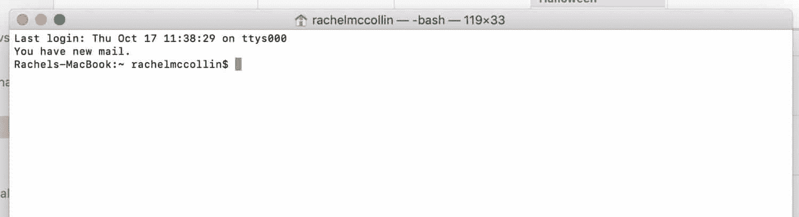
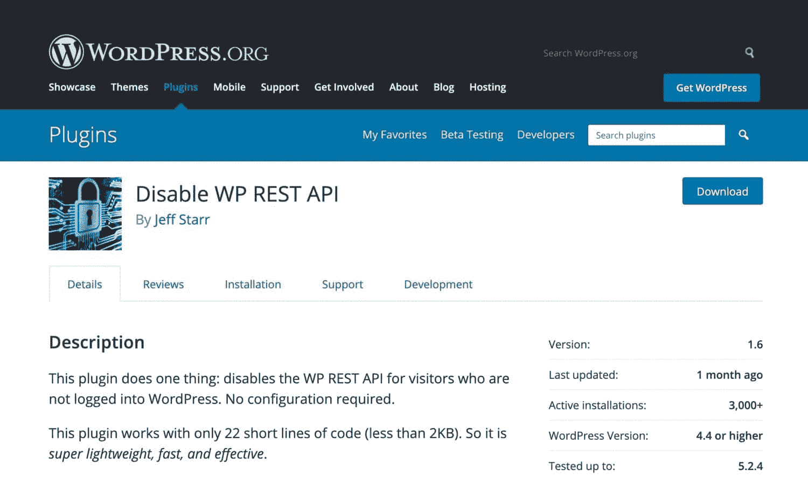
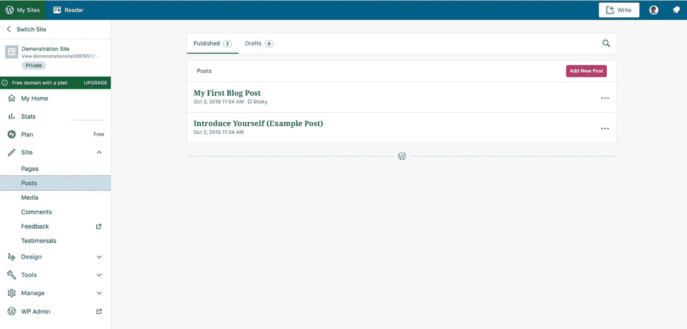
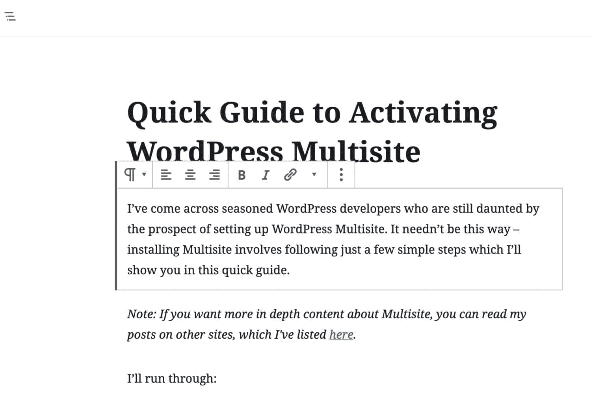
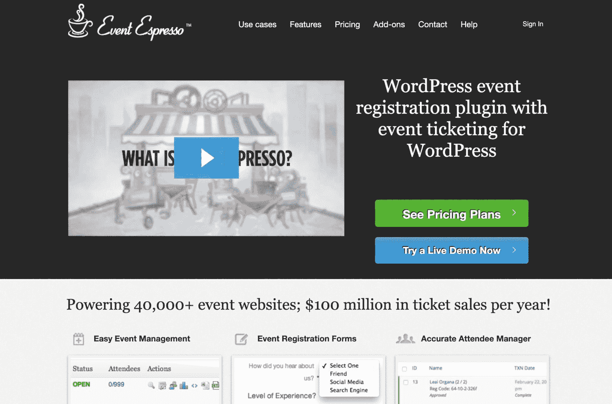

# WordPress REST API 基础完整指南

> 原文：<https://kinsta.com/blog/wordpress-rest-api/>

WordPress REST API 正在改变 WordPress。你可能还没有注意到，因为很多东西都在幕后，但是 REST API 的含义对 WordPress 的未来产生了巨大的影响，无论是在它的代码库还是它的用途方面。

如果你没有使用过 WordPress REST API，你可能想知道它是什么。因此，让我们先来看看什么是 REST API。

## 什么是 WordPress REST API？

WordPress REST API 是一个接口，[开发者](https://kinsta.com/blog/hire-wordpress-developer/)可以用它从 WordPress 安装本身之外访问 WordPress。您可以使用 JavaScript 访问它，这意味着它可以用来创建交互式网站和应用程序。

REST 代表具象状态转移，API 代表应用程序编程接口。让我们来看看每一个都意味着什么。

### 什么是应用编程接口(API)？

应用编程接口或 API 被定义为:

> "客户端和服务器之间的接口或通信协议，旨在简化客户端软件的构建。"

如果你不熟悉 API，那可能没什么帮助。更简单地说，API 是一组允许一个系统与另一个系统交互(或“接口”)的代码。如果你曾经[在你的 WordPress 站点](https://kinsta.com/blog/wordpress-google-maps/)上添加过谷歌地图，你就使用过谷歌地图 API，它允许你的 WordPress 站点与谷歌地图接口。


这些系统不需要完全分离。WordPress 已经有多个[API](https://codex.wordpress.org/WordPress_API's)，比如[插件](https://kinsta.com/best-wordpress-plugins)，设置，和[短代码](https://kinsta.com/blog/wordpress-shortcodes/)。插件和主题开发者可以用它们来和 WordPress 核心交互，让事情发生(比如创建短代码和添加设置屏幕到 WordPress admin)。

REST API 的不同之处在于，它允许 WordPress 安装之外的系统与 WordPress 交互，这就是 REST 的用武之地。

### 什么是表象状态转移(REST)？

表述性状态转移，或 REST，提供了 web 系统可以用来相互接口的标准。如果没有 REST，两个系统将无法相互理解，从而来回发送数据。

对于一个 RESTful 的应用程序来说，它必须符合五个原则:

1.  统一界面。用于访问系统中的资源的 URL 必须是统一的、一致的，并且可以通过一种常见的方法(如 GET)来访问(稍后将介绍更多)。
2.  客户端-服务器。客户端应用程序和服务器应用程序必须是分开的，因此它们可以彼此独立地开发。如果服务器端技术(如 WordPress)发生了变化，服务器端应用程序(例如一个 app)必须仍然能够通过相同的简单方法访问它。
3.  无国籍。当使用 API 发出新请求时，服务器不会改变状态。它不存储已经发出的请求。
4.  可缓存。所有的资源必须是可缓存的，以提高速度和符合 web 标准。[缓存](https://kinsta.com/blog/wordpress-caching-plugins/)可以在服务器端实现，也可以在客户端实现。
5.  分层系统。RESTful 系统允许您使用多个层来访问它，如果需要，可以将数据存储在中间服务器中。服务器无法判断最终的客户端是否直接连接到它。

所有这些约束都与 web 页面和应用程序相关，并控制着应用程序与 API 的交互方式。

### 这对 WordPress 意味着什么？

将 REST 和 API 放在一起意味着 WordPress REST API 是一组代码，旨在使其他系统与 WordPress 接口成为可能，并且它是以确保这些系统能够相互理解的方式构建的。

这意味着，例如，第三方网站或移动应用程序可以访问您的 [WordPress 数据库](https://kinsta.com/knowledgebase/wordpress-database/)，从中获取数据，并向其中添加数据。

不过，这有许多含义和用途。


## 理解 WordPress REST API

WordPress REST API 的开发是为了响应网站和应用程序开发方式的变化，以及更广泛地开放 WordPress 的需要。

### WordPress REST API 的背景

WordPress REST API [于 2016 年 12 月作为 4.7 版本核心的一部分发布](https://kinsta.com/blog/wordpress-4-7/#rest-api-additions)，但在此之前它是作为插件存在的。

它旨在支持一系列基于 WordPress 的应用程序，并将 WordPress 从一个内容管理系统转变为一个应用程序平台。

它被[WordPress.com](https://kinsta.com/blog/wordpress-com-vs-wordpress-org/)广泛使用，其基于 JavaScript 的接口使用 REST API 与 WordPress 数据库接口。它还被[古腾堡编辑接口](https://kinsta.com/blog/gutenberg-wordpress-editor/)使用，该接口在 2019 年成为 core 的一部分。

REST API 拓宽了 WordPress 的应用范围。虽然内容管理系统擅长运行复杂的网站，但应用程序平台也可以用于支持基于 web 的单页面应用程序或 spa(如果你曾经使用过 [Google docs](https://kinsta.com/blog/google-docs-to-wordpress/) ，你就使用过其中的一个)。

在这些页面中，当用户采取行动时，内容被刷新，而不是加载新的页面。因为它使用的是 [JavaScript(一种客户端语言)而不是 PHP](https://kinsta.com/blog/php-vs-javascript/) (一种服务器端语言)，所以它可以让事情发生在用户的浏览器中，而不必不断地向服务器发送请求。

### 对 WordPress 用户和开发者的启示

如果你是使用 WordPress 的用户和/或开发者，REST API 有很多含义。

对用户而言，这些包括:

*   对界面的更改，包括古腾堡编辑器。
*   WordPress 移动应用程序的变化和改进。
*   随着时间的推移，自托管的 WordPress 管理界面看起来更像 WordPress 的界面。

对于开发人员来说，还有更广泛的含义和可能性:

*   使用 REST API 创建 spa 的能力，从 WordPress 中提取数据，但看起来与 WordPress 非常不同。
*   将 WordPress 与其他前端技术和系统集成的能力。
*   如果你是一个不写 PHP 的前端开发者，你可以使用 WordPress 进行开发。
*   对于 PHP 开发人员来说，越来越需要扩展自己的技能以包括 JavaScript。
*   具体的变化，如需要建立古腾堡块，而不是在页面和帖子编辑屏幕元框。

随着时间的推移，WordPress REST API 将意味着更多的 WordPress 核心将会用 JavaScript 而不是 PHP 编写。如果你是 WordPress 开发者，这意味着你需要学习 JavaScript。

## 如何访问 WordPress REST API

你如何访问 WordPress REST API？

要访问 WP-REST API，您需要通过命令行访问您的站点。用 WordPress 来说，这叫做 [WP-CLI](https://kinsta.com/blog/wp-cli/) 。你不需要通过你的管理界面或者直接访问你网站上的代码来做这些事情。

让我们看看你是如何开始的。

### 通过 WP-CLI 访问 WP-REST

WP-CLI 是 WordPress 命令行界面。它允许你通过你电脑上的命令行界面(CLI)访问和使用 WordPress。WP-CLI 预装了所有 Kinsta 托管计划。

要访问 CLI，请在 Mac 或 Linux 上打开终端，或者在 Windows 上打开命令提示符。



Terminal on Mac


要访问远程站点，你需要 [SSH 到你的服务器](https://kinsta.com/blog/how-to-use-ssh/)通过 WP-CLI 访问(不能通过 SSH 连接？了解如何[修复 SSH“连接被拒绝”错误](https://kinsta.com/knowledgebase/ssh-connection-refused/)。

要访问本地站点，您只需从命令行使用正确的目录结构。在现场试用 REST API 之前，最好先在本地测试站点上进行试验。

您需要专门为您的站点访问 REST API，如下所示:

```
http://yoursite.com/wp-json/wp/v2
```

然后，您可以在此之后添加元素来访问某些类型的数据，稍后我们将对此进行更详细的讨论。这些元素称为端点。

### 证明

一旦你访问了你的网站，你可能需要通过认证。一些端点是公共的，不需要身份验证，而其他端点则需要。

在这里，您不是[登录到您的站点管理员【the REST API 做的事情有点不同。](https://kinsta.com/blog/wordpress-login-url/)

为了能够通过 WP-CLI 认证你的站点，你需要安装一个认证插件。对于开发安装，[基本验证](https://github.com/WP-API/Basic-Auth)插件完成了这项工作，并且操作简单。

然而，对于实时网站，您应该使用更健壮的身份验证形式，如 [JWT 身份验证](https://wordpress.org/plugins/jwt-authentication-for-wp-rest-api/)插件，它使用 JSON Web 令牌，更安全。

然后，您可以使用命令行来访问数据并包括身份验证。

下面的例子使用`curl`来测试到 WordPress 的连接。它将输出一个草稿帖子列表。

```
curl -X GET --user username:password -i http://yoursite.com/wp-json/wp/v2/posts?status=draft
```

草稿文章不是公共信息，所以你需要认证才能访问它们。但是如果你在寻找公开的数据，你不需要认证。因此，要检索已经发布的文章列表，您可以使用:

```
curl -X GET http://yoursite.com/wp-json/wp/v2/posts
```

这将获取所有已发布的帖子，因为这些帖子是公开的。


## WordPress REST API 命令概述

一旦你访问了你的站点，并且知道了如何使用身份验证(实际上你是否需要)，你将需要使用一系列命令中的一个来与你的站点交互。

您需要使用的命令是:

*   `GET`获取一个资源，比如一篇文章或者一些其他的数据。
*   向服务器添加资源，如帖子、附件或其他资源。
*   `PUT`可用于编辑或更新服务器上已有的资源。
*   `DELETE`从服务器上删除资源。小心使用！

让我们依次来看一下其中的每一项。

### 得到

`GET`命令可能是最常用的:它检索数据。下面的例子(在你成功访问你的站点后使用)将获取你的站点中所有已发布页面的列表:

```
GET http://yoursite.com/wp-json/wp/v2/posts/?status=published
```

请注意，我没有在上面一行中包含到您站点的完整路径，因为您已经使用 WP-CLI 访问过了。

检索到数据后，您可以使用它来通知您的下一步。你可以删除其中一个帖子，编辑或更新它。您可以简单地将帖子输出到您的 web 应用程序中。

假设您想获取最新的邮件。你可以用这个:

```
GET http://yoursite.com/wp-json/wp/v2/posts/?per_page=1
```

在处理帖子时，您可以使用许多参数。更多信息请参见 WordPress REST API 手册。

## 注册订阅时事通讯


### 想知道我们是怎么让流量增长超过 1000%的吗？

加入 20，000 多名获得我们每周时事通讯和内部消息的人的行列吧！

[Subscribe Now](#newsletter)

### 邮政

使用`POST`向您的站点添加新数据或资源。

例如，如果你想创建一篇文章，你可以使用一个`POST`命令开始:

```
POST http://yoursite.com/wp-json/wp/v2/posts/
```

这将创建一个新的空的草稿帖子。

然后，您可以使用一个`PUT`命令来编辑这篇文章。

使用一个`POST`命令，你还可以添加除了文章之外的其他资源，包括附件和其他文章类型。

要将页面添加到您的站点，您可以使用如下代码:

```
POST http://yoursite.com/wp-json/wp/v2/posts/pages
```

这将创建一个空页面，就像创建一篇空文章一样。

### 放

`PUT`命令允许您编辑现有的资源，包括文章。

假设你的网站上有很多草稿。您想要检查它们并更新一个以使其发布。

您可以从获取所有草稿帖子的列表开始:

```
POST http://yoursite.com/wp-json/wp/v2/posts/?status="draft"
```

系统会给你一个当前所有草稿文章的列表。您可以使用其中一个的 ID 来更改其状态:

```
PUT http://yoursite.com/wp-json/wp/v2/posts/567
```

这将访问该文章并允许您编辑它。然后，您可以使用 status 参数更改其状态:

```
{
"status" = "publish"
}
```

或者您可以在帖子中添加内容并发布:

```
{
"status" = "publish"
"content" = "content here"
}
```

服务器将返回一个`200 - OK`状态，告诉你 PUT 请求已经成功编辑了文章。

### 删除

`DELETE`命令做了您所期望的事情:它删除一个资源。默认情况下，如果你用它来删除一篇文章，它会把它放入垃圾箱，而不是永久删除它。

所以，如果你想把你刚刚创建的文章放到垃圾桶里，你可以用这个:

```
DELETE http://yoursite.com/wp-json/wp/v2/posts/567
```

但是，如果您想绕过回收站并永久删除它，您可以使用`force`参数:

厌倦了体验你的 WordPress 网站的问题？通过 Kinsta 获得最好、最快的主机支持！[查看我们的计划](https://kinsta.com/plans/?in-article-cta)

```
DELETE http://yoursite.com/wp-json/wp/v2/posts/567?force=true
```

这将永久删除帖子，并且没有撤销选项，因此应该谨慎使用。

## 何时不使用 WordPress REST API

WordPress REST API 并不总是开发网站或应用程序的正确方法。在使用它进行开发之前，您应该注意以下几点:

### 和睦相处

如果您的应用程序将在不运行 JavaScript 的设备上使用，或者由可能关闭它的用户使用，那么如果您使用 REST API，它将不会运行。

用 PHP 编写的 WordPress 站点会输出 HTML，所以不会有这个问题。不使用 JavaScript 的设备越来越少，但是如果你是专门为这些设备开发的，REST API 就不能用了。

类似地，如果您的用户可能会关闭 JavaScript，那么使用 REST API 将会导致问题。出于可访问性或安全性的原因，一些用户关闭了浏览器中的 JavaScript。

### 易接近

使用 JavaScript 开发的网站或应用程序并不总是像用 HTML 输出的那样容易访问。

这主要是因为 JavaScript 用于传递动态内容的方式可能无法很好地与屏幕阅读器一起播放，并且可能会给有视觉障碍或光敏性癫痫症的人带来问题。

使用 REST API 来访问你的 WordPress 站点，并以一种可访问的形式输出数据，这意味着你可以克服这些问题，但是在你开发它的时候，检查你的站点的可访问性是值得的。

### 搜索引擎优化

频繁刷新的单页面应用程序有时会导致 SEO 问题。这是因为当页面第一次输出时没有交付的内容可能不会被搜索引擎索引。

谷歌和其他搜索引擎正赶上这样一个事实，即许多网站现在都是 SPA 驱动的，并对它们进行适当的索引。但是对你使用 REST API 开发的任何网站进行彻底的 [SEO 审计](https://kinsta.com/blog/wordpress-seo/)是值得的。

### 如何禁用 WordPress REST API

如果您不希望应用程序能够使用 REST API 从您的站点访问数据，您可以禁用它。请记住，任何人都可以访问公共数据，不仅仅是你。

为此，你可以安装[禁用 WP REST API](https://wordpress.org/plugins/disable-wp-rest-api/) 插件。这将对没有登录到您的站点的任何人禁用 REST API。



Disable WP REST API plugin


或者，你可以添加一些代码到你的主题函数文件中，或者编写你自己的插件。最好写一个插件，因为这不是特定主题的功能。

在您的插件中，只添加两行:

```
add_filter( 'json_enabled', '__return_false' );
add_filter( 'json_jsonp_enabled', '__return_false' ); 
```

这将完全禁用您站点的 REST API。它可能会对你的管理界面产生连锁反应，所以一旦你添加了它，就要确保一切正常。

## 使用 WordPress REST API 的真实应用程序

REST API 为 WordPress 的未来展示了一些令人兴奋的可能性。下面是一些使用 WordPress REST API 创建 spa 或将 WordPress 链接到其他站点和技术的应用程序和站点的例子。

### WordPress.com



WordPress.com interface


WordPress.com 管理屏幕完全是使用 REST API 构建的，它提供了一个 SPA，用户可以与之交互来管理他们的站点。

这有助于界面和服务器之间的动态通信，并产生一个用户友好的界面，WordPress.org 可能会及时模仿。

### 块编辑器(古腾堡)



The Gutenberg editor


同样在 WordPress 管理界面中，但这次也是在自托管的 WordPress 中，Gutenberg 块编辑器利用 REST API 与数据库通信并创建块。

对于使用 Gutenberg 编辑器的文章类型，它们必须启用 REST API。这意味着，如果您注册了一个[自定义帖子类型](https://kinsta.com/blog/wordpress-custom-post-types/)并使用 Gutenberg，您将需要添加以下行来启用该帖子类型的块编辑器:

```
"show_in_rest" = true;
```

### 活动浓缩咖啡



Event Espresso


Event Espresso 是一个 WordPress 插件，让用户组织和宣传活动。它利用了 REST API，因此用户可以从 WordPress 之外访问其中的数据。这意味着您可以构建移动应用或 spa 来管理您的活动。

### 你的嘴


UsTwo


UsTwo 是一家数字机构，其网站是使用 REST API 作为单页面应用程序构建的。这结合了使用 React 构建的前端和由 WordPress 驱动的后端(建议阅读:[你启动和运行一个成功的 WordPress 代理的指南](https://kinsta.com/blog/wordpress-agency/))。

他们单个页面的内容是模块化的，其结构不同于标准的 WordPress 页面。为了做到这一点，他们使用了一个定制的页面生成器插件，允许他们的团队向网站添加模块化内容。

### 今日美国


USA Today


[《今日美国》](http://usatoday.com/)的网站使用 WordPress REST API 与网站中现有的系统和模块进行了整合。

REST API 允许使用 JSON 将网站内容推送到其他渠道，如 Facebook Instant Articles 和 Apple News。他们还为自己的体育版块编写了一个在线社交游戏，使用 JavaScript 构建。

[The WordPress REST API opens up plenty of opportunities within the WordPress ecosystem. Learn how to get the most from it with this in-depth guide! 🔀⚙️Click to Tweet](https://twitter.com/intent/tweet?url=https%3A%2F%2Fkinsta.com%2Fblog%2Fwordpress-rest-api%2F&via=kinsta&text=The+WordPress+REST+API+opens+up+plenty+of+opportunities+within+the+WordPress+ecosystem.+Learn+how+to+get+the+most+from+it+with+this+in-depth+guide%21+%F0%9F%94%80%E2%9A%99%EF%B8%8F&hashtags=webdev%2Cjavascript)

## 摘要

WordPress REST API 为 WordPress 用户和开发者带来了一些激动人心的挑战，但也带来了有趣的机遇。这是 WordPress 的[未来，很可能从根本上改变我们开发 WordPress 的方式和我们使用它的方式。](https://kinsta.com/blog/why-use-wordpress/)

你对 REST API 有什么看法？你在你的一些项目中使用过它吗？在下面的评论区告诉我们吧！

* * *

让你所有的[应用程序](https://kinsta.com/application-hosting/)、[数据库](https://kinsta.com/database-hosting/)和 [WordPress 网站](https://kinsta.com/wordpress-hosting/)在线并在一个屋檐下。我们功能丰富的高性能云平台包括:

*   在 MyKinsta 仪表盘中轻松设置和管理
*   24/7 专家支持
*   最好的谷歌云平台硬件和网络，由 Kubernetes 提供最大的可扩展性
*   面向速度和安全性的企业级 Cloudflare 集成
*   全球受众覆盖全球多达 35 个数据中心和 275 多个 pop

在第一个月使用托管的[应用程序或托管](https://kinsta.com/application-hosting/)的[数据库，您可以享受 20 美元的优惠，亲自测试一下。探索我们的](https://kinsta.com/database-hosting/)[计划](https://kinsta.com/plans/)或[与销售人员交谈](https://kinsta.com/contact-us/)以找到最适合您的方式。