# 锁定恶意威胁的最佳 WordPress 安全插件

> 原文：<https://kinsta.com/blog/wordpress-security-plugins/>

仅仅是最初的网站投资就足以从一开始就保护你的网站。黑客、恶意软件、后门攻击和 SEO 垃圾邮件只是等待利用您的服务器、访问者数据和网站基础设施的一些挥之不去的威胁。

这些安全威胁危及未来的利润、客户信任和整个网站的稳定性。这就是为什么我们列出了一个最好的 WordPress 安全插件列表，来锁定所有潜在的入侵者。

在网站上使用这些安全插件就像买保险和安装警报系统一样。这项令人兴奋的新投资可能需要一大笔首付、检查费和抵押贷款。对于如此高价值的投资，您不想尽最大努力保护它吗？这正是我们在这篇文章中要探索的！

## WordPress 安全插件 101

默认情况下，WordPress core 有一些安全措施。但是它可以通过一个著名的安全插件不断改进。顶级 WordPress 安全插件提供:

*   主动安全监控
*   文件扫描
*   [恶意软件扫描](https://kinsta.com/blog/scan-wordpress-for-malware/)
*   黑名单监控
*   安全强化
*   黑客攻击后的操作
*   [防火墙](https://kinsta.com/blog/what-is-a-firewall/)
*   暴力攻击保护
*   检测到安全威胁时的通知

一些 WordPress 安全插件扔进了更多的未来，但是上面列出的是突出的。

## 您的首要任务:安全托管

网站的安全性取决于它运行的基础。这就是为什么在寻找最好的 WordPress 安全插件之前，选择一个已经具备[安全措施](https://kinsta.com/secure-wordpress-hosting/)的 [WordPress 托管平台](https://kinsta.com/wordpress-hosting/)是很重要的，比如 Kinsta(它为所有用户提供[企业级安全增强](https://kinsta.com/cloudflare-integration/))。

这些保护措施中的许多都是在服务器级别完成的，在不损害站点性能的情况下会更加有效。你不必花时间在插件中摆弄一堆你可能甚至不理解的安全设置。

Secure WordPress Hosting

以下是 Kinsta 为 WordPress 管理的所有托管计划提供的一些安全功能。

*   Kinsta 检测 [DDoS 攻击](https://kinsta.com/blog/what-is-a-ddos-attack/)，监控正常运行时间，并自动封禁一分钟内超过六次失败登录尝试的 IPs。
*   当直接访问你的 WordPress 站点时，只支持加密的 SFTP 和 SSH 连接(不支持 FTP)(这里是 [FTP 和 SFTP](https://kinsta.com/knowledgebase/ftp-vs-sftp/) 的区别)。
*   硬件防火墙和额外的主动和被动安全措施到位，以防止访问您的数据。
*   我们的`open_basedir`限制也不允许 PHP 在容易受到恶意脚本攻击的标准目录中执行。
*   Kinsta 在谷歌云平台(GCP)上使用 Linux 容器(LXC)，为每个账户和每个独立的 WordPress 站点提供完全的隔离。这是一种比竞争对手提供的方法更安全的方法。GCP 还采用静态数据加密。
*   Kinsta [只运行 PHP](https://kinsta.com/blog/php-versions/) 支持的版本。不支持的 PHP 版本是危险的，因为它们不再有安全更新，并暴露于未打补丁的安全漏洞。[定期更新](https://kinsta.com/knowledgebase/how-to-update-php-in-wordpress/)是你最好的选择。
*   Kinsta 为其服务器上的所有网站提供备份，自动创建两周的备份，供网站所有者在需要时恢复。
*   双因素身份验证在登录过程中增加了另一层安全性。
*   所有新的 Kinsta 安装都需要生成一个可靠的密码才能继续。
*   没有什么是 100%防黑客的，这就是为什么 Kinsta 为所有客户提供免费的黑客补丁。

值得注意的是，许多安全插件会导致性能问题，因为它们总是在运行。这就是为什么 Kinsta [禁止](https://kinsta.com/knowledgebase/banned-plugins/)一些(不是全部)安全插件的原因。Kinsta 还利用谷歌云平台的负载平衡器，这意味着在某些情况下，特定安全插件的 IP 阻止功能不会像预期的那样工作。

如果你是 Kinsta 的客户，我们强烈建议你使用像 [Cloudflare](https://kinsta.com/knowledgebase/install-cloudflare/) 或 [Sucuri](https://sucuri.net/) 这样的解决方案，尤其是当你需要额外的保护或帮助来减少 bot 和/或代理流量的时候。Sucuri 以其快速帮助[缓解 DDoS 攻击](https://kinsta.com/blog/ddos-attack/)的能力而闻名。如果使用 Cloudflare，您还可以配置[推荐的防火墙设置](https://kinsta.com/blog/cloudflare-settings-wordpress/#firewall)。

然而，并不是每个主机都有像 Kinsta 一样严密的安全措施，这也是你能从最好的 WordPress 安全插件中获益的时候。

[Keep the bad guys at bay with help from these powerful security plugins 🔒Click to Tweet](https://twitter.com/intent/tweet?url=https%3A%2F%2Fkinsta.com%2Fblog%2Fwordpress-security-plugins%2F&via=kinsta&text=Keep+the+bad+guys+at+bay+with+help+from+these+powerful+security+plugins+%F0%9F%94%92&hashtags=SiteSecurity%2CMalware)

## 2022 年最佳 WordPress 安全插件

如果你很着急，可以随意点击下面的链接来测试安全插件，然后自己做决定。如果你想看我们的深入分析，请继续阅读！

### 全方位网站保护和主动监控的最佳插件

*   [Sucuri 安全–审计、恶意软件扫描和安全强化](https://kinsta.com/blog/wordpress-security-plugins/#1-sucuri-security--auditing-malware-scanner-and-security-hardening)
*   [iThemes 安全](https://kinsta.com/blog/wordpress-security-plugins/#2-ithemes-security)
*   [文字围栏安全](https://kinsta.com/blog/wordpress-security-plugins/#3-wordfence-security)
*   [多合一 WP 安全&防火墙](https://kinsta.com/blog/wordpress-security-plugins/#4-all-in-one-wp-security--firewall)
*   [防弹安全](https://kinsta.com/blog/wordpress-security-plugins/#5-bulletproof-security)
*   [补丁堆栈](https://patchstack.com/)

### 扫描和阻止恶意软件、病毒和可疑 IP 的最佳方式

*   [SecuPress](https://kinsta.com/blog/wordpress-security-plugins/#6-secupress)
*   [wps can–WordPress 安全扫描仪](https://kinsta.com/blog/wordpress-security-plugins/#7-wpscan--wordpress-security-scanner)
*   [安全忍者](https://kinsta.com/blog/wordpress-security-plugins/#8-security-ninja)
*   [MalCare Security](https://kinsta.com/blog/wordpress-security-plugins/#9-malcare-security)
*   [安全&由 CleanTalk 进行恶意软件扫描](https://kinsta.com/blog/wordpress-security-plugins/#10-security--malware-scan-by-cleantalk)

### 最适合垃圾邮件和 Bot 防范

*   [喷气背包](https://kinsta.com/blog/wordpress-security-plugins/#11-jetpack)
*   [阿斯特拉网络安全公司](https://kinsta.com/blog/wordpress-security-plugins/#12-astra-security)
*   [阻止垃圾邮件发送者安全](https://kinsta.com/blog/wordpress-security-plugins/#13-stop-spammers-security)
*   [泰坦反垃圾邮件和安全](https://kinsta.com/blog/wordpress-security-plugins/#14-titan-antispam-and-security)

### 最适合对入侵者隐藏文件

*   [隐藏我的 WP](https://kinsta.com/blog/wordpress-security-plugins/#15-hide-my-wp)
*   [WP 隐藏&安全增强器](https://kinsta.com/blog/wordpress-security-plugins/#16-wp-hide-and-security-enhancer)

### 最适合身份验证和登录安全性

*   [WP 故障 2 禁止](https://kinsta.com/blog/wordpress-security-plugins/#17-wp-fail2ban)
*   [miniOrange 的谷歌认证器](https://kinsta.com/blog/wordpress-security-plugins/#18-minioranges-google-authenticator--wordpress-two-factor-authentication)
*   [WP Cerber Security](https://kinsta.com/blog/wordpress-security-plugins/#19-wp-cerber-security)

### 最适合站点文件备份

*   [VaultPress](https://kinsta.com/blog/wordpress-security-plugins/#20-vaultpress)

### 黑客修复的最佳插件

*   [屏蔽安全](https://kinsta.com/blog/wordpress-security-plugins/#21-shield-security)
*   [反恶意软件安全和强力防火墙](https://kinsta.com/blog/wordpress-security-plugins/#22-antimalware-security-and-bruteforce-firewall)

### 最适合运行安全日志

*   [WP 活动日志](https://kinsta.com/blog/wordpress-security-plugins/#23-wp-activity-log)

### 最适合激活 SSL(安全套接字层)

*   [非常简单的 SSL](https://kinsta.com/blog/wordpress-security-plugins/#24-really-simple-ssl)

大多数有用的安全插件都有价格标签，但也有一些免费提供有限的功能。

我们将讨论定价，但更重要的是理解每个插件将为你做什么。最终，这一切都是为了找出让坏人远离你的投资的最佳方式——有时，这意味着花一点钱。

## 全方位网站保护和主动监控的最佳插件

### 1.Sucuri 安全–审计、恶意软件扫描和安全强化

Sucuri 安全插件 T1 提供免费和付费版本 T3，然而大多数网站应该可以使用免费插件。例如，网站[防火墙](https://kinsta.com/blog/what-is-a-firewall/)要求你为 Sucuri 计划付费，但并不是每个网站管理员都觉得他们需要那种类型的安全。

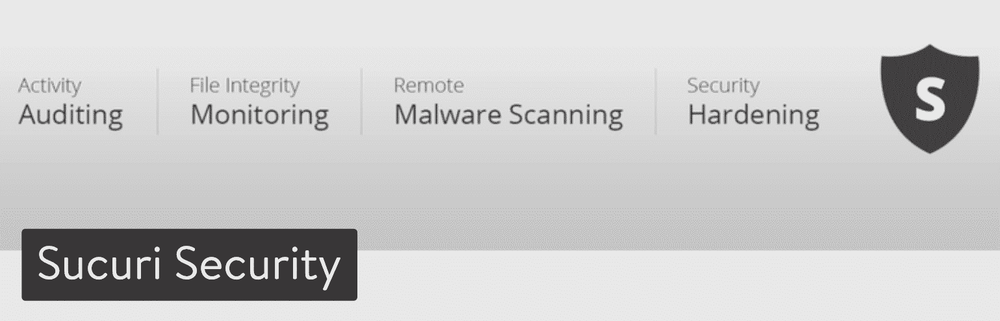

Sucuri Security WordPress plugin

至于免费功能，该插件带有安全活动审计，以查看插件如何保护您的网站。

它具有[文件完整性监控](https://kinsta.com/blog/file-integrity-monitoring/)、阻止列表监控、安全通知和安全强化。高级计划开辟了客户服务渠道和更频繁的扫描。例如，您可能希望每 12 小时完成一次扫描。

#### 定价

如果你升级后不喜欢，Sucuri 提供免费计划和 30 天退款保证。

以下是保费计划:

*   基本防火墙:每月 9.99 美元
*   专业防火墙:每月 19.98 美元
*   基本平台(清理、扫描、防火墙和 CDN):每月 199.99 美元
*   专业平台:每月 299.99 美元
*   商业平台:每月 499.99 美元

#### 使 Sucuri Security 成为最佳选择的特性:

*   它提供了多种不同的 SSL 证书。你得为这些付费，但是它们在包装里是可得到的。
*   客户服务以 24/7/365 聊天、电子邮件和票务系统的形式提供。
*   当您的网站出现问题时，您会收到即时通知。
*   [高级 DDoS 防护](https://kinsta.com/blog/ddos-attack/)可通过某些计划获得。
*   如果您不想支付任何费用，您仍然可以获得用于黑名单监控、恶意软件扫描、文件完整性监控和安全强化的有价值的工具。
*   高级平台提供清理后报告、移除硬件的 SLA、黑名单监控、黑客补丁等等。

延伸阅读:[如何在你的 WordPress 网站上设置 Sucuri 防火墙(WAF)](https://kinsta.com/blog/sucuri-firewall/)

### 2.iThemes 安全

iThemes 安全插件(之前被称为更好的 WP 安全)是[保护你的网站](https://kinsta.com/help/htpasswd/)的最令人印象深刻的方式之一，有 30 多种产品可以防止黑客和不必要的入侵者。

它非常注重识别插件漏洞、过时软件和弱密码，使得它成为所有类型 WordPress 站点的无所不包的安全插件。

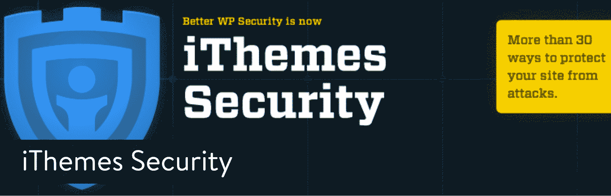

iThemes Security WordPress plugin

尽管免费版包含了一些基本的安全功能，我们还是强烈建议升级到 iThemes Security Pro。这提供了有票支持，一年的插件更新，以及对两个网站的支持。如果你想保护更多的网站，你可以升级到更昂贵的计划。

至于 pro 版本中的主要功能，iThemes Security Pro 提供了[强密码执行](https://kinsta.com/blog/dashlane-vs-lastpass/)，锁定不良用户，数据库备份和双因素身份验证。

这些只是用这个 WordPress 安全插件保护你的站点的几种方法。您可以激活 30 个完整的安全措施，使 iThemes 安全临一个伟大的价值。

#### 定价

iThemes Security Pro 安全套件每年起价 80 美元。如果你需要获得更多的网站，价格就会上涨。还有 30 天退款保证。

以下是 iThemes Security Pro 计划:

*   博客作者:每年 80 美元
*   自由职业者:每年 127 美元
*   黄金:每年 199 美元
*   插件套件:每年 499 美元

使用我们的谷歌云防火墙和黑客修复保证，让您高枕无忧。免费试用金斯塔。

#### 使 iThemes 安全成为最佳选择的功能:

*   安全插件提供了文件更改检测，这是至关重要的，因为大多数网站管理员不会注意到文件被篡改。
*   通过使用 [Google reCAPTCHA](https://kinsta.com/blog/wordpress-captcha/) 集成和双因素身份验证，为您的登录添加一层额外的保护。
*   该插件将你的 WordPress 核心文件与当前版本的 WordPress 进行比较，帮助你了解这些文件中是否有恶意内容。
*   更新你的 [WordPress salts](https://kinsta.com/knowledgebase/wordpress-salts/) 和密钥，为你的认证密钥增加一层额外的复杂性。
*   你可以设置一个“离开模式”,当你不经常更新你的站点，并且想对所有用户完全锁定你的 WordPress dashboard。
*   其他基本功能，如 [404 错误](https://kinsta.com/blog/error-404-not-found/)检测、强力保护和强密码执行。
*   您可以禁止用户并防止暴力攻击。
*   该插件提供部分网站备份和 SSL 的实施。

### 3.Wordfence 安全性

Wordfence Security 是最受欢迎的 WordPress 安全插件之一，理由很充分。该 gem 将简单性与强大的保护工具结合在一起，例如强大的登录安全功能和安全事件恢复工具。Wordfence 的主要优势之一是，你可以洞察整体流量趋势和黑客攻击企图。

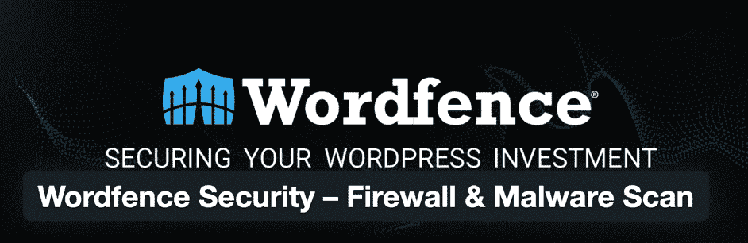

Wordfence Security WordPress plugin

Wordfence 是一个更令人印象深刻的免费安全解决方案，从防火墙块到保护免受暴力攻击，应有尽有。

#### 定价

有一个免费版本和一个每年 99 美元起的[付费选项](https://www.wordfence.com/)。

插件创建者还降低了开发者的成本，当你注册多个站点密钥时，提供了很大的折扣。例如，如果您购买 15 个以上的许可证，您将获得 25%的折扣或每个许可证 74.25 美元。

如果你正在开发多个网站并且想要保护它们，那么考虑 Wordfence 是值得的。

以下是整个折扣结构:

*   1 个站点许可证:每年 99 美元
*   2-4 个站点许可证:每年 89.10 美元(10%折扣)
*   5-9 个站点许可证:84.15 美元(八五折)
*   10-14 站点许可证:79.20 美元(20%折扣)
*   15+站点许可证:74.25 美元(七五折)

#### 使 WordFence 安全成为最佳选择的功能:

*   免费版对于小型网站来说已经足够强大了。
*   开发者可以在注册多个站点密钥时节省大量资金。
*   它有一个完整的防火墙套件，带有用于国家阻止、手动阻止、暴力保护、实时威胁防御和 web 应用程序防火墙的工具。
*   该插件的扫描部分可以抵御恶意软件、实时威胁和垃圾邮件。它扫描你所有的文件中的恶意软件，而不仅仅是 WordPress 文件。
*   该插件通过查看谷歌抓取活动、登录和注销、[人类访客](https://kinsta.com/knowledgebase/count-visits/)和机器人等内容来监控实时流量。
*   你可以使用一些独特的工具，比如用你的[手机](https://kinsta.com/blog/how-to-know-if-your-phone-is-hacked/)登录和审计你的网站。
*   [垃圾评论](https://kinsta.com/blog/wordpress-spam-comments/)过滤器消除了安装单独插件的需要。
*   它监控你的插件，让你知道它们是否已经从 WordPress 插件库中移除(通常是因为不安全或者[被黑](https://kinsta.com/blog/wordpress-hacked/))，不再更新，或者已经被放弃。

### 4.WP 安全和防火墙一体化

作为功能最丰富的免费安全插件之一，[多合一 WP 安全&防火墙](https://wordpress.org/plugins/all-in-one-wp-security-and-firewall/)提供了一个直观的界面和体面的客户支持，没有价格标签。

这是一个高度可视化的安全插件，用图表来解释初学者的度量标准，如安全强度，以及需要做些什么来使你的网站更强大。

All In One WP Security & Firewall plugin

这些功能分为三类:基本、中级和高级。因此，如果你是一个更高级的开发者，你仍然可以使用这个插件。

这个插件主要通过保护你的用户账户，阻止强行登陆，增强用户注册的安全性。数据库和文件安全性也被打包到插件中。

#### 定价

自由的

#### 使 WP 安全和防火墙一体化成为最佳选择的功能:

*   WordPress 安全插件有一个阻止列表工具，你可以设置特定的要求来阻止用户。
*   可以备份 **[。htaccess](https://kinsta.com/knowledgebase/wordpress-htaccess-file/) 和**。 [wp-config 文件](https://kinsta.com/blog/wp-config-php/)T7】。如果出现问题，还有一个工具可以恢复它们。****
*   这个插件显示了一个图表来说明你的网站有多强，另一个图表指出了你的网站的特定问题区域。对于普通用户来说，这是可视化网站安全性的最好功能之一。
*   有一个紧急情况下的临时锁定按钮。
*   您可以导出和导入某些安全功能。
*   [使用 iframes 阻止其他网站](https://kinsta.com/blog/how-to-block-a-website-on-chrome/)显示您的网站内容。
*   您可以对机器人和其他入侵者隐藏网站信息。
*   该插件是免费的，没有任何追加销售。

### 5.防弹安全

防弹安全插件正在积极开发、更新，似乎包含了比市场上大多数其他安全插件更多的功能。您将获得隔离、电子邮件警报、反垃圾邮件、自动恢复等功能。

作为一个全方位的 WordPress 安全插件，它工作得相当好，特别是考虑到它处理数据库备份和登录安全。

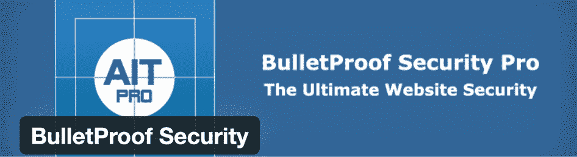

BulletProof Security WordPress plugin

我们建议您先试用免费插件，因为它提供了以下工具:

*   登录安全和监控。
*   数据库备份和恢复。
*   恶意软件扫描程序。
*   反垃圾邮件和反黑客工具。
*   安全日志。
*   隐藏插件文件夹。
*   [维护模式](https://kinsta.com/blog/wordpress-maintenance-mode/)。
*   完整的安装向导。

它不是最适合初学者的 WordPress 安全插件。尽管如此，它还是为那些想要利用独特设置和特性的高级开发人员做了工作，比如反漏洞保护和 FTP 文件锁定。它也有一个安装向导自动修复功能，以帮助它变得更加容易。

#### 定价

防弹安全有免费版和高级版。付费选项的售价为一次性支付 69.95 美元，并提供 30 天的退款保证。

#### 使防弹安全成为最佳选择的特性:

*   它拥有市场上一些独特的高级安全工具，具有 BPS Pro ARQ 入侵检测和预防系统(ARQ IDPS)加密解决方案和[预定 cron](https://kinsta.com/knowledgebase/wordpress-cron-job/) cURL 扫描、文件夹锁定等功能。
*   免费版为普通网站提供了足够的功能。
*   数据库备份在免费版本中提供。
*   您可以隐藏单个插件文件夹。
*   维护模式功能是大多数其他安全插件所没有的。
*   安全和 HTTP 错误日志记录密切关注漏洞。
*   该插件会强迫你设置强密码。
*   当主题或插件更新可用时，您会收到提醒。

## 扫描和阻止恶意软件、病毒和可疑 IP 的最佳方式

### 6.安全出版社

SecuPress 是一个可靠的全方位安全选择，但我们最喜欢它是因为它专注于阻止恶意软件和病毒等威胁。它是由胡里奥·波蒂尔开发的，他是 WP Media 最初的联合创始人之一，你可能认识他，因为他开发了 WP Rocket 和 Imagify。

SecuPress WordPress security plugin

如果你想要一个有很棒的 UI 和易于使用的界面的安全插件，SecuPress 是一个可以考虑的选择。免费版本的特点是反暴力登录，封锁的 IPs 和防火墙。

它还包括保护您的安全密钥和阻止机器人(这通常需要您在其他安全插件中付费)。恶意软件扫描寻找可疑活动，甚至在必要时阻止入侵者。

如果你想要更多的功能，他们的高级版本包括警报和通知，双因素认证，IP 地理定位阻止，PHP 恶意软件扫描和 PDF 报告。

#### 定价

有一个免费版本适合标准的网站安全，特别是恶意软件扫描和 bot 阻止。高级版的起价是每个网站每年 69.99 美元。如果你选择 5 个、10 个、25 个甚至 200 个站点，每个站点的价格会大幅下降。

以下是 SecuPress 提供的附加产品和服务的价格:

*   专业配置:120 美元
*   恶意软件清除:360 美元
*   WordPress 安全培训:449 美元
*   安全维护:39 美元

#### 使 SecuPress 成为最佳选择的特性:

*   SecuPress 中的 UI 是最好的之一！这使得它非常容易使用，即使是初学者。
*   该插件进行 35 次安全检查。
*   高级版增加了很多价值，包括安全警报、全面的恶意软件扫描和通过地理定位阻止国家的选项。
*   它包括改变你的 [WordPress 登录网址](https://kinsta.com/blog/wordpress-login-url/)的能力，这样机器人就找不到它了。
*   它帮助您检测易受攻击的主题和插件，或者被篡改以包含恶意代码的主题和插件。
*   检测和阻止可疑的 IP。
*   防止暴力登录。
*   运行可以保存为 pdf 或打印的安全报告。

### 7.wps can——WordPress 安全扫描仪

WPScan WordPress 安全插件采用了不同的安全方法。它使用由专门的安全专家和社区每天更新的手动管理的漏洞数据库。该数据库由 Automattic 赞助，包括超过 21，000 个已知的安全漏洞。

多亏了这个数据库，WPScan 插件可以扫描你的 [WordPress 核心](https://kinsta.com/knowledgebase/wordpress-core/)版本、[插件](https://kinsta.com/best-wordpress-plugins)和[主题](https://kinsta.com/best-wordpress-themes)中已知的安全漏洞。

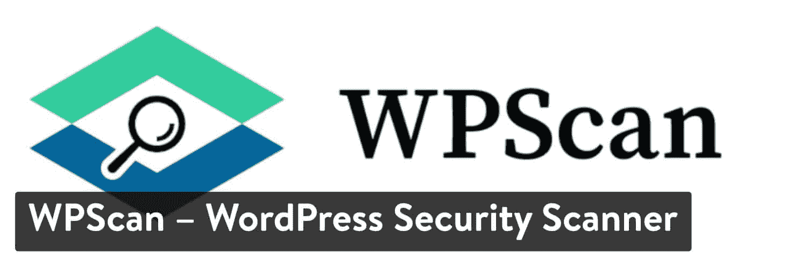

WPScan WordPress plugin

此外，该插件还有其他安全检查，如扫描暴露的调试日志文件、备份的**wp-config.php**文件、使用弱密码的用户等等。WPScan 有一个免费的 API 计划，应该适合大多数 WordPress 网站。然而，它也为可能需要更多 API 调用的用户提供付费计划。

如果您正在寻找恶意软件、IP 和文件扫描程序，这是您的最佳选择。

#### 定价

有一个永远免费的计划，每天运行多达 25 个 API 请求。对于拥有 22 个插件的 WordPress 网站来说，这应该足够了。随着您添加更多的 API 请求，收费计划的价格也会上涨。

以下是保费计划:

*   起薪:每月 5 美元
*   专业:每月 25 美元
*   企业:自定义定价

#### 使 WPScan 成为最佳选择的功能:

*   它使用自己的不断更新的漏洞数据库。
*   运行常规扫描来检查核心文件、 **debug.log** 文件、数据库文件等。
*   发现漏洞时，可以选择发送电子邮件通知。
*   您可以安排扫描在特定时间运行。
*   该插件让你知道弱密码，并敦促你改变它们。
*   查看和下载报告。
*   接收风险分数，以更好地了解您站点的漏洞。
*   当黑客试图攻击您的网站时，使用安全扫描程序查看黑客看到了什么。
*   发现的每个漏洞都提供了链接和参考，指导您如何修复问题。
*   他们甚至有一个奖励程序，用于向他们的漏洞数据库提交数据。

### 8.安全忍者

[安全忍者](https://wordpress.org/plugins/security-ninja/)是 WordPress 安全领域的老手。它最初是 CodeCanyon 上销售的第一批安全插件之一(有四个可用的插件)，在 2016 年转向免费增值模式。

附加软件被抛弃，只有两个版本——免费版和高级版。主模块(唯一一个免费的)执行 50 多项安全测试，从检查文件中的恶意软件和 MySQL 权限到各种 PHP 设置。

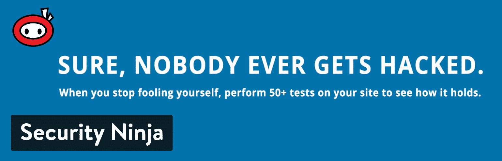

Security Ninja WordPress plugin

Security Ninja 还会对所有用户密码进行强力检查，以清除那些使用弱密码(如“12345”或“password”)的帐户

这有助于对用户进行安全教育。它包括一个自动黑客修复工具，但对于那些想了解发生了什么的人来说，每个测试都有详细的解释，包括手动修复安全问题的代码。

如果你不喜欢插件搞乱你的网站，安全忍者提供了一个很好的替代通常的“点击这里修复它”的方法。您只需查看漏洞扫描程序的警告，然后选择要对这些问题采取的措施。

#### 定价

计划包括:

*   自由的
*   起步价:每年 49.99 美元
*   另外:每年 149.97 美元
*   教授:每年 199.99 美元
*   代理:每年 249.99 美元

你也可以选择短期月计划(每月 8.99 美元起)或终身套餐(起步计划从一次性支付 139.99 美元起)

#### 使 Security Ninja 成为最佳选择的功能:

*   安全测试模块(可在免费版本中获得)在您的站点上执行 50 多个安全测试。
*   不懂技术？没问题，自动修复模块可以解决任何检测到的问题。
*   扫描 WordPress 核心文件，将它们与来自 WordPress.org 的安全的最新副本进行比较，以确保文件的完整性。
*   扫描插件和主题，搜索可疑代码和恶意软件。
*   利用大量已知不良 IP 列表，自动阻止它们。
*   记录你的 WordPress 站点上的所有事件，从用户登录到设置被改变。
*   您可以安排定期扫描。
*   优化您的数据库以提高网站速度。
*   运行不同的测试，如调试、数据库配置和 WP 选项测试。
*   高级版的测试和扫描更加深入，包括对 X-XSS 保护、根文件夹中不需要的文件和严格传输安全的测试。

### 9.不当安全

[MalCare 安全插件](https://wordpress.org/plugins/malcare-security/)提供了一个基于云的恶意软件扫描器，它会考虑您的整个网站，以识别从插件问题到危险 IP 的一切。僵尸防护很方便，但它更擅长于快速查找恶意软件。

这个插件有一个一键式删除工具，这样你就可以在搜索引擎发现任何问题之前清理你的网站。此外，智能扫描过程利用来自成千上万个网站的数据来确定可能会影响您的网站。

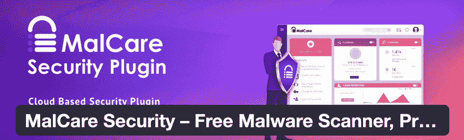

The MalCare Security plugin

MalCare Security 还会在您的站点关闭时向您发送通知，让您有足够的时间来应对攻击。最后，MalCare Security 在保持轻量级方面做得很好，这样就不会减慢您的网站，因为在恶意软件扫描领域，庞大的插件多少有些标准。

#### 定价

有一个免费的恶意软件扫描计划，插件防火墙，登录保护，和机器人检测。

[高级计划](https://www.malcare.com/)提供额外的工具，如即时恶意软件删除、实时防火墙更新和查看被黑文件的能力。这是定价:

*   基本:每年 99 美元
*   另外:每年 149 美元
*   教授:每年 299 美元

定价包括对一个网站的支持；随着您添加更多站点，计划的价格也会上涨。他们还提供附加功能，如实时备份(每年每个站点 100 美元)、每小时备份和扫描(每年每个站点 500 美元)、可视化回归测试(每年每个站点 100 美元)，以及额外的[高级暂存环境](https://kinsta.com/add-ons/?plan=visits-business1&interval=month#h-premium-staging-environments)(每月 20 美元/每个环境按比例分配)。

### 使恶意软件成为最佳选择的功能

*   一种基于云的恶意软件扫描系统，可分析整个网站。
*   僵尸防护不仅可以识别僵尸，还可以帮助您阻止它们。
*   一个智能插件监控系统和防火墙，以防止入侵。
*   登录保护在登录页面打击黑客，消除不寻常的流量来源，并让您阻止来自特定国家的 IP。
*   一键恶意软件扫描按钮。
*   验证码技术，以加强您的登录页面。
*   一键式网站强化，使用行业内的最佳实践，并在几秒钟内在您的网站上实施。
*   正常运行时间监控。
*   防范独特的威胁，如 favicon 病毒攻击、cookie 窃取和谷歌黑名单攻击。
*   选项，以查看有关黑客的信息，并立即消除问题。

### 10.CleanTalk 的安全和恶意软件扫描

[安全&clean talk](https://wordpress.org/plugins/security-malware-firewall/)的恶意软件扫描是另一个出色的解决方案，用于运行全面的恶意软件检查并识别可疑的 IP 和僵尸程序。CleanTalk 是一种使用云安全来自动阻止网站威胁的服务，并为网站所有者提供他们需要的信息，以改善未来的安全措施。

它的插件是免费的，但你必须注册高级云安全服务才能利用大多数功能。简而言之，我们喜欢 CleanTalk 的插件，因为它可以持续监视不良 IP 地址和恶意软件。

云连接也有助于将大多数安全活动从服务器上移除，从而保持相当高的网站速度。

The Security & Malware Scan plugin from CleanTalk

这个插件非常容易理解，显示了一个可能引起麻烦的文件列表。之后，你需要有编码经验才能打开那些文件，看看哪里出了问题。然而，CleanTalk 允许付费用户发送文件，之后，CleanTalk 客户支持代表会对其进行分析和清理。

它不像一些竞争对手那样是一个自动化系统，但你不能击败扫描仪的效率和准确性。

您还可以获得一些其他功能，用于阻止暴力攻击、检查出站链接、激活双因素身份验证等。

#### 定价

他们说该插件是免费的，但你必须注册 CleanTalk 云安全服务才能使用任何功能。

以下是 CleanTalk 的云安全服务的一些定价:

*   1 个网站:每年 49 美元
*   3 个网站:每年 24 美元
*   5 个网站:每年 36 美元
*   10 个网站:每年 63 美元
*   20 个网站:每年 117 美元

价格上涨到每年 180 美元，以支持 40 个网站，或者你可以选择每月 18 美元的无限网站计划。

#### 使 CleanTalk 的安全和恶意软件扫描成为最佳选择的功能

*   它使用基于云的恶意软件扫描器，确保你不浪费服务器资源。
*   除了恶意软件功能，还有反病毒扫描。
*   所有客户都会收到一个自动安全防火墙。
*   您会收到每日报告、审计日志和实时流量监控。
*   该插件检查所有出站链接。
*   扫描会自动运行(每天)，并在云上存储几个月。
*   非编码人员可以向 CleanTalk 团队发送易受攻击的文件来修复问题。
*   该插件有一些登录安全功能，如暴力保护，登录尝试日志，并阻止来自某些国家或 IP 地址的登录尝试。
*   每当出现威胁时，管理员都会收到电子邮件通知。

## 最适合垃圾邮件和 Bot 防范

### 11.喷气背包

大多数使用 WordPress 的人都熟悉 [Jetpack](https://wordpress.org/plugins/jetpack/) ，这主要是因为这个插件有如此多的功能，但也因为这个插件是由来自 WordPress.com 的[人制作的。Jetpack](https://kinsta.com/blog/wordpress-com-vs-wordpress-org/) 中的[功能如此之多，值得一探究竟。Jetpack 充满了增强你的社交媒体和](https://kinsta.com/knowledgebase/wordpress-jetpack/)[网站速度的模块，但真正的安全优势来自垃圾邮件和僵尸防范。](https://kinsta.com/blog/website-speed-test/)

## 注册订阅时事通讯

### 想知道我们是怎么让流量增长超过 1000%的吗？

加入 20，000 多名获得我们每周时事通讯和内部消息的人的行列吧！

[Subscribe Now](#newsletter)

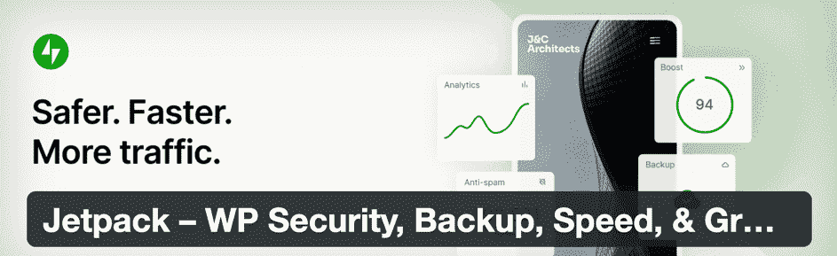

Jetpack WordPress security plugin

Jetpack 还包含了一些其他的安全工具，这使得它对于那些想要省钱并依赖于一个有信誉的解决方案的人来说是一个很有吸引力的插件。例如，保护模块是免费的，可以阻止可疑活动的发生。

Jetpack 的基本安全功能还支持暴力攻击保护和允许列表。

至于垃圾邮件防护，它是自动查找和删除垃圾邮件评论的最佳选择。反垃圾邮件集成了 WooCommerce，以及所有的电子商务商店。

#### 定价

Jetpack 免费提供其著名的垃圾邮件防护(由 Akismet 提供支持)。但是，大多数其他安全功能需要订购。

你可以每月花大约 9 美元获得站点备份，但实时恶意软件扫描和表单垃圾邮件防护工具需要 24.92 美元的计划。好消息是 Jetpack 经常有 50%的折扣。

值得一提的是，暴力攻击预防也附带了免费插件。

#### 使 Jetpack 成为最佳选择的功能:

*   免费计划为一个小网站提供了相当的安全性。您可以升级到价格合理的高级计划，并获得全面支持。
*   垃圾邮件防护是你能找到的最好的，看看 Akismet 如何在你不知情的情况下存档数百个讨厌的垃圾邮件评论。
*   高级计划将插件变成了一个套件，具有备份和安全扫描等好处。
*   插件更新完全通过 Jetpack 管理。
*   Jetpack 是一个不需要其他插件的插件。例如，它有电子邮件营销、社交媒体、网站定制和优化的功能。
*   暴力攻击保护附带免费计划。
*   它在 WordPress 主仪表板上提供网站统计数据。
*   免费内容交付网络(CDN)有助于加快您的网站。
*   您还可以监控停机时间。

### 12.阿斯特拉安全公司

Astra 安全套件是你的 WordPress 网站的安全包。有了 Astra，你不用担心恶意软件、SQLi、XSS、评论垃圾、蛮力，或者 100+其他威胁，这意味着你可以摆脱其他安全插件&让 Astra 照顾这一切。此外，Astra 的超级直观的仪表盘没有一百个让你不知所措的按钮。

我们特别喜欢 AstraWeb Security 的垃圾邮件和 bot 保护功能。它优先阻止不良机器人以及假冒的搜索引擎机器人。

它还可以处理多种形式的垃圾邮件，自动阻止所有垃圾邮件，同时最大限度地减少垃圾评论，纠正 SEO 垃圾邮件，等等。

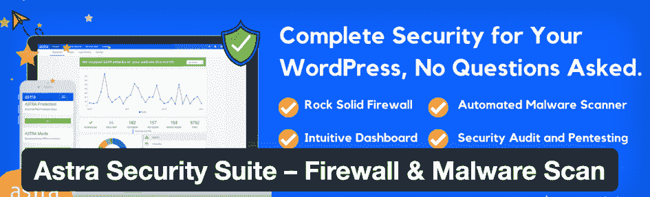

Astra Web Security for WordPress

除了打击垃圾邮件和僵尸程序，Astra 还会定期进行扫描，并在黑客攻击发生后进行修复。Astra 涵盖了一长串潜在的攻击，包括暴力攻击、SEO 垃圾邮件黑客、SQL 注入、WP 后门黑客和货币化黑客。

#### 定价

这不是一个免费插件。虽然您可以将它安装在您的网站上，但在您注册以下定价计划之前，它不会执行任何操作:

*   利:起价每月 19 美元
*   高级:每月 39 美元
*   商务:每月 119 美元

#### 使 Astra Web Security 成为最佳选择的特性:

*   Astra Security Suite 是作为 WordPress 插件安装的，不需要更改 DNS 设置。
*   它们提供即时的恶意软件清理，这是一个坚如磐石的防火墙，可以阻止 SQLi、XSS、代码注入、恶意机器人、暴力、SEO 垃圾邮件和 100 多种其他网络攻击。
*   垃圾邮件防护涵盖了从 SEO 垃圾邮件到评论垃圾邮件的所有内容。
*   该插件提供一致的机器人跟踪。
*   Astra 每天发送电子邮件报告，报告内容包括已阻止的攻击数量、每小时登录次数等。
*   恶意文件上传会被自动阻止。
*   完整的安全审计，包括你的 WordPress 网站的商业错误逻辑。
*   直观的仪表板记录所有攻击，并让您选择阻止或允许列表国家，IP 范围，网址，等等。
*   您可以访问一个奖金管理平台，在这里您可以为黑客提供一种安全可靠的方式来报告他们在您的网站上发现的任何漏洞。Astra 的工程师验证每一个报告的问题。

### 13.阻止垃圾邮件发送者安全性

[Stop Spammers Security](https://wordpress.org/plugins/stop-spammer-registrations-plugin/) 是最大限度减少垃圾邮件的 WordPress 安全插件之一，它不仅仅是针对垃圾评论的！该插件通过插件、表单、评论等来识别和阻止垃圾邮件。

您可以在运行插件之前配置特定的阻止机制，例如阻止某些国家、用户或一般的可疑行为。

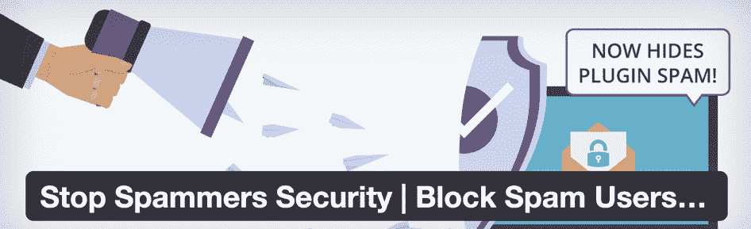

The Stop Spammer Security plugin

该插件背后的想法是根据您网站的特定需求创建一个自定义的垃圾邮件阻止公式。这意味着您可以从各种设置中进行选择，并关闭您不需要的设置。

为了增强这种垃圾邮件保护，Stop Spammers Security 将其核心功能与登录安全措施相结合，如显示验证码的选项、打开会员专用模式或每当用户试图登录网站时要求访问。

#### 定价

基本功能(如阻止可疑行为、垃圾邮件、垃圾邮件评论和国家)在免费版本中可用。您可以使用高级版本升级更多功能[。它从每年 29 美元开始，随着您添加更多许可证，价格会不断上涨。](https://stopspammers.io/downloads/stop-spammers-premium/)

高级版独有的功能包括服务器级防火墙保护、暴力登录安全、日志导出、联系人 Form 7 保护等。

#### 使阻止垃圾邮件安全成为最佳选择的功能

*   该插件具有定位可疑行为和僵尸工具、隔离威胁和通知网站所有者的工具。
*   阻止您发现可疑活动更频繁的国家。
*   最大限度地减少所有类型的网站垃圾邮件，从通过表格进入的类型到评论垃圾邮件。
*   阻止网址缩写、一次性电子邮件和其他隐藏麻烦用户身份的元素。
*   您可以阻止或允许网站上的特定用户名、电子邮件和 IP 地址。
*   强迫一些用户请求访问您的网站。
*   该插件有一个在你的登录页面放置验证码的选项。
*   有一个仅限成员的模式，以确保只有那些经您批准的用户才能访问内容。
*   您可以在高级版中激活高级防火墙。
*   通知控制、导入设置、导出和主题页面都带有高级版本。
*   当您注册高级插件时，您会收到一个内置的联系表格和联系表格 7 保护。

### 14.泰坦反垃圾邮件和安全

[Titan 反垃圾邮件和安全性](https://wordpress.org/plugins/anti-spam/)汇集了一套工具，用于在扫描恶意软件等安全威胁的同时减少垃圾邮件。每当有可疑的东西试图访问你的网站时，这个插件就会运行定期的审计和报告。

这些工具与防火墙规则配合使用，以指定您希望在网站上阻止的内容。该界面对于初学者来说足够简单易懂，就像仪表板是如何将每个特性分成选项卡一样。

因此，网站所有者只需点击一个按钮，就可以轻松访问防火墙、网站检查器和错误日志等元素。

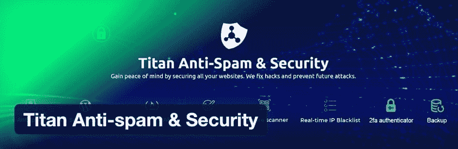

Titan Anti-spam and Security

我们尤其喜欢反垃圾邮件统计数据，它显示了过去一周所有垃圾邮件攻击的图表。这有助于你了解插件是否在工作，并显示你的网站是否已经成为垃圾邮件的目标。

从技术上来说，你可以将 Titan 反垃圾邮件和安全作为一个包罗万象的安全插件，但它之所以大放异彩，主要是因为它的自我学习垃圾邮件机制。简而言之，您不会在评论线程上发布恶意内容，这些内容可能会给用户带来麻烦。

### 定价

有一个免费版本，带有标准的垃圾邮件评论拦截功能。[高级版](https://titansitescanner.com)(具有所有额外的非垃圾邮件功能)有几个定价方案:

*   1 个站点:每年 55 美元
*   3 个站点:每年 159 美元
*   6 个站点:每年 319 美元

### 使 Titan 反垃圾邮件和安全成为最佳选择的功能

*   该插件不需要验证码，因此界面更加简洁。
*   它提供了一个自我学习的垃圾邮件减少工具，在后台运行，并不断改进其算法，以检测特定网站上的垃圾邮件。
*   所有垃圾评论会立即从你的网站上删除，并被标记为垃圾。
*   可以打开防火墙规则并运行恶意软件扫描。
*   您可以实时阻止 IP 地址。
*   攻击日志存储所有可疑活动的实例，并允许您下载日志与其他人共享或放入您自己的文件中。
*   根据主机名、IP、用户名、推荐人等制定高级阻止规则。
*   安全扫描程序使用超过 1000 个签名，高级版最多可使用 6000 个签名。
*   你可以调整扫描速度。
*   如果您希望每月或每周运行一次扫描，扫描计划是可行的。
*   所有用户都可以直接从仪表板中删除不需要的文件。
*   该插件需要一个强密码，甚至隐藏作者登录区，以保护您的登录模块。你也可以隐藏 WordPress 版本。

## 最适合对入侵者隐藏文件

### 15.隐藏我的 WP

隐藏我的 WP 是 WordPress 的一个流行的安全插件，它隐藏了你使用 WordPress 作为 CMS 的事实，防止攻击者、垃圾邮件发送者和主题检测器，如 Wappalyzer 或 BuiltWith。

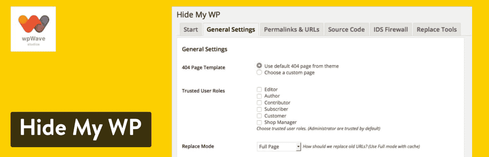

Hide My WP plugin

这个安全插件捆绑了立体艺术入侵检测(IDS)来阻止实时安全攻击，如 [SQL 注入](https://kinsta.com/blog/sql-injection/)、XSS 等。它还使用一个可信的网络，在你安装插件的时候就开始清除未知的攻击者。

最后，这个插件是重命名和隐藏插件文件夹、WordPress 文件和登录 URL 的重要工具，让你的网站更接近在线隐身。

### 定价

Hide My WP 是一个高级 WordPress 安全插件，你可以在 CodeCanyon 上花 24 美元买到。这是一次性费用，但持续支持费用高达 17 美元(再加上 12 个月的支持和更新)。这个插件没有直接销售网站，但是 WPWave 开发者有一个信息网站。

注意:这个插件的某些特性可能在 Kinsta 上不工作。

#### 使隐藏我的 WP 成为最佳选择的功能:

*   隐藏主题名称，插件，改变永久链接，隐藏 wp-admin，登录网址等等。
*   阻止对 PHP 文件的直接访问，清除 WP 类名，并禁用目录列表。
*   通知任何潜在的恶意行为，包括攻击者的详细信息，包括用户名、IP 地址、日期等。
*   包括一个“信任网络”,可以自动阻止来自不良源 IP 地址的流量。
*   易于使用:从预置的设置中进行选择，实现一键式部署。
*   兼容 multisite、apache、Nginx、IIS、高级主题和其他安全插件。

### 16.可湿性粉剂隐藏和安全增强剂

WP Hide and Security Enhancer 利用你的 WordPress 文件隐藏插件、主题、登录页面和其他核心文件，快速简便地防止入侵者猜出你的网站身份，并防止恶意使用你的任何文件。

为了方便用户，WP Hide 插件使用 URL 重写方法来隐藏和处理你的文件，而不是物理地改变目录。这一切都是在你安装插件后自动完成的，允许你隐藏网站最重要的部分，继续你的一天。

使用我们的谷歌云防火墙和黑客修复保证，让您高枕无忧。[免费试用 kin sta](https://hubs.ly/H0pklC_0)。

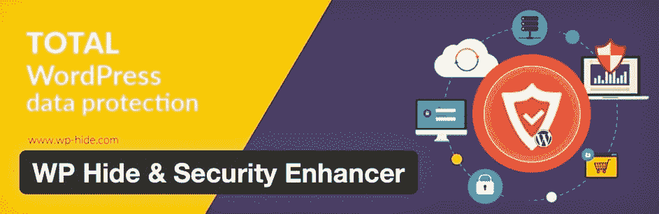

WP Hide and Security Enhancer

WP Hide and Security Enhancer 独一无二的另一个原因是，它隐藏并阻止了默认的 WordPress 文件，而不是简单地改变 slugs(仍然让黑客可以访问这些文件)。

最后，开发者已经确保消除对其他插件、主题或核心文件的屏蔽，这些插件、主题或核心文件可能会妨碍你的网站的功能。对于那些对隐藏 WordPress URLs、凭证和默认设置感兴趣的人来说，这是最好的 WordPress 安全插件之一。

### 定价

WP Hide 提供了一个免费插件，具有文件屏蔽、URL 重写，甚至自定义登录 URL 功能。开发者表示，基本的 WordPress 站点使用免费版本应该没有问题。

高级升级主要是如果你在 WordPress 上使用复杂的插件或主题，或者如果你使用的服务器类型不是 IIS 或 Apache。

如果从免费版本升级，价格如下:

*   单一网站:每年 39 美元
*   开发商:每年 130 美元

## 最适合身份验证和登录安全性

### 17.WP 失败 2 班

WP fail2ban 有一个主要特性，但也是一个相当重要的特性:防止暴力攻击。该插件采用了一种不同的方法，许多人认为这种方法比市场上的一些安全套件插件更有效。

WP fail2ban 使用 LOG_AUTH 将所有登录尝试记录到 Syslog 中，无论其性质或成功与否。你可以选择实施软禁令或硬禁令，这不同于更传统的只选择一种的方法。

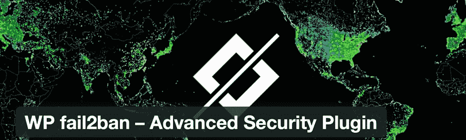

WP fail2ban security plugin

关于 WP fail2ban 插件的配置没有太多需要学习的。你所要做的就是安装它，让它发挥它的魔力。

开发人员添加了新功能来补充其暴力攻击保护，如多站点支持、过滤使用空用户名的登录尝试，以及 Cloudflare 的配置工具。这个插件是一个突出的，因为用户一致报告说它工作得完美无缺。

#### 定价

免费。

#### 让 WP fail2ban 成为绝佳选择的特性:

*   选择硬块或软块。
*   与 CloudFlare 和代理服务器集成。
*   记录评论以防止垃圾邮件或恶意评论。
*   该插件还记录关于垃圾邮件、pingbacks 和用户枚举的信息。
*   您可以选择创建一个短代码，在用户有机会登录之前立即阻止用户。
*   使用 API 与您最喜欢的插件集成，或者考虑 Gravity Forms 和 Contact Form 7 的附加组件之一。
*   有一个仪表板小部件可以查看哪些威胁被定期阻止。
*   在多站点配置中使用插件。

### 18.miniOrange 的谷歌认证器——WordPress 双因素认证

大多数具有独立安全功能的插件安装起来没有多大意义。这是因为你通常可以使用像 iThemes Security Pro 这样的插件，并获得该功能以及许多其他功能。

然而，[双因素认证](https://kinsta.com/blog/wordpress-two-factor-authentication/)是一个不同的故事，因为似乎许多安全套件不包括它。因此，用这样的插件来加强你的登录安全可能是有意义的。

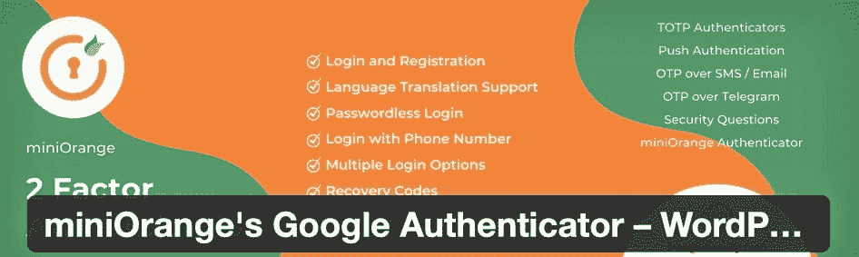

Google Authenticator WordPress plugin

miniOrange 的 [Google Authenticator](https://wordpress.org/plugins/miniorange-2-factor-authentication/) 插件为你的登录模块增加了第二层安全，这是至关重要的，因为大多数黑客攻击都是在登录时发生的。

除了您的常规密码之外，该插件还会向您的手机发送推送通知或其他形式的认证，例如使用 [QR 码](https://kinsta.com/blog/create-qr-code/)或询问安全问题。

这样，你的登录就变得不那么容易被渗透了，因为第二层很可能是你只知道或随身携带的东西(比如你的手机)。

除了选择身份验证的类型之外，另一个很酷的特性是让您指定哪种类型的用户角色应该通过身份验证。因此，您可以允许管理员更容易地进入，但您可能会要求作者或其他用户通过双因素过程。

#### 定价

基本的双因素身份认证工具作为免费插件提供。

更多高级功能和服务，如无限制站点/用户、更多身份验证方法、备份登录方法和无密码登录，要求您使用以下计划之一进行升级:

*   高级精简版:每年 99 美元
*   保费:每年 199 美元
*   企业:起价为每年 59 美元(但随着用户的增加而增加)

#### 使 Google Authenticator 成为最佳选择的特性:

*   这是你能得到的消除登录区域漏洞的最接近的东西。
*   您可以选择最适合您的双因素身份验证方法。
*   您可以选择哪些用户类型需要通过身份验证过程。
*   该插件有一个短代码，用于自定义登录页面。
*   在高级版本中，您可以询问安全问题或发送电子邮件进行验证。
*   可以通过 Whatsapp、电报、短信或电子邮件激活一次性密码。
*   您可以更改您的密码策略以要求强密码或选择无密码登录。
*   高级安全功能可用，如文件保护、监控、国家封锁、IP 封锁、数据库备份和浏览器封锁。
*   插件开发者出售几个插件，用于记忆设备、会话管理、页面限制、基于属性的重定向等等。

### 19.WP Cerber 安全

WP Cerber Security 将各种安全功能捆绑到一个插件中，包括反垃圾邮件、恶意软件扫描和登录保护。它对于全面的安全性是可行的，但是它的突出目的包括登录保护。

这是因为您可以使用几个元素来完全阻止登录页面入侵者，包括 Google reCAPTCHA 选项、注册监控、不良用户跟踪、登录尝试限制和暴力攻击阻止。

您甚至可以选择激活双因素身份验证，在登录前向应用程序或电子邮件发送验证码。

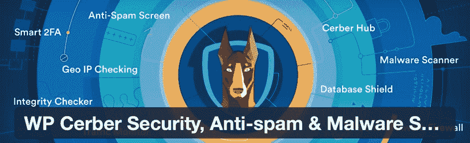

WP Cerber Security

除了所有的登录安全之外，我们喜欢 WP Cerber 为 WordPress 和 WooCommerce 网站提供反垃圾邮件工具，可以保护注册表单、密码丢失表单和评论区。

您可以与 Cloudflare 集成，导出所有安全数据，并计划定期扫描以识别恶意软件和其他威胁。不仅如此，但 WP Cerber 安全删除受影响的文件和恢复过去的版本，以恢复您的网站正常。

#### 定价

[WP Cerber Security 有三个计划](https://wpcerber.com/#pricing)，其中一个是自动垃圾邮件防护和登录安全的免费插件。

*   免费:每月 0 美元
*   单人:每年 99 美元
*   5 超值套装:每年 399 美元

他们按季度或年度计划出售插件，年度计划(如上所列)会给你带来最好的长期价格。高级升级为您提供自动恶意软件扫描、专业支持、云防护、分层垃圾邮件防护等。

#### 使 WP Cerber Security 成为最佳选择的功能

*   免费版允许你限制登录尝试或根据 IP 地址识别限制。
*   完全通过 IP 地址限制登录。
*   生成自定义登录 URL。
*   运行反垃圾邮件引擎来阻止联系人表单和评论垃圾邮件。
*   您可以运行双因素身份验证，以便在登录网站之前将验证码发送到设备。
*   该插件的安全扫描器检查所有的核心网站文件。
*   所有用户实例都会被记录，然后插件会识别可疑行为和僵尸程序。
*   只要发现文件更改或异常活动，您就会收到电子邮件通知。
*   它阻止所有未登录网站的用户进入 WordPress dashboard(**WP-admin**)。
*   您可以阻止单个用户或打开“仅授权用户”模式。

## 最适合站点文件备份

### 20.VaultPress

重要的是不要忘记 [VaultPress](https://wordpress.org/plugins/vaultpress/) ，因为它的工作方式类似于 iThemes Security Pro 和 Sucuri Scanner 等插件。

每日和实时备份是操作的基础，有一个漂亮的日历视图，用于指定您希望何时完成备份。您还可以通过快速点击鼠标来完成站点恢复。

此外，还原文件记录在仪表板中，其中几个被存储，以便您可以选择您想要的。VaultPress 关于备份的最大优点是它们是增量备份，这对性能非常有利。

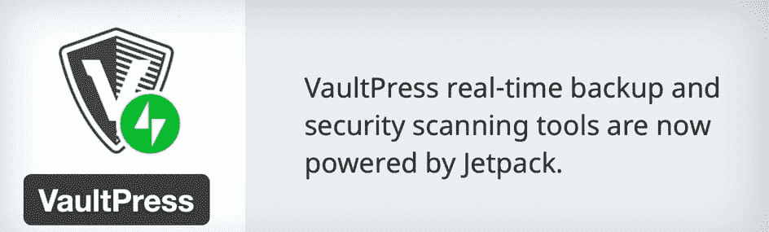

VaultPress WordPress security plugin

主要的安全工具监控您网站上的可疑活动，通过选项卡查看您的历史记录，并查看哪些威胁已被处理或忽略。您还可以从一个干净的仪表板方便地查看统计数据和管理您的整个安全细节。

#### 定价

你需要为任何类型的保护支付费用，但是这些计划从每月 9.95 美元开始，并且通常在第一年有折扣。

其他计划包括每月 24.95 美元的安全套餐和每月 99.95 美元的完整套餐。这些计划包括所有备份功能和元素，如恶意软件扫描和垃圾邮件防护。

**注意:** VaultPress 是 Automattic 的一款产品，最初是单独销售的，但现在它作为一个附加计划与 Jetpack 打包在一起。VaultPress 仍然作为一个独立的插件运行，但它是由 Jetpack“驱动”的。所以，你可以从 WordPress 库安装 VaultPress，但是要在 Jetpack 网站上付费。这令人困惑，但由于它是一个独立的插件，我们觉得 VaultPress 仍然是 Jetpack 之外的一个独立插件。

#### 使 VaultPress 成为最佳选择的特性:

*   这个价格比大多数其他高级 WordPress 安全插件都要好，尤其是备份。
*   仪表板看起来很干净，对所有用户来说都很容易理解。
*   您可以使用日历进行实时或手动备份。
*   “统计”选项卡显示您的站点最受欢迎的访问时间的信息，同时还显示在这些时间发生了什么威胁。
*   您可以联系 VaultPress 的专家来帮助您完成站点恢复和备份等任务。
*   VaultPress 备份了从评论到帖子和插件到主题的所有内容。
*   只需点击一个按钮，您就可以将文件恢复到更早的时间。
*   下载备份文件，并保存在任何你想要的地方。
*   初始计划为您提供 10GB 的备份存储以及 30 天的活动日志和归档。

使用我们的谷歌云防火墙和黑客修复保证，让您高枕无忧。免费试用金斯塔。

如果你想了解更多关于最好的备份插件，看看我们的其他指南: [4 个最好的增量备份插件(节省空间和速度)](https://kinsta.com/blog/wordpress-backup-plugins/)

## 黑客修复的最佳插件

### 21.屏蔽安全

Shield Security 的首要作用是承担你日益增加的网站安全负担，这意味着在我们最需要的时候激活一个具有黑客修复功能的智能保护工具。

我们都时间紧迫，所以我们需要更智能的防御和安全插件，知道如何应对威胁，而不会用电子邮件打扰你。

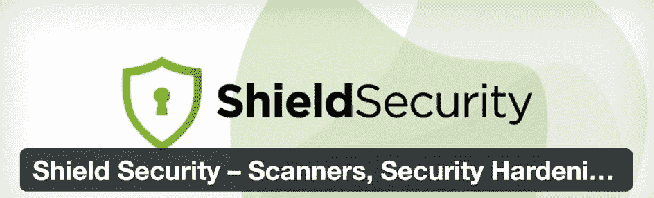

Shield Security WordPress plugin

适合初学者和高级用户，盾牌安全开始扫描和保护您的网站从那一刻起，你激活它。所有选项都有完整的文档记录，因此您可以在闲暇时进一步研究站点安全性。

#### 定价

神盾局安全的核心是永远免费。需要更深入保护和 24 小时手把手支持的专业人士和企业可以考虑升级:

*   Shield Pro:每月 12 美元
*   Shield Pro Agency:每月 60 美元
*   Shield 客户支持:每年额外 59 美元

Shield Security 背后的使命是“不让一个网站掉队”——其目标是让每个网站都可以访问专业级安全，而不仅仅是少数富人。这就是为什么这么多的功能都在免费版本中。

Pro 提供更频繁运行的扫描、用户密码策略、更大的审计跟踪、对 WooCommerce 的支持、流量监控以及使其用户的安全策略更顺畅的功能。

#### 使 Shield Security 成为最佳选择的特性:

*   它是少数几个限制某些用户访问其设置的安全插件之一。
*   该插件可以抵御入侵、黑客和机器人。
*   检测后，Shield 会自动实施治疗，如修复黑客和阻止不良机器人。
*   它具有智能保护功能，在后台不知疲倦地工作，没有恼人的通知。
*   它是唯一一个免费提供三种双因素身份验证的安全插件，并且可以从中进行选择。
*   专业版提供 6 倍更强大的扫描功能，可检测您站点所有区域的问题。
*   您可以为基本表单添加安全性，如注册表单或密码重置模块。
*   该插件还具有暴力保护、防火墙安全规则和受限的管理员安全访问。

### 22.反恶意软件安全和强力防火墙

[反恶意软件安全和强力防火墙](https://wordpress.org/plugins/gotmls/)运行完整的网站扫描来阻止各种威胁。主要特性限制了后门脚本和对数据库的注入等问题，同时也有助于修复对站点文件造成损坏的问题。

这是自动发生的，所以网站所有者不必担心消除威胁。

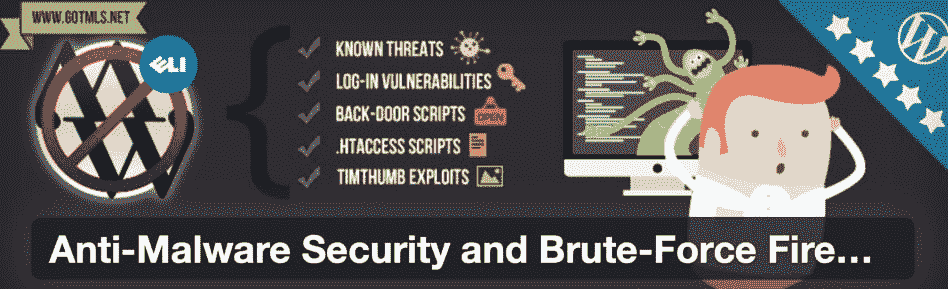

Anti-Malware Security and Brute-force Firewall

最强大的黑客修补功能出现在高级版本中，可以选择修补 **wp-login** 问题并恢复核心 WordPress 文件的完整性。

这是一个相对简单的插件，可以查看 SQL 报告，点击按钮扫描恶意软件，以及查看所有隔离的威胁。

#### 定价

有一个免费的插件，包括彻底的网站扫描和自动删除数据库脚本和注射之类的东西。您还可以在免费插件中访问防火墙阻止和恶意软件检测。

高级功能可用于[向开发者](https://gotmls.net)的可选捐赠。这开启了诸如高级修补、核心文件检查和已知威胁的新定义等功能。

#### 使反恶意软件安全和强力防火墙成为最佳选择的功能

*   该插件可以抵御所有新的威胁，来到你的网站。
*   运行自动或手动安全扫描来识别数据库注入和后门脚本。
*   防火墙有特定的工具来保护您网站上的某些插件。
*   当脚本有易受攻击的版本时，您可以升级脚本。
*   在遭受 DDoS 或暴力攻击后，您可以选择修补网站的某些区域。
*   该插件检查所有核心文件的问题。
*   下载 WordPress 站点新的常见威胁的定义。

## 最适合运行安全日志

### 23.WP 活动日志

[WP 活动日志](https://wordpress.org/plugins/wp-security-audit-log/)生成您网站上所有进程的日志，以便在有人试图入侵您的网站时检查您的用户是否高效，并在出现问题时进行故障排除。

这也是管理你的站点和访问用户的一个很好的解决方案。所有日志记录都是实时发生的，允许您随时关注发生的事情。

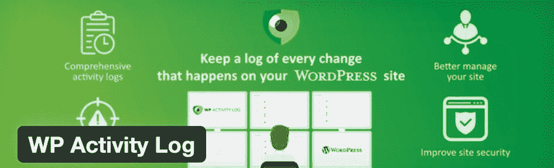

WP Activity Log

这个插件记录了网站的几个部分，包括标签、类别、小部件、个人资料和用户的修改。您可以看到日志中记录的所有页面、帖子和自定义帖子类型的更改。

这包括从元数据到自定义字段和 URL 到标题的所有内容。WP 活动日志是让工作人员继续工作的一种方式。不过，它也是一个重要的插件，用于判断是否有任何内部或外部用户计划篡改你的网站文件。

#### 定价

有一个免费插件包含了绝大多数的活动日志功能。[高级版](https://wpactivitylog.com/pricing/?utm_source=wordpress.org&utm_medium=referral&utm_campaign=WSAL&utm_content=plugin+repos+description)的扩展功能有以下定价方案:

*   入门:每年 99 美元
*   专业:每年 139 美元
*   商务:每年 149 美元
*   企业:每年 199 美元

#### 使 WP 活动日志成为最佳选择的特性

*   该插件主动跟踪和记录您网站上的所有活动，重点是帖子和页面。
*   它记录标签、类别以及页面和帖子标签可能发生的其他更改。
*   您可以看到用户的修改，如个人资料的变化，活动，以及对主题和插件的调整。
*   查看小工具、菜单、WordPress 核心文件、你的多站点网络、表单、数据库、登录页面等的其他变化。
*   查看有关这些更改的信息，如数据、时间、源 IP 地址和负责的用户。
*   该插件的高级版本提供了查看哪些用户登录到您的网站的选项。你可以看到他们都在做什么。
*   您可以接收有关问题的消息，并通过一个按钮引导用户。
*   保存、存档和发送活动日志。
*   使用过滤器和文本搜索日志。
*   在其他软件中镜像你的日志。

## 最适合激活 SSL(安全套接字层)

### 24.非常简单的 SSL

真正简单的 SSL 为你将你的 WordPress 站点迁移到 SSL 环境提供了基础，将它连接到 SSL 证书(它保护在线连接，主要是保护交易和个人数据安全，防止黑客攻击电子商务网站)。

Really Simple SSL

该插件的工作原理是在你的主机环境中打开 SSL。之后，它会自动为您的网站创建一个 SSL 证书，从 Let's Encrypt 中提取。然后，您只需单击一下就可以打开 SSL。

启用 SSL 证书需要一些技术知识(或者主机为您完成这项工作)。这就是为什么真正简单的 SSL 插件对初学者来说很方便。

#### 定价

核心插件是免费的，它提供了快速检测 SSL 环境的工具，如果你还没有证书的话，它可以生成一个证书。

[高级插件](https://really-simple-ssl.com/pro/)有以下价位:

*   个人:每年 29 美元
*   专业:每年 69 美元
*   机构:每年 169 美元

高级计划增加了额外的功能，如预加载列表，混合内容固定器和安全标题。

#### 使真正简单的 SSL 成为最佳选择的特性

*   它有一个一键式 SSL 证书安装程序。
*   您可以快速扫描您的网站，查看它是否已经有任何安全连接。
*   打开 SSL 后，扫描也有帮助，因为它会检查 SSL 是否在所有页面上正常工作。
*   您可以打开 HTTP 严格传输安全性。
*   高级版扫描并修复混合内容。
*   在几秒钟内实现高级安全标题。
*   你会在你的 WordPress 仪表盘上收到反馈和安全提示。

黑客、恶意软件、后门攻击以及更多可能利用你的网站的东西。👀用这个指南阻止他们💪 点击推文

## 哪个 WordPress 安全插件最适合你？

现在我们已经浏览了最好的 WordPress 安全插件，看看下面我们的主要建议。这让你更容易选择一个或两个插件，而不用测试每一个。记住，根据你的 WordPress 主机已经提供的内容，安全插件可能是不需要的(比如 Kinsta)。

这些建议集中在你可能选择一个安全插件而不是另一个的特定情况。

*   主动监控和全方位安全:Sucuri 安全，iThemes 安全，Wordfence 安全，所有在一个 WP 安全和防火墙，或防弹安全。
*   扫描并阻止恶意软件、病毒和可疑 IP:secu press、WPScan、Security Ninja、MalCare Security 或 CleanTalk 的安全和恶意软件扫描。
*   对于垃圾邮件和 bot 预防:Jetpack，阿斯特拉网络安全，停止垃圾邮件安全，或泰坦反垃圾邮件。
*   对入侵者隐藏文件:隐藏我的 WP 或 WP 隐藏&安全增强器。
*   对于认证和登录安全:WP fail2ban，miniOrange 的 Google Authenticator，或者 WP Cerber Security。
*   对于站点文件备份:VaultPress。
*   黑客修复:盾牌安全，或反恶意软件安全和蛮力防火墙。
*   运行安全日志:WP 活动日志。
*   用于激活 SSL(安全套接字层):非常简单的 SSL。

除了安装一个插件，你可以采取进一步的措施来提高你的网站的安全性。例如， [Lockr 的异地密钥管理](https://www.lockr.io/)(这是一项高级服务)解决方案可以防范关键站点漏洞，并帮助保护您的数据。WordPress 提供了简单的集成。

当然，我们不可能涵盖所有的插件。这些只是我们根据用户体验推荐的。如果你认为有一个应该被列入这个列表，请在下面的评论中告诉我们。

如果你正在运营一个电子商务网站，请阅读我们关于[电子商务欺诈防范](https://kinsta.com/blog/ecommerce-fraud-prevention/)的指南。

Kinsta 提供无长期合同、协助迁移和 30 天退款保证的计划。[查看我们的计划](https://kinsta.com/plans/)或[与销售人员](https://kinsta.com/contact-us/)交谈，找到适合您的计划。

* * *

让你所有的[应用程序](https://kinsta.com/application-hosting/)、[数据库](https://kinsta.com/database-hosting/)和 [WordPress 网站](https://kinsta.com/wordpress-hosting/)在线并在一个屋檐下。我们功能丰富的高性能云平台包括:

*   在 MyKinsta 仪表盘中轻松设置和管理
*   24/7 专家支持
*   最好的谷歌云平台硬件和网络，由 Kubernetes 提供最大的可扩展性
*   面向速度和安全性的企业级 Cloudflare 集成
*   全球受众覆盖全球多达 35 个数据中心和 275 多个 pop

在第一个月使用托管的[应用程序或托管](https://kinsta.com/application-hosting/)的[数据库，您可以享受 20 美元的优惠，亲自测试一下。探索我们的](https://kinsta.com/database-hosting/)[计划](https://kinsta.com/plans/)或[与销售人员交谈](https://kinsta.com/contact-us/)以找到最适合您的方式。