# WordPress 安全——锁定你的网站的 19 个步骤

> 原文：<https://kinsta.com/blog/wordpress-security/>

说到 WordPress 的安全性，你可以做很多事情来锁定你的网站，防止黑客和漏洞影响你的电子商务网站或博客。你最不希望发生的事情就是某天早上醒来发现你的网站一团糟。所以今天我们将分享许多技巧、策略和技术，你可以用它们来提高你的 WordPress 的安全性并保持安全。

如果你是 Kinsta 的客户，你不需要担心这些，因为我们提供免费的黑客补丁！但即使有这种保证，您也应该始终遵循最佳安全实践。

[Is your WordPress site secure? Check out these 19 ways to lock it down and keep the hackers at bay. 🔒Click to Tweet](https://twitter.com/intent/tweet?url=https%3A%2F%2Fkinsta.com%2Fblog%2Fwordpress-security%2F&via=kinsta&text=Is+your+WordPress+site+secure%3F+Check+out+these+19+ways+to+lock+it+down+and+keep+the+hackers+at+bay.+%F0%9F%94%92&hashtags=WordPress%2Cwebsec)

## WordPress 安全吗？

你可能好奇的第一个问题是，[WordPress 安全吗](https://kinsta.com/blog/is-wordpress-secure/)？大部分情况下，是的。然而， [WordPress](https://kinsta.com/knowledgebase/what-is-wordpress/) 通常因为容易受到安全漏洞的攻击，并且本质上不是一个用于商业的安全平台而受到指责。这通常是因为用户一直遵循业内公认的最差安全实践。

使用过时的 WordPress 软件、[无效插件](https://kinsta.com/blog/nulled-wordpress-plugins-themes/)、糟糕的系统管理、凭证管理，以及非技术性的 WordPress 用户缺乏必要的网络和安全知识，使得黑客们在他们的网络犯罪游戏中处于领先地位。即使是行业领导者也不总是使用最佳实践。[路透社被黑](http://www.zdnet.com/article/reuters-was-using-old-wordpress-version-when-it-was-hacked/)，因为他们使用的是 WordPress 的过时版本。

> 从根本上说，安全性并不意味着系统绝对安全。这样的事情很可能不切实际，或者不可能找到和/或维护。安全是减少风险，而不是消除风险。它是关于在合理的范围内使用所有你可以使用的适当控制，允许你改善你的整体姿态，减少使你自己成为目标的几率，随后被黑客攻击。–[WordPress Security Codex](https://codex.wordpress.org/Hardening_WordPress#What_is_Security.3F)

这并不是说不存在漏洞。根据多平台安全公司 Sucuri 的 2017 年第三季度研究,**WordPress 继续领先他们工作的受感染网站(83%)。**这比 2016 年的 74%有所上升。

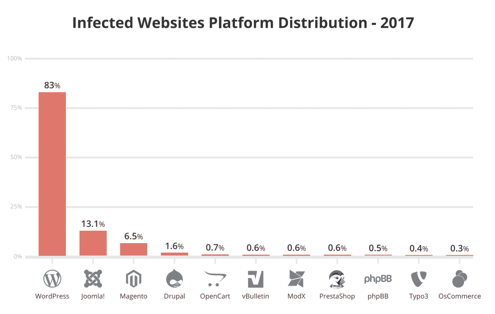

WordPress security vulnerabilities


WordPress [为互联网上超过 43.3%的网站](https://kinsta.com/wordpress-market-share/)提供支持，有成千上万的主题和插件组合，漏洞的存在和不断被发现并不奇怪。然而，WordPress 平台周围也有一个很好的社区，可以确保这些东西尽快得到修补。截至 2022 年， [WordPress 安全团队](https://wordpress.org/about/security/#ref3)由大约 50 名专家组成(高于 2017 年的 25 名),包括首席开发人员和安全研究人员——大约一半是 Automattic 的员工，还有一些在网络安全领域工作。


> Kinsta 把我宠坏了，所以我现在要求每个供应商都提供这样的服务。我们还试图通过我们的 SaaS 工具支持达到这一水平。
> 
> <footer class="wp-block-kinsta-client-quote__footer">
> 
> 
> 
> <cite class="wp-block-kinsta-client-quote__cite">Suganthan Mohanadasan from @Suganthanmn</cite></footer>

[View plans](https://kinsta.com/plans/)

## WordPress 漏洞

看看下面一些不同类型的 WordPress 安全漏洞。

*   [后门](#backdoors)
*   [制药黑客](#pharma-hacks)
*   [暴力登录尝试](#brute-force-login-attempts)
*   [恶意重定向](#malicious-redirects)
*   [跨站点脚本(XSS)](#cross-site-scriping-xss)
*   [拒绝服务](#denial-of-service)

### 秘密的

这个名副其实的后门漏洞为黑客提供了绕过安全加密的隐藏通道，让他们可以通过非正常的方法——[WP-Admin](https://kinsta.com/knowledgebase/wordpress-admin/)、 [SFTP](https://kinsta.com/knowledgebase/how-to-use-sftp/) 、FTP 等访问 WordPress 网站。一旦被利用，后门使黑客能够通过跨站点污染攻击对托管服务器造成严重破坏，从而危及同一服务器上托管的多个站点。2017 年第三季度 [Sucuri 报告](https://sucuri.net/reports/2017-hacked-website-report)后门仍然是攻击者采取的许多黑客后行动之一， **71%** 的受感染网站有某种形式的后门注入。

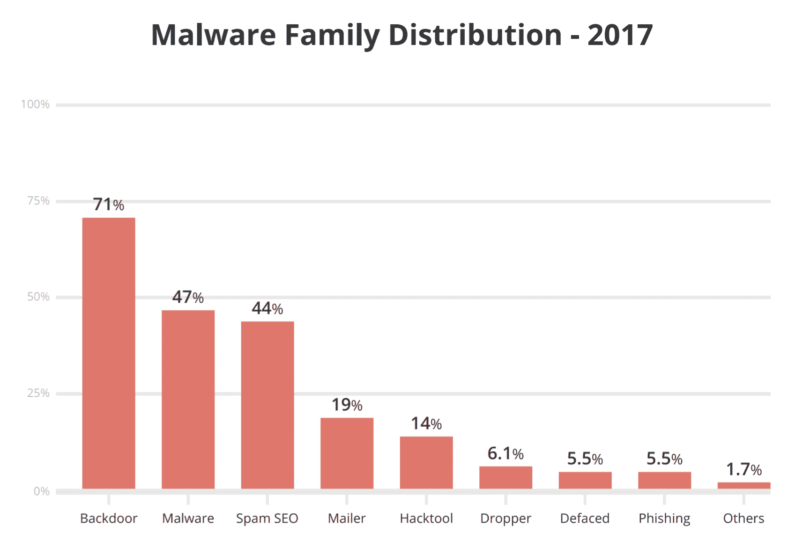

Malware family distribution


后门通常被加密，看起来像合法的 WordPress 系统文件，并通过利用平台过时版本中的弱点和错误进入 [WordPress 数据库](https://kinsta.com/knowledgebase/wordpress-database/)。 [TimThumb 惨败](https://blog.sucuri.net/2011/08/timthumb-security-vulnerability-list-of-themes-including-it.html)是利用可疑脚本和过时软件危害数百万网站的后门漏洞的典型例子。

幸运的是，这种漏洞的预防和治疗相当简单。你可以用类似于 [SiteCheck](https://sitecheck.sucuri.net/) 的工具扫描你的 WordPress 站点，这些工具可以很容易地检测出常见的后门。双因素身份验证、阻止 IPs、限制管理员访问和防止未经授权执行 PHP 文件可以轻松应对常见的后门威胁，我们将在下面详细介绍。 [Canton Becker](http://cantonbecker.com/work/musings/2009/how-to-search-for-backdoors-in-a-hacked-wordpress-site/) 也有一篇关于清理你的 WordPress 安装的后门垃圾的文章。

### 制药黑客

Pharma Hack 漏洞被用来在 WordPress 网站和插件的过时版本中插入流氓代码，导致搜索引擎在被入侵的网站搜索时返回药品广告。与传统的恶意软件相比，这个漏洞更像是一个垃圾邮件的威胁，但却给了搜索引擎足够的理由来封锁这个被指控散布垃圾邮件的网站。

制药黑客的活动部分包括插件和数据库中的后门，可以按照 Sucuri 博客的指示进行清理。然而，这些漏洞通常是隐藏在数据库中的加密恶意[注入的恶意变体，需要](https://kinsta.com/blog/sql-injection/)[彻底清理过程](https://kinsta.com/blog/reset-wordpress/)来修复漏洞。尽管如此，你可以通过使用推荐的 [WordPress 托管](https://kinsta.com/wordpress-hosting/)提供商的最新服务器并定期更新你的 WordPress 安装、主题和插件来轻松防止制药黑客。像 Kinsta 这样的主机也提供免费的黑客补丁。

### 暴力登录尝试

暴力登录尝试使用自动化脚本来利用弱密码并获得对您站点的访问权限。两步认证、[限制登录尝试、](https://kinsta.com/blog/limit-wp-admin-login-attempts/ "How to Limit WP Admin Login Attempts")监控未授权登录、阻止 IP 和使用强密码是防止暴力攻击的一些最简单和高效的方法。但不幸的是，许多 WordPress 网站所有者未能执行这些安全措施，而黑客可以使用暴力攻击在一天之内轻易攻破 [30，000 个网站。](http://www.forbes.com/sites/jameslyne/2013/09/06/30000-web-sites-hacked-a-day-how-do-you-host-yours/)

### 恶意重定向

恶意重定向使用 FTP、SFTP、wp-admin 和其他协议在 WordPress 安装中创建后门，并将重定向代码注入网站。重定向通常放在您的。htaccess 文件和其他编码形式的 WordPress 核心文件，将网络流量导向恶意网站。我们将在下面的 WordPress 安全步骤中介绍一些你可以防止这些的方法。

### 跨站点脚本(XSS)

跨站点脚本(XSS)是指将恶意脚本注入到受信任的网站或应用程序中。攻击者利用这一点向最终用户发送恶意代码，通常是浏览器端脚本，而最终用户并不知道。其目的通常是获取 cookie 或会话数据，或者甚至重写页面上的 HTML。

根据 WordFence 的说法，跨站脚本漏洞是 WordPress 插件中最常见的漏洞。

### 拒绝服务

也许其中最危险的是，[拒绝服务(DoS)](https://kinsta.com/blog/what-is-a-ddos-attack/) 漏洞利用代码中的错误和缺陷来淹没网站操作系统的内存。黑客通过利用 WordPress 软件的过时和错误版本进行 DoS 攻击，已经攻破了[数百万个网站](http://www.incapsula.com/blog/wordpress-security-alert-pingback-ddos.html)，从[攫取了数百万美元](http://www.voiceofgreyhat.com/2012/11/DDoS-Attack-From-Anonymous-Cost-PayPal-3.5-Million.html)。尽管出于经济动机的网络犯罪分子不太可能以小公司为目标，但他们往往会通过创建[僵尸网络链来攻击](http://www.informationweek.com/attacks/wordpress-site-hacks-continue/d/d-id/1111748)大企业，从而危及过时的易受攻击的网站。

即使是 WordPress 软件的[最新版本也无法全面](https://kinsta.com/blog/wordpress-5-3/)[防御高调的 DoS 攻击](https://kinsta.com/blog/what-is-a-ddos-attack/)，但至少会帮助你避免陷入金融机构和老练的网络罪犯的交叉火力中。别忘了 2016 年 10 月 21 日。这是互联网由于 DNS DDoS 攻击而瘫痪的一天。阅读更多关于[为什么使用高级域名服务提供商](https://kinsta.com/blog/premium-dns/)来提高你的 WordPress 安全性很重要。


## WordPress 安全指南 2022

根据互联网实时统计数据，每天有超过 10 万个网站遭到黑客攻击。😮这就是为什么花些时间仔细阅读下面关于如何更好地加强你的 WordPress 安全性的建议是如此重要。

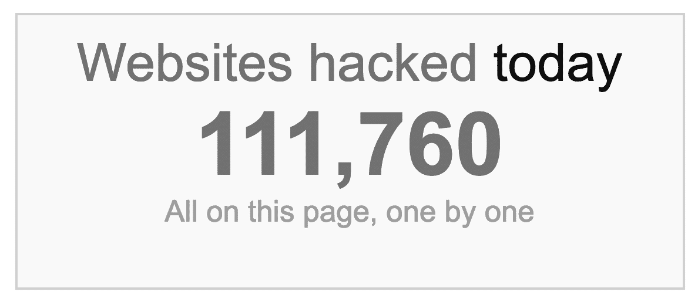

WordPress sites hacked every day


随着 WordPress 平台的变化和新漏洞的出现，我们将确保这篇文章与相关信息保持同步。

1.  [安全 WordPress 托管](#secure-wordpress-hosting)
2.  [使用最新的 PHP 版本](#php-version)
3.  [聪明的用户名和密码](#clever-passwords)
4.  [最新版本](#latest-versions)
5.  [锁定 WordPress Admin](#lock-down-admin)
6.  [双因素认证](#two-factor-authentication)
7.  [HTTPS-SSL 证书](#https)
8.  [硬化 wp-config.php](#wp-config)
9.  [禁用 XML-RPC](#disable-xml-rpc)
10.  [隐藏 WordPress 版本](#hide-version)
11.  [HTTP 安全报头](#security-headers)
12.  [WordPress 安全插件](#security-plugins)
13.  [数据库安全](#database-security)
14.  [安全连接](#secure-connections)
15.  [文件和服务器权限](#file-permissions)
16.  [禁用仪表板中的编辑功能](#disable-editing)
17.  [防止热链接](#hotlinking)
18.  [总是备份 WordPress】](#wordpress-backups)
19.  [DDoS 防护](#ddos-protection)

## 1。投资安全的 WordPress 主机

说到 WordPress 的安全性，不仅仅是锁定你的网站，尽管我们会在下面给你最好的建议。你的 WordPress 主机还负责 web 服务器级别的安全性。在金斯塔，我们非常重视安全问题，并为我们的客户处理许多此类问题。

选择一个你可以信任的主机来处理你的业务是非常重要的。或者如果你在自己的 VPS 上托管 WordPress，那么你需要有技术知识来自己做这些事情。老实说，[试图成为一名系统管理员来节省每月 20 美元的费用](https://kinsta.com/blog/sysadmin/)并不是一个好主意。


Secure WordPress hosting


服务器加固是维护一个完全安全的 WordPress 环境的关键。它需要多层次的硬件和软件安全措施来确保托管 WordPress 站点的 It 基础设施能够抵御复杂的威胁，包括物理的和虚拟的。

因此，托管 WordPress 的服务器应该更新最新的操作系统和(安全)软件，并彻底测试和扫描漏洞和恶意软件。一个很好的例子是，当 Kinsta 不得不为发现的 [OpenSSL 安全漏洞](https://kinsta.com/knowledgebase/what-is-nginx/)修补 NGINX 时。

在服务器上安装 WordPress 之前，服务器级的防火墙和入侵检测系统应该到位，即使在 WordPress 安装和网站建设阶段也能保持良好的保护。然而，安装在机器上用来保护 WordPress 内容的每个软件都应该与最新的数据库管理系统兼容，以保持最佳性能。服务器还应该配置为使用安全网络和文件传输加密协议(如 [SFTP，而不是 FTP](https://kinsta.com/knowledgebase/ftp-vs-sftp/) ，以隐藏敏感内容，防止恶意入侵者。

在 Kinsta，我们为所有的 WordPress 客户使用[谷歌云平台最快的服务器](https://kinsta.com/blog/boosting-wordpress-performance/)和高级网络，以确保快速和[安全的 WordPress 托管体验](https://kinsta.com/secure-wordpress-hosting/)。一个很大的优势是，它建立在一个安全模型上，这个模型已经建立了 15 年，目前可以保护 Gmail、Search 等产品和服务。谷歌目前雇佣了 500 多名全职安全专业人员。Kinsta 上的所有网站也受到我们免费的 [Cloudflare integration](https://kinsta.com/cloudflare-integration/) 的保护，其中包括安全的企业级防火墙以及免费的 DDoS 保护。

Kinsta 还使用 Linux 容器(LXC)和 LXD 来协调它们，在[谷歌云平台](https://kinsta.com/blog/google-cloud-hosting/)之上**使我们不仅能完全隔离每个账户，还能完全隔离每个独立的 WordPress 网站**。安全性从一开始就内置于我们的体系结构中，这是一种比其他竞争对手提供的方法更安全的方法。


Kinsta hosting architecture.


## 2。使用最新的 PHP 版本

PHP 是你的 WordPress 站点的支柱，所以在你的服务器上使用最新版本是非常重要的。PHP 的每个主要版本通常在发布后的两年内得到全面支持。在此期间，错误和安全问题会定期得到修复和修补。截至目前，任何运行 PHP 7.1 或更低版本的人都不再有安全支持，并暴露于未打补丁的安全漏洞。

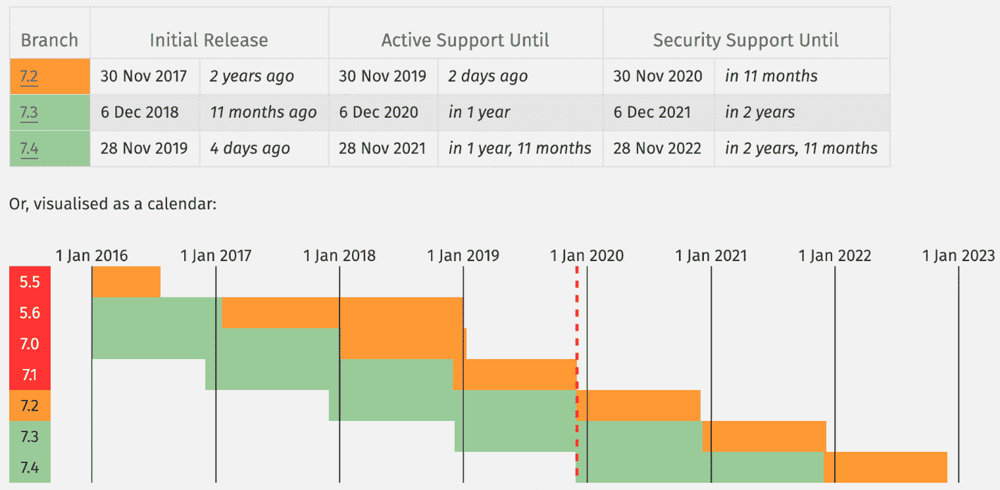

Supported PHP Versions


你猜怎么着？根据官方的 [WordPress 统计数据](https://wordpress.org/about/stats/)页面，在撰写本文时，超过 **57%的 WordPress 用户是仍在使用 PHP 5.6 或更低版本**的 **。如果将这一点与 PHP 7.0 结合起来，那么多达 77.5%的用户目前使用的是不再受支持的 PHP 版本。太可怕了。**

[77.5% of WordPress users are currently using PHP versions that are no longer supported! 😮Click to Tweet](https://twitter.com/intent/tweet?url=https%3A%2F%2Fkinsta.com%2Fblog%2Fwordpress-security%2F&via=kinsta&text=77.5%25+of+WordPress+users+are+currently+using+PHP+versions+that+are+no+longer+supported%21+%F0%9F%98%AE&hashtags=websec%2CPHP)

有时，企业和开发人员确实需要时间来测试和确保与他们的代码兼容，但是他们没有理由在没有安全支持的情况下运行。更不用说在旧版本上运行对性能的巨大影响了。

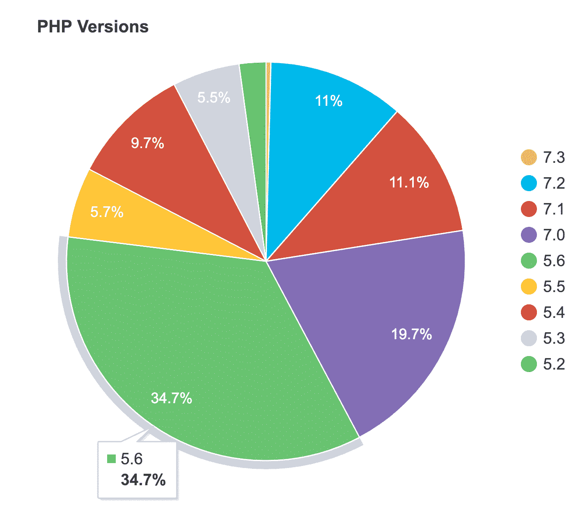

WordPress PHP version Stats


不知道你目前用的是哪个版本的 PHP？大多数主机通常会在您网站的标题请求中包含此内容。快速检查的方法是通过 [Pingdom](https://tools.pingdom.com/) 运行你的站点。点击第一个请求并寻找一个`X-Powered-By`参数。通常，这将显示您的 web 服务器当前使用的 PHP 版本。但是，出于安全原因，一些主机会删除此报头。默认情况下，Kinsta 会删除此标题，以确保您的网站安全。


Check PHP version in Pingdom


在 Kinsta，我们只推荐使用稳定的和受支持的 PHP 版本，包括 8.0 和 8.1。PHP 5.6、7.0 和 7.1 已经被淘汰。您甚至可以在 MyKinsta 仪表板中点击一个按钮，在 PHP 版本之间切换。


Switching between PHP versions


如果你在使用 cPanel 的 WordPress 主机上，你通常可以通过点击软件类别下的“PHP 选择”来切换 PHP 版本。

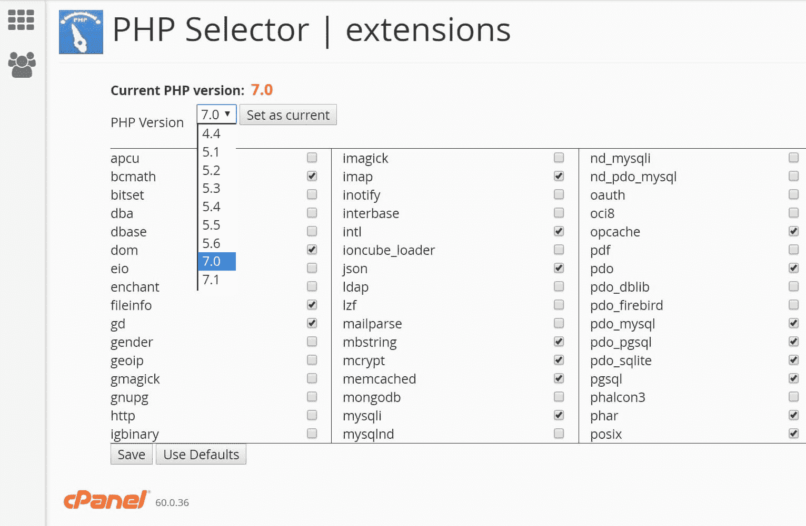

cPanel PHP version


## 3。使用巧妙的用户名和密码

令人惊讶的是，加强 WordPress 安全性的最好方法之一就是简单地**使用聪明的用户名和密码**。听起来很简单，对吗？好吧，来看看 [SplashData 的 2019 年度榜单](https://www.teampassword.com/blog/top-50-worst-passwords-of-2019)全年最受欢迎的被盗密码(按受欢迎程度排序)。

*   One hundred and twenty-three thousand four hundred and fifty-six
*   密码
*   One hundred and twenty-three million four hundred and fifty-six thousand seven hundred and eighty-nine
*   Twelve million three hundred and forty-five thousand six hundred and seventy-eight
*   one two three four five
*   One hundred and eleven thousand one hundred and eleven
*   One million two hundred and thirty-four thousand five hundred and sixty-seven
*   阳光
*   标准英语打字键盘的
*   我爱你

没错！**最流行的密码是“123456”**，其次是一个惊人的“密码”。这也是为什么在 Kinsta 新安装 WordPress 时，我们会强制使用一个复杂的密码来登录你的[WP-admin](https://kinsta.com/blog/wordpress-login-url/)(如下图所示)。这不是可选的。


Force secure WordPress password


核心的 WordPress `wp_hash_password` [函数](https://codex.wordpress.org/Function_Reference/wp_hash_password#Description)使用了 [phpass](http://www.openwall.com/phpass/) 密码散列框架和基于 MD5 的八次散列。

一些最好的安全措施是从基础开始的。谷歌对如何选择强密码有一些很好的建议。或者你可以使用在线工具，如[强密码生成器](https://strongpasswordgenerator.com/)。你可以在这里了解更多关于[如何更改你的密码](https://kinsta.com/blog/change-wordpress-password/)。

每个网站使用不同的密码也很重要。将它们存储在本地计算机的加密数据库中是最好的方法。一个很好的免费工具是 KeePass。如果你不想走这条路，也有在线密码管理器，如 [1Password](https://1password.com/) 或 [LastPass](https://lastpass.com/) 。尽管您的数据安全地托管在云中，但这些通常更安全，因为您不会在多个站点上使用相同的密码。这也让你不用便利贴。😉

只要你安装了 WordPress，你就不应该使用默认的“admin”用户名。为管理员帐户创建一个唯一的 WordPress 用户名，如果存在的话，删除“admin”用户。您可以通过在仪表板中的“Users”下添加一个新用户并为其分配“Administrator”配置文件来实现这一点(如下所示)。

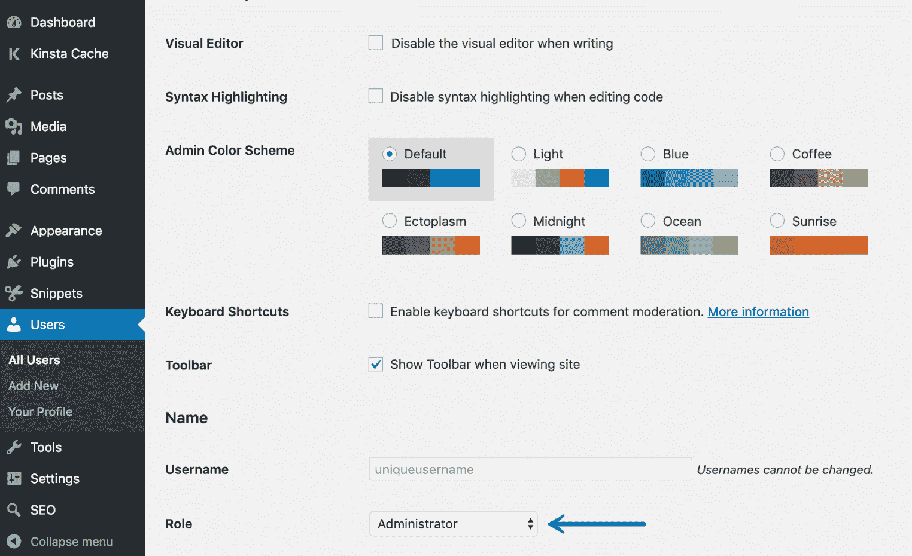

WordPress administrator role


为新帐户分配管理员角色后，您可以返回并删除原来的“Admin”用户。请确保当您单击“删除”时，您选择了“将所有内容归属于”选项，并选择了新的管理员配置文件。这将把此人指定为这些帖子的作者。

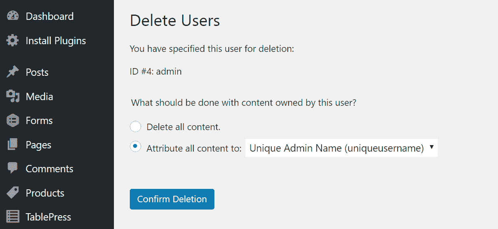

Attribute all content to admin


您也可以使用下面的命令在 [phpMyAdmin](https://kinsta.com/help/wordpress-phpmyadmin/) 中手动重命名您当前的管理员用户名。请确保在编辑表格之前备份数据库。

```
UPDATE wp_users SET user_login = 'newcomplexadminuser' WHERE user_login = 'admin';
```

## 4。总是使用最新版本的 WordPress、插件和主题

加强 WordPress 安全性的另一个非常重要的方法是始终保持更新。这包括 WordPress 核心、插件和主题(都来自 WordPress 知识库和 premium)。这些更新是有原因的，很多时候包括安全增强和错误修复。我们推荐你阅读我们关于如何自动更新的深入指南。

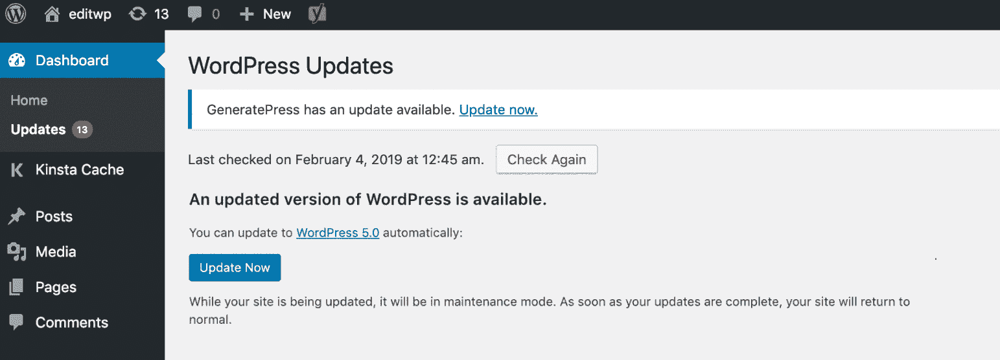

Keep WordPress up to date


不幸的是，数以百万计的企业运行着 WordPress 软件和插件的过时版本，并且仍然相信他们走在商业成功的正确道路上。他们列举了不更新的原因，比如“他们的网站会崩溃”或“核心修改会消失”或“插件 X 不会工作”或“他们只是不需要新功能”。

事实上，网站崩溃主要是因为 WordPress 旧版本的错误。WordPress 团队和了解相关风险的专家开发者从不推荐核心修改。WordPress 的更新主要包括必备的安全补丁以及运行最新插件所需的附加功能。

您知道吗？据报道，[插件漏洞占黑客已知入口的 55.9%](https://www.wordfence.com/blog/2016/03/attackers-gain-access-wordpress-sites/) ？这是 WordFence 在一项研究中发现的，他们采访了 1000 多名遭受攻击的 WordPress 网站所有者。通过更新你的插件，你可以更好地确保你不是这些受害者之一。


Hacked WordPress sites


还建议您只安装可信插件。WordPress 知识库中的“特色”和“流行”类别是一个很好的起点。或者直接从开发商网站下载。我们强烈反对使用任何被清空的 WordPress 插件和主题。

首先，您永远不知道修改后的代码可能包含什么。这很容易导致你的网站被黑。不为 WordPress 插件付费也无助于社区的整体发展。我们需要支持开发者。

以下是如何正确地[删除一个 WordPress 主题](https://kinsta.com/blog/wordpress-delete-theme/)。

你可以使用像 [VirusTotal](https://www.virustotal.com/#/home/upload) 这样的在线工具来扫描插件或主题的文件，看看它是否检测到任何[类型的恶意软件](https://kinsta.com/blog/types-of-malware/)。

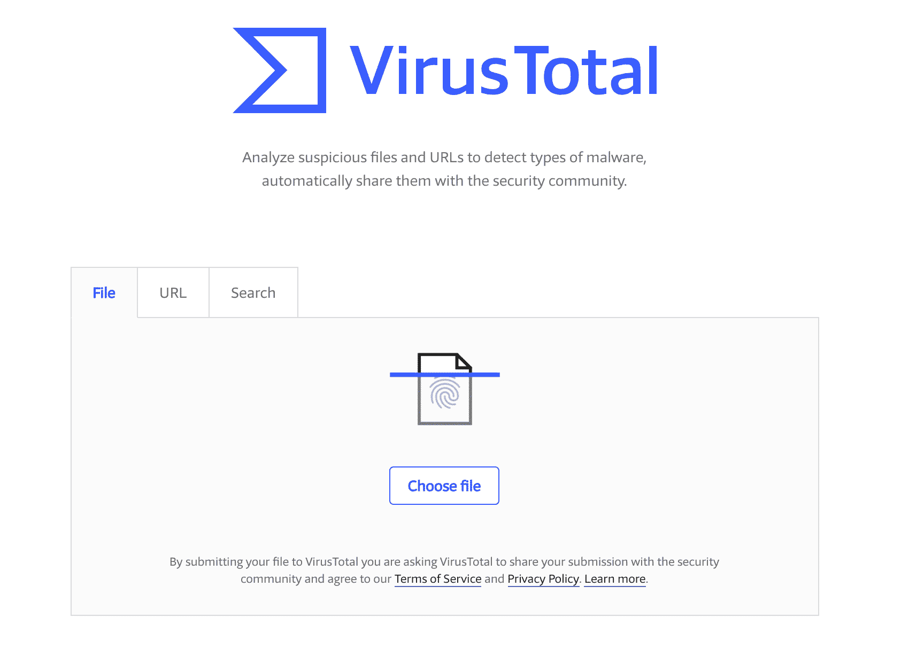

VirusTotal


### 如何更新 WordPress 核心

有一些简单的方法来更新你的 WordPress 安装。如果您是 Kinsta 的客户，我们为[提供了自动备份](https://kinsta.com/help/wordpress-backups/)和一键恢复选项。这样你就可以测试新版本的 WordPress 和插件，而不用担心它会破坏任何东西。或者你也可以先在我们的[临时环境](https://kinsta.com/help/staging-environment/)中测试。

要更新 WordPress core，你可以点击你的 WordPress 仪表盘中的“更新”,然后点击“立即更新”按钮。


Update WordPress core


你也可以通过[下载最新版本](https://wordpress.org/download/)并通过 SFTP 上传来手动更新 WordPress。

Important! Overwriting the wrong folders could break your site if not done correctly. If you are not comfortable doing this, please check with a developer first.

按照以下步骤[更新您现有的安装:](https://codex.wordpress.org/Updating_WordPress)

1.  删除旧的`wp-includes`和`wp-admin`目录。
2.  上传新的`wp-includes`和`wp-admin`目录。
3.  将新的`wp-content`文件夹中的单个文件上传到现有的`wp-content`文件夹中，覆盖现有的文件。不要删除你现有的`wp-content`文件夹。请勿删除现有`wp-content`目录中的任何文件或文件夹(被新文件覆盖的除外)。
4.  从新版本的根目录上传所有新的松散文件到你现有的 WordPress 根目录。

### 如何更新 WordPress 插件

更新你的 WordPress 插件和更新 WordPress 核心是一个非常相似的过程。点击你的 WordPress 仪表盘中的“更新”，选择你想要更新的插件，然后点击“更新插件”

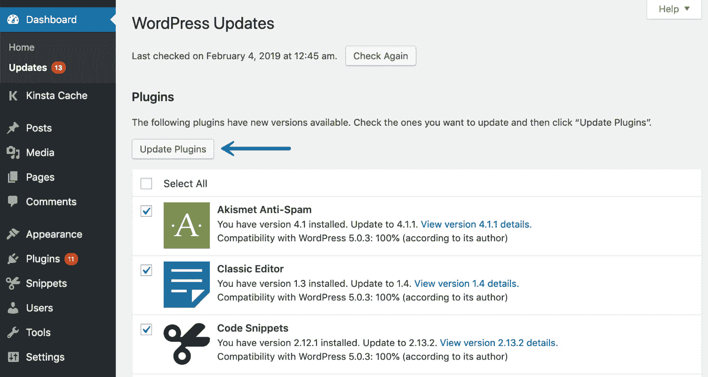

Update WordPress plugins


同样，你也可以手动更新插件。只需从插件开发者或 WordPress 库获取最新版本，并通过 FTP 上传，覆盖`/wp-content/plugins`目录中现有的插件。

同样需要注意的是，开发者并不总是让他们的插件保持最新。WP Loop 的团队做了一个很好的小分析，看看仓库里有多少 WordPress 插件不是当前 WordPress 核心的最新版本。[根据他们的研究](https://wploop.com/old-outdated-wordpress-plugins/) **资源库中近 50%的插件已经超过 2 年没有更新**。

这并不意味着这个插件不能在当前版本的 WordPress 上使用，但是建议你选择主动更新的插件。过时的插件更有可能包含安全漏洞。

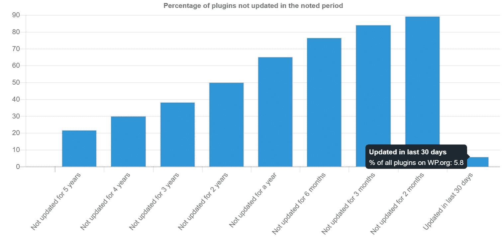

img src: [WP Loop](https://wploop.com/old-outdated-wordpress-plugins/)


当涉及到插件时，使用你最好的判断。看看[“最后更新”日期](https://kinsta.com/blog/last-updated/)和一个插件有多少评级。正如下面的例子所示，这个已经过时了，并且有不好的评论，所以我们很可能会建议远离它。WordPress 在大部分有段时间没有更新的插件顶部也有一个警告。

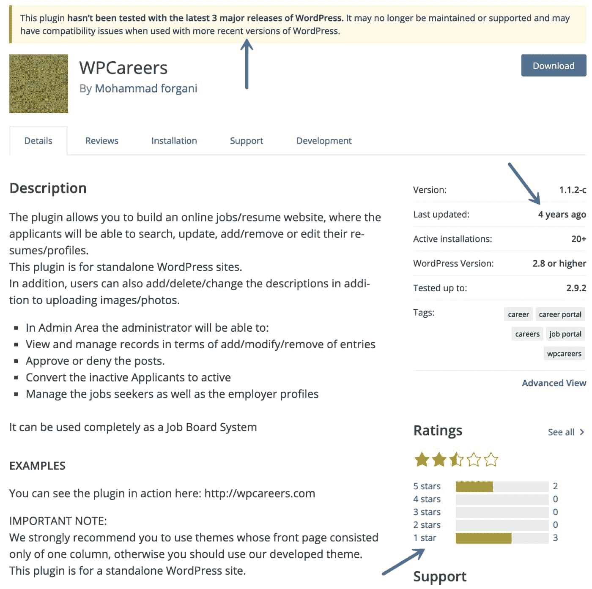

Old WordPress plugin with bad ratings


还有很多资源可以帮助你掌握最新的 WordPress 安全更新和漏洞。请看下面的一些例子:

*   WP 安全博客:一个由 20 多个安全源组成的强大聚合资源。
*   WPScan :对超过 10，000 个 WordPress 核心、插件和主题漏洞进行分类。
*   官方 WordPress 安全档案

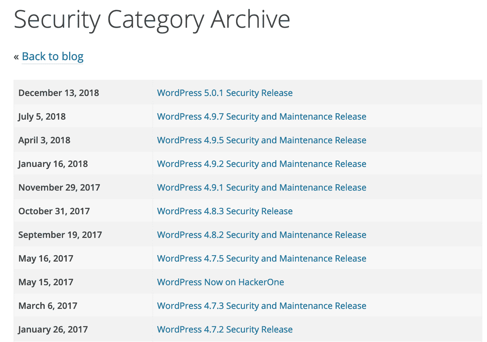

WordPress security archive


## 5。锁定你的 WordPress 管理员

有时流行的通过模糊来保证 WordPress 安全的策略对于一般的在线商务和 WordPress 网站来说是相当有效的。如果你让黑客更难找到某些后门，那么你就不太可能被攻击。[锁定你的 WordPress 管理区域和登录是加强你安全性的好方法。有两个很好的方法可以做到这一点，首先是改变默认的 wp-admin 登录 URL，同时限制登录尝试。](https://kinsta.com/blog/wordpress-login-url/)

[Security by obscurity can be an easy and effective way to beef up your WordPress security. 🔒Click to Tweet](https://twitter.com/intent/tweet?url=https%3A%2F%2Fkinsta.com%2Fblog%2Fwordpress-security%2F&via=kinsta&text=Security+by+obscurity+can+be+an+easy+and+effective+way+to+beef+up+your+WordPress+security.+%F0%9F%94%92&hashtags=WordPress%2Cwebsec)

### 如何更改你的 WordPress 登录网址

默认情况下，你的 WordPress 站点的登录网址是 domain.com**/WP-admin**。其中一个问题是，所有的机器人、黑客和脚本都知道这一点。通过更改 URL，您可以使自己不那么容易成为目标，并更好地保护自己免受暴力攻击。这不是一个万能的解决方案，它只是一个小技巧，绝对可以帮助保护你。

为了[改变你的 WordPress 登录网址](https://kinsta.com/blog/wordpress-login-url/#change-login-page)，我们推荐使用免费的 [WPS 隐藏登录](https://wordpress.org/plugins/wps-hide-login/)插件或者高级的[性能问题](https://perfmatters.io/)插件。这两个插件都有一个简单的输入框。请记住，选择一些独特的东西，这些东西不会出现在机器人或脚本可能试图扫描的列表中。

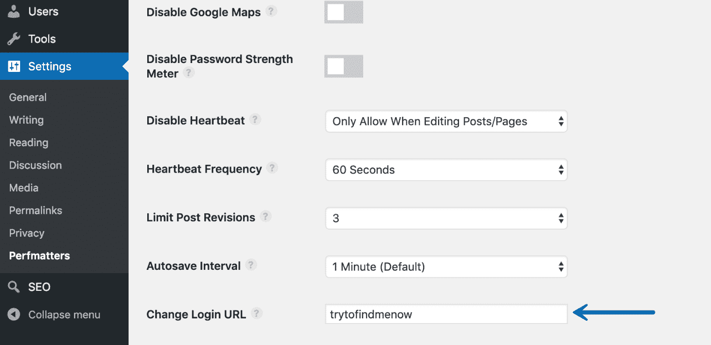

Hide WordPress login URL with Perfmatters


### 如何限制登录尝试

虽然上述更改管理员登录 URL 的解决方案有助于减少大多数不良登录尝试，但设置限制也非常有效。免费的[限制登录尝试重新加载](https://wordpress.org/plugins/limit-login-attempts-reloaded/)插件是一个很好的方式来轻松设置锁定持续时间，登录尝试，以及 IP 白名单和黑名单。

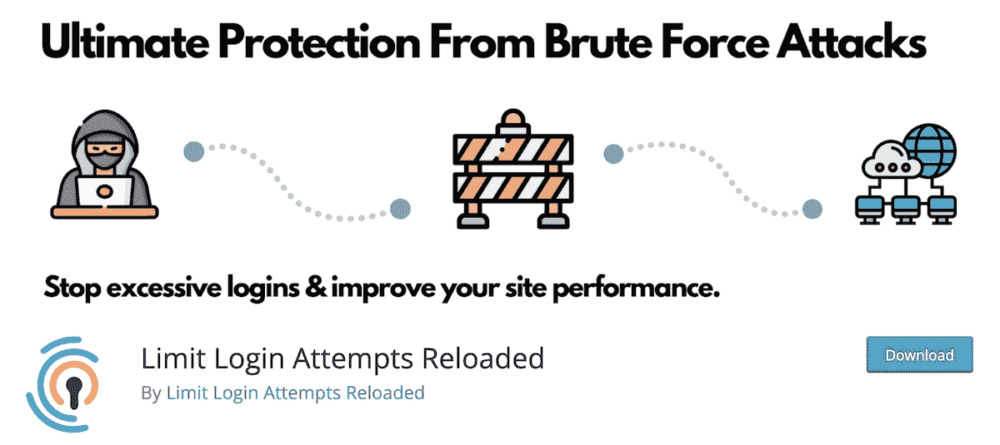

Limit Login Attempts Reloaded


如果你正在寻找一个更简单的 WordPress 安全解决方案，另一个很好的选择是免费的[登录锁定](https://wordpress.org/plugins/login-lockdown/)插件。登录锁定会记录每次失败登录尝试的 IP 地址和时间戳。如果在短时间内检测到来自同一 IP 范围的尝试次数超过一定次数，则该范围内的所有请求的登录功能都将被禁用。而且完全兼容我们上面提到的 WPS 隐藏登录插件。

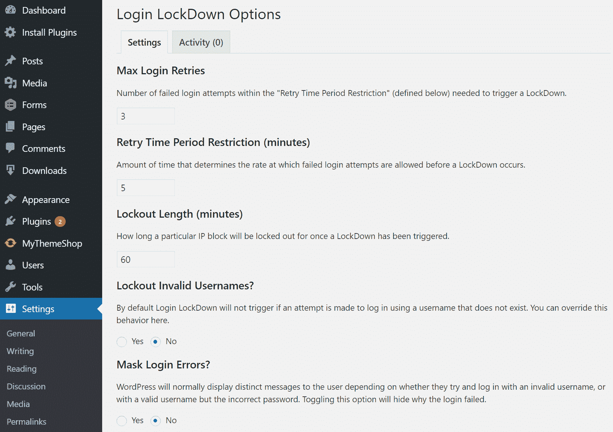

Lockdown WordPress


### 如何添加基本 HTTP 身份验证(htpasswd 保护)

锁定管理员的另一种方法是添加 HTTP 身份验证。这需要用户名和密码才能访问 WordPress 登录页面。注意:这通常不应该用于电子商务网站或会员网站。但它可以是一种非常有效的方法来防止机器人攻击您的网站。


.htpasswd authentication prompt


#### 街头流氓

如果您使用 cPanel 主机，您可以从它们的控制面板启用密码保护目录。要手动设置它，首先需要创建一个`.htpasswd`文件。你可以使用这个方便的[生成器工具](http://www.htaccesstools.com/htpasswd-generator/)。然后将文件上传到 wp-admin 文件夹下的一个目录中，例如:

```
home/user/.htpasswds/public_html/wp-admin/htpasswd/
```

然后用下面的代码创建一个`.htaccess`文件，并上传到您的`/wp-admin/`目录。确保您更新了目录路径和用户名。

```
AuthName "Admins Only"
AuthUserFile /home/yourdirectory/.htpasswds/public_html/wp-admin/htpasswd
AuthType basic
require user yourusername
```

这样做的一个警告是，它会破坏网站前端的 AJAX (admin-ajax)。这是一些第三方插件所要求的。因此，您还需要[将下面的代码](https://core.trac.wordpress.org/ticket/12400#comment:23)添加到上面。htaccess 文件。

```
<Files admin-ajax.php>
Order allow,deny
Allow from all
Satisfy any
</Files>
```

#### Nginx

如果运行的是 [Nginx](https://kinsta.com/knowledgebase/what-is-nginx/) ，也可以用 HTTP 基本认证限制访问。查看[这篇教程](https://www.nginx.com/resources/admin-guide/restricting-access-auth-basic/)。

如果你在 Kinsta 托管你的 WordPress 站点，你可以在 MyKinsta 仪表板中使用我们简单的[密码保护(htpasswd)工具](https://kinsta.com/help/htpasswd/)。您可以在网站的“工具”部分找到它。只需点击“启用”，选择用户名和密码，你就可以开始了！

[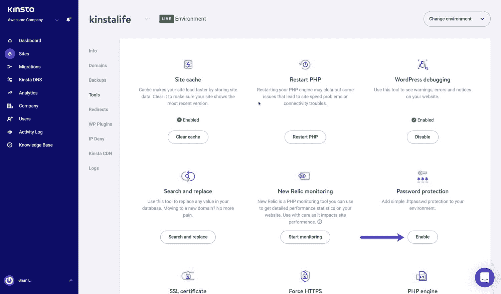](https://kinsta.com/wp-content/uploads/2019/02/mykinsta-password-protection.jpg)

Enable .htpasswd protection


启用后，你的 WordPress 站点将需要认证才能访问。您可以随时更改凭据，或者在不再需要时将其禁用。

### 锁定 URL 路径

如果您使用的是 web 应用防火墙(WAF ),如 Cloudflare 或 Sucuri，它们也有锁定 URL 路径的方法。基本上你可以设置一个规则，这样只有你的 IP 地址能够访问你的 WordPress admin 登录 URL。同样，这通常不应该用于电子商务网站或会员网站，因为它们也依赖于访问您的网站的后端。

*   Cloudflare 在其专业版和更高版本的帐户中有一个[锁定 URL 功能](https://support.cloudflare.com/hc/en-us/articles/115001595131-How-do-I-Lockdown-URLs-in-Cloudflare-)。您可以为任何 URL 或路径设置规则。
*   Sucuri 有一个[黑名单 URL 路径特性](https://kb.sucuri.net/firewall/Whitelist+and+Blacklist/blacklisting-path)。然后你可以把你自己的 IP 加入白名单。

## 6。利用双因素身份认证

当然，我们不能忘记双因素身份认证！不管你的密码有多安全，总有被人发现的风险。双因素身份验证包括两步过程，在此过程中，您不仅需要密码登录，还需要第二种方法。它通常是一个文本(短信)，电话，或基于时间的一次性密码(TOTP)。在大多数情况下，这 100%有效地防止了对你的 WordPress 站点的暴力攻击。为什么？因为攻击者几乎不可能同时拥有你的密码和手机。

说到双因素身份认证，实际上有两个部分。第一个是**你的账户和/或你的虚拟主机提供商的仪表板**。如果有人得到了这个，他们可以改变你的密码，删除你的网站，改变 DNS 记录，以及所有可怕的事情。我们在 Kinsta 与 [Authy](https://www.authy.com/) 合作，为您的 MyKinsta 仪表盘提供[双因素认证](https://kinsta.com/blog/wordpress-two-factor-authentication/)。

双因素认证的第二部分与你的实际 WordPress 安装相关。为此，我们推荐几个插件:

*   [双重双因素认证](https://wordpress.org/plugins/duo-wordpress/)
*   [谷歌认证器](https://wordpress.org/plugins/miniorange-2-factor-authentication/)
*   [双因素认证](https://wordpress.org/plugins/two-factor-authentication/)

其中许多都有自己的认证应用程序，您可以安装在手机上:

*   [安卓 Duo 手机应用](https://play.google.com/store/apps/details?id=com.duosecurity.duomobile&hl=en_US)
*   [iPhone Duo 手机应用](https://itunes.apple.com/us/app/duo-mobile/id422663827)
*   [安卓谷歌认证器应用](https://play.google.com/store/apps/details?id=com.google.android.apps.authenticator2&hl=en)
*   [iPhone 谷歌认证器应用](https://itunes.apple.com/us/app/google-authenticator/id388497605?mt=8)

在安装和配置了上面的插件之后，你通常会在你的 WordPress 登录页面上有一个额外的区域来输入你的安全代码。或者，使用 Duo 插件，您首先使用您的凭据登录，然后被要求选择一种身份验证方法，如 Duo 推送、呼叫或密码。

## 注册订阅时事通讯


### 想知道我们是怎么让流量增长超过 1000%的吗？

加入 20，000 多名获得我们每周时事通讯和内部消息的人的行列吧！

[Subscribe Now](#newsletter)

这种方法可以很容易地与更改您的默认登录 URL 结合起来，我们前面已经讨论过了。因此，不仅你的 WordPress 登录网址只有你知道，而且它现在需要额外的认证才能进入。💪

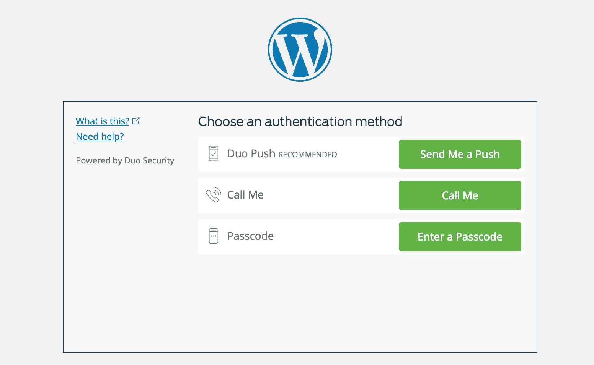

WordPress two-factor authenticator page


所以一定要利用双因素认证，这是增强你的 WordPress 安全性的简单方法。

## 7。对加密连接使用 HTTPS-SSL 证书

一个最容易被忽视的加强 WordPress 安全性的方法是[安装一个 SSL 证书](https://kinsta.com/help/how-to-install-ssl-certificate/)并在 HTTPS 上运行你的站点。HTTPS(安全超文本传输协议)是一种机制，允许您的浏览器或 web 应用程序安全地连接到网站。一个很大的误解是，如果你不接受信用卡，你就不需要 SSL。

好吧，让我们解释一下为什么 HTTPS 不仅仅在电子商务领域如此重要。包括 Kinsta 在内的很多主机都提供免费的 SSL 证书，带有[让我们加密](https://kinsta.com/blog/free-ssl-certificate/)。

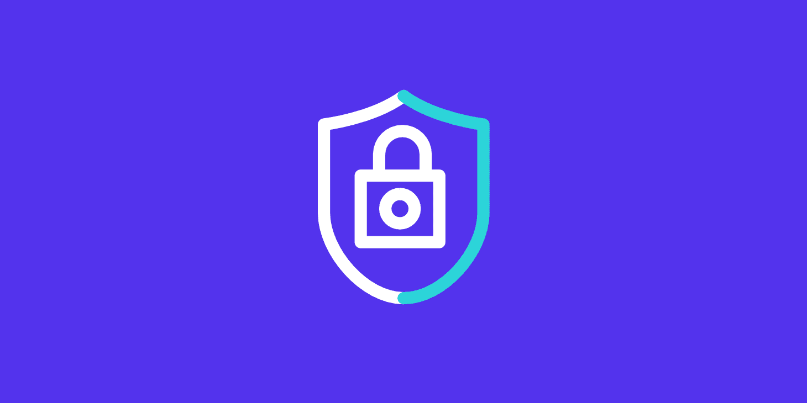

HTTPS encrypted connections


### 1.安全性

当然，HTTPS 最大的原因是增加了安全性，是的，这确实与电子商务网站密切相关。但是，你的登录信息有多重要？对于那些运行多作者 WordPress 网站的人来说，如果你运行的是 HTTP，每次有人登录，信息都会以纯文本的形式传递给服务器。HTTPS 对于维护网站和浏览器之间的安全连接至关重要。这样你可以更好地防止黑客和或中间人访问你的网站。

所以无论你有博客、新闻网站、[机构](https://kinsta.com/blog/wordpress-agency/)等。，他们都可以从 HTTPS 中受益，因为这可以确保没有任何东西以明文形式通过。

### 2.搜索引擎优化

谷歌官方称 [HTTPS 是排名因素](https://webmasters.googleblog.com/2014/08/https-as-ranking-signal.html)。虽然这只是一个很小的排名因素，但你们大多数人可能会利用 SERPs 中的任何优势来击败竞争对手。

### 3.信任和可信度

根据 GlobalSign 的一项调查，28.9%的访问者会在他们的浏览器中寻找绿色地址栏。其中 77%的人担心他们的数据在网上被截取或滥用。看到绿色挂锁，客户会立即感到更加安心，因为他们知道自己的数据更加安全。

### 4.推荐数据

很多人没有意识到的是，HTTPS 到 HTTP 的推荐数据在谷歌分析中被屏蔽了。那么数据会发生什么变化呢？嗯，大部分只是和“直接交通”部分混在一起。如果有人从 HTTP 到 HTTPS，推荐人仍然被传递。

### 5.铬警告

截至 2018 年 7 月 24 日，Chrome 68 及更高版本开始将所有非 HTTPS 网站标记为“不安全”不管他们是否收集数据。这就是为什么 HTTPS 比以往任何时候都重要！

如果你的网站大部分流量来自 Chrome，这一点尤为重要。你可以在浏览器&操作系统的受众部分下的谷歌分析中查看你的 WordPress 网站从谷歌 Chrome 获得的流量百分比。谷歌让访问者更加清楚地知道，你的 WordPress 网站可能没有运行在安全的连接上。

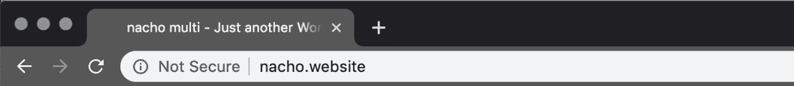

Chrome not a secure website


### 6.表演

因为有一个叫做 [HTTP/2](https://kinsta.com/learn/what-is-http2/) 的协议，很多时候，那些在 HTTPS 上运行适当优化的网站甚至可以看到速度的提高。由于浏览器支持，HTTP/2 需要 HTTPS。性能的提高是由于多种原因，例如 HTTP/2 能够支持更好的多路复用、并行性、带霍夫曼编码的 HPACK 压缩、ALPN 扩展和服务器推送。

而有了 [TLS 1.3](https://kinsta.com/blog/tls-1-3/) ，HTTPS 连接甚至更快。 **Kinsta 在我们所有的服务器和我们的 Kinsta CDN 上支持 TLS 1.3。**

现在重新考虑 HTTPS？查看我们深入的 [WordPress HTTPS 迁移指南](https://kinsta.com/blog/http-to-https/)让你开始行动，并在我们的 [TLS 与 SSL 比较中了解更多信息](https://kinsta.com/knowledgebase/tls-vs-ssl/)。

要在登录和管理您的站点时在您和服务器之间实施安全、加密的连接，请将以下行添加到您的`wp-config.php`文件中:

```
define('FORCE_SSL_ADMIN', true);
```

(建议阅读:如果你正在使用传统的 TLS 版本，你可能需要修复 Chrome 中的 [ERR_SSL_OBSOLETE_VERSION](https://kinsta.com/knowledgebase/err_ssl_obsolete_version/) 通知)。

## 8。强化你的 wp-config.php 档案

你的 wp-config.php 文件就像你的 WordPress 安装的心脏和灵魂。就 WordPress 的安全性而言，它是你的网站上最重要的文件。它包含您的数据库登录信息和处理 cookies 中信息加密的安全密钥。为了更好地保护这个重要文件，您可以做以下几件事情。

### 1.移动 wp-config.php

默认情况下，你的 wp-config.php 文件位于 WordPress 安装的根目录下(你的`/public` HTML 文件夹)。但是您可以将它移动到一个不可通过 www 访问的目录中。Aaron Adams 写了一篇很好的解释为什么这是有益的。

要移动您的`wp-config.php`文件，只需将其中的所有内容复制到一个不同的文件中。然后在您的`wp-config.php`文件中，您可以放置下面的代码片段来简单地包含您的其他文件。注意:根据您的 web 主机和设置，目录路径可能会有所不同。尽管它只是上面的一个目录。

```
<?php
include('/home/yourname/wp-config.php');
```

注意:**这对 Kinsta 客户不起作用，会破坏我们平台的功能。**这是因为出于安全原因，我们的 open_basedir 限制不允许在`~/public`目录之上执行 PHP。好消息是我们会为您处理此事！我们通过在`~/public`目录中阻止对`wp-login.php`的访问来有效地做同样的事情。我们默认的 Nginx 配置包含一条规则，对于任何试图访问`wp-config.php`的行为，该规则将返回 403。

### 2.更新 WordPress 安全密钥

WordPress 安全密钥是一组随机变量，用于提高存储在用户 cookies 中的信息的加密。自从 WordPress 2.7 以来，已经有了 4 个不同的键:`AUTH_KEY`、`SECURE_AUTH_KEY`、`LOGGED_IN_KEY`和`NONCE_KEY`。

当你安装 WordPress 时，这些是为你随机生成的。然而，如果你已经经历了多次迁移(查看我们的最佳 WordPress 迁移插件列表)或者从其他人那里购买了一个站点，那么创建新的 WordPress 密钥是很好的。

WordPress 实际上有一个免费的工具，你可以用它来[生成随机密钥](https://api.wordpress.org/secret-key/1.1/salt/)。您可以更新存储在您的【wp-config.php T2】文件中的当前密钥。

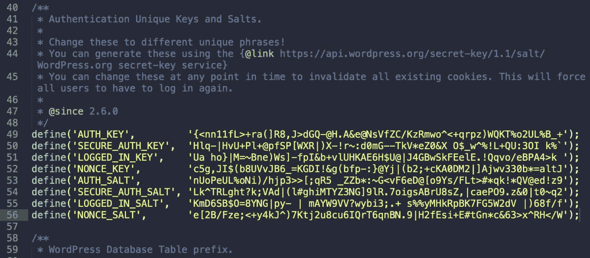

WordPress security keys


阅读更多关于安全密钥的信息。

### 3.更改权限

WordPress 站点根目录下的文件通常会被设置为 644，这意味着文件的所有者可以读写文件，文件所有者组中的用户可以读取文件，其他人也可以读取文件。根据 [WordPress 文档](https://codex.wordpress.org/Changing_File_Permissions)，对`wp-config.php`文件的权限应该设置为 440 或 400，以防止服务器上的其他用户读取它。你可以用你的 [FTP 客户端](https://kinsta.com/blog/best-ftp-clients/)很容易地改变这一点。

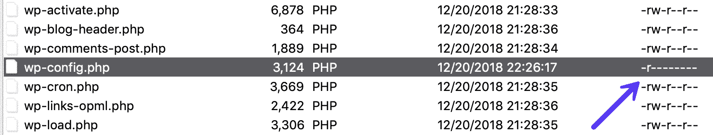

wp-config.php permissions


在一些主机平台上，权限可能需要不同，因为运行 web 服务器的用户没有写文件的权限。如果你对此不确定，请咨询你的主机提供商。

## 9。禁用 XML-RPC

在过去的几年里，XML-RPC 已经成为 T2 越来越大的暴力攻击目标。正如 Sucuri 提到的，XML-RPC 的一个隐藏特性是，您可以使用 system.multicall 方法在一个请求中执行多个方法。这非常有用，因为它允许应用程序在一个 HTTP 请求中传递多个命令。但同样发生的是，它被用于恶意目的。

有几个 WordPress 插件像 [Jetpack](https://kinsta.com/knowledgebase/wordpress-jetpack/) 依赖于 XML-RPC，但是大多数人不需要它，简单地禁止访问它是有益的。不确定 XML-RPC 目前是否正在您的网站上运行？来自 Automattic 团队的 Danilo Ercoli 编写了一个小工具，叫做 [XML-RPC 验证器](http://xmlrpc.eritreo.it/)。你可以运行你的 WordPress 站点，看看它是否启用了 XML-RPC。如果不是，你会在 Kinsta 博客上看到一条失败消息，如下图所示。

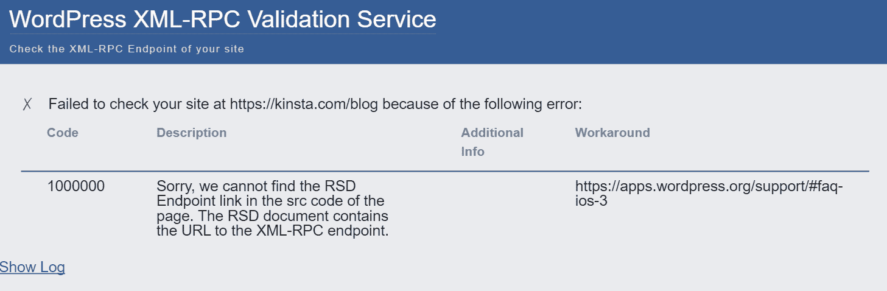

WordPress XML-RPC validator


要完全禁用它，你可以安装免费的[禁用 XML-RPC-API](https://wordpress.org/plugins/disable-xml-rpc-api/) 插件。或者你可以用高级[性能](https://perfmatters.io)插件禁用它，该插件也包含网页性能改进。

Struggling with downtime and WordPress problems? Kinsta is the hosting solution designed to save you time! [Check out our features](https://kinsta.com/features/)

**如果你是 Kinsta 的客户，这是不需要的**,因为当通过 [XML-RPC 的攻击被检测到时](https://kinsta.com/blog/xmlrpc-php/)一小段代码被添加到 NGINX 配置文件中以阻止他们——产生 403 错误。

```
location ~* ^/xmlrpc.php$ {
return 403;
}
```

## 10。隐藏你的 WordPress 版本

隐藏你的 WordPress 版本再一次触及到了主题 **WordPress 安全的模糊性**。其他人越少知道你的 WordPress 站点配置越好。如果他们看到你正在运行一个过时的 WordPress 安装，这可能是一个欢迎入侵者的信号。默认情况下，WordPress 版本显示在你的站点源代码的头部。同样，我们建议你确保你的 WordPress 安装总是最新的，这样你就不用担心这个了。

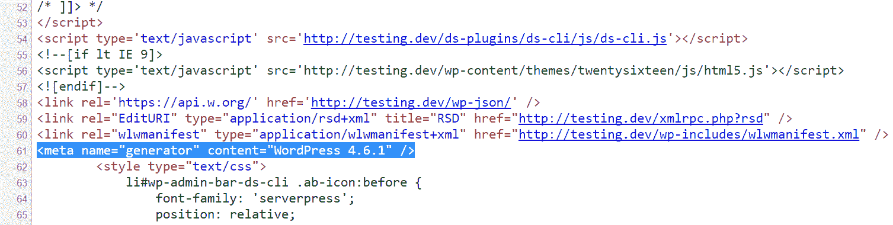

WordPress version in source code


您可以使用下面的代码来删除它。简单地把它添加到你的 WordPress 主题的`functions.php`文件中。

Important! Editing the source code of a WordPress theme could break your site if not done correctly. If you are not comfortable doing this, please check with a developer first.

```
function wp_version_remove_version() {
return '';
}
add_filter('the_generator', 'wp_version_remove_version');
```

你也可以使用一个高级插件，比如 [perfmatters](https://perfmatters.io/) (由 Kinsta 的一个团队成员开发)，它允许你一键隐藏 WordPress 版本，以及对你的 WordPress 站点的其他优化。

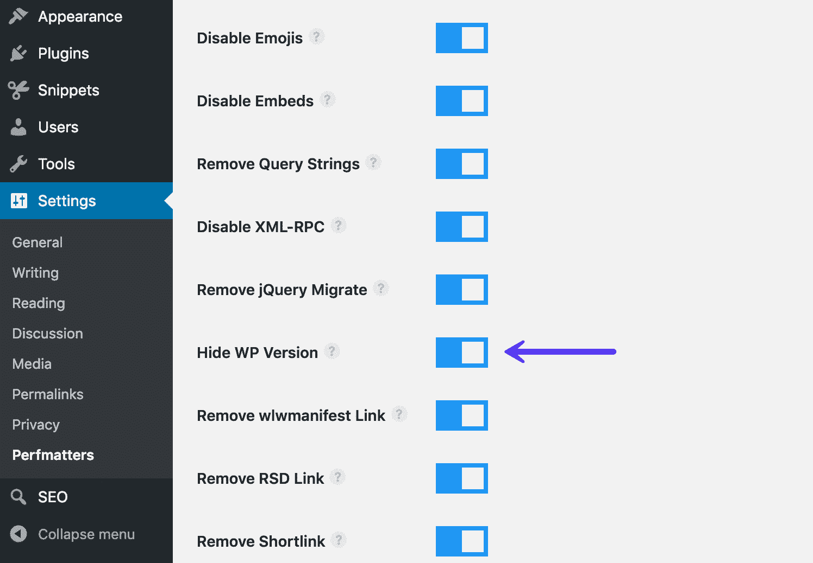

Hide WordPress version with Perfmatters


WordPress 版本出现的另一个地方是默认的`readme.html`文件(如下所示),它包含在每个 WordPress 版本中。它位于您的安装的根目录下，`domain.com/readme.html`。您可以通过 FTP 安全地删除该文件。

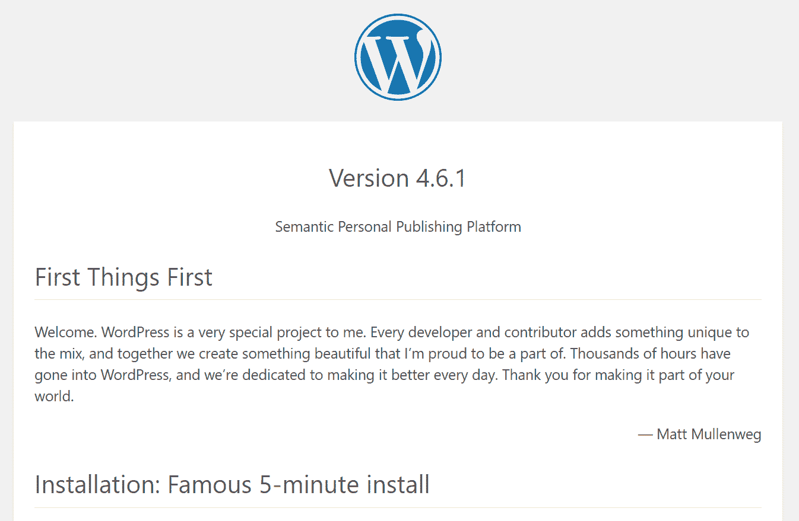

WordPress version in readme file


如果你运行的是 WordPress 5.0 或更高版本，这不再适用，因为版本号不再包含在文件中。

## 11。添加最新的 HTTP 安全标头

加强 WordPress 安全性的另一个步骤是利用 HTTP 安全头。这些通常是在 web 服务器级别配置的，并告诉浏览器在处理站点内容时如何操作。有许多不同的 HTTP 安全头，但下面是最重要的几个。

*   [内容安全策略](https://www.keycdn.com/support/content-security-policy/)
*   x-XSS-保护
*   [严格的运输安全](https://kinsta.com/knowledgebase/hsts-strict-transport-security/)
*   x-框架-选项
*   [公钥密码](https://scotthelme.co.uk/hpkp-http-public-key-pinning/)
*   x 内容类型

如果你想了解更多关于 HTTP 安全头的内容，KeyCDN 有一篇很有深度的文章。

你可以通过启动 Chrome devtools 并查看你的站点初始响应的标题来检查哪些标题正在你的 WordPress 站点上运行。下面是 kinsta.com 的一个例子。你可以看到我们使用了`strict-transport-security`、`x-content-type`和`x-frame-options`头。

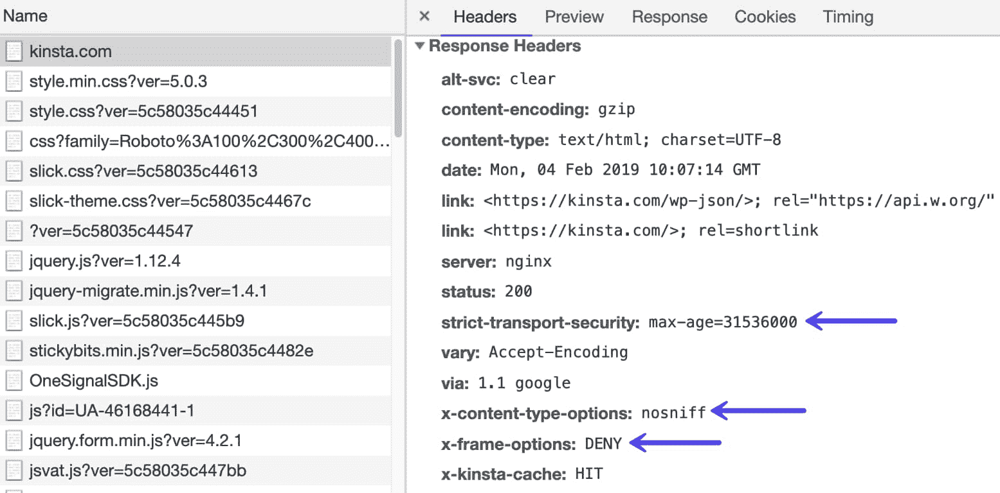

HTTP security headers


你也可以用 Scott Helme 的免费 [securityheaders.io](https://securityheaders.io/) 工具扫描你的 WordPress 网站。这将显示您的站点上当前有哪些 HTTP 安全头。如果你不确定如何实现它们，你可以问你的主人他们是否能帮忙。

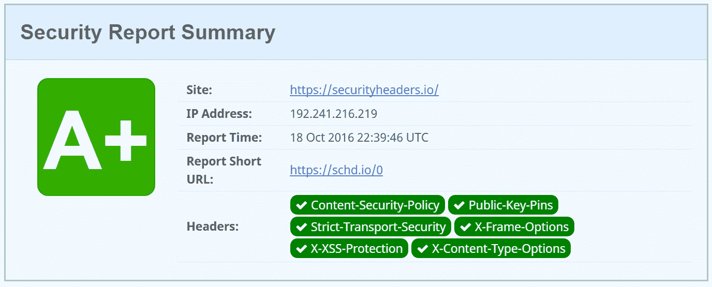

HTTP security headers scan


### 重要的

同样重要的是要记住，当你实现 HTTP 安全头时，它会如何影响你的 [WordPress 子域](https://kinsta.com/blog/wordpress-subdomain/)。例如，如果您添加内容安全策略头并按域限制访问，您还需要添加自己的子域。


## 12。使用 WordPress 安全插件

当然，我们必须提到一些 WordPress 安全插件。有很多优秀的开发者和公司提供很好的解决方案来帮助更好地保护你的 WordPress 站点。这里有几个例子。

*   [苏库里安全](https://wordpress.org/plugins/sucuri-scanner/)
*   [iThemes 安全](https://wordpress.org/plugins/better-wp-security/)
*   [文字围栏安全](https://wordpress.org/plugins/wordfence/)
*   [WP 故障 2 禁止](https://wordpress.org/plugins/wp-fail2ban/)
*   [SecuPress](https://wordpress.org/plugins/secupress/)

Kinsta 拥有硬件防火墙、主动和被动安全、按分钟正常运行时间检查和许多其他高级功能，以防止攻击者获取您的数据。如果尽管我们尽了最大努力，您的网站还是受到了损害**，我们将免费修复它**。

以下是上述插件的一些典型特性和用途:

*   创建用户配置文件时，生成并强制使用强密码
*   强制密码过期并定期重置
*   用户操作日志记录
*   WordPress 安全密钥的简单更新
*   恶意软件扫描
*   双因素认证
*   [reCAPTCHAs](https://kinsta.com/blog/wordpress-captcha/)
*   WordPress 安全防火墙
*   IP 白名单
*   IP 黑名单
*   文件变更日志
*   监控 DNS 更改
*   阻止恶意网络
*   查看访问者的 WHOIS 信息

许多安全插件包含的一个非常重要的特性是校验和工具。这意味着他们检查你的 WordPress 安装，并寻找 WordPress 提供的核心文件的修改(通过 API)。对这些文件的任何更改或修改都可能意味着黑客攻击。您也可以使用 WP-CLI[运行您自己的校验和](https://developer.wordpress.org/cli/commands/core/verify-checksums/)。

请务必阅读我们关于文件完整性监控的全面指南。

另一个值得一提的插件是 [WP 安全审计日志插件。对于那些在](https://wordpress.org/plugins/wp-security-audit-log/) [WordPress multisite](https://kinsta.com/wordpress-multisite-hosting/) 或简单的多作者网站工作的人来说，这太棒了。它有助于确保用户的生产效率，并让管理员看到正在发生变化的一切；例如登录、密码更改、主题更改、小部件更改、新帖子创建、WordPress 更新等。

这是一个完整的 [WordPress 活动日志](https://kinsta.com/blog/wordpress-activity-log/)解决方案。在我写这篇文章的时候，WP 安全审计日志插件已经有超过 80，000 个活跃的安装，5 星级中有 4.7 个。如果你正在寻找[一个 WordPress multisite 兼容的](https://kinsta.com/blog/wordpress-multisite-plugins/)安全解决方案，这是一个极好的选择。


Security audit log viewer


它还具有额外的高级附加功能，如电子邮件通知、用户会话管理、搜索和报告。看看这些额外的 [WordPress 安全插件](https://kinsta.com/blog/wordpress-security-plugins/)可以帮助锁定坏人。

## 13。强化数据库安全性

有几种方法可以让你的 WordPress 数据库更加安全。首先是**使用一个聪明的数据库名**。如果你的网站被命名为排球技巧，默认情况下你的 WordPress 数据库很可能被命名为`wp_volleyballtricks`。通过将您的数据库名称更改为更模糊的名称，使黑客更难识别和访问您的数据库详细信息，从而有助于保护您的网站。

第二个建议是使用不同的数据库表前缀。默认情况下，WordPress 使用`wp_`。将它改为类似于`39xw_`的东西会更安全。当你安装 WordPress 时，它会要求一个表格前缀(如下所示)。也有一些方法可以改变现有安装的 WordPress 表前缀。如果你是金斯塔的客户，这是不需要的。我们已经封锁了网站和数据库！

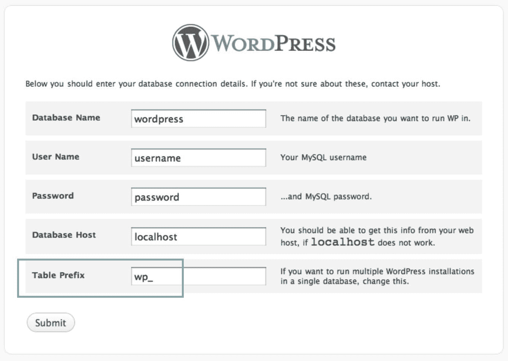

WordPress table prefix – img src: jatinarora


## 14。始终使用安全连接

我们再怎么强调使用安全连接的重要性也不为过！确保你的 WordPress 主机采取预防措施，如提供 SFTP 或 SSH。SFTP 或安全文件传输协议(也称为 SSH 文件传输协议)，是一种用于文件传输的网络协议。与标准 FTP 相比，这是一种更安全的方法。

我们只[支持 Kinsta 的 SFTP 连接](https://kinsta.com/knowledgebase/how-to-use-sftp/),以确保您的数据保持安全和加密。大多数 WordPress 主机通常也使用端口 22 进行 SFTP。在 Kinsta，我们更进一步，每个站点都有一个随机端口，您可以在 MyKinsta 仪表板中找到。

[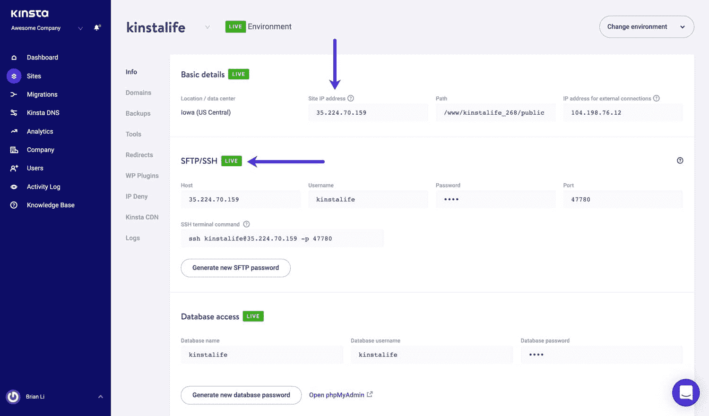](https://kinsta.com/wp-content/uploads/2019/02/mykinsta-sftp-details.jpg)

SFTP details in MyKinsta.


确保您的家庭路由器设置正确也很重要。如果有人黑了你的家庭网络，他们可以获得各种信息，可能包括你的 WordPress 站点的重要信息存储在哪里。以下是一些简单的提示:

*   不要启用远程管理(VPN)。典型的用户从不使用这个功能，通过关闭它，您可以避免将您的网络暴露给外界。
*   默认情况下，路由器使用 192.168.1.1 等范围内的 IP。使用不同的范围，如 10.9.8.7。
*   在您的 Wifi 上启用最高级别的加密。
*   IP 将您的 Wifi 列入白名单，以便只有拥有密码和特定 IP 的人才能访问它。
*   让路由器上的固件保持最新。

在公共场所登录你的 WordPress 网站时，一定要小心。记住，**星巴克不是一个安全的网络！**采取预防措施，例如在单击连接之前验证网络 SSID。您也可以使用第三方 VPN 服务，如 [ExpressVPN](https://www.expressvpn.com/) 来加密您的互联网流量，并向黑客隐藏您的 IP 地址。

## 15。检查文件和服务器权限

在你的安装和网络服务器上的文件权限对于增强你的 WordPress 安全性是至关重要的。如果权限过于宽松，有人可以很容易地访问您的网站并造成严重破坏。另一方面，如果你的权限太严格，这可能会破坏网站的功能。因此，全面设置正确的权限非常重要。

### 文件权限

*   **读取**如果用户有权读取文件，则分配权限。
*   **写入**如果用户有权写入或修改文件，则会分配权限。
*   **执行**如果用户有权运行文件和/或将其作为脚本执行，则会分配权限。

### 目录权限

*   如果用户有权访问指定文件夹/目录的内容，则会分配**读取**权限。
*   如果用户有权添加或删除文件夹/目录中包含的文件，则会分配写权限。
*   **执行**如果用户有权访问实际目录并执行功能和命令，包括删除文件夹/目录中的数据，则分配权限。

你可以使用一个免费的插件，如 [iThemes Security](https://wordpress.org/plugins/better-wp-security/) 来扫描你的 WordPress 网站的权限。


WordPress file permissions scan


这里有一些关于 WordPress 中文件和文件夹权限的典型建议。参见 WordPress Codex 关于[改变文件权限](https://codex.wordpress.org/Changing_File_Permissions)的文章，获得更深入的解释。

*   所有文件都应该是 644 或 640。例外:wp-config.php 应该是 440 或 400，以防止服务器上的其他用户读取它。
*   所有目录都应该是 755 或 750。
*   不应该给任何目录 777，甚至上传目录。

## 16。禁用 WordPress 仪表盘中的文件编辑

很多 WordPress 站点有多个用户和管理员，这使得 WordPress 的安全性更加复杂。一个非常糟糕的做法是给作者或贡献者管理员访问权限，但不幸的是，这种情况经常发生。给用户正确的角色和权限很重要，这样他们就不会破坏任何东西。正因为如此，简单地禁用 WordPress 中的“外观编辑器”是有益的。

你们中的大多数人可能都曾经历过。你在外观编辑器中快速编辑一些东西，突然你看到一个[白色的死亡屏幕](https://kinsta.com/blog/wordpress-white-screen-of-death/)。最好是在本地编辑文件，然后通过 FTP 上传。当然，在最佳实践中，您应该首先在开发站点上测试这样的东西。

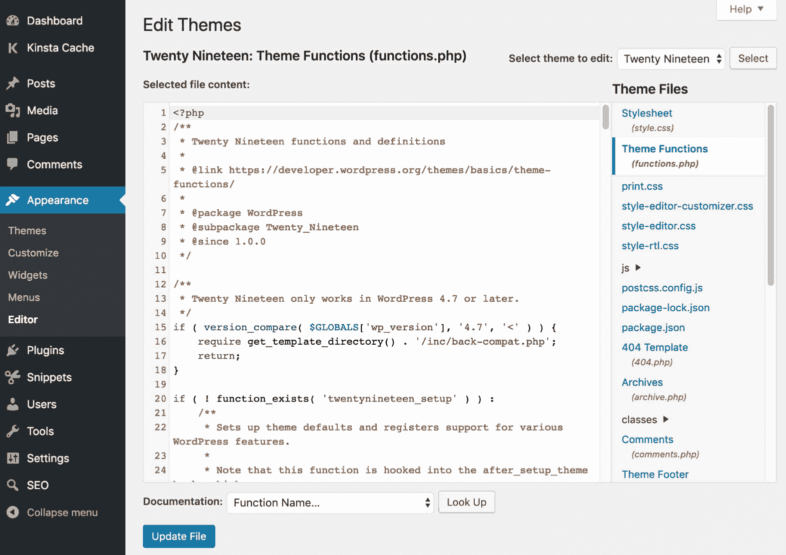

WordPress appearance editor


另外，[如果你的 WordPress 网站被黑了](https://kinsta.com/blog/wordpress-hacked/)，他们可能做的第一件事就是试图通过外观编辑器编辑 PHP 文件或主题。这是他们在你的网站上执行恶意代码的快捷方式。如果他们无法从控制面板访问这些信息，首先，这有助于防止攻击。将以下代码放入您的`wp-config.php`文件中，删除所有用户的“编辑主题”、“编辑插件”和“编辑文件”功能。

```
define('DISALLOW_FILE_EDIT', true);
```

## 17。防止热链接

[热链接](https://kinsta.com/blog/hotlinking/)的概念很简单。你在网上某处找到一张图片，然后直接在你的网站上使用该图片的 URL。此图像将显示在您的网站上，但将从原始位置提供。这实际上是盗窃，因为它正在使用热链接网站的带宽。这可能看起来没什么大不了的，但它可能会产生很多额外的成本。

燕麦片就是一个很好的例子。《赫芬顿邮报》热链接了他的一幅由多幅图像组成的漫画，这张漫画的账单高达 1000 多美元。


Hotlinking bill


### 防止 Apache 中的热链接

为了防止 [Apache](https://kinsta.com/knowledgebase/what-is-apache/) 中的热链接，只需将下面的代码添加到您的`.htaccess`文件中。

```
RewriteEngine on
RewriteCond %{HTTP_REFERER} !^$
RewriteCond %{HTTP_REFERER} !^http(s)?://(www\.)?yourdomain.com [NC]
RewriteRule \.(jpg|jpeg|png|gif)$ http://dropbox.com/hotlink-placeholder.jpg [NC,R,L]
```

第二行定义了允许的推荐人-允许直接链接到图片的网站，这应该是你实际的网站。如果您希望允许多个网站，您可以复制此行并替换推荐人。如果你想生成一些更复杂的规则，看看这个 [htaccess 热链接保护生成器](http://www.htaccesstools.com/hotlink-protection/)。

### 防止 NGINX 中的热链接

要防止 NGINX 中的热链接，只需在配置文件中添加以下代码。

```
location ~ .(gif|png|jpe?g)$ {
valid_referers none blocked ~.google. ~.bing. ~.yahoo yourdomain.com *.yourdomain.com;
if ($invalid_referer) {
return 403;
}
} 
```

### 防止 CDN 上的热链接

如果您从 CDN 提供图像，那么设置可能会略有不同。这里有一些流行的 CDN 提供商的资源。

*   [带 KeyCDN 的热链接保护](https://www.keycdn.com/support/create-a-zonereferrer/)
*   [采用 Cloudflare 的热链接保护](https://support.cloudflare.com/hc/en-us/articles/200170026-What-does-enabling-CloudFlare-Hotlink-Protection-do-)
*   [带 MaxCDN 的热链接保护](https://www.maxcdn.com/blog/http-referer-blacklisting/)

## 18。总是做备份

备份是每个人都知道他们需要但并不总是带走的东西。上面的大多数建议都是你可以用来更好地保护自己的安全措施。但是不管你的网站有多安全，它永远不会是 100%安全的。所以你需要备份以防最坏的情况发生。

大多数托管 WordPress 主机的提供商现在提供备份。Kinsta 有五种不同类型的备份，包括[自动备份](https://kinsta.com/help/wordpress-backups/)，这样你晚上就可以高枕无忧了。您甚至可以一键恢复您的网站。

[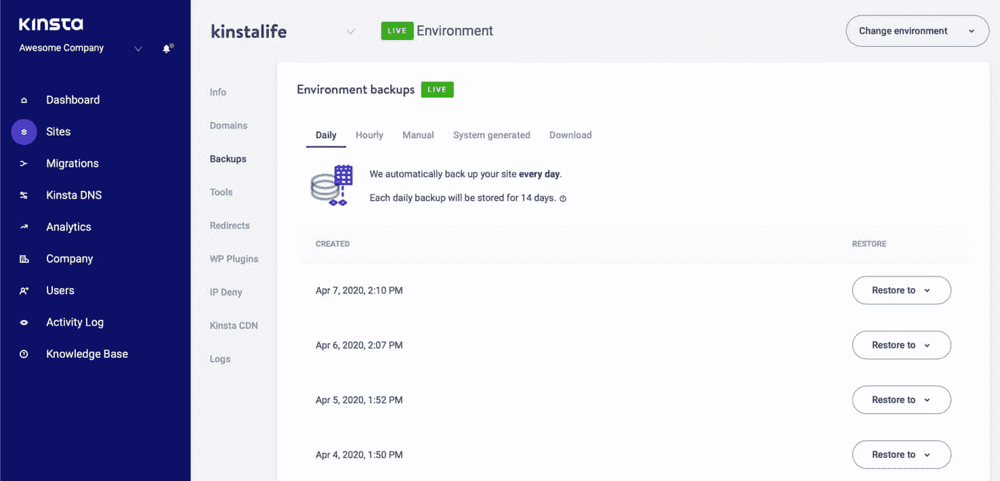](https://kinsta.com/wp-content/uploads/2014/12/backups-in-mykinsta.jpg)

Backups in MyKinsta.


如果你的主机没有备份，你可以使用一些流行的 WordPress 服务和插件来自动完成这个过程。

### WordPress 备份服务

WordPress 网站备份服务通常月费很低，会把你的备份储存在云中。

*   (来自 Automattic 团队，现在是 Jetpack 的一部分)
*   [代码卫士](https://www.codeguard.com/)
*   [博客金库](https://blogvault.net/)

### WordPress 备份插件

WordPress 备份插件允许你通过 FTP 抓取你的备份，或者与外部存储源整合，如亚马逊 S3、谷歌云存储、谷歌驱动或 Dropbox。我们强烈建议使用增量解决方案，这样可以使用更少的资源。

*   [复印机](https://wordpress.org/plugins/duplicator/)
*   [WP 时间胶囊](https://wptimecapsule.com/)
*   [BackupBuddy](https://ithemes.com/purchase/backupbuddy/)
*   [上升气流加](https://wordpress.org/plugins/updraftplus/)
*   [备份 WordPress](https://wordpress.org/plugins/backupwordpress/)
*   [后退](https://wordpress.org/plugins/backwpup/)
*   [WP BackItUp](https://www.wpbackitup.com/)

Note: We don’t allow non-incremental backup plugins on Kinsta servers due to performance issues. But this is because we handle all this for you at a server-level so it doesn’t slow down your WordPress site.

## 19。DDoS 保护

[DDoS](https://kinsta.com/blog/what-is-a-ddos-attack/) 是一种 DoS 攻击，利用多个系统来攻击单个系统，从而导致拒绝服务(DOS)攻击。 [DDoS 攻击](https://kinsta.com/blog/what-is-a-ddos-attack/)并不新鲜——据[大英百科全书](http://www.britannica.com/topic/denial-of-service-attack)报道，第一个记录在案的案例可以追溯到 2000 年初。与黑客入侵您的网站不同，这些类型的攻击通常不会损害您的网站，而只是让您的网站宕机几个小时或几天。

你能做些什么来保护自己？一个最好的建议是使用像 [Cloudflare](https://www.cloudflare.com/) 或 [Sucuri](https://sucuri.net/) 这样的知名第三方安全服务。如果你在经营一家企业，投资他们的保费计划是有意义的。如果你是在 Kinsta 上托管的，你就不需要担心自己设置 DDoS 保护了。我们所有的计划都包括一个内置 DDoS 保护的免费 [Cloudflare 集成](https://kinsta.com/cloudflare-integration/)。

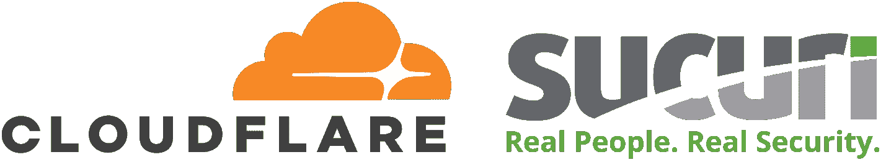

DDoS protection from Cloudflare and Sucuri


它们的高级 DDoS 保护可用于缓解各种形式和规模的 DDoS 攻击，包括针对 UDP 和 ICMP 协议的攻击，以及 SYN/ACK、DNS 放大和第 7 层攻击。其他好处包括把你放在一个代理后面，这有助于隐藏你的原始 IP 地址，尽管它不是防弹的。

请务必查看我们的案例研究[如何阻止 DDoS 攻击](https://kinsta.com/blog/ddos-attack/)。我们有一个客户，他有一个小型电子商务网站，运行简单的数字下载，在 7 天内一个页面收到了超过**500 万次请求**。该网站通常每天只产生 30-40 MB 的带宽和几百个访问者。但是出乎意料的是，该网站一天的数据传输量瞬间达到了 15-19 GB！这是一个 4650% 的**增长。谷歌分析显示没有额外的流量。所以这并不好。**


High bandwidth from DDoS attack


客户[在他们的网站上实现了 Sucuri 的 web 应用防火墙](https://kinsta.com/blog/sucuri-firewall/),所有的带宽和请求都立即从网站上消失了(如下图所示),此后再也没有出现过任何问题。所以，如果你遇到这样的问题，这绝对是一个很好的投资和节省时间的方法。


Added Sucuri web application firewall


## 摘要

如你所见，有很多方法可以加强你的 WordPress 安全性。使用聪明的密码，保持核心和插件的更新，选择一个安全的托管 WordPress 主机，这些只是保持你的 WordPress 站点安全运行的几个例子。对你们中的许多人来说，你的 WordPress 站点既是你的生意也是你的收入，所以花些时间实现上面提到的一些安全最佳实践是很重要的，宜早不宜迟。

有任何我们遗漏的重要的 WordPress 安全提示吗？如果是这样，请在下面的评论中告诉我们。

* * *

让你所有的[应用程序](https://kinsta.com/application-hosting/)、[数据库](https://kinsta.com/database-hosting/)和 [WordPress 网站](https://kinsta.com/wordpress-hosting/)在线并在一个屋檐下。我们功能丰富的高性能云平台包括:

*   在 MyKinsta 仪表盘中轻松设置和管理
*   24/7 专家支持
*   最好的谷歌云平台硬件和网络，由 Kubernetes 提供最大的可扩展性
*   面向速度和安全性的企业级 Cloudflare 集成
*   全球受众覆盖全球多达 35 个数据中心和 275 多个 pop

在第一个月使用托管的[应用程序或托管](https://kinsta.com/application-hosting/)的[数据库，您可以享受 20 美元的优惠，亲自测试一下。探索我们的](https://kinsta.com/database-hosting/)[计划](https://kinsta.com/plans/)或[与销售人员交谈](https://kinsta.com/contact-us/)以找到最适合您的方式。