# 61 个 WordPress SEO 提示让你的有机流量增长 250%

> 原文：<https://kinsta.com/blog/wordpress-seo/>

搜索引擎优化( [SEO](https://kinsta.com/blog/what-does-seo-stand-for/) )在过去的十年里发生了巨大的变化。而且， [WordPress 的市场份额增长得越多](https://kinsta.com/wordpress-market-share/)，就有越多的人寻找方法来改善他们的 WordPress SEO。

企业现在必须采取新的和独特的方法来赢得永无止境的搜索引擎结果页面(SERPs)的竞争。许多自助公司和博客在有机搜索和 WordPress SEO 上建立了他们的整个品牌。虽然这可能有风险，但它仍然是 SEO 活跃和良好的标志。

在这篇关于 WordPress SEO 的深度指南中，我们将分享**60 多个 SEO 技巧**，它们帮助我们在 Kinsta 定期增加有机流量。我确信这些将帮助你在你的 [WordPress 网站](https://kinsta.com/knowledgebase/what-is-wordpress/)上的流量暴涨，并在你的竞争中占据优势。

有很多内容要讲，所以让我们开始吧！

[SEO has changed dramatically over the past few years but it's just as important as ever⚡️ Follow this in-depth guide to skyrocket your organic traffic and dominate your competition 🚀Click to Tweet](https://twitter.com/intent/tweet?url=https%3A%2F%2Fkinsta.com%2Fblog%2Fwordpress-seo%2F&via=kinsta&text=SEO+has+changed+dramatically+over+the+past+few+years+but+it%27s+just+as+important+as+ever%E2%9A%A1%EF%B8%8F+Follow+this+in-depth+guide+to+skyrocket+your+organic+traffic+and+dominate+your+competition+%F0%9F%9A%80&hashtags=SEO%2CWordPress)

## 2022 年搜索引擎优化提示:我们的结果

SEO 包括帮助网页内容在谷歌、必应和雅虎等搜索引擎中排名靠前的战略、战术和方法。SERPs 上更好的位置导致[更多的有机流量](https://kinsta.com/blog/how-to-drive-traffic-to-your-website/#35-target-topics-with-traffic-potential)和[更高的转化率](https://kinsta.com/blog/click-through-rate/)。

SEO 有两个方面。首先是技术部分，这涉及到利用搜索引擎的排名算法。第二个涉及更多的在线业务的自然品牌战略。

对于企业来说，在 SEO 上脱颖而出依赖于提供高质量的网站体验，包括令人敬畏的内容、快速的页面和安全的网站。这种胜利来自于遵循 **WordPress SEO 最佳实践**的基本要素。


> Kinsta 把我宠坏了，所以我现在要求每个供应商都提供这样的服务。我们还试图通过我们的 SaaS 工具支持达到这一水平。
> 
> <footer class="wp-block-kinsta-client-quote__footer">
> 
> 
> 
> <cite class="wp-block-kinsta-client-quote__cite">Suganthan Mohanadasan from @Suganthanmn</cite></footer>

[View plans](https://kinsta.com/plans/)

搜索引擎优化到底有多有效？

嗯，证据总是在布丁里！

因为我们是大量的 SEO 粉丝(真正的狂热分子，是吗？😅)的搜索引擎优化，我们一直保持它作为我们的北极星，因为我们早期的出版。你会在下面发现我们的有机交通已经发展和增长了多少。而所谓有机，我们指的只是搜索引擎产生的流量(不包括[社交媒体](https://kinsta.com/blog/wordpress-social-media-plugins/)、[付费广告](https://kinsta.com/blog/adsense-alternatives/)等)。).

[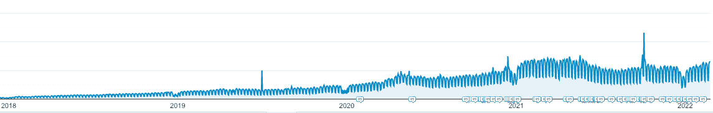](https://kinsta.com/wp-content/uploads/2022/02/kinsta-organic-growth-wordpress-seo.png)

Kinsta’s organic traffic growth.


这里有几个额外的截图，为您提供更丰富的比较。

如您所见，**我们的有机流量同比增长超过 56%**(同比):

[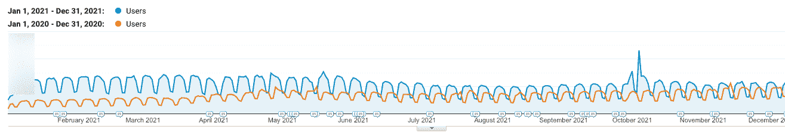](https://kinsta.com/wp-content/uploads/2022/02/Kinsta-organic-traffic-2020-vs-2021.png)

Kinsta organic traffic 2020 vs 2021.


如果我们将其与两年前进行比较，这是 250%的有机增长:

[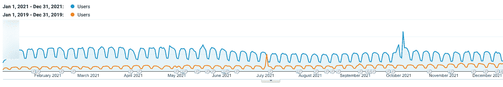](https://kinsta.com/wp-content/uploads/2022/02/Kinsta-organic-traffic-2019-vs-2021.png)

Kinsta organic traffic 2019 vs 2021.


本着真正的*吃你自己的狗粮*的精神，我们通过实施这篇 WordPress SEO 指南中概述的策略实现了这一切。

不过，关于我们的成就已经说得够多了。我们开始工作吧！

查看下面 2022 年的所有 WordPress SEO 提示和常见问题，帮助你在 SERPs 和有机流量上取得更好的结果。

## 页面搜索引擎优化

### 1.安装一个 WordPress SEO 插件

对于 SEO 来说，WordPress 开箱即用已经很不错了。然而，我们总是建议人们安装一个搜索引擎优化插件。这让你可以完全控制优化谷歌从你的网站上看到的内容。

就受欢迎程度而言，免费的 [Yoast SEO](https://kinsta.com/blog/yoast-seo/) 插件是明显的赢家，但它不是唯一的！例如，查看我们的 [Rank Math vs Yoast SEO](https://kinsta.com/blog/rank-math-vs-yoast/) 深度比较，或者浏览我们的[最佳 SEO 插件](https://kinsta.com/blog/best-seo-plugins-for-wordpress/#the-best-seo-plugins-for-wordpress-2022)精选列表以获得更多灵感。

在 Kinsta，我们使用 Yoast SEO，这就是为什么你会在这个 WordPress SEO 指南中注意到几个截图/图片。一个好的 SEO 插件可以让你:

*   [用页面和关键词分析写出更好的内容](https://kinsta.com/blog/long-form-articles/)。
*   编辑您的[元描述](https://kinsta.com/blog/meta-description-wordpress/)。
*   自动生成 [XML 站点地图](https://kinsta.com/blog/wordpress-sitemap/)。
*   [启用面包屑](https://kinsta.com/blog/wordpress-breadcrumbs/)。
*   添加社交和[模式标记](https://kinsta.com/blog/schema-markup-wordpress/)。

它还提供了许多其他优化选项。Yoast 拥有超过 500 万次安装，拥有令人印象深刻的五星评级。你可以从 WordPress 知识库下载免费插件，或者按照下面的步骤从你的 [WordPress 仪表盘](https://kinsta.com/knowledgebase/wordpress-admin/)中安装它。

#### 第一步:搜索 Yoast SEO

在 WordPress 仪表盘的插件部分，选择添加新插件。在那里，搜索 Yoast SEO:

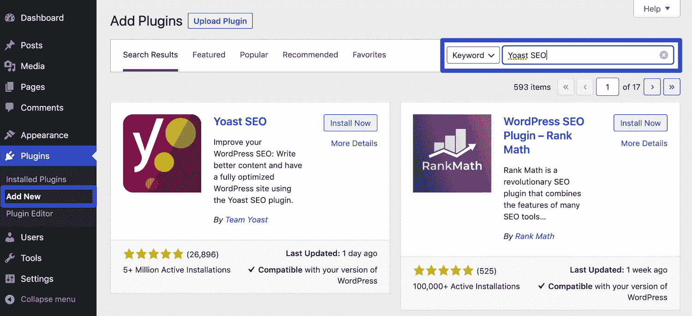

Searching for Yoast SEO in the WordPress dashboard.


你会看到一张卡片，上面有插件的名字，还有一个 **Install Now** 按钮。

#### 步骤 2:安装并激活插件

点击立即安装按钮，它将被一个蓝色的**激活**按钮替代:

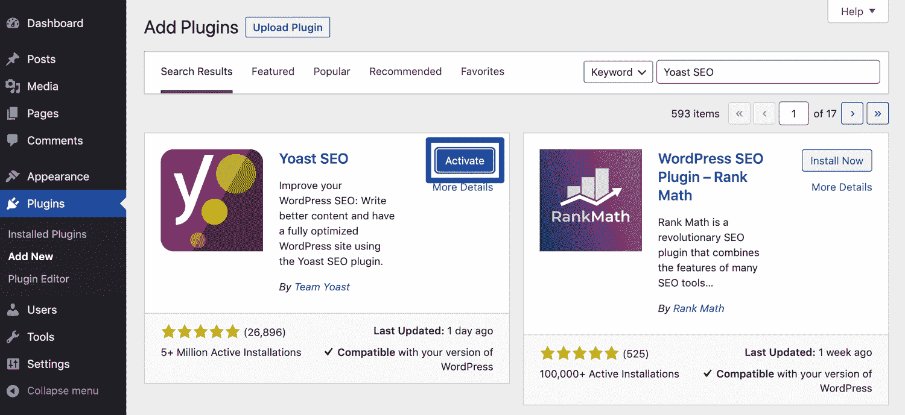

Activating the Yoast SEO plugin.


这将在您的网站上启用 Yoast 的功能。

#### 步骤 3:访问插件的设置

一旦插件被激活，你会在你的工具条中看到一个新的 SEO 部分:

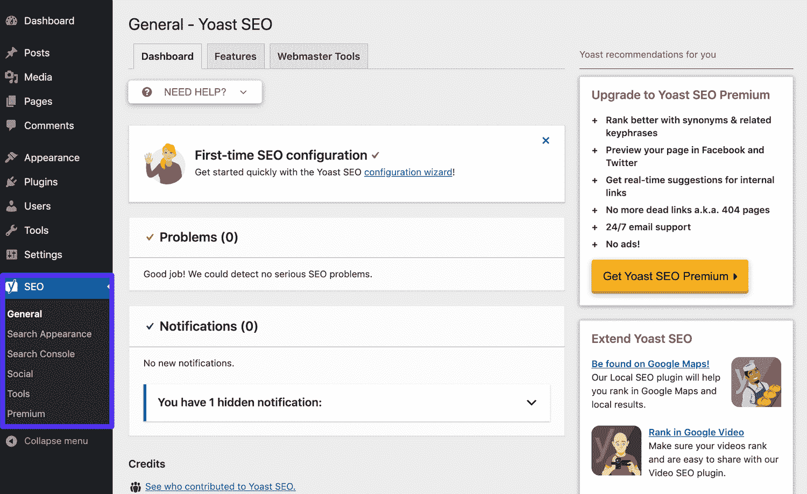

The Yoast SEO settings in the WordPress dashboard.


在这里，您可以访问 Yoast 的设置来优化您的网站。我们将在这篇文章的其他部分提到这个领域。


### 2.优化您的标题标签

在你的博客文章或页面标题标签中包含你主要关注的关键词。在过去，搜索引擎优化专家甚至建议尽可能将你的关键词放在标题的开头，因为这将在搜索引擎中带来更大的权重。

2022 年，这种方法正在慢慢失去支持者。尽管在标题标签中尽早包含重要的关键词仍然很重要，但事情现在正朝着更复杂的场景发展，在这些场景中，应该在关键词相关性之上考虑[点击率(CTR)优化](https://kinsta.com/blog/click-through-rate/#organic-search-click-through-rates)。

一些人报告说，他们的点击率增加了 20%，只需对他们的标题做些小改动。

例如，我们将关键字“WordPress SEO”放在这篇博文标题的最前面，不仅是为了提高 SEO，更主要的是为了让读者清楚这篇博文的内容，从而提高我们的点击率。

那么，如何将焦点关键词添加到标题标签中呢？

标题受像素限制，这意味着谷歌只会显示前 600 个像素。许多 SEO 插件使用字符数，这是一个非常接近的近似值。

你可以在 Yoast SEO 插件中手动设置 title 标签，如下所示。请记住，谷歌桌面上的可视字符限制在 65 个左右。如果你忽略了这一点，搜索者可能看不到你在 SERPs 上的完整标题:

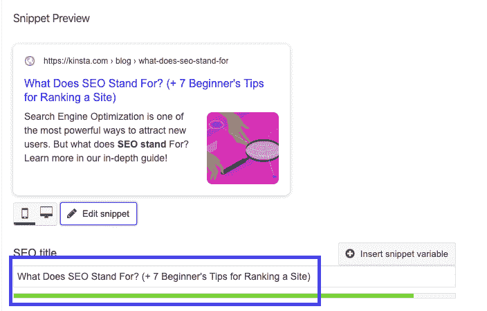

The title tag in the Yoast SEO plugin.


对你的标题进行分割测试(也称为 A/B 测试)是另一种提高点击率的有效方法，可以帮助谷歌发现你的内容更具相关性。一些工具允许你 A/B 测试标题标签和元描述来提高你的点击率。

另一个要考虑的因素是是否要在你的头衔标签末尾使用你公司的名字。在某些情况下，谷歌可能会决定改变你的标题标签，最常见的更新是在标题末尾添加网站名称。

例如，下面这篇文章的标题标签是“深入 WordPress 自动更新”然而，正如你所看到的，我们的品牌已经被添加到谷歌搜索结果的标题中。

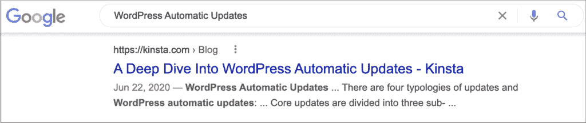

Rewriting the title tag for Google.


包括你的公司名称会侵蚀你的字符限制，所以请记住这一点，以避免你的标题标签在搜索结果中被截短。

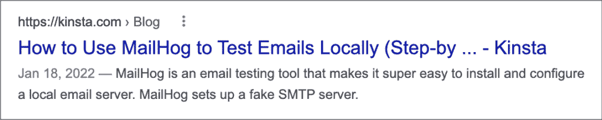

Cutting short the title tag for Google.


### 3.写元描述来增加点击率

当涉及到排名时，元描述不会影响你的 WordPress SEO。然而，它们确实会影响你的点击率。一个写得好的元描述可以吸引用户点击你的文章，而不是在 SERPs 中点击它上面或下面的文章。

你的点击率越高，你得到的流量就越多。如果用户没有返回到谷歌，这提供了一个强烈的信号，表明你的内容很受欢迎，这意味着谷歌更有可能将你的页面排在更高的位置。所以，从某种意义上来说，元描述可以间接影响你的 SEO。

您可以在 Yoast SEO 插件中手动设置您的元描述，方法是单击编辑器下方的编辑片段按钮:


Meta description in Yoast SEO plugin.


查看我们的视频指南，在 WordPress 中添加元描述:


以前，元描述被限制在 156 个字符左右。谷歌在 2017 年 12 月将其更新为 320 个字符，但随后又将这一变化恢复为 150 至 170 个字符之间。超过这个范围的任何东西在 SERPs 中都是不可见的。

此外，明智的做法是在元描述中包含你的焦点关键词。当在搜索结果中显示搜索词时，谷歌会用粗体突出显示。

例如，假设你在谷歌中搜索“托管 WordPress 主机”。

我们有一篇[博客文章，在元描述](https://kinsta.com/blog/managed-wordpress-hosting/)中有“托管 WordPress hosting ”,所以谷歌加粗了这个与你的搜索词相关的关键词。

通过在元描述中包含你的焦点关键词，你可以更突出一点:

[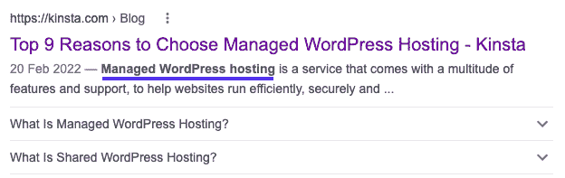](https://kinsta.com/wp-content/uploads/2022/03/Bolded-keyword-meta-description.png)

Bolded keyword in the meta description.


但是，请记住，Google 有时会根据搜索查询自动重写元描述，这意味着您输入的内容并不一定会显示在 SERPs 中。例如，在这种情况下，Google 选择通过从页面中提取与搜索查询匹配的其他文本来重写元描述。


Google’s use of meta description is dynamic.


如下所示，当使用不同的查询时，该页面的元描述会发生变化:

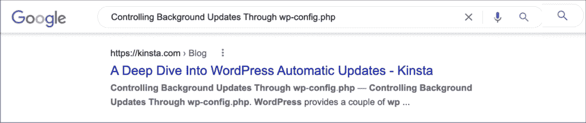

Google dynamically changes the meta description.


这不一定是件坏事。谷歌一直在测试其搜索结果，所以重写通常有助于用户看到该页面与他们的搜索相关。

**查看我们的视频指南，撰写更好的元描述:**


### 4.使用正确的标题标签

谷歌爬虫(Googlebot)检查 [HTML](https://kinsta.com/blog/learn-html/) 标题标签(H1、H2、H3 等。)来确定网站内容的相关性。一般来说，最佳实践是每个帖子或页面有一个 H1 标签，然后在下面有多个 H2s 和 H3。

请将此视为重要性的等级。H1 标签是你最重要的标题，应该包含你的焦点关键词。额外的标题也可以包括你的关键字或者它的长尾变体。

但是，不要滥用表头。这些应该只是用来分割你的内容，使访问者更容易阅读，而不是作为一种手段，把关键词塞进你的页面的显著位置。

大多数 WordPress 主题，如果编码正确，会自动分配你的页面或文章的标题作为 H1 标题。然后，您可以设置其他标题(H2、H3、H4 等)。)在您的帖子或页面中。

您可以使用可视化编辑器中的下拉菜单在[经典编辑器](https://kinsta.com/blog/disable-gutenberg-wordpress-editor/)中创建标题:

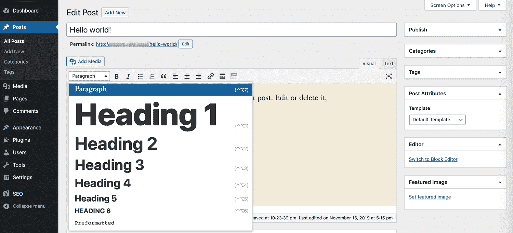

Adding a header in the Classic Editor.


这将自动为选定的文本分配 HTML 标签，Google 将需要这些标签来阅读您的标题。在块编辑器中，可以使用标题块达到相同的效果:

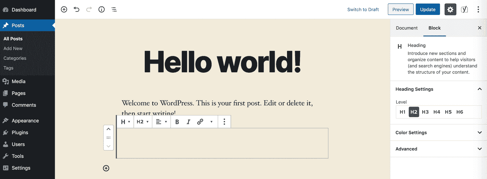

Adding a header in the Block Editor.


当然，你也可以[手动添加 HTML 标签](https://kinsta.com/knowledgebase/edit-wordpress-code/)。

### 5.注意字数

“内容为王”这句老话在 2022 年依然鲜活。谷歌和你的访问者都喜欢高质量的内容。发布长篇内容也比发布短篇好得多。

当然，这可以有所不同。如果你运行一个新闻网站，这可能是相反的，因为你想快速推出内容，以确保你跟上相关的事件。

然而，[长篇内容已经一次又一次地被证明在 SERPs 上胜出](https://kinsta.com/blog/how-to-drive-traffic-to-your-website/#3-publish-longform-content):

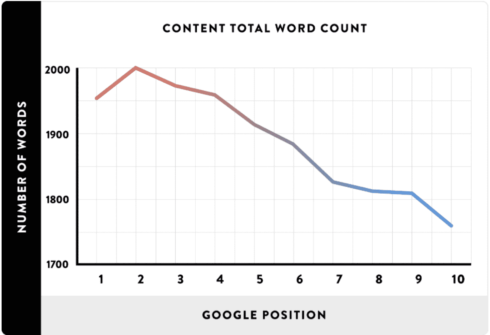

Word count vs Ranking position in Google. (Image source: backlinko.com)


正如你从上面的图片中看到的，占据 SERP 前三名的网站往往有更长的内容。

辣椒 Mediaworks 还发布了一些关于内容长度的[重要性的统计数据，这些数据与 Backlinko 的数据一致:](https://capsicummediaworks.com/content-length/)

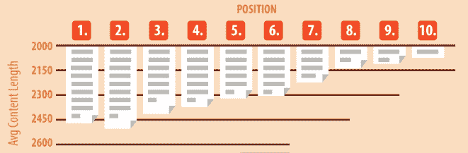

SEO content length.


甚至在几年前，就已经有迹象表明长格式内容的重要性。具体来说，CanIRank 分析了各种影响 SEO 的因素，如较长的内容是否会产生更多的反向链接，以及第三和第四页的排名会发生什么变化。

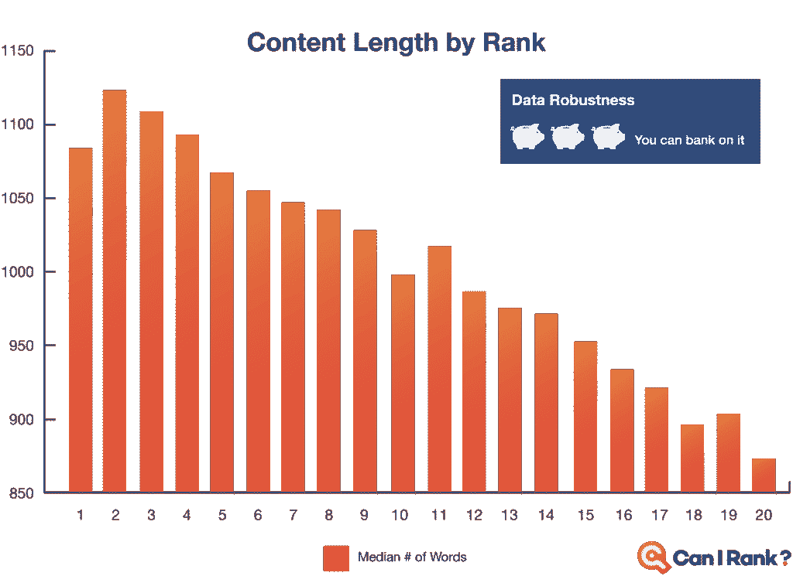

CanIRank’s graph compares the content length and search engine rank.


简而言之，他们发现越长的内容，即使考虑到其他可能的因素，排名仍然更好。

如果这还不够，长篇内容可以进一步帮助你的 SEO。长格式内容的另一个优势是，随着时间的推移，你不仅会对你的焦点关键词进行排名，还会对几个长尾关键词变体进行排名。

有时这扩展到包括数百个流行的搜索术语和短语。你的内容包含的所有长尾变化的流量将会超过你的焦点关键词。更广泛的内容是双赢的。

正如你可能知道的，我们在金斯塔也看到了同样的结果。否则，我们也不会花这么多时间发布像这篇帖子这么长的内容！

### 6.精心制作关键页面来建立你的可信度

这个技巧不是关于一个直接的排名因素，但我们仍然认为它是必不可少的。有几个关键页面是每个优质网站都应该有的。如果你的网站没有这些内容，你可能会让你的访客觉得你不可信。

E-A-T(专业知识、权威性和可信度)是谷歌[搜索质量评级指南](https://static.googleusercontent.com/media/guidelines.raterhub.com/en//searchqualityevaluatorguidelines.pdf)中强调的一个概念，近年来已经成为 SEO 关注的焦点。总的想法是，网站的建设应该以 EAT 为中心，显示他们是各自领域的专家，同时展示权威和信任。

谷歌还[公开](https://developers.google.com/search/blog/2019/08/core-updates)谈论受其核心更新影响的网站应该如何关注 EAT，这表明这个概念对谷歌的算法有多么重要。

如果你还没有，你应该在你的 WordPress 站点上有以下页面(至少):

*   一个关于第页的[。这应该提供一些基本的](https://kinsta.com/blog/about-us-page/)[信息，关于你的品牌](https://kinsta.com/about-us/)，使命，以及你能为访问者提供什么。通过描述你的品牌是如何形成的，这通常有助于将这些内容框定为一个故事。
*   联系页面。展示一个物理地址(如果你的企业有)，电话号码，电子邮件，和其他相关的联系方式，向用户展示你的网站背后有一个真实的人。这也让他们很容易向你提出关于你的产品或服务的问题，从而帮助你达成销售。
*   披露页面、隐私政策以及条款和条件。您的网站所需的法律页面会因您制作的内容类型而有所不同。如果你提供任何建议(比如通过博客帖子)或加入附属链接，一个[披露页面是理想的](https://kinsta.com/affiliate-academy/affiliate-disclosures/)。任何收集用户数据的网站都应该符合[GDPR](https://kinsta.com/blog/wordpress-gdpr-compliance/)和/或[CCPA](https://kinsta.com/blog/wordpress-ccpa-compliance/)的要求。如果你在网上销售产品或服务，你会想列出你的条款和条件。

除了这些网页，在你的网站上添加社交证明也有助于增加你的可信度。链接到你的社交媒体账户和来自客户、顾客或用户的[证明和评论是理想的。
T3】](https://kinsta.com/kinsta-reviews/)

## 离页搜索引擎优化

### 查看我们的[视频指南](https://www.youtube.com/watch?v=Jy_cLS3VShA)来优化链接


### 7.建立高质量的反向链接

对于 WordPress SEO 来说，反向链接仍然至关重要。谷歌使用它们来衡量一个网页有多少权威，并显示另一个相关或重要的网站的支持信息。

当一个高权威的域名链接到你，它会比你想象的做得更多。反向链接的布莱恩·迪恩分析了超过一百万个搜索结果，结论是反向链接仍然是一个重要的排名因素。

一般来说，如果链接到你的域名数量呈上升趋势，这是一个好迹象。这意味着越来越多的网站链接到你的网站。

在布莱恩的研究中，唯一引用域名的数量与高排名最相关。有更多推荐域名的网站排名更高:

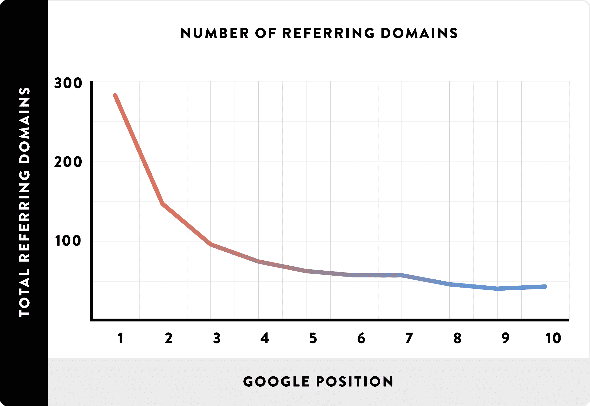

所指域名数量与谷歌排名的相关性。


一个很好的工具来获得你的反向链接概况是 [Ahrefs](https://kinsta.com/blog/best-seo-plugins-for-wordpress/#ahrefs) 。你可以看到你的网站反向链接的总数，引用域名的数量，有机排名关键词，等等。这个平台的反向链接通知也很有帮助。

下面有几个链接到我们内容的网站的例子。具体来说，从 Mozilla 到我们关于如何修复 405 方法不允许错误的指南的链接以及从维基百科到我们的 [PHP 基准测试博客帖子的链接:](https://kinsta.com/blog/php-benchmarks/)

[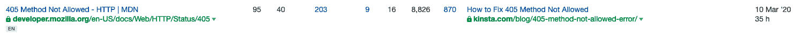](https://kinsta.com/wp-content/uploads/2022/03/inbound-links-example-1.png)

New backlinks


[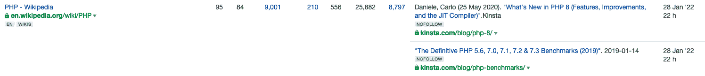](https://kinsta.com/wp-content/uploads/2022/03/inbound-links-example-2.png)

Another example of backlinks.


#### 参与第三方播客来获得链接

另一个产生新的、高质量的入站链接的可靠方法是在[播客](https://kinsta.com/blog/what-is-a-podcast/)上接受采访，这些播客涵盖了你所经历的主题，并向与你的客户一致的受众发表演讲。

这将如何产生你的网站的链接？

几乎每个播客都有一个专门的页面，上面有节目说明、嘉宾姓名和该集提到的一些资源链接。

以 [Kinsta 的商业和技术播客逆向工程](https://kinsta.com/podcast/solo-developer-thousands-websites/)为例:我们所有的客人都有他们网站和社交资料的链接。

[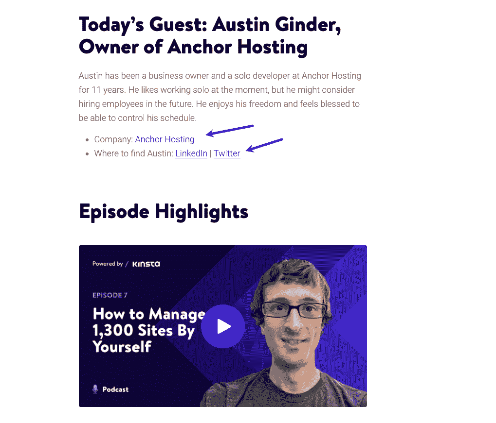](https://kinsta.com/wp-content/uploads/2022/03/link-building-podcasts.png)

Example of how to build links through podcasts.


这是播客的标准方法，因为链接允许听众/观众更深入地挖掘和了解更多关于客人和他们的业务。

#### 利用入站链接建立更强的社交信号

一个小提示:在你的社交媒体渠道上分享链接到你网站的页面。这将帮助你在他们的页面上为他们建立社交信号，建立他们的页面权威。来自页面权威性较高的网站的链接也有利于你的 SEO，所以这是一个双赢的局面。

换句话说，你可以通过分享第三方花时间链接到你的内容来帮助自己。永远不要害怕[联系其他博主](https://kinsta.com/blog/find-email-address/)并要求他们在他们的博客上提及你的精彩文章。

### 8.找到链接到你的竞争对手的网站

让其他网站链接到你的内容可能非常困难。但是很有可能，和你类似的网站已经花时间做了这些，所以看看下面有哪些网站链接到它们可以帮助你发现机会，你可以用同样的方式建立链接。

一些免费增值工具可以帮你做到这一点，比如 [Ubersuggest](https://kinsta.com/blog/best-seo-plugins-for-wordpress/#14-ubersuggest) ，每天在点击付费墙之前查看几个网站。像 Ahrefs 这样的其他工具也可以帮助您查看指向特定页面或整个域的所有链接。

### 9.限定你的出站链接

有时有必要强调你的网站和你链接的网站之间的关系。例如，如果[你在你的内容中包含附属链接](https://kinsta.com/affiliate-academy/affiliate-sales-tips/)来从链接的网站中赚取佣金，这些链接不应该通过 SEO 价值，因为它们被认为是不自然的。链接到其他网站的赞助横幅也是如此。

下面的“rel”属性可以用在`<a>`标签中，向搜索引擎提供它们应该如何处理链接的提示。

#### 关注链接

虽然 dofollow 不是一个链接“rel”属性，但当提到标准链接时，该术语已被广泛使用。

默认情况下，你在 WordPress 中创建的每个链接都是一个 dofollow 链接。谷歌在分析你的网站时会抓取这些类型的链接。这些链接有助于建立影响你排名的权威，因为链接汁是从链接页面传递的。

你可能已经听到人们说你需要更多的反向链接。如果是这样的话，他们可能是指来自其他高权威网站的 dofollow 链接。

#### Nofollow Links

Nofollow 链接包含“nofollow”的“rel”属性，如下所示:

```
<a href="https://kinsta.com" rel="nofollow">my link</a>
```

Nofollow 属性提示[搜索引擎](https://kinsta.com/blog/alternative-search-engines/)爬虫忽略这些链接。不过，这并不是说没有关注链接是不必要的。他们仍然可以产生流量，即使他们没有通过权威和影响你的排名。你可以阅读我们的教程，学习如何在 WordPress 中[添加 nofollow 链接。](https://kinsta.com/knowledgebase/add-nofollow-links-in-wordpress/)

当链接是应链接网站的请求而放置时，通常使用 Nofollow 链接。这是因为链接在页面之间传递值，所以它应该自然发生。操纵网站链接到你是违反谷歌的准则的，所以忽视这一点可能会导致你的网站[被处罚](https://kinsta.com/blog/decline-seo-rankings/#penalties)。

通常，自然的反向链接配置文件包括 dofollow 和 nofollow 链接之间的良好比率。

#### 赞助商链接

赞助商链接包含“赞助商”的“rel”属性，如下所示。这用于显示链接何时被赞助。

```
<a href="https://kinsta.com" rel="sponsored">my link</a>
```

赞助链接通常被用作[付费活动](https://kinsta.com/blog/banner-ad-sizes/)的一部分，其中赞助链接的目标应该是推动流量，而不是传递链接页面的价值。为传递价值的链接付费违反了谷歌的指导方针，所以确保所有赞助链接使用赞助链接属性是很重要的。

#### UGC 链接

如下所示，ugc 链接或用户生成的内容链接包含“UGC”的“rel”属性

```
<a href="https://kinsta.com" rel="ugc">my link</a>
```

UGC 链接用于显示用户何时创建了一个链接。这些链接通常被添加到博客帖子或论坛的评论中，用户可以在那里添加链接。


### 10.在附属链接中添加赞助商属性

许多 WordPress 博客在他们的网站上使用附属链接。当你想追踪一个产品的佣金或推荐，或者网站之间的注册时，通常会用到代销商链接。

不幸的是，谷歌通常不赞成不包括必要的“rel”属性的附属链接。一些网站甚至因为拥有大量的[附属链接](https://kinsta.com/affiliate-academy/what-is-affiliate-marketing/)而受到处罚。为了安全地使用附属链接，它们应该总是包含“赞助商”属性。跟踪你的代销商链接并始终确保他们使用赞助属性的一个好方法是使用一个代销商插件，如[漂亮链接](https://wordpress.org/plugins/pretty-link/)或 [ThirstyAffiliates](https://wordpress.org/plugins/thirstyaffiliates/) 。

谷歌还说[可以使用 nofollow 属性](https://developers.google.com/search/blog/2019/09/evolving-nofollow-new-ways-to-identify#if-i-use-nofollow-for-ads-or-sponsored-links,-do-i-need-to-change-those)作为附属链接，所以如果你已经有了这个属性，就没有必要更新你的链接。

漂亮的链接使您能够创建简单和简短的附属链接，包括赞助属性和 301 重定向。只需进入 WordPress 仪表盘中的“漂亮链接”>“选项”来启用这些设置:

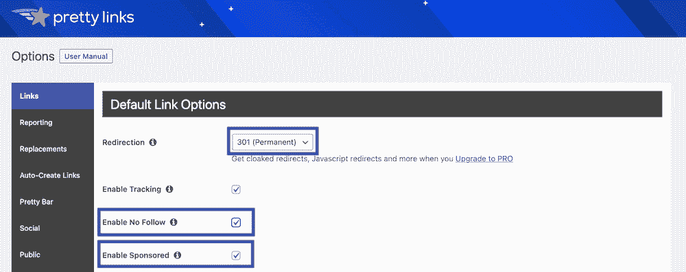

The Pretty Links Options page.


您可以从下拉列表中选择相关的重定向类型，并选择启用无关注和赞助复选框，使您的所有附属链接都包括无关注和赞助属性。添加 nofollow 属性将确保所有搜索引擎都明白这不是一个自然的链接。


### 信息

想通过收入最高的联盟计划赚更多的钱吗？查看如何成为[金士达会员](https://kinsta.com/affiliates/)。


### 11.创建内部链接策略

内部链接从你网站上的一个页面或帖子指向同一网站上的另一个页面或帖子。它们不仅是 SEO 的关键，也是站点导航的关键。

通常，当你提到你写的其他内容或者链接到你的登陆页面时，你会把它们结合起来。

Moz 有一篇关于[为什么内部链接很重要](https://moz.com/learn/seo/internal-link)的文章，简而言之:

*   他们帮助人们在你的网站中导航，导致更多的内容被消费，导致更多的时间花在你的网站上。
*   它们有助于建立你的信息的层次结构和组织你的网站。
*   他们通过链接传递价值，帮助你的网站传播权威。

我们总是建议给你写的每篇文章或每一页至少添加三到五个内部链接。根据内容的长度，您可以添加更多内容。按照下面的步骤在 WordPress 中整合内部链接。

#### 第一步:选择你的锚文本

首先，突出显示你想要添加链接的单词，也就是你的“锚文本”然后，点击链接按钮。在经典编辑器中，您会在主工具栏中找到它:

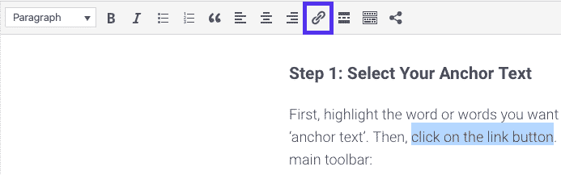

经典编辑器中的添加链接按钮。


在[块编辑器](https://kinsta.com/blog/gutenberg-wordpress-editor/)中，您可以在段落块顶部的小工具栏中找到它:

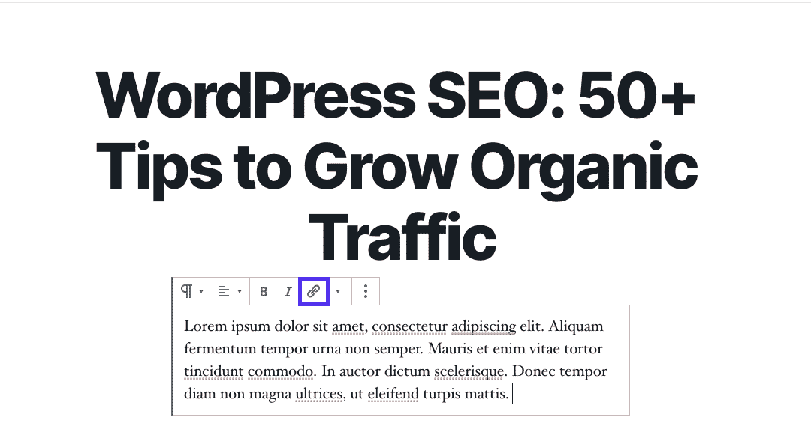

块编辑器中的添加链接按钮。


不管你使用哪个编辑器，当你点击链接按钮时，你会看到一个小文本框出现。

#### 步骤 2:搜索要链接的内部内容

在文本框中，开始键入要链接的内部文章或页面的标题。WordPress 将提供建议可用内容的搜索结果。如果您使用的是经典编辑器，它看起来像这样:

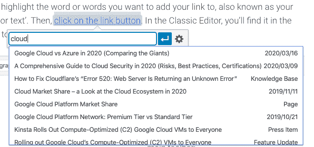

在经典编辑器中搜索内部链接选项。


在块编辑器中，您将看到以下内容:

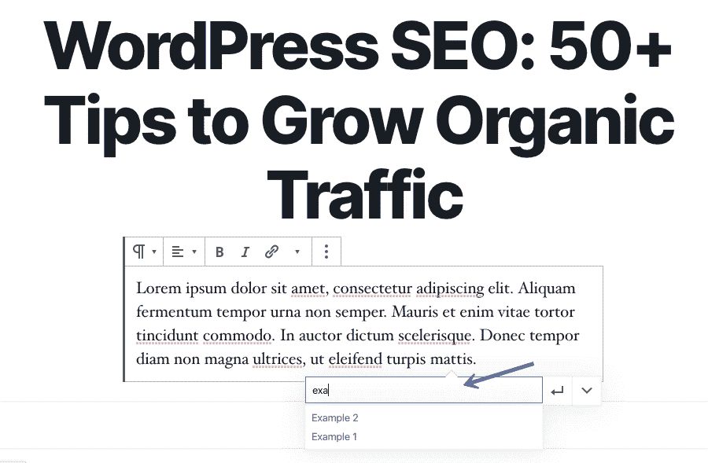

在块编辑器中搜索内部链接选项。


对于这两种情况，你都需要点击文章或页面的标题来添加链接。

### 12.修复断开的链接

没有人喜欢断开的链接，包括谷歌。它们会导致糟糕的用户体验，破坏链接流，这会影响你的页面在搜索结果中的排名。

断开的链接主要有三种类型:

*   **断开的出站链接**:您网站上指向其他网站的链接
*   **断开的内部链接**:从你的一个页面指向你网站上另一个页面的链接
*   **断开的入站链接**:指向您页面的其他网站的链接

#### 断开的出站和内部链接

有几种方法可以让你在 WordPress 网站上找到并修复断开的链接。首先是在谷歌搜索控制台中查找它们。这也是[你应该使用这个平台](https://kinsta.com/blog/google-search-console/)的另一个原因。要在谷歌搜索控制台中找到断开的链接，请检查覆盖率部分的错误和设置部分的无效抓取请求(关于这一点的更多信息，请参见[抓取错误](#25-check-for-crawl-errors)提示)。

一些工具(免费的和付费的)会扫描你的站点，寻找断开的链接。例如，[在线断链检查器](https://www.brokenlinkcheck.com/)是一款免费工具，它会抓取你的页面，并提供遇到的任何断链的详细信息。

Ahrefs 有一个[断开链接检查器](https://ahrefs.com/broken-link-checker)，可以给出网站断开出站链接的例子。虽然它只提供了最多 10 个出站断开链接的样本，但它会告诉您发现了多少个断开链接，以及 dofollow 链接的百分比，因此这可以帮助您了解断开链接的程度。然而，你需要注册一个付费计划才能看到所有这些。

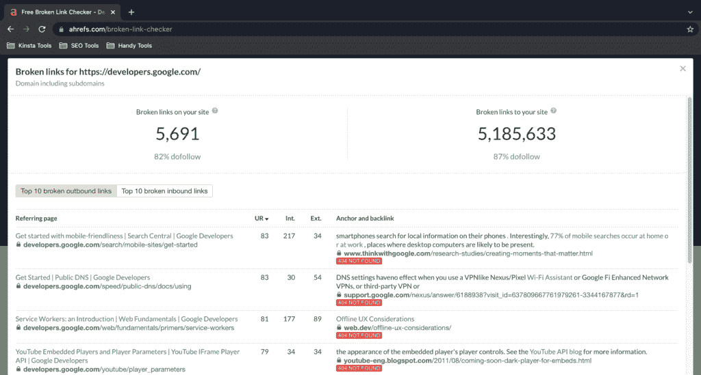

Outbound links in Ahrefs.


你也可以使用爬虫抓取你网站上的页面，就像谷歌抓取你的页面一样。这有助于您发现由断开的链接导致的任何爬行问题。尖叫的青蛙提供了一个免费的工具，让你可以做到这一点，并提供了一个付费版本的附加功能。虽然这个爬虫非常强大，但它是一个先进的工具，所以如果你是 SEO 领域的新手，你可能会想阅读一下[如何使用它](https://www.screamingfrog.co.uk/quick-start-guide/)。

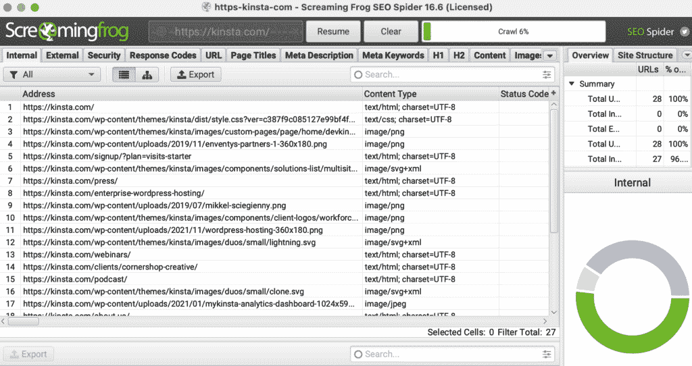

Screaming Frog’s crawler.


WordPress 也有断开的链接插件。然而，我们不推荐这些，因为它们会损害你网站的性能。

#### 断开的入站链接

由于你无法控制外部网站如何链接你，找到并修复指向你的网站的坏链接可能会更有挑战性。Ahrefs 断开链接检查器(如上所述)也提供了多达 10 个断开的入站链接的例子，但付费工具提供了更多的数据。这是值得每月花费的，特别是对于那些已经存在了一段时间的大型网站，因此随着时间的推移，他们更有可能建立一个断开链接的列表。

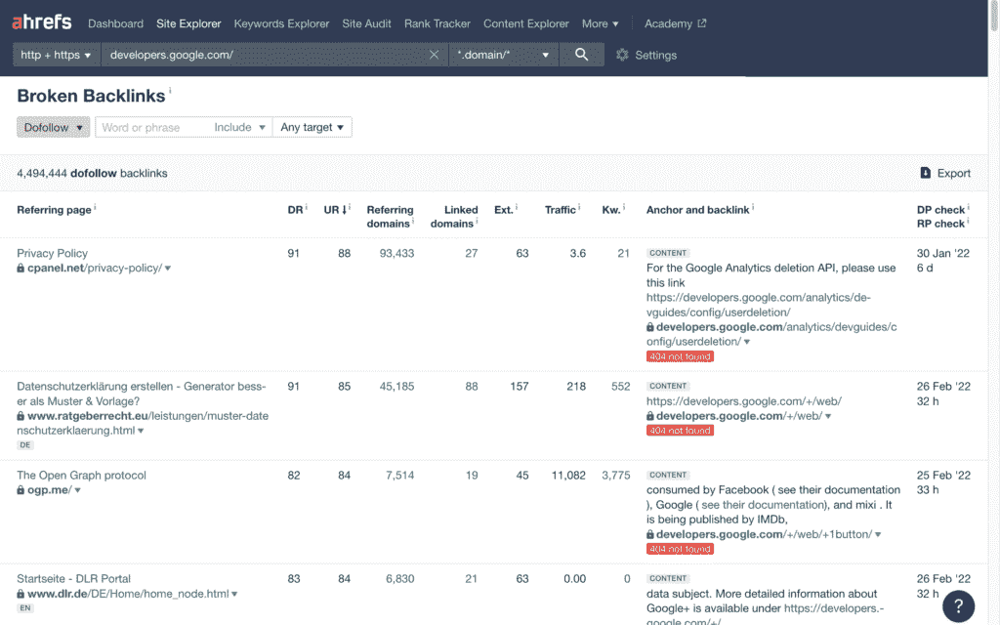

Ahrefs broken backlinks tool.


一旦你有了一个坏链接的列表，你可以联系链接网站，要求他们更新链接，或者简单地添加 301 重定向从坏的网址到正确的网址(或者到你网站上的适当页面)。这将恢复链接的流量，给你的页面一个即时的提升，有助于提高它们在搜索中的排名。

### 13.不要害怕链接到外部资源

像添加内部链接一样，你也应该链接到其他网站的页面，为你的访问者提供围绕你所涉及主题的额外背景。例如，您可能会链接到一个关于某个特定主题的详细指南，而您的网站上没有涉及该主题。通过添加引用外部内容的链接，您可以让您的读者进一步研究不同的主题，使您的内容成为一个很好的资源，值得在搜索结果中排名靠前。

这也是开始与其他品牌对话的好方法。如果你在帖子中链接到另一家公司，发布后[给他们发一封快速电子邮件](https://kinsta.com/blog/find-email-address/)或[推特，并要求分享](https://kinsta.com/blog/twitter-marketing/)。如果他们在自己的社交档案上分享，他们的帖子可以为你带来更多流量。我们自己也经常使用这种方法。

我们建议在每个内容中至少添加两个外部链接。这样做的时候，让人们留在你的网站上的一个很好的小技巧是让链接在一个新的标签页或窗口中打开。

有些人可能会说他们不喜欢这样，但是这可以帮助鼓励用户以后再来浏览你的网站，否则他们可能会忘记你。

在块编辑器中，您可以通过单击链接，然后单击下拉箭头并切换开关，将链接设置为在新选项卡中打开:

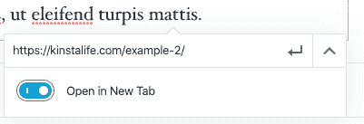

设置一个链接，在块编辑器的新标签中打开。


按照下面的快速步骤在 Classic 编辑器的新标签或窗口中打开链接。

#### 步骤 1:打开你的链接设置

在 Classic 编辑器中打开您的帖子或页面，然后导航到您想要修改的链接。就像在块编辑器中一样，单击它以访问链接设置:


在经典编辑器中打开链接设置。


选择铅笔图标编辑链接。

#### 步骤 2:选择“在新标签页中打开链接”复选框

接下来，单击齿轮图标以访问其他设置:

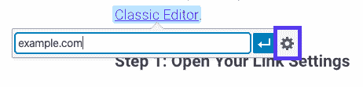

在经典编辑器中访问附加链接设置。


在 URL 和链接文本栏下，您会看到一个标记为“在新标签中打开链接”的复选框。选择它以将此功能应用于您的链接:

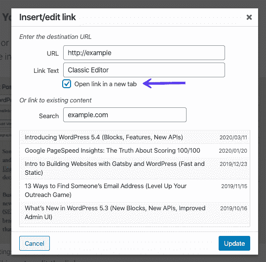

设置一个链接在经典编辑器的新标签页中打开。


这将把`target="_blank"`元素添加到链接的 HTML 标签中。结果将如下所示:

```
<a href="https://kinsta.com" target="_blank">Kinsta</a>
```

如果需要，您可以在[文本编辑器](https://kinsta.com/blog/best-text-editors/)中手动合并。

### 14.在较长的内容中加入锚链接

你可能遇到过[锚链接](https://kinsta.com/blog/anchor-links/)，尤其是如果你阅读了很多长博客文章的话。这些链接可以让你跳转到文章的不同部分。

我们在 Kinsta 博客上使用它们来为我们的一些文章创建目录:

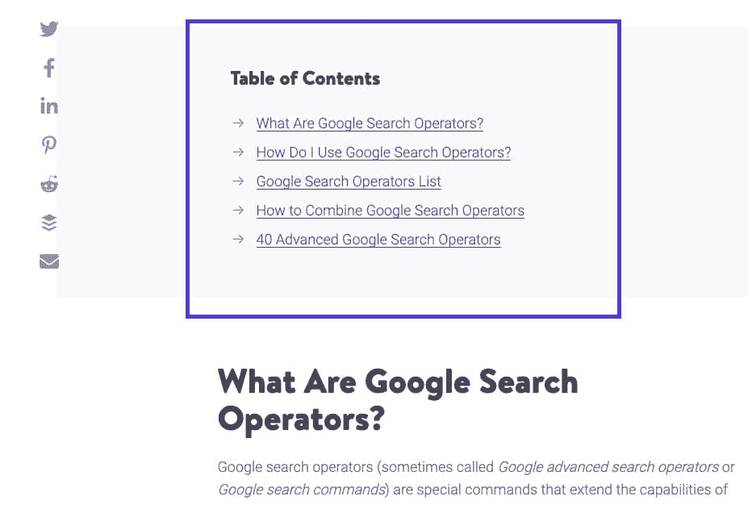

在金斯塔的博客中锚定链接。


锚链接对于改善用户体验是非常好的，因为它们能让读者直接找到他们想要的答案。在一篇冗长的文章中，有些读者可能需要你内容的一部分信息，这是非常有帮助的，可以防止过度滚动。

此外，你的锚链接也可能以 [Google Site Links](https://kinsta.com/blog/google-sitelinks/) 的形式出现在你的文章标题下，如下所示:

## 注册订阅时事通讯


### 想知道我们是怎么让流量增长超过 1000%的吗？

加入 20，000 多名获得我们每周时事通讯和内部消息的人的行列吧！

[Subscribe Now](#newsletter)

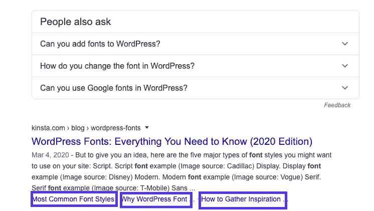

Google SERPs 中的锚链接。


用户寻找精确的信息，这些信息可能已经传递到你的标题上，他们可能会点击你的网站链接。

这可以帮助你产生更多的有机流量。查看我们的完整指南，学习如何[为你的帖子](https://kinsta.com/blog/anchor-links/)创建锚链接。

### 15.创建专业网站页脚

页脚链接是网站的重要组成部分，因为它们出现在每个页面上，所以要确保它们包含关键页面的链接，可以帮助用户更好地浏览你的网站，同时向搜索引擎显示哪些页面对你最重要。

早些时候，[我们讨论了](#6-craft-key-pages-to-build-your-credibility)创建关键页面如何有助于改善谷歌和你的用户对你的 E-A-T 的看法。用户希望在你的页脚找到这些关键页面的链接，所以包含它们是一个好的开始。

记住链接在页面之间传递价值也很重要，因为页脚链接是站点范围内的，所以在这里包含一个链接向 Google 发出了一个明确的信号，即这些页面对你很重要。

如果你看我们的页脚，你会看到公司链接的组合，指向我们的关于，联系，隐私政策等。，以及其他重要的链接。

#### 删除默认链接

如果你向下滚动到你网站的底部，你可能会发现一些你没有放在那里的学分。一个可能是应用于每个 WordPress 站点的标准“Powered by WordPress”链接。另一个通常是指向主题开发者的站点的信用:

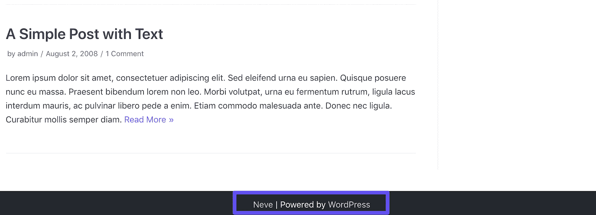

一个主题致谢和页脚中的“Powered by WordPress”链接。


虽然这些链接没有恶意，但它们看起来并不特别专业。另外，正如我们在这篇文章中所看到的，链接对你的 WordPress SEO 有很大的影响。从你的网站上删除不必要的链接是一个最佳实践。

你可以查看我们的指南[从你的页脚移除“Powered by WordPress”链接](https://kinsta.com/knowledgebase/remove-powered-by-wordpress/)。至于可能包含的任何主题演职员表，您可以通过定制器删除它们:

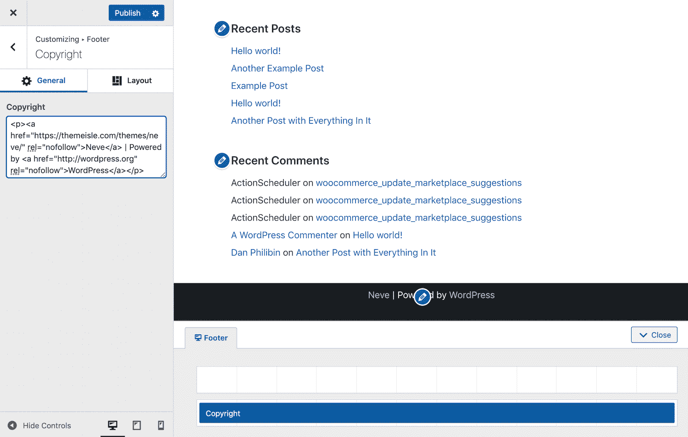

在定制器中删除主题信用。


或者，您可以通过编辑您的主题的 footer.php 文件来删除此链接。然而，这可能有点棘手，所以如果可能的话，最好坚持使用定制器。

### 16.考虑负面搜索引擎优化

负面搜索引擎优化是一个至关重要的话题，因为许多人不知道如何处理它。

通常在 SEO 中，你想从其他网站获得反向链接，这有助于建立你的域名和页面权威。但是操作链接违反了谷歌的指导方针，所以如果你的网站被标记为涉及链接计划，你可能会受到链接惩罚。

这就是负面 SEO 的用武之地。任何人都可以链接到你的网站，所以如果有人可以通过添加许多链接来让它看起来像是你在操纵搜索结果，你的网站可能会受到链接惩罚。这可能会导致您的网站失去流量或被排除在搜索结果之外。

这就是为什么你应该监控你的反向链接配置文件。如果您看到反向链接或使用不寻常的、通常是成人主题的锚文本的链接突然激增，您可以迅速进行调查。

例如，在一个案例中，一家企业发现了超过 200，000 个指向其网站的低质量反向链接。清理这个烂摊子花了两年多时间:


滥发链接。


起初，这似乎不公平，因为你不能阻止别人给你的网站创建一个糟糕的反向链接。为了纠正这一点，谷歌和必应提供了[否认工具](https://kinsta.com/blog/decline-seo-rankings/#spammy-backlinks)，让网站所有者能够突出显示搜索引擎应该忽略的网址和域名，以保护自己。

## 技术搜索引擎优化

### 17.选择您的首选域

这是一个双面提示:

#### www 与非 www

如果你刚刚推出你的网站，你可能会有的第一个问题是，你是否应该将 www 纳入你的域名。有些人认为这会影响你的 WordPress 站点的 SEO。

简而言之，在你的域名中加入 www 对搜索引擎优化没有好处。它不会以任何方式影响你的排名。但这并不是说你应该总是使用非 www 地址。有几个原因可能会让您仍然想使用它:

*   使用 www 作为你的领域的一部分曾经是标准。这不一定是真的了。即使我们在金斯塔这里也不用 www。你可能仍然会看到一些网站仅仅因为改变它会很复杂并导致问题而合并它。很多老牌子还在继续用。
*   由于[域名系统(DNS)记录](https://kinsta.com/knowledgebase/what-is-dns/)，拥有大量流量的大公司可能想要使用 www。从技术上讲，裸(非 www)域不能拥有 CNAME 记录来为故障转移重定向流量。然而，这个问题有[的变通办法](https://serverfault.com/questions/408017/why-does-heroku-warn-against-naked-domain-names/408026#408026)。

归根结底，使用 www 还是非 www 域更多的是个人喜好问题。也许你更喜欢较短的 URL，在这种情况下，你可以使用裸域名。

记住，无论你选择哪个版本，你都应该[设置重定向](https://kinsta.com/blog/wordpress-redirect/)，这样只有一个版本是可访问的。例如，如果你访问 www.kinsta.com，它只是重定向到 kinsta.com。

以前，你可以通过谷歌搜索控制台设置你的首选域名出现在搜索结果中。但是平台[在 2019 年](https://searchengineland.com/google-search-console-drops-preferred-domain-setting-318356)停止了这个选项。现在，它可以根据从您的站点收集的信息，例如[模式标记](https://kinsta.com/blog/schema-markup-wordpress/)，来决定您更喜欢哪个版本。

提交一个网站地图也很有帮助。一定要坚持读下去，看看怎么做才合适。

#### 避免重复的 URL

如上所述，你应该只允许你的 URL 的一个版本被访问，通过适当的重定向将用户和爬虫转移到正确的 URL。当考虑其他因素时，比如 URL 中使用的大小写，这就更进一步了。例如，以下 URL 可能会加载相同的内容，这意味着搜索引擎可以将它们作为两个独立的页面进行索引。

```
kinsta.com/about-us/
kinsta.com/About-Us/
```

同样的道理也适用于以斜杠结尾和没有斜杠结尾的 URL。例如:

```
kinsta.com/about-us/
kinsta.com/about-us
```

也是基于协议。例如:

```
https://kinsta.com/about-us/
http://kinsta.com/about-us/
```

这对 SEO 不利，因为每个复制版本都在有效地与原始版本竞争。将任何重复的 URL 重定向到原始 URL 将确保所有排名信号都进入一个版本，使其更有可能出现在搜索结果中。

[重定向规则](https://kinsta.com/blog/wordpress-redirect/)确保任何访问错误版本的人都被定向到正确的版本。

**看看我们的视频，学习如何给你的 WordPress 站点添加重定向:**


如果你想确保谷歌知道使用哪个页面，你可以手动或用插件给你的网站添加规范标签。

[From sitemaps to schema markup, this detailed guide has everything you need to know about SEO 🔎Click to Tweet](https://twitter.com/intent/tweet?url=https%3A%2F%2Fkinsta.com%2Fblog%2Fwordpress-seo%2F&via=kinsta&text=From+sitemaps+to+schema+markup%2C+this+detailed+guide+has+everything+you+need+to+know+about+SEO+%F0%9F%94%8E&hashtags=SEOTips%2CSearchEngineOptimization)

### 18.建立友好的永久链接

默认情况下， [WordPress 会创建混乱的永久链接](https://kinsta.com/blog/wordpress-permalinks/) (URL 结构)，这些链接并不干净(学习如何[改变你网站的 URL](https://kinsta.com/knowledgebase/wordpress-change-url/) )。默认结构目前将日期和文章或页面名称插入 URL，如下所示:

`https://kinstalife.com/2020/03/31/sample-post/`

谷歌更喜欢包含你的内容的标题和/或关键词的 URL，但是较短的 URL 通常更好。我们建议使用帖子名称永久链接设置，因为它既干净又有利于网站的 SEO:

`https://kinstalife.com/sample-post/`

你可以通过点击 WordPress 仪表盘中设置菜单下的永久链接来改变文章名称永久链接结构。选择文章名称并点击保存更改:

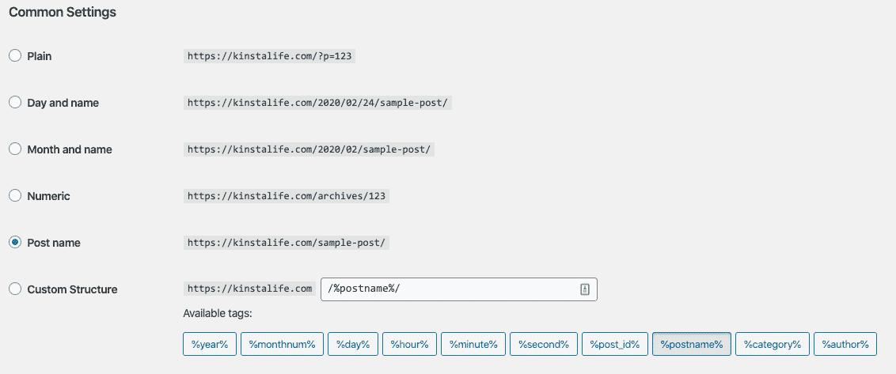

。


然而，需要注意的是，在帖子发布后改变永久链接结构会破坏你之前的所有链接。

如果你正在改变旧网站上的永久链接结构，确保通过利用 MyKinsta 中的[重定向功能或利用第三方插件，如](https://kinsta.com/help/redirect-rules/)[永久链接管理器 Lite](https://wordpress.org/plugins/permalink-manager/) ，将以前的 URL 重定向到新的。

如果你在不同的主机上，确保通过编辑。htaccess 文件。

### 19.安装 SSL 证书

谷歌官方称 [HTTPS 是排名因素](https://webmasters.googleblog.com/2014/08/https-as-ranking-signal.html)。这不是什么新鲜事。HTTPS 也是谷歌的页面体验指标之一(稍后将详细介绍[)。](#31-optimize-for-page-experience)

要使用它，你需要在你的网站上安装一个 SSL 证书。虽然这可能只是一个小的排名因素，HTTPS 已经成为互联网的标准。不使用 SSL 证书的网站可能会在 Chrome、Firefox 和其他浏览器中看到警告，强调网站连接不安全。

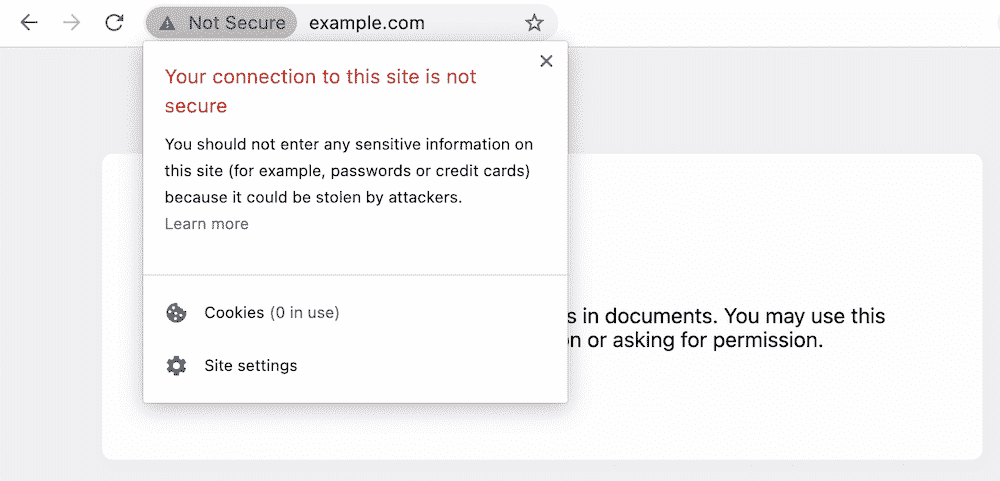

Your connection to this site is not a secure error.


在 Kinsta，所有站点都自动受到我们的 [Cloudflare 集成](https://kinsta.com/cloudflare-integration/)的保护，包括带有通配符支持的免费 SSL 证书。

如果你在不同的主机上，并且还没有在你的网站上安装 SSL 证书，请查看我们为 WordPress 提供的深入的 [HTTP 到 HTTPS 迁移指南](https://kinsta.com/blog/http-to-https/)。

### 20.设置 XML 站点地图

Google、Bing 和 Yandex 等搜索引擎使用 XML 站点地图来了解你的 WordPress 站点的层次和结构，并确保更好的抓取。站点地图不是必需的，但是除了上面提到的，创建一个站点地图可以让你访问更多关于你的站点的报告数据。

这就是为什么我们总是推荐使用 XML 站点地图文件。它将为搜索引擎提供一幅清晰的网站结构图，这将增加你在谷歌网站链接中得分的机会。

Yoast SEO 插件可以自动生成你的站点地图文件。按照以下步骤启用或验证此功能。

#### 步骤 1:打开 XML 站点地图设置

我们假设你已经安装了 Yoast SEO，如本文前面所述。在你的 WordPress 仪表盘中导航到 **SEO > General** 来生成你的站点地图文件。确保 XML 站点地图开关已打开:

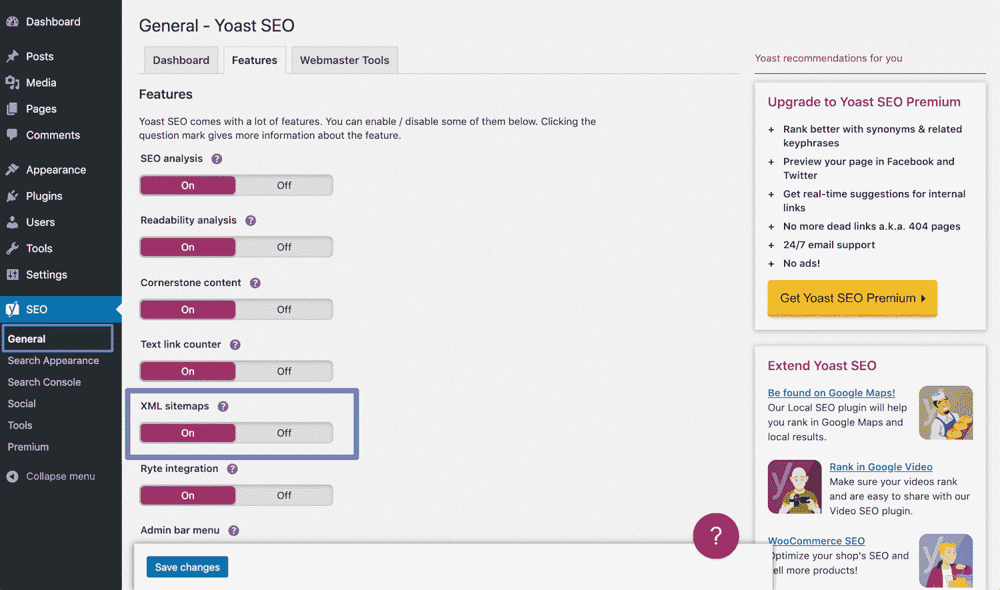

Yoast SEO XML sitemaps 设置。


这应该会自动创建你的站点地图，而不需要你做任何额外的努力。

#### 步骤 2:测试你的站点地图

仔细检查自动生成的文件是否已经成功创建总是明智的。您可以通过将 sitemap_index.xml 附加到您的域来查看您的站点地图索引，如下所示:

https://domain.com/sitemap_index.xml

结果应该类似于下图:

[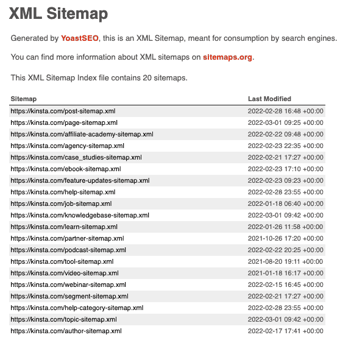](https://kinsta.com/wp-content/uploads/2022/03/kinsta-sitemap-22.png)

Example of the sitemap we use at Kinsta.


然后，您可以单击索引中的任何站点地图，这将允许您查看每个文件中引用的 URL。

我们将在下面更详细地介绍如何将这个文件提交给 Google 和 Bing，以便更快地进行索引和抓取。你也可以使用 WordPress 网站地图查看我们对[的深入探究。](https://kinsta.com/blog/wordpress-sitemap/)

[SEO isn't dead... and this guide will help you use it to grow your organic traffic by 250% (or maybe more) ⚡️Click to Tweet](https://twitter.com/intent/tweet?url=https%3A%2F%2Fkinsta.com%2Fblog%2Fwordpress-seo%2F&via=kinsta&text=SEO+isn%27t+dead...+and+this+guide+will+help+you+use+it+to+grow+your+organic+traffic+by+250%25+%28or+maybe+more%29+%E2%9A%A1%EF%B8%8F&hashtags=SearchEngingeOptimization%2Cgrowth)

### 21.提交你的网站地图到谷歌搜索控制台

一旦你有了一个 XML 站点地图文件，建议[将它提交给谷歌搜索控制台](https://kinsta.com/blog/google-search-console/#how-to-add-a-sitemap-in-google-search-console)，这样你就可以访问关于你的 WordPress 站点状态的额外数据。我们将假设你已经有一个谷歌搜索控制台帐户。更多信息，请看这篇关于如何[向搜索引擎](https://kinsta.com/blog/submit-website-to-search-engines/)提交你的网站的更深入的文章。


在谷歌搜索控制台中，点击索引部分下的站点地图。然后像我们之前描述的那样输入站点地图文件的位置，并点击 Submit:

[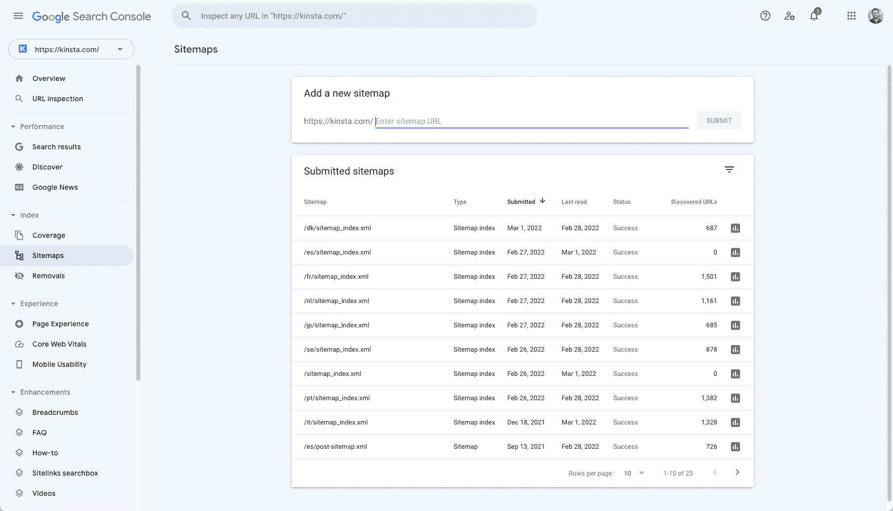](https://kinsta.com/wp-content/uploads/2022/03/submit-xml-sitemap-gsc.png)

WordPress SEO: Submitting a sitemap to Google Search Console.


然后你会看到有多少页面/文章被提交和索引。谷歌现在会定期自动抓取你的网站地图文件。

### 22.将你的网站地图提交给 Bing 网站管理员工具

像谷歌搜索控制台一样，我们也推荐你使用 Bing 网站管理员工具提交你的 WordPress 站点。

你可以使用你的谷歌账户注册，另外，如果你已经在谷歌搜索控制台中使用相关的谷歌账户进行了验证，现在还可以验证 Bing 网站管理员工具。

只需登录，点击侧边菜单中的站点地图，点击提交站点地图按钮，并添加您的站点地图索引 URL。

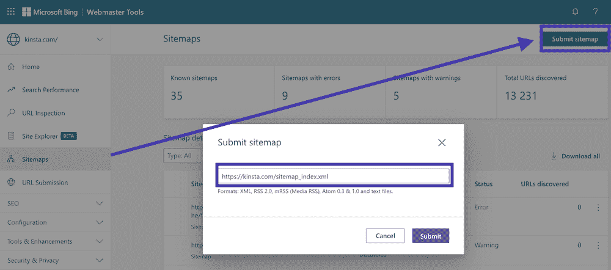

Submit XML Sitemap to Bing Webmaster Tools.


### 23.提交你的网站地图到 Yandex 网站管理员工具

类似于谷歌搜索控制台和必应网站管理员工具，[将你的 WordPress 站点提交给 Yandex](https://webmaster.yandex.com/welcome/) 也是聪明的做法。这是一个俄罗斯搜索引擎，但如果你有全球流量，它可以帮助！

要了解更多细节，我们有关于如何将你的网站提交给主要搜索引擎的深入指导。

### 24.请求爬网以加快索引速度

通常，当你在你的 WordPress 站点上发布内容时，谷歌将决定它索引你的内容的抓取速率。这可能从几分钟到几小时或几天不等。

然而，有一种方法可以鼓励谷歌使用谷歌搜索控制台中的[请求索引](https://developers.google.com/search/docs/crawling-indexing/ask-google-to-recrawl)工具来索引单个页面。

这个方便的工具在测试页面更新后的排名时非常有用。值得注意的是，经常会有延迟，所以不要期望看到你的更新页面立即被索引。

谷歌经常建议用户不要依赖请求索引功能。Googlebot 非常擅长通过抓取网站和 XML 站点地图来自然发现新页面，所以如果您的页面没有被索引，可能会有其他页面问题。

在谷歌搜索控制台中，点击侧边栏中概述下的 URL 检查选项，输入您想要请求索引的页面的 URL，然后单击“enter”进行确认。

[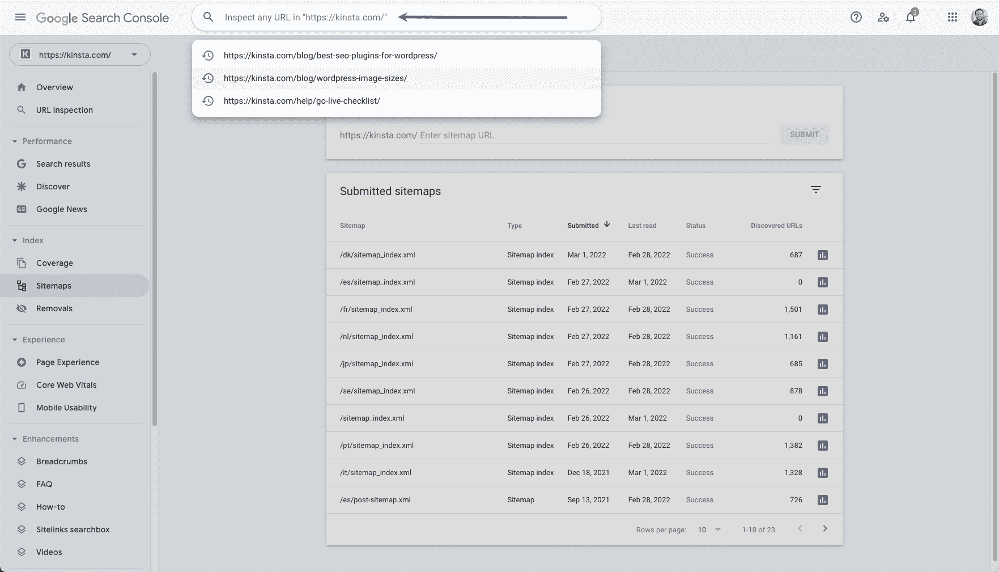](https://kinsta.com/wp-content/uploads/2022/03/index-requesting.png)

The URL Inspection tool in Google Search Console.


明智的做法是使用 URL 检查工具定期[检查您最常访问的页面](https://kinsta.com/blog/google-search-console/#checking-the-health-of-your-website-with-google-search-console)，以识别索引错误，并确保您的页面能够在搜索结果中正确显示。

在 Google 搜索控制台处理您的请求后，您应该会收到一条类似如下的确认消息:

[](https://kinsta.com/wp-content/uploads/2022/03/Indexing-request-confirmation-message-1.png)

Indexing request confirmation message.


### 25.检查爬网错误

爬行错误发生在爬虫(搜索引擎、机器人等。)无法到达页面。这可能是由多种原因造成的，从链接断开(在我们的[断开链接](#12-fix-broken-links)提示中有更多这方面的信息)，由于链接设置不正确，或内容被删除而没有重定向到位，到服务器错误，即您的服务器无法响应爬网请求。

检查抓取错误的一个很好的方法是查看你的谷歌搜索控制台账户。在这里可以找到覆盖率报告，它提供了谷歌抓取你的网站时遇到的任何错误的细节。

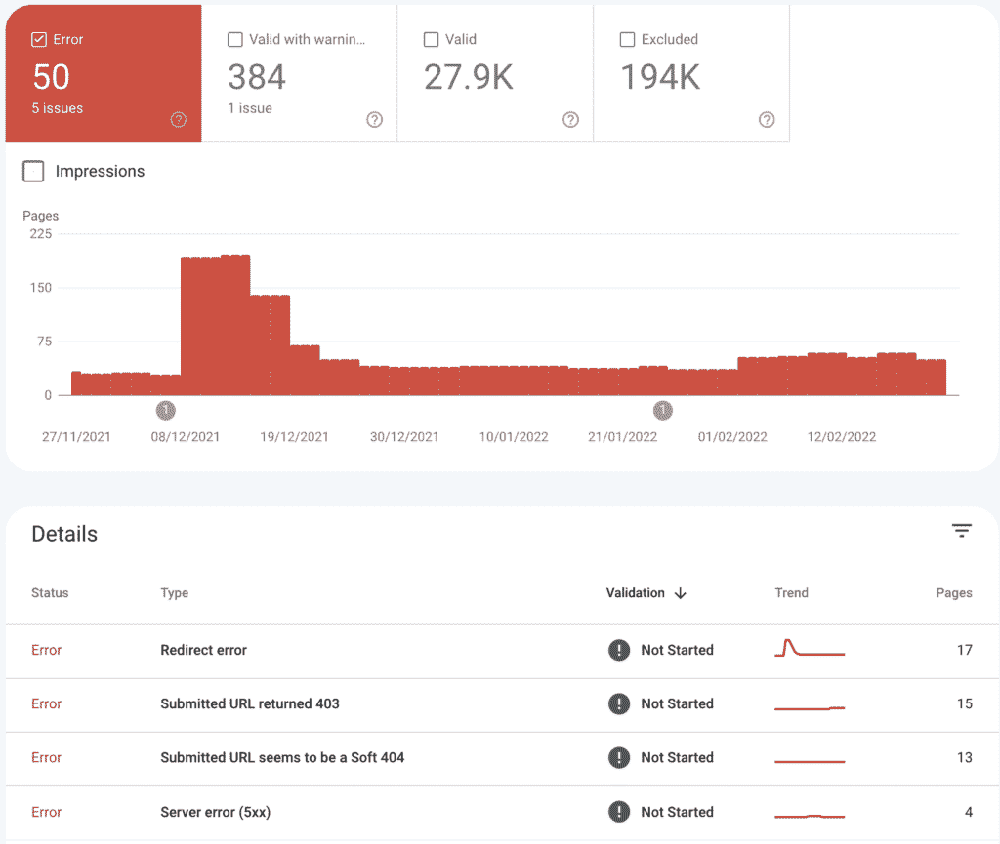

Coverage report in Google Search Console.


点击任何错误类型，您将看到遇到错误的 URL 的一些示例。然后，您可以单击每个链接旁边的 inspect URL 图标，了解有关 Google 如何发现 URL 的更多信息。

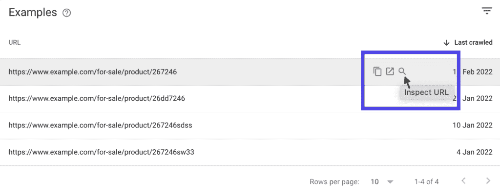

Inspect URL Google Search Console.


这将通过引用页面给你一些线索，让你知道谷歌第一次是在哪里看到断开的链接的。

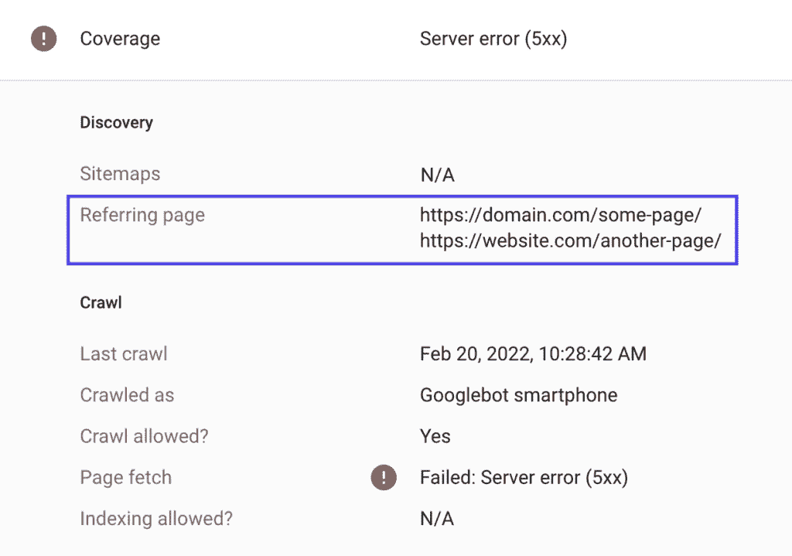

Referring page URL Inspection Tool.


现在，您可以联系有断开链接的站点，要求他们更新链接，或者如果链接来自您站点上的页面，您可以自己更新链接。另一种选择是添加一个 301 重定向，从损坏的 URL 到正确的 URL。

谷歌搜索控制台也有另一个有用的工具，突出其他抓取错误。从左侧菜单中单击设置，然后单击爬网下的打开报告。

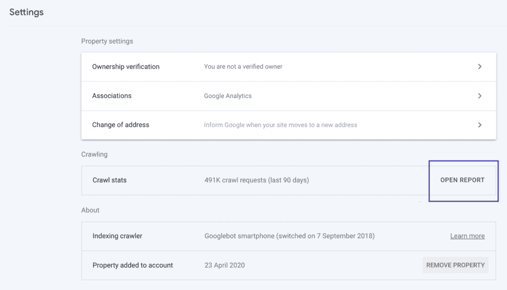

‘Open Report’ in Google Search Console.


在“按响应”部分，您将看到爬网请求类型的分类。有关错误的更多信息，请单击查看所有相关错误。

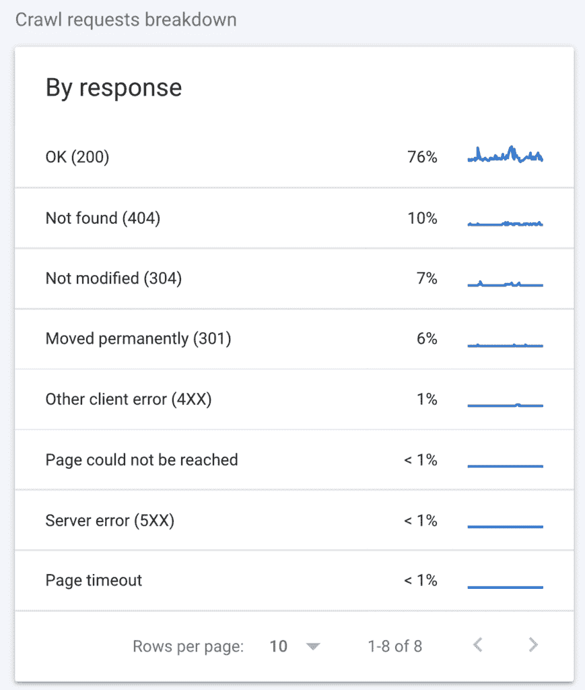

Crawl Errors Report in Google Search Console.


例如，我们希望查看除 OK (200)和 Not modified (304)之外的所有内容，这是标准的爬网请求。

和以前一样，您现在可以检查 URL，以了解导致错误的原因并修复它们。

### 26.检查谷歌可以抓取你的网页

抓取是索引的关键，索引是排名的关键。如果谷歌不能抓取你的页面，它们将不会被索引，这意味着它们不会出现在搜索结果中。

幸运的是，谷歌搜索控制台中的 URL 检查工具可以(再次)提供帮助，因为它允许您检查页面是否被正确地抓取和索引。

这提供了详细信息，包括谷歌第一次是如何发现该 URL 的，它最后一次被抓取是什么时候，以及用户检测到 canonical 和谷歌选择的 canonical。

要查看页面，请在页面顶部的搜索框中输入 URL。

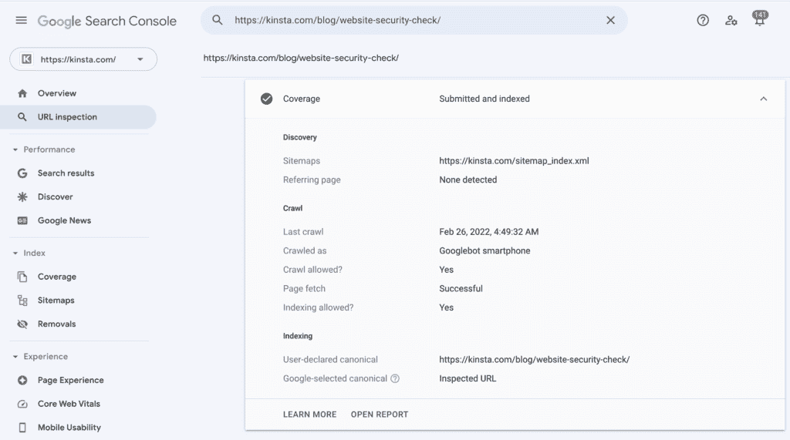

Checking if the page is indexed.


### 27.查看谷歌搜索到的内容

您还可以查看 Google 如何呈现索引页面的 HTML。这允许您检查您的内容和链接是否被正确索引。只需点击查看抓取的页面来查看 HTML，然后复制它以在[文本编辑器](https://kinsta.com/blog/best-text-editors/)中查看，或者使用搜索工具来检查特定内容或链接以确保它们出现。

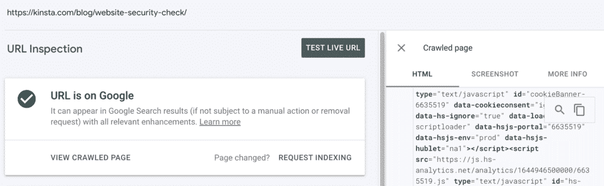

Google Search Console rendered HTML.


工具中的屏幕截图选项卡提供了页面呈现方式的快照，但它只显示在折叠上方。查看完全呈现的页面的一个很好的技巧是将 HTML 复制并粘贴到一个 [HTML 测试工具](https://www.w3schools.com/html/tryit.asp?filename=tryhtml_intro)中。这有助于您了解 Google 可以抓取的内容，因此有助于突出任何抓取问题。

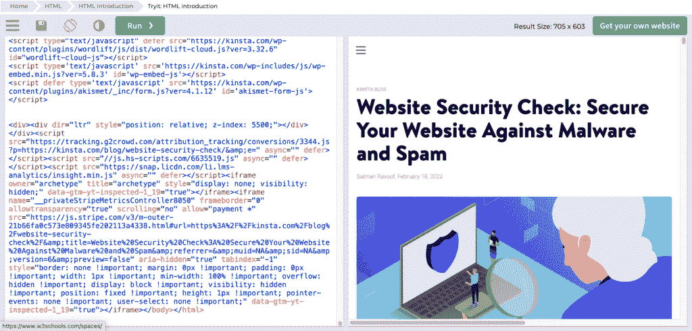

Testing the rendered HTML.


### 28.使用结构化数据

你可能听说过“结构化数据”或“模式标记”这样的术语在网上流传。[结构化数据](https://kinsta.com/blog/schema-markup-wordpress/)是附加的代码，帮助搜索引擎通过特色片段向访问者提供更多更好的数据。

如果你曾经在 SERP 的评论旁边看到过[星评，你就已经看到了结构化数据的结果。这可以帮助你在 SERPs 上获得特殊的斑点，它有能力显著增加你的点击率。](https://kinsta.com/blog/best-wordpress-review-plugins/)

CXL Institute 进行了一项研究，发现使用星级评定的公司有机 SERPs 的 CTR 明显更高，增幅高达 35%。他们得出结论，这种策略确实会产生更好的结果。

使用结构化数据的另一个重要原因是，它可以帮助谷歌更好地了解你的业务是什么，以及它如何融入网络。这可以帮助触发您的[品牌知识面板](https://kinsta.com/blog/schema-markup-wordpress/#schema-markup-example-yoastcom)，这可以提高您的品牌搜索点击率，并允许您的网站出现在其他特定实体的搜索结果中，如竞争对手的传送带。

许多 [WordPress 主题](https://kinsta.com/best-wordpress-themes/)有模式标记编码，但有些没有。你可以用[谷歌结构化数据测试工具](https://developers.google.com/search/docs/appearance/structured-data)测试你的网站或博客文章:

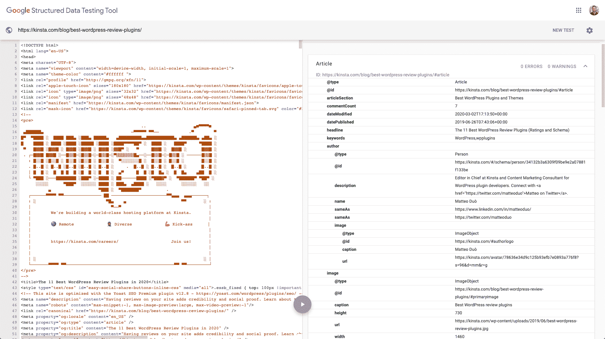

谷歌结构化数据模式。


通常，您希望在屏幕右侧看到零错误和一些结果。如果它完全是空白的，那意味着你的 WordPress 站点没有添加任何模式标记。

Yoast SEO 内置了一些结构化数据。在 WordPress admin 的 SEO 菜单下，点击搜索外观。填写您的组织名称并上传您的组织徽标。一旦您保存了更改，您将拥有组织架构设置，它应该在 Google 的结构化数据测试工具中可见。

Yoast 还将结构化数据添加到页面中，这意味着所有的博客文章都应该与模式文章一起出现。

如果你想[在你的 WordPress 站点](https://kinsta.com/blog/schema-markup-wordpress/)添加另一个模式标记，我们推荐[免费模式插件](https://kinsta.com/blog/schema-markup-wordpress/#the-schema-plugin)。这将自动添加必要的代码。然后，您可以在 Google 的结构化数据测试工具中运行另一个测试。

### 29.定期进行搜索引擎优化审计

一个快速检查你的 WordPress 站点优化程度的好方法是做一个快速的 WordPress SEO 审计。有很多免费和优质的工具可以帮助你。

SeoSiteCheckup 是一个免费的工具，有超过 50 个检查，让你知道你做得怎么样。虽然这个工具非常基础，但它可以帮助你开始。其他 [SEO 工具](https://kinsta.com/blog/best-seo-plugins-for-wordpress/#the-best-seo-tools-for-wordpress-users)，包括 Ahrefs 和 [Semrush](https://kinsta.com/blog/best-seo-plugins-for-wordpress/#SEMRush) ，允许你安排每周网站审计，这可以帮助你快速发现任何可能导致 SEO 问题的问题。

### 30.对重复内容进行去索引

拥有相同内容的两个完全相同的副本可能听起来很傻，但这种情况比你想象的更常见。例如，这种情况的一个常见原因是当一个[暂存站点](https://kinsta.com/help/staging-environment/)被 Google 索引时。

不幸的是，索引内容的多个副本会导致严重的 SEO 问题。虽然谷歌没有正式惩罚你重复的帖子或页面，但它仍然会影响你的排名。

主要的问题是，当出现两个相同的内容时，谷歌不知道该排列哪个。假设，这意味着你的暂存站点可能开始出现在你实际的网页上，这将会很尴尬。

在这种情况下，处理这个问题的最简单的方法是对您的临时站点进行去索引。WordPress 可以让你很快做到这一点。只需导航到设置>在您的暂存站点上阅读，并选中[阻止搜索引擎索引此站点](https://kinsta.com/blog/discourage-search-engines-from-indexing-this-site/)旁边的复选框:

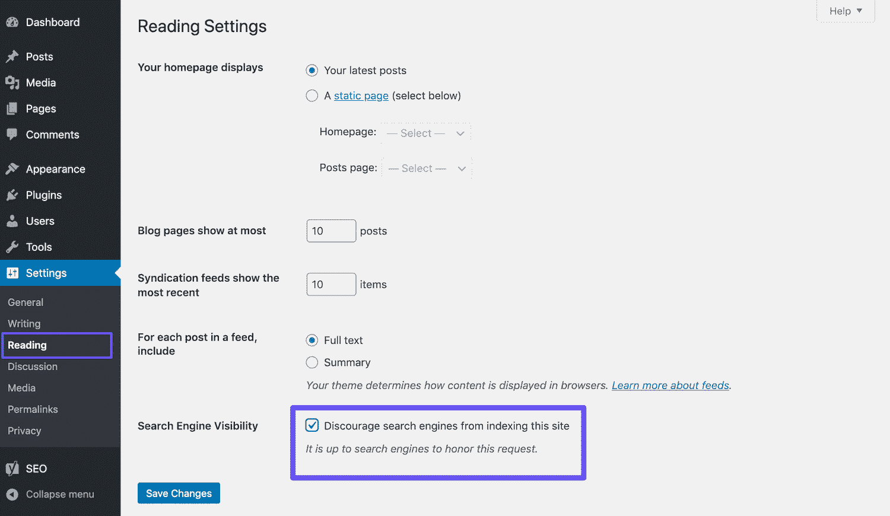

De-indexing a WordPress site.


如果你使用的是 [Kinsta staging environment](https://kinsta.com/help/staging-environment/) ，你可以放心，它会自动设置不被搜索引擎索引。

本文前面提到的重复内容的其他例子包括 www 与非 www，其中 URL 的两个版本都可以被访问，以及在 URL 中使用参数，这改变了 URL 而没有改变内容。

为了防止这种类型的重复内容，一般规则是在每个页面上使用自引用规范标签，突出显示您的 URL 的首选版本。例如，该页面在中包含以下规范:

```

```

你也可以给你的 [WordPress 添加重定向规则。htaccess 文件](https://kinsta.com/knowledgebase/wordpress-htaccess-file/)以确保用户和机器人总是被重定向到您的规范 URL。

## UX 设计

### 31.优化页面体验

谷歌的页面体验指标是谷歌在审查网页时关注的一组信号，使其算法能够根据页面速度、交互性、视觉稳定性和安全性来理解用户对你的页面的看法。这包括核心网络重要指标(在[提高你的核心网络重要指标](#32-improve-your-core-web-vitals)部分有更多相关信息)。

现在把页面体验作为移动和桌面排名的排名信号。要检查您的页面体验分数，请导航到 Google 搜索控制台中的页面体验部分。

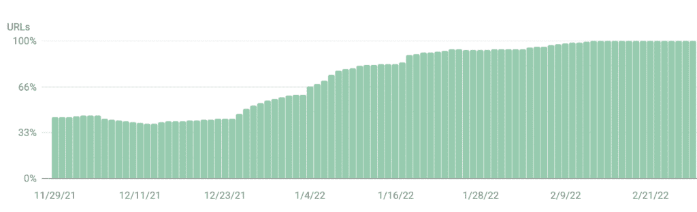

Google Page Experience report in Google Search Console.


移动和桌面图表已被分成单独的报告，允许您检查您的页面在每个设备上是否有良好的页面体验得分。如果你的网站在手机上得分很高，但在桌面上得分很低，那么你的页面只会从移动搜索结果的排名提升中受益，反之亦然。

评估页面体验时考虑的[信号](https://developers.google.com/search/docs/appearance/page-experience)包括核心网页活力、移动友好性、HTTPS 和侵入性空隙。如果得分为“好”的页面百分比很低，您可能希望检查这些信号中的每一个，以调查原因。


### 32.提高你的核心网站活力

核心网站指标代表了一组可衡量的性能指标，从用户体验的角度分析了一个网站运行的好坏。它们基于这些因素:

*   装载性能
*   页面交互性
*   视觉稳定性
*   实际数据来自谷歌浏览器。

核心 Web Vitals 还会查看您的页面对移动设备的友好程度，它们是否使用 HTTPS，以及它们是否包含侵入性的空隙。

你可以使用谷歌搜索控制台中的核心网络生命报告来检查你的网页表现如何，该报告将网页分为“好”、“需要改进”或“差”

#### 什么是核心的网络生命指标？

该报告由 3 个因素组成:

*   [最大内容绘画(LCP)](https://kinsta.com/blog/core-web-vitals/#largest-contentful-paint-lcp) 测量加载网页上主要内容所需的时间。
*   [首次输入延迟(FID)](https://kinsta.com/blog/core-web-vitals/#first-input-delay-fid) 测量用户与网页上的元素进行交互所需的时间。
*   [累积布局偏移(CLS](https://kinsta.com/blog/core-web-vitals/#cumulative-layout-shift-cls) **)** 分析页面如何加载，以及布局偏移是否会无意中导致用户点击页面上的其他元素。

这标志着谷歌朝着将用户体验纳入其排名算法的方向迈出了重要一步。

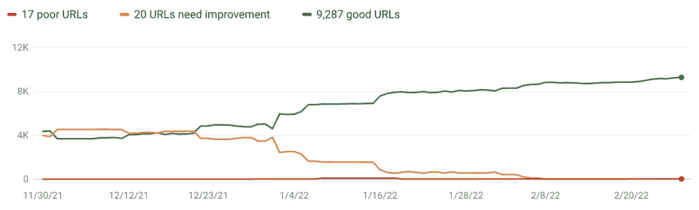

Example of a core web vitals report in Google Search Console.


#### 如何检查你的核心网络生命体征

核心 Web Vitals 报告使用字段数据来显示基于实际用户数据的页面性能。虽然目前不可能检查一个站点上的所有页面，但是您会找到示例页面，并且从结果列表中选择一个页面通常会为其他类似的页面提供进一步的结果。

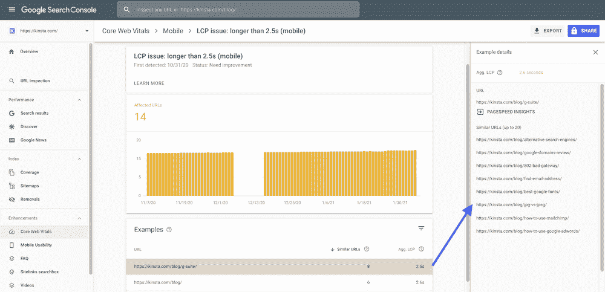

Google Search Console Core Web Vitals Report.


谷歌的其他开发工具，包括 Lighthouse 和 PageSpeed Insights，也允许你使用实验室数据检查任何页面的核心网页生命体征，这有助于查明问题。

然而，这些工具基于来自你的机器和互联网速度的数据得出结果，这可能不反映你的用户的体验。

谷歌从 2021 年 5 月开始将核心网站生命纳入其排名算法，这意味着你表现较好的页面现在将获得排名提升，而表现不佳的页面可能会出现排名下降。

该报告提供了移动和桌面搜索结果，因此在这两方面都获得高分将意味着您的页面在移动和桌面搜索结果中的排名都有所提高。

#### 如何提高核心网站的活力

核心 Web Vitals 报告让我们可以看到页面在每个评估指标上的表现，因此我们可以在这里看到谷歌认为什么是“好”、“需要改进”和“差”

与 GSC 所有可用的报告一样，这里只提供了一个 URL 样本，但这让我们对有问题的页面类型有了一个很好的了解。例如，网站上的许多博客文章可能被标记为“差”。仔细观察，很明显所有的博客文章都包含一个对 LCP 有负面影响的“相关文章部分”。

CLS 问题可能更难发现。这就是为什么我们列出了一些最常见的导致 LCP 不佳的原因和[以及如何解决它们](https://kinsta.com/blog/core-web-vitals/#how-to-improve-largest-contentful-paint-scores)。

#### 调试问题的附加工具

你可以使用 Google 开发者工具，比如 Lighthouse 和 [Google PageSpeed Insights](https://kinsta.com/blog/google-pagespeed-insights/) ，去挖掘低分网址背后的原因。

一旦你认为它们已经得到了充分的改进，你可以使用谷歌搜索控制台中的“验证修复”按钮来重新评估这些网址。

值得注意的是，你的更新结果可能需要一段时间才能在你的核心网站生命报告中显示出来，所以如果你没有立即看到结果，也不要惊慌。

请务必查看我们关于[优化您的网站以获取谷歌核心网站生命周期](https://kinsta.com/blog/core-web-vitals/)的深入指南，了解更多详情。

### 33.优化你的网站速度

谈到 WordPress SEO，网站速度是巨大的。早在 2010 年，谷歌就宣布[确实会影响你的排名](https://webmasters.googleblog.com/2010/04/using-site-speed-in-web-search-ranking.html)。此外，页面速度对你的访问者很重要。这里有一些数据可以证明这一点:

*   如果一个网站的加载时间超过四秒，四分之一的访问者就会放弃这个网站。
*   46%的用户不会重新访问表现不佳的网站。
*   网站所有者在考虑离开之前只有五秒钟的时间来吸引访问者。
*   如果加载时间超过 5 秒，74%访问移动网站的用户会离开。
*   对于像亚马逊这样的大型在线商家来说，页面加载时间每延迟一秒钟都可能导致每年 16 亿美元的损失。

通过[实现 CDN](https://kinsta.com/help/kinsta-cdn/) 、[使用快速主题](https://kinsta.com/blog/fastest-wordpress-theme/)、[相应优化你的网站](https://kinsta.com/learn/page-speed/)，你可以快速提高你网站的速度。然而，这些策略只能让你到此为止。

你的网站主机对你网站的速度起着相当大的作用，所以投资于质量管理的 WordPress 供应商是关键。例如，我们的一些客户在改用 Kinsta 后，网站速度提高了超过[200 %:](https://kinsta.com/blog/fastest-wordpress-hosting/)


A 212.5 percent increase in performance after switching to C2.


如果你需要一个新的托管计划，可以考虑[看看我们的](https://kinsta.com/plans/)。

### 34.确保你的网站是移动响应的

谷歌宣布在 2016 年测试其移动优先的索引策略。谷歌的排名算法现在主要使用网站内容的移动版本来对页面进行排名。这是谷歌目前索引内容方式的一个巨大变化。这意味着移动现在比以往任何时候都更加重要:

如果你还没有一个[响应网站](https://kinsta.com/blog/responsive-web-design/)，放下你正在做的一切，立即开始。你可以使用[谷歌的移动友好工具](https://search.google.com/test/mobile-friendly)来查看你当前的 WordPress 网站是否通过测试:

[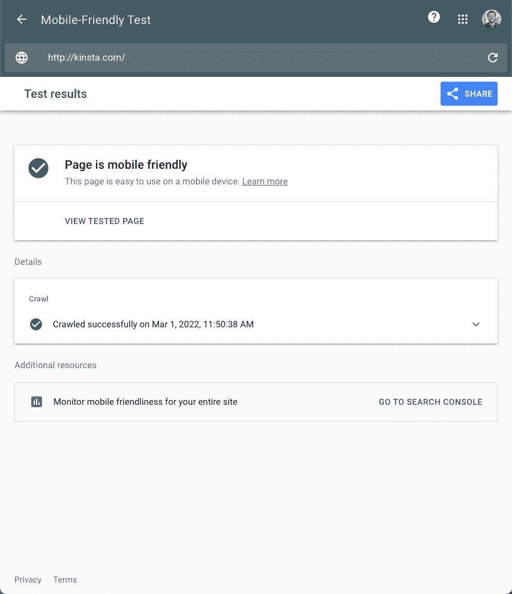](https://kinsta.com/wp-content/uploads/2022/03/kinsta-mobile-friendly-1.png)

The Kinsta website in Google’s mobile-friendly test.


另一个选择是实施 Google AMP，这是一个允许网站构建轻量级网页的开放框架。

然而，AMP 并不适合所有人。请务必阅读我们的 [AMP 案例研究](https://kinsta.com/blog/disable-google-amp/)以及我们为何将其从网站上移除。

查看[谷歌分析，看看你的网站从移动设备获得了多少流量](https://kinsta.com/blog/how-to-use-google-analytics/#acquisition-report)也很有帮助。这将有助于您确定应该将响应放在多大的优先级上。

### 35.使用简短的品牌域名

[你网站的地址很重要](https://kinsta.com/blog/how-much-does-a-domain-name-cost/#how)。它往往代表了用户对你的网站甚至整个品牌的第一印象。仅仅因为这个原因，在选择你网站的域名时考虑是很重要的。

我们已经写了一整篇关于[选择域名](https://kinsta.com/blog/choose-domain-name/)的文章，但是一些重要的提示包括:

*   选择相对简短易记的。
*   加入关键词(如果有意义的话)。
*   让你的域名听起来像一个品牌名称。
*   避免使用[精确匹配域(EMD)](https://www.searchenginejournal.com/do-exact-match-domains-still-work/283759/)。

这最后一个技巧对你网站的搜索引擎优化至关重要。EMD 是与网站想要排名的关键词完全匹配的域名。

例如，如果我们试图使用 EMD，我们的站点地址可能是 managedwordpresshosting.com。

虽然这曾经是一个有效的 SEO 策略，但它产生了许多问题。网站能够上升到 SERPs 的顶端，因为它们的域名表明它们与用户的搜索高度相关，但是这些网站的质量有所欠缺。

为了适应这一点，谷歌对其算法进行了修改，使 EMDs 成为一个争论点。只有当你的网站也有高质量的内容时，拥有 EMD 才有帮助。

### 36.使用短 URL

谷歌喜欢干净、有组织、有结构的网站。这包括使用短 URL。他们也可以帮助提高你的点击率。 [MarketingSherpa](https://www.marketingsherpa.com/article/blog/shorter-urls-equal-250-more) 进行了一项研究，发现如果一个有机清单:

*   有一个相当短的网址
*   出现在带有长 URL 的列表的正下方。

因此，保持你的网址尽可能的短是一个巨大的竞争优势。记住，WordPress 会根据文章的标题自动创建一个 URL。在这篇文章中，我们总结了以下内容:

`https://kinsta.com/blog/wordpress-seo`

按照下面的步骤来缩短 WordPress 文章或页面的 URL。

#### 步骤 1:找到永久链接设置

在经典编辑器和块编辑器中，你会发现一个永久链接设置，使你能够[编辑你的文章的‘slug’](https://kinsta.com/knowledgebase/what-is-a-wordpress-slug/)或者出现在最后一个反斜杠(/)之后的 URL 部分。在经典编辑器中，它出现在文章标题的正下方:

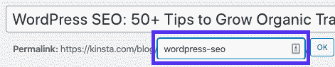

Accessing the Permalink setting in the Classic Editor.


点击编辑按钮，启用废料浆字段。

在块编辑器中，您可以在 Permalink 下右侧边栏的“文档”选项卡中，或者在标题块的顶部找到此选项:

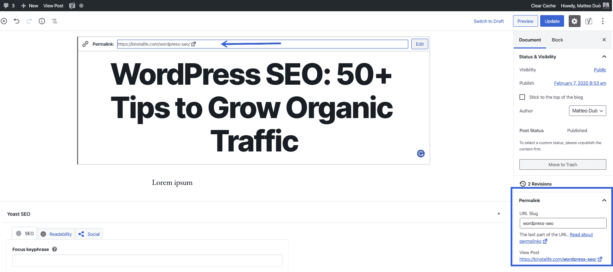

Accessing the Permalink setting in the Block Editor.


必要的文本字段将已经可见。

#### 第二步:编辑你的文章

接下来，只需输入你文章的新段落。记住用连字符分隔单词。此外，你网站上的每个帖子和页面都必须有一个唯一的 URL，这样你就不能重复你已经用过的内容。这样做将导致 WordPress 自动在你的 slug 后面添加'-1 '。

在[经典编辑器](https://kinsta.com/blog/disable-gutenberg-wordpress-editor/)中，完成后点击确定按钮保存新的永久链接:

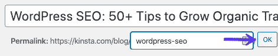

Editing your post’s slug.


在您输入完新的 URL 后，块编辑器会自动保存它:

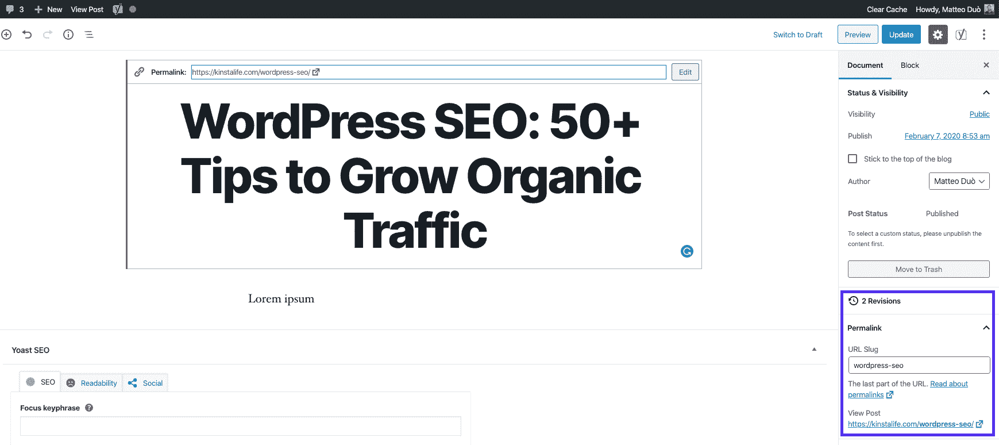

Your post’s slug in the Block Editor.


### 37.降低你的跳出率

就网站而言，“弹跳”是指用户访问你网站的一个页面，但立即离开。高跳出率通常被认为是一件坏事，因为这意味着访问者不会停留足够长的时间来改变信仰。

你可以在谷歌分析中查看页面的跳出率。只需导航至行为>概述，并查看主图形下方。

现在是关于跳出率的一些重要评论。

需要注意的是，跳出率并不是谷歌或其他搜索引擎的直接排名因素。此外，跳出率与你浏览的网站类型密切相关。例如，专注于新闻的网站拥有市场上最高的跳出率，但这本身不是问题，因为他们的主要目标是提供一条新闻。

然而，高跳出率可能表明您的网站上存在其他潜在问题，可能会影响您的 SEO。

用户会因为很多不同的原因离开。有时是由于混乱的网站导航，误导性的标题或链接，过多的广告，甚至是访问者偶然点击链接或按钮的简单错误。

这使得你很难确定应该做什么来提高你的跳出率。为了让你开始，我们已经写了不是一篇而是两篇关于这个主题的文章:[如何显示动态工具条和小部件来降低跳出率](https://kinsta.com/blog/wordpress-dynamic-sidebars-widgets/)和[如何在你的 WordPress 网站上降低跳出率(18 个技巧)](https://kinsta.com/blog/how-to-reduce-bounce-rate/)。

您还可以使用会话记录工具来观察用户如何与您的站点交互。

这有助于揭示你从未意识到的问题和阻碍因素，特别是当你很可能非常熟悉你的网站如何工作时，这给了你隧道般的视野。 [Clarity](https://clarity.microsoft.com/) 是微软的一款免费工具，可以自动跟踪用户，让你可以查看热图和记录，更好地了解用户如何浏览你的页面以及如何与你的网站互动。

### 38.考虑停留时间

“停留时间”指的是搜索者在返回查看其他结果之前，在他们在 SERP 上找到的网站上花费的时间。虽然[谷歌否认](https://www.seroundtable.com/google-ctr-dwell-time-signals-myths-27083.html)停留时间是一个直接的排名因素，但这是用户是否找到问题答案的一个明显标志。

如果谷歌有这些数据，并能跟踪用户在访问你的网站后进行了哪些搜索，很难相信他们不会用这些来确定搜索结果的质量。

当然，[增加页面的停留时间](https://www.searchenginejournal.com/dwell-time-seo/294471/)并不是一个一成不变的过程，但是你可以尝试几种策略。首先，确保将重要信息放在容易找到的位置。

“折叠”指的是你的页面上的一个点，用户必须向下滚动才能看到你的其余内容。

例如，在我们的主页上，[主导航菜单](https://kinsta.com/blog/website-navigation/)和鼓励访问者查看我们的计划、功能和客户故事的行动号召(CTA)按钮位于文件夹上方:

[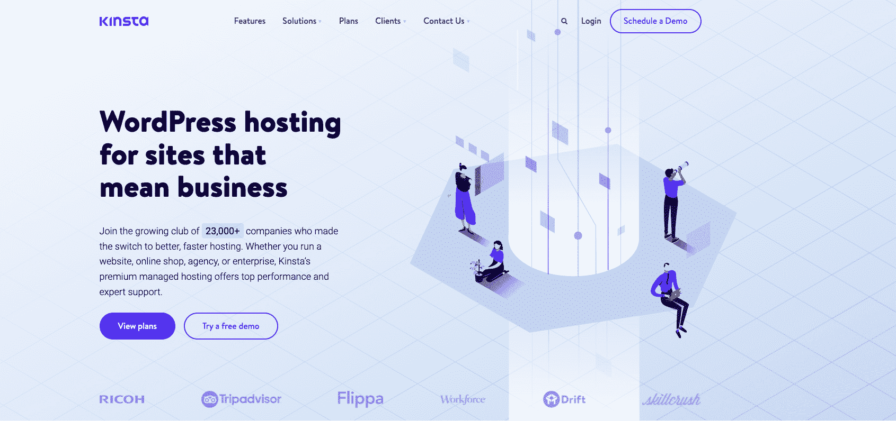](https://kinsta.com/wp-content/uploads/2022/03/kinsta-homepage.png)

Above the fold on the Kinsta home page.


说到导航，确保你的[清晰易懂](https://kinsta.com/blog/web-design-best-practices/#website-navigation)也可以帮助增加你的停留时间。

此外，你会想减少用户可能会觉得讨厌的干扰。弹出窗口和自动滚动视频这两个功能已经被证明可以引导访问者回到他们来自的 SERPs。

最后，确保回答用户正在搜索的问题。你可以在谷歌搜索控制台的搜索结果报告中检查你的页面在哪些查询中排名，以了解它们背后的意图。你只需要确保页面能够很好地回答这些问题。

## 内容优化

### 查看我们的[视频指南](https://www.youtube.com/watch?v=eH2griyHgrE)内容优化


### 39.做关键词研究

2022 年关键词依然活得好好的。这就是为什么排名很重要。请记住，正如我们之前提到的，谷歌仍然是一个计算机算法。它得看一些东西来计算排名，关键词还是很大一部分。

这是一个全新网站的例子，它的月访问量从 0 增长到 26 万以上，文章不到 30 篇:

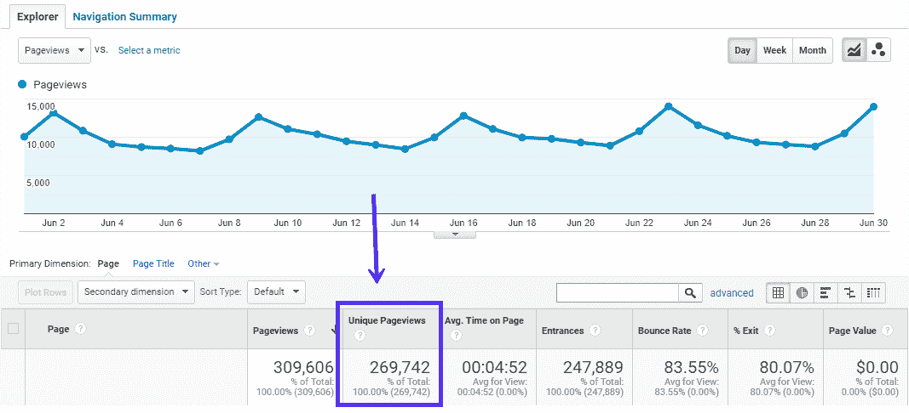

每月 SEO 流量。


他们是怎么做到的？他们找到了一个很好的利基，并做了战略[关键词研究](https://kinsta.com/blog/keyword-research/)。有很多很棒的工具可以帮助你。我们最喜欢的几个是 [SEMrush、](https://www.semrush.com/) [Ahrefs](https://ahrefs.com/) 和 [KWFinder](https://kwfinder.com/) 。诀窍是找到一个有搜索量的好关键词，同时不要选择太有竞争力的东西。

还有，别忘了[多语言 SEO](https://kinsta.com/blog/wordpress-multilingual/) ！其他语言的关键词有时竞争力会弱很多。当谈到[内容营销](https://kinsta.com/learn/content-marketing/)时，英语市场已经非常饱和。

例如，在英语中，让我们查找术语“营销策略”我们可以看到，它每月的全球搜索量约为 48，000 次。如果您查看 SERPs 中的这一术语，您会发现试图对其进行排名意味着与拥有高域名权限的大型域名进行竞争:

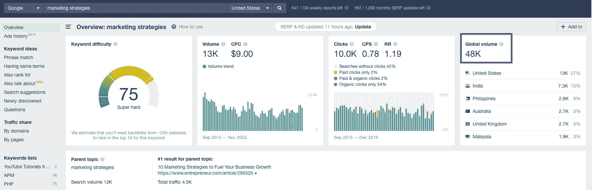

Keyword volume for “marketing strategies.”


换句话说，“营销策略”将很难排名。如果你不是一个权威的大品牌，你可能不会尝试处理这个关键词。

然而，如果你考虑西班牙语中的同一个词“estrategias de marketing”，你会发现搜索量仍然可观，大约每月 36，000 次，与这个词排名的网站竞争要现实得多:

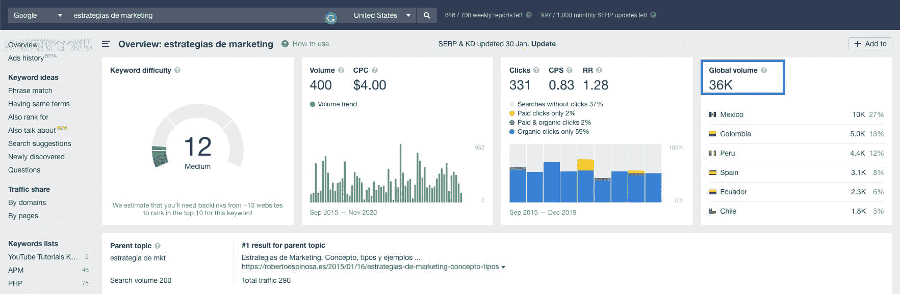

关键词卷为“营销战略”


这是你现在可以解决的问题。当涉及到其他语言时，你会发现许多搜索词更容易排名。

阅读更多关于[翻译你的网站](#59-translate-your-website)的好处，并且一定要查看我们深入的 WordPress [多语言指南](https://kinsta.com/blog/wordpress-multilingual/)来开始统治其他语言的 SERPs。

### 40.始终使用焦点关键字

重要的是要记住，当涉及到 WordPress SEO 时，Google 仍然是一个计算机算法。因此，关键词在 2022 年仍然很重要。

你应该为你的访问者和客户写作，但是要写得聪明。

你可以在记住 SEO 最佳实践的同时为你的读者写作。记住，[Bing 和 Yahoo 等替代搜索引擎](https://kinsta.com/blog/alternative-search-engines/)更加依赖一些人所谓的“过时的”SEO 实践。

每当你在你的 WordPress 网站上写一篇博客或者发布一个页面的时候，你都应该记住一个焦点关键词。不要只是为了推出更多内容而精心制作一个帖子。我们将在下面进一步讨论关键字研究。

使用 Yoast SEO 插件，你可以很容易地设置[你想写的焦点关键词](https://www.matteoduo.com/focus-keyword-yoast-seo/)。例如，对于这篇文章，我们使用焦点关键词“WordPress SEO”你可以看到 Yoast SEO 分析了关键词密度，并报告说它对于这篇文章来说有点低:

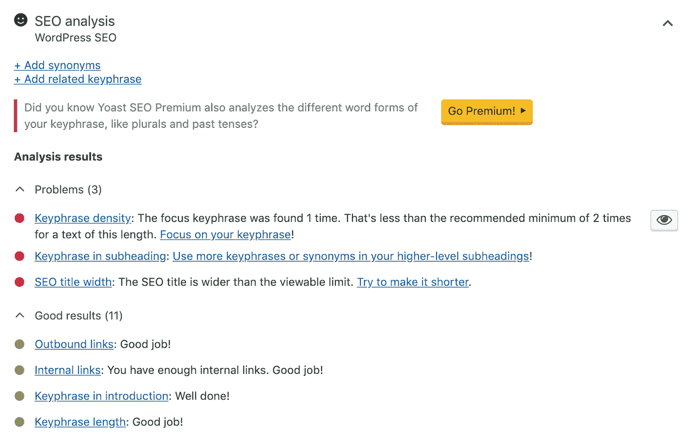

焦点关键字的例子。


虽然关键词/关键词密度绝不是一个排名因素，但它仍然可以帮助你确保你的内容包括你的目标关键词。

### 41.在第一段包含你的焦点关键词

任何帖子或页面的第一段都很重要。如果可能的话，我们建议在开场白中加入你的焦点关键词。原因是谷歌从上到下抓取内容，如果它很快找到你的关键词，它更有可能认为你的文章与该主题相关。

这也是一个从一开始就为你的读者正确“设置场景”的问题，并通过提供他们期望看到的内容来提高你的跳出率。

Yoast SEO 插件会检查这一点，以确保您跟上这一最佳实践:

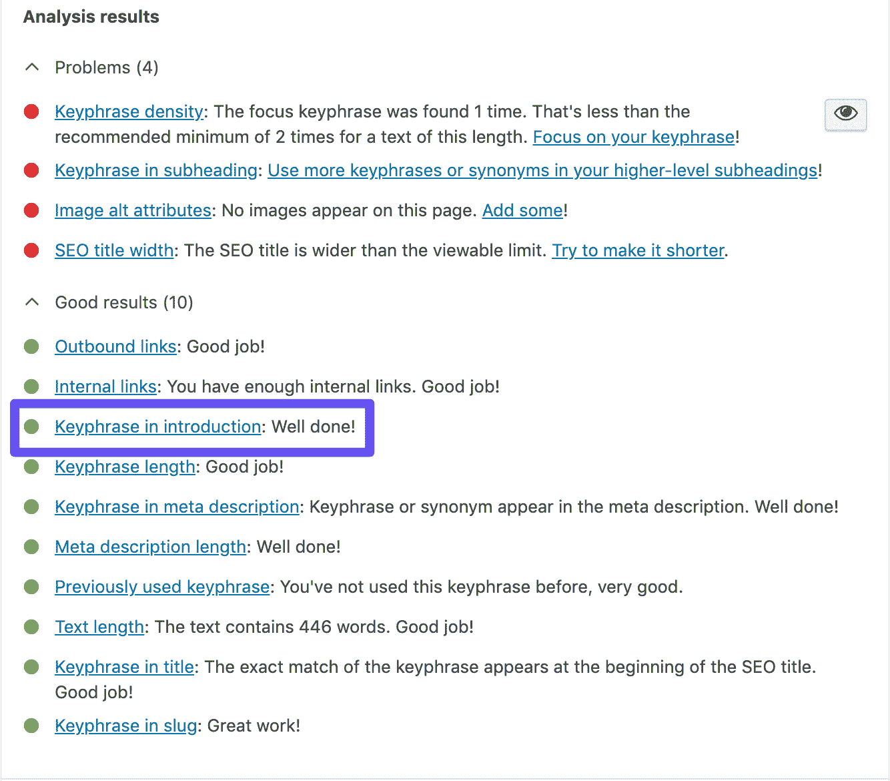

Yoast SEO 的“简介中的关键短语”检查。


综上所述，记住[你的内容应该听起来自然](https://kinsta.com/blog/evergreen-content/)并且有意义。将你的关键词自然地融入到你的开场白中，而不是为了 SEO 而简单地把它塞进你的第一段。

#### 谷歌文章排名

还值得注意的是，谷歌可以索引页面内的单个段落，而不是简单地索引整个页面。

这意味着谷歌更加关注你的帖子和页面中的特定部分，使得在不考虑页面主要焦点的情况下更容易呈现特定内容。

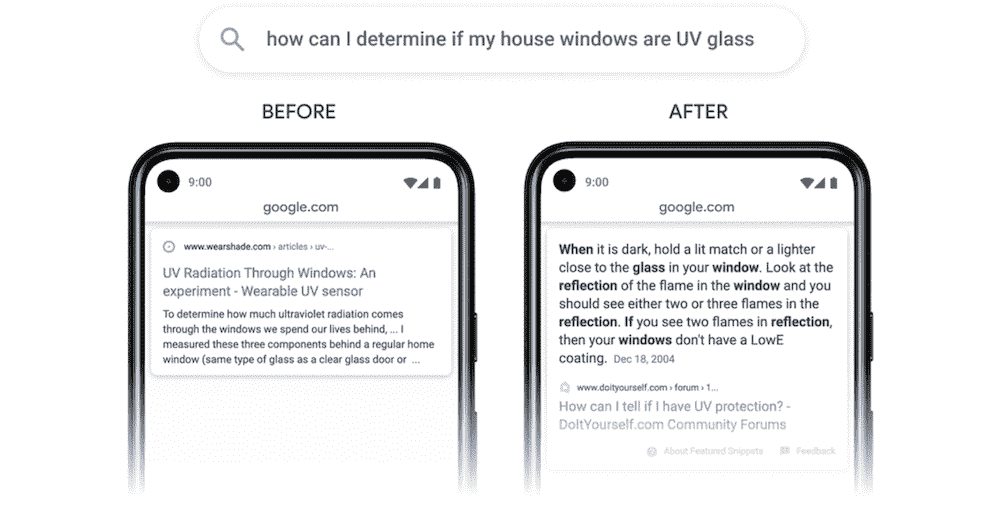

Google Passage Ranking.


### 42.避免关键词自相残杀

当一个站点的两个或多个页面竞争同一个关键词时，就会发生关键词自相残杀。虽然这有时会导致两个页面的排名，但通常更容易将所有精力集中在一个页面上，而不是分散在多个页面上。理论上，这将帮助一个版本排名更高。

如果你足够幸运，在前两个位置有超过一页的排名，你可以指望你的运气，并继续审查另一个关键词。

在下面的例子中，我们可以看到有 2 个结果的 Yoast 排名。通过结合这两个页面和伴随它们的信号，他们有更好的机会提升排名:

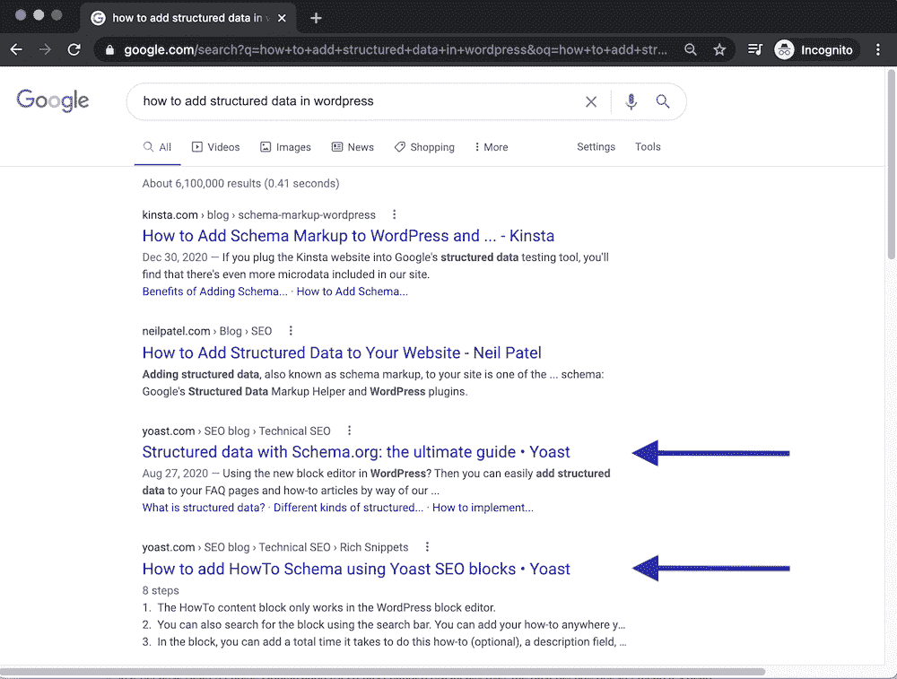

关键词同类相食的例子。


关键词自相残杀也会导致不稳定的排名，导致你的页面位置波动，因为搜索引擎可能不清楚哪个是最相关的页面。这意味着一个页面可能会排名好几天，然后另一个页面可能会取代它的位置，但在较低的位置。

#### 如何检查关键字蚕食

有几种方法可以检查关键词蚕食是否导致了你的 WordPress 站点的问题。使用像 Ahrefs 这样的工具可以让你检查是否有多个页面为你的目标关键词排名。

你可以很快看到任何排名的变化，不同的页面在排名中跳来跳去。

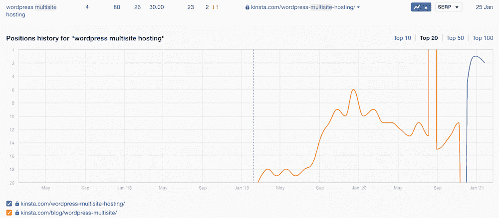

关键词同类相食的例子。


您也可以使用谷歌搜索控制台来查看多个页面对确切关键词的排名。

在搜索结果部分，选择“查询”选项卡，然后按位置过滤行，其中位置小于 20。这将显示谷歌搜索结果的前两页。

接下来，选择“点击”、“印象”和“平均位置”，然后查看位置大于 1 的高印象关键词。

通过点击每个关键字并选择“页面”选项卡，您可以显示是否有多个页面在所选查询中排名。

您可能希望将您的目标国家添加到顶部的过滤器中，特别是当您的内容被翻译成其他语言时。

在下面，你可以看到我们有两个网页对“wordpress multisite hosting”这个查询进行了排名注意平均位置没有一致性。有了这些数据，我们可能会决定将内容合并到一个“超级”页面中，或者审查内容以避免在某个排名页面上锁定关键字。

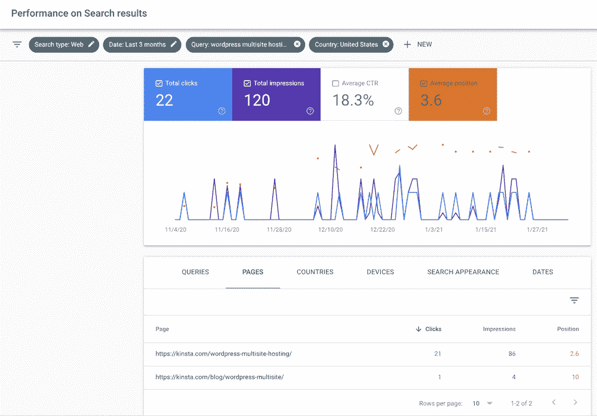

在谷歌搜索控制台检查关键词自相残杀。


### 43.发布常青树内容

[常青内容](https://kinsta.com/blog/evergreen-content/)对 WordPress SEO 和长期有机流量至关重要。这个术语指的是总是相关的内容，不管你什么时候读。

通常，在发布常青树内容时，作者不得不偶尔更新帖子。毕竟，大多数行业都会随着时间的推移而略有变化。

evergreen 内容的一个主要优势是，你可以反复分享它，并不断为它建立反向链接和社交信号。如果你选择发布常青内容 vs 新闻，明智的做法是着眼长远。

### 44.更新旧内容

正如我们在本文中多次暗示的，更新旧内容是我们使用和推荐的可靠的 SEO 策略。谷歌在对搜索结果进行排名时会考虑内容的“新鲜度”，因此浏览你的帖子并对其进行修改，以更好地反映你所在行业的变化，可以显著提高你的知名度。

正如 Alfred Lua 指出的那样，Yoast SEO 可以识别你想要更新的内容。您标记为基础内容且在过去六个月内未被编辑的帖子将出现在帖子列表中陈旧的基础内容链接下。

或者，你可以看看免费的在线工具， [Animalz Revive](https://revive.animalz.co/) :

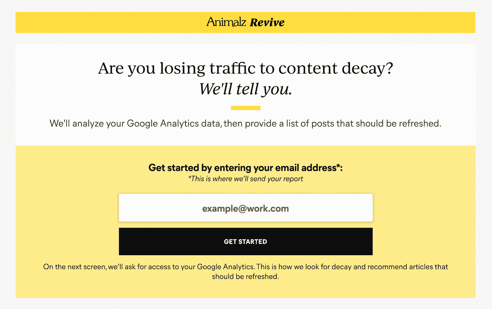

Animalz 复活工具。


只需输入您的网址，并允许工具访问您的谷歌分析。然后，它会突出你可以更新的帖子，以提高你的搜索引擎优化。

### 45.练习内容修剪

同样，你也可以练习“内容修剪”，也就是说，如果过时的内容无法更新和改进，就把它们从网站上删除。这可能是一个相当可怕的过程。毕竟，删除你努力创作的内容可能违背你的本能。

然而，最好是少一些高质量的内容，而不是有很多与访问者不相关或没有价值的帖子。这也将需要更少的“抓取预算”，即在给定时间内谷歌抓取了你网站上的多少页面。

内容修剪是一门艺术，我们不建议你删除网站上一半的帖子。然而，你可能想看看 HubSpot 的这个案例研究，其中他们[从他们的博客](https://blog.hubspot.com/marketing/remove-outdated-content)中删除了 3000 个帖子。

这将让你了解所涉及的工作，以及这种做法如何提高 SEO。记住[为删除的内容创建 301 重定向](https://kinsta.com/help/redirect-rules/)，这样访问者就不会迷路。

### 46.考虑内容中心和分类法

这个策略是可选的，但是在 Google 中索引类别可以增加你的内容的相关性来提升你的页面排名，[增加你的流量](https://kinsta.com/blog/how-to-drive-traffic-to-your-website/)，并且改善你的 WordPress SEO。

很多 [WordPress 主题](https://kinsta.com/best-wordpress-themes/)默认不显示类别描述。遵循以下步骤将使您能够索引您的类别，并在您的网站上显示它们。

#### 在 Yoast 中启用类别索引

你要做的第一件事是导航到 SEO >搜索外观，然后点击分类选项卡:

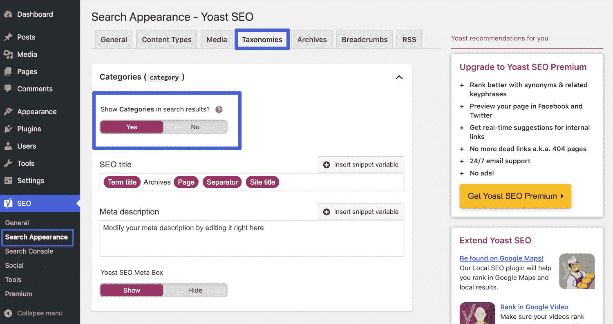

The Yoast SEO Show Categories in search results setting.


然后，您应该检查以确保“在搜索结果中显示类别”选项已启用。

#### 第二步:写类别描述

最后，在您想要索引的特定文章类别下输入您的类别描述。你可以通过导航到 Posts > Categories 并点击相关分类下的 Edit:

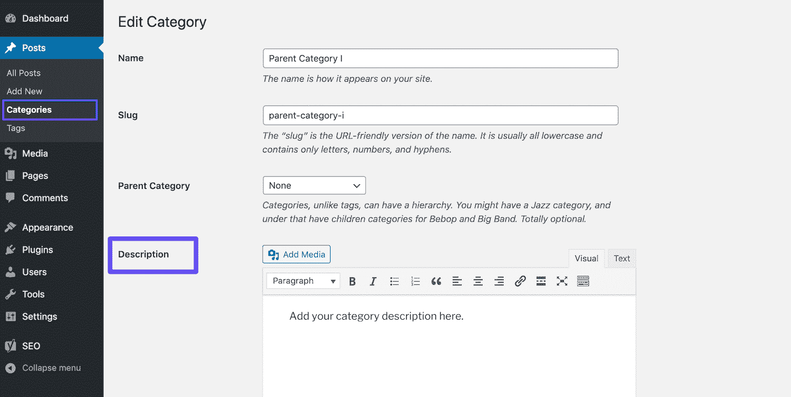

Adding a category description.


完成后，请确保点击更新按钮。

### 47.让你的内容进入谷歌特色片段

你见过一个以列表、表格或段落的形式出现在 Google SERP 顶部的框，通常伴随着一张或多张图片吗？这些被称为[特色片段](https://kinsta.com/blog/featured-snippets/)，它们可以帮助你的页面跳到谷歌搜索结果的顶部，进入“零位置”。

这里有一个特色片段的例子:

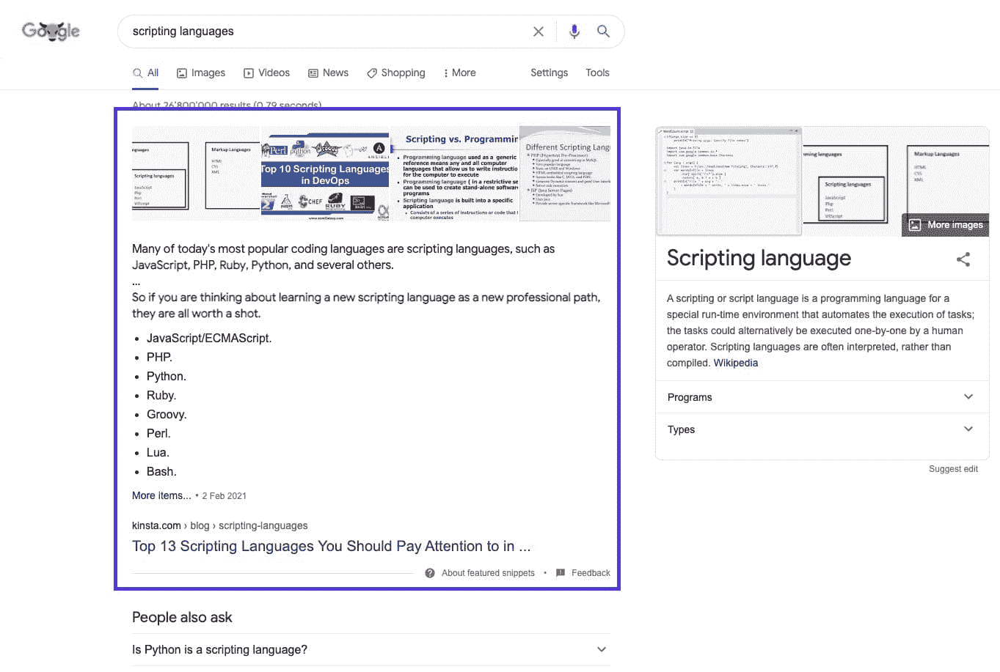

Google Featured Snippet Example.


特色片段比传统的蓝色链接和描述占用更多的空间。这可以积极地影响你的网页的点击量，所以获得特色片段是给你的网站带来更多流量的好方法。

问题是，**你如何为特色片段优化你的页面？**

首先要强调的是，几项研究发现，在大多数情况下，页面必须首先在谷歌搜索结果的第一页排名，才有资格获得特色片段。

您可以通过在 Google 搜索控制台中深入研究您的查询报告并按位置过滤，包括您已经排在位置 1 到 10 的所有查询，来建立一个机会关键字列表。一定要选择你的目标国家。如果你移动到零位置，每个查询的印象越多，你可能得到的流量就越多。

检查谷歌，以确保您的网页排名在显示的位置。如果一个有特色的片段已经出现在另一个网站上，它会给你一个你将面临什么的想法。

不幸的是，没有神奇的方法可以让你的内容变成有特色的片段。然而，从我们的个人经验来看，我们发现以下几点会有所帮助:

*   添加模式标记，帮助谷歌理解你的内容是什么，以及如何适合你的网站
*   有效地使用标题标签(

    # –

    ###### )、项目符号列表和编号列表

*   以一种有组织的方式组织你的文章
*   保持你的段落简短——特色片段长度一般在 40-50 字左右
*   使用问题作为标题，并在下面回答它们(问题通常会触发特色片段)
*   使用高质量的图像和视频

遵循这些建议，你应该会走上正确的道路！

### 48.为 Google Discover 优化您的内容

[Google Discover](https://www.blog.google/products/search/introducing-google-discover/) 是 Android 的内容建议服务。这是一个内容提要，谷歌认为用户会根据他们的搜索历史和他们读过的其他内容找到相关内容。正如我们之前提到的，移动流量正在疯狂增长，因此针对该平台优化您的帖子只能帮助您。

由于 Google Discover 不是基于搜索的，关键字研究和优化不会帮助你把文章放到用户的订阅源中。然而，你可以采取几个[可行的步骤](https://searchengineland.com/how-do-you-optimize-for-google-discover-309244)来提高你的机会，所有这些我们都在本帖中讨论过:

*   打造[优质内容](https://kinsta.com/blog/content-length/)。
*   优化你的[标题](https://kinsta.com/blog/headline-analyzer/) (clickbait 在这里可能做得更好)。
*   在帖子中使用[图片和视频](https://kinsta.com/blog/visual-content-strategy/)(1200 像素宽，避免使用徽标)。
*   混合您的内容类型，尝试不同风格的故事，如列表文章、问答、趋势主题。创建[常青内容](https://kinsta.com/blog/evergreen-content/)，以及新的、及时的帖子。
*   通过[整合社交证据](https://kinsta.com/blog/wordpress-facebook-plugins/)建立对内容的信任。
*   [翻译你的内容](https://kinsta.com/blog/wordpress-multilingual/)。
*   拥有一个适合手机使用的网站。
*   理解并增强 E.A.T .信号(专业知识、权威性和可信度)。

当涉及到你在帖子中包含的图片时，你可能也想考虑为 Google Discover 启用大图片。统计数据显示，这将提高点击率、页面浏览时长和用户满意度。你需要使用[这个表格](https://docs.google.com/forms/d/e/1FAIpQLSdEHmPmv-SAXVuYqW2CT0qALgNX-0_F3xmnrSxsLyFyvSeQUw/viewform)来选择加入谷歌的程序，以使用大图。

[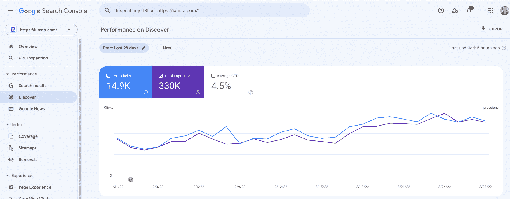](https://kinsta.com/wp-content/uploads/2022/03/optimize-google-discover.png)

Google Discover report.


你可以通过谷歌搜索控制台中的发现报告来跟踪谷歌发现向你的网站发送了多少流量，以及显示了多少页面。

## 图像优化

 

### 49.明智地命名您的图像文件

这是很多 WordPress 网站所有者做错的一件事。你的图像文件名很重要！通过一些正确的最佳 WordPress SEO 实践，你可以看到 SERPs 和 Google 图片搜索都有很好的提升。

一些准则包括:

*   在上传图片到 WordPress 之前，总是用与你的内容相关的单词来命名你的图片文件。例如，将 DC0000.jpg 的**改为 wordpress-seo.jpg 的**。****
***   在图像文件名中，单词之间总是包含连字符。例如，如果你将一个文件命名为 wordpress_seo.jpg 或 wordpressseo.jpg，谷歌将无法读取它。它只读取带有包含单个单词的连字符的文件，所以你会想把图像命名为**wordpress-seo.jpg**。*   如果可以的话，包括你的焦点关键词，至少是你的特色图片。我们总是在博客文章的特色图片中使用我们的焦点关键词。*   保持你的文件名小写。这可以保持你的图片网址的整洁，并保持所有网址的一致性。**

 **对于未来的文件上传，这些都是非常简单的规则。

### 50.为图像添加替代文本

替代文本是指应用于站点上图像的替代属性或替代文本。ALT 标签由屏幕阅读器为视力受损的用户使用，为图像提供额外的上下文。搜索引擎也使用它们来更好地理解图像内容，以及它们与周围内容的关系。

例如，如果有人使用 Dragon Naturally Speaking 软件，ALT 文本可以帮助他们更好地浏览页面。当查看站点的 HTML 时，您可以在``标签中找到 alt 属性，如下所示:

```

```

你应该在你的图片中添加替换文字。如果您还没有这样做，您可以现在就回去做。有了 WordPress，你不需要知道任何代码来添加替代文本。你可以通过在你的[媒体库](https://kinsta.com/blog/wordpress-media-library/)中选择一个图像或者点击 WordPress 编辑器中的一个图像来简单地输入它。

在块编辑器中，您可以在图像设置下侧栏的块选项卡中找到替代文本(可选文本)字段:

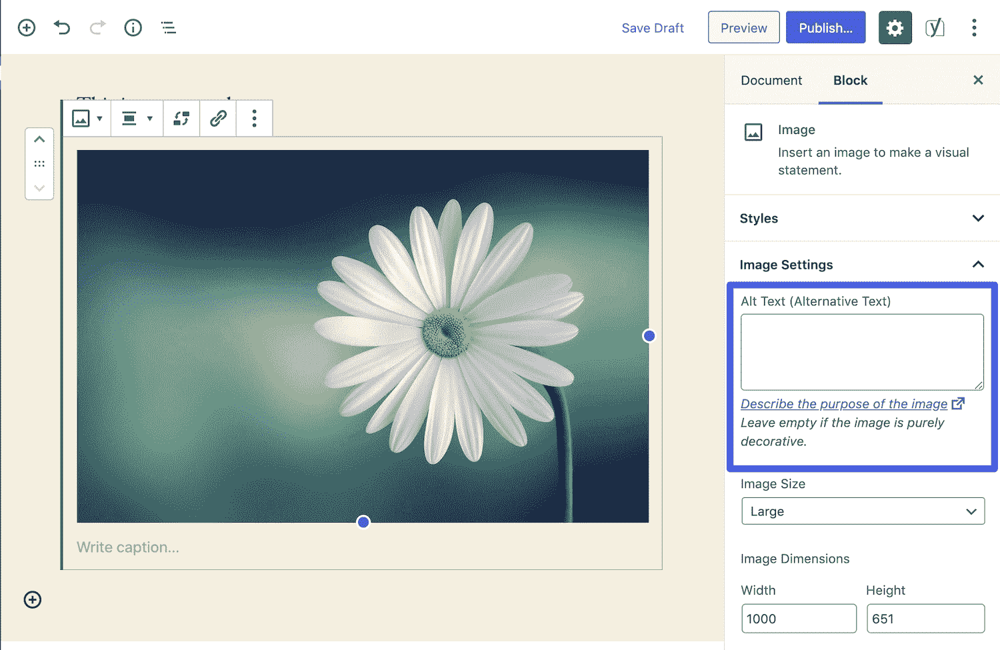

在块编辑器中添加 ALT 文本。


要在经典编辑器中添加替代文本，请按照以下步骤操作。

#### 步骤 1:打开图像设置

首先，在经典编辑器中打开您的帖子或页面。然后，点选您想要加入替代文字的图像。您会看到它上面出现一个工具栏:

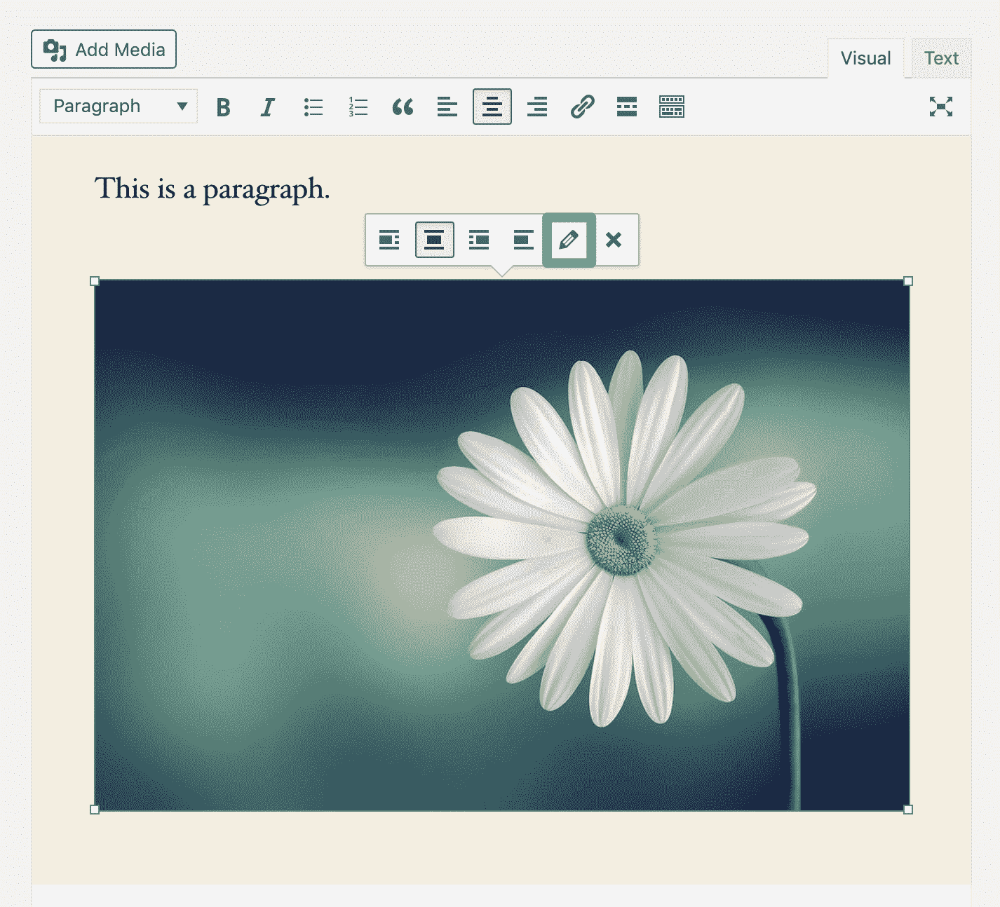

在经典编辑器中打开图像设置。


单击铅笔图标打开图像设置。

#### 步骤 2:在相关字段中添加替代文本

如果你运行的是 WordPress 的最新版本，可选文本域应该是结果窗口中的第一个:


在经典编辑器中添加 ALT 文本。


完成后，单击蓝色的更新按钮。

通常，如果它适用于图像，添加您的焦点关键字是有益的。然而，不要仅仅把你的焦点关键词作为替代文本添加到你所有的图片中。和所有 SEO 的事情一样，做事情要适度。谷歌不喜欢垃圾邮件。

### 51.使用高质量的图像

我们已经提到了图片如何通过谷歌图片搜索帮助你的网站增加流量。[视觉内容](https://kinsta.com/blog/visual-content-strategy/)如特色图片、截图、图形和图表也有助于分解你的文本并阐明内容。

换句话说，[在你的内容中添加图片和图形](https://kinsta.com/blog/optimize-images-for-web/)在几个方面有利于你的网站:

*   你的图片可以在谷歌图片搜索中排名，为你的网站带来更多的有机流量。
*   图片可以帮助展示你的文章与搜索引擎爬虫的相关性。
*   视觉效果让你的内容更有趣、更吸引人、更容易阅读。

尽量把你的图片保持在 100KB 以下，以避免它们导致你的页面加载时间滞后。上传图像时，确保使用正确的图像尺寸。由浏览器调整大小的巨大图像通常会增加不必要的页面加载时间。

谷歌现在支持使用[高质量图像](https://searchengineland.com/google-to-add-support-for-higher-quality-images-in-search-swipe-up-images-3d-images-316706)，这是美化你的视觉内容的绝佳机会。您可以考虑用高分辨率版本替换不太理想的图像，从而更新一些旧内容。

### 52.如果使用 CDN，请确保可以访问图像

随着时间的推移，来自图像的流量会显著增加，因此验证搜索引擎是否可以抓取您的图像是至关重要的。根据 Jumpshot 的[数据，2018 年，谷歌图片占网络搜索的 22%以上。](https://sparktoro.com/blog/new-jumpshot-2018-data-where-searches-happen-on-the-web-google-amazon-facebook-beyond/)

如果你正在使用 CDN，你需要确保你的图片不会被你的 CDN 提供商的 robots.txt 屏蔽。对于使用 Yoast SEO 插件的用户来说，你需要在 functions.php 文件的底部添加以下代码。

当然，用您自己的域名和 CDN 域名替换:

```
function wpseo_cdn_filter( $uri ) {
return str_replace( 'http://yourdomain.com', 'http://cdn.yourdomain.com', $uri );
}
add_filter( 'wpseo_xml_sitemap_img_src', 'wpseo_cdn_filter' );
```

一些网站声称他们的图片正在被去索引(如下所示)。

查看我们的[图像优化指南](https://kinsta.com/blog/optimize-images-for-web/)，了解如何让你的图像在搜索中显示出来。

我们还推荐观看 Google 的 John Mueller 在搜索中心的闪电演讲，他提供了许多关于最佳实践图像优化的有用提示:


Kinsta 客户可以利用由 Cloudflare 的全球网络提供的高性能免费 Kinsta CDN ,该网络拥有 200 多个 pop。

### 53.不要索引图像附件页面

每当你[在 WordPress](https://kinsta.com/blog/wordpress-media-library/) 上传一张图片并将其插入帖子或页面时，它会创建一个单独的图片所在的附件页面。如果你不小心，谷歌可能会开始索引这些网页，因为它们没有价值，这可能是一种浪费爬行预算。

例如，如果有人点击搜索结果中的图片附件页面，他们只会看到图片，而不是帖子中的内容。这可能会导致他们立即离开，导致你的跳出率上升。

如果你在你的 WordPress 网站上注意到这个问题，Yoast SEO 插件有一个重定向选项来修复它。只需导航到 SEO >搜索外观，然后点击媒体选项卡:

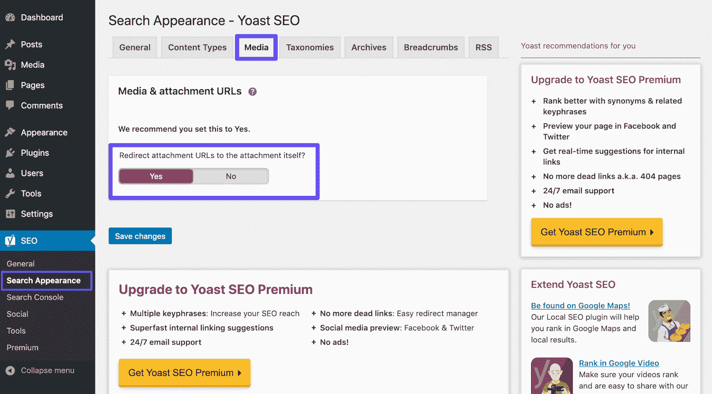

The Yoast SEO attachment redirects setting.


现在启用“将附件 URL 重定向到附件本身”选项。

## 社交和视频

 

### 54.声明您的社交档案

尽快认领你所有的社交媒体简介是明智的。通常，企业应该在推出网站后立即这样做。大多数来自社交媒体档案的反向链接是 nofollow，这意味着它们不会帮助你的 SEO，但它们仍然可以给你带来大量的流量。

这种策略的另一个显著优势是，社交媒体个人资料页面通常可以在 SERPs 中排名。这对品牌来说是巨大的，因为它允许你对你的访问者看到的第一个搜索结果有更多的控制。就拿金斯塔来说吧。

如果你用谷歌搜索“Kinsta”，你会发现我们的推特、脸书、LinkedIn 和 Youtube 的个人资料都在第一页。如果你在 Twitter 上非常活跃，你还可能有资格获得一个特殊的搜索结果，显示你最近的 3 条推文，就像在 Kinsta brand SERP 中看到的那样。使用社交媒体档案可以让你的品牌立竿见影，而且不费吹灰之力。

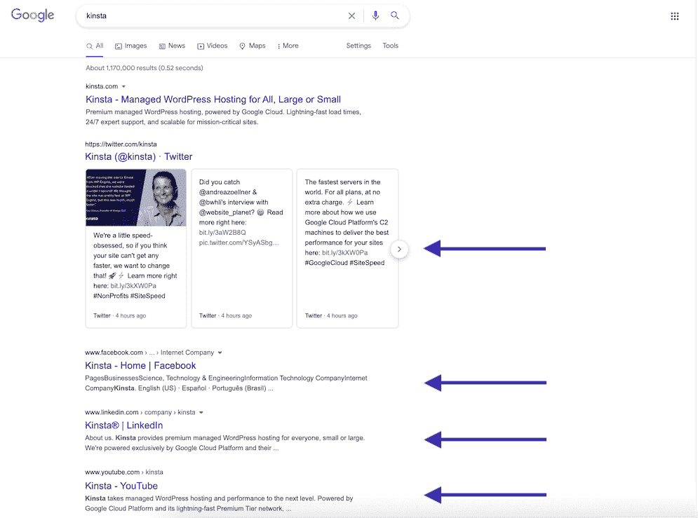

Kinsta’s Brand SERP.


你可以使用像 [Namechk](https://namechk.com/) 这样的免费工具来查看哪些名字在所有社交媒体网络上都可用。今天一定要认领你所有的。顺便提一下，如果你还需要一点帮助[为你的博客](https://www.ryrob.com/how-name-blog/)取个名字，看看这个指南。

### 55.利用社交信号

“社交信号”包括与你的品牌相关的在线活动，这些活动不会发生在你的 WordPress 网站上。这包括[推文](https://kinsta.com/blog/twitter-marketing/)、[分享](https://kinsta.com/blog/wordpress-facebook-plugins/)、投票数以及其他类似的表明你品牌质量的指标。

**社交信号会影响 WordPress SEO 吗？**答案，很遗憾，不是非黑即白。然而，根据我们在 Reddit 和 Y Combinator 的经验，我们亲眼看到它们会暂时影响你在 SERPs 中的排名。

在过去，我们看到这些网站上的热门帖子会立即在谷歌的第一页排名。当这些帖子不再成为热门话题后，它们的排名往往会波动，最终会稳定下来，成为它们更长期的排名。

是什么导致了这种情况的发生？我们的理论是，大量流量和社交信号的结合导致谷歌认为这些帖子非常相关，因此将它们放在 SERPs 中。许多 SEO 专家会争论这个问题，但是我们已经亲眼目睹了很多次。

下面是一个例子，我们写了一些不错的关键词量，第二天在 SERPs 中飙升，这似乎是因为我们能够获得大量的社交流量:

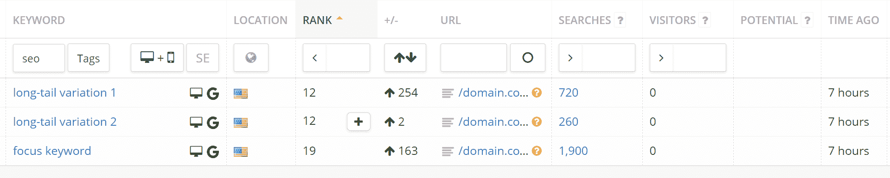

社会信号交通。


最大的收获就是，分享、社交信号和更多的流量很可能会以某种方式影响你的排名。围绕某个内容制造轰动有助于让它出现在更多人面前，这通常会带来更多的链接，因为其他人会从他们的内容中引用你的内容。所以我们建议尽可能地利用社交媒体。

[Want to improve your site's SEO? Start with this detailed guide and get ready to watch your rankings soar. 😱Click to Tweet](https://twitter.com/intent/tweet?url=https%3A%2F%2Fkinsta.com%2Fblog%2Fwordpress-seo%2F&via=kinsta&text=Want+to+improve+your+site%27s+SEO%3F+Start+with+this+detailed+guide+and+get+ready+to+watch+your+rankings+soar.+%F0%9F%98%B1&hashtags=SEO%2CMarketing)

### 56.指定社会标记

Yoast SEO 插件也允许你添加社会标记。这有助于谷歌将这些链接到你的网站，用来充实你品牌的知识面板。只需列出您的社交媒体资料，使用结构化数据将它们与您的网站相关联。

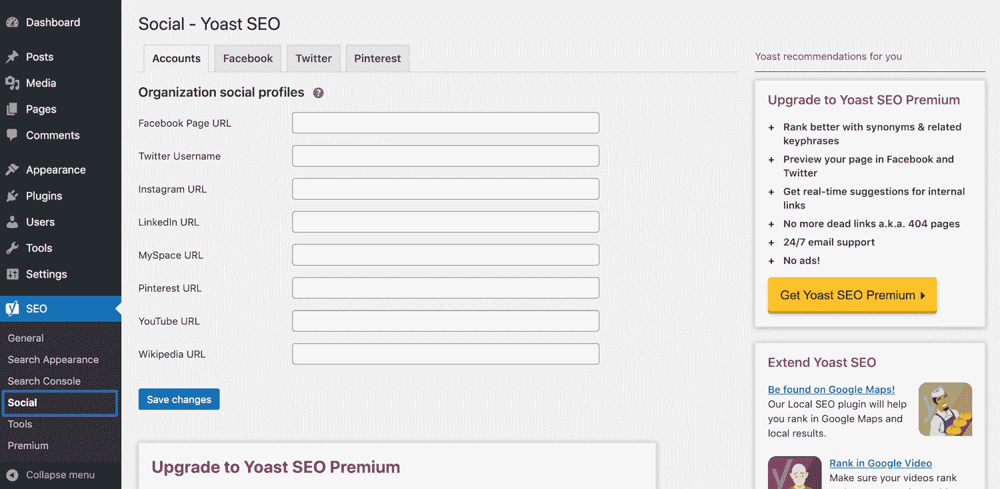

Yoast SEO 社交设置。


#### 打开图形标签

当你从你的 WordPress 站点分享一篇博客文章时，你可能在脸书或 Twitter 上看到过缩略图。这些是使用开放图(OG)标签自动生成的。像标题标签和元描述一样，OG 标签提供了关于社交媒体平台上共享的内容的信息。

下面是金斯塔在脸书上分享的一篇博文的例子:

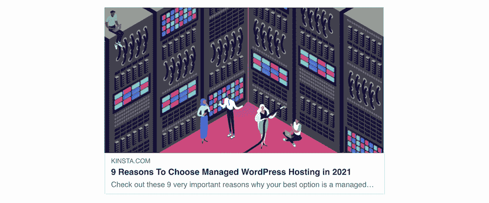

Open Graph tags in Facebook.


幸运的是，尤斯特再次出手相救。我们建议进入 Yoast SEO 中的社交选项，并填写所有可用的字段。

您还可以更改设置，例如当您的网站被共享时显示的默认缩略图( `og:image`)，以及 Twitter 使用的缩略图类型:

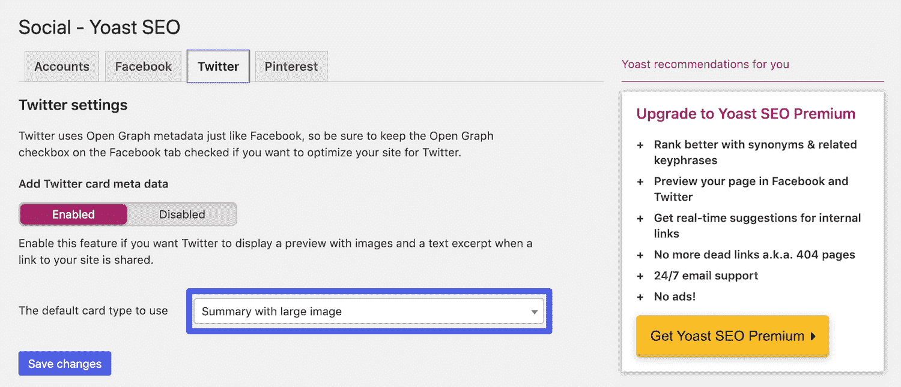

用 Yoast SEO 更改默认的 Twitter 卡类型。


这是 Yoast SEO 插件自动为您添加的代码示例。我正在用这篇关于 SEO 的[博文](https://kinsta.com/blog/what-does-seo-stand-for/):

```
<meta property="og:locale" content="en_US" />
<meta property="og:type" content="article" />
<meta property="og:title" content="What Does SEO Stand For? (+ 7 Beginner's Tips for Ranking a Site)" />
<meta property="og:description" content="Search Engine Optimization is one of the most powerful ways to attract new users. But what does SEO stand For? Learn more in our in-depth guide!" />
<meta property="og:url" content="https://kinsta.com/blog/what-does-seo-stand-for/" />
<meta property="og:site_name" content="Kinsta Managed WordPress Hosting" />
<meta property="article:publisher" content="https://www.facebook.com/kinstahosting" />
<meta property="article:tag" content="seo" />
<meta property="article:tag" content="WordPress" />
<meta property="article:section" content="Business Growth Strategies" />
<meta property="article:published_time" content="2019-07-01T07:40:12+00:00" />
<meta property="article:modified_time" content="2020-03-04T17:00:23+00:00" />
<meta property="og:updated_time" content="2020-03-04T17:00:23+00:00" />
<meta property="og:image" content="https://kinsta.com/wp-content/uploads/2019/07/what-does-seo-stand-for.png" />
<meta property="og:image:secure_url" content="https://kinsta.com/wp-content/uploads/2019/07/what-does-seo-stand-for.png" />
<meta property="og:image:width" content="1460" />
<meta property="og:image:height" content="730" />
<meta name="twitter:card" content="summary_large_image" />
<meta name="twitter:description" content="Search Engine Optimization is one of the most powerful ways to attract new users. But what does SEO stand For? Learn more in our in-depth guide!" />
<meta name="twitter:title" content="What Does SEO Stand For? (+ 7 Beginner's Tips for Ranking a Site)" />
<meta name="twitter:site" content="@kinsta" />
<meta name="twitter:image" content="https://kinsta.com/wp-content/uploads/2019/07/what-does-seo-stand-for.png" />
<meta name="twitter:creator" content="@matteoduo" />
```

脸书和谷歌使用 OG 标签来获取信息，而 Twitter 使用自己的元信息，称为 Twitter 卡。如果您需要[重新生成缩略图](https://kinsta.com/blog/regenerate-thumbnails/)，可以查看本指南。

### 57.利用视频

这个技巧有两个部分:

1.  将内容转换为视频格式，并在内容中包含相关视频
2.  使用结构化数据优化视频可见性，以便在视频搜索中更好地呈现它们

#### 1.重新利用视频资产中的书面内容

YouTube 是谷歌旗下的一个平台，近年来发展迅速，在搜索流量最高的 100 个网站中排名第二。这意味着添加内容的视频版本将有助于您通过新的渠道锁定新的访问者。

仔细想想，人们喜欢以不同的方式消费内容。

有些人乐于通读长篇博文，有些人则更喜欢看视频内容。如果你给你的用户提供两种选择，就像我们在我们的博客和 [Kinsta 的 YouTube 频道](https://www.youtube.com/kinsta)上所做的那样，你可以瞄准更广泛的受众。

[](https://kinsta.com/wp-content/uploads/2022/01/kinsta-youtube-growth.jpg)

Kinsta’s channel growth in 2021


为 YouTube 优化视频(被称为 YouTube SEO)是一个不同的学科，你可以在我们的[YouTube SEO 指南](https://kinsta.com/blog/youtube-seo/)中了解更多。

#### 2.为视频搜索优化视频

谷歌的视频标签允许你搜索视频内容。虽然谷歌非常擅长从网页中提取视频，但你可以鼓励谷歌通过使用[视频对象模式](https://developers.google.com/search/docs/appearance/structured-data/video)提供更多上下文来包含你的视频(或你嵌入到页面中的其他人的[视频)。](https://kinsta.com/blog/embed-youtube-video-wordpress/)

VideoObject 模式可用于向 Google 提供视频的更多细节，包括标题、描述和缩略图。

我们发现，我们包含的视频以及结构化数据通常在谷歌的视频结果中表现良好，特别是对于我们在谷歌搜索中排名也很好的关键词。

## 本地搜索引擎优化

### 58.使用本地搜索引擎优化技术

本地搜索引擎优化是至关重要的，尤其是对小企业。除了这篇文章，我们还能涵盖更多的内容。一个小提示是，你应该立即用[谷歌商业简介](https://kinsta.com/blog/what-is-google-my-business/)和[必应搜索引擎](https://www.bingplaces.com/)注册你的网站。

这两个工具都是完全免费的，可以帮助你在特定位置的搜索中出现在 SERPs 中。例如，下面我们搜索纽约的“意大利餐厅”:

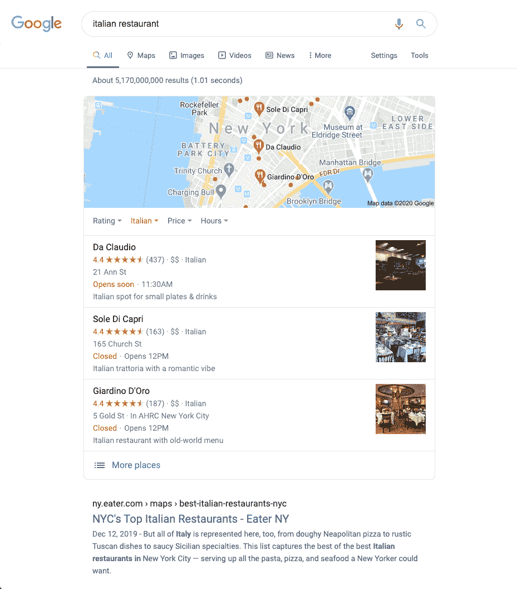

Example of a local Google search results for “Italian restaurant.”


必应现在允许你使用你的谷歌我的商业信息来创建阿炳地点账户，为你节省大量时间，并使它成为一个没有大脑的上市。

请查看来自 TheSiteEdge 的人们提供的这份[深入的本地 SEO 指南](https://thesiteedge.com/local-seo-guide/)。这是开始并在当地竞争中保持领先的好方法。

### 59.翻译你的网站

在你的网站上添加额外的语言可以极大地改变 WordPress SEO 和流量的游戏规则。尼尔·帕特尔对此进行了实验，在将他的网站翻译成 82 种语言后，流量增加了 47%。

当然，这并不适用于所有人，成功取决于你的业务和地理位置。然而，这是一件值得思考的事情。

在 Kinsta，我们已经将我们的网站翻译成了另外 9 种语言，因此去年的有机流量增加了 107 %:

[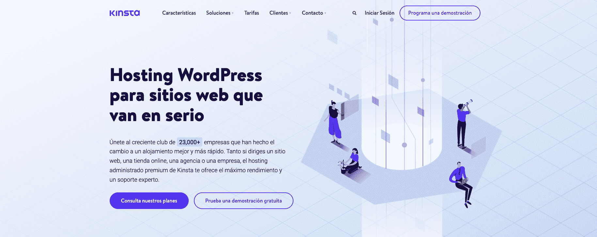](https://kinsta.com/wp-content/uploads/2022/03/kinsta-translated-website.png)

The Kinsta home page in Spanish.


当在你的 WordPress 网站上实现这一点时，谷歌不会因为重复内容而惩罚你，但是你必须有正确的`hreflang`和`canonical`标签。

在下面的例子中，标签突出显示了页面的英语版本的 URL，但是也显示了有一个西班牙语版本。这有助于搜索引擎根据用户的浏览器语言设置了解哪个版本的页面最适合他们的用户。您还会注意到“x-default”`hreflang`属性，它显示了如果没有用户语言的翻译版本，应该使用哪个版本。

#### 英译本

```


```

#### 西班牙语版本

```


```

有[插件可以用来翻译你的内容](https://kinsta.com/blog/wordpress-multilingual/#alternative-wordpress-multilingual-plugins)和 WordPress 的翻译服务，比如 [Weglot](https://weglot.com/) 。

请记住，没有任何自动翻译工具能胜过真人为你翻译。我们建议雇佣一位母语人士或使用专业翻译服务。

## 跟踪

### 60.关注谷歌分析

了解你的 WordPress SEO 效果如何的最好方法是在 Google Analytics 上注册一个免费账户。如果您需要一些帮助，请遵循本[逐步集成教程](https://kinsta.com/blog/google-analytics-wordpress/)。

你应该做的第一件事就是把你的谷歌分析账户和你的谷歌搜索控制台账户联系起来。在您的域的属性设置下，单击搜索控制台设置，它将引导您完成链接它们的过程:

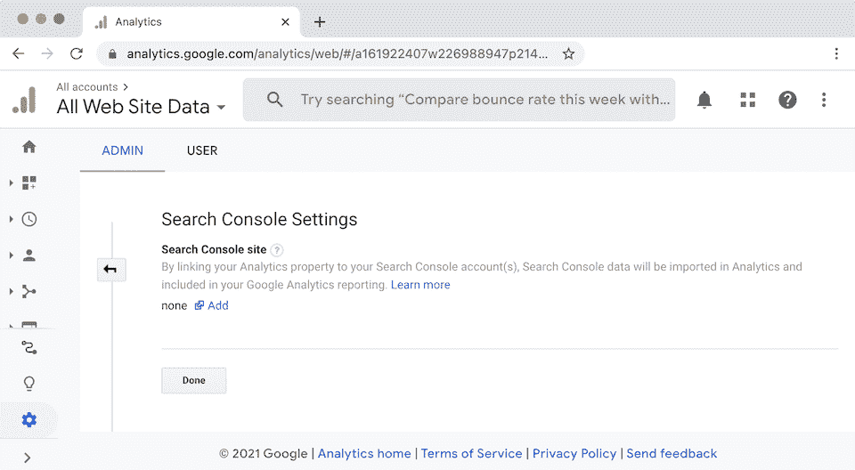

Link Google Analytics and Google Search Console.


排名靠前的网站选择 Kinsta 来处理他们从搜索中获得的高流量。查看我们的计划。

这将为您的 Google Analytics 帐户添加一个附加部分，允许您查看搜索查询、您的最佳登录页面等:

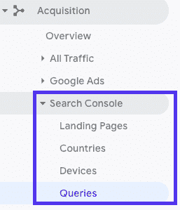

Check Search Console data in GA.


另一个需要注意的部分是 Overview > Acquisition 下的 Channels，它将突出显示将流量导向您网站的渠道，包括有机搜索:

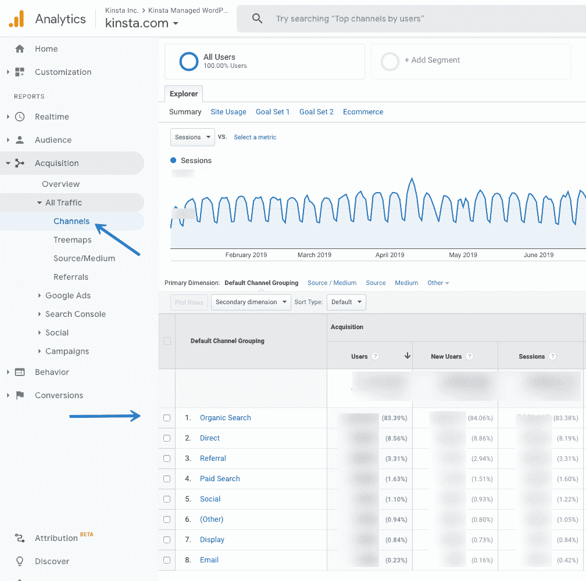

Organic search data in Google Analytics.


当你点击“有机搜索”报告时，你会看到来自谷歌、必应、雅虎和其他搜索引擎的详细信息。注意通过这些渠道到达的访问者的百分比会给你一个很好的主意，知道你的搜索引擎优化工作有多有效。

### 61.跟踪你的关键词排名

跟踪你的关键词排名也很重要。这允许你在搜索引擎优化活动中监控你的焦点关键词的进展。如果你花时间优化你的帖子，你也需要长期监控他们的进展。

我们成功的一个伟大策略是监控你的关键词出现在谷歌搜索结果第二页的最顶端。花些时间添加内容和图片，建立反向链接，以及我们在这篇文章中提到的其他策略。这应该有助于将这些帖子放到第一页。

谷歌搜索控制台非常有助于了解你的网站的关键词排名，所以去看看搜索结果报告吧。

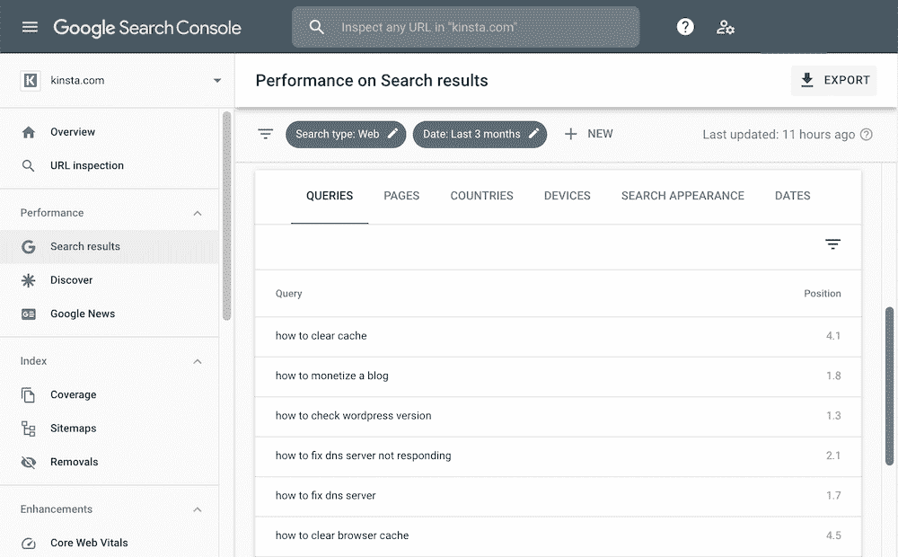

Google Search Console Queries Report.


另一个在不同设备上追踪任何国家排名的好工具是 AccuRanker。[我们强烈推荐使用 AccuRanker](https://kinsta.com/blog/saas-products/#18-accuranker) ，因为它是一款很棒的工具:

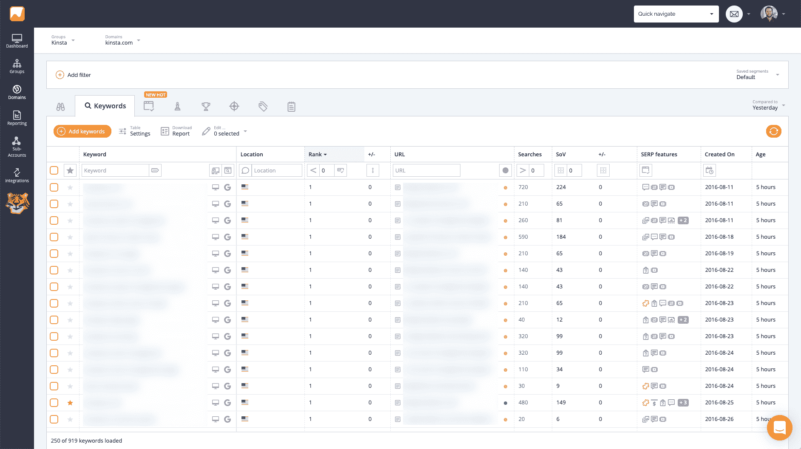

Monitoring keyword rankings in AccuRanker.


这将有助于您随时关注关键词的表现。

[SEO can make or break your website... 😬 but with this thorough guide, you'll have everything you need to optimize your content and grow your organic traffic by 250% (yes, really!) 🚀Click to Tweet](https://twitter.com/intent/tweet?url=https%3A%2F%2Fkinsta.com%2Fblog%2Fwordpress-seo%2F&via=kinsta&text=SEO+can+make+or+break+your+website...+%F0%9F%98%AC+but+with+this+thorough+guide%2C+you%27ll+have+everything+you+need+to+optimize+your+content+and+grow+your+organic+traffic+by+250%25+%28yes%2C+really%21%29+%F0%9F%9A%80&hashtags=SEO%2CWordPress)

## 摘要

SEO 对任何企业的成功都至关重要，而这一切都始于[为你选择合适的主机提供商](https://kinsta.com/wordpress-hosting/)。

在这篇文章中，我们分享了大量我们用来获得结果的 WordPress SEO 策略。通过在你的网站上实施尽可能多的方法，我们 100%相信你能够提升你的有机流量和 SEO 排名。

SEO 是一个正在进行的“游戏”,有很多方面值得关注。这就是为什么学习 SEO 技巧可以帮助你建立成功的业务。

你对 WordPress SEO 有什么问题吗？请在下面的评论区告诉我们！

* * *

### 常见问题

#### 什么是 SEO？

[SEO](https://kinsta.com/blog/what-does-seo-stand-for/) ，搜索引擎优化(Search Engine Optimization)的简称，指的是一套专注于通过在 SERPs(搜索引擎结果页)中的更高排名，从搜索引擎中驱动更多流量的战略和战术。

#### WordPress 对 SEO 有好处吗？

WordPress 是灵活的，不仅仅是作为一个 CMS，还得益于插件。插件为网站增加增强功能提供了无限可能。与许多  [其他 CMS](https://kinsta.com/blog/cms-software/)和网站建设者不同，WordPress 不需要掌握每一个可能的功能，而是留给第三方来创建插件，他们专注于他们的插件提供的任何功能。这也开启了竞争，意味着当你使用哪个插件时，你可能有几个选择。

为此，有大量的  [优秀的 SEO 插件](https://kinsta.com/blog/best-seo-plugins-for-wordpress/) 可以帮助你实现全面优化网站所需的一切。

#### 什么是页面搜索引擎优化？

页面搜索引擎优化指的是网站可以控制的优化。这包括优化标题标签、元描述、标题标签和内部链接。

#### 什么是离页 SEO？

离页搜索引擎优化是指可以在其他网站上进行的优化，以帮助改善一个不同的网站。这包括社交媒体信号和其他网站的链接。

#### 什么是技术型 SEO？

技术性 SEO 是指帮助爬虫更高效地抓取和索引网页的优化。这包括页面速度、XML 站点地图和规范化。

#### 什么是本地 SEO？

本地 SEO 是指帮助网站在本地搜索结果中获得可见性的优化。这包括添加谷歌商业简介和创建与特定地点相关的内容。

#### 什么是 UX 设计？

用户体验设计涉及到改善用户与网站交互和浏览的方式，考虑他们想要达到的目标，并确保达到目标的过程尽可能简单。这包括测试用户旅程，以确保转换路径是直接的，没有任何不必要的步骤。

* * *

让你所有的[应用程序](https://kinsta.com/application-hosting/)、[数据库](https://kinsta.com/database-hosting/)和 [WordPress 网站](https://kinsta.com/wordpress-hosting/)在线并在一个屋檐下。我们功能丰富的高性能云平台包括:

*   在 MyKinsta 仪表盘中轻松设置和管理
*   24/7 专家支持
*   最好的谷歌云平台硬件和网络，由 Kubernetes 提供最大的可扩展性
*   面向速度和安全性的企业级 Cloudflare 集成
*   全球受众覆盖全球多达 35 个数据中心和 275 多个 pop

在第一个月使用托管的[应用程序或托管](https://kinsta.com/application-hosting/)的[数据库，您可以享受 20 美元的优惠，亲自测试一下。探索我们的](https://kinsta.com/database-hosting/)[计划](https://kinsta.com/plans/)或[与销售人员交谈](https://kinsta.com/contact-us/)以找到最适合您的方式。**