# 2022 年 130 多个大品牌的例子

> 原文：<https://kinsta.com/blog/wordpress-site-examples/>

正如你们大多数人现在所知，WordPress 不仅仅是最好的博客平台之一，它还是一个成熟的内容管理系统( [CMS](https://kinsta.com/knowledgebase/content-management-system/) ，能够处理从大型企业网站到高流量杂志出版物的各种应用。WordPress 现在被超过 [43.3%的互联网网站](https://kinsta.com/wordpress-market-share/)使用(高于 2017 年的 32%)，并且没有放缓的迹象。很有可能有一天它会超过 50%的大关。

今天我们将与你分享一些例子，这些例子可能会让你对 2022 年最好的 WordPress 网站和品牌感到惊讶。

[Don't think #WordPress can do it? Think again. Check out these 130+ big brands using WordPress. 💪Click to Tweet](https://twitter.com/intent/tweet?url=https%3A%2F%2Fkinsta.com%2Fblog%2Fwordpress-site-examples%2F&via=kinsta&text=Don%27t+think+%23WordPress+can+do+it%3F+Think+again.+Check+out+these+130%2B+big+brands+using+WordPress.+%F0%9F%92%AA)

## WordPress 站点示例

> 美国增长最快的 100 家公司中有 62%使用 WordPress。–[内利奥软件](https://neliosoftware.com/blog/wordpress-use-of-best-companies-inc-5000-2016/)

下面最好的 WordPress 站点例子根据它们的内容和目的被放在不同的类别中。显然，我们不可能囊括所有的 WordPress 网站，所以我们想和你分享一些大品牌和高质量网站的例子。

我们发现，通常具有高域名权威和排名的网站是那些最充分展示 WordPress 及其威力的网站。当然，有数以千计的小网站可能做得很好，但我们会在这里一整天。😉因此，我们使用三个不同的因素来选择一个网站是否应该包括在内:

*   Ahrefs 域评级(50+)
*   Moz 域名权限(40+)
*   Alexa 排名(全球排名前 100 万的网站)

随着新网站的出现和其他网站迁移到不同的平台，这篇文章会经常更新。使用上述因素，每个类别中的列表按最高权限排序。**最高权重放在域名权威和域名评级**上，因为许多 Alexa 数据来自他们的工具栏，在某些类别和/或利基市场可能会扭曲数据。

> Kinsta 把我宠坏了，所以我现在要求每个供应商都提供这样的服务。我们还试图通过我们的 SaaS 工具支持达到这一水平。
> 
> <footer class="wp-block-kinsta-client-quote__footer">
> 
> 
> 
> <cite class="wp-block-kinsta-client-quote__cite">Suganthan Mohanadasan from @Suganthanmn</cite></footer>

[View plans](https://kinsta.com/plans/)

### WordPress 网站的分类索引

*   [商业和企业 WordPress 网站](#enterprise-wordpress-sites)
*   [新闻和杂志 WordPress 网站](#news-wordpress-sites)
*   [教育 WordPress 网站](#educational-wordpress-sites)
*   [电子商务 WordPress 网站](#e-commerce-wordpress-sites)
*   [娱乐 WordPress 网站](#entertainment-wordpress-sites)
*   [机构 WordPress 网站](#agency-wordpress-sites)
*   [开源&非盈利的 WordPress 网站](#non-profit-wordpress-sites)
*   [博客 WordPress 网站](#blogs-wordpress-sites)
*   [个人 WordPress 网站](#personal-wordpress-sites)

## 商业和企业 WordPress 网站

WordPress 已经非常适合企业，并提供了很多优势，例如:

*   可扩展、灵活且经济实惠
*   支持响应式开发
*   可攀登的
*   搜索引擎友好
*   针对新功能和安全漏洞频繁更新
*   支持[多站点](https://kinsta.com/blog/wordpress-multisite/)和多语言功能
*   REST API 和 [WP-CLI](https://kinsta.com/blog/wp-cli/) 使得它对开发者友好
*   方便用户的
*   具有精细访问权限的简单角色

许多因素都指向企业是 WordPress 继续扩张的下一个主要驱动力。该平台背后有大量的最新发布的示例，并且有越来越多的满意的企业用户在使用该软件的商业和社区版本。专门的[企业 WordPress 主机](https://kinsta.com/enterprise-wordpress-hosting/)现在也很容易获得。

下面是一些由 WordPress 驱动的大公司和企业。

### 白宫—[whitehouse.gov](https://www.whitehouse.gov/)

whitehouse.gov 网站为每个人提供有关美国总统、经济、国家安全、预算、移民和医疗保健的最新消息。

[T2】](https://www.whitehouse.gov/)

### jQuery-[jquery.com](https://jquery.com/)

jQuery 是当今网络上最流行的 JavaScript 库之一。

[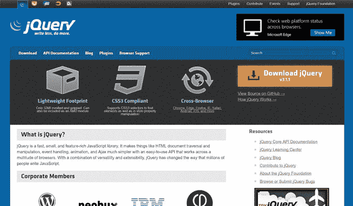T2】](http://jquery.com/)

### plesk.com

Plesk 是一款工具，旨在构建、保护和运行云中的网站和应用程序。

[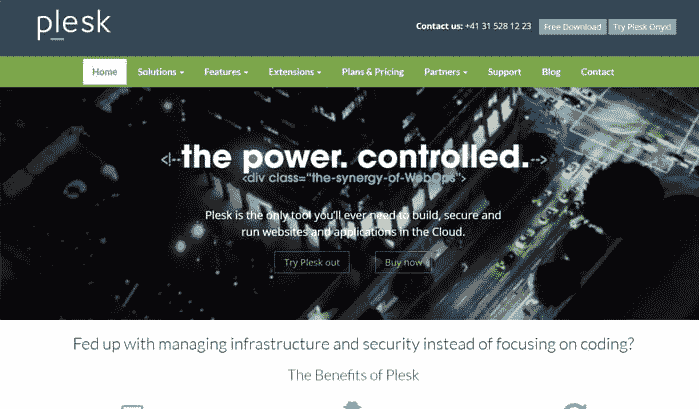T2】](https://www.plesk.com/)

### 美国国家档案馆-[nationalarchives.gov.uk](http://www.nationalarchives.gov.uk/)

国家档案馆是英国政府的官方档案馆。他们的主要职责是保存政府记录，并制定信息管理和再利用的标准。

[T2】](http://www.nationalarchives.gov.uk/)

### qualtrics.com

Qualtrics Insight 平台使复杂的研究变得简单，并使用户能够在一个地方捕捉客户市场和员工的见解。

[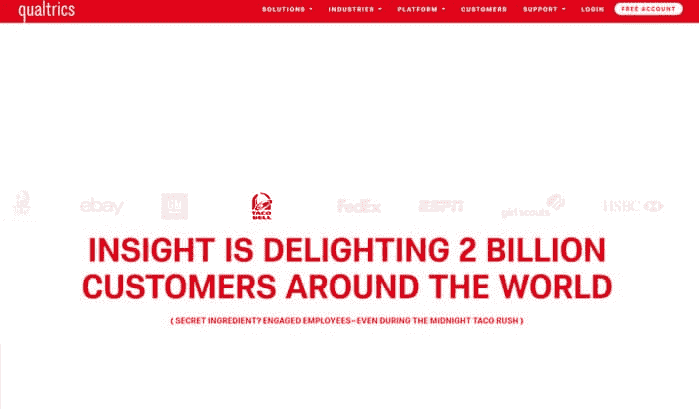T2】](https://www.qualtrics.com/)

### dyn.com

Dyn 是一家基于云的互联网性能管理公司，帮助企业使用一流的任播 DNS 网络来监控、控制和优化在线基础设施。

[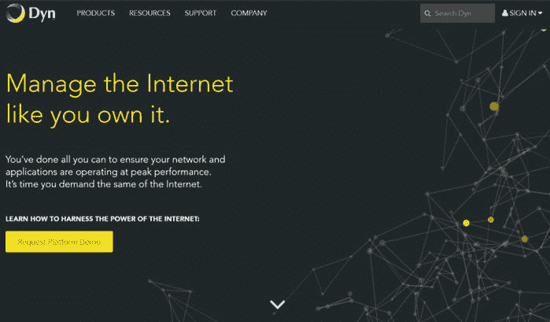T2】](http://dyn.com/)

### quantcast.com

Quantcast Corporation 是一家数字营销公司，提供免费的受众人口统计测量，并提供实时广告。

[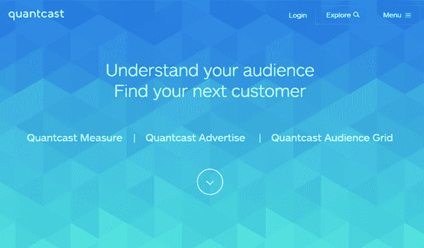T2】](https://www.quantcast.com/)

### NGINX-[nginx.com](https://www.nginx.com/)

NGINX 是一个免费、开源、高性能的 HTTP 服务器和反向代理服务器 T2。它们加速了内容和应用程序的交付，提高了安全性，促进了 web 上最繁忙的网站的可用性和可伸缩性。[金斯塔的所有顾客都使用 NGINX](https://kinsta.com/knowledgebase/what-is-nginx/) ，所以我们是他们的忠实粉丝！

[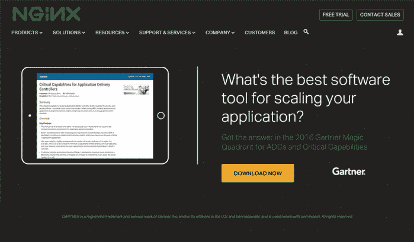T2】](https://www.nginx.com/)

### tucows-[tucows.com](http://www.tucows.com/)

Tucows 为全球成千上万的商业伙伴和数百万的最终用户提供互联网服务。大多数人可能是通过他们的域名注册合作伙伴认识他们的。

[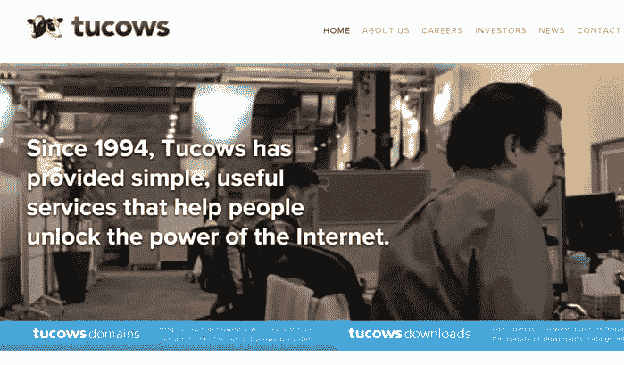T2】](http://www.tucows.com/)

### 索尼音乐-[sonymusic.com](https://www.sonymusic.com/)

索尼音乐娱乐公司是一家全球唱片公司，目前的名单包括一大批当地艺术家和国际巨星。该公司拥有一个庞大的目录，其中包括一些历史上最重要的唱片。

[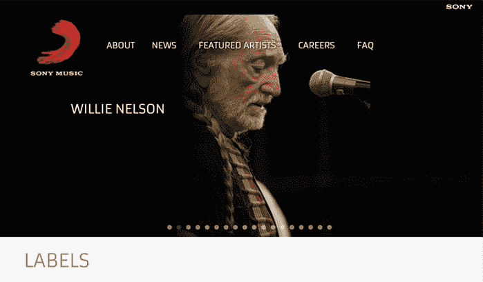T2】](https://www.sonymusic.com/)

### 纽约时报-[nytco.com](https://www.nytco.com/)

《纽约时报》是一份总部设在纽约市的美国报纸，拥有全球影响力和读者群。他们使用 WordPress 来加强他们的公司网站。

[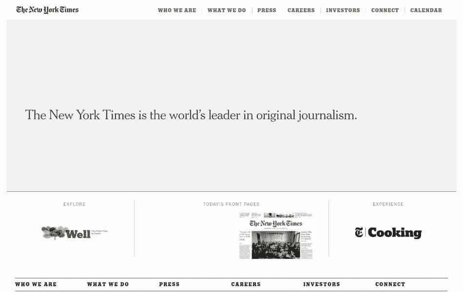](https://www.nytco.com/)

The New York Times

### 雷诺集团-[group.renault.com](https://group.renault.com/)

雷诺集团是一家法国跨国汽车制造商，目前生产一系列轿车和货车。

[T2】](https://group.renault.com)

### MaxCDN-[maxcdn.com](https://www.maxcdn.com/)

MaxCDN 是一个全球内容交付网络，致力于让您的网站和应用程序运行更快，即时清除和供应内容，并获得实时分析。

[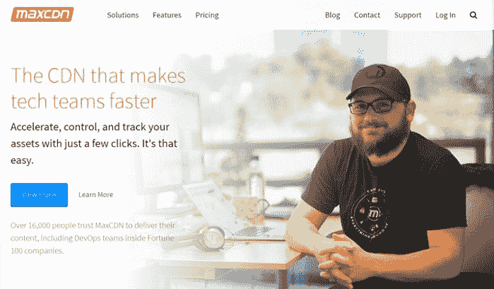T2】](https://www.maxcdn.com/)

### 论坛媒体-[tribunemedia.com](http://www.tribunemedia.com/)

论坛媒体拥有超过 42 个由优质新闻、娱乐和体育节目驱动的多元化电视和数字资产组合。

[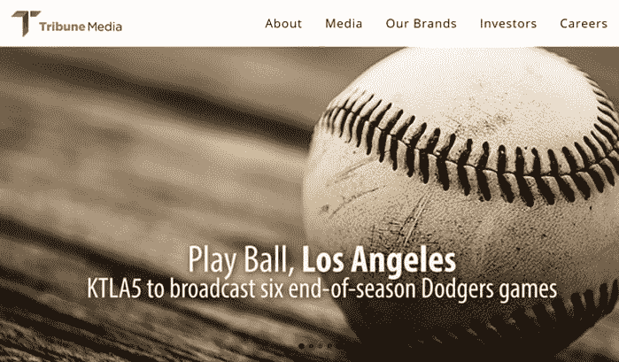T2】](http://www.tribunemedia.com/)

### thewaltdisneycompany.com 的华特·迪士尼公司

华特·迪士尼公司的使命是成为世界领先的娱乐和信息生产商和提供商之一。

[T2】](https://thewaltdisneycompany.com/)

### mindtouch.com

MindTouch 将用户手册转变为数字体验。这是一种新的软件类别，可以使网络流量翻倍，增加客户参与度。

[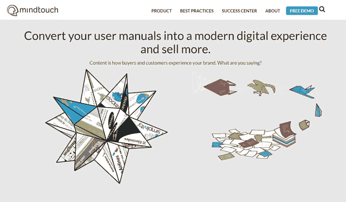T2】](https://mindtouch.com/)

### Company.com—[company.com](http://www.company.com/)

Company.com 是值得信赖的企业质量运营资源提供商，帮助您启动、运行和发展业务。他们在 Inc. Magazine 的 2016 Inc. 5000 榜单上排名第五，是美国发展最快的公司之一。

[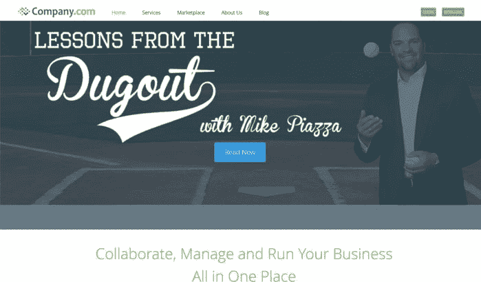T2】](http://www.company.com/)

### site minder-[siteminder.com](http://www.siteminder.com)

SiteMinder 帮助您提高酒店盈利能力和预订量。他们帮助您吸引、接触和转化更多的客人，从而扩大您的全球影响力，降低收购成本，增加利润。

[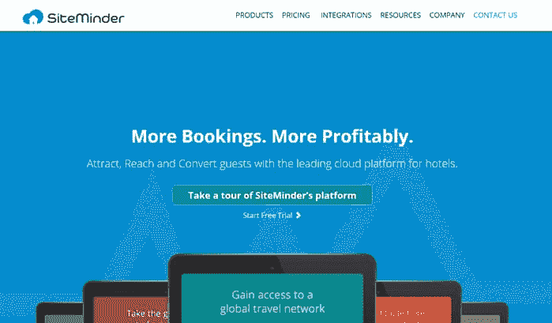T2】](http://www.siteminder.com/)

### 马林软件公司—[marinsoftware.com](http://www.marinsoftware.com/)

Marin Software 为全球广告商和代理商提供领先的付费搜索管理平台。

[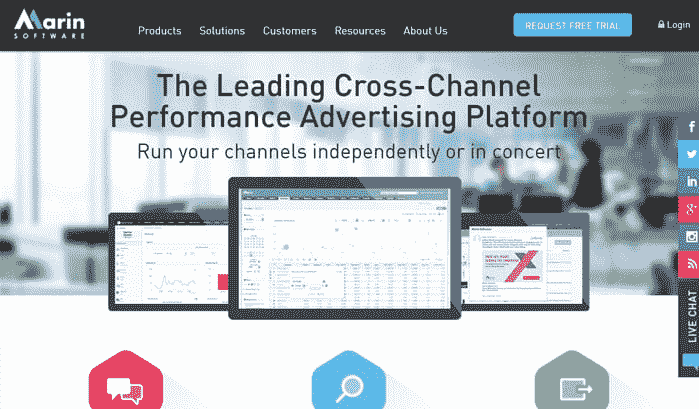T2】](http://www.marinsoftware.com/)

### 威望迪-[vivendi.com](http://www.vivendi.com/en/)

Vivendi SA 是一家法国跨国大众传媒公司，总部位于法国巴黎。

[T2】](http://www.vivendi.com/en/)

### boingo-[boingo.com](http://www.boingo.com/)

Boingo 使您可以在全球超过 100 万个热点地区的任何设备上轻松访问 Wi-Fi，包括机场、酒店、咖啡馆、体育场等。

### adepresso–

AdEspresso 是管理和优化脸书广告的最简单的在线工具之一。他们的重点是减少您的支出，同时增加转化率和参与度。

[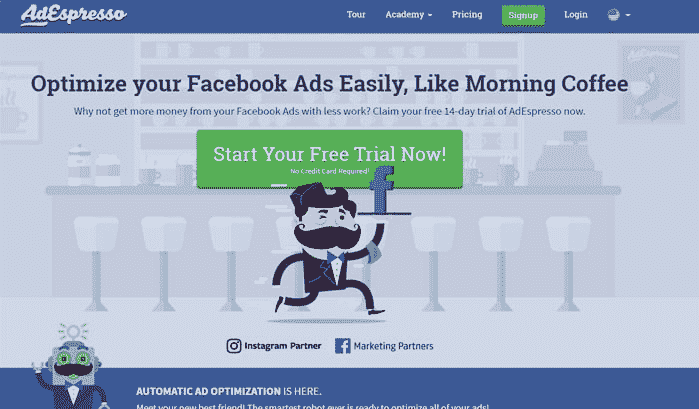T2】](https://adespresso.com/)

### 丰田-[toyota.com.br](http://www.toyota.com.br/)

丰田是世界上最大的汽车制造商之一。他们的巴西分部使用 WordPress 来支持他们的网站。

[T2】](http://www.toyota.com.br/)

### loggly-“t0”loggly . com“t1”

Loggly 是一个非常受欢迎的云日志管理服务，提供应用程序智能。

[T2】](https://www.loggly.com/)

### 世界狼獾-[wolverineworldwide.com](http://www.wolverineworldwide.com/)

Wolverine Worldwide 成立的初衷就是为优秀的人创造优秀的产品，他们的足迹遍布全球约 200 个国家和地区。

[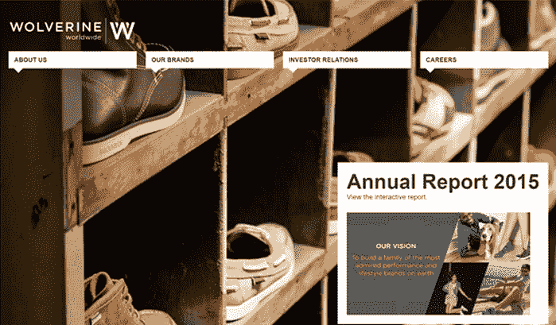T2】](http://www.wolverineworldwide.com/)

### 火花柱-[sparkpost.com](https://www.sparkpost.com/)

SparkPost 为应用程序和网站提供电子邮件发送服务。计划范围从每月 10 万封免费电子邮件到高容量企业服务。

[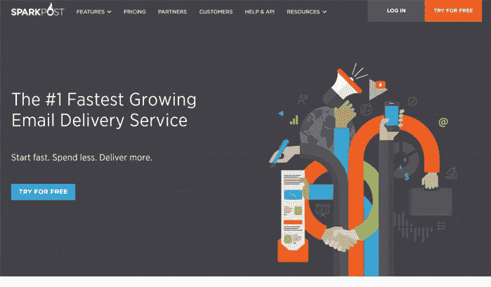T2】](https://www.sparkpost.com/)

### folio vision-[foliovision.com](https://foliovision.com/)

Folivision 为 WordPress 创建了大量不同的插件。他们的任务是建立世界上最强大和最容易使用的视频插件。

[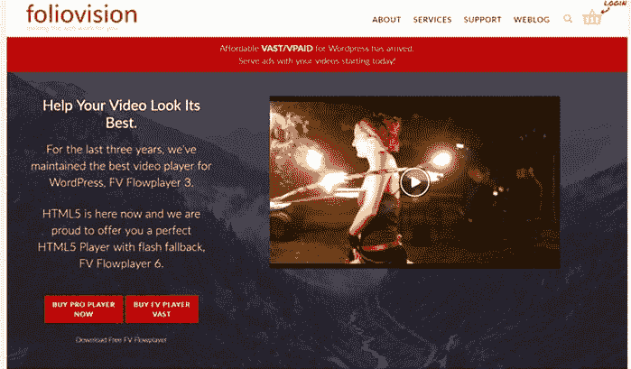T2】](https://foliovision.com/)

### ExpressJet-[expressjet.com](http://www.expressjet.com/)

ExpressJet 是一家领先的地区性航空公司，拥有 8，000 多名航空专业人员，每天有 1，600 多个美国鹰航空公司、达美航空公司和联合快递公司的航班。

### MOD Pizza-[modpizza.com](https://modpizza.com/)

自 2008 年以来，以超快的速度供应个体工匠风格的披萨和沙拉。任何配料，同样的价格。

[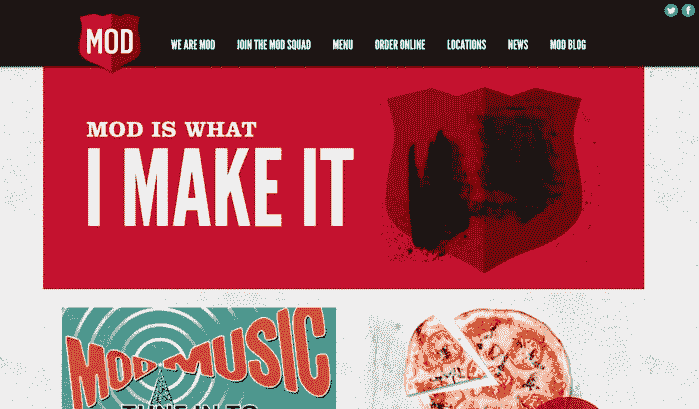T2】](https://modpizza.com/)

### 瑞典官方网站-[Sweden . se](https://sweden.se/)

关于瑞典事实的官方来源。它由政府资助，背后有四个组织:瑞典研究所、瑞典商业协会、瑞典旅游局和瑞典政府部门，包括外交部、文化部和企业、能源和通信部。

The Official Site of Sweden

## 新闻杂志 WordPress 网站

如果没有每日新闻，我们会怎样？下面是一些大型杂志和新闻网站每天使用 WordPress 接触数百万读者的例子。对于像这样的大型网站，Kinsta 的 [Redis](https://kinsta.com/help/redis-cache/) 和 [Elasticsearch](https://kinsta.com/blog/wordpress-search/) 插件非常方便。

### 连线-[wired.com](https://www.wired.com)

Wired.com 提供了当前和未来技术趋势的深度报道，以及它们如何塑造商业，娱乐，通信，科学，政治和文化。

[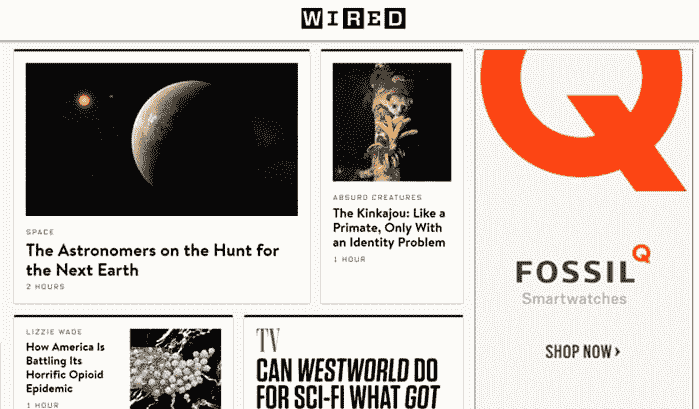T2】](https://www.wired.com)

### TechCrunch—[techcrunch.com](https://techcrunch.com/)

TechCrunch 是一家领先的科技媒体，致力于痴迷地描述初创公司，评论新的互联网产品，并发布科技新闻。

[T2】](https://techcrunch.com/)

### 财富-[fortune.com](http://fortune.com/)

《财富》是一份由时代公司出版和拥有的跨国商业杂志。该网站在提供对商业人士至关重要的新闻和分析方面有着悠久的历史。

[T2】](http://fortune.com/)

### 《纽约客》——[newyorker.com](http://www.newyorker.com/)

纽约提供关于每日新闻、文化报道、播客、视频和卡通的报道。

[T2】](http://www.newyorker.com/)

### 哈佛公报-[news.harvard.edu/gazette/](https://news.harvard.edu/gazette/)

来自哈佛大学的官方新闻，涵盖教学、学习和研究方面的创新。

Harvard Gazette

### 品种—[variety.com](http://variety.com/)

综艺提供娱乐新闻，电影评论，奖项，电影节，票房，以及关于娱乐行业会议的信息。

[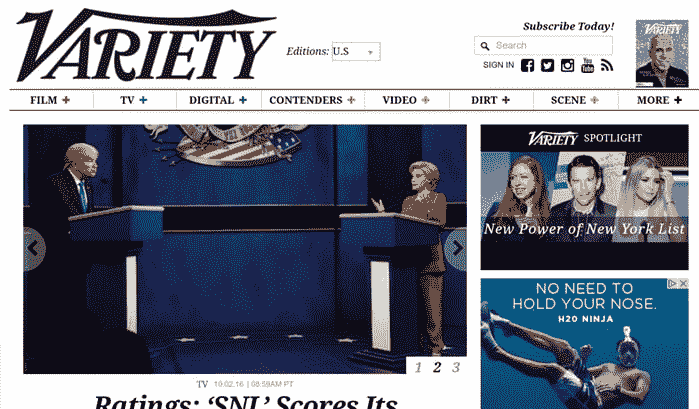T2】](http://variety.com/)

### 太阳——[thesun.co.uk](https://www.thesun.co.uk/)

《太阳》杂志是一个非常受欢迎的新闻、体育、娱乐和名人信息的地方。

[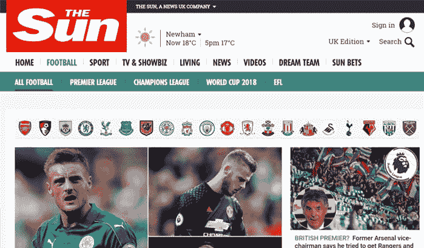T2】](https://www.thesun.co.uk/)

### 芝加哥太阳时报-[suntimes.com](http://chicago.suntimes.com/)

芝加哥太阳时报提供关于芝加哥的新闻，体育信息，政治和娱乐。

[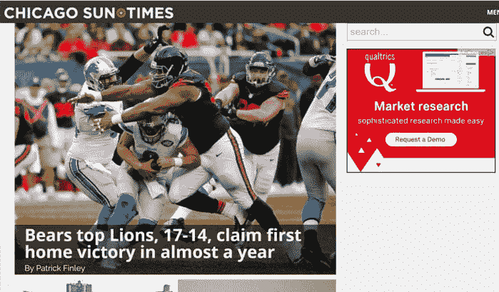T2】](http://chicago.suntimes.com/)

### 下一张网——[thenextweb.com](http://thenextweb.com/)

The Next Web 是世界上最大的在线出版物之一，提供有关互联网技术、商业和文化的最新新闻的国际视角。

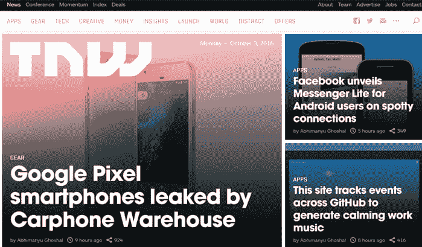

### 时尚-[vogue.com](http://www.vogue.com)

Vogue 提供最新的时尚新闻、美容报道、名人风格、时装周更新、文化评论和视频。

[T2】](http://www.vogue.com)

### 石英—[qz.com](http://qz.com)

对于热衷于变革的商界人士来说，Quartz 是新全球经济的指南。它们涵盖各种主题，包括商业、经济、市场、金融、技术、科学、设计和时尚。

[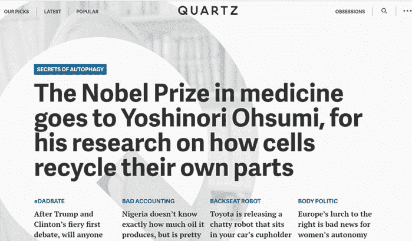T2】](http://qz.com)

### Boing Boing-[boingboing.net](http://boingboing.net/)

Boing Boing 在 2000 年成为一个早期的博客，并演变成今天的样子:一个链接博客、原创专题文章、播客、原创视频和来自网络的精选的折衷组合，在这里他们与志同道合的快乐变种人分享和发现挑衅性的发现。

[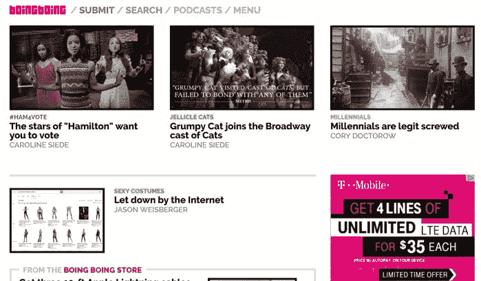T2】](http://boingboing.net/)

### canada.com

Canada.com 是所有关于分享加拿大的伟大，可分享的故事。

[T2】](http://o.canada.com/)

### 9 到 5 分钟–[9to5mac.com](https://9to5mac.com/)

9To5Mac 提供苹果产品、应用和谣言的新闻和评论。他们为 iPhone、iPad 和所有的苹果产品提供突破性的报道。

[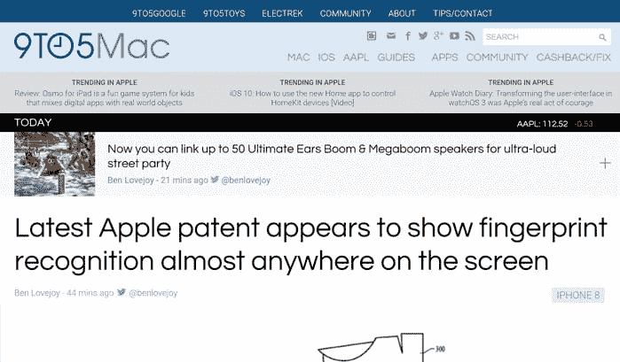T2】](https://9to5mac.com/)

### 时代公司–[timeinc.com](http://www.timeinc.com/)

时代公司是世界上最大的品牌媒体公司之一，每月通过多个平台接触超过 1.2 亿人。

[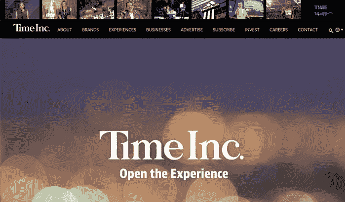T2】](http://www.timeinc.com/)

### value walk-[valuewalk.com](http://www.valuewalk.com/)

ValueWalk 新闻网站负责发布全球商业、价值投资、政治、技术和科学新闻。

[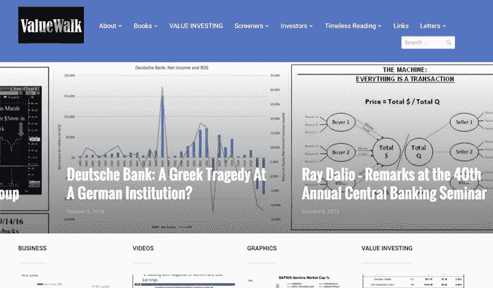T2】](http://www.valuewalk.com/)

### 快克杂志-[crackmagazine.net](http://crackmagazine.net/)

快克杂志是一个独立的当代文化平台。

T4】

## 教育 WordPress 网站

教育是可持续经济增长最重要的基本方面之一。它提高了人们的生产力，他们更有效地倾听和思考的能力，以及更有创造性地想象事物的能力。人力资本投资对于发展一个国家的经济福祉至关重要，因此优质教育必不可少。所有花在教育上的钱，将来都会有很多倍的回报。请务必阅读我们在 [WordPress 教育服务](https://kinsta.com/learn/wordpress-education/)和 [WordPress 教育托管](https://kinsta.com/wordpress-hosting-for-education/)解决方案上的深度文章。

下面是一些用于高等教育和学习的顶级 WordPress 网站的例子。

### 史密森尼国家非洲艺术博物馆—[africa.si.edu](https://africa.si.edu/)

国家非洲艺术博物馆(NMAfA)成立于 1964 年，是一所私立教育机构，旨在促进社会科学和艺术领域的跨文化理解。

[T2】](https://africa.si.edu/)

### washington.edu 大学

华盛顿大学是一所非常受人尊敬的研究型大学，位于美国华盛顿州西雅图市。

[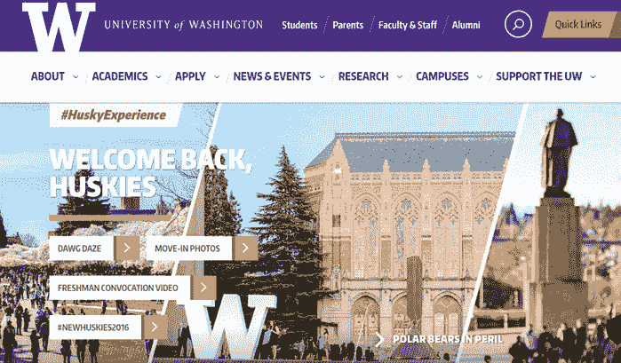T2】](http://www.washington.edu/)

### 佐治亚州立大学—[gsu.edu](http://www.gsu.edu/)

佐治亚州的学院和学校是创新和发现的中心，对亚特兰大、全国乃至全世界都有重大影响。

[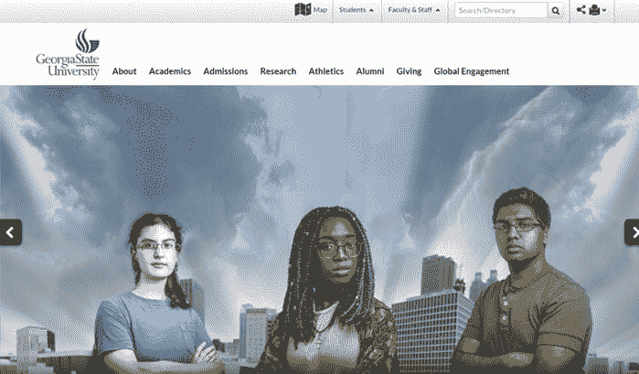T2】](http://www.gsu.edu/)

### 斯普洛特商学院-[sprott . carleton . ca](http://sprott.carleton.ca)

Sprott 是位于加拿大首都安大略省渥太华的一所提供全方位服务的商学院。

### 库珀·休伊特-[cooperhewitt.org](http://www.cooperhewitt.org/)

库珀休伊特，史密森尼设计博物馆是一个设计博物馆位于纽约市曼哈顿。

[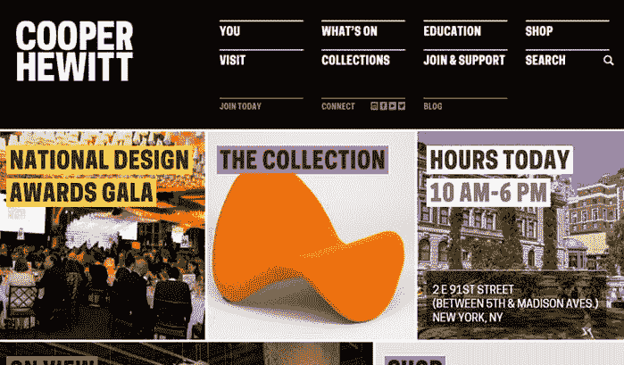T2】](http://www.cooperhewitt.org/)

### 伦韦博-[renweb.com](http://www.renweb.com/)

RenWeb 已经创建了一个无与伦比的学校信息管理系统，其中的每个集成部分共同工作，创造无缝体验。

[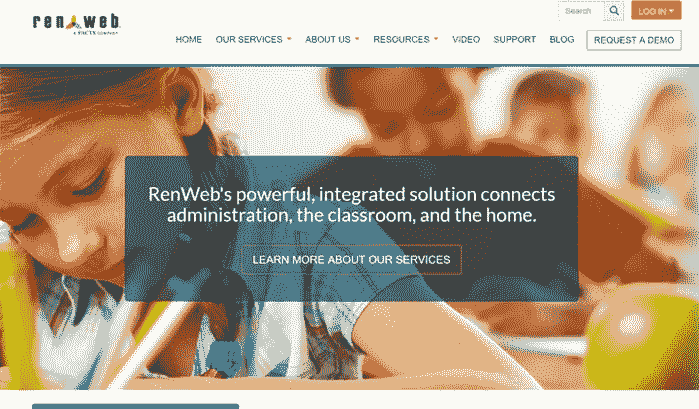T2】](http://www.renweb.com/)

### 拉斐特学院—[lafayette.edu](https://www.lafayette.edu)

拉斐特学院是一所私立文理学院，位于美国宾夕法尼亚州伊斯顿。

[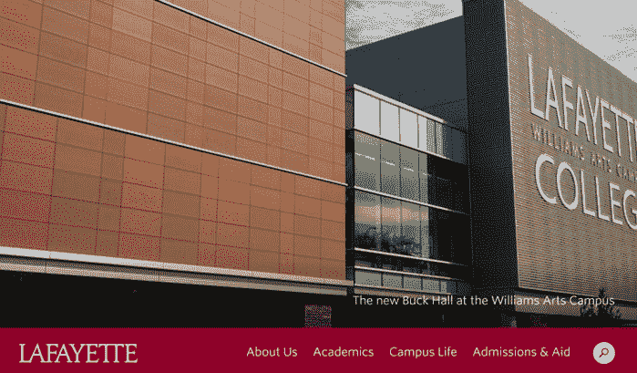T2】](https://www.lafayette.edu)

### 惠顿学院—[wheatoncollege.edu](http://wheatoncollege.edu/)

惠顿学院是一所拥有 1600 名学生的文理学院，改变世界的想法在这里蓬勃发展。他们位于马萨诸塞州的诺顿。位于波士顿和罗德岛普罗维登斯之间。

[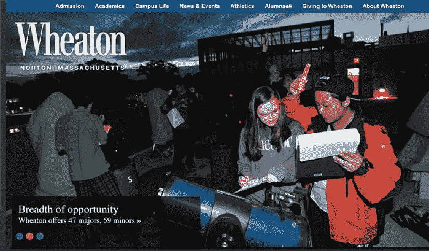T2】](http://wheatoncollege.edu/)

### 尼科尔斯州立大学—[nicholls.edu](https://www.nicholls.edu/)

尼科尔斯州立大学位于路易斯安那州的蒂博多，是一所综合性的区域性大学，服务于路易斯安那州中南部及周边地区。

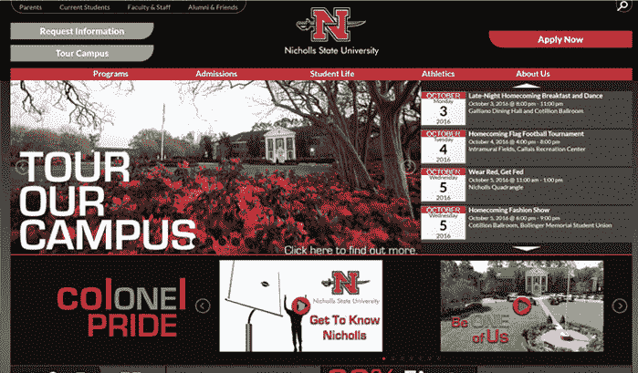

### skillcrush.com

Skillcrush 提供网页设计、编码和其他超级抢手的数字技能的在线课程。学习那些能让你得到工作和保障的技能。

[T2】](https://skillcrush.com/)

### 得梅因大学—[dmu.edu](https://www.dmu.edu/)

得梅因大学提供九个研究生学位，包括全国第二古老的骨科课程。

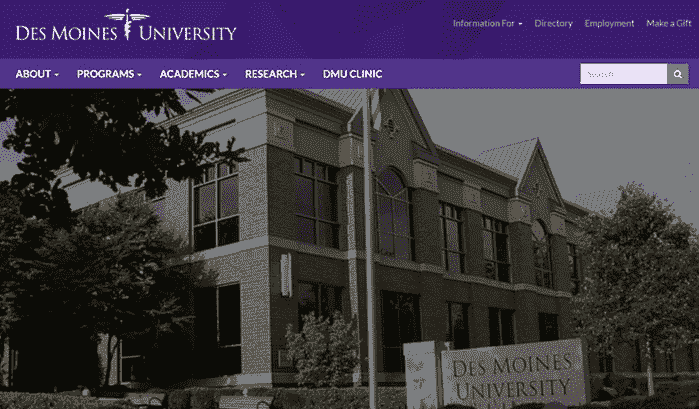

### 国际宝石协会-[gemsociety.org](https://www.gemsociety.org/)

国际宝石协会为所有对宝石感兴趣的人提供信息和教育服务。对于宝石学家，爱好者，珠宝商，宝石和任何人之间。

[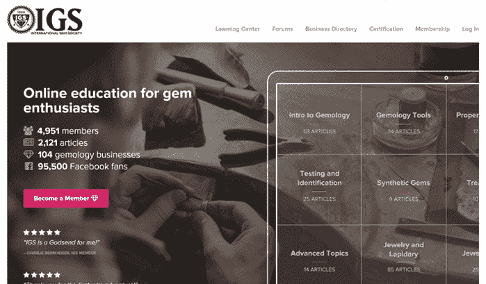T2】](https://www.gemsociety.org/)

### 波尔克州立学院-[polk.edu](https://www.polk.edu/)

波尔克州立学院是佛罗里达学院系统的成员，该系统是一所公立州立学院，位于美国佛罗里达州温特黑文。

[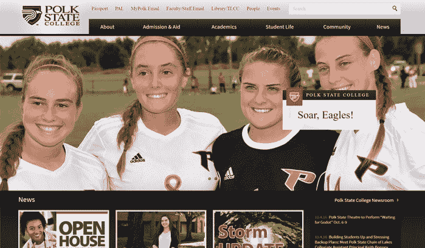T2】](https://www.polk.edu/)

### 大学选择-[collegechoice.net](http://www.collegechoice.net/)

选择一所大学是你一生中重大的决定之一，它将从多方面决定你的未来。大学选择提供了许多。

[T2】](http://www.collegechoice.net/)

## 电子商务 WordPress 网站

谈到 WordPress 网站，有许多不同的解决方案来经营一个电子商务商店。一些最受欢迎的集成有 [WooCommerce](https://woocommerce.com/) 和[轻松数字下载](https://easydigitaldownloads.com/)。下面是一些由 WordPress 支持的顶级电子商务网站的例子。

### athemes.com

aThemes 创建了令人敬畏的 WordPress 主题，既有免费的也有付费的。他们的主题集中在简单性上(没有膨胀！)，易于使用，设计简洁。他们使用简单的数字下载。

[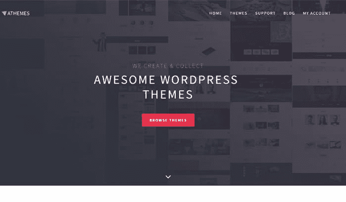T2】](http://athemes.com/)

### generate press-[generatepress.com](https://generatepress.com/)

GeneratePress 是一个响应迅速、易于使用的免费 WordPress 主题。这是 WordPress.org 收视率最高的主题之一。他们使用简单的数字下载来获得他们的高级插件。

[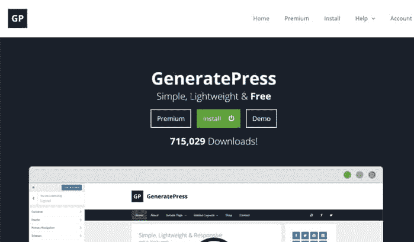T2】](https://generatepress.com/)

### WP explorer-[wpexplorer.com](http://www.wpexplorer.com)

WPExplorer 展示了一些可用的[最佳 WordPress 主题](https://kinsta.com/best-wordpress-themes/) & [WordPress 插件](https://kinsta.com/best-wordpress-plugins/)，并制作高质量的 100% GPL 专业版和博客免费 WP 模板。

## 注册订阅时事通讯

### 想知道我们是怎么让流量增长超过 1000%的吗？

加入 20，000 多名获得我们每周时事通讯和内部消息的人的行列吧！

[Subscribe Now](#newsletter)

[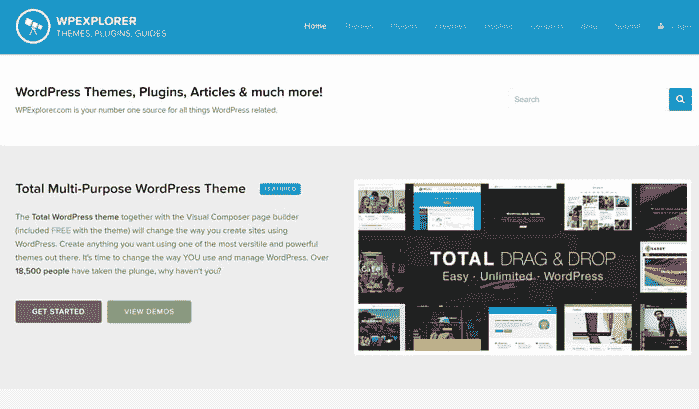T2】](http://www.wpexplorer.com)

### 信不信由你。–[ripleys.com](http://www.ripleys.com/)

信不信由你。是一个奇异新闻、故事、视频、照片、展览等的在线中心。他们用 WordPress 来驱动他们的网站，用 WooCommerce 来驱动商店部分。

[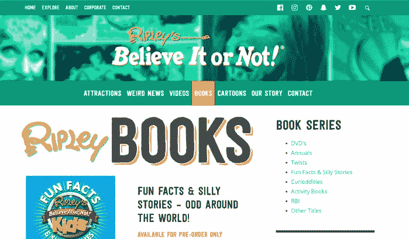T2】](http://www.ripleys.com/)

### swellbottle.com

制作精美的不锈钢水瓶可以让饮料保持 24 小时的低温和 12 小时的高温，同时还给那些需要的人。他们使用 WooCommerce。

[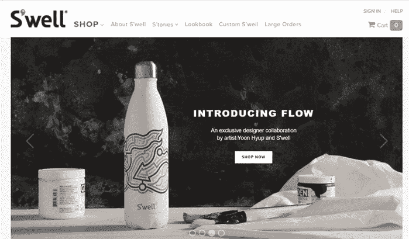T2】](http://www.swellbottle.com/)

### 气流-[airstream.com](https://www.airstream.com/)

气流旅行拖车和旅游教练激发冒险，并帮助人们生活铆接无论他们去哪里。

[T2】](https://www.airstream.com/)

### 巴塔-[bata.com](https://www.bata.com/)

巴塔是一个著名的品牌，专为男士、女士和小孩提供质量上乘、价格合理的服装和休闲鞋。

### 抗议-[抗议.欧盟](https://www.protest.eu/)

抗议是一个设计主导的董事会穿公司从荷兰成立于 1993 年。他们正在使用 WooCommerce。

[T2】](https://www.protest.eu/)

### ETQ 阿姆斯特丹–[etq-Amsterdam . com](https://www.etq-amsterdam.com/)

ETQ Amsterdam 是总部位于阿姆斯特丹的高端鞋类品牌。他们使用 WooCoomerce。

[T2】](https://www.etq-amsterdam.com/)

### izod.com

IZOD 提供现代运动服、高科技高尔夫服和具有干净、年轻美感的表演服。

[T2】](http://izod.com/)

### 我的意思是，我的意思是，我的意思是，我的意思是，我的意思是，我的意思是，我的意思是，我的意思是，我的意思是，我的意思是，我的意思是，我的意思是，我的意思是，我的意思是，我的意思是，我的意思是

范豪森是世界上最畅销的礼服衬衫品牌之一。

[T2】](http://vanheusen.com/)

### fitbark.com

FitBark 监控您的狗的日常活动和睡眠，并将其转化为可操作的行为和医学见解。健身在皮带的两端！他们正在使用 WooCommerce。

[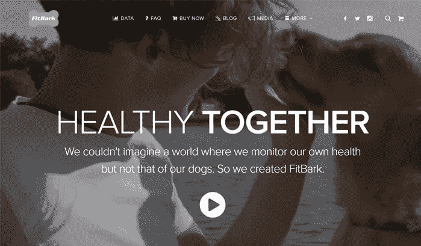T2】](https://www.fitbark.com/)

### 小猴子-[tinkeringmonkey.com](http://www.tinkeringmonkey.com/)

修补猴手工制作的木头和金属标牌经久耐用。从现代到乡村，他们树立了一个你的整个团队都会喜欢的标志。

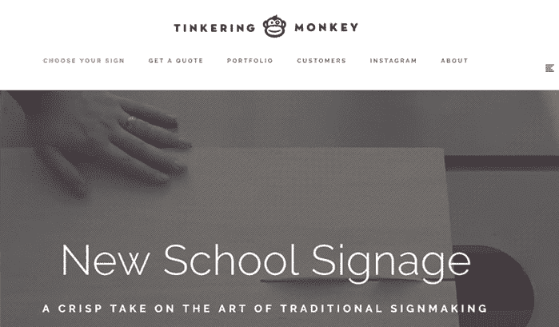

## 娱乐 WordPress 网站

从电视，到视频游戏，再到旅游，WordPress 被用来驱动所有不同类型的激动人心的动态网站！

### AMC-[amc.com](http://www.amc.com/)

AMC 是 AMC 网络公司旗下的美国电视网络。它因《行尸走肉》、《最好叫索尔》、《害怕行尸走肉》、《人类》和《止步不前》等节目而闻名。

[T2】](http://www.amc.com/)

### MP3.com—[mp3.com](http://mp3.com/)

mp3.com 提供免费 MP3 下载。下载歌曲和播放广播；有歌词、新闻、简介、照片、音乐视频和播放列表。

[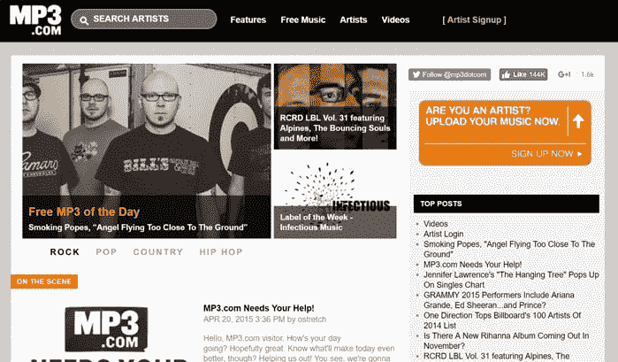T2】](http://mp3.com/)

### 这是芬兰-[Finland . fi](http://finland.fi/)

这就是芬兰，这里汇集了它的人民——令人惊叹的自然、鼓舞人心的艺术和设计、繁忙的商业和奇怪的风俗。

[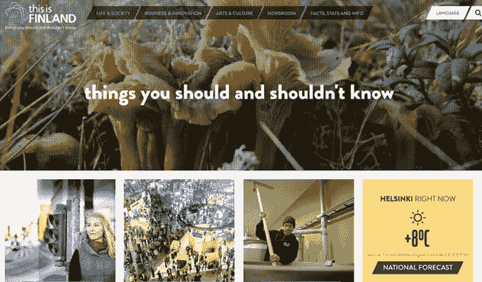T2】](http://finland.fi/)

### BBC 美国—[bbcamerica.com](http://www.bbcamerica.com/)

BBC America 是美国的一个数字有线电视网络，由 BBC Worldwide 和 AMC Networks 共同拥有。它在《Top Gear》、《神秘博士》、《路德》、《最后的王国》和《黑色孤儿》等节目中很受欢迎。

### 激战 2-[guildwars2.com](https://www.guildwars2.com)

激战 2 是一款视频游戏，它定义了在线角色扮演游戏的未来，以动作为导向的战斗，定制的个人故事情节，史诗般的动态事件，世界级的 PvP，没有订阅费！

### [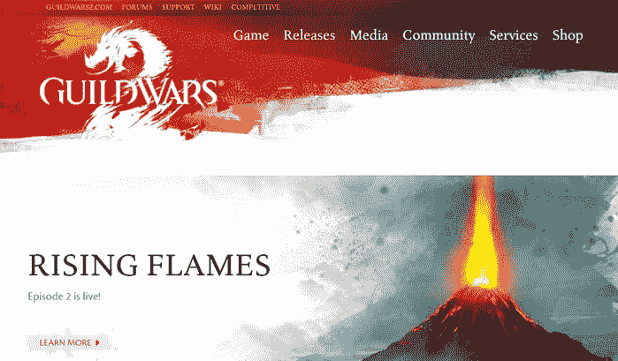](https://www.guildwars2.com) 
旅兰——【travelportland.com】

旅行波特兰是你规划假期和俄勒冈州波特兰会议的资源。发现波特兰活动、餐厅、酒店优惠等。

### [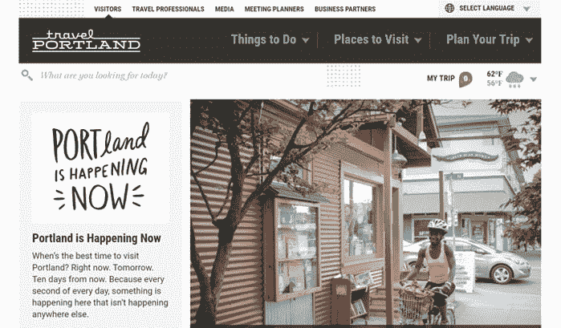](https://www.travelportland.com) 
达拉斯小牛队官网——【mavs.com】T4

Mavs.com 是 2011 年 NBA 冠军达拉斯小牛队的官方网站。

### 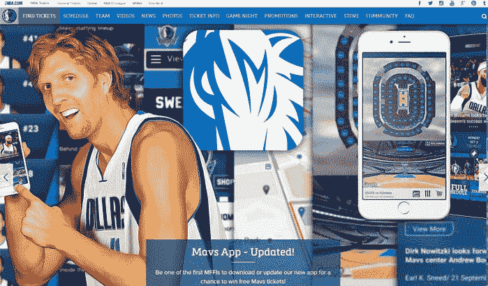
无人区——【no-mans-sky.com T2】

由 Hello Games 开发的《无人天空》是一款没有限制的科幻游戏。如果你看到一座山，你可以徒步去那里。如果你看到一颗行星挂在地平线上，那是一个真实的地方，有自己丰富的生态。
[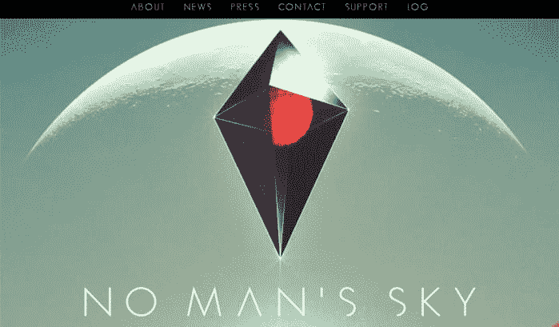T3】](http://www.no-mans-sky.com/)

### 便士囤积者—[thepennyhoarder.com](http://www.thepennyhoarder.com/)

每天都有数以百万计的读者访问《便士囤积者》,寻找鼓舞人心的金钱故事以及如何赚钱和存钱的实用技巧。

[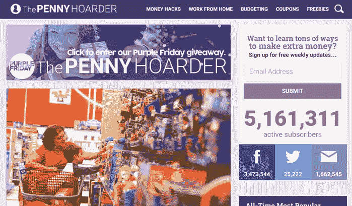T2】](http://www.thepennyhoarder.com/)

### 冥王星-t0 冥王星。电视

Pluto TV 是一个免费的在线电视服务，通过一个拨号就可以播放超过 100 个直播频道，播放你喜欢的电视节目、电影和互联网视频。

###  
大河之舞——【riverdance.com】T4

大河之舞是一种国际爱尔兰舞蹈现象。《大河之舞》在全球 6 大洲 47 个国家的 367 个演出场所，有超过 2500 万人现场观看了 11，000 场演出。

### [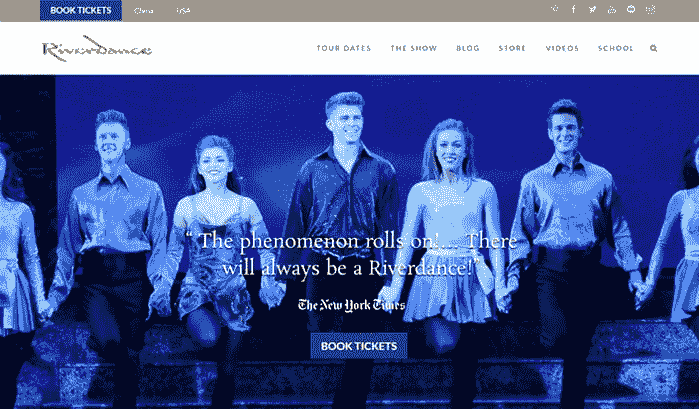](http://riverdance.com/) 
微软工作室-【microsoftstudios.com T4】

微软工作室是微软的视频游戏制作部门，负责为 Xbox 平台、Steam、Windows Store 和 Windows Phone 平台开发和发布游戏。

[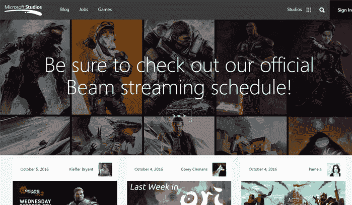T2】](https://www.microsoftstudios.com/)

## 机构 WordPress 网站

这些是代理公司使用 WordPress 为他们的网站提供支持的例子。今天甚至有专门处理 WordPress 客户的机构。

### portent–[portent . com](https://www.portent.com/)

Portent 将从 SEO 到 PPC 再到内容策略的数字学科整合在一起，让它们为建立你的品牌、提高收入和实现你的目标而工作。

[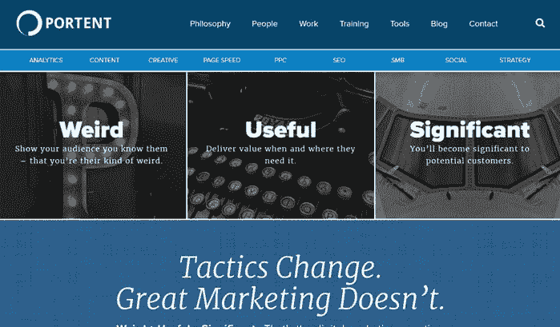T2】](https://www.portent.com/)

### 人造-[hmn . MD](https://hmn.md/)

Human Made 为全球知名客户提供企业级 WordPress 开发和咨询服务。

Struggling with downtime and WordPress problems? Kinsta is the hosting solution designed to save you time! [Check out our features](https://kinsta.com/features/)

[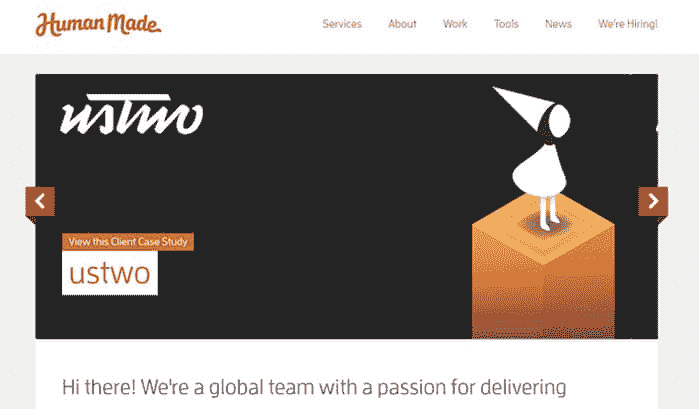T2】](https://hmn.md/)

### 现代部落—[tri . be](http://tri.be/)

Modern Tribe 通过大规模实现(超过 100 万用户)、定制网站和定制解决方案推动了 WordPress 的设计和开发边界。

[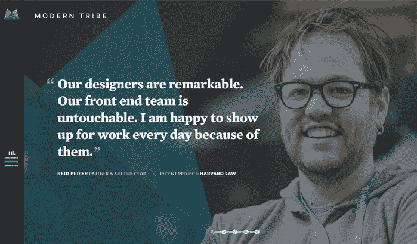T2】](http://tri.be/)

### 10up-[10up.com](https://10up.com)

10up 为内容创作者制作精美的网站和工具，帮助微软、时代、ESPN 和 Adobe 等客户创建更好的网站。

[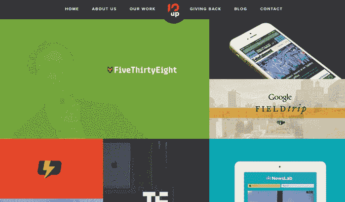T2】](https://10up.com)

### 设计地球-[designtheplanet.com](http://www.designtheplanet.com/)

Design the Planet 是一家提供全方位服务的新奥尔良网站设计和开发、品牌战略和营销公司。

[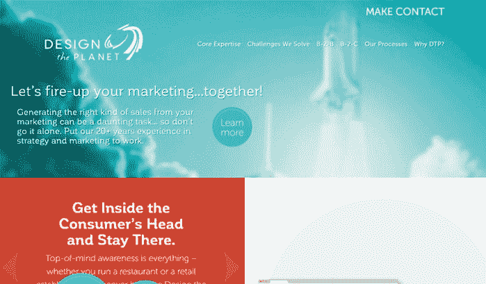T2】](http://www.designtheplanet.com/)

### 出生组-[borngroup.com](http://www.borngroup.com/)

BORN 是一家连接创意、内容和商业的全球数字机构。

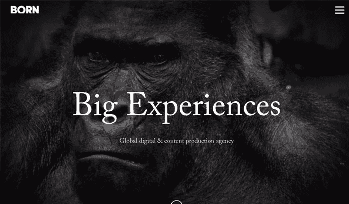

### wrk！wrk！——waaark . com

wrk 是一家法国创意网络工作室，创建优雅实用的定制网站。

[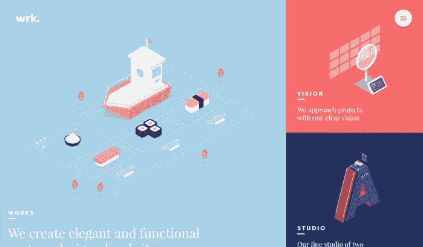T2】](http://waaark.com/)

## 开源&非盈利的 WordPress 网站

金斯塔是开源和非营利 WordPress 网站的忠实粉丝。事实上，对于慈善机构、[非营利组织](https://kinsta.com/web-hosting-for-nonprofits/)和[开源项目](https://kinsta.com/knowledgebase/open-source-web-hosting/)的所有 WordPress 网站托管计划，Kinsta 每月都有 15%的经常性折扣。看看下面一些由 WordPress 支持的顶级非盈利和开源网站。

### 知识共享-[creativecommons.org](https://creativecommons.org/)

Creative Commons 帮助您合法地分享您的知识和创造力，以建立一个更加公平、可访问和创新的世界&释放互联网的全部潜力，推动发展、增长和生产力的新时代。

[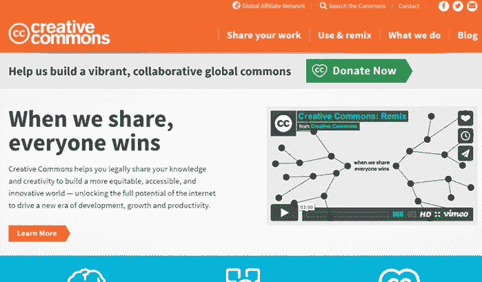T2】](https://creativecommons.org/)

### 搅拌机-[blender.org](https://www.blender.org/)

Blender 是一个跨平台的免费开源 3D 创作套件。

[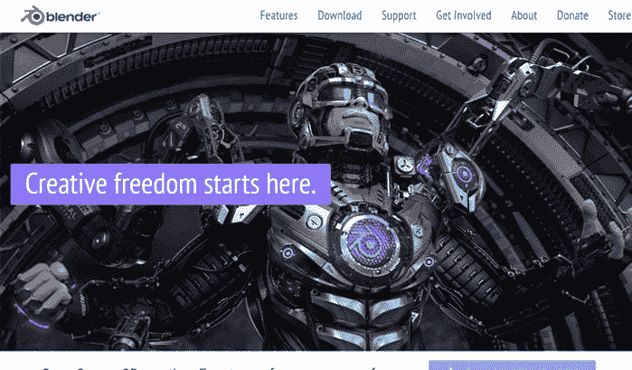T2】](https://www.blender.org/)

### epi.org 经济政策研究所

经济政策研究所是一个位于华盛顿特区的非营利性美国智库，他们分析政策的经济影响。

[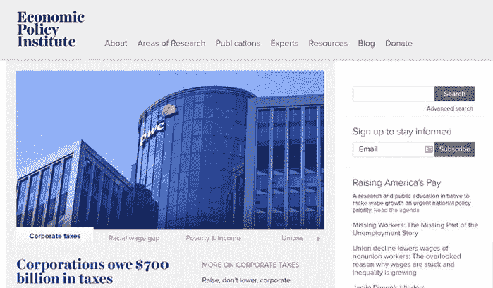T2】](http://www.epi.org/)

### 凯泽家族基金会-[kff.org](http://kff.org/)

凯泽家庭基金会提供关于关键健康政策问题的深入信息，包括医疗补助、医疗保险、医疗改革、全球健康、艾滋病毒/艾滋病、健康保险、无保险者等等。

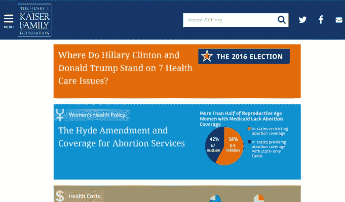

### 看不见的孩子——[invisiblechildren.com](http://invisiblechildren.com/)

圣主抵抗军是一个残暴的绑架士兵的反叛组织。隐形儿童的存在是为了阻止他们&把每个俘虏带回家。

[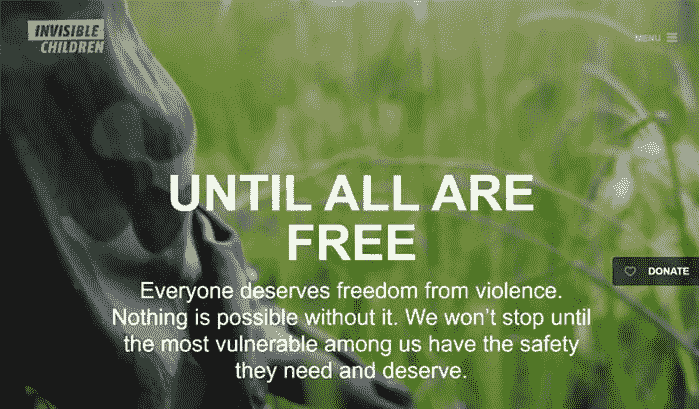T2】](http://invisiblechildren.com/)

### 治愈-[cure.org](https://cure.org/)

国际治愈组织通过外科护理和上帝之爱的改变生活的信息，为世界各地服务不足的国家中患有可治疗疾病的儿童带来治愈。

[T2】](https://cure.org/)

### 国家档案基金会—[archivesfoundation.org](https://www.archivesfoundation.org/)

美国国家档案馆基金会是一个独立的非营利组织，旨在提高公众对国家档案馆的认识，激发对美国国家遗产的更深层次的欣赏，并鼓励公民参与民主。

[T2】](https://www.archivesfoundation.org/)

### 平台—[platformlondon.org](http://platformlondon.org/)

Platform 将艺术、行动主义、教育和研究结合在一起，致力于推动社会和生态公正，尤其关注石油和天然气行业。

[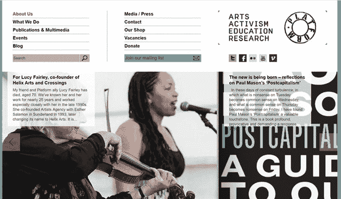T2】](http://platformlondon.org/)

## 博客

成千上万的公司和大品牌也在使用 WordPress 作为他们网站的博客部分；还有成千上万的全职博客写手。下面是一些由 WordPress 支持的顶级博客。

### Slack 博客-[slackhq.com](https://slackhq.com/)

Slack 在 2018 年将他们的博客从 Medium 迁移到 WordPress。阅读关于协作、工作的未来以及 Slack 团队的新内容的故事。

[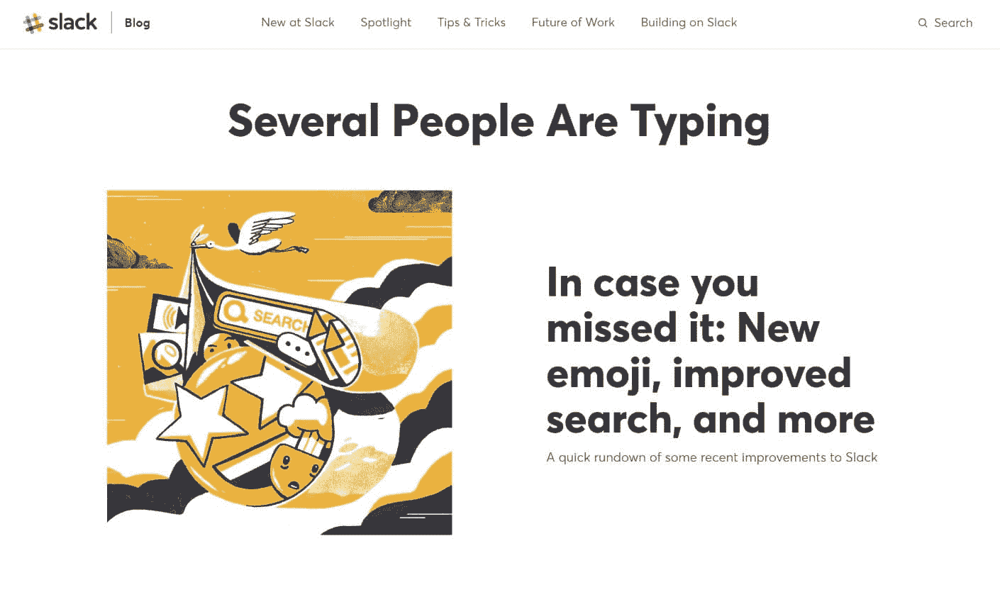](https://slackhq.com/)

Slack blog on WordPress

### 微软新闻-[news.microsoft.com](https://news.microsoft.com/)

来自 Microsoft 的故事和新闻，包括新功能、事件和社区博客。

[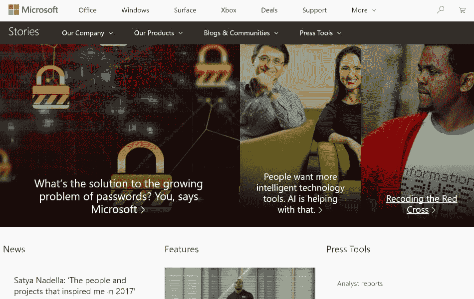](https://news.microsoft.com/)

Microsoft News

### Mozilla 博客-[blog.mozilla.org](https://blog.mozilla.org/)

热门网络浏览器 Firefox 的创造者 Mozilla 项目的新闻、笔记和漫谈。

Mozilla blog

### cPanel 博客-[blog.cpanel.com](https://blog.cpanel.com/)

cPanel 是一个基于 Linux 的在线虚拟主机控制面板，它提供了一个 UI 和自动化工具，旨在简化托管网站的过程。cPanel 博客分享了关于该软件的技巧、教程和新闻。

[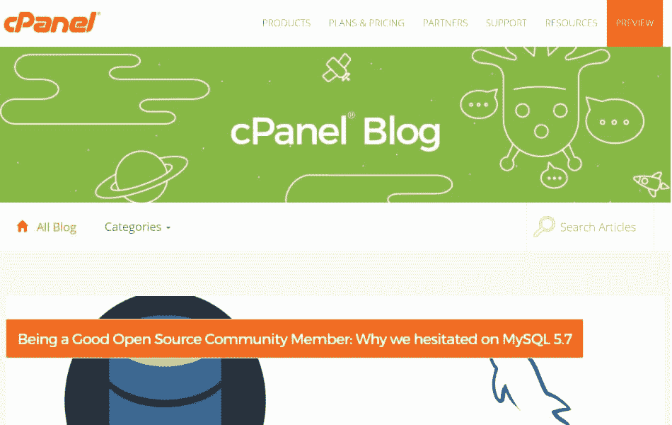](https://blog.cpanel.com/)

cPanel Blog

### blogs.wsj.com/law/华尔街日报法律博客-

《华尔街日报》的法律版块使用 WordPress。《华尔街日报》,介绍商界感兴趣的案例、趋势和人物。

The Wall Street Journal Law Blog

### tripadvisor.com/blog/的猫途鹰博客–

猫途鹰是一个受欢迎的旅游网站，以比较酒店价格而闻名。在他们的博客上，他们分享旅行指南、旅行和目的地灵感、旅行建议提示等等。

TripAdvisor Blog

### 目标脉动博客-[pulse.target.com](https://pulse.target.com/)

Pulse 博客的创建是为了帮助目标候选人先睹为快，了解在目标公司工作的感受。无论你对商店、分销还是总部感兴趣，它们都能帮助你感受目标文化和体验。

[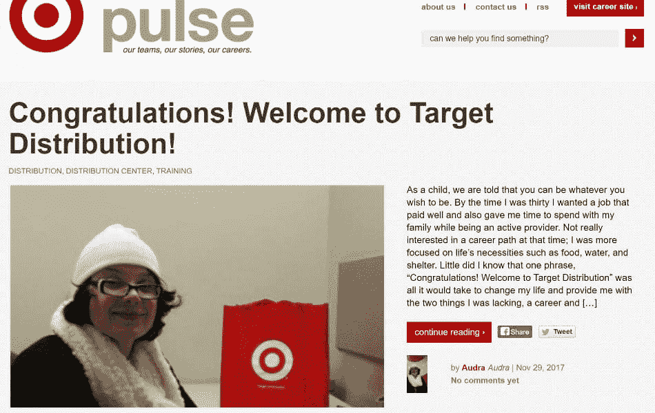](https://pulse.target.com/)

Target Pulse Blog

### 史泰博博客-[Blog . staples . ca](http://blog.staples.ca/)

加拿大的 Staples 博客提供关于新产品、技术、小企业和生活方式的新闻。

Staples Blog

### 黑莓内部-[blogs.blackberry.com](http://blogs.blackberry.com/)

黑莓软件通过 BlackBerry Secure 保护、管理和连接物联网企业。他们的黑莓博客在 WordPress 上运行。

[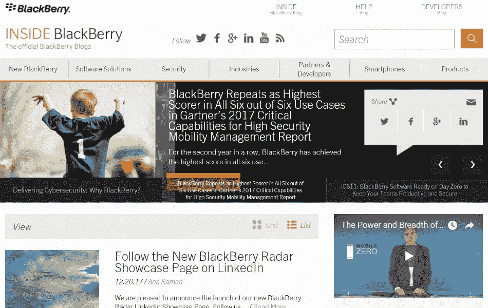](http://blogs.blackberry.com/)

Inside BlackBerry

### Rackspace 博客-[blog.rackspace.com](https://blog.rackspace.com/)

[Rackspace](https://kinsta.com/rackspace-alternative/) 提供产品新闻，包括对 AWS、微软 Azure 和 OpenStack 的支持；云和安全见解、技术深度探讨和新闻发布。

[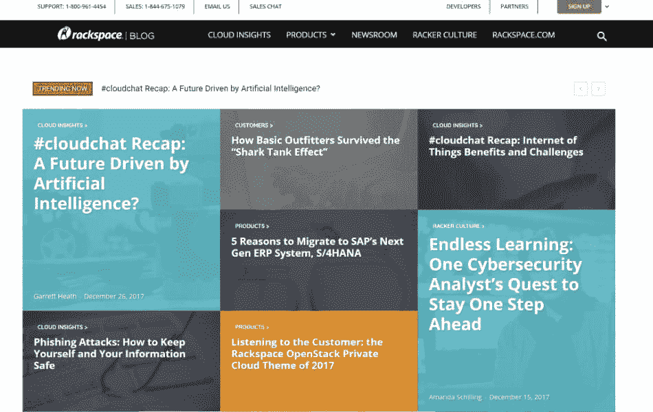](https://blog.rackspace.com/)

Rackspace Blog

### bloomberg.com/professional/blog 彭博职业–

金融服务专业人员依赖最好的数据和分析。通过彭博专业博客，了解更多您可以用来做出明智决策的见解和产品更新。

[T2】](https://www.bloomberg.com/professional/blog/)

### Skype 博客-[blogs.skype.com](https://blogs.skype.com/)

Skype 的产品新闻、客户故事和更新可在 Skype 博客上找到；提供视频聊天和语音通话服务的应用程序。

[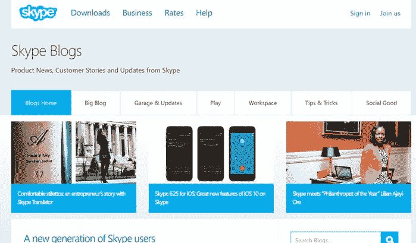T2】](https://blogs.skype.com/)

### 路透社-[blogs.reuters.com](http://blogs.reuters.com/)

路透社为您带来来自世界各地的顶级新闻、照片和视频。

[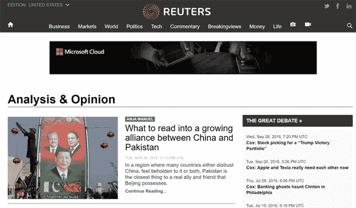T2】](http://blogs.reuters.com/)

### Ted 博客-[blog.ted.com](http://blog.ted.com/)

TED 博客分享关于 TED 的有趣新闻，TED 演讲视频，TED 大奖等等。

[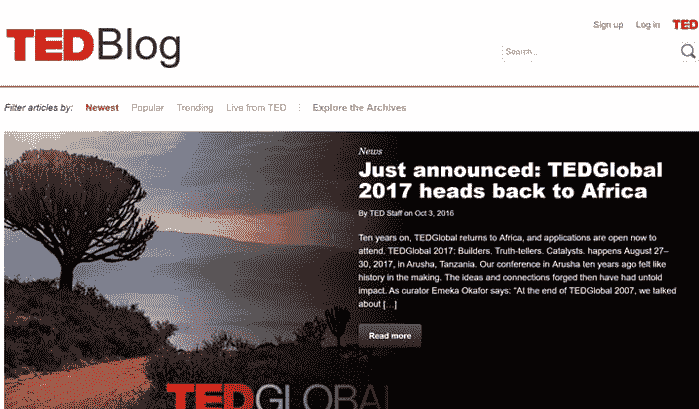T2】](http://blog.ted.com/)

### SAP 新闻中心—[news.sap.com](https://news.sap.com/)

SAP 官方网站，提供来自 SAP 的最新新闻和信息，包括新闻稿和关于业务和技术趋势的深度专题文章。

[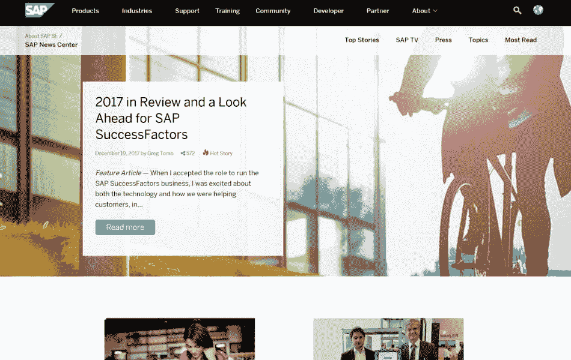](https://news.sap.com/)

SAP News Center

### newsroom.fb.com 脸书新闻编辑室

查看来自脸书的最新新闻、公告和媒体资源；网络上最大的社交网络之一。

[T2】](http://newsroom.fb.com/)

### UPS 博客-[longitudes.ups.com](https://longitudes.ups.com/)

UPS 博客讨论塑造当今和未来全球经济的宏观力量。热门话题包括全球化、贸易、可持续发展、创新、技术、医疗保健和供应链物流。

[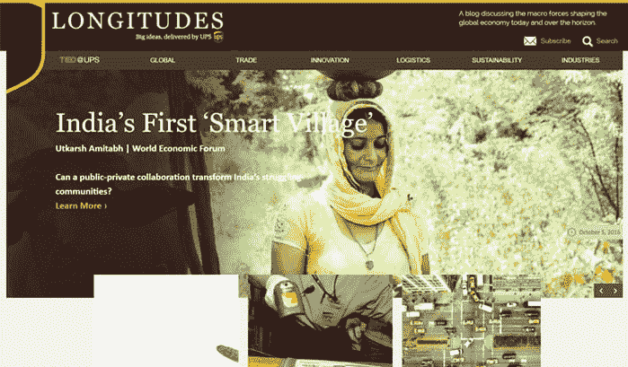T2】](https://longitudes.ups.com/)

### Evernote 博客-[blog.evernote.com](https://blog.evernote.com)

Evernote 是一个流行的工具，用于在桌面和移动平台上收集、培养和分享想法。在他们的博客上查看最新的故事和新闻。

### [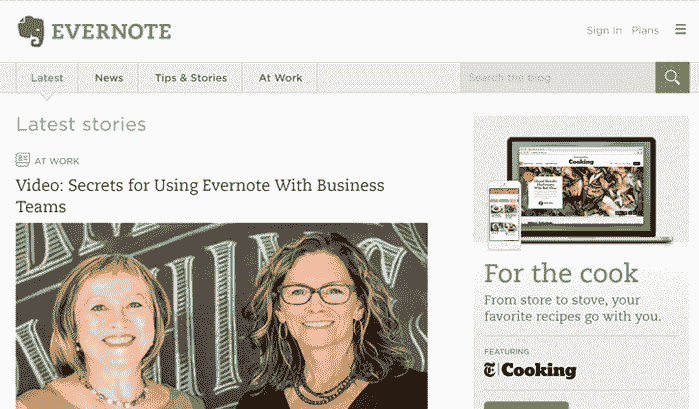](https://blog.evernote.com) 
Playstation 博客-【blog.us.playstation.com T4】

PS4，PS3，PSN，PS Vita，PSP 的新闻和视频更新的官方博客。

[T2】](http://blog.us.playstation.com/)

### Intuit Turbotax 博客-[blog.turbotax.intuit.com](http://blog.turbotax.intuit.com)

TurboTax 是 Intuit Inc .的一部分，Intuit Inc .是为中小型企业提供商业和财务管理解决方案的领先供应商；金融机构，包括银行和信用合作社；消费者和会计专业人士。在他们的博客上查看各种税务提示和金融新闻。

### [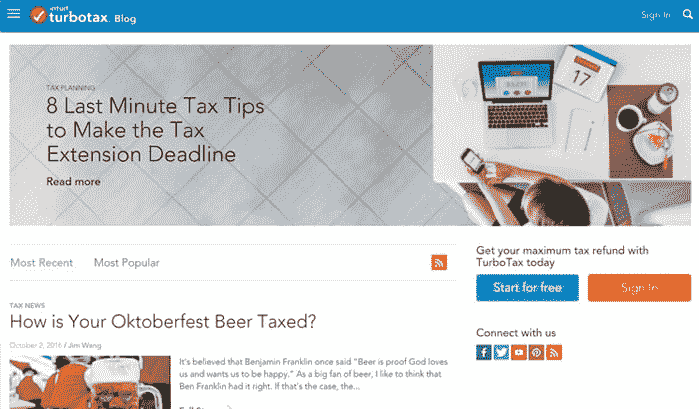](http://blog.turbotax.intuit.com/) 
星球大战新闻-【starwars.com/news】T4

星球大战的官方网站，以星球大战:第七集原力觉醒和星球大战叛军的最新消息为特色，有每日新闻、游戏和视频。

[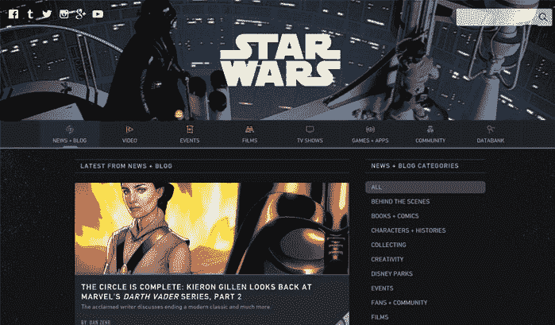T2】](http://www.starwars.com/news)

### 薄荷博客-[blog.mint.com](https://blog.mint.com/)

Mint.com 是一个流行的在线财务规划工具和预算计算器。他们使用 WordPress 来充实他们的博客。从财务管理的基本知识到创造性的节俭生活方式的选择，Mint 的专家们探索了如何节俭地过上充实的生活。

[T2】](https://blog.mint.com/)

### 阿拉斯加航空博客-[blog.alaskaair.com/](https://blog.alaskaair.com/)

阿拉斯加航空公司博客分享关于他们公司和员工的新闻、旅行提示和特写。

[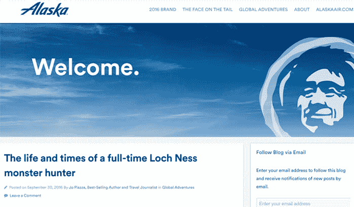T2】](https://blog.alaskaair.com/)

### Flickr 博客-[blog.flickr.net](http://blog.flickr.net)

这是 Flickr 的伙伴博客，Flickr 是组织、分享和存储照片的最佳网站之一。

[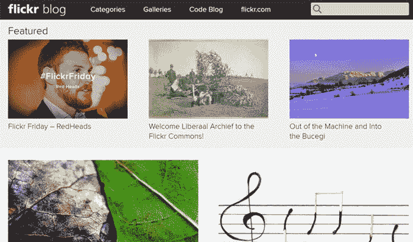T2】](http://blog.flickr.net)

### shoutmeloud.com

ShoutMeLoud 是一个获奖的博客，讲的是通过写博客过老板自由的生活。这是一个由全球 80 多万博客作者组成的社区。

[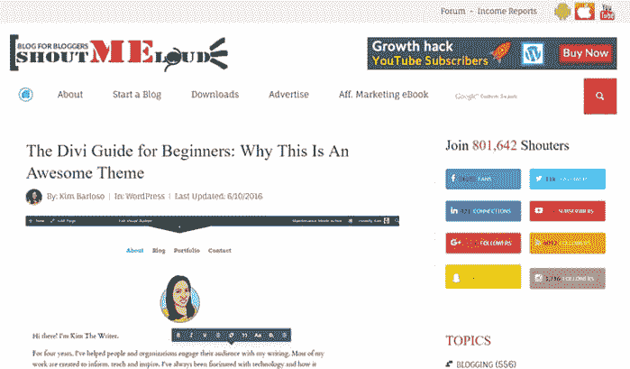T2】](http://www.shoutmeloud.com/)

### Spotify 新闻-[news.spotify.com](https://news.spotify.com)

Spotify 是世界上最大的数字音乐服务之一，让你可以访问数百万首歌曲。他们在博客上分享新闻、事件、内容和采访。

[T2】](https://news.spotify.com/)

## 个人 WordPress 网站

WordPress 也被各种各样的个人使用，从作者到名人、音乐家、奥运选手、电影明星和流行的博客。看看下面一些顶级的个人 WordPress 网站。

### 四小时工作制[fourhourworkweek.com](http://fourhourworkweek.com/)

蒂姆·费里斯因他的《纽约时报》畅销书《每周 4 小时工作制》而闻名；它教你如何摆脱朝九晚五，在任何地方生活，加入新富行列。

### [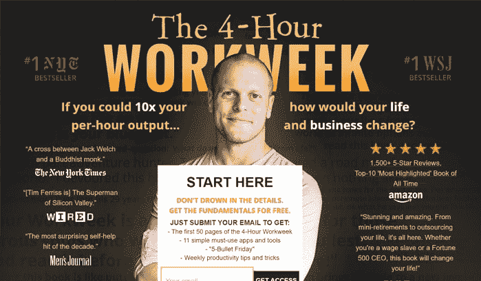](http://fourhourworkweek.com/) 
碧昂斯-【beyonce.com】T4

流行歌手碧昂斯的官方网站提供了传记，热门名单，视频，照片，新闻和事件日历。

[T2】](http://www.beyonce.com/)

### 滚石乐队-[rollingstones.com](http://www.rollingstones.com/#)

滚石乐队的官方网站。包含关于乐队，即将举行的音乐会，电影和销售商品的网上商店的最新消息。

[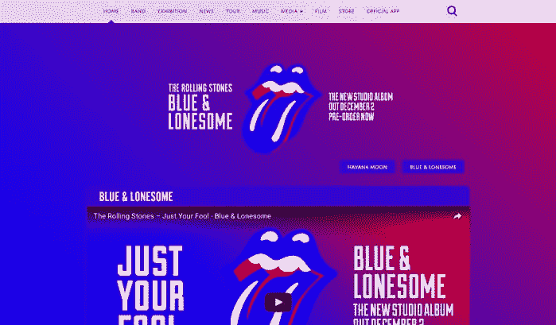T2】](http://www.rollingstones.com/#)

### 凯蒂·佩里-[katyperry.com](http://www.katyperry.com/)

美国歌手和歌曲作者的官方网站。传记，新闻，视频，歌词，铃声，图片和显示日历。

###  
尤塞恩博尔特——【usainbolt.com】T4

世界上跑得最快的人保持着 100 米(9.58 秒)和 200 米(19.19 秒)的记录。

###  
史努比狗狗——【snoopdogg.com】T4

史努比狗狗的官方网站。包括一个 Snoop Dogg 流音频和视频的集合，和一个论坛。

### [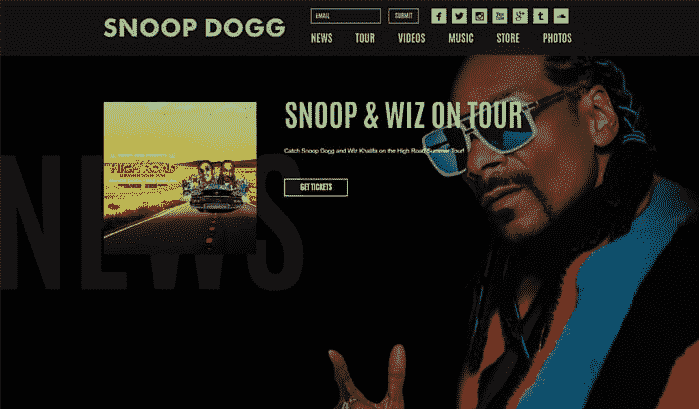](http://snoopdogg.com/)
sylvesterstallone.com-

演员、作家、导演西尔维斯特·史泰龙的官方网站。也被称为“洛奇”或“兰博”

[T2】](http://sylvesterstallone.com/)

### 马修·巴比-[matthewbarby.com](https://www.matthewbarby.com/)

Matthew Barby 是一位屡获殊荣的数字营销顾问，曾与世界各地的企业合作，为他们的网站增加流量并建立在线社区。

[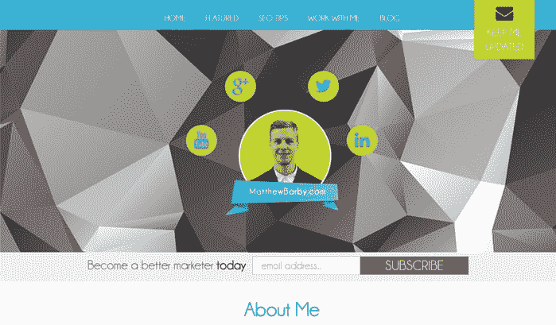T2】](https://www.matthewbarby.com/)

### wilwheaton.net 威尔·惠顿

威尔·惠顿是一名演员，因其在《星际迷航》和热门电视节目《生活大爆炸》中的角色而闻名。

Wil Wheaton

## 摘要

还是那句话，我们不可能囊括所有网站。但是正如你所看到的，WordPress 正在为全世界激动人心的新网站铺平道路！很多大品牌都在用；从非营利组织，企业，商业，新闻和杂志，电子商务网站，名人，甚至音乐家。随着时间的推移，你可以期待看到越来越多的品牌迁移到 WordPress，因为它提供了一个易于使用、免费和可扩展的解决方案。

我们错过了什么重要的大品牌或名字吗？如果是这样，请在下面和他们一起评论。

* * *

让你所有的[应用程序](https://kinsta.com/application-hosting/)、[数据库](https://kinsta.com/database-hosting/)和 [WordPress 网站](https://kinsta.com/wordpress-hosting/)在线并在一个屋檐下。我们功能丰富的高性能云平台包括:

*   在 MyKinsta 仪表盘中轻松设置和管理
*   24/7 专家支持
*   最好的谷歌云平台硬件和网络，由 Kubernetes 提供最大的可扩展性
*   面向速度和安全性的企业级 Cloudflare 集成
*   全球受众覆盖全球多达 35 个数据中心和 275 多个 pop

在第一个月使用托管的[应用程序或托管](https://kinsta.com/application-hosting/)的[数据库，您可以享受 20 美元的优惠，亲自测试一下。探索我们的](https://kinsta.com/database-hosting/)[计划](https://kinsta.com/plans/)或[与销售人员交谈](https://kinsta.com/contact-us/)以找到最适合您的方式。