# WordPress 网站地图指南:它是什么以及如何使用它

> 原文：<https://kinsta.com/blog/wordpress-sitemap/>

如果你曾经坐下来阅读过一篇关于 [SEO](https://kinsta.com/blog/what-does-seo-stand-for/) 的文章，你可能会遇到**网站地图**和/或 **XML 网站地图**这两个术语。但是尽管站点地图是一个相当常见的 SEO 推荐，但是还没有太多关于 XML 站点地图如何与 WordPress 协同工作的深入研究。

为了解决这个问题，我们将深入 WordPress 网站地图。以下是你将在这篇文章中学到的一切:

*   [什么是 XML 网站地图](#what)
*   XML 站点地图给你的 WordPress 站点带来的好处
*   [如何用 WordPress 插件创建 XML 网站地图](#plugin)
*   [如何使用基于云的工具创建 XML 网站地图](#manual)
*   [如何向谷歌和其他工具提交你的网站地图](#submit)
*   [为什么 HTML 网站地图导航是不同的(以及如何在 WordPress 上创建一个)](#html)

## 什么是 XML 网站地图？

一个 XML 站点地图基本上就是一个你希望公开的 URL 列表。像 robots.txt 一样，它通过给谷歌和其他搜索引擎一张你所有内容的“地图”来帮助[更好地抓取你的网站。就是这样！](https://kinsta.com/blog/alternative-search-engines/)

除了 URL 的原始列表，你还可以在你的站点地图中包含其他有用的“元数据”,以进一步帮助搜索引擎索引你的站点。这些选项在[站点地图协议](https://www.sitemaps.org/protocol.html)中进行了概述，并允许您指定如下内容:

*   上次修改页面的时间
*   你希望搜索引擎给这个页面什么样的优先级(*尽管搜索引擎不一定遵循这个*
*   页面更改的频率

除了这些核心的元数据之外，还可以向搜索引擎提供关于你的[视频](https://support.google.com/webmasters/answer/80471)和[图像](https://support.google.com/webmasters/answer/178636)的信息。

### XML 站点地图看起来像什么？

想知道 XML 站点地图实际上是什么样子吗？以下是我们的 WordPress post 站点地图在 Kinsta 的样子:

> Kinsta 把我宠坏了，所以我现在要求每个供应商都提供这样的服务。我们还试图通过我们的 SaaS 工具支持达到这一水平。
> 
> <footer class="wp-block-kinsta-client-quote__footer">
> 
> 
> 
> <cite class="wp-block-kinsta-client-quote__cite">Suganthan Mohanadasan from @Suganthanmn</cite></footer>

[View plans](https://kinsta.com/plans/)

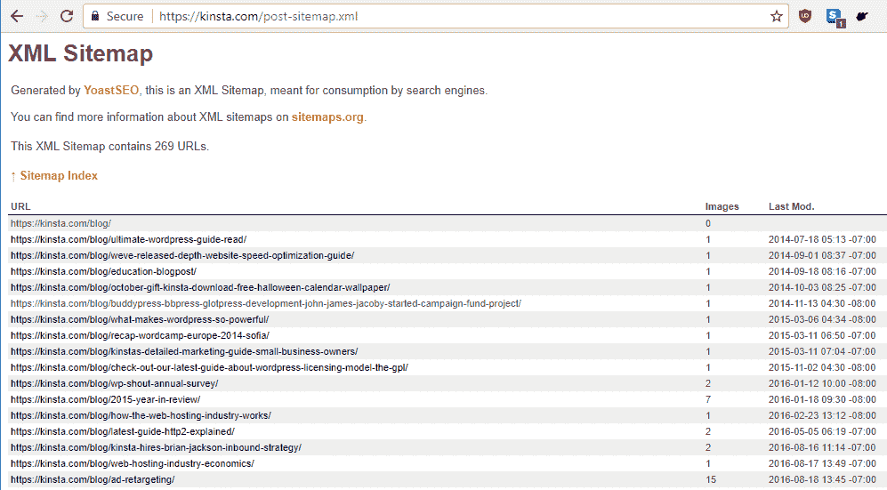

Example of an XML sitemap

正如你所看到的…它实际上只是一个带有额外元数据的 URL 列表。对人类不是特别有帮助！

### 一个 XML 站点地图中可以包含多少个 URL 有限制吗？

*是的，是有极限的*。**但是大多数 WordPress 网站永远不会察觉到这个限制。**

从技术上讲，sitemap.xml 文件有 50，000 个 URL 的限制。但是即使你的网站包含超过 50，000 个 URL，你也可以包含一个“你的站点地图”来增加这个数字。也就是说，您可以包含一个链接到更多特定站点地图的主站点地图(每个站点地图都有自己单独的 50，000 个 URL 限制)。

这就是我们在 Kinsta 的做事方式(*以及 Yoast SEO 默认情况下的做事方式——稍后会有更多介绍*)。上面的截图是专门针对我们的 WordPress 帖子的。但是如果你去我们的主网站地图文件，你会看到它实际上只是链接到其他网站地图文件:

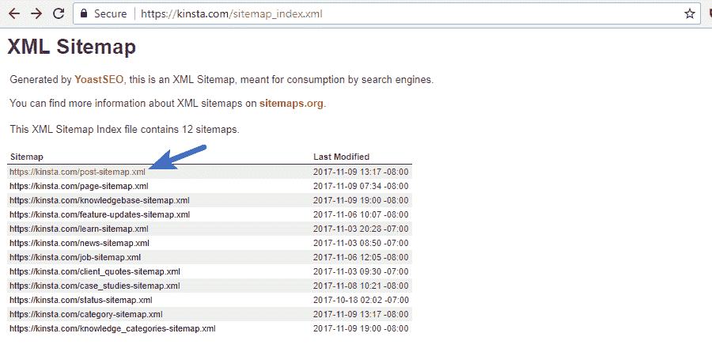

网站地图

## XML 网站地图如何让你的 WordPress 网站受益

XML 站点地图的主要好处是提高了可抓取性。用谷歌自己的话来说，“像谷歌机器人这样的搜索引擎网络爬虫会读取这个文件，以便更智能地抓取你的网站。”以下是 XML 网站地图提高网站可抓取性的一些具体方法:

*   ****更快的抓取时间****——网站地图可以帮助搜索引擎机器人[比没有网站地图更快地抓取你的内容](https://moz.com/blog/do-sitemaps-effect-crawlers)。这也能让你的内容更快地被编入索引。
*   **优先抓取**–Sitemaps 允许你要求 Google 通过添加元数据来优先抓取你站点上的某些页面。
*   丰富的媒体内容(Rich media content)——如果你使用大量的媒体，比如视频和图像，“谷歌可以在适当的时候考虑来自网站地图的额外信息。”([来源](https://support.google.com/webmasters/answer/156184?hl=en)

除了可抓取性之外，网站地图也有一些后门的方式为你提供有用的信息。假设你将你的站点地图提交到[谷歌搜索控制台](https://kinsta.com/blog/google-search-console/)(你将在后面学习如何做！)，你可以使用你的网站地图来快速确定你的网页在谷歌中被索引的效率:

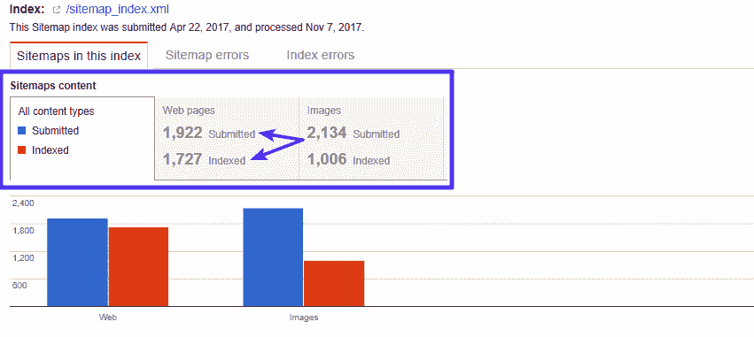

网站地图指数统计

### 添加 XML 站点地图会损害您的站点吗？

没有！不用担心。最坏的情况是你看不到任何积极的结果。**创建一个 XML 站点地图绝不会损害你的站点**。

不相信我？以下是谷歌自己在这个问题上的说法:“在大多数情况下，你的网站将从拥有一个网站地图中受益，而且你永远不会因为拥有一个网站地图而受到惩罚。

### 然而，网站地图并不意味着你可以忽略内部链接结构

虽然一个网站地图是有益的，但它不是:**它不能代替创建一个稳固的内部链接结构，**除了别的以外，它还能增加你获得[谷歌网站链接的机会](https://kinsta.com/blog/google-sitelinks/)。也就是说，不要认为搜索引擎会仅仅因为你把你的内容*包含在你的站点地图*中就对其进行索引。他们可能会，但也可能不会。

谷歌仍然希望看到你的内容有指向它的内部或外部链接。正如[谷歌所说](https://support.google.com/webmasters/answer/156184?hl=en)，“使用网站地图并不能保证你网站地图中的所有项目都会被抓取和索引。”

因此，虽然你绝对应该使用网站地图，但是你不应该仅仅依靠网站地图来索引你的内容。

## 如何用 Yoast SEO 为你的 WordPress 站点创建一个 XML 站点地图

现在你已经知道了什么是 XML 站点地图，以及它是如何使你的站点受益的，那么你如何为你的所有内容创建一个 WordPress 站点地图呢？最简单的方法是使用 Yoast SEO，这是我们推荐的插件。

要用 Yoast SEO 创建一个 XML 站点地图，除了安装和激活免费的 Yoast SEO 插件之外，你实际上不需要做任何事情。默认情况下，Yoast SEO 会在以下位置创建一个站点地图:

`yoursite.com/sitemap_index.xml`

这很简单！但是很多人不知道的是，Yoast SEO 还允许您自定义 XML 站点地图的功能。以下是如何做到这一点:

进入 **SEO →功能**，启用**高级设置页面**:

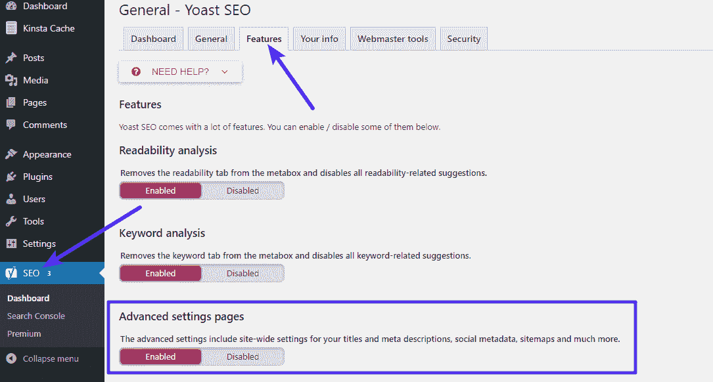

How to enable advanced Yoast XML Sitemap control

请确保保存您的更改。一旦你这样做了，你就可以在你的仪表盘工具条的 **SEO** 菜单下访问新的 **XML 站点地图**选项:

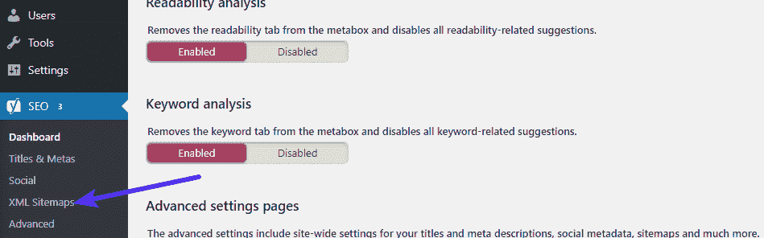

Accessing Yoast SEO XML Sitemaps

在那里，您可以使用顶部的选项卡来:

*   选择是否包含作者的网站地图
*   选择在你的站点地图中包含哪些文章类型/分类
*   通过帖子 ID 手动排除网站地图中的个别内容——如果您已经为某些内容添加了 noindex 标签，这将非常有用。

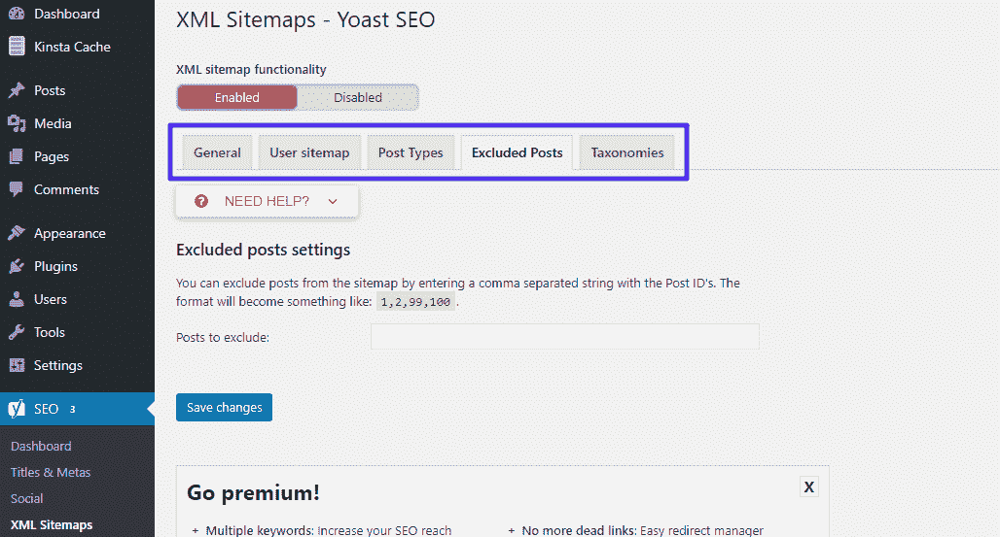

Configuring Yoast SEO XML sitemaps

### 帮助你创建 XML 站点地图的其他 WordPress 插件

虽然 Yoast SEO 是我们推荐的帮助你为 WordPress 创建 XML 站点地图的工具，但它绝不是你唯一的选择。

## 注册订阅时事通讯

### 想知道我们是怎么让流量增长超过 1000%的吗？

加入 20，000 多名获得我们每周时事通讯和内部消息的人的行列吧！

[Subscribe Now](#newsletter)

其他优质插件包括:

*   Google XML Sitemaps-一个流行的插件，专门用于 XML Sitemaps，而不是一般的 SEO。
*   SEO 框架——一个包含 XML 网站地图功能的新兴 SEO 插件。

## 如何使用 XML 网站地图生成器为你的网站创建网站地图

不是 WordPress 插件的粉丝？还是用的不是 WordPress 的东西？不用担心——您也可以使用一个名为 [XML 站点地图生成器](https://xmlsitemapgenerator.org/)的独立工具来创建一个 XML 站点地图。该工具允许您通过以下方式为您的站点创建 XML 站点地图:

*   基于云的工具
*   桌面程序(仅适用于 Windows)
*   一个 WordPress 插件(如果你改变主意不想使用 WordPress 插件！)

下面是如何使用云工具来创建你的网站地图:

前往 [XML 网站地图生成器](https://xmlsitemapgenerator.org/)，向下滚动，点击**在线生成器**选项:

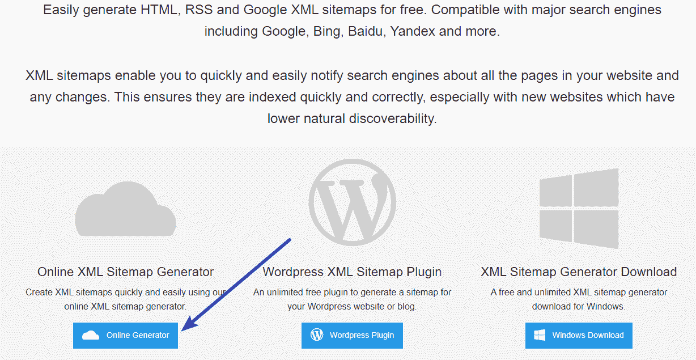

Using XML Sitemap Generator

在下一页…

*   输入您网站主页的 URL
*   选择如何计算上次修改日期
*   选择更改频率(页面更改的频率)
*   选择默认爬网优先级
*   输入您的电子邮件地址
*   点击**生成网站地图**

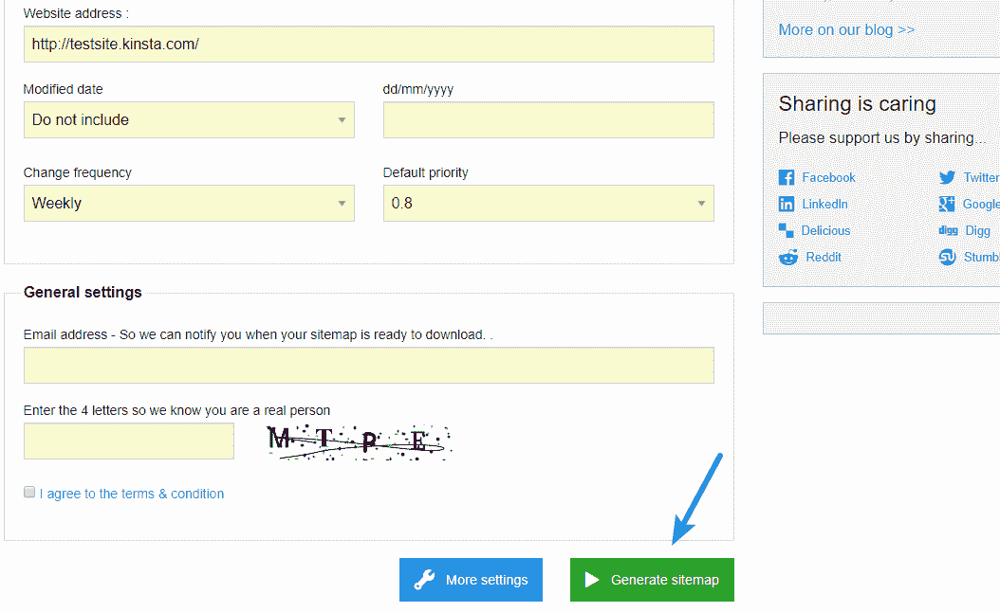

Configuring XML Sitemap Generator

您也可以点击**更多设置**按钮来配置更多高级选项:

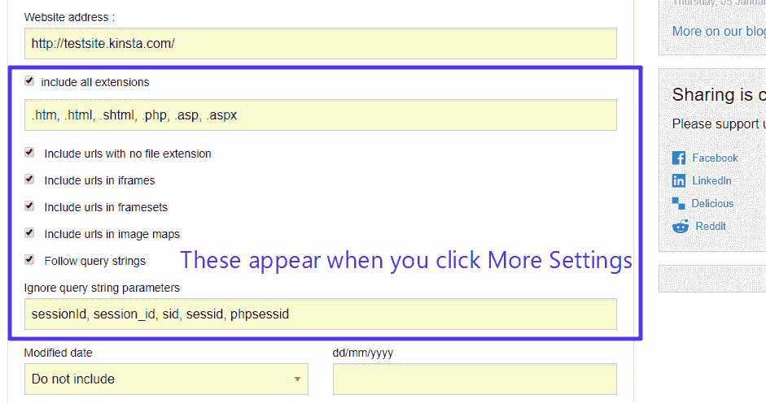

More configuration options

一旦你点击 **Generate sitemap** ，当 XML Sitemap Generator 抓取你的站点时会有一个延迟。如果你有一个小网站，只需要一点时间，但大网站可能需要更长时间。完成后，您就可以下载各种网站地图了:

Struggling with downtime and WordPress problems? Kinsta is the hosting solution designed to save you time! [Check out our features](https://kinsta.com/features/)

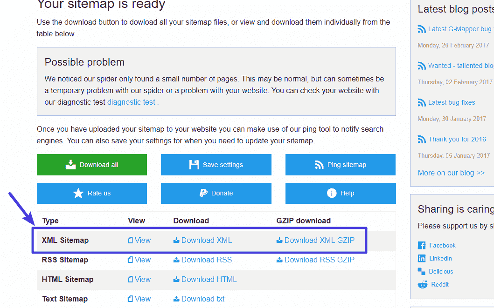

Download sitemap

一旦你下载了网站地图文件，你需要把它上传到你网站的根文件夹。

## 如何向谷歌和其他搜索引擎提交你的网站地图

一旦你有了一个可用的 XML 站点地图，你会想更进一步，实际上**把这个站点地图提交给主要的搜索引擎**。这个:

*   确保谷歌知道在哪里可以找到你的网站地图
*   为您提供关于 Google 已经索引了多少页面的有用数据(我之前向您展示过这个截图)

要向 Google 提交您的 XML 站点地图，您需要一个 Google 搜索控制台帐户。如果你还没有，这里有[如何用谷歌搜索控制台](https://kinsta.com/blog/google-search-console/)注册并验证你的网站。一旦你设置了谷歌搜索控制台账户，你就可以通过进入**抓取→网站地图**并点击**添加/测试网站地图**按钮来提交网站地图:

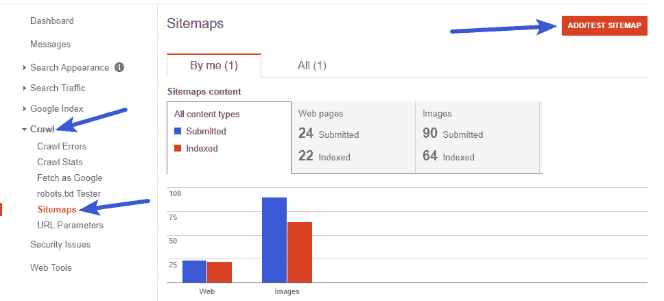

How to submit a sitemap to Google

然后，添加你的站点地图的位置，点击**提交**。如果你使用 Yoast SEO 来创建你的站点地图，你需要做的就是粘贴“sitemap_index.xml”:

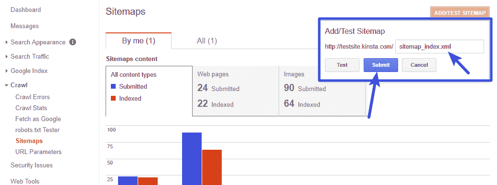

Add your sitemap location

一旦谷歌处理了你的网站地图，你就可以查看同一区域的统计数据。这包括关于您的站点上可能发生的错误(如 [404 错误](https://kinsta.com/blog/http-status-codes/))的有用信息，如下例所示。

> 当我们测试你的站点地图的 URL 样本时，我们发现一些 URL 由于 HTTP 状态错误而无法被 Googlebot 访问。仍将提交所有可访问的 URL。

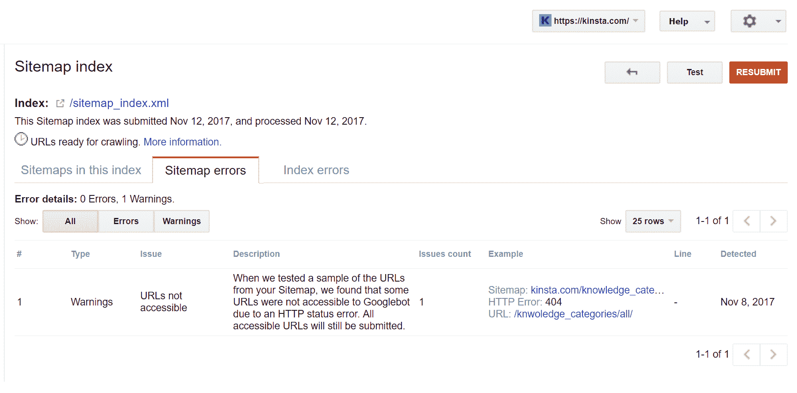

WordPress sitemap errors

### 如何向 Bing 提交你的站点地图

虽然谷歌是王者，但必应仍然存在。所以为了获得更多的覆盖面，你可能还想把你的网站地图提交给 Bing。下面是必应的[指南，告诉你如何做到这一点](https://www.bing.com/webmaster/help/how-to-submit-sitemaps-82a15bd4)。这个过程与谷歌非常相似——你需要注册一个[必应网站管理员工具账户](https://kinsta.com/blog/bing-webmaster-tools/)。然后，您可以直接从您的仪表板提交您的站点地图。

## 如何给 WordPress 添加 HTML 网站地图导航

在这篇文章中，我们特别关注 XML 站点地图。但是这并不是你想添加到 WordPress 站点的唯一的站点地图。HTML 网站地图是一个更加人性化的网站地图版本。你可能以前见过它们——它们基本上是一个链接列表，帮助人们轻松地浏览你的网站。

例如，这是我们在 Kinsta 的(部分)网站地图:

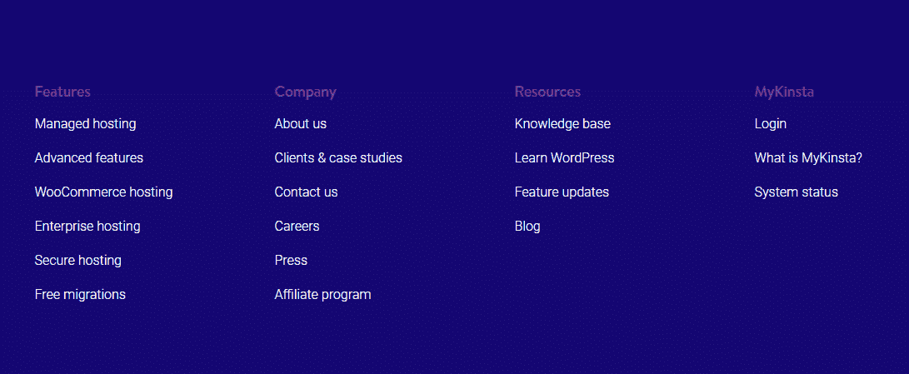

Kinsta sitemap in footer

HTML 网站地图不一定包括你网站上的每一个页面，但是它们可以让访问者快速浏览你所有最重要的页面。虽然您总是可以手动创建 HTML 站点地图导航区域，但是更自动化的方法是使用[简单站点地图插件](https://wordpress.org/plugins/simple-sitemap/)。这个插件允许你通过以下方式创建一个站点地图:

*   仅包括某些帖子类型
*   限制显示的子页面数量
*   不包括[特定岗位 id](https://kinsta.com/blog/wordpress-get-post-id/)
*   以不同的方式排列页面

该插件还包括预制模板，以帮助您快速创建常见类型的网站地图。一旦你设置了你的选项，你就可以用一个简单的短代码在你站点的任何地方显示你的站点地图。

要使用它，安装并激活插件。然后，进入**设置→简单网站地图**。您可以点击其中一个演示来获得预先制作的短代码，或者使用各种短代码属性创建自己的短代码:

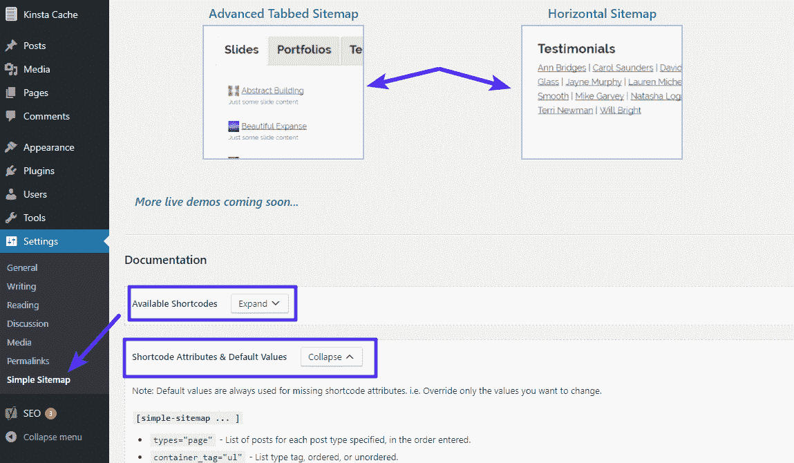

How to create a HTML sitemap

## 今天就开始使用 WordPress 的网站地图

XML 站点地图是每个 WordPress 站点都需要的东西之一。虽然这不会让你的网站直接上升到 SERPs 的顶端，但是这是一个让你的网站被爬得更快更彻底的好方法。在 WordPress 上创建 XML 站点地图最简单的方法是通过 Yoast SEO 插件，但是你也可以找到很多其他插件来帮助你。

推荐教程:【WordPress 的最佳 SEO 插件(以及必备的 SEO 工具)

一旦你创建了你的站点地图，你应该把它提交给谷歌搜索控制台，以获得关于谷歌如何索引你的站点的有价值的见解。我们希望你喜欢我们的指南，如果你有任何关于使用 WordPress 和 sitemaps 的问题，请留下评论。

* * *

让你所有的[应用程序](https://kinsta.com/application-hosting/)、[数据库](https://kinsta.com/database-hosting/)和 [WordPress 网站](https://kinsta.com/wordpress-hosting/)在线并在一个屋檐下。我们功能丰富的高性能云平台包括:

*   在 MyKinsta 仪表盘中轻松设置和管理
*   24/7 专家支持
*   最好的谷歌云平台硬件和网络，由 Kubernetes 提供最大的可扩展性
*   面向速度和安全性的企业级 Cloudflare 集成
*   全球受众覆盖全球多达 35 个数据中心和 275 多个 pop

在第一个月使用托管的[应用程序或托管](https://kinsta.com/application-hosting/)的[数据库，您可以享受 20 美元的优惠，亲自测试一下。探索我们的](https://kinsta.com/database-hosting/)[计划](https://kinsta.com/plans/)或[与销售人员交谈](https://kinsta.com/contact-us/)以找到最适合您的方式。