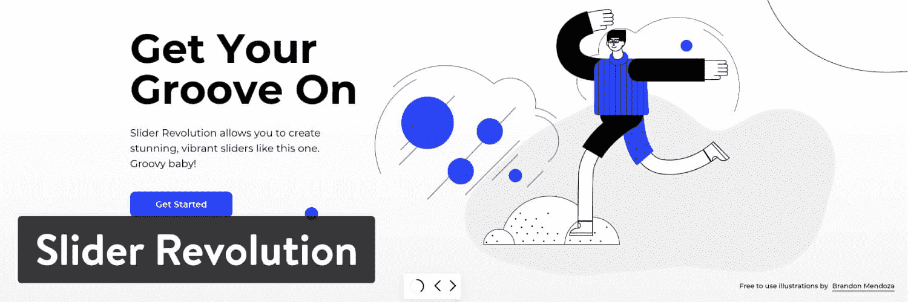
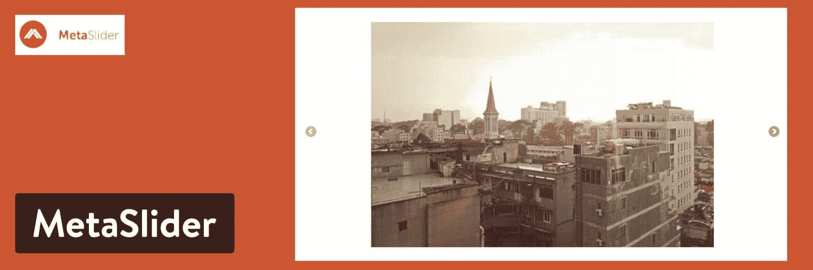
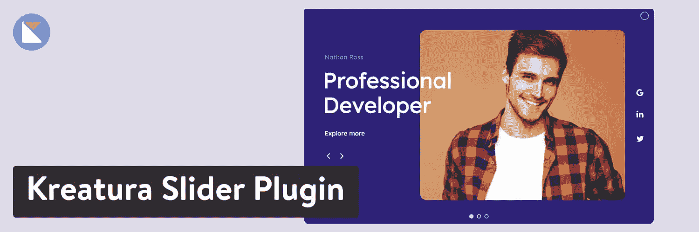
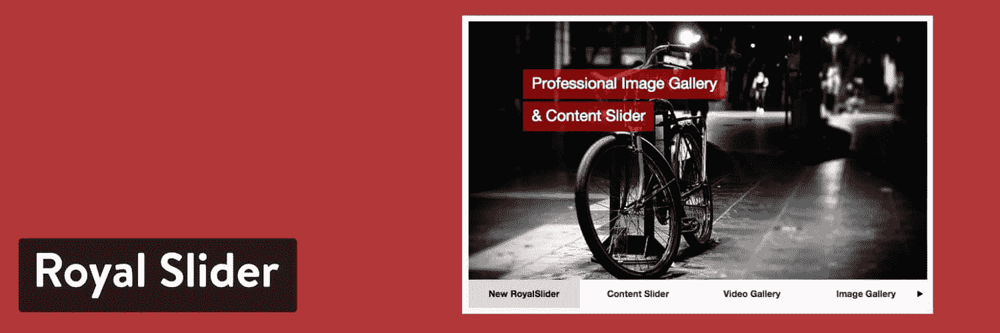
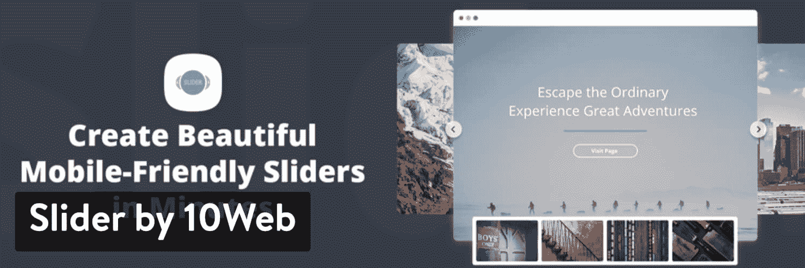

# 9 个伟大的 WordPress 滑块插件吸引人的网站

> 原文：<https://kinsta.com/blog/wordpress-slider/>

一个 WordPress slider 插件提供了简单图像幻灯片的功能，而高级解决方案通过[拖放构建器](https://kinsta.com/blog/wordpress-page-builders/)、动画和按钮对其进行了扩展。

如果你对在你的网站上添加一个滑块感兴趣，从了解如何使用滑块开始，这样就不会给你的网站带来问题。

之后，看看我们喜欢的顶级功能和最好的 WordPress 滑块插件供选择。我们强调定价、功能和用例场景等元素，以确保您为您的组织选择理想的滑块插件。

## 使用 WordPress 滑块插件的指南

有些人喜欢滑块，有些人不喜欢。我认为 WordPress 的普通用户会在各种网站上看到它们，并认为这是正确的选择。此外，滑块允许网站所有者跳过照片或视频删除过程，在他们的主页上放置五张或十张照片。

然而，许多开发者和 WordPress 用户明白，滑块如果做得不好，会让网站访问者感到困惑，通常不会带来更高的转化率，减慢网站的加载速度，并且会占用你主页上大量的物理空间。

通常，滑块插件是构建标题图像的优秀工具，即使你只使用一张幻灯片。因此，我们建议在滑块中使用一两张图片，尽量缩小它的尺寸，尽可能地消除混乱，以确保[你的网站运行快速](https://kinsta.com/learn/speed-up-wordpress/)，并且它不会带来更多的麻烦。

### 在 WordPress 滑块插件中寻找什么

不是所有的滑块插件都是一样的。事实上，市场上有如此多的 WordPress 滑块插件，你一定会发现一些无用的东西。

这就是为什么我们倾向于引导我们的研究，并概述我们认为在选择时最重要的特征。这样，你就不用选择和购买带有不必要工具的滑块插件，这些工具会使界面变得混乱。另一方面，我们不希望你仅仅因为它更便宜或者是你找到的第一个选择，就满足于一个有限的滑块。

以下是我们认为最有价值的特性:

*   迎合多个行业的滑块模板和[设计](https://kinsta.com/blog/web-design-trends/)，让你瞬间上手。
*   拖放，或者至少是可视化的构建器，无需编码就可以设计出漂亮的滑块。
*   [响应式元素](https://kinsta.com/blog/responsive-web-design/)在移动设备上看起来不错，或者为移动设备去掉了滑块。这一点非常重要，因为滑块在手机和平板电脑上看起来很糟糕。
*   一个设计元素库，将您的想法转化为令人惊叹的视觉效果。这些可能包括背景图像、图标、[不同字体](https://kinsta.com/blog/web-safe-fonts/)和视频。
*   兼容 [WordPress 主题](https://kinsta.com/best-wordpress-themes/)和[主要插件](https://kinsta.com/best-wordpress-plugins)，以及链接到 WordPress 用户使用的流行软件和应用的附加组件和集成。
*   选项，使不同的变化滑块，如传送带或链接到博客文章的滑块。很高兴看到对动态内容的支持，从其他地方获取内容，如 [RSS 提要](https://kinsta.com/blog/wordpress-rss-feed/)或您的产品页面。
*   [社交媒体整合](https://kinsta.com/blog/wordpress-social-media-plugins/)即时显示您最近的帖子，并让人们访问您的社交媒体页面。
*   英雄版块——或大型视觉标注——抓住注意力，将访问者转化为新客户或追随者。
*   各种动画将用户的眼睛带到滑块的特定区域。这些也很好地为你的网站增加了相关的乐趣和创造力。
*   支持多种媒体项目和丰富的内容，如[视频](https://kinsta.com/blog/video-hosting/)和[图像](https://kinsta.com/blog/image-file-types/)，甚至[gif](https://kinsta.com/blog/wordpress-gifs/)。
*   用于分类和组织滑块并复制它们以制作自己的模板供以后使用的项目工具。
*   优化工具，如[惰性加载](https://kinsta.com/blog/wordpress-lazy-load/)和[图像优化](https://kinsta.com/blog/optimize-images-for-web/)，以确保您的滑块不会降低网站速度。
*   在将滑块发布到您的网站上之前，可以通过视觉预览来查看滑块的确切外观。
*   快速图像编辑，如裁剪，以消除对 Photoshop 等第三方编辑工具的需要。
*   多个导航元素，如按钮，可以在图像和灯箱中滑动，以查看更大版本的照片。
*   WooCommerce 等电子商务工具的潜在整合，扩展了产品视觉的媒体类型。

## 2022 年最佳 WordPress 滑块插件选项

经过大量的分析和比较，我们将最好的 WordPress 滑块列表缩减为以下几个。请随意点击下面候选名单中的一个，查看深入的评论。

### 1.滑块旋转

滑块革命是由 ThemePunch 的人开发的，这是另一个叫做 Essential Grid 的最爱的制造商。Slider Revolution 是网上最受欢迎的滑块插件之一，在 CodeCanyon 上拥有数万的销量和优秀的用户评论。它也在 ThemePunch 网站上出售。

该插件具有令人难以置信的视觉元素和主题，看起来就像一个专业的平面设计师在工作。英雄部分意味着脱颖而出，转换客户和完整的网页是一个巨大的奖励。

Slider Revolution WordPress plugin

Slider Revolution 插件包含了你需要的每一个 Slider 插件的元素，但是重要的是要知道这个工具主要是为开发者构建的。初学者肯定可以尝试，但有一个学习曲线。

总的来说，Slider Revolution 的成功可以归功于一流的客户支持、数百个漂亮的模板以及包括前后图片、揭示等元素的附加组件。

#### 定价

一个网站的起价是每年 29 美元。

其他计划包括每年 70 美元的选项，每年高达数千美元，这取决于你计划使用它的网站数量。

CodeCanyon 列出的 Slider Revolution 售价为 59 美元，所以你最好直接从 ThemePunch 网站购买。

#### 使它成为顶级 WordPress 滑块插件的特性

*   一个华丽的可视化编辑器，集成了拖放编辑、文本管理和层。成千上万的设置被打包到编辑器中，使它更类似于像 Photoshop 这样的强大软件。
*   超过 200 个模板，用于英雄幻灯片、特效幻灯片和旋转木马等类别。
*   像泡沫变形，画笔细节，照片前后效果插件。
*   一个完整的媒体资源库，用于添加动画图层组、图像、视频和图标。
*   在较小的设备上快速就位的响应滑块。如果这更符合你的风格，你甚至可以移除移动设备上的滑块。
*   自定义动画、移动和滑块长度的时间线。
*   预览工具，用于评估每张幻灯片在各种设备上的外观。
*   一键更新，以激活新功能，每当他们出来。
*   链接到社交媒体帐户以显示最近的帖子，并让人们了解您的社交内容。
*   支持丰富的内容、视频和照片层。
*   具有各种定制选项的有用的行动号召按钮。
*   一个历史模块，让你回到旧版本的滑块，帮助修改你的历史，看看哪些元素是最好的现在使用。
*   保存和复制功能制作幻灯片或滑块，并将其复制到另一个网站或在当前网站上再次使用。
*   适用于所有设计元素的灵活模块，帮助您根据自己的喜好调整大小。
*   一个背景库，有许多图像和形状可供选择并添加到您的滑块中。
*   用于[的图像优化和延迟加载加快了你的加载速度](https://kinsta.com/blog/ttfb/)并减少了对额外优化插件的需求。

#### 谁应该考虑滑块革命？

Slider Revolution 是[开发者](https://kinsta.com/blog/hire-wordpress-developer/)的首选。价格是负担得起的，尤其是当你开始添加到多个网站。借助媒体库和优雅的模板，加速设计过程也是必不可少的。Slider Revolution 提供了让滑块看起来更专业的最好方法，但我们会警告初学者，它不是最容易掌握的插件。

### 2.智能滑块

[Smart Slider](https://smartslider3.com/) 提供了一个简洁的设计器、几个预制模板和一个带有拖放模块的编辑器。智能滑块插件背后的概念是提供滑块旋转的力量，而没有有点复杂的界面。开发人员无疑已经实现了一个更干净的基础设施，但它仍然会让那些以前从未在网页设计领域工作过的人感到害怕。

话虽如此，我们建议所有开发人员和设计人员将智能滑块视为滑块革命的可行替代方案。该插件拥有反应灵敏的元素、漂亮的主题，以及对 YouTube 和 T2 woo commerce 的整合。动画效果对于构建时间线非常方便，允许您添加动画并在特定的时间点将它们介绍给观众。

Smart Slider WordPress Slider

很明显，Smart Slider 在[电子商务部门](https://kinsta.com/blog/ecommerce-platforms/)中占有一席之地，因为它获取产品并帮助添加按钮来销售这些商品。我们还注意到，智能滑块生态系统和社区脱颖而出。您可以找到大量的文档和一个社区群组来与其他人聊天。我们也喜欢个人支持和视频教程，它们真正带来了更直观的学习体验。

#### 定价

智能滑块售价 35 美元。这支持一次现场安装，并且是一次性付款。

10 个站点的商业计划费用为 150 美元，没有站点数量限制的无限计划费用为 250 美元。

价格是 Slider Revolution 和 Smart Slider 之间的一个区别，因为您可以通过 Smart Slider 获得终身支持和升级。另一方面，Slider Revolution 插件需要每年付费。

#### 使它成为顶级 WordPress 滑块插件的特性

*   多种项目类型，扩展您的设计范围。这些包括块，传送带，甚至全页网站设计。
*   动态内容链接，这样你的滑块可以显示来自[你的博客](https://kinsta.com/blog/)或 RSS 源的数据。
*   超过 180 种不同行业和设计类别的模板。您可以更改模板上的任何元素，并保存它们供以后使用。
*   一个幻灯片库，有点像模板的缩小版。如果开始的设计不是你想要的，把这些添加到你的模板中。
*   层支持–24 层–支持高级定制。
*   搜索引擎优化友好的工具来优化你的图片，并遵循搜索引擎的最佳实践。
*   用于添加文本、项目符号和缩略图等基本项目的标准控件元素。
*   兼容市场上一些最流行的[页面生成器](https://kinsta.com/blog/wordpress-page-builders/)，比如 Gutenberg 和 Elementor。
*   一个拖放式编辑器，界面简洁现代。
*   实时预览和响应编辑，以便在发布之前准确了解您的设计外观。
*   设计器中的图像编辑。这提供了裁剪和过滤，而不是必须在第三方编辑软件中完成这些任务。
*   复制和粘贴工具以及导出/导入功能，用于将您的作品发布到其他地方。
*   用于快速设计的热键和右键菜单。
*   借助 [CSS](https://kinsta.com/blog/wordpress-css/) 支持更高级的设计定制。你也可以[选择你的排版](https://kinsta.com/blog/modern-fonts/)，风格样式和背景颜色。
*   改进了添加背景视频、叠加图像、甚至拥有灯箱的媒体产品。
*   几十个动画，你可以应用到层和激活任何元素，如文本框或图像。

#### 谁应该考虑智能滑块？

智能滑块插件为熟练的网页设计者做这项工作。如果你是新手，我们建议你不要做滑步旋转，但这仍然很难学。另一个要考虑的因素是定价。Smart Slider 只收取一次性费用，用于无限制升级和支持，而不是竞争对手的年度定价。
T3】

### 3.主滑块

[Master Slider](https://wordpress.org/plugins/master-slider/) 在其滑块设计中散发出一种特殊的优雅，为多种类型的行业和用途提供了实用而新颖的模板。你可以找到健身房和健身博客的模板，以及基本的商业幻灯片、餐馆选择等等。

视差元素包含在许多模板中。同样明显的是，对高分辨率图像的关注使 Master Slider 对专业摄影师和其他创意人员很有用。您可以从不同的布局中进行选择，如平面横向图像或垂直标签滑块。旋转木马是可能的，你可以覆盖内容和按钮来吸引注意力。

WordPress 文章滑块有各种形状和大小，允许你链接到你的文章，永远不会用完滑块中的内容。我们喜欢带有[视频背景](https://kinsta.com/blog/embed-youtube-video-wordpress/)的全屏滑动条，看看它是如何将重叠的文本和后面的移动视频结合在一起的。

Master Slider WordPress plugin

Master Slider 插件为智能手机和平板电脑提供图像滑块模型和设计[也很不错。这样，你就不用担心滑块在较小的设备上看起来是否像样，因为这些滑块，特别是，就是为此而生的。](https://kinsta.com/blog/web-design-best-practices/#mobile-responsiveness)

总的来说，主滑块提供了大量的功能和一个超级平滑的界面，以建立时间线上的动画幻灯片。拖放构建器为初学者提供了一个简单的设计过程，实时预览提供了完全的控制，类似于电影编辑软件。它看起来不像 Slider Revolution 或 Smart Slider 那样令人生畏，所以 Master Slider 插件为仍然想要专业外观的企业主和初学者提供了我们的建议。

#### 定价

主滑块有一个免费的[核心插件](https://wordpress.org/plugins/master-slider/)。[高级版](http://www.masterslider.com/pricing/)起价 17 美元。他们称之为 jQuery 版本。WordPress Pro 版售价 24 美元。

更新和支持永远是免费的，所以没有必要为每年的包付费。

#### 使它成为顶级 WordPress 滑块插件的特性

*   一个拖放式设计器，带有用于移动幻灯片过渡和这些过渡的持续时间的选项。
*   在将动画发布到网站之前，实时预览动画效果。
*   用于调整任何编辑器元素位置的对齐和捕捉工具。
*   一个视觉风格编辑器，可以访问超过 650 种[谷歌字体](https://kinsta.com/blog/best-google-fonts/)和一个引入[自定义 CSS](https://kinsta.com/knowledgebase/edit-wordpress-code/) 的导入功能。
*   自定预置存储，拷贝您编辑过的预置供以后使用。
*   具有即时预览和可视化环境的过渡编辑器。您可以添加预设转场或制作自己的转场。
*   一个可视化的按钮编辑器，确保所有的按钮都有你需要的颜色和字体。它允许你在任何背景和滑块上放置一个按钮，将所有的功能结合在一起。
*   响应式设计模块和预览选项，为您的幻灯片提供移动支持。主滑块可根据各种不同的观看环境进行调整。它也有触摸滑动导航。
*   动画层，支持带有链接和图像的漂亮幻灯片。这些元素四处移动，并且可以覆盖文本。
*   视差效果和超过六个交互式过渡选项，包括波浪，流动和遮罩。
*   支持 YouTube 和 Vimeo 视频。幻灯片视频背景扩展了每个视频，并包括号召行动的覆盖图。
*   一个展示你的产品的 WooCommerce 滑块，它取代了 WooCommerce 中的默认滑块。
*   其他几个滑块来自像 [Flickr](https://kinsta.com/blog/free-images-for-wordpress/#flickr) 、[脸书](https://kinsta.com/blog/wordpress-facebook-plugins/)和[你的博客](https://kinsta.com/blog/best-blogging-platform/)这样的来源。
*   SEO 友好的元素，带有标记和标题字段。
*   几个幻灯片皮肤来改变幻灯片的暗度、对比度或亮度。
*   前端图像滑块上的一个独特的控件集，带有项目符号和箭头。

#### 谁应该考虑滑球大师？

Master Slider 提供了一个免费的核心插件和一个非常实惠的高级选项。因此，我们喜欢它为那些预算有限的人提供专业的功能，这是你对一个优秀的 WordPress 滑块插件的期望。

从界面构建的角度来看，它也更容易使用，非常适合经验不足的 WordPress 用户。最后，如果你不喜欢默认的 WooCommerce 工具，或者你不希望得到一个额外的插件，Master Slider 可以作为 WooCommerce slider 的替代品。

### 4.MetaSlider

当谈到搜索引擎优化优化，令人印象深刻的 UX 元素，以及对编码人员的访问， [MetaSlider](https://www.metaslider.com/) 已经涵盖。它有点像一个混合滑块插件，为开发者提供资源，同时也为那些对使用 CSS 或 HTML 不感兴趣的人提供了一个漂亮的用户界面。

MetaSlider 提供了几个模板和预设模块，包括帖子源、层滑块和视频滑块。你可以将这些幻灯片添加到你的网上商店中，或者为你的摄影网站添加一个令人惊叹的高分辨率幻灯片。

这是一个更受欢迎的 WordPress 滑块插件，部分原因是免费版本，但也因为该插件提供了智能图像裁剪和其他编辑工具。有对所有类型的图像和幻灯片的无限制支持，包括标题和[替代文本](https://kinsta.com/blog/wordpress-seo/#9-add-alt-text-to-your-images)以确保你的图像搜索引擎优化支持搜索引擎。

MetaSlider WordPress Slider

后端包括可视化构建功能，但它没有一个完整的拖放构建器。你可以在 [WordPress 仪表盘](https://kinsta.com/knowledgebase/wordpress-admin/)中修改主题、效果和尺寸。MetaSlider 插件的简单本质使用户能够从头开始，并且[呈现一个从一个图像跳到另一个图像的基本图库](https://kinsta.com/blog/wordpress-photo-gallery-plugins/)。您不应该期望 MetaSlider 具有任何高级功能，但是它确实提供了开发人员访问权限，以防您想要定制和脱离标准图像滑块。

#### 定价

MetaSlider 提供了一个[免费版本](https://wordpress.org/plugins/ml-slider/)。[39 美元升级到高级版](https://www.metaslider.com/upgrade/)。这是针对 1-2 个网站的。

随着网站的增加，价格也会上涨。

请记住，更新和高级支持只有一年，之后您必须付费升级。另一方面，你可以选择一次性付费保留插件，忘记支持和更新。

#### 使它成为顶级 WordPress 滑块插件的特性

*   开始设计过程的模板和演示库，其中一些包括图像滑块、旋转木马和缩略图滑块。
*   当放置在[产品页面](https://kinsta.com/blog/conversions-woocommerce-product-pages/)上时，支持电子商务网站滑块。
*   所有页面和帖子的无限幻灯片。
*   SEO 支持标记图像和插入元数据，这可能有助于改善您的 [SEO](https://kinsta.com/blog/what-does-seo-stand-for/) 。
*   在手机和平板电脑上完美呈现的触控功能。这包括触摸滑动。
*   智能图像裁剪功能，无需第三方编辑软件。
*   动画层幻灯片，您可以在原始层上放置图像、文本和按钮。
*   YouTube 和 Vimeo 集成，扩展你的滑块资源，显示视频，而不仅仅是图像。
*   一个链接滑块到你的 WordPress 文章的选项。易于查看和编辑的缩略图导航。
*   一个基于 WordPress 的主题编辑器，并不那么高级，但是风格上为 WordPress 用户所熟悉。

#### 谁应该考虑 MetaSlider？

MetaSlider 的游戏名称是简单。有些人可能会觉得 MetaSlider 的设计看起来过于简单。但是，我们知道开发人员通常喜欢这种配置，因为它可以最大限度地减少性能问题，并提供定制选项。因此，对于只需要基本滑块的开发人员和公司，我们喜欢 MetaSlider。

## 注册订阅时事通讯

### 想知道我们是怎么让流量增长超过 1000%的吗？

加入 20，000 多名获得我们每周时事通讯和内部消息的人的行列吧！

[Subscribe Now](#newsletter)

### 5.Kreatura 滑块插件

另一个广受欢迎的 WordPress 滑块插件是 [Kreatura 滑块插件](https://codecanyon.net/item/kreatura-slider-plugin-for-wordpress/1362246)。一体化滑块生成器结合了功能和风格，使用多种布局编辑工具和时尚的设计器，无需复杂的编码。

与一些竞争对手相比，这些模板非常突出，并且自动适应设置确保所有滑块元素都咬合到位并且看起来很漂亮。你可以改变一切，从文本到图像，回到历史中去修改一个看起来不太对的元素。随意链接到外部资源或添加属性和过渡。

Kreatura 界面提供了一个直观的结构，聚焦于滑块视觉效果，最大限度地减少了塞满仪表盘的工具数量。您可以查看滑块在手机和平板电脑上的显示方式，并预览每个滑块在网站上的显示效果。

Kreatura Slider Plugin

开发者提供插件来改进你的设计过程，然而真正的功能是通过大量的特效和英雄场景来实现的。结合多滑块布局，它为你的滑块创造了一个美丽的环境。更不用说，Kreatura 开发者包括网站设计，以防你想彻底检查你当前的网站。

#### 定价

Kreatura Slider 插件在 CodeCanyon 上售价 25 美元。额外支持需要在初始支持期后进行升级。

您还可以选择在开发者网站上购买更多的[高级计划。专业计划的价格为 66 美元，为三个网站提供支持。还有额外的批量折扣。](https://layerslider.kreaturamedia.com/pricing/)

最后，现货计划花费 125 美元，允许开发者将 Kreatura Slider 插件作为成品的一部分发送给客户。每次购买都包含终身升级和支持政策。

#### 使它成为顶级 WordPress 滑块插件的特性

*   一个拖放式的可视化构建器，具有简单的设置，但是有足够强大的工具来添加层和移动元素。
*   一个完整的模板商店，提供专业的可定制主题，涵盖广泛的行业和使用案例。
*   一个利用弹出窗口和 Kreatura 滑块插件的集成。本质上，当用户点击滑块获取更多信息时，它会激活一个弹出模块，比如一个[电子邮件注册](https://kinsta.com/blog/how-to-build-an-email-list/)或类似的东西。
*   修订历史记录[记录了所有过去的更改](https://kinsta.com/blog/wordpress-activity-log/)，并详细说明了您可以恢复到的步骤。
*   一个独特的折纸幻灯片过渡，为您的幻灯片添加了令人惊叹的效果，为您的最佳照片带来真正鼓舞人心的演示。
*   一个滚动功能，一旦用户在网站上向下滚动，就会播放滑块。
*   各种动画，包括本·伯恩斯效果、多步动画和循环等选项。
*   由 Adobe Creative Cloud 支持的图像编辑器，最大限度地减少了对其他图像编辑软件的需求。
*   [键盘快捷键](https://kinsta.com/blog/wordpress-keyboard-shortcuts/)，可以轻松地在编辑器中移动和改变项目。
*   从 WordPress 文章和页面中提取内容的动态滑块内容。此外，该插件包括一个导入和[导出功能，用于将内容从一个网站传输到另一个](https://kinsta.com/knowledgebase/export-wordpress-site/)。
*   针对多站点、[本地化](https://kinsta.com/blog/localization-strategy/)和[搜索引擎](https://kinsta.com/blog/alternative-search-engines/)的优化。这些主题已经在最流行的设备、浏览器和消费环境中进行了测试。

#### 谁应该考虑 Kreatura？

我们认为 Kreatura 是一个革命性的滑块，它在不牺牲质量的情况下限制了不必要工具的数量。因此，提供了几个独特的功能来制作不同寻常的动画和过渡。所以，如果你想要一个有趣的折纸过渡，或者只为[时装设计师](https://kinsta.com/blog/how-to-start-a-fashion-blog/)或[旅游博主](https://kinsta.com/blog/how-to-start-a-travel-blog/)制作的英雄场景，考虑下一个滑块的 Kreatura 插件。

### 6.皇家滑块

[Royal Slider](https://codecanyon.net/item/royalslider-touch-content-slider-for-wordpress/700256) 采取务实的方法，提供制作一个简单的 Slider 所必需的特性，仅此而已。你会发现一些高级选项——比如 Flickr 集成和 HTML 幻灯片——但是 Royal Slider 的目标是毫无困难地平滑生成一个滑块。

这包括连接到 Flickr 和 500px 等流行的摄影服务，将 Royal Slider 的工作放在你的滑块中，并使它们看起来不错。它也是一个触摸友好的滑块插件，用户和管理员都可以轻松导航。

这个插件有超过 10 个模板和 5 个皮肤。再加上 100 多个选项，看起来 Royal Slider 实际上是一个功能相当丰富的解决方案。然而，从好的方面来看，这些数字相当低。

我们很高兴你不必筛选一长串的模板，也不必花几分钟去寻找一个设置。这是一个简单的滑块创建器，也允许点击一个按钮来创建 CSS 样式。

Royal Slider WordPress plugin

#### 定价

Royal Slider 只有一个价位:19 美元。唯一的改变是如果你延长你的客户支持。

#### 使它成为顶级 WordPress 滑块插件的特性

*   内置的编辑工具，其中一些是自动运行的，而另一些是手动调整的。其中一些工具包括图像大小调整和缓存元素。
*   多种嵌入选项，如快速短代码或在侧栏和页脚放置滑块的小部件。该插件还支持用 [PHP](https://kinsta.com/blog/php-tutorials/) 嵌入。
*   智能延迟加载和自动播放等用户体验助推器。该插件还消除了你可能在其他插件中发现的任何阻塞问题，比如当滑块阻塞垂直浏览器滚动或缩放时。这一切都是为了让用户随心所欲。
*   借助[响应式动态模块](https://kinsta.com/blog/responsive-web-design/)实现移动友好性。它可以在所有设备上触摸操作，与其他滑动插件相比速度很快。
*   内容来源于几个地方，比如你的 WordPress 网站上的图片或者你手动输入的 HTML 文本。视频来源于 YouTube 和 Vimeo。
*   用于在网页上插入滑块的短代码和 HTML 选项。
*   一个幻灯片标记编辑器，就在 WordPress 仪表盘中。超过 30 个变量允许添加像描述和日期。
*   与[电子商务平台](https://kinsta.com/blog/ecommerce-platforms/)整合。
*   超过 10 个模板，5 个皮肤，100 多个选项来构建你的滑块。

#### 谁应该考虑 Royal Slider？

Royal Slider 具有整合 Instagram、Flickr 和 500px 的独特能力。因此，它是专业摄影师的首选。默认的文章库和 CSS 编辑器也改善了设计人员和开发人员的工作流程。

厌倦了体验你的 WordPress 网站的问题？通过 Kinsta 获得最好、最快的主机支持！[查看我们的计划](https://kinsta.com/plans/?in-article-cta)

看起来你并不需要成为一个专业人士来使用 Royal Slider，所以对初学者来说这也是一个不错的选择。话虽如此，我们的主要建议是摄影师考虑使用 Royal Slider 作为他们的[作品集网站](https://kinsta.com/blog/portfolio-website/)。

### 7.滑块–终极响应图像滑块

滑块(Slider)没有现代感，但有着坚实的追随者和制作移动设备滑块的悠久历史，尤其是博客。你可以[一次上传多张图片](https://kinsta.com/knowledgebase/bulk-upload-files-wordpress-media-library-ftp/)并修改高度、导航按钮等设置。每个滑块都有一个短代码，用于在文章、页面甚至小部件上实现所述滑块。

就像我们之前说过的，这些设计不会让你大吃一惊，但它们提供了圆滑和清晰的图像以及到其他幻灯片的平滑过渡。多滑块格式包括带有预览缩略图的滑块和放在博客文章内容之间的滑块。

插件的多功能性是它脱颖而出的真正原因。一个简单的媒体上传就开始了这个过程。之后，你所要做的就是复制短代码，以便在你的网站上看到它。

Slider WordPress plugin

此外，图像大小调整是 Slider 插件的标准配置，它保持了适合所有业务的分辨率水平。如果你是一名专业摄影师，我不确定我是否会使用这个插件，但滑块的简单明了——以及直观的设计模块——为启动网站滑块提供了一个有用而简单的途径。

#### 定价

核心插件拥有大部分必需的特性，可以免费下载。高级版起价 25 美元，增加了一些功能。在更多的网站上扩展你对插件的使用需要更高的费用，其中大部分看起来是合理的。

#### 使它成为顶级 WordPress 滑块插件的特性

*   多种布局选项，带有覆盖文本和缩略图预览的设置。
*   一个可视化的后端编辑器，可以让你拖动图像到不同的位置。这不是一个完整的幻灯片拖放编辑器，但至少有助于组织你的滑块。
*   [多语言工具](https://kinsta.com/blog/wordpress-multilingual/)供大家使用的插件。
*   支持多种屏幕尺寸、设备和浏览器，在不牺牲质量的情况下高效地传送内容。
*   克隆滑块功能可以复制您已经完成的滑块设计，并希望在您网站的其他地方或将来使用。
*   用于更改字体、调整滑块间距和给演示文稿中的照片添加标签的自定义工具。
*   导航项目符号和其他滑块指南图标，您可以在设计中删除或包含它们。
*   搜索引擎优化优化，而不需要自己完成大量的工作。
*   支持批量上传的图像上传程序。从其他来源获取这些图像，并且知道大多数主要的照片文件格式都受支持，您可以高枕无忧了。
*   支持无限的图像在每个滑块。
*   在单个页面或帖子上显示多个滑块的选项。
*   简单直观的幻灯片设置，如自动播放功能和幻灯片顺序过滤器。您还可以修改幻灯片标题、描述以及这些文本框在滑块上的显示位置。

#### 谁应该考虑滑块？

滑块插件对于那些渴望准系统设计体验和滑块效果的人来说是最有意义的。如果你不喜欢高级定制，这个插件可能适合你。

对于预算有限的人来说，这也是相当实惠的。

### 8.滑动 10 度

[Slider by 10Web](https://wordpress.org/plugins/slider-wd/) 拥有无数的功能来提高你的用户参与度。定制工具有助于改变颜色和效果以及 CSS 元素。你可以通过突出你的 WordPress 博客文章或者添加优化的预设设计来吸引用户的注意力，从而促使用户点击按钮并采取行动。

这是一个易于配置的插件，支持无限的幻灯片和滑块。您可以包括多个层，并添加您想要的所有过渡。图层效果很容易理解，[图像水印](https://kinsta.com/blog/protect-images/)增加了一个独特的功能，这是你在许多其他滑块插件中找不到的。

说到这里，很明显 Slider by 10Web 插件迎合了网页设计师和摄影师的需求，看看你如何接收图像水印和大量的设计工具，将你的滑块变成艺术作品。从视差支持到滑块导入和导出，Slider by 10Web 为用户提供了最有用的设置，并且在现代设计中毫不吝啬。

Slider by 10Web WordPress plugin

至于实际的预设设计，Slider by 10Web 提供了一个布局组合供选择，包括电影胶片、传送带、3D 滑块和缩放滑块。视频滑块链接到外部服务，视差功能增加了一点创造力，而没有其他效果的笨重。

从用户的角度来看，Slider by 10Web 作为一个易于管理且功能丰富的 Slider 插件，具有很强的竞争力。

#### 定价

核心插件是免费的。[高级版](https://10web.io/plugins/wordpress-slider/)起价 20 美元，根据你想要的功能和支持量，价格会涨到 40 美元。所有计划最多支持和更新一年，因此需要续订。

#### 使它成为顶级 WordPress 滑块插件的特性

*   用于管理幻灯片和这些幻灯片中的层的拖放界面。您可以放置文本框和按钮等模块来生成适合您的组织的演示文稿。
*   集成了 YouTube 和 Vimeo 等流行服务的视频幻灯片。如有必要，您还可以选择链接到其他视频服务。
*   响应式设计，在所有设备和分辨率上看起来都很棒。
*   吸引您的注意力并为网站滑块添加独特效果的旋转滑块。
*   一个全宽滑块选项，用于扩展图像在屏幕上占据的空间。
*   添加深度幻觉的视差效果，适用于多层滑块。
*   用于所有滑块的可定制工具，如社交元素、[媒体源](https://kinsta.com/blog/wordpress-media-library/)和视频选项。
*   链接到你的 WordPress 帖子源，允许你分享那些帖子的滑动条图片，并把人们发送到他们点击的帖子。
*   独特的过渡效果，如立方体过渡或切片过渡。插件包含了超过 23 种效果，从简单的淡入淡出到你在其他地方没有见过的有趣选项。

#### 谁应该考虑使用 10Web 的滑块？

Slider by 10Web 插件将相当数量的图层和过渡效果打包到一个小包中。因此，我们推荐那些寻找不需要太多时间实现的有趣效果的人。它也是一个很棒的视频插件，看看你如何获得 YouTube 和 Vimeo 支持，但你也可以访问其他地方找不到的其他视频集成。

### 9.触摸转盘

TouchCarousel 与其他领域略有不同，它主要关注于将滑块与你的 WordPress 文章结合起来。因此，[你在你的博客](https://kinsta.com/blog/grammar-checker-tools/)上写一篇文章，用一个特定的文章类型标记它，然后将那个文章类型链接到你的滑块。结果是一个丰富的可视化幻灯片，每当你分享一篇新的博客文章时，它就会自动更新。

此外，您可以选择回收旧帖子，而不是生成新帖子。更重要的是，你可以高亮显示滑块上的任何文章类型，如果你愿意，可以将文章类型合并到一个滑块中。

用 TouchCarousel 插件构建滑块的主要方法是在 WordPress 仪表盘中工作。TouchCarousel builder 会要求您选择帖子类型以及您希望在滑块上显示的帖子数量。之后，选择一个预设的布局或键入自己的布局 HTML 和 CSS。您可以调整尺寸、分页控件和鼠标自动播放元素。

TouchCarousel WordPress plugin

TouchCarousel 是一个简洁的插件，不像大多数竞争对手那样有一个拖放构建器。然而，鉴于这个插件主要是用来链接博客文章的，它真的不需要那种高级设计师。相反，你只需选择你的文章类型，然后继续你的一天。

总的来说，TouchCarousel 插件是一个流行的滑块工具，没有通常不必要的复杂设计工具。你收到一些皮肤和布局，但真正的创意来自你自己的设计。

#### 定价

CodeCanyon 上的 TouchCarousel 插件售价 26 美元。这是你能够购买插件的主要地方。

没有提供其他计划，除非您想延长您的支持额外收费。

#### 使它成为顶级 WordPress 滑块插件的特性

*   支持常规的 WordPress 网站和电子商务网站。你甚至可以从事件插件中制作滑块。
*   选择文章类型的选项，并且只在滑块中显示这些文章类型。其他[分类法](https://kinsta.com/knowledgebase/what-is-taxonomy/)也是可用的，比如类别和标签。
*   过滤其他特定的滑块内容，如帖子的受欢迎程度或发布日期。
*   触摸导航和各种其他移动友好元素。
*   两个字段，用于导入和键入您自己的 CSS 和 HTML 代码。
*   将帖子幻灯片组织成旋转木马或常规滑块的一些布局。
*   一个可以在全世界使用的完全可翻译的界面。
*   [多站点支持](https://kinsta.com/blog/wordpress-multisite-plugins/)将插件放在完整的网络上。
*   可以打开或关闭的智能自动播放功能。
*   在一个页面或帖子上支持多个传送带或滑块。
*   SEO 友好的构建块，使您的内容没有隐藏，并添加简单的元数据。
*   自动调整图像大小，无需外部编辑工具。
*   嵌入选项，如短代码和 PHP 代码。将滑块放在网站的不同位置，包括插件和文章。

#### 谁应该考虑 TouchCarousel？

如果你只对显示你的 WordPress 博客文章中的特色图片和文字感兴趣，就使用 TouchCarousel。它不是一个拥有大量模板或设计元素的滑动插件。你应该去别的地方找。相反，TouchCarousel 插件迎合了那些想要一个带有 post 类型选项的稳定滑块的人。

[From social media integration to image optimization, these options for WordPress slider plugins have everything you need to create images that impress 🖼 See them all right here!Click to Tweet](https://twitter.com/intent/tweet?url=https%3A%2F%2Fkinsta.com%2Fblog%2Fwordpress-slider%2F&via=kinsta&text=From+social+media+integration+to+image+optimization%2C+these+options+for+WordPress+slider+plugins+have+everything+you+need+to+create+images+that+impress+%F0%9F%96%BC++See+them+all+right+here%21&hashtags=website%2CWordPressTips)

## 还有问题吗？这里是最好的 WordPress 滑块插件的总结

不是每个你在网上偶然发现的滑块插件都能满足你的需求。如果你已经阅读了我们上面的一些评论，你会意识到即使是最好的 WordPress 滑块插件也有优点和缺点。因此，我们理解，当谈到哪个插件适合您的组织时，您可能仍然会发现自己有点困惑。

以下是基于主要功能和定价的一些最终快速推荐:

*   ThemePunch 的 Slider Revolution 如果[你是一个开发者](https://kinsta.com/blog/php-developer-salary/)想要一个拥有漂亮模板和设计工具的全面的 Slider 插件，可以考虑这个插件。
*   智能滑块——如果你想要一个比 Slider Revolution 和其他设计模块更便宜的插件，选择这个。
*   主滑块——我们喜欢这一款，适合预算有限但仍想要专业滑块的用户。
*   MetaSlider——使用这个插件是因为它的简单性和准系统方法。
*   kreatura——考虑一个像这样的插件，用于高级和创造性的动画和过渡。
*   royal Slider——这是摄影师的首选，因为它集成了 Instagram、Flickr 和 500px。
*   Slider——终极响应图像滑块——考虑这个插件的终极简单性。
*   slider by 10 web–这是一个非常棒的视频滑动插件，可以进行有趣的过渡。
*   touch carousel——如果你只是想在你的滑块中放置不同类型的文章，就用这个。这一点很好，但其他方面就没什么了。

如果你对寻找一个 WordPress 滑块插件有任何疑问，或者你想推荐其他适合你的滑块工具，请在下面的评论中给我们留言。

* * *

让你所有的[应用程序](https://kinsta.com/application-hosting/)、[数据库](https://kinsta.com/database-hosting/)和 [WordPress 网站](https://kinsta.com/wordpress-hosting/)在线并在一个屋檐下。我们功能丰富的高性能云平台包括:

*   在 MyKinsta 仪表盘中轻松设置和管理
*   24/7 专家支持
*   最好的谷歌云平台硬件和网络，由 Kubernetes 提供最大的可扩展性
*   面向速度和安全性的企业级 Cloudflare 集成
*   全球受众覆盖全球多达 35 个数据中心和 275 多个 pop

在第一个月使用托管的[应用程序或托管](https://kinsta.com/application-hosting/)的[数据库，您可以享受 20 美元的优惠，亲自测试一下。探索我们的](https://kinsta.com/database-hosting/)[计划](https://kinsta.com/plans/)或[与销售人员交谈](https://kinsta.com/contact-us/)以找到最适合您的方式。