# 15 个分享和参与的最佳 WordPress 社交媒体插件

> 原文：<https://kinsta.com/blog/wordpress-social-media-plugins/>

你想在网上传播吗？嗯，你不需要获得数百万的关注者或浏览者来创建一个成功的博客或在线业务。你也许可以和几百名脸书的重要追随者一起生活。或者，你或许可以通过一个较小的 Twitter 或 Instagram，向你的在线课程出售足够多的座位。

重点是，社交媒体很重要，但重要的是不要因为你看到其他拥有数百万粉丝的账户或数百万浏览量的视频而气馁。每个行业都不一样，所以更多的是关于你如何使用社交媒体。

这就是 WordPress 社交媒体插件的用武之地。您可以从大量工具中进行选择，其中一些工具有助于您建立追随者，而另一些工具则更适合于宣传您的公司。大多数时候，你需要至少一个 WordPress 社交媒体插件。然而，一些网站所有者可能会发现其中两三个是让用户满意的理想选择。

## 你需要什么类型的 WordPress 社交媒体插件？

每一个 WordPress 社交媒体插件都有不同的用途，所以在安装插件之前，了解你正在进入什么是很重要的。虽然这不是一个确定的列表，但最常见的社交媒体插件提供了以下一些功能和优势:

*   **社交分享按钮**–这些按钮可以提高你的在线曝光率，因为用户可以找到他们喜欢的页面和帖子，然后在社交媒体网站上分享。
*   **带链接的社交图标**–这些图标向客户展示你有社交商务页面，并允许他们点击并关注你。这是建立你的社交追随者的最简单的方法之一。
*   **社交登录页面**–社交登录让你的网站更加安全，并最大限度地减少来自机器人的垃圾邮件。这对于客户来说也更容易，因为他们不必制作全新的用户名/密码组合。
*   **社交评论**—[默认的 WordPress 评论系统](https://kinsta.com/blog/wordpress-comment-plugins/)没有社交方面(以下是[如何禁用 WordPress](https://kinsta.com/blog/wordpress-disable-comments/) 中的评论)。因此，如果有人对你的帖子发表评论，这不会促使其他人发表评论。然而，脸书的评论可以在脸书和你的博客上看到，传播对话的速度要快得多。
*   **社交锁定工具**——一些博客和企业用这些工具限制内容。用户通过交换社交分享或关注来获得访问权限。这是获得更多关注者的好方法。
*   **社交订阅源**——直接在你的网站上展示你的脸书、Instagram 或 Twitter 订阅源。它给你的网站增加了更多的视觉效果，并给出了人们对你真实的社交页面的期望。
*   **社交媒体海报**–这些类型的插件可以自动完成社交发布流程。例如，你可以让它自动将你以前的博客文章分享到 Twitter 上。关注者受益，因为你总是分享内容，你不必做太多工作。

## 寻找 2022 年最好的 WordPress 社交媒体插件

 非常欢迎你使用上面的快速列表开始测试社交媒体插件。有些人喜欢猜测和检查。然而，我们已经广泛地回顾了下面的每个插件，并解释了它们何时会派上用场。我们还讨论了利弊，以帮助指导您的决定。

### 1.WordPress 的简易社交分享按钮

轻松社交分享插件仅售 19 美元，绝对便宜。Kinsta 博客上使用了简单的社交分享，我们非常喜欢它。对于像我们这样的博客来说，它完全有意义的一些原因是因为它根本不会降低网站的速度，而且你会收到多种社交分享工具、关注者计数器和电子邮件订阅工具。因此，您有机会建立您的社交关注和电子邮件列表关注。

[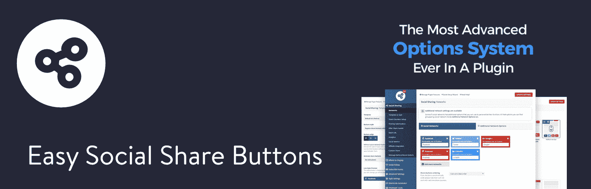](https://codecanyon.net/item/easy-social-share-buttons-for-wordpress/6394476)

Easy Social Share Buttons for WordPress plugin

插件提供了几种样式。例如，它提供了一个 Mashable 风格和一个 Upworthy 风格，允许您模仿这些类型的网站。随着后查看计数器，精彩的社交分享分析，以及所谓的订户助推器，你不能错过 WordPress 插件的简单社交分享按钮。我们还发现插件开发者对评论和标签非常敏感。

#### 为什么你应该考虑这个 WordPress 社交媒体插件

*   它的价格不到 20 美元，但是它提供了比大多数其他优质 WordPress 社交媒体插件更多的功能。
*   你可以链接到你的社交媒体档案。
*   它可以让你显示社交媒体分享的计数器和在社交媒体上关注你的人数。(包括推特分享)
*   在你的博客文章中创建可共享的引用。
*   它有一个简单的按钮，让用户订阅你的电子邮件简讯。
*   分享你的热门社交帖子，让更多人阅读你的内容。
*   查看社交分析和指标，了解哪种类型的内容效果最好。对您的社交按钮位置进行 A/B 对比测试。
*   从 50 多个社交网络按钮、28 个显示位置、50 个模板和 25 个引人注目的动画中进行选择。

#### 可能的缺点

*   有些人可能会认为安装插件的第一阶段是一件苦差事。这是一个相当强大的插件，但其他插件从一开始就更容易配置。

### 2.诺瓦舍

Novashare 是 WordPress 的一个快速、轻量级的社交分享插件，不会降低你网站的速度。它是从简单性和考虑到[性能的基础上发展起来的](https://kinsta.com/learn/speed-up-wordpress/)，以增加你的股份。

[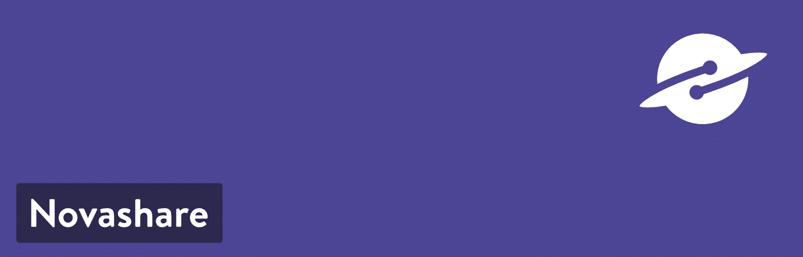](https://kinsta.com/wp-content/uploads/2017/10/novashare-wordpress-plugin.png)

Novashare WordPress plugin

它的一大优点是，您可以在几分钟内启动并运行。没有任何膨胀或一千个不同的选项，你必须通过排序。它可以跨所有设备(移动设备和桌面设备)扩展，并允许您在任何需要的地方设置断点。

这是一个高级插件，单个许可证的价格从 29.95 美元开始。

#### 为什么你应该考虑这个 WordPress 社交媒体插件

*   这个插件是超级轻量级的，前端只有 5 KB，使用内嵌的 SVG 图标(没有第三方库)。
*   你可以显示来自 [Twitter](https://kinsta.com/blog/twitter-marketing/) 、[脸书](https://kinsta.com/blog/facebook-marketing/)、 [Pinterest](https://kinsta.com/blog/pinterest-marketing/) 、Buffer 和 15 个以上不同社交网络图标的分享数。
*   很容易选择在哪里显示分享按钮(帖子、页面、自定义帖子类型)或使用[短代码](https://kinsta.com/blog/wordpress-shortcodes/)。
*   Novashare 使用一种有趣的方法，根据内容的修改日期来更新分享数。你可以改变刷新率，还有一个过滤器，开发者可以传入任何他们想要的值。不在乎股份数？如果没有启用份额计数，就不会进行 API 调用。
*   易于使用的用户界面。他们利用了原生的 WordPress 样式。这使得直接进入并开始配置设置变得很快。
*   [用快速改变颜色、形状和大小的选项来匹配您网站的品牌](https://kinsta.com/blog/how-to-customize-wordpress-theme/)。
*   如果您关心数据，可以添加和自定义 UTM 参数并启用链接缩短。
*   无限许可证支持 [WordPress 多站点](https://kinsta.com/wordpress-multisite-hosting/)设置。

#### 可能的缺点

*   这是一个高级插件，所以没有免费版本可以尝试。
*   由于该插件侧重于简单性和性能，它可能不会提供其他社交媒体插件提供的所有高级选项。

### 3.社交哈巴狗

社交 Pug 是由 DevPups 的团队开发的。他们还创建了 Opt-in Hound，让你建立自己的电子邮件列表。除此之外，他们还帮助共同开发仓库上的其他用户注册和会员插件。所以当涉及到你的 WordPress 网站的社交和用户互动时，这就是这些人所做的！

[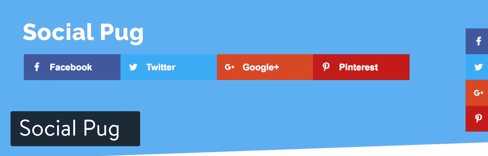](https://wordpress.org/plugins/social-pug/)

Social Pug WordPress plugin

社交 Pug 目前有超过 40，000 个活跃安装，令人印象深刻的 5 个五星评级。你可以自己查看评论。人们喜欢这个插件，因为它是轻量级的，不会拖慢你的网站，如果与其他更大的插件相比，它有足够的功能来满足你的需要。他们还有一个提供更多功能的高级版本。
T3】

#### 为什么你应该考虑这个 WordPress 社交媒体插件

*   这个插件是非常快速和轻量级的。
*   用户界面和图标有一个伟大的现代设计。
*   包括社交分享计数(是的，Twitter 也包括在内)
*   提供不同的位置，如内嵌和浮动

#### 可能的缺点

*   你可能想要的一些好选项，如移动共享按钮、UTM 和链接缩短只在高级版本中提供。
*   一些替代插件提供了更多的社交媒体网络。

### 4.分享狂

作为一个 WordPress 网站的所有者，你可能总是在寻找新的机会来吸引你的读者。Shareaholic 是一个 WordPress 插件，被成千上万的网站使用，附带一套网站参与工具(分享按钮、相关帖子、关注按钮、Cookie 同意和分析)。你可以在这里阅读我们的详细评论: [Shareaholic Review:一套吸引观众的 WordPress 工具](https://kinsta.com/blog/shareaholic-review/)

[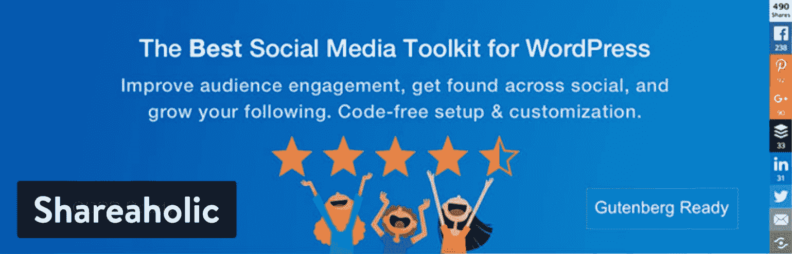](https://wordpress.org/plugins/shareaholic/)

Shareaholic WordPress plugin

Shareaholic 允许你添加浮动和内容分享按钮，以及个人图片上的分享按钮和社交关注按钮的选项。每个位置都有自己的一系列详细设置，可以打开分享计数，选择特定的社交网络等等。

#### 为什么你应该考虑这个 WordPress 社交媒体插件

*   它没有增加页面加载时间:根据测试，它只增加了 14 毫秒的加载时间。
*   100+免费社交整合，包括微信和 WhatsApp。
*   Pinterest 特有的高级控件。
*   隐私功能有助于 GDPR 合规性。
*   谷歌官方分析技术合作伙伴。
*   社交分享计数恢复。
*   可选的货币化选项。
*   品牌网址缩写。

#### 可能的缺点

*   没有点击发微博。
*   对于 WordPress 的初学者来说，大量的功能和设置可能会让他们感到不知所措

### 5.财政司司长海报

[FS 海报](https://www.fs-poster.com/)社交媒体自动海报让您扩大在线社区的规模，增加活跃联系的人数。这将导致你的 WordPress 内容的自动传播。

营销人员能够自动发布他们的博客，重新发布已经发布的材料，批量调度几篇文章，并通过使用社交媒体调度程序直接在最著名的社交网络上分发个人文章。

它让用户能够直接从 WordPress 平台内部提交博客照片、信息图表、视频和其他内容到可视化分享网络上，让用户可以可视化地分享博客文章。FS 海报是一个免费增值插件。FS 海报的[高级版在 CodeCanyon 上是 45 美元。](https://codecanyon.net/item/fs-poster-wordpress-auto-poster-scheduler/22192139)

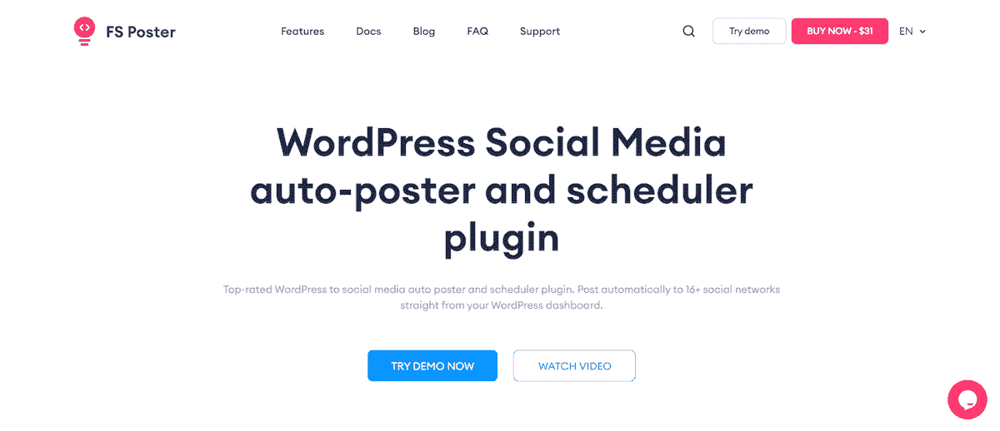

FS Poster

#### 为什么你应该考虑这个 WordPress 社交媒体插件

*   FS Poster 是一个社会化媒体自动发布插件，允许你从 WordPress 的帖子中安排和自动发布你的博客到 16 个社会化媒体网络。
*   FS Poster 使你能够安排和分发定制的项目，例如照片和其他媒体，而不需要在 WordPress 中创建帖子。
*   你将能够在 16+1 个不同的社交网络上分享你的内容(脸书、Twitter、Instagram、Linkedin、Pinterest、Reddit、Tumblr、OK.ru、OK.ru、Telegram、Medium、Google Business Profile、基于 WordPress 的网站、Plurk、Blogger、Discord)
*   FS Poster 将允许您与其他用户共享您的自定义帖子类型。
*   你将能够使用 TinyURL 或 Bitly 等服务来缩短你的帖子的 URL。
*   你将能够向每个社交网络添加无限数量的账户、页面、群组、社区和其他功能。
*   你可以通过使用不同的关键词，以特定于每个社交媒体平台的方式个性化你的帖子。
*   RTL 兼容性意味着从右向左书写的语言用户将更容易操作插件。

#### 可能的缺点

*   FS Poster Lite 是 FS Poster 的免费版本，功能有限，每天发布 5 篇帖子。

### 6.社交媒体分享按钮和社交分享图标(终极分享)

[社交媒体分享按钮&社交分享图标](https://wordpress.org/plugins/ultimate-social-media-icons/)插件有一个很长的名字，但它足够简单和直观，可以成为你的主要社交媒体插件。该插件包括社交按钮，用于链接到你的账户，让人们分享你的文章和页面。超过 200 个社交媒体平台覆盖了这些按钮，包括 YouTube、脸书、Twitter 和 Instagram。你可能使用这个 WordPress 社交媒体插件的主要原因之一是，如果你试图找到一个高度定制的设计。例如，一个关于猫的博客可以选择看起来像猫的模板按钮。

[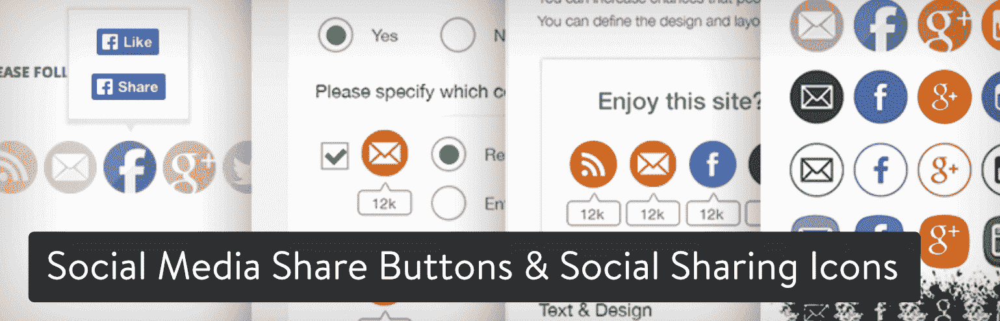](https://wordpress.org/plugins/ultimate-social-media-icons/)

Social Media Share Buttons & Social Sharing Icons WordPress plugin

显然，不是每个主题都会通过这个插件提供，但是你至少可以安装它，看看有哪些选项可用，然后决定是否保留它。我喜欢这个社交插件的另一个原因是，你可以在按钮的位置上发挥创意。您可以决定在某些页面上显示按钮，而在其他页面上隐藏它们。它还允许您更改边距，并从粘性和浮动按钮等效果中进行选择。大多数基本功能都是免费版本，但有一个高级插件，目前售价为 25 美元一次性费用。

#### 为什么你应该考虑这个 WordPress 社交媒体插件

*   就按钮可见性而言，这是一个更加可定制的插件。例如，您可以决定在用户看到按钮后隐藏它们。
*   人们不必离开你的网站去关注你的社交网页。
*   有些设计风格非常独特，给你一些创造性的选择，让你的网站看起来更有趣。
*   这个插件提供了一些罕见的按钮，比如商业促进局、 [Github](https://kinsta.com/knowledgebase/what-is-github/) 和 Xing。

#### 可能的缺点

*   对于免费版，你不会得到比基本建议更多的东西。最好的支持是在你购买高级插件时提供的。
*   没有办法设定社交分享或粉丝数量的最小值。

### 7.社交媒体分享按钮| MashShare

如果你读过 Mashable 网站，你就会知道它是可共享内容的中心。社交媒体按钮是该系统的重要组成部分，因此[社交媒体共享按钮| MashShare](https://wordpress.org/plugins/mashsharer/) 插件试图模仿 Mashable 上正在做的事情。MashShare 插件有一个免费增值模式，所以大部分基本功能都是免费的，但是你可以付费购买额外的附加组件来改进你自己的工具集。有时这是一件好事，因为你不必为你不需要的功能支付任何现金。但是有时候开发者会把所有好的特性都从免费版本中去掉，要求你购买一些附加组件。

至于 MashShare，它为最流行的社交网络提供了分享按钮。它也相当动态和快速加载，所以它不会减慢你的网站。我喜欢这个插件的免费增值模式，因为你可能最终不需要支付任何费用。

[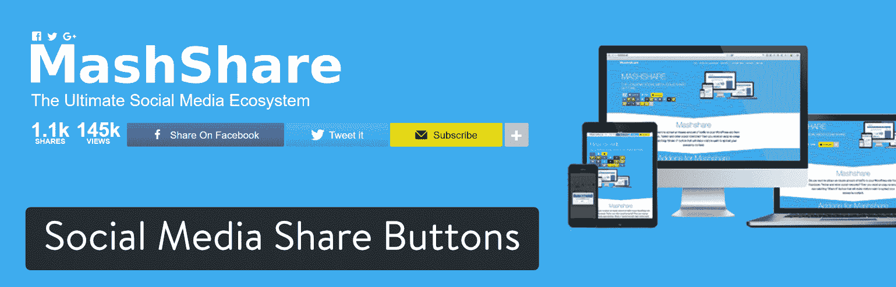](https://wordpress.org/plugins/mashsharer/)

Social Media Share Buttons WordPress plugin

如果你确实需要一个附加组件，它们的起价在 25 美元左右。一些附加组件包括:

*   Mashshare 社交网络插件
*   粘性共享栏
*   浮动工具条
*   Mashshare 响应式附加组件
*   谷歌分析集成
*   Mashshare 浏览量
*   Mashshare 开放图
*   Mashshare LikeAfterShare
*   ShortURLs 集成
*   VideoPost Popup
*   点击发布推文

#### 为什么你应该考虑这个 WordPress 社交媒体插件

*   这是 WordPress 仅有的带有附加组件的社交媒体插件之一。因此，您可以选择您想要的功能，而不是为一批您可能最终不会使用的功能支付全价。
*   该插件内置了缓存功能，可以快速发送按钮。
*   过滤器和动作可用于更高级的开发。
*   短码允许你在网站的任何地方放置社交媒体按钮。

#### 可能的缺点

*   常用的共享按钮有些有限，所以如果你想要更多，你可能需要支付一个附加组件。
*   后端有些混乱。有很多设置需要配置，所以初学者可能会感到害怕。
*   有一个虚假的股票计数功能。所以你基本上可以骗你的用户。我想这可能会被一些人视为优势，但对我来说这似乎是肮脏的。

### 8.社交媒体飞行图标|浮动社交媒体图标

社交媒体飞行图标插件提供了 30 种不同的按钮风格供你测试。其中一些非常独特，像心形或瓶盖，而另一些则是扁平的现代设计，覆盖了大多数行业。突出的特点是飞行动画，当用户登陆你的网站时吸引他们的注意力。我不确定这些动画是否能提高转化率，但它们看起来确实很有趣。

## 注册订阅时事通讯

### 想知道我们是怎么让流量增长超过 1000%的吗？

加入 20，000 多名获得我们每周时事通讯和内部消息的人的行列吧！

[Subscribe Now](#newsletter)

[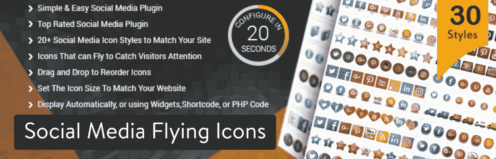](https://wordpress.org/plugins/floating-social-media-icon/)

Social Media Flying Icons | Floating Social Media Icon WordPress plugin

像这样的插件，最好安装一下，看看提供了哪些按钮样式。为你的社交分享按钮找到合适的外观是至关重要的，所以你可以快速安装和卸载插件，只是为了检查设计。

#### 为什么你应该考虑这个 WordPress 社交媒体插件

*   设计是丰富的，有创造性的选择，如卡车和电脑。
*   您可以直接从仪表板调整图标大小。
*   使用拖放编辑器改变社交媒体按钮的顺序。
*   如果某个社交媒体网站不受支持，您可以添加自定义图标。
*   浮动工具允许您在页面上选取开始位置和结束位置。
*   短码可以帮助你在任何你想要的地方插入社交媒体按钮。例如，你可以在一篇博文的中间放置一些按钮。

#### 可能的缺点

*   该插件只有链接到你的社交媒体账户的图标。如果你需要共享按钮，去别处看看。
*   有些人可能会觉得浮动效果很烦人。
*   在你选择了一个主题之后，就没有多少其他的定制选项了。

### 9.WordPress 社交分享、社交登录和社交评论插件——超级社交者

如果你有兴趣在一个解决方案中获得你所有的社交需求，试试 [WordPress 社交分享、社交登录和社交评论插件](https://wordpress.org/plugins/super-socializer/)。例如，一个在线商店可以要求顾客使用脸书登录。然后，用户将能够在 Twitter 上分享产品。最后，他们可以用脸书在你的博客上发表评论。

[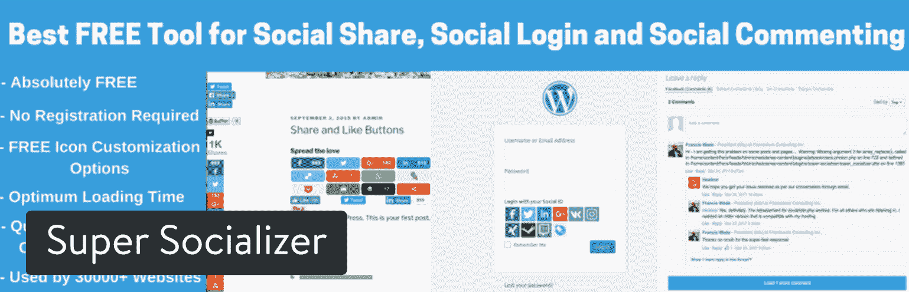](https://wordpress.org/plugins/super-socializer/)

Super Socializer WordPress plugin

这是一个完全免费的插件，但是你可以选择安装一些额外的插件。例如，你需要一个 10 美元的插件来修改脸书的评论。这确实是唯一一个看起来像是必需的附加组件(至少如果你计划拥有一个带有脸书评论的博客的话)，但是这里有一些其他的附加组件供你选择:

*   脸书评论通知程序
*   社交分享 myCRED 整合
*   社交登录 myCRED 集成
*   分享社交分析
*   Mailchimp 订阅
*   恢复社交分享计数

#### 为什么你应该考虑这个 WordPress 社交媒体插件

*   你会收到三个打包成一个插件的社交模块。
*   这些附件价格合理，并且允许您选择附加功能。例如，您可以在您的社交登录区域放置一个 MailChimp 订阅按钮。
*   大约有 90 个社交网络提供了社交分享按钮。
*   如果你发送电子邮件，开发人员会提供安装支持。

#### 可能的缺点

*   没有链接到你的社交媒体账户的功能。只是共享按钮。
*   默认的设计没有那么现代或有创意。此外，他们几乎给你太多的定制设置。我宁愿有多个模板，我可以从中选择，并立即在我的网站上激活它们。

### 10.复兴旧邮，复兴网络

Revive Social 是一家有两个插件的公司，我们觉得很有趣。其中一个叫做 [Revive Old Post](https://revive.social/plugins/revive-old-post/) ，它会自动将你的一些旧内容分享给社交网络。另一个叫做 [Revive Network](https://revive.social/plugins/revive-network/) ，它从其他新闻来源和博客中提取有趣的文章，并自动分享到你自己的社交页面。

[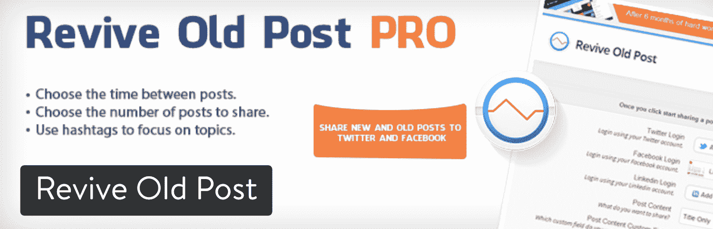](https://revive.social/plugins/revive-old-post/)

Revive Old Post WordPress plugin

复活旧帖子插件每年起价 75 美元，如果你需要支持无限的站点，价格会涨到每年 299 美元。Revive Network 插件起价为每年 49 美元，对营销人员来说则高达每年 399 美元。复兴旧帖有一个[免费版本，但是相当有限。](https://wordpress.org/plugins/tweet-old-post/)

#### 为什么你应该考虑这些 WordPress 社交媒体插件

*   恢复旧帖子使您的旧博客帖子保持相关性，同时也为您的社交页面提供持续的内容流。
*   Revive 网络还提供了一种自动化的方式来保持你的社交追随者的兴趣。主要的区别在于，Revive Network 插件分享的是其他来源的文章，而不是你自己的博客。
*   您可以设置自定义时间表，以便您的帖子每周被共享一定次数。
*   一次分享多篇帖子。
*   你可以与谷歌分析整合，看看你的社交帖子表现如何，以及它们是否会把用户送到你的网站。

#### 可能的缺点

*   两个插件的定价都太高了。
*   恢复旧帖子的免费版本功能有限。例如，您不能自定义共享消息或拥有多个社交帐户。我无法想象经营一个博客而不想要那些功能。
*   该插件与 URL 缩短器兼容，但我更希望插件中内置一个缩短工具。

### 11.Instagram Feed

Instagram 是你网站上最受欢迎的展示网络之一。这可能与漂亮的滤镜有关，让你的照片看起来更有趣。不管怎样，在 Instagram feed 插件的帮助下，你可以把你的帖子加入 Feed。

Struggling with downtime and WordPress problems? Kinsta is the hosting solution designed to save you time! [Check out our features](https://kinsta.com/features/)

[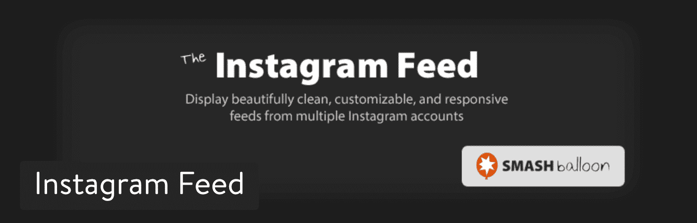](https://wordpress.org/plugins/instagram-feed/)

Instagram Feed WordPress plugin

这个插件非常简单明了，看看你如何链接你的 Instagram 页面，决定你想让 feed 在你的网站上显示在哪里，然后激活它[，这样图片](https://kinsta.com/blog/protect-images/)就会显示在网站上。一个[专业版](https://smashballoon.com/instagram-feed/)售价 39 美元，但只有当你对弹出式照片灯箱、标签过滤或照片标题支持感兴趣时，你才需要它。

#### 为什么你应该考虑这个 WordPress 社交媒体插件

*   这是一个很棒的插件，可以给你的网站添加一些图像。它还让人们体验到你在 Instagram 上分享的内容，促使人们关注你。
*   从宽度到高度，从背景色到图像间距，你都可以自定义。
*   你不仅限于一个 Instagram feed。
*   在页面底部有一个“关注 Instagram”按钮。
*   如果你愿意，你可以定制 CSS 或者 JavaScript。
*   您可以在提要顶部添加自己的标题。

#### 可能的缺点

*   照片说明仅在专业版中显示。因此，免费版本更像是一个图片画廊，而不是一个真正的社交网站。
*   该插件不支持任何其他社交网络订阅源。
*   对于这样一个基础插件来说，设置页面出奇的长，令人生畏。

### 12.相扑社交应用

相扑品牌在博客和电子商务领域获得了各种各样的欢迎，这都是因为它的免费营销工具套件。尽管相扑最强大的插件涉及电子邮件营销，但相扑分享和 T2 图片分享都允许一些有趣的社交分享选项。

[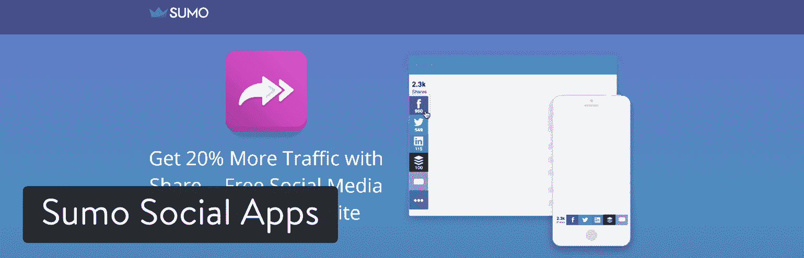](https://sumo.com/app/share)

Sumo Social Apps WordPress plugins

相扑分享作为你的基本分享模块，社交分享按钮显示在你的内容旁边。共享按钮是普遍有用的，因为它们看起来既专业又现代。我认为这些分享按钮是你能找到的最好看的。图像共享插件有点不同。它在你网站的所有图片上放置社交分享按钮。因此，当有人分享到脸书或 Pinterest 时，该图片会作为特色图片直接插入。

#### 为什么你应该考虑这些 WordPress 社交媒体插件

*   相扑带给你的不仅仅是社交媒体的选择。例如，整个套件提供电子邮件营销、报价突出显示和分析。
*   相扑分享按钮是你能找到的最基本、最漂亮的按钮。而且它们是免费的。
*   您可以下载您的历史共享数据。
*   共享按钮有一个智能功能，可以在独特的页面上突出显示最有效的共享按钮。例如，你的一个页面可能在脸书上被分享得更多，所以把脸书按钮放在其他页面前面是有意义的。

#### 可能的缺点

*   大多数人不熟悉通过图片分享者进行的社交分享。你很可能会通过一个普通的社交按钮获得更多的分享。
*   除非你选择专业版，否则你会被相扑品牌所困。
*   免费版中没有移动首选项。

### 13.WordPress 社交储物柜

WordPress 的 Social Locker 阻止人们访问你网站上的某些内容，除非他们完成了某种社交任务。例如，他们可能会在脸书上发布一些东西或喜欢你，以展示你的博客帖子或电子书。

[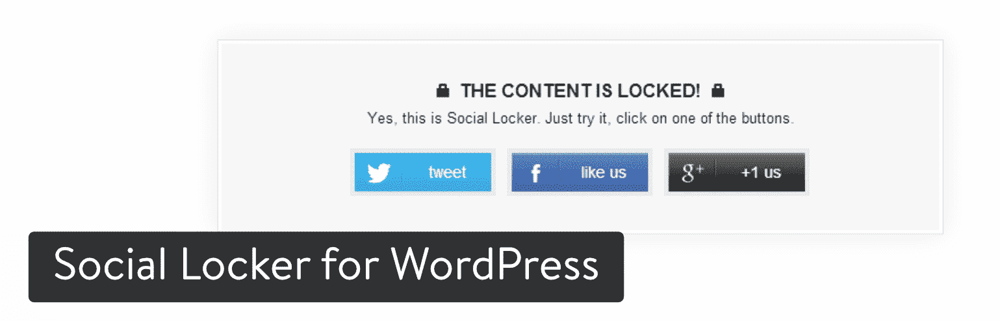](https://codecanyon.net/item/social-locker-for-wordpress/3667715)

Social Locker for WordPress plugin

像脸书这样的社交网络并不总是认可这样的锁定内容，但他们不能真正控制你在自己的网站上做什么。我最喜欢你常规博文之外的高质量内容。因此，如果你组织了一场精彩的网上研讨会或电子书，你可能更需要社交分享和关注，而不是金钱。

#### 为什么你应该考虑这个 WordPress 社交媒体插件

*   这是增加你的份额和社交关注的好方法。
*   它有一些非常棒的 3D 效果。
*   你实际上拥有高质量的粉丝，因为他们对隐藏的内容感兴趣。
*   该插件支持各种社交网络，如脸书、推特和 YouTube。

#### 可能的缺点

*   这种形式的内容锁定使人们很容易关注你，获取内容，然后立即取消关注。
*   您可能会发现一些用户对内容锁定感到恼火。
*   有一个“隐藏会员”工具，但是它没有考虑到已经是会员但没有登录网站的人。

### 14.猕猴桃的社会份额

Kiwi Social Share 由 Macho Themes 的团队开发。他们有创建 WordPress 主题的悠久历史。它的设计考虑了易用性和速度。

[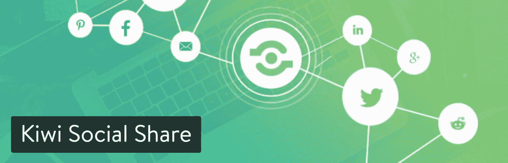](https://wordpress.org/plugins/kiwi-social-share/)

Kiwi Social Share WordPress plugin

Kiwi Social Share 目前拥有超过 20，000 个活跃安装，评分为 4.5 分(满分为 5 星)。如果你通读评论，你会发现人们真的很喜欢它的简单易用。您可以在内容前、内容后或两者之前快速显示您的社交媒体按钮。控制插件设置的仪表板也有一个很棒的 UI。

#### 为什么你应该考虑这个 WordPress 社交媒体插件

*   如果你关心速度，这个插件加载速度很快！
*   一个简单的社交插件，可以融入你网站的当前设计。
*   开发者的大力支持。每个支持论坛票证都已解决。这是罕见的。
*   一种更具未来感的方式，转变风格。
*   如果你需要分享计数，包括 Twitter。

#### 可能的缺点

*   可能没有你想要的所有选项。
*   还没有小部件，但他们即将到来。

### 15.社会战争

[社交战网](https://warfareplugins.com/)来自战网外挂公司。这是一个让你的帖子和页面被分享的简单而时尚的解决方案。用户喜欢社交战的主要原因是因为按钮很吸引人。我已经测试了几十个 WordPress 社交媒体插件选项，结果发现这些设计要么已经过时，要么过于突出。事实是，大多数网站都需要现代的按钮，而不需要炫目的东西。

[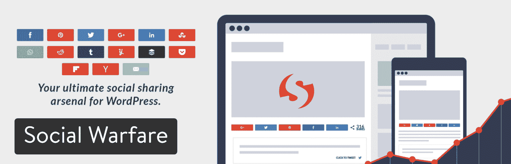](https://warfareplugins.com/)

Social Warfare WordPress plugin

《社会战争》的定价从每年 29 美元开始，但是这限制了你只能在一个网站上使用这个插件。五个网站的年费上涨到 125 美元，十个网站的年费上涨到 250 美元。这多少有些道理，但最好是一次性付款，而不是每年一次。不管怎样，你是在为插件的美观和[速度买单，因为它不会看起来很紧张，也不会导致你的页面加载延迟。简而言之，你正在获得更专业的外观。](https://kinsta.com/blog/website-speed-test/)

它到底有多快？这是我们进行的速度测试。它只加载三个脚本，它们都小于 10 KB。这是在启用社交分享计数的情况下。这绝对是市场上最快的 WordPress 社交媒体插件之一！

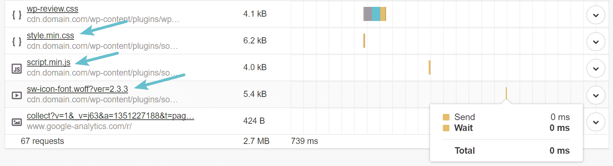

Social Warfare scripts

#### 为什么你应该考虑这个 WordPress 社交媒体插件

*   这是视觉效果更好、速度更快的 WordPress 社交媒体插件之一。
*   该插件提供了超过 5000 种风格组合，使其高度可定制，并有助于标记您的社交按钮。
*   你可以直接上传图片到 Pinterest。
*   自定义每当有人点击 Tweet 按钮时出现的消息。
*   从你的博客文章中引用可分享的内容。
*   展示可共享的大型 Twitter 卡片，提示用户阅读报价，然后在 Twitter 上分享。
*   这个插件有短代码，可以在你网站的任何地方插入分享按钮。
*   有一个内容保护模块，锁定你自己的社会行动呼吁。这可以防止用户更改脸书和 Twitter 帖子中的文本。
*   仅在达到最小阈值时显示社交分享数。(包括推特分享)

#### 可能的缺点

*   该插件需要每年定期支付。

## 我们关于最佳 WordPress 社交媒体插件的结论

如前所述，你可能最终只使用一个 WordPress 社交媒体插件，或者你可能会发现有几个插件适用于你的网站。不管怎样，你有很多选择，所以我建议从简单的社交分享或社交战争开始，为你的用户准备好分享按钮。共享按钮至关重要。然后你可以实现其他东西，比如链接到你的社交页面、社交内容库和 feeds。如果脸书是你首选的社交媒体，请务必阅读我们的最佳 WordPress 脸书插件列表。

如果你对最好的 WordPress 社交媒体插件有任何疑问，或者如果你能想到一些其他很好的解决方案，请在下面的评论区告诉我们。

* * *

让你所有的[应用程序](https://kinsta.com/application-hosting/)、[数据库](https://kinsta.com/database-hosting/)和 [WordPress 网站](https://kinsta.com/wordpress-hosting/)在线并在一个屋檐下。我们功能丰富的高性能云平台包括:

*   在 MyKinsta 仪表盘中轻松设置和管理
*   24/7 专家支持
*   最好的谷歌云平台硬件和网络，由 Kubernetes 提供最大的可扩展性
*   面向速度和安全性的企业级 Cloudflare 集成
*   全球受众覆盖全球多达 35 个数据中心和 275 多个 pop

在第一个月使用托管的[应用程序或托管](https://kinsta.com/application-hosting/)的[数据库，您可以享受 20 美元的优惠，亲自测试一下。探索我们的](https://kinsta.com/database-hosting/)[计划](https://kinsta.com/plans/)或[与销售人员交谈](https://kinsta.com/contact-us/)以找到最适合您的方式。