# 狂野有趣的 WordPress 统计数据和事实(2022)

> 原文：<https://kinsta.com/blog/wordpress-statistics/>

自从 2003 年首次推出以来，WordPress 已经走过了漫长的道路——帮助定义这个强大软件工具的 WordPress 统计数据也是如此。

世界上最受欢迎和使用最广泛的内容管理系统现在为互联网上 43.3%的网站提供支持，但是除了最忠实的 WordPress 用户之外，很少有人知道它是如何开始的。

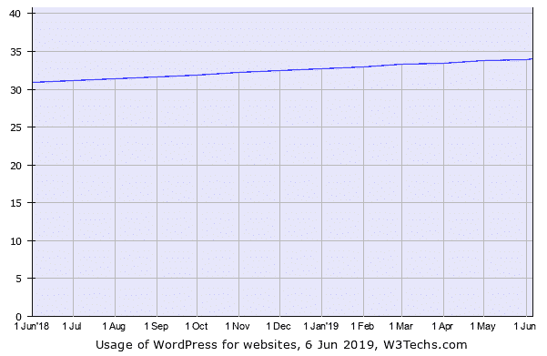

WordPress statistics: historical trend

## WordPress 年统计数据(仅限 Juiciest)

WordPress 是世界上最受欢迎的内容管理系统，为互联网上 34%的网站提供支持。最重要的是:

*   WordPress 在 CMS 市场占有 60.8%的市场份额
*   WordPress 为 14.7%的世界顶级网站提供支持
*   使用 WordPress 每天创建 500 多个网站，而在 Shopify 和 Squarespace 这样的平台上每天只有 60-80 个
*   WordPress 插件目录有 55，000 多个插件
*   WooCommerce 为全球 100 万家电子商务网站中的 22%提供支持

Support

这就是 WordPress 的故事:

WordPress 最初是由马特·莫楞威格和迈克·利特尔创建和开发的，当现有的博客软件 b2/cafelog 被其开发者停止使用时，他们被激励着行动起来。

穆伦韦格和利特尔都清楚，需要一个更优雅的个人出版系统。尽管 WordPress 最初是基于 b2/cafelog、Mullenweg 和 Little——以及更多的开源贡献者！——从那以后，我对 WordPress 进行了重大的开发，使它与 b2/cafelog 区别开来。

WordPress 建立在 [PHP](https://kinsta.com/blog/php-benchmarks/) 和 [MySQL](https://kinsta.com/knowledgebase/what-is-mysql/) 之上，并以 [GPLv2](https://kinsta.com/learn/wordpress-gpl/) 授权，这意味着[任何人都可以自由使用和修改](https://kinsta.com/blog/is-wordpress-free/)。据估计，开发 WordPress 背后的全部合作努力花费了 151 人的时间，估计花费超过 800 万美元。

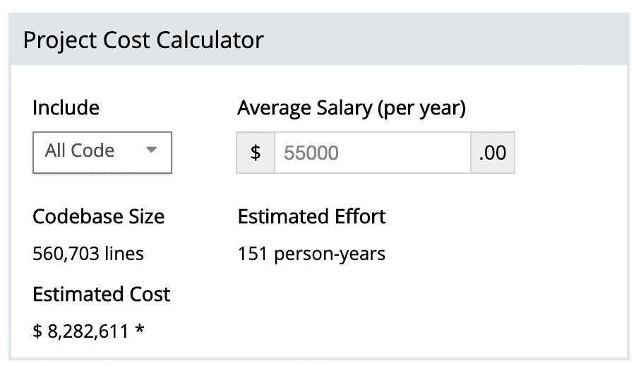

> 需要在这里大声喊出来。Kinsta 太神奇了，我用它做我的个人网站。支持是迅速和杰出的，他们的服务器是 WordPress 最快的。
> 
> <footer class="wp-block-kinsta-client-quote__footer">
> 
> 
> 
> <cite class="wp-block-kinsta-client-quote__cite">Phillip Stemann</cite></footer>

[View plans](https://kinsta.com/plans/)

## WordPress.org 和 WordPress.org:有什么不同？

术语“WordPress”在指两种软件变体时经常互换使用。也就是说，在为你的项目选择理想的平台之前，你需要了解 WordPress.com 的[和 WordPress.org 的](https://kinsta.com/blog/wordpress-com-vs-wordpress-org/)之间的*显著的*差异。

WordPress.org 是我们将在本文中提到的开源内容管理系统，而 WordPress.com 是另一个流行的 T2 博客平台，其基本功能可以免费使用。

虽然 WordPress.com 使用 WordPress.org 核心软件，这是他们的相似之处结束。

WordPress.com 是完全盈利的，而 WordPress.org 不是。有了 WordPress 计划，用户可以选择让 WordPress 处理网站运营的技术方面——包括主题和插件的安装以及将域名路由到你的博客。

然而，WordPress 不像 WordPress 那样可定制和灵活，在那里你必须自己打理一切(包括[找到一个网络主机](https://kinsta.com/plans/)和[安装 WordPress 软件](https://kinsta.com/knowledgebase/manually-install-wordpress/))。但是这种自由是有代价的，因为这意味着你还必须照顾拥有一个网站的不那么有趣的方面，比如如果你的网站突然离线，那么[对](https://kinsta.com/knowledgebase/wordpress-repair-database/)网站维护进行故障排除。

对这两个 WordPress 平台之间的差异有了基本的了解，让我们来看看一些最有趣的支持使用 WordPress 作为内容管理系统(CMS)的 WordPress 统计数据。

## WordPress 使用统计

以下 WordPress 的统计数据集中在 WordPress 的市场份额和其他使用统计数据上。

WordPress 现在为 43.3%的网站提供服务，在内容管理系统市场上占有 65.1%的份额。

除了是最广泛使用的内容管理系统，WordPress 也是发展最快的。在线排名前 1000 万的网站中，每天有超过 500 个网站由 WordPress 提供支持(相比之下，每天有 60-80 个网站建立在托管平台上，如 [Shopify](https://kinsta.com/blog/shopify-alternatives/) 或 [Squarespace](https://kinsta.com/blog/squarespace-vs-wordpress/) )。

此外，WordPress 为全球 14.7%的顶级网站提供支持。

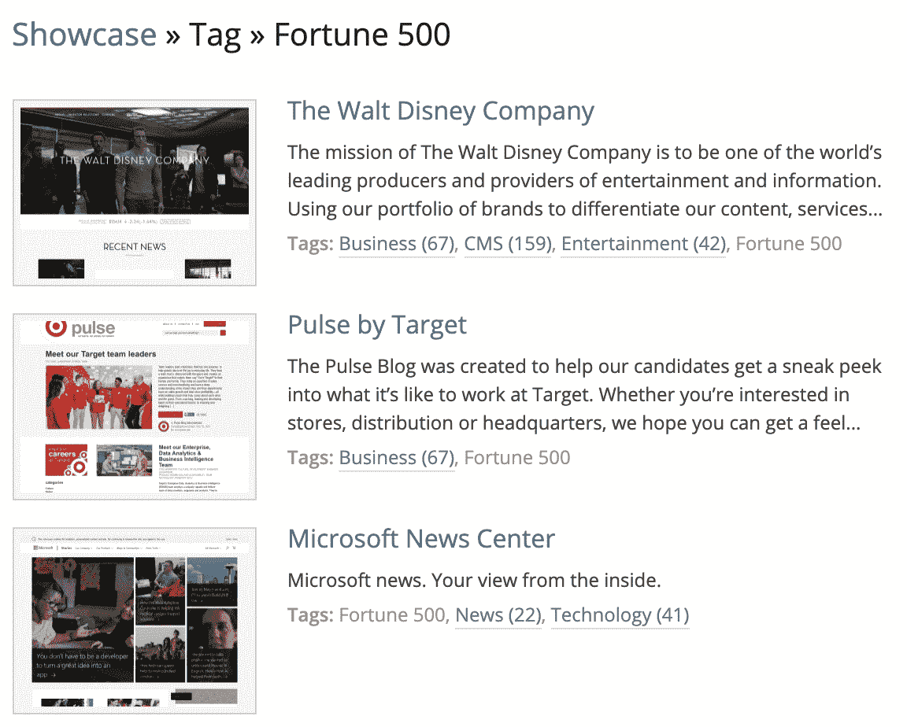

World’s top websites using WordPress

这些顶级网站包括纽约时报、Spotify、TechCrunch、白宫网站、BBC 美国频道，甚至还有脸书新闻编辑室！事实上，WordPress 可以很好地为所有这些不同的实体工作，这证明了它的灵活性。WordPress 可以有效地充当许多不同类型网站的后台，包括个人博客、新闻网站、[作品集](https://kinsta.com/blog/wordpress-portfolio-plugins/)和电子商务网站。

每秒钟大约有 17 篇博客文章发表在 WordPress 上，如果你怀疑 WordPress 的受欢迎程度，你要知道每月有 3700 万次关于 WordPress 的全球搜索。此外，[实时 WordPress 活动数据](https://wordpress.com/activity/)显示，每个月有超过 4.09 亿人浏览超过 200 亿个 WordPress 页面，有超过 7000 万条新帖子和 7700 万条新评论。

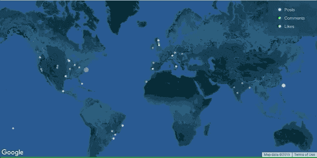

## WordPress 版本统计(重点是古腾堡)

下面的 WordPress 统计数据关注的是 WordPress 是如何随着时间而变化的。

在发布时，WordPress 正在运行 5.2 版本，超过 20%的用户已经将[更新到当前的 WordPress 版本](https://wordpress.org/about/stats/)。它已经被下载了 1600 多万次。

WordPress 5.2 download count (Image source: [WordPress.org download counter](https://wordpress.org/download/counter/))

然而，大约有四分之一的用户仍然在运行 4.9 版本。

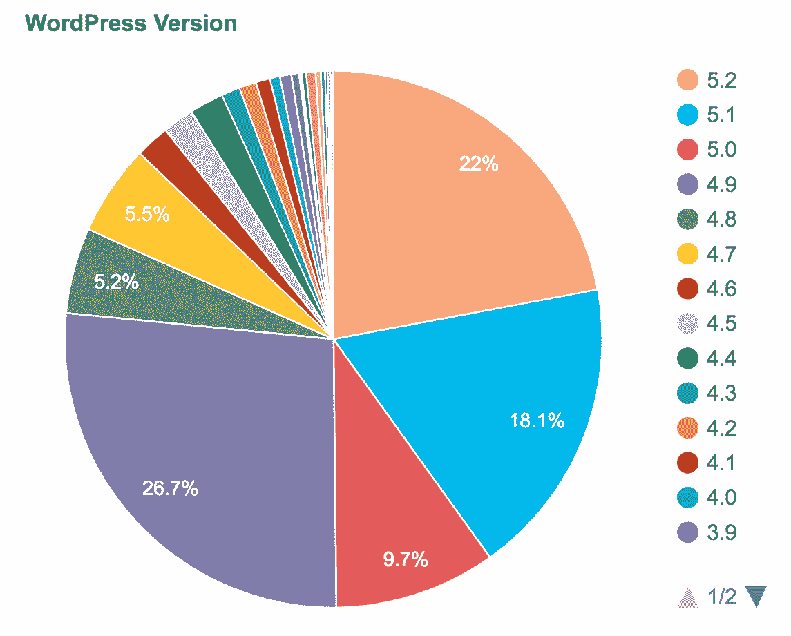

WordPress version and usage statistics

许多用户无法更新的原因可能与 WordPress 5.0 中引入的新的基于块的编辑器 [Gutenberg](https://kinsta.com/blog/gutenberg-wordpress-editor/) 有关。

Gutenberg 给 WordPress 可视化编辑器带来了自这个内容管理系统开始以来最大的变化。

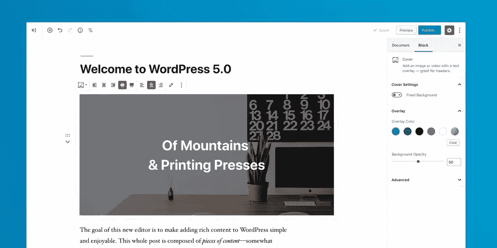

Gutenberg

自从[古腾堡被释放](https://gutenstats.blog/)以来，已经有:

*   古腾堡超过 1900 万活跃装置。
*   2400 万篇由古腾堡撰写的帖子(请注意，这些统计数据是由 Jetpack 在使用古腾堡创建的博客帖子上专门报告的，这意味着它们可能不代表全部数字)，每天有 157，000+篇由古腾堡撰写的帖子。

最受欢迎的古腾堡区块是段落区块，当人们使用古腾堡时，60%的时间都在使用它。 [WooCommerce Blocks](https://wordpress.org/plugins/woo-gutenberg-products-block/) 是专为古腾堡网站开发的插件，被超过 170，000 个网站使用(截至 2019 年 4 月；古腾堡于 2018 年 12 月发布)。

除了古腾堡，WordPress 的主要升级是每 152 天发布一次，每次发布都以一位爵士音乐家的名字命名。这是因为，根据[官方 WordPress 路线图](http://wordpress.org/about/roadmap/)，“WordPress 核心开发者共享对爵士音乐的热爱”。

WordPress 有 72 种语言版本，并且还在增加，71%的 WordPress 网站将英语设置为主要语言。

## 自动 WordPress 统计

以下 WordPress 的统计数据与 Automattic 相关，Automattic 通常被称为 WordPress 背后的公司，但这有点过于简单化了。公平地说，由于许多开源贡献者的工作，WordPress 在不断改进，他们在这个项目上花费的时间不一定得到补偿。

除了对 WordPress CMS 的贡献，Automattic 还参与了许多影响 WordPress 生态系统的项目，包括 Jetpack、WooCommerce、Simplenote、Akismet 和 Gravatar。

截至 2014 年 5 月，Automattic 的估值为 11.6 亿美元。它目前雇用了 873 名员工，在世界各地远程工作。这家公司的远程工作文化如此强大，以至于人们不再出现在它的旧金山办公室，Automattic 关闭了它。

关于远程工作的话题，Automattic 的最新项目之一是 [Happy Schedule](https://en.blog.wordpress.com/2019/04/01/happy-tools-the-future-of-work/) ，这是一系列被称为“快乐工具”的工具中的第一个——旨在帮助[远程团队](https://kinsta.com/blog/working-remotely/)。

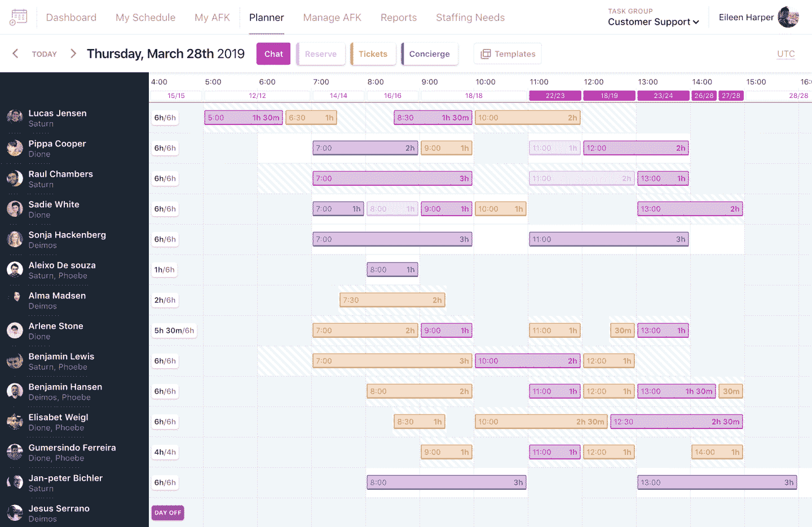

Happy Schedule, Automattic’s tool to plan 24/7 customer support

## WordPress 插件统计

这些 WordPress 的统计数据集中在插件上。插件扩展了 WordPress CMS 的基本功能，帮助用户根据他们独特的需求进行个性化设置。市场上有许多免费和付费的插件选项，让你可以根据自己的预算对 WordPress 进行修改。

在发布时，WordPress 插件目录上有超过 55，000 个插件,每天都有许多新的选项添加进来。考虑到 WordPress 插件目录上的所有内容，这些插件迄今为止总共获得了超过 10 亿次的下载！

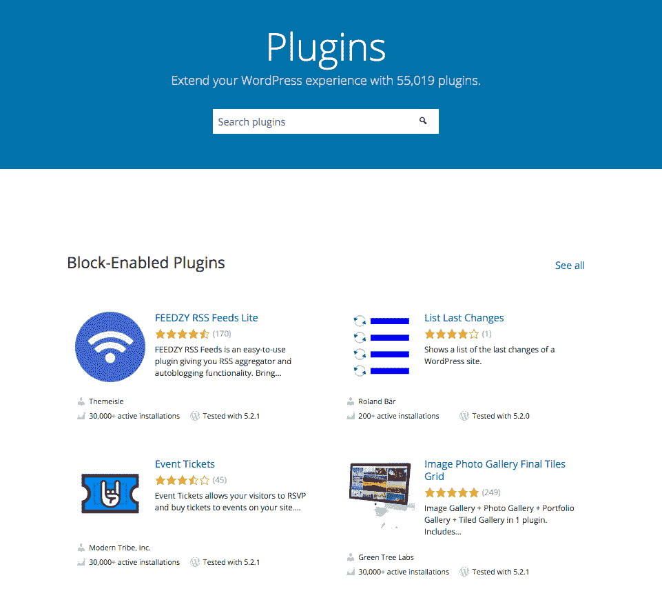

WordPress repository

在 2016 年 4 月 15 日至 2019 年 4 月 16 日收集的数据中，已经有[18262 个插件发布](https://www.ilovewp.com/an-analysis-of-18087-wordpress-org-plugins/)。这些插件中:

## 注册订阅时事通讯

### 想知道我们是怎么让流量增长超过 1000%的吗？

加入 20，000 多名获得我们每周时事通讯和内部消息的人的行列吧！

[Subscribe Now](#newsletter)

*   3%的人从未更新过*。*
*   仅最近三年发布的 30 个插件就有 10 万+的安装量。安装量最高的插件是[经典编辑器](https://kinsta.com/blog/disable-gutenberg-wordpress-editor/)，活跃安装量超过 400 万(这个数字肯定与古腾堡的缓慢采用有关)。紧随其后的是 [Elementor 页面生成器](https://kinsta.com/blog/wordpress-elementor/)，其[的活跃安装数超过 200 万](https://elementor.com/blog/2-million-active-installs/)。
*   约 57%的插件从未被评级([它们没有评论](https://www.matteoduo.com/review-to-install-ratio-wordpress-plugins/))。
*   76%的插件有主页链接。
*   47%的插件有捐赠按钮。

有史以来最受欢迎和最好的 WordPress 插件包括:

*   Yoast SEO :对于那些使用 WordPress 网站作为博客的人来说，这是必须的，因为它可以帮助你提高内容的[整体 SEO](https://kinsta.com/blog/what-does-seo-stand-for/) 分数。Yoast SEO 目前有超过 1.76 亿次下载。
*   [akis met](https://kinsta.com/blog/wordpress-spam-comments/#akismet-plugin):automatic 制作的一个插件，用于屏蔽垃圾评论。Akismet 目前有超过 1.33 亿次下载，可能是因为它每小时捕获大约[500 万条垃圾邮件](https://akismet.com/how/)！
*   Jetpack :另一个自动化产品，Jetpack 帮助你营销、设计和安全。Jetpack 有将近 1.2 亿次下载。
*   Wordfence 安全:这个插件有超过 1.21 亿的下载量，它通过添加一个[防火墙](https://kinsta.com/blog/what-is-a-firewall/)来帮助保护你的网站。Wordfence 也是一个很好的公司，可以跟踪关于 [WordPress 安全](https://kinsta.com/blog/wordpress-security/)的最新威胁的更新。
*   联系表格 7:这个插件允许你为你的站点创建简单的联系表格。它与 Akismet 相结合，以防止垃圾邮件，并有超过 1.12 亿次下载。

除了这些免费增值选项， [Visual Composer](https://kinsta.com/blog/wordpress-page-builders/#visual-composer) 和 [Slider Revolution](https://revolution.themepunch.com/) 是[最畅销的付费插件](https://skilled.co/resources/28-facts-probably-dont-know-wordpress-infographic/)。这可能与他们在 Envato 市场上预先打包了许多主题有关。

说到 Envato 市场， [CodeCanyon](https://codecanyon.net/) 是这家公司的插件部门。在 CodeCanyon 上，有超过 6000 个高级插件可供出售。CodeCanyon [上 80%的搜索集中在功能性](http://inside.envato.com/pressnomics/)，这意味着人们专门搜索支持[滑块](https://kinsta.com/blog/wordpress-slider/)的插件、日历、表格等等。

### woo 商务统计

另一个流行的 WordPress 插件是 WooCommerce，它为你的 WordPress 网站增加了电子商务功能。它为 WordPress 上超过 7000 万家电子商务商店提供支持，并且在使用电子商务技术的前 100 万家网站中[占 22%](https://kinsta.com/wordpress-market-share/#woocommerce)。

WooCommerce banner

像 WordPress 一样， [WooCommerce](https://kinsta.com/learn/woocommerce-guide/) 也是免费使用的，但是如果你想使用任何提供额外功能的 [300+ WooCommerce 扩展](https://kinsta.com/blog/woocommerce-extensions/)，比如产品变化样本和出售订阅的能力，你就必须付费。

与 WooCommerce 和 Shopify 竞争的 WordPress 电子商务市场的新挑战者是 [BigCommerce](https://kinsta.com/blog/woocommerce-alternative-bigcommerce/) ，它最近为 WordPress 推出了一个无头商务解决方案(请务必阅读:[关于用 Gatsby 和 WordPress 建立网站的介绍](https://kinsta.com/blog/gatsby-wordpress/))。在发布时， [BigCommerce WordPress 插件](https://wordpress.org/plugins/bigcommerce/)已经有 600 多个活跃安装，并且每天都在增长。

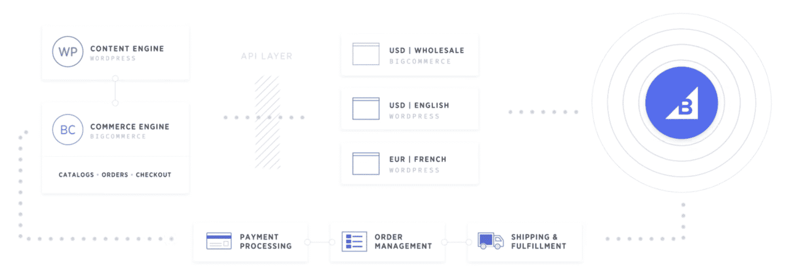

【big commerce plugin】

## WordPress 主题统计

这些 WordPress 统计数据集中在 [WordPress 主题](https://kinsta.com/best-wordpress-themes/)或者定义 WordPress 站点外观和显示的模板和样式表的集合上。

像插件一样，有免费和付费的主题。大多数 WordPress 主题都是由所见即所得(WYSIWYG)编辑器驱动的，这有助于用户在配置时实时看到变化。这个功能是由 Shane Melaugh 和 Paul McCarthy 引入 WordPress 的。

如果你是刚刚[入门](https://kinsta.com/knowledgebase/what-is-wordpress/)或者有简单的需求，可以在 WordPress 主题目录上免费下载很多 WordPress 主题，该目录每年都会发布免费的默认主题，用一个简单的标题代表发布年份(即。【二十】二十’)。最早的默认主题被简单地称为“[”和“默认”(或 Kubrick)。](https://www.elegantthemes.com/blog/editorial/from-kubrick-to-twenty-sixteen-a-history-of-wordpress-default-themes)

如果你有购买付费主题的预算，一些最受欢迎的网站包括 Envato Market(以前称为 ThemeForest)。

说到 Envato 市场，这个市场上有几十名设计师已经卖出了价值超过一百万美元的作品。事实上，每 5 秒钟就有一件商品在恩瓦托市场[出售。此外，Envato Market 上有超过 11，000 个主题，其中 70%的搜索围绕着利基主题。](https://envato.com/blog/milestone-celebrating-500m-community-earnings/)

我们喜欢 WordPress，就像你一样。这就是为什么我们使用了为 WordPress 优化的最棒的技术栈！[查看我们的托管计划](https://kinsta.com/plans/?in-article-cta)

Envato 市场上销售的热门主题包括:

*   [Avada](https://themeforest.net/item/avada-responsive-multipurpose-theme/2833226) :一款响应迅速的多功能主题，销量超过 50 万。
*   [X](https://themeforest.net/item/x-the-theme/5871901) :下载量超过 20 万的超快主题。
*   [Enfold](https://themeforest.net/item/enfold-responsive-multipurpose-theme/4519990) :又一个多用途主题，181000+下载量。

Envato Market 上 93%的销售额都是响应式主题，一个主题的平均成本是 59 美元。

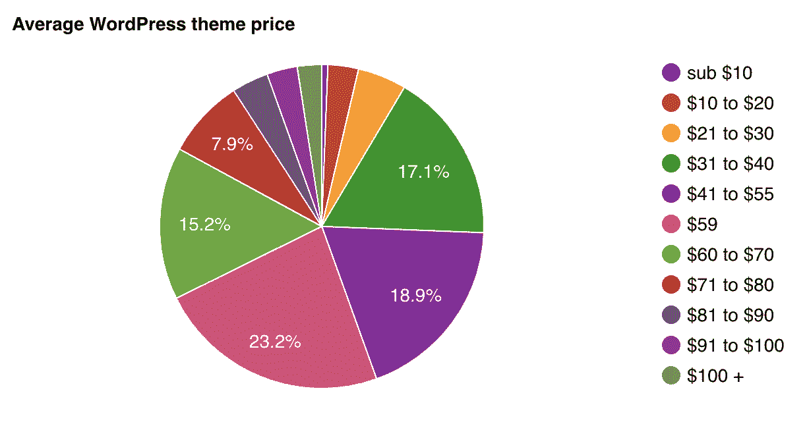

Average cost of a WordPress theme

如果你很容易对 WordPress 的主题设计感到厌烦，或者你是一个需要访问几个不同主题选项的网站开发者，主题订阅会员(如 TeslaThemes 或 Themes Kingdom 等公司)的平均年费为 145 美元。

当谈到所有 WordPress 主题时，Divi (6%)、Avada (4%)和 Genesis Framework (7%)是 T2 有史以来最受欢迎的主题。

如果你选择做一个完全定制的 WordPress 网站设计，预计花费在 [$500+到$ 52800+](https://kinsta.com/blog/wordpress-website-cost/)之间。

## WordPress 安全统计

这些 WordPress 统计数据与 WordPress 的整体安全性有关。

WordPress 通常被认为是安全的，但是它也有数据泄露的问题。由于它是最大和最受欢迎的 CMS，它也是最容易被黑客攻击的(阅读: [WordPress Hacked:当你的网站陷入困境时该怎么办](https://kinsta.com/blog/wordpress-hacked/)和[电子商务欺诈预防](https://kinsta.com/blog/ecommerce-fraud-prevention/))。

安全插件 Sucuri 报告称[2018 年 90%的清理请求](https://blog.sucuri.net/2019/03/hacked-website-trend-report-2018.html)来自 WordPress。

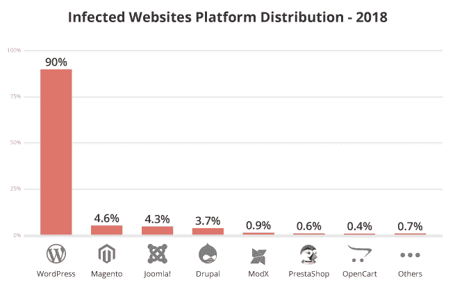

Infected platforms in 2018

最常见的 WordPress 恶意软件感染是后门、驾车下载、制药黑客、恶意重定向和[被盗密码](https://www.pandasecurity.com/mediacenter/adaptive-defense/most-common-tactics-among-cybercriminals/)。

根据各种消息来源:

*   41%的 WordPress 攻击是由托管平台的 [WordPress 上的漏洞引起的。](https://kinsta.com/wordpress-hosting/)
*   [52%的 WordPress 漏洞](https://www.keycdn.com/blog/wordpress-security/)与 WordPress 插件有关。
*   [互联网上 84%的安全漏洞](https://www.acunetix.com/websitesecurity/cross-site-scripting/)都是跨站脚本或 XSS 攻击的结果。
*   39%的 WordPress 漏洞是由于[跨站脚本(XSS)](https://ithemes.com/2016/01/14/understanding-wordpress-security-vulnerabilities/) 造成的，37%是由 WordPress 核心漏洞造成的，11%的攻击是由 WordPress 主题造成的。
*   44%的黑客攻击是由过时的 WordPress 网站引起的。

WordPress 遭受的最大一次数据泄露发生在 2011 年，当时[1800 万用户因一次攻击而受到影响](https://skilled.co/resources/28-facts-probably-dont-know-wordpress-infographic/)。

WordPress 遭受的另一个最大的数据泄露是 2016 年的巴拿马文件泄露，影响了 2.6TB 的数据，1150 万份文件和[480 万封电子邮件](https://www.wordfence.com/blog/2016/04/mossack-fonseca-breach-vulnerable-slider-revolution/)。原因？一个网站没有运行最新版本的 Slider Revolution 插件！

iThemes 安全插件出现了迄今为止最讽刺的安全漏洞。

为了防止数据泄露，比如上面 WordPress 统计列表中描述的那些，用户保持他们的 WordPress 核心、插件和主题一致地更新是很重要的。

## WordPress 社区统计

WordPress 社区是多元化的，由代表许多不同年龄、种族、背景和技能的人组成——他们因对软件的共同热爱而走到一起。众所周知，WordPress 社区是乐于助人和友好的，许多个人为软件更新做出贡献，并参与组织免费活动来帮助人们了解如何使用 WordPress。

世界各地的志愿者组织的非营利性活动。WordCamp 事件可以代表城市、地区，甚至国家。根据尚未建立 WordCamp 的地区不断增长的需求，随着社区成员承担起组织活动的责任，新的地点会定期增加。

第一个单词营是由马特·莫楞威格于 2006 年在三藩市组织的。截至本文发表时，已经有 990 个单词营分布在 65 个国家的 73 个城市和 6 大洲。

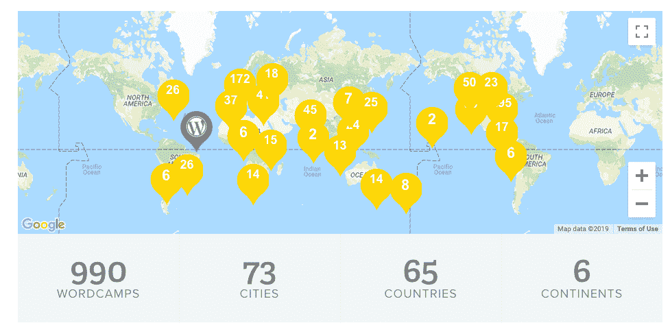

WordCamps worldwide

WordCamp 活动的目标是让尽可能多的参与者能够参与，两天的门票售价低至 40 美元。这些费用包括后勤费用，比如使用某个场地——演讲者没有报酬。全球和本地赞助商帮助补贴门票成本，以保持可负担的出席率。

如果你错过了你希望参加的 WordPress.tv 上的演讲录像，请注意。

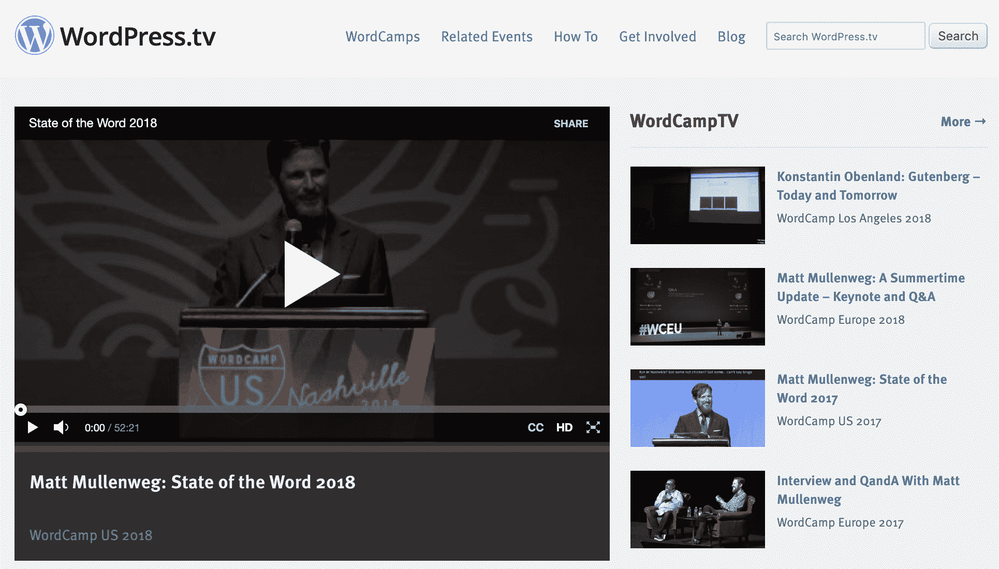

WordPress.tv

WordPress meetups 诞生于 WordPress meetups，后者是更小、更亲密的 WordPress 聚会。Meetup.com 上的 WordPress meetups 有一个官方账户，有 740 多个相关的 meetup 群和超过 370，900 个成员。

除了单词营，一些最受欢迎的 WordPress 活动包括:

*   [WPCampus](https://wpcampus.org/)
*   [WooConf](https://wooconf.com/)
*   [新闻经济学](https://pressnomics.com/)

## 用 WordPress 统计数据赚钱

用 WordPress 赚钱有多种方式，而且非常有利可图。四分之一的 WordPress 用户全职依靠 CMS 生活。

在 WordPress 上赚钱的一些方法包括:

*   成为一名 [WordPress 开发者](https://kinsta.com/blog/wordpress-developer-salary/)/设计师、插件/主题制作人/开发者、托管公司、SEO 专业人士(或[代理](https://kinsta.com/blog/wordpress-agency/))，并开始一项 [WordPress 维护](https://kinsta.com/blog/wordpress-maintenance/%E2%80%8E)服务。
*   Envato 市场上一半的 WordPress 主题开发者每月至少赚 1000 美元，5%的人每月赚 10000 美元以上。Envato Market 上不到 4%的主题收入低于 1000 美元。
*   WordPress 开发者的收费在每小时 20-100 美元之间(低端包括生活成本较低国家的人)。

## 摘要

始于 2003 年的 WordPress 现在已经有 15 年的历史了。从最初开始到现在已经发生了很多变化，但是这个平台背后的核心功能——让用户能够创建自己的博客——将永远是这个工具的一个特色。它也随着时间的推移而发展，现在被各种不同的公司使用，从企业到财富 500 强公司。

有没有你希望我们在这篇文章中提到但没有提到的具体的 WordPress 统计数据？在 [**@Kinsta**](https://www.twitter.com/kinsta) **发表你的想法，我们将分享我们的最爱！**

* * *

让你所有的[应用程序](https://kinsta.com/application-hosting/)、[数据库](https://kinsta.com/database-hosting/)和 [WordPress 网站](https://kinsta.com/wordpress-hosting/)在线并在一个屋檐下。我们功能丰富的高性能云平台包括:

*   在 MyKinsta 仪表盘中轻松设置和管理
*   24/7 专家支持
*   最好的谷歌云平台硬件和网络，由 Kubernetes 提供最大的可扩展性
*   面向速度和安全性的企业级 Cloudflare 集成
*   全球受众覆盖全球多达 35 个数据中心和 275 多个 pop

在第一个月使用托管的[应用程序或托管](https://kinsta.com/application-hosting/)的[数据库，您可以享受 20 美元的优惠，亲自测试一下。探索我们的](https://kinsta.com/database-hosting/)[计划](https://kinsta.com/plans/)或[与销售人员交谈](https://kinsta.com/contact-us/)以找到最适合您的方式。