# WordPress 支持:如何找到它并充分利用它

> 原文：<https://kinsta.com/blog/wordpress-support/>

想象一下:你正在你的 WordPress 网站上工作，可能正在配置设置，[安装一个新主题](https://kinsta.com/blog/how-to-install-a-wordpress-theme/)，或者[设置一个插件](https://kinsta.com/knowledgebase/how-to-install-wordpress-plugins/)，然后一些东西停止工作了。现在，你陷入困境，需要帮助来解决问题。

你怎样做才能让你的 WordPress 网站得到支持？

最简单的方法就是直接去谷歌搜索与你当前经历的问题相关的内容。

不过，盲目的谷歌搜索也有风险:你无法知道你得到的结果是准确的还是最新的。除非你已经使用了谷歌带你去的资源，并且知道它们是可靠的，否则你将面临听从你不需要的建议的风险。

那你是做什么的？

## 哪里可以找到 WordPress 支持:

你可以从不同的渠道获得 WordPress 支持。

*   官方来源:管理员帮助，WordPress Codex，开发者手册
*   关于 WordPress、Slack、Reddit 的论坛、群组和渠道，如 Stack Exchange、脸书和 LinkedIn 群组。
*   除此之外，你还可以付费获得定制和高级 WordPress 支持。

Support

在这篇文章中，当你面临常见的 WordPress 错误时，我将通过识别 WordPress 最可靠和最新的支持来源，帮助你快速找到问题的正确答案。这些将包括论坛和群组，在那里你可以问一个问题并期待一个可靠的答案，已经有大量答案的知名网站，以及其他类型的以 WordPress 为中心的有用资源。

具体来说，我将看看五种不同类型的 WordPress 支持:

 I’ll also help you get the most from these sources with tips on how to approach them proactively, how to phrase your support questions, and how to avoid getting a reputation as someone who asks too many questions!

准备好了吗？让我们开始吧！

[当事情发生时，我们惊慌失措。😰#WordPress 也不例外。那么你如何找到支持和帮助呢？我们为你收集了所有最好的资源。看看他们！ 点击推文](https://twitter.com/intent/tweet?url=https%3A%2F%2Fkinsta.com%2Fblog%2Fwordpress-support%2F&via=kinsta&text=When+things+break%2C+we+panic.+%F0%9F%98%B0+%23WordPress+is+no+exception.+So+how+can+you+find+support+and+help%3F+We+put+together+all+the+best+sources+for+you.+Check+them+out%21&hashtags=help%2Cwordpress)

## 确定您的支持需求

寻求帮助有时会很棘手。这就是为什么，在你在网站和群组上寻求帮助和支持之前，你应该花一些时间来确定你的 WordPress 网站面临的具体问题。这使您能够确定哪种类型的支持最能满足您的需求。

考虑:

*   你的问题是关于[你的网站托管](https://kinsta.com/blog/managed-wordpress-hosting/)还是你的 WordPress 安装的技术细节？Kinsta 客户可以通过我们的[支持渠道](https://kinsta.com/kinsta-support/)获得这些问题的答案。
*   你有需要回答的具体问题吗？支持论坛或脸书小组可能是一个很好的支持来源。
*   你想学一门特殊的技能吗？你可能会找到有帮助的教程或课程。
*   需要了解一些具体的 WordPress 代码吗？试试法典或者开发者手册。
*   你需要一个解决的问题还是一个快速回答的问题？您可能需要投资高级支持。

您的确切需求是您和您的企业所独有的。了解您需要什么将有助于您找到最佳的支持来源。所以让我们从官方支持来源开始，这是许多新 WordPress 用户的起点。

## WordPress 支持:官方来源

当你对 WordPress 有疑问时，[WordPress.org 网站](https://wordpress.org/)有许多支持资源，应该是你首先去的地方。其中包括:

*   站点管理屏幕中的帮助页面。
*   WordPress Codex。
*   开发者手册。
*   WordPress 支持论坛。
*   个别主题和[插件](https://kinsta.com/best-wordpress-plugins/)的支持页面。

### 管理帮助

在你的 WordPress 站点中，你可以通过点击管理界面右上角的**帮助**标签来获得帮助。这将显示特定于上下文的帮助，旨在帮助您理解当前屏幕。

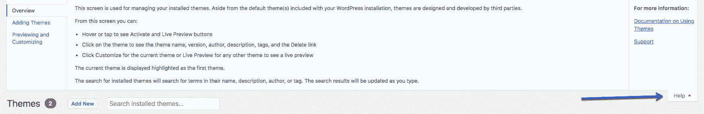

Admin Help

在主仪表板页面上还有一些链接，可以帮助您了解如何开始以及如何创建内容和管理您的站点。

### 法典

WordPress Codex 是 WordPress 使用的许多函数、钩子和类的综合指南。如果你在自己的代码中使用了这些，那么你会发现代码工作方式[的描述](https://kinsta.com/knowledgebase/edit-wordpress-code/)以及如何使用它的例子。在某些情况下，法典的页面长达数千字，非常详细。

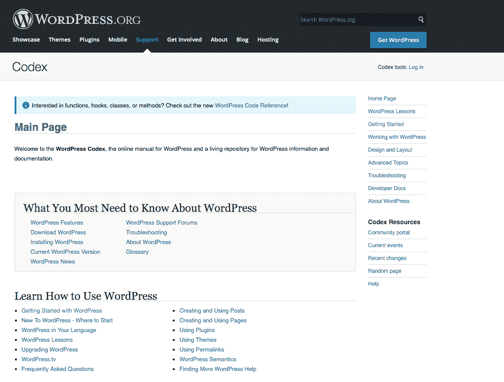

The WordPress codex

不过，Codex 并不仅限于开发人员使用。如果你想了解更多关于 WordPress 管理界面以及如何配置你的站点，这些资源是一个很好的起点。

### 开发者手册

另一方面,[开发者手册](https://developer.wordpress.org/)主要面向开发者。

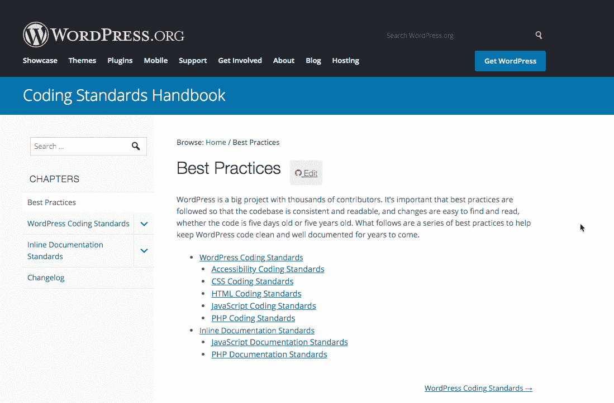

WordPress coding standards handbook

这是 WordPress 的官方代码指南。它包括关于 WordPress [编码标准](https://kinsta.com/blog/web-design-best-practices/#coding-standards)和 API 的建议。有关于插件开发和主题开发的部分，以及[REST API](https://kinsta.com/blog/wordpress-rest-api/)和古腾堡接口引入的块编辑器。

### WordPress 支持论坛

如果你还没有通过 Codex 或开发者手册找到答案，WordPress 支持论坛是你可以得到更多具体建议的地方。这里是 WordPress 社区可以回答你关于广泛话题的问题的地方。

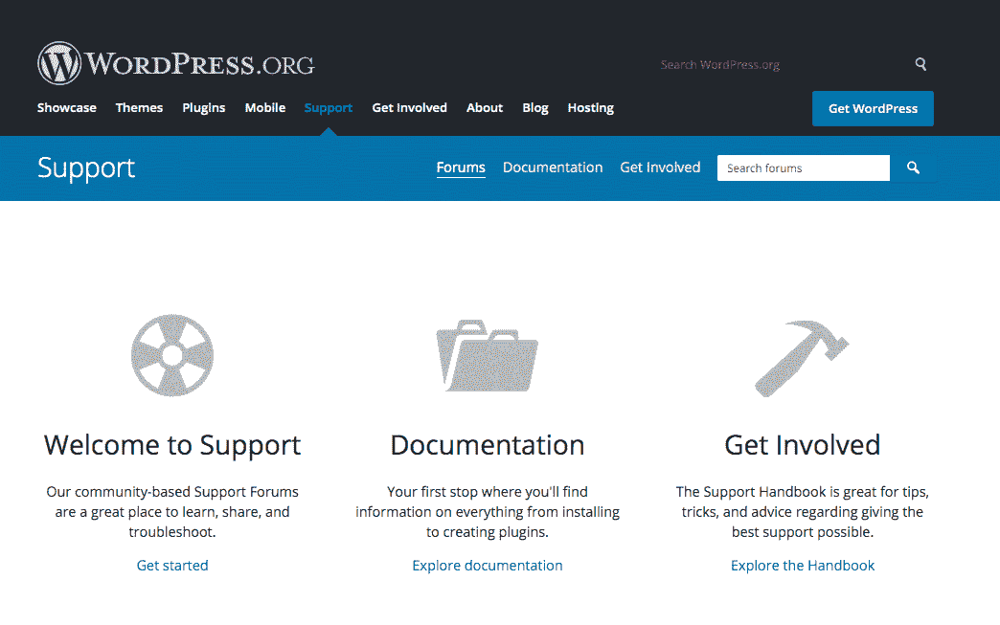

WordPress support forums

支持论坛是由志愿者组成的，这意味着这些人不是由 WordPress 支付的。然而，他们中的一部分为 WordPress 组织、机构或公司工作，鼓励他们的员工通过论坛分享他们的专业知识。除此之外，你还可以期待与插件和主题开发者取得联系，他们也为他们的产品提供帮助和支持(下面会有更多)。

最后但同样重要的是，也有一些人没有得到他们雇主的支持，但确实想回馈 WordPress 社区，帮助更多的人使用 WordPress。这些人在支持论坛上放弃一些空闲时间来帮助他人。所以**对他们好点**！

除了一般的支持论坛，你会发现通过主题和插件目录发布的所有主题和插件的支持页面。要访问主题或插件的支持页面，请转到您站点的主题或插件页面，找到主题或插件，然后点击**查看**详细信息链接。这将弹出一个主题或插件的详细信息。

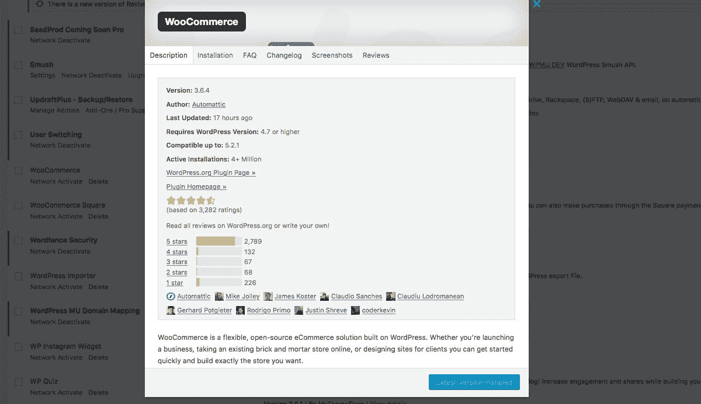

The WooCommerce plugin details popup

在右边的侧边栏中，点击**WordPress.org 插件页面**链接，你将进入主题/插件在 WordPress.org 的官方页面。从这里，选择**支持**选项卡。

在问你的问题之前，**总是快速搜索一下**看看是否有其他人问过同样或类似的问题，并看看给出的答案，如果有的话。如果没有，你可以问一个你自己的问题。但是要注意:维护 WordPress 插件/主题的免费版本并不能为这些开发者带来直接收入，但是他们为他们的用户提供了支持。

所以，如果他们没有直接回答你的问题，不要生气，在你之前，他们可能有其他的需求，可能来自他们的高端产品。

### 如何使用 WordPress.org 支持

如果你想从官方支持中获得最大的收益，以最恰当的方式使用它们是值得的。这涉及到先用最合适的资源，知道如何快速得到答案，不惹人讨厌。

以下是一些建议:

*   如果你的问题与使用 WordPress 管理器的[有关，从 WordPress 仪表盘的帮助页面开始。](https://kinsta.com/knowledgebase/wordpress-admin/)
*   接下来，尝试搜索 Codex 和/或开发者手册。你很有可能在那里找到问题的答案。提出支持问题非常耗时，并且会导致延迟。
*   如果你需要搜索，你可以使用 WordPress.org 网站右上角的搜索框。我发现用谷歌搜索 WordPress 网站会更好，因为它在纠正拼写错误和找到更广泛的结果方面更强大。在谷歌中，输入“wordpress.org ”,然后进行搜索，看看你会得到什么。
*   如果搜索没有帮助，请尝试浏览法典和开发人员手册中的页面。这些是有逻辑结构的，如果你不知道你要找的东西的专业名称，可能对你更有帮助。
*   当使用支持论坛时，无论是普通论坛还是主题或插件论坛，总是检查现有的帖子，看看是否有人回答了这个问题。这将帮助您更快地找到答案，不会浪费任何人的时间(包括您自己的时间)，并且会避免因为重复另一个支持线程而导致您的支持线程关闭的尴尬。
*   在支持论坛中，要有礼貌和尊重。永远不要批评另一个 WordPress 用户。这是一个社区，回答问题的人是志愿者。做一个混蛋意味着你的问题不会得到回答。
*   问问题时，尽可能清晰具体。让别人尽可能容易地理解你试图解决的问题。
*   如果你开始一个线程，不要期望立即得到回应。这不是特优支持，你不能指望很快好转。如果你真的需要，请看下面关于高级 WordPress 支持的部分。

## 论坛、群组和频道

除了官方的支持来源，还有大量的论坛、群组和渠道，你可以用它们来得到你的问题的答案。这些是针对从初学者到有经验的开发人员的，挑战的一部分是找到一个适合你的水平。

其中包括:

## 注册订阅时事通讯

### 想知道我们是怎么让流量增长超过 1000%的吗？

加入 20，000 多名获得我们每周时事通讯和内部消息的人的行列吧！

[Subscribe Now](#newsletter)

*   在线论坛，最好的是栈交换。
*   脸书和 LinkedIn 集团。
*   渠道不畅。

让我们来看看您可能在什么时候使用它们，以及如何充分利用它们。

### 堆栈交换

Stack Exchange 是一个面向 web 开发者的成熟的在线论坛，不仅仅是 WordPress 开发者。它为 WordPress 支持提供了自己的[部分，你应该总是在那里寻找你的问题的答案(不要在通用论坛上发布 WordPress 的问题)。](https://wordpress.stackexchange.com/)

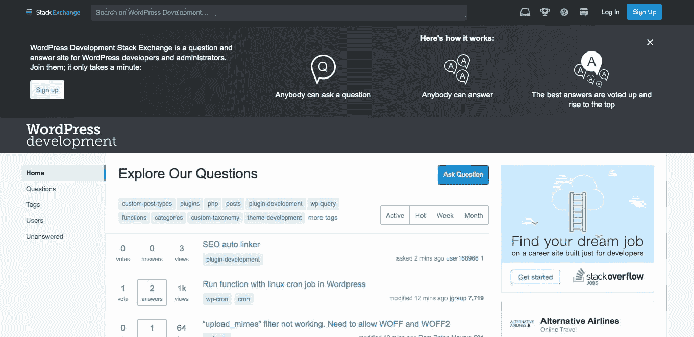

WordPress on Stack Exchange

对于初学 WordPress 的用户和开发者来说，堆栈交换可能会令人望而生畏。它的成员都是经验丰富的开发人员，他们可以为特定和复杂的问题提供答案。确定哪个答案适合你也很困难，因为你经常会发现一个问题有不止一个答案。

好消息是 Stack Exchange 有一个投票系统，可以帮助你找出其他用户认为最有帮助的答案。人们可以投赞成票或反对票，这将有助于您找到最佳答案。

我经常发现，当我在谷歌上搜索 WordPress 相关问题的答案时，出现的第一个结果是 Stack Exchange。使用谷歌搜索它可以创造奇迹，因为它是一个非常大的网站浏览。

如果你有一个更一般的编程或开发问题，他们的合作伙伴网站， [Stack Overflow](https://stackoverflow.com/) 也是一个获得答案的好地方。
T3】

### 关于 WordPress 的脸书小组

随着它的流行，WordPress 带来了大量针对 WordPress 用户和各级开发者的脸书团体。

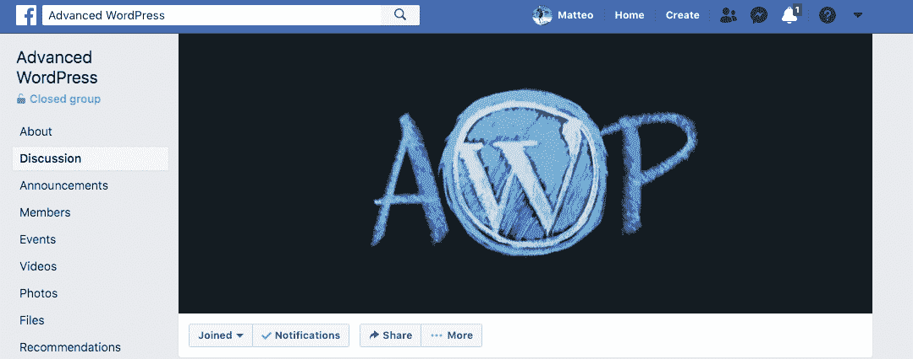

Advanced WP group on Facebook

以下是一些最受欢迎的脸书组合:

*   脸书最大最好的 WordPress 集团。这是一个为 WordPress 专业人士设计的封闭小组，将提供关于 WordPress 开发的建议和支持。
*   一个更一般的群体，针对用户和开发者。
*   WordPress 帮助(WordPress Help):一个针对 WordPress 用户和开发者的私人团体，对自我推广有严格的规定。
*   WordPress 插件:使用这个群组询问最好的插件，并获得新插件的更新和使用。问题往往不那么技术性，更多的是帮助你识别插件。
*   WordPress Security :一个论坛，发布关于 WordPress 安全的问题，并获取任何安全问题的更新。
*   [WordPress，SEO，&互联网问题](https://www.facebook.com/groups/internet.questions/):正如你所想象的，一个用 WordPress 提问和回答 SEO 问题的群组。
*   WordPress 自由职业者:一群以 WordPress 自由职业者为生的人。少讲代码和 WordPress 的使用，多讲它在商业中的应用。
*   支持 WordPress 产品的论坛。他们谈论提供支持以及如何做得更好。不要期望在这个群中得到您的支持问题的答案；相反，如果到了你想提供支持的阶段，就加入进来。这个小组将帮助你学会如何做。
*   加快速度:使用这个群组来学习更多关于提高你的网站性能的知识。
*   关于 WordPress 的一切:更少的支持，更多的讨论 WordPress 的进展和新功能。
*   WordPress 帮助和支持:一个提问和回答问题的论坛，由 WordPress 高级支持提供商运营。
*   [用 WordPress 赚钱](https://www.facebook.com/groups/263423794308573/):一个旨在支持靠 WordPress 谋生的人的团体，由 Kinsta 经营。

### LinkedIn 群组关于 WordPress

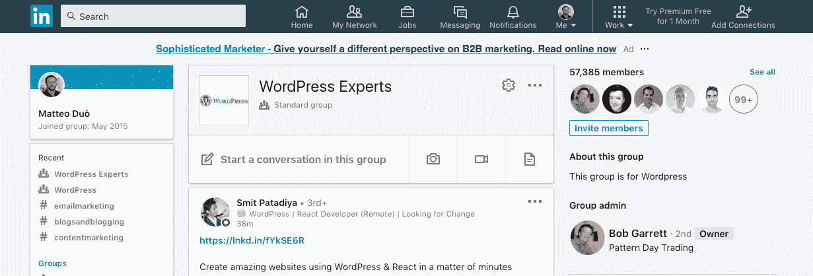

WordPress experts LinkedIn group

如果你是 LinkedIn 的用户，你还会发现那里有专门为 WordPress 提供支持的群组。其中包括:

*   WordPress 专家:一群 WordPress 专业人士，专注于商业和营销。
*   [WordPress 开发者](https://www.linkedin.com/groups/3722491/):WordPress 开发者最大的 LinkedIn 群体。该集团目前正在出售，所以不知道它的未来会如何。
*   WordPress 网站设计者:一群用 WordPress 建立网站的人。与 WordPress 专家组相比，它不太注重市场营销，也不像 WordPress 开发者小组那样注重技术，它是一个有用的地方，可以获得关于使用哪些主题和插件以及如何解决高级 web 设计和开发问题的建议。
*   WordPress 的 SEO:一个为想学习更多关于 WordPress SEO 的人而设的小组。提示、技巧和暗示的来源。
*   WordPress 设计师小组:一个为用 WordPress 设计网站的人而设的小组。专注于应用而不是博客。

### 关于 WordPress 的松弛频道

WooCommerce Community on Slack

越来越多的 WordPress 专业人士[使用 Slack 互相交流](https://kinsta.com/blog/how-to-use-slack/)并获得支持。以下是一些学习 WordPress 的最佳渠道:

厌倦了处理由你糟糕的主机引起的 WordPress 问题？在金斯塔你不会有这些问题。[查看我们的托管计划](https://kinsta.com/plans/?in-article-cta)

*   让 WordPress 成为 WordPress 项目的官方 slack 频道，对任何拥有 WordPress.org 账户的人开放。了解 WordPress 正在发生什么，并加入关于 WordPress 发展的讨论。
*   WP 开发者俱乐部:一个免费加入 slack 的 WordPress 开发者社区。使用它来分享想法，提出问题，并了解 WordPress 的开发。
*   woo commerce:woo commerce slack 频道是为任何[使用或开发 WooCommerce](https://kinsta.com/blog/woocommerce-tutorial/) 的人设计的。使用它作为解决问题和回答问题以及会见其他 WooCommerce 用户的资源，因为它包括当地聚会的详细信息。
*   [WordPress 治理项目](https://twgp.slack.com/join/signup):于 2018 年在美国[word camp](https://2018.us.wordcamp.org/)启动，该项目专注于 WordPress 领导和治理背后的原则。这并不是一个真正的技术支持来源，但是你可以用它来了解 WordPress 是如何管理的，并发表你的意见。

### Reddit 上的 WordPress

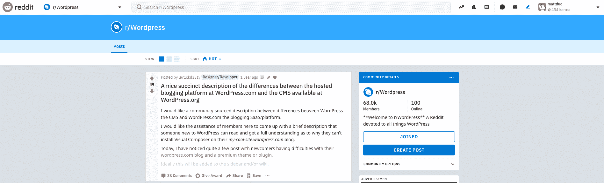

WordPress on Reddit

随着 WordPress 成为如此受欢迎的话题，不可避免地会有大量关于这个话题的子话题。以下是一些最受欢迎的:

*   一个巨大而多样的 Reddit，致力于 WordPress 的所有事情，拥有超过 67，000 名成员。
*   ProWordPress :一个为专业 WordPress 开发者提供高级内容的 Reddit。
*   WordPress plugins:WordPress 插件的支持来源。用它来提问和搜索已经给出的问题和答案。

### Quora 上的 WordPress

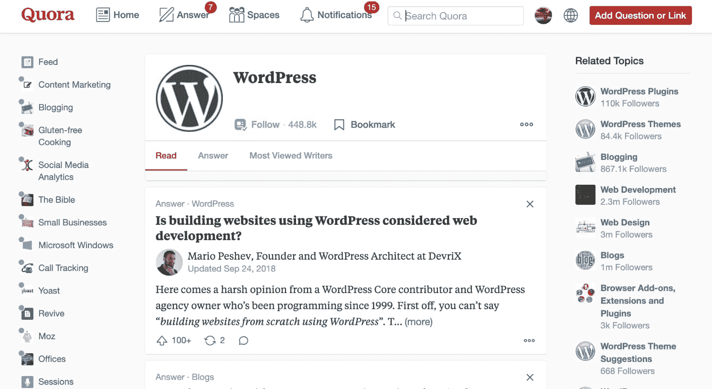

WordPress support on Quora

Quora 是一个提问的平台，可以联系那些提供独特见解和高质量答案的人。有许多不同的 WordPress 主题和子主题可供你寻找答案或提问。

*   主题:WordPress
*   主题:WordPress 插件
*   主题:WordPress 主题
*   [主题:WordPress 插件开发](https://www.quora.com/topic/WordPress-Plugin-Development)
*   [主题:WordPress 主题开发](https://www.quora.com/topic/WordPress-Theme-Development)
*   主题:WordPress 安全

### 如何使用论坛和群组

就像官方渠道一样，如果你恰当地使用这些论坛和团体，你会获得更多的成功。这里有一些你应该遵循的提示:

*   找到一个适合你的问题或兴趣的群组或论坛。在专业开发人员的群组中发布关于创建帖子的问题毫无意义。
*   在发表问题之前，一定要检查现有的主题。使用搜索工具找到你要找的东西，并通读所有相关内容。
*   发帖前检查该组是否有任何规则。如果你违反了自我推销的规则，或者在加入小组后过早发帖，你可能会被踢出小组。
*   **礼貌、尊重**。没有人有义务回答你的问题:如果他们回答了，那是在帮你的忙。
*   你的问题要清晰具体。你更有可能得到回应，而且是更好的回应。

## 高级 WordPress 支持

如果您希望获得快速、专门的支持，那么您必须为此付费。有些公司提供收费的高级支持，这意味着您将获得更快的响应，并能够与提供支持的人进行对话。

在你注册[高级 WordPress 支持](https://kinsta.com/blog/wordpress-support/#premium-wordpress-support)之前，花些时间研究一下提供商。找出他们是否被其他用户审阅过，看看他们在响应时间方面做出了什么承诺。

以下是高级支持的一些来源:

*   [WPBuffs](https://wpbuffs.com/) : WPBuffs，[我们快乐的伙伴](https://kinsta.com/agency-directory/wp-buffs/)之一，为‘严肃网站主’提供 24/7 支持。他们将帮助网站的维护和更新，也有一个支持渠道，你可以用它来询问任何与 WordPress 相关的问题。查看[我们与 WP Buffs 的首席 buff Joe Howard](https://kinsta.com/clients/wp-buffs/)的案例研究，了解更多关于他们的信息。
*   WPFixit 专门解决你的 WordPress 站点的问题。无论是安全漏洞还是速度问题，他们都可以回答你的问题，或者登录你的网站解决问题。
*   WPMaintainer : WPMaintainer 为你现有的 WordPress 安装提供维护、支持、备份和安全。你可以每月用它们做一次小工作:比如安装一个插件或者[添加一些 CSS](https://kinsta.com/blog/wordpress-css/) 。
*   maintain:maintain 提供更新、备份、安全和迁移。他们还在你的 WordPress 仪表盘上提供了一个支持按钮和定制开发请求。
*   template monster:template monster 提供更新帮助、每周调试、24/7 正常运行时间监控、实时聊天&票务支持。
*   GoWP : GoWP 提供 WordPress 维护和支持，最多 8 小时的周转时间。
*   雇佣开发人员:你可能会发现解决你的问题的最划算的方法是雇佣一个开发人员来帮你解决。这可能是一段关系的开始，可以帮助你随着时间的推移管理和发展你的网站。

确保阅读我们关于 WordPress 维护的深入的[指南](https://kinsta.com/blog/wordpress-maintenance/%E2%80%8E)以保持你的网站良好的状态！

## kinsta 支持

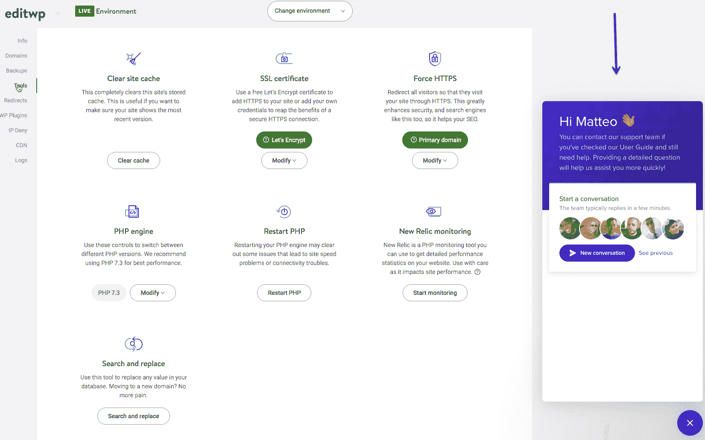

How to get help through MyKinsta Dashboard

如果你的 WordPress 站点是由 Kinsta 托管的，你可以通过 T2 获得我们 24/7 的支持，而不需要额外付费。我们 2019 年第三季度的平均抢票响应时间是 **1 分 19 秒**！Kinsta 支持的功能包括:

*   通过[从您的](https://kinsta.com/help/wordpress-support-ticket/) [MyKinsta 仪表板](https://my.kinsta.com)提交支持票访问专家。按照我们的指南来筹集支持票，以了解如何有效地做到这一点。
*   [免费站点迁移](https://kinsta.com/wordpress-migration/)。免费将你的 WordPress 站点迁移到你的新托管账户，不用担心数据库和文件(建议阅读:[最好的 WordPress 迁移插件](https://kinsta.com/blog/wordpress-migration-plugins/))。
*   正常运行时间检查:我们每两分钟检查一次你的网站是否在线。
*   [备份](https://kinsta.com/help/wordpress-backups/):从您的 Kinsta 仪表盘访问您的备份。你的网站将每天自动备份，你不用动一根手指(或者更频繁地收取额外费用)。
*   [交通浪涌保护](https://kinsta.com/help/scalable-cloud-hosting/)。Kinsta 的架构是可扩展的，旨在保护您免受访客突然激增的影响。
*   [安全监控](https://kinsta.com/secure-wordpress-hosting/)。我们监控您网站的黑客行为，并积极采取措施尽快修复。

您还可以访问我们的 [Learn WordPress](https://kinsta.com/learn/) 资源和[知识库](https://kinsta.com/knowledgebase/)，旨在帮助您从托管中获得最大收益。

## 博客、课程和教程

如果你不想问一个具体的问题，而是想[学习如何用 WordPress](https://kinsta.com/blog/learn-wordpress/) 做一些事情，你会发现有成千上万的博客、课程和教程可以提供答案。

然而，很难知道哪些是可靠的。以下是我们为您提供的可靠、最新信息和指导指南:

*   WPMU DEV:WPMU DEV 博客位于 [WordPress Multisite](https://kinsta.com/wordpress-multisite-hosting/) ，为用户和开发者提供专家指导，同时也涵盖了一系列与 WordPress 相关的主题。订户也可以进入学院，其中包括深入的课程。
*   [Tuts+](https://code.tutsplus.com/categories/wordpress) :上百个免费教程，主要针对各个层次的 WordPress 开发者。他们还为开发者和用户提供高级课程。
*   WPLift :从初级到高级的一系列主题的文章、指南和教程。
*   优雅主题(Elegant Themes):来自 Divi 页面生成器主题的制作者，优雅主题博客不仅仅是关于他们自己产品的信息。为 WordPress 用户和开发者提供清晰全面的指南。
*   [WP Tavern](https://wptavern.com/) : WP Tavern 不会帮你运营你的网站或者成为一名 WordPress 开发者，但是会帮你了解 WordPress 的世界正在发生什么。WordPress 新闻最权威的来源。
*   Kinsta 博客:我们自己的博客是一个有深度的指南和文章的来源，比其他资源更详细。我们试图涵盖许多其他博客没有想到的话题。

## 摘要

我知道，你现在可能会对 WordPress 支持来源的多样性和数量感到有些不知所措。但是如果你以正确的方式对待它，对你需要什么和为什么需要有一个坚实的理解，那么你就可以选择最能帮助你回答问题或解决问题的资源。

在一个精简版中，以下是如何有效地获得 WordPress 支持的方法:

1.  在网上提问或提出支持票之前，做好你的功课。
2.  明确你需要解决的问题是什么。
3.  找到最合适的资源，确认你的问题还没有得到回答。
4.  如果没有，那么清楚地表述你的问题，让人们确切地知道你想要达到什么目的。
5.  不要期待一个立即的回答，对任何帮助你的人都要有礼貌和尊重。这样，你应该能得到你的问题的答案。

祝你好运！

* * *

让你所有的[应用程序](https://kinsta.com/application-hosting/)、[数据库](https://kinsta.com/database-hosting/)和 [WordPress 网站](https://kinsta.com/wordpress-hosting/)在线并在一个屋檐下。我们功能丰富的高性能云平台包括:

*   在 MyKinsta 仪表盘中轻松设置和管理
*   24/7 专家支持
*   最好的谷歌云平台硬件和网络，由 Kubernetes 提供最大的可扩展性
*   面向速度和安全性的企业级 Cloudflare 集成
*   全球受众覆盖全球多达 35 个数据中心和 275 多个 pop

在第一个月使用托管的[应用程序或托管](https://kinsta.com/application-hosting/)的[数据库，您可以享受 20 美元的优惠，亲自测试一下。探索我们的](https://kinsta.com/database-hosting/)[计划](https://kinsta.com/plans/)或[与销售人员交谈](https://kinsta.com/contact-us/)以找到最适合您的方式。