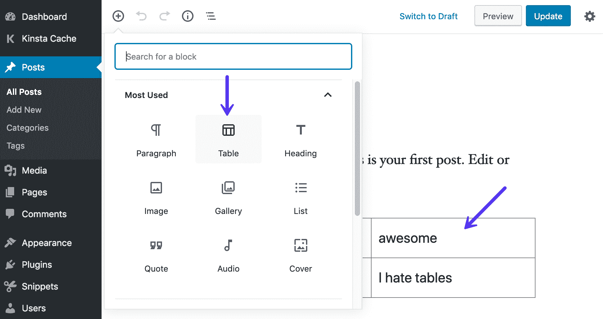
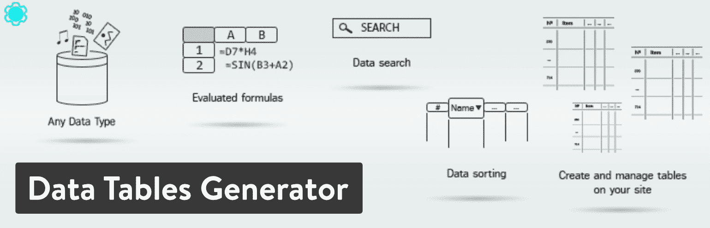
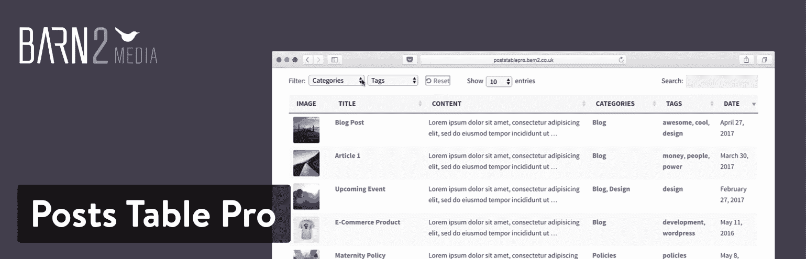
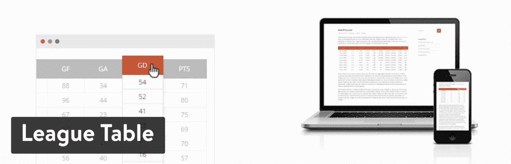
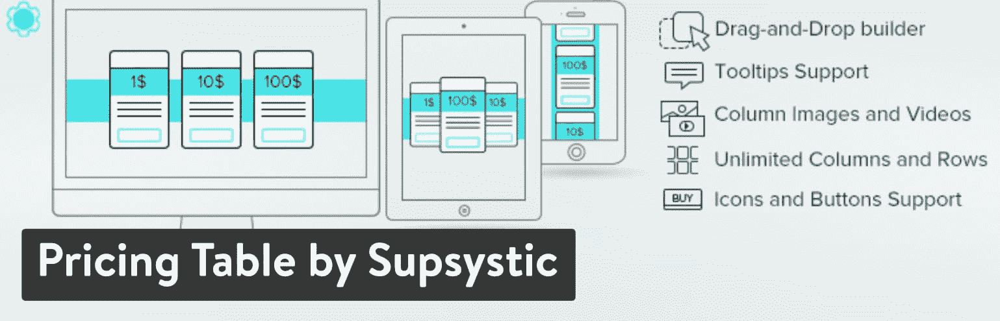
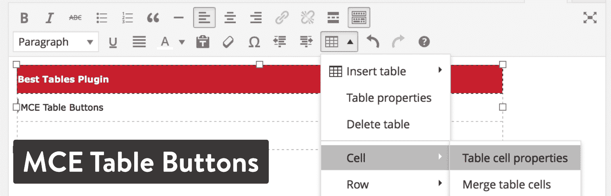
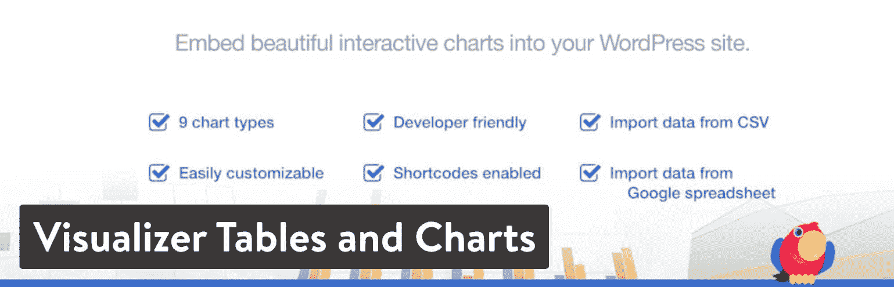

# 潜入 9 个最好的 WordPress 表格插件(比较)

> 原文：<https://kinsta.com/blog/wordpress-table-plugins/>

假设您运行一个电影评论博客，并且您想要呈现一个最近周末票房回报的有序列表。你是如何在你的 WordPress 博客上这么做的？现在，考虑管理一家销售软件的公司。如果有一个比较表来显示为什么你的软件比竞争对手的好，不是很好吗？

从定价表到数据比较，干净的表格在 WordPress 中并不是最容易格式化的——尤其是如果你没有 HTML 的经验。这就是为什么寻找一个最好的 WordPress 桌面插件来为你做所有的工作是很重要的。

本质上，目标是在你的 WordPress 仪表盘上有一个类似 Excel 的电子表格，允许你导入数据或者手工输入数据。然后，插件会将数据呈现在一个格式良好的表格中，并支持媒体元素、链接和标准文本格式。

并不是所有的 WordPress 表格插件都是一样的。因此，我们搜索了互联网，找到了各种情况下的最佳选项，包括我们个人在项目中使用的选项。其中一些对于[构建定价表](https://kinsta.com/blog/wordpress-pricing-table-plugins/)非常有用。其他的更适合于简单的数据比较。我们甚至有一些拖放编辑器的选项。所以，继续阅读，了解周围最好的 WordPress 表格插件。

[使用表格？看看这 9 个很棒的 WordPress 插件，开始展示你的(响应)数据吧！😎 点击推文](https://twitter.com/intent/tweet?url=https%3A%2F%2Fkinsta.com%2Fblog%2Fwordpress-table-plugins%2F&via=kinsta&text=Working+with+tables%3F+Check+out+these+9+awesome+WordPress+plugins+to+start+presenting+your+%28responsive%29+data+in+style%21+%F0%9F%98%8E&hashtags=WordPress%2Ccontentmarketing)

## 最佳 WordPress 表格插件

尽管我们建议看看下面所有的广泛评论，这里有一个链接到我们最喜欢的表格插件的列表。请随意点击所有这些，亲自测试一下。

1.  [TablePress](#tablepress)
2.  [由 Supsystic 生成的数据表](#data-tables-generator)
3.  [帖子表 Pro](#posts-table-pro)
4.  [WP 数据表](#wpdatatables)
5.  [忍者桌](#ninja-tables)
6.  [排行榜](#league-table)
7.  [sup systems 定价表](#pricing-table)
8.  [MCE 表格按钮](#mce-table-buttons)
9.  [可视化表格和图表](#visualizer-tables-charts)

在我们的测试和实验中，很明显个人偏好会影响你对表格插件的选择。有些选项是免费的，但大多数高级解决方案都非常实惠。此外，不同插件之间的接口差异很大。所以，我建议你从下面的分析中选择几个你最喜欢的，并测试一下，看看你最喜欢哪种用户体验(查看我们的列表 [WordPress 项目管理插件](https://kinsta.com/blog/wordpress-project-management-plugins/))。

别忘了，如果你只是需要一些真正简单的东西，新的[古腾堡块编辑器](https://kinsta.com/blog/gutenberg-wordpress-editor/)内置了基本的响应表。只需搜索名为“Table”的块，然后选择想要多少列和多少行。

> Kinsta 把我宠坏了，所以我现在要求每个供应商都提供这样的服务。我们还试图通过我们的 SaaS 工具支持达到这一水平。
> 
> <footer class="wp-block-kinsta-client-quote__footer">
> 
> 
> 
> <cite class="wp-block-kinsta-client-quote__cite">Suganthan Mohanadasan from @Suganthanmn</cite></footer>

[View plans](https://kinsta.com/plans/)

Tables in Gutenberg Block Editor

### 1\. TablePress

根据我自己的经验，以及其他人的评论，很明显 [TablePress](https://wordpress.org/plugins/tablepress/) 是 WordPress 表格插件的最佳选择之一。它易于安装，提供了最简单的设置来配置，甚至初学者也可以在后端创建一个表。设置好表格后，会生成一个短码，您可以将它放在网站上的任意位置。所有表格数据都以电子表格格式插入和编辑在您的仪表板中。你想包含什么类型的数据并不重要，因为 TablePress 支持你能想到的几乎所有东西。

看起来 TablePress 将作为一个高级解决方案出售，但它实际上是在 WordPress 插件目录中免费赠送的。TablePress 网站上提供了相当多的[扩展。](https://tablepress.org/extensions/)

一些最好的包括:

*   响应式表格
*   行过滤
*   表格行排序
*   单个单元格内容短代码
*   自动 URL 转换

TablePress WordPress plugin

正如我们提到的，核心插件是免费的。从技术上来说，你也可以免费获得所有的扩展，但是开发者将其中一些标记为高级。他要求你在下载这些扩展之前捐赠一定数量的钱——这是有意义的，因为这种类型的开发和管理需要很多时间。

除此之外，你可以在 TablePress 网站上查看一个[漂亮的示例演示](https://tablepress.org/demo/)。这是 TablePress 中大多数标准表格的一个很好的例子。当然，你可以用不同的方式格式化它们并添加新的数据，但是我看到的大多数使用 TablePress 的博客都是这样的。

#### 使它成为最好的 WordPress 桌面插件之一的特性:

*   TablePress 插件是免费的。这包括核心插件和扩展。这对于互联网上最好的表格插件来说是相当惊人的。也就是说，我们建议向开发者捐款以支持他。
*   该插件包括大量的扩展，这些扩展是简单的代码片段，用于扩展 TablePress 的功能集。其中一些包括表行顺序选项和行过滤。
*   TablePress 网站也有与其他插件兼容的资源，对管理区的调整，以及来自 TablePress [JavaScript 库](https://kinsta.com/blog/javascript-libraries/)的附加特性。
*   安装和实现非常简单。所有的表格都是在 WordPress 仪表盘中制作的，允许你添加行、列和数据。
*   借助一个简单的短代码，可以将每个创建的表格放在帖子或页面上。
*   还可以用 CSV 和 Excel 文件导入或导出表格数据。这对于较大的表非常有用。

### 2.系统生成的数据表

Supsystic 在这个列表中有两个插件。第一个叫做[数据表生成器](https://wordpress.org/plugins/data-tables-generator-by-supsystic/)，它是在你的 WordPress 站点上创建和管理视觉上引人注目的表格的优秀解决方案。免费插件可供下载。您还可以选择升级[以获得额外的](https://supsystic.com/plugins/data-tables-generator-plugin/?utm_source=wordpress&utm_medium=description&utm_campaign=datatables)功能。最棒的是，免费版应该涵盖大多数中小型博客和企业的大部分需求。

例如，免费插件支持无限行、合并单元格和数据格式化。您的表还可以根据用户的需要完成计算和排序。免费版提供了从 CSS 编辑器到响应能力的所有东西。

Data Tables Generator plugin

一个网站升级到专业版的起价为 29 美元。虽然免费计划非常强大，但许多公司需要获得一些高级功能，如前端导出到 PDF、Excel 和 CSV。您还可以获得更多的导出和导入选项，以及针对大量大型表的大规模迁移工具。其他一些高级特性包括打印按钮、表格历史、图表和角色限制选项。

#### 使它成为最好的 WordPress 桌面插件之一的特性:

*   数据表生成器插件有两个版本，具有一定的灵活性。免费选项有大量的工具，如果您需要，保费是可以承受的。
*   后端生成器使用起来非常简单。
*   你可以集成 WooCommerce 和其他一些 Supsystic 插件来扩展你对表格的使用。
*   支持可视化图表来制作饼图和条形图。
*   所有版本都支持无限的行和列。
*   定制工具非常丰富，有排序、颜色、边框、[分页](https://kinsta.com/blog/wordpress-pagination/)和高亮选项。
*   每个版本都可以访问 CSS 编辑器，获得终极定制体验。
*   在将表格发布到网站之前，您可以查看表格的实时预览。
*   通过 CSV、Excel 等支持前端和后端导出。
*   角色限制特性是更独特的功能之一，它可以决定谁可以编辑甚至查看您的表。

### 3.帖子表专业版

Posts Table Pro 插件是最好的 WordPress 表格插件之一，它来自 Barn2Media。这是一个高度可定制的表格插件，用于创建具有可搜索和可过滤元素的动态表格。它还能够列出你自己的博客文章、音频、自定义字段等等。在一个网站上，支持和插件的价格从每年 89 美元起。之后，营业执照将价格提高到每年 159 美元。还有每年 319 美元的代理许可证。每一次计划升级都会给你更多的站点来放置插件。

Posts Table Pro WordPress plugin

Posts Table Pro 插件的主要优点是你可以在没有任何编码知识的情况下在你的 WordPress 站点上构建表格——也不需要任何数据输入。你可以导入[像视频](https://kinsta.com/blog/embed-youtube-video-wordpress/)、目录和库之类的东西，然后插件会创建即时表格供你显示。每个表格都包括用于快速搜索、排序和过滤的选项。您还可以获得全面的多媒体支持，这意味着您可以在桌子上放置图像和视频等东西。

所有的表都有响应，您可以从开发人员那里获得出色的支持。除了延迟加载设置和 50 多个其他内置功能，如果你正在寻找一个顶级的 WordPress table 插件，你不会错过 Posts Table Pro。

#### 使它成为最好的 WordPress 桌面插件之一的特性:

*   Posts Table Pro 插件具有完全的媒体支持，这与列表中的许多其他插件不同。它甚至有添加音频文件和媒体播放列表的选项。
*   这些表很容易生成，并在后端的 clean builder 中进行管理。
*   通过使用短代码，每个完成的表格都可以放在帖子和页面上。
*   与其他插件相比，这个插件中的表格似乎更加可定制。从颜色到过滤器，从分页到搜索功能，该插件提供了巨大的价值。
*   虽然你必须为插件付费，但这可以让你获得一年的高级支持。
*   可以使用插件将你的一些帖子、页面和产品转化为列表。
*   Posts Table Pro 提供了与[高级定制字段](https://kinsta.com/blog/advanced-custom-fields/)插件的集成，帮助你显示定制数据。

### 4.WP 数据表

wpDataTables 插件是主核心解决方案的精简版。这是一个基本版本，适用于那些只偶尔制作桌子或者不需要高级版本中所有高级功能的人。有了这个免费插件，你可以从 Excel、CSV 和 JSON 等文件中导入数据。然后，你所有的数据都被插入到一个漂亮、简单的表格中，呈现在你的网站上。您也可以从头开始创建自己的行和列。对于那些只为博客文章生成表格的人来说，Lite 插件仍然是一个有用的工具。

wpDataTables 的[完整版在 CodeCanyon 上售价 55 美元。](https://wpdatatables.com/)

wpDataTables plugin

许多人会想，他们应该选择精简版还是高级版。让我们概述一下 Lite 版本的一些限制，看看您是否真的需要升级:

*   Lite 版本将所有表限制为 150 行。
*   您不能使用 Google 电子表格进行导入。
*   您无法获得高级支持。
*   您不会收到服务器端的处理。
*   您不能手动创建表格。
*   您不能创建基于 MySQL 查询的表。
*   你不能像在 Excel 或网站前端那样编辑。

当所有的事情都完成后，有许多组织可以从免费插件中获益。如果没有，你至少可以测试一下界面，看看你是否应该升级到高级插件。

## 注册订阅时事通讯

### 想知道我们是怎么让流量增长超过 1000%的吗？

加入 20，000 多名获得我们每周时事通讯和内部消息的人的行列吧！

[Subscribe Now](#newsletter)

我们真正喜欢高级解决方案的一些东西包括多数据库支持、响应表、对大量数据的支持、可编辑的表、高级过滤器和图表。

#### 使它成为最好的 WordPress 桌面插件之一的特性:

*   wpDataTables 插件提供免费和高级插件。免费的有一些淡化的功能，但它可能对轻度用户有效。高级的还挺实惠的。
*   在精简版中，更小的表格很容易制作。
*   前端的表格看起来与后端的相似。许多表格插件有一个令人困惑的后端模块，给用户造成了困难。
*   您创建的每个表格都可以通过短代码放在您的网站上。
*   高级版的响应表在移动设备上看起来很棒。
*   你可以用付费版本创建非常大的表。
*   付费版本支持图表和高亮显示，为你的读者提供更直观的体验。
*   这个插件有一些很棒的插件，比如一个报表生成器工具，可以让你在 WordPress 里面生成 Excel 或者 Word 文档。

### 5.忍者桌

如果你正在寻找一个功能强大而成本不高的桌子插件，可以考虑尝试一下[忍者桌](https://wordpress.org/plugins/ninja-tables/)。WordPress 插件库提供了一个免费版本。免费选项包含的功能之多令人印象深刻。你也可以注册[高级版](https://wpmanageninja.com/downloads/ninja-tables-pro-add-on/)，一个站点起价 49.50 美元。对于开发者和代理机构，Ninja Tables 还提供“专业”和“代理”计划，分别为 99.50 美元和 249.50 美元。

首先，让我们看一下一些核心产品。Ninja Tables 是 SEO 友好的，允许你使用单行单元格和固定布局生成表格。您可以创建一个带边框的表格、带条纹的行，甚至是一个更紧凑的表格，有助于将文章塞进去。总的来说，后端的表格生成器几乎是您将在前端看到的内容的[精确副本](https://kinsta.com/knowledgebase/duplicate-page-post-wordpress/)。它安装简单，您可以快速添加新颜色，插入列，并为您的读者提供过滤器。

Ninja Tables WordPress plugin

您在免费版中错过的一些特性包括对无限表格和定制工具的支持。所以，如果你用免费插件做了太多的表格，你可能会被切断。高级版还可以连接到 Google Sheets，以及条件列格式和面向在线商店的 WooCommerce 产品表。

#### 使它成为最好的 WordPress 桌面插件之一的特性:

*   忍者桌有免费版和高级版。这个免费插件实际上功能非常丰富——你不必担心花太多钱升级。
*   您有许多定制工具可以让您的表格脱颖而出。例如，您接收调整行和列颜色的设置。
*   有一个链接到 Google Sheets 的选项。
*   Ninja Tables 支持媒体上传。这意味着您可以在表格中插入视频和图片等项目。
*   所有的表格排序都是通过拖放构建器完成的。没有必要了解任何关于忍者表编码的知识。
*   该插件在 CSV 的帮助下导出和导入。您的所有数据都可以在瞬间插入。
*   有一个直接的 WooCommerce 集成来列出你的产品并进行比较。
*   通过在帖子或页面中放置简短代码来展示您的表格。
*   该插件提供条件格式，以便根据您预先设置的特定条件突出显示某些行和列。

### 6.比赛成绩表

[排行榜](https://codecanyon.net/item/league-table/7578593)插件没有免费选项，但价格相当低，为 23 美元。该计划为您提供六个月的客户支持，您可以付费将其延长至一年。这是最好的 WordPress 表格插件之一，理由很充分。首先，您有超过 135 个可定制的选项。这包括可排序的列、颜色和过滤。您的所有数据都可以轻松地导入和导出，这意味着几乎不需要从头开始创建表格。还有一个嵌入式电子表格编辑器，这使得管理您的表格更加容易。

League Table WordPress plugin

经过测试，它变得很清楚，联赛表插件有一个最快的表格插件接口。您可以从外部电子表格或文档中直接复制或导入。然后，您可以自定义颜色、版式和单元格大小等项目。可排序的列对用户来说很好，表的响应特性确保显示所有数据，不管使用的是什么设备。

#### 使它成为最好的 WordPress 桌面插件之一的特性:

*   虽然它只是作为一个高级插件出售，但联赛表有一个 23 美元的好价格。
*   [多站点支持](https://kinsta.com/blog/wordpress-multisite/)是独一无二的，因为您可以利用您网络中各种网站上的所有表格。
*   该插件也支持多语言。你所需要的只是一个翻译文件。
*   导入和导出功能将表保存为 XML 文件。这为你将文件移动到其他网站和程序提供了很大的灵活性。
*   所有表格都支持数学公式。您还可以选择在单元格中插入 HTML 和 JavaScript 代码。
*   响应式界面在根据所用设备隐藏和显示不太重要的列或行方面做得很好。
*   该插件拥有该列表中最大的定制工具集合之一。
*   电子表格编辑器提供了直接从 Google Sheets 和 MS Excel 等程序中复制数据的必要手段。

### 7.按系统分类的价格表

当我们回到 Supsystic，你可以看到开发者也有一个价格表解决方案插件。这是一个替代的表格生成器，但是价格图表仍然是表格。一些 WordPress 主题[和页面生成器](https://kinsta.com/blog/wordpress-page-builders/)带有价格表，但是如果你需要一个，Supsystic 插件的[价格表将是一个明智的决定。您甚至可以将它用于更丰富多彩、更直观的比较表，其格式有点像价格表。](https://wordpress.org/plugins/pricing-table-by-supsystic/)

Struggling with downtime and WordPress problems? Kinsta is the hosting solution designed to save you time! [Check out our features](https://kinsta.com/features/)

首先，价格表插件在免费插件版本中拥有几乎所有的核心特性。这包括表的导出和导入、列的标记和一个漂亮的在线拖放式表生成器。你也可以选择[高级版](https://supsystic.com/plugins/pricing-table/)，在一个网站上使用起价 29 美元。五个站点的价格是 49 美元，无限站点是 99 美元。如上所述，大部分功能都可以在免费插件中找到。但是，如果你想要一大包高级模板和角色限制功能，那就升级到高级插件吧。

Pricing Table by Supsystic WordPress plugin

在看了这两个 Supsystic table 插件之后，很明显，这个开发人员为渴望创造力和功能的人提供了高质量的解决方案。定价表插件的功能很像我们在这篇文章中概述的最好的 WordPress 表插件。它提供了预设的模板，支持无限的列和行，以及适合在手机和平板电脑上查看的移动友好布局。

价格表令人印象深刻的是，你真的可以在一个插件中获得两个插件:一个插件可以创建令人惊叹的价格表，另一个插件可以制作标准的数据比较表。导入数据并在几分钟内进行比较非常简单。

#### 使它成为最好的 WordPress 桌面插件之一的特性:

*   这个免费插件几乎拥有构建可靠的价格表所需的所有功能。
*   高级版本不会打破预算，它提供了角色限制和高级模板。
*   你也可以用插件制作普通的数据表。
*   拖放表生成器是我们测试过的最流畅的工具之一。
*   您可以访问 CSS 编辑器，对表进行完全的定制控制。
*   您可以从所有表中导入和导出数据。
*   价格表插件支持文本、图像、视频和图标。这绝对是这个列表中比较可视化的表格插件之一。
*   它有一个适用于小型设备的移动响应版本。
*   悬停动画被包括在内，为您的表格添加一点流行元素。
*   您会收到几个预设模板，并且对您创建的行数和列数没有限制。

### 8.MCE 表格按钮

如果你想在 WordPress 页面或文章编辑器中直接创建一个表格，那么 [MCE 表格按钮](https://wordpress.org/plugins/mce-table-buttons/)插件可能是最好的 WordPress 表格插件之一。使用这些插件中的大部分，你可以在仪表板中创建一个远离你的文章或页面的表格。之后，你可以抓取一个短代码，并将其插入到你选择的页面或帖子中。然后，该表将出现在前端。MCE 表格按钮插件采取了不同的方法，在 WordPress 的[可视内容编辑器上安装了一个按钮。此下拉按钮为您提供了一些选项，用于插入表格、管理表格属性以及添加行和列。](https://kinsta.com/blog/wordpress-tinymce-editor/)

这个插件不会给你任何高级定制或设计工具。这意味着在您的内容编辑器中生成一个简单的、没有多余装饰的表格。

MCE Table Buttons plugin

MCE 表格按钮插件实际上没有任何需要配置的设置，所以只需简单的安装就可以开始向出版物添加表格。正如你可能已经想到的，这个轻量级插件是完全免费的，没有任何需要购买的追加销售或扩展。

#### 使它成为最好的 WordPress 桌面插件之一的特性:

*   该插件在你的 WordPress 内容编辑器中添加了一个按钮，这样你就可以在编辑器中创建表格，而不必在 WordPress 中的不同标签页中工作。
*   它消除了对短代码的需求，因为所有的事情都在 WordPress 内容编辑器中完成。
*   在文章或页面中放置表格不需要任何编码知识。
*   插件是免费的。
*   MCE 表格按钮[下拉菜单](https://kinsta.com/knowledgebase/wordpress-dropdown-menu/)包括一些直观的表格管理选项，如插入表格按钮、删除表格按钮以及添加或合并单元格的选项。
*   它非常轻便，几乎不需要定制，所以你所有的桌子看起来都很专业、干净，没有任何分散注意力的视觉效果。

### 9.可视化工具表格和图表

可视化表格和图表插件来自 ThemeIsle，它提供免费和 T2 高级下载。

该插件提供丰富多彩的动画图表。您也可以使用基本表格。因此，在某种意义上，你可以在一个插件中获得多个插件。免费版可以帮助你在页面和文章中创建和管理交互式表格和图表。它有点淡化，但可能有一些较小的组织会发现免费版本是有帮助的。最好的功能来自高级版本。起价 59 美元，或者你可以购买 ThemeIsle 订阅来获得更多的插件。

当您升级到付费插件时，您获得的一些功能包括从外部来源导入数据、使用实时编辑器以及创建供内部公司使用的私有图表的选项。到目前为止，在核心插件中有九种图表类型可供选择，在高级版本中还有三种图表可供利用。

Visualizer Tables and Charts WordPress plugin

正如我们之前提到的，Visualizer 插件包括一整套功能，用于设计漂亮的表格图表，包括过滤器、搜索栏和颜色定制等项目。Visualizer 插件中的所有图表和表格都是使用短代码实现的。

除此之外，除了表格之外，这里还有一些其他图表:

*   折线图
*   圆形分格统计图表
*   柱状图
*   对比图
*   组合图
*   时间表图表
*   散点图

#### 使它成为最好的 WordPress 桌面插件之一的特性:

*   该插件有免费版和高级版。免费版非常适合测试，但高级版才是真正的功能所在。
*   您不仅可以获得表格构建功能，还可以选择各种各样的图表。
*   提供了几个图表和表格模板供您开始设计。
*   所有的图表和表格都呈现在 WordPress 仪表盘中，然后使用短代码放入页面或帖子中。
*   基本表具有下拉菜单、标题和从外部数据源提取数据的功能。
*   您可以创建只有您组织中的某些人可以查看的私有图表。
*   还有一个选项可以让用户从你的 WordPress 网站的前端编辑你的图表。
*   这个插件有一个实时编辑器，所以你可以在你眼前看到你编辑的结果。

## 摘要

如果您和您的组织经常创建表格，那么查看我们上面概述的一个高级插件可能是值得的。然而，偶尔的用户绝对应该考虑像 TablePress，数据表生成器，甚至 MCE 表格按钮插件这样的解决方案。

弄清楚你是想要一个高度可定制的表格插件还是一个简单地插入一个基本表格用于数据比较的插件也很重要。毕竟，当您真正尝试添加几种颜色、链接和图片时，您不会想要一个基本的表格生成器。

如果你对最好的 WordPress 表格插件有任何疑问，欢迎在下面的部分给我们留言。此外，如果你目前正在使用一个表格插件，让我们知道你喜欢它！

* * *

让你所有的[应用程序](https://kinsta.com/application-hosting/)、[数据库](https://kinsta.com/database-hosting/)和 [WordPress 网站](https://kinsta.com/wordpress-hosting/)在线并在一个屋檐下。我们功能丰富的高性能云平台包括:

*   在 MyKinsta 仪表盘中轻松设置和管理
*   24/7 专家支持
*   最好的谷歌云平台硬件和网络，由 Kubernetes 提供最大的可扩展性
*   面向速度和安全性的企业级 Cloudflare 集成
*   全球受众覆盖全球多达 35 个数据中心和 275 多个 pop

在第一个月使用托管的[应用程序或托管](https://kinsta.com/application-hosting/)的[数据库，您可以享受 20 美元的优惠，亲自测试一下。探索我们的](https://kinsta.com/database-hosting/)[计划](https://kinsta.com/plans/)或[与销售人员交谈](https://kinsta.com/contact-us/)以找到最适合您的方式。