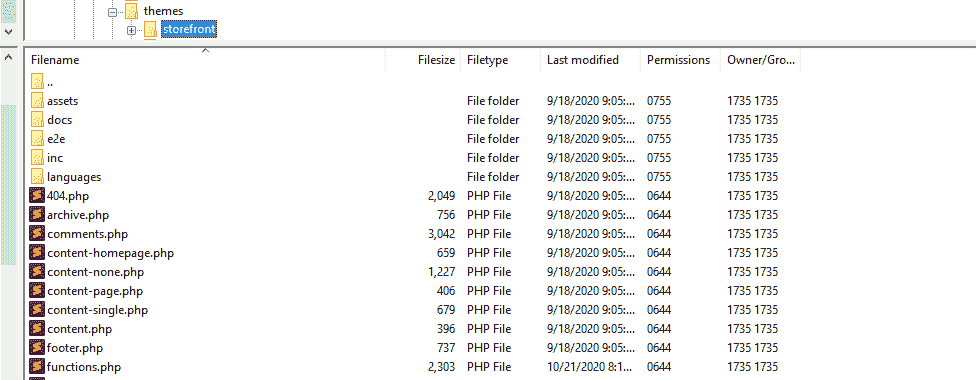
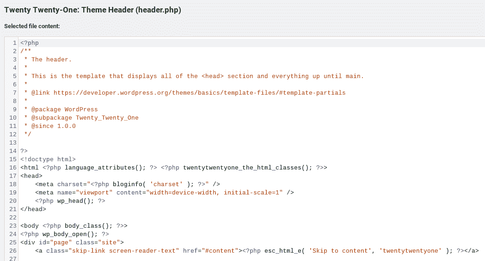
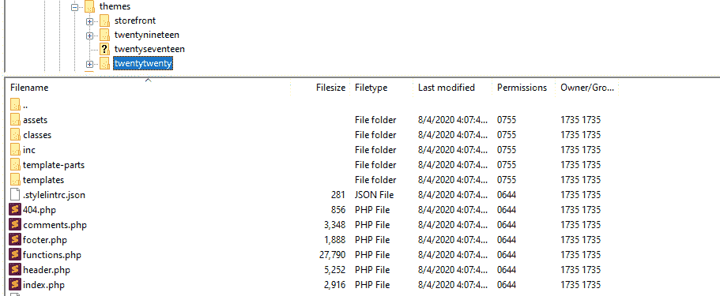
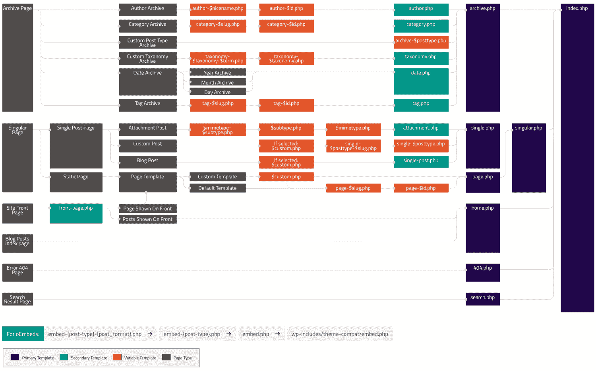

# WordPress 模板层次结构指南(2022 版)

> 原文：<https://kinsta.com/blog/wordpress-template-hierarchy/>

如果你想[定制主题](https://kinsta.com/blog/how-to-customize-wordpress-theme/)或者从头开始构建新的主题，理解 WordPress 模板层级是如何工作的很重要。

首先，这个 WordPress 系统有助于保持一切井然有序。一旦你知道所有的主题模板文件是什么，它们是做什么的，以及它们是如何被优先排序的，你将能够改变你的 WordPress 网站外观的几乎每一个方面。

在这篇文章中，我们将解释什么是 WordPress 模板层次结构以及它是如何工作的。然后我们将提供每种 WordPress 页面所涉及的模板文件的完整分类(包括一个参考备忘单)，以帮助你更好地使用它们。

我们开始吧！

### 更喜欢看[视频版](https://www.youtube.com/watch?v=ssqyrXoH7LI)？

## WordPress 模板层次结构介绍

通常，非动态网站使用[静态 HTML](https://kinsta.com/blog/wordpress-vs-static-html/) 和 CSS 文件来呈现其内容。然而，WordPress 是一个基于 [PHP 编程语言](https://kinsta.com/knowledgebase/what-is-php/)的动态平台。每个 WordPress 站点都会加载多个*。php* 文件，每个文件控制一个特定部分或组件的外观。

> 需要在这里大声喊出来。Kinsta 太神奇了，我用它做我的个人网站。支持是迅速和杰出的，他们的服务器是 WordPress 最快的。
> 
> <footer class="wp-block-kinsta-client-quote__footer">
> 
> 
> 
> <cite class="wp-block-kinsta-client-quote__cite">Phillip Stemann</cite></footer>

[View plans](https://kinsta.com/plans/)

每当你加载一个特定类型的页面，[内容管理系统(CMS)](https://kinsta.com/knowledgebase/content-management-system/) 就会寻找与之对应的模板文件。

例如，如果你使用 WordPress 的搜索功能并加载一个搜索结果页面，CMS 将寻找两个模板文件:

1.  earch.php*控制你的搜索结果页面的外观*
2.  *index.php*，这是 WordPress 在每个层级中找不到顶层选项时使用的默认模板文件

您可以访问的模板文件将取决于您使用的主题。所有的 [WordPress 主题](https://kinsta.com/best-wordpress-themes)都是模板、[样式表](https://kinsta.com/blog/wordpress-css/#how-to-customize-your-wordpress-theme-with-css)和其他元素的集合，比如[图片](https://kinsta.com/blog/image-file-types/)。所以在上面的例子中，如果你使用的主题包括一个*search.php*模板，WordPress 会找到并加载它。

在某些情况下，您可能会使用不包含您要加载的页面类型的模板文件的主题。这就是 WordPress 模板层次的由来。它是一个内置的系统，告诉 WordPress 要加载什么样的模板文件，以什么样的顺序加载。

对于一个搜索页面，如果 WordPress 找不到*search.php*文件，它将向下移动到层次结构中的下一个文件，即【index.php】T2。这个文件是模板层次结构中每一个单独分支的最终后备文件。

理论上，你可以拥有一个只包含一个模板文件的全功能主题，那就是*index.php*。

然而在实践中，一个只有一个模板文件的主题几乎不包含任何样式定制，每种类型的页面看起来都差不多。除非这是你想要的，否则理解 WordPress 模板的层次结构是你作为主题开发者最重要的步骤之一。

[If you want to customize themes or build new ones from scratch, it’s important to understand how the WordPress template hierarchy works. ✅ This guide has everything you need to get started... 👇Click to Tweet](https://twitter.com/intent/tweet?url=https%3A%2F%2Fkinsta.com%2Fblog%2Fwordpress-template-hierarchy%2F&via=kinsta&text=If+you+want+to+customize+themes+or+build+new+ones+from+scratch%2C+it%E2%80%99s+important+to+understand+how+the+WordPress+template+hierarchy+works.+%E2%9C%85+This+guide+has+everything+you+need+to+get+started...+%F0%9F%91%87&hashtags=WordPress%2CWPTips)

## WordPress 模板层次结构是如何工作的

如你所知，WordPress 允许你根据你想要发布的内容使用多种类型的页面。您可以使用七个主要类别:

1.  首页
2.  单个员额
3.  单页
4.  自定义帖子类型
5.  搜索结果页面
6.  类别和标签页面
7.  404 错误页面

每个页面都有自己的定制层次结构，这意味着它使用一组特定的模板文件。

如果你快速浏览你的主题文件夹，你通常会发现一个模板文件的集合。以下是博客文章主题目录中列出的模板文件示例:

Template files listed in a WordPress theme directory

这是一个单一的文章页面类型，这意味着它使用*single.php*文件作为页面上主要内容(博客文章本身)的模板。

此外，对于每个页面元素，它都有一个单独的模板文件，其中大部分应该一眼就能识别出来，包括:

*   [表头](https://kinsta.com/knowledgebase/add-code-wordpress-header-footer/)
*   页脚
*   [评论](https://kinsta.com/blog/wordpress-disable-comments/)
*   [侧边栏](https://kinsta.com/knowledgebase/remove-sidebar-wordpress/)

理解这一点很重要，尽管每种页面类型都有自己的层次结构，但它们也经常共享共同的模板文件，比如 header.php 的*和 footer.php 的*和*。*

如果您正在构建自己的主题，这意味着您可以为每种类型的页面创建自定义样式，同时还可以构建模板文件以供重用。

您还可以为侧栏和页脚等元素创建自定义模板文件，这些元素仅*适用于某些页面类型。这种灵活性完全归功于 WordPress 的模板模块化方法。*

[当你切换主题](https://kinsta.com/blog/change-wordpress-theme/)时，你看到的布局差异归因于 WordPress 加载的新模板文件。子主题也是 WordPress 主题层次的一部分，我们很快会讨论到。

## 在哪里定位和改变 WordPress 模板文件

一个*。php* 文件可以包含 php 代码和 HTML 标记(所有这些[你都可以编辑](https://kinsta.com/knowledgebase/edit-wordpress-code/))。因此，WordPress 模板文件可以像你需要的那样复杂。在许多情况下，WordPress 使用的模板文件是它们管理的元素的函数集合。

给你举个例子，下面快速看一下*header.php*模板文件官方 WordPress [二十二十一](https://kinsta.com/blog/twenty-twenty-one-theme/)主题用途:

The Twenty Twenty-One theme’s header template file

正如我们提到的，每个 WordPress 主题都包括自己的一套模板文件。你可以通过一个[文件传输协议(FTP)客户端](https://kinsta.com/blog/best-ftp-clients/)访问你网站根目录下的文件夹来查看你的主题包含了哪些模板文件。

这是之前官方 WordPress 主题的样子， [Twenty Twenty](https://kinsta.com/blog/twenty-twenty-theme/) :

The Twenty Twenty theme directory and template files

默认情况下，WordPress 会加载模板文件，这些文件要么在你主题的主目录( *wp_content >主题*)中，要么在*模板部件*文件夹中。

如果您计划创建多个模板文件，我们建议您将主页面模板保存在主目录中。对于更具体的模板文件，如全幅页面或侧栏布局，您可以使用子目录。

掌握整个 WordPress 模板层次结构的最好方法是通过一个备忘单。在这种情况下，我们向您展示模板层次结构的[视图，由 WordPress Codex 提供:](https://developer.wordpress.org/themes/basics/template-hierarchy/)

The WordPress template hierarchy

WordPress Codex 包含了很多关于模板层次结构的信息，所以我们建议对这些资源添加书签。现在，让我们深入研究每种页面类型及其使用的模板文件。

## 按页面类型对 WordPress 模板层次结构的细分

WordPress 使用七种主要类型的页面。在这一节中，我们将逐一讨论它们，并为您提供它们所使用的模板文件的分类。让我们从头版开始。

### 首页模板文件

你的主页是大多数用户访问你的网站的第一站。实际上，不同网站的首页布局会有很大的不同。

然而，对于一个基本的首页，WordPress 会按顺序查找这三个模板文件:

1.  *front-page.php*
2.  *home.php*
3.  *index.php*

如果你的主题不包括一个*front-page.php*模板文件，WordPress 将默认为第二个选项，以此类推。和往常一样，index.php 的*文件是 WordPress 制作模板决策树的最后一站。*

## 注册订阅时事通讯

### 想知道我们是怎么让流量增长超过 1000%的吗？

加入 20，000 多名获得我们每周时事通讯和内部消息的人的行列吧！

[Subscribe Now](#newsletter)

### 单个员额

单个的 WordPress 文章使用单一的文章模板层次结构。对于每篇博文的主要内容，WordPress 会查找以下文件:

1.  *single.php*
2.  *singular.php*
3.  *index.php*

但是，如果您看一下模板备忘单，您会注意到在某些情况下会出现更复杂的层次结构。

这是因为 WordPress 允许你为单个文章和单个类别指定模板文件，如果它找不到这些选项中的任何一个，就会默认使用*single.php*。

除了主模板文件之外，还有诸如页眉、页脚、侧栏和注释部分等元素。正如我们之前提到的，每个元素都有自己的模板文件。

### 单页

帖子之后，单页是大多数 WordPress 网站的面包和黄油。在大多数情况下，他们使用与你的首页不同的模板，除非这两种类型的页面都默认使用 index.php 的*。*

 *下面是单页模板层次结构的外观:

1.  *page.php*
2.  *singular.php*
3.  *index.php*

虽然单个帖子和页面的模板层次结构是相似的，但还是有一些关键的区别。

首先，谈到页面，WordPress 使用*[get _ page _ templates()](https://developer.wordpress.org/reference/functions/get_page_template/)*[路径](https://developer.wordpress.org/reference/functions/get_page_template/)来定制文件，你可以用它来改变或者重定向默认的页面模板。

此外，您可以为特定的[slug](https://kinsta.com/blog/wordpress-permalinks/#the-difference-between-permalinks-slugs-and-links)和 id 创建模板。如果你有一个*页面-{ slug }。php* 或一个*页面-{id}。在默认使用*page.php*之前，WordPress 会尝试按顺序加载每个文件。*

### 自定义帖子类型

您可以为您不想与页面或帖子捆绑在一起的各种内容创建[自定义帖子类型](https://kinsta.com/blog/wordpress-custom-post-types/)。自定义帖子类型为您的内容提供了更高程度的组织，并且它们还有自己的模板层次结构:

1.  *存档-{post_type}。php*
2.  *archive.php*
3.  *index.php*

自定义文章类型的模板层次结构不像完整页面或文章那样复杂。然而，WordPress 允许你为每种自定义的文章类型创建模板文件，因此它们不必共享完全相同的布局。

### 搜索结果页面

我们已经向你介绍了 WordPress 用于搜索结果页面的模板层次结构，所以让我们简单回顾一下它的样子:

厌倦了慢热的主持人？Kinsta 的设计考虑了速度和性能。[查看我们的计划](https://kinsta.com/plans/?in-article-cta)

1.  *search.php*
2.  *index.php*

随着我们远离“复杂”的页面类型，如文章或首页，WordPress 模板层次结构变得更加简单。

对于一个搜索页面，除了结果本身，你通常不需要包含太多的元素。结构越简单，层级通常越短。

### 类别和标签页面

虽然很多网站不会直接链接到它们，但是 WordPress 会为你的标签和类别生成集合页面。在[分类法](https://kinsta.com/knowledgebase/what-is-taxonomy/)中，每个条目都有特定的子页面。

考虑到对于拥有大型内容库的网站来说，分类法会变得多么复杂，这种层次结构包含了比平常更多的“步骤”:

1.  类别-{ slug }。php
2.  *类别-{id}。php*
3.  *category.php*
4.  *archive.php*
5.  *index.php*

请注意，除了在所有实例中“tag”替换了“category”之外，标记使用了相同的层次结构。

理论上，你可以为 WordPress 网站上的每个类别或标签创建单独的模板文件，并通过 slugs 或 id 来识别它们。然而，很少有网站真的经历过这些麻烦。

如果你不打算让访问者浏览你的分类页面，可以随意默认使用*archive.php*模板。

### 404 错误页面

有时候，访问者会试图访问一个不存在的页面。当这种情况发生时，WordPress 将返回一个 [404 错误页面](https://kinsta.com/blog/error-404-not-found/)。

默认情况下，WordPress 不提供定制页面外观的选项。但是，您可以通过模板文件自己调整它的外观。模板层次结构相当短:

1.  *404.php*
2.  *index.php*

随着网站的发展，用户遇到 404 错误的情况也会增加。为这些情况定制一个错误页面可以帮助你告诉访问者为什么页面不能加载，给他们指出另一个方向，减少挫败感。

当加载 404 模板文件时，WordPress 将在使用默认文件之前查找并加载您的自定义文件。

## 其中子主题适合 WordPress 模板层次结构

如果你喜欢定制你的 WordPress 主题，一个最佳实践是[使用子主题](https://kinsta.com/blog/wordpress-child-theme/)。子主题在 WordPress 模板层次结构中也有自己的位置，但是如果你看我们之前提供的备忘单，这并不明显。

简而言之，使用子主题为您使用的任何页面类型的模板层次结构添加了第二层。

假设您正在使用一个包含单个页面的定制模板文件的子主题。以下是 WordPress 尝试加载文件的顺序:

1.  *p*【age.php】T2 子主题内
2.  *page.php*在父主题内
3.  *singular.php*在儿童主题内
4.  *singular.php*在父主题内
5.  *index.php*在儿童主题内
6.  *index.php*在父主题内

如果 WordPress 可以在你的子主题中找到一个模板文件的版本，那就是它将加载的版本，即使在父主题中有它的副本。在某些情况下，您可能会发现自己处于这样一种情况，您想要为您所使用的主题定制模板文件，而在这些场景中利用子主题是最理想的。

与其他类型的定制一样，当您[更新它](https://kinsta.com/blog/how-to-update-wordpress-theme/)时，您将丢失对主题模板文件的更改。通过一个子主题添加那些改变将会把你从那种情况中解救出来。

## 使用 WordPress 模板标签进行主题开发

在 [WordPress development](https://kinsta.com/blog/hire-wordpress-developer/) 中，你会经常碰到模板标签，这是 PHP 函数，你可以用它来动态地生成和获取数据。模板标签通常是模板文件的一部分，但是它们不能互换。

WordPress 在其代码中构建了许多模板标签，你可以在主题开发中使用它们。一些例子包括:

*   *get_header()*
*   *get_footer()*
*   *get_sidebar()*
*   *get_search_form()*
*   *get_template_part()*

这些标签使你能够从你正在使用的主题中收集模板文件。在实践中，这意味着你可以在主模板文件中添加特定的元素，比如 front-page.php 的*或者 index.php 的【T2 的】*。

如果你想要一个可以在 WordPress 开发中使用的所有模板标签的完整列表，请查看 WordPress Codex 。

在那里，您可以找到关于如何使用每个模板标签的说明、它们各自的参数以及实际代码的例子。

[Ready to customize your WordPress theme? ✨ Read this guide to the template hierarchy first ⬆️Click to Tweet](https://twitter.com/intent/tweet?url=https%3A%2F%2Fkinsta.com%2Fblog%2Fwordpress-template-hierarchy%2F&via=kinsta&text=Ready+to+customize+your+WordPress+theme%3F+%E2%9C%A8+Read+this+guide+to+the+template+hierarchy+first+%E2%AC%86%EF%B8%8F&hashtags=WebDesign%2CWordPressTips)

## 摘要

尽管 WordPress 模板层次结构乍看起来可能很复杂，但它可以归结为一系列简单的决策树。每当你访问一个 WordPress 网站时，CMS 会看到你试图访问的页面类型，然后使用层次结构来决定加载什么样的模板文件。

除了每种页面类型的主模板之外，您还可以拥有页眉、页脚和侧边栏等单个元素的模板文件。

这种模块化的方法让你可以完全控制网站上每个页面的外观，并帮助你在 WordPress 开发过程中节省时间。

关于 WordPress 模板层次结构如何工作，你有任何问题吗？在下面的评论区分享它们吧！

* * *

让你所有的[应用程序](https://kinsta.com/application-hosting/)、[数据库](https://kinsta.com/database-hosting/)和 [WordPress 网站](https://kinsta.com/wordpress-hosting/)在线并在一个屋檐下。我们功能丰富的高性能云平台包括:

*   在 MyKinsta 仪表盘中轻松设置和管理
*   24/7 专家支持
*   最好的谷歌云平台硬件和网络，由 Kubernetes 提供最大的可扩展性
*   面向速度和安全性的企业级 Cloudflare 集成
*   全球受众覆盖全球多达 35 个数据中心和 275 多个 pop

在第一个月使用托管的[应用程序或托管](https://kinsta.com/application-hosting/)的[数据库，您可以享受 20 美元的优惠，亲自测试一下。探索我们的](https://kinsta.com/database-hosting/)[计划](https://kinsta.com/plans/)或[与销售人员交谈](https://kinsta.com/contact-us/)以找到最适合您的方式。*