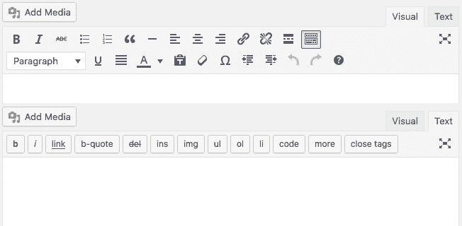
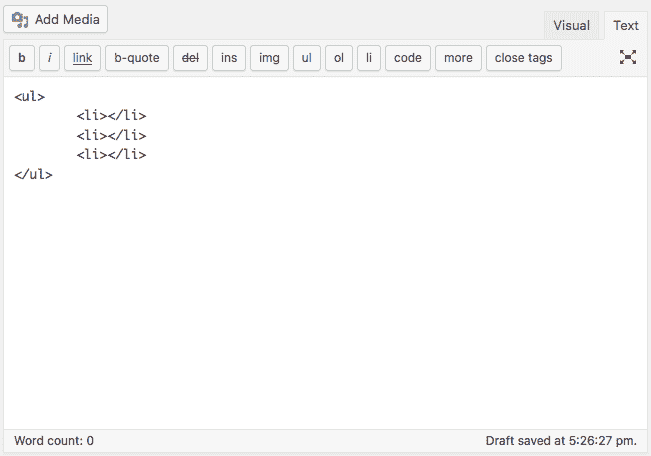
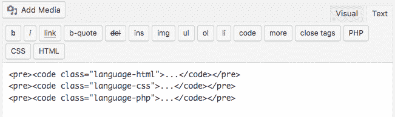
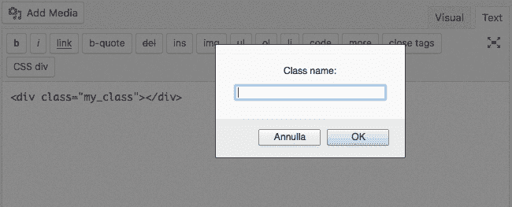
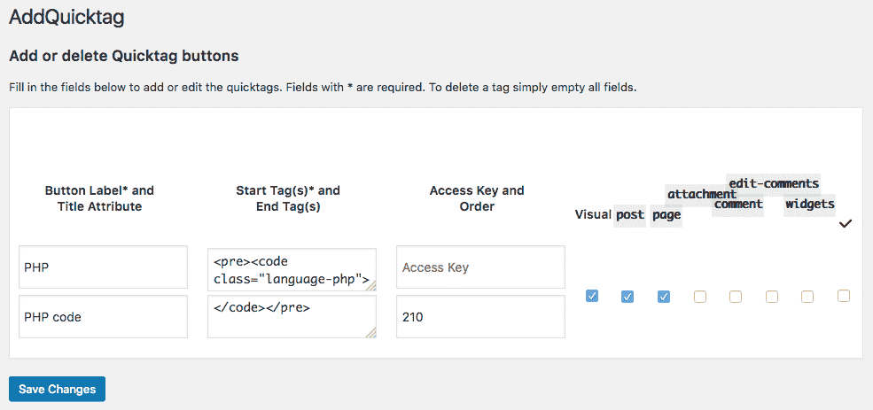
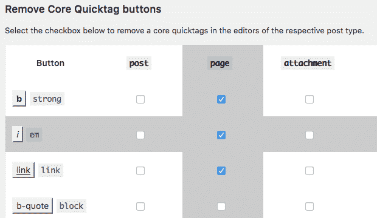
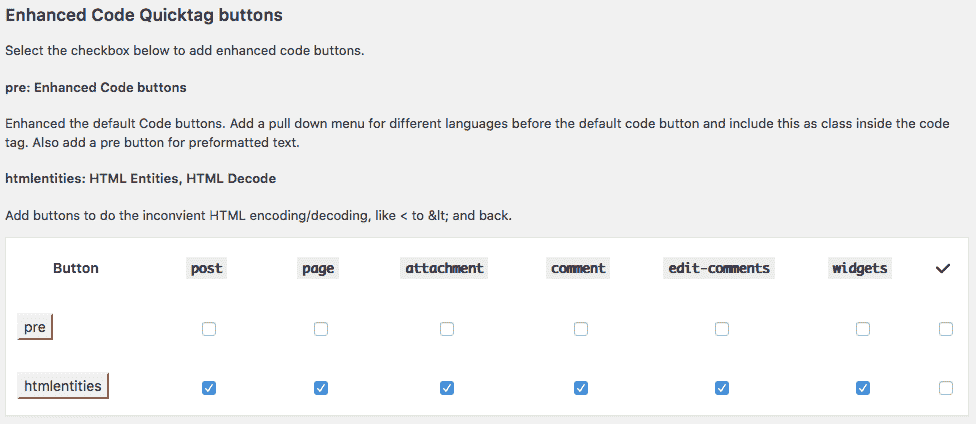

# 深入了解 WordPress 文本编辑器

> 原文：<https://kinsta.com/blog/wordpress-text-editor/>

当我们在 WordPress 中创建或编辑一篇文章时，我们有两个内容编辑器可供选择:可视化编辑器和文本编辑器。后者由一个文本区域元素组成，通过按钮增强，提供了一种将 HTML 代码注入文章内容的快速方法。

用户可以通过点击右上角的标签轻松地从视觉模式切换到文本模式。WordPress 会保留文章内容，但是 TinyMCE 会将特殊字符转换成相应的 HTML 实体。因此，您可能更喜欢

**推荐阅读**:

[潜入新古腾堡 WordPress 编辑器](https://kinsta.com/blog/gutenberg-wordpress-editor/)(利弊)

[WordPress 5.0 的新功能](https://kinsta.com/blog/wordpress-5-0/)(如何准备古腾堡)

文本编辑器完全显示了文章内容的 HTML 结构，并且完全控制用户输入，所以这篇文章是关于 WordPress 文本编辑器的。首先，我们将从开发人员的角度切入主题:我们将看看 **Quicktags JS API** 、 **quicktags_settings** 过滤器和 **wp_editor()** 函数。

这篇文章的最后一部分是献给非开发者的。我将向你展示一个插件，允许用户从 WordPress 管理面板快速配置文本编辑器。



Visual and text editors compared.


*   [WordPress 文本编辑器](#wordpress-text-editor)
*   [覆盖快速标签设置](#overriding-quicktags)
*   [将 WordPress 编辑器放入首页](#wordpress-editor-front-pages)
*   [用 AddQuicktag 插件增强 WordPress 文本编辑器](#wordpress-text-editor-addquicktag-plugin)

## 文字编辑器

如果您习惯于在帖子中添加大量代码，或者您喜欢预览内容的确切 HTML 结构，那么您可能更喜欢准系统文本编辑器，而不是易用的高级可视化编辑器。


然而，文本编辑器不仅仅是一个表单元素。编辑器工具栏提供了一组按钮(称为 quicktags ),允许用户向 HTML post 结构中快速注入大量标签。

默认情况下，WordPress 提供以下快速标签:

*   a
*   强烈的
*   密码
*   是吗
*   全身长的
*   开环（同 Open Loop）
*   保险商实验所
*   里
*   img
*   引用
*   移民局
*   全屏
*   检查
*   关闭



The image shows the default buttons of the WordPress text editor


由于有了 [Quicktags API](https://codex.wordpress.org/Quicktags_API) ，默认设置可以被覆盖。JavaScript API 提供了一种简单的方法来添加自定义按钮，并将代码和内容注入编辑器文本区域。
**qtags . add button**方法向工具栏添加一个按钮，定义如下:

```
QTags.addButton( 
	id, 
	display, 
	arg1, 
	arg2, 
	access_key, 
	title, 
	priority, 
	instance ); 
```

此方法保留以下参数:

*   **id** ( *字符串*)(必选)是按钮的 HTML id
*   **显示** ( *字符串*)(必选)是 HTML 值；
*   **arg1** ( *string* )(必选)是按钮被点击时要包含的开始标签或者要运行的自定义回调函数；
*   **arg2** ( *字符串*)(可选)是结束标签；
*   **access _ key**(*string*)(可选)是按钮的快捷键；
*   **标题** ( *字符串*)(可选)是 HTML 标题；
*   **优先级** ( *int* )(可选)是一个代表按钮在工具栏中位置的数字；
*   **instance** ( *string* )(可选)将按钮限制为 Quicktags 的一个特定实例。

现在让我们假设我们想要添加像 [Prism](http://prismjs.com/) 这样的语法高亮器所需的标签，并且我们想要为编辑器工具栏提供打印以下标记的按钮:

```
<pre><code class="language-php"></code></pre>
<pre><code class="language-css"></code></pre>
<pre><code class="language-html"></code></pre> 
```

为了完成这项任务，我们需要将以下代码添加到插件的主文件中:

```
function my_quicktags() {
	if ( wp_script_is( 'quicktags' ) ) {
	?>
	<script type="text/javascript">
	QTags.addButton( 'eg_php', 'PHP', '<pre><code class=\"language-php\">', '</code></pre>', 'p', 'PHP Code', 100 );
	QTags.addButton( 'eg_css', 'CSS', '<pre><code class=\"language-css\">', '</code></pre>', 'q', 'CSS Code', 100 );
	QTags.addButton( 'eg_html', 'HTML', '<pre><code class=\"language-html\">', '</code></pre>', 'r', 'HTML Code', 100 );
	</script>
	<?php
	}
}
add_action( 'admin_print_footer_scripts', 'my_quicktags' );
```

[admin _ print _ footer _ scripts](https://developer.wordpress.org/reference/hooks/admin_print_footer_scripts/)是一个动作挂钩，用于在管理页面的页脚打印脚本。回调函数检查 quicktags 脚本是否正在使用，然后打印 JS 代码。
这个脚本在管理面板的任何快速标签实例中添加了三个按钮，如下图所示。



The image shows our new custom buttons.


向编辑器工具栏添加按钮相对简单，但是我们可以用 Quicktags API 做更多的事情。例如，我们可以向 **QTags.addButton** 方法传递一个回调函数，以便在用户单击相应的按钮时运行。考虑以下代码:

```
function custom_quicktags() {

	if ( wp_script_is( 'quicktags' ) ) {
	?>
	<script type="text/javascript">
	QTags.addButton( 'eg_callback', 'CSS div', css_callback );

	function css_callback(){
		var css_class = prompt( 'Class name:', '' );

		if ( css_class && css_class !== '' ) {
			QTags.insertContent('<div class="' + css_class +'"></div>');
		}
	}
	</script>
	<?php
	}
}
add_action( 'admin_print_footer_scripts', 'custom_quicktags' ); 
```

**css_callback** 是一个定制的 JS 函数，当用户点击定制按钮时运行。在我们的示例中，该函数提示一个输入框，允许用户为一个 **div** 元素设置类名。
**qtags . insert content**方法将把指定的字符串打印到编辑器的文本区域。



The callback function of our example prompts an input box that allows users to set a class name.


到目前为止，由于**admin _ print _ footer _ scripts**动作，我们已经在管理页面中向 WordPress 编辑器添加了快速标签。如果你在站点前端有任何编辑器实例，你应该将回调函数挂接到 **wp_print_footer_scripts** 动作。

无论如何，在生产中，你应该考虑将你的 JavaScript 文件加入到 WordPress 注册的脚本中，正如在[如何在 WordPress](https://kinsta.com/blog/wp-enqueue-scripts/) 中将你的资产加入队列中所解释的。构建定制快速标签的一个有用工具是 GenerateWP 的[快速标签生成器](https://generatewp.com/quicktags/)。


## 注册订阅时事通讯


### 想知道我们是怎么让流量增长超过 1000%的吗？

加入 20，000 多名获得我们每周时事通讯和内部消息的人的行列吧！

[Subscribe Now](#newsletter)

## 覆盖快速标记设置

Quicktags API 提供了一种向工具栏添加新按钮的方法。多亏了 quicktags_settings 过滤器，WordPress 还允许我们删除按钮。

```
function my_quicktags( $qtInit, $editor_id = 'content' ) {
	$qtInit['buttons'] = 'strong,em,link,block,del,ins,img,ul,ol,li,code,more,close';
	return $qtInit;
}
add_filter( 'quicktags_settings', 'my_quicktags', 10, 2 ); 
```

回调函数保留两个参数: **$qtInit** 是一个设置数组， **$editor_id** 是编辑器的唯一 id。在我们的例子中， **$editor_id** 默认为**‘content’**—编辑帖子页面时编辑器文本区的 id。

> 请注意，快速标记列表中的标记名称由逗号分隔，后面没有空格。

此功能将覆盖默认设置，也可用于移除工具栏中的所有按钮:

```
function my_quicktags( $qtInit, $editor_id = 'content' ) {
	$qtInit['buttons'] = ',';
	return $qtInit;
}
add_filter( 'quicktags_settings', 'my_quicktags', 10, 2 ); 
```

我们已经为 **$qtInit** 数组的**‘buttons’**元素指定了一个逗号值。空字符串不会按预期工作，默认设置不会被覆盖。

## 包括 WordPress 编辑器到首页

从 3.3 版本开始， [wp_editor](https://codex.wordpress.org/Function_Reference/wp_editor) 功能提供了一种简单的方法来将 WordPress 编辑器包含在网站的任何地方。

该函数在*WP-includes/general-template . PHP*文件中定义如下:

```
wp_editor( $content, $editor_id, $settings = array() );
```

*   **$content** ( *字符串*)(必选)设置编辑器的初始内容；
*   **$ editor _ id**(*string*)(必选)设置 textarea 和 TinyMCE 编辑器的 id 属性(只能包含小写字母和下划线)；
*   **$settings** ( *数组*)(可选)一个参数数组。

参数数组允许为两个编辑器设置许多配置参数。一个特定的参数可以将设置直接传递给 Quicktags(参见[Codex 中参数的完整列表](https://codex.wordpress.org/Function_Reference/wp_editor))。

Struggling with downtime and WordPress problems? Kinsta is the hosting solution designed to save you time! [Check out our features](https://kinsta.com/features/)

例如，您可能希望在页面模板中包含编辑器。考虑下面的例子:

```
$content = '';
	$editor_id = 'mycustomeditor';
	$settings = array( 
		'wpautop' => false, 
		'media_buttons' => false, 
		'quicktags' => array(
				'buttons' => 'strong,em,del,ul,ol,li,block,close'
			),
	);
wp_editor( $content, $editor_id, $settings ); 
```

这几行代码将 id 为**‘my editor’**的空编辑器和指定的按钮打印到文本编辑器的工具栏中。

*   将 **wpautop** 参数设置为 false，这样`<p>`元素将用于在编辑器中换行。
*   **media_buttons** 参数被设置为 false，这样用户就不能上传媒体文件。
*   **quicktags** 数组决定了在文本编辑器工具栏中显示的按钮。

对于 WordPress 文本编辑器来说， **wp_editor()** 函数和 **quicktags_settings** 过滤器的主要区别在于该函数适用于编辑器的特定实例。您可以使用它在站点的任何地方包含新的编辑器(如页面模板)，而 quicktags_settings 过滤器会过滤所有现有的实例，不能用于生成新的编辑器实例。

以上示例的完整代码可在 Gist 上找到[。
T3】](https://gist.github.com/carlodaniele/191a53574e3d7965c5e1a49965ec2678)

## 用 AddQuicktag 插件增强 WordPress 文本编辑器

如果你需要一个工具来快速添加按钮到 WordPress 文本编辑器中， [AddQuicktag](https://wordpress.org/plugins/addquicktag/) 就是适合你的插件。



AddQuicktag allows users to add custom buttons to the WordPress text editor.


该插件提供了一个可从*设置*菜单访问的选项页面。在此页面上，管理员用户可以添加自定义按钮和删除现有按钮。

AddQuicktag 允许专门为文章、页面和其他支持编辑器的文本区域(评论、文本小部件等)配置编辑器。

该插件还将快速标签添加到可视化编辑器中。只需选中**可视化**选项，可视化编辑器将显示一个带有自定义按钮的快速标签下拉菜单。

AddQuicktag 选项页面的第二部分专用于内置的 quicktags 配置。在此部分中，可以移除特定文本区域中的按钮。



Three buttons have been removed from the editing pages text editor


最后一部分为编辑器工具条提供了附加功能。第一行选项增强了默认的代码按钮，提供了一个选择菜单，该菜单根据所选的语言为代码标记设置 CSS 类。

第二行提供了编码和解码特殊字符的两个按钮( **htmlentities** )。



Advanced AddQuicktag features


## 摘要

如果你是一个开发者，你会发现给 WordPress 编辑器添加一个主题或者插件特有的特性是很有帮助的。Quicktags API 和许多过滤器和函数为我们的产品增值提供了有价值的工具。如果你不是开发者，你也可以配置 WordPress 编辑器，这要感谢 WordPress 插件目录中的几个免费插件，比如本文中的 AddQuicktag 插件。

关于添加到 WordPress 文本编辑器中的有价值的功能，你还有其他想法吗？

* * *

让你所有的[应用程序](https://kinsta.com/application-hosting/)、[数据库](https://kinsta.com/database-hosting/)和 [WordPress 网站](https://kinsta.com/wordpress-hosting/)在线并在一个屋檐下。我们功能丰富的高性能云平台包括:

*   在 MyKinsta 仪表盘中轻松设置和管理
*   24/7 专家支持
*   最好的谷歌云平台硬件和网络，由 Kubernetes 提供最大的可扩展性
*   面向速度和安全性的企业级 Cloudflare 集成
*   全球受众覆盖全球多达 35 个数据中心和 275 多个 pop

在第一个月使用托管的[应用程序或托管](https://kinsta.com/application-hosting/)的[数据库，您可以享受 20 美元的优惠，亲自测试一下。探索我们的](https://kinsta.com/database-hosting/)[计划](https://kinsta.com/plans/)或[与销售人员交谈](https://kinsta.com/contact-us/)以找到最适合您的方式。