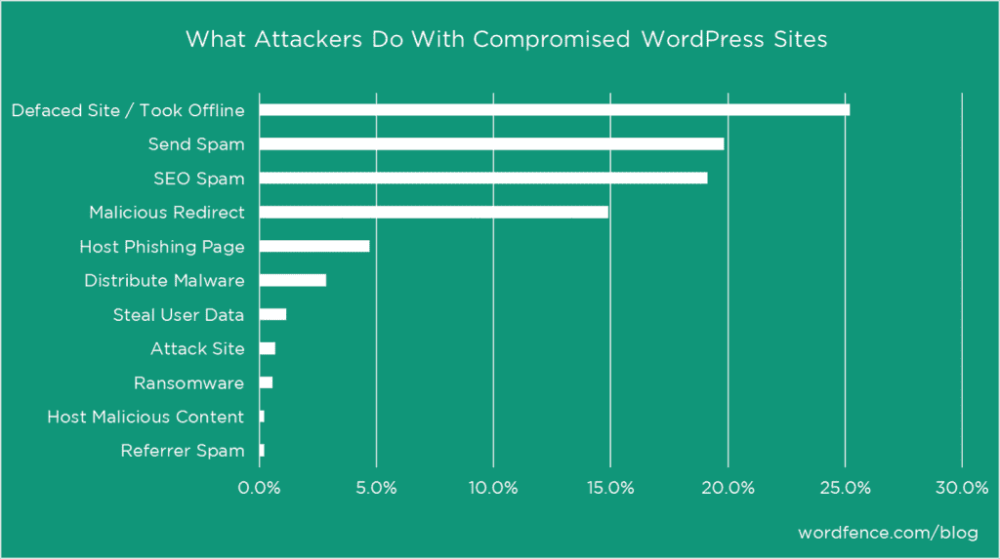
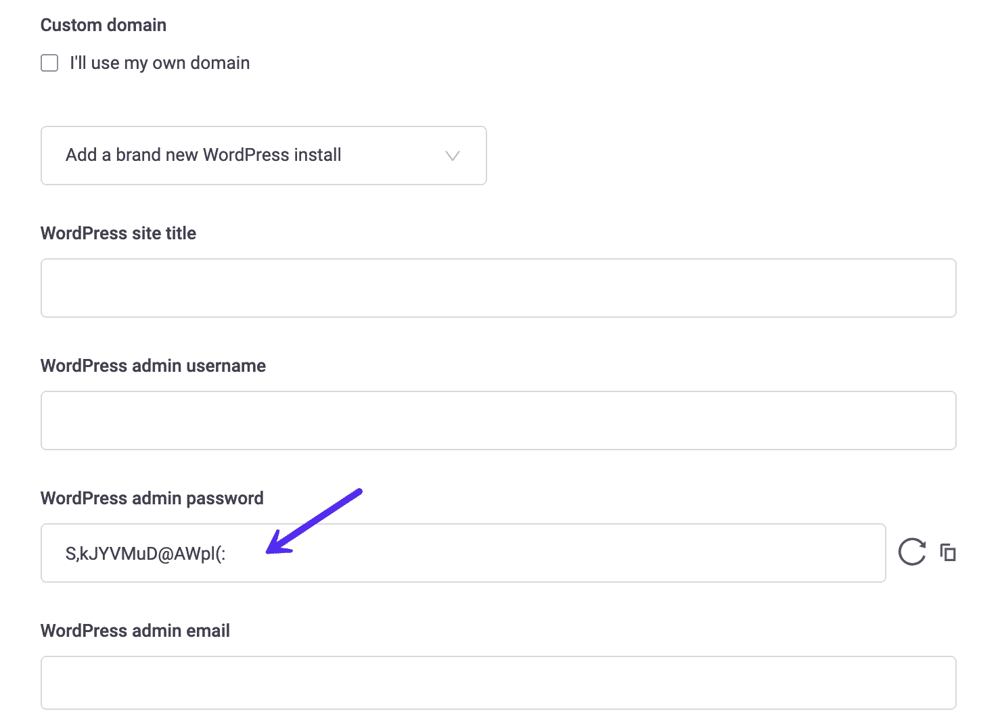
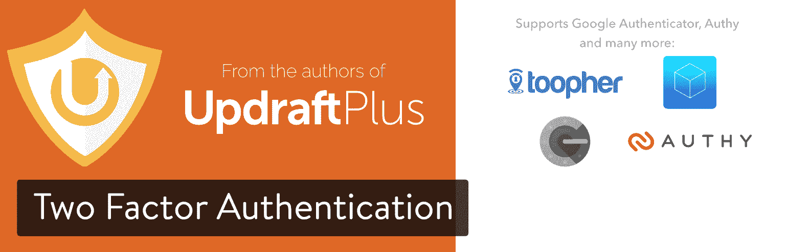
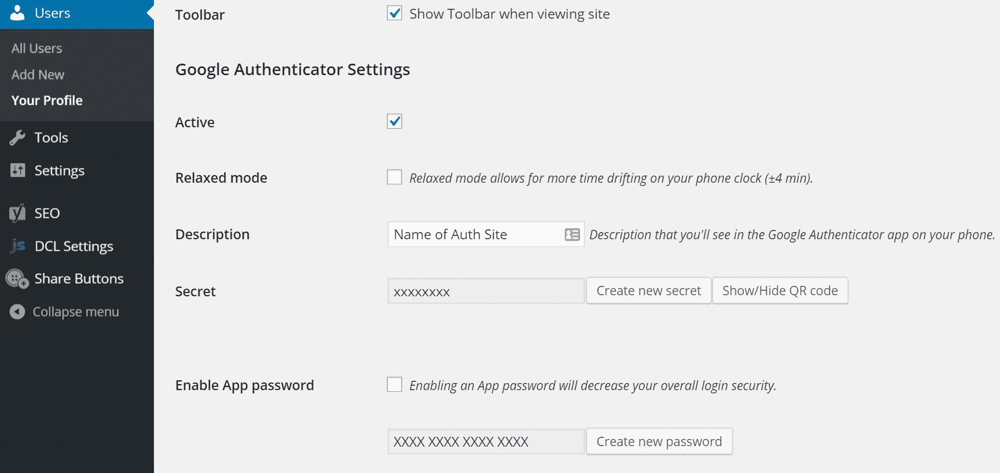
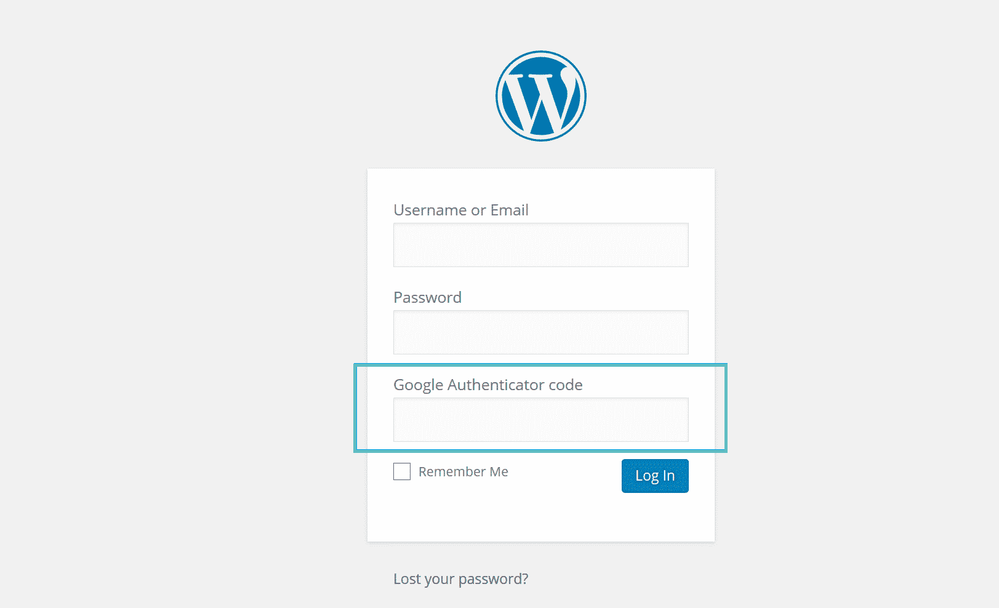

# 双重认证的重要性

> 原文：<https://kinsta.com/blog/wordpress-two-factor-authentication/>

在 Kinsta，我们非常重视安全性，这就是为什么我们为所有 WordPress 托管客户端提供双重认证。没有什么比有人劫持您所有网站的访问权更糟糕的了！我们的 MyKinsta 仪表盘中提供了这一功能，我们强烈建议每个人都好好利用它。今天我们将深入探讨为什么 WordPress 双因素认证是重要的，我们的 2FA 功能是如何工作的，以及为你的 WordPress 站点本身设置双因素的一个很好的免费方法。

*   [为什么双因素认证很重要](#why-two-factor-is-important)
*   [金斯塔双因素认证](#kinsta-two-factor-authentication)
*   [启用 WordPress 双因素认证](#enable-wordpress-two-factor-authentication)

## 为什么双因素身份认证很重要

如果你看看 Joomla 等[顶级 CMS 平台](https://kinsta.com/knowledgebase/content-management-system/)！，Drupal，还有[Magento](https://kinsta.com/magento-market-share/)；WordPress 以超过 [65.1%的市场份额领先](https://kinsta.com/wordpress-market-share/)。由于它的受欢迎程度，这也意味着它比其他的更容易受到攻击。你不能真的说一个平台比另一个更安全。更多的攻击发生主要是因为网站的数量。

另一个原因是由于不熟练的网站所有者。WordPress 一直很棒，因为几乎任何人都可以拿起它并开始使用它，但这也意味着有许多初学者很可能因为没有打补丁、没有用正确的权限锁定而留下后门。

WordFence [在 2016 年调查了大量 WordPress 网站所有者，并要求他们回答以下问题:“如果你知道你的网站是如何被入侵的，请描述攻击者是如何获得访问权限的。” **61.5%的受访者表示，他们不知道攻击者是如何入侵他们的网站的。**](https://www.wordfence.com/blog/2016/03/attackers-gain-access-wordpress-sites/)

他们还进行了另一项调查，看看攻击者对被入侵的 WordPress 网站做了什么。如您所见，25%的内容通常会离线或被篡改。如果你经营 WordPress 业务，这可能是最糟糕的事情之一。这就是为什么您应该先实施安全措施，而不是后实施。

What WordPress attackers do

有很多方法可以锁定一个 WordPress 站点，一个简单的方法是[改变你的 WordPress 登录 URL](https://kinsta.com/blog/wordpress-login-url/#change-login-page) 。这将立即减少你登录 WordPress 网站的失败次数，因为机器人和脚本会不断扫描网页寻找进入的方法。但是最重要的事情之一是简单地**选择一个复杂的密码**。

听起来很简单，对吗？好吧，来看看[SplashData 2018 年度榜单](https://www.teampassword.com/blog/worst-passwords-of-2018)全年最受欢迎的被盗密码(按受欢迎程度排序)。

> 需要在这里大声喊出来。Kinsta 太神奇了，我用它做我的个人网站。支持是迅速和杰出的，他们的服务器是 WordPress 最快的。
> 
> <footer class="wp-block-kinsta-client-quote__footer">
> 
> 
> 
> <cite class="wp-block-kinsta-client-quote__cite">Phillip Stemann</cite></footer>

[View plans](https://kinsta.com/plans/)

1.  One hundred and twenty-three thousand four hundred and fifty-six
2.  密码
3.  One hundred and twenty-three million four hundred and fifty-six thousand seven hundred and eighty-nine
4.  Twelve million three hundred and forty-five thousand six hundred and seventy-eight
5.  one two three four five
6.  One hundred and eleven thousand one hundred and eleven
7.  One million two hundred and thirty-four thousand five hundred and sixty-seven
8.  阳光
9.  标准英语打字键盘的
10.  我爱你

没错！最流行的密码是“123456”，其次是一个惊人的“密码”。这就是为什么在 Kinsta 安装新的 WordPress】时，我们实际上强制使用复杂的密码来登录 wp-admin(如下图所示的一键安装过程)。

Force safe password generation

安全从基础开始。谷歌对如何选择强密码有一些很好的建议。他们的建议之一是启用双因素身份验证。

[Security starts from the basics. Use two-factor authentication and strong passwords! They're there for a reason. 🔒Click to Tweet](https://twitter.com/intent/tweet?url=https%3A%2F%2Fkinsta.com%2Fblog%2Fwordpress-two-factor-authentication%2F&via=kinsta&text=Security+starts+from+the+basics.+Use+two-factor+authentication+and+strong+passwords%21+They%27re+there+for+a+reason.+%F0%9F%94%92&hashtags=websec%2Chosting)

双因素身份验证包括两步过程，在此过程中，您不仅需要密码登录，还需要第二种方法。它通常是一个文本(短信)，电话，或基于时间的一次性密码(TOTP)。在大多数情况下，这 100%有效地防止了对你的 WordPress 站点的暴力攻击。为什么？因为攻击者几乎不可能既有你的密码又有你的手机。

查看下面关于如何启用 WordPress 双因素认证的更多信息。

## 金斯塔双因素认证

在 Kinsta，我们非常重视用户安全。为了帮助我们的客户保护他们的 MyKinsta 账户和 WordPress 站点，我们提供了基于认证器的 2FA 支持。

与传统的基于 SMS 的 2FA 方法(通过文本消息发送登录代码)相比，我们基于验证器的方法使用 Google Authenticator、1Password 和其他 2FA 应用程序中动态生成的代码。这意味着您的 2FA 配置可以抵御 SIM 交换等基本安全攻击。

## 注册订阅时事通讯

### 想知道我们是怎么让流量增长超过 1000%的吗？

加入 20，000 多名获得我们每周时事通讯和内部消息的人的行列吧！

[Subscribe Now](#newsletter)

我们建议您为所有支持 2FA 的互联网服务启用 2FA。要在 MyKinsta 中启用双因素身份验证，请查看我们的[知识库文章](https://kinsta.com/help/two-factor-authentication/)。

## 启用 WordPress 双重认证

现在你已经保护了你的 Kinsta 仪表板，你也可以在你的网站上启用 WordPress 双因素认证。我们推荐以下两个插件中的一个。

### 双因素认证

双因素认证插件由流行的备份插件 UpdraftPlus 的作者开发。它支持标准的 TOTP + HOTP 协议(Google Authenticator、Authy 等)。有免费版和高级版。

Two Factor Authentication WordPress plugin

它目前有超过 10，000 个活跃安装，评分为 4.5 分(满分为 5 星)，并具有以下特性:

*   便于移动扫描的图形二维码
*   包括对 WooCommerce 和 Affiliates-WP 登录表单的支持
*   兼容(插件应该是网络激活的)
*   紧急代码和高级设计布局(高级版)

### 谷歌认证器

如果你正在寻找一个完全免费的解决方案，谷歌认证器插件非常好用。注意:这确实意味着你将会在两个不同的应用程序之间来回切换。您可以确定哪种方法对您的环境最有效。如果你想坚持使用一个应用程序，升级到他们的入门计划可能是正确的选择。在这个例子中，我们将使用免费的 Google 认证器。

Struggling with downtime and WordPress problems? Kinsta is the hosting solution designed to save you time! [Check out our features](https://kinsta.com/features/)

Google Authenticator 插件有 30，000 多个活跃安装，评分为 4.5 分(满分为 5 星)。它是完全免费的，你可以为无限数量的用户设置它。你会注意到大多数其他认证插件都有局限性，除非你升级到付费计划。你可以从 WordPress 知识库下载 [Google Authenticator 插件](https://wordpress.org/plugins/google-authenticator/)，或者在你的 WordPress 仪表盘的“[添加新插件](https://kinsta.com/knowledgebase/how-to-install-wordpress-plugins/)下搜索它。

安装后，您可以点击您的用户资料，将其标记为活动，并创建一个新的密钥或扫描[二维码](https://kinsta.com/blog/create-qr-code/)。

Google Authenticator settings

然后，您可以在手机上使用一个免费的验证器应用程序:

*   [安卓谷歌认证器应用](https://play.google.com/store/apps/details?id=com.google.android.apps.authenticator2&hl=en)
*   [iPhone 谷歌认证器应用](https://itunes.apple.com/us/app/google-authenticator/id388497605?mt=8)
*   [Windows Phone 验证器应用](https://www.microsoft.com/en-us/store/apps/authenticator/9wzdncrfj3rj)

启用后，现在将需要您的正常密码登录，加上代码从谷歌认证应用程序在您的手机上。你会注意到现在在你的 [WordPress 登录页面](https://kinsta.com/blog/wordpress-login-url/)上出现了一个额外的字段。此外，这个插件与我们之前推荐的[改变你的 WordPress 登录网址](https://kinsta.com/blog/wordpress-login-url/)的插件完全兼容。

Google Authenticator WordPress login

就是这样！你现在在你的 Kinsta 账户和 WordPress 网站上有了双重认证。

## 摘要

我们很高兴为 Kinsta 客户提供双因素身份认证，因为这是我们最需要的功能之一。保护你的 WordPress 网站变得更加容易了！请务必查看我们关于 WordPress security 的更高级的指南，看看如何真正锁定你的网站。

对 WordPress 双因素认证的工作原理有任何疑问吗？欢迎在下面给我们留下评论，或者在 MyKinsta 仪表盘中打开一张支持票。

*QR Code 是 DENSO WAVE INCORPORATED 在美国和其他国家的注册商标。*

* * *

让你所有的[应用程序](https://kinsta.com/application-hosting/)、[数据库](https://kinsta.com/database-hosting/)和 [WordPress 网站](https://kinsta.com/wordpress-hosting/)在线并在一个屋檐下。我们功能丰富的高性能云平台包括:

*   在 MyKinsta 仪表盘中轻松设置和管理
*   24/7 专家支持
*   最好的谷歌云平台硬件和网络，由 Kubernetes 提供最大的可扩展性
*   面向速度和安全性的企业级 Cloudflare 集成
*   全球受众覆盖全球多达 35 个数据中心和 275 多个 pop

在第一个月使用托管的[应用程序或托管](https://kinsta.com/application-hosting/)的[数据库，您可以享受 20 美元的优惠，亲自测试一下。探索我们的](https://kinsta.com/database-hosting/)[计划](https://kinsta.com/plans/)或[与销售人员交谈](https://kinsta.com/contact-us/)以找到最适合您的方式。