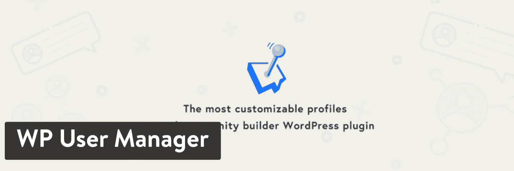
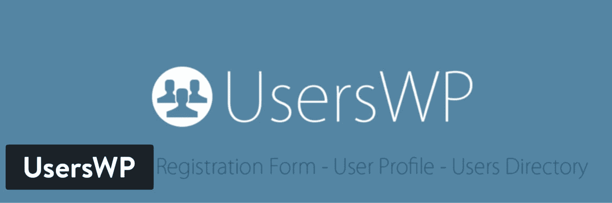
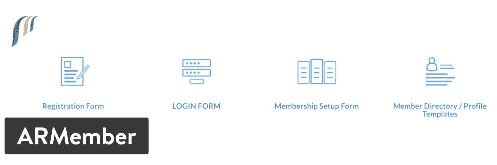

# 9 个最好的 WordPress 用户注册插件来启动你的网站

> 原文：<https://kinsta.com/blog/wordpress-user-registration-plugins/>

有时，学校需要在网上为学生注册实地考察，企业主可能需要为即将到来的会议或研讨会注册用户。不管什么原因，一个很好的做法是使用最好的 WordPress 用户注册插件之一。

这些插件为用户注册和登录提供了强大的工具。不仅如此，你还可以为任务找到各种额外的功能，比如滴内容、[锁定用户](https://kinsta.com/blog/wp-admin-login/)，等等。

## 在 WordPress 用户注册插件中寻找的特性

不是所有的 WordPress 用户注册插件都是一样的。但是，有一些功能您几乎应该一直留意:

*   无限形式的选择。
*   [向会员](https://kinsta.com/blog/woocommerce-payment-gateways/)收款的工具。有 [PayPal](https://kinsta.com/blog/stripe-vs-paypal/) 支持当然好，但信用卡更好。
*   保护您的内容并阻止某些用户查看的能力。
*   支持[多个会员级别](https://kinsta.com/blog/wordpress-membership-plugins/)和支付。
*   [拖放编辑器](https://kinsta.com/blog/wordpress-page-builders/)让你在设计表单的时候不用写太多代码。
*   自定义字段的大型集合。
*   快速访问的社交登录按钮。
*   用于管理用户的成员目录。
*   好看的登录和注册表单模板。
*   用户资料，包括头像、个人资料和社交链接。

这不是您需要的功能的完整列表，所以请确保列出您的组织最需要的功能。然后看看我们下面的广泛评论。

(建议:[2022 年使用的前 13 个 WordPress 项目管理插件和工具](https://kinsta.com/blog/wordpress-project-management-plugins/))。
T3】

## 9 个最佳 WordPress 用户注册插件

这里是我们最喜欢的用户注册插件的快速列表:

> 需要在这里大声喊出来。Kinsta 太神奇了，我用它做我的个人网站。支持是迅速和杰出的，他们的服务器是 WordPress 最快的。
> 
> <footer class="wp-block-kinsta-client-quote__footer">
> 
> 
> 
> <cite class="wp-block-kinsta-client-quote__cite">Phillip Stemann</cite></footer>

[View plans](https://kinsta.com/plans/)

### 1.用户注册

用户注册插件包含了公司制作一个简单而有效的前端注册模块所需要的东西。拖放构建器改进了您的设计过程，消除了任何复杂编码的需要。我们喜欢它，因为它是最好的轻量级用户注册插件之一，而且大多数最好的特性都被打包到免费插件中。

如果你计划升级，考虑 49 美元的个人计划。这是你开始接受额外费用的地方(而不是单独支付)。例如，个人计划有 7 个高级插件，而 Plus 计划提供 14 个插件。其他一些高级工具包括电子邮件营销、文件上传和内容限制等功能。

User Registration WordPress plugin

尽管免费版对小企业来说很管用，但我们还是不得不推荐个人版的主要升级计划。例如，你会收到额外的文件上传工具、高级字段和一个 [WooCommerce](https://kinsta.com/learn/woocommerce-guide/) 集成。一些高级插件包括邀请代码、 [LearnDash](https://kinsta.com/blog/wordpress-lms-plugins/#learndash) 支持、字段可见性等等。

#### 使用户注册成为最佳选择的特性:

*   用户注册插件是在你的网站上获得用户注册表单的最干净的方式之一。这些都是在后端管理的，但是你可以看看可视化构建器，看看前端呈现的是什么。
*   你可以创建无限数量的注册表单，甚至是免费版。
*   [shortcode](https://kinsta.com/blog/wordpress-shortcodes/) 支持使您能够将您的注册表单放置在栏、页和帖子中。
*   向用户和管理员发送电子邮件通知。
*   用户注册时附带了几个表单模板，减少了开发时间。
*   通过简单的 CSV 导出下载用户数据。
*   付费版本给你提供了一系列令人难以置信的插件。有些包括社交按钮、内容限制工具和文件上传。
*   电子商务网站也可以利用用户注册集成。

#### 谁应该考虑用户注册？

我们喜欢用户注册插件，为那些想简单地创建注册表单的人服务。这是一个负担得起的插件，你有机会在支付高级包之前测试它。

此外，用户注册有广泛的插件，有助于使您的表单更先进。

### 2.注册魔术

[注册 Magic](https://wordpress.org/plugins/custom-registration-form-builder-with-submission-manager/) 使用强大的注册工具，让网站管理员完全控制用户注册的完成方式和管理方式。最基本的，RegistrationMagic 允许你为不同的用户创建多个注册页面。

通过这种方式，一个用户会来到你的网站，看到与其他人相比的可选字段。还包括了许多其他特性，比如接受用户注册表单上的文件附件的选项。我们也喜欢你可以接受新用户的付款。

RegistrationMagic WordPress plugin

每个收到的注册都被监控并记录在仪表板上。您还可以使用可视化的表单生成器，而不是弄乱代码或设置。自动回复器非常适合通知新用户，而 [MailChimp](https://kinsta.com/blog/how-to-use-mailchimp/) 注册可以帮助你建立你的电子邮件列表。

这个免费插件充满了大多数企业都应该满意的特性。这包括像导出/导入、魔术弹出和可视表单编辑器扩展这样的扩展。高级计划起价 89 美元，提供额外的功能，如令牌系统、手动批准、PDF 品牌和几十种其他独特的功能。你只能在一个网站上使用 premium 版本，而 Premium+套餐则允许以 189 美元的价格无限制使用网站。

#### 使 RegistrationMagic 成为最佳选择的功能:

*   RegistrationMagic 提供了一个免费插件，拥有大量用户注册功能。付费版本也负担得起，它大大扩展了功能集。
*   您会收到一个可视化的表单管理器，用于设计您的用户在注册您的网站之前看到的内容。
*   为您提供了多种表单样式，无需代码即可开始设计。您可以选择在注册时接受文档附件。
*   该插件提供了一种向不同用户呈现不同表单的方式。
*   它有一个安全面板，有 reCaptcha 支持、提交限制和禁止的电子邮件地址。
*   注册后，电子邮件通知会发送给管理员和用户。
*   你可以将这个插件与 MailChimp 和其他电子邮件营销工具集成在一起。
*   WooCommerce 也很好地整合了。
*   该插件链接到支付处理器，如 [PayPal 和 Stripe](https://kinsta.com/blog/stripe-vs-paypal/) ，用于在会员或独家网站上收取付款。
*   对允许注册的次数和尝试次数设置限制。
*   您可以完全控制注册表的外观。此控制也适用于您的用户管理。

#### 谁应该考虑注册魔术？

我们喜欢面向普通用户的 RegistrationMagic，考虑到这个插件几乎是 WordPress 上用户注册的一体化解决方案。您将获得一些基本功能，如简单的表单和定制，以及一些不太常见的功能，如文档附件、付款接受和自动回复。

### 3.终极成员

[终极成员](https://wordpress.org/plugins/ultimate-member/) WordPress 插件拥有高下载率和令人印象深刻的评级，这使得它成为试图提供前端用户配置文件、注册表单和[登录选项](https://kinsta.com/blog/wordpress-login-url/)时的首选解决方案。自定义表单字段对于按照您想要的方式设计您的登录是必不可少的，而拖放构建器肯定会在设计时改善用户体验。

核心插件是免费的，并附带了一些优秀的工具，用于用户帐户页面、表单的条件逻辑和成员目录。

Ultimate Member WordPress plugin

终极会员的伟大之处在于，它的核心功能非常适合新手和小型企业。然后，用户可以通过支付单个扩展的费用来升级，或者用一张年票支付所有扩展的费用。一些扩展包括使内容私人化的选项，添加 reCAPTCHA，以及与 [Instagram](https://kinsta.com/blog/instagram-stats/) 集成。

这些扩展的费用各不相同，但其中许多站点的费用约为 40 美元。扩展通行证提供所有 20 个扩展，每年 249 美元。

#### 使终极会员成为最佳选择的特性:

*   核心插件是免费的，有很多很棒的特性。此外，站点所有者可以灵活地购买单个扩展，也可以批量购买所有扩展。
*   UltimateMember 还出售一个与插件无缝集成的主题。
*   强大的注册功能包括角色选择、多个注册表单和注册操作。
*   您可以实施反垃圾邮件措施并创建自定义密码重置链接。
*   用户简介提供了 bios、用户信息、封面照片等等。
*   借助一般权限和各种简档访问，您可以生成[用户角色](https://kinsta.com/blog/wordpress-user-roles/)。
*   成员目录为你提供了用户分类、社交图标和显示封面照片的选项。
*   您可以选择使用基于特定页面和帖子的规则进行全局网站访问。
*   自定义字段有广泛的选项，如必填字段、星级和文件上传。
*   在整个注册过程中，电子邮件会自动发出。例如，您的网站将发送一封待审查的电子邮件和帐户拒绝电子邮件。
*   form builder 对于所有的体验级别都很有用，它提供了添加行、创建多栏布局和重新排序表单元素的工具。

#### 谁应该考虑终极会员？

UltimateMember 对于那些想要测试用户注册插件并有机会用单独的扩展来扩展功能的公司来说很有意义。还有许多独特的扩展和功能，如 Instagram 集成和私人消息。

### 4.用户注册和用户资料

也被称为配置文件生成器，[用户注册&用户配置文件](https://wordpress.org/plugins/profile-builder/)插件是 WordPress 的一体化用户注册和配置文件管理器。该插件提供了一长串免费功能，其中一些包括一个拖放表单生成器和一个用于构建[自定义用户登录](https://kinsta.com/blog/wordpress-custom-dashboard/#how-to-customize-the-wordpress-login-page)小部件的模块。我们喜欢的一些其他元素是内容限制选项和 reCAPTHA，这两者都不需要用户付费。

Profile Builder 的[高级版](https://www.cozmoslabs.com/wordpress-profile-builder/?utm_source=wp.org&utm_medium=pb-description-page&utm_campaign=PBFree)起价为每年 69 美元，可以在一个网站上使用，并增加了许多功能。例如，这个计划中的一些高级插件包括[社交连接](https://kinsta.com/blog/wordpress-social-media-plugins/)、WooCommerce sync 和 [bbPress](https://kinsta.com/knowledgebase/bbpress/) 支持。你也可以升级到 149 美元一年，获得一些其他的用户模块，比如重复字段和自定义重定向。

User Registration & User Profile WordPress plugin

像所有优秀的用户注册插件一样，Profile Builder 在前端和后端看起来都很漂亮。条件逻辑应该确保完全定制，而导入和导出有助于以更有组织的方式管理用户。

#### 使用户注册和用户档案成为最佳选择的功能:

*   免费版包含了没有高级会员你不会得到的功能。不仅如此，开发人员还为额外的工具提供了两个负担得起的年度计划。
*   很容易根据用户角色来限制内容。
*   短代码用于创建注册、档案管理和登录区域。
*   管理表单和配置文件是在一个时尚的拖放编辑器的帮助下完成的。
*   用户经常需要为其他竞争对手插件中的内容限制和 reCAPTCHA 之类的东西付费。在 Profile Builder 中却不是这样。
*   高级版集成了 bbPress 和 [BuddyPress](https://kinsta.com/blog/buddypress-bbpress-glotpress-development-john-james-jacoby-started-campaign-fund-project/) ，帮助你建立一个社交网络或论坛。
*   WooCommerce sync 可以限制访问您的[电子商务](https://kinsta.com/blog/wordpress-ecommerce-plugins/)网站上的某些页面。
*   您有机会在保费计划中生成多个注册表单和多个编辑个人资料表单。
*   用户可以享受与 MailChimp 和 MailPoet 的可能集成，以增强电子邮件营销。

#### 谁应该考虑用户注册和用户档案？

对于那些喜欢使用短代码的人，我们喜欢 Profile Builder 插件。使用插件创建的大多数表单和模块都有短代码，便于在前端实现。如果你不想付费，Profile Builder 在核心插件中也有一个强大的功能集。

### 5.WP 用户管理器

WP 用户管理器提供了一个高度可定制的社区构建器，支持用户档案和注册表单。从密码恢复到帐户定制，一切都打包到这个强大而灵活的会员/注册插件中。免费的功能和扩展是可用的，与其他需要付费的插件集合。我们最喜欢的一些功能包括自定义电子邮件、MailChimp 和社交登录。我们刚刚提到的所有这些都是付费插件，从 39 美元到 149 美元不等，取决于你需要在多少个网站上使用插件。

## 注册订阅时事通讯

### 想知道我们是怎么让流量增长超过 1000%的吗？

加入 20，000 多名获得我们每周时事通讯和内部消息的人的行列吧！

[Subscribe Now](#newsletter)

你可以在 [WP 用户管理器网站](https://wpusermanager.com/)找到所有功能和升级包。开发者并不出售所有功能的月包或年包，而是，你可以单独购买所有插件，或者在某些情况下免费下载。

WP User Manager WordPress plugin

在免费的扩展之外，我们可以期待:

*   帐户删除工具
*   个人数据导出
*   用户名长度的最小值和最大值
*   Google reCAPTCHA

除此之外，实际的插件包括免费功能，如[SEO](https://kinsta.com/blog/what-does-seo-stand-for/)URL、内容限制和自定义[重定向](https://kinsta.com/help/redirect-rules/)。这是一个更干净、更简单的实现用户注册的插件。前端表单易于实现，用户目录看起来现代且功能强大，而[定制小部件](https://kinsta.com/blog/wordpress-widgets/)和设计器提升了你设计用户注册系统的能力。

#### 使 WP 用户管理器成为最佳选择的特性:

*   该插件的许多主要特性都在免费版本中给出了。例如，自定义重定向和内容限制规则与核心插件一起出现。
*   该插件是开发人员友好的，同时也允许初学者为用户提供一个更清晰的注册表单。
*   WP 用户管理器[翻译就绪](https://kinsta.com/blog/wordpress-multilingual/)。
*   简单的用户目录非常适合查找用户，并将他们组织在一个列表中。
*   shortcode editor 确保您的所有表单和模块都可以放在网站上的任何地方。
*   没有必要支付每年 100 美元以上的会员费，因为所有的插件和扩展都是单独出售的。这样，你只需要支付和使用你需要的插件。
*   这个插件有几个免费和付费的插件，比如用户验证、社交登录和 MailChimp。

#### 谁应该考虑 WP 用户管理器？

这是 WordPress 的一个基本的用户注册插件。因此，对于想要更多空白来定制表单的开发人员来说，它看起来是一个不错的选择。不仅如此，它还是一个高度简约的系统，不会让你的网站空间变得杂乱无章。

### 6.用户 sWP

[UsersWP](https://wordpress.org/plugins/userswp/) 插件提供了创建用户目录、用户档案、注册表单和登录表单的工具。所有这些都是无限的，所以你可以在同一个网站上生成多个登录表单。插件的目的是尽可能的轻量级，让用户有更好的体验，同时提供一些更有效的工具来制作表单。例如，拖放 profile builder 很好地结合了各种简码，用于编辑配置文件和注册用户等任务。

这些简介是基本的，但它们融入了基本元素，如头像、封面图片和可选的标签菜单。所以，如果你添加了菜单，它会显示用户的帖子和评论。定期下载是免费的，你会收到两个免费插件:社会登录插件和一个 reCAPTCHA 插件。

UsersWP WordPress plugin

看起来开发者通过销售高级插件来赚钱。这无疑限制了你免费获得的功能数量，但至少用户可以选择他们需要的插件，跳过他们不需要的。在这里找到[高级插件，并考虑以 99 美元的价格购买所有插件。](https://userswp.io/downloads/category/addons/)

插件列表很长，但这里有几个似乎很受用户欢迎:

*   用户审核
*   MailChimp
*   伍尔科贸易公司
*   bbPress
*   限制用户注册
*   MyCRED 奖励用户
*   多站点创建者
*   更多的

#### 使用户 sWP 成为最佳选择的功能:

*   基本插件有一个简单的界面，任何人都可以使用。它基本上是一个拖放编辑器来制作表单，并配有许多短代码。
*   短代码可用于用户配置文件、登录表单和用户目录。
*   在所有适当的页面被激活之后，短码被自动执行。这意味着只需点击一个按钮就可以打开所有的短码。
*   用户资料提供了有趣的信息，如用户帖子和评论。
*   个人资料页面有必要的东西，比如头像、封面图片，甚至菜单。
*   超过 15 个插件可用于激活强大的功能，如 MailChimp，个人资料进度条和追随者计数。
*   这些插件通常售价在 29 美元左右，非常合理。更不用说，你可以以大幅折扣的价格订购所有的插件。
*   很容易通过你的用户数据库进行搜索，并根据名字、图片甚至用户注册时间来定位用户。

#### 谁应该考虑 UsersWP？

简单是带有 UsersWP 插件的游戏的名字。它很适合那些想要一个干净的拖放表单生成器的人。对于喜欢短码的用户来说也不错。最后，UsersWP 很好地迎合了那些在网上销售商品的人。例如，这个插件有插件，可以轻松下载数字内容和 WooCommerce。

厌倦了 WordPress 的问题和缓慢的主机？我们提供世界一流的支持，由 WordPress 专家提供 24/7 服务和超快的服务器。[查看我们的计划](https://kinsta.com/plans/?in-article-cta)

### 7.个人资料展示

ProfilePress 拥有强大的前端登录和用户注册工具。该插件旨在符合[任何 WordPress 主题](https://kinsta.com/blog/how-to-install-a-wordpress-theme/)。你不需要知道如何用 HTML 和 [CSS](https://kinsta.com/blog/wordpress-css/) 来建立一个专业的表单，因为有一个流畅的拖放构建器可以使用。也就是说，开发人员也出售插件，这些插件是常用的扩展，所以你实际上不需要知道如何编码。

ProfilePress

综上所述，开发者有机会获得更便宜的软件包，起价为每年 99 美元。这提供了所有官方主题、三个专业附加组件和所有常规附加组件。见鬼，如果你想在这个插件上省钱，甚至还有一个 69 美元的个人计划。

总的来说，ProfilePress 是一个可靠的插件，有几十个主题和插件。对于初学者来说，这并不简单，但是使用正确的部件，你可以让它工作。

#### 使 ProfilePress 成为绝佳选择的功能:

*   ProfilePress 支持无限数量的表单和密码字段，全部免费。
*   在登录、注册和密码重置等操作之后，您可以将用户重定向到不同的页面。
*   开发者甚至一些新手都有机会购买带有表单主题的包。这是[在这个插件中不用编码制作一个表单](https://kinsta.com/blog/embed-google-form/)的最好方法。
*   为谷歌、 [Github](https://kinsta.com/knowledgebase/what-is-github/) 和[脸书](https://kinsta.com/blog/how-to-create-a-facebook-page/)提供社交登录。
*   您可以升级可定制的选项卡式小部件，以及一次性无密码登录功能。
*   该插件的大部分功能是自动重置密码、发送电子邮件以及向新用户展示欢迎信息。
*   [多站点集成](https://kinsta.com/blog/wordpress-multisite/)在一个额外的附加组件的帮助下是可能的。
*   通过使用 WooCommerce 集成，您可以管理从运输到账单字段的所有内容。
*   BuddyPress 有自己的整合。
*   在 MailChimp 和 Campaign Monitor 集成的帮助下，您可以利用您的用户数据库进行电子邮件营销。

#### 谁应该考虑 ProfilePress？

ProfilePress 看起来对希望从漂亮的表单模板开始的开发人员很有吸引力。至于功能，我们特别喜欢给用户发电子邮件和重定向到不同页面的自动化功能。ProfilePress 中的插件不是独立的插件；相反，它们是基于您的许可层站点下载的插件中可用的功能。

### 8.UserPro

[UserPro](https://codecanyon.net/item/userpro-user-profiles-with-social-login/5958681) 只能作为高级插件购买。CodeCanyon 上的标价是 39 美元，但根据我们从开发者那里看到的情况，这个价格偶尔会有变化。UserPro 是价格较低的整个包，允许用户完全自由地创建登录和注册表单。成员列表布局改善了用户参与和理解他们在你的网站上做什么的方式。发送徽章和成就，以说服您的用户更多地参与并达到某些里程碑。

一键式社交连接工具也值得一提，因为用户可以使用他们的社交资料注册你的网站。

UserPro WordPress plugin

插件的后端一开始看起来有点吓人，但是一旦你掌握了窍门，它实际上是相当有条理的。例如，你可以查看从待定请求到 WooCommerce 活动、从电子邮件到基于角色的字段的所有内容。编辑字段和设置是在拖放编辑工具的帮助下完成的，有几十个字段可供选择和自定义。

#### 使 UserPro 成为最佳选择的特性:

*   UserPro 是一个付费的高级插件。如果你想在头几个月享受优质的客户服务，这是一个实惠又不错的选择。
*   PayPal 集成是免费的，可以很容易地从会员那里收取费用。
*   多个注册表单模板[提供有自定义字段](https://kinsta.com/blog/advanced-custom-fields/)。
*   你可以整合一些一键式社交媒体登录按钮。其中包括脸书、Instagram 和 Twitter。
*   漂亮的用户资料包括用户照片、姓名、社交链接和个人简介。它也只需要一次点击，用户就可以关注你网站上的其他用户。
*   UserPro 提供徽章和成就来激励您的用户完成任务，如撰写博客帖子或与其他用户互动。
*   您可以根据用户的类型来限制网站访问。
*   该插件包括一个可搜索的成员列表，供个人查找有相似兴趣的人。这呈现在一个光滑的，基于网格的照片列表中。

#### 谁应该考虑 UserPro？

几乎任何公司或网站所有者都会发现 UserPro 相当强大。话虽如此，成就和徽章似乎是插件中最独特的功能。这样，它允许你创建一个游戏化的系统。我们还认为，如果你想通过贝宝付款，这个插件会很神奇。

### 9.ARMember

ARMember 是 CodeCanyon 上销售的最好的 WordPress 用户注册插件之一。同样，这有助于降低价格，增加功能，并在开始时提供一些客户支持。ARMember 售价 43 美元，它提供[卓越的内容保护](https://kinsta.com/blog/password-protect-wordpress-site/)，几种会员模式，以及通过 WooCommerce 网站的订阅。你也可以找到一些值得尊敬的登录和注册表单，它们不需要很长的设计时间。

登录和注册表单看起来时尚而现代，有标识、多个字段和“丢失密码”链接。后端用户列表允许管理员管理从会员类型到状态的一切。头像和用户名也融入其中。

ARMember WordPress plugin

ARMember 插件看起来如此吸引人的一个主要原因是它广泛的成员支持。不管你愿意让会员免费还是付费加入都没关系。如果你想允许一年会员或每月会员也没关系。除了多种支付周期和多种支付方式，ARMember 插件还拥有令人印象深刻的功能集。

#### 使 ARMember 成为最佳选择的特性:

*   ARMember 只对大量功能收取一次性费用。
*   该插件允许无限数量的会员类型和支付周期。
*   登录和注册表格是你在市场上能找到的最漂亮的表格之一。
*   允许您的客户使用脸书、Twitter 和 Instagram 上的社交用户信息登录。
*   [安全](https://kinsta.com/blog/wordpress-security-plugins/)选项内置于插件中，用于保护整个网站，而不仅仅是插件。
*   增加多种级别的会员资格，以获得更多的钱，并为贵宾提供最好的内容。
*   用户可以选择他们想要的支付方式，无论是用信用卡还是贝宝。
*   你可以滴下内容，给那些在你的网站上最活跃的用户发徽章。
*   发票和优惠券可用于收取您的付款，并提示新用户访问和注册您的网站。
*   该插件直接与 WooCommerce 集成，因此管理员可以通过他们当前的电子商务网站销售会员资格。

#### 谁应该考虑 ARMember？

ARMember 有一系列功能，让销售会员资格变得更加容易。这就是为什么它看起来是收取费用的会员网站的一个很好的选择。这样做的原因是因为 ARMember 与 WooCommerce 集成，允许多种支付方式，并且会员选项比竞争对手好得多。

[Need to allow your members, users, readers to log in and register? Here's a selection of the best #WordPress user registration plugins to power up your site! ✋👍Click to Tweet](https://twitter.com/intent/tweet?url=https%3A%2F%2Fkinsta.com%2Fblog%2Fwordpress-user-registration-plugins%2F&via=kinsta&text=Need+to+allow+your+members%2C+users%2C+readers+to+log+in+and+register%3F+Here%27s+a+selection+of+the+best+%23WordPress+user+registration+plugins+to+power+up+your+site%21+%E2%9C%8B%F0%9F%91%8D&hashtags=wpplugins%2Cmembership)

## 哪个最好的 WordPress 用户注册插件最适合你的企业？

用户注册插件的不幸之处在于，它们实在太多了。然而，我们已经把它削减到最好的，希望让你的选择更容易！

以下是关于谁应该决定哪个插件的一些最终建议:

1.  注册魔术(registration magic)——把这个插件看作是最好的全方位用户注册解决方案。
2.  [用户注册](#User-registration)–这是一个非常简单的方法。
3.  [终极成员](#ultimate-member)–非常适合独特的插件和可扩展选项。
4.  用户注册&用户简介–如果你喜欢短代码，可以考虑一下这个插件。
5.  WP 用户管理器(WP User Manager)——对于想从一个准系统表单构建器开始的开发者来说是一个可靠的选择。
6.  [UsersWP](#UsersWP)–如果你渴望简单(拖放构建器和优秀的短代码)，我们喜欢 users WP。
7.  [profile press](#ProfilePress)——对开发者来说是个好消息。
8.  如果你想要成就和徽章，我们喜欢这个插件。
9.  [会员](#ARMember)–销售会员资格和其他物品的绝佳选择。

就是这样！如果你对最好的 WordPress 用户注册插件有任何疑问，请在下面的评论中告诉我们。

* * *

让你所有的[应用程序](https://kinsta.com/application-hosting/)、[数据库](https://kinsta.com/database-hosting/)和 [WordPress 网站](https://kinsta.com/wordpress-hosting/)在线并在一个屋檐下。我们功能丰富的高性能云平台包括:

*   在 MyKinsta 仪表盘中轻松设置和管理
*   24/7 专家支持
*   最好的谷歌云平台硬件和网络，由 Kubernetes 提供最大的可扩展性
*   面向速度和安全性的企业级 Cloudflare 集成
*   全球受众覆盖全球多达 35 个数据中心和 275 多个 pop

在第一个月使用托管的[应用程序或托管](https://kinsta.com/application-hosting/)的[数据库，您可以享受 20 美元的优惠，亲自测试一下。探索我们的](https://kinsta.com/database-hosting/)[计划](https://kinsta.com/plans/)或[与销售人员交谈](https://kinsta.com/contact-us/)以找到最适合您的方式。