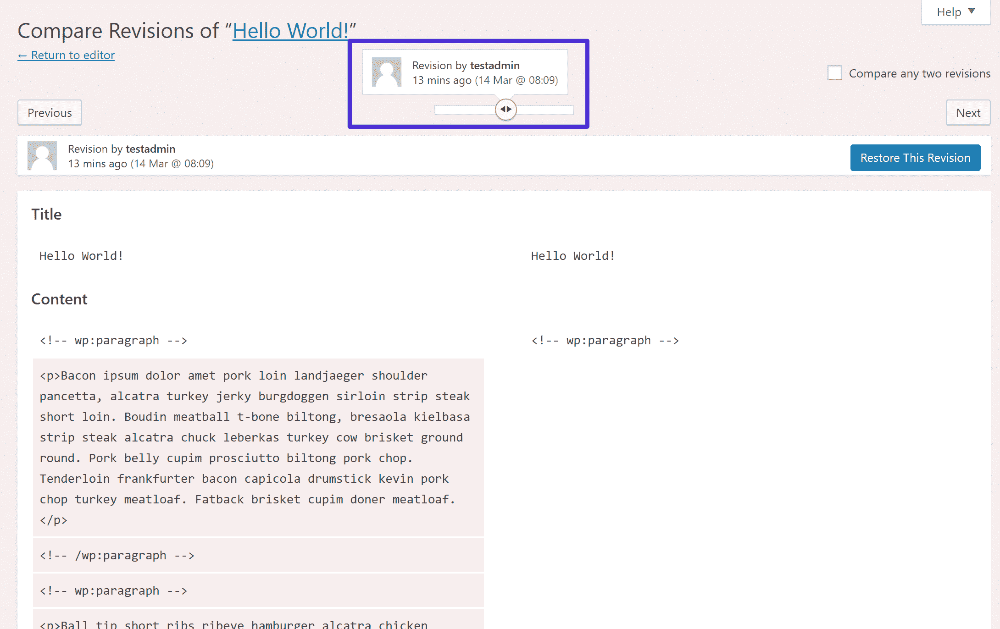
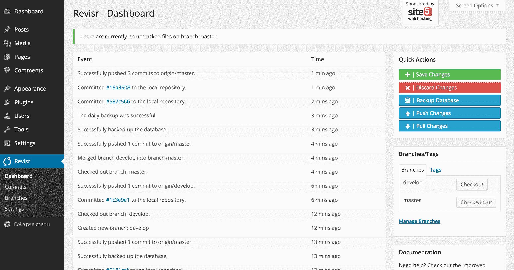
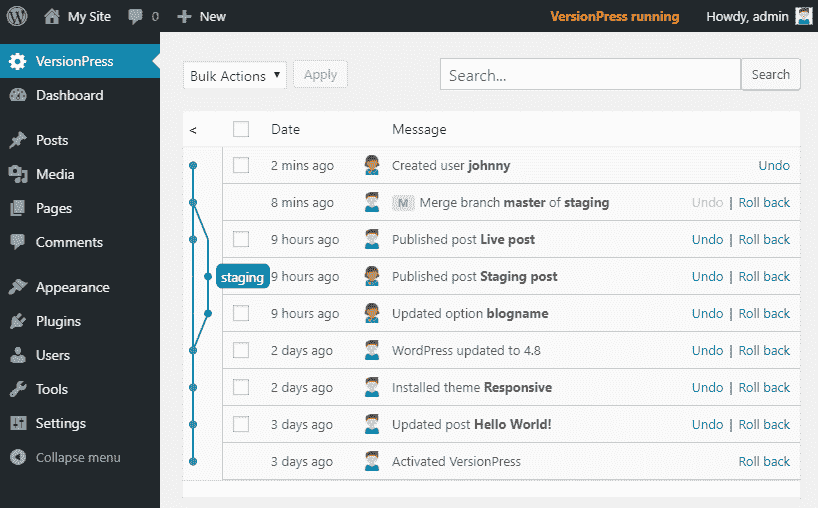
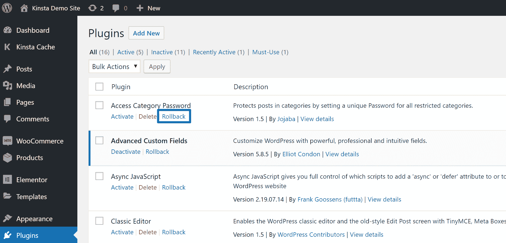
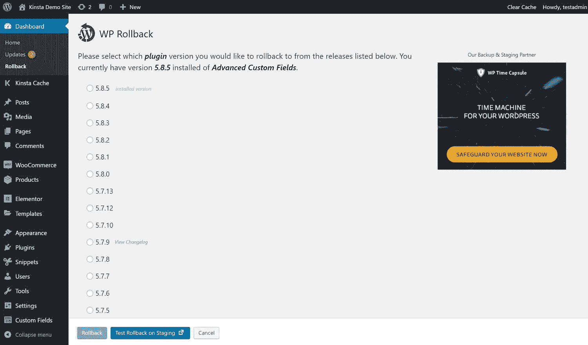

# WordPress 版本控制(它是什么和最佳解决方案)

> 原文：<https://kinsta.com/blog/wordpress-version-control/>

WordPress 版本控制帮助你追踪你的 WordPress 站点的变化，以监控正在发生的事情，并在需要时回滚这些变化。这些变化可能是简单的调整，比如对帖子的编辑，或者更多的技术变化，比如对网站代码库的编辑。

在这篇文章中，我们将更多地解释什么是版本控制，以及它如何应用于 WordPress。然后，我们将深入研究一些工具，你可以用它们在你的 WordPress 站点上实现版本控制。

## 什么是 WordPress 版本控制？

版本控制系统跟踪一段时间内对一个文件(或多个文件)的更改，以便您可以看到事情是如何变化的，如果需要，还可以恢复到以前的版本。

应用于 WordPress，版本控制可以让你追踪你或者其他人对你的站点所做的修改。

在 WordPress 上下文中，版本控制可以跟踪如下行为:

*   更新或发布帖子。
*   [安装或卸载新插件](https://kinsta.com/knowledgebase/how-to-install-wordpress-plugins/)。
*   改变你的 WordPress 主题。
*   更新你的核心软件或任何主题或插件。

您不仅可以看到这些更改，而且如果需要的话，您还可以撤销它们或回滚到以前的版本。

> 需要在这里大声喊出来。Kinsta 太神奇了，我用它做我的个人网站。支持是迅速和杰出的，他们的服务器是 WordPress 最快的。
> 
> <footer class="wp-block-kinsta-client-quote__footer">
> 
> 
> 
> <cite class="wp-block-kinsta-client-quote__cite">Phillip Stemann</cite></footer>

[View plans](https://kinsta.com/plans/)

从开发的角度来看，版本控制还可以帮助开发人员管理代码库的变更，方法是让他们在将代码“合并”回主代码库之前克隆代码段。根据你的 WordPress 站点的复杂程度，你可能会发现这个功能很有帮助。

WordPress 环境下版本控制的一个非常有限的例子是 [WordPress 的内置修订功能](https://kinsta.com/blog/wordpress-revisions/)，它允许你比较一篇文章或一个页面的变化，如果需要的话[恢复以前的版本](https://kinsta.com/knowledgebase/how-to-undo-changes-in-wordpress/):

The built-in WordPress Revisions feature

但是你也可以实现更健壮的系统，根据你使用的 WordPress 版本控制系统，你可以跟踪你的站点文件和站点数据库的变化。

### WordPress 版本控制有什么好处？

设置 WordPress 版本控制有几大好处。

首先，版本控制让你更有信心对你的站点进行修改。做了一个把事情搞砸的改变？不用担心，你可以撤销它，并恢复到你的网站的工作版本。

第二，如果你有一个团队帮助你的 WordPress 站点，你将能够更有效地一起工作，因为你可以跟踪正在发生的一切。此外，如果您使用支持分支和合并的方法，开发人员将能够复制您的站点代码的一部分来工作，然后当它准备就绪时，将这些代码“合并”回您的实时站点。

最后，版本控制帮助您监控站点上发生的事情。例如，版本控制可以让你看到[你的一个编辑](https://kinsta.com/blog/wordpress-user-roles/)是否更新了一篇已经发表的文章。如果他们这样做了，您可以看到他们更改了什么，并在需要时轻松地回滚。

现在你已经知道了更多关于在你的站点上设置版本控制的内容，让我们深入了解一些 WordPress 版本控制的解决方案。

## WordPress 版本控制的最佳选项

WordPress 控件有几种解决方案，这取决于你的技术知识和你希望你的版本控制系统有多全面。

以下是 WordPress 版本控制解决方案，我们将会详细介绍:

*   Git 有几种方式可以让你在 WordPress 上使用 Git，包括托管库，比如 Github，GitLab， [Bitbucket](https://kinsta.com/blog/bitbucket-vs-github/) 等等。要了解更多，请务必阅读我们关于 [Git vs Github](https://kinsta.com/knowledgebase/git-vs-github/) 的指南。
*   这也实现了 Git，但是以一种更自然的方式，尽管它还在测试阶段。
*   一个非常简单的系统，可以回滚主题和插件的更新。
*   由 Roots 的团队创建，以一种你可以轻松维护版本控制库的方式建立。查看我们关于[如何在 Kinsta](https://kinsta.com/blog/bedrock-trellis/) 使用基岩的教程。

当然，你也可以利用 WordPress 的内置修订系统来跟踪和撤销修改。

### 重要的

由于 **proc_open()** 的要求，Kinsta 不支持 VersionPress 或 Revisr(如下所述),出于安全考虑，Kinsta 不会启用该要求。如果你在 Kinsta 托管你的 WordPress 站点，你仍然可以使用前一节中的任何方法使用 Git 进行版本控制。

### 如何在 WordPress 中使用 Git

Git 是由 Linus Torvalds 在 2005 年创建的开源分布式版本控制系统。它更技术性一些，但它是最流行的版本控制系统之一，被所有类型的开发人员使用。也就是说，它不是特定于 WordPress 的。

通常情况下，你会希望在托管库中管理你的 WordPress 站点的代码，比如 GitHub 、 [Bitbucket](https://kinsta.com/blog/bitbucket-vs-github/) 或 GitLab。然后，您可以根据需要将您的站点从该存储库部署到您的实时服务器。

如果你想在 WordPress 中使用 Git，你有几个不同的选择。

## 注册订阅时事通讯

### 想知道我们是怎么让流量增长超过 1000%的吗？

加入 20，000 多名获得我们每周时事通讯和内部消息的人的行列吧！

[Subscribe Now](#newsletter)

首先，如果你在 Kinsta 托管，我们有可用的 Git 客户端，所以你可以通过 SSH 从任何服务，包括 GitHub、GitLab 和 Bitbucket，获取你的 Git 库。您可以在知识库文章中[了解更多信息。](https://kinsta.com/help/git/)

或者，也有其他特定于 WordPress 的通用工具来帮助你从 Git 部署。

如果你想要一个特定于 WordPress 的解决方案，两个好的选择是:

*   WP Pusher–让你从任何 Git 仓库部署主题和插件。注意，这一个特别关注主题和插件。
*   reviser——提供了一个更全面的使用 Git 和 WordPress 的方法。您可以在 Git 存储库中跟踪整个站点，包括您的数据库。你也可以在你的 WordPress 仪表盘中提交修改，恢复文件，以及将修改推/拉至远程存储库(比如 Bitbucket 或 GitHub)。

The Revisr plugin interface

一般来说，你也可以使用像 [Beanstalk](https://beanstalkapp.com/) 和 [DeployBot](https://deploybot.com/) 这样的工具。

### 如何使用 VersionPress 进行版本控制

VersionPress 是一个开源项目，旨在通过对你网站的文件和数据库进行版本控制来“将 Git 的全部力量带给 WordPress”。尽管 VersionPress 也依赖于 Git，但它有自己的部分，因为它做的事情与上面的方法略有不同。

VersionPress 的独特之处在于，它跟踪每一个微小的变化**并且**用人类的自然语言来完成。例如，VersionPress 将告诉您有人“更新了 Hello World！”而不是仅仅记录数据库的更改贴吧。显然，这使得 Git 在 WordPress 网站的上下文中更加有用和易于访问。

例如，将 VersionPress 中的操作列表与上面 Revisr 屏幕截图中的操作列表进行比较。看出区别了吗？

The VersionPress interface

它还为您提供了撤销或回滚任何这些更改的选项，[备份您的站点](https://kinsta.com/blog/wordpress-backup-plugins/)，创建[暂存环境](https://kinsta.com/help/staging-environment/)并合并数据库，推送托管的 Git 存储库，等等。

与宕机和 WordPress 问题做斗争？Kinsta 是一款考虑到性能和安全性的托管解决方案！[查看我们的计划](https://kinsta.com/plans/?in-article-cta)

虽然这听起来确实不错，但是需要注意的是 VersionPress 仍然被认为是“开发者预览版”。[开发者说](https://docs.versionpress.net/en/getting-started/about-eap/)你应该**而不是**在生产现场使用它。

要安装 VersionPress ，您需要在您的服务器上安装 Git 并启用 **proc_open()。**

### 如何使用 WP 回滚来撤销更新

WP 回滚不像以前的任何解决方案那么全面，只适用于 WordPress.org 的 T2 主题和插件。尽管如此，在更有限的基础上，它仍然是一个非常有用的版本控制工具。

有没有更新过 WordPress 的主题或插件，结果却破坏了你网站上的某些东西？

首先，您应该使用一个中转站点，这样就不会发生这种情况了！但是，如果你在一个实时网站上运行更新时出现了问题，能够回滚到上一个正常工作的版本是很有帮助的，至少在你找出问题所在之前是如此。

为了帮助你做到这一点，WP Rollback 在你网站的插件界面中增加了一个新的 **Rollback** 按钮，可以让你将任何 WordPress 主题或插件“回滚”到之前的版本:

The new Rollback option

然后，您可以选择要恢复到的确切版本:

Choosing the version to roll back to

[Version control gives you plenty of control over your site's code. Check out the most interesting WordPress-specific version control tools! 🙀😸 #version controlClick to Tweet](https://twitter.com/intent/tweet?url=https%3A%2F%2Fkinsta.com%2Fblog%2Fwordpress-version-control%2F&via=kinsta&text=Version+control+gives+you+plenty+of+control+over+your+site%27s+code.+Check+out+the+most+interesting+WordPress-specific+version+control+tools%21+%F0%9F%99%80%F0%9F%98%B8+%23version+control&hashtags=wordpress)

## 摘要

版本控制可以帮助你跟踪你的 WordPress 站点的变化，这样你就可以掌握正在发生的事情，并且在需要的时候回滚。

如果您在团队中工作，版本控制还可以通过分支和合并系统帮助您使用更高效的工作流。团队成员可以复制你的站点的特定部分来工作，然后当它准备好进入黄金时段时，将它“合并”回主代码中。

对于 WordPress，你有几个版本控制选项，这取决于你的需求和技术知识。

对于开发人员来说，Git 是版本控制的绝佳选择。 [Kinsta 支持 Git 客户端](https://kinsta.com/help/git/)，你也可以使用像 WP Pusher ( *用于主题和插件*)、Revisr、Beanstalk 和 DeployBot 这样的工具从 GitHub 这样的托管 Git 库[进行部署。](https://kinsta.com/knowledgebase/what-is-github/)

对于更简单、技术含量更低的实现，你可以选择内置的 [WordPress 修订版](https://kinsta.com/blog/wordpress-revisions/)功能和/或 WP 回滚插件。

最后，虽然 VersionPress 还没有准备好，但它提供了最特定于 WordPress 的 Git 实现，绝对是一个值得关注的有趣项目。

关于如何开始使用 WordPress 的版本控制，你有什么问题吗？请在评论中告诉我们。

* * *

让你所有的[应用程序](https://kinsta.com/application-hosting/)、[数据库](https://kinsta.com/database-hosting/)和 [WordPress 网站](https://kinsta.com/wordpress-hosting/)在线并在一个屋檐下。我们功能丰富的高性能云平台包括:

*   在 MyKinsta 仪表盘中轻松设置和管理
*   24/7 专家支持
*   最好的谷歌云平台硬件和网络，由 Kubernetes 提供最大的可扩展性
*   面向速度和安全性的企业级 Cloudflare 集成
*   全球受众覆盖全球多达 35 个数据中心和 275 多个 pop

在第一个月使用托管的[应用程序或托管](https://kinsta.com/application-hosting/)的[数据库，您可以享受 20 美元的优惠，亲自测试一下。探索我们的](https://kinsta.com/database-hosting/)[计划](https://kinsta.com/plans/)或[与销售人员交谈](https://kinsta.com/contact-us/)以找到最适合您的方式。