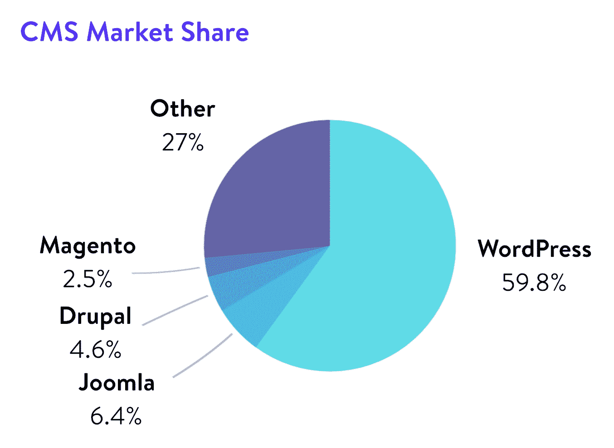
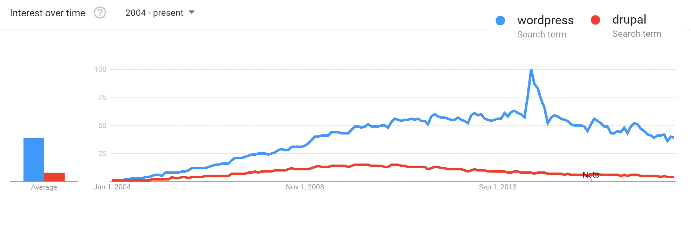
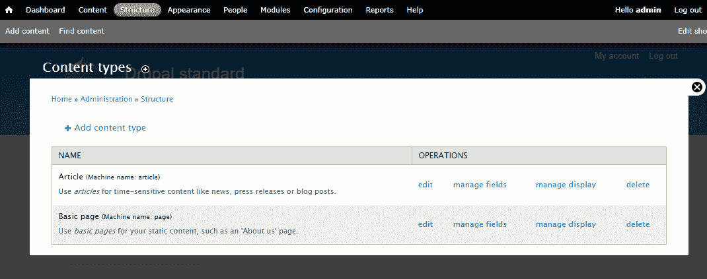
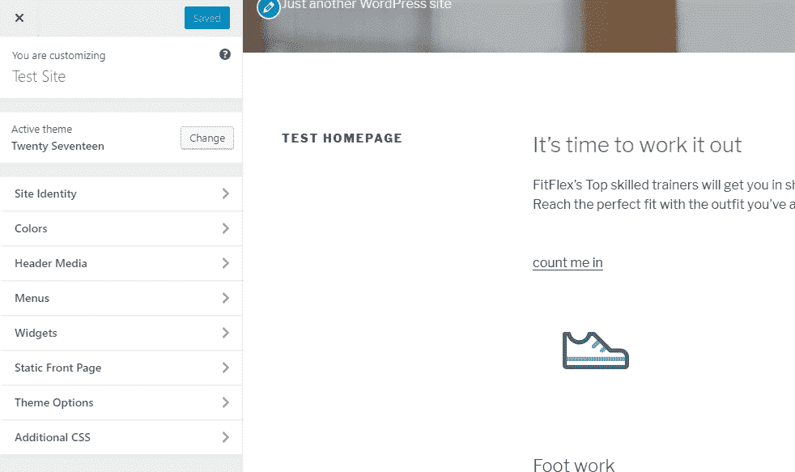
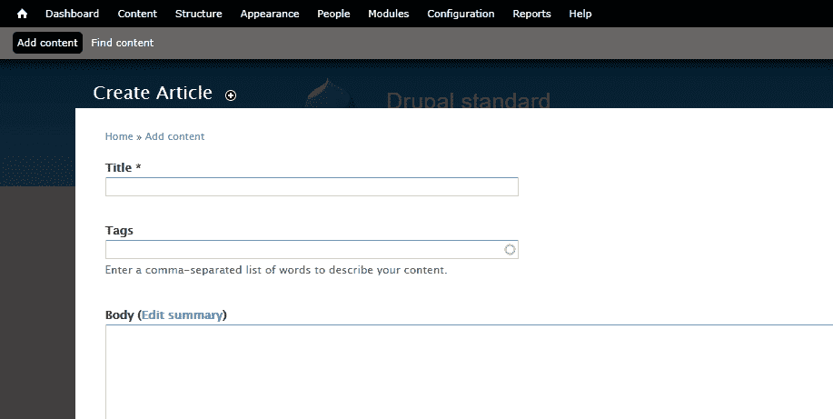
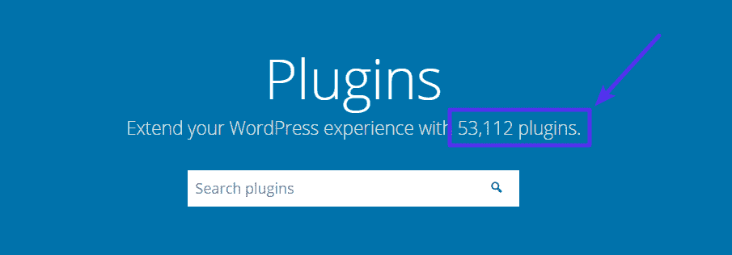
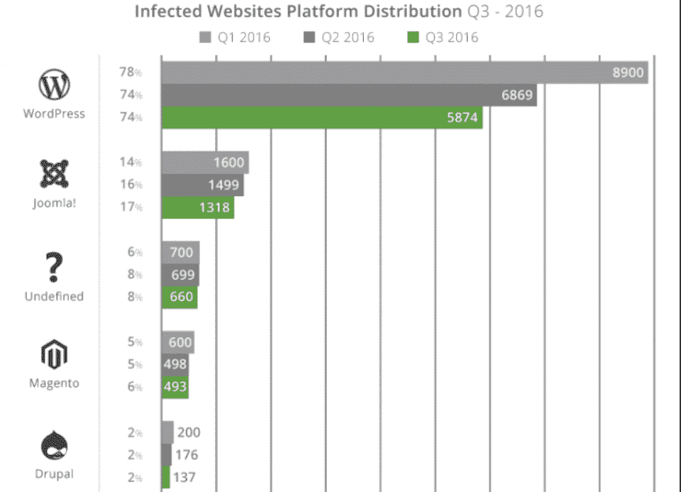

# WordPress 和 Drupal——2022 年哪个更好？(赞成和反对)

> 原文：<https://kinsta.com/blog/wordpress-vs-drupal/>

纠结于 WordPress 和 Drupal 的区别？我们可能是 WordPress 主机提供商，但这并不意味着我们认为 WordPress 是建立网站的唯一途径(即使有很多好的理由使用 WordPress，这些理由来自 T2)。

我们已经[比较了 Squarespace 和 WordPress](https://kinsta.com/blog/squarespace-vs-wordpress/) 。现在，在这篇文章中，我们将深入研究另一个流行的内容管理系统 Drupal，看看它与 WordPress 相比如何。

## WordPress vs Drupal:简介和数字说明什么

在我们深入一些更本质的细节之前，让我们快速介绍一下这次比较中的两位选手。很明显，两者都是[内容管理系统](https://kinsta.com/knowledgebase/content-management-system/)。这意味着他们给你一个自托管的解决方案来创建和管理你的网站上的所有内容(*顾名思义！*)。

那么，作为内容管理系统，它们的表现如何呢？

WordPress 是世界上最流行的内容管理系统。WordPress 最初在 2003 年作为一个[博客平台推出，现在支持](https://kinsta.com/blog/best-blogging-platform/#1-wordpressorg) [43.3%的网站](https://kinsta.com/wordpress-market-share/)，并控制着 65.1%的已知内容管理系统市场。

一些著名的实体将 WordPress 用于他们的全部或部分网站的例子有:

*   Whitehouse.gov
*   索尼移动
*   华盛顿大学
*   奔驰
*   TechCrunch
*   《纽约人》

Drupal 比 WordPress 存在的时间还要长，尽管它没有 WordPress 那么高的市场份额。Drupal 最初于 2000 年推出，占 T2 所有网站的 2.3%，在内容管理系统市场上占有 4.6%的份额。

一些在 Drupal 上运行的著名网站有:

*   科罗拉多大学
*   科罗拉多州
*   《经济学人》
*   达拉斯牛仔队
*   Nasa.gov

CMS market share

回顾 2004 年的谷歌趋势，我们可以看到这两家公司的名气都上升得很快，但现在都陷入了低谷。但这些只是趋势。看看[的市场份额增长](https://w3techs.com/technologies/history_overview/content_management/all/y)，WordPress 和 Drupal 这几年都在增长。

WordPress and Drupal trends

## WordPress 和 Drupal 有哪些广为人知的优点？

如果你在网上浏览 WordPress 和 Drupal 的讨论，你会发现双方都有很多支持者。以下是选择一种平台而不选择另一种平台的一些最常见的原因:

### WordPress 优势

*   **——WordPress 明显更加用户友好，尤其是对非开发者而言。**
***   **可扩展性**–WordPress 的第三方主题和插件社区使得扩展 WordPress 变得同样简单，无需定制开发。有些人甚至声称，通过正确的扩展，WordPress 可以做 Drupal 能做的任何事情。*   **容易获得帮助**–WordPress 庞大的全球社区意味着你可以很容易地为你遇到的任何问题找到支持。*   更低的开发成本–WordPress 提供更多“开箱即用”的解决方案，WordPress 开发者通常比 Drupal 开发者更实惠。**

 **### Drupal 优势

*   **自定义内容类型和视图**——虽然 WordPress 确实提供自定义文章类型，但大多数人认为 Drupal 的自定义内容类型更加灵活。
*   **访问控制/用户权限**——尽管 WordPress 单站点提供了 [5 个基本用户角色](https://kinsta.com/blog/wordpress-user-roles/)，Drupal 有一个内置的访问控制系统，你可以在其中创建具有单独权限的新角色。
*   对多语言站点的核心支持–在 Drupal 8 中，多语言功能被嵌入到核心中，而 WordPress 站点需要求助于第三方插件。
*   ****用于处理大量数据的分类法**–**Drupal 的[分类法](https://kinsta.com/knowledgebase/what-is-taxonomy/)系统比 WordPress 更灵活，这使得它非常适合处理大量内容。

An example of Drupal Custom Content Types

## 使用 WordPress 和 Drupal 有多容易？

谈到用每个平台建立一个网站有多容易，WordPress 显然是赢家。

### WordPress 易用性和学习曲线

WordPress 使得从“零”到“看起来不错的全功能网站”变得非常容易

使用 WordPress ，有可能在一个下午的工作中找到一个特定的主题并拥有一个工作网站(*显然更复杂的项目不太可能在一个下午完成*)。

更重要的是，WordPress 界面简单，即使是最普通的用户也能快速掌握。像 WYSIWYG 主题定制器和[即将推出的 Gutenberg 编辑器](https://kinsta.com/blog/gutenberg-wordpress-editor/)这样的工具只会让普通用户更容易地创建有意义和独特的内容。

The WordPress Theme Customizer

### Drupal 易用性和学习曲线

使用 Drupal ，你会看到完全相反的情况。虽然 Drupal 主题确实存在，但大多数 Drupal 网站都有定制的主题，或者至少是高度定制的主题。这意味着你通常需要一个开发者来得到看起来不错的东西。

除此之外，Drupal 接口对于大多数普通用户(*和许多开发人员来说是无法理解的！*)，至少乍一看是这样。这不是一个观点——Drupal 本身[有一个可用性页面](https://www.drupal.org/docs/develop/usability-testing/drupal-usability-test-results/authoring-experience-known-problems),提到 Drupal 创作体验时，它说:

> 总的来说，人们期望在内容创建方面有比 Drupal 更丰富的用户体验，人们认为 CMS 的许多标准功能都缺失了。

例如，Drupal 7 中的核心编辑器如下所示:

The Drupal 7.X content editor

虽然它的功能非常基本，但它并不是最用户友好的内容创建体验，尤其是与 WordPress TinyMCE 编辑器(以及即将推出的 Gutenberg 编辑器)相比。

## 如何用 Drupal 和 WordPress 扩展你的网站？

你可以用影响 WordPress 和 Drupal 的附加组件来扩展它们:

## 注册订阅时事通讯

### 想知道我们是怎么让流量增长超过 1000%的吗？

加入 20，000 多名获得我们每周时事通讯和内部消息的人的行列吧！

[Subscribe Now](#newsletter)

*   **功能** : WordPress 调用这些**插件**，而 Drupal 调用这些**模块。**
*   ****美学****:WordPress 和 Drupal 都称这些为主题

### WordPress 有多少插件和主题？

虽然扩展的原始数量并不意味着 WordPress 更好，但它是第三方 WordPress 生态系统的规模和重要性的一个很好的指标。

WordPress 有:

*   53000+**免费**插件，外加数千个更高级的插件。
*   5000 个+ **免费**主题，外加数千个更高级的主题。

The WordPress.org plugin directory

### Drupal 有多少插件和主题？

在其官方目录中，Drupal 列出了:

*   39，000 多个模块
*   2500 多个主题

也就是说，如果您只包含与 Drupal 8.x 兼容的模块，那么这些数字会下降到:

*   4000 多个模块
*   250 个主题

## WordPress 和 Drupal 同样安全吗？

在完美的世界里，WordPress 和 Drupal 都是安全的系统。但在现实世界中(有真实的人的更新习惯和对第三方解决方案的偏好)，Drupal 往往最终更安全。

Struggling with downtime and WordPress problems? Kinsta is the hosting solution designed to save you time! [Check out our features](https://kinsta.com/features/)

值得注意的是，这一优势确实更多源于人为错误，而不是 WordPress 核心的缺陷。

### WordPress 安全

虽然 WordPress 核心本身是安全的，但是 WordPress 庞大的第三方生态系统引入了大量的通配符，这在 Drupal 网站中并不普遍。

根据来自 Wordfence 的[调查，插件漏洞占恶意行为者所有**已知**入口的 55.9%。总的来说，WordPress 是 74%被黑网站使用的内容管理系统，](https://www.wordfence.com/blog/2016/03/attackers-gain-access-wordpress-sites/) [Sucuri 分析了](https://blog.sucuri.net/2017/01/hacked-website-report-2016q3.html)。

虽然 WordPress 的数量自然应该更高，因为它很受欢迎，但 WordPress 的市场份额[只有 59.8%](https://w3techs.com/technologies/details/cm-wordpress/all/all) ，所以在 Sucuri 的分析中， [WordPress 占被黑网站](https://kinsta.com/blog/wordpress-hacked/)的 74%的事实仍然高于你的预期。

做对了， WordPress 是安全的。但是 WordPress 如此依赖第三方扩展的事实确实使它比 Drupal 更容易受到攻击。

### Drupal 安全性

Drupal 的卖点之一是其锁定安全性，这就是为什么它是政府机构和其他大型安全意识玩家的流行内容管理系统。与 WordPress 相反，Drupal 仅占 Sucuri 所关注的被黑网站的 2%，远低于其 4.7%的市场份额:

[Source: Sucuri Hacked Website Report](https://blog.sucuri.net/2017/01/hacked-website-report-2016q3.html)

除了企业级的安全性，Drupal 还[发布详细的安全报告](https://www.drupal.org/security)，并且在安全性方面比 WordPress 更加透明。

## 从 Drupal 迁移到 WordPress

如果你目前正在使用 Drupal，并且正在寻找一种简单的方法来迁移到 WordPress，我们推荐你去看看[wordheld](https://wordherd.io/partners/kinsta/)。他们是 Kinsta 的官方合作伙伴，提供全方位的网站迁移服务，将数据从任何 CMS (Drupal)平台转移到 WordPress 。

[T2】](https://wordherd.io/partners/kinsta/)

WordHerd 处理从小型企业到大型企业的各种规模的迁移。除了 CMS 迁移之外，WordHerd 团队也非常擅长协助 CRM 数据迁移。

如果你想要一个更 DIY 的方法，你可以看看下面的插件:

*   [CMS 2 CMS:Drupal 到 WordPress 的自动化迁移](https://wordpress.org/plugins/cms2cms-automated-drupal-to-wp-migration/)
*   [FG Drupal 到 WordPress](https://wordpress.org/plugins/fg-drupal-to-wp/)

## WordPress 和 Drupal:哪个更好？

这可能是你来这里寻找的问题…但这也是一个有缺陷的问题，因为不可能说 WordPress 和 Drupal 哪个“更好”。相反，一个更有帮助的问题是“对于我正在构建的这个特定网站，哪个更好？”。

也就是说，您应该专注于为您的特定项目选择正确的工具，而不是寻找一个总是比另一个更好的声明。

在 Kinsta，我们的主要解决方案之一是 [WordPress 托管](https://kinsta.com/wordpress-hosting/)——所以很容易说 WordPress 总是最好的解决方案。但对我们的读者来说，这不是一个公平的结论。如果您正在构建一个需要定制和灵活的复杂数据组织的站点，Drupal 可能是一个更好的选择。请注意，除非您:

*   是开发商
*   愿意雇佣一个开发者

最后，这可能是一个很好的经验法则:

**WordPress 应该是大多数人创建网站的默认工具** **因为**:

*   它对用户友好，非开发人员很容易添加功能。
*   你可以快速创建一个有吸引力和功能的网站。
*   很容易找到免费和专业的帮助。

这并不意味着 WordPress 是所有情况下的最佳工具——只是说它是大多数情况下的最佳工具。除非你已经知道你需要 Drupal 提供的东西的具体原因，否则坚持使用 WordPress 可能会让你的网络之旅更加容易。

当谈到 WordPress vs Drupal 时，你同意还是不同意？请在评论中告诉我们！

Drupal 是 [Dries Buytaert](https://dri.es/) 的注册商标。

* * *

让你所有的[应用程序](https://kinsta.com/application-hosting/)、[数据库](https://kinsta.com/database-hosting/)和 [WordPress 网站](https://kinsta.com/wordpress-hosting/)在线并在一个屋檐下。我们功能丰富的高性能云平台包括:

*   在 MyKinsta 仪表盘中轻松设置和管理
*   24/7 专家支持
*   最好的谷歌云平台硬件和网络，由 Kubernetes 提供最大的可扩展性
*   面向速度和安全性的企业级 Cloudflare 集成
*   全球受众覆盖全球多达 35 个数据中心和 275 多个 pop

在第一个月使用托管的[应用程序或托管](https://kinsta.com/application-hosting/)的[数据库，您可以享受 20 美元的优惠，亲自测试一下。探索我们的](https://kinsta.com/database-hosting/)[计划](https://kinsta.com/plans/)或[与销售人员交谈](https://kinsta.com/contact-us/)以找到最适合您的方式。**