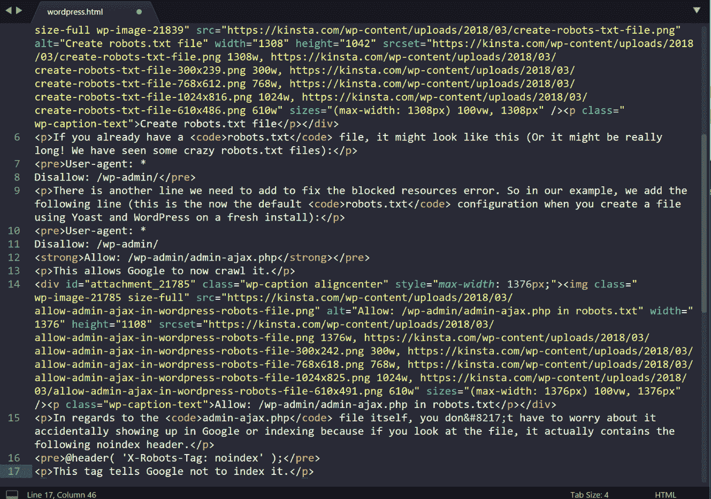
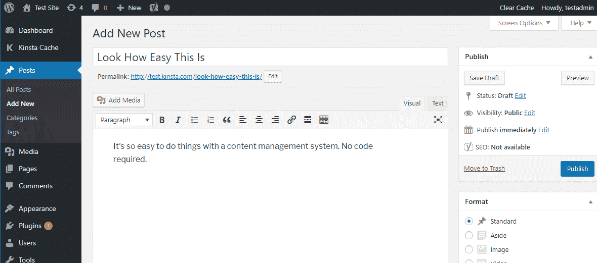
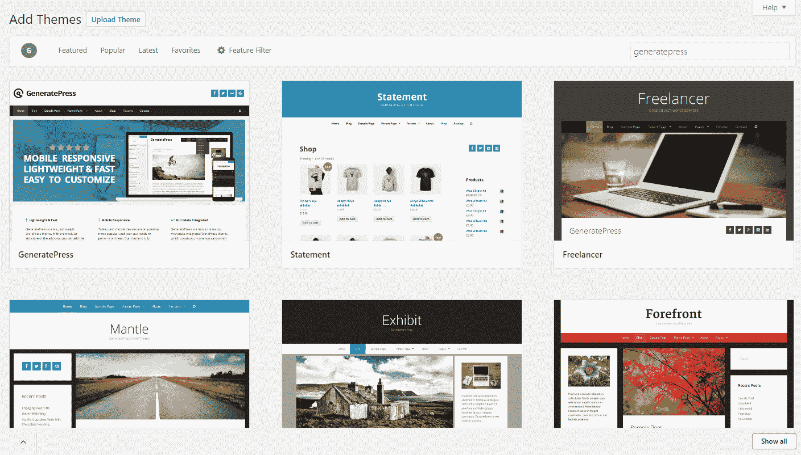
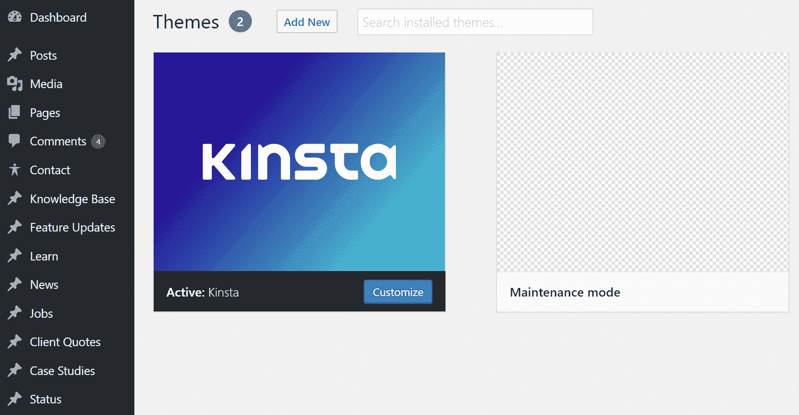
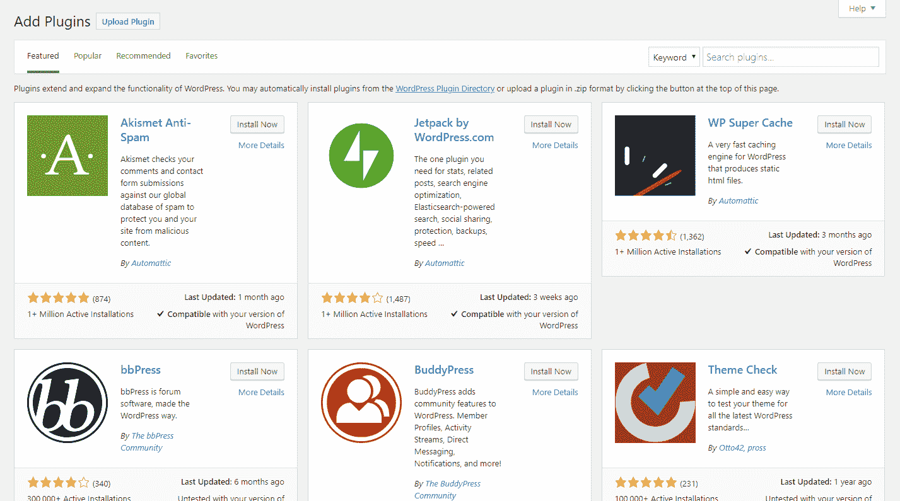
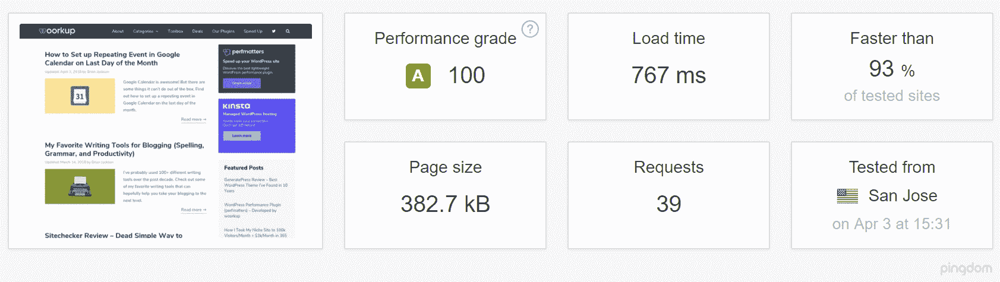
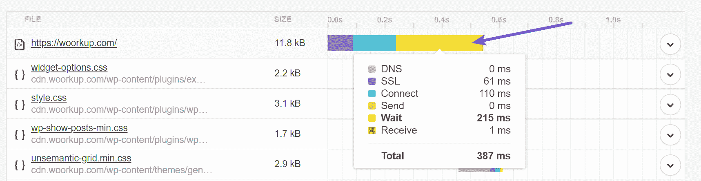
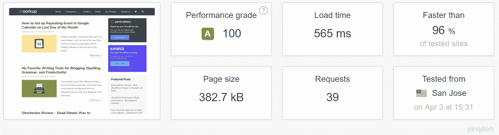
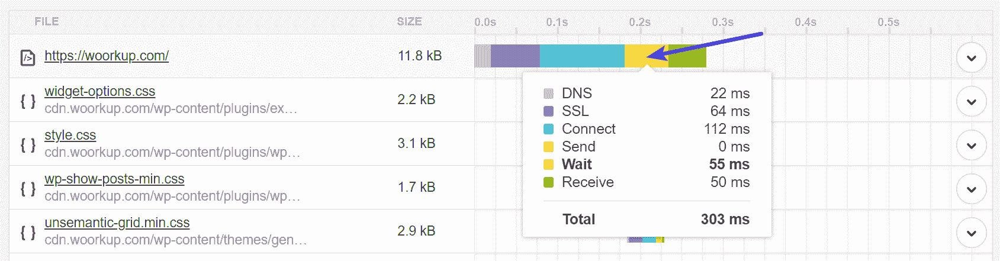
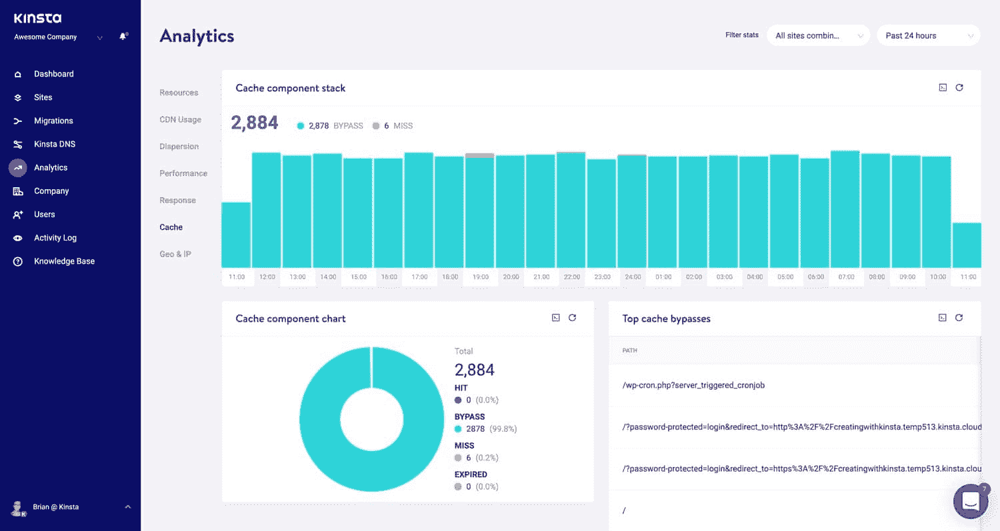

# WordPress vs Static HTML:你应该如何建立你的网站？

> 原文：<https://kinsta.com/blog/wordpress-vs-static-html/>

在过去，我们已经讨论过 [WordPress](https://kinsta.com/knowledgebase/what-is-wordpress/) 如何与其他流行的内容管理系统如 [Drupal](https://kinsta.com/blog/wordpress-vs-drupal/) 、 [Joomla](https://kinsta.com/blog/joomla-vs-wordpress/) ，甚至 [Squarespace](https://kinsta.com/blog/squarespace-vs-wordpress/) 相匹配。但是，如果你正试图在你的网站上选择是使用 **WordPress 还是静态 HTML** 呢？

在基本层面上，这是一个关于使用数据库驱动的内容管理系统(比如 WordPress)还是自己编写所有的 HTML/[CSS](https://kinsta.com/blog/wordpress-css/)并可能使用一个框架的一般性辩论。

为了帮助您做出决定，我们将解释这些术语的含义，然后讨论每种方法的优缺点。

*   【WordPress 和静态 HTML 的区别
*   [WordPress 的利弊](#pros-and-cons-wordpress)
*   [静态 HTML 网站的利与弊](#pros-and-cons-static-html)
*   [使用 WordPress 作为静态网站生成器](#wordpress-static-website-generator)

## WordPress 和静态 HTML 的区别

最后，所有的东西都以 HTML 的形式出现在前端。也就是说，无论你使用的是 WordPress 还是一个静态的 HTML 网站，你的网站代码看起来都会像这样:

No matter which method you choose, your code will still look like this

重要的区别在于 HTML 是如何产生的。

对于静态 HTML，这个故事非常简单。您或者您的开发人员编写代码(*包括您的内容*)。然后，一旦它在服务器上，它的*总是*那样。没有后台处理在进行——你的网站总是以完成的形式在那里。

另一方面，WordPress 是一个使用 [PHP](https://kinsta.com/blog/php-7-2/) 和数据库的内容管理系统。简单来说，这意味着当有人访问你的 WordPress 站点时，你的服务器通过以下方式“组装”你的站点:

*   执行 PHP 代码，将网站的 HTML 版本放在一起
*   查询您的[数据库](https://kinsta.com/knowledgebase/wordpress-database/),以获取要插入 HTML 的内容

### 那么，什么是内容管理系统呢？

上面，我们告诉你 WordPress 是一个内容管理系统，但是我们并没有真正解释这是什么意思。一个[内容管理系统](https://kinsta.com/knowledgebase/content-management-system/)，通常缩写为 CMS，是一个帮助你在网站**上创建、管理和修改内容的软件，而不需要直接与代码**交互。

例如，不需要像在静态 HTML 网站上那样手动添加 HTML 格式的内容，你只需要使用 WordPress 编辑器输入你的内容，WordPress 就会处理在你的网站上显示它:

The WordPress editor interface

类似地，如果您以后想要编辑该内容，您可以直接使用同一个编辑器进行编辑，而不需要直接编辑服务器上的静态 HTML 文件。

## WordPress 的利与弊

我们一会儿将讨论静态 HTML 网站的利与弊，但是让我们从超过 43.3%的互联网用户使用 WordPress 的原因开始。

### 无代码内容管理

WordPress 最大的好处是它几乎可以完全消除你网站日常管理中的代码。相反，您想要采取的大多数操作都可以使用图形界面来执行。

使用此图形界面，您可以:

*   创建新内容
*   更改您网站的外观
*   改变你的网站的功能
*   配置重要的 SEO 设置
*   执行许多其他重要的动作

除非你生活和呼吸 HTML/CSS ( *，甚至可能你做*)，这种方法将使管理你的网站的每个方面变得容易得多。

### 很容易改变你的网站的外观

每个 WordPress 网站都需要一个叫做**主题**的东西。你的主题决定了你的网站在前台的外观。为了[安装一个新的 WordPress 主题](https://kinsta.com/blog/how-to-install-a-wordpress-theme/)，你只需点击一个按钮或者上传一个文件，你的网站就会立刻采用这种风格:

How you add a new WordPress theme

另一方面，对于静态 HTML 站点，您可以使用自己的 CSS 来控制站点的外观。这不仅一开始就很耗时，如果你想彻底改变你的静态 HTML 站点的外观，同样**也很耗时**。是的，有 CSS 框架可以用来加速这个过程，但是它仍然需要更多的工作和专业知识来管理。

我们之所以知道这一点，是因为 Kinsta 网站的大部分都是用良好的 ole [Github](https://kinsta.com/knowledgebase/what-is-github/) 提交创建的(建议阅读: [git vs Github](https://kinsta.com/knowledgebase/git-vs-github/) )。是的，我们利用了 WordPress 主题和框架，我们的代码被包装在 WordPress 函数中，但是你在我们网站上看到的大部分内容都是由我们的团队创建的。这有时可以允许更大的灵活性，但是它也需要有开发人员。如果你想节省时间，又没有全职开发人员，那么使用一个[预建的 WordPress 主题](https://kinsta.com/best-wordpress-themes/)可以大大加快你的工作流程。

WordPress theme

此外，你需要担心如何使你所有的 CSS 都具有响应性(也就是在移动设备上看起来不错)，而现在几乎每一个 WordPress 主题都是默认响应的。

### 易于添加新功能

WordPress 还提供了一种叫做**插件**的东西，可以让你轻松扩展网站的功能。想要[在你的网站上添加一个联系表单](https://kinsta.com/blog/wordpress-contact-form-plugins/)？对于静态 HTML，您需要处理验证和用户提交的数据。有了 WordPress，你只需安装一个插件…

How you add a new WordPress plugin

随着功能越来越大，难度差距会越来越大。想要[在您的网站](https://kinsta.com/knowledgebase/bbpress/)上添加一个论坛吗？祝你一个人好运。但是使用 WordPress，你只需要安装一个论坛插件。

你甚至可以快速添加电子商务或社交网络功能。

### 快速发展和变化

主题和插件的结合，以及 WordPress 作为内容管理系统的一般功能，意味着你可以快速建立复杂的网站。

对于一个只有几页的非常基本的网站来说，静态 HTML 可能很快…但是如果你需要任何非标准的功能，WordPress 几乎肯定会让你更快地建立一个网站。

想要更多优势？看看这 10 个你应该使用 WordPress 的好理由。

你可能还会对 2022 年使用的 60 种令人敬畏的网络开发工具感兴趣。

### 使用 WordPress 有什么缺点吗？

你会发现有些人会说“静态 HTML 网站加载速度更快”或者“静态 HTML 网站在谷歌排名更好。”但其中一些应该持保留态度。虽然 PHP 和数据库确实会引入额外的加载时间和延迟，但是让 WordPress 的加载时间少于一秒并不困难，这已经足够快了。

你应该问问自己，拥有一个稍微快一点的静态网站值得放弃 WordPress 所提供的优势吗？此外，PHP 的性能在过去的五年中有了很大的提高。在我们最近的 [PHP 基准测试](https://kinsta.com/blog/php-benchmarks/)中，我们得出结论，PHP 7.3 每秒可以处理 3 倍于 PHP 5.6 的请求(事务)。🚀

WordPress 5.0 PHP benchmarks

通过使用[缓存](https://kinsta.com/blog/wordpress-cache/)来提供页面的静态 HTML 版本，也有一些方法可以轻松消除 PHP 和数据库延迟。这意味着每个页面的加载速度都可以快如闪电，就像静态 HTML 站点一样。

缓存对 WordPress 站点有多大影响？这里有一个在缓存前后对 WordPress 博客的快速测试。

#### 没有缓存

我们首先在 WordPress 博客上运行了一个禁用缓存的测试。

## 注册订阅时事通讯

### 想知道我们是怎么让流量增长超过 1000%的吗？

加入 20，000 多名获得我们每周时事通讯和内部消息的人的行列吧！

[Subscribe Now](#newsletter)

WordPress site without cache ([Pingdom test](https://tools.pingdom.com/#!/eijIQL/https://woorkup.com/))

正如您所看到的，在第一次 HTML 文档加载时有很大的延迟。这是因为它不从服务器上的缓存提供服务。

Without cache delay

#### 带缓存

然后我们在 WordPress 博客上运行了一个启用缓存的测试。其他都没变。

WordPress site with cache ([Pingdom test](https://tools.pingdom.com/#!/caBlaQ/https://woorkup.com/))

如你所见，这是一个巨大的进步。事实上，只需从服务器**的缓存中提供初始页面，加载时间就减少了 32.2%** 。

With cache

Kinsta 自动为所有托管客户端的 [WordPress 处理服务器级别的缓存。这意味着你不必与第三方](https://kinsta.com/wordpress-hosting/)[缓存插件](https://kinsta.com/blog/wordpress-caching-plugins/)争论。

说到你可能听到的排名谣言，有[个很棒的 WordPress SEO 插件](https://kinsta.com/blog/best-seo-plugins-for-wordpress/)可以让你通过控制你网站技术和页面 SEO 的每个方面来优化你的 [WordPress SEO](https://kinsta.com/blog/wordpress-seo/) 。如果 WordPress 网站在搜索排名中的表现真的比静态 HTML 网站差，你就不会看到它被像 [The Wirecutter](https://thewirecutter.com/) 或 [TechCrunch](https://techcrunch.com/) 这样的大型平台使用。

不过，也有一些小缺点，首先是维护问题。虽然选择高质量的[托管 WordPress hosting](https://kinsta.com/blog/managed-wordpress-hosting/) 可以消除很多最糟糕的维护，但是你仍然要负责确保 WordPress 的核心软件、插件和主题是更新的和兼容的。这在今天是相当容易的，但是对于一个静态的 HTML 网站来说，这是不需要做的事情。

第二个缺点可能是质量问题。由于 WordPress 的极度流行，有很多糟糕的插件和主题。免费解决方案有时会完全消失。从坏的东西中找出好的东西可能很费时间。

## 静态 HTML 网站的利与弊

你听说过 WordPress——但是现在让我们来探究一下静态 HTML 网站的利与弊。

### 没有需要维护的底层软件

我们几秒钟前就讨论过这个问题，但是让我们在这里快速地重复一下，因为这是静态 HTML 的主要优点之一。

当你使用 WordPress 和主题/插件时，你有责任更新所有的底层代码，并确保没有任何兼容性问题。虽然这很简单(*你通常只需要点击一个按钮*，但这是你需要做的事情，以保持你的网站安全和正常运行。

Struggling with downtime and WordPress problems? Kinsta is the hosting solution designed to save you time! [Check out our features](https://kinsta.com/features/)

另一方面，如果你已经编写了干净的静态 HTML，你应该可以不去管它，也不用担心更新。

### 更容易访问底层代码

虽然 WordPress 可以让你访问你网站的所有底层代码，但是一个静态的 HTML 网站会让输入某些类型的标记变得简单一些。不再需要处理主题模板文件和 WordPress 循环，一切都在你面前。

例如，虽然 WordPress 有[模式插件，但是你可以更容易地控制静态 HTML 网站上的模式标记。](https://kinsta.com/blog/schema-markup-wordpress/)

### 创建一个静态 HTML 网站的缺点是什么？

虽然一个静态的 HTML 网站对于一个基本的网站来说肯定是不错的，但是当你试图扩大规模时，无论是在内容的数量上还是在功能上，主要的问题都会出现。

这些缺点大多只是 WordPress 优点的对立面。即:

*   添加或编辑内容不是用户友好的，因为你需要钻研代码。
*   添加新功能需要您自己编写代码。
*   改变你的网站外观需要重写你的 CSS。

此外，除非你自己真的了解 HTML/CSS，否则所有这些事情都需要付费给开发者，而 WordPress 会让你自己去做。

## 使用 WordPress 作为静态网站生成器

静态网站生成器与上面两个选项略有不同，因为它们采用内容管理系统(如 WordPress)的内容，将其与主题相结合，并生成静态 HTML 页面。Jekyll 是最受欢迎的一个，你可以用它在 GitHub 页面上托管你的整个网站或博客，并通过一个命令推送你的新内容。坏处呢？设置它并不容易(至少可以这么说)，甚至对于开发人员来说，这也很耗时。

如果你有一个下午的空闲时间来学习更多关于 Jekyll 的知识，那么看看这篇由 Mike Neumegen 写的文章。或者，像 Grav 这样的[平面文件 CMS 可以给你更容易的内容管理，同时仍然避免对数据库的需求。](https://getgrav.org/)

如果你精通技术，甚至有可能两全其美，将 WordPress 用作静态 HTML 网站生成器。然而，你只需要记住，如果你以这种方式使用 WordPress，你将不得不做出牺牲:

*   你的网站上根本不会有任何“实时”动态内容。
*   没有为您推荐的文章，也没有为每个访问者改变的[小工具](https://kinsta.com/blog/wordpress-widgets/)。
*   不能用 WordPress 内置的评论系统。

本质上，服务器端(PHP)生成的所有东西都将变成静态的，并手动更新。静态网站生成器将基于你的内容创建一个完整的 HTML 页面，一旦完成，无论有多少人访问你的网站，它都不会再生；除非你在电脑上输入特定的命令。

建议阅读:[如何上传一个 HTML 文件到 WordPress](https://kinsta.com/knowledgebase/how-to-upload-html-file-to-wordpress/) 。

开发人员解决注释“问题”的方法是要么根本不使用它，要么转向基于 JavaScript 的解决方案，最流行的是 Disqus 或脸书注释。

有几个 WordPress 缓存插件可以用来创建你的文章和页面的静态 HTML 文件，但是如果你使用 Nginx 作为你的 web 服务器(如果你没有，你真的应该这样做，但是这是另一篇文章的主题)你可以打开整个页面缓存开关，并设置它在一天或一周内到期。你能“承受”的时间越长，越好。

接下来发生的是，第一个访问者将让服务器生成完整的缓存 HTML 文件，在预定义的过期时间内，任何连续的访问者都将获得这些文件。这里举个例子，我们的服务器使用 [`nginx fastcgi cache module`](http://nginx.org/en/docs/http/ngx_http_fastcgi_module.html#fastcgi_cache) 进行页面缓存。你问怎么设置？如果你管理自己的服务器[，这里有一份由](https://www.digitalocean.com/community/tutorials/how-to-setup-fastcgi-caching-with-nginx-on-your-vps "here's an extremely detailed guide") [DigitalOcean](https://kinsta.com/careers/sysops-engineer-us/) 撰写的极其详细的指南，你可以遵循。

如果你是一个 Kinsta 客户端，这对于每个 WordPress 站点都是自动的，默认情况下，缓存每一个小时失效一次。但是，您可以在您的 [MyKinsta dashboard](https://my.kinsta.com/) 中向我们的支持团队申请一个票证，并请求更长的缓存持续时间。请确保你完全理解这样做的后果。

### Cloudflare 整页缓存

您还可以利用 WordPress 和**的 Cloudflare 页面规则，从缓存**中为您的整个网站提供服务。我们在这里为你提供关于[如何为你的 WordPress 帖子和页面设置 Cloudflare 缓存](https://kinsta.com/blog/cloudflare-settings-wordpress/#page-rules)的所有细节。

这对于正在发起活动或预计流量会激增的网站来说非常有益。不过请记住，如果你完全从缓存中提供服务，你很可能会遇到与 [WooCommerce checkout](https://kinsta.com/blog/woocommerce-checkout/) 、你的 WordPress 管理工具栏以及其他各种你需要修复或寻找解决方法的东西有关的问题。

建议阅读:[如何为 WordPress](https://kinsta.com/blog/cloudflare-apo-wordpress/) 设置 Cloudflare APO。

### 我们提供两个世界中最好的

**我们一般不建议从缓存中为整个网站提供服务**，除非你有时间对所有内容进行适当的测试。举个例子，对于 WooCommerce:你可以缓存“静态”的首页、类别、产品页面(如果你不经常更改的话)然后是的，它几乎会瞬间加载！但是一旦有人点击“添加到购物车”，你必须切换到非缓存版本，否则他们会看到购物车总是空的。

在 Kinsta，我们为电子商务解决方案和博客制定了服务器级规则，以确保哪些应该缓存，哪些不应该缓存。

一些例子包括某些 WooCommerce 和 EDD 页面，如 cart、my-account 和 checkout，被排除在缓存之外。当检测到`woocommerce_items_in_cart` cookie 或`edd_items_in_cart` cookie 时，用户会自动绕过缓存，以确保结账过程平稳、同步。

这为你提供了一个快速加载的 WordPress 站点，但是不用担心东西会坏掉。

Cache component stack

不想用 Kinsta 托管你的整个站点，但是想利用 WordPress 博客的动态功能？你可能想通过一个反向代理来加载你的站点。我们支持这些类型的设置。

## WordPress 还是 Static？

现在，对于这个百万美元的问题…如果你只是建立一个小网站，不太可能改变或需要新的内容，静态 HTML 是一个很好的方法。但对于其他任何东西，WordPress 几乎肯定会是一个更好的选择。如果你找不到开发人员，这一点尤其正确。

它的易用性，加上它的可扩展性，是它现在为互联网上超过 43.3%的网站提供支持的主要原因。现在轮到你了——你会在 WordPress 上用静态 HTML 建立一个网站吗？还是已经走上了静态网站生成器路线？

* * *

让你所有的[应用程序](https://kinsta.com/application-hosting/)、[数据库](https://kinsta.com/database-hosting/)和 [WordPress 网站](https://kinsta.com/wordpress-hosting/)在线并在一个屋檐下。我们功能丰富的高性能云平台包括:

*   在 MyKinsta 仪表盘中轻松设置和管理
*   24/7 专家支持
*   最好的谷歌云平台硬件和网络，由 Kubernetes 提供最大的可扩展性
*   面向速度和安全性的企业级 Cloudflare 集成
*   全球受众覆盖全球多达 35 个数据中心和 275 多个 pop

在第一个月使用托管的[应用程序或托管](https://kinsta.com/application-hosting/)的[数据库，您可以享受 20 美元的优惠，亲自测试一下。探索我们的](https://kinsta.com/database-hosting/)[计划](https://kinsta.com/plans/)或[与销售人员交谈](https://kinsta.com/contact-us/)以找到最适合您的方式。