# WordPress 小部件完整指南:如何使用、添加和实现它们来定制你的站点

> 原文：<https://kinsta.com/blog/wordpress-widgets/>

WordPress 小工具非常有用。它们允许你在文章或页面本身之外添加各种额外的内容，鼓励用户获取信息、关注链接或采取行动。

在这篇文章中，我将向你展示你需要知道的关于 WordPress 小部件的一切。如何将它们添加到你的站点，如何创建小部件区域来放置它们，如何[安装插件](https://kinsta.com/knowledgebase/how-to-install-wordpress-plugins/)来给你更多的插件，如何编写你自己的小部件，等等。

 首先，让我们从识别什么是 WordPress 小部件开始。

## 什么是 WordPress 小部件？

在 WordPress 中，小部件是生活在页面或帖子内容流之外的内容片段。

小部件包含信息、导航或媒体，独立于单独的帖子或页面。在大多数情况下，每个小部件都将显示在站点的每个页面上，但是您也可以为特定页面(如主页)注册小部件区域。

要向您的站点添加小部件，您需要将其添加到小部件区域。小部件区域是由你的主题创建的，因为它们与你的站点的设计和布局有关，而与功能无关。

大多数 WordPress 主题在侧边栏和页脚都有窗口小部件区域，尽管有些会在很多地方有多个窗口小部件区域，比如在内容的下方或上方或者在标题中。


> 需要在这里大声喊出来。Kinsta 太神奇了，我用它做我的个人网站。支持是迅速和杰出的，他们的服务器是 WordPress 最快的。
> 
> <footer class="wp-block-kinsta-client-quote__footer">
> 
> 
> 
> <cite class="wp-block-kinsta-client-quote__cite">Phillip Stemann</cite></footer>

[View plans](https://kinsta.com/plans/)

下面是我自己的一个网站的截图，显示了边栏和页脚中的小部件。

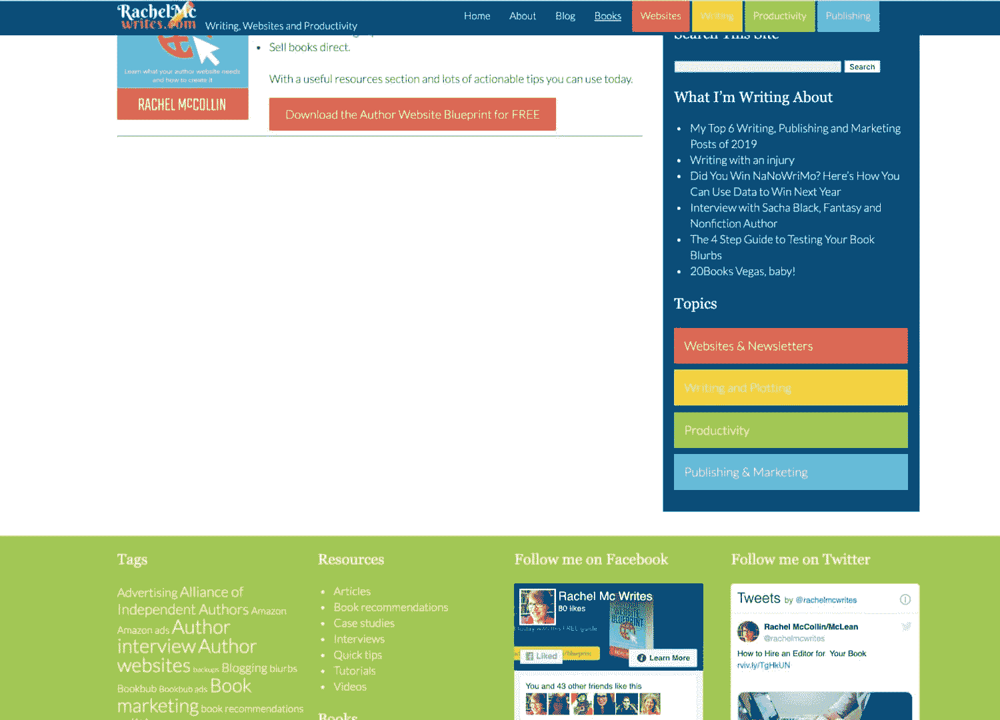

Widget areas in my site


WordPress 预装了一堆插件，所以你可以不用安装任何插件或者写任何代码就可以使用它们。但是你也可以通过安装插件或者编写自己的代码来添加更多的小部件。

这些可以涵盖广泛的内容类型，如媒体、社交媒体源、导航、搜索、地图等等。在你的网站上，几乎没有什么东西是你找不到的。事实上，最大的挑战往往是在所有选项中做出选择，而不是走极端。


## **何时使用 WordPress Widgets**

每当你想在你的站点中的一个或多个页面上添加额外的内容时，你应该使用一个小部件(当我说页面时，我包括帖子、档案等。)，但这不是该页面内容的一部分。它们对于你想在网站的每个页面上显示的内容特别有用，比如你的最新文章列表、购物车或行动按钮。

考虑有多少用户需要访问每个小部件，以及当您决定将它放在哪里时，它有多重要。侧边栏中的小部件会比页脚中的小部件更突出，有些用户可能甚至看不到。

因此，一个最新的帖子窗口小部件或行动呼吁窗口小部件可能更适合放在侧边栏，人们有更多的机会与它们互动，而社交媒体提要可以放在页脚。

如果您的主题也有专门的主页部件区域，您可能希望使用这些部件在站点的部门、相关内容列表或媒体(如欢迎人们访问站点的视频)中导航。

## WordPress 中的 11 个小部件示例

理解 WordPress 小部件提供的可能性的最好方法是看一些例子。让我们来看看你在 WordPress 网站上经常看到的 11 种小部件。

### **1。最近帖子窗口小部件**

最近的帖子小部件可能是博客中最常用的小部件。

它可以让你在你网站的每个页面的边栏或页脚显示你最近发表的文章列表，增加人们浏览网站和阅读大量文章的可能性。

WordPress 预装了最近发布的文章。它可以让你设置你想要显示多少文章，以及你想要给这个小部件指定什么标题。

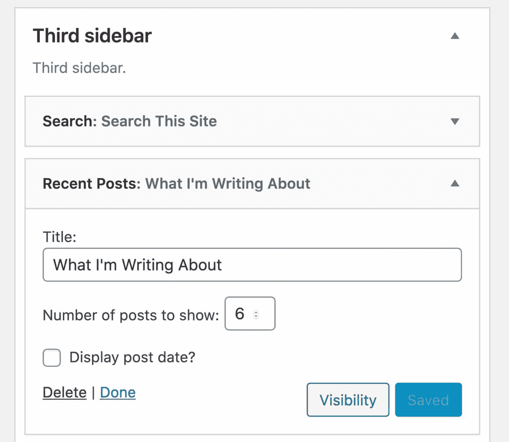

Recent Posts widget


如果你想增加额外的功能，你可以安装一个插件来替代 widget，比如 [WordPress Popular Posts](https://wordpress.org/plugins/wordpress-popular-posts/) ，它会显示最受欢迎的内容。或者，每次用户访问新屏幕时，[高级随机发布](https://wordpress.org/plugins/advanced-random-posts-widget/)窗口小部件都会刷新。

### **2。最近评论窗口小部件**

想向访问者展示你的网站有多有活力，你的观众对你的内容有多感兴趣？

“最近评论”小部件显示您站点上的最新评论，让访问者有机会直接导航到这些评论并加入讨论。

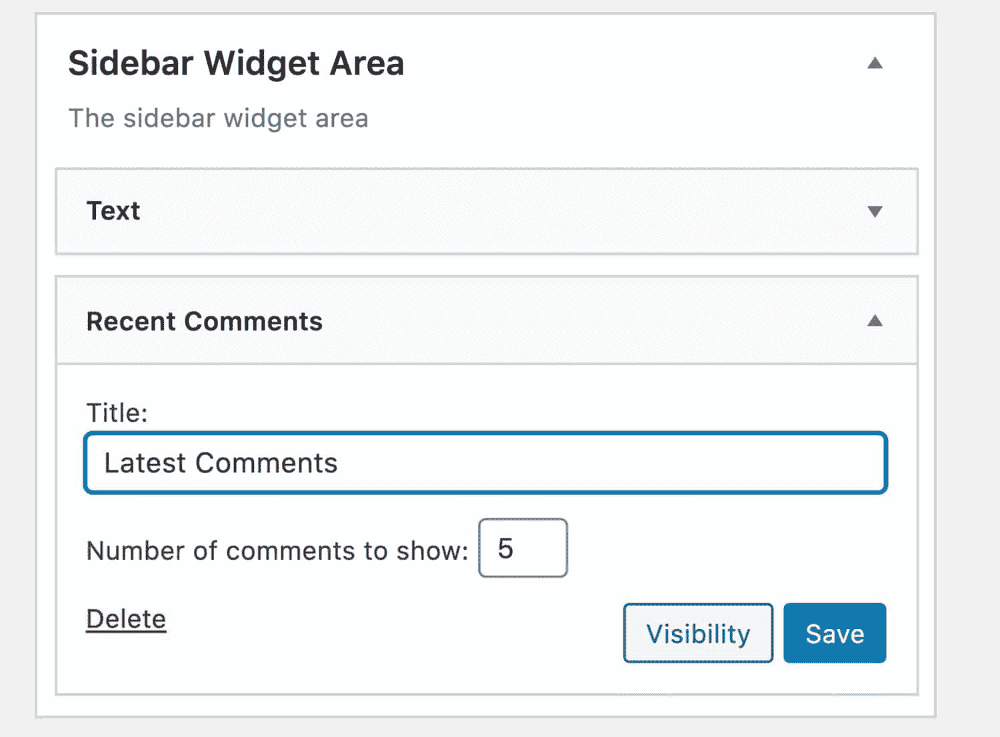

Recent Comments widget


WordPress 附带了最近评论窗口小部件。同样，如果你想增加额外的功能，你可以安装一个第三方评论插件，例如 [WP 社交评论](https://wordpress.org/plugins/gs-facebook-comments/)小工具，让人们使用他们的脸书账户发表评论:有利于社交媒体参与。

### **3。行动号召部件**

小部件的一个很好的用途是鼓励人们采取行动，你可以通过一个行动号召小部件来做到这一点。

你的窗口小部件可以是一个简单的按钮，或者你可以使用文本窗口小部件或 HTML 窗口小部件，甚至是图片窗口小部件来创建一些更定制的东西，所有这些都是 WordPress 预装的。

在我自己的一个网站上，我创建了一个号召行动的小部件，鼓励人们注册我的邮件列表。这使用了内置的 HTML 小部件，我在其中包含了一个图像，一些文本和一个按钮，我用 HTML 编码。

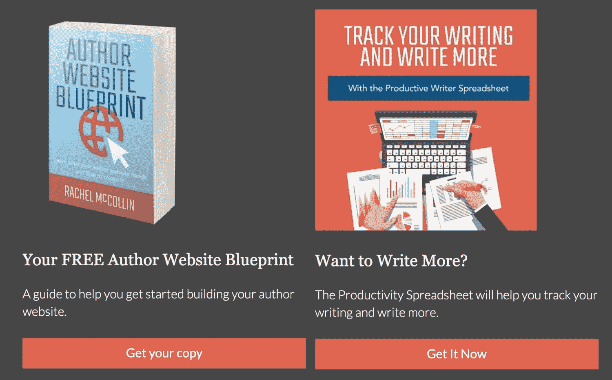

Call to Action widgets on my site


### **4。导航部件**

你也可以使用小工具来鼓励人们浏览你的网站。

为此有几个选项:类别或标签云部件和导航菜单部件。

导航菜单小部件允许您创建一个[自定义导航菜单](https://kinsta.com/blog/wordpress-custom-menu/)以及站点中的主导航菜单，然后将其添加到小部件区域。

你甚至可以把你的主导航菜单添加到一个窗口小部件区域，尽管这只有在你有一个小的导航菜单时才有效。

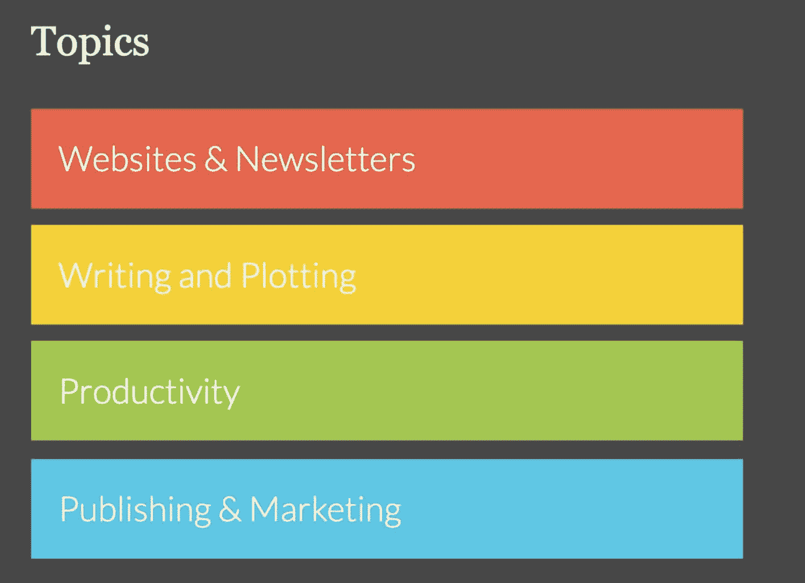

Navigation Menu widget


在你网站的页脚添加一个导航菜单将会鼓励人们到达文章的末尾来浏览你的网站。这对于移动用户来说特别有帮助，他们可能不得不在文章结束后进行大量滚动才能回到[主导航菜单](https://kinsta.com/blog/wordpress-menu-plugins/)。

或者，您可以使用内置的 Categories 小部件来显示您站点中的类别列表，或者使用 Tag Cloud 小部件来方便人们访问标签档案。


### **5。媒体部件**

在你的侧边栏或页脚添加媒体会让你的网站变得生动，让用户有东西可看或互动。

您可以使用内置的 Image 小部件在侧边栏或页脚中显示任何图像，并且它还允许您将该图像转换为链接。

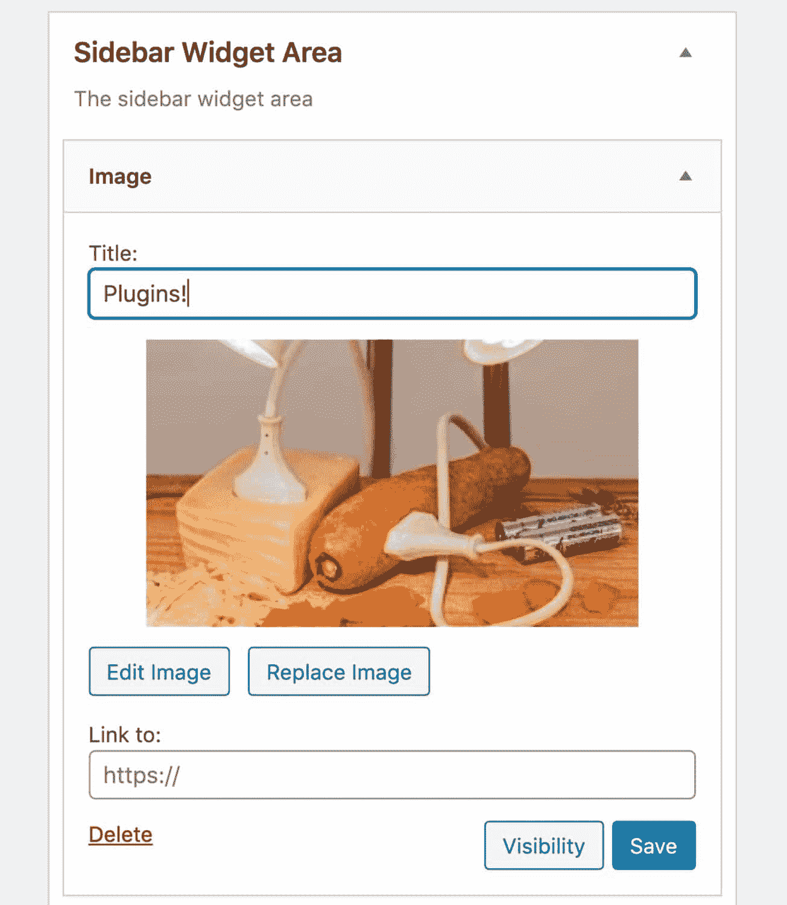

Image widget


或者，Video widget 可以让你将视频从 YouTube 或 Vimeo 直接传输到你站点的 widget 区域。如果你的站点在主页上有特殊的窗口小部件区域，这是非常有用的，但是在页脚也是一种很好的方式，当人们到达文章的末尾时，这可以吸引他们的注意力。

### **6。社交媒体插件**

如果你想吸引通过社交媒体访问你网站的人，将你的社交媒体源添加到你网站的侧边栏或页脚会向人们显示你在社交媒体上很活跃，并鼓励他们喜欢或关注你。

获得最大平台(脸书、Twitter、Instagram)的社交媒体插件的一种方法是[安装 Jetpack 插件](https://kinsta.com/knowledgebase/wordpress-jetpack/)，它包括所有这些以及更多。

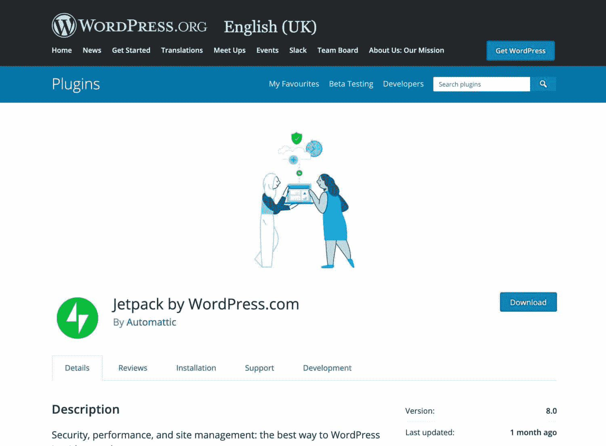

Jetpack plugin


或者，所有的社交媒体平台都有自己的插件，可以通过插件目录免费获得。或者你可以找到第三方插件,它可以让你定制显示你的社交媒体源的方式。

### 7 .**。购物车小工具**

如果你使用像 [WooCommerce](https://kinsta.com/blog/woocommerce-tutorial/) 这样的插件在你的网站上经营一家[电子商务](https://kinsta.com/blog/ecommerce-strategies/)商店，那么加入一个购物车小工具是个好主意，这样无论用户在商店的什么地方，都可以很容易地导航到他们的购物车。

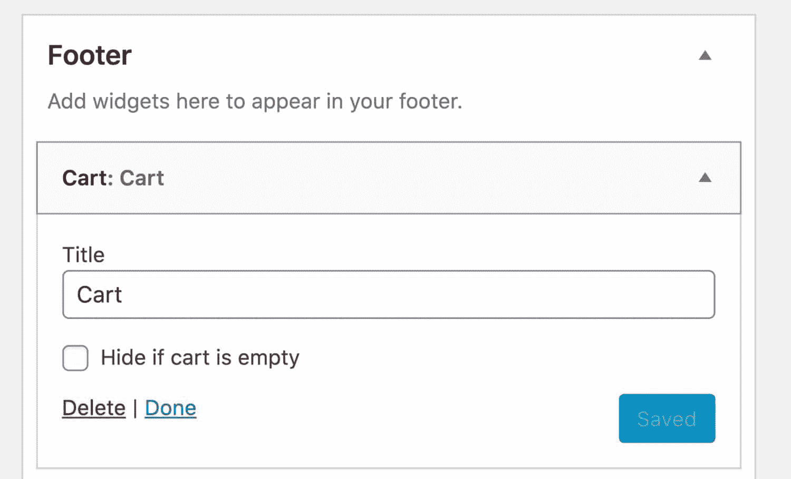

Shopping cart widget


你可以把它放在边栏中，人们可以很容易地看到它，或者如果你的主题包含一个窗口小部件区域，你可以把它放在标题中以增加可见性。

像 WooCommerce 这样的电子商务插件包括购物车部件和其他电子商务部件作为插件的一部分，所以一旦你将电子商务添加到你的网站，你会发现它们被添加到你的**部件**屏幕。

### **8。表单小工具**

如果你想让人们联系你，问问题或者注册邮件列表，你可以在你的工具条上添加一个表格。

WordPress 没有包含表单小部件，但是你可以添加插件来提供它们，比如免费的[联系表单 7](https://kinsta.com/blog/contact-form-7/) 或者高级但非常强大的[重力表单](https://kinsta.com/blog/wordpress-contact-form-plugins/#gravity-forms)。

### **9。地图小工具**

如果您的企业位于一个物理位置，并且您希望人们能够轻松找到您，那么在您的站点中添加地图微件会有所帮助。

有很多免费的[谷歌地图插件](https://kinsta.com/blog/wordpress-google-maps/#use-a-wordpress-google-maps-plugin-instead)或者其他 [WordPress 地图插件](https://kinsta.com/blog/wordpress-map-plugin/)你可以使用，比如 [WP 谷歌地图](https://en-gb.wordpress.org/plugins/wp-google-maps/)插件。

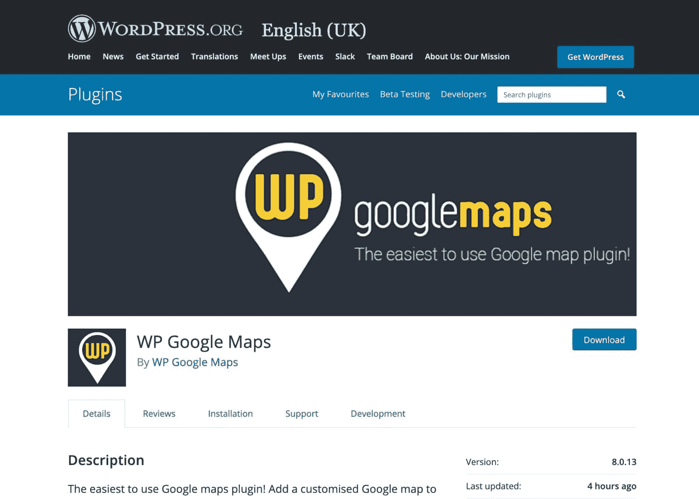

WP Google Maps plugin


或者，如果你不想安装插件，你可以[从谷歌地图中获取嵌入代码，并将该](https://kinsta.com/blog/wordpress-google-maps/)添加到 HTML 小部件中。

### 10。登录小工具

如果你正在运行一个会员网站，一个登录小工具会让人们[很容易登录到你的网站](https://kinsta.com/blog/wordpress-login-url/)，而不必去一个单独的登录页面。

WordPress 附带的 Meta widget 包括一个登录链接，但它也包括其他你可能不想要的东西，所以我建议从插件目录中为这个使用一个单独的插件。

使用 Ajax 登录的[小部件在您的小部件中提供了一个登录表单，这意味着人们可以从任何页面登录到您的站点。](https://wordpress.org/plugins/login-with-ajax/)

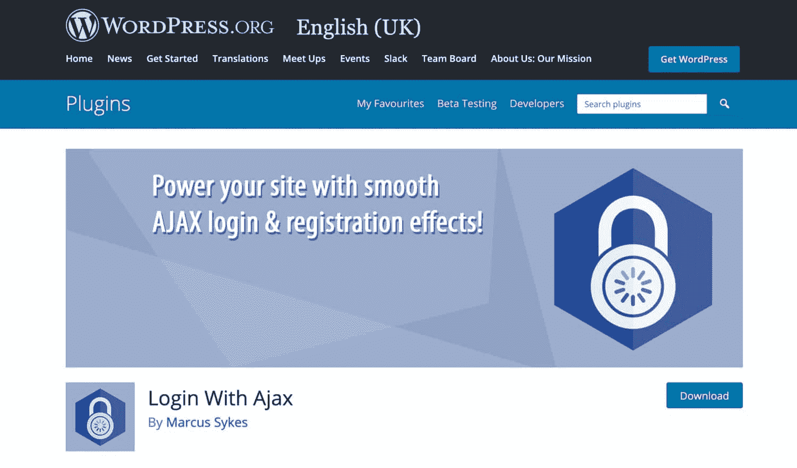

Login with Ajax widget plugin


### **11。搜索小工具**

一个非常简单但非常有用的小部件是预装在 WordPress 中的搜索小部件。

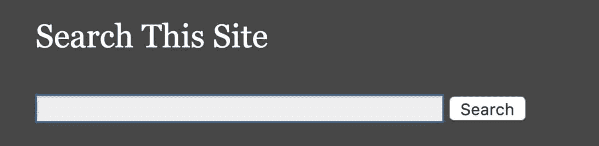

Search widget


把这个添加到你的侧边栏或者标题中，你就能让人们更容易在你的网站上找到你想要的东西。

如果你想增强你的搜索小工具的功能，你可以安装免费的 [WP 谷歌搜索](https://wordpress.org/plugins/wp-google-search/)小工具，它使用谷歌搜索。
T3】

## **如何给你的 WordPress 站点添加插件**

一旦你决定了你的 WordPress 站点需要什么样的小部件，是时候安装它们了。

不要被诱惑加太多。数量越多，用户越不可能注意到它们。相反，应该关注侧边栏的两到三个关键部件。你可以在页脚添加更多的内容，因为它们不太重要。

如果你的主题中有任何额外的部件区域，决定将哪些部件放入其中。确保它们符合你的站点的布局和[设计。](https://kinsta.com/blog/web-design-trends/)

有三种方法可以添加小部件:

*   使用 WordPress 自带的小工具。
*   从[插件目录](https://kinsta.com/blog/publish-plugin-wordpress-plugin-directory/)添加第三方小部件。
*   购买包含小部件的高级插件。

### **为你的 WordPress 站点寻找部件**

有大量可用的小部件，所以很难选择安装哪一个。让我们来看看这些选项，然后研究如何选择最适合自己的选项。

#### WordPress 自带的小工具

如果某个预装的小部件可以满足您的需求，那么就使用它。这将节省您的时间，并意味着在您的网站上运行更少的代码。

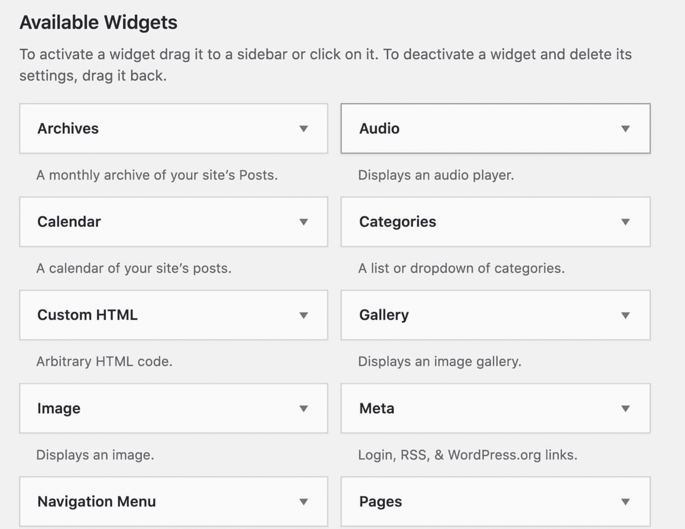

Pre-installed WordPress widgets


预安装的小组件有:

*   档案库:按月链接到档案库，是为博客设计的，但现在已经过时了。
*   日历:你文章的日历，同样适用于博客，尤其是当你的博客对时间很敏感的时候(但现在不太常见)。
*   定制 HTML :极致的灵活性，通过在 HTML 中键入或粘贴来添加任何你想要的内容(就像[谷歌表单](https://kinsta.com/blog/embed-google-form/))。如果你对编码不适应，请避免。
*   **图像** : [显示您媒体库中的图像](https://kinsta.com/blog/optimize-images-for-web/)。
*   **导航菜单**:显示主导航菜单或您创建的单独导航菜单。
*   **最近评论**:最近评论列表，并带有链接。
*   **标签云**:云格式的标签列表，带有相关档案的链接。
*   **视频** : [嵌入来自 YouTube](https://kinsta.com/blog/embed-youtube-video-wordpress/) 或任何其他流媒体服务的视频。
*   **音频**:嵌入播客、[播放器](https://kinsta.com/blog/wordpress-audio-players/)、歌曲或其他音频剪辑(建议:如何[使用 WordPress](https://kinsta.com/blog/wordpress-podcast/) 开始播客)。
*   **类别**:你的博客中的[类别列表，带有档案页面的链接。](https://kinsta.com/blog/wordpress-audio-players/)
*   **图库**:比图片小工具更高级，显示图片的[图库](https://kinsta.com/blog/wordpress-photo-gallery-plugins/)。
*   **Meta** :元数据，如[登录链接](https://kinsta.com/blog/wordpress-login-url/)和 [RSS 源](https://kinsta.com/blog/wordpress-rss-feed/)。WordPress 早期的遗留物，现在不是很有用。
*   **Pages** :显示你的站点的链接页面列表。
*   **最近发表的文章**:显示你最近发表的文章列表，鼓励人们阅读。
*   **搜索**:一个简单的搜索框。
*   **Text** :您想要添加的任何文本，例如关于站点的信息。

### **用插件添加部件**

WordPress 插件目录有数以千计的免费插件，会给你更多的插件供你选择。

除此之外，许多其他插件也包括小部件，比如一个电子商务插件给你一个[购物车小部件和更多的](https://kinsta.com/blog/woocommerce-themes/)。

如果插件目录中没有您需要的插件，您可能会决定添加一个高级插件。有时这些会提供更多的功能或更直观的界面。但是有时你会在一个免费的插件中发现相同的特性，所以在付费购买插件之前好好搜索一下插件目录。

#### **如何为你的网站找到合适的工具**

要找到适合你的 WordPress 小部件，请遵循以下提示:

1.  准确地确定您需要从小部件中得到什么。它需要什么功能，你希望它看起来怎么样？它需要链接到任何第三方 API 吗？
2.  检查内置的小工具，看看是否有一个满足您的需求。测试任何相关的，如果你找到一个合适的，那太好了。如果没有…
3.  检查插件目录，你可以通过**插件>添加新的**来访问。尝试搜索多个词来找到适合你的插件，搜索时可以使用或不使用单词“widget”。有时候，一个不是专注于小部件的插件会包含一个小部件，作为更广泛的功能集的一部分。
4.  如果你在免费插件中找不到合适的，就找一个[高级插件](https://kinsta.com/blog/wordpress-free-vs-paid-themes/)。向其他 WordPress 用户寻求建议，并在选择之前查看评论。

无论您选择哪个小部件，您都需要测试它，以检查它是否如您所愿地工作。如果你买的是高级插件，我建议你买一个有退款保证或免费试用期的插件，以防它不适合你。

### **如何在 WordPress 的侧边栏和页脚添加小部件**

现在您已经选择了您的小部件，是时候将它添加到您的站点了。

您可以将小部件添加到您的主题提供的任何活动小部件区域。如果你的主题在你想要的地方没有窗口小部件，试着寻找一个替代主题。

在这篇文章的后面，我将向你展示如何编写你自己的小部件区域。

有两种方法可以将小部件添加到您的站点:

*   通过使用[定制器](https://kinsta.com/blog/how-to-customize-wordpress-theme/)。进入管理菜单中的**外观>定制>小部件**，或者从屏幕顶部的管理栏中的**定制>小部件**。
*   通过小组件管理屏幕。进入管理菜单中的**外观>微件**，或者从管理栏中点击**自定义>微件**。

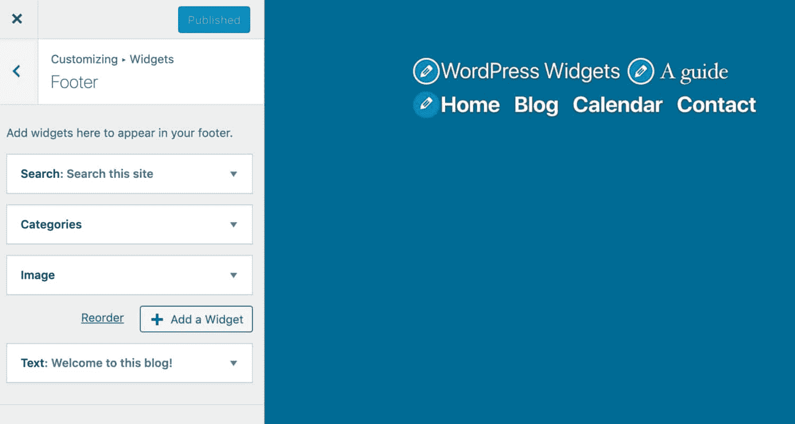

Widgets in the Customizer


我将很快向你展示如何使用这两种方法，但是首先让我们来看看小部件区域，以及为什么你用你的主题来使用它们。

#### 小部件不仅仅是侧边栏

根据你的主题，你可能会发现你在很多地方都有小部件区域。

大多数主题在侧边栏和页脚都有小部件区域。但是有些在其他地方也有，比如在内容的下面或上面，或者在标题里。

如果你进入 [WordPress admin](https://kinsta.com/knowledgebase/wordpress-admin/) 中的窗口小部件设置界面，你将能够看到你的主题中所有的窗口小部件区域。

我在很多地方使用了一个包含多个小部件区域的主题。您可以在下面的截图中看到，在内容的上方和下方，在页眉中，在主页脚的下方，都有小部件区域。

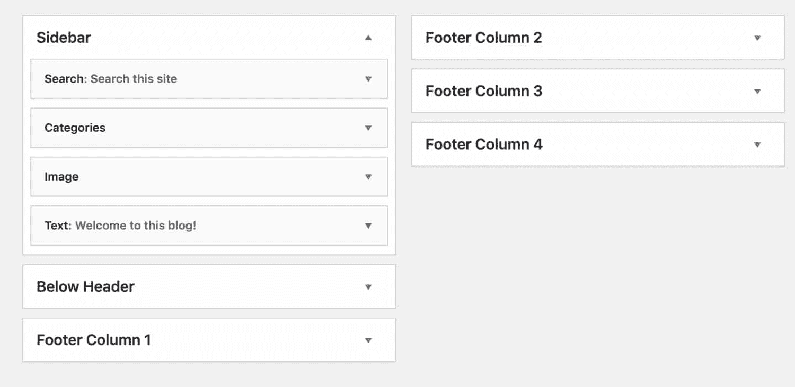

Widgets setting screen, widget areas


如果你想在站点的其他地方添加小部件，找到一个有多个小部件区域的主题是有意义的。最好的方法是使用一个框架主题。

一个很好的例子是，在你的主题中，除了边栏或页脚之外，在标题中添加一个搜索栏，就像我在我的一个网站上做的那样。

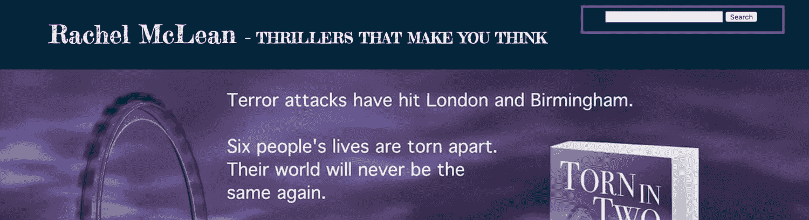

Search bar in the header


#### **小工具区域和主题**

小部件区域被编码到主题模板文件和主题函数文件中。

在这里你可以看到我在主题函数文件中使用的代码，它添加了一个窗口小部件区域，该区域将放在标题中。

```
register_sidebar( array(
 'name' => __( 'In Header Widget Area', 'rmccollin' ),
 'id' => 'in-header-widget-area',
 'description' => __( 'A widget area located to the right hand side of the header, next to the site title and description.', 'rmccollin' ),
 'before_widget' => '<div id="%1$s" class="widget-container %2$s">',
 'after_widget' => '</div>',
 'before_title' => '<h3 class="widget-title">',
 'after_title' => '</h3>',
) );
```

下面是我的 header.php 文件中的代码，它将小部件区域添加到主题中的正确位置。

```
if ( is_active_sidebar( 'in-header-widget-area' ) ) { ?>

 
  <?php dynamic_sidebar( 'in-header-widget-area' ); ?>
 

<?php }
```

如果您想在主题中添加额外的小部件区域，您需要添加相同类型的代码。在这篇文章的后面，我会告诉你怎么做。

不要忘记，如果你的主题没有你想要的那么多的窗口小部件区域，你总是可以做两件事情中的一件:

*   找到一个主题，它在你想要的地方有部件区域。
*   将新的小部件区域编码到你的主题或者你的主题的[子元素中。](https://kinsta.com/blog/wordpress-child-theme/)

一旦你在你的主题中所有你想要的地方都有了部件区域，你就可以开始添加部件了。

## 注册订阅时事通讯


### 想知道我们是怎么让流量增长超过 1000%的吗？

加入 20，000 多名获得我们每周时事通讯和内部消息的人的行列吧！

[Subscribe Now](#newsletter)

#### **如何使用微件屏幕添加微件**

有两种方法可以将小部件添加到你的 WordPress 站点。第一个是使用 WordPress admin 中的 Widgets 屏幕。

点击**外观>小工具**。这将打开小组件屏幕。

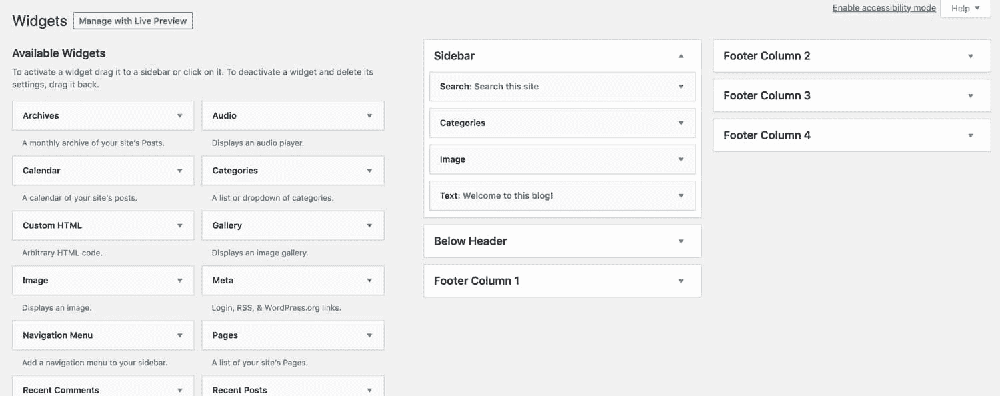

Widgets screen


要添加小部件，您可以执行以下两项操作之一:

*   将它从左侧的小部件列表中拖到相关的小部件区域。
*   点击你想添加的小部件，你会看到一个列表，你可以在那里添加它。选择您想要的微件区域，然后点击**添加微件**按钮。

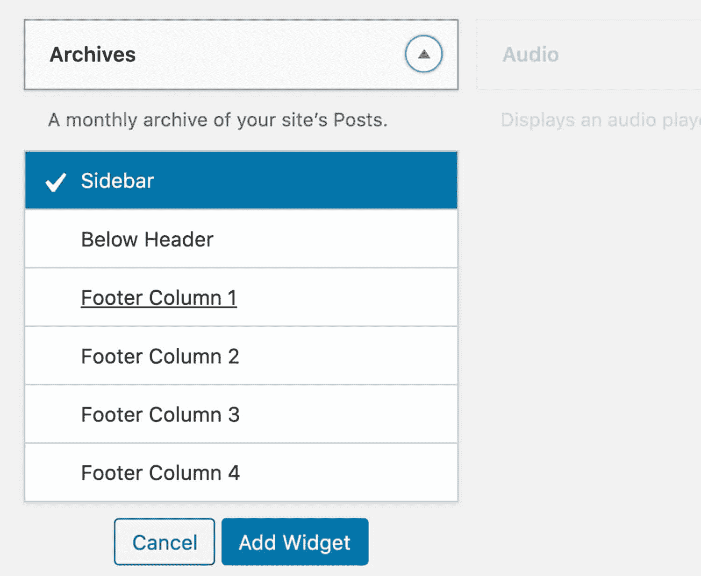

Selecting a widget area and widget


然后，您可能需要编辑小部件在小部件区域中的位置。

你可以在每个窗口小部件区域添加任意数量的窗口小部件，但是不要太过分。您可以在小部件区域内拖动它们，以获得正确的顺序。如果您不喜欢它们的外观，也可以将它们从一个 widget 区域拖到另一个 widget 区域。

您也可以使用键盘通过 widgets 屏幕添加 widgets，因此如果您无法使用鼠标，您仍然可以添加 Widgets。

#### **在辅助功能模式下添加和编辑小工具**

如果您不能使用鼠标，您可以通过键盘使用 Widgets 屏幕。

首先，点击(或点击并选择)屏幕右上角的**启用辅助功能模式**链接，将屏幕置于辅助功能模式。

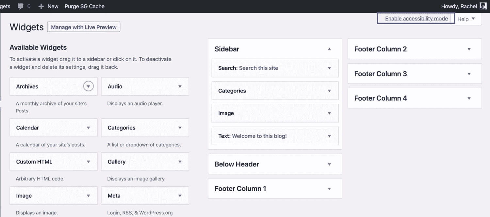

Accessibility mode link


然后，屏幕将会改变，以反映您处于辅助功能模式的事实。

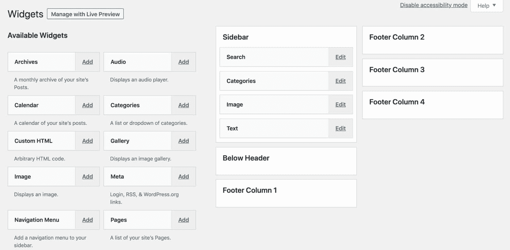

Widgets screen accessibility mode


然后，您可以使用键盘上的 **Tab** 键在屏幕元素之间导航，并按 Enter 键选择一个项目并对其进行操作。你可以切换到一个小部件，点击**添加**链接上的**返回**，然后选择你想要添加它的地方，或者切换到小部件区域，点击**编辑**链接上的**返回**。

#### **如何使用 WordPress 定制器添加小工具**

使用定制器添加小部件而不是小部件屏幕意味着您可以在添加小部件时看到它们。这使得更容易看到你的部件的外观，如果你想的话，可以在部件区域之间移动它们。

在管理菜单中，点击**外观>定制**。或者，从现场屏幕顶部的管理栏(假设你已经登录)，点击**定制**。这将打开定制器。

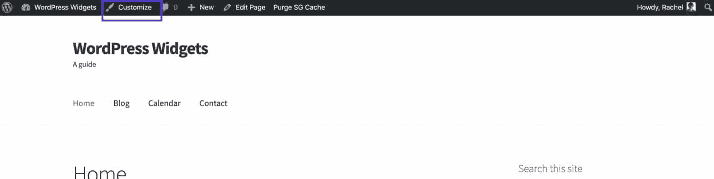

WordPress admin bar


现在点击 **Widgets** 选项，你会看到主题中所有 widget 区域的列表。点击想要添加微件的微件区域，点击**添加微件**按钮。

这将为您提供站点可用的所有小部件的列表。这将包括 WordPress 自带的所有内置部件，以及你通过插件添加的任何部件。

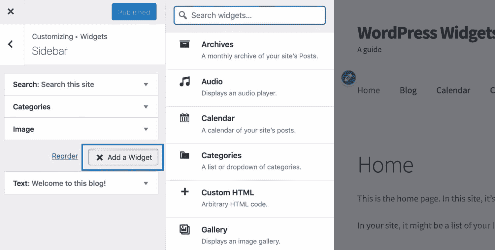

Add a widget button


选择您想要添加到该窗口小部件区域的窗口小部件，您将在右侧的预览屏幕中看到它。

您可以通过在左侧上下拖动微件来重新排序微件，或者单击微件列表下方的**重新排序**链接，然后单击箭头来上下移动微件。

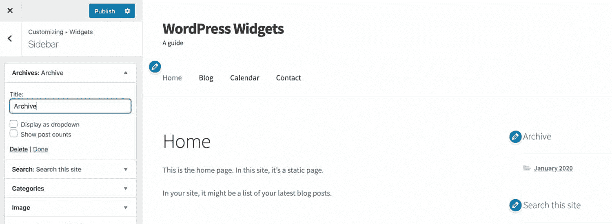

Editing widgets in the Customizer


一旦通过定制器添加完小部件，不要忘记点击左上方的**发布**按钮，以便保存您的更改。如果您不这样做就离开定制器，您的任何更改都不会反映在活动站点上。

一旦你添加了你的部件，请看看它们，检查它们是否适合你的页面设计。如果你添加了太多的小部件区域，事情看起来可能会有点混乱。您要么需要删除其中一些，要么可以将它们从一个部件区域移动到另一个部件区域。

在窗口小部件屏幕中很容易做到这一点，您可以在窗口小部件区域之间拖动窗口小部件。

#### **如何向特定页面添加小工具**

有些主题包括专门用于特定页面的窗口小部件区域，比如主页。但是如果您想在站点的一个页面上添加一个小部件呢？

你可以在[古腾堡](https://kinsta.com/blog/gutenberg-wordpress-editor/)帖子和页面编辑器中完成这项工作。

以通常的方式添加一个新块，然后选择 **Widgets** 块类型。

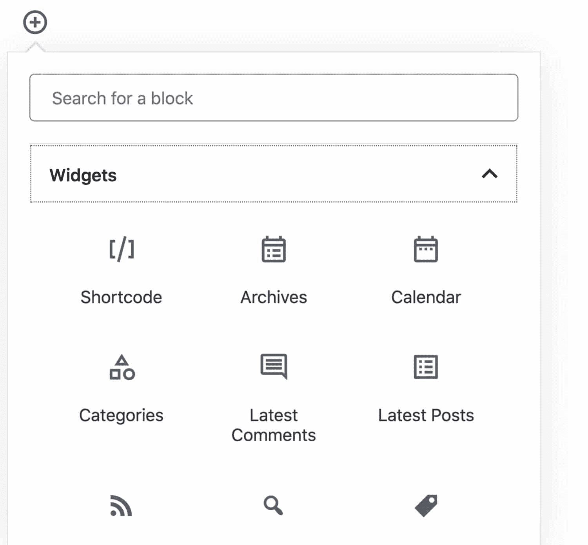

Widget block type


然后，您可以从为您的站点启用的许多小部件中进行选择，并将其添加到您的帖子或页面的内容中。如果你想添加一个表单小部件，一个行动号召小部件，或者一个你最近发布的文章列表，这真的很有用。

### **如何编辑小工具**

一旦您将小部件添加到您的站点，您就可以对它们进行更改。各个微件都有设置，您可以通过微件屏幕或定制器来访问(您使用哪一个来添加微件并不重要。)

有些微件不包含任何设置，但其他微件有微件标题或显示帖子数量的设置。有些更复杂，需要您在单独的设置页面中设置小部件。查看插件开发者的文档。

编辑 widget 插件的选项包括:

*   编辑插件的设置。
*   将部件从一个部件区域移动到另一个部件区域。
*   正在删除小部件。对此，您有两种选择，稍后将会看到。

要编辑小部件的设置，在小部件屏幕或定制器中找到该小部件，然后简单地编辑提供的任何选项。

需要为您的客户站点提供一个非常快速、安全且对开发人员友好的托管服务吗？Kinsta 是为 WordPress 开发者设计的，提供了大量的工具和强大的仪表板。[查看我们的计划](https://kinsta.com/plans/?in-article-cta)

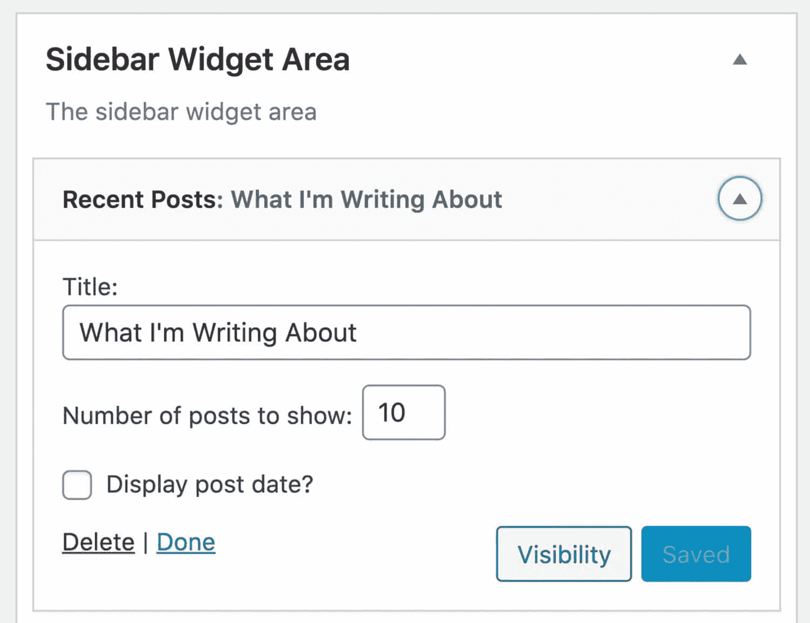

Editing widget options


要将小组件从一个区域移动到另一个区域，请打开小组件屏幕，并将其从一个小组件区域拖到另一个小组件区域。在辅助功能模式下，导航到小部件右侧的箭头，并从选项中进行选择。

#### **删除小工具**

要删除小组件屏幕中的小组件，请找到该小组件，然后单击小组件设置框左下角的删除链接。

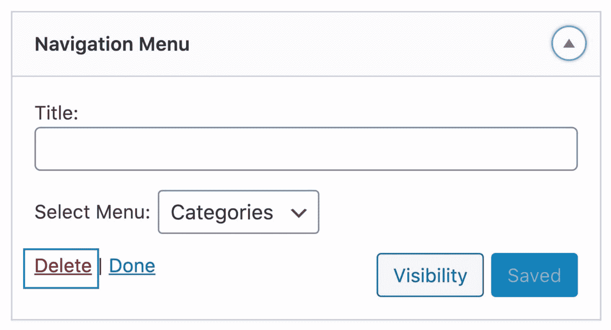

Deleting a widget in the widgets screen


要删除定制器中的小部件，请在其小部件区域中找到该小部件。点击小工具名称右侧的箭头，然后点击小工具设置左下方的**移除**链接。

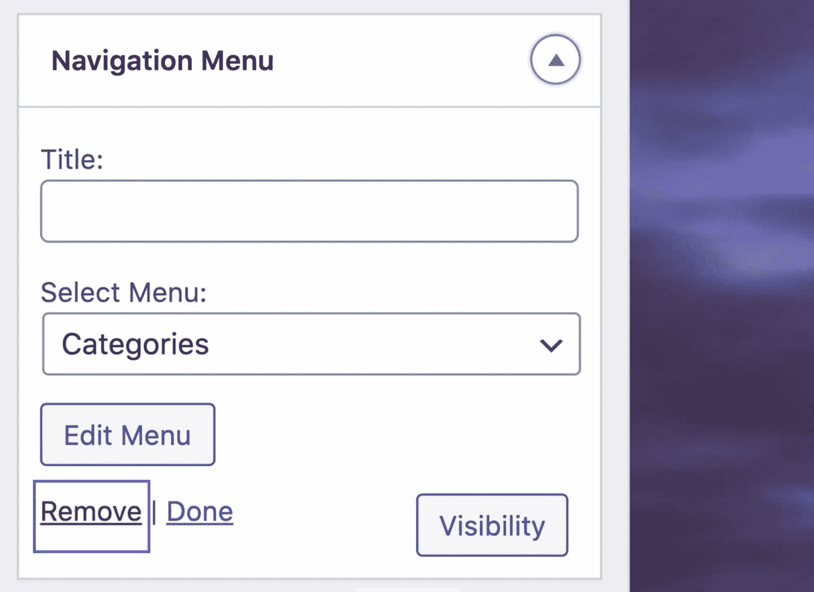

Removing a widget in the Customizer


您也可以从微件区域移除微件，但仍可在稍后通过微件屏幕使用。

向下滚动到屏幕底部的**非活动微件**区域。将小部件拖到此区域以将其从小部件区域中移除，但保留其当前设置为草稿。如果将来需要，您可以将它们拖回小部件区域。

如果[你切换主题](https://kinsta.com/blog/change-wordpress-theme/)并且你的新主题有不同的窗口小部件区域，任何不适合新主题窗口小部件区域的窗口小部件将被 WordPress 自动移动到非活动窗口小部件列表。

## **如何在你的主题中添加一个新的部件区域**

如果您的主题没有您想要的 widget 区域，您可以随时添加自己的 widget 区域。您可以通过添加两段代码来实现这一点。

让我们在内容下面添加一个小部件区域。

### 在主题函数文件中创建小部件区域

第一步是使用`register_widget()`功能设置小部件区域。

如果你使用的是第三方 WordPress 主题(这里有一个最好的选择)，你需要创建一个子主题来完成这个任务。原因是如果你[在未来更新主题](https://kinsta.com/blog/how-to-update-wordpress-theme/)，你所有的改变将会丢失。

如果您正在使用自己的主题，您可以简单地编辑主题。

首先打开你的主题的**functions.php**文件。在文件的底部，添加以下代码。

```
function kinsta_register_widgets() {

 register_sidebar( array(
  'name' => __( 'After Content Widget Area', 'kinsta' ),
  'id' => 'after-content-widget-area',
  'description' => __( 'Widget area after the content', 'kinsta' ),
  'before_widget' => '<div id="%1$s" class="widget-container %2$s">',
  'after_widget' => '</div>',
  'before_title' => '<h3 class="widget-title">',
  'after_title' => '</h3>',

 ) );

}

add_action( 'widgets_init', 'kinsta_register_widgets' );
```

现在保存你的 functions.php 文件。如果你去你的窗口小部件屏幕或者定制器，你会发现新的窗口小部件区域可供你添加窗口小部件。

但是如果你这样做，它们实际上不会出现在页面上。这是因为您需要向主题模板文件中添加一些代码。

**将小工具添加到主题模板文件**

第一件事是找出你需要使用哪个主题模板文件。

*   如果你要添加一个额外的侧边栏，那么你需要将这段代码添加到你的**sidebar.php**文件中。
*   如果您在内容之前或之后添加小部件区域，您需要将它添加到输出内容的主题模板文件中。
*   如果你要在你的头部添加一个小部件区域，你需要把代码添加到你的 header.php 文件中。
*   如果你的新窗口小部件区域只是用于你站点中的一个页面或者一种类型的内容，你需要使用 [WordPress 模板层次](https://developer.wordpress.org/themes/basics/template-hierarchy/)来精确地计算出你需要使用/创建哪个模板文件，然后编辑它。例如，你想在你的主页上添加窗口小部件区域，你需要创建一个 front-page.php 的**文件，然后在那里添加你的窗口小部件区域。**

一旦确定了需要编辑哪个模板文件，以及小部件区域的代码应该放在哪里，就添加下面的代码。对于内容后的小部件区域，我们将其添加到主题中的**post.php**和**page.php**文件中:

```
if ( is_active_sidebar( 'after-content-widget-area' ) ) { ?>

 aside class="after-content widget-area full-width" role="complementary">
  <?php dynamic_sidebar( 'after-content-widget-area' ); ?>
 

<?php }
```

现在保存您的模板文件。

请注意，您的代码将与我的不同，这取决于您对小部件区域的命名以及您想要将它放入的元素。我通常使用**side**元素，因为在我看来，它们是为边栏和小部件区域设计的。

Ninja 提示:如果您将内容的容器元素的结尾移动到侧边栏和/或页脚文件的开头，那么您可以在那里添加它，并且您只需要添加一次。

现在，如果你看看你的网站，你会发现你添加到你的小部件区域的任何小部件都会出现在正确的位置。如果它们不在正确的位置，回去编辑你的模板文件，确保代码在你想要的地方。你可能还需要[编辑你的 CSS](https://kinsta.com/knowledgebase/edit-wordpress-code/) 来得到你想要的样子。

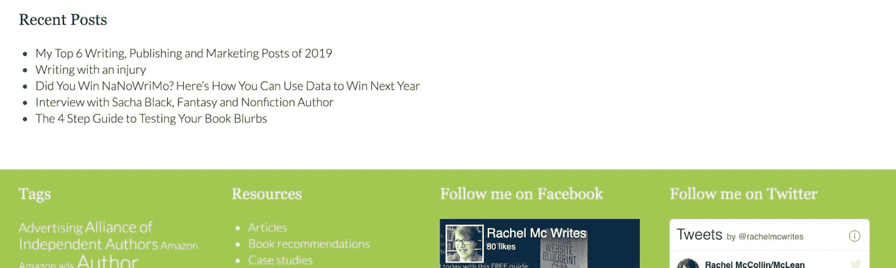

Widget on the live site


## **如何使用 Widgets API 编写 Widgets 代码**

现在你知道了如何为你的站点选择小部件，如何将它们添加到你的站点，以及如何注册新的侧边栏或小部件区域。下一步是学习如何创建一个 WordPress 小部件。

有时候，你可能会发现没有一个插件可以在你的站点上创建你想要的精确的小部件。这意味着你必须自己编码。

在这个例子中，我将向您展示如何编写一个非常简单的行动号召小部件。

**Widgets API 概述**

WordPress 中的 [Widgets API](https://developer.wordpress.org/themes/functionality/widgets/) 包含了注册、创建和编写 Widgets 所需的所有代码。小部件 API 包括:

*   构建新部件的类。
*   函数来注册小部件并将它们部署到您的站点上。
*   注销窗口小部件的功能，例如从父主题中注销。

这里我们将使用一个类来构建一个小部件。第一步是创建一个插件来保存小部件。

### **为你的 WordPress Widget 创建一个插件**

要创建自己的小部件，你需要[编写一个插件](https://kinsta.com/blog/publish-plugin-wordpress-plugin-directory/)。不要在你的主题中添加新部件的代码，因为部件是关于功能而不是关于显示的。如果你[在未来改变了你的主题](https://kinsta.com/blog/change-wordpress-theme/)，你希望仍然能够访问那个小工具。

首先创建一个空插件。在您的`wp-content/plugins`目录中创建一个插件文件夹，并向其中添加一个空文件。给它一个合适的名字。打开该文件并添加以下代码。

```
<?php
/**
 * Plugin Name: Kinsta Call to Action Widget
 * Plugin URI: https://rachelmccollin.com
 * Description: A simple call to action widget.
 * Version: 1.0
 * Author: Rachel McCollin
 * Author URI: https://rachelmccollin.co.uk
 */
```

你需要编辑你自己的作者 URI 和插件 URI。这将为您创建一个插件，您可以通过插件屏幕激活它。

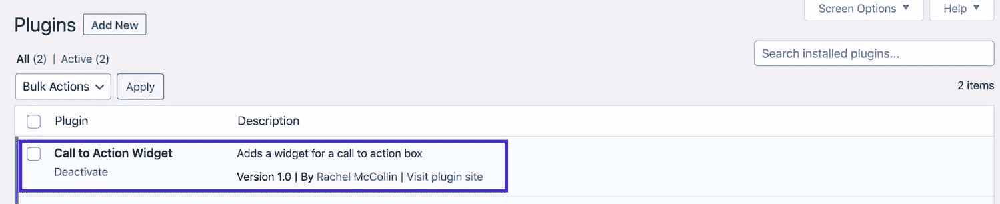

Widget plugin in plugins screen


但是如果你激活它，什么也不会发生。你必须给你的插件添加一些代码。

### **为小工具创建一个类**

小部件的代码放在一个类中。所以接下来加上那个。

```
class kinsta_Cta_Widget extends WP_Widget {

}
```

#### **创建构造函数**

进入该类的第一件事是创建小部件的构造函数。将它添加到类的大括号中。

```
//widget constructor function

function __construct() {

 $widget_options = array (
  'classname' => 'kinsta_cta_widget',
  'description' => 'Add a call to action box with your own text and link.'
 );

 parent::__construct( 'kinsta_cta_widget', 'Call to Action', $widget_options );

}
```

这将开始构建小部件。

#### **创建表单以输出小部件**

接下来，我们需要一个表单，小部件屏幕和定制器将使用它来创建小部件。加上这个，还是在括号里面。

```
//function to output the widget form

function form( $instance ) {

 $title = ! empty( $instance['title'] ) ? $instance['title'] : '';
 $link = ! empty( $instance['link'] ) ? $instance['link'] : 'Your link here';
 $text = ! empty( $instance['text'] ) ? $instance['text'] : 'Your text here';
?>

<p>
 <label for="<?php echo $this->get_field_id( 'title'); ?>">Title:</label>
 <input class="widefat" type="text" id="<?php echo $this->get_field_id( 'title' ); ?>" name="<?php echo $this->get_field_name( 'title' ); ?>" value="<?php echo esc_attr( $title ); ?>" /></p>

<p>
 <label for="<?php echo $this->get_field_id( 'text'); ?>">Text in the call to action box:</label>
 <input class="widefat" type="text" id="<?php echo $this->get_field_id( 'text' ); ?>" name="<?php echo $this->get_field_name( 'text' ); ?>" value="<?php echo esc_attr( $text ); ?>" /></p>

<p>
 <label for="<?php echo $this->get_field_id( 'link'); ?>">Your link:</label>
 <input class="widefat" type="text" id="<?php echo $this->get_field_id( 'link' ); ?>" name="<?php echo $this->get_field_name( 'link' ); ?>" value="<?php echo esc_attr( $link ); ?>" /></p>

<?php }
```

这为用户提供了一个表单，他们可以使用该表单添加文本和一个指向行动号召框的链接。

#### **创建保存小工具的函数**

现在，您需要保存输入到该表单中的任何内容。加上这个。

```
//function to define the data saved by the widget

function update( $new_instance, $old_instance ) {
 $instance = $old_instance;
 $instance['title'] = strip_tags( $new_instance['title'] );
 $instance['text'] = strip_tags( $new_instance['text'] );
 $instance['link'] = strip_tags( $new_instance['link'] );
 return $instance;          

}
```

这将把用户输入的数据保存到小部件设置中。

#### **创建输出小工具的函数**

现在您需要添加将在站点上显示小部件的代码。同样，在大括号内添加以下内容:

```
//function to display the widget in the site

function widget( $args, $instance ) {
 //define variables
 $title = apply_filters( 'widget_title', $instance['title'] );
 $text = $instance['text'];
 $link = $instance['link'];

 //output code
 echo $args['before_widget'];
 ?>

 <div class="cta">
  <?php if ( ! empty( $title ) ) {
  echo $args['before_title'] . $title . $args['after_title'];
};
  echo '<a href="' . $link . '">' . $text . '</a>';
  ?>
 </div>

 <?php
 echo $args['after_widget'];

}
```

### **注册小工具**

现在你已经写好了你的类，是时候注册 WordPress 小部件了，这样它就可以工作了。将这段代码添加到类的外部。

```
//function to register the widget
function kinsta_register_cta_widget() {

 register_widget( 'kinsta_Cta_Widget' );

}
add_action( 'widgets_init', 'kinsta_register_cta_widget' );
```

现在保存你的插件文件。转到 Widgets 屏幕，您将看到可以使用的 widget。

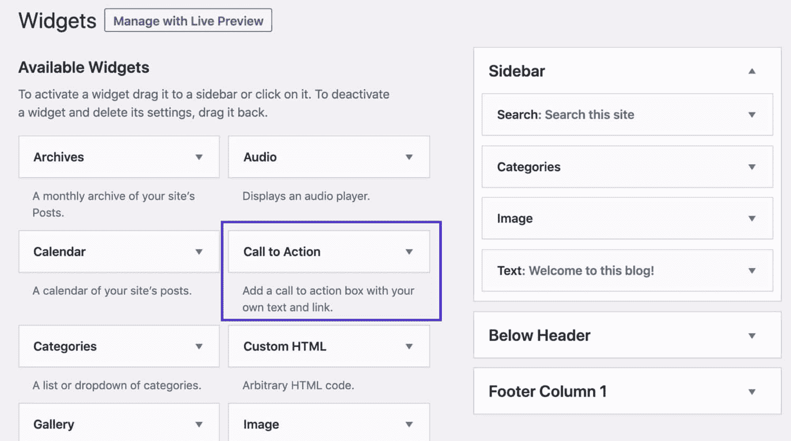

New widget in widgets screen


如果您将它添加到一个小部件区域，并向它添加文本和链接，它将在 live 站点中输出。

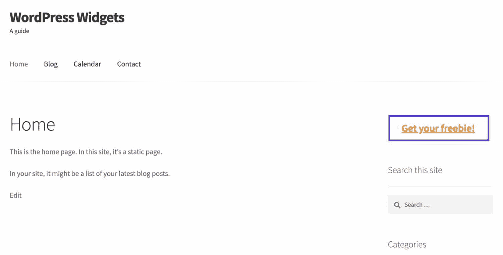

New widget in the live site


现在看起来可能没那么好。你需要[添加一些 CSS](https://kinsta.com/blog/wordpress-css/) 来对其进行样式化。

### **向小工具添加 CSS**

要将 CSS 添加到插件中，您需要创建一个样式表并将其放入插件中。上课前把这个添加到你的插件文件中。

```
function kinsta_widget_enqueue_styles() {

 wp_register_style( 'widget_cta_css', plugins_url( 'css/style.css', __FILE__ ) );
 wp_enqueue_style( 'widget_cta_css' );

}
add_action( 'wp_enqueue_scripts', 'kinsta_widget_enqueue_styles' );
```

现在您需要在插件的文件夹中添加一个 **style.css** 文件，并添加任何样式。我把那个留给你！

您现在有了一个简单的[行动按钮](https://kinsta.com/blog/conversion-rate-optimization-tips/#2-strategic-ctas-button-popups-pricing-tables)，您可以将它添加到站点上的任何小部件区域。例如，如果你把它添加到你的侧边栏，人们就可以从网站的任何地方使用它进入你的注册页面。

您可以使用额外的设置和选项创建更复杂的小部件，但这给了您如何开始创建自己的小部件的想法。

如果你想看我这个插件的代码，包括样式，你可以在 [Github](https://github.com/rachelmccollin/kinsta-cta-widget-plugin) 上找到它。如果你是从代码开始，这里有一个关于 [git 和 GitHub](https://kinsta.com/knowledgebase/git-vs-github/) 以及如何开始使用两者的深入指南。

[Widgets are one of the best WordPress features! They can literally change your site from 'meh' to 'yes!' 🤔😻 Learn what they are, how to use them, and how to code your own widgets with this in-depth guide!Click to Tweet](https://twitter.com/intent/tweet?url=https%3A%2F%2Fkinsta.com%2Fblog%2Fwordpress-widgets%2F&via=kinsta&text=Widgets+are+one+of+the+best+WordPress+features%21+They+can+literally+change+your+site+from+%27meh%27+to+%27yes%21%27+%F0%9F%A4%94%F0%9F%98%BB+Learn+what+they+are%2C+how+to+use+them%2C+and+how+to+code+your+own+widgets+with+this+in-depth+guide%21&hashtags=design%2Cwordpresshelp)

## **总结**

窗口小部件是我最喜欢的功能之一。他们可以让你的网站充满活力，帮助你获得更多的注册或者[将更多的访问者转化为客户](https://kinsta.com/blog/wordpress-ab-testing-tools/)。你可以将 WordPress 小部件添加到你的主题中任何现有的小部件区域，或者你可以添加额外的小部件区域，这样你就可以在更多的地方添加更多的小部件。

还有很多地方可以找到小工具。WordPress 预装了一些，你也可以通过插件安装更多的[。但这还不是全部，如果你觉得舒服，你还可以使用 widgets API 编写你自己的 Widgets。](https://kinsta.com/best-wordpress-plugins/)

现在轮到你了:你如何在你的网站上使用 WordPress 小部件？你用了多少？

* * *

让你所有的[应用程序](https://kinsta.com/application-hosting/)、[数据库](https://kinsta.com/database-hosting/)和 [WordPress 网站](https://kinsta.com/wordpress-hosting/)在线并在一个屋檐下。我们功能丰富的高性能云平台包括:

*   在 MyKinsta 仪表盘中轻松设置和管理
*   24/7 专家支持
*   最好的谷歌云平台硬件和网络，由 Kubernetes 提供最大的可扩展性
*   面向速度和安全性的企业级 Cloudflare 集成
*   全球受众覆盖全球多达 35 个数据中心和 275 多个 pop

在第一个月使用托管的[应用程序或托管](https://kinsta.com/application-hosting/)的[数据库，您可以享受 20 美元的优惠，亲自测试一下。探索我们的](https://kinsta.com/database-hosting/)[计划](https://kinsta.com/plans/)或[与销售人员交谈](https://kinsta.com/contact-us/)以找到最适合您的方式。