# 创建 WordPress Wiki 的终极指南

> 原文：<https://kinsta.com/blog/wordpress-wiki/>

网上信息的收集和分享变得混乱。这就是为什么人们使用 WordPress wiki:为多个用户提供特殊组织工具[的网站](https://kinsta.com/blog/share-logins-wordpress/)来有效地归档、显示和浏览内容。

维基在很多方面都很有帮助，无论是让品牌为用户维护和共享一个文档部分，还是在你的网站上创建一个详述产品信息的区域。

对于员工培训资源或为你的产品(无论是电影、软件还是视频游戏)建立一个众包知识库来说，它们也很棒。

幸运的是，任何人都可以制作一个 WordPress wiki 来[更好地组织内容](https://kinsta.com/blog/cms-software/)并为用户提供[协作选项](https://kinsta.com/blog/microsoft-teams-vs-slack/)。

继续阅读，了解什么是维基，然后深入研究如何建立一个。

## 什么是 WordPress Wiki(或知识库)？

wiki 是组织在可搜索数据库中的内容(媒体、文档、教程)的集合，以便于导航。

> Kinsta 把我宠坏了，所以我现在要求每个供应商都提供这样的服务。我们还试图通过我们的 SaaS 工具支持达到这一水平。
> 
> <footer class="wp-block-kinsta-client-quote__footer">
> 
> 
> 
> <cite class="wp-block-kinsta-client-quote__cite">Suganthan Mohanadasan from @Suganthanmn</cite></footer>

[View plans](https://kinsta.com/plans/)

许多 wiki 提供协作功能，甚至社区贡献选项(如 Wikipedia 或 Fandom 如何依靠用户提交和编辑繁荣)，但你也可以创建一个不对贡献开放的 wiki，在那里版主创建内容，然后[简单地发布它](https://kinsta.com/blog/how-to-publish-a-website/)供查看。

当您删除协作功能时，wikis 可以很好地用于知识库和客户支持文档。

WordPress wiki 更具体一些。除了运行在 WordPress 内容管理系统(CMS)上，WordPress wikis 和其他 wiki 是一样的。

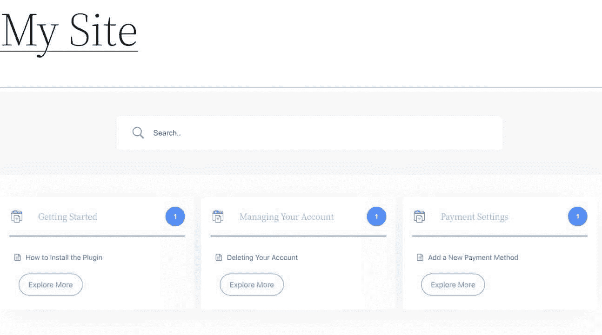

Example of a wiki/knowledge base running on WordPress

[Sharing information online gets messy. 🛠 That’s why people use WordPress wiki- and setting up your own has never been easier 💪Click to Tweet](https://twitter.com/intent/tweet?url=https%3A%2F%2Fbit.ly%2F3JKYNIn&via=kinsta&text=Sharing+information+online+gets+messy.+%F0%9F%9B%A0+That%E2%80%99s+why+people+use+WordPress+wiki-+and+setting+up+your+own+has+never+been+easier+%F0%9F%92%AA&hashtags=WordPress%2CBranding)

### WordPress Wiki 的好处

你的企业或组织需要 WordPress wiki 吗？当您在寻找更好的方式来组织内容并将其呈现给用户或内部员工时，通常会出现这个问题。

你可能会发现[你的博客变得如此之大](https://kinsta.com/podcast/blogger-grew-6-figure-business/)，以至于很难找到某些主题。或者你有一系列的谷歌文档，需要组织在一个具有搜索功能的集中网页上。

不管什么原因，你经常会发现 WordPress wiki 是一个极好的解决网上混乱的方法。

以下是 WordPress wikis 的主要优势:

1.  所有信息都存储在一个地方:维基改进了由电子邮件、本地文档、在线文档和数据库组成的内部系统。它们还有助于整合您与用户共享的零散内容，如存储在不同位置的博客帖子、网页或在线文档。简而言之，维基允许你把每一部分内容集中到一个中心位置。
2.  **用户和利益相关者变得更加博学:**易于获取的知识造就了自信、见多识广的客户支持代表，他们需要为客户提供快速的答案。也让客户对你的产品有更深入的了解，促使他们更多的使用，提出问题，推动你改进。
3.  **信息更容易找到:**客户和员工都使用文档来找到关于产品的解决方案，但数据库、在线存储系统甚至博客变得杂乱无章。Wikis 允许用户使用关键字搜索，使用过滤器，并通过可点击的导航找到链接的内容。
4.  **内容更容易维护:**要访问维基，一个人只需要互联网连接、一个互联网浏览器和[维基的网址](https://kinsta.com/knowledgebase/what-is-a-url/)。不需要特殊的软件、密码或访问和导航数据库或软件的知识。
5.  快速链接是内置的:任何维基的基石都是将一个内容与另一个内容链接起来的能力。大多数维基系统允许用户创建到另一个现有内容的快速链接，通常使用快捷方式或热键。
6.  **你可以众包:**维基通常具有让用户控制[内容创作](https://kinsta.com/blog/cms-software/)的功能。如果你想要一个更封闭的系统，这不是必需的，但是许多维基完全是建立在用户的志愿工作之上的(例如，以维基百科或 Fandom 为例)。
7.  **利用类别和标签等高级组织元素:**我们已经提到了过滤器和搜索栏，但有了维基，您还可以通过标签和类别来控制您的文档。当内容不适合 wiki 的某个区域时，或者如果您想添加更多的子部分用于过滤，这一点尤其重要。
8.  修订控制简单而直观:大多数文字处理器都有某种修订控制，但它们很复杂，有太多被划掉的单词和注释。另一方面，Wikis 倾向于提供内置的修订控制，记录每个文档版本以便切换和比较，这使得修订比在文字处理器中更容易管理。
9.  wiki 不贵:尤其是 WordPress wikis。你只需要一个 [WordPress 主题](https://kinsta.com/blog/fastest-wordpress-theme/)或者插件来在你现有的网站上实现一个维基。WordPress 已经是免费的，维基主题/插件的价格不超过 100 美元(也就是说如果你找不到你喜欢的免费的话)。

### 哪些网站使用 WordPress Wiki？

WordPress wikis 是遍布互联网的知识库。为了让你对它们的流行程度有个概念，我们来看看一些使用 WordPress wikis 的著名品牌:

#### 金斯塔资源中心

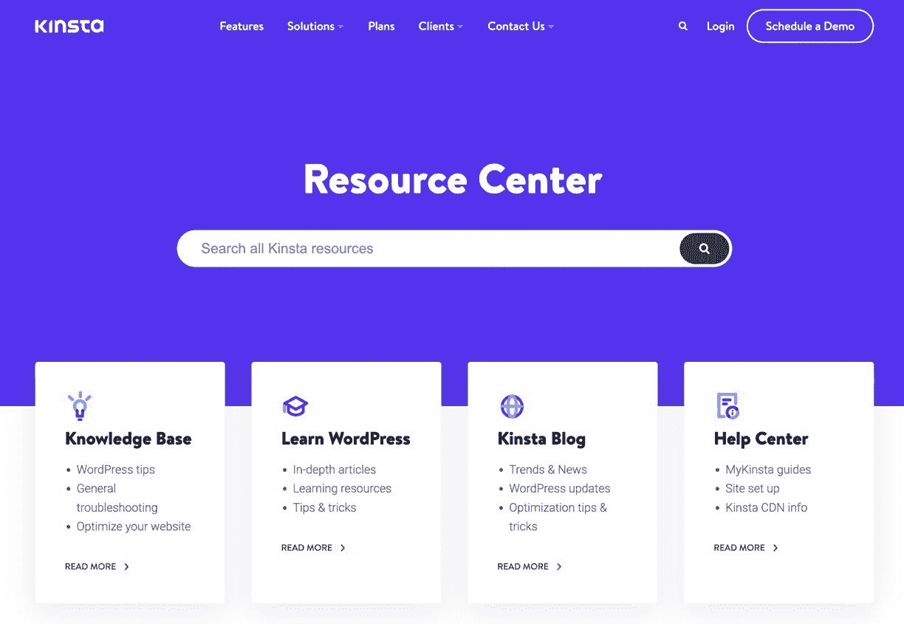

The Kinsta Hosting Resource Center

[Kinsta Resource Center](https://kinsta.com/resources/) 显示了用于托管客户导航到知识库、帮助中心和 Kinsta 博客等地方的框。

知识库是操作的真正 wiki，因为它具有分类的列，这些列带有从客户帐户问题到 SSL 开发人员文档的教程链接。

#### IEEE 802.1 工作组

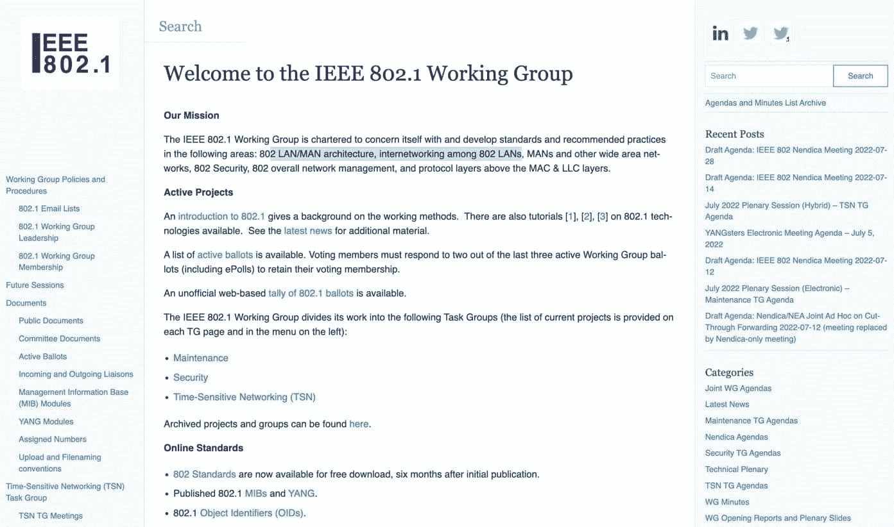

The IEEE 802.1 Working Group wiki

IEEE 802.1 工作组网站是一个健壮的 wiki，里面有关于 802 LAN/MAN 架构的维护、[安全和网络文章。](https://kinsta.com/blog/wordpress-security-plugins/)

wiki 主页有两个侧边栏用于导航，为初学者提供重要(入门)文章，一个搜索栏，以及一系列其他类别、标签和最近帖子的链接。

#### 粉丝圈

The Fandom website

Fandom 是创建关于电视节目、游戏和电影的维基的最受欢迎的平台，通过 WordPress 运行其大部分博客和维基界面。Fandom 展示了 WordPress wiki 背后的真正力量，因为它为媒体、文本、格式和文章之间的链接提供了用户生成的内容工具和强大的内容创建元素。

#### WordPress 代码

The WordPress Codex wiki

WordPress Codex 页面利用 WordPress 作为它的 wiki 是有道理的。然而，这仍然是一个很好的例子，说明科技公司如何能够将所有的法典资源汇集到一个在线领域。

例如，WordPress Codex wiki 包含了关于编写插件、使用子主题以及为 WordPress 做贡献的文章的链接，所有这些都适用于 WordPress 的新手和高级用户。

#### 宠物维基

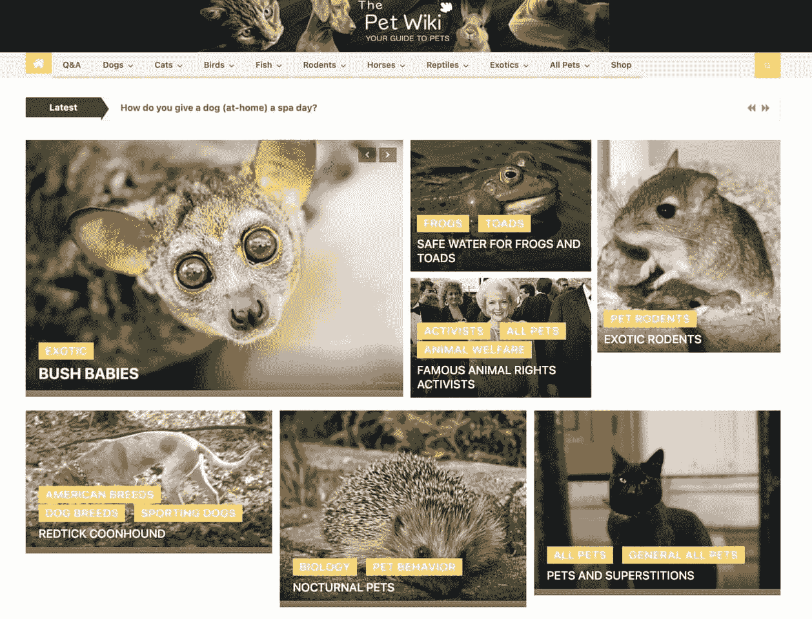

The Pet Wiki

宠物维基的功能更像一个传统的维基，而不是一个知识库。该网站为宠物爱好者提供导航菜单和链接，链接到啮齿动物、爬行动物、狗、珍禽异兽、鸟类和猫的文章。

对于许多现代维基来说，主页看起来更像一个博客，但有人可能会说，对图像和丰富设计的支持使博客和维基一开始就很相似。

#### 切线丛

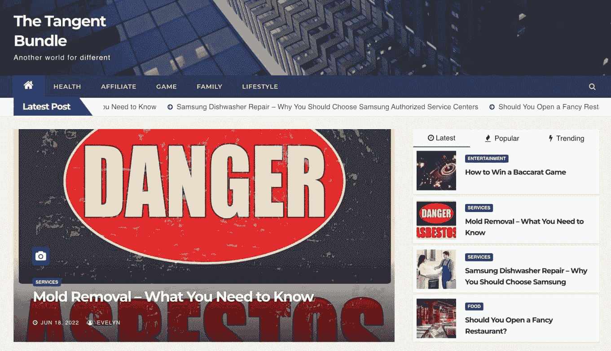

The Tangent Bundle Wiki

Tangent Bundle 使用 WordPress wiki 来支持其大量的家庭、健康、游戏和生活方式文章。从分类到侧边栏类别，一切都使这个博客成为一个非常简单的博客，其中包含了 wiki 的元素。

#### NC 状态内部知识库

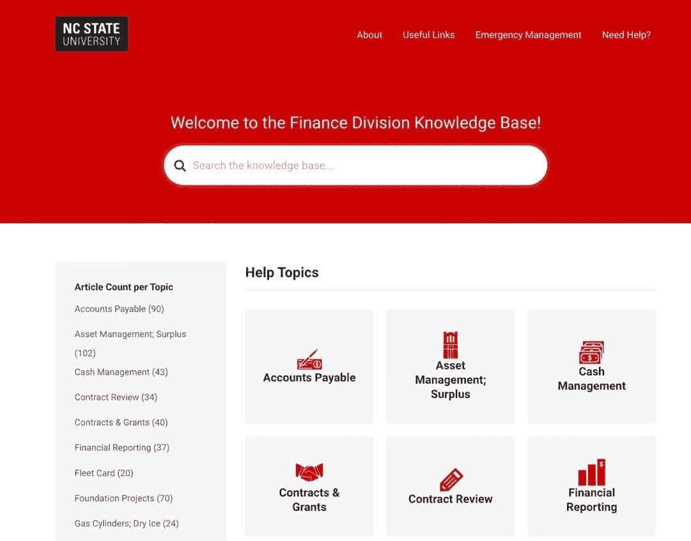

NC State Finance Division Knowledge Base

许多学校和相关组织依靠 WordPress wiki 插件来创建内部和外部知识库页面。

[例如，北卡罗来纳州立大学](https://finance-kb.ofa.ncsu.edu/)已经建立了几个知识库，供学生和教师访问重要信息，如链接到应付账款、合同和现金管理主题的财务部维基。

#### WP 简单支付文档

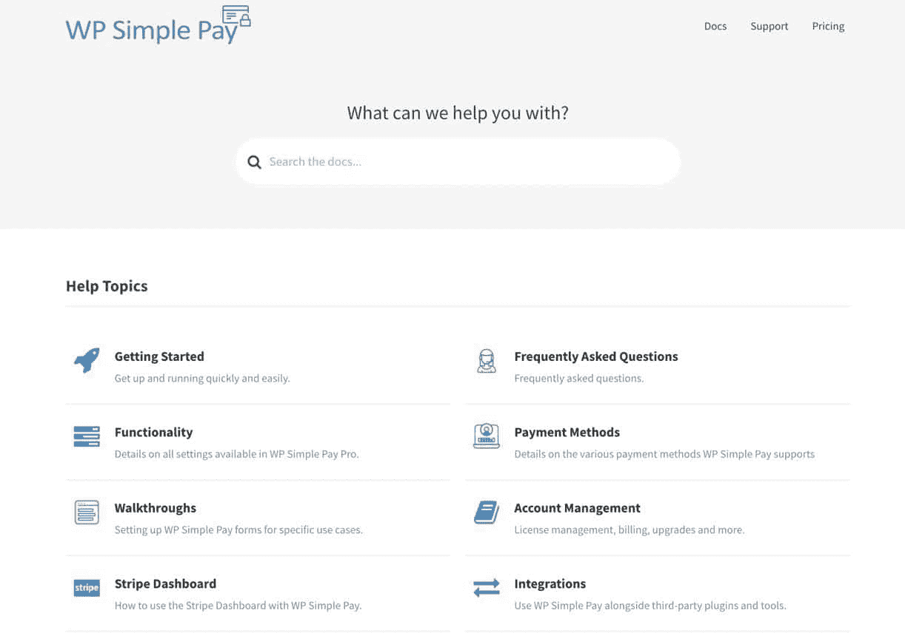

WP Simple Pay Knowledge Base

WP Simple Pay 是 WordPress 的一个条纹支付插件，就像其他软件和插件业务一样，需要告知客户如何使用该产品。那么，有什么比通过 WordPress wiki 更简单的方法呢？

WP Simple Pay wiki 有一些图标链接，这些链接指向入门指南、常见问题解答、演练和帐户管理教程。

一旦你移过主页，类别就会显示在侧边栏中，以便于访问，每篇文章都提供了无数的媒体元素、链接、互动按钮等等。

### WordPress Wiki 的主要元素

没有一个维基是相同的，但是有一些基本的元素使维基与普通网站不同。这些增加的功能赋予了维基相对于网页、本地数据库、[电子邮件系统](https://kinsta.com/blog/secure-email-providers/)和[在线存储服务](https://kinsta.com/blog/best-cloud-storage/)的优势(就像之前讨论的那些)。

当构建你的 WordPress wiki 时——无论是主题还是插件——寻找这些主要元素来确保你创建最好的 wiki:

1.  一个健壮的组织系统，有清晰的层级、菜单、标签、主题、[类别](https://kinsta.com/knowledgebase/how-to-delete-categories-in-wordpress/)和面包屑。
2.  主页面(主页)突出显示流行或重要的主题,比如初学者文章的大按钮或特定类别的标题，全部整合在第一页上。
3.  **一个搜索栏**，用于即时输入关键词并找到相关内容。
4.  **允许用户从一个内容快速跳转到另一个内容的内部链接。对于维基来说，在后台拥有快速链接工具也是必不可少的。**
5.  **标准内容创建工具**位于[后端(也可能是前端](https://kinsta.com/blog/backend-vs-frontend/))，类似于博客编辑器，具有添加文本、图像、视频、链接和标题的功能。
6.  **供用户对内容进行更正、编辑和添加的协作编辑工具。**有时这是封闭的，只对一个较小的版主小组或一个管理员开放。
7.  **登录系统或用户认证模块，**用于向公共维基添加内容、登录私人维基或访问维基上的额外功能。
8.  **互动和交流工具**供用户评论内容、做笔记和协作。(可选)

### 创建一个 WordPress Wiki 需要什么

WordPress wiki 由三部分组成:

1.  一个 WordPress 站点: [下载并在你的主机上安装免费的 WordPress CMS](https://wordpress.org/) ，或者考虑直接从你的主机上激活 WordPress，就像 Kinsta 在它的仪表板上提供的那样。
2.  **WordPress 托管:** [Kinsta 通过](https://kinsta.com/)[其闪电般的 CDN](https://kinsta.com/blog/wordpress-cdn/) ，[管理 WordPress 托管](https://kinsta.com/clients/local-digital/)，[小型和高流量维基的可负担计划](https://kinsta.com/plans/?plan=visits-business1&interval=month)使维基构建变得简单。
3.  【wikis 的主题或插件:在下面查看您的选项。

## 如何在 WordPress 上创建维基

可以使用以下选项之一启动 wiki 或知识库:

1.  一个 WordPress wiki 主题:如果你对替换一个当前主题或创建一个新网站没有问题。
2.  一个 WordPress wiki 插件:用于添加 wiki 功能而不改变你当前的网站设计。

对于本教程，我们将坚持向你展示如何用一个特定的插件创建一个 WordPress wiki。然而，在文章的后面，我们列出了 10 个 WordPress wiki 主题、10 个 WordPress wiki 插件和启动 wiki 的定制代码；所以你可以选择哪一个最适合你。

### 步骤 1:安装 BetterDocs 插件

BetterDocs 是我们建立 WordPress wiki 或知识库的首选，因为它的设计现代，功能强大，而且是一个插件，这意味着你不必替换你当前的主题。更不用说，如果你想升级，BetterDocs 有免费版本和高级功能。

然后，[安装并激活 BetterDocs 插件，开始](https://wordpress.org/plugins/betterdocs/)。

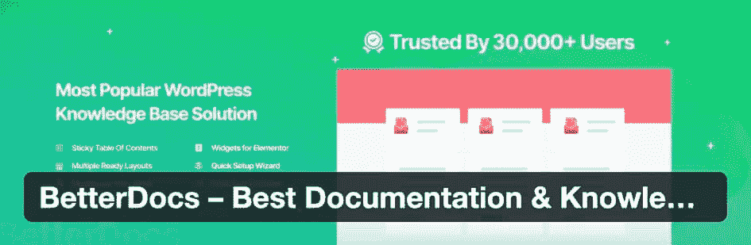

The BetterDocs plugin

### 步骤 2:启用内置文档页面

BetterDocs 提供了一个很棒的启动指南，可以让你在几分钟内设置好维基。完成这些步骤，但确保在**设置页面**选项卡处停止。

在这里，您将选中复选框**以启用内置文档页面**。

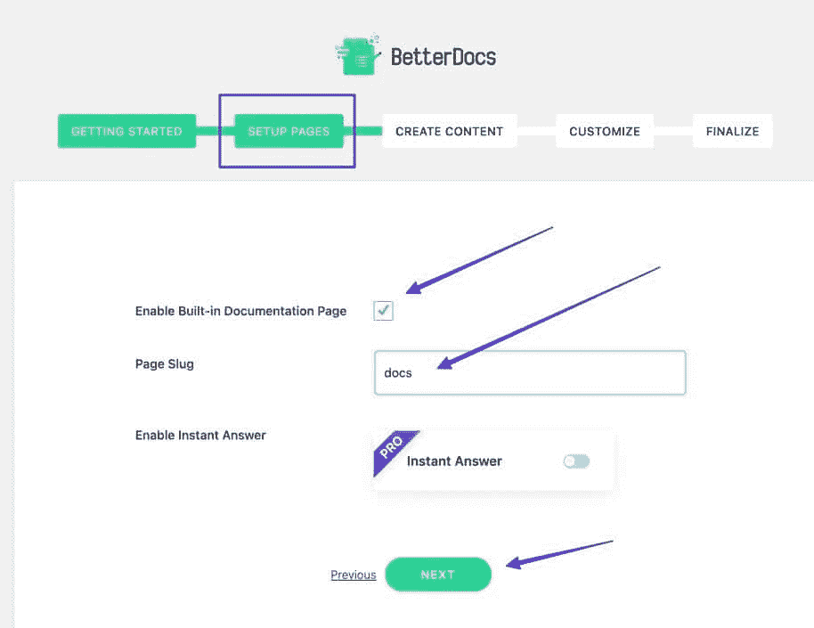

Enable the built-in documentation page

这将为您的 wiki 添加一个主页，独立于您网站的主页。

继续使用推荐的**页面插件**，或者创建自己的页面插件。

### 重要的

您应该确保您已经将永久链接(在**设置>永久链接**下)设置为**帖子名称**，以便生成内置文档页面。

点击**下一个**。

### 步骤 3:创建文档和类别

WordPress wikis 和知识库依靠它们对文档的分类组织而繁荣发展。因此，BetterDocs 建议创建一些类别和文档来开始这个过程。

首先点击**创建类别**。

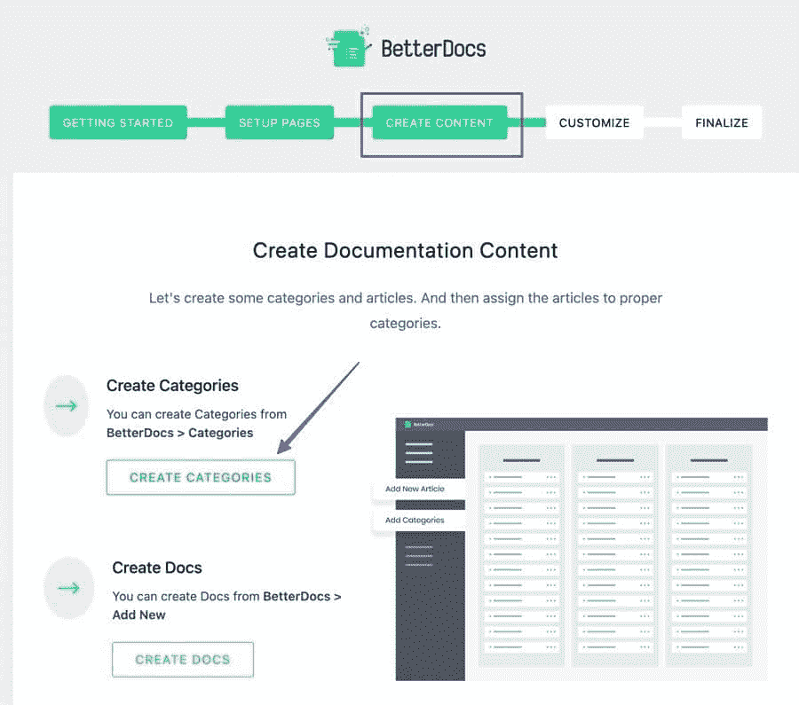

Click Create Categories

你可以根据需要分类。对于每个文档类别，请填写:

*   名字
*   [鼻涕虫](https://kinsta.com/knowledgebase/what-is-a-wordpress-slug/)(或者让鼻涕虫自动脱离名字)
*   类别图标(可选)

点击**添加新文档类别**按钮。

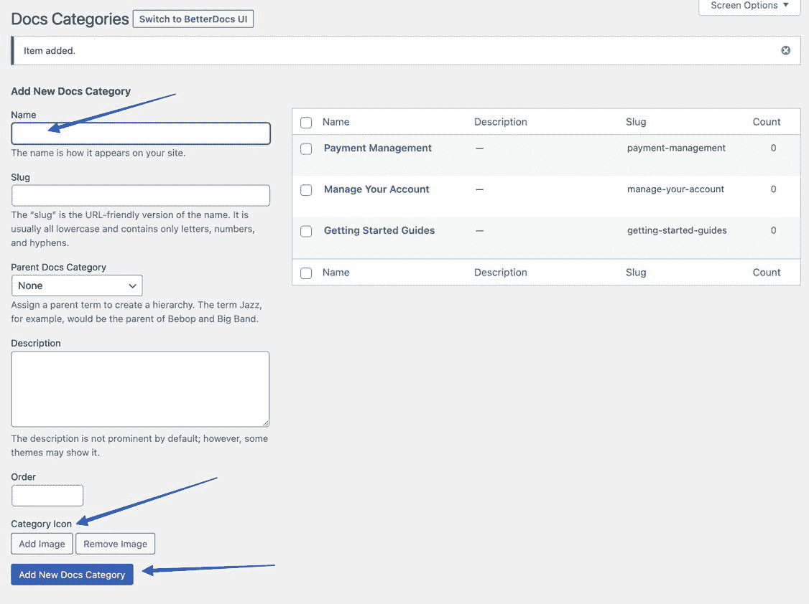

Add new doc categories

当您添加新的文档类别时，您会看到它们列在右侧。

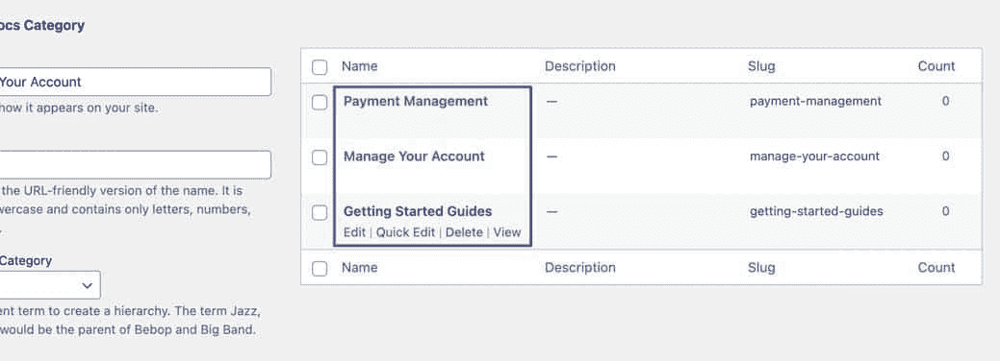

A list of document categories

继续，跳回**入门**页面，点击**创建文档**按钮。

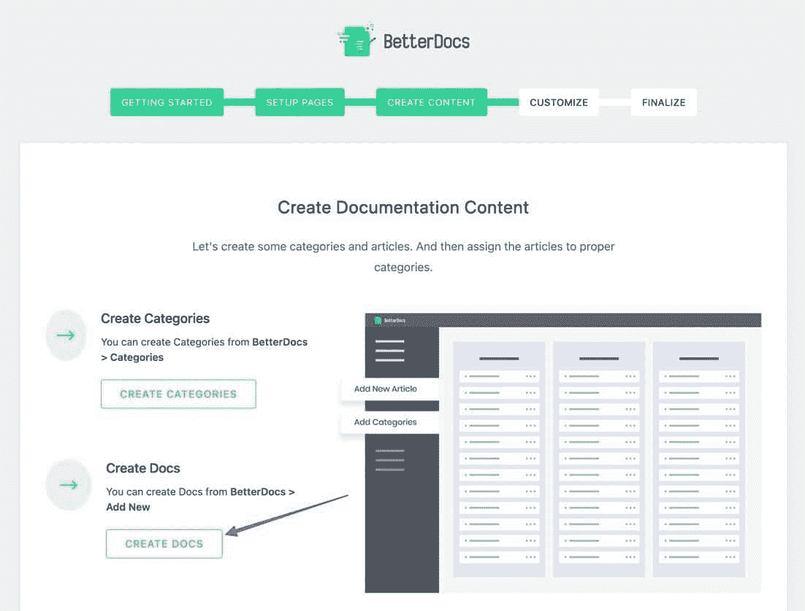

Select the Create Docs button

同样，您可以创建任意多的文档。这是一个好主意，至少在那里得到一些填充内容来设计维基。

对于每个文档，请确保将其添加到适当的类别中。**完成后发布**文档。

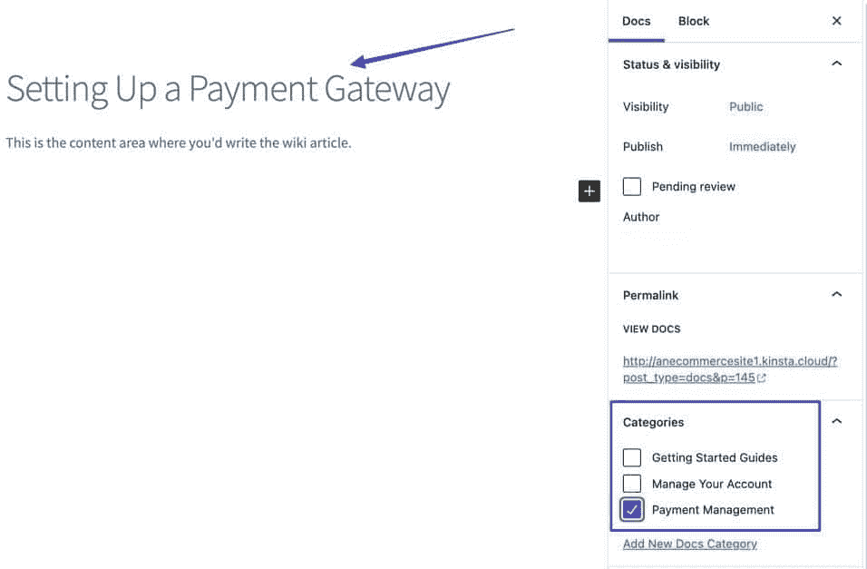

Make a document, add it to a category, then publish the document

### 步骤 4:定制 WordPress Wiki 设计

导航回**入门**指南。点击**下一个**找到**定制**部分。您可以在这里添加预制设计、自定义颜色和管理设置。

点击**转到定制器**按钮。

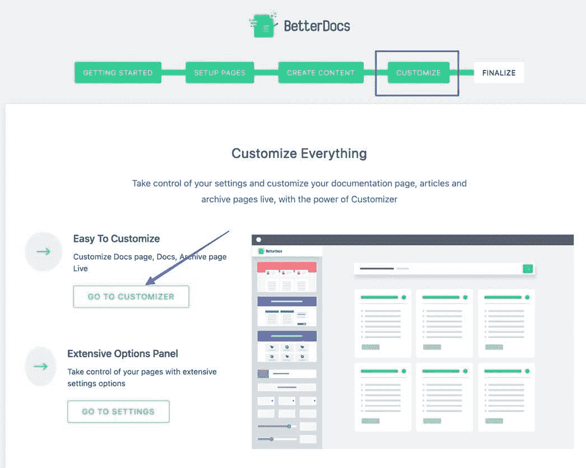

Use the Go To Customizer button

这将把你带到一个新的 **BetterDocs** 面板下的 **WordPress 定制器**。在这里，您可以选择一个预先制作的模板，更改所有设计元素，并为单个文档、侧栏、存档页面和 live search 配置样式。

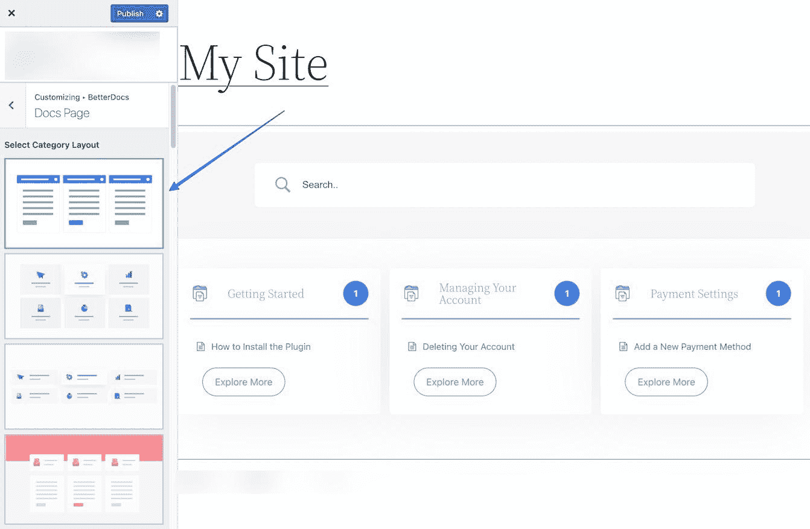

Choose a layout, and customize the design in the WordPress Customizer

### 步骤 5:完成 Wiki 并访问您的文档页面

回到**入门**指南，跳到**完成**部分。

点击**访问您的文档页面**按钮，显示您的 wiki 的 URL 和前端。

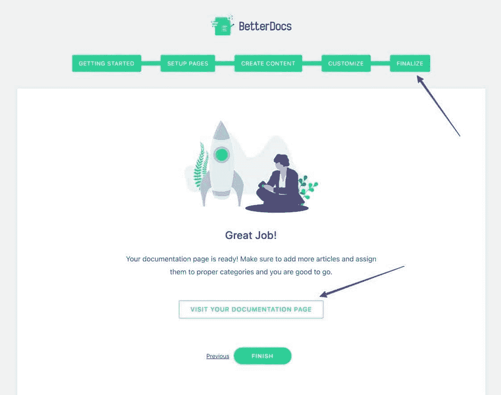

Click to Visit Your Documentation Page

欢迎你四处点击，看看它的样子。记住，文档页面不存储在 WordPress 的**页面**列表中，所以你应该保存 URL。

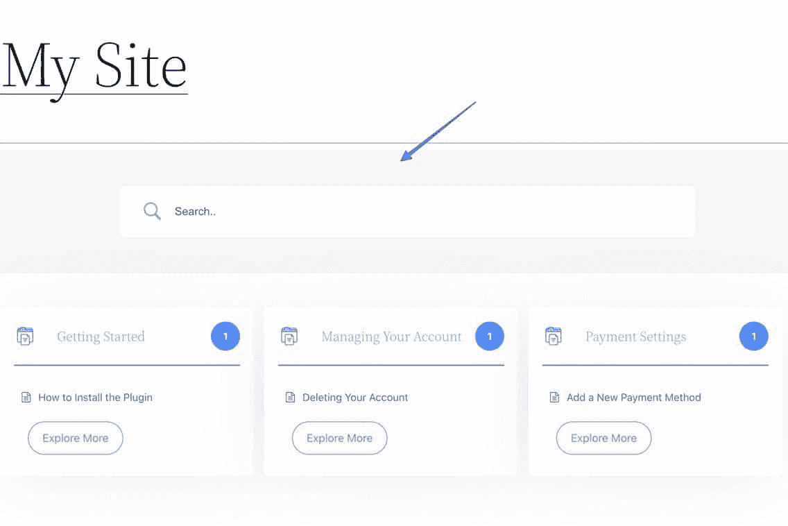

Frontend of the documentation wiki

### 步骤 6:将维基页面添加到你的菜单中

获取文档页面的 URL 并将其添加到你的[主菜单](https://kinsta.com/blog/wordpress-custom-menu/)是明智的，因为 WordPress 可能不会将其列在**页面**部分。这样，您可以随时访问它。

因此，复制您的文档页面的 URL。

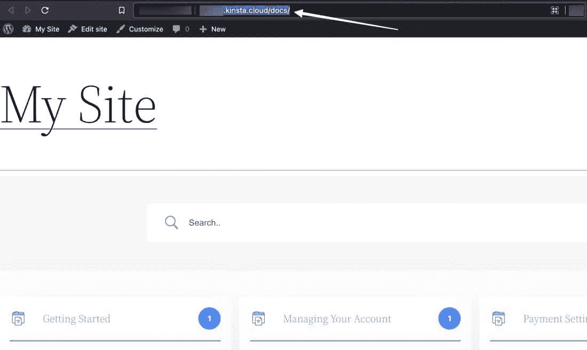

Copy the URL of the premade Docs page

使用经典的**外观>定制>菜单**方法或者使用新的可视化 WordPress 编辑器(**外观>编辑器**)将它添加到你的菜单中。

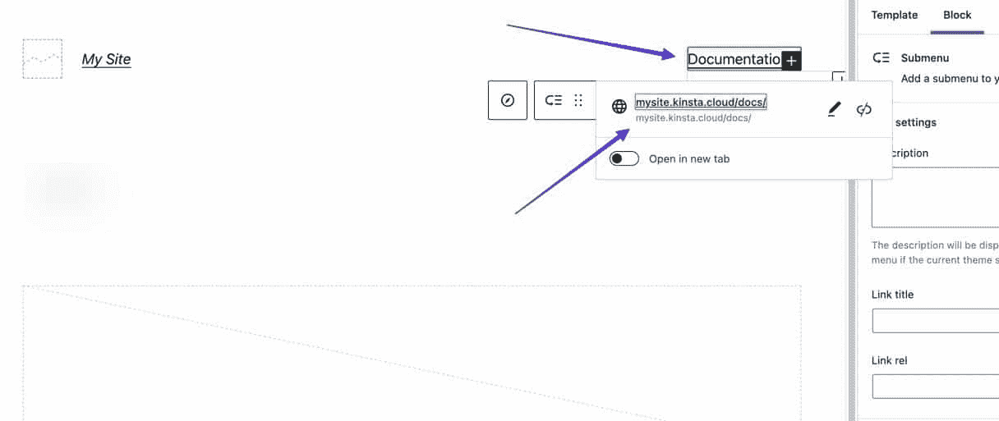

Add the URL as a menu item

### 第七步:调整你的设置

您的 wiki/文档页面现在处于活动状态。剩下的就是编辑你想要的任何设置，使它更加个性化。

为此，请前往 **BetterDocs >设置**。

该页面提供了以下选项:

*   自定义实时搜索
*   修改您的设计
*   更改单个文档的外观
*   设置文档和类别的顺序
*   添加列
*   [使用短代码](https://kinsta.com/blog/wordpress-shortcodes/)
*   启用即时回答
*   更加

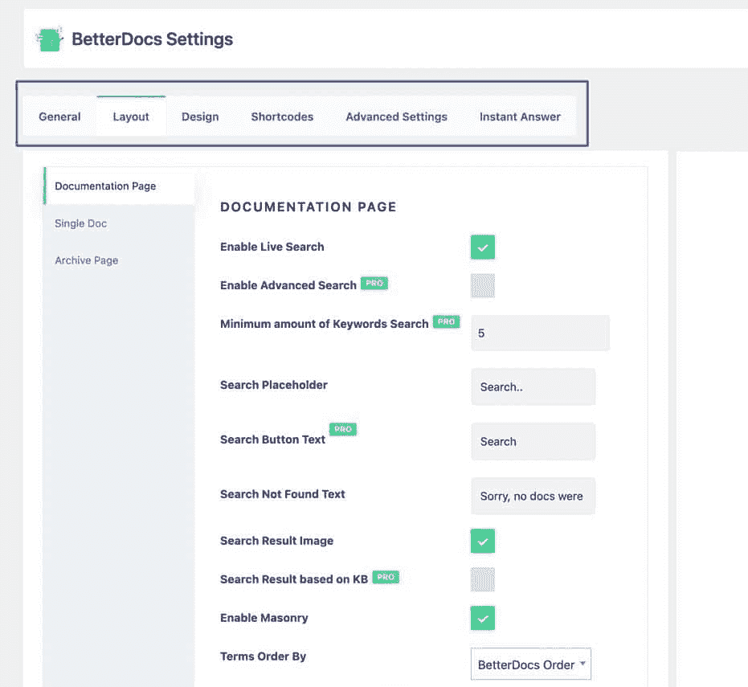

The BetterDocs settings panel

就是这样！我们鼓励你查看 WordPress wiki/知识库的所有部分，以确保它们看起来都是正确的，包括单独的文档页面和搜索栏。

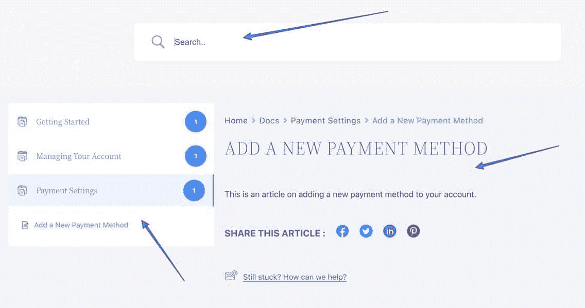

Frontend view of a WordPress wiki

## 10 个最佳 WordPress Wiki 和知识库主题

建立 WordPress wiki 的一个方法是在你的 WordPress 站点上安装一个 wiki WordPress 主题。当寻找一个维基主题时，寻找那些具有值得尊敬的评论、基本的维基功能和适合你的品牌的设计的主题。

根据我们的研究，这里有最好的 WordPress wiki 主题可供选择:

### 1.英雄主题的诀窍

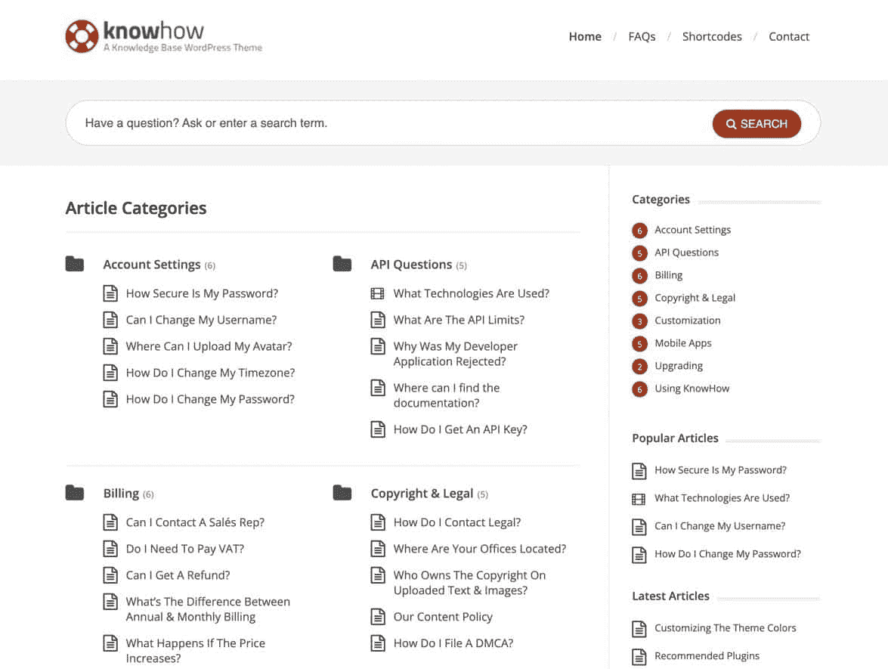

KnowHow by HeroThemes

HeroThemes 为你的 WordPress 站点添加知识库和 wiki 功能制作了几个主题和插件。 [KnowHow](https://themeforest.net/item/knowhow-a-knowledge-base-wordpress-theme/2813111) 是最受欢迎的选项之一，因为它允许您配置一组文档/文章，然后设置过滤和搜索工具以实现最简单的导航。

## 注册订阅时事通讯

### 想知道我们是怎么让流量增长超过 1000%的吗？

加入 20，000 多名获得我们每周时事通讯和内部消息的人的行列吧！

[Subscribe Now](#newsletter)

**显著特征:**

*   AJAX live search 特性，用于即时回答问题和搜索查询。
*   一个包含的 [FAQ](https://kinsta.com/blog/wordpress-faq-plugins/) 页面来补充您的知识库/wiki。
*   一个颜色选择器来匹配你的网站设计。
*   支持知识库文章中的视频和图像。
*   独特的导航元素，如多级动画按钮。
*   Shortcodes 可以添加从手风琴到按钮和灵活的列到开关的所有东西。

### 2\. Flatbase

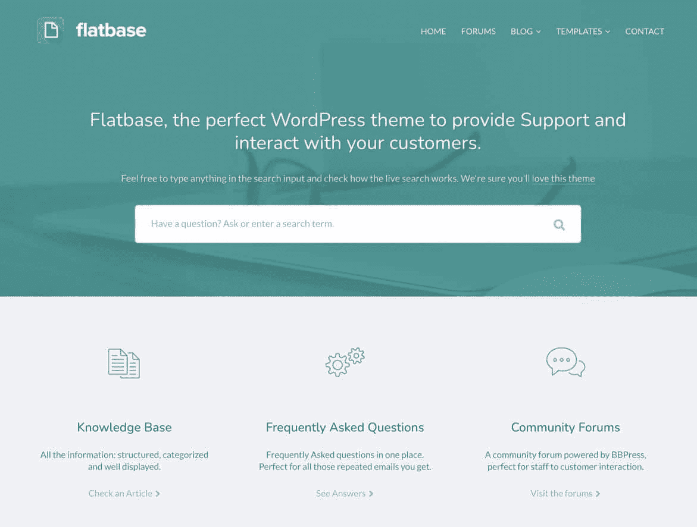

The Flatbase Wiki Theme

[Flatbase](https://themeforest.net/item/flatbase-a-responsive-knowledge-basewiki-theme/7264664?) 是一个[高级 WordPress 主题](https://kinsta.com/blog/fastest-wordpress-theme/)来创建一个知识库或维基。使用 Flatbase 的一个主要好处是，它附带了一些变体设计来实现一个极简、现代或基于软件的知识库。

不管怎样，所有格式都有添加主页和搜索栏的功能。之后，您可以使用模板来构建图库、FAQ 和知识库页面。

**显著特征:**

*   演示内容的独特设计集合，包括现代、经典、移动应用程序、帮助台和启动 wikis。
*   支持侧边栏、富媒体内容等多种文章布局。
*   一个 AJAX 搜索栏，用户可以快速获得问题的答案。
*   与 bb 的集成按在你的网站上添加一个论坛。
*   文章反馈工具，让用户可以喜欢内容。也可以根据最喜欢的内容来组织内容。
*   FAQ 模板，以手风琴或列表的样式。
*   全面的排版和翻译控制，实现终极定制。

### 3.知识

The Lore theme

Lore WordPress 主题以低成本提供了一个优雅的知识库设计。网站所有者可以创建知识库、wiki 或 FAQ 页面，同时将它们链接到您的博客和论坛。整体设计简洁、轻便，带有图标支持，可以很好地呈现内容。

**显著特征:**

*   一个配色方案工具，可快速创建与您的品牌相匹配的完美色调。
*   博客、FAQ 和知识库的组合，允许你从一个网站运行所有这些。
*   与 bbPress 集成的论坛功能。
*   用于加载 wiki 元素(如链接、文章和媒体)的演示内容，为您的设计提供了一个良好的开端。
*   评论和投票，根据文章的受欢迎程度在维基中上下移动。
*   带有过滤器和下拉菜单的边栏。
*   面包屑和下一篇文章/上一篇文章链接，加快维基导航。

### 4.MyWiki

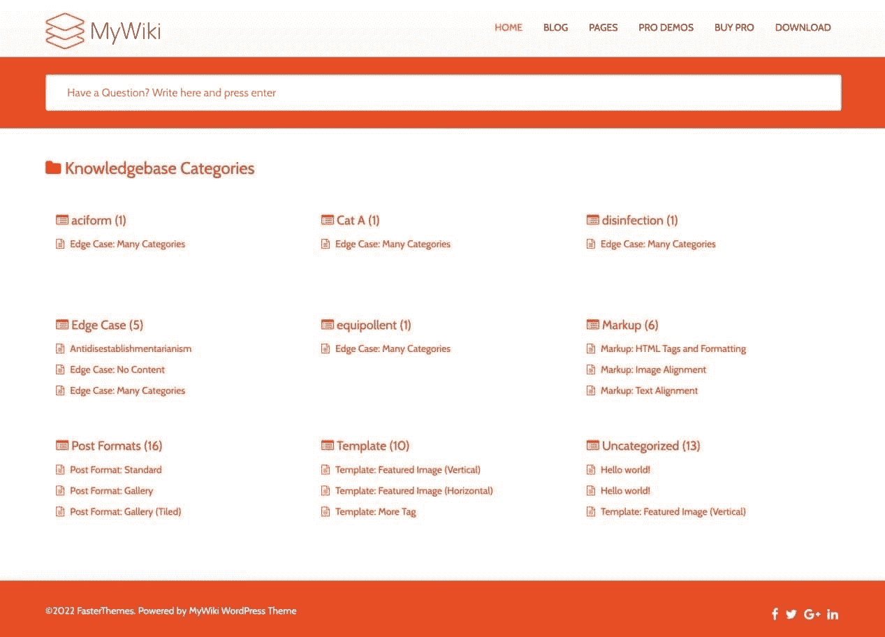

The MyWiki theme

MyWiki 主题使用户能够建立一个具有极简设计特征的 Wiki 或知识库。它非常干净，在你的 WordPress 站点上设置起来非常容易。

还有一个快速搜索区，为用户提供建议并使用 AJAX。完全响应主题包括导入演示的选项，还可以根据您的[品牌](https://kinsta.com/blog/positioning-strategy/)切换颜色。

**显著特征:**

*   一个简单，直观的主页，用户可以看到所有类别和流行的子类别。
*   一个 AJAX 搜索栏，用于输入问题并显示结果。
*   添加边栏的博客部分和页面。
*   简单的页脚控制与社会媒体链接。
*   支持广泛的文章元素，如标题、块引用、表格、列表和代码片段。

### 5.灵感主题知识库

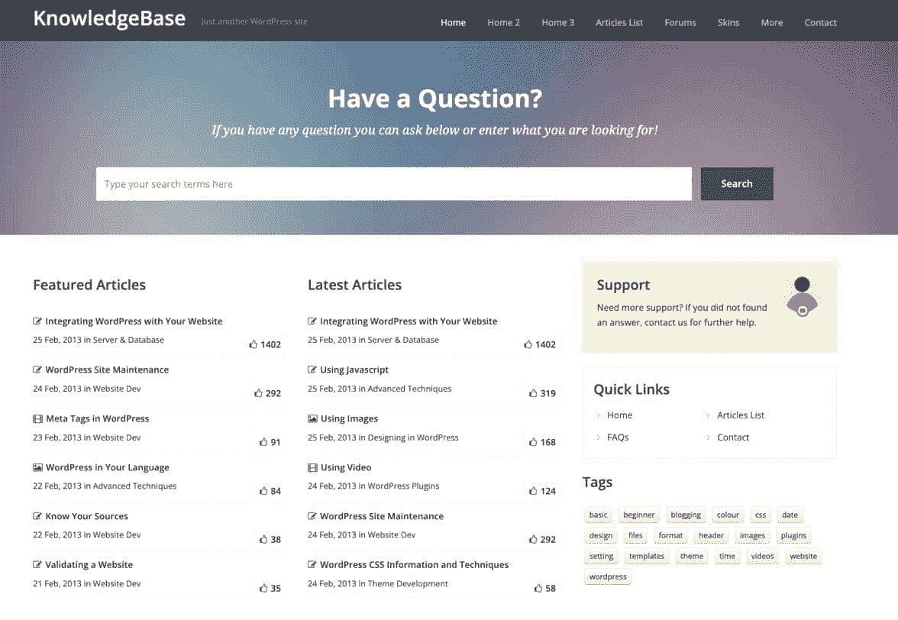

The Knowledge Base theme

这是一个集时尚和功能于一体的主题。现代设计有四个皮肤和广泛的主题选项。我们最喜欢用它来建立一个技术知识库，但是改变设计可能对任何行业都有用。

**显著特征:**

*   一个大的搜索栏，有 AJAX 控制的结果。
*   将某些文章发送到列表顶部的 Like 计数器。
*   四种颜色的皮肤来改善你的品牌。
*   六个自定义小部件，用于添加最新文章、特色文章、支持文档和快速链接等内容。
*   创建 FAQ 页面的全幅页面模板和选项。
*   三个主页模板选项切换设计与短码。
*   与 bbPress 的集成。
*   [实时聊天](https://kinsta.com/blog/wordpress-live-chat-plugin/)与 WP 实时聊天插件集成时的功能。

### 6.帮助大师

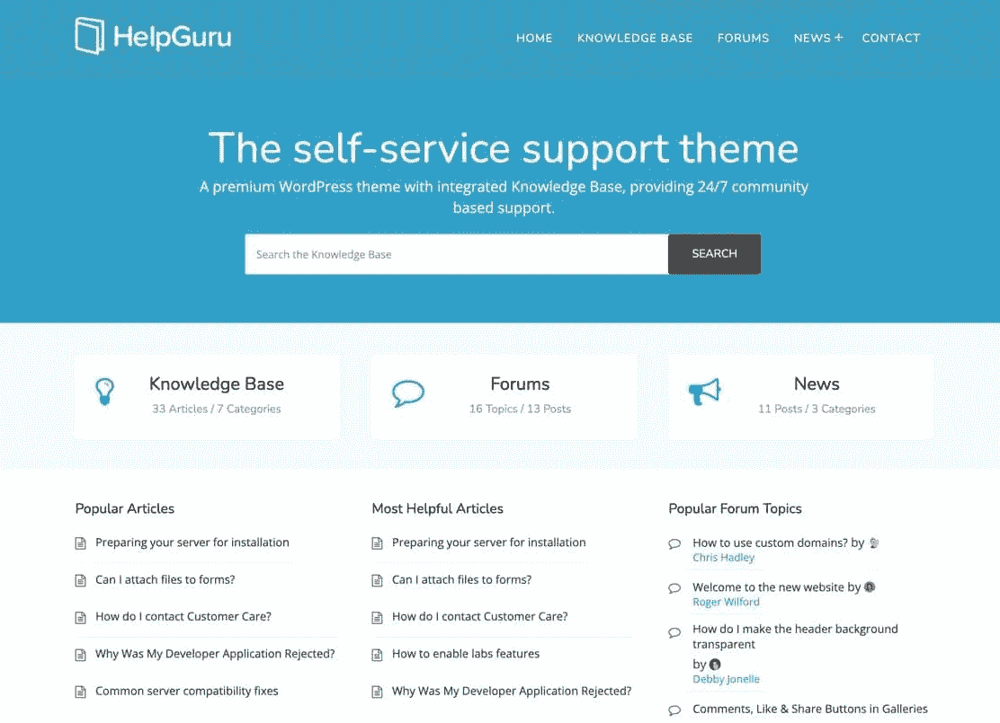

The HelpGuru WordPress theme

HelpGuru 是 HeroThemes 的一个高级自助知识库主题，它非常适合为所有客户支持资源创建一个集中的空间，包括按钮、知识库、论坛和博客。

它还具有一个完整的导航菜单，以及一个搜索栏、热门文章列表和一个页脚区，以显示有关您的品牌、最新新闻和社交媒体按钮的信息。

**显著特征:**

*   一个实时的 AJAX 搜索字段，在几秒钟内将结果发送给用户。
*   所有文章的反馈工具，允许您收集关于知识库文章的信息，并查看哪些部分需要改进。
*   内容的拖放排序。
*   向文章添加可下载附件的选项。
*   三个小部件可以突出显示作者、知识库文章和站点上的类别。
*   快速定制设置，无需修改代码即可调整颜色和徽标等元素。
*   翻译和多语言支持。

### 7.维基百科

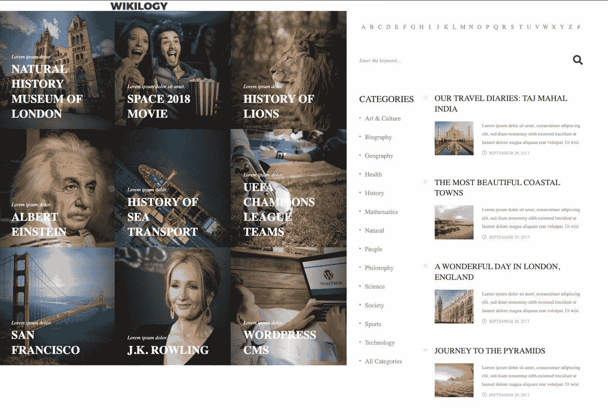

The Wikilogy theme

Wikilogy 主题使用户能够创建一个 wiki 来存储视觉和书面信息，类似于从在线百科全书中获得的内容。这个主题有多种布局，非常适合创建任何主题的 wiki 站点，从电影到技术。

用户会看到一个视觉聚焦的界面，在你的搜索栏后面有文章和背景媒体的大图片。

**显著特征:**

*   8 种用于快速启动维基或百科网站的预制布局。
*   具有无限字段的内容表，支持图像、地图、文本等。
*   用于调整和添加字体、社交分享按钮和评论等元素的特殊工具栏。
*   一个内容索引，用于准确概述您的 wiki 中的可用内容。它就像一个带有链接的目录来指导用户。
*   类别组织工具，具有无限的父类别和子类别。
*   与 WPBakery 页面生成器集成，在设计 wiki 时提供拖放功能。
*   字母内容排序。
*   用户和作者列表。
*   用于维护维基背后的社区的会员系统。

### 8.UnboundStudio 知识出版社

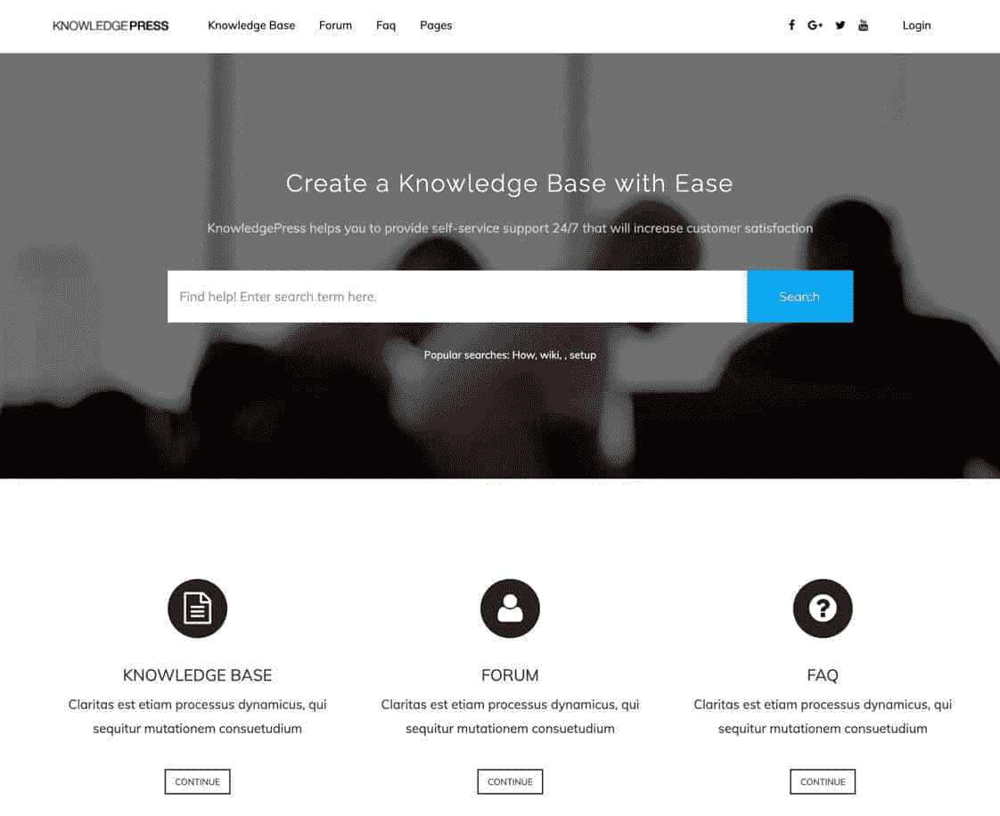

The Knowledgepress theme

Knowledgepress 主题在 ThemeForest 上以一次性费用出售，它允许您创建一个知识库页面，链接到教程、常见问题解答、论坛等。

Struggling with downtime and WordPress problems? Kinsta is the hosting solution designed to save you time! [Check out our features](https://kinsta.com/features/)

知识库的每个部分都可以通过搜索栏访问，您可以获得过滤器和导航菜单，用于添加所有页面的链接、社交媒体按钮和登录模块。

该设计相当通用，因此您可以自定义它以满足您的品牌需求，包括更改颜色、添加徽标和调整页脚的选项。

**显著特征:**

*   一个可视化编辑器，用于在构建知识库网站时拖放元素。
*   改进内容管理的类别和文章重新排序。
*   一个带有手风琴动作的 [FAQ 插件](https://kinsta.com/blog/wordpress-faq-plugins/)来整合问题和答案。
*   一个 live search 栏，具有许多功能，如占位符、导航、live search 小部件和搜索分析。
*   公众或会员专用投票，以及重置投票计数的选项。
*   面包屑便于导航。
*   多种自定义设置，用于添加徽标、图标、边框和[自定义 CSS](https://kinsta.com/blog/wordpress-css/) 。
*   基于视图、投票或评论的实时搜索、最近文章和流行内容列表的小部件。
*   投票、相关帖子、社交分享、目录等页面模板。

### 9.IKnow

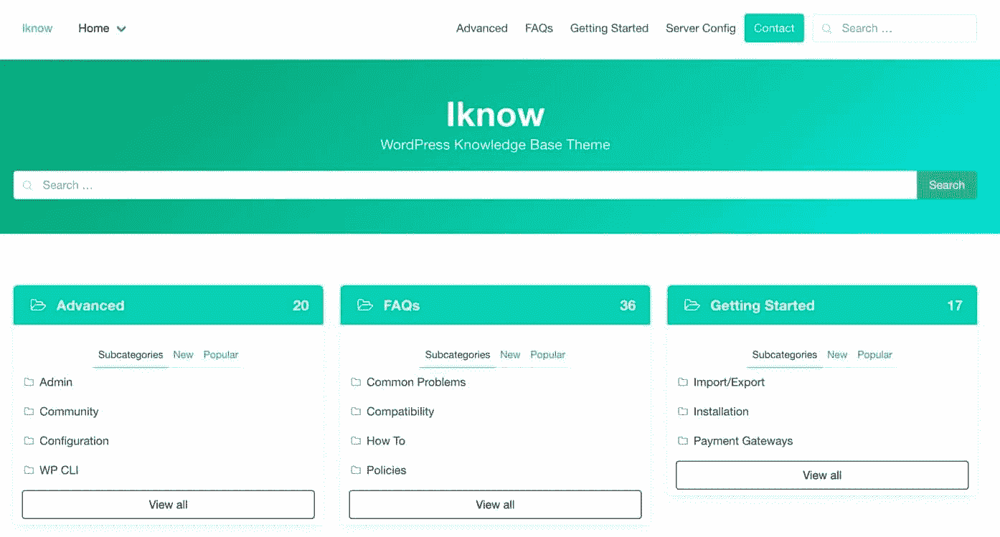

The IKnow WordPress theme

IKnow 是一个免费的主题，采用极简设计，为所有类型的企业创建知识库。你得到了一个标准的网站菜单，一个添加标识的区域，一个标题部分[包含了给客户的信息](https://kinsta.com/blog/wordpress-messaging-plugin/)，还有一个搜索栏。

此外，主题提供了有组织的分类，包括文章链接和每个部分有多少文章的计数。

**显著特征:**

*   创建 wiki、FAQ、帮助台或知识库的设置。
*   用于添加到每个类别模块的自定义图标。
*   用于组织文章集合的标签和类别。
*   一个用户投票赞成或反对的帖子评级系统。
*   面包屑和顶部栏菜单，用于快速导航。
*   一个定制的小部件，用于在站点的任何地方显示一个类别的当前导航。

### 10.我的知识库

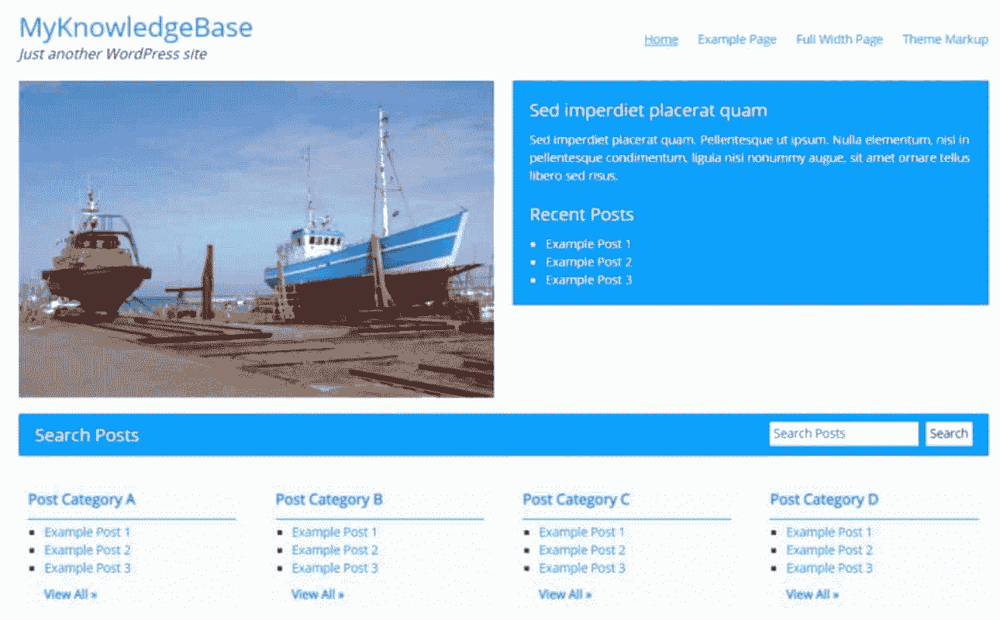

The MyKnowledgebase theme

你可以免费下载 [MyKnowledgebase 主题](https://wordpress.org/themes/myknowledgebase/)并安装它来制作一个 WordPress wiki、知识库或图书馆网站。

这是一个轻量级的解决方案，具有快速颜色定制和自定义帖子/页面模板。我们特别喜欢 FAQ 页面模板，尤其是在一个站点上同时拥有 FAQ 和知识库。

**显著特征:**

*   一个完整的导航菜单，用于链接到您网站上的多个页面。
*   主页上有组织的类别。
*   颜色自定义。
*   一个快速、非侵入式的搜索栏。
*   每个类别中所有文章的列表。
*   一个欢迎模块，带有解释网站和呈现最近帖子列表的小部件。
*   上传欢迎横幅的图像支持。
*   自定义背景和标题。
*   页脚部件和多个栏目，为整个网站提供更多的导航和粘性内容。

## 10 个最佳 WordPress Wiki 和知识库插件

选择一个主题来运行你的 WordPress wiki 或者知识库意味着你必须创建一个全新的 WordPress 网站或者替换掉当前的主题。

如果你正在建立一个全新的网站，这没问题，但是在某些情况下，你没有理由，也没有欲望，去摆脱你当前的主题。

在这种情况下，你最好的选择是安装一个 WordPress wiki 插件，它会保持当前的主题设计，但是会给你的站点增加 wiki 和知识库功能。

存在大量的 WordPress wiki 插件，但是这里有一些最好的:

### 1.BetterDocs

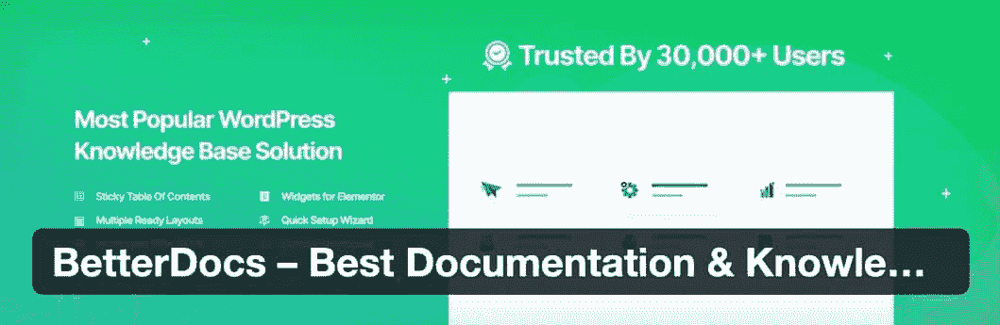

The BetterDocs plugin

BetterDocs 插件是最好的 WordPress wiki 插件之一，原因有很多。首先，这个插件有一个快速的设置过程和丰富的文档，以防你有问题。

开发者很活跃，你可以在论坛中找到问题的答案。此外，该插件会立即激活您网站上的知识库区域，您可以从几个演示设计中进行选择，以匹配您的品牌。

**显著特征:**

*   预先制作的模板设计，用于生成一个登录页面，引导用户访问所有文档。只需一次点击，即可设置归档和单页文档。
*   目录选项。
*   Shortcodes 和页面生成器，消除了使用代码的需要。
*   即时结果的实时搜索功能。
*   文档的网格视图和高级列表视图。
*   从一个插件管理多个知识库的工具。
*   角色控制，用于授予对文档和编辑的特定访问权限。
*   综合分析，了解如何使用维基/知识库。
*   用于分类表格、分类框和搜索表单的各种 WordPress 块。

### 2.HeroThemes 的 WordPress 知识库

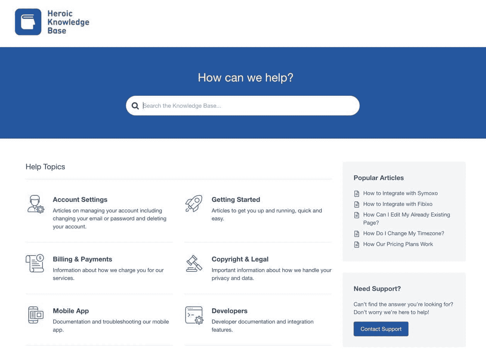

WordPress Knowledge Base plugin

HeroThemes 的 WordPress 知识库插件是一个简单的包，包括一个现有网站上的 WordPress wiki 或知识库。该插件提供了漂亮的设计和现代化的界面，包括搜索栏、主题组织和侧边栏导航。

其结果是一个智能知识库，接受用户反馈，提供分析，并汇集了无数的导航元素进行直观浏览。

**显著特征:**

*   不需要编码的美丽的文章创作。
*   对每一部分内容的定制，以及用图标和快速链接将它们组织成类别的能力。
*   搜索栏，包含与键入的关键字相关的即时答案。
*   关于知识库的总搜索、失败搜索和搜索有效性的信息分析。
*   用户的反馈按钮告诉你一篇文章是否有帮助。
*   一个聊天框帮助助手，在角落里弹出，根据网站的区域推荐某些文章。
*   各种用例的演示，如产品帮助、技术文档、在线用户指南和内部知识库。
*   文章附件和内置目录。

### 3.无边界知识库

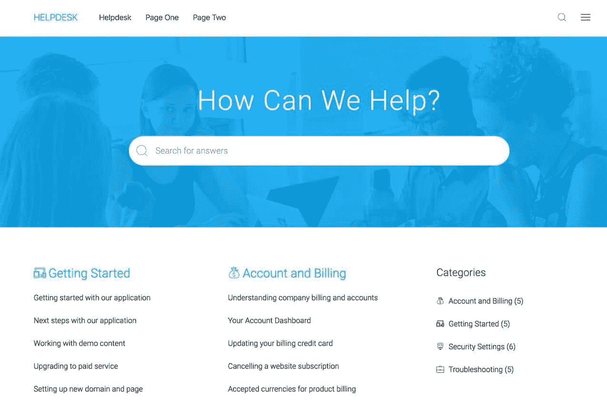

The Knowledge Base plugin from UnboundStudio

UnboundStudio 的知识库插件提供了三个演示，可以选择盒装和列表布局，以及多列或单列设计。

您还可以选择不同的颜色来创建一个时尚、现代的知识库，并对库中的所有文章进行分类和链接。

**显著特征:**

*   一个拖放工具来重新排序文章和类别。
*   定制的 slugs 和[面包屑](https://kinsta.com/blog/wordpress-breadcrumbs/)用于改进导航。
*   文章文件附件。
*   WordPress 块编辑器的几个块。
*   带有占位符、隐藏按钮、放置工具和完全禁用实时搜索选项的实时搜索。
*   知识库主页面，包含页面内容、栏、边栏和图标的设置。
*   一个投票系统，用于公众或成员对文章的投票，以及设置投票图标和重置或禁用投票的能力。
*   在 WordPress wiki 的任何地方显示类别和文章列表的小部件。
*   文章列表简称。

### 4.或维基百科

The Yada Wiki plugin

Yada Wiki 是一个免费插件，带有 WordPress wiki 帖子类型和设置，可以为 Wiki 添加特殊标签和类别。大部分插件与标准的 WordPress 编辑器一起工作，对所有 WordPress 用户来说很直观，尤其是那些喜欢使用短代码的用户。

**显著特征:**

*   一个 wiki 页面创建者和工具，将所有这些页面链接到一个 wiki 中。
*   将维基按钮放在你网站任何地方的两个简码。
*   将 wiki 元素添加到站点的任何页面或帖子的按钮。
*   带有样式元素的目录生成器。
*   维基分类简码。
*   一个索引输出工具，用于呈现表格状的文章网格。
*   目录和所有文章列表(或一个类别下的文章)的侧边栏小部件。

### 5.Echo 插件知识库

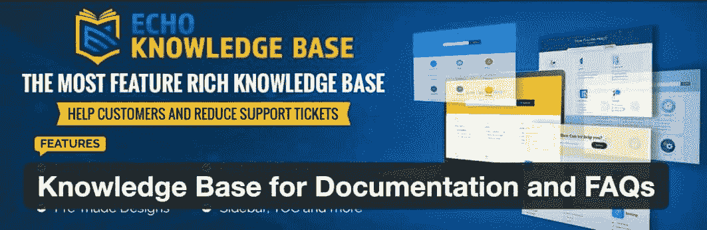

The Knowledge Base plugin from Echo Plugins

知识库插件来自 Echo Plugins，它提供了一些演示布局，让你在几秒钟内就能开始创建一个 WordPress wiki 或知识库。

您还可以将样式与您当前的主题相匹配，这一切都不需要动一行代码。有一个高级版本，但基本功能，如搜索栏和分层文档，都是免费的。

**显著特征:**

*   快速建立维基的演示模板和简码。
*   自动生成的目录。
*   导航元素，如后退按钮、面包屑、评论和标签。
*   列出文章的几个订购工具。
*   文档的分层组织结构，有五个级别。
*   按服务、产品或团队组织文档。
*   26 个专业设计的模板和设置，用于布局、颜色和标签。
*   与市场上一些最流行的页面生成器集成，如 [Elementor](https://kinsta.com/blog/elementor-import-template/) 和 Beaver Builder。
*   各种高级附加功能，如权限、私人文章、侧栏和文章导入。

### 6.BasePress

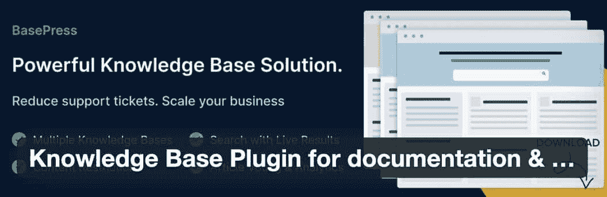

The BasePress plugin

codeSavory 的 BasePress 是一个有用的插件[，用于开发](https://kinsta.com/blog/app-developer-salary/)像维基和知识库这样的文档网站。对于任何网站上的客户支持中心来说，这都是一个理想的解决方案，因为你可以设置品牌，组织你的内容，并利用模板，所有这些都不需要接触一行代码。

**显著特征:**

*   从一个控制面板进行无限制的知识库管理。
*   文章组织按部门，服务，产品，或任何你想要的组。
*   用户在搜索栏中输入内容后的目标答案。
*   保持类似的外观，你已经有你的网站。
*   一个预先制作的入口/登录页面，带有一个搜索栏和最受欢迎的文章，帮助用户入门。
*   无限的层次结构、部分、描述和图标。
*   短代码支持。
*   部分和知识库的小部件。
*   拖放重新排序。

### 7.weDocs

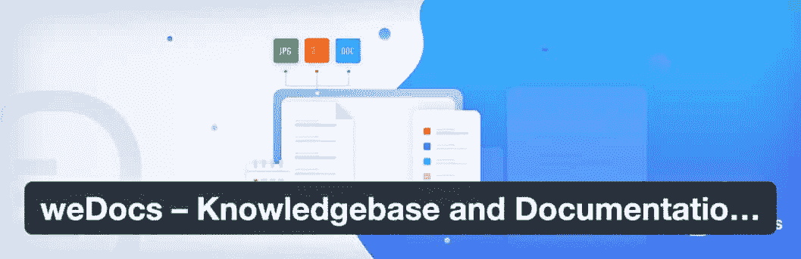

The weDocs plugin

weDocs 插件提供了一个免费的 WordPress wiki 生成器，用于漂亮地组织所有知识库文档。所有的文档都存放在 WordPress 上，你可以创建无限数量的文章，并对每篇文章进行分类和排序。

weDocs 插件在一个单独的页面上显示你的 wiki，并与网站当前的设计完美结合。

**显著特征:**

*   使用标准的 WordPress 编辑器，在 WordPress 仪表盘上快速创建文档。
*   拖放重新排序，以及删除、预览和创建文章的按钮。
*   在后端和前端界面上使用类别的直观组织。
*   标签系统。
*   添加到任何侧边栏、页脚或自定义小部件区域的文档搜索小部件。
*   过滤工具，仅搜索知识库的特定部分。
*   也获取外部文档。

### 8.MinervaKB

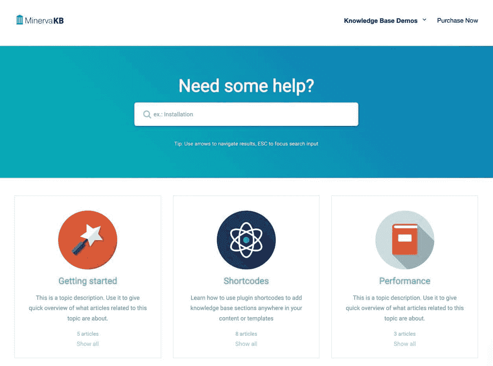

The MinervaKB plugin

MinervaKB 是一个高级插件，提供了大量选项，可以在现有网站上提供支持票和实时搜索功能。

WordPress wiki/知识库插件提供了一个短代码生成器和文章反馈设置。你也可以限制内容或向公众开放。

**显著特征:**

*   实时搜索，几秒钟内就能回答用户的问题。
*   多种皮肤来匹配你的网站和[设计独特的东西](https://kinsta.com/blog/web-design-principles/)。
*   文章标记和分类出现在搜索结果中，以便更好地理解每篇文章。
*   超过 500 种智能设置，从评级系统如何工作到出现什么搜索结果。
*   与 WPBakery、 [Elementor](https://kinsta.com/blog/wordpress-elementor/) 和 Google Analytics 等流行插件的集成。
*   访问限制，显示内容的预告或完全阻止它。
*   内置的常见问题部分。
*   快速生成的目录。
*   所有文章的喜欢和不喜欢按钮，以及关闭按钮的功能。
*   多站点支持同时运行几个 WordPress wikis。

### 9.WP 词汇表

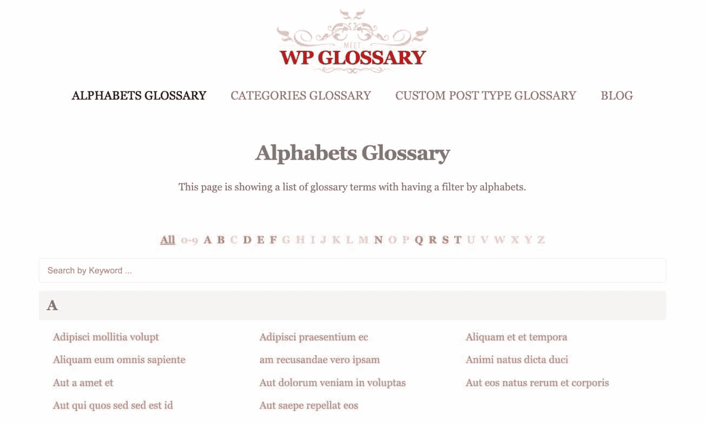

The WP Glossary plugin

WP 词汇表插件是一个额外的选项，为 WordPress wikis 提供了一个独特的视角。本质上，您可以创建一个词汇表或字典来汇编您的文档列表，使其与 wiki 非常相似，但格式略有不同。

维基在主页上展示文章，一个字母菜单位于顶部。还有一个搜索栏，就像你在传统的 WordPress wiki 上看到的一样。

**显著特征:**

*   增强的搜索功能，插件自动将高亮显示的短语链接回相关内容。
*   支持无限的文章和词汇表术语。
*   在用户输入时显示结果的即时搜索。
*   先进的短代码选项，以显示维基文章的任何地方。您可以配置短代码中的设置来调整标题、布局和分类。
*   用于编辑从按钮到文章颜色和标题的所有内容的自定义样式。
*   [自定义 CSS 支持](https://kinsta.com/blog/css-best-practices/)。

### 10.非常简单的知识库

The Very Simple Knowledge Base plugin

被认为是创建 WordPress wiki 或知识库的轻量级插件之一，[这个非常简单的知识库插件](https://wordpress.org/plugins/very-simple-knowledge-base/)具有显示文章和类别的快速简码。

它带有一个基本的设计，无论你想与任何当前的品牌融合。你可以根据类别组织文章，并在维基主页上展示这些类别列表。

**显著特征:**

*   列、类别和排序的设置。
*   具有许多设置的短代码，例如只显示某些类别、标签或文章的选项。
*   具有每页文章和隐藏文章属性的小部件。
*   文章标签和自定义文章类型。

[Anyone can make a WordPress wiki to organize content better and offer collaboration options for users... and this guide is here to help 🚀Click to Tweet](https://twitter.com/intent/tweet?url=https%3A%2F%2Fbit.ly%2F3JKYNIn&via=kinsta&text=Anyone+can+make+a+WordPress+wiki+to+organize+content+better+and+offer+collaboration+options+for+users...+and+this+guide+is+here+to+help+%F0%9F%9A%80&hashtags=WordPress%2CBranding) ## 摘要

在本文中，您了解了 WordPress wikis 是如何为存储大量信息服务的，同时也让用户以一种有组织的方式访问这些信息。同样重要的是要记住，知识库只是不同类型的维基，通常用于为需要了解产品或服务的用户组织内容，类似于在线用户手册。

我们还探索了在你的网站上添加 WordPress wiki 的好处，比如它们是如何的便宜、易于维护，以及与在线存储服务、电子邮件链、[论坛](https://kinsta.com/blog/wordpress-forum-plugins/)，甚至[博客](https://kinsta.com/blog/blog-name-ideas/)相比，它们是一个更干净的组织内容的选择。

总的来说，我们建议你利用这些好处，认真考虑一下维基是否能提高你的在线形象。在做研究时，记住构成维基的主要元素也是明智的。

关于如何成功地将 WordPress wiki 或知识库添加到您现有的站点，您有任何问题吗？从头开始做一个怎么样？如果是这样，请在下面的部分留下评论。

* * *

让你所有的[应用程序](https://kinsta.com/application-hosting/)、[数据库](https://kinsta.com/database-hosting/)和 [WordPress 网站](https://kinsta.com/wordpress-hosting/)在线并在一个屋檐下。我们功能丰富的高性能云平台包括:

*   在 MyKinsta 仪表盘中轻松设置和管理
*   24/7 专家支持
*   最好的谷歌云平台硬件和网络，由 Kubernetes 提供最大的可扩展性
*   面向速度和安全性的企业级 Cloudflare 集成
*   全球受众覆盖全球多达 35 个数据中心和 275 多个 pop

在第一个月使用托管的[应用程序或托管](https://kinsta.com/application-hosting/)的[数据库，您可以享受 20 美元的优惠，亲自测试一下。探索我们的](https://kinsta.com/database-hosting/)[计划](https://kinsta.com/plans/)或[与销售人员交谈](https://kinsta.com/contact-us/)以找到最适合您的方式。