# 如何为开发者创建有效的 WordPress 工作流

> 原文：<https://kinsta.com/blog/wordpress-workflow/>

WordPress 是一个伟大的平台，但它有时也可能有点杂乱无章，至少从代码的角度来看是这样。这是因为代码已经经历了多次迭代，随着更新的推出，有时事情没有尽可能高效地编码。

仅仅因为代码有时有点杂乱无章，并不意味着您的开发过程必须跟着做。尽管由于快速的生产进度，混乱的代码通常是可以原谅的，但是作为一名 web 开发人员，通过实现一个合适的工作流程，你实际上会赚得更多。

在这篇文章中，我们将介绍一些技巧来帮助你用手头的[正确的工具](https://kinsta.com/blog/web-development-tools/)以正确的方式[开发 WordPress 站点](https://kinsta.com/blog/build-wordpress-site-offline/)。我们还将提供一步一步的演练来帮助您遵循这些提示。

通过遵循这个指南，你可以避免开发 WordPress 网站时出现的一些常见问题。你也可以创建一个易于维护和更新的网站。

所以，让我们开始吧！

## 高质量代码的属性

在我们深入研究创建 WordPress 开发工作流程的完整指南之前，让我们暂停一下，讨论一下为什么高质量的代码实际上很重要。很多。


当考虑你的站点的代码时，有几个关键的属性你应该记住。这些属性将有助于确保您的代码是干净的，组织良好的，易于理解的。

以下是高质量代码的一些属性:

*   流线型的
*   容易理解
*   模块化的
*   评论良好
*   易于重复使用和维护

这些属性看起来需要记住很多，但是不要担心。我们将在指南中全面介绍如何实现这些目标。但是首先，我们需要讨论为什么你的开发工作流程必须遵守这些标准。

[Learn tips to help you develop WordPress sites in the right way with the tools on hand in this guide 💪Click to Tweet](https://twitter.com/intent/tweet?url=https%3A%2F%2Fkinsta.com%2Fblog%2Fwordpress-workflow%2F&via=kinsta&text=Learn+tips+to+help+you+develop+WordPress+sites+in+the+right+way+with+the+tools+on+hand+in+this+guide+%F0%9F%92%AA&hashtags=WordPress%2CDeveloper)

## 为什么 WordPress 开发需要顶层编码实践

为了让 WordPress 网站正常运行，组成网站的代码必须是高质量的。这对 WordPress 网站尤其重要，因为它们通常很复杂，有许多不同的活动部分。

编码实践对于 WordPress 开发的重要性有很多原因:

1.  WordPress 网站很复杂。
2.  一行代码就能产生巨大的影响。
3.  代码需要写得很好，经过很好的测试。
4.  高质量的代码更容易维护。
5.  质量代码有助于提高性能。

可以说，在你进行[发展规划过程](https://kinsta.com/blog/web-design-principles/)时，记住这些要点可以帮助你专注于奖励。

## WordPress 工作流程改进提示

既然我们已经讨论了为什么拥有写得好的代码是重要的，那么让我们回顾一些技巧来帮助你改善每个项目的 WordPress 工作流程。下面的每一个提示都将有助于确保你的 WordPress 代码是干净的和优化的，这是你在 2022 年及以后应该优先考虑的事情。

### 利用暂存

一个[临时站点](https://kinsta.com/blog/wordpress-staging-site/)是你的实时站点的一个副本，你可以在你的实时站点上进行修改之前用它来测试修改。这是一个很有价值的工具，因为它允许你在不影响你的站点的情况下尝试改变。

使用中转站点有很多好处:

1.  您可以先测试更改，然后再在现场进行更改。
2.  您可以通过在临时站点上进行测试来避免潜在的问题。
3.  您可以确保您的更改按预期工作。
4.  您可以避免现场站点的潜在停机时间。
5.  您可以降低破坏您的实时站点的风险。

当你为 Kinsta 使用 [Premium Staging Environment 插件](https://kinsta.com/help/premium-staging-environments/)时，你可以自动为你的每个 WordPress 站点创建一个 Staging Environment，而无需执行任何手动操作。这是一个真正的节省时间。

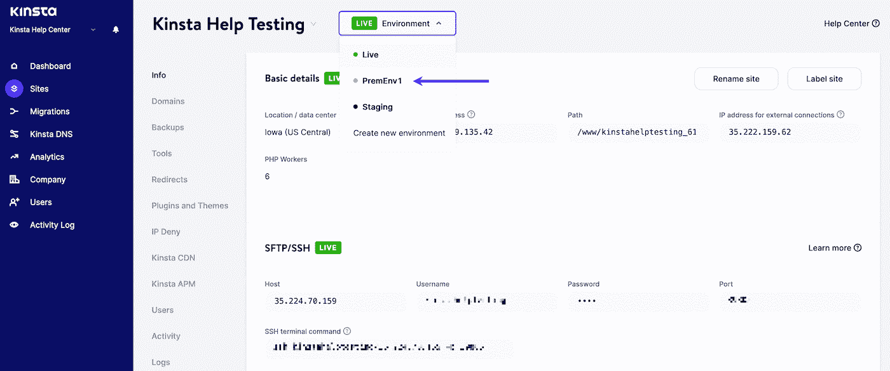

Selecting a premium staging environment in MyKinsta.


### 实施版本控制

版本控制是一个跟踪文件随时间变化的系统。这对于 WordPress 的开发很有价值，因为它允许你跟踪变化，并在必要时恢复到早期版本。

对大多数人来说，这意味着使用 [Git](https://kinsta.com/blog/git-for-web-development/) ，这是一个流行的版本控制系统。如果您不熟悉，Git 是一个免费的开源分布式版本控制系统，旨在快速高效地处理从小到非常大的项目。


Git


这在与大型分布式团队合作时尤其有用。你最不希望遇到的是你的*functions.php*文件的多个版本，在你的 WordPress 安装中，它们的名字都略有不同，因为很多人同时在做修改。

#### Git 与 GitHub

Git 是一个版本控制系统，一个管理你的源代码历史的工具。GitHub 是一家为使用 Git 的软件开发项目提供托管服务的公司。

它们是两个不同的东西，但是大多数人使用术语“Git”来指代 [Git 和 GitHub](https://kinsta.com/knowledgebase/git-vs-github/) 。

### 计划自动备份

WordPress 开发最重要的一个方面是备份。备份是至关重要的，因为如果出现问题，它们可以让你恢复你的站点。

有很多方法可以自动备份，但是最简单的方法之一是使用 WordPress 备份插件。有许多优秀的备份插件可用，但我们建议使用 [Kinsta 自动外部备份插件](https://kinsta.com/help/wordpress-backups/#external-backups-addon)。

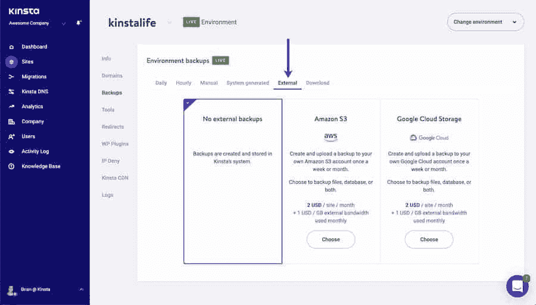

Kinsta Automated External Backups Add-on


这个插件会每天自动为你的 WordPress 站点创建备份，并将它们存储在外部服务器上。

### 利用林挺

林挺是[检查代码错误](https://kinsta.com/blog/code-review-tools/)的过程。这对 WordPress 的开发很有价值，因为它可以帮助你找到并修复代码中的错误。

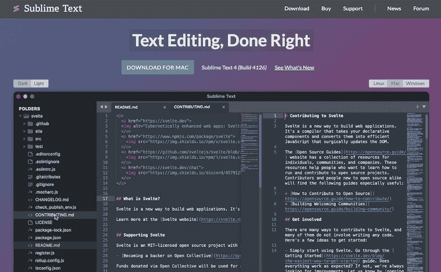

Sublime Text


许多代码编辑器会自动执行此操作，但是如果您想确保您的编辑器提供此功能，请考虑使用以下代码和文本编辑器之一:

*   这个代码编辑器有很多特性，包括林挺。
*   Atom :这个代码编辑器还内置了林挺。
*   Vim :这个文本编辑器还提供了林挺和许多其他功能。
*   [Visual Studio 代码](https://code.visualstudio.com/):这个代码编辑器默认有林挺可用。
*   PHPStorm :这是一个有林挺可用的付费开发环境。

### 使用代码生成器

一个[代码生成器](https://kinsta.com/knowledgebase/wordpress-code-generator/)是一个可以自动为你生成代码的工具。这对 WordPress 的开发很有价值，因为它可以节省你的时间，帮助你避免错误。

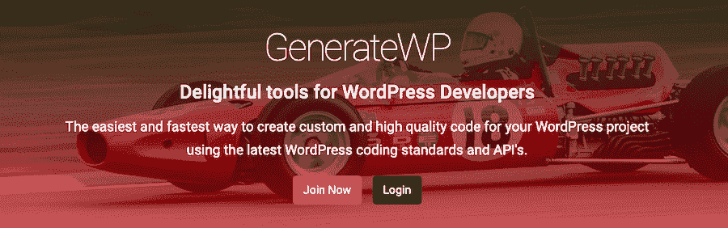

GenerateWP


有许多可用的代码生成器，但一些最流行的包括:

*   这个代码生成器可以为定制的文章类型、分类、元框等等生成代码。
*   这个代码生成器可以为定制的文章类型、分类和字段生成代码。
*   Nimbus Themes 代码生成器:这个代码生成器可以为定制的文章类型、分类和字段生成代码。

### 使用 WP-CLI

WP-CLI 是 WordPress 的命令行界面。这对 WordPress 的开发很有价值，因为它允许你从命令行管理你的 WordPress 站点。

当您需要执行重复性或需要很多步骤的任务时，这尤其有用。例如， [WP-CLI](https://kinsta.com/blog/wp-cli/) 可以用来[安装 WordPress](https://kinsta.com/knowledgebase/devkinsta/wp-cli/) ，创建帖子和页面，安装插件和主题等等。当您需要一次对多个站点进行更改时，这也很有帮助。

### 使用 WordPress 开发框架

WordPress 开发框架是一个可以帮助你简化工作流程的工具。这对 WordPress 的开发很有价值，因为它可以节省你的时间，帮助你避免错误。

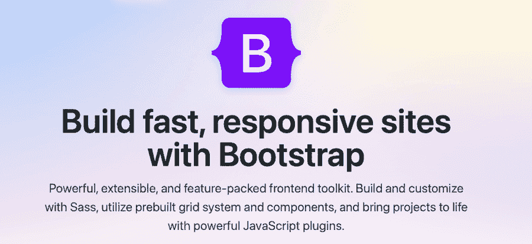

Bootstrap


有许多可用的 WordPress 开发框架，但是一些最流行的包括:

*   StudioPress 的这个框架旨在帮助你更快地建立 WordPress 网站。
*   [下划线](https://underscores.me/):这个来自[automatic](https://kinsta.com/blog/wordpress-statistics/)的框架旨在帮助你快速开始开发 WordPress 主题。
*   Zurb 的这个框架旨在帮助你创建响应迅速的 WordPress 网站。
*   来自 Twitter 的这个框架是为 WordPress 网站创建响应式设计的一个非常有用的方法。

### 使用任务运行器

任务运行器是一个可以自动执行任务的工具。这对 WordPress 的开发很有价值，因为它可以节省你的时间，帮助你避免错误。它还允许您同时运行多个任务。


Gulp


有许多可用的任务运行程序，但一些最流行的包括:

*   [Gulp](https://gulpjs.com/) :这个任务运行器可以用来自动化任务，比如 [CSS 预处理](https://kinsta.com/blog/optimize-css/)，JavaScript 林挺等等。
*   Grunt 是一个 Javascript 任务运行器，它可以帮助你自动化很多重复性的任务。
*   Webpack :这个任务运行器可以用来自动执行捆绑 JavaScript 文件等任务。

### 熟悉 Vue.js 或立即做出反应

尽管您可能不会马上使用 [Vue.js 或 React](https://kinsta.com/blog/vue-vs-react/) ，但现在熟悉这些框架是很重要的。这对于 WordPress 的开发是有价值的，因为随着时间的推移，它们变得越来越流行，被越来越多地使用。

Vue.js 是一个 [JavaScript 框架](https://kinsta.com/blog/javascript-libraries/)，允许你创建反应式用户界面。React 是一个用于构建用户界面的 JavaScript 库。

Vue.js 和 [React](https://kinsta.com/knowledgebase/what-is-react-js/) 都是 WordPress 开发的热门选择，因为它们快速、轻量、易于使用，并且对于将 WordPress 变成一个[无头 CMS](https://kinsta.com/blog/headless-wordpress/) 是必不可少的。

## 为什么花时间在 WordPress 工作流程规划上是至关重要的

WordPress 网站很复杂，在开始任何项目之前，有一个计划良好的工作流程是很重要的。通过花时间规划您的工作流程，您可以节省时间并避免未来的潜在问题。

规划你的 WordPress 工作流程有很多好处:

*   知道需要做什么可以节省时间。
*   你可以通过提前计划来避免潜在的问题。
*   您可以确保完成所有必要的任务。
*   您可以确保您的工作流程高效且有效。
*   您可以在将项目移交给合作者或客户时防止出现问题

花时间在 WordPress 工作流程规划上是至关重要的，因为它可以节省你的时间，帮助你避免潜在的问题。通过花时间规划您的工作流程，您可以确保所有必要的任务都已完成，并且您的工作流程高效且有效。


## 开发的理想 WordPress 工作流程

有很多方法可以实现 WordPress 工作流，但是有一些基本步骤应该包含在你的[开发过程](https://kinsta.com/blog/how-to-become-a-web-developer/)中。

### 步骤 1:设置本地开发环境

任何 WordPress 工作流程的第一步都应该是建立一个本地开发环境。这一点很重要，因为它允许你离线使用你的 WordPress 站点，这样可以节省时间并防止出错。

有很多方法可以建立一个本地开发环境，这取决于你更喜欢使用什么样的设置。为此，我们推荐 [DevKinsta](https://kinsta.com/devkinsta/) 。

我们建议使用 Kinsta Staging 和[Premium Staging Environments](https://kinsta.com/feature-updates/premium-staging-environments/)插件。这给了你一个完整的 WordPress 开发环境，一键激活。

您还可以同时处理多个项目，并在上线之前合并更改。它还带有内置的 [A/B 测试](https://kinsta.com/blog/wordpress-ab-testing-tools/)、插件兼容性测试和资源密集型测试，以进一步确保您的构建结构合理。

要开始使用 Premium Staging Environments 附加软件，您只需通过您的 Kinsta 帐户购买即可。要打开暂存环境，请转到 MyKinsta，然后单击屏幕顶部的**环境>创建新环境**。

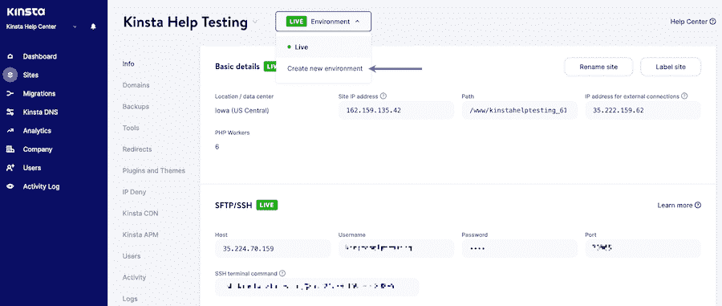

Create a new environment using the Premium Staging Development Add-on.


### 步骤 2:设置版本控制

任何 WordPress 工作流程的第二步都应该是设置[版本控制](https://kinsta.com/blog/wordpress-version-control/)。这很重要，因为它允许您跟踪代码的更改，并在必要时恢复到以前的版本。

## 注册订阅时事通讯


### 想知道我们是怎么让流量增长超过 1000%的吗？

加入 20，000 多名获得我们每周时事通讯和内部消息的人的行列吧！

[Subscribe Now](#newsletter)

为此，您可以使用类似于 [Git](https://kinsta.com/help/git/) 的工具。该过程如下所示

#### 1.在 GitHub 上创建一个资源库

要在 GitHub 上创建存储库，可以使用以下步骤:

1.  登录你的 GitHub 账号，点击右上角的 **+** 符号。
2.  从下拉菜单中选择**新存储库**。
3.  输入存储库的名称和描述，然后单击**创建存储库**。

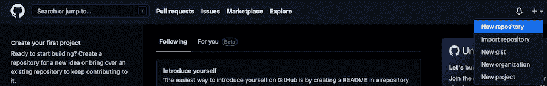

Create a repository on GitHub.


#### 2.将存储库克隆到您的本地开发环境中

在我们的例子中，我们将使用 DevKinsta 作为例子。

1.  在您的存储库的 GitHub 页面上，单击 **Clone 或 download** 按钮。
2.  在 **Clone with HTTPs** 部分，为您的存储库复制 [URL](https://kinsta.com/knowledgebase/what-is-a-url/) 。
3.  在您的开发环境中，打开一个终端，切换到您想要克隆存储库的目录。
4.  键入以下命令，替换从 Github 复制的 URL:

```
git clone https://github.com/YOUR_USERNAME/YOUR_REPOSITORY.git
```

这将把您的存储库克隆到您的本地开发环境中。

#### 3.添加文件并提交更改

1.  将您想要用 Git 跟踪的文件添加到您计算机上的存储库目录中。
2.  键入 **git add** 后跟文件名，或者使用 **git add。**添加目录中的所有文件。
3.  键入 **git commit -m** ，后跟一条描述您所做更改的消息。
4.  要将您的更改推送到 Github，请键入 **git push** 。

现在，您可以继续对电脑上的文件进行更改，并将它们推送到 GitHub。当你想从 Github 获取最新版本的文件时，你可以使用 **git pull** 命令。

如果你没有使用 GitHub，你也可以以类似的方式使用 [Bitbucket](https://kinsta.com/blog/bitbucket-vs-github/) 。

### 第三步:在当地发展

在你建立了你的本地开发环境和版本控制之后，是时候开始开发你的 WordPress 站点[了。](https://kinsta.com/blog/build-wordpress-site-offline/)

在本地开发时，您可以在发布之前在您的临时站点上测试更改。这一点很重要，因为它可以让你在任何错误影响到你的站点之前捕捉到它们。

要将本地开发环境中的变更推送到您的登台站点，您可以使用像 [DevKinsta](https://kinsta.com/devkinsta/) 这样的工具。这个工具使得只需点击几下鼠标就可以很容易地将变更从您的本地开发环境推送到您的临时站点。

### 步骤 4:使用 WP-CLI

WP-CLI 是 WordPress 的命令行界面，允许你从终端管理你的 WordPress 站点。这对于创建和管理用户、安装和更新插件等任务非常有用。

要安装 WP-CLI，请按照下列步骤操作:

1.  下载 **WP-CLI phar** 文件。
2.  将文件移动到路径中的一个目录(例如， */usr/local/bin* )。
3.  将文件重命名为 *wp* 。
4.  使文件可执行(例如， *chmod +x /usr/local/bin/wp* )。
5.  通过运行*WP–版本*测试 WP-CLI 是否已安装。

从那里，你可以使用 WP-CLI 从命令行管理你的 WordPress 站点。要获得完整的命令列表，您可以查看我们对 [WP-CLI v2](https://kinsta.com/blog/wp-cli/) 的深入指导。

### 第五步:用 Gulp 自动化你的工作流程

Gulp 是一个任务运行器，可以让你自动完成任务，比如缩小 CSS 和 JavaScript 文件，编译 Sass 文件等等。

要使用 Gulp，您首先需要在您的系统上全局安装它。为此，您需要 Node.js、 [npm](https://kinsta.com/knowledgebase/what-is-npm/) ，当然还有——Gulp。运行 [Node.js](https://kinsta.com/knowledgebase/what-is-node-js/) 中的[跟随命令](https://terencelucasyap.com/automate-your-development-workflow-using-gulp-part-1/):

```
npm install gulp-cli -g
```

一旦安装了 Gulp，就可以在项目的根目录下创建 gulpfile.js 文件。这个文件包含了 Gulp 任务的代码。

Struggling with downtime and WordPress problems? Kinsta is the hosting solution designed to save you time! [Check out our features](https://kinsta.com/features/)

例如，以下 gulpfile.js 文件包含一个缩小 CSS 文件的任务:

```
var gulp = require('gulp');
var cleanCSS = require('gulp-clean-css');
gulp.task('minify-css', function() {
 return gulp.src('src/*.css')
 .pipe(cleanCSS({compatibility: 'ie8'}))
 .pipe(gulp.dest('dist'));
});
```

要运行此任务，您可以使用以下命令:

```
gulp minify-css
```

### 第六步:使用林挺

林挺工具是静态代码分析工具，可以帮助您发现代码中的错误。出于本文的目的，我们将 [Atom.io](https://atom.io/) 与以下[林挺软件包](https://atom.io/packages)一起使用:

*   原子美化
*   原子-ternjs
*   剥绒机
*   林特-埃斯林特公司
*   linter-php
*   林特-萨斯-林特


Atom.io


在终端中，导航到要 lint 的目录，并运行以下命令:

```
find . -name "*.js" -o -name "*.scss" | xargs eslint --fix
```

这将 lint 项目中的所有 JavaScript 和 Sass 文件。

如果您想 lint 一个特定的文件，您可以运行以下命令:

```
eslint --fix file-name.js
```

用您想要 lint 的文件名替换 *file-name.js* 。

### 步骤 7:使用 CSS 预处理器

CSS 预处理器是一种工具，它允许你用不同的语言编写 [CSS](https://kinsta.com/blog/wordpress-css/) ，然后编译成 CSS。两个最流行的 CSS 预处理器是 [Sass](https://kinsta.com/blog/scripting-languages/) 和 Less。

在本教程中，我们将使用 Sass。要使用 Sass，首先需要[安装 Sass 命令行工具](https://sass-lang.com/guide)。为此，请运行以下命令:

```
gem install sass
```

一旦安装了 Sass，您可以使用以下命令将 Sass 文件编译成 CSS:

```
sass input.scss output.css
```

将 *input.scss* 替换为您的 Sass 文件名，将 *output.css* 替换为您想要创建的 css 文件名。

如果您想观察 Sass 文件的变化，并自动将它们编译成 CSS，您可以使用下面的命令:

```
sass --watch input.scss:output.css
```

用您的 Sass 文件的名称替换 *input.scss* ，用您想要创建的 css 文件的名称替换 output.css。

### 步骤 8:使用部署插件

部署插件是一个工具，它允许你轻松地将你的 WordPress 站点从本地开发环境部署到实时服务器上。

有许多不同的工具可以用于此目的，但我们建议使用 [WP 推进器](https://wppusher.com/)。WP Pusher 是一个免费的部署插件，你可以在你的 WordPress 站点上使用。

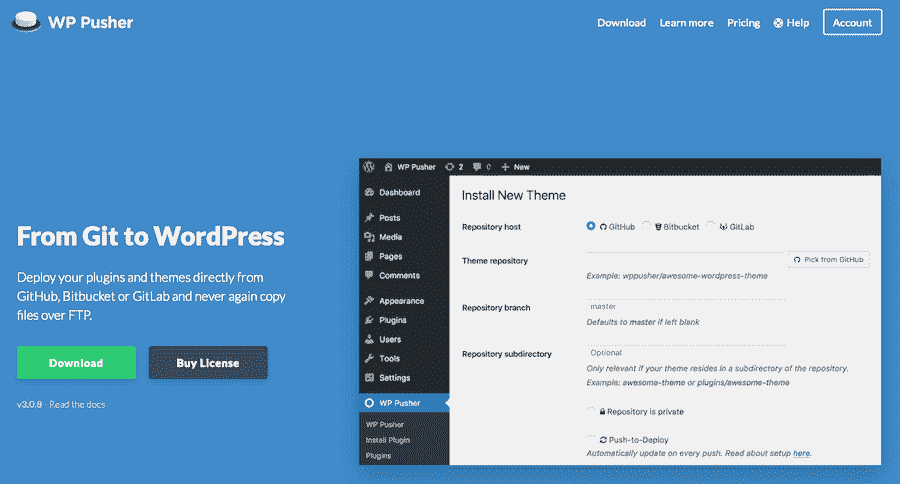

The WP Pusher


要安装 WP Pusher，首先，从 WP Pusher 网站下载 ZIP 文件。然后，登录你的 WordPress 网站，进入**插件>添加新的**。点击**上传插件**按钮，选择您刚刚下载的 ZIP 文件。一旦插件被安装并激活，你可以进入**设置> WP 推送器**进行配置。

一旦配置了 WP Pusher，你就可以[将 WordPress 插件和主题](https://kinsta.com/help/git/)部署到你的实时服务器上，而根本不需要与 FTP 接口交互，也不需要弄乱你的 [WordPress 数据库](https://kinsta.com/help/db-access/)。

### 步骤 9:利用 WordPress Rest API

WordPress REST API 是一个强大的工具，允许你从 WordPress 管理界面之外与你的 WordPress 站点交互。

WordPress REST API 可以用来为你的 WordPress 站点构建定制的解决方案。例如，您可以使用 WordPress REST API 为您的 WordPress 站点构建一个移动应用程序，或者创建一个定制的仪表板。

要开始使用 WordPress REST API，你需要通过 WordPress 命令行界面与它交互。我们[最近发布了一个关于如何设置 WordPress REST API 的教程](https://kinsta.com/blog/wordpress-rest-api/),可以带你完成每一步。

### 步骤 10:创建并遵循一个风格指南

风格指南是一套编码和设计你的 WordPress 站点的指南。风格指南有助于确保代码的一致性和易读性。

有许多不同的[风格指南](https://kinsta.com/blog/responsive-web-design/)可以用于你的 WordPress 项目。我们推荐使用 [WordPress 编码标准](https://developer.wordpress.org/coding-standards/wordpress-coding-standards/)作为起点。然而，随着时间的推移，您可能会进行大量的修改和添加。

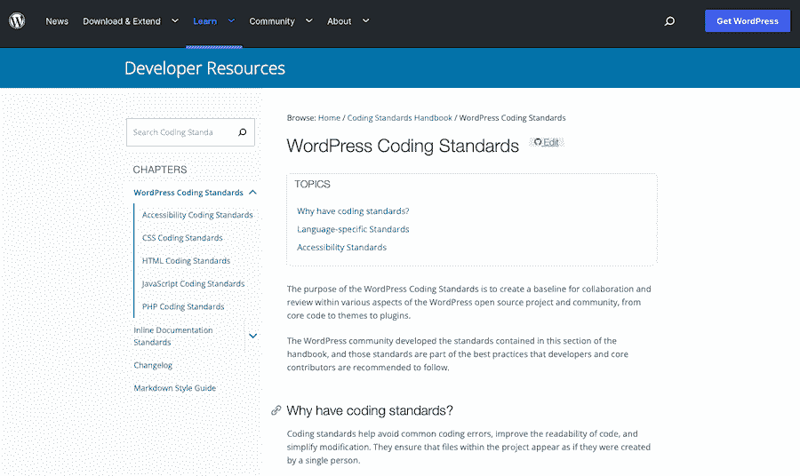

WordPress Coding Standards in the official WordPress Codex.


您创建的任何样式指南都可能一直在变化。但重要的一点是，它为团队中的所有开发人员提供了一组明确的步骤和指导方针。

本质上，你的风格指南应该是书面形式的 WordPress 工作流程。

### 第 11 步:将你的网站推向现场

一旦你完成了上面所有的步骤，你的 WordPress 站点就准备好被[实时推送](https://kinsta.com/help/push-staging-live/)。如果您使用的是像 WP Pusher 这样的部署插件，这个过程就像将代码推送到远程 Git 存储库一样简单。

你也可以在 Kinsta 中直接这样做，进入 **MyKinsta >站点**，选择你的站点，然后点击**环境动作**。从那里，点击**推送直播**。

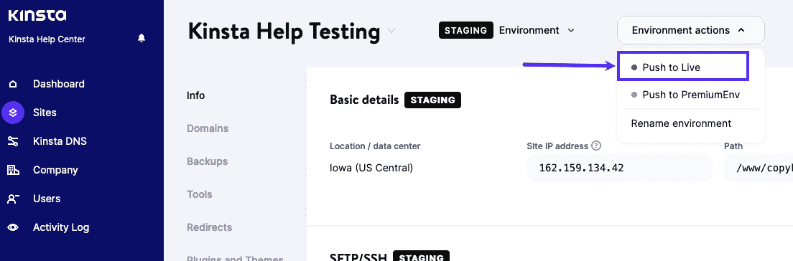

Pushing a site to a live server using Kinsta.


接下来，选中**文件**或**数据库**旁边的框(检查两者)，键入网站名称，然后点击**推送直播**。

如果您没有使用部署插件或 Git，您可以简单地从您的本地开发环境中导出您的 WordPress 数据库，并将其导入到您的实时服务器中。你可以在你的 WordPress 管理面板中进入**工具>导出**来完成。

然后，从导出选项中选择**所有内容**，点击**下载导出文件**按钮。一旦你有了你的数据库文件，你可以通过进入你的 WordPress 管理面板中的**工具>导入**将它导入到你的实时服务器中。选择您刚刚导出的数据库文件，点击**上传文件和导入**按钮。

你也可以使用像 [FileZilla](https://kinsta.com/blog/how-to-use-filezilla/) 这样的 [FTP 客户端](https://kinsta.com/blog/best-ftp-clients/)手动将你的 WordPress 文件从你的本地开发环境传输到你的实时服务器。简单地使用 FTP 连接到你的服务器，然后拖放你的 WordPress 文件到 *public_html* 目录。

一旦你将你的 WordPress 站点上线，你就可以花时间去测试所有的东西，确保所有的东西都能正常工作。

这也是确保 [Kinsta AMP](https://kinsta.com/apm-tool/) 正常运行的好时机。这个性能监控工具将会关注你的服务器性能，并确保你的站点尽可能快地运行。

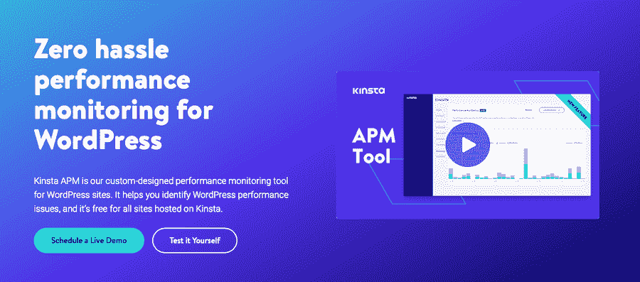

Kinsta AMP


[Create a WordPress site that is easy to maintain and update- without the messy code- with help from this guide.Click to Tweet](https://twitter.com/intent/tweet?url=https%3A%2F%2Fkinsta.com%2Fblog%2Fwordpress-workflow%2F&via=kinsta&text=Create+a+WordPress+site+that+is+easy+to+maintain+and+update-+without+the+messy+code-+with+help+from+this+guide.&hashtags=WordPress%2CDeveloper) ## 摘要

正如你所看到的，正确地创建一个 WordPress 开发工作流需要做很多事情。但是遵循这些步骤将有助于确保你的 WordPress 站点组织良好，易于管理，运行顺畅。

依靠像 [DevKinsta](https://kinsta.com/devkinsta/) 、[Premium Staging Environments add-on](https://kinsta.com/feature-updates/premium-staging-environments/)和 [Kinsta AMP](https://kinsta.com/apm-tool/) 这样的 Kinsta 产品不会出错。这些工具将使你的 WordPress 开发工作流程更加简单和高效。

关于创建一个 WordPress 开发工作流，你有什么问题吗？请在下面的评论中告诉我们！

* * *

让你所有的[应用程序](https://kinsta.com/application-hosting/)、[数据库](https://kinsta.com/database-hosting/)和 [WordPress 网站](https://kinsta.com/wordpress-hosting/)在线并在一个屋檐下。我们功能丰富的高性能云平台包括:

*   在 MyKinsta 仪表盘中轻松设置和管理
*   24/7 专家支持
*   最好的谷歌云平台硬件和网络，由 Kubernetes 提供最大的可扩展性
*   面向速度和安全性的企业级 Cloudflare 集成
*   全球受众覆盖全球多达 35 个数据中心和 275 多个 pop

在第一个月使用托管的[应用程序或托管](https://kinsta.com/application-hosting/)的[数据库，您可以享受 20 美元的优惠，亲自测试一下。探索我们的](https://kinsta.com/database-hosting/)[计划](https://kinsta.com/plans/)或[与销售人员交谈](https://kinsta.com/contact-us/)以找到最适合您的方式。