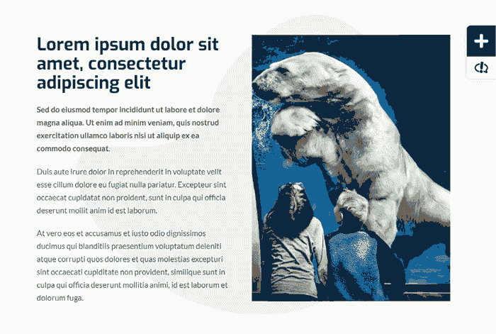
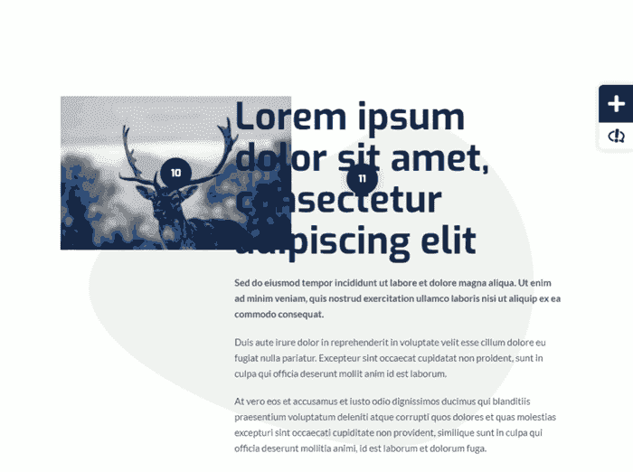
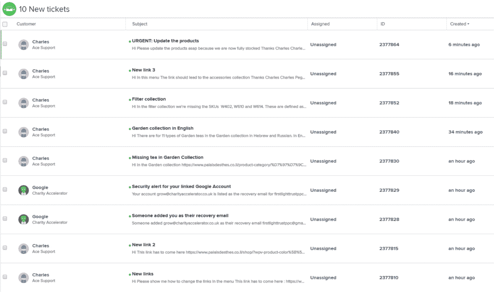
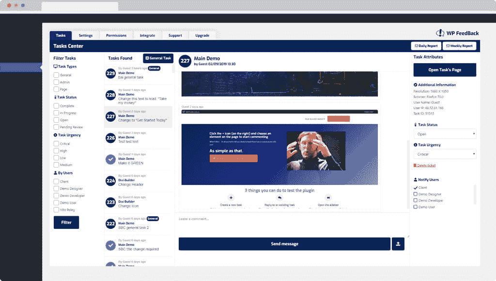
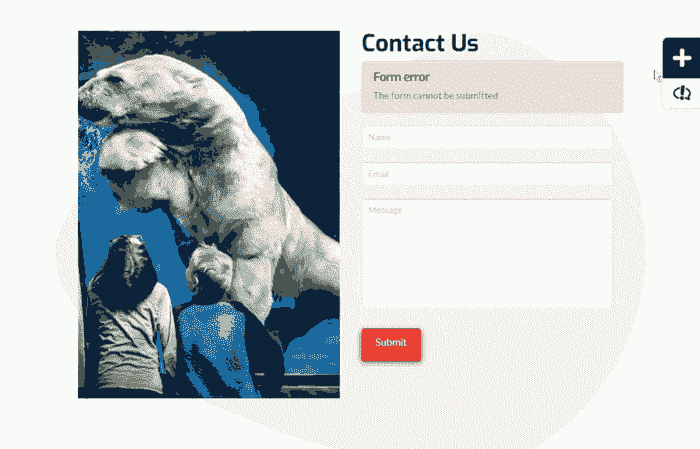

# 如何利用 WP 反馈改善您的客户沟通

> 原文：<https://kinsta.com/blog/wp-feedback-wordpress-plugin/>

在 WP FeedBack，我们非常熟悉与客户的互动是如何变得混乱的:使用多个不同的平台，收到一堆带有微小任务的[不同的电子邮件](https://kinsta.com/blog/how-to-use-mailchimp/)，迫使你在[电子表格](https://kinsta.com/clients/spreadsheeto/)中对它们进行分类…

这些都是离家近的吗？

我们绝不是将此归咎于你或客户，这是非常标准的做法，尤其是在网站业务中。尽管我们每天都在使用这些工具，但在询问我们需要什么来完成工作时，我们是专家，而我们的客户对他们来说是全新的。

向他们索要网站上某个部分的 5 行内容，而他们却给你发了 3 行，这可能会令人愤怒，但是他们并没有考虑内容更短的设计含义，为什么他们会有这种想法呢？

这就是我们创建 [WP 反馈](https://wpfeedback.co/)的原因，这是一个 WordPress 插件，可以让你的客户交流更加流畅。

## 在你客户的网站上进行视觉交流

当解释视觉上的东西时，试图让一个观点被理解是很棘手的。你和我都有优势，因为这是我们工作的一部分，是自然而然的。然而，对于我们的客户来说，他们从来没有解释过他们需要在某个特定的栏目上有更多的填充，这可能是令人沮丧的。

尤其是当他们已经试图解释时，你不得不[问更多的问题来验证](https://kinsta.com/blog/embed-google-form/)。根据我的经验，这是你和客户之间产生摩擦的主要原因。

> 需要在这里大声喊出来。Kinsta 太神奇了，我用它做我的个人网站。支持是迅速和杰出的，他们的服务器是 WordPress 最快的。
> 
> <footer class="wp-block-kinsta-client-quote__footer">
> 
> 
> 
> <cite class="wp-block-kinsta-client-quote__cite">Phillip Stemann</cite></footer>

[View plans](https://kinsta.com/plans/)

你的客户不再试图弄清楚如何使用你推荐的捕获软件，然后在屏幕截图上画出歪歪扭扭的箭头，并给出仍然没有意义的解释，他们只需在他们正在查看的页面上点击一个按钮进入评论模式，然后点击问题所在。

这将在他们单击的位置放置一个任务，并打开评论框，在这里他们将为该任务添加第一条评论:

WP Feedback plugin

在评论模式下，WP Feedback 突出显示鼠标光标所悬停的部分或元素，让你的客户确切地知道他们选择了什么(这是通过突出显示被悬停的 Div 来实现的)。

### 都在一个屋檐下

你可能已经尝试过，或者至少听说过一个平台正在试图解决同样的问题。这里不同的是 WP 反馈完全嵌入到 [WordPress](https://kinsta.com/blog/why-use-wordpress/) 中。它不是一个需要另一个网站才能正常运行的扩展，也不需要你上传每个页面的截图，并在每次更改后进行更新。

对我们来说，这是非常重要的一点。有这么多不同的工具，寻找一个最适合你和你的客户需要的工具会让你晕头转向。

### 正派

我知道你在想什么:“我的客户是否仍然能够创建 100 个任务，而我会有和以前一样的问题？”。这是一个有效的想法，我们在设计这个插件的工作方式时一直牢记这一点。

如果元素上已经存在任务，则不能为其创建另一个任务。这将鼓励你的客户明确他们想要什么，如果他们需要添加额外的点，而不是创建一个全新的任务来进行评论，他们可以对已经存在的任务进行评论。

No duplicated tasks in WP Feedback

我们插件背后的一个主要理念是我们喜欢称之为“开发流量”。这指的是当你和你的客户之间的交流达到了这样一个程度，你需要交换[多封电子邮件](https://kinsta.com/blog/email-marketing-best-practices/)，以便就你本可以在一封邮件中完成的事情达成一致。

所以，当你的客户已经习惯了这个插件，并且你们有了一个美好的交流关系，你的流量将会一帆风顺。

### 客户将拥有权力

WP 的反馈给了你的客户力量，当涉及到网页设计或内容时，他们不会因为自己缺乏经验而止步不前……无论他们需要你做什么。

这也是[向他们介绍 WordPress](https://kinsta.com/blog/learn-wordpress/) 的一个很好的入口。我们有一些客户甚至不想看到 [WordPress 仪表盘](https://kinsta.com/knowledgebase/wordpress-admin/)，所以让他们能够更高效，减少完成工作所需的平均联系次数，你就可以专注于重要的工作和[发展你的业务](https://kinsta.com/blog/bootstrapping-startup/)。

How WP Feedback manages emails and notifications

### 完全可定制

WP 反馈带有一个强大的仪表板，使您的工作流程顺畅。

具体来说，已经创建的每个任务都可以在“任务中心”中找到。它将向您显示所选任务的所有信息，同时为您提供更改任何属性的选项，并为所述任务的聊天添加更多评论。

还有一个过滤器，因此您可以只看到分配给特定用户的任务，或者只看到标记为“关键”的任务等。

The WP Feedback dashboard

这是一个非常方便的仪表板，可以查看网站上存在的任务，让你和你的客户完全控制一切。

如果你愿意，WP 反馈允许你通过两个简单的设置进行全面的品牌定制:a)替换徽标和 b)改变主色(提示:黑暗模式将在未来的更新中出现)。

## 注册订阅时事通讯

### 想知道我们是怎么让流量增长超过 1000%的吗？

加入 20，000 多名获得我们每周时事通讯和内部消息的人的行列吧！

[Subscribe Now](#newsletter)

### 牢记速度

当一个网站运行缓慢时，它会让用户非常恼火。这就是为什么作为一个管理工具，WP 反馈确保它只在你登录网站时才加载。这直接排除了用户遇到的[速度问题](https://kinsta.com/blog/website-speed-test/)。

为了进一步降低对速度的影响，在查看仪表板时，只有在单击一个任务后才会加载任务。当这种情况发生时，唯一被加载的任务。

WP 反馈还提供基于[用户角色](https://kinsta.com/blog/wordpress-user-roles/)的精细控制。例如，如果你的客户有外部的[自由撰稿人](https://kinsta.com/blog/best-tools-for-freelancers/)可能不需要看到/使用 WP 反馈，你可以很容易地将其设置为不包括这些承包商。

### 集成

因为 WP Feedback 是一个 [WordPress 插件](https://kinsta.com/best-wordpress-plugins)，它可以利用 Zapier 提供的所有精彩集成(超过 1000 个应用)。这是可能的，因为 Zapier 已经集成了 WordPress，你可以用它做一些令人惊奇的事情。

以下是几个例子:

*   Gmail:已经为插件设置了默认通知，使用 Gmail 与 Zapier 的集成，您还可以创建自己的自定义通知。
*   Google Sheets:自动将新任务添加到包含所有细节的电子表格中
*   Zendesk/TeamWork:每当客户创建一个新任务时，创建一个新的标签，这允许你继续使用你的帮助台和插件
*   [Slack](https://kinsta.com/blog/how-to-use-slack/) :有新评论后想给相关群发消息？你也可以这样做，甚至可以链接到发表评论的特定任务及其所在的页面。
*   Trello /Basecamp:当一个任务被创建后，也许你想在你用于这个特定项目的板上创建一张新的卡片。

通过 Zapier 还有许多其他的集成，使用 WordPress 的插件来触发它们是非常简单的。

### 为什么止步于设计阶段？

WP 反馈最初是出于支持目的而创建的，目的是取代来自客户的可怕的来回邮件轰炸，并为他们提供易于管理的任务“位置”。最重要的是，该插件将允许客户显示问题的确切位置，而无需做任何事情，只需点击并查明他们面临的确切问题。

但是事情变了…

厌倦了低于 1 级的 WordPress 托管支持而没有答案？试试我们世界一流的支持团队！[查看我们的计划](https://kinsta.com/plans/?in-article-cta)

当我们看到它在这种支持场景中节省了多少时间时，我们决定批准[内容](https://kinsta.com/blog/evergreen-content/)、设计和任何其他通常在客户和[网络专业人员](https://kinsta.com/blog/hire-wordpress-developer/)之间共享的资产也是完美的。

我们知道[保持 WordPress 的更新](https://kinsta.com/blog/how-to-update-wordpress-theme/)是多么重要，确保[的安全是好的和严密的](https://kinsta.com/blog/wordpress-security/)，并且你应该总是[保持插件最新](https://kinsta.com/knowledgebase/manually-update-wordpress-plugin/)。但是你认为你的客户真正理解这些重要任务的价值吗？足够支付你一个月的费用，而不需要你详细解释为什么他们应该加入你的护理计划？

有了 WP 的反馈，他们会直观地看到你不断支持的好处:如果他们有问题，他们所做的就是写评论，下次他们看网站时，问题就解决了(希望如此)。在他们的网站完成后，他们很难找到理由不让你继续支持他们。

How to add comments and assign them in WP Feedback

## 如何开始

一旦你在 WordPress 仪表盘上安装了插件，在设置页面会有一个安装向导，有几个步骤让你开始。

首先，它会要求您激活购买的许可证，该许可证会在您注册时放在您的电子邮件收件箱中。将会有一个链接将当前域名自动链接到你的账户，使这个过程尽可能的顺利。

该插件将检测你的网站上的用户角色，并让你勾选哪些用户角色应该被允许在前端发表评论。然后，您可以选择接收哪些通知。

最后，将播放一个简短的演示视频，详细说明插件是如何工作的以及如何正确使用它。记住这是给你的，WP 反馈也有一个完全独立的向导给你的客户，给他们一个使用插件的很好的介绍。

### 让您的客户开始

因此，让我们假设您已经在客户的网站上分配了管理员、编辑和作者角色作为评论者。当拥有这些角色之一的用户第一次进入一个页面时，在他们能够评论之前，一个向导将在前端自动启动。

它会询问他们的角色是什么，以及他们希望收到哪些通知，确保您的客户完全控制[哪些电子邮件到达了他们的收件箱](https://kinsta.com/blog/email-authentication/)。

就是这样，在他们发表第一条评论之前，它会显示一个 15 秒的简短教程，以及他们需要点击哪里才能开始…嘭，他们可以开始了！

### 总是听取反馈

在 WP 的反馈中，我们非常欢迎建议(尤其是在这个早期阶段)，因为我们在不断地实现和创新插件。有没有缺少一个你很想要的功能？请告诉我们:为此，我们有一个很酷的脸书团队。如果它是明确需要的东西，我们将在更新中开发请求的功能。

这甚至可以延伸到你的客户。也许你的一个客户真的想增加或改变一些东西，WP 的反馈鼓励这样做。毕竟，插件是一个反馈工具，有理由认为[客户反馈](https://kinsta.com/blog/customer-retention/#customer-feedback)是他们的关键价值之一。与你的客户谈论他们可能想要的功能，这对每个相关的人来说都是无价的信息。

[Need to gather feedback from your clients? Give @FeedbackWp a try and allow your clients to visually communicate with you! 🗣✍️Click to Tweet](https://twitter.com/intent/tweet?url=https%3A%2F%2Fkinsta.com%2Fblog%2Fwp-feedback-wordpress-plugin%2F&via=kinsta&text=Need+to+gather+feedback+from+your+clients%3F+Give+%40FeedbackWp+a+try+and+allow+your+clients+to+visually+communicate+with+you%21+%F0%9F%97%A3%E2%9C%8D%EF%B8%8F&hashtags=wordpresshelp%2Cclientwork)

## 摘要

有许多工具和网站可用于与客户沟通。

WP 反馈采取了不同的方法，因为它允许你的客户**与你**进行视觉交流，并且完全集成到你的 WordPress 仪表盘中。

最重要的是，当你开始使用 WP 反馈时，你不仅仅是一个用户，你成为了我们社区的一部分，在这里你可以与创作者和其他志同道合的用户交谈，甚至请求你认为会提高插件可用性的功能。

如果你想购买插件，你可以[在这里](http://wpfeedback.co/#start)购买。如果你想玩它，有一个演示版本供你在购买前测试。

现在，让我们听听你的看法:在与客户沟通时，你会遇到哪些问题？你如何解决它们？请在下面的评论中告诉我们！

* * *

让你所有的[应用程序](https://kinsta.com/application-hosting/)、[数据库](https://kinsta.com/database-hosting/)和 [WordPress 网站](https://kinsta.com/wordpress-hosting/)在线并在一个屋檐下。我们功能丰富的高性能云平台包括:

*   在 MyKinsta 仪表盘中轻松设置和管理
*   24/7 专家支持
*   最好的谷歌云平台硬件和网络，由 Kubernetes 提供最大的可扩展性
*   面向速度和安全性的企业级 Cloudflare 集成
*   全球受众覆盖全球多达 35 个数据中心和 275 多个 pop

在第一个月使用托管的[应用程序或托管](https://kinsta.com/application-hosting/)的[数据库，您可以享受 20 美元的优惠，亲自测试一下。探索我们的](https://kinsta.com/database-hosting/)[计划](https://kinsta.com/plans/)或[与销售人员交谈](https://kinsta.com/contact-us/)以找到最适合您的方式。