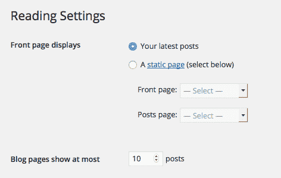
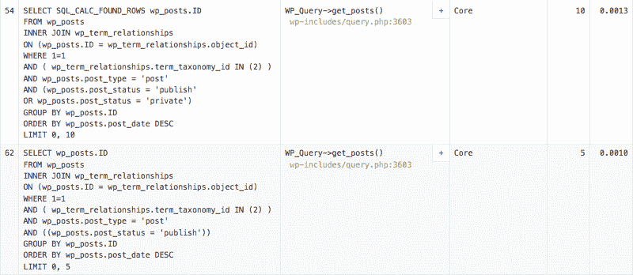

# 用 WP_Query 构建高效的 WordPress 查询

> 原文：<https://kinsta.com/blog/wp-query/>

作为 WordPress 开发者，我们经常需要从 [WordPress 数据库](https://kinsta.com/knowledgebase/wordpress-database/)中检索符合特定标准的帖子、页面和其他内容。通常，我们不需要构建 SQL 查询(通常我们不应该这样做)，因为`WP_Query`类及其方法为我们提供了一种从数据库中检索数据的安全有效的方法。我们只需要声明一个参数数组，而`$query`对象将构建实际的 SQL 查询。

在这篇文章中，我假设你已经知道了 [`WP_Query`](https://codex.wordpress.org/Class_Reference/WP_Query) 类的基础知识，它的[方法和属性](https://codex.wordpress.org/Query_Overview)，以及在哪里可以找到可用变量的列表。

我将重点介绍由`WP_Query`类提供的参数，这些参数专门用于优化 SQL 查询，减少执行时间和资源消耗。

当流量和内容有限时，我们通常不会关心查询的效率。WordPress 构建了优化良好的 SQL 查询，并提供了开箱即用的缓存系统。

当流量和网站内容显著增长——多达数千篇帖子——那么我们必须考虑查询执行时间。

*   [我们的工具箱](#toolbox)
*   [WP _ Query–为什么我们没有计算行数](#wp-query)
*   [缓存还是不缓存](#cache-or-not-cache)
*   [返回的字段](#returned-fields)

## 我们的工具箱

我将向您展示的代码已经用 [Query Monitor](https://kinsta.com/blog/query-monitor/) 进行了测试，这是一个免费插件，它提供了关于查询性能、触发挂钩、 [HTTP 请求](https://kinsta.com/blog/make-fewer-http-requests/)、重写规则等等的基本信息。

作为插件的替代，我们可以强制 WordPress 存储查询信息，在*wp-config.php*中声明以下常量:

```
define( 'SAVEQUERIES', true );
```

当`SAVEQUERIES`被设置为`true`时，WordPress 在`$wpdb->queries`数组中注册查询和一些有用的信息。因此，可以通过在模板文件*footer.php*中添加以下代码来打印调用者函数的名称和每个查询的执行时间:


> 需要在这里大声喊出来。Kinsta 太神奇了，我用它做我的个人网站。支持是迅速和杰出的，他们的服务器是 WordPress 最快的。
> 
> <footer class="wp-block-kinsta-client-quote__footer">
> 
> 
> 
> <cite class="wp-block-kinsta-client-quote__cite">Phillip Stemann</cite></footer>

[View plans](https://kinsta.com/plans/)

```
if ( current_user_can( 'administrator' ) ) {
	global $wpdb;
	echo '<pre>';
	print_r( $wpdb->queries );
	echo '</pre>';
}
```

以下是一个呼应的例子:

```
[4] => Array
(
	[0] => SELECT SQL_CALC_FOUND_ROWS  wp_posts.ID FROM wp_posts  WHERE 1=1  AND wp_posts.post_type = 'post' AND (wp_posts.post_status = 'publish' OR wp_posts.post_status = 'private')  ORDER BY wp_posts.post_date DESC LIMIT 0, 10
	[1] => 0.0163011550903
	[2] => require('wp-blog-header.php'), wp, WP->main, WP->query_posts, WP_Query->query, WP_Query->get_posts, QM_DB->query
	[trace] => QM_Backtrace Object
		( ... )
	[result] => 10
)

```

如果你想深入这个话题，看看我们的教程:[编辑 wp-config.php](https://kinsta.com/blog/wp-config-php/)。
最后，考虑一下插件和内置`SAVEQUERIES`功能都是开发工具，我们应该在生产环境中关闭它们。

话虽如此，让我们来看看如何加快 WordPress 查询。


## WP _ Query–为什么我们不计算行数

我们可以用`get_posts`函数查询数据库，该函数返回一组帖子，或者一个新的`WP_Query`对象实例。在这两种情况下，我们都可以通过为特定变量设置适当的值来确定查询的结果。

让我们从一个例子开始，这个例子展示了一个常见的循环，它通常出现在模板文件中:

```
// The Query
$the_query = new WP_Query( $args );
// The Loop
if ( $the_query->have_posts() ) {
	while ( $the_query->have_posts() ) : $the_query->the_post(); 
		// Your code here
	endwhile;
} else {
		// no posts found
}
/* Restore original Post Data */
wp_reset_postdata();

```

`$args`是键/值对的数组。这些对被命名为查询变量，它们决定或影响实际的 SQL 查询。
当从插件中查询数据库时，我们可能更喜欢使用`pre_get_posts`过滤器，如下例所示:

```
function myplugin_pre_get_posts( $query ) {
  if ( is_admin() || ! $query->is_main_query() ){
	return;
  }
  $query->set( 'category_name', 'webdev' );
}
add_action( 'pre_get_posts', 'myplugin_pre_get_posts', 1 );

```

这里需要注意的一件重要事情是，`$query`对象是通过引用传递的，而不是通过值传递的，这意味着查询参数只影响现有的`$query`实例。

`set`方法在查询规范中增加了一个新的查询变量，并强制 WordPress 从`webdev`类别中检索所有的文章。这是结果查询:

```
SELECT SQL_CALC_FOUND_ROWS wp_posts.ID
FROM wp_posts 
INNER JOIN wp_term_relationships
ON (wp_posts.ID = wp_term_relationships.object_id)
WHERE 1=1 
AND ( wp_term_relationships.term_taxonomy_id IN (12) )
AND wp_posts.post_type = 'post'
AND (wp_posts.post_status = 'publish'
OR wp_posts.post_status = 'private')
GROUP BY wp_posts.ID
ORDER BY wp_posts.post_date DESC
LIMIT 0, 10

```

在本例中，`LIMIT`值已由管理员用户在读取选项中设置，如下图所示。

## 注册订阅时事通讯


### 想知道我们是怎么让流量增长超过 1000%的吗？

加入 20，000 多名获得我们每周时事通讯和内部消息的人的行列吧！

[Subscribe Now](#newsletter)



在自定义查询中，我们可以通过[分页参数](https://codex.wordpress.org/Class_Reference/WP_Query#Pagination_Parameters) `posts_per_page`设置从数据库中检索的行数。

`SQL_CALC_FOUND_ROWS`选项强制查询计算找到的行数。这个数字将由 SQL 函数`FOUND_ROWS()`返回，如下例所示:

```
SELECT SQL_CALC_FOUND_ROWS * FROM tbl_name
WHERE id > 100 LIMIT 10;

SELECT FOUND_ROWS();

```

不幸的是，`SQL_CALC_FOUND_ROWS`会显著降低查询的执行时间。
好消息是，我们可以强迫 WordPress 删除提供未被充分使用(且未记录)的`no_found_rows`变量的选项。

如果省略了`SQL_CALC_FOUND_ROWS`，那么`FOUND_ROWS()`返回的行数将达到`LIMIT`的值(关于这个主题的更多信息，请参见 [MySQL 文档](http://dev.mysql.com/doc/refman/5.7/en/information-functions.html#function_found-rows))。

在一个只有几百个帖子的 WordPress 安装中，下面的元查询花费了 0.0107 秒:

```
SELECT SQL_CALC_FOUND_ROWS wp_posts.ID
FROM wp_posts 
INNER JOIN wp_postmeta
ON ( wp_posts.ID = wp_postmeta.post_id )
WHERE 1=1 
AND ( ( wp_postmeta.meta_key = 'book_author'
AND CAST(wp_postmeta.meta_value AS CHAR) LIKE '%Isaac Asimov%' ) )
AND wp_posts.post_type = 'book'
AND (wp_posts.post_status = 'publish'
OR wp_posts.post_status = 'private')
GROUP BY wp_posts.ID
ORDER BY wp_posts.post_date DESC
LIMIT 0, 10

```

移除`SQL_CALC_FOUND_ROWS`并将`no_found_rows`设置为 false，同样的查询花费了 0.0006 秒。

Struggling with downtime and WordPress problems? Kinsta is the hosting solution designed to save you time! [Check out our features](https://kinsta.com/features/)



Thanks to Query Monitor plugin, we can easily compare two queries with and without SQL_CALC_FOUND_ROWS option


当`wp_post`表包含数千行时，查询执行可能需要几秒钟。
**当我们不需要分页时，我们应该将`no_found_rows`设置为`true`，使查询运行得更快。**


## 缓存还是不缓存

WordPress 提供了一个开箱即用的内置缓存系统。尽管缓存通常可以提高页面加载速度，但它可能会导致对数据库运行一些额外的查询。此外，每当执行查询时，可能会请求大量不必要的数据。

幸运的是，WordPress 允许我们禁用缓存，提供三个[特定参数](https://codex.wordpress.org/Class_Reference/WP_Query#Caching_Parameters):

*   **cache_results** :是否缓存帖子信息。默认为真。
*   **update_post_meta_cache** :是否更新发布元缓存。默认为真。
*   **update_post_term_cache** :是否更新后期缓存。默认为真。

如果启用了持久缓存系统，比如 [Memcached](https://memcached.org/) ，我们就不必关心缓存参数，因为 WordPress 默认会将这些参数设置为 false。

在任何其他情况下，我们可以用下面的代码构建一个更快的查询:

```
function myplugin_pre_get_posts( $query ) {
  if ( is_admin() || ! $query->is_main_query() ){
	return;
  }
  $query->set( 'category_name', 'webdev' );

  $query->set( 'no_found_rows', true );
  $query->set( 'update_post_meta_cache', false );
  $query->set( 'update_post_term_cache', false );
}
add_action( 'pre_get_posts', 'myplugin_pre_get_posts', 1 );

```

当永久缓存系统不可用时，返回少量数据的查询不应被缓存。

## 返回的字段

一般来说，我们不应该在数据库中查询不必要的字段。`WP_Query`类提供了 fields 参数，允许将返回的字段限制为 id 或`'id=>parent'`字段。源文件[文档](https://core.trac.wordpress.org/browser/tags/4.5.2/src/wp-includes/query.php#L1494)将字段参数定义如下:

> 要返回的字段。单个字段或所有字段(字符串)，或字段数组。id=>parent '使用' id '和' post_parent '。默认所有字段。接受“ids”、“id=>parent”。

fields 变量接受`'ids'`和`'id=>parent'`，默认为*(任何其他值)，尽管你会注意到默认情况下 WordPress 会在几个查询中将该值设置为 ids。
最后，我们可以优化我们的第一个查询:

```
<?php
$args = array( 
	'no_found_rows' => true, 
	'update_post_meta_cache' => false, 
	'update_post_term_cache' => false, 
	'category_name' => 'cms', 
	'fields' => 'ids'
);
// The Query
$the_query = new WP_Query( $args );
$my_posts = $the_query->get_posts();

if( ! empty( $my_posts ) ){
    foreach ( $my_posts as $p ){
        // Your code
    }
}
/* Restore original Post Data */
wp_reset_postdata();
?>

```

**当不需要特定字段时，将返回的字段限制为 id。**

## 摘要

考虑到查询速度，对于几百个帖子的小网站来说，可能不会带来巨大的优势。如果你想为增长做好准备，或者你正在运行一个有昂贵查询的大型网站，你应该优化你的 WordPress 查询。低效的查询会大大降低页面加载速度，但是通过一些简单的调整，你可以大大提高网站的速度。

* * *

让你所有的[应用程序](https://kinsta.com/application-hosting/)、[数据库](https://kinsta.com/database-hosting/)和 [WordPress 网站](https://kinsta.com/wordpress-hosting/)在线并在一个屋檐下。我们功能丰富的高性能云平台包括:

*   在 MyKinsta 仪表盘中轻松设置和管理
*   24/7 专家支持
*   最好的谷歌云平台硬件和网络，由 Kubernetes 提供最大的可扩展性
*   面向速度和安全性的企业级 Cloudflare 集成
*   全球受众覆盖全球多达 35 个数据中心和 275 多个 pop

在第一个月使用托管的[应用程序或托管](https://kinsta.com/application-hosting/)的[数据库，您可以享受 20 美元的优惠，亲自测试一下。探索我们的](https://kinsta.com/database-hosting/)[计划](https://kinsta.com/plans/)或[与销售人员交谈](https://kinsta.com/contact-us/)以找到最适合您的方式。